# Technical Proposal

## Digital Riyal Pilot Orchestration and Control Framework

---

**Document Title:** Technical Proposal. Digital Riyal Pilot Orchestration and Control Framework

**Client:** SAMA Saudi Central Bank (Saudi Arabian Monetary Authority)

**Submission Date:** 2026-03-19

**Version:** 1.0

**Confidentiality:** Restricted. Commercial-Sensitive

**Prepared by:** SettleMint NV

---

> This document contains confidential and proprietary information of SettleMint NV. Distribution or reproduction without prior written consent is prohibited.

---

# Table of Contents

1. Executive Summary
2. About SettleMint
3. About DALP
4. Understanding SAMA Requirements
5. Proposed Solution: Digital Riyal Pilot Architecture
6. Technical Architecture
7. CBDC Orchestration and Control Infrastructure
8. Security, Governance, and Sovereign Controls
9. Integration with Saudi Financial Infrastructure
10. Deployment Model. KSA Data Sovereignty
11. Implementation Methodology
12. Training and Knowledge Transfer
13. Support and Service Levels
14. Risk Management
15. Compliance Matrix
16. Appendix A: Operating Model Detail
17. Appendix B: Security and Resilience
18. Appendix C: Integration Architecture

---

# 1. Executive Summary

## 1.1 Context and Strategic Drivers

The Saudi Central Bank (SAMA) has established itself as one of the most sophisticated central bank digital currency research and implementation organizations in the world. SAMA participated in Project Aber, the joint Saudi-UAE interbank CBDC project with the Bank for International Settlements, which provided direct operational evidence of wholesale CBDC feasibility in the Gulf context. The Digital Riyal pilot represents the next phase: moving from feasibility exploration to controlled production operation, with the full operational complexity that entails.

The Digital Riyal pilot under this RFP is a wholesale CBDC orchestration and control framework. This is not a retail payments application. The focus is on interbank settlement, monetary policy instrument delivery, and the operational infrastructure required for SAMA to maintain sovereign monetary control while enabling Saudi-licensed financial institutions to participate in a digitally-native payment and settlement system.

SAMA's procurement context is materially different from a commercial financial institution's. SAMA requires:
- **Sovereign control architecture:** SAMA must retain absolute control over money supply, participant access, and monetary policy parameters. No aspect of the Digital Riyal ecosystem can operate outside SAMA's sanctioned perimeter.
- **KSA data sovereignty:** All Digital Riyal infrastructure and data must reside within Saudi Arabia's territorial boundaries. Cloud deployments must use KSA-region infrastructure.
- **SAMA cyber resilience framework compliance:** SAMA's Cyber Security Framework establishes specific requirements for financial institutions operating critical infrastructure in Saudi Arabia.
- **Vision 2030 alignment:** The Digital Riyal pilot is part of Saudi Arabia's financial sector development program under Vision 2030, which positions digital finance infrastructure as a national strategic capability.

SettleMint proposes DALP, adapted to the CBDC orchestration context, as the technical foundation for SAMA's Digital Riyal pilot control framework. DALP's production-grade lifecycle management, configurable compliance enforcement, and sovereign deployment model directly address SAMA's requirements.

## 1.2 Why This Programme Is Hard

Wholesale CBDC orchestration for a sovereign central bank involves a category of operational and governance complexity that exceeds conventional financial institution deployments.

**Monetary sovereignty requirements:** Every aspect of the Digital Riyal system must be subject to SAMA's direct control. Participant onboarding, access revocation, supply issuance, distribution rules, and monetary policy parameters must be configurable exclusively by authorized SAMA staff with tamper-evident governance evidence. No technology partner, cloud provider, or participant bank can have an unauthorized access path to these controls.

**Fail-safe design requirements:** Unlike commercial banking systems, a wholesale CBDC system cannot have undefined failure modes. Every failure scenario, network partition, participant outage, processing queue backup, settlement failure, must have a documented, tested, and pre-approved resolution path that SAMA operations can execute without external dependency.

**Participant management at scale:** SAMA must onboard, manage, monitor, and where necessary revoke access for licensed financial institutions across Saudi Arabia. Participant lifecycle management must support SAMA's AML/KYC obligations, SAMA examination-grade evidence production, and regulatory reporting requirements.

**Project Aber continuity:** Where the Digital Riyal pilot builds on technical foundations from Project Aber (Hyperledger Besu, IBFT consensus), the architecture must support continuity of established patterns while enabling the expanded scope of a pilot programme.

## 1.3 Proposed Response

SettleMint proposes DALP deployed as the Digital Riyal pilot orchestration and control framework, configured specifically for SAMA's wholesale CBDC context:

**CBDC minting and supply control:** SAMA-exclusive minting authority with multi-party authorization, configurable supply caps, and tamper-evident issuance records. No participant bank can mint Digital Riyal; only SAMA-authorized operations can create or destroy supply.

**Participant lifecycle management:** Licensed financial institutions are onboarded through a SAMA-governed workflow with mandatory eligibility verification, KYC evidence, and participant wallet provisioning. Participant access can be suspended or revoked in real time through SAMA operations.

**Interbank settlement orchestration:** Atomic DvP settlement between participant banks using Digital Riyal as the settlement asset. Settlement instructions generated by participant banks are validated, compliance-checked, and executed through the DALP settlement engine with full audit evidence.

**Monetary policy instrument delivery:** Configurable distribution mechanisms for policy rate applications, reserve requirement management, and standing facility operations, all executed through SAMA-authorized workflows with governance evidence.

**KSA-region private cloud deployment:** All infrastructure deployed within Saudi Arabia on approved cloud provider infrastructure (AWS Middle East. Riyadh Region or Azure Saudi Arabia region), ensuring complete data sovereignty alignment.

The phased delivery runs 20 weeks for a wholesale CBDC pilot context, with additional time allocated for sovereign security review and SAMA IT governance approval gates.

## 1.4 Why SettleMint

SettleMint's credentials directly relevant to SAMA's Digital Riyal pilot:

- **Project Aber technical foundation:** DALP is built on Hyperledger Besu with IBFT 2.0 consensus, the same technical stack used in Project Aber. This continuity reduces integration risk for SAMA.
- **Central bank deployments:** DALP has been deployed for the Central Bank of UAE (Digital Dirham programme) and participated in BIS-linked CBDC research initiatives, providing direct sovereign institution delivery experience.
- **KSA regulatory familiarity:** SettleMint has engaged with Saudi-licensed financial institutions including Al Rajhi Bank and Saudi National Bank, providing operational knowledge of KSA regulatory expectations.
- **Sovereign data sovereignty capability:** Private cloud deployment within KSA-approved cloud regions with full SAMA-controlled key custody has been demonstrated in comparable sovereign deployments.

## 1.5 Reference Fit Snapshot

- **Central Bank of UAE. Digital Dirham Infrastructure (UAE):** Direct Gulf region central bank CBDC deployment. Sovereign control architecture, UAE data residency, Project Aber-adjacent technical foundations.
- **Project Aber (SAMA-BIS-CBUAE, 2019-2020):** Hyperledger Besu IBFT 2.0 platform, wholesale interbank settlement, cross-border CBDC research. Technical continuity with DALP.
- **Al Rajhi Bank. Sharia-Compliant Tokenized Products (KSA):** KSA deployment experience, SAMA regulatory awareness, Islamic finance compliance patterns.

---

# 2. About SettleMint

## 2.1 Company Overview

SettleMint NV is a Brussels-headquartered enterprise blockchain infrastructure company with regional presence in the UAE and other markets. The company has been building enterprise blockchain infrastructure since 2016 with a consistent focus on regulated financial institutions and sovereign entities.

## 2.2 Sovereign and Central Bank Credentials

| Credential | Detail |
|------------|--------|
| Central bank deployments | CBUAE Digital Dirham, BIS-linked CBDC research initiatives |
| CBDC-relevant experience | Project Aber technical stack alignment (Hyperledger Besu/IBFT 2.0) |
| KSA institutional experience | Al Rajhi Bank, Saudi National Bank deployments |
| Sovereign deployment model | KSA-region cloud deployment capability |
| ISO 27001, SOC 2 Type II | Security certifications applicable to sovereign review processes |

---

# 3. About DALP in the CBDC Context

## 3.1 Platform Architecture for Wholesale CBDC

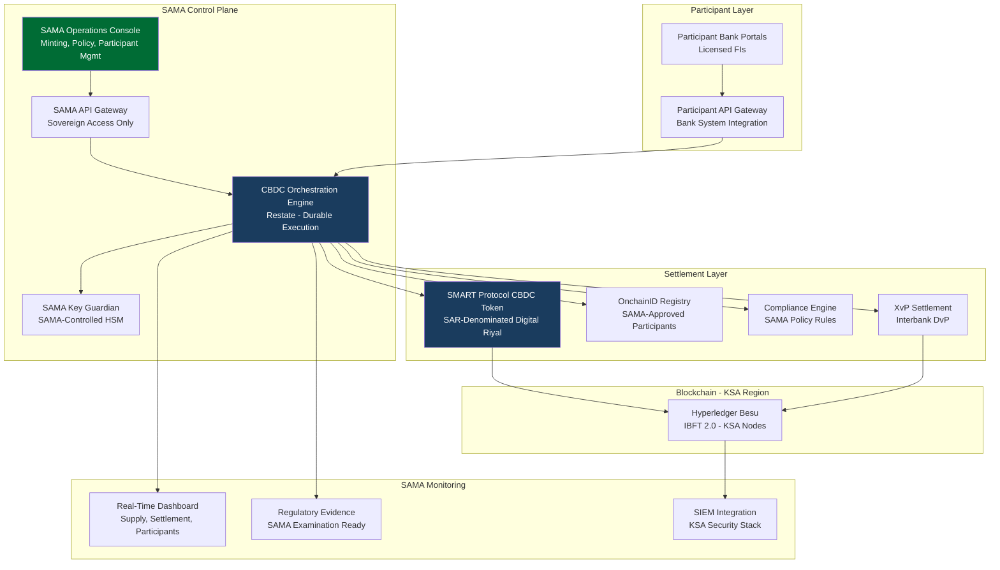

## 3.2 CBDC-Specific Lifecycle Pillars

**Supply issuance (minting):** SAMA-exclusive minting capability. Minting operations require SAMA multi-party authorization (minimum 2 of N SAMA authorized signers). Minting events are logged with SAMA operator identity, authorization reference, and supply state before/after. No participant bank has minting capability.

**Participant management:** Licensed financial institutions are onboarded through SAMA's participant registration workflow. OnchainID claims represent SAMA-verified participant status. Participant wallets are provisioned through SAMA authorization. Participant access suspension is immediate and SAMA-controlled.

**Interbank settlement:** XvP Settlement addon provides atomic delivery-versus-payment settlement for interbank transactions using Digital Riyal. Settlement is deterministic, either completes atomically or reverts cleanly. Failed settlement never results in inconsistent state across participants.

**Monetary policy instrument delivery:** Configurable distribution mechanisms support: overnight lending rate application, reserve requirement management, standing facility operations. All policy instrument operations are SAMA-initiated with mandatory governance evidence.

**Redemption and supply control:** SAMA can retire (burn) Digital Riyal supply through authorized operations. Supply reduction follows the same multi-party authorization pattern as issuance. Complete supply lifecycle, from minting through circulation through redemption, is auditable in full.

## 3.3 Key Differentiators for CBDC Context

| Feature | CBDC Application |
|---------|-----------------|
| ERC-3643 compliance engine | SAMA policy rules enforced before any transfer, no participant bypass possible |
| OnchainID participant registry | SAMA-controlled participant authorization; unauthorized entities cannot receive Digital Riyal |
| Durable execution engine (Restate) | No undocumented failure modes; every workflow has defined recovery path |
| SAMA-controlled key custody | SAMA holds all signing keys via KSA-approved HSM; SettleMint has no key access |
| Tamper-evident audit trail | Immutable on-chain evidence for SAMA examination and BIS oversight |

---

# 4. Understanding SAMA Requirements

## 4.1 SAMA's Digital Riyal Mandate

SAMA's Digital Riyal pilot is structured as a wholesale CBDC programme with four operational objectives:
1. Establish SAMA's technical capability to issue and manage digital currency
2. Enable licensed Saudi financial institutions to settle interbank obligations in Digital Riyal
3. Produce the operational evidence required for ongoing SAMA board oversight and potential international regulatory engagement (BIS, G20)
4. Build the operational foundation for a potential expanded retail or cross-border CBDC programme

## 4.2 Requirement Domain Mapping

| Domain | SAMA Requirement | DALP Coverage |
|--------|-----------------|---------------|
| Sovereign supply control | SAMA-exclusive minting/burning | Full, minting restricted to SAMA GOVERNANCE_ROLE |
| Participant management | Licensed FI onboarding, suspension, revocation | Full. OnchainID + SAMA participant admin |
| Interbank settlement | Atomic DvP in Digital Riyal | Full. XvP Settlement addon |
| Monetary policy delivery | Configurable rate/reserve mechanisms | Full. Yield and distribution addons |
| KSA data sovereignty | All data within KSA territory | Full. KSA-region private cloud |
| Examination readiness | SAMA board and BIS-grade evidence | Full, structured audit log export |
| Cyber resilience | SAMA Cyber Security Framework | Full, layered security model |
| SAMA IT governance | Internal approval gates | Full, evidence packs for SAMA IT review |

## 4.3 Key Challenges

**Challenge 1: Sovereign key custody architecture**
SAMA requires that all Digital Riyal signing keys remain under SAMA's exclusive control within KSA boundaries. SettleMint's Key Guardian Tier 3 model places all signing key material in a SAMA-controlled HSM within KSA. SettleMint has no access to signing keys in this configuration.

**Challenge 2: Fail-safe settlement design**
SAMA requires documented failure resolution for every settlement failure scenario. DALP's durable execution engine (Restate) ensures that every workflow has a defined state machine with explicit failure paths. All failure scenarios are handled by documented runbooks with SAMA-controlled resolution.

**Challenge 3: Participant access real-time control**
SAMA must be able to suspend or revoke a participant bank's Digital Riyal access in real time without settlement disruption for other participants. DALP's OnchainID compliance model enables immediate access revocation that takes effect for all subsequent transfers without requiring network-wide operations.

**Challenge 4: BIS and international regulatory evidence**
The Digital Riyal pilot may be subject to BIS assessment and international CBDC research engagement. DALP's structured audit evidence export and configurable reporting framework supports the evidence requirements of BIS CBDC research and G20 digital finance oversight.

---

# 5. Proposed Solution: Digital Riyal Pilot Architecture

## 5.1 CBDC Token Design

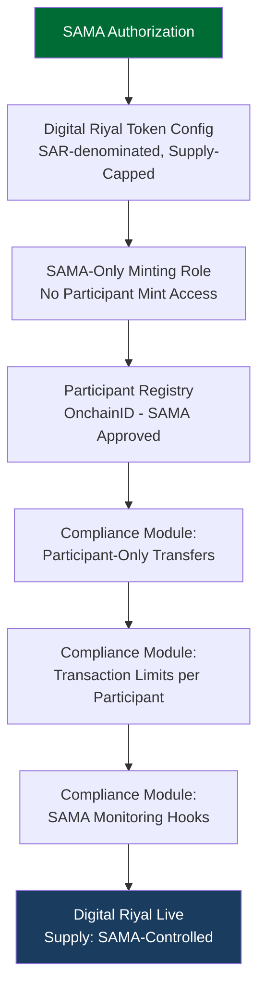

**Digital Riyal token configuration:**
- Asset type: DALPAsset (configurable). Stablecoin or custom SAR-denominated instrument
- Compliance modules: participant-only transfer (only SAMA-registered FIs can hold or transfer), transaction limit per participant (configurable per SAMA policy), mandatory monitoring notification (webhook on every transfer for SAMA real-time dashboard)
- Token features: historical balances (for SAMA position reporting at any historical date), supply cap (total Digital Riyal in circulation never exceeds SAMA-authorized supply)
- Minting: GOVERNANCE_ROLE held exclusively by SAMA, stored in KSA HSM
- Burning: Same GOVERNANCE_ROLE authorization required for supply reduction

## 5.2 Participant Lifecycle

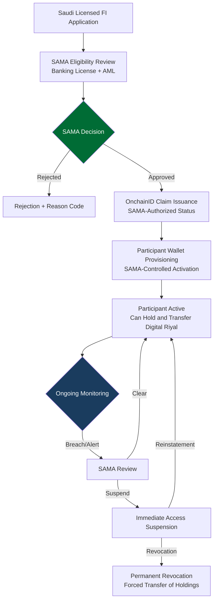

## 5.3 Interbank Settlement Flow

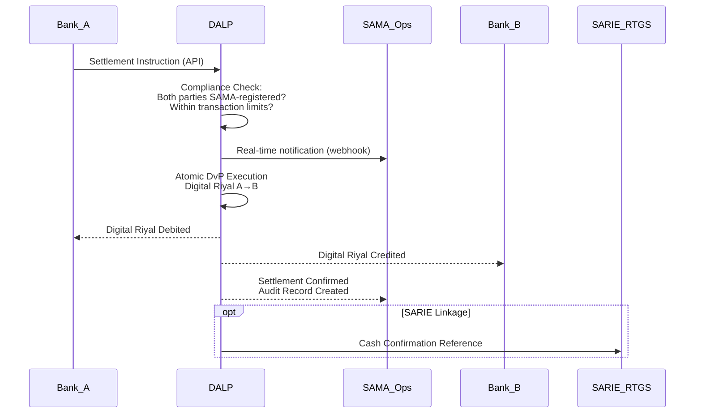

## 5.4 Monetary Policy Instrument Delivery

**Interest rate / profit rate application:**
- DALP's Yield addon is configured for SAMA's policy rate application mechanism
- Rate parameters are SAMA-controlled configuration (not participant-accessible)
- Rate change events require SAMA multi-party authorization with governance evidence

**Reserve requirement management:**
- Reserve balance monitoring through real-time SAMA dashboard
- Reserve requirement thresholds configurable by SAMA operations
- Participant reserve position alerts sent to SAMA monitoring

**Standing facility operations:**
- Overnight lending and deposit facility operations executed through SAMA-initiated distribution events
- Collateral verification hooks for secured lending operations
- Maturity redemption for time-limited facility instruments

## 5.5 SAMA Monitoring and Real-Time Dashboard

SAMA requires real-time visibility into the Digital Riyal ecosystem:

| Dashboard View | Data | Frequency |
|---------------|------|-----------|
| Total supply | Current minted Digital Riyal vs authorization | Real-time |
| Participant positions | Each participant's Digital Riyal balance | Real-time |
| Settlement velocity | Transaction count and value per time window | Real-time |
| Compliance alerts | Transfer rejections, limit breaches, anomalies | Real-time (push) |
| Participant status | Active/suspended/revoked per participant | Real-time |
| Policy instrument status | Active rate applications, reserve compliance | Real-time |

---

# 6. Technical Architecture

## 6.1 Sovereign Architecture Principles

For SAMA's Digital Riyal pilot, DALP's standard architectural principles are extended with:

**Sovereign isolation:** SAMA's operational environment is completely isolated from SettleMint's shared infrastructure. There are no shared networks, databases, or API endpoints between SAMA's deployment and any other SettleMint client.

**Key sovereignty:** All cryptographic signing keys are stored in SAMA-controlled HSM within KSA. SettleMint software can request signing operations through the Key Guardian framework but cannot access, copy, or export key material.

**Minimal external dependency:** The Digital Riyal pilot deployment minimizes external dependencies. Only approved cloud infrastructure and SAMA-controlled cryptographic services are in the critical path.

## 6.2 Four-Layer Architecture with Sovereign Extensions

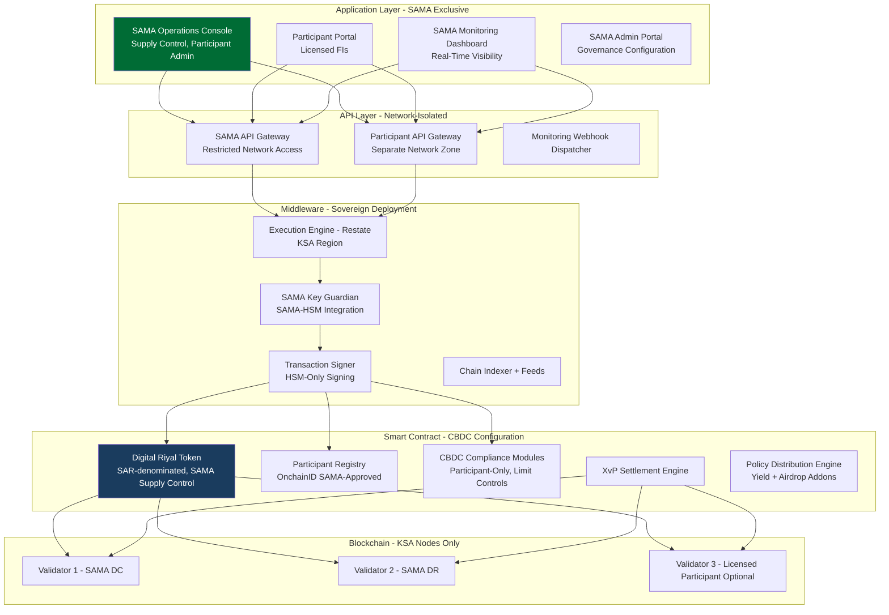

## 6.3 KSA Data Architecture

All Digital Riyal data is classified as sovereign financial data subject to SAMA's data governance requirements and KSA data localization laws (Personal Data Protection Law, Royal Decree No. M/19):

| Data Category | Storage Location | Encryption | Retention |
|--------------|-----------------|-----------|-----------|
| Digital Riyal balances (on-chain) | KSA blockchain nodes | EVM native + AES-256 backup | Permanent |
| Transaction records | KSA region database | AES-256 | Permanent (SAMA examination) |
| Participant identity (OnchainID) | KSA region | AES-256 + field-level | SAMA policy |
| SAMA operational logs | KSA SIEM | AES-256 | Permanent |
| Key material | SAMA-controlled KSA HSM | HSM native | SAMA lifecycle |

## 6.4 KSA Network Topology

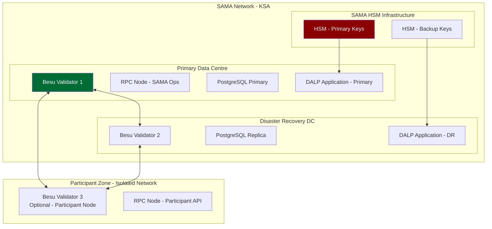

## 6.5 Transaction Lifecycle

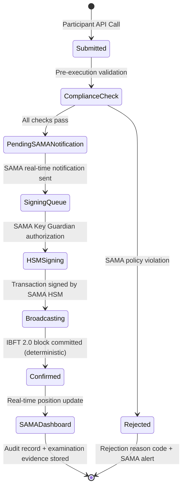

---

# 7. CBDC Orchestration and Control Infrastructure

## 7.1 Supply Lifecycle Management

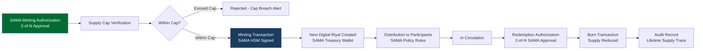

## 7.2 SAMA Governance Enforcement

Every supply management operation requires SAMA multi-party authorization. The governance model for the Digital Riyal pilot:

| Operation | Authorization Required | Evidence Record |
|-----------|----------------------|-----------------|
| Mint Digital Riyal | 2 of N SAMA authorized signers | Issuance event + authorization reference |
| Burn Digital Riyal | 2 of N SAMA authorized signers | Redemption event + authorization reference |
| Onboard participant | SAMA participant admin sign-off | Onboarding record + eligibility evidence |
| Suspend participant | SAMA compliance officer | Suspension event + reason code |
| Revoke participant | SAMA senior officer + compliance | Revocation event + forced transfer record |
| Change policy rate | SAMA monetary policy officer | Rate change event + effective date |
| Change supply cap | SAMA senior officer | Cap change event + authorization |

## 7.3 SARIE Integration

Saudi Arabia's SARIE (Saudi Arabia Interbank Express) system provides RTGS infrastructure for conventional interbank settlement. The Digital Riyal pilot's integration with SARIE addresses the cash leg of hybrid Digital Riyal transactions:

- Settlement instructions reference SARIE transaction identifiers for payment confirmation
- DALP receives SARIE payment confirmation before triggering Digital Riyal token delivery
- Reconciliation between DALP Digital Riyal positions and SARIE records is generated as a daily extract for SAMA operations review

---

# 8. Security, Governance, and Sovereign Controls

## 8.1 SAMA Cyber Security Framework Alignment

SAMA's Cyber Security Framework (CSF) establishes requirements for financial institutions and technology providers operating in KSA. DALP's security model is aligned to the CSF across five domains:

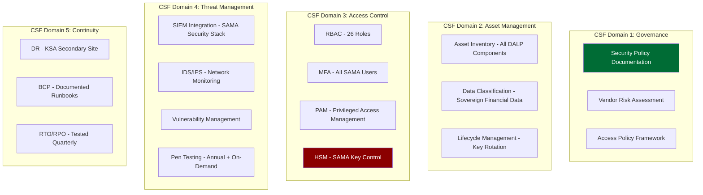

## 8.2 Key Sovereignty Architecture

The Key Guardian in SAMA's deployment operates at Tier 3 (fully SAMA-controlled):

1. **Key generation:** All signing keys generated in SAMA-controlled HSM (Thales Luna or equivalent KSA-certified HSM)
2. **Key storage:** Keys never leave the HSM. DALP's Key Guardian communicates with HSM via authenticated API but cannot extract key material
3. **Signing operations:** DALP signs transactions by passing transaction payloads to the HSM, which returns signatures without exposing key material
4. **Key backup:** Key backup encrypted under SAMA-controlled backup key, stored in physically separate KSA facility
5. **Key ceremony:** Initial key ceremony performed by SAMA authorized personnel; SettleMint provides process support but is not present during key material generation

**SettleMint access to SAMA system:** SettleMint support engineers access the SAMA deployment through a dedicated, logged, time-bounded remote access channel. All support sessions require SAMA authorization, are logged in full, and are subject to retrospective review. SettleMint cannot access the blockchain nodes, signing keys, or production database without SAMA-issued credentials.

## 8.3 Tamper-Evidence and Examination Readiness

The Digital Riyal pilot must produce evidence suitable for SAMA board reporting, BIS engagement, and potential future international regulatory assessment:

| Evidence Category | DALP Output | SAMA Examination Suitability |
|-----------------|-------------|------------------------------|
| Complete supply history | Every mint and burn event with authorization chain | Full, immutable on-chain record |
| Participant transaction history | All transfers with counterparties, amounts, timestamps | Full, indexed and exportable |
| Policy instrument delivery | All rate applications and distribution events | Full, authorized event record |
| Compliance decision log | All participant-only transfer checks and results | Full, per-transaction evidence |
| SAMA operator audit log | All SAMA administrative actions with identity | Full. SAMA-side audit trail |
| Key management log | HSM access events, signing operations | Full. HSM audit trail |

## 8.4 KSA Personal Data Protection Law Compliance

Royal Decree No. M/19 (Saudi Personal Data Protection Law, PDPL) establishes data governance requirements for personal data processed within KSA. For the Digital Riyal pilot:
- Participant entity data (financial institution records) is commercial data, not personal data, treated under SAMA's financial data governance framework
- Individual transactors' data (if retail scope expands) would require PDPL compliance: consent, purpose limitation, access rights, data localization
- All data remains within KSA, data localization requirement is fully satisfied by KSA-region private cloud deployment

---

# 9. Integration with Saudi Financial Infrastructure

## 9.1 SARIE Integration Architecture

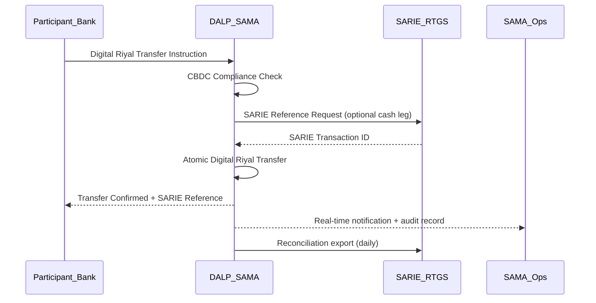

## 9.2 SAMA IT Infrastructure Integration

| SAMA System | Integration Pattern | Direction |
|-------------|---------------------|-----------|
| SAMA IAM/Active Directory | SAML 2.0/OIDC Federation | Inbound (SAMA staff auth) |
| SAMA SIEM | Structured log stream | Outbound (security events) |
| SAMA Monitoring | Real-time dashboard | Bidirectional |
| SARIE RTGS | ISO 20022 reference exchange | Bidirectional |
| SAMA Reporting | Structured batch extract | Outbound |
| Participant Bank APIs | OpenAPI 3.1 (Participant Gateway) | Inbound |

## 9.3 Data Flow Architecture

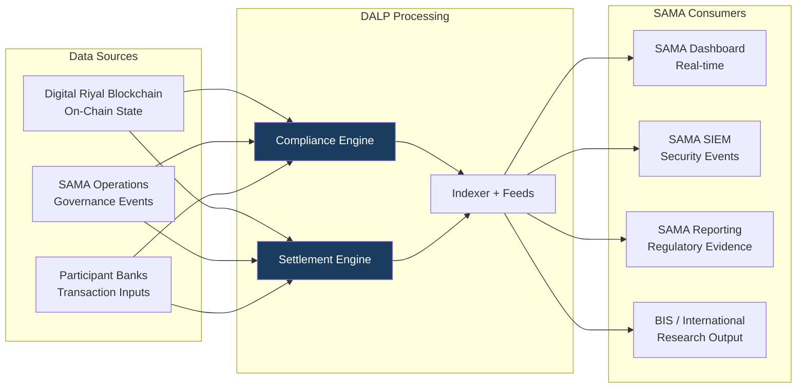

---

# 10. Deployment Model: KSA Data Sovereignty

## 10.1 KSA-Region Private Cloud Deployment

All Digital Riyal pilot infrastructure is deployed exclusively within Saudi Arabia:

**Recommended cloud infrastructure:** AWS Middle East. Riyadh (me-south-1) or Azure UAE Saudi Arabia region. Both options provide KSA-territory infrastructure with SAMA-approved security certifications.

**Deployment topology:**

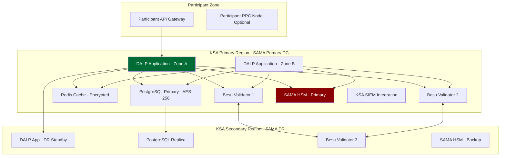

## 10.2 Availability Targets for CBDC Infrastructure

| Metric | Target | CBDC Justification |
|--------|--------|-------------------|
| Uptime | 99.95% | CBDC infrastructure requires higher than standard SLA |
| RTO | < 2 hours | Interbank settlement cannot be disrupted for extended periods |
| RPO | < 15 minutes | Digital Riyal balance records require near-continuous replication |
| DR test | Monthly | CBDC criticality requires more frequent DR validation |
| Blockchain finality | Deterministic (IBFT 2.0) | No probabilistic settlement, required for CBDC |

---

# 11. Implementation Methodology

## 11.1 CBDC-Specific Implementation Timeline

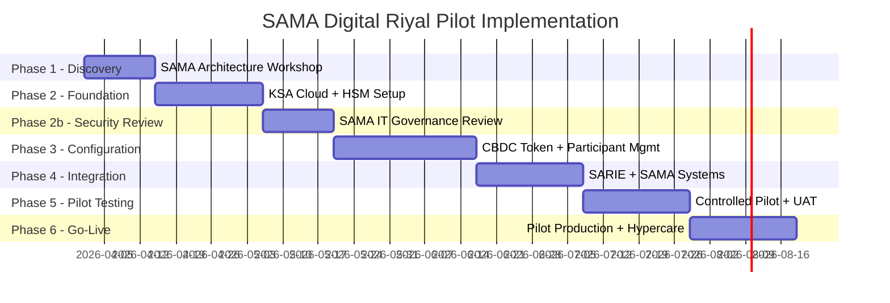

**Note:** The SAMA implementation includes an additional Phase 2b (SAMA IT Governance Review) not present in commercial exchange deployments. This gate reflects SAMA's internal security and IT governance approval process, which must be completed before production configuration work begins. Total timeline: 20 weeks.

## 11.2 Phase Summary

| Phase | Duration | Key Deliverables | Gate |
|-------|---------|-----------------|------|
| Phase 1. Discovery | 2 weeks | CBDC architecture specification, SARIE integration design, governance framework | SAMA Programme Director sign-off |
| Phase 2. Foundation | 3 weeks | KSA cloud infrastructure, HSM commissioning, base platform | SAMA IS team: infrastructure sign-off |
| Phase 2b. Security Review | 2 weeks | SAMA IT governance approval of architecture and access model | SAMA CIO/CISO approval gate |
| Phase 3. Configuration | 4 weeks | Digital Riyal token configured, participant management active, policy controls configured | SAMA Compliance/Monetary Policy sign-off |
| Phase 4. Integration | 3 weeks | SARIE integration, SAMA dashboard, SIEM integration, monitoring | SAMA Technology sign-off |
| Phase 5. Pilot Testing | 3 weeks | Controlled pilot with SAMA internal participants, UAT, security test | SAMA Programme Director certificate |
| Phase 6. Production + Hypercare | 3 weeks | Production go-live (licensed participant banks), hypercare, knowledge transfer | Operational readiness sign-off |

**SAMA IT governance pre-engagement:** To reduce the Phase 2b review timeline, SettleMint will provide SAMA's IT governance and IS teams with a pre-submission evidence pack at Phase 1 completion. This pack will include: platform architecture diagrams, access control matrix, HSM integration design, KSA data flow map, and ISO 27001/SOC 2 Type II certificates. Pre-sharing this evidence enables the IT governance team to begin their assessment concurrent with Phase 2 foundation work, rather than sequentially after it.

**Islamic banking settlement support:** Several Saudi licensed financial institutions operating as participant banks in the Digital Riyal pilot may be operating under Islamic banking licenses (Al Rajhi Bank, Saudi Finance, Bank AlJazira). For these participants, the platform's payment settlement model can be configured to reference profit-based rather than interest-based terminology in all participant-facing documentation, reporting, and correspondence. This is a configuration parameter, not a development requirement, and is aligned with AAOIFI guidance on digital currency settlement.

## 11.3 SAMA Resource Requirements

| Role | SAMA Person-Days |
|------|----------------|
| Programme Director (SAMA IT/Innovation) | 25 |
| Technology/Integration team | 50 |
| Information Security team | 20 |
| Monetary Policy team (policy config review) | 15 |
| Operations team | 20 |
| Internal audit (evidence review) | 10 |
| **Total** | **140** |

---

# 12. Training and Knowledge Transfer

| Track | Audience | Duration | Notes |
|-------|---------|---------|-------|
| SAMA Operator | SAMA operations staff | 3 days | Minting, participant management, monitoring |
| SAMA Compliance | SAMA compliance officers | 2 days | Participant suspension/revocation, evidence extraction |
| SAMA Technology | IT/integration team | 3 days | Platform administration, SARIE integration maintenance |
| Participant Onboarding | Licensed FI technical teams | 1 day | API integration, settlement workflow |

All training delivered in English with Arabic documentation support.

---

# 13. Support and Service Levels

For CBDC infrastructure, SettleMint recommends Enterprise Support with CBDC-enhanced SLA:

| Metric | Standard Enterprise | CBDC-Enhanced |
|--------|---------------------|---------------|
| Uptime | 99.9% | 99.95% |
| P1 response | 1 hour | 30 minutes |
| P1 resolution | 4 hours | 2 hours |
| DR test | Quarterly | Monthly |
| SAMA dedicated support channel | Standard Slack | Dedicated encrypted channel |
| SAMA-side support contact | Named CSM | Named CSM + Technical Lead |

---

# 14. Risk Management

| ID | Risk | Likelihood | Impact | Mitigation |
|----|------|-----------|--------|-----------|
| R-01 | HSM commissioning and key ceremony scheduling delays Phase 2 | Medium | High | HSM selection and procurement initiated in Phase 1; interim Tier 2 option available for non-production testing |
| R-02 | SAMA IT governance review extends Phase 2b beyond 2 weeks | Medium | Medium | Evidence pack pre-prepared (architecture diagrams, security model, access control matrix) |
| R-03 | SARIE integration requires non-standard message mapping | Low | Medium | SARIE technical specification obtained in Phase 1 |
| R-04 | KSA cloud region capacity or certification gap | Low | High | AWS me-south-1 and Azure KSA both confirmed for financial services; on-premises fallback available |
| R-05 | Participant bank connectivity scope broader than estimated | Medium | Medium | Discovery workshop maps all integration requirements |
| R-06 | Regulatory classification of Digital Riyal pilot scope changes during implementation | Low | High | DALP's configurable compliance modules allow rule changes without redevelopment |
| R-07 | SAMA cyber security assessment requires additional security controls | Medium | Medium | SAMA CSF alignment pre-verified; additional controls configurable without platform changes |
| R-08 | BIS engagement requires specific evidence format not pre-built | Low | Low | BIS CBDC research evidence requirements are documented; custom report can be developed in Phase 5 |

---

# 15. Compliance Matrix

| Req ID | Requirement | Status | Response |
|--------|-------------|--------|---------|
| REQ-01 | Segregated environments | Full | 4 environments + pilot environment in KSA |
| REQ-02 | API-first, eventing | Full | OpenAPI 3.1, webhooks, SAMA monitoring |
| REQ-03 | RBAC, maker-checker, audit | Full | 26 roles, CBDC-specific minting controls |
| REQ-04 | Configurable lifecycle | Full | CBDC supply controls, participant management |
| REQ-05 | Third-party dependencies | Full | KSA cloud + SAMA HSM dependencies only |
| REQ-06 | Resilience, CBDC-grade | Full | 99.95% target, RTO 2h, RPO 15min, monthly DR |
| REQ-07 | Delivery plan | Full | 20-week plan with SAMA governance gates |
| REQ-08 | Audit evidence | Full | Complete supply lifecycle, examination-ready |
| REQ-16 | Issuance, registry, settlement | Full | CBDC minting, OnchainID participants, XvP interbank |
| REQ-17 | Market infrastructure | Full | SARIE integration, SAMA dashboard |
| RC-01 | Regulatory mapping | Full | SAMA regulations, SAMA CSF, KSA PDPL |
| RC-02 | AML/CFT | Full | Participant-only eligibility, SAMA monitoring |
| RC-03 | Data governance | Full | KSA-only data residency, AES-256, PDPL |
| RC-04 | Operational resilience | Full | Monthly DR testing, BCP runbooks |
| RC-05 | Outsourcing | Full | SAMA-controlled infrastructure; SettleMint access logged |
| RC-06 | Assurance | Full | Examination-ready evidence, HSM audit trail |

---

# Appendix A: SAMA Operating Model

## A.1 SAMA Operational Roles

**SAMA Monetary Policy Team:** Owns minting/burning authorization, supply cap setting, and policy rate configuration. Only role with GOVERNANCE_ROLE on the Digital Riyal token contract.

**SAMA Participant Administration:** Manages licensed FI onboarding, access management, and revocation. Interacts with participant lifecycle workflows.

**SAMA Compliance:** Monitors transaction patterns, reviews compliance alerts, manages participant suspension, produces examination evidence.

**SAMA Technology/IT:** Manages platform infrastructure, SARIE integration maintenance, user provisioning, and coordinates with SettleMint support team.

**SAMA Information Security:** Manages HSM key governance, access recertification, incident escalation, and penetration testing program.

**SAMA Internal Audit:** Reviews audit logs, evidence packs, and entitlement records. Read-only access to all evidence.

## A.2 Boundary Conditions

- **Participant access revocation:** Immediate. Existing in-flight transactions for the revoked participant are handled: pending transactions in the settlement queue at time of revocation are cancelled with structured reason codes; completed transactions are preserved in the audit trail.
- **Supply cap breach attempt:** Any minting instruction that would exceed the authorized supply cap is automatically rejected with a structured rejection record. SAMA operations are alerted.
- **Settlement failure:** Failed settlement (payment leg timeout, participant connectivity outage) reverts cleanly. The Digital Riyal transfer is not executed. Operations teams receive an alert with the settlement reference and failure reason.

---

# Appendix B: Security and Resilience

**HSM architecture:** Thales Luna Network HSM (or equivalent KSA-certified FIPS 140-2 Level 3 HSM). Primary and backup HSMs in separate KSA facilities. Key ceremonies performed by SAMA personnel with SettleMint process support.

**Penetration testing:** Annual minimum, scoped to include CBDC API endpoints, participant gateway, smart contract code, and HSM API integration. SAMA IT can request additional targeted assessments.

**Incident categories:**
- CBDC P1: Digital Riyal transfers failing, SAMA minting unavailable, HSM unreachable
- CBDC P2: SARIE reconciliation failure, participant portal unavailable, monitoring dashboard outage
- Non-CBDC P3/P4: Standard platform operations

---

# Appendix C: Integration Architecture

**SARIE integration:** Real-time reference exchange for hybrid Digital Riyal/cash transactions. Daily reconciliation extract for SAMA operations review.

**SAMA SIEM:** Structured security event log stream (CEF/LEEF format or SAMA-specified format) for integration with SAMA's existing security monitoring infrastructure.

**BIS reporting:** Structured evidence export in JSON format, covering supply lifecycle, transaction volumes, participant activity, and policy instrument delivery. Format aligned to BIS CPMI reporting standards for CBDC pilots.

---

*End of Technical Proposal. SAMA Saudi Central Bank*

*Document Version: 1.0 | Date: 2026-03-19 | Classification: Restricted. Commercial-Sensitive*

*SettleMint NV | Rue Montoyer 39, 1000 Brussels, Belgium | www.settlemint.com*
