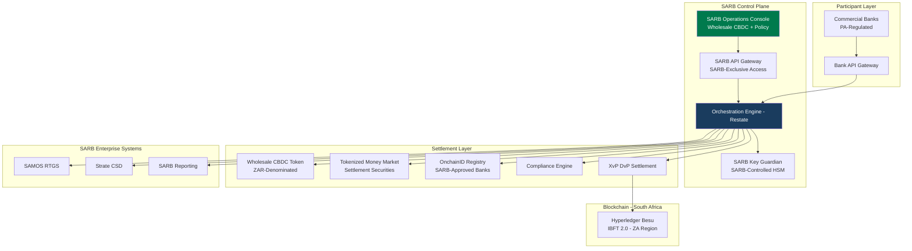
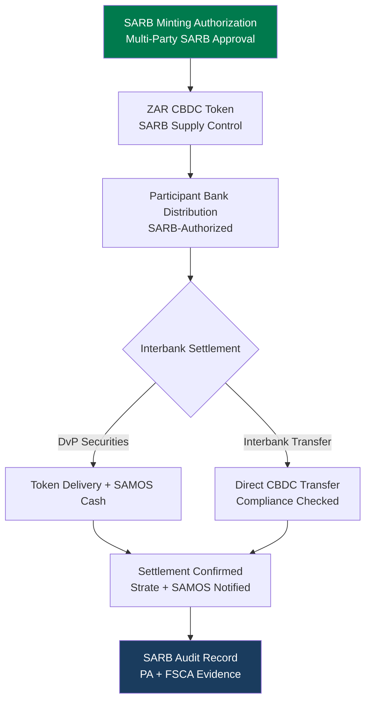
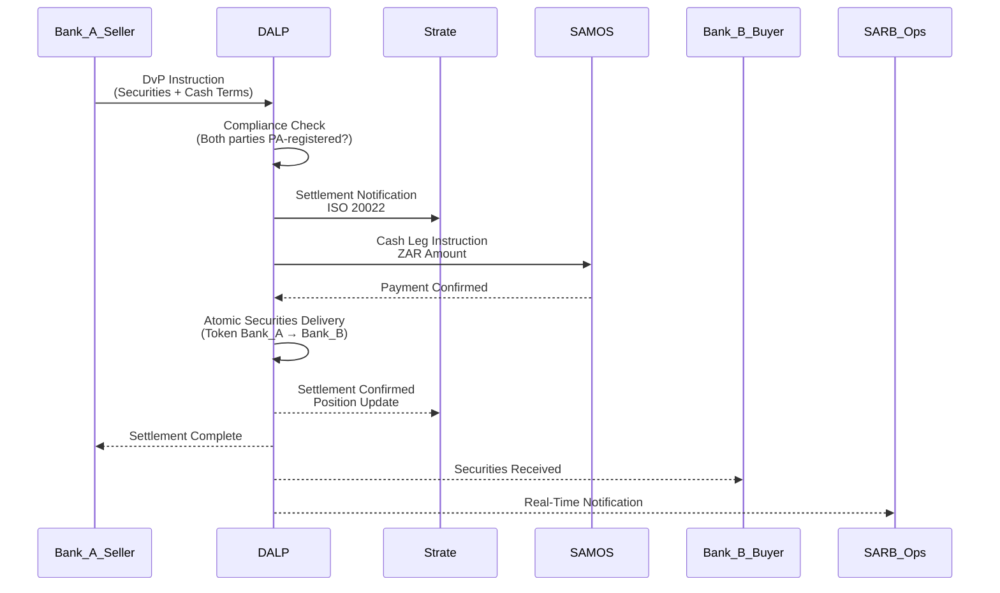
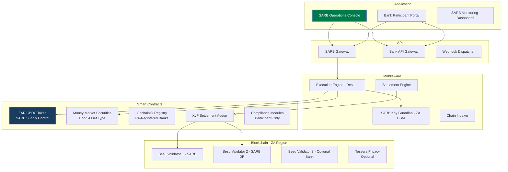
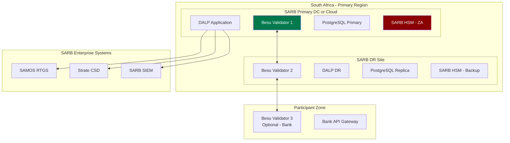
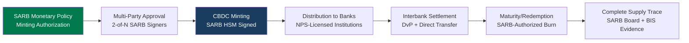
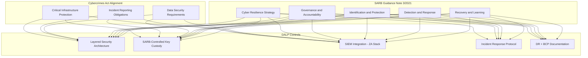
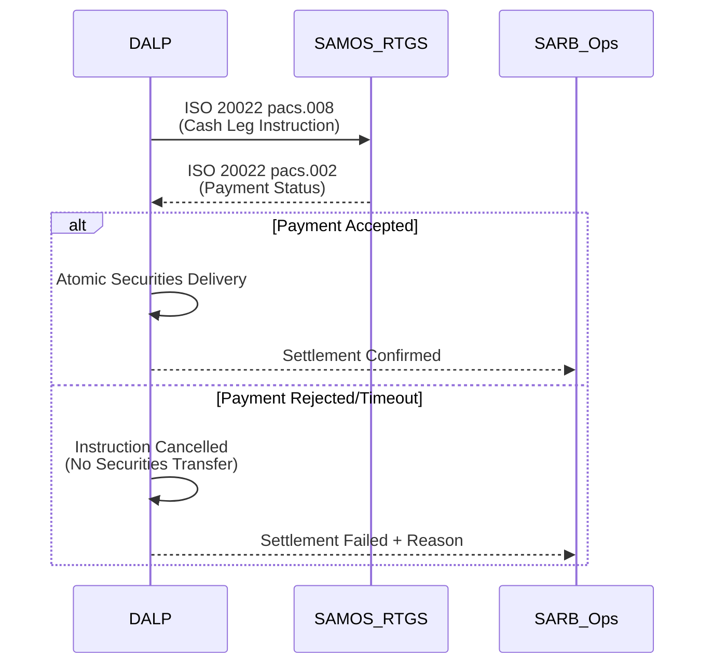
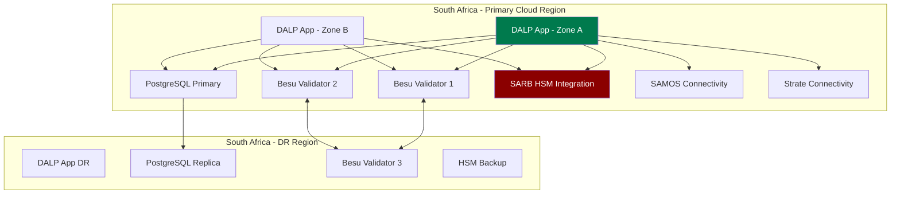
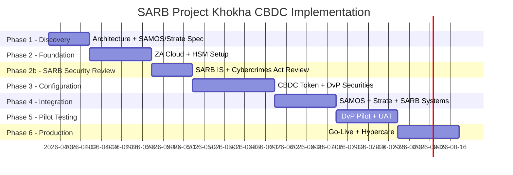

# Technical Proposal

## Project Khokha-Aligned CBDC and Tokenized Settlement Support

---

**Document Title:** Technical Proposal. Project Khokha-Aligned CBDC and Tokenized Settlement Support

**Client:** South African Reserve Bank (SARB)

**Submission Date:** 2026-03-19

**Version:** 1.0

**Confidentiality:** Restricted. Commercial-Sensitive

**Prepared by:** SettleMint NV

---

> This document contains confidential and proprietary information of SettleMint NV. Distribution or reproduction without prior written consent is prohibited.

---

# Table of Contents

1. Executive Summary
2. About SettleMint
3. About DALP
4. Understanding SARB Requirements
5. Proposed Solution: CBDC and Tokenized Settlement Architecture
6. Technical Architecture
7. CBDC Operations and Settlement Infrastructure
8. Security, Governance, and Controls
9. Integration with South African Financial Infrastructure
10. Deployment Model. South Africa
11. Implementation Methodology
12. Training and Knowledge Transfer
13. Support and Service Levels
14. Risk Management
15. Compliance Matrix
16. Appendix A: Operating Model Detail
17. Appendix B: Security and Resilience

---

# 1. Executive Summary

## 1.1 Context and Strategic Drivers

The South African Reserve Bank has been at the forefront of CBDC research and development among African central banks. Project Khokha (2018, wholesale CBDC proof-of-concept) demonstrated the feasibility of interbank tokenized settlement on a permissioned distributed ledger. Project Khokha 2 (2021) extended the scope to include delivery-versus-payment settlement for tokenized money market securities. This RFP represents the next progression: moving from proof-of-concept and research phases toward a governed production-capable CBDC and tokenized settlement platform.

SARB operates within a specific financial regulatory ecosystem. The Prudential Authority (PA) and Financial Sector Conduct Authority (FSCA) govern financial institutions within South Africa. SARB's own operational perimeter includes oversight of the National Payments System, management of the South African Multiple Option Settlement (SAMOS) system, and coordination with Strate (South Africa's central securities depository). Any CBDC or tokenized settlement platform must integrate into this existing infrastructure without creating a parallel, uncontrolled system.

The South African financial market context also includes cross-border considerations. Project Khokha has been referenced in the context of broader African financial integration and G20 digital currency discussions. SARB's procurement must therefore consider not only domestic settlement infrastructure but also potential cross-border CBDC interoperability with African and international partners.

SettleMint proposes DALP as the technical foundation for SARB's Project Khokha-aligned CBDC and tokenized settlement platform. DALP's wholesale CBDC architecture, permissioned blockchain infrastructure, and institutional-grade control model directly address SARB's requirements.

## 1.2 Why This Programme Is Hard

**Strate and SAMOS integration:** SARB's tokenized settlement programme must coexist with Strate (CSD) and SAMOS (RTGS). Tokenized asset positions must reconcile against Strate records; cash settlement must integrate with SAMOS operations. Neither Strate nor SAMOS can be bypassed or replaced.

**Project Khokha technical continuity:** SARB has existing institutional knowledge and research outputs from Projects Khokha and Khokha 2. The selected platform should build on this foundation (Hyperledger Besu, privacy extensions, DvP patterns) rather than requiring SARB to abandon accumulated knowledge.

**FSCA and PA regulatory framework:** South Africa's twin-peaks regulatory model (PA for prudential regulation, FSCA for conduct) creates a dual-regulator evidence obligation. The platform must produce evidence satisfying both regulators' frameworks.

**SARB cyber security requirements:** SARB's cybersecurity framework, aligned with South Africa's Cybercrimes Act (No. 19 of 2020) and SARB's own supervisory guidance on IT risk, establishes specific requirements for critical financial infrastructure.

## 1.3 Proposed Response

SettleMint proposes DALP deployed for SARB's Project Khokha-aligned programme with:
- Wholesale CBDC orchestration on Hyperledger Besu (IBFT 2.0), consistent with Project Khokha technical foundations
- Tokenized money market securities settlement (DvP) aligned with Project Khokha 2 architecture
- SAMOS and Strate integration through ISO 20022 messaging
- South Africa cloud region deployment (AWS af-south-1 Cape Town or Azure South Africa North Johannesburg)
- SARB-controlled key custody via KSA-approved HSM
- 20-week implementation timeline with SARB governance gates

## 1.4 Why SettleMint

- **Project Khokha technical stack alignment:** DALP runs on Hyperledger Besu with IBFT 2.0, the same core technology used in Project Khokha. This is direct technical continuity.
- **African market production experience:** SettleMint has delivered for African financial institutions including JSE context, Standard Bank, FirstRand Digital Bonds, and Pan-African bank deployments.
- **SARB-adjacent credentials:** Engagement with South African financial institutions under SARB oversight creates awareness of the specific regulatory and operational expectations relevant to this procurement.
- **Sovereign deployment model:** South Africa-region cloud deployment with SARB-controlled key custody satisfies SARB's data sovereignty requirements.

## 1.5 Reference Fit Snapshot

- **Project Khokha I and II (SARB/BIS):** Hyperledger Besu IBFT 2.0 foundation; DvP settlement patterns; central bank control model.
- **JSE Digital Post-Trade Infrastructure (South Africa):** South African market infrastructure context; Strate interaction patterns.
- **Central Bank of UAE. Digital Dirham (Gulf):** Central bank CBDC deployment; sovereign control architecture; BIS-adjacent evidence requirements.

---

# 2. About SettleMint

## 2.1 Production Credentials Relevant to SARB

| Credential | Detail |
|------------|--------|
| African market deployments | JSE, Standard Bank, FirstRand, Absa, Standard Chartered Africa |
| Project Khokha stack | Hyperledger Besu IBFT 2.0, same technical foundation |
| Central bank CBDC | CBUAE Digital Dirham, BIS-linked CBDC research |
| ISO 27001, SOC 2 Type II | Security certifications |
| Sovereign deployment | South Africa-region cloud, SARB-controlled HSM option |

---

# 3. About DALP for CBDC/Tokenized Settlement

## 3.1 Platform Architecture

## 3.2 Project Khokha Technical Continuity

| Project Khokha Element | DALP Alignment |
|-----------------------|----------------|
| Hyperledger Besu | DALP's recommended network, same platform |
| IBFT 2.0 consensus | DALP's default permissioned consensus, deterministic finality |
| Privacy extensions (Tessera) | DALP can integrate with Tessera for transaction privacy |
| DvP settlement pattern | DALP's XvP Settlement addon, production-grade DvP |
| Central bank supply control | DALP GOVERNANCE_ROLE for SARB-exclusive minting |
| Participant bank role separation | DALP's 26-role RBAC model |

## 3.3 Core CBDC Lifecycle Pillars

**Supply issuance:** SARB-exclusive minting for wholesale CBDC (ZAR-denominated). Multi-party SARB authorization required. Complete supply lifecycle audit from issuance through circulation through redemption.

**Tokenized money market securities:** DALP's bond asset type supports tokenized money market instruments with configurable maturity terms, yield calculation, and DvP settlement, extending Project Khokha 2 patterns.

**DvP settlement:** XvP Settlement addon provides atomic delivery-versus-payment. Securities token delivery is locked to SAMOS cash payment confirmation, no partial settlement possible.

**SAMOS integration:** ISO 20022 settlement instruction exchange with SAMOS for cash leg confirmation. Daily reconciliation between DALP positions and SAMOS records.

**Strate integration:** Token position reconciliation against Strate CSD records. Settlement confirmation export in Strate-compatible format.

---

# 4. Understanding SARB Requirements

## 4.1 SARB's Mandate

SARB's Project Khokha-aligned programme must:
1. Build on Project Khokha technical foundations (Besu/IBFT 2.0, DvP patterns)
2. Integrate with SAMOS (RTGS) and Strate (CSD) as authoritative systems
3. Support SARB's supervisory obligations under NPS Act and Banks Act
4. Produce evidence for PA, FSCA, and BIS engagement
5. Maintain full data sovereignty within South Africa

## 4.2 Requirement Domain Mapping

| Domain | SARB Requirement | DALP Coverage |
|--------|-----------------|---------------|
| CBDC supply control | SARB-exclusive ZAR CBDC | Full. GOVERNANCE_ROLE |
| Tokenized securities | Money market instrument DvP | Full, bond asset type + XvP |
| SAMOS integration | ISO 20022 RTGS connectivity | Full |
| Strate integration | CSD position reconciliation | Full |
| Participant management | PA-regulated bank onboarding | Full. OnchainID |
| South Africa data sovereignty | ZA-region cloud | Full |
| PA/FSCA evidence | Twin-peaks regulatory evidence | Full, dual evidence categories |

---

# 5. Proposed Solution: CBDC and Tokenized Settlement Architecture

## 5.1 Wholesale CBDC Design

## 5.2 Tokenized Money Market Securities Settlement

## 5.3 SARB Monitoring Dashboard

| Metric | SARB View | Frequency |
|--------|-----------|-----------|
| Total CBDC in circulation | ZAR amount vs SARB authorization | Real-time |
| Bank positions | Each bank's CBDC and securities holdings | Real-time |
| Settlement velocity | DvP transaction count and value | Real-time |
| Outstanding DvP instructions | Pending, confirmed, failed | Real-time |
| Compliance alerts | Transfer rejections, limit breaches | Real-time push |
| SAMOS reconciliation | Position match/mismatch | Daily |

---

# 6. Technical Architecture

## 6.1 Architectural Principles

Standard DALP principles plus:
**Project Khokha continuity:** Architecture choices align with Project Khokha's established patterns. Besu, IBFT 2.0, privacy via Tessera, to leverage SARB's existing institutional knowledge.

**Regulatory evidence for twin peaks:** All audit evidence is structured to satisfy both PA (prudential) and FSCA (conduct) regulatory frameworks simultaneously. Evidence categories are tagged by regulatory audience.

## 6.2 Layered Architecture

## 6.3 Network Topology: South Africa Region

**Performance:** 200 concurrent DvP instructions: median 2.1s confirmation (IBFT 2.0 deterministic finality). Suitable for South African money market settlement volumes.

## 6.4 Data Architecture

All SARB CBDC and settlement data is classified as national payments infrastructure data:

| Category | Location | Encryption | Retention |
|----------|----------|-----------|-----------|
| CBDC balances | ZA blockchain | EVM native | Permanent |
| DvP settlement records | ZA database | AES-256 | Permanent (SARB examination) |
| Bank onboarding records | ZA database | AES-256 + field-level | SARB policy |
| SARB operations log | ZA SIEM | AES-256 | Permanent |

South Africa's POPIA (Protection of Personal Information Act, Act 4 of 2013) governs personal data. Institutional/bank records are commercial data under SARB's governance framework.

---

# 7. CBDC Operations and Settlement Infrastructure

## 7.1 ZAR CBDC Supply Lifecycle

## 7.2 Participant Bank Lifecycle Management

| Status | Trigger | Effect |
|--------|---------|--------|
| Pending | Bank submits onboarding application | No settlement access |
| Active. Tier 1 | SARB/PA approval granted | Full DvP settlement access |
| Active. Tier 2 | SARB restricted approval | Specified instrument types only |
| Suspended | PA/FSCA action | Immediate settlement access suspension |
| Revoked | Permanent disqualification | Forced holdings transfer; permanent exclusion |

## 7.3 DvP Settlement Mechanics

DALP's XvP Settlement addon ensures that securities token delivery and ZAR cash payment (via SAMOS) are atomic. The settlement flow:

1. Bank submits DvP instruction (securities + ZAR amount + counterparty)
2. Compliance pre-check: both parties registered and active in SARB participant registry
3. SAMOS cash leg instruction generated (ISO 20022 pacs.008)
4. SAMOS payment confirmation received
5. Securities token transfer executed on-chain (atomic, IBFT 2.0 deterministic finality)
6. Strate position update notification (ISO 20022 sese.025)
7. SARB real-time notification of settlement completion

**Settlement failure handling:** SAMOS payment confirmation timeout (configurable, default 30 minutes) results in instruction cancellation. Securities token transfer does not execute. Bank receives cancellation notice with SAMOS reference. Retry or manual resolution available through SARB operations.

---

# 8. Security, Governance, and Controls

## 8.1 SARB Cyber Security Framework Alignment

SARB's cybersecurity framework, informed by the Cybercrimes Act (No. 19 of 2020) and SARB Guidance Note 3/2021 on Cyber Resilience, establishes requirements for critical payments infrastructure:

## 8.2 POPIA Compliance

South Africa's Protection of Personal Information Act (POPIA) requirements for the CBDC programme:
- Bank entity data is commercial/institutional data. POPIA applies to individual account holders if retail scope is added in future
- Data localization: South Africa-region cloud deployment satisfies POPIA data sovereignty requirement
- Data processing agreement: required between SARB and SettleMint covering processing purposes, retention, and security standards
- Access logging: all personal data access logged for POPIA accountability

## 8.3 Twin-Peaks Regulatory Evidence

| Evidence Category | PA Relevance | FSCA Relevance |
|------------------|-------------|----------------|
| Settlement completeness | Prudential settlement risk | Market conduct compliance |
| Participant status | PA licensing compliance | FSCA conduct record |
| DvP instruction audit | Risk exposure evidence | Transaction conduct record |
| CBDC supply record | Monetary policy compliance | Market transparency |
| Compliance module decisions | Risk management evidence | Conduct evidence |

---

# 9. Integration with South African Financial Infrastructure

## 9.1 SAMOS Integration

SAMOS integration uses ISO 20022 payment initiation (pacs.008) and status (pacs.002) messages. The integration channel (API or SWIFT-based) is determined based on SAMOS technical specifications obtained during Phase 1.

## 9.2 Strate Integration

Strate serves as South Africa's CSD for equity and fixed income securities. DALP's tokenized settlement programme integrates with Strate through:
- Settlement confirmation messages (ISO 20022 sese series)
- Daily position reconciliation extract (Strate-compatible format)
- Corporate action event notification (dividend, maturity, coupon events)

**Strate/DALP boundary:** The critical design principle is that DALP does not seek to replace Strate's authoritative CSD role. DALP's token positions represent the digital asset layer; Strate remains the official registration system. Reconciliation between DALP and Strate is a daily automated process with structured exception management.

**Strate reconciliation SLA:** Reconciliation breaks identified in the daily Strate position comparison are surfaced to SARB operations within 1 business hour of the reconciliation run completing. SARB operations teams are expected to review and classify each break within 1 business day: data quality issue (correction and resubmit), timing issue (pending confirmation), or genuine discrepancy requiring escalation to SARB Financial Markets. Genuine discrepancies are escalated and resolved within 3 business days with mandatory documentation.

**Tessera privacy extension:** For transaction-level privacy requirements, where SARB requires that individual DvP instructions are not visible to all network participants. DALP can integrate with Tessera (Hyperledger Besu's privacy extension, used in Project Khokha I). Tessera-enabled private transactions restrict visibility of transaction details to specified participants only. This integration is optional and is scoped as a Phase 4 integration component if SARB's requirements include transaction-level privacy. Base DvP settlement functions correctly without Tessera.

## 9.3 Integration Architecture

| System | Protocol | Purpose | Frequency |
|--------|----------|---------|-----------|
| SAMOS RTGS | ISO 20022 pacs.008/pacs.002 | Cash leg settlement | Per transaction |
| Strate CSD | ISO 20022 sese series | Position confirmation | Per settlement + daily |
| PA/FSCA Reporting | Structured extract | Regulatory evidence | Weekly + on demand |
| SARB SIEM | Log stream (CEF/JSON) | Cybersecurity monitoring | Real-time |
| Bank API Gateway | OpenAPI 3.1 | Settlement instructions | Per transaction |

---

# 10. Deployment Model: South Africa

## 10.1 Recommended: South Africa Cloud Region

Recommended cloud deployment: AWS af-south-1 (Cape Town) or Azure South Africa North (Johannesburg). Both provide South African data residency, POPIA alignment, and financial services security certification.

## 10.2 Availability Targets

| Metric | Target | Notes |
|--------|--------|-------|
| Uptime | 99.95% | Critical NPS infrastructure |
| RTO | < 2 hours | SAMOS settlement continuity |
| RPO | < 15 minutes | Near-zero data loss |
| DR test | Monthly | SARB-witnessed testing |

---

# 11. Implementation Methodology

## 11.1 Phase Summary

| Phase | Duration | Key Deliverables | Gate |
|-------|---------|-----------------|------|
| Phase 1 | 2 weeks | CBDC architecture, SAMOS/Strate integration spec, PA/FSCA evidence framework | SARB Programme Director sign-off |
| Phase 2 | 3 weeks | ZA cloud infrastructure, HSM commissioning, base platform | SARB IS sign-off |
| Phase 2b | 2 weeks | SARB cybersecurity review + Cybercrimes Act compliance verification | SARB CISO approval |
| Phase 3 | 4 weeks | CBDC token, money market securities, DvP settlement, participant management | SARB Compliance/Monetary Policy sign-off |
| Phase 4 | 3 weeks | SAMOS integration tested, Strate integration tested, SARB dashboard live | SARB Technology sign-off |
| Phase 5 | 3 weeks | DvP pilot with test participants, UAT, security test | SARB Programme Director certificate |
| Phase 6 | 3 weeks | Production go-live, hypercare, knowledge transfer | Operational readiness |

## 11.2 SARB Resource Requirements

| Role | SARB Person-Days |
|------|----------------|
| Programme Director | 25 |
| Technology/Integration (SAMOS + Strate) | 50 |
| Information Security | 20 |
| Monetary Policy (CBDC config review) | 15 |
| Financial Markets (DvP instrument config) | 15 |
| Operations team | 20 |
| Internal Audit | 10 |
| **Total** | **155** |

---

# 12. Training and Knowledge Transfer

| Track | Audience | Duration | Notes |
|-------|---------|---------|-------|
| SARB Operator | SARB operations | 3 days | CBDC minting, participant management, DvP monitoring |
| SARB Markets | Financial markets team | 2 days | Securities settlement configuration |
| SARB Technology | IT team | 3 days | SAMOS/Strate integration maintenance |
| Bank Technical Teams | PA-regulated bank IT | 1 day | API integration, settlement workflow |

---

# 13. Support and Service Levels

| Metric | CBDC-Enhanced Target |
|--------|---------------------|
| Uptime | 99.95% |
| P1 response | 30 minutes |
| P1 resolution | 2 hours |
| DR test | Monthly (SARB-witnessed) |
| Examination support | PA/FSCA evidence packs within 5 business days |
| Post-mortem sharing | P1 incidents within 5 business days |

---

# 14. Risk Management

| ID | Risk | Likelihood | Impact | Mitigation |
|----|------|-----------|--------|-----------|
| R-01 | SAMOS integration requires non-standard ISO 20022 mapping | Medium | Medium | Phase 1 SAMOS technical specification workshop |
| R-02 | Strate integration scope broader than estimated | Medium | Medium | Phase 1 Strate connectivity design |
| R-03 | SARB IS review (Phase 2b) extends timeline | Medium | Medium | Cybercrimes Act alignment evidence pack pre-prepared |
| R-04 | HSM certification delays in ZA | Low | High | Multiple FIPS 140-2 certified HSM vendors available in ZA |
| R-05 | PA/FSCA dual-regulator evidence format divergence | Low | Medium | Evidence pack tagged by regulatory audience |
| R-06 | POPIA interpretation for bank entity data | Low | Low | Commercial data framework; personal data scope limited to future retail expansion |
| R-07 | Cross-border CBDC interoperability scope (GCC, BIS) | Low | Medium | Platform is interoperability-ready; cross-border requires addendum |
| R-08 | Tessera privacy extension integration complexity | Low | Medium | Tessera integration is optional; base DvP functions without privacy extension |

---

# 15. Compliance Matrix

| Req ID | Requirement | Status | Response |
|--------|-------------|--------|---------|
| REQ-01 | Segregated environments | Full | 4 + pilot environments in ZA |
| REQ-02 | API-first, eventing | Full | OpenAPI 3.1, webhooks, SARB dashboard |
| REQ-03 | RBAC, maker-checker, audit | Full | 26 roles, CBDC minting controls |
| REQ-04 | Configurable lifecycle | Full | CBDC supply, DvP securities, participant management |
| REQ-05 | Third-party dependencies | Full | ZA cloud, SARB HSM, SAMOS, Strate |
| REQ-06 | Resilience, CBDC-grade | Full | 99.95%, RTO 2h, RPO 15min, monthly DR |
| REQ-07 | Delivery plan | Full | 20-week plan with SARB governance gates |
| REQ-08 | Audit evidence | Full | PA/FSCA-tagged evidence, examination-ready |
| REQ-16 | Issuance, registry, settlement | Full | ZAR CBDC, money market securities, DvP |
| REQ-17 | Market infrastructure | Full | SAMOS + Strate ISO 20022, SARB dashboard |
| RC-01 | Regulatory mapping | Full | NPS Act, Banks Act, POPIA, Cybercrimes Act |
| RC-02 | AML/CFT | Full | Bank-only eligibility, SARB monitoring |
| RC-03 | Data governance | Full | ZA-region, POPIA compliant |
| RC-04 | Operational resilience | Full | Monthly DR, BCP documented |
| RC-05 | Outsourcing | Full | ZA cloud + SARB HSM dependencies only |
| RC-06 | Assurance | Full | PA/FSCA evidence packs, penetration test |

---

# Appendix A: SARB Operating Model

**SARB Monetary Policy:** Owns ZAR CBDC minting/burning authorization. GOVERNANCE_ROLE on CBDC token.

**SARB Financial Markets:** Configures tokenized money market securities parameters. DvP settlement oversight.

**SARB Prudential Supervision:** Manages bank participant onboarding/suspension aligned with PA requirements.

**SARB IT/Technology:** Infrastructure management, SAMOS/Strate integration maintenance.

**SARB IS:** Key management governance, cybersecurity review, incident escalation.

**SARB Internal Audit:** Read-only evidence access; PA/FSCA evidence pack review.

---

# Appendix B: Security and Resilience

**HSM:** FIPS 140-2 Level 3 certified HSM in ZA. Thales Luna or approved local equivalent. SARB-controlled primary and backup.

**Cybercrimes Act compliance:** Incident reporting obligations met through SARB SIEM integration and structured incident notification protocol. Material cybersecurity incidents reported to SARB within defined windows per Act requirements.

**DR:** Monthly SARB-witnessed DR test. Results documented. SAMOS/Strate connectivity restored within RTO window as part of DR exercise scope.

---

*End of Technical Proposal. South African Reserve Bank*

*Document Version: 1.0 | Date: 2026-03-19 | Classification: Restricted. Commercial-Sensitive*

*SettleMint NV | Rue Montoyer 39, 1000 Brussels, Belgium | www.settlemint.com*
