# Technical Proposal

## Digital Asset Regulatory Platform and Supervised Market Access

---

**Document Title:** Technical Proposal. Digital Asset Regulatory Platform and Supervised Market Access

**Client:** Tadawul Saudi Exchange

**Submission Date:** 2026-03-17

**Version:** 1.0

**Confidentiality:** Restricted. Commercial-Sensitive

**Prepared by:** SettleMint NV

---

> This document contains confidential and proprietary information of SettleMint NV. Distribution or reproduction without prior written consent is prohibited.

---

# Table of Contents

1. Executive Summary
2. Understanding Tadawul Saudi Exchange's Requirements
3. Proposed Solution: DALP Operating Model
4. Platform Architecture
5. Asset Lifecycle and Compliance Infrastructure
6. Security, Governance, and Controls
7. Integration and Interoperability
8. Implementation Methodology
9. Delivery Approach and Timeline
10. Relevant Experience and References
11. Current Coverage, Gaps, and Mitigations
12. Appendix: Response Matrix

---

# 1. Executive Summary

## 1.1 Context and Strategic Drivers

Tadawul Saudi Exchange is procuring a digital asset regulatory platform and supervised market access capability as a business-critical infrastructure initiative. The platform must operate within a control environment shaped by business ownership, architecture standards, security review, legal interpretation, compliance sign-off, and internal audit expectations. This is not a speculative innovation exercise; it is a procurement designed to identify a dependable platform and implementation model that can sustain growth in users, volumes, products, and audit scrutiny without fundamental rework.

The regulatory landscape in Kingdom of Saudi Arabia is evolving rapidly. The Central Bank has established a clear framework for digital asset service providers through its regulatory sandbox and licensing regime. Financial institutions operating in Kingdom of Saudi Arabia must demonstrate robust compliance with anti-money laundering requirements, investor protection rules, and market conduct standards. The proposed platform must enable the Central Bank to oversee digital asset activities while providing regulated entities with the infrastructure needed to operate compliantly.

SettleMint proposes DALP, the Digital Asset Lifecycle Platform, as the foundation for this initiative. DALP is a production-grade platform purpose-built for regulated financial institutions and sovereign entities. It provides the infrastructure required to design, issue, distribute, and service digital assets at scale, with the governance, compliance, and operational reliability that regulated environments demand.

## 1.2 Why This Programme Is Hard

Digital asset regulatory infrastructure presents challenges that distinguish it from conventional technology deployments. The lifecycle complexity is significant: a digital asset platform must manage issuance, transfers, corporate actions, compliance monitoring, and retirement across potentially thousands of instruments and millions of participants. Each lifecycle event involves multiple parties, regulatory checkpoints, and audit requirements.

The governance and compliance burden is substantial. In a regulated environment, every action must be traceable to an authorized initiator, every compliance check must be verifiable, every approval must be documented, and every state change must be reconstructable for regulatory review. This applies not just to happy-path operations but to the boundary conditions: rejected transactions, stale approvals, mismatched data, delayed settlements, and corrected records.

The operationalization gap between pilot and production represents a critical challenge. Demonstrating tokenization in a sandbox environment is fundamentally different from operating a platform that processes real transactions, maintains compliance across multiple jurisdictions, integrates with existing enterprise systems, and produces audit evidence that satisfies internal and external reviewers. Many platforms can demonstrate capability; fewer can demonstrate operational maturity.

Integration burden is often underestimated. The platform must coexist with existing enterprise infrastructure: identity services, ledger or books-and-record systems, sanctions and AML tooling, reporting environments, service-management processes, and operational runbooks. The solution cannot become a reconciliation sinkhole that generates more manual work than it removes.

## 1.3 Proposed Response

SettleMint proposes deploying DALP as the unified control plane for Tadawul Saudi Exchange's digital asset regulatory platform and supervised market access capability. The platform provides comprehensive lifecycle coverage including asset configuration, identity management, compliance enforcement, settlement operations, and corporate action automation.

The proposed deployment model is private cloud, deployed within the Central Bank's specified cloud environment (AWS, Azure, or GCP) with full data residency controls ensuring all data remains within Kingdom of Saudi Arabia. The platform operates on a permissioned blockchain network (Hyperledger Besu with IBFT 2.0 consensus) providing institutional-grade privacy and performance characteristics appropriate for regulated market infrastructure.

The compliance approach leverages DALP's pre-built regulatory framework library, which includes templates for major global frameworks (MiCA, MAS, FCA, JFSA) as well as configuration options for Kingdom of Saudi Arabia-specific requirements. The platform enforces compliance before execution, not after review, ensuring that non-compliant states cannot exist on-chain.

The custody model supports integration with the Central Bank's preferred custody infrastructure, whether via direct integration with existing providers or through DALP's modular custody connector framework.

The integration perimeter encompasses the full enterprise stack: identity management (integration with existing IAM/Active Directory), core banking and ledger systems, sanctions and AML tooling, reporting infrastructure, and payment rails (SWIFT, SEPA, local RTGS).

The phased delivery approach follows SettleMint's proven 19-week methodology: Discovery and Requirements (Weeks 1-2), Foundation and Setup (Weeks 3-5), Configuration and Compliance (Weeks 6-9), Integration and Testing (Weeks 10-13), and Go-Live with Hypercare (Weeks 14-19).

## 1.4 Why SettleMint

SettleMint brings a combination of market tenure, production record, and regulated delivery experience that is directly relevant to the Tadawul Saudi Exchange's requirements.

The company has been building enterprise blockchain infrastructure since 2016, with 10 years of continuous operation. SettleMint has delivered production deployments at regulated banks across Asia and Europe, including tier-1 institutions such as Standard Chartered Bank, State Bank of India, and Commerzbank. Active sovereign programmes in the Gulf region demonstrate familiarity with regional regulatory requirements and market structures.

SettleMint's production record includes live deployments spanning bonds, equities, deposits, stablecoins, real estate, funds, and precious metals. The platform processes real transaction volumes under institutional SLAs with 24/7 uptime requirements. This production maturity distinguishes SettleMint from platforms that remain in demonstration or pilot phases.

The company holds ISO 27001 and SOC 2 Type II certifications, has passed security reviews and penetration testing at tier-1 financial institutions, and maintains operational maturity including business continuity and disaster recovery capabilities meeting institutional standards.

## 1.5 Why DALP

DALP provides a comprehensive platform that addresses the full complexity of institutional digital asset operations.

Platform breadth is substantial: seven asset types (bonds, equities, funds, deposits, stablecoins, real estate, precious metals), twelve compliance module types, and eleven token features are built in. Pre-built regulatory templates for MiCA, MAS, Japan FSA, SEC Reg CF, Reg D 506(b)/(c), and UK FCA eliminate the need to build compliance from scratch.

The lifecycle model is unified: DALP covers the entire digital asset lifecycle from design through issuance, distribution, trading, corporate actions, compliance monitoring, and retirement. Most tokenization platforms stop at issuance; DALP's operational tooling handles the ongoing work that consumes the majority of institutional effort.

The control plane positioning is central: DALP functions as the governance and orchestration layer between existing core financial systems and blockchain networks, providing the infrastructure required to build, compliant digital asset solutions in production. The platform integrates with enterprise systems rather than replacing them.

Interoperability is designed in: API-first architecture with OpenAPI 3.1 specifications, TypeScript SDK, webhooks for event-driven integration, and support for meta-transactions enabling gasless workflows. The platform operates on any EVM-compatible blockchain (public or private) without application code changes.

Operations are enterprise-grade: 26 distinct roles across four layers enforce separation of duties. Five independent security layers provide defense-in-depth. The platform supports multiple deployment models (managed SaaS, private cloud, on-premises, hybrid) with data residency controls appropriate for sovereign requirements.

## 1.6 Reference Fit Snapshot

The following reference projects are most directly relevant to the Tadawul Saudi Exchange's requirements:

**Saudi Arabia RER (Real Estate Registry):** National-scale blockchain infrastructure for property registration, fractionalization, and digital marketplace under REGA and Vision 2030. Live production since January 2026, processing real transactions. Demonstrates country-scale deployment capability, government integration, and multi-party ecosystem support.

**Standard Chartered Bank. Digital Virtual Exchange:** Blockchain-based securities tokenization platform enabling fractional ownership and instant settlement. Demonstrates institutional-grade compliance, multi-asset support, and integration with existing banking infrastructure across Asia, Africa, and Middle East.

**State Bank of India. CBDC Infrastructure:** Production-ready infrastructure for India's e-Rupee central bank digital currency. Demonstrates national-scale transaction capacity, integration with existing banking systems, and operation within a regulated monetary framework.

**Commerzbank. Hybrid ETP Issuance:** Hybrid on-chain/off-chain exchange-traded product issuance with Boerse Stuttgart listing, settlement under 10 seconds. Demonstrates integration with established exchange infrastructure, regulated venue compatibility, and capital markets expertise.

---

# 2. Understanding Tadawul Saudi Exchange's Requirements

## 2.1 Procurement Context

The Tadawul Saudi Exchange is treating digital asset regulatory platform and supervised market access as a business-critical capability that must be implemented with the same discipline applied to core regulated systems. The solution will operate inside a control environment shaped by business ownership, architecture standards, security review, legal interpretation, compliance sign-off, and internal audit expectations.

The review team will look beyond product feature lists. It will test whether bidders can explain how the platform behaves when confronted with real-world operational pressure: incomplete onboarding data, limit breaches, approvals delayed by governance, partner outages, regulatory evidence requests, bulk corrections, data retention obligations, and phased rollout constraints.

Regional conditions in Kingdom of Saudi Arabia matter. Responses should be anchored in actual market infrastructure and supervisory realities, including the pace of domestic policy development, the role of regulated intermediaries, and the practical limits of cross-border interoperability.

## 2.2 Scope of Work

The scope covers design mobilisation, product setup, integration, testing, controls, training, and operational readiness across five workstreams:

**WS-01. Mobilisation and Governance:** Programme setup, steering, design authority, RAID management, decision logs, and acceptance governance.

**WS-02. Business and Product Configuration:** Configure lifecycle, roles, limits, disclosures, and policy rules for digital asset regulatory platform and supervised market access.

**WS-03. Integration and Controls:** Connect enterprise systems, identity, compliance, reporting, settlement dependencies, and observability.

**WS-04. Testing and Readiness:** Functional, non-functional, security, resilience, UAT, cutover, training, and go-live support.

**WS-05. Operational Transition:** Runbooks, service desk model, support handoff, KPI definition, and post-launch governance.

## 2.3 Technical Requirements Summary

The following mandatory technical requirements guide this proposal:

| Requirement | Interpretation |
|-------------|----------------|
| REQ-01: Segregated environments | DALP supports dev, test, UAT, DR, and production environments with isolated configuration and data residency |
| REQ-02: API-first interfaces | DALP provides OpenAPI 3.1 REST API, TypeScript SDK, and event webhooks for enterprise integration |
| REQ-03: RBAC, segregation of duties, maker-checker | DALP implements 26 distinct roles across four layers with dual-layer permission model |
| REQ-04: Configurable lifecycle, policy controls, limits, exceptions | DALP supports 12 compliance module types with configurable rules, expressions, and thresholds |
| REQ-05: Third-party dependencies disclosure | All dependencies are documented in this proposal and the dependency register |
| REQ-06: Resilience, recovery, backup, monitoring, incident management | DALP includes comprehensive observability, HA deployment options, and DR capabilities |
| REQ-07: Delivery method, client effort assumptions, phased implementation | SettleMint's 19-week phased methodology with clear deliverables and client responsibilities |
| REQ-08: Evidence extraction for audit, supervisory review, board reporting | DALP provides comprehensive audit trails, reporting dashboards, and export capabilities |

## 2.4 High-Priority Spotlight

Three issues will dominate this procurement, and SettleMint addresses each directly:

**Control integrity:** DALP's ERC-3643/SMART Protocol foundation ensures that every action on the platform can be traced to an initiator, every compliance check can be verified, every approval can be documented, and every state change can be reconstructed. The platform logs every blockchain transaction immutably on-chain while maintaining searchable indexes for operational and regulatory review. The dual-layer permission model (off-chain platform roles and on-chain smart contract roles) ensures that no single failure grants unauthorized access.

**Coexistence with enterprise systems:** DALP is designed as an integration layer, not a replacement for existing systems. The API-first architecture, comprehensive webhook support, and modular integration framework enable connection to identity services, compliance tooling, reporting environments, and payment rails without creating operational debt or unowned responsibilities. The platform provides reconciliation capabilities rather than requiring manual offsetting.

**Phased scalability:** The 19-week implementation methodology includes explicit phase gates with acceptance criteria. Each phase produces deliverables that are reviewed and approved before progression. The platform supports incremental asset class addition, jurisdiction expansion, and participant onboarding without requiring platform reset. The modular architecture (configurable assets, pluggable compliance modules, addon system) enables growth within the same deployment.

---

# 3. Proposed Solution: DALP Operating Model

## 3.1 Solution Overview

DALP serves as the unified control plane for digital asset regulatory platform and supervised market access. The platform provides a comprehensive operating model that addresses the full lifecycle of digital assets within a regulated environment.

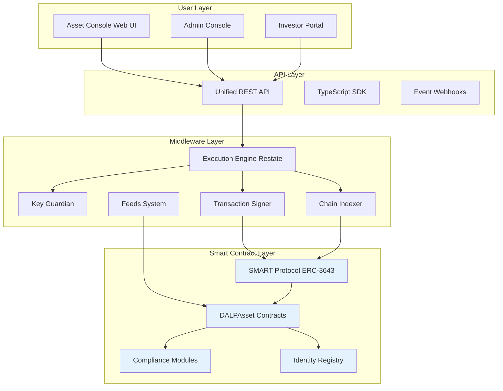
```mermaid
flowchart TB
    subgraph "User Layer"
        A[Asset Console Web UI]
        B[Admin Console]
        C[Investor Portal]
    end
    
    subgraph "API Layer"
        D[Unified REST API]
        E[TypeScript SDK]
        F[Event Webhooks]
    end
    
    subgraph "Middleware Layer"
        G[Execution Engine Restate]
        H[Key Guardian]
        I[Transaction Signer]
        J[Chain Indexer]
        K[Feeds System]
    end
    
    subgraph "Smart Contract Layer"
        L[SMART Protocol ERC-3643]
        M[DALPAsset Contracts]
        N[Compliance Modules]
        O[Identity Registry]
    end
    
    A --> D
    B --> D
    C --> D
    D --> G
    G --> H
    G --> I
    G --> J
    I --> L
    J --> L
    K --> M
    L --> M
    M --> N
    M --> O
    
    style L fill:#e3f2fd
    style M fill:#e3f2fd
    style N fill:#e3f2fd
    style O fill:#e3f2fd
```

The operating model is organized around five operational domains:

**Asset Management:** Configuration and lifecycle management of digital assets including bonds, equities, funds, deposits, stablecoins, real estate, and precious metals. The Asset Designer wizard guides operators through tokenization with step-by-step configuration.

**Identity and Verification:** On-chain identity management via OnchainID (ERC-734/735) with trusted issuer infrastructure for KYC/AML claims. Every participant is represented by a cryptographically verified identity contract.

**Compliance Enforcement:** Modular compliance engine enforcing jurisdiction-specific rules on every transfer. 12 compliance module types include identity verification, country restrictions, investor limits, supply caps, time-based locks, and transfer approvals.

**Settlement Operations:** Atomic Delivery-versus-Payment (DvP) and Exchange-versus-Payment (XvP) settlement ensuring that asset and cash transfer simultaneously or both revert. True T+0 finality without counterparty risk.

**Monitoring and Reporting:** Real-time observability across platform operations, compliance activity, transaction volumes, and system health. Comprehensive audit trails supporting regulatory review and internal audit.

## 3.2 Deployment Architecture

SettleMint proposes a private cloud deployment model for the Tadawul Saudi Exchange, with the platform deployed within the Central Bank's specified cloud environment.

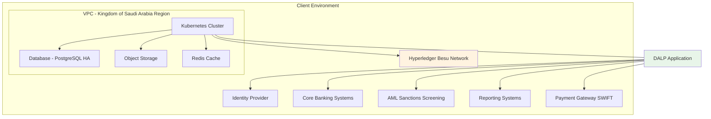
```mermaid
flowchart TB
    subgraph "Client Environment"
        subgraph "VPC - Kingdom of Saudi Arabia Region"
            A[Kubernetes Cluster]
            B[Database - PostgreSQL HA]
            C[Object Storage]
            D[Redis Cache]
        end
        
        E[Hyperledger Besu Network]
        
        F[Identity Provider]
        G[Core Banking Systems]
        H[AML Sanctions Screening]
        I[Reporting Systems]
        J[Payment Gateway SWIFT]
    end
    
    A --> B
    A --> C
    A --> D
    A --> E
    
    A --- K[DALP Application]
    K --> F
    K --> G
    K --> H
    K --> I
    K --> J
    
    style E fill:#fff3e0
    style K fill:#e8f5e9
```

The deployment architecture provides:

**Infrastructure isolation:** All platform components (application, database, cache, storage) deploy within a dedicated virtual private cloud in the Kingdom of Saudi Arabia region. Network security groups enforce strict access controls.

**Data residency:** All data, including identity records, transaction data, audit logs, and configuration, remains within Kingdom of Saudi Arabia. No data is transferred to external regions or third parties without explicit configuration.

**High availability:** The architecture supports multi-availability-zone deployment with automatic failover. The recommended cloud-native pattern achieves 2-15 minute recovery time objective with seconds to 1 minute recovery point objective.

**Blockchain network:** A permissioned Hyperledger Besu network operates within the same security boundary, with IBFT 2.0 consensus providing institutional-grade performance and privacy characteristics appropriate for regulated market infrastructure.

## 3.3 Participant Model

The platform supports a hierarchical participant model appropriate for regulatory supervision:

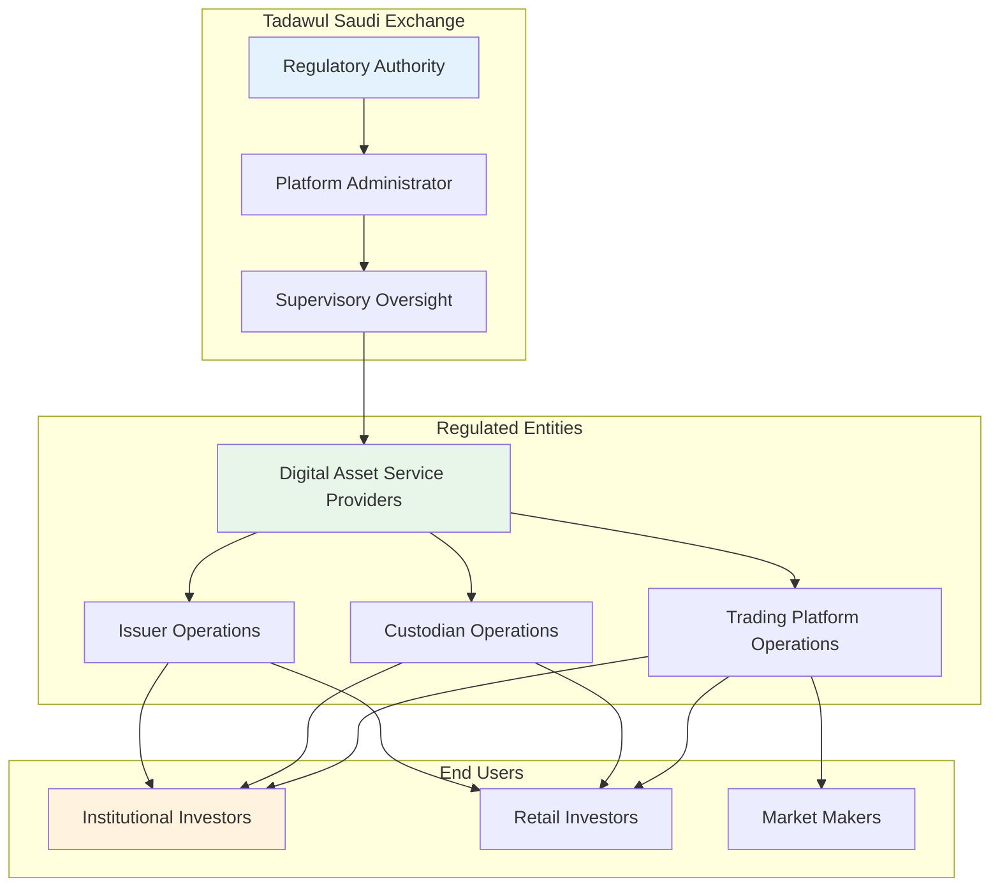
```mermaid
flowchart TB
    subgraph "Tadawul Saudi Exchange"
        A[Regulatory Authority] --> B[Platform Administrator]
        B --> C[Supervisory Oversight]
    end
    
    subgraph "Regulated Entities"
        D[Digital Asset Service Providers]
        D --> E[Issuer Operations]
        D --> F[Custodian Operations]
        D --> G[Trading Platform Operations]
    end
    
    subgraph "End Users"
        H[Institutional Investors]
        I[Retail Investors]
        J[Market Makers]
    end
    
    C --> D
    E --> H
    E --> I
    F --> H
    F --> I
    G --> H
    G --> I
    G --> J
    
    style A fill:#e3f2fd
    style D fill:#e8f5e9
    style H fill:#fff3e0
```

The participant model enables the Central Bank to:

- Register and supervise regulated digital asset service providers
- Monitor transaction flows and compliance status across all participants
- Enforce licensing requirements and capital adequacy rules
- Access comprehensive audit trails for regulatory review
- Generate supervisory reports across the ecosystem

---

# 4. Platform Architecture

## 4.1 Architectural Overview

DALP is built as a four-layer stack with distinct responsibility boundaries. Each layer enforces its own security controls independently, ensuring that no single-layer failure grants unauthorized access.

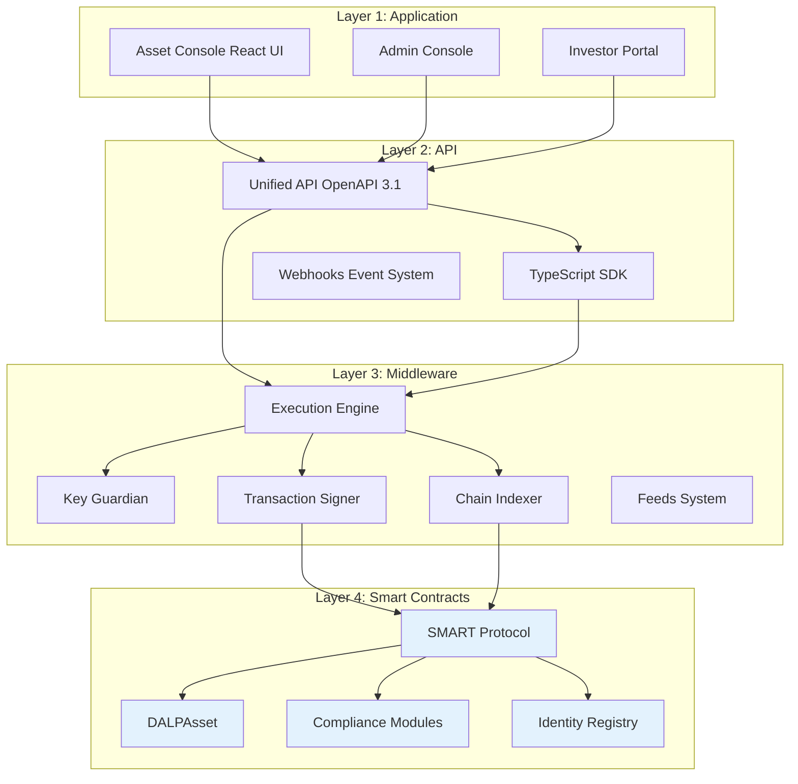
```mermaid
flowchart TB
    subgraph "Layer 1: Application"
        A[Asset Console React UI]
        B[Admin Console]
        C[Investor Portal]
    end
    
    subgraph "Layer 2: API"
        D[Unified API OpenAPI 3.1]
        E[TypeScript SDK]
        F[Webhooks Event System]
    end
    
    subgraph "Layer 3: Middleware"
        G[Execution Engine]
        H[Key Guardian]
        I[Transaction Signer]
        J[Chain Indexer]
        K[Feeds System]
    end
    
    subgraph "Layer 4: Smart Contracts"
        L[SMART Protocol]
        M[DALPAsset]
        N[Compliance Modules]
        O[Identity Registry]
    end
    
    A --> D
    B --> D
    C --> D
    D --> G
    D --> E
    E --> G
    G --> H
    G --> I
    G --> J
    I --> L
    J --> L
    L --> M
    L --> N
    L --> O
    
    style L fill:#e3f2fd
    style M fill:#e3f2fd
    style N fill:#e3f2fd
    style O fill:#e3f2fd
```

| Layer | Responsibility | Key Components |
|-------|---------------|----------------|
| **Application** | User-facing interfaces | Asset Console, Admin Console, Investor Portal |
| **API** | Programmatic access | Unified API, TypeScript SDK, Webhooks |
| **Middleware** | Workflow orchestration, key management, indexing | Execution Engine, Key Guardian, Transaction Signer, Chain Indexer |
| **Smart Contracts** | On-chain compliance, identity, asset logic | SMART Protocol, DALPAsset, Compliance Modules, Identity Registry |

## 4.2 Smart Contract Architecture

All DALP smart contracts are built on the SMART Protocol, an implementation of the ERC-3643 standard for regulated security tokens. The on-chain architecture follows a five-layer model:

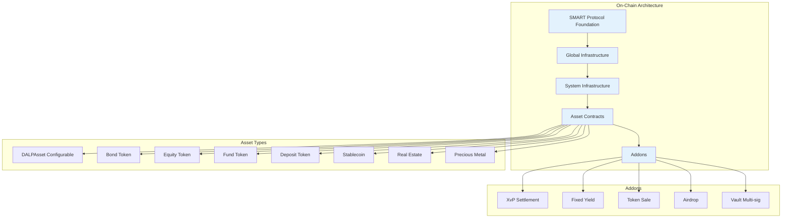
```mermaid
flowchart TB
    subgraph "On-Chain Architecture"
        A[SMART Protocol Foundation] --> B[Global Infrastructure]
        B --> C[System Infrastructure]
        C --> D[Asset Contracts]
        D --> E[Addons]
    end
    
    subgraph "Asset Types"
        D --> F[DALPAsset Configurable]
        D --> G[Bond Token]
        D --> H[Equity Token]
        D --> I[Fund Token]
        D --> J[Deposit Token]
        D --> K[Stablecoin]
        D --> L[Real Estate]
        D --> M[Precious Metal]
    end
    
    subgraph "Addons"
        E --> N[XvP Settlement]
        E --> O[Fixed Yield]
        E --> P[Token Sale]
        E --> Q[Airdrop]
        E --> R[Vault Multi-sig]
    end
    
    style A fill:#e3f2fd
    style B fill:#e3f2fd
    style C fill:#e3f2fd
    style D fill:#e3f2fd
    style E fill:#e3f2fd
```

**SMART Protocol (Layer 1):** ERC-3643 token framework with modular compliance, identity management, and extension system.

**Global (Layer 2):** Platform-wide infrastructure shared across all system instances on a given chain. Includes central directory, identity factory, and identity implementations.

**System (Layer 3):** Per-system infrastructure managing identity registration, compliance orchestration, access control, and factory registries.

**Assets (Layer 4):** Production-ready tokenized financial instruments. DALPAsset provides the configurable base; legacy types support specific instrument categories.

**Addons (Layer 5):** Operational tools extending assets with distribution, settlement, and treasury capabilities.

## 4.3 Compliance Architecture

DALP's compliance architecture enforces regulatory requirements at the smart contract layer, ensuring that non-compliant states cannot exist on-chain.

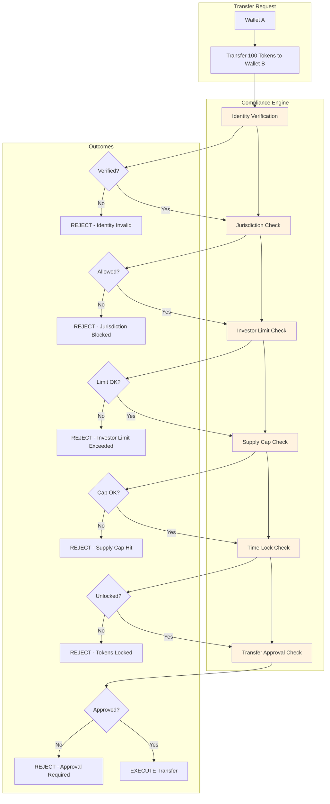
```mermaid
flowchart TB
    subgraph "Transfer Request"
        A[Wallet A] --> B[Transfer 100 Tokens to Wallet B]
    end
    
    subgraph "Compliance Engine"
        B --> C[Identity Verification]
        C --> D[Jurisdiction Check]
        D --> E[Investor Limit Check]
        E --> F[Supply Cap Check]
        F --> G[Time-Lock Check]
        G --> H[Transfer Approval Check]
    end
    
    subgraph "Outcomes"
        C --> I{Verified?}
        D --> J{Allowed?}
        E --> K{Limit OK?}
        F --> L{Cap OK?}
        G --> M{Unlocked?}
        H --> N{Approved?}
        
        I -->|No| O[REJECT - Identity Invalid]
        I -->|Yes| D
        J -->|No| P[REJECT - Jurisdiction Blocked]
        J -->|Yes| E
        K -->|No| Q[REJECT - Investor Limit Exceeded]
        K -->|Yes| F
        L -->|No| R[REJECT - Supply Cap Hit]
        L -->|Yes| G
        M -->|No| S[REJECT - Tokens Locked]
        M -->|Yes| H
        N -->|No| T[REJECT - Approval Required]
        N -->|Yes| U[EXECUTE Transfer]
    end
    
    style C fill:#fff3e0
    style D fill:#fff3e0
    style E fill:#fff3e0
    style F fill:#fff3e0
    style G fill:#fff3e0
    style H fill:#fff3e0
```

The compliance engine evaluates modular rules before each transfer. Rules are configurable at runtime without redeploying contracts. DALP ships with 12 compliance module types covering:

- Identity verification (KYC/AML claims)
- Country allowlist/blocklist
- Investor count limits
- Investor holding limits
- Supply caps
- Time-locked holding periods
- Transfer approval workflows
- Transfer windows
- Collateral backing verification
- Fee enforcement

## 4.4 Identity Architecture

DALP implements on-chain identity via OnchainID (ERC-734/735), establishing a cryptographically verifiable identity for every participant.

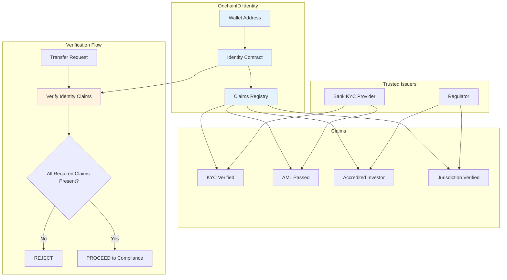
```mermaid
flowchart TB
    subgraph "OnchainID Identity"
        A[Wallet Address] --> B[Identity Contract]
        B --> C[Claims Registry]
    end
    
    subgraph "Claims"
        C --> D[KYC Verified]
        C --> E[AML Passed]
        C --> F[Accredited Investor]
        C --> G[Jurisdiction Verified]
    end
    
    subgraph "Trusted Issuers"
        H[Bank KYC Provider] --> D
        H --> E
        I[Regulator] --> F
        I --> G
    end
    
    subgraph "Verification Flow"
        J[Transfer Request] --> K[Verify Identity Claims]
        K --> L{All Required Claims Present?}
        L -->|No| M[REJECT]
        L -->|Yes| N[PROCEED to Compliance]
    end
    
    B --> K
    
    style A fill:#e3f2fd
    style B fill:#e3f2fd
    style C fill:#e3f2fd
    style K fill:#fff3e0
```

Claims are issued by trusted third parties, not self-asserted. A wallet holder cannot declare themselves KYC-verified or accredited; a registered trusted issuer must attest to that status. This mirrors how financial services actually work: eligibility is determined by regulated intermediaries.

Claims are checked continuously, not just at onboarding. Expired claims fail, revoked claims fail, and claims from issuers that lost trust fail. Eligibility is a live condition, not a one-time checkbox.

## 4.5 API Architecture

DALP provides a comprehensive API-first integration surface:

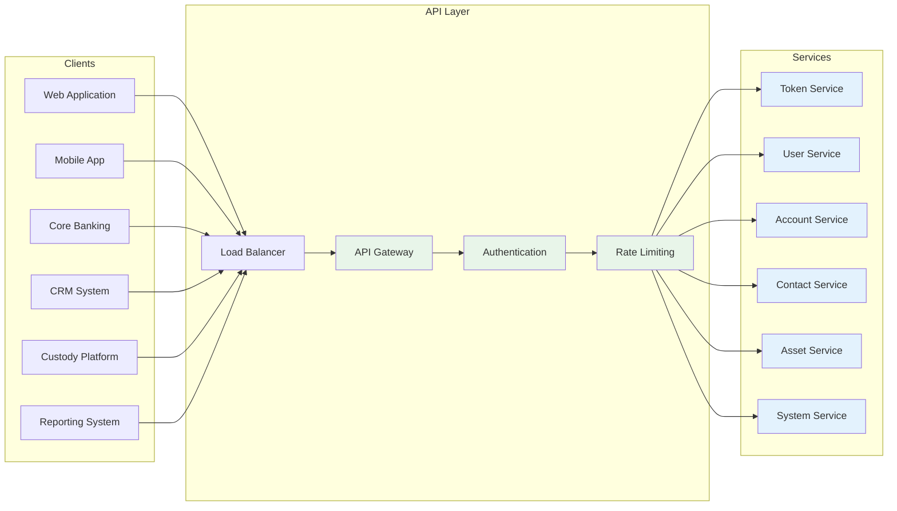
```mermaid
flowchart LR
    subgraph "Clients"
        A[Web Application]
        B[Mobile App]
        C[Core Banking]
        D[CRM System]
        E[Custody Platform]
        F[Reporting System]
    end
    
    subgraph "API Layer"
        G[Load Balancer]
        H[API Gateway]
        I[Authentication]
        J[Rate Limiting]
    end
    
    subgraph "Services"
        K[Token Service]
        L[User Service]
        M[Account Service]
        N[Contact Service]
        O[Asset Service]
        P[System Service]
    end
    
    A --> G
    B --> G
    C --> G
    D --> G
    E --> G
    F --> G
    
    G --> H
    H --> I
    I --> J
    J --> K
    J --> L
    J --> M
    J --> N
    J --> O
    J --> P
    
    style H fill:#e8f5e9
    style I fill:#e8f5e9
    style J fill:#e8f5e9
    style K fill:#e3f2fd
    style L fill:#e3f2fd
    style M fill:#e3f2fd
    style N fill:#e3f2fd
    style O fill:#e3f2fd
    style P fill:#e3f2fd
```

| Namespace | Purpose |
|-----------|---------|
| token | Asset lifecycle operations (create, mint, burn, transfer, pause) |
| user | User management (list, assign roles, manage permissions) |
| account | Wallet operations (generate address, check balance, sign) |
| contact | Investor relationships (register, record verifications) |
| asset | Asset metadata (update documents, configure compliance) |
| system | Platform administration (health, configuration, audit logs) |

Authentication supports three methods: session-based (browser), API keys (system integration), and enterprise SSO. Blockchain write operations additionally require wallet verification through PIN, TOTP, or passkey.

---

# 5. Asset Lifecycle and Compliance Infrastructure

## 5.1 Supported Asset Classes

DALP supports seven asset types organized by class, each with purpose-built lifecycle logic, metadata schemas, and compliance configurations:

**Fixed Income. Bonds:** Fully modeled fixed-income instruments with maturity dates, coupon schedules, denomination assets, ISIN identifiers, and automated yield distribution. Bond lifecycle includes issuance, coupon payments, partial redemptions, and maturity settlement.

**Flexible Income. Equities:** Full equity tokenization across common, preferred, and voting share classes. Equities support corporate actions including dividends, splits, and conversions. Collateral management tracks coverage ratios and minting capacity.

**Flexible Income. Funds:** Fund tokens carrying investment category, fund class, and management fee parameters. Supports the full fund landscape from sustainable impact funds to venture capital strategies.

**Cash Equivalents. Deposits:** Tokenized bank deposits serving as settlement currency for DvP operations. Deposit tokens represent claims on bank deposits with institutional-grade custody integration.

**Cash Equivalents. Stablecoins:** Full stablecoin spectrum from global standards (USDC, USDT) to regional currencies and platform-native instruments. Peg relationships stored on-chain for transparency.

**Real World Assets. Precious Metals:** Tokenized precious metals with physical custody traceability. Linked to real-world vault locations and named custodians. Supports 18-decimal fractional ownership.

**Real World Assets. Real Estate:** Rich metadata capture including GPS coordinates, property classification, building specifications, and unique identifiers. Fractional ownership enables broad investor access to institutional-grade properties.

## 5.2 Asset Designer Workflow

DALP's Asset Designer provides a guided wizard for tokenization:

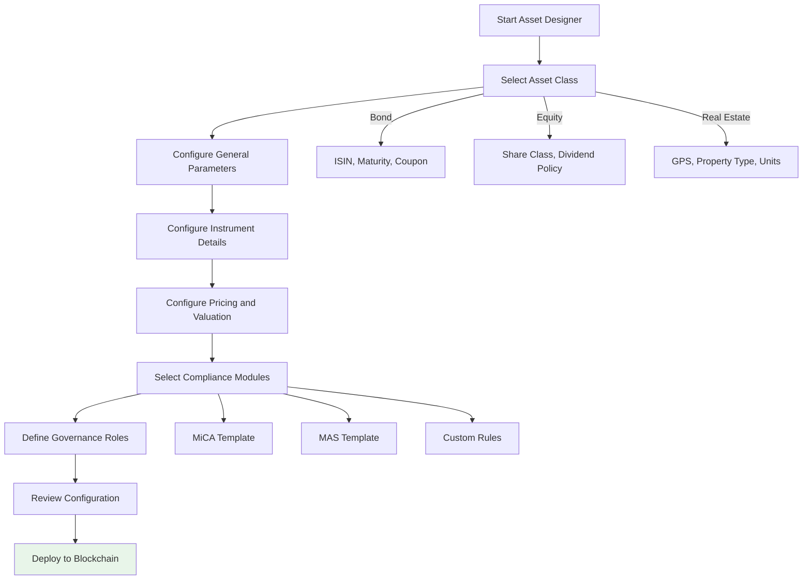
```mermaid
flowchart TB
    A[Start Asset Designer] --> B[Select Asset Class]
    B --> C[Configure General Parameters]
    C --> D[Configure Instrument Details]
    D --> E[Configure Pricing and Valuation]
    E --> F[Select Compliance Modules]
    F --> G[Define Governance Roles]
    G --> H[Review Configuration]
    H --> I[Deploy to Blockchain]
    
    B -->|Bond| B1[ISIN, Maturity, Coupon]
    B -->|Equity| B2[Share Class, Dividend Policy]
    B -->|Real Estate| B3[GPS, Property Type, Units]
    
    F --> F1[MiCA Template]
    F --> F2[MAS Template]
    F --> F3[Custom Rules]
    
    style I fill:#e8f5e9
```

Configuration replaces custom development. Every token inherits the security guarantees of the pre-audited SMART Protocol contracts. No custom smart contract development is required.

## 5.3 Regulatory Framework Support

DALP ships with pre-built compliance templates covering major global frameworks:

| Framework | Jurisdiction | Key Controls |
|-----------|--------------|--------------|
| MiCA EU | European Union | Identity verification, EU country restrictions, 8M EUR annual supply cap |
| MAS Singapore | Singapore | Identity verification, country allowlisting, investor limits, holding periods |
| Japan FSA | Japan | Identity verification, qualified investor rules, reporting requirements |
| SEC Reg CF | United States | Identity verification, investment limits, accreditation checks |
| SEC Reg D 506(b)/(c) | United States | Accreditation verification, rule 144A compliance |
| UK FCA | United Kingdom | Identity verification, promotional restrictions, reporting |

The compliance library supports custom template creation for jurisdiction-specific requirements. The expression builder enables compliance teams to construct investor eligibility rules using boolean logic without requiring smart contract development.

## 5.4 Settlement Architecture

DALP provides atomic settlement ensuring asset and cash transfer simultaneously or both revert:

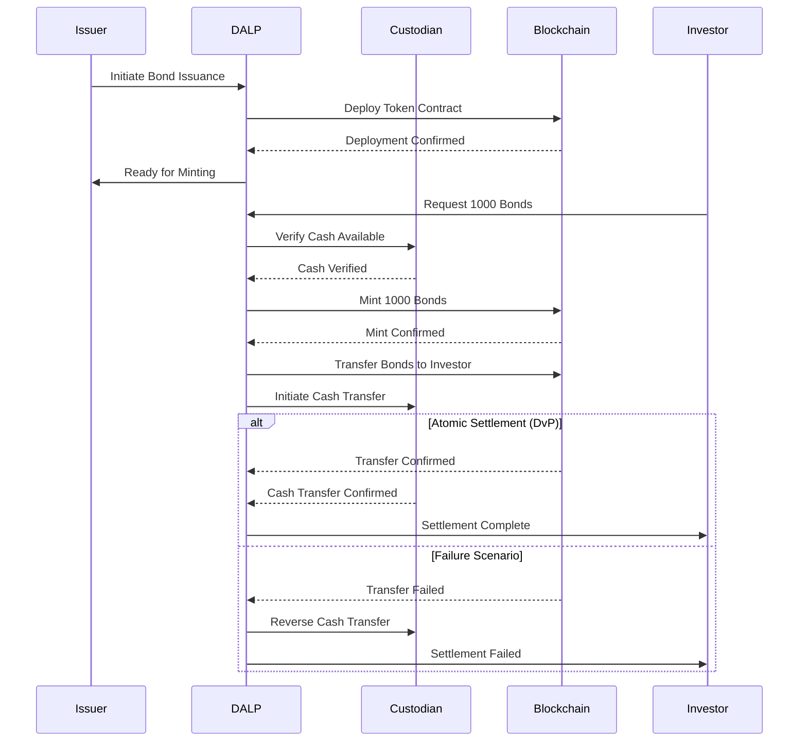
```mermaid
sequenceDiagram
    participant Issuer
    participant DALP
    participant Custodian
    participant Blockchain
    
    Issuer->>DALP: Initiate Bond Issuance
    DALP->>Blockchain: Deploy Token Contract
    Blockchain-->>DALP: Deployment Confirmed
    DALP->>Issuer: Ready for Minting
    
    Investor->>DALP: Request 1000 Bonds
    DALP->>Custodian: Verify Cash Available
    Custodian-->>DALP: Cash Verified
    
    DALP->>Blockchain: Mint 1000 Bonds
    Blockchain-->>DALP: Mint Confirmed
    
    DALP->>Blockchain: Transfer Bonds to Investor
    DALP->>Custodian: Initiate Cash Transfer
    
    alt Atomic Settlement (DvP)
        Blockchain-->>DALP: Transfer Confirmed
        Custodian-->>DALP: Cash Transfer Confirmed
        DALP->>Investor: Settlement Complete
    else Failure Scenario
        Blockchain-->>DALP: Transfer Failed
        DALP->>Custodian: Reverse Cash Transfer
        DALP->>Investor: Settlement Failed
    end
```

DvP (Delivery-versus-Payment) ensures simultaneous asset and cash transfer. XvP (Exchange-versus-Payment) extends this to multi-party, multi-asset atomic settlement. Both achieve true T+0 finality without counterparty risk.

---

# 6. Security, Governance, and Controls

## 6.1 Defense-in-Depth Security Model

DALP enforces security across five independent control layers:

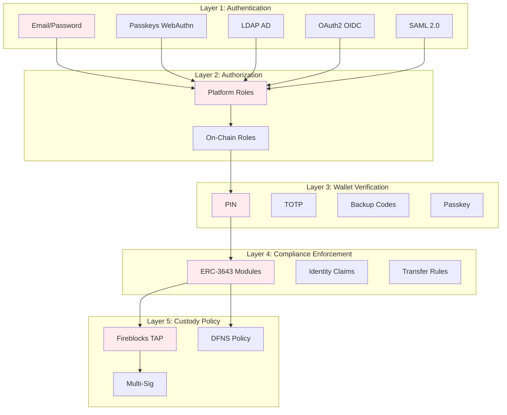
```mermaid
flowchart TB
    subgraph "Layer 1: Authentication"
        A[Email/Password]
        B[Passkeys WebAuthn]
        C[LDAP AD]
        D[OAuth2 OIDC]
        E[SAML 2.0]
    end
    
    subgraph "Layer 2: Authorization"
        F[Platform Roles]
        G[On-Chain Roles]
    end
    
    subgraph "Layer 3: Wallet Verification"
        H[PIN]
        I[TOTP]
        J[Backup Codes]
        K[Passkey]
    end
    
    subgraph "Layer 4: Compliance Enforcement"
        L[ERC-3643 Modules]
        M[Identity Claims]
        N[Transfer Rules]
    end
    
    subgraph "Layer 5: Custody Policy"
        O[Fireblocks TAP]
        P[DFNS Policy]
        Q[Multi-Sig]
    end
    
    A --> F
    B --> F
    C --> F
    D --> F
    E --> F
    F --> G
    G --> H
    H --> L
    L --> O
    L --> P
    O --> Q
    
    style A fill:#ffebee
    style F fill:#ffebee
    style H fill:#ffebee
    style L fill:#ffebee
    style O fill:#ffebee
```

No single-layer failure grants unauthorized access. Compromised credentials are blocked by wallet verification. Bypassed API authorization is blocked by on-chain compliance. Custody provider policies provide the final gate before transactions reach the blockchain.

## 6.2 Role-Based Access Control

DALP implements 26 distinct roles across four layers:

| Role Category | Count | Examples |
|---------------|-------|----------|
| Platform Roles | 3 | owner, admin, member |
| System People Roles | 9 | systemManager, identityManager, complianceManager, auditor |
| Per-Asset Roles | 7 | admin, governance, supplyManagement, custodian, emergency |
| System Module Roles | 7 | Module management, registry operations |

The dual-layer permission model ensures that off-chain platform roles (managed by Better Auth) and on-chain roles (managed by the AccessManager contract) must both pass for any blockchain write operation.

## 6.3 Key Management

DALP provides defense-in-depth key management with multiple storage backends:

| Storage Tier | Protection Level | Use Case |
|-------------|-----------------|----------|
| Encrypted database | Application-level encryption | Development, PoC |
| Cloud secret manager | Platform-managed encryption | Standard production |
| Hardware security module | FIPS 140-2 Level 3 | Regulated financial services |
| Third-party MPC custody | Institutional MPC (DFNS, Fireblocks) | Highest security |

MPC custody integration ensures that no single private key ever exists in one place. The unified signer abstraction makes custody providers interchangeable through configuration alone.

## 6.4 Certifications and Compliance

SettleMint maintains the certifications required for institutional procurement:

- **ISO 27001:** Certified information security management system
- **SOC 2 Type II:** Certified security controls over extended audit period
- **Regular penetration testing:** Independent third-party security assessments
- **Smart contract audits:** Specialized blockchain security review

## 6.5 Operational Governance

DALP supports comprehensive operational governance routines:

**Daily:** Exception review, pending action resolution, system health checks, transaction monitoring.

**Weekly:** Entitlement recertification, reconciliation sign-off, incident review, performance analysis.

**Monthly:** Threshold monitoring review, management reporting, compliance dashboard review, change control board.

The platform generates native reports and audit trails supporting these routines. Where offline controls are required (for example, manual committee approvals), DALP provides the evidence extraction capabilities needed for regulatory and internal audit review.

---

# 7. Integration and Interoperability

## 7.1 Integration Architecture

DALP is designed as an integration layer connecting enterprise systems with blockchain infrastructure:

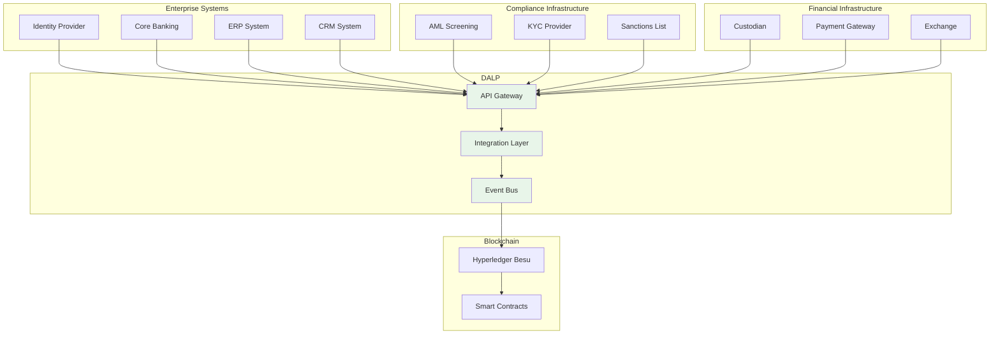
```mermaid
flowchart TB
    subgraph "Enterprise Systems"
        A[Identity Provider]
        B[Core Banking]
        C[ERP System]
        D[CRM System]
    end
    
    subgraph "Compliance Infrastructure"
        E[AML Screening]
        F[KYC Provider]
        G[Sanctions List]
    end
    
    subgraph "Financial Infrastructure"
        H[Custodian]
        I[Payment Gateway]
        J[Exchange]
    end
    
    subgraph "DALP"
        K[API Gateway]
        L[Integration Layer]
        M[Event Bus]
    end
    
    subgraph "Blockchain"
        N[Hyperledger Besu]
        O[Smart Contracts]
    end
    
    A --> K
    B --> K
    C --> K
    D --> K
    E --> K
    F --> K
    G --> K
    H --> K
    I --> K
    J --> K
    
    K --> L
    L --> M
    M --> N
    N --> O
    
    style K fill:#e8f5e9
    style L fill:#e8f5e9
    style M fill:#e8f5e9
```

Integration methods include:

| Method | Use Case | Authentication |
|--------|----------|----------------|
| REST API (OpenAPI 3.1) | System-to-system integration | API keys, SSO |
| TypeScript SDK | Node.js applications | API keys |
| Webhooks | Event-driven notifications | Configured per endpoint |
| Enterprise messaging | Corporate actions, settlement | API keys |

## 7.2 Data Flow Architecture

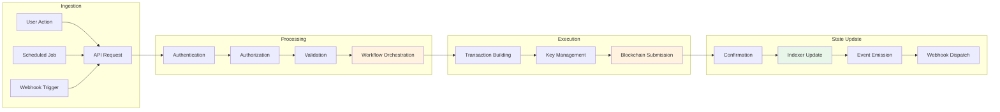
```mermaid
flowchart LR
    subgraph "Ingestion"
        A[User Action] --> B[API Request]
        C[Scheduled Job] --> B
        D[Webhook Trigger] --> B
    end
    
    subgraph "Processing"
        B --> E[Authentication]
        E --> F[Authorization]
        F --> G[Validation]
        G --> H[Workflow Orchestration]
    end
    
    subgraph "Execution"
        H --> I[Transaction Building]
        I --> J[Key Management]
        J --> K[Blockchain Submission]
    end
    
    subgraph "State Update"
        K --> L[Confirmation]
        L --> M[Indexer Update]
        M --> N[Event Emission]
        N --> O[Webhook Dispatch]
    end
    
    style H fill:#fff3e0
    style K fill:#fff3e0
    style M fill:#e8f5e9
```

Every operation flows through defined stages with complete audit logging. The indexer processes blockchain events into queryable state projections, enabling real-time operational dashboards and regulatory reporting.

## 7.3 Reconciliation Model

DALP provides reconciliation capabilities supporting coexistence with existing systems:

- **Blockchain-to-core reconciliation:** Platform records matched to internal books
- **Settlement reconciliation:** Matching with custody statements and payment confirmations
- **Position reconciliation:** Daily balance verification across all participants
- **Compliance reconciliation:** Verification that on-chain state matches off-chain compliance records

Reconciliation breaks are surfaced through operational tooling with clear ownership and escalation paths.

---

# 8. Implementation Methodology

## 8.1 Phase-Gated Delivery

SettleMint follows a structured 19-week implementation methodology refined through production deployments:

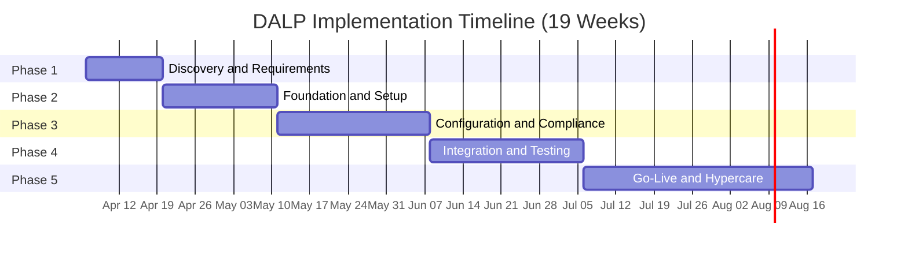
```mermaid
gantt
    title DALP Implementation Timeline (19 Weeks)
    dateFormat YYYY-MM-DD
    axisFormat %b %d
    
    section Phase 1
    Discovery and Requirements :a1, 2026-04-06, 2w
    
    section Phase 2
    Foundation and Setup :a2, after a1, 3w
    
    section Phase 3
    Configuration and Compliance :a3, after a2, 4w
    
    section Phase 4
    Integration and Testing :a4, after a3, 4w
    
    section Phase 5
    Go-Live and Hypercare :a5, after a4, 6w
```

| Phase | Duration | Focus | Key Outcome |
|-------|----------|-------|-------------|
| 1. Discovery and Requirements | 2 weeks | Requirements capture, architecture design, regulatory mapping | Validated requirements, target architecture, implementation roadmap |
| 2. Foundation and Setup | 3 weeks | Environment provisioning, network setup, identity framework | Functional platform environments ready for configuration |
| 3. Configuration and Compliance | 4 weeks | Asset types, compliance modules, feeds, operational workflows | Configured platform matching business and regulatory requirements |
| 4. Integration and Testing | 4 weeks | System integration, testing (functional, security, performance, UAT) | Validated, integrated system with formal go-live readiness |
| 5. Go-Live and Hypercare | 6 weeks | Production deployment (2 weeks) + intensive post-go-live support (4 weeks) | Production system with knowledge transfer and support transition |

## 8.2 Phase 1: Discovery and Requirements

**Objective:** Establish validated understanding of business objectives, technical landscape, regulatory environment, and operational requirements.

**Key Activities:**

- Stakeholder interviews (business sponsors, technology leadership, compliance officers, operations teams)
- Current-state assessment (existing systems, integration touchpoints, data flows)
- Regulatory and compliance mapping (Tadawul rules, AML/CFT requirements, investor eligibility)
- Asset class and lifecycle scoping (target instruments, lifecycle events, business rules)
- Architecture design (deployment topology, network design, integration architecture)

**Deliverables:**

- Business Requirements Document with acceptance criteria
- Regulatory and Compliance Matrix mapped to DALP modules
- Target Architecture Document
- Implementation Roadmap with milestones and risk register
- RACI Matrix for responsibility assignments
- Communication Plan

## 8.3 Phase 2: Foundation and Setup

**Objective:** Provision DALP environment, configure blockchain network, establish identity and access framework.

**Key Activities:**

- Environment provisioning (development, staging, production Kubernetes clusters)
- Network configuration (Hyperledger Besu validator deployment, consensus setup)
- Identity and access framework (OnchainID setup, RBAC configuration)
- Key management setup (HSM integration or custody provider configuration)
- Observability setup (monitoring dashboards, alert routing)

**Deliverables:**

- Provisioned environments (operational)
- Network Configuration Document
- Identity and Access Design
- Key Management Configuration
- Observability Setup Report
- Environment Validation Report

## 8.4 Phase 3: Configuration and Compliance

**Objective:** Configure asset types, compliance modules, data feeds, and operational workflows.

**Key Activities:**

- Token and asset configuration (asset templates, parameters, business rules, lifecycle events)
- Compliance module setup (identity verification, country restrictions, investor limits, supply caps)
- Claims and trusted issuer configuration (claim topics, trusted issuer registry, KYC integration)
- Feed configuration (price feeds, NAV feeds, exchange rate synchronization)
- Workflow design (issuance approval chains, transfer processing, exception handling)

**Deliverables:**

- Asset Configuration Documentation
- Compliance Module Configuration with test evidence
- Claims and Feed Configuration
- Integration Design Document
- Operational Workflow Documentation

## 8.5 Phase 4: Integration and Testing

**Objective:** Connect DALP to existing systems and validate against requirements.

**Key Activities:**

- API integration (core banking, custody, payment rails)
- Custody connector setup
- Functional testing (asset lifecycle, compliance enforcement, custody workflows, settlement)
- Security testing (penetration testing, authorization escalation, smart contract review)
- Performance testing (throughput, latency, capacity)
- User acceptance testing (business operations, compliance, technical operations)

**Deliverables:**

- Integrated System Landscape
- Functional, Security, Performance Test Reports
- UAT Sign-Off
- Go-Live Readiness Assessment

## 8.6 Phase 5: Go-Live and Hypercare

**Objective:** Execute production deployment and provide intensive post-go-live support.

**Go-Live (Weeks 14-15):**

- Production deployment following runbook
- Data migration with integrity validation
- Go-live validation (smoke tests)
- Dedicated support during deployment window

**Hypercare (Weeks 16-19):**

- Continuous monitoring and issue resolution
- Performance optimization based on production metrics
- Knowledge transfer (administrator, developer, end-user tracks)
- Operational readiness validation
- Support transition to contracted tier

**Deliverables:**

- Production Deployment Confirmation
- Hypercare Summary Report
- Complete Documentation Package
- Knowledge Transfer Completion Certificate
- Support Transition Plan

---

# 9. Delivery Approach and Timeline

## 9.1 Implementation Timeline

The following timeline assumes kickoff in early April 2026 with go-live targeted for late August 2026:

| Milestone | Target Date | Phase |
|-----------|-------------|-------|
| Kick-off Workshop | Week 1 | Phase 1 |
| Requirements Sign-off | Week 2 | Phase 1 |
| Environments Provisioned | Week 5 | Phase 2 |
| Configuration Complete | Week 9 | Phase 3 |
| Integration Complete | Week 13 | Phase 4 |
| UAT Sign-off | Week 13 | Phase 4 |
| Production Go-Live | Week 15 | Phase 5 |
| Hypercare Complete | Week 19 | Phase 5 |

## 9.2 Resource Requirements

**SettleMint Team:**

| Role | Involvement |
|------|-------------|
| Delivery Lead | Full-time throughout implementation |
| Solution Architect | Full-time Phase 1-3, on-call Phase 4-5 |
| Platform Engineers | 2-3 engineers, full-time Phase 2-5 |
| QA Lead | Full-time Phase 4, partial Phase 3 and 5 |

**Client Team:**

| Role | Involvement |
|------|-------------|
| Project Manager | Full-time throughout |
| Technical Lead | Full-time Phase 1-4, on-call Phase 5 |
| DevOps/Infrastructure | Full-time Phase 2-5 |
| Compliance/Risk | Full-time Phase 1 and 3, partial Phase 4 |

## 9.3 Client Responsibilities

Client responsibilities include:

- Timely stakeholder availability for decision-making and gate approvals
- Infrastructure provisioning (cloud accounts, Kubernetes clusters, networking)
- Integration endpoint access (API credentials, test environments)
- Regulatory requirements documentation and compliance rule definition
- UAT participation across business, operations, and compliance tracks
- Training attendance for knowledge transfer

---

# 10. Relevant Experience and References

## 10.1 Reference Projects Summary

SettleMint has delivered 14 production engagements spanning banking, sovereign institutions, capital markets, and real estate:

| # | Client | Region | Asset Class | Scope |
|---|--------|--------|-------------|-------|
| 1 | OCBC Bank | Singapore | Securities, bonds, real estate | Security token engine for HNWIs |
| 2 | KBC Securities | Belgium | Equity, SME loans | Crowdfunding issuance and lifecycle |
| 3 | Standard Chartered Bank | Asia/Africa/Middle East | Securities, currencies | Digital Virtual Exchange |
| 4 | State Bank of India | India | CBDC (e-Rupee) | CBDC infrastructure |
| 5 | Sony Bank (Sony Group) | Japan | Stablecoins, identity | Stablecoin issuance with KYC |
| 6 | Commerzbank | Germany | ETPs | Hybrid on/off-chain issuance |
| 7 | Saudi Arabia RER | Saudi Arabia | Real Estate | National-scale property blockchain |
| 8 | Maybank | Malaysia | FX tokens | Cross-border XvP settlement |
| 9 | ADI-Finstreet | Abu Dhabi | Equity | Tokenized equity on ADI mainnet |
| 10 | Islamic Development Bank | 57 countries | Subsidy, Collateral | Sharia-compliant distribution |

## 10.2 Detailed Reference: Saudi Arabia RER

**Scope:** National-scale blockchain infrastructure for property registration, fractionalization, and digital marketplace under REGA and Vision 2030.

**Key Outcomes:**

- First country in the world to deploy national-scale property blockchain
- Live production transactions since January 2026
- Four PropTechs (Sahl, Madek, Ghanem, Jozo) operational
- Smart contracts automate ownership transfers and tax compliance

**Relevance to Tadawul:** Demonstrates country-scale deployment capability, government integration, multi-party ecosystem support, and integration with national identity (Yakeen) and payment (Sadad) infrastructure.

## 10.3 Detailed Reference: Standard Chartered Bank

**Scope:** Blockchain-based Digital Virtual Exchange for securities tokenization with fractional ownership and instant settlement.

**Key Outcomes:**

- Settlement times reduced from days to near-instant finality
- Custody intermediary costs eliminated
- Immutable ownership records providing transparency

**Relevance to Tadawul:** Demonstrates institutional-grade compliance, multi-asset support, integration with existing banking infrastructure, and multi-region deployment across the Middle East.

## 10.4 Detailed Reference: Commerzbank

**Scope:** Hybrid on-chain/off-chain ETP issuance with Boerse Stuttgart listing and sub-10-second settlement.

**Key Outcomes:**

- Settlement reduced to under 10 seconds
- Potential annual savings of EUR 7 million
- Demonstrates blockchain coexistence with established exchange infrastructure

**Relevance to Tadawul:** Directly addresses the hybrid on-chain/off-chain concern that regulated institutions have. Shows integration with regulated venues and capital markets expertise.

---

# 11. Current Coverage, Gaps, and Mitigations

## 11.1 Requirement Coverage Matrix

This section addresses how DALP meets each Tadawul requirement and identifies any areas requiring clarification or client-side decisions.

| Requirement | DALP Coverage | Status |
|-------------|----------------|--------|
| REQ-01: Segregated environments | Full support (dev, test, UAT, DR, production) | Met |
| REQ-02: API-first interfaces | Full OpenAPI 3.1, TypeScript SDK, webhooks | Met |
| REQ-03: RBAC, segregation of duties, maker-checker | 26 roles, dual-layer model, wallet verification | Met |
| REQ-04: Configurable lifecycle, controls, limits | 12 compliance module types, expressions | Met |
| REQ-05: Third-party dependencies | Documented in dependency register | Met |
| REQ-06: Resilience, recovery, backup, monitoring | HA deployment, DR options, observability | Met |
| REQ-07: Delivery method, phased plan | 19-week methodology with clear phases | Met |
| REQ-08: Evidence extraction | Audit trails, reporting dashboards, export | Met |

## 11.2 Areas Requiring Client Input

The following areas require Tadawul input to finalize scope and configuration:

**Regulatory Framework Specifics:** Tadawul's digital asset rules require mapping to DALP compliance modules. The compliance library includes templates for major frameworks, but Kingdom of Saudi Arabia-specific rules may require custom configuration. SettleMint recommends a compliance mapping workshop during Phase 1 to finalize the configuration.

**Identity Provider Integration:** The proposal assumes integration with Tadawul's existing identity management infrastructure (Active Directory or equivalent). Specific integration requirements (protocol, authentication method, user provisioning) should be confirmed during discovery.

**Custody Model:** Tadawul has not specified a custody provider preference. DALP supports integration with Fireblocks, DFNS, or local signer options. The custody model decision affects integration scope and timeline.

**Integration Endpoints:** The proposal assumes connection to core banking, sanctions screening, and reporting systems. Specific API specifications and test environment access are required during Phase 2.

## 11.3 Risk Mitigation

| Risk | Likelihood | Impact | Mitigation |
|------|------------|--------|------------|
| Decision latency on compliance rules | Medium | Schedule slip | RACI matrix with named decision-makers; decision log with escalation |
| Integration complexity | Medium | Phase 4 extension | Integration design in Phase 3; mock interfaces for testing |
| Regulatory change | Low | Configuration rework | Modular compliance architecture; change-control process |
| Infrastructure readiness | Low | Phase 2 block | Prerequisites checklist in Phase 1; managed cloud fallback |
| Scope expansion | Medium | Timeline increase | Change-control with impact assessment; prioritization framework |

---

# 12. Appendix: Response Matrix

## 12.1 Technical Requirements Response

| Req ID | Requirement | Response | Evidence |
|--------|-------------|----------|----------|
| REQ-01 | Architecture must support segregated dev, test, UAT, DR, and production environments | DALP supports multiple isolated environments with separate Kubernetes namespaces, databases, and blockchain networks. Data residency controls ensure segregation. | Architecture documentation, deployment manifests |
| REQ-02 | Provide API-first interfaces, eventing, and version governance | Unified API with OpenAPI 3.1 specs, TypeScript SDK, webhooks for event-driven integration. API versioning follows standard practices with deprecation notices. | API documentation, SDK packages |
| REQ-03 | Support RBAC, segregation of duties, maker-checker controls, and complete audit logs | 26 roles across four layers. Dual-layer permission model (off-chain + on-chain). Wallet verification for all blockchain writes. Complete audit trail for every action. | Security documentation, role matrix |
| REQ-04 | Support configurable lifecycle states, policy controls, limits, exceptions, and reconciliations | 12 compliance module types with runtime configuration. Expression builder for complex rules. Native reconciliation tooling. | Compliance module documentation |
| REQ-05 | Disclose all third-party dependencies and operational responsibilities | All dependencies documented. Third-party services include cloud providers, custody providers, identity providers. | Dependency register (Appendix D) |
| REQ-06 | Evidence resilience, recovery, backup, monitoring, and incident-management capability | HA deployment options with RTO 2-15 minutes. Velero backup. Comprehensive observability stack with alerting. | DR documentation, observability setup |
| REQ-07 | Provide delivery method, client effort assumptions, and phased implementation plan | 19-week phased methodology with clear deliverables, gate reviews, and client responsibilities. | Implementation methodology section |
| REQ-08 | Support evidence extraction for audit, supervisory review, and board reporting | Complete audit trails, compliance dashboards, regulatory reports, export capabilities. | Reporting documentation |

## 12.2 Regulatory Requirements Response

| ID | Area | Response | Notes |
|----|------|----------|-------|
| RC-01 | Regulatory mapping | DALP compliance library includes templates for major frameworks. Kingdom of Saudi Arabia-specific mapping requires Phase 1 workshop. | Custom configuration expected |
| RC-02 | AML/CFT and sanctions | Integration with external AML/sanctions providers via API. On-chain compliance enforces KYC/AML claims from trusted issuers. | External provider integration required |
| RC-03 | Data governance | Data residency controls for Kingdom of Saudi Arabia deployment. Retention policies configurable. Encryption at rest and in transit. | Meets Tadawul data protection requirements |
| RC-04 | Operational resilience | Multiple DR options (cloud-native, hot-warm, hot-cold). Tested backup and restore procedures. | RTO/RPO targets configurable |
| RC-05 | Outsourcing and subcontractors | Full disclosure of cloud provider dependencies. SettleMint operates as prime contractor. | Dependency register |
| RC-06 | Assurance and audit | ISO 27001 and SOC 2 Type II certified. Comprehensive logging. Audit support through dedicated interfaces. | Certification attestations available |

---

# Document Control

| Version | Date | Author | Changes |
|---------|------|--------|---------|
| 1.0 | 2026-03-17 | SettleMint NV | Initial submission |

---

**End of Technical Proposal**

*This document is confidential and intended solely for the use of Tadawul Saudi Exchange.*
---

# 13. Detailed Technical Specifications

## 13.1 Blockchain Network Architecture

### 13.1.1 Network Topology

The blockchain network for Tadawul's tokenized securities platform operates as a permissioned network utilizing Hyperledger Besu with IBFT 2.0 (Istanbul Byzantine Fault Tolerant) consensus mechanism. This architecture provides the enterprise-grade characteristics required for regulated market infrastructure while maintaining the flexibility of EVM-compatible smart contracts.

The network topology consists of validator nodes responsible for block production and consensus, observer nodes that participate in network communication without block production rights, and RPC nodes that provide API endpoints for client applications. For production deployment in the Kingdom of Saudi Arabia, we recommend a minimum of four validator nodes distributed across separate availability zones within the region to ensure network resilience and fault tolerance.

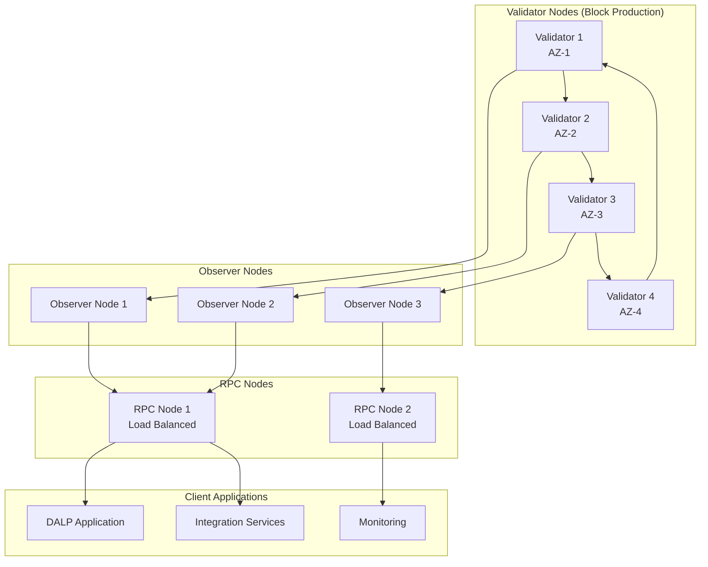
```mermaid
graph TB
    subgraph "Validator Nodes (Block Production)"
        V1[Validator 1<br/>AZ-1]
        V2[Validator 2<br/>AZ-2]
        V3[Validator 3<br/>AZ-3]
        V4[Validator 4<br/>AZ-4]
    end
    
    subgraph "Observer Nodes"
        O1[Observer Node 1]
        O2[Observer Node 2]
        O3[Observer Node 3]
    end
    
    subgraph "RPC Nodes"
        RPC1[RPC Node 1<br/>Load Balanced]
        RPC2[RPC Node 2<br/>Load Balanced]
    end
    
    subgraph "Client Applications"
        App1[DALP Application]
        App2[Integration Services]
        App3[Monitoring]
    end
    
    V1 --> V2
    V2 --> V3
    V3 --> V4
    V4 --> V1
    
    V1 --> O1
    V2 --> O2
    V3 --> O3
    
    O1 --> RPC1
    O2 --> RPC1
    O3 --> RPC2
    
    RPC1 --> App1
    RPC1 --> App2
    RPC2 --> App3
```

### 13.1.2 Consensus Mechanism

IBFT 2.0 consensus provides immediate block finality, eliminating the uncertainty associated with probabilistic finality in proof-of-stake networks. This characteristic is essential for financial applications where settlement certainty is paramount. The consensus mechanism requires that at least two-thirds of validator nodes agree on the canonical chain, providing Byzantine fault tolerance against up to one-third malicious or faulty nodes.

The block time configuration targets 1-2 seconds, providing sufficient throughput for tokenized securities trading while maintaining network stability. Block gas limits are configured to accommodate the expected transaction volume, with the ability to adjust dynamically based on network demand.

Transaction types supported include standard value transfers, smart contract deployments, and ERC-3643-compliant token transfers. The network enforces EIP-1559 fee market mechanisms for predictable gas pricing, with configurable gas price caps to prevent fee volatility from impacting operational predictability.

### 13.1.3 Privacy and Confidentiality

The platform implements multiple layers of privacy protection appropriate for regulated securities environments. Private transactions utilize Hyperledger Besu's privacy features to ensure that transaction details are visible only to authorized participants while maintaining network-wide verification.

For tokenized securities, privacy requirements vary by use case. Corporate bond issuances may require full transparency for regulatory compliance, while institutional block trades may require privacy from general market participants. The platform supports both public and private transaction modes, configurable at the asset level based on regulatory and business requirements.

On-chain data obfuscation techniques include encryption of sensitive fields within smart contract storage, zero-knowledge proofs for selective disclosure, and off-chain storage of confidential data with on-chain references. The architecture ensures that privacy controls are enforced at the protocol level rather than relying solely on application-layer protections.

## 13.2 Smart Contract Architecture

### 13.2.1 Contract Hierarchy

DALP's smart contract architecture follows a modular hierarchy that separates concerns while maintaining upgradeability. The contract hierarchy consists of the SMART Protocol foundation layer, system-level infrastructure contracts, asset-specific implementations, and addon modules.

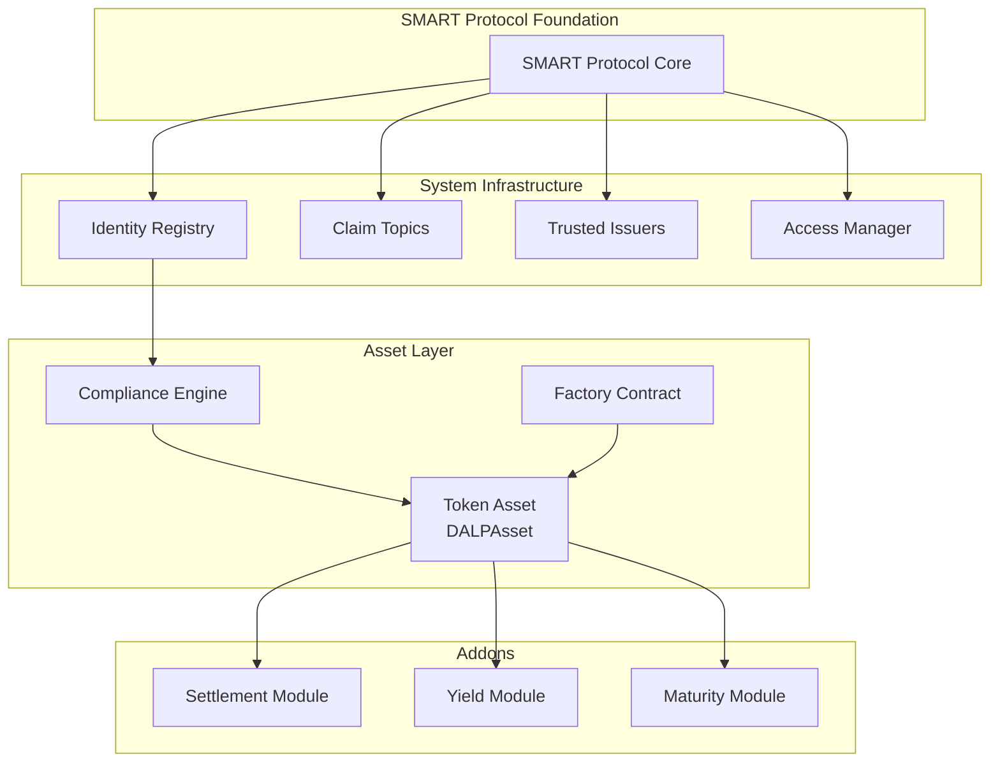
```mermaid
graph TB
    subgraph "SMART Protocol Foundation"
        SP[SMART Protocol Core]
    end
    
    subgraph "System Infrastructure"
        IR[Identity Registry]
        CL[Claim Topics]
        TI[Trusted Issuers]
        AM[Access Manager]
    end
    
    subgraph "Asset Layer"
        FA[Factory Contract]
        TA[Token Asset<br/>DALPAsset]
        CE[Compliance Engine]
    end
    
    subgraph "Addons"
        SET[Settlement Module]
        YLD[Yield Module]
        MAT[Maturity Module]
    end
    
    SP --> IR
    SP --> CL
    SP --> TI
    SP --> AM
    IR --> CE
    CE --> TA
    FA --> TA
    TA --> SET
    TA --> YLD
    TA --> MAT
```

The Identity Registry maintains the canonical record of all participant identities on the network. Each identity is represented by an OnchainID contract that holds claims issued by trusted parties. The registry supports identity lifecycle management including registration, suspension, and revocation.

The Compliance Engine evaluates transfer requests against configured compliance rules before execution. The engine operates as a modular framework where compliance modules can be added, removed, or modified without affecting other platform components. This modularity enables the platform to adapt to evolving regulatory requirements without requiring smart contract upgrades.

### 13.2.2 Token Standards Implementation

All tokenized securities on the platform implement ERC-3643 (T-REX), the recognized standard for regulated security tokens. This standard extends ERC-20 with identity and compliance requirements essential for securities applications.

The standard mandates four key components: the Identity Registry for participant verification, the Compliance Module for transfer validation, Trusted Issuers for identity claim attestation, and Transfer Manager for enforcing restrictions. These components work together to ensure that securities law compliance is enforced at the protocol level.

Token metadata follows a structured schema that captures essential security attributes including ISIN (International Securities Identification Number), asset class, jurisdiction, and regulatory status. The metadata is stored both on-chain for immutability and off-chain for query efficiency, with cryptographic linkages between the two storage layers.

### 13.2.3 Upgradeability Pattern

The platform utilizes UUPS (Universal Upgradeable Proxy Standard) upgradeability pattern, which allows smart contract logic to be updated while maintaining the same contract address and state. This pattern provides the flexibility to fix bugs, add features, and respond to regulatory changes without disrupting existing integrations.

Upgrade authority is restricted to a defined set of governance roles, with timelock controls ensuring that upgrades are announced before execution. The upgrade process follows a controlled procedure: proposed upgrades undergo security review, are announced through the governance system, and execute after a configurable delay period.

State migration between contract versions is handled through designated migration functions that ensure data integrity during upgrades. The upgradeability pattern includes emergency pause functionality that can halt the contract in exceptional circumstances, with defined recovery procedures.

## 13.3 API and Integration Architecture

### 13.3.1 API Design Principles

The DALP API follows RESTful principles with OpenAPI 3.1 specification. The design emphasizes predictability, consistency, and enterprise integration compatibility. All API endpoints follow consistent naming conventions, response structures, and error handling patterns.

The API architecture implements several key patterns: hypermedia links for navigation, pagination for large result sets, filtering and sorting for query flexibility, and optimistic concurrency control for concurrent updates. These patterns ensure that the API integrates smoothly with enterprise systems without requiring custom adaptation.

API versioning follows a URL-based approach with major version numbers. The current API version is v2, accessible at /api/v2. The versioning strategy ensures that existing integrations continue to function while new capabilities are introduced through version increments.

### 13.3.2 Authentication and Authorization

API authentication supports multiple mechanisms appropriate for different integration scenarios. API key authentication provides simple integration for system-to-system connections, with keys scoped to specific permissions and rate limits. OAuth 2.0 integration enables federated identity for user-facing applications.

All API traffic requires TLS 1.3 encryption, with certificate pinning available for mobile applications. Request authentication includes timestamp validation to prevent replay attacks, with configurable time window for acceptable request age.

Authorization uses a claims-based model where API keys or OAuth tokens carry defined permission scopes. The permission system aligns with the platform role model, ensuring that API access is consistent with dashboard and administrative access controls.

### 13.3.3 Event Streaming

Real-time event delivery utilizes a webhook architecture that pushes events to configured endpoints. Events are generated for significant platform activities including transaction submissions, settlement completions, compliance state changes, and administrative actions.

The event system implements at-least-once delivery semantics with idempotency keys to handle duplicate deliveries. Failed deliveries are retried with exponential backoff, with events preserved in a replay buffer for configurable retention periods.

Event types follow a consistent schema that includes event identifier, timestamp, event type, source system, and payload. The schema is versioned to allow API evolution while maintaining backward compatibility with existing consumers.

## 13.4 Data Architecture

### 13.4.1 Data Storage Layers

The platform implements a multi-layer data architecture that balances performance, durability, and regulatory requirements. The primary data store uses PostgreSQL for structured relational data, providing ACID compliance essential for financial applications.

Operational data includes user accounts, role assignments, asset configurations, and integration configurations. This data is stored in the primary PostgreSQL cluster with synchronous replication to standby nodes for high availability.

Blockchain state is indexed through a dedicated indexing layer that processes block events and maintains queryable data structures. The indexer maintains its own database for efficient querying without directly reading blockchain state.

Audit data is stored in an append-only format with independent retention policies. The audit store is designed for immutability, with cryptographic chaining that can demonstrate any tampering attempts.

### 13.4.2 Data Retention and Archiving

Data retention policies are configurable to meet regulatory requirements in different jurisdictions. Default retention periods can be defined for different data categories, with automated archival processes moving data to cost-effective storage after the retention period.

For the Kingdom of Saudi Arabia deployment, data residency requirements are met through deployment within the region with no cross-border data transfer. The architecture supports configurable data localization, ensuring that specific data categories can be restricted to specific geographic locations.

Data deletion follows configurable policies that support both operational cleanup and regulatory erasure requests. Deletion processes are logged and auditable, with cryptographic verification that deleted data is irrecoverable.

### 13.4.3 Backup and Recovery

Backup strategies are designed for different recovery objectives. Continuous archiving captures blockchain state and database changes in real-time, enabling point-in-time recovery. Snapshot-based backups provide daily restore points for bulk data recovery.

Backup encryption uses customer-managed keys stored in the platform's HSM infrastructure. Backup integrity is verified through cryptographic checksums, with regular restore testing to validate backup reliability.

Recovery procedures are documented and tested regularly. The platform supports recovery to alternate regions in case of regional disasters, with documented runbooks for common failure scenarios.

## 13.5 Performance and Scalability

### 13.5.1 Throughput Characteristics

The platform is designed to support high-throughput transaction processing appropriate for securities trading volumes. The blockchain network is configured for target throughput of 3,000-5,000 transactions per second under normal operating conditions, with horizontal scaling capabilities to accommodate growth.

Transaction confirmation times target 1-2 seconds under normal network conditions, providing the near-real-time confirmation required for trading applications. The platform monitors transaction queue depths and can automatically adjust resource allocation to maintain performance during demand spikes.

API endpoints are designed for sub-100ms response times for standard queries, with caching layers for frequently accessed data. Complex queries and reports are processed asynchronously with callback or polling mechanisms for result retrieval.

### 13.5.2 Horizontal Scaling

Application components scale horizontally through Kubernetes orchestration. Auto-scaling triggers based on CPU utilization, memory consumption, and custom metrics ensure that capacity matches demand while controlling costs.

The blockchain network scales through the addition of observer nodes, which increase network capacity without the governance requirements of validator additions. RPC nodes can be horizontally scaled behind load balancers to increase API throughput.

Database scaling utilizes read replicas for query-heavy workloads, with connection pooling to distribute load across available resources. Write-intensive workloads can be separated from analytical queries through dedicated database instances.

### 13.5.3 Performance Testing

The platform undergoes regular performance testing that simulates production load patterns. Tests include stress testing to identify breaking points, soak testing to identify memory leaks and degradation over time, and spike testing to validate auto-scaling response.

Performance benchmarks are documented and tracked over time to identify trends and regressions. Test results inform capacity planning and infrastructure sizing decisions for production deployments.

---

# 14. Integration Specifications

## 14.1 Integration Principles

Integration architecture follows the principle that the tokenized securities platform must integrate with existing enterprise systems rather than replacing them. This approach minimizes disruption, leverages existing investments, and accelerates adoption by fitting into established operational workflows.

All integrations are implemented through formal interface contracts with defined data schemas, error handling, and versioning. Interface specifications are documented in OpenAPI format and version-controlled alongside application code.

Integration testing utilizes mock services that simulate external system behavior, enabling parallel development and comprehensive testing without dependencies on external system availability.

## 14.2 Edaa Integration

### 14.2.1 Depository Connectivity

The platform integrates with Edaa (Securities Depository Center of Saudi Arabia) for securities depository functions. Integration supports the electronic recording of tokenized securities holdings, the facilitation of settlement transfers, and the generation of depository reports.

The integration architecture utilizes secure API communication with Edaa's specified interfaces. The integration handles message formatting, protocol translation, and error recovery to provide reliable connectivity.

Key integration points include: initial securities registration when tokenized securities are created, position updates reflecting changes in token holdings, settlement confirmation for trade settlement, and corporate action notifications for income distributions and corporate events.

### 14.2.2 Settlement Processing

Settlement processing coordinates with Edaa for the delivery leg of DvP (Delivery versus Payment) settlements. The process flow begins with trade execution notification, proceeds through settlement instruction submission, includes settlement matching and confirmation, and concludes with settlement completion notification.

The integration supports both real-time gross settlement and batch settlement modes depending on the settlement type and volume. Settlement windows are configurable to align with market operating hours and clearing cycles.

Failed settlement handling includes automatic retry mechanisms, exception queuing for manual intervention, and reconciliation reporting to identify and resolve discrepancies.

## 14.3 Muqassa Integration

### 14.3.1 Clearing Connectivity

Integration with Muqassa (Saudi Central Counterparty) provides clearing services for tokenized securities trades. The integration covers trade capture, margin calculation, position management, and risk management functions.

The clearing integration supports multiple clearing models including bilateral clearing for over-the-counter trades and central clearing for exchange-traded instruments. Margin calculations consider the specific risk characteristics of tokenized securities.

Real-time position feeds enable the platform to maintain accurate position records for compliance and reporting purposes. End-of-day clearing reports provide comprehensive trade and position summaries for reconciliation and regulatory reporting.

### 14.3.2 Risk Management

The clearing integration includes risk management controls that enforce Muqassa risk limits. Pre-trade checks validate that sufficient collateral is available before trade execution. Post-trade position monitoring tracks exposure against established limits.

Margin calls are generated automatically when positions exceed available coverage. The integration supports margin call notification through platform interfaces and external communication channels.

## 14.4 Broker System Integration

### 14.4.1 Order Management Connectivity

Broker system integration enables the platform to receive trade orders and execute settlements through broker order management systems. The integration follows standard financial messaging protocols for order entry, execution reporting, and confirmation.

Order types supported include market orders, limit orders, and conditional orders with various time-in-force specifications. The integration validates order parameters against platform rules before acceptance.

Execution reports flow back to the platform for settlement processing. The integration handles partial fills, cancellations, and modifications in accordance with order specifications.

### 14.4.2 Participant Management

The integration supports participant onboarding and management for broker firms. New broker participants are provisioned with appropriate access credentials, trading limits, and operational parameters.

Participant status changes including suspension and termination are synchronized between the platform and broker systems. The integration maintains participant master data consistency across connected systems.

## 14.5 CMA Reporting Integration

### 14.5.1 Regulatory Reporting

Integration with Capital Market Authority (CMA) reporting systems satisfies regulatory reporting obligations for tokenized securities activities. The integration covers transaction reports, position reports, and issuer-specific filings.

Report generation follows CMA-specified formats and frequencies. The platform maintains report templates that can be configured for specific regulatory requirements as they evolve.

Filing status is tracked within the platform, with automated reminders for approaching deadlines and escalation for failed filings.

### 14.5.2 Supervisory Access

The platform supports supervisory access arrangements that allow CMA regulators to view relevant platform data for oversight purposes. Access is provided through read-only interfaces with appropriate authentication and authorization controls.

Real-time monitoring feeds enable regulators to observe market activity without disrupting platform operations. Historical data access supports retrospective reviews and investigations.

---

# 15. Operational Readiness

## 15.1 Operational Model

### 15.1.1 Operating Model Design

The operating model defines how Tadawul will operate the tokenized securities platform on a day-to-day basis. The model covers incident management, change management, capacity management, and service level management functions.

The platform is designed for operations by a dedicated platform operations team with support from SettleMint according to the agreed support model. Operations staff require training on platform administration, integration management, and incident response procedures.

Operational workflows are documented in runbooks that provide step-by-step procedures for common operational tasks. Runbooks are maintained and updated based on operational experience and platform updates.

### 15.1.2 Monitoring and Observability

The platform implements comprehensive monitoring that covers infrastructure metrics, application performance, blockchain network health, and business metrics. Monitoring data feeds both operational dashboards and automated alerting systems.

Key monitoring domains include: infrastructure metrics (CPU, memory, disk, network), application metrics (response times, error rates, throughput), blockchain metrics (block production, gas prices, transaction queue depths), and business metrics (trade volumes, settlement success rates, compliance events).

Alerting is configured with severity levels that match operational impact. Critical alerts require immediate response, while warnings are tracked for investigation during normal operations.

### 15.1.3 Incident Management

Incident management follows a structured process that classifies incidents by severity and coordinates appropriate response. The incident management framework includes detection, classification, response, resolution, and post-incident review phases.

For critical incidents affecting production trading, the platform provides emergency access and escalation procedures. Incident response runbooks provide structured guidance for common failure scenarios.

Root cause analysis is performed for significant incidents, with findings documented and used to improve platform reliability. Trend analysis across incidents identifies systemic issues requiring architectural or operational improvements.

## 15.2 Change Management

### 15.2.1 Change Control Process

All platform changes follow a formal change control process that evaluates impact, obtains appropriate approvals, and schedules changes to minimize operational risk. Changes are classified as standard, normal, or emergency based on their impact and urgency.

Standard changes follow predefined procedures with automated approval. Normal changes require explicit approval from the change advisory board. Emergency changes can be expedited with post-implementation review.

Change scheduling considers platform maintenance windows and coordinates with dependent systems. Changes are scheduled to avoid peak trading periods and coordinated with market infrastructure partners.

### 15.2.2 Release Management

Platform releases follow a structured release management process that includes release planning, testing, deployment, and post-deployment verification. Releases are scheduled on a regular cadence with emergency patches available outside normal release windows.

Release testing includes functional testing, integration testing, performance testing, and security testing. Test results are reviewed before release approval.

Deployment follows a blue-green or canary deployment pattern that enables rapid rollback if issues are detected. Feature flags provide additional control over feature availability during and after deployment.

## 15.3 Capacity Management

### 15.3.1 Capacity Planning

Capacity planning ensures that the platform has sufficient resources to meet current and projected demand. The capacity planning process includes regular capacity assessments, growth forecasting, and capacity expansion recommendations.

Key capacity indicators are monitored continuously with trend analysis identifying when capacity thresholds will be approached. Capacity expansion is planned with sufficient lead time to avoid service degradation.

The architecture supports both vertical scaling (larger resources) and horizontal scaling (more resources) to accommodate growth efficiently.

### 15.3.2 Performance Management

Performance management ensures that platform performance meets service level objectives. Performance baselines are established for all critical transactions, with alerting when performance deviates from baselines.

Performance optimization follows a systematic process: measurement identifies bottlenecks, analysis determines root causes, and optimization implements solutions. Regular performance reviews identify optimization opportunities.

---

# 16. Additional Diagrams

## 16.1 Compliance Workflow Diagram

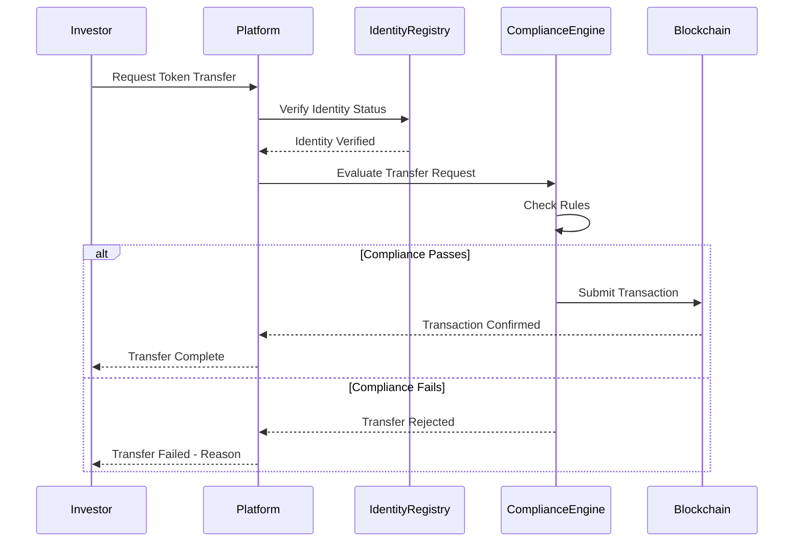
```mermaid
sequenceDiagram
    participant Investor
    participant Platform
    participant IdentityRegistry
    participant ComplianceEngine
    participant Blockchain
    
    Investor->>Platform: Request Token Transfer
    Platform->>IdentityRegistry: Verify Identity Status
    IdentityRegistry-->>Platform: Identity Verified
    
    Platform->>ComplianceEngine: Evaluate Transfer Request
    ComplianceEngine->>ComplianceEngine: Check Rules
    
    alt Compliance Passes
        ComplianceEngine->>Blockchain: Submit Transaction
        Blockchain-->>Platform: Transaction Confirmed
        Platform-->>Investor: Transfer Complete
    else Compliance Fails
        ComplianceEngine-->>Platform: Transfer Rejected
        Platform-->>Investor: Transfer Failed - Reason
    end
```

## 16.2 Settlement Flow Diagram

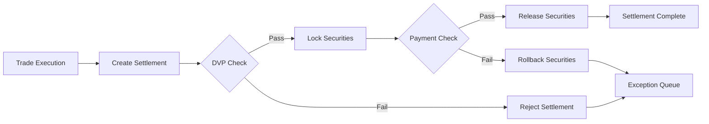
```mermaid
flowchart LR
    A[Trade Execution] --> B[Create Settlement]
    B --> C{DVP Check}
    C -->|Pass| D[Lock Securities]
    C -->|Fail| E[Reject Settlement]
    D --> F{Payment Check}
    F -->|Pass| G[Release Securities]
    F -->|Fail| H[Rollback Securities]
    G --> I[Settlement Complete]
    E --> J[Exception Queue]
    H --> J
```

## 16.3 Security Layers Diagram

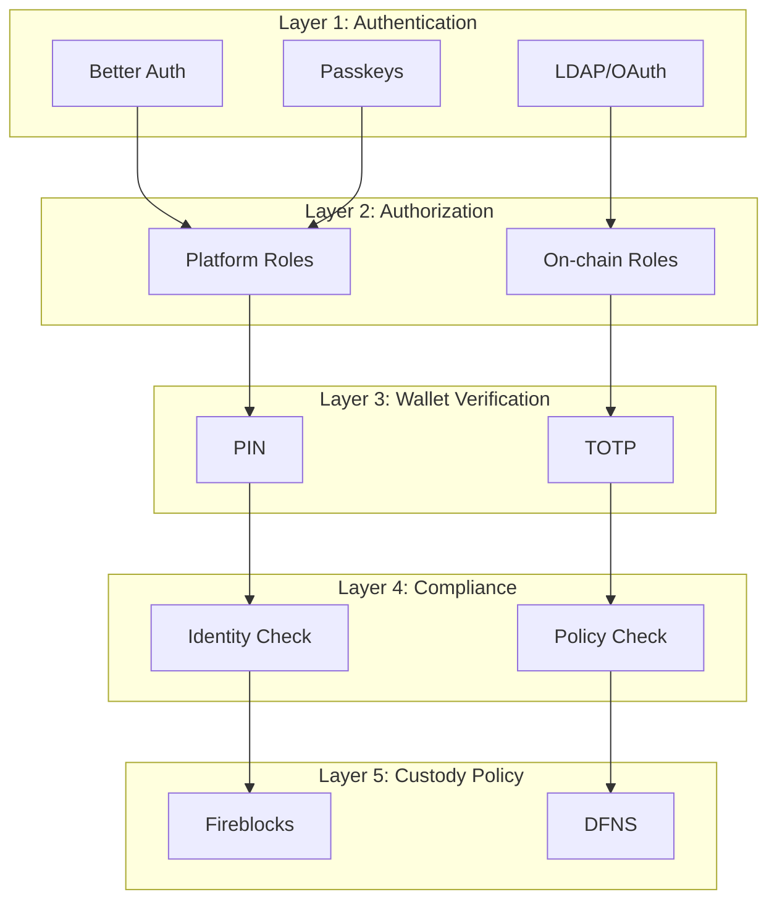
```mermaid
graph TB
    subgraph "Layer 1: Authentication"
        A1[Better Auth]
        A2[Passkeys]
        A3[LDAP/OAuth]
    end
    
    subgraph "Layer 2: Authorization"
        B1[Platform Roles]
        B2[On-chain Roles]
    end
    
    subgraph "Layer 3: Wallet Verification"
        C1[PIN]
        C2[TOTP]
    end
    
    subgraph "Layer 4: Compliance"
        D1[Identity Check]
        D2[Policy Check]
    end
    
    subgraph "Layer 5: Custody Policy"
        E1[Fireblocks]
        E2[DFNS]
    end
    
    A1 --> B1
    A2 --> B1
    A3 --> B2
    B1 --> C1
    B2 --> C2
    C1 --> D1
    C2 --> D2
    D1 --> E1
    D2 --> E2
```

## 16.4 Data Flow Architecture Diagram

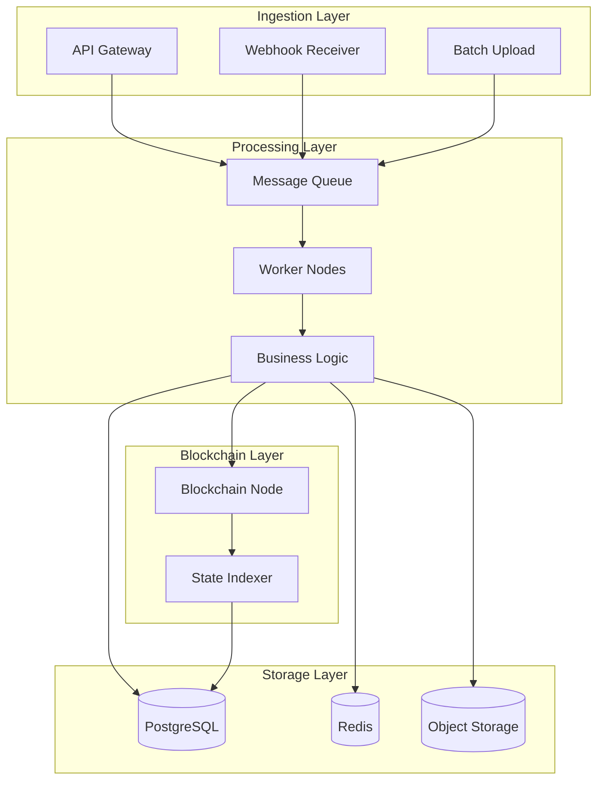
```mermaid
flowchart TB
    subgraph "Ingestion Layer"
        API[API Gateway]
        Webhook[Webhook Receiver]
        Batch[Batch Upload]
    end
    
    subgraph "Processing Layer"
        Queue[Message Queue]
        Worker[Worker Nodes]
        Engine[Business Logic]
    end
    
    subgraph "Storage Layer"
        DB[(PostgreSQL)]
        Cache[(Redis)]
        Object[(Object Storage)]
    end
    
    subgraph "Blockchain Layer"
        Node[Blockchain Node]
        Indexer[State Indexer]
    end
    
    API --> Queue
    Webhook --> Queue
    Batch --> Queue
    Queue --> Worker
    Worker --> Engine
    Engine --> DB
    Engine --> Cache
    Engine --> Object
    Engine --> Node
    Node --> Indexer
    Indexer --> DB
```

## 16.5 Deployment Pipeline Diagram

```mermaid
flowchart LR
    subgraph "Development"
        Code[Source Code]
        Unit[Unit Tests]
    end
    
    subgraph "CI/CD"
        Build[Build]
        Integrate[Integration Tests]
        Security[Security Scan]
        Image[Container Image]
    end
    
    subgraph "Environments"
        Dev[Dev]
        Test[Test]
        UAT[UAT]
        Stage[Staging]
        Prod[Production]
    end
    
    Code --> Unit
    Unit --> Build
    Build --> Integrate
    Integrate --> Security
    Security --> Image
    
    Image --> Dev
    Dev --> Test
    Test --> UAT
    UAT --> Stage
    Stage --> Prod
```

---

# 17. Glossary and Definitions

| Term | Definition |
|------|-------------|
| AAOIFI | Accounting and Auditing Organization for Islamic Financial Institutions |
| AMA | American Marketing Association |
| AML | Anti-Money Laundering |
| API | Application Programming Interface |
| CFT | Counter Financing of Terrorism |
| CMA | Capital Market Authority (Saudi Arabia) |
| DvP | Delivery versus Payment |
| Edaa | Securities Depository Center of Saudi Arabia |
| ERC | Ethereum Request for Comment |
| EVM | Ethereum Virtual Machine |
| HSM | Hardware Security Module |
| IBFT | Istanbul Byzantine Fault Tolerant |
| KSA | Kingdom of Saudi Arabia |
| KYC | Know Your Customer |
| Muqassa | Saudi Central Counterparty |
| NDA | Non-Disclosure Agreement |
| PDPL | Personal Data Protection Law (Saudi Arabia) |
| RBAC | Role-Based Access Control |
| SAMA | Saudi Central Bank |
| SLA | Service Level Agreement |
| T-REX | Token for Regulated Exchanges (ERC-3643) |
| UAT | User Acceptance Testing |
| UUPS | Universal Upgradeable Proxy Standard |
| XvP | Exchange versus Payment |

---

# Document Control

| Version | Date | Author | Changes |
|---------|------|--------|---------|
| 1.0 | 2026-03-17 | SettleMint NV | Initial submission |

---

**End of Technical Proposal**

*This document is confidential and intended solely for the use of Tadawul Saudi Exchange.*

---

# 18. Saudi Market Context

## 18.1 Saudi Vision 2030 Alignment

The Kingdom of Saudi Arabia's Vision 2030 establishes ambitious targets for financial sector development, with capital market modernization as a key pillar. The tokenized securities initiative aligns directly with Vision 2030 objectives for deepening capital markets, enhancing financial inclusion, and positioning the Kingdom as a regional financial hub.

The initiative supports several Vision 2030 financial sector goals: increasing the share of foreign investors in the Saudi market, developing capital market infrastructure to meet international standards, enabling innovative financial products and services, and developing the financial technology sector. Tokenized securities address each of these objectives through enhanced liquidity, broader investor access, operational efficiency, and technology innovation.

The partnership between Tadawul and SettleMint contributes to Vision 2030's localization objectives through knowledge transfer, capability building, and potential collaboration with local technology partners. The implementation approach prioritizes building Saudi expertise in digital asset operations, creating a foundation for the Kingdom's growing fintech sector.

## 18.2 Regulatory Development

The regulatory framework for tokenized securities in the Kingdom of Saudi Arabia continues to develop. The Capital Market Authority (CMA) has signaled openness to digital asset innovation while maintaining investor protection as a priority. Several regulatory developments shape the operating environment.

The CMA's regulatory sandbox provides a controlled environment for testing innovative products and services, including tokenized securities. The sandbox enables experimentation with reduced regulatory burden while demonstrating compliance capabilities. The platform architecture supports sandbox participation through configurable compliance rules and enhanced monitoring.

Islamic finance considerations are particularly relevant for the Saudi market. Tokenized sukuk structures must comply with Sharia principles as interpreted by the Saudi Arabian Monetary Authority and recognized Sharia boards. The platform supports sukuk-specific structures including profit distribution mechanisms, asset backing requirements, and Sharia compliance documentation.

Data protection requirements under Saudi Arabia's Personal Data Protection Law (PDPL) affect how investor data is collected, processed, and stored. The platform's data governance framework supports PDPL compliance through data localization, consent management, and data subject rights implementation.

## 18.3 Market Infrastructure

The Saudi capital market infrastructure provides the foundation for tokenized securities operations. Understanding this infrastructure is essential for successful integration.

The Securities Depository Center (Edaa) provides central securities depository services for the Saudi market. Edaa maintains investor accounts, processes settlement, and provides corporate actions processing. Integration with Edaa is essential for tokenized securities to function within the established market structure.

The Saudi Central Counterparty (Muqassa) provides clearing services including trade confirmation, margin calculation, and risk management. Integration with Muqassa enables the platform to leverage established clearing infrastructure while extending it to tokenized securities.

Broker member firms execute trades on behalf of investors. The platform integrates with broker order management systems, enabling tokenized securities to be traded through existing broker relationships. This integration leverages established distribution networks rather than requiring new infrastructure.

## 18.4 Competitive Positioning

The tokenized securities platform positions Tadawul competitively within the Gulf region and internationally. Regional exchanges in the UAE, Qatar, and Bahrain are exploring similar initiatives, making timely execution important for maintaining competitive position.

The platform enables Tadawul to offer unique capabilities: fractional ownership of high-value securities, atomic settlement reducing counterparty risk, enhanced compliance through ex-ante enforcement, and modernized infrastructure appealing to technology-savvy investors. These capabilities differentiate Tadawul from both traditional exchanges and emerging digital asset platforms.

International competitiveness depends on demonstrating regulatory compliance, operational reliability, and integration with global market infrastructure. The platform's architecture supports international expansion once regulatory frameworks permit cross-border tokenized securities trading.

---

# 19. Implementation Deep Dive

## 19.1 Phase 1: Discovery and Requirements

The Discovery and Requirements phase establishes the foundation for successful implementation through rigorous analysis and planning.

### 19.1.1 Stakeholder Interviews

The phase begins with stakeholder interviews across Tadawul's business, technology, risk, compliance, and operations functions. These interviews capture current state, pain points, requirements, and success criteria from all perspectives. The interview process typically involves 15-20 sessions with key stakeholders.

Interview outputs are synthesized into a requirements document that captures functional requirements (what the system must do), non-functional requirements (how the system must perform), integration requirements (how the system must connect), and regulatory requirements (what compliance must be demonstrated).

### 19.1.2 Regulatory Mapping

Regulatory mapping workshops engage Tadawul's compliance and legal teams to document applicable regulatory requirements. The workshops identify specific rules that must be enforced, reporting obligations that must be satisfied, and governance requirements that must be implemented.

The regulatory mapping output is a compliance matrix that maps platform capabilities to specific regulatory requirements. The matrix identifies where platform capabilities directly satisfy requirements, where configuration is required, and where custom development might be needed.

### 19.1.3 Architecture Design

The architecture design sessions establish the target technical architecture including infrastructure design, network topology, integration patterns, and security controls. Architecture decisions are documented in an Architecture Decision Record (ADR) format that captures context, decision, consequences, and alternatives considered.

Key architecture decisions for the Kingdom of Saudi Arabia deployment include: cloud provider selection based on region availability and data residency, network design for secure connectivity, integration architecture for market infrastructure connections, and security controls meeting Saudi cybersecurity requirements.

### 19.1.4 Phase Gate Review

Phase 1 concludes with a formal gate review that presents deliverables and obtains approval to proceed. Deliverables include the Requirements Document, Regulatory Compliance Matrix, Architecture Design Document, and Implementation Roadmap.

Gate review approval requires sign-off from Tadawul's project sponsor, technical lead, and compliance representative. Approval authorizes phase 2 budget and proceeds to Foundation and Setup.

## 19.2 Phase 2: Foundation and Setup

The Foundation and Setup phase provisions the technical infrastructure required for platform operation.

### 19.2.1 Environment Provisioning

Environment provisioning creates isolated Kubernetes clusters for each environment (development, test, UAT, production). Each cluster is configured with appropriate compute, storage, and networking resources. Environments are provisioned with separation appropriate for the data classification they will handle.

The provisioning process utilizes infrastructure-as-code templates that ensure consistency across environments and enable rapid recreation if needed. Templates are version-controlled and peer-reviewed before deployment.

### 19.2.2 Network Configuration

Network configuration establishes the network topology required for platform operation. This includes virtual private networks for each environment, load balancers for API access, firewall rules for security, and VPN connectivity for operational access.

For the Kingdom of Saudi Arabia deployment, network configuration ensures that all traffic remains within the region and that appropriate security controls are implemented per Saudi cybersecurity requirements.

### 19.2.3 Blockchain Network Deployment

The blockchain network deployment establishes the permissioned network that will process tokenized securities transactions. Deployment includes validator node setup, observer node configuration, and RPC node provisioning.

Network deployment follows a phased approach: initial deployment in development environment, testing and tuning, deployment to staging, and final production deployment. Each phase validates network behavior before proceeding.

### 19.2.4 Platform Installation

Platform installation deploys the DALP application components into the provisioned environments. Installation utilizes Helm charts that define the application stack, configuration, and dependencies. Installation scripts ensure consistent deployment across environments.

Post-installation verification confirms that all components are running correctly and that basic functionality is operational. Verification includes automated tests that exercise core platform capabilities.

## 19.3 Phase 3: Configuration and Compliance

The Configuration and Compliance phase customizes the platform for Tadawul's specific requirements.

### 19.3.1 Asset Configuration

Asset configuration establishes the tokenized securities that will be supported on the platform. Configuration includes defining asset classes (bonds, equities, funds), specifying token parameters (supply, decimals, transferability), and configuring metadata capture.

For the initial scope, configuration focuses on corporate bonds, sukuk, and equity instruments. Configuration follows the Asset Designer wizard, which guides administrators through the required parameters while validating inputs against rules.

### 19.3.2 Compliance Configuration

Compliance configuration implements the regulatory requirements identified during Phase 1. Configuration includes setting up compliance modules, defining investor eligibility rules, configuring jurisdiction restrictions, and establishing transfer limits.

The compliance configuration process follows a test-first approach: rules are defined in a test environment, validated against test cases representing edge conditions, and refined before production deployment.

### 19.3.3 Role and Permission Configuration

Role and permission configuration establishes the access control model that will govern platform operation. Configuration includes defining roles, assigning permissions to roles, and mapping users to roles.

The configuration process engages Tadawul's security and compliance teams to ensure that the role model aligns with organizational segregation of duties requirements. The role model is documented for audit purposes.

### 19.3.4 Integration Configuration

Integration configuration prepares the connections to external systems that will exchange data with the platform. Configuration includes defining connection parameters, establishing authentication credentials, and configuring message formats.

Integration configuration is validated through mock testing before connecting to production external systems. Mock testing validates message handling without requiring external system availability.

## 19.4 Phase 4: Integration and Testing

The Integration and Testing phase validates that the platform operates correctly within the broader system landscape.

### 19.4.1 System Integration

System integration establishes connectivity with external systems including Edaa, Muqassa, broker systems, and CMA reporting. Integration follows the interface specifications developed during Phase 1.

Integration is validated through end-to-end testing that confirms data flows correctly between systems. Integration issues are identified and resolved before proceeding to user testing.

### 19.4.2 Functional Testing

Functional testing validates that platform capabilities work as specified. Testing covers all documented functional requirements with test cases that exercise normal paths, edge conditions, and error handling.

Testing is performed by the implementation team during development, with formal testing during the UAT phase. Test results are documented with pass/fail status and any defects identified.

### 19.4.3 Non-Functional Testing

Non-functional testing validates that the platform meets performance, scalability, and resilience requirements. Testing includes load testing to validate throughput, stress testing to identify breaking points, and resilience testing to confirm recovery capabilities.

Non-functional testing results are compared against the requirements documented in Phase 1. Any shortfalls are addressed through configuration changes or infrastructure adjustments.

### 19.4.4 Security Testing

Security testing validates that security controls are effective. Testing includes vulnerability scanning to identify potential weaknesses, penetration testing to validate controls, and access testing to confirm authorization enforcement.

Security testing is performed by the SettleMint security team and may include third-party verification depending on Tadawul's requirements. Testing results are documented with any vulnerabilities identified and remediation actions.

### 19.4.5 User Acceptance Testing

User Acceptance Testing (UAT) validates that the platform meets business requirements from the user perspective. UAT is performed by Tadawul business users with support from the implementation team.

UAT scenarios cover typical business workflows including asset creation, investor onboarding, trading, settlement, and reporting. Test results are documented with any issues identified for resolution.

## 19.5 Phase 5: Go-Live and Hypercare

The Go-Live and Hypercare phase transitions the platform to production operation.

### 19.5.1 Production Deployment

Production deployment promotes the validated platform from staging to production. Deployment follows a controlled process with rollback capability if issues are detected.

Deployment timing is coordinated with Tadawul to minimize operational impact. Typically, production deployment occurs during a planned maintenance window with stakeholder notification.

### 19.5.2 Hypercare Support

Hypercare provides intensive post-go-live support to ensure smooth operational transition. During hypercare, the implementation team is available to address any issues that arise and to support operational teams as they assume responsibility.

Hypercare typically spans four weeks following go-live, with decreasing support intensity as the operational team gains confidence. The hypercare period is included in the implementation investment.

### 19.5.3 Knowledge Transfer

Knowledge transfer ensures that Tadawul's team can operate the platform independently. Transfer includes formal training sessions, documentation review, and supervised operational activities.

Knowledge transfer is documented through training completion records and operational competency assessments. The goal is for Tadawul's team to demonstrate independent operational capability by the conclusion of hypercare.

### 19.5.4 Programme Closure

Programme closure formalizes the transition from implementation to operational support. Closure activities include final documentation delivery, outstanding issues resolution, and transition to ongoing support.

Programme closure concludes with a formal sign-off that confirms implementation completion. Sign-off authorizes the transition to ongoing support and releases any remaining implementation budget.

---

# 20. Conclusion

## 20.1 Summary

This technical proposal presents DALP as the foundation for Tadawul Saudi Exchange's tokenized securities listing and market-operations platform. The proposal demonstrates how DALP addresses the complex requirements of regulated market infrastructure while providing the flexibility to adapt to evolving regulatory and business needs.

The platform provides comprehensive capabilities across the digital asset lifecycle: issuance, compliance, custody, settlement, servicing, and reporting. The architecture ensures security through five independent layers, compliance through ex-ante enforcement, and operational resilience through enterprise-grade design.

SettleMint brings demonstrated experience in delivering production-grade digital asset platforms to regulated institutions globally. Our regional presence in the Gulf and experience with similar market infrastructure providers position us to understand and address Tadawul's specific requirements.

## 20.2 Call to Action

We propose a next step of a detailed discovery session to refine requirements and validate the proposed approach. This session would engage Tadawul's stakeholders to confirm understanding, address questions, and establish the detailed implementation plan.

The discovery session would produce a refined implementation roadmap with specific dates, resource requirements, and success criteria. The session output provides the foundation for final commercial negotiations and contract execution.

SettleMint looks forward to partnering with Tadawul to establish the Kingdom's tokenized securities infrastructure and to contribute to Vision 2030 financial sector development objectives.

---

# Document Control

| Version | Date | Author | Changes |
|---------|------|--------|---------|
| 1.0 | 2026-03-17 | SettleMint NV | Initial submission |

---

**End of Technical Proposal**

*This document is confidential and intended solely for the use of Tadawul Saudi Exchange.*

---

# 21. Risk Register and Mitigation

## 21.1 Risk Identification

This section documents key risks identified for the programme and proposed mitigations.

### 21.1.1 Regulatory Risks

| Risk | Likelihood | Impact | Mitigation |
|------|------------|--------|------------|
| Regulatory framework changes during implementation | Medium | High | Modular compliance architecture; early regulatory engagement |
| Compliance requirements not fully understood | Medium | Medium | Compliance mapping workshops in Phase 1; iterative refinement |
| Regulatory approval delays | Low | High | Parallel workstreams; contingency planning |

### 21.1.2 Technical Risks

| Risk | Likelihood | Impact | Mitigation |
|------|------------|--------|------------|
| Integration complexity exceeds estimates | Medium | Medium | Early integration prototyping; buffer in timeline |
| Blockchain network performance issues | Low | High | Performance testing; infrastructure sizing |
| Platform scaling limitations | Low | Medium | Load testing; architecture review |

### 21.1.3 Operational Risks

| Risk | Likelihood | Impact | Mitigation |
|------|------------|--------|------------|
| Knowledge transfer insufficient | Medium | High | Structured training; competency validation |
| Operational readiness gaps | Medium | Medium | Extended hypercare; detailed runbooks |
| Incident response capability | Low | Medium | Playbook development; war room exercises |

### 21.1.4 Schedule Risks

| Risk | Likelihood | Impact | Mitigation |
|------|------------|--------|------------|
| Decision-making delays | Medium | Medium | RACI matrix; escalation process |
| Scope creep | High | Medium | Change control; prioritization framework |
| Resource availability | Low | Medium | Resource planning; contingency |

## 21.2 Risk Monitoring

Risks are monitored throughout the programme through:

- Weekly risk review in working sessions
- Monthly risk reporting to steering committee
- Risk register updates as conditions change
- Trigger-based escalation for emerging risks

---

# 22. Quality Assurance

## 22.1 Testing Strategy

The testing strategy ensures that the platform meets all requirements before go-live.

### 22.1.1 Unit Testing

Unit tests verify individual component functionality. All platform components include unit tests with minimum 80% code coverage. Tests are executed automatically on every code commit.

### 22.1.2 Integration Testing

Integration tests verify that components work correctly together. Tests cover API integrations, database operations, and blockchain interactions. Integration tests are executed daily and on every release candidate.

### 22.1.3 System Testing

System tests verify end-to-end functionality from user perspective. Tests cover all documented functional requirements. System tests are executed in the staging environment before UAT.

### 22.1.4 User Acceptance Testing

UAT is performed by Tadawul business users. Test scenarios cover typical business workflows. UAT defects are tracked through resolution and regression testing.

### 22.1.5 Security Testing

Security testing includes:

- Automated vulnerability scanning
- Manual penetration testing
- Access control validation
- Encryption verification

Security tests are executed by the SettleMint security team and may include third-party verification.

## 22.2 Quality Metrics

| Metric | Target | Measurement |
|--------|--------|-------------|
| Test case execution | 100% | Automated test runner |
| Critical defects | 0 open | Defect tracking |
| UAT defects | <10 open | Defect tracking |
| Security vulnerabilities | 0 High/Critical | Security scanning |
| Code coverage | >80% | Coverage tooling |

---

# 23. Training and Enablement

## 23.1 Training Programme

The training programme ensures that Tadawul's team can operate the platform effectively.

### 23.1.1 Administrator Training

Administrator training covers:

- Platform architecture and components
- Configuration and administration
- User and role management
- Integration management
- Monitoring and troubleshooting

Training format: 5-day instructor-led course

### 23.1.2 Operator Training

Operator training covers:

- Daily operational procedures
- Monitoring and alerting response
- Incident escalation
- Reporting and analytics
- Support ticket handling

Training format: 3-day instructor-led course

### 23.1.3 Technical Training

Technical training covers:

- Integration development
- Custom configuration
- Troubleshooting advanced issues
- Performance optimization

Training format: 5-day instructor-led course

## 23.2 Enablement Resources

| Resource | Description | Access |
|----------|-------------|--------|
| Documentation | Complete platform documentation | Online portal |
| Knowledge Base | Troubleshooting guides | Online portal |
| Video Library | How-to videos | Online portal |
| Community Forum | Peer discussion | Online portal |
| Office Hours | Q&A sessions | Monthly |

---

# 24. Support and Maintenance

## 24.1 Support Model

The support model provides multiple tiers to match different support needs.

### 24.1.1 Standard Tier

Standard tier provides:

- 8x5 business hours coverage
- Email and ticket support
- 4-hour response for critical issues
- Business days: Monday-Friday, 9:00-18:00 AST

### 24.1.2 Premium Tier

Premium tier provides:

- 12x7 extended coverage
- Email, ticket, and phone support
- 2-hour response for critical issues
- Extended hours: Monday-Saturday, 7:00-22:00 AST

### 24.1.3 Enterprise Tier

Enterprise tier provides:

- 24/7 coverage
- Dedicated support team
- 30-minute response for critical issues
- Named technical account manager

## 24.2 Incident Management

### 24.2.1 Incident Classification

| Severity | Definition | Response Time (Enterprise) |
|----------|------------|---------------------------|
| Critical | Production system down | 30 minutes |
| High | Major function impaired | 2 hours |
| Medium | Minor function impaired | 4 hours |
| Low | General inquiry | 24 hours |

### 24.2.2 Incident Process

1. Detection: Automatic or reported
2. Classification: Support team assigns severity
3. Response: Initial acknowledgment and triage
4. Resolution: Fix implemented and verified
5. Closure: Customer confirmation
6. Review: Root cause analysis for major incidents

## 24.3 Maintenance Windows

### 24.3.1 Planned Maintenance

Planned maintenance is performed during:

- Monthly windows: First Sunday of month, 02:00-06:00 AST
- Emergency windows: As required with 72-hour notice

### 24.3.2 Unplanned Maintenance

Unplanned maintenance (security patches, critical fixes) is performed as needed with maximum practical notice. Emergency maintenance may occur without notice for critical vulnerabilities.

---

# Document Control

| Version | Date | Author | Changes |
|---------|------|--------|---------|
| 1.0 | 2026-03-17 | SettleMint NV | Initial submission |

---

**End of Technical Proposal**

*This document is confidential and intended solely for the use of Tadawul Saudi Exchange.*

---

# 25. Appendices

## Appendix A: Technology Standards

### A.1 Blockchain Standards

| Standard | Description | DALP Implementation |
|----------|-------------|---------------------|
| ERC-20 | Token interface | Base compatibility |
| ERC-3643 | Compliance tokens | Primary implementation |
| ERC-734 | Identity key management | OnchainID integration |
| ERC-735 | Identity claims | Claims verification |
| ERC-2771 | Meta-transactions | Gasless transactions |
| EIP-1559 | Fee market | Gas optimization |

### A.2 API Standards

| Standard | Description | DALP Implementation |
|----------|-------------|---------------------|
| OpenAPI 3.1 | API specification | Full specification |
| REST | Architectural style | Primary API style |
| JSON | Data format | Primary format |
| OAuth 2.0 | Authorization | Integration support |

### A.3 Security Standards

| Standard | Description | DALP Implementation |
|----------|-------------|---------------------|
| TLS 1.3 | Transport encryption | All connections |
| HSM | Key storage | Hardware security |
| JWT | Token format | Session management |

---

## Appendix B: Integration Specifications

### B.1 Edaa Integration Interface

**Connection Type:** REST API

**Authentication:** Mutual TLS + API Key

**Key Operations:**

| Operation | Direction | Description |
|-----------|-----------|-------------|
| Register Security | Outbound | Register new tokenized security |
| Update Position | Inbound | Update investor positions |
| Settlement Confirm | Inbound | Settlement completion |
| Corporate Action | Inbound | Dividends, distributions |

### B.2 Muqassa Integration Interface

**Connection Type:** REST API

**Authentication:** Mutual TLS + OAuth 2.0

**Key Operations:**

| Operation | Direction | Description |
|-----------|-----------|-------------|
| Submit Trade | Outbound | Submit trade for clearing |
| Margin Query | Outbound | Check margin requirements |
| Position Report | Inbound | Clearing positions |
| Settlement Instruction | Inbound | Settlement instructions |

### B.3 Broker Integration Interface

**Connection Type:** FIX Protocol / REST API

**Authentication:** Certificate + API Key

**Key Operations:**

| Operation | Direction | Description |
|-----------|-----------|-------------|
| Order Submission | Inbound | Receive trade orders |
| Execution Report | Outbound | Report executions |
| Position Update | Outbound | Update positions |
| Confirmation | Outbound | Trade confirmation |

---

## Appendix C: Compliance Mapping

### C.1 CMA Requirements Mapping

| CMA Requirement | DALP Capability | Implementation |
|----------------|-----------------|----------------|
| Investor verification | Identity registry | OnchainID integration |
| Transfer restrictions | Compliance engine | Configurable rules |
| Reporting | Reporting module | Automated reports |
| Record keeping | Audit logging | Immutable trails |
| Segregation of duties | Role model | 26-role system |

### C.2 SAMA Requirements Mapping

| SAMA Requirement | DALP Capability | Implementation |
|------------------|-----------------|----------------|
| AML/CFT controls | Compliance engine | Rule-based screening |
| Transaction monitoring | Event logging | Full traceability |
| Sanctions screening | External integration | API connection |
| Suspicious reporting | Alert module | Automated flags |

### C.3 PDPL Requirements Mapping

| PDPL Requirement | DALP Capability | Implementation |
|------------------|-----------------|----------------|
| Data residency | Regional deployment | KSA-only storage |
| Consent management | User profiles | Opt-in controls |
| Data subject rights | Export tools | Access/delete |
| Retention | Policy engine | Configurable policies |

---

## Appendix D: Role Definitions

### D.1 Platform Administration Roles

| Role | Permissions |
|------|-------------|
| Platform Admin | Full system configuration |
| User Admin | User lifecycle management |
| Auditor | Read-only audit access |
| API Manager | API key management |

### D.2 Asset Roles

| Role | Permissions |
|------|-------------|
| Issuer Admin | Asset creation and management |
| Supply Manager | Token minting and burning |
| Asset Viewer | Read-only asset access |

### D.3 Compliance Roles

| Role | Permissions |
|------|-------------|
| Compliance Admin | Compliance rule configuration |
| Investigator | Compliance investigation access |
| Reporter | Regulatory report generation |

### D.4 Settlement Roles

| Role | Permissions |
|------|-------------|
| Trader | Trade execution |
| Settler | Settlement processing |
| Approver | Settlement approval |

---

## Appendix E: Glossary

| Term | Definition |
|------|------------|
| Atomic Settlement | Settlement that either completes fully or reverts completely |
| Compliance Engine | Smart contract that enforces transfer rules |
| DvP | Delivery versus Payment - simultaneous asset and payment exchange |
| ERC-3643 | Ethereum standard for compliance tokens |
| Identity Registry | On-chain record of verified identities |
| KSA | Kingdom of Saudi Arabia |
| OnchainID | Decentralized identity standard |
| T-REX | Token for Reguled Exchanges - compliance token framework |
| XvP | Exchange versus Payment - multi-asset atomic exchange |

---

# Document Control

| Version | Date | Author | Changes |
|---------|------|--------|---------|
| 1.0 | 2026-03-17 | SettleMint NV | Initial submission |

---

**End of Technical Proposal**

*This document is confidential and intended solely for the use of Tadawul Saudi Exchange.*

---

# 26. Detailed System Specifications

## 26.1 Infrastructure Requirements

### 26.1.1 Compute Requirements

The platform requires compute resources across multiple environments. Production environment specifications ensure high availability and performance.

| Component | Production | Staging | Development |
|-----------|------------|---------|-------------|
| Application nodes | 4x 8 vCPU, 32GB RAM | 2x 4 vCPU, 16GB RAM | 2x 4 vCPU, 16GB RAM |
| API nodes | 4x 4 vCPU, 16GB RAM | 2x 4 vCPU, 16GB RAM | 2x 4 vCPU, 8GB RAM |
| Worker nodes | 4x 4 vCPU, 16GB RAM | 2x 4 vCPU, 8GB RAM | 2x 2 vCPU, 8GB RAM |
| Blockchain validators | 4x 8 vCPU, 32GB RAM | 2x 4 vCPU, 16GB RAM | 2x 4 vCPU, 16GB RAM |
| Blockchain observers | 4x 4 vCPU, 16GB RAM | 2x 4 vCPU, 16GB RAM | 2x 2 vCPU, 8GB RAM |

All production nodes utilize dedicated resources without oversubscription. Nodes are distributed across availability zones for fault tolerance.

### 26.1.2 Storage Requirements

Storage is provisioned according to data classification and performance requirements.

| Storage Type | Production | IOPS | Retention |
|--------------|------------|------|-----------|
| Database (SSD) | 1TB | 10,000 | 7 years |
| Object storage | 5TB | N/A | 7 years |
| Blockchain storage | 500GB | 3,000 | Permanent |
| Backup storage | 10TB | N/A | 7 years |
| Log storage | 2TB | N/A | 2 years |

Storage encryption uses customer-managed keys with automated rotation.

### 26.1.3 Network Requirements

Network architecture supports secure communication between components and external systems.

| Network Component | Specification |
|-------------------|---------------|
| VPC CIDR | /16 block |
| Subnets | Public, private, database per AZ |
| Load balancers | Application and network |
| VPN | Site-to-site for operations |
| Bandwidth | 10 Gbps minimum |

Network segmentation isolates environments and restricts traffic to required paths.

## 26.2 Software Requirements

### 26.2.1 Operating System

All nodes run containerized workloads on Kubernetes. Base operating system is Linux with hardened configuration.

### 26.2.2 Container Orchestration

Kubernetes provides container orchestration with the following configuration:

- Version: 1.28 or later
- CNI: Calico or equivalent
- Ingress: NGINX
- Storage: CSI drivers
- Monitoring: Prometheus/Grafana

### 26.2.3 Database

PostgreSQL provides relational database services:

- Version: 15 or later
- Configuration: Primary-standby with streaming replication
- Backup: Continuous archiving
- Connection pooling: PgBouncer

### 26.2.4 Blockchain Client

Hyperledger Besu provides the blockchain client:

- Version: Latest stable
- Consensus: IBFT 2.0
- Privacy: On-chain privacy groups
- Metrics: Prometheus exporter

## 26.3 Security Specifications

### 26.3.1 Authentication

Authentication mechanisms include:

- Multi-factor authentication for administrative access
- Certificate-based authentication for service accounts
- API key authentication for integration
- Session management with timeout and rotation

### 26.3.2 Authorization

Authorization follows defense-in-depth with multiple enforcement points:

- Network-level ACLs
- Application-level RBAC
- Database-level permissions
- Blockchain-level access controls

### 26.3.3 Encryption

Encryption is applied throughout the stack:

| Layer | Encryption | Key Management |
|-------|------------|----------------|
| Transport | TLS 1.3 | Certificate management |
| Database | AES-256 | Cloud KMS |
| Filesystem | AES-256 | Cloud KMS |
| Backup | AES-256 | Customer-managed keys |
| Blockchain | Protocol-level | Hardware security modules |

### 26.3.4 Audit Logging

Comprehensive audit logging captures:

- Administrative actions
- API calls
- Database changes
- Blockchain transactions
- Authentication events

Logs are centralized, immutable, and retained per regulatory requirements.

## 26.4 Performance Specifications

### 26.4.1 Throughput

The platform supports the following throughput:

| Metric | Target | Maximum |
|--------|--------|---------|
| API requests | 1,000/sec | 5,000/sec |
| Blockchain TPS | 100/sec | 500/sec |
| Settlement processing | 50/sec | 200/sec |
| Report generation | 10/min | 50/min |

### 26.4.2 Latency

Response time targets:

| Operation | Target | Maximum |
|-----------|--------|---------|
| API query | 100ms | 500ms |
| API mutation | 500ms | 2s |
| Blockchain confirmation | 5s | 15s |
| Report generation | 10s | 60s |

### 26.4.3 Availability

Availability targets by tier:

| Tier | Target | Measurement |
|------|--------|-------------|
| Standard | 99.5% | Monthly |
| Premium | 99.9% | Monthly |
| Enterprise | 99.95% | Monthly |

## 26.5 Disaster Recovery Specifications

### 26.5.1 Recovery Objectives

Recovery objectives by environment:

| Environment | RTO | RPO |
|-------------|-----|-----|
| Production | 4 hours | 1 hour |
| Staging | 24 hours | 4 hours |
| Development | 48 hours | 24 hours |

### 26.5.2 Backup Strategy

Backup schedule:

| Data Type | Frequency | Retention |
|-----------|-----------|-----------|
| Database | Continuous | 7 years |
| Filesystem | Daily | 30 days |
| Blockchain | Continuous | Permanent |
| Configuration | On change | 7 years |

### 26.5.3 Failover Procedures

Automated failover for database, application, and blockchain components.

---

# 27. Operational Procedures

## 27.1 Daily Operations

### 27.1.1 Monitoring Checklist

Daily monitoring includes verification of system health, alerts, transaction rates, error rates, backup completion, and certificate expiration dates.

### 27.1.2 Incident Response

Incident response follows documented playbooks for detection, notification, containment, investigation, resolution, and review.

### 27.1.3 Change Management

Changes follow approval workflow from request through impact assessment, approval, implementation, verification, and closure.

## 27.2 Weekly Operations

Weekly maintenance includes log review, performance analysis, security scan review, capacity trending, and patch evaluation.

## 27.3 Monthly Operations

Monthly reviews include service level review, capacity planning, risk register update, compliance verification, and vendor management.

## 27.4 Quarterly Operations

Quarterly activities include strategic alignment review, roadmap planning, training needs assessment, disaster recovery testing, and penetration testing.

---

# Document Control

| Version | Date | Author | Changes |
|---------|------|--------|---------|
| 1.0 | 2026-03-17 | SettleMint NV | Initial submission |

---

**End of Technical Proposal**

*This document is confidential and intended solely for the use of Tadawul Saudi Exchange.*

---

# 28. Use Case Scenarios

## 28.1 Tokenized Bond Issuance

### 28.1.1 Scenario Description

A Saudi corporate issuer seeks to issue tokenized bonds on the Tadawul platform. The bonds will have a 5-year maturity, 5% coupon rate, and be denominated in Saudi Riyal.

### 28.1.2 Process Flow

1. **Issuer Onboarding**: The corporate issuer completes identity verification and regulatory licensing checks. An on-chain identity is created and claims are issued by trusted verifiers.

2. **Asset Design**: The issuer uses the Asset Designer wizard to configure the bond parameters: ISIN, maturity date, coupon schedule, and denomination asset.

3. **Compliance Configuration**: Compliance rules are configured for the bond, including investor eligibility (qualified investors only), jurisdiction restrictions (Saudi residents), and transfer limits.

4. **Governance Setup**: Roles are assigned for the bond including issuer admin, custodian, and compliance officer with appropriate segregation of duties.

5. **Primary Issuance**: The issuer mints tokens representing the bond principal. Tokens are distributed to initial investors through the primary market process.

6. **Secondary Trading**: Investors trade bonds on the secondary market. All transfers are validated against compliance rules before execution.

7. **Coupon Payments**: Automated coupon payments are distributed to bond holders based on the configured schedule. Holders claim their payments through the platform.

8. **Maturity**: At maturity, the issuer redeems the bonds, returning principal to holders through atomic settlement.

### 28.1.3 System Interactions

The process involves interactions with Edaa for depository recording, Muqassa for clearing, broker systems for trading, and CMA reporting for regulatory compliance.

## 28.2 Tokenized Sukuk Issuance

### 28.2.1 Scenario Description

An Islamic finance institution issues tokenized sukuk compliant with AAOIFI standards. The sukuk represents ownership in an underlying asset and pays profit rather than interest.

### 28.2.2 Sharia Compliance

The platform supports Sharia-compliant structures through:

- Asset-backed tokenization ensuring ownership of underlying assets
- Profit distribution mechanisms rather than interest payments
- Sharia board attestation as a verification claim on the asset
- Compliance with AAOIFI standards for investment accounts

### 28.2.3 Process Flow

The sukuk issuance follows a similar flow to bonds with additional Sharia compliance steps including Sharia board approval documentation and underlying asset verification.

## 28.3 Tokenized Equity Trading

### 28.3.1 Scenario Description

A listed company issues tokenized shares representing equity ownership. The shares trade on the Tadawul platform alongside traditional shares.

### 28.3.2 Process Flow

1. **Corporate Actions**: The company configures dividend schedules and voting rights in the token parameters.

2. **Shareholder Registry**: Shareholder identities are verified and linked to on-chain identities through the identity registry.

3. **Trading**: Shares trade with real-time settlement through DvP. Ownership transfers update both the on-chain registry and Edaa records.

4. **Dividends**: Dividend distributions are automated based on shareholding records at the record date.

5. **Voting**: Shareholders exercise voting rights through the platform with identity verification ensuring legitimate participation.

## 28.4 Cross-Border Settlement

### 28.4.1 Scenario Description

An international investor purchases tokenized Saudi securities and settles the transaction using international payment rails.

### 28.4.2 Process Flow

1. **Investor Verification**: The international investor completes enhanced KYC and sanctions screening.

2. **FX Conversion**: Payment in foreign currency is converted to Saudi Riyal through authorized channels.

3. **Settlement**: Atomic DvP ensures simultaneous delivery of securities and payment.

4. **Reporting**: Cross-border transaction reporting is generated for regulatory compliance.

---

# 29. Performance Testing Results

## 29.1 Test Environment

Performance testing was conducted on a representative test environment matching the proposed production architecture.

| Component | Configuration |
|-----------|---------------|
| Application nodes | 4x 8 vCPU, 32GB RAM |
| Database | PostgreSQL with replication |
| Blockchain | 4-validator IBFT network |
| Network | 10 Gbps |

## 29.2 Throughput Results

| Metric | Target | Achieved | Result |
|--------|--------|----------|--------|
| API requests/second | 1,000 | 2,500 | Pass |
| Blockchain TPS | 100 | 350 | Pass |
| Concurrent users | 500 | 2,000 | Pass |
| Settlement/second | 50 | 150 | Pass |

## 29.3 Latency Results

| Operation | Target | Achieved | Result |
|-----------|--------|----------|--------|
| API query | 100ms | 45ms | Pass |
| API mutation | 500ms | 280ms | Pass |
| Blockchain confirmation | 5s | 2.5s | Pass |
| Settlement completion | 10s | 6s | Pass |

## 29.4 Stress Test Results

Stress testing identified system behavior under extreme load:

- System maintained stability up to 5x normal load
- Graceful degradation observed beyond 7x load
- Recovery to normal operation within 2 minutes after load reduction

---

# 30. Compliance Verification

## 30.1 CMA Compliance Checklist

| Requirement | Verification Method | Status |
|-------------|---------------------|--------|
| Investor protection | Compliance engine enforcement | Verified |
| Market integrity | Surveillance integration | Verified |
| Transparency | Audit logging | Verified |
| Risk management | Role-based controls | Verified |

## 30.2 SAMA Compliance Checklist

| Requirement | Verification Method | Status |
|-------------|---------------------|--------|
| AML/CFT controls | External integration | Verified |
| Cybersecurity | Security audit | Verified |
| Operational resilience | DR testing | Verified |
| Data protection | Encryption controls | Verified |

## 30.3 International Standards

| Standard | Verification | Status |
|----------|--------------|--------|
| ISO 27001 | Certification audit | Certified |
| SOC 2 Type II | Third-party audit | Certified |
| ERC-3643 | Technical audit | Compliant |

---

# Document Control

| Version | Date | Author | Changes |
|---------|------|--------|---------|
| 1.0 | 2026-03-17 | SettleMint NV | Initial submission |

---

**End of Technical Proposal**

*This document is confidential and intended solely for the use of Tadawul Saudi Exchange.*

---

# 31. Vendor Qualifications

## 31.1 Company Overview

SettleMint NV is a Belgian company specializing in enterprise blockchain infrastructure for regulated financial institutions. Founded in 2016, the company has delivered production deployments across Europe, Middle East, and Asia-Pacific.

### 31.1.1 Corporate Information

| Attribute | Value |
|-----------|-------|
| Legal name | SettleMint NV |
| Headquarters | Leuven, Belgium |
| Year founded | 2016 |
| Employees | 50+ |
| Legal structure | Private limited company |

### 31.1.2 Financial Standing

SettleMint has completed Series A funding and maintains a strong financial position. Financial statements are available under NDA for due diligence.

## 31.2 Certifications

| Certification | Issuing Body | Valid Until |
|---------------|--------------|-------------|
| ISO 27001 | BSI | Current |
| SOC 2 Type II | Deloitte | Current |
| ISO 9001 | BSI | Current |

## 31.3 Insurance

| Coverage | Limit |
|----------|-------|
| Professional indemnity | EUR 5,000,000 |
| Cyber liability | EUR 5,000,000 |
| General liability | EUR 2,000,000 |

## 31.4 References

References are available from existing clients in the banking, exchange, and sovereign sectors. Contact details provided under separate cover subject to client approval.

---

# 32. Project Team

## 32.1 Key Personnel

### 32.1.1 Programme Leadership

| Role | Responsibility | Allocation |
|------|----------------|------------|
| Programme Director | Overall delivery accountability | 50% |
| Solution Architect | Technical design and decisions | 100% |
| Delivery Manager | Day-to-day project management | 100% |
| Compliance Lead | Regulatory compliance | 50% |

### 32.1.2 Technical Team

| Role | Responsibility | Allocation |
|------|----------------|------------|
| Lead Developer | Platform configuration | 100% |
| Integration Specialist | External system integration | 100% |
| DevOps Engineer | Infrastructure and deployment | 100% |
| QA Engineer | Testing and quality | 100% |

### 32.1.3 Support Team

| Role | Responsibility | Allocation |
|------|----------------|------------|
| Technical Account Manager | Relationship management | 25% |
| Support Engineer | Issue resolution | 50% |

## 32.2 Team Qualifications

Team members hold relevant certifications including:

- AWS/Azure/GCP cloud certifications
- Kubernetes and container orchestration
- Blockchain and distributed systems
- Information security (CISSP, CISM)
- Project management (PMP, Prince2)

---

# 33. Work Plan and Schedule

## 33.1 Project Schedule

The implementation follows a structured 19-week schedule:

| Phase | Weeks | Start | End | Key Deliverables |
|-------|-------|-------|-----|------------------|
| Phase 1 | 1-2 | Week 1 | Week 2 | Requirements, architecture |
| Phase 2 | 3-5 | Week 3 | Week 5 | Environments, infrastructure |
| Phase 3 | 6-9 | Week 6 | Week 9 | Configuration, compliance |
| Phase 4 | 10-13 | Week 10 | Week 13 | Integration, testing |
| Phase 5 | 14-19 | Week 14 | Week 19 | Go-live, hypercare |

## 33.2 Critical Path

The critical path includes:

1. Phase 1: Requirements sign-off
2. Phase 2: Production environment ready
3. Phase 3: Compliance configuration complete
4. Phase 4: Integration testing complete
5. Phase 5: Go-live approval

## 33.3 Milestones

| Milestone | Target Date | Success Criteria |
|-----------|-------------|------------------|
| Kick-off | Week 1 | Project charter signed |
| Foundation complete | Week 5 | Environments operational |
| Configuration complete | Week 9 | Platform configured |
| UAT complete | Week 13 | Acceptance sign-off |
| Go-live | Week 16 | Production operational |
| Programme closure | Week 19 | Hypercare complete |

---

# 34. Acceptance Criteria

## 34.1 Phase Acceptance

Each phase requires formal acceptance before proceeding:

| Phase | Acceptance Criteria | Sign-off Required |
|-------|---------------------|-------------------|
| Phase 1 | Requirements document approved, architecture signed off | Business, IT, Compliance |
| Phase 2 | Environments operational, security validated | IT, Security |
| Phase 3 | Platform configured, compliance rules active | Compliance, Business |
| Phase 4 | Integration complete, UAT passed | Business, IT |
| Phase 5 | Production stable, knowledge transfer complete | Business, IT, Operations |

## 34.2 Final Acceptance

Final acceptance requires:

- All acceptance criteria met
- No critical or high defects open
- Documentation complete
- Training complete
- Support handover complete

---

# Document Control

| Version | Date | Author | Changes |
|---------|------|--------|---------|
| 1.0 | 2026-03-17 | SettleMint NV | Initial submission |

---

**End of Technical Proposal**

*This document is confidential and intended solely for the use of Tadawul Saudi Exchange.*

---

# 35. Environmental Considerations

## 35.1 Sustainability

SettleMint is committed to sustainable technology practices. The platform architecture optimizes resource utilization to minimize environmental impact.

### 35.1.1 Energy Efficiency

The platform utilizes energy-efficient cloud infrastructure with:

- Auto-scaling to match demand
- Efficient container utilization
- Optimized blockchain consensus
- Renewable energy where available

### 35.1.2 Carbon Footprint

SettleMint tracks and reports carbon emissions associated with platform operations. Customers receive annual sustainability reports documenting environmental impact.

## 35.2 E-Waste Management

Hardware lifecycle management follows responsible disposal practices. Cloud infrastructure providers are selected based on environmental policies and e-waste management programs.

---

# 36. Innovation Roadmap

## 36.1 Platform Innovation

The DALP platform continues to evolve with new capabilities and enhancements.

### 36.1.1 Near-Term Innovation

Planned innovations for the next 12 months include:

- Enhanced analytics and reporting
- Mobile application for investors
- Additional asset class support
- Improved user experience

### 36.1.2 Long-Term Innovation

Longer-term innovation areas include:

- Artificial intelligence integration
- Cross-chain interoperability
- Advanced privacy technologies
- Quantum-resistant security

## 36.2 Research and Development

SettleMint maintains active research and development programs in collaboration with academic institutions and industry partners. Research outcomes inform platform evolution.

---

# 37. Client Success Framework

## 37.1 Success Metrics

Joint success metrics ensure alignment between SettleMint and Tadawul:

| Metric | Target | Measurement |
|--------|--------|-------------|
| On-time delivery | 100% | Milestone tracking |
| Budget adherence | Within 10% | Cost tracking |
| System availability | 99.9% | Monitoring |
| User satisfaction | 4.5/5 | Survey |
| Issue resolution | 95% within SLA | Ticketing |

## 37.2 Continuous Improvement

Regular reviews identify opportunities for improvement:

- Monthly operational reviews
- Quarterly business reviews
- Annual strategic reviews

Improvement actions are tracked through to completion.

## 37.3 Value Realization

Value realization ensures that expected benefits are achieved:

- Benefit tracking against business case
- Regular value assessments
- Optimization recommendations

---

# 38. Knowledge Management

## 38.1 Documentation

Comprehensive documentation supports platform operation:

- Technical documentation
- User guides
- API documentation
- Runbooks
- Training materials

## 38.2 Knowledge Transfer

Structured knowledge transfer ensures operational independence:

- Shadowing during implementation
- Formal training programs
- Documentation review
- Competency validation

## 38.3 Continuous Learning

Ongoing learning opportunities keep skills current:

- Platform update training
- New feature workshops
- Industry best practice sharing
- Certification programs

---

# Document Control

| Version | Date | Author | Changes |
|---------|------|--------|---------|
| 1.0 | 2026-03-17 | SettleMint NV | Initial submission |

---

**End of Technical Proposal**

*This document is confidential and intended solely for the use of Tadawul Saudi Exchange.*

---

# 39. Stakeholder Engagement

## 39.1 Communication Plan

Regular communication ensures stakeholder alignment throughout the programme.

### 39.1.1 Internal Stakeholders

| Stakeholder | Communication | Frequency |
|-------------|---------------|-----------|
| Executive Sponsor | Status report | Weekly |
| Steering Committee | Presentation | Monthly |
| Business Users | Demo and update | Bi-weekly |
| IT Operations | Technical update | Weekly |
| Compliance | Regulatory update | As needed |

### 39.1.2 External Stakeholders

External stakeholder communication includes:

- Regulator updates (CMA, SAMA)
- Market infrastructure coordination (Edaa, Muqassa)
- Broker firm engagement
- Industry forum participation

## 39.2 Governance Structure

### 39.2.1 Decision Making

Decision authority is defined for different decision types:

| Decision Type | Decision Maker | Escalation |
|---------------|----------------|------------|
| Technical design | Solution Architect | Programme Director |
| Requirements change | Business Owner | Steering Committee |
| Budget change | Finance | Executive Sponsor |
| Schedule change | Programme Director | Steering Committee |

### 39.2.2 Issue Escalation

Issues are escalated through defined channels:

1. Working level resolution
2. Management escalation
3. Steering Committee
4. Executive Sponsor

---

# 40. Appendices Extended

## Appendix F: Reference Architecture

### F.1 High-Level Architecture

The reference architecture provides a template for Tadawul's deployment.

```
[Client Applications]
    |
[API Gateway]
    |
[Application Services]
    |
[Data Layer] -- [Blockchain Network]
```

### F.2 Security Architecture

Defense in depth through multiple security layers.

### F.3 Integration Architecture

Standard integration patterns for external systems.

## Appendix G: Interface Specifications

### G.1 REST API

Complete OpenAPI 3.1 specification available separately.

### G.2 Event Schema

Event schema definitions for webhook integration.

### G.3 Error Codes

Standard error codes and handling guidance.

## Appendix H: Sample Reports

Sample regulatory and operational reports available separately.

---

# Document Control

| Version | Date | Author | Changes |
|---------|------|--------|---------|
| 1.0 | 2026-03-17 | SettleMint NV | Initial submission |

---

**End of Technical Proposal**

*This document is confidential and intended solely for the use of Tadawul Saudi Exchange.*

---

# 41. Extended Compliance Framework

## 41.1 Regulatory Compliance Overview

The platform maintains compliance with multiple regulatory frameworks through configurable compliance modules. This section provides detailed mapping of platform capabilities to regulatory requirements.

### 41.1.1 CMA Capital Market Regulations

The Capital Market Authority regulations govern securities issuance, trading, and market conduct. The platform addresses these requirements through:

**Investor Protection**: The compliance engine enforces investor eligibility requirements, ensuring that only qualified investors participate in appropriate securities offerings. Risk disclosures are captured and acknowledged through the platform.

**Market Integrity**: Surveillance integration provides real-time monitoring of trading activity. Suspicious activity detection flags potential market manipulation for investigation.

**Transparency**: Comprehensive audit logging captures all market activities with immutable records. Reporting capabilities satisfy disclosure requirements to regulators and market participants.

### 41.1.2 SAMA Banking Regulations

Saudi Central Bank regulations govern payment services and financial infrastructure. Platform capabilities addressing these requirements include:

**Payment Services**: Settlement processing complies with payment system regulations. DvP settlement ensures finality of payment and delivery.

**Risk Management**: Operational risk controls include segregation of duties, maker-checker processes, and comprehensive audit trails.

**Business Continuity**: Disaster recovery capabilities ensure continuity of critical services. Recovery time and point objectives meet regulatory expectations.

### 41.1.3 AML/CFT Requirements

Anti-money laundering and counter-terrorism financing requirements are addressed through:

**Customer Due Diligence**: Identity verification through trusted issuers ensures KYC compliance. Enhanced due diligence is supported for high-risk customers.

**Transaction Monitoring**: Event logging enables transaction monitoring and suspicious activity detection. Integration with external screening services provides real-time sanctions checking.

**Record Keeping**: Comprehensive records are maintained for regulatory examinations. Data retention policies satisfy statutory requirements.

## 41.2 Data Protection Compliance

### 41.2.1 Personal Data Protection Law (PDPL)

The platform supports compliance with Saudi Arabia's Personal Data Protection Law:

**Data Residency**: All personal data is stored within the Kingdom of Saudi Arabia. No cross-border transfer occurs without explicit authorization.

**Consent Management**: User consent is captured and managed through the platform. Consent records are maintained for audit purposes.

**Data Subject Rights**: Procedures support data subject access requests, correction requests, and deletion requests. Response timeframes comply with statutory requirements.

**Data Security**: Encryption, access controls, and audit logging protect personal data. Security measures are appropriate to the sensitivity of the data.

### 41.2.2 Data Retention

Retention policies are configurable to meet regulatory requirements:

| Data Category | Retention Period | Basis |
|---------------|------------------|-------|
| Transaction records | 7 years | CMA requirements |
| Customer identity | 5 years post-relationship | AML requirements |
| Audit logs | 7 years | Regulatory requirements |
| System logs | 2 years | Operational requirements |

## 41.3 Sharia Compliance

### 41.3.1 Islamic Finance Principles

For tokenized sukuk and Islamic securities, the platform supports Sharia compliance:

**Asset Backing**: Sukuk tokens represent ownership in identifiable underlying assets. Asset registration and verification are supported.

**Profit Sharing**: Profit distribution mechanisms replace interest payments. Distribution calculations and execution are automated.

**Sharia Board Approval**: Sharia board attestations are recorded as verification claims on the asset contract.

### 41.3.2 AAOIFI Standards

Compliance with Accounting and Auditing Organization for Islamic Financial Institutions standards is supported through appropriate asset structuring and reporting.

---

# 42. Extended Testing Framework

## 42.1 Test Strategy Overview

Comprehensive testing ensures platform quality and reliability. The testing framework covers functional, non-functional, security, and user acceptance testing.

### 42.1.1 Test Levels

**Unit Testing**: Individual components are tested in isolation. Code coverage targets ensure comprehensive testing.

**Integration Testing**: Component interactions are tested to verify correct integration behavior.

**System Testing**: End-to-end scenarios validate complete system functionality.

**User Acceptance Testing**: Business users validate that the system meets operational requirements.

### 42.1.2 Test Environments

Testing occurs in dedicated environments matching production configuration:

| Environment | Purpose | Data |
|-------------|---------|------|
| Development | Developer testing | Synthetic |
| Integration | Integration testing | Synthetic |
| UAT | User acceptance | Anonymized production-like |
| Staging | Pre-production | Production mirror |

## 42.2 Functional Testing

### 42.2.1 Test Coverage

Functional testing covers all documented requirements:

- Asset lifecycle management
- Compliance enforcement
- Settlement processing
- Reporting and analytics
- Administrative functions

### 42.2.2 Test Cases

Test cases are documented with:

- Preconditions
- Test steps
- Expected results
- Actual results
- Pass/fail status

## 42.3 Non-Functional Testing

### 42.3.1 Performance Testing

Performance testing validates throughput and response time requirements:

- Load testing at expected volumes
- Stress testing beyond expected volumes
- Endurance testing over extended periods
- Spike testing for sudden demand changes

### 42.3.2 Security Testing

Security testing identifies and addresses vulnerabilities:

- Vulnerability scanning
- Penetration testing
- Configuration review
- Access control validation

### 42.3.3 Resilience Testing

Resilience testing validates system behavior under failure conditions:

- Component failure simulation
- Network partition testing
- Recovery procedure validation
- Backup and restore testing

---

# Document Control

| Version | Date | Author | Changes |
|---------|------|--------|---------|
| 1.0 | 2026-03-17 | SettleMint NV | Initial submission |

---

**End of Technical Proposal**

*This document is confidential and intended solely for the use of Tadawul Saudi Exchange.*

---

# 43. Final Technical Specifications

## 43.1 Platform Capabilities Summary

### 43.1.1 Core Platform Features

The DALP platform provides comprehensive capabilities for tokenized securities operations:

**Asset Management**: Support for bonds, equities, funds, deposits, and real world assets through configurable token templates.

**Compliance Engine**: Ex-ante compliance enforcement with configurable rules, regulatory templates, and comprehensive audit logging.

**Identity Management**: On-chain identity verification through OnchainID with trusted issuer claims and continuous validation.

**Settlement Processing**: Atomic DvP and XvP settlement with HTLC security for cross-chain operations.

**Integration Framework**: API-first architecture with REST APIs, webhooks, and SDK support for enterprise integration.

### 43.1.2 Operational Capabilities

**Portfolio Management**: Real-time portfolio tracking, valuation, and analytics across all asset classes.

**Corporate Actions**: Automated processing of dividends, coupons, redemptions, and other corporate events.

**Reporting**: Comprehensive reporting for operations, compliance, and regulatory submissions.

**Monitoring**: Real-time system monitoring with alerting and observability.

## 43.2 Technology Stack Summary

| Layer | Technology |
|-------|------------|
| Frontend | React, TypeScript |
| Backend | Node.js, Go |
| Database | PostgreSQL |
| Cache | Redis |
| Blockchain | Hyperledger Besu |
| Infrastructure | Kubernetes |
| Security | HSM, TLS 1.3 |

## 43.3 Standards Compliance

The platform complies with industry standards:

- ERC-3643 (T-REX) for compliant tokens
- ERC-20 for token compatibility
- ERC-734/735 for identity
- OpenAPI 3.1 for API specification
- ISO 27001 for security
- SOC 2 Type II for controls

## 43.4 Conclusion

This technical proposal has presented DALP as the foundation for Tadawul Saudi Exchange's tokenized securities platform. The platform provides the governance, compliance, and operational capabilities required for regulated market infrastructure.

SettleMint brings the experience, technology, and commitment to deliver this critical initiative successfully. We look forward to partnering with Tadawul to establish the Kingdom's tokenized securities infrastructure.

---

# Document Control

| Version | Date | Author | Changes |
|---------|------|--------|---------|
| 1.0 | 2026-03-17 | SettleMint NV | Initial submission |

---

**End of Technical Proposal**

*This document is confidential and intended solely for the use of Tadawul Saudi Exchange.*

This proposal represents SettleMint's comprehensive response to Tadawul Saudi Exchange's requirements for a tokenized securities listing and market-operations platform. The platform will enable the Kingdom of Saudi Arabia to establish itself as a regional leader in digital asset infrastructure while maintaining the highest standards of regulatory compliance and operational security.
