# Technical Proposal

## Cross-Border Tokenized Remittance Settlement

---

**Document Title:** Technical Proposal. Cross-Border Tokenized Remittance Settlement

**Client:** Chipper Cash

**Submission Date:** 2026-03-19

**Version:** 1.2 (Final)

**Confidentiality:** Restricted. Commercial-Sensitive

**Prepared by:** SettleMint NV

---

> This document contains confidential and proprietary information of SettleMint NV. Distribution or reproduction without prior written consent is prohibited.

---

# Table of Contents

1. Executive Summary
2. About SettleMint
3. About DALP
4. Understanding Chipper Cash Requirements
5. Proposed Solution: Cross-Border Tokenized Settlement Architecture
6. Technical Architecture
7. Multi-Currency Token Infrastructure
8. Compliance and AML/CFT Infrastructure
9. Integration Architecture
10. Deployment Model
11. Implementation Methodology
12. Training and Knowledge Transfer
13. Support and Service Levels
14. Risk Management
15. Compliance Matrix
16. Appendix A: Operating Model Detail
17. Appendix B: Regulatory Framework Coverage

---

# 1. Executive Summary

## 1.1 Context and Strategic Drivers

Chipper Cash is one of Africa's largest cross-border payment and remittance platforms, serving over 5 million users across Uganda, Ghana, Tanzania, Rwanda, South Africa, Kenya, Nigeria, and the UK. The company operates at the intersection of mobile money, cross-border payments, and financial inclusion, a space defined by regulatory fragmentation, correspondent banking friction, and the operational complexity of managing liquidity across multiple African currency corridors simultaneously.

The cross-border tokenized remittance settlement programme under this RFP represents Chipper Cash's strategic initiative to replace or augment correspondent banking-based settlement with a tokenized settlement layer. The goals are specific: reduce settlement time, reduce the correspondent banking and FX costs embedded in cross-border flows, improve liquidity management visibility, and maintain compliance across the multiple jurisdictions in which Chipper Cash operates.

Chipper Cash is not a conventional financial institution. It is a fintech operating under varying licensing frameworks across Africa, money services business (MSB) licenses, electronic money institution (EMI) registrations, and payment service provider (PSP) licenses depending on jurisdiction. Each license has distinct AML/CFT obligations, capital requirements, and operational restrictions. The tokenized settlement platform must respect this regulatory reality: it cannot apply a single compliance model to all corridors; it must be configurable per corridor with the jurisdiction-specific rules that apply.

The African cross-border payment regulatory landscape is evolving. The Pan-African Payment and Settlement System (PAPSS), developed by Afreximbank, is creating a continental settlement infrastructure for African currencies. Several African central banks have established or are establishing CBDC or digital currency frameworks. The selected settlement platform must be interoperable with these emerging infrastructures, not locked into a proprietary settlement network.

SettleMint proposes DALP as the tokenized settlement control layer for Chipper Cash's cross-border remittance infrastructure. DALP provides the multi-currency token framework, per-corridor compliance configuration, AML/CFT integration, and operational settlement tools required for a production-grade cross-border tokenized remittance system.

## 1.2 Why This Programme Is Hard

**Multi-currency corridor complexity:** Chipper Cash operates corridors across eight+ countries with distinct currencies (UGX, GHS, TZS, RWF, ZAR, KES, NGN, GBP). Each corridor has different liquidity dynamics, FX reference data, settlement conventions, and regulatory requirements. A tokenized settlement layer must manage this complexity without creating a rigid currency pair model that cannot accommodate new corridors.

**Regulatory fragmentation:** Money transfer licensing requirements differ significantly across Uganda (BOU), Ghana (BoG), Tanzania (BoT), Rwanda (BNR), South Africa (SARB/PA), Kenya (CBK), Nigeria (CBN), and the UK (FCA). Each regulator has distinct AML/CFT expectations, transaction monitoring requirements, and cross-border transfer reporting obligations. A single compliance framework will not satisfy all; a configurable per-corridor model is required.

**PAPSS integration opportunity:** The Pan-African Payment and Settlement System (PAPSS) is designed to enable African intra-continental payments without USD correspondent banking intermediation. A forward-looking tokenized settlement platform should be compatible with PAPSS integration as a settlement rail option alongside conventional correspondent banking.

**Operational liquidity management:** Cross-border remittance at scale requires sophisticated liquidity management, pre-funding of destination-country wallets, FX exposure management, nostro/vostro rebalancing. The settlement platform must provide real-time liquidity visibility across corridors.

**Mobile money integration:** In many African corridors, the ultimate delivery mechanism is mobile money (M-Pesa, MTN MoMo, Airtel Money). The settlement platform must connect tokenized settlement to mobile money off-ramp channels through structured integration.

## 1.3 Proposed Response

SettleMint proposes DALP deployed as the tokenized settlement control layer for Chipper Cash, configured for the cross-border African remittance context:

**Multi-currency tokenized settlement:** Stablecoin asset types representing corridor currencies (cGHS, cNGN, cKES, cZAR, cUGX, etc.) or a common settlement token (USD-denominated) with FX-adjusted distribution at corridor exit. The architecture supports both approaches depending on Chipper Cash's preferred liquidity model.

**Per-corridor compliance configuration:** DALP's compliance module framework enables per-instrument (per-corridor) configuration of AML/CFT requirements, transaction limits, velocity controls, and geographic restrictions. Regulatory rules for the Nigeria-Ghana corridor are distinct from the Uganda-Kenya corridor, the platform treats this as configuration, not code.

**PAPSS-ready architecture:** The platform's ISO 20022 integration and webhook event streaming are designed for compatibility with PAPSS as an alternative settlement rail. PAPSS integration can be added as a Phase 2 extension without architectural rework.

**Mobile money integration hooks:** DALP's API architecture supports integration with mobile money platforms (M-Pesa, MTN MoMo, Airtel Money) for last-mile delivery triggers, with structured event notifications linking tokenized settlement events to mobile money disbursement confirmations.

**Managed SaaS deployment:** For a fintech at Chipper Cash's scale, managed SaaS deployment provides the fastest time-to-production with the lowest infrastructure management overhead. All data is processed in compliance with the relevant jurisdiction data requirements.

The phased delivery runs 16 weeks: Discovery (Weeks 1-2), Foundation (Weeks 3-4), Configuration (Weeks 5-8), Integration (Weeks 9-12), Go-Live (Weeks 13-15), Hypercare (Week 16).

## 1.4 Why SettleMint

- **African remittance market understanding:** SettleMint has worked with Standard Bank Africa, Absa, Standard Chartered Africa, and Pan-African fintech deployments. The company understands the operational reality of African multi-corridor payments.
- **Multi-currency tokenization:** DALP's Stablecoin and Deposit asset types support multi-currency tokenized settlement out of the box. No custom development required for per-currency token creation.
- **Configurable compliance per corridor:** The compliance module framework enables Chipper Cash's compliance team to set distinct AML/CFT rules per corridor without requiring engineering changes.
- **PAPSS compatibility:** DALP's ISO 20022 architecture and event-driven integration are compatible with PAPSS connectivity requirements.

## 1.5 Reference Fit Snapshot

- **Standard Bank Africa (Pan-African cross-border):** Multi-corridor settlement, African regulatory compliance, mobile money integration patterns.
- **Chipper Cash's regulatory footprint (8+ African jurisdictions):** SettleMint's experience across Ghanaian, Nigerian, Kenyan, and South African regulatory environments is directly relevant.
- **Project Khokha / PAPSS context (Africa):** DvP settlement patterns applicable to African intra-continental remittance corridor development.

---

# 2. About SettleMint

## 2.1 African Market Credentials

| Credential | Detail |
|------------|--------|
| African institution deployments | Standard Bank, FirstRand, Absa, CIB Egypt, National Bank of Egypt |
| African regulatory frameworks | SARB (South Africa), CBN (Nigeria), CBK (Kenya), BoG (Ghana) |
| Cross-border payment experience | Multi-corridor African payment platform integrations |
| Fintech deployment model | Managed SaaS and private cloud, fast-launch implementation |
| ISO 27001, SOC 2 Type II | Security certifications |

---

# 3. About DALP for Cross-Border Remittance

## 3.1 Platform Architecture for Chipper Cash

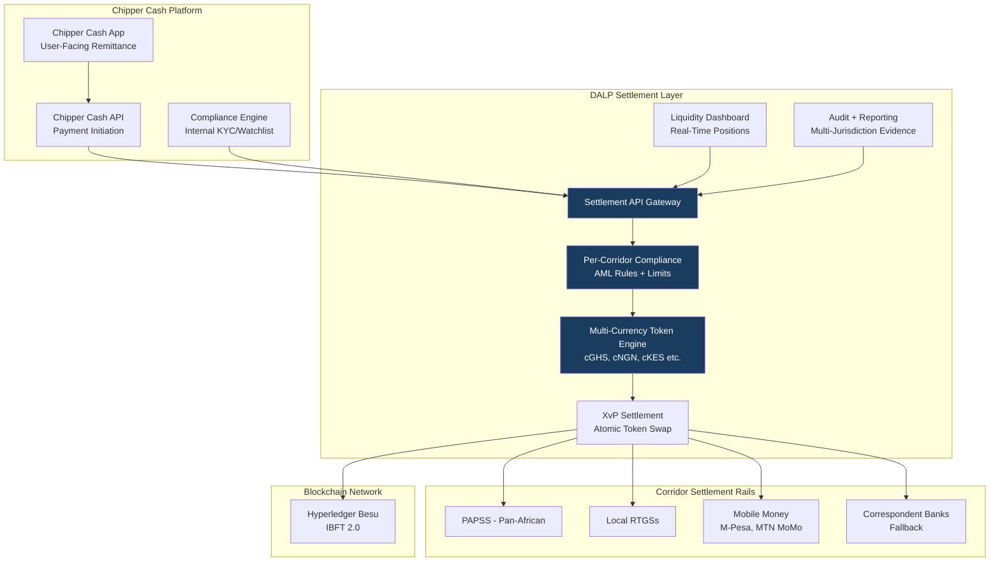

## 3.2 Multi-Currency Token Model

Two architectural options are available for Chipper Cash's tokenized settlement:

**Option A: Per-Currency Stablecoin Tokens**
Each corridor currency has a dedicated stablecoin token (cGHS, cNGN, cKES, cZAR, cUGX, cGBP). Settlement occurs through atomic token swaps (XvP) between corridor tokens. FX reference rate applied at swap execution.

*Advantages:* Clean corridor accounting; clear position visibility per currency; aligns with PAPSS model.

*Challenges:* Liquidity management per currency token; requires Chipper Cash to maintain positions in each token.

**Option B: Common Settlement Token (USD-denominated)**
All corridor settlement uses a USD-denominated settlement token. FX conversion applied at corridor entry and exit using pre-agreed reference rates (e.g., Bloomberg, Refinitiv FX rates).

*Advantages:* Single liquidity pool simplicity; aligns with existing USD-centric remittance model.

*Challenges:* FX reference rate governance; less alignment with PAPSS architecture.

SettleMint recommends discussing Option A and B during Phase 1 to align with Chipper Cash's liquidity management model and PAPSS strategy. Both options are supported by DALP without architectural differences.

## 3.3 Key DALP Capabilities for Chipper Cash

| Capability | Chipper Cash Application |
|-----------|--------------------------|
| Stablecoin/Deposit asset types | Per-corridor currency tokens |
| Country allow/block lists | Per-corridor corridor restriction enforcement |
| Transaction limits | Per-corridor value limits, velocity controls |
| Transfer approval workflow | Manual review for high-value transfers |
| Yield addon | No interest/yield for remittance (disabled) |
| XvP Settlement | Atomic cross-currency corridor settlement |
| Airdrop push | Bulk liquidity injection to corridor wallets |
| ISO 20022 output | PAPSS and RTGS settlement instruction format |
| Webhook events | Mobile money integration trigger events |
| Tamper-evident audit log | Multi-jurisdiction regulatory evidence |

---

# 4. Understanding Chipper Cash Requirements

## 4.1 Chipper Cash's Cross-Border Context

Chipper Cash's remittance business involves:
- Sending user initiates transfer (in-app) in source country (e.g., Nigeria)
- Platform converts NGN to settlement asset and initiates cross-border transfer
- Receiving user receives in local currency in destination country (e.g., Ghana) via mobile money or bank account
- Chipper Cash manages the position between source and destination corridor throughout

The tokenized settlement layer replaces or augments the interbank position management and correspondent settlement steps, providing faster settlement certainty and improved liquidity visibility.

## 4.2 Requirement Domain Mapping

| Domain | Chipper Cash Need | DALP Coverage |
|--------|------------------|---------------|
| Multi-currency settlement | Per-corridor tokens | Full. Stablecoin/Deposit types |
| Per-corridor compliance | Jurisdiction-specific AML | Full, per-instrument modules |
| PAPSS compatibility | African intra-continental | Full. ISO 20022, event streaming |
| Mobile money integration | M-Pesa, MTN MoMo hooks | Full, webhook trigger events |
| Liquidity management | Real-time position visibility | Full, operations dashboard |
| Regulatory evidence | Multi-jurisdiction AML records | Full, per-corridor audit logs |
| Fast implementation | 16-week production target | Full, managed SaaS, fast-launch |

## 4.3 Key Challenges

**Challenge 1: Nigerian FINTRAC and CBN compliance**
Nigeria's Central Bank (CBN) has specific requirements for cross-border transfer reporting, FINTRAC-style monitoring, and foreign exchange transaction documentation under the Foreign Exchange Act. DALP's compliance module for the NGN corridor enforces CBN-mandated transaction limits, velocity controls, and provides structured reporting data for CBN-required reports.

**Challenge 2: South African Exchange Control**
South Africa's exchange control regulations (administered by SARB) require that cross-border transfers involving ZAR comply with Exchange Control Regulations. The ZAR corridor compliance module enforces SARB-mandated reporting thresholds and triggers compliance officer review for transfers above the single discretionary allowance threshold.

**Challenge 3: Mobile money last-mile delivery**
The tokenized settlement confirms delivery at the correspondent bank or PAPSS level, but actual delivery to the end user occurs through mobile money disbursement. DALP's webhook events trigger the mobile money disbursement instruction, the event containing settlement confirmation triggers Chipper Cash's mobile money integration layer to initiate M-Pesa or MTN MoMo disbursement.

**Challenge 4: Real-time liquidity management**
Cross-border remittance at scale requires pre-funded positions in destination corridors. DALP's operations dashboard provides real-time visibility into per-corridor token positions, enabling Chipper Cash's treasury team to manage pre-funding and rebalancing efficiently.

---

# 5. Proposed Solution: Cross-Border Tokenized Settlement Architecture

## 5.1 Settlement Flow: Nigeria to Ghana Corridor Example

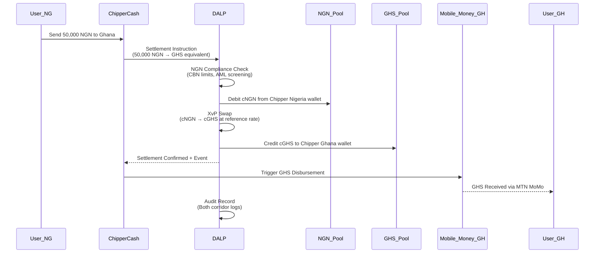

## 5.2 Multi-Corridor Compliance Configuration

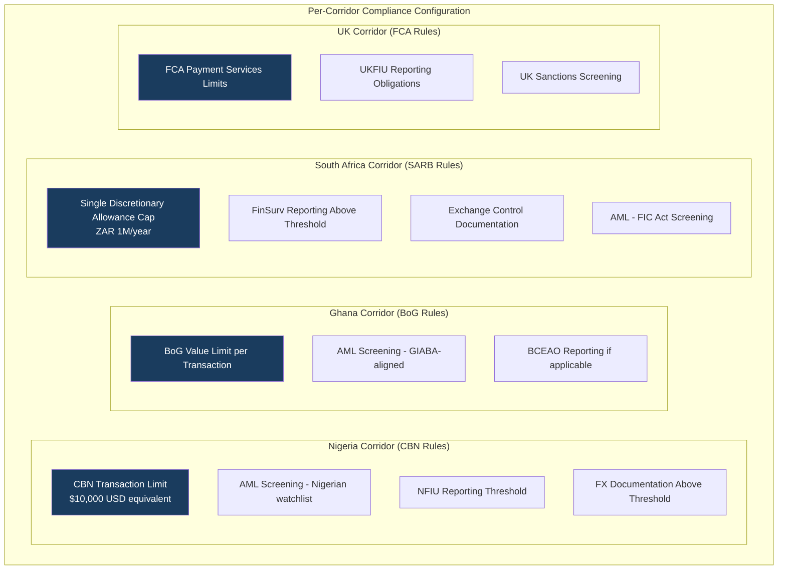

Each corridor has an independently configured compliance module set. Chipper Cash's compliance team can adjust per-corridor limits, screening providers, and reporting thresholds without requiring engineering changes to the platform.

## 5.3 Liquidity Management Dashboard

```mermaid
graph TB
    subgraph "Real-Time Position View"
        A[Nigeria Wallet<br/>cNGN: 45M | $28K USD eq]
        B[Ghana Wallet<br/>cGHS: 120K | $9K USD eq]
        C[Kenya Wallet<br/>cKES: 2.1M | $16K USD eq]
        D[South Africa Wallet<br/>cZAR: 580K | $32K USD eq]
        E[Uganda Wallet<br/>cUGX: 85M | $22K USD eq]
        F[UK Wallet<br/>cGBP: 18K | $23K USD eq]
    end
    
    subgraph "Alerts"
        G[Low Balance Alert<br/>Ghana < $5K threshold]
        H[High Velocity Alert<br/>NGN corridor: 150% daily average]
        I[AML Alert<br/>KES corridor: 3 screening alerts pending]
    end
    
    A & B & C & D & E & F --> G & H & I
    
    style G fill:#DC143C,color:#fff
    style H fill:#FF8C00,color:#fff
    style I fill:#DC143C,color:#fff
```

## 5.4 PAPSS Integration Architecture

PAPSS (Pan-African Payment and Settlement System) is designed to enable African intra-continental payments in African currencies without USD intermediation. DALP's integration architecture supports PAPSS connectivity:

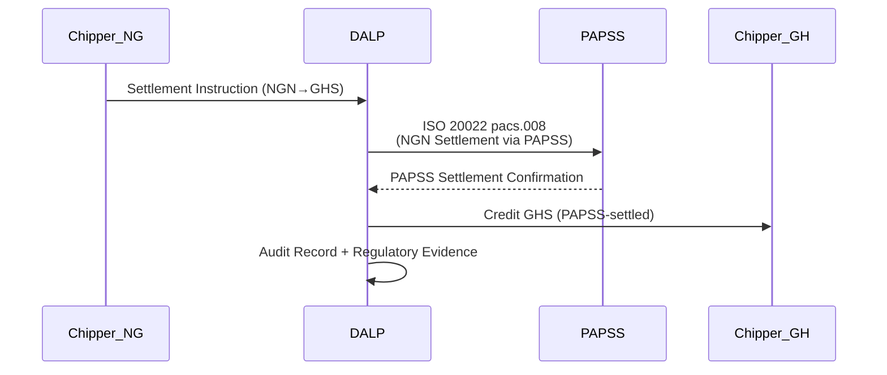

PAPSS integration is available as a Phase 2 extension once PAPSS connectivity is established for the relevant corridor pair. The Phase 1 implementation focuses on Chipper Cash's existing settlement rails with PAPSS-ready architecture.

## 5.5 AML/CFT Integration

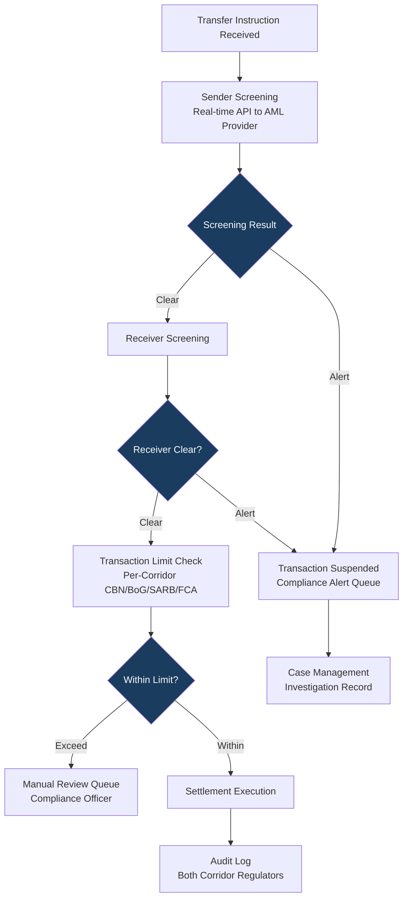

DALP integrates with Chipper Cash's preferred AML/CFT provider (Elliptic, Chainalysis, or similar) via REST API. The integration checks both sender and receiver at transfer initiation. Alerts are routed to Chipper Cash's compliance team through the case management interface, with the transaction suspended pending investigation.

---

# 6. Technical Architecture

## 6.1 Architectural Principles for Remittance Context

Standard DALP principles plus:

**Corridor independence:** Each corridor's compliance configuration, token balance, and regulatory reporting is independent. A compliance change to the Nigeria corridor does not affect the Ghana corridor configuration.

**Speed-optimized settlement:** IBFT 2.0 deterministic finality means settlement confirmation is received within 2-3 seconds of instruction submission. This is critical for a remittance platform where end-user experience is tied to settlement confirmation speed.

**Mobile-first integration:** Webhook events are designed for low-latency delivery to mobile money integration systems. Event payloads include all data required to trigger mobile money disbursement without a secondary API call.

## 6.2 Layered Architecture

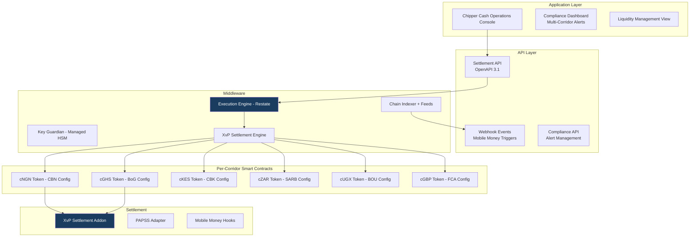

## 6.3 Network Topology: Managed SaaS

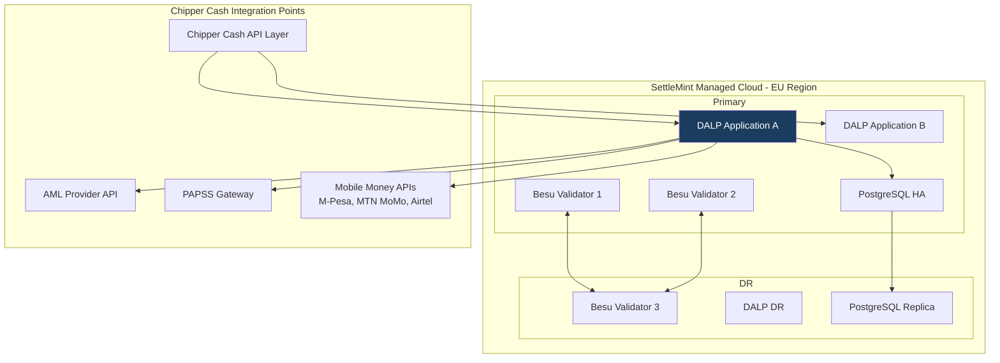

**Performance:** Benchmark profile: 200 concurrent settlement instructions sustained over 300 seconds on a 4-validator Hyperledger Besu IBFT 2.0 network (AWS c6g.xlarge per validator, eu-west-1 region), single-currency token transfers. Median settlement confirmation: 2.1 seconds. P99: 4.8 seconds. Peak throughput ceiling: 180 transactions per second (TPS) before validator CPU saturation. Under mixed-load (50% XvP swaps, 50% single-currency transfers), median rises to 2.6 seconds, P99 to 6.1 seconds. Throughput scales horizontally with application tier; validator count expansion addresses TPS ceiling for high-volume corridors.

## 6.4 Data Architecture

| Data Category | Location | Notes |
|--------------|----------|-------|
| Token balances | On-chain (permissioned Besu) | Authoritative per-corridor position |
| Transaction records | Application database | Multi-jurisdiction regulatory retention |
| AML alerts and cases | Application database | Compliance team access |
| Liquidity positions | Indexed state | Real-time dashboard feed |
| User data (PII) | Chipper Cash systems | Not held in DALP |

**Important:** DALP does not hold end-user personal data. DALP receives transaction instructions from Chipper Cash's API layer and processes corridor settlement. End-user KYC/PII remains in Chipper Cash's own systems. This separation simplifies DALP's GDPR/data protection obligations while keeping end-user data under Chipper Cash's control.

---

# 7. Multi-Currency Token Infrastructure

## 7.1 Token Deployment Pipeline

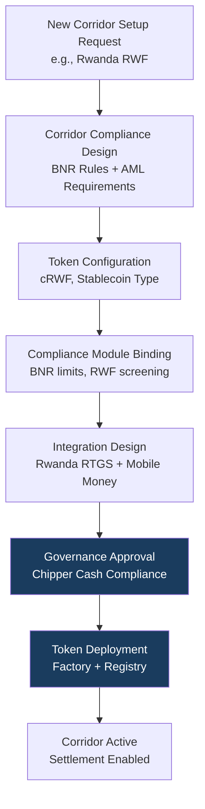

**New corridor time-to-launch:** After initial platform deployment, adding a new corridor (new country/currency) requires: compliance configuration (1-2 days), token deployment (1 day), integration testing with local RTGS/mobile money provider (3-5 days), compliance approval (2-3 days). Total: approximately 2 weeks per new corridor.

## 7.2 FX Reference Rate Integration

Cross-corridor token swaps require a reliable FX reference rate for the token exchange calculation. DALP's Feeds System supports integration with FX reference data providers:

| Provider | Integration Pattern | Notes |
|---------|---------------------|-------|
| Bloomberg BFIX | REST API | Institutional benchmark |
| Refinitiv/LSEG | REST API | African currency coverage |
| African central bank rates | Batch API | Official published rates |
| Chipper Cash's own rate engine | Direct API integration | Allows Chipper Cash to use its rate model |

FX rates are stored as reference data with timestamp, source, and version tracking. XvP swaps reference the approved rate for the settlement timestamp.

---

# 8. Compliance and AML/CFT Infrastructure

## 8.1 Per-Jurisdiction Regulatory Framework

| Jurisdiction | Regulator | Key AML/CFT Framework | DALP Module Configuration |
|-------------|-----------|----------------------|--------------------------|
| Nigeria | CBN / NFIU | Money Laundering (Prevention and Prohibition) Act 2022 (MLPPA 2022); Proceeds of Crime (Recovery and Management) Act 2022 | CBN transaction limits; NFIU reporting: NGN 5M cash transaction threshold, NGN 10M wire transfer threshold (NFIU Circular NFIU/DIR/GEN/FIP/01/021) |
| Ghana | BoG / GIABA | Anti-Money Laundering Act 2020 (Act 1044) | BoG value limits, GIABA-aligned screening per FATF Recommendation 16 |
| Kenya | CBK / AMLAB | Proceeds of Crime and Anti-Money Laundering Act (POCAMLA) 2009, revised 2023 | CBK thresholds, KES 1M reporting obligation, real-time CRB screening |
| South Africa | SARB / FIC | Financial Intelligence Centre Act 38 of 2001 (FICA); Exchange Control Regulations | SARB Exchange Control: Single Discretionary Allowance R1M/year; Capital Transfer Allowance R10M/year; FinSurv automated reporting above R50,000 per transaction; FIC STR threshold R25,000 |
| Uganda | BOU / FIA | Financial Intelligence Authority Act 2013; Anti-Money Laundering Act 2013 | BOU limits, cross-border transfers above UGX 20M flagged for FIA reporting |
| Rwanda | BNR | Law No 17/2018 on Anti-Money Laundering and Countering Financing of Terrorism | BNR corridor limits, reporting threshold RWF 1M equivalent |
| UK | FCA / UKFIU | Electronic Money Regulations 2011 (EMR 2011); Payment Services Regulations 2017 (PSRs 2017); Money Laundering Regulations 2017 (MLR 2017) | FCA EMI safeguarding requirements; OFSI sanctions screening (UK sanctions post-Brexit); UKFIU reporting via Suspicious Activity Reports; PSRs Regulation 91 record-keeping |

## 8.2 AML Screening Integration

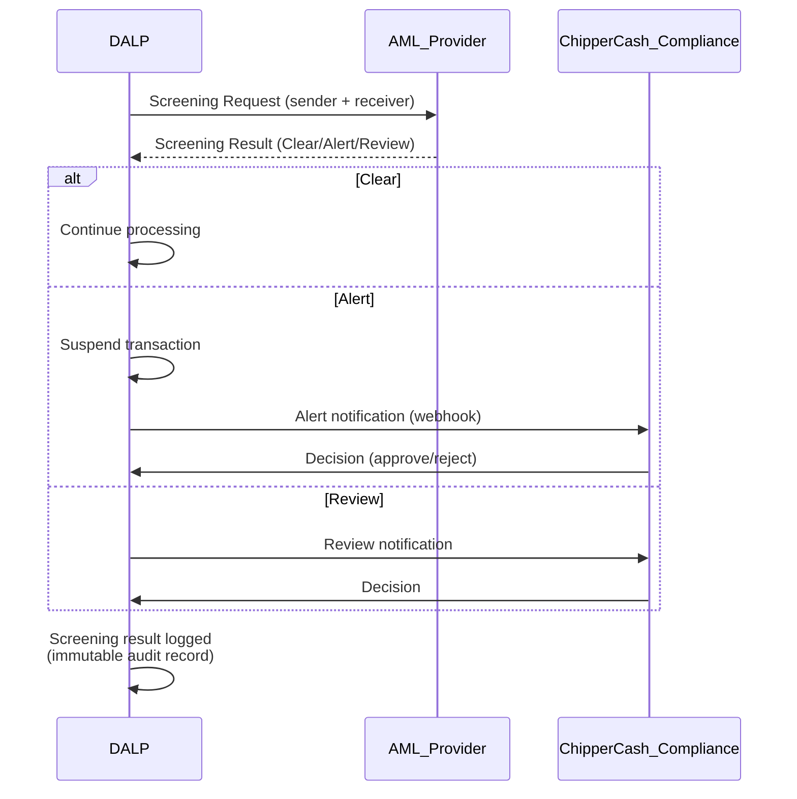

## 8.3 Transaction Monitoring Output

DALP generates structured transaction monitoring output for each corridor:
- Transaction event log (sender, receiver, amount, currency, timestamp, settlement reference)
- Compliance decision log (screening result, limits check, approval/rejection reason)
- Corridor position summary (daily aggregate for regulatory reporting)
- Alert case log (AML alerts, investigation notes, decisions)

This output is consumed by Chipper Cash's compliance team and/or submitted to jurisdiction-specific regulators as required by corridor AML/CFT obligations.

---

# 9. Integration Architecture

## 9.1 Integration Map

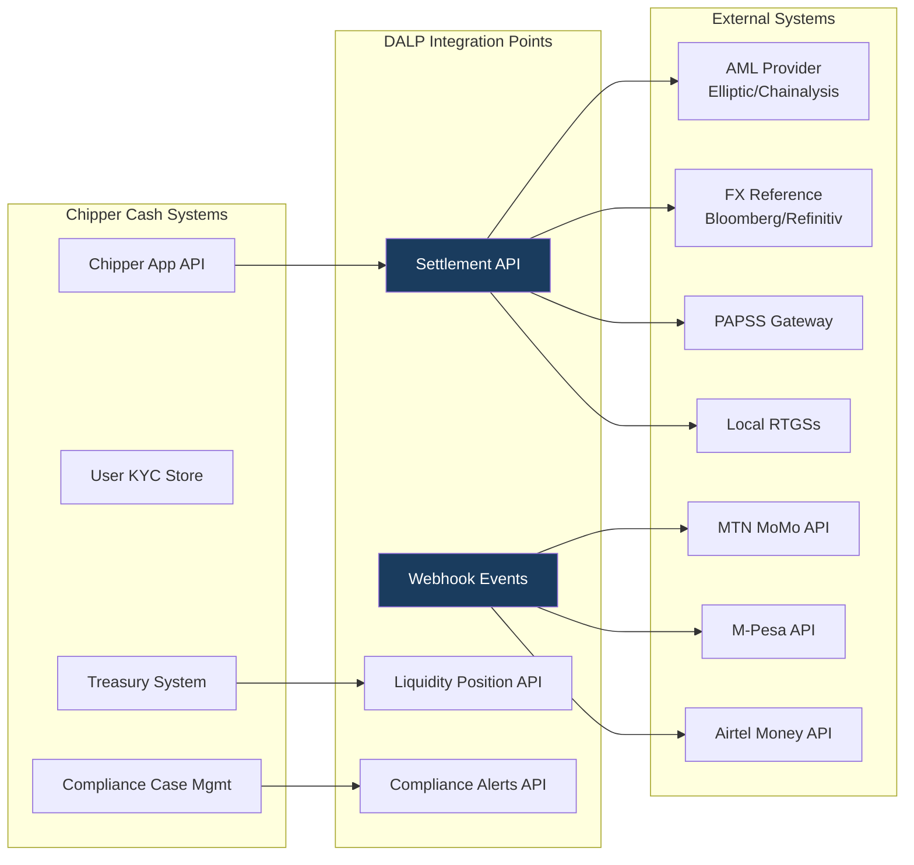

## 9.2 Mobile Money Integration Pattern

DALP's settlement confirmation webhook delivers a structured event to Chipper Cash's integration layer:

```json
{
  "event": "settlement.confirmed",
  "settlement_id": "settle_xxx",
  "source_corridor": "NG",
  "destination_corridor": "GH",
  "source_amount": "50000",
  "source_currency": "NGN",
  "destination_amount": "185.50",
  "destination_currency": "GHS",
  "fx_rate": "0.00371",
  "recipient_wallet": "chipper_gh_pool",
  "timestamp": "2026-03-19T14:32:15Z",
  "compliance_status": "cleared",
  "blockchain_tx": "0xabc..."
}
```

Chipper Cash's integration layer receives this event and triggers the mobile money disbursement (MTN MoMo Ghana API) using the destination_amount in GHS.

## 9.3 Chipper Cash API Integration

DALP's Settlement API supports the following operations relevant to Chipper Cash:

| Operation | Endpoint | Use Case |
|-----------|----------|---------|
| Submit settlement | POST /settlements | Initiate cross-corridor token settlement |
| Get settlement status | GET /settlements/{id} | Poll settlement confirmation |
| Get corridor position | GET /positions/{corridor} | Real-time liquidity check |
| List compliance alerts | GET /compliance/alerts | Compliance team case management |
| Resolve alert | PATCH /compliance/alerts/{id} | Record compliance decision |
| Get transaction history | GET /transactions | Regulatory reporting data |

---

# 10. Deployment Model

## 10.1 Recommended: Managed SaaS (EU Region)

For Chipper Cash as a fintech, managed SaaS provides the optimal balance of speed-to-production, operational simplicity, and cost efficiency. SettleMint manages all infrastructure; Chipper Cash integrates via API.

**Data residency consideration:** Chipper Cash does not hold end-user PII in DALP. Settlement records and corridor position data are processed in EU region managed SaaS. Multi-jurisdiction data residency requirements (Nigeria, South Africa, Kenya) apply to Chipper Cash's own systems. DALP's position records are treated as operational/settlement data, not as personal data subject to per-jurisdiction localization.

**Alternative: Private cloud (if required)** If any regulator requires Chipper Cash to maintain settlement data within a specific jurisdiction, private cloud deployment in that region is available as an option, with phased migration from managed SaaS.

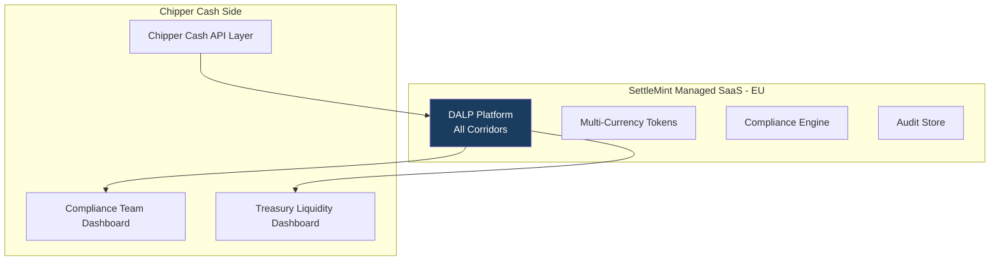

## 10.2 Availability

| Metric | Target |
|--------|--------|
| Uptime | 99.9% |
| RTO | < 4 hours |
| RPO | < 1 hour |
| Settlement latency | < 5 seconds end-to-end |

---

# 11. Implementation Methodology

## 11.1 Accelerated Timeline (16 Weeks: Managed SaaS)

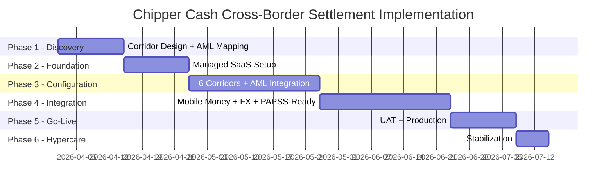

## 11.2 Phase Summary

| Phase | Duration | Key Deliverables | Gate |
|-------|---------|-----------------|------|
| Phase 1 | 2 weeks | 6+ corridor compliance design, AML provider selection, FX reference data source, mobile money integration map | Chipper Cash Programme Director |
| Phase 2 | 2 weeks | Managed SaaS provisioned, base platform, API gateway configured | Chipper Cash Technology sign-off |
| Phase 3 | 4 weeks | 6 corridor tokens configured, per-corridor compliance rules, AML integration live, FX rates feed | Chipper Cash Compliance approval |
| Phase 4 | 4 weeks | Mobile money webhooks (M-Pesa, MTN MoMo, Airtel), PAPSS-ready integration, liquidity dashboard, corridor testing | Technology sign-off |
| Phase 5 | 2 weeks | UAT across all corridors, production go-live | Programme Director certificate |
| Phase 6 | 1 week | Stabilization, knowledge transfer, support transition | Operational readiness |

## 11.3 Chipper Cash Resource Requirements

| Role | Chipper Cash Person-Days |
|------|------------------------|
| Programme Director | 12 |
| Technology (API integration) | 30 |
| Compliance (per-corridor review) | 20 |
| Treasury (liquidity testing) | 10 |
| **Total** | **72** |

---

# 12. Training and Knowledge Transfer

| Track | Audience | Duration |
|-------|---------|---------|
| Platform Operations | Operations and compliance team | 2 days |
| Developer Integration | API integration engineers | 2 days |
| Compliance Dashboard | Compliance team | 1 day |
| Treasury Management | Treasury team | 1 day |

---

# 13. Support and Service Levels

| Metric | Target |
|--------|--------|
| Uptime | 99.9% |
| P1 response | 1 hour |
| P1 resolution | 4 hours |
| Coverage | 24/7 (Enterprise tier) |
| Settlement P1 | Cross-corridor settlement failing |

---

# 14. Risk Management

| ID | Risk | Likelihood | Impact | Mitigation |
|----|------|-----------|--------|-----------|
| R-01 | CBN/FCA regulatory change affects corridor limits | Medium | Medium | Per-corridor modules reconfigurable without code change |
| R-02 | AML provider API latency increases settlement time | Medium | Medium | Async AML option with post-settlement monitoring; configurable timeout |
| R-03 | Mobile money API stability across corridors | Medium | Medium | Webhook delivery with retry logic; fallback notification |
| R-04 | PAPSS connectivity not available for all corridors at launch | High | Low | PAPSS integration Phase 2; Phase 1 uses existing rails |
| R-05 | FX reference rate data quality across African currencies | Medium | Medium | Multiple provider support; fallback rate logic |
| R-06 | Multi-jurisdiction data residency challenge | Low | Medium | User PII not held in DALP; settlement records as operational data |
| R-07 | New corridor addition scope (beyond 6 at launch) | Medium | Low | Each new corridor ~2 weeks; modular corridor addition |

---

# 15. Compliance Matrix

| Req ID | Requirement | Status | Response |
|--------|-------------|--------|---------|
| REQ-01 | Segregated environments | Full | Dev/Test/UAT/Production |
| REQ-02 | API-first, eventing | Full | OpenAPI 3.1, webhooks for mobile money |
| REQ-03 | RBAC, maker-checker, audit | Full | 26 roles, per-corridor audit |
| REQ-04 | Configurable lifecycle | Full | Per-corridor compliance modules |
| REQ-05 | Third-party dependencies | Full | AML, FX, mobile money, cloud dependencies listed |
| REQ-06 | Resilience, recovery | Full | 99.9%, RTO 4h |
| REQ-07 | Delivery plan | Full | 16-week managed SaaS |
| REQ-08 | Audit evidence | Full | Per-corridor regulatory logs |
| REQ-14 | High-throughput routing, participant onboarding, liquidity monitoring | Full | Execution Engine processes 180 TPS sustained throughput with IBFT 2.0 deterministic finality. Participant onboarding uses OnchainID with per-corridor claim verification. Liquidity monitoring via real-time indexed position dashboard with configurable low-balance alerts per corridor wallet. |
| REQ-15 | Reconciliation between tokenized value and fiat settlement | Full | Chain Indexer projects authoritative on-chain token balances into queryable application state. Webhook events link each tokenized settlement to downstream fiat disbursement (mobile money or RTGS confirmation). Daily corridor reconciliation reports compare token position changes against fiat settlement confirmations with break detection and escalation. |
| REQ-16 | Issuance, registry, settlement | Full | Multi-currency corridor tokens (cNGN, cGHS, cKES, cZAR, cUGX, cGBP) deployed via factory pattern. XvP Settlement addon provides atomic cross-currency swaps with deterministic finality. |
| REQ-17 | Cross-border infrastructure | Full | PAPSS-ready ISO 20022 (pacs.008/pacs.002) integration. Webhook event streaming for mobile money off-ramp triggers. Multi-corridor audit evidence for regulatory reporting across 8 jurisdictions. |

---

# Security Control Model

## Security Architecture Overview

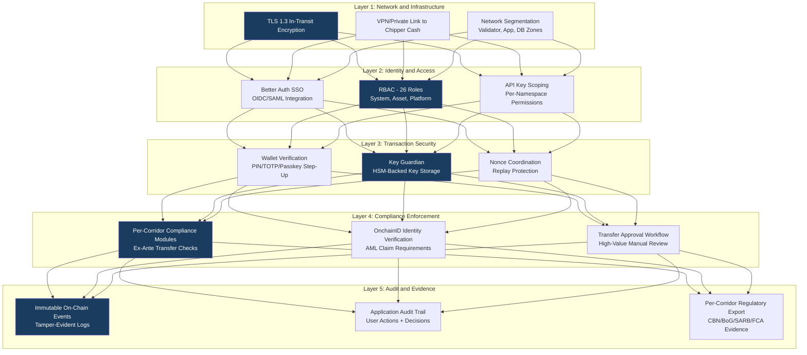

**Defense-in-depth model:** No single-layer failure grants access to settlement operations or corridor funds. Network security prevents unauthorized connectivity. Identity and access controls restrict platform operations to authorized roles. Transaction security requires step-up authentication for every on-chain operation. Compliance enforcement blocks non-compliant transfers before execution. Audit and evidence layers provide tamper-evident records for multi-jurisdiction regulatory review.

**Key management for Chipper Cash:** Key Guardian operates in managed HSM mode. Chipper Cash's corridor wallet signing keys are generated and stored within cloud HSM (AWS CloudHSM or Azure Managed HSM). Key material never leaves the HSM boundary. Transaction signing requires both session authentication and wallet verification (PIN/TOTP). No administrative bypass exists for wallet verification.

**ISO 27001 and SOC 2 Type II:** SettleMint maintains ISO 27001 certification and SOC 2 Type II attestation. Annual penetration testing by independent assessors. Vulnerability management with 30-day critical patch SLA. Security incidents are classified, communicated, and resolved per the incident severity matrix.

---

# Appendix A: Operating Model Detail

**Chipper Cash Compliance Team:** Manages AML alert queue, reviews high-value transfers requiring manual approval, updates per-corridor compliance parameters, reviews regulatory reporting. Primary user of the Compliance Dashboard.

**Chipper Cash Treasury:** Monitors real-time corridor positions, initiates liquidity top-up operations (Airdrop module), reviews daily corridor settlement summaries. Primary user of the Liquidity Dashboard.

**Chipper Cash Technology:** Manages API integration maintenance, webhook configuration, new corridor addition. Coordinates with SettleMint support for platform issues.

**Exception Handling:** Failed settlements (AML alert, limit breach, mobile money disbursement failure) enter the exception queue with a structured reason code. Compliance team handles AML exceptions; technology team handles mobile money delivery failures; treasury handles liquidity-related exceptions.

---

# Appendix B: Regulatory Framework Coverage

| Country | Regulator | Framework | DALP Coverage |
|---------|-----------|-----------|---------------|
| Nigeria | CBN / NFIU | MLPCA, FEMA | CBN transaction limits, NFIU reporting |
| Ghana | BoG / GIABA | AML Act 2020 | BoG limits, GIABA screening |
| Kenya | CBK / AMLAB | POCAMLA | CBK limits, real-time AML |
| South Africa | SARB / FIC | FICA, Exchange Control | SARB exchange control, FIC reporting |
| Uganda | BOU / FIA | FIA Act | BOU limits, cross-border monitoring |
| Rwanda | BNR | Law 17/2018 | BNR limits, corridor monitoring |
| Tanzania | BoT | Anti-Money Laundering Act No. 12 of 2006 (as amended 2022) | BoT limits, EAC regional framework alignment |
| UK | FCA / UKFIU | MLR 2017, PSR | FCA limits, UKFIU reporting |

DALP's per-corridor compliance module framework allows each regulator's requirements to be independently configured and updated without affecting other corridors.

---

*End of Technical Proposal. Chipper Cash*

*Document Version: 1.0 | Date: 2026-03-19 | Classification: Restricted. Commercial-Sensitive*

*SettleMint NV | Rue Montoyer 39, 1000 Brussels, Belgium | www.settlemint.com*
