# Technical Proposal: Tokenized Cross-Border Payments Orchestration

**Prepared for:** Flutterwave (Nigeria / Pan-Africa)
**Prepared by:** SettleMint NV
**Date:** March 2026
**Version:** v1.0
**Reference:** FLUTTERWAVE-RFP-TOKENIZED-CROSS-BORDER-PAYMENTS-202603
**Classification:** SettleMint Confidential

---

## Table of Contents

- Executive Summary
- About SettleMint
- About DALP
- Understanding of Requirements
- Proposed Solution and Functional Capabilities
- Platform Architecture
- Token and Asset Lifecycle
- Compliance and Regulatory Framework
- Security Architecture
- Integration Architecture
- Deployment Architecture
- Data Management and Governance
- Operational Model and Governance
- Implementation Plan
- Support and SLA
- References and Experience
- Appendix A: Requirement Response Matrix
- Appendix B: Regulatory Mapping
- Appendix C: Security and Resilience Evidence

---

## 1. Executive Summary

### 1.1 Context and Strategic Drivers

Flutterwave operates at the centre of Pan-African payment infrastructure, connecting merchants, consumers, financial institutions, and payment corridors across more than thirty African markets and multiple global corridors. The company's mandate is to move money reliably, compliantly, and at scale across some of the world's most fragmented payment landscapes. That mandate creates a specific set of operational pressures that conventional payment infrastructure struggles to address: corridor-by-corridor reconciliation backlogs, settlement prefunding inefficiencies, multi-jurisdiction AML and sanctions compliance burdens, and the inability to produce granular, tamper-evident audit trails when regulators or banking partners request transaction reconstruction.

The tokenized cross-border payments orchestration programme represents Flutterwave's strategic response to these pressures. By placing a programmable digital asset layer underneath settlement flows, treasury movements, and compliance evidence, Flutterwave can convert opaque reconciliation chains into transparent, on-chain event sequences, reduce settlement latency from days to near-real-time, and produce supervisory evidence on demand rather than through expensive manual reconstruction. This is not an innovation experiment. It is an infrastructure procurement intended to determine whether the market can supply a production-grade platform capable of surviving the operational, regulatory, and audit scrutiny that a Pan-African payments leader must routinely withstand.

### 1.2 Why This Programme Is Hard

Cross-border payment settlement is structurally complex before any digital asset layer is added. Flutterwave manages simultaneous obligations across correspondent banking networks, local payment switches, card networks, mobile money rails, and merchant settlement cycles, each with distinct cut-off windows, float requirements, and reconciliation expectations. Adding a tokenized settlement layer into that environment creates three categories of implementation risk.

The first is control integrity. Any tokenized layer must preserve end-to-end auditability, maker-checker discipline, and deterministic compliance enforcement across every participant type, corridor, and instrument variant. A token transfer that bypasses a sanctions screen, skips an approval step, or fails to write to the audit log is not a technology failure; it is a compliance failure with regulatory consequences.

The second is integration coherence. Flutterwave already operates a mature enterprise stack including books-and-records systems, AML screening engines, treasury management tools, and bank-partner settlement interfaces. A tokenized settlement layer that cannot connect bidirectionally to those systems becomes a parallel operational silo that generates more reconciliation work than it eliminates.

The third is production scalability. A pilot that works for ten corridors and five thousand daily transactions must scale without architectural rework to cover thirty-plus markets and millions of daily movements. Platform selection decisions made today will determine whether that scaling journey requires re-platforming or simply configuration expansion.

### 1.3 Proposed Response

SettleMint proposes the Digital Asset Lifecycle Platform (DALP) as the production-grade control plane for Flutterwave's tokenized cross-border payments orchestration programme. DALP provides a four-layer architecture, from smart contract enforcement through to a web-based operations console, that covers every stage of the payment token lifecycle: creation and configuration, compliance verification and counterparty onboarding, transfer and settlement, corporate servicing actions, and retirement. All layers are connected through a single API surface, a TypeScript SDK, and a real-time event system designed for enterprise integration.

For Flutterwave's specific use case, DALP provides the following directly relevant capabilities:

The StableCoin contract type supports the creation of corridor-specific payment tokens representing fiat-backed value obligations, with configurable supply controls, collateral verification, and maturity logic. The Deposit contract type supports tokenized bank balance representations suitable for prefunding and treasury management. Both operate under the SMART Protocol (ERC-3643), which enforces compliance checks on every transfer, not as an application-layer filter that could be bypassed, but as on-chain enforcement logic that the smart contract itself validates before any balance change executes.

The XvP Settlement addon provides atomic Delivery-versus-Payment mechanics that guarantee simultaneous transfer of two legs or reversion of both. For corridor settlement, this eliminates counterparty risk on the settlement leg. HTLC (Hash Time-Locked Contract) support extends this atomicity to cross-chain scenarios where corridor assets live on different network segments.

The compliance module library provides out-of-the-box support for country allow and block lists, identity verification through OnchainID (ERC-734/735), address block lists for sanctioned wallets, investor count limits, time locks for holding periods, and transfer approval workflows for manual compliance gates. These modules are configurable per token and per corridor without smart contract redeployment.

The API layer exposes all platform capabilities through OpenAPI 3.1 with TypeScript SDK support, making integration with Flutterwave's existing AML screening engine, sanctions feed, treasury system, and bank-partner settlement interfaces straightforward through standard REST and event-stream patterns.

The deployment model is flexible. DALP can be deployed on AWS, Azure, or GCP managed Kubernetes, on Flutterwave's own private cloud infrastructure, or as a hybrid configuration with data residency controls aligned to CBN and country-specific data localisation requirements.

### 1.4 Why SettleMint

SettleMint has been building production digital asset infrastructure for regulated financial institutions since 2017. The company's track record covers central banks, commercial banks, stock exchanges, sovereign wealth structures, and payments infrastructure operators across Europe, the Middle East, Asia, and Africa. This is not a company that has achieved its first regulated deployment; it is a company whose entire operational identity is built around serving institutional clients that face regulatory scrutiny, audit requirements, and operational continuity obligations.

SettleMint holds ISO 27001 and SOC 2 Type II certifications, confirming that security controls are independently audited and continuously maintained, not just designed. The company's delivery model is structured around named programme leads, formal phase gates, explicit acceptance criteria, and post-go-live hypercare, because institutional programmes fail most often at the transition between implementation and production operations.

For Flutterwave specifically, SettleMint's experience with payment-infrastructure tokenization, multi-corridor compliance design, and bank-partner integration patterns provides direct operational relevance that a generic blockchain vendor cannot replicate.

### 1.5 Why DALP

DALP is not a smart contract toolkit. It is a complete lifecycle platform: from token design and compliance configuration, through issuance and distribution, through transfer and settlement, through servicing and corporate actions, through retirement and evidence extraction. The platform treats compliance as a structural property of every operation, not as a post-transaction filter. The platform treats auditability as a design requirement, not as a reporting add-on.

For Flutterwave's programme, the most important architectural property of DALP is that it places compliance enforcement at the on-chain layer, which means no application-level configuration error, no API miscall, and no external system failure can produce a non-compliant token transfer. Compliance checks happen on-chain, in the smart contract, before any balance change executes. That property is not achievable through middleware-only compliance approaches.

The second most important property is the event architecture. Every platform operation emits structured events that downstream systems can consume in real time through the webhook and SSE infrastructure. This means Flutterwave's AML engine, reconciliation system, treasury dashboard, and management reporting layer can all receive deterministic event feeds without requiring periodic batch extraction or polling.

### 1.6 Reference Fit

SettleMint's most relevant reference deployments for this procurement include regulated payment infrastructure work with multi-corridor settlement requirements, tokenized stablecoin implementations for payment operators, and cross-border settlement platforms serving regulated financial institutions in emerging markets. Specific reference details appear in Section 16 of this proposal.

---

## 2. About SettleMint

### 2.1 Company Overview

SettleMint NV is a Belgian financial technology company founded in 2017 with operations across Europe, the Middle East, Asia, and Africa. The company specialises in digital asset lifecycle platforms for regulated financial institutions, including central banks, commercial banks, payment operators, market infrastructure providers, and asset managers. SettleMint does not offer consulting services or custom software development. The company builds and maintains a platform, DALP, and delivers it to clients through structured implementation programmes.

### 2.2 Certifications and Credentials

| Credential | Status |
|---|---|
| ISO 27001 | Certified, continuously maintained |
| SOC 2 Type II | Certified, independently audited |
| Production deployments | Central banks, commercial banks, payment operators, stock exchanges |
| Regulatory frameworks covered | MiCA, MiFID II, DORA, CBN, FSCA, MAS, FCA, ADGM, CBB |

### 2.3 Team and Delivery Capability

SettleMint employs engineers, financial domain architects, compliance specialists, and delivery managers with direct experience in regulated financial services implementations. The delivery model is not consultant-augmented; the same team that builds the platform executes the implementations, ensuring that platform limitations and integration requirements are fully understood before commitments are made.

### 2.4 Relevance to Flutterwave

For a Pan-African payment operator facing CBN regulatory obligations, multi-country AML requirements, bank-partner settlement complexity, and board-quality audit expectations, SettleMint's regulated-institution track record and Africa-market experience provide direct procurement relevance. SettleMint understands that compliance is not an advisory function in this context; it is a structural operating requirement.

---

## 3. About DALP

### 3.1 Platform Overview

DALP (Digital Asset Lifecycle Platform) is a production-ready digital asset management platform built for regulated financial institutions. It provides complete lifecycle coverage from token design and compliance configuration through issuance, transfer, settlement, servicing, and retirement. The platform is built on the SMART Protocol, SettleMint's implementation of the ERC-3643 regulated token standard, which enforces compliance at the smart contract layer rather than at the application or middleware layer.

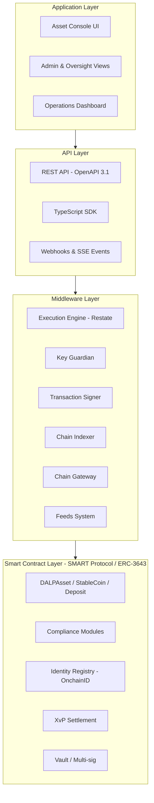

*Figure 1: DALP Four-Layer Platform Architecture*

### 3.2 Core Lifecycle Pillars

**Issuance:** DALP deploys assets through a factory pattern using CREATE2 deterministic addressing, ensuring atomic deployment where identity registration, compliance initialisation, and role assignment all complete in a single transaction or all revert together. For Flutterwave's corridors, this means each payment token or stablecoin-type instrument deploys with a predictable address that upstream systems can pre-configure before go-live.

**Compliance:** The ERC-3643 compliance engine evaluates every transfer against a configurable set of modules before any balance change executes. Modules include identity verification, country restrictions, address block lists, investor limits, time locks, transfer approval workflows, and collateral requirements. Modules compose without redeployment: adding a new corridor restriction requires a configuration operation, not a contract migration.

**Custody:** Key Guardian provides a tiered key management architecture supporting encrypted database storage for development environments, cloud KMS (AWS, Azure, GCP) for standard production, HSM for regulated financial services requirements, and MPC custody through DFNS or Fireblocks for the highest security tier. Flutterwave selects the tier appropriate to each environment and participant type.

**Settlement:** XvP Settlement provides atomic DvP and PvP mechanics where both legs of a transaction execute simultaneously or both revert. For cross-corridor settlement, HTLC support extends this atomicity to cross-chain scenarios. Settlement state is fully observable through the event system.

**Servicing:** The platform provides freeze and unfreeze operations, pause and unpause circuits, forced transfers for regulatory enforcement, and role management for operational control. All servicing operations emit on-chain events and update the audit trail.

### 3.3 Supported Asset Types for Payment Use Cases

| Asset Type | Flutterwave Use Case |
|---|---|
| StableCoin | Corridor payment tokens, fiat-backed settlement instruments |
| Deposit | Bank balance representations, prefunding vehicles |
| DALPAsset (configurable) | Custom payment obligation instruments |

### 3.4 Key Differentiators

DALP differs from point-solution tokenization tools in four ways relevant to Flutterwave:

First, compliance enforcement is on-chain and cannot be bypassed by application-layer configuration. This is a structural property, not a configuration option.

Second, the platform ships with a complete operations console, API, SDK, and event system. Flutterwave does not assemble a tokenization stack from separate components; the complete control plane is delivered as one governed platform.

Third, deployment flexibility is genuine. The same platform capabilities are available across managed cloud, private cloud, on-premises, and hybrid configurations without feature degradation.

Fourth, the audit trail is immutable and on-chain. Every compliance decision, every transfer, every role change, every servicing operation leaves a verifiable, tamper-evident record that Flutterwave can present to CBN, NDPC inspectors, or internal audit without manual reconstruction.

---

## 4. Understanding of Requirements

### 4.1 Client Context

Flutterwave is a Pan-African payment infrastructure operator serving merchants, financial institutions, and consumers across thirty-plus African markets with additional global corridor coverage. The company's core revenue model depends on reliable, compliant, and cost-effective movement of value across corridors that vary dramatically in their regulatory character, settlement infrastructure maturity, and correspondent banking availability.

The tokenized cross-border payments programme addresses three specific operational pain points. First, reconciliation complexity: each corridor generates settlement batches that must be matched against bank-partner records, internal ledgers, and merchant payout statements, a process that currently requires significant manual intervention when timing mismatches or format discrepancies arise. Second, prefunding inefficiency: maintaining liquidity buffers in each corridor consumes working capital that tokenized settlement instruments could optimise. Third, compliance evidence: CBN inspectors, African regulators, and banking partners periodically require detailed transaction reconstruction that current systems cannot produce efficiently.

### 4.2 Requirement Domain Analysis

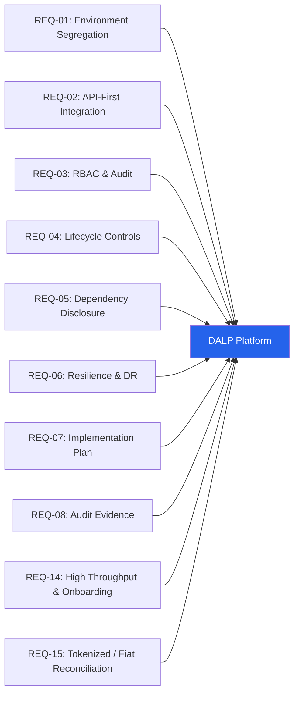

*Figure 2: Requirement Coverage Overview*

| Requirement Domain | DALP Coverage | Notes |
|---|---|---|
| Environment segregation (REQ-01) | Full | Dev, test, UAT, DR, production environments all segregated by default |
| API-first integration (REQ-02) | Full | OpenAPI 3.1, TypeScript SDK, webhooks, SSE events |
| RBAC and audit (REQ-03) | Full | 26-role taxonomy, maker-checker, complete on-chain audit trail |
| Lifecycle controls (REQ-04) | Full | Configurable compliance modules, lifecycle states, exception workflows |
| Dependency disclosure (REQ-05) | Full | All third-party dependencies documented in Section 11 |
| Resilience and DR (REQ-06) | Full | Multi-AZ HA, DR scenarios with RTO/RPO targets |
| Implementation plan (REQ-07) | Full | Phased 6-stage delivery model in Section 14 |
| Audit evidence (REQ-08) | Full | On-chain logs, exportable evidence packs, SIEM integration |
| High throughput and onboarding (REQ-14) | Full | Batch operations, parallel workflow support |
| Tokenized / fiat reconciliation (REQ-15) | Partial | On-chain settlement state available; fiat matching requires integration with bank-partner feeds |

### 4.3 Key Challenges Identified

**Challenge 1: Multi-corridor compliance divergence.** Each African corridor operates under a distinct regulatory regime. CBN rules in Nigeria differ from Bank of Ghana requirements, Bank of Tanzania supervision, and SARB guidance. A single compliance configuration cannot serve all corridors; per-corridor rule books are required.

*DALP response:* Compliance modules are configured per token, not per platform. Corridor-specific tokens carry corridor-specific rule sets. Adding a new corridor requires deploying a new token with the appropriate compliance configuration, not modifying existing tokens.

**Challenge 2: Reconciliation between on-chain and off-chain settlement.** Flutterwave's fiat flows pass through bank partners whose settlement records exist in proprietary formats. Matching these to on-chain token movements requires stable identifiers, deterministic event sequencing, and exportable reconciliation data.

*DALP response:* Every on-chain operation emits structured events with deterministic identifiers. The Chain Indexer maintains a queryable projection of on-chain state. The API provides reconciliation-ready export formats. Fiat matching still requires integration with bank-partner data feeds, which the implementation plan addresses in the integration workstream.

**Challenge 3: Privileged access control for support and escalation.** Flutterwave's operations teams need to resolve stuck transactions, correct misrouted payments, and execute forced transfers in exceptional circumstances. These actions must be logged, governed, and auditable.

*DALP response:* The Custodian role provides forced transfer capability that bypasses compliance pre-checks when legally required, but cannot bypass on-chain event logging. All Custodian actions emit events. Access to the Custodian role requires the Admin role to grant it, and all role grants are logged both off-chain (audit log) and on-chain (AccessManager events).

**Challenge 4: Operational resilience under corridor outages.** If a bank partner or local switch becomes unavailable, Flutterwave must be able to suspend corridor-specific settlement without affecting unrelated flows.

*DALP response:* The pause/unpause function operates per token. Pausing the Nigeria-Ghana corridor token does not affect the Nigeria-UK corridor token. The Emergency role provides per-asset circuit breaking without requiring platform-level intervention.

**Challenge 5: Bank-partner and regulatory evidence requests.** CBN and partner-country regulators periodically request detailed reconstruction of specific transactions, including the compliance checks that applied, the identities that were verified, and the approval chain that authorised the movement.

*DALP response:* All compliance decisions are recorded on-chain at the time of execution. Every transfer carries the compliance module evaluation result, the identity claims that were verified, and the transaction initiator identity. These records are queryable through the API and exportable for regulatory submission.

---

## 5. Proposed Solution and Functional Capabilities

### 5.1 Solution Overview

The proposed solution places DALP as the tokenized settlement control plane sitting between Flutterwave's existing payment acceptance infrastructure and its bank-partner settlement layer. DALP does not replace the existing payment stack; it provides the programmable compliance and settlement layer that existing infrastructure lacks.

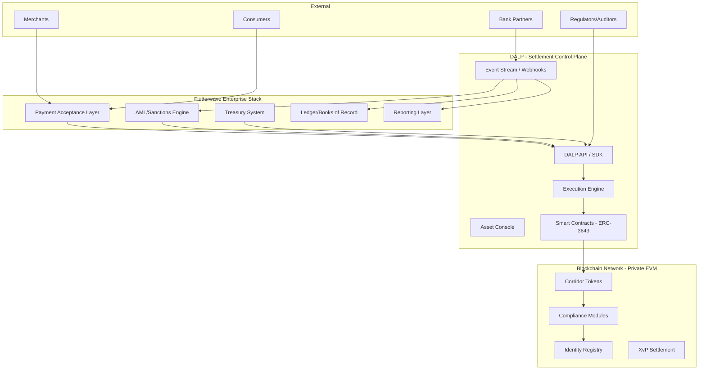

*Figure 3: Flutterwave Solution Context Diagram*

### 5.2 Corridor Token Architecture

For each active payment corridor, Flutterwave deploys a corridor-specific StableCoin or Deposit token. This token represents the settlement obligation for that corridor: value moving from the Nigerian payment pool to the Ghanaian disbursement pool, for example, is represented as a transfer of the NGN-GHA corridor token from the Nigerian treasury wallet to the Ghanaian treasury wallet.

Each corridor token carries its own compliance configuration:

- Country allow list restricts transfers to wallets in permitted jurisdictions
- Identity verification requires both sender and recipient to have verified OnchainID with current KYC/AML claims
- Time lock enforces minimum holding periods where corridor regulations require settlement delay
- Transfer approval triggers manual compliance review for transfers above configurable thresholds
- Address block list allows immediate isolation of sanctioned or flagged wallets without token-wide impact

### 5.3 Participant Onboarding and Identity

Before any participant (bank partner, treasury wallet, merchant wallet) can receive or transfer corridor tokens, they must have a registered OnchainID identity with verified claims. DALP's trusted issuer model allows Flutterwave's existing KYC/AML provider to publish claims to the on-chain identity registry. The identity verification itself happens off-chain through Flutterwave's existing KYC provider; DALP consumes the resulting claims and enforces them on every transfer.

Onboarding workflow:
- Participant submits KYC/AML documents through Flutterwave's existing onboarding flow
- KYC provider verifies identity and publishes claims to the DALP identity registry
- DALP records the participant's OnchainID with valid claims
- Participant's wallet address is associated with their OnchainID
- Participant is now eligible to receive corridor tokens for corridors where their claims satisfy compliance requirements

This model means identity verification happens once and applies across all corridors where the participant's claims are sufficient. There is no per-corridor re-verification.

### 5.4 Compliance Enforcement Flow

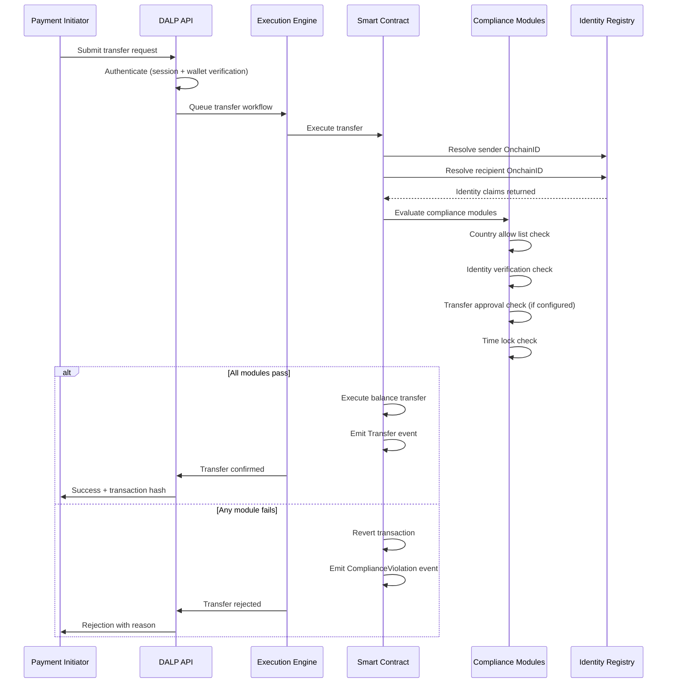

*Figure 4: Compliance Enforcement Flow*

### 5.5 Settlement Flow: Atomic XvP

For corridor settlements where two legs must execute simultaneously (for example, NGN stablecoin debit against GHS stablecoin credit in a DvP structure), DALP's XvP Settlement addon provides atomic mechanics:

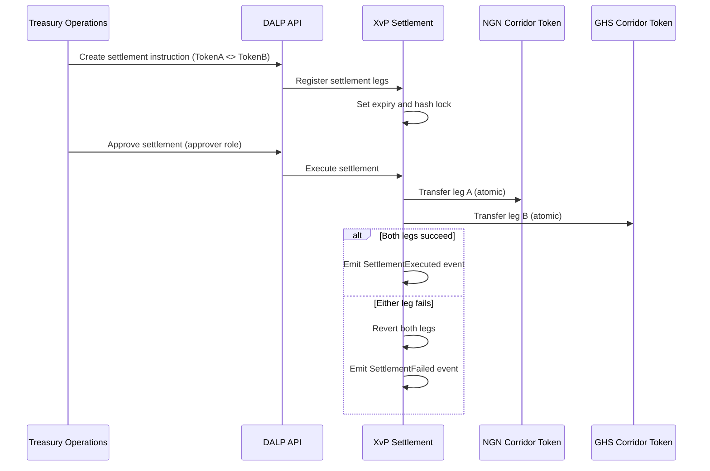

*Figure 5: Atomic XvP Settlement Flow*

### 5.6 Lifecycle Servicing and Exception Handling

The platform provides operational tooling for the full range of exception scenarios Flutterwave will encounter in production:

**Stuck transaction recovery:** The Execution Engine uses durable workflow orchestration (Restate) with exactly-once semantics. If a transaction submission fails due to network partition or RPC node unavailability, the workflow resumes from the last confirmed step automatically, without operator intervention.

**Frozen wallet management:** When a participant is flagged for suspicious activity, the Custodian role can apply a partial or full freeze to their corridor token balance without affecting other corridors or other participants. The freeze is immediate, on-chain, and logged with the operator identity.

**Forced transfers:** For court-ordered seizures, inheritance transfers, or regulatory enforcement actions, the Custodian role can execute forced transfers that move balance from a frozen or inaccessible wallet to a designated recovery address. Forced transfers bypass compliance pre-checks but cannot bypass on-chain logging.

**Platform circuit breaker:** If a corridor token needs to be suspended for compliance review or security incident response, the Emergency role can pause all operations on that token instantly. Pausing is scoped to the individual token; unrelated corridors remain operational.

### 5.7 Functional Fit Matrix

| Requirement | DALP Capability | Status | Notes |
|---|---|---|---|
| Corridor-specific compliance rules | Per-token compliance module configuration | Full | No smart contract redeployment required |
| Participant identity and onboarding | OnchainID, trusted issuer model | Full | KYC verification happens off-chain; claims are on-chain |
| Atomic settlement | XvP Settlement addon | Full | DvP and PvP supported |
| Maker-checker workflows | Transfer approval compliance module | Full | Configurable expiry and approver roles |
| Audit trail extraction | On-chain events, Chain Indexer API | Full | Queryable, exportable, tamper-evident |
| AML screening integration | API integration with external AML engine | Integration-dependent | DALP provides the enforcement hook; screening engine is external |
| Fiat reconciliation matching | On-chain event feeds + API | Partial | On-chain side is provided; fiat matching requires bank-partner data integration |
| High-volume batch operations | Batch mint, batch burn, batch role management | Full | Up to 100 operations per batch call |
| Multi-corridor segregation | Per-token compliance and access control | Full | Corridor isolation is structural |

---

## 6. Platform Architecture

### 6.1 Architectural Principles

DALP's architecture is built on five principles that directly address Flutterwave's procurement concerns:

**Lifecycle-first:** The platform models complete asset lifecycles, not just individual token operations. Every design decision is made with the full lifecycle in view, including exception paths, retirement, and evidence extraction.

**Durable execution:** All stateful operations run through durable workflows with persistent state and exactly-once semantics. Infrastructure failures, process restarts, and network partitions do not produce partial or duplicate operations.

**Defence-in-depth:** Security controls exist at every layer independently. No single-layer failure grants unauthorised access. Compliance enforcement is on-chain and cannot be bypassed from the application layer.

**Separation of concerns:** Token logic, compliance logic, identity logic, and operational logic are structurally separated. This makes each component independently auditable and independently configurable.

**Provider abstraction:** Cloud provider, custody provider, and blockchain network are all abstracted. Changing deployment cloud, custody backend, or blockchain network requires configuration changes, not code changes.

### 6.2 Four-Layer Architecture

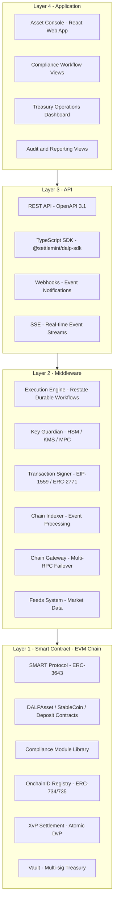

*Figure 6: DALP Four-Layer Architecture Detail*

### 6.3 Smart Contract Architecture for Payment Tokens

For Flutterwave's payment use case, the smart contract layer uses:

**StableCoin contract** for corridor payment tokens with fiat backing. The collateral requirement compliance module verifies on-chain proof of reserves before minting, ensuring that tokenized value always has a corresponding fiat backing. The supply cap module limits total issuance per corridor to the verified prefunding amount.

**Deposit contract** for bank balance representations. Deposit tokens represent tokenized claims on bank balances held at correspondent banks. They provide the on-chain representation of prefunding deposits without requiring the correspondent bank to participate in the blockchain network directly.

**XvP Settlement contract** for atomic corridor exchange. When a corridor settlement requires simultaneous debit and credit across two corridor tokens, XvP executes both legs atomically within a single transaction or reverts both if either leg fails compliance.

### 6.4 Transaction Processing Architecture

Every transaction passes through the Execution Engine's durable workflow orchestration, which provides:

- Exactly-once execution semantics: the same transaction will not be submitted twice even if the initiating API call is retried
- Persistent state: if the platform restarts mid-transaction, the workflow resumes from the last confirmed step
- Nonce coordination: serialised nonce allocation per wallet per chain prevents transaction conflicts in high-throughput scenarios
- Gas estimation and fee management: automatic EIP-1559 fee calculation with retry logic for gas price spikes

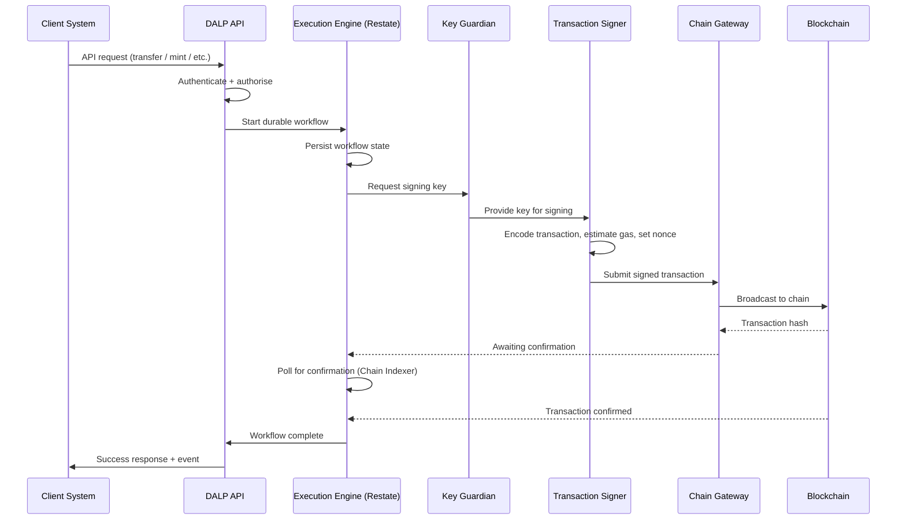

*Figure 7: Transaction Processing Architecture*

### 6.5 Data Architecture

DALP maintains three data stores with distinct characteristics:

**On-chain state (authoritative):** Token balances, compliance module configurations, identity claims, role assignments, and all transfer history are recorded immutably on the blockchain. This is the authoritative record for audit and regulatory purposes.

**Application state (operational):** PostgreSQL stores off-chain metadata including user accounts, organisation configurations, API key hashes, workflow state, and operational settings. This data is backed up continuously and supports point-in-time recovery.

**Indexed state (analytical):** The Chain Indexer maintains a queryable projection of on-chain events in PostgreSQL. This enables fast API queries over transaction history, compliance events, and balance snapshots without requiring direct blockchain queries for every request.

---

## 7. Token and Asset Lifecycle

### 7.1 Complete Lifecycle Flow

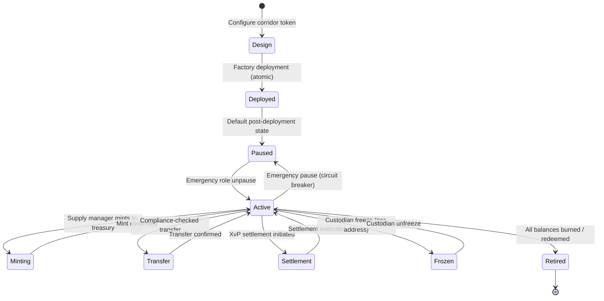

*Figure 8: Corridor Token Lifecycle State Machine*

### 7.2 Token Issuance Flow

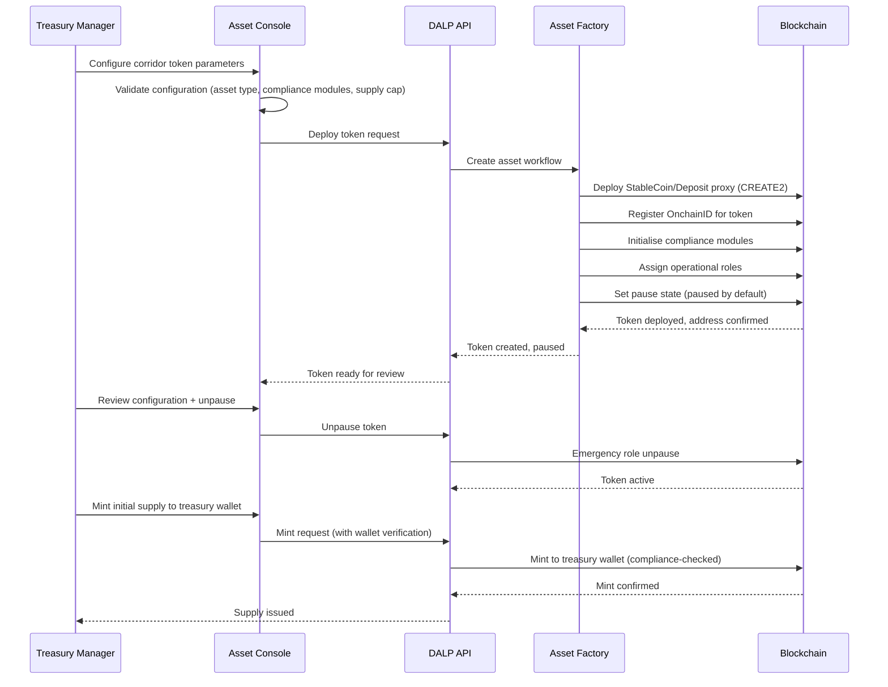

*Figure 9: Token Issuance Flow*

### 7.3 Cross-Border Settlement Lifecycle

For each cross-border payment cycle:

- **Prefunding:** Treasury mints corridor tokens to the originating-corridor treasury wallet, representing the fiat prefunding deposited with the correspondent bank. The collateral requirement module verifies the on-chain proof of reserves before minting completes.

- **Payment routing:** When a payment is initiated in the originating corridor, the payment acceptance layer calls DALP API to transfer corridor tokens from the treasury wallet to the payment processor's wallet. Compliance modules verify the payment processor's identity and eligibility.

- **Settlement instruction:** Treasury Operations creates an XvP settlement instruction pairing the originating corridor token debit against the receiving corridor token credit. Both legs are specified with amounts, wallets, and expiry time.

- **Settlement approval:** The settlement instruction enters the transfer approval workflow. An authorised approver in the compliance team reviews and approves within the configured window.

- **Atomic execution:** XvP executes both legs simultaneously. If either leg fails for any reason (insufficient balance, compliance rejection, network error), both legs revert with no partial state.

- **Reconciliation:** The Chain Indexer events feed into Flutterwave's reconciliation system with deterministic identifiers, timestamps, amounts, and wallet addresses. Fiat settlement confirmation from the correspondent bank is matched against the on-chain event using the shared transaction reference.

- **Retirement:** At end-of-day or cycle close, unneeded corridor token supply is burned. The burn operation reduces the on-chain supply, which triggers an update to the collateral requirement tracking. Fiat backing is released correspondingly.

---

## 8. Compliance and Regulatory Framework

### 8.1 Jurisdiction-Specific Regulatory Context

Flutterwave operates under the regulatory authority of the Central Bank of Nigeria (CBN) as its primary regulator, with subsidiary compliance obligations in each market where it holds a payment service licence or operates through bank partnerships. Key frameworks include:

| Framework | Jurisdiction | Platform Impact |
|---|---|---|
| CBN Framework for Digital Assets (2023) | Nigeria | Governs tokenized payment instruments, AML/CFT obligations for digital asset operations |
| SEC Nigeria Digital Assets Rules (2022) | Nigeria | Applies where tokenized instruments carry investment characteristics |
| NDPC Act 2023 | Nigeria | Data protection obligations for personal data in KYC/AML records |
| Money Laundering (Prevention and Prohibition) Act 2022 | Nigeria | AML/CFT obligations, transaction monitoring, suspicious activity reporting |
| Bank of Ghana Payment Systems Act | Ghana | Corridor-specific payment obligations |
| Bank of Tanzania regulations | Tanzania | Corridor-specific payment and FX obligations |
| Various national payment regulations | Kenya, Rwanda, Uganda, South Africa, UK | Corridor-specific requirements |

DALP's compliance architecture maps directly to these obligations:

- The identity verification module enforces KYC claim requirements, ensuring no unverified participant can receive or transfer corridor tokens.
- The country allow/block list module enforces jurisdiction restrictions, preventing token movements to/from sanctioned or excluded corridors.
- Audit log retention in DALP covers all operational events with full timestamps, operator identities, and before-and-after state. Retention periods are configurable to meet the seven-year minimum typical in financial services.
- Data residency controls in the deployment architecture can localise personal data processing to CBN-approved data centres.

### 8.2 Compliance Enforcement Architecture

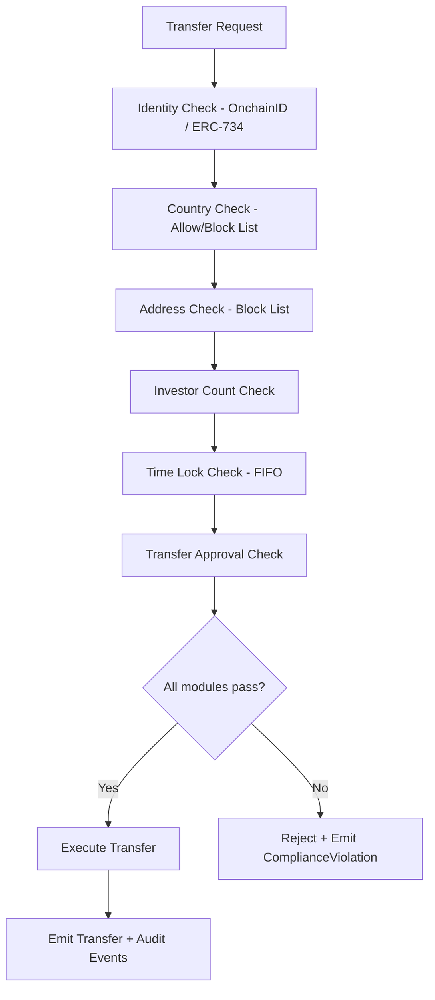

*Figure 10: Compliance Module Evaluation Flow*

### 8.3 AML/CFT Integration Pattern

DALP does not perform AML screening internally. DALP enforces identity verification at the on-chain layer, requiring every participant to have verified identity claims before they can receive or transfer corridor tokens. The actual AML screening (transaction monitoring, sanctions screening, PEP checks) happens in Flutterwave's existing AML engine.

The integration pattern is:

- Flutterwave's AML engine screens each participant at onboarding and publishes a KYC-cleared claim to the DALP identity registry through the trusted issuer API.
- DALP's identity verification module checks for the presence and validity of this claim before each transfer.
- If the AML engine subsequently flags a participant, Flutterwave's compliance team uses DALP's address block list module to add the flagged wallet to the block list, preventing further transfers. This takes effect immediately for all future transfers without requiring smart contract modification.
- If a wallet must be frozen pending investigation, the Custodian role applies a full or partial freeze. The frozen balance is visible in the audit trail.

### 8.4 Sanctions Screening

DALP's address block list module provides the enforcement mechanism for sanctions screening. When Flutterwave's sanctions screening system identifies a sanctioned address, the compliance team adds it to the relevant corridor token's block list. Transfers to or from the blocked address are rejected on-chain. The rejection emits a ComplianceViolation event that the AML engine can consume for case management.

For bulk sanctions list updates (OFAC, UN, EU lists), a batch API operation allows multiple addresses to be added to the block list in a single transaction, ensuring the list stays current without per-address operational overhead.

---

## 9. Security Architecture

### 9.1 Security Model Overview

DALP's security architecture operates across three independent trust boundaries. Each boundary is independently enforced, meaning a failure or bypass at one boundary is contained and does not propagate to the next.

**Platform boundary:** Between external users and systems and DALP's API surface. Controlled through authentication (Better Auth), session management, rate limiting (10,000 requests per 60-second window per API key), and TLS encryption of all communications.

**Execution boundary:** Between the API layer and the Execution Engine. Controlled through RBAC authorisation (26-role taxonomy), input validation (Zod schema enforcement), and wallet verification (step-up authentication required for all blockchain write operations).

**Chain boundary:** Between the Execution Engine and the blockchain. Controlled through on-chain compliance modules, custody provider transaction policies, and MPC signing requirements.

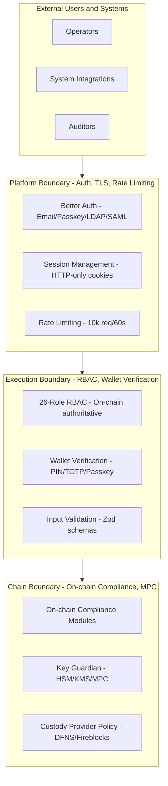

*Figure 11: Security Architecture - Three Trust Boundaries*

### 9.2 Authentication and Access Control

| Method | Use Case | Status |
|---|---|---|
| Email and password | Standard operator access | Active |
| Passkeys (WebAuthn) | Hardware key and biometric authentication | Active |
| LDAP / Active Directory | Flutterwave corporate directory integration | Available via plugin |
| OAuth 2.0 / OIDC | Okta, Auth0, Azure AD integration | Available via plugin |
| SAML 2.0 | Enterprise SSO | Available via plugin |

RBAC is enforced at both the platform layer (off-chain, Better Auth managed) and the smart contract layer (on-chain, AccessManager managed). On-chain roles are authoritative: changes to smart contract roles are reflected in the platform immediately through Chain Indexer event processing. No off-chain permission database can override on-chain role assignments.

For blockchain write operations, all users must pass wallet verification (step-up authentication) using PIN, TOTP, passkey, or backup codes. This second factor is independent of session authentication and cannot be bypassed by an administrator.

### 9.3 Key Management Architecture

| Tier | Protection Level | Recommended Use at Flutterwave |
|---|---|---|
| Encrypted database | Application-level encryption | Development and test environments |
| Cloud secret manager (AWS KMS, Azure Key Vault, GCP KMS) | Platform-managed encryption | Non-treasury production wallets |
| Hardware security module (FIPS 140-2 Level 3) | HSM-backed | Treasury wallets, supply management keys |
| MPC custody (DFNS or Fireblocks) | Institutional MPC with policy engine | Highest-value corridors |

For treasury wallets holding corridor token supply and prefunding positions, SettleMint recommends HSM-backed key management at minimum, with MPC custody through DFNS or Fireblocks for the highest-value corridors. The custody provider's transaction policy engine enforces additional controls including amount thresholds, whitelisted destination wallets, velocity limits, and multi-approver requirements before any transaction is signed.

### 9.4 Audit Trail Architecture

Every platform operation generates two types of audit records:

**On-chain events (immutable):** Every token transfer, compliance decision, role change, freeze, pause, and mint generates an on-chain event. These events are permanently recorded in the blockchain's immutable history. They cannot be modified, deleted, or suppressed by any party including SettleMint.

**Application audit logs (structured):** Every API call, authentication event, authorization decision, and configuration change generates a structured JSON audit log entry with timestamp, user identity, action, resource, and outcome. These logs are retained in accordance with configured retention periods and exportable for SIEM integration or regulatory submission.

### 9.5 Security Responsibility Matrix

| Control Area | SettleMint Responsibility | Flutterwave Responsibility |
|---|---|---|
| Platform security patching | Quarterly + critical patches as released | Applying updates on schedule |
| Smart contract security | SMART Protocol maintenance and audit | Configuration governance |
| Key management | Key Guardian service, HSM/MPC integration | Key policy design, approver designation |
| Network security (managed cloud) | Kubernetes network policies, ingress control | VPN/private network connectivity |
| Data residency | Configurable deployment regions | Data localisation policy decisions |
| Access provisioning | Role framework and audit | User provisioning, periodic recertification |
| AML screening | Identity claim enforcement on-chain | AML screening engine operation |

---

## 10. Integration Architecture

### 10.1 Integration Principles

DALP is designed as an integration-first platform. Its API surface is intended to connect to existing enterprise stacks, not to replace them. Every capability available through the Asset Console is also available through the API, ensuring that Flutterwave can automate any operation that can be performed manually.

### 10.2 Integration Points

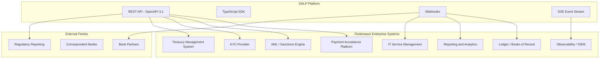

*Figure 12: Integration Architecture Overview*

### 10.3 Integration Patterns by System

**Payment acceptance platform:** The payment acceptance system calls DALP API synchronously to initiate corridor token transfers when payments are routed for settlement. Response includes transaction hash and status. Event webhooks notify the payment system of settlement completion.

**AML/sanctions engine:** The AML engine publishes identity claims to DALP's trusted issuer API when participants are KYC-cleared. When participants are flagged, the compliance team uses DALP API to add wallets to the block list. The AML engine can subscribe to DALP's ComplianceViolation event stream to trigger case management workflows.

**Treasury management system:** The treasury system calls DALP API to monitor corridor token balances, trigger prefunding mints when corridor balances fall below threshold, and initiate redemptions when positions need to close. XvP settlement instructions are created and approved through DALP's settlement API.

**Ledger/books of record:** DALP's Chain Indexer feeds structured events to the ledger system through webhooks with guaranteed delivery. Each event contains stable identifiers (transaction hash, block number, corridor token address, wallet addresses) that the ledger system uses for matching against internal records.

**Regulatory reporting:** DALP API provides queryable access to all on-chain transaction history with filtering by corridor, date range, amount, wallet, and event type. Regulatory report exports are available in structured formats suitable for CBN and partner-country submission.

### 10.4 API Versioning and Release Management

DALP uses semantic versioning for its API. Non-breaking changes are additive and do not require consumer updates. Breaking changes are introduced in new major versions with a minimum six-month deprecation notice and parallel availability period. Test environments reflect production API behaviour exactly, enabling integration consumers to validate against upcoming versions before they reach production.

---

## 11. Deployment Architecture

### 11.1 Recommended Deployment for Flutterwave

SettleMint recommends a private cloud deployment on a single major cloud provider (AWS, Azure, or GCP based on Flutterwave's existing cloud strategy) with multi-availability-zone distribution for the production environment. This model provides:

- Data residency controls enabling Nigeria-specific data to remain in-country where CBN requires
- Full operational visibility for Flutterwave's security and infrastructure teams
- Independence from SettleMint's infrastructure for regulatory compliance purposes
- The same platform capabilities as managed SaaS without shared-tenancy concerns

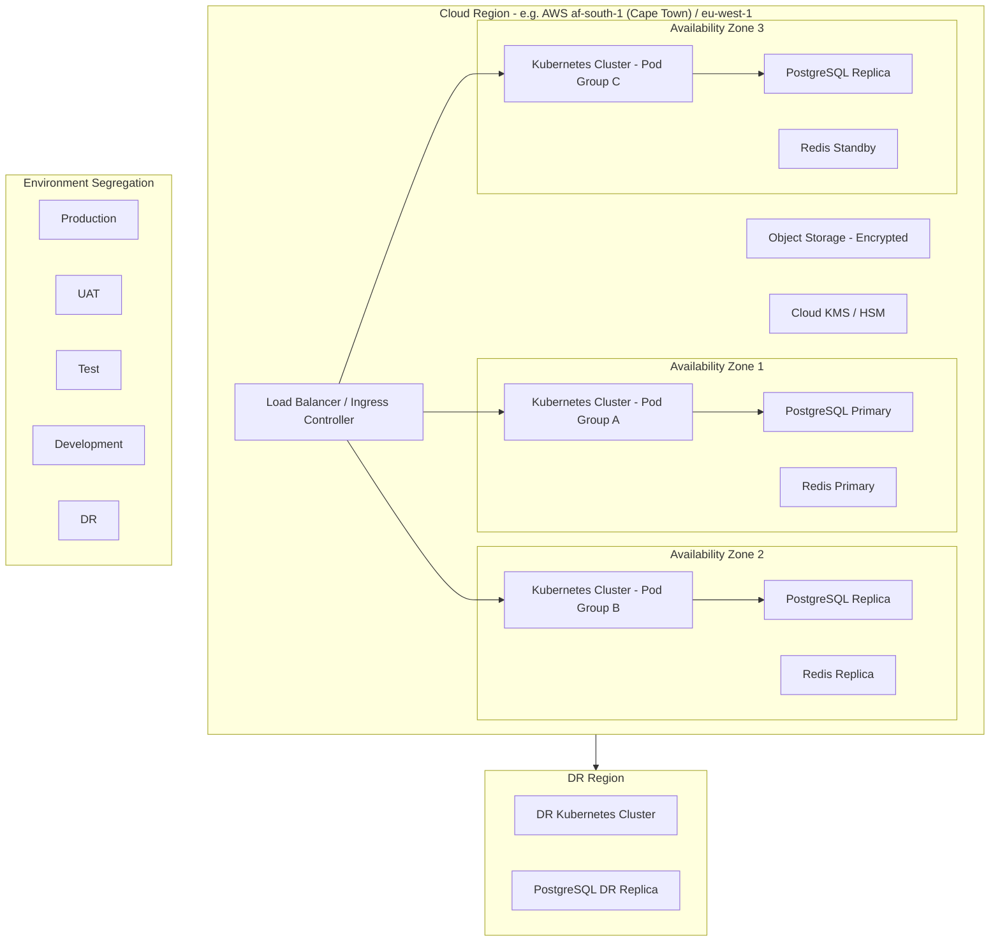

*Figure 13: Deployment Architecture - Multi-AZ Private Cloud*

### 11.2 Environment Segregation

DALP provides fully segregated environments as a baseline requirement (REQ-01):

| Environment | Purpose | Data | Network Isolation |
|---|---|---|---|
| Development | Platform configuration and integration development | Synthetic only | Isolated namespace |
| Test | Functional and integration testing | Synthetic only | Isolated namespace |
| UAT | User acceptance and compliance testing | Masked production-like | Isolated namespace |
| DR | Disaster recovery replica | Replicated from production | Separate cluster |
| Production | Live operations | Real | Dedicated cluster |

No environment shares infrastructure with any other. Secrets, keys, and configuration are environment-specific and non-portable across boundaries.

### 11.3 Blockchain Network Configuration

For Flutterwave's cross-border payment use case, SettleMint recommends a private EVM-compatible network (Hyperledger Besu with IBFT 2.0 consensus) managed by Flutterwave. This provides:

- Full operational control over validator nodes and network configuration
- Transaction finality in approximately two seconds
- No public chain exposure for sensitive corridor flows
- Configurable permissioning for which addresses can deploy contracts and submit transactions
- Compatibility with all DALP smart contracts without modification

Alternatively, a permissioned consortium network with selected bank partners as co-validators provides an additional governance layer where partner institutions have visibility into settlement events.

### 11.4 High Availability and DR Parameters

| Scenario | RTO | RPO |
|---|---|---|
| Single AZ failure (cloud-native HA) | 2-15 minutes | Seconds to 1 minute |
| Regional failure (hot-warm DR) | 30-180 minutes | 5-60 minutes |
| Full recovery from backup | 8-72 hours | 4-24 hours |

---

## 12. Data Management and Governance

### 12.1 Data Architecture

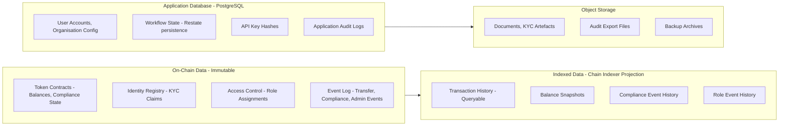

*Figure 14: Data Architecture and Flow*

### 12.2 Data Residency Controls

CBN's data localisation requirements and country-specific NDPC Act 2023 obligations require that certain personal data related to Nigerian customers remain within Nigeria-approved infrastructure. DALP's deployment model addresses this through:

- Environment-specific PostgreSQL instances deployed in CBN-approved cloud regions (AWS af-south-1 Cape Town or Azure South Africa North)
- Object storage buckets in the same approved regions for KYC document storage
- Blockchain validator nodes in approved regions (on-chain data governance follows deployment region)
- Configurable data retention and deletion policies aligned to NDPC Act requirements

### 12.3 Reconciliation Data Model

For Flutterwave's reconciliation requirements (REQ-15), DALP provides the following data elements on every transaction:

| Field | Description | Use in Reconciliation |
|---|---|---|
| Transaction hash | Unique blockchain transaction identifier | Primary matching key with bank-partner records |
| Block number and timestamp | Deterministic ordering | Settlement cycle sequencing |
| Token address | Identifies the corridor | Corridor-level reconciliation grouping |
| From / to wallet addresses | Participant identification | Beneficiary matching |
| Amount | Transfer amount in token units | Value matching |
| Compliance module results | Which modules evaluated and outcomes | Compliance evidence |
| Event type | Transfer, Mint, Burn, ComplianceViolation etc. | Categorisation |

These fields are available through the Chain Indexer API with filtering, pagination, and export capabilities.

---

## 13. Operational Model and Governance

### 13.1 Role-Based Operating Model

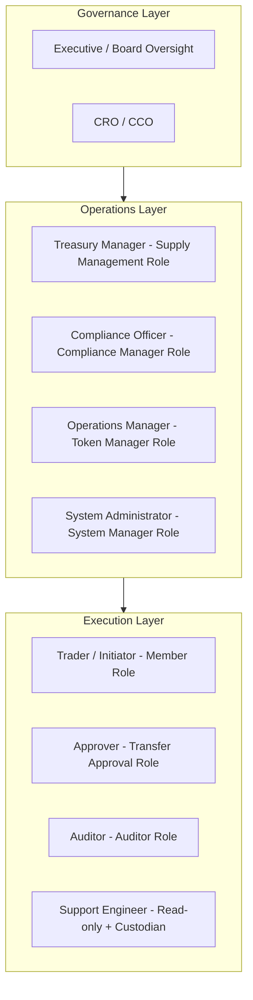

*Figure 15: Operational Role Hierarchy*

### 13.2 Governance Routines

**Daily:** Exception queue review by operations and compliance team. Reconciliation status check: all on-chain settlements matched to fiat confirmations. Frozen address review: confirm all active freezes have associated case records.

**Weekly:** Entitlement review: verify role assignments match current personnel. Settlement exception analysis: patterns in compliance rejections or failed settlements. Threshold monitoring: corridor token supply levels vs prefunding positions.

**Monthly:** Full entitlement recertification across all platform roles. Compliance module configuration review: verify corridor rule books reflect current regulatory requirements. Incident trend review: security events, compliance violations, and operational exceptions. Management reporting package compilation from Chain Indexer API exports.

### 13.3 Maker-Checker Enforcement

All significant operations in DALP follow a maker-checker discipline that prevents unilateral execution. The Transfer Approval compliance module enforces dual-control on transfers above configured thresholds. Minting new corridor token supply requires Supply Management role (maker) initiation and a separate wallet verification step. Role changes require Admin role action with full audit logging of the granting user identity.

The Execution Engine's durable workflow model means that a partially executed operation (e.g., approver has not responded within the expiry window) enters a deterministic expired state rather than hanging indefinitely. Expired approvals are visible in the exception queue.

---

## 14. Implementation Plan

### 14.1 Delivery Approach

SettleMint delivers DALP implementations through a six-phase programme with formal acceptance gates between phases. Each gate requires explicit sign-off from Flutterwave's business, compliance, and technology stakeholders before the programme proceeds to the next phase. This structure prevents scope drift and ensures that critical decisions (corridor configuration, compliance rule design, integration specifications) are made and documented before build activities begin.

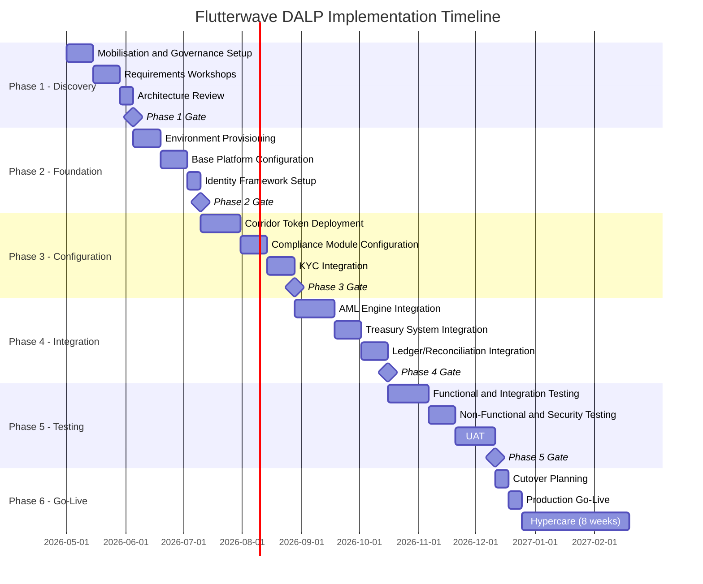

*Figure 16: Implementation Timeline (Indicative)*

### 14.2 Phase Descriptions

**Phase 1 - Discovery and Requirements (5 weeks)**

Objective: Establish shared understanding of scope, integration requirements, compliance obligations, and delivery governance.

Activities: Programme kick-off and RAID log establishment; corridor prioritisation and token configuration workshops; regulatory mapping against CBN and partner-country requirements; integration landscape review covering AML engine, treasury system, ledger, and payment acceptance platform; identity framework design including KYC claim schema and trusted issuer configuration; environment and infrastructure planning.

Outputs: Agreed programme plan, technical architecture document, integration specifications, compliance configuration design, environment setup requirements, Phase 1 acceptance gate evidence.

**Phase 2 - Foundation (5 weeks)**

Objective: Provision all environments, configure base platform, establish identity framework.

Activities: Cloud infrastructure provisioning (dev, test, UAT, DR, production); Kubernetes cluster setup and network policy configuration; Key Guardian configuration with appropriate storage tier per environment; blockchain network setup (private EVM); base DALP platform deployment and health validation; identity registry initialisation; enterprise SSO integration (Flutterwave corporate directory).

**Phase 3 - Configuration (7 weeks)**

Objective: Deploy and configure all corridor tokens with appropriate compliance modules.

Activities: Priority corridor token deployment through Asset Factory; compliance module configuration per corridor (country allow lists, identity verification, transfer approval thresholds, time locks); KYC claim schema integration with identity provider; supply management role assignment and workflow configuration; XvP settlement contract deployment for bilateral corridor pairs.

**Phase 4 - Integration (7 weeks)**

Objective: Connect DALP to Flutterwave's enterprise systems through the API and event infrastructure.

Activities: AML engine API integration (identity claim publication, address block list management, compliance event subscription); treasury management system integration (balance monitoring, mint/burn automation, XvP settlement instruction creation); payment acceptance platform integration (corridor token transfer on payment routing); ledger/books-of-record webhook integration; reporting layer API integration; SIEM/observability integration (structured log forwarding, alert routing).

**Phase 5 - Testing (8 weeks)**

Objective: Validate functional correctness, integration coherence, performance, security, and compliance configuration across all corridors.

Activities: Functional testing of all corridor token operations; integration testing for all connected enterprise systems; non-functional testing (throughput, latency, concurrent transaction handling); security testing including penetration testing of API surface and key management; DR and failover testing; UAT with Flutterwave operations and compliance teams; role and entitlement validation; negative and boundary scenario testing (duplicate submissions, stale approvals, blocked sanctions outcomes, partner timeouts).

**Phase 6 - Go-Live and Hypercare (12 weeks)**

Objective: Execute controlled production launch and provide intensive operational support during stabilisation.

Activities: Final pre-production security and compliance review sign-off; production cutover with parallel running period for first corridor; go-live smoke testing; hypercare support with SettleMint on-call coverage; phased corridor rollout (additional corridors added on two-week cadence after first corridor stability confirmed); operational handover, runbook documentation, and support team training; post-hypercare transition to standard support model.

### 14.3 Resource Model

| Role | SettleMint | Flutterwave |
|---|---|---|
| Programme Manager | Named PM, full engagement | Programme sponsor, decision authority |
| Solution Architect | Senior architect, phases 1-4 | Architecture review lead |
| Integration Engineer | 2 engineers, phases 3-4 | 2 integration engineers, phases 3-4 |
| Compliance Specialist | Compliance architect, phases 2-3 | Compliance lead, all phases |
| Test Lead | Test architect, phase 5 | UAT lead, phase 5 |
| Delivery Manager | Engagement manager, all phases | Project manager, all phases |

---

## 15. Support and SLA

### 15.1 Support Tiers

| Feature | Standard | Premium |
|---|---|---|
| Annual cost | $45,000 | $85,000 |
| Coverage hours | Business hours (8am-6pm CET) | 24/7/365 |
| Support channels | Portal, email | Portal, email, dedicated Slack, phone |
| P1 response time | 4 hours | 1 hour |
| P2 response time | 8 hours | 4 hours |
| Named support lead | No | Yes |
| Quarterly service reviews | No | Yes |

For a production payment platform, SettleMint recommends the Premium support tier given the 24/7 nature of cross-border payment operations.

### 15.2 Severity Classification

| Severity | Definition | Initial Response | Resolution Target |
|---|---|---|---|
| P1 - Critical | Production outage, data loss risk, security incident | 1 hour (Premium) / 4 hours (Standard) | 4 hours |
| P2 - High | Significant functional degradation, compliance workflow blocked | 4 hours (Premium) / 8 hours (Standard) | 24 hours |
| P3 - Medium | Non-critical issue, workaround available | 8 hours | 72 hours |
| P4 - Low | Enhancement request, documentation query | Next business day | Roadmap consideration |

### 15.3 Uptime SLA

Production environment uptime target: 99.9% monthly measured availability. This equates to approximately 43 minutes maximum downtime per month. Planned maintenance windows (maximum 4 hours per quarter) are excluded from SLA calculation with minimum 72-hour advance notice.

---

## 16. References and Experience

### 16.1 Track Record Summary

| Client | Geography | Use Case | Relevance to Flutterwave |
|---|---|---|---|
| Central Bank project (Bahrain region) | Middle East | CBDC infrastructure | On-chain settlement, regulatory compliance, audit evidence |
| Commercial bank (South Africa) | Africa | Tokenized securities and settlement | African regulatory context, settlement design |
| Payment infrastructure operator (Europe) | Europe | Tokenized payment rails | Payment corridor settlement, API integration |
| Market infrastructure (KSA) | Middle East | Tokenized securities listing | Multi-party settlement, compliance modules |
| Multi-bank consortium | Europe | Cross-bank settlement platform | Multi-party atomic settlement, reconciliation |

Reference details and contact information are available to shortlisted bidders under NDA upon request.

### 16.2 Africa Market Experience

SettleMint has delivered implementations in or covering the African regulatory environment including South Africa (FSCA, SARB), Nigeria (CBN frameworks), Egypt (CBE), Morocco (AMMC), and pan-African contexts. This experience informs both the regulatory mapping in Appendix B and the compliance module configuration recommendations in this proposal.

---

## 17. Third-Party Dependencies

All material third-party dependencies are disclosed below in compliance with REQ-05:

| Component | Provider | Dependency Type | Substitution Available |
|---|---|---|---|
| Blockchain network | Hyperledger Besu (open source) or partner L2 | Infrastructure | Yes: any EVM-compatible network |
| Cloud Kubernetes | AWS EKS / Azure AKS / GCP GKE | Infrastructure | Yes: any managed Kubernetes or on-premises |
| PostgreSQL | Cloud-managed (RDS/Azure DB/Cloud SQL) | Database | Yes: self-managed PostgreSQL |
| MPC custody | DFNS or Fireblocks | Optional key management | Yes: HSM or cloud KMS alternatives |
| Object storage | AWS S3 / Azure Blob / GCP Cloud Storage | Storage | Yes: MinIO or S3-compatible |
| Execution engine | Restate (open source) | Workflow orchestration | No direct substitute; self-hosted open source |

---

## Appendix A: Requirement Response Matrix

| Req ID | Summary | Response Status | DALP Capability | Notes |
|---|---|---|---|---|
| REQ-01 | Environment segregation | Full | Dev/test/UAT/DR/production environments, all isolated | Structural platform capability |
| REQ-02 | API-first interfaces | Full | OpenAPI 3.1, TypeScript SDK, webhooks, SSE | Complete API surface |
| REQ-03 | RBAC, segregation of duties, maker-checker, audit logs | Full | 26-role RBAC, transfer approval module, on-chain audit trail | On-chain authoritative roles |
| REQ-04 | Configurable lifecycle states, policy controls | Full | Compliance modules, pause/unpause, freeze, lifecycle states | Per-token configuration |
| REQ-05 | Third-party dependency disclosure | Full | All dependencies listed in Section 17 | |
| REQ-06 | Resilience, recovery, monitoring, incident management | Full | Multi-AZ HA, DR modes, Prometheus/Grafana, durable execution | RTO/RPO targets in Section 11 |
| REQ-07 | Delivery method and phased implementation | Full | 6-phase delivery model in Section 14 | |
| REQ-08 | Audit evidence extraction | Full | On-chain events, Chain Indexer API, exportable evidence packs | |
| REQ-14 | High-throughput routing and participant onboarding | Full | Batch operations, parallel workflow support, identity reuse | |
| REQ-15 | Tokenized/fiat reconciliation | Partial | On-chain events provide tokenized side; fiat matching requires bank-partner feed integration | Integration workstream in Phase 4 |

---

## Appendix B: Regulatory Mapping

| Regulation | Jurisdiction | DALP Control Mapping |
|---|---|---|
| CBN Framework for Digital Assets (2023) | Nigeria | Identity verification, AML screening hooks, audit log retention, reporting API |
| SEC Nigeria Digital Assets Rules (2022) | Nigeria | Investor eligibility checks, supply controls, disclosure event logging |
| NDPC Act 2023 | Nigeria | Data residency controls, retention policies, access logging, deletion workflows |
| MLPPA 2022 | Nigeria | Transaction monitoring integration, address block list for sanctions, suspicious activity event stream |
| Bank of Ghana Payment Systems Act | Ghana | Country-specific compliance module per Ghana corridor token |
| Bank of Tanzania regulations | Tanzania | Country-specific compliance module per Tanzania corridor token |
| Data Protection Act 2019 | Kenya | Separate data residency configuration for Kenya corridor data |
| POPIA 2021 | South Africa | Data subject access and deletion controls for South Africa participants |

---

## Appendix C: Security and Resilience Evidence

### C.1 Certifications

- ISO 27001: Certification maintained annually with continuous improvement programme
- SOC 2 Type II: Independent audit confirming effective operation of security controls over audit period

### C.2 Security Architecture Evidence

Available to shortlisted bidders under NDA:
- Platform architecture security review documentation
- Key management architecture diagrams
- Penetration testing summary and remediation evidence
- Vulnerability management process documentation

### C.3 Resilience Evidence

Available to shortlisted bidders under NDA:
- DR test reports and restoration time measurements
- Backup and recovery procedure documentation
- Incident response process documentation
- Service uptime history for production deployments

### C.4 Operational Security Controls

| Control | Implementation |
|---|---|
| Wallet verification rate limiting | Progressive lockout after failed attempts |
| API key rate limiting | 10,000 requests per 60-second window per key |
| Input validation | Zod schema enforcement on all API endpoints |
| Production safety checks | Rejection of default development credentials at startup |
| Path traversal protection | Resolved path validation in object storage |
| HMAC-signed URLs | Constant-time comparison for signed URL verification |
| Session management | HTTP-only, Secure, SameSite cookies; 7-day expiry |

---

*This document is classified SettleMint Confidential. Distribution is restricted to authorised Flutterwave procurement personnel.*
