# Technical Proposal: Tokenized Payment Settlement and Reconciliation Network

**Prepared for:** Interswitch (Nigeria)
**Prepared by:** SettleMint NV
**Date:** March 2026
**Version:** v1.0
**Reference:** INTERSWITCH-RFP-TOKENIZED-PAYMENT-SETTLEMENT-202603
**Classification:** SettleMint Confidential

---

## Table of Contents

- Executive Summary
- About SettleMint
- About DALP
- Understanding of Requirements
- Proposed Solution and Functional Capabilities
- Platform Architecture
- Token and Asset Lifecycle
- Compliance and Regulatory Framework
- Security Architecture
- Integration Architecture
- Deployment Architecture
- Data Management and Governance
- Operational Model and Governance
- Implementation Plan
- Support and SLA
- References and Experience
- Appendix A: Requirement Response Matrix
- Appendix B: Regulatory Mapping
- Appendix C: Security and Resilience Evidence

---

## 1. Executive Summary

### 1.1 Context and Strategic Drivers

Interswitch sits at the centre of Nigeria's payment infrastructure. As the operator of Verve (Nigeria's dominant domestic card network), Quickteller (multi-bank bill payment), and a broad enterprise payment-switching infrastructure, Interswitch processes billions of naira in daily settlement flows across issuing banks, acquiring banks, merchants, and consumers. The company's competitive position depends on its ability to operate this infrastructure at bank-grade reliability, with full regulatory defensibility under CBN oversight, while continuously improving settlement speed, reconciliation quality, and participant transparency.

Tokenized payment settlement represents Interswitch's opportunity to place a programmable, auditable settlement layer underneath existing switching flows. The core value proposition is not speculative asset issuance. It is operational: a tokenized settlement record is deterministic, tamper-evident, queryable, and replayable in ways that conventional message-based settlement records are not. When CBN asks for a full reconstruction of a settlement cycle, when a merchant disputes a funding amount, when an issuer bank's reconciliation team flags a discrepancy, Interswitch needs to be able to answer with certainty rather than with hours of manual log correlation.

The tokenized payment settlement and reconciliation network programme directly addresses this. By placing settlement obligations on-chain as programmatically governed tokens, Interswitch can automate reconciliation event generation, enforce maker-checker discipline on settlement actions, maintain immutable evidence of every settlement state transition, and produce regulatory evidence on demand from a single queryable source.

### 1.2 Why This Programme Is Hard

Payment switching infrastructure creates specific implementation challenges that generic tokenization platforms are not designed to address.

First, volume and throughput. Interswitch processes tens of millions of transactions per day across its switching infrastructure. A tokenized settlement layer cannot be the performance bottleneck in this stack. It must handle high-frequency settlement batch events, not individual retail transactions on-chain. The architecture must clearly separate the retail transaction layer (which remains in Interswitch's existing switching infrastructure) from the settlement layer (which is the scope of tokenization).

Second, participant complexity. Interswitch's settlement network involves issuing banks, acquiring banks, merchants of varying types and sizes, and regulatory bodies. Each participant type has different data visibility requirements, different settlement frequency, and different reconciliation expectations. The platform must support role-based participant segmentation without creating bespoke integrations for each participant category.

Third, legacy coexistence. Interswitch cannot replace its existing switching and settlement infrastructure overnight. The tokenized settlement layer must coexist with, and produce evidence consistent with, existing books-and-records, bank-partner statement formats, and CBN reporting templates. A solution that requires Interswitch to abandon existing infrastructure before the tokenized layer is proven is not a credible proposal.

Fourth, regulatory ring-fencing. CBN has been cautious about digital asset activity in Nigeria. Interswitch's tokenized settlement programme must be structured as a permissioned, closed-loop settlement utility, clearly distinct from public cryptocurrency activity. The platform must support this ring-fencing structurally, not just as a policy statement.

### 1.3 Proposed Response

SettleMint proposes DALP as the settlement control plane for Interswitch's tokenized payment settlement and reconciliation network. The architecture separates the retail transaction layer (Interswitch's existing switching infrastructure handles individual card and electronic fund transfer transactions) from the settlement layer (DALP manages the net settlement obligations between participants as tokenized positions).

In this architecture:

The StableCoin and Deposit contract types model settlement positions held by participant banks and Interswitch's treasury. A settlement position represents the net obligation between Interswitch's switching infrastructure and a participant bank at any point in time.

Settlement cycles (end-of-day, intra-day, or real-time depending on product tier) trigger net settlement calculations in Interswitch's existing settlement engine. The settlement engine calls DALP API to execute atomic bilateral or multilateral settlement between participant positions, with XvP Settlement providing atomicity guarantees across all participant legs.

The compliance module library enforces participant eligibility checks, settlement limit controls, and regulatory ring-fencing (ensuring settlement tokens cannot leave the permissioned participant network) on every settlement operation.

The Chain Indexer provides a queryable, real-time projection of all settlement events that feeds into Interswitch's reconciliation systems, management reporting, and CBN regulatory reporting workflows.

### 1.4 Why SettleMint

SettleMint's delivery track record includes regulated payment infrastructure tokenization, central bank settlement pilots, and multi-party settlement networks across Europe, the Middle East, and Africa. The company understands that a payment infrastructure operator like Interswitch is not evaluating a tokenization product; it is evaluating whether a platform can operate reliably inside the same discipline that governs the existing switching infrastructure: SLA commitments, regulatory audit readiness, incident management, and board-level reporting.

SettleMint holds ISO 27001 and SOC 2 Type II certifications. Its implementation methodology is structured around formal phase gates, named programme leads, explicit acceptance criteria, and post-go-live hypercare. These are not process theatre; they are the disciplines that prevent the last-minute compliance surprises and integration failures that derail regulated infrastructure programmes.

### 1.5 Why DALP

DALP's structural design properties directly address Interswitch's requirements:

Compliance enforcement is on-chain. Settlement ring-fencing (ensuring participant settlement tokens cannot be transferred outside the permissioned network) is enforced at the smart contract layer through country allow lists and identity registry restrictions. This cannot be bypassed by application-layer configuration errors.

Atomic settlement is native. XvP Settlement executes bilateral and multilateral settlement atomically: all legs complete simultaneously or all legs revert. There is no partial settlement state that creates reconciliation debt.

The audit trail is immutable. Every settlement event, every compliance decision, every role change is recorded on-chain and cannot be modified. CBN supervisory evidence requests can be fulfilled from a single queryable source.

API-first design enables coexistence. DALP does not require replacing Interswitch's existing switching infrastructure. It accepts settlement instructions through a clean REST API, executes on-chain, and emits structured events that existing reconciliation and reporting systems can consume.

---

## 2. About SettleMint

SettleMint NV is a Belgian financial technology company specialising in digital asset lifecycle platforms for regulated financial institutions. The company was founded in 2017 and holds ISO 27001 and SOC 2 Type II certifications. SettleMint's production track record covers central banks, commercial banks, payment operators, stock exchanges, and market infrastructure providers across Europe, the Middle East, Asia, and Africa.

For a payment infrastructure operator like Interswitch, SettleMint's most directly relevant credentials are its experience with high-volume settlement tokenization, multi-party net settlement platforms, and regulatory-grade evidence architecture in jurisdictions with active supervisory oversight.

---

## 3. About DALP

### 3.1 Platform Architecture

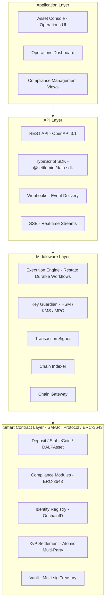

*Figure 1: DALP Platform Architecture - Four-Layer Stack*

DALP provides complete lifecycle coverage for tokenized settlement instruments through a four-layer architecture: Application (Asset Console web UI and dashboards), API (OpenAPI 3.1 REST interface with TypeScript SDK, webhooks, and SSE event streams), Middleware (Execution Engine for durable workflow orchestration, Key Guardian for cryptographic key management, Chain Indexer for on-chain event projection), and Smart Contract (SMART Protocol ERC-3643 compliant contracts with on-chain compliance enforcement).

### 3.2 Key Capabilities for Settlement Use Cases

**Atomic multi-party settlement (XvP addon):** Executes bilateral and multilateral settlement atomically. All legs complete simultaneously or all legs revert. No partial settlement state is possible.

**Configurable compliance modules:** Country allow lists, identity verification, address block lists, investor count limits, time locks, and transfer approval workflows. All configurable per settlement instrument without smart contract redeployment.

**Durable workflow execution (Restate):** All settlement operations run as durable, idempotent workflows. Infrastructure failures, process restarts, and network partitions do not produce duplicate or partial settlement operations.

**Immutable on-chain audit trail:** Every settlement event recorded on-chain, accessible through the Chain Indexer API, exportable for regulatory submission.

---

## 4. Understanding of Requirements

### 4.1 Interswitch Context

Interswitch operates switching and settlement infrastructure for Nigeria's payment ecosystem, including Verve card network (issuing and acquiring), Quickteller (multi-bank bill payment and transfer), and enterprise settlement services. Settlement flows involve multiple participant banks, merchant acquirers, and Interswitch's own treasury positions. Reconciliation between these participants is currently message-based and subject to timing mismatches, manual correction processes, and audit evidence assembly overhead.

The tokenized settlement programme addresses the settlement layer specifically. The scope is net settlement positions between participants, not individual retail transactions. This distinction is architecturally critical: DALP manages settlement obligation tokens, not individual payment records.

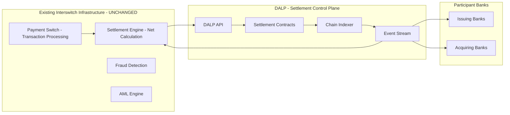

*Figure 2: Interswitch Architecture Positioning - Settlement Layer Only*

### 4.2 Requirement Domain Coverage

| Domain | Coverage | Notes |
|---|---|---|
| REQ-01: Environment segregation | Full | 5 environments: dev, test, UAT, DR, production |
| REQ-02: API-first | Full | OpenAPI 3.1, TypeScript SDK, webhooks, SSE |
| REQ-03: RBAC, maker-checker, audit | Full | 26-role taxonomy, transfer approval module, on-chain audit |
| REQ-04: Lifecycle controls | Full | Per-token compliance modules, settlement states |
| REQ-05: Dependencies | Full | Section 17 disclosure |
| REQ-06: Resilience and DR | Full | Multi-AZ HA, tested DR, durable execution |
| REQ-07: Implementation plan | Full | 6-phase plan, Section 14 |
| REQ-08: Audit evidence | Full | On-chain events, queryable via API |
| REQ-14: High throughput and onboarding | Full | Batch operations, identity reuse across instruments |
| REQ-15: Tokenized/fiat reconciliation | Partial | On-chain state provided; fiat matching via integration |

### 4.3 Key Challenges Identified

**Challenge 1: Architectural separation of transaction and settlement layers.** Interswitch's switching infrastructure processes millions of transactions per day. These must not all become individual blockchain transactions. The tokenized settlement layer operates on net settlement positions, not individual transactions.

*DALP response:* DALP manages settlement positions as token balances. Individual transactions are aggregated by Interswitch's existing settlement engine into net positions. Only net position changes are submitted to DALP as settlement operations. This keeps on-chain transaction volume bounded and manageable.

**Challenge 2: CBN regulatory ring-fencing.** CBN requires that settlement tokens remain within a permissioned participant network and are not accessible to public cryptocurrency markets.

*DALP response:* The country allow list and identity registry compliance modules structurally enforce this. Only wallets with verified OnchainID claims (issued by Interswitch as the trusted issuer) can hold or transfer settlement tokens. There is no mechanism to move tokens to unverified wallets. This is enforced on-chain and cannot be bypassed at the application layer.

**Challenge 3: Participant bank onboarding and offboarding.** Interswitch's participant bank roster changes over time. New banks join the settlement network; some exit. The platform must support participant lifecycle management without disrupting existing settlement operations.

*DALP response:* Participant banks are onboarded through DALP's identity registration system. Adding a new participant requires publishing their identity claims and granting their wallet addresses appropriate roles. Offboarding requires revoking roles and optionally adding their wallet to the address block list. Neither operation affects other participants or requires smart contract redeployment.

**Challenge 4: Reconciliation between on-chain settlement and off-chain books.** Participant banks maintain their own books and expect settlement statements in familiar formats. DALP's on-chain settlement records must be extractable in formats that participant banks' reconciliation teams can use.

*DALP response:* The Chain Indexer API provides queryable access to all settlement events with standard field sets (settlement ID, participant identifiers, amounts, timestamps, directions). Export endpoints provide structured data suitable for transformation into bank-specific statement formats through Interswitch's existing reporting layer.

---

## 5. Proposed Solution and Functional Capabilities

### 5.1 Settlement Architecture Overview

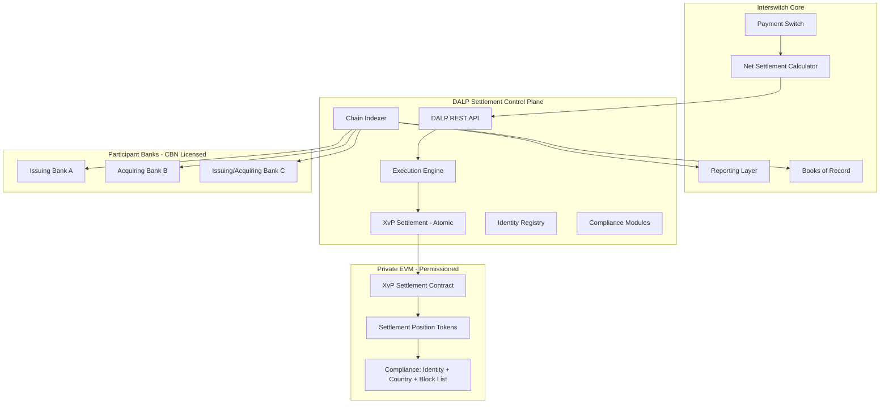

*Figure 3: Interswitch DALP Solution Architecture*

### 5.2 Settlement Position Token Design

For Interswitch's settlement network, each participant bank holds a settlement position account represented by a StableCoin or Deposit token balance. Settlement positions represent:

- **Interswitch-to-bank net obligation:** The amount owed by Interswitch to an acquiring bank for net merchant settlements
- **Bank-to-Interswitch net obligation:** The amount owed by an issuing bank to Interswitch for net card transaction collections
- **Intrabank bilateral obligations:** Where direct bank-to-bank settlement is appropriate

Each settlement token type is configured with:
- Identity verification: only participant banks with registered OnchainID (verified by Interswitch) can hold positions
- Country allow list: Nigeria only (ring-fencing from non-Nigerian participants)
- Transfer approval: bilateral settlement above configured thresholds requires dual-control approval
- Collateral requirement: minting new position tokens requires verified corresponding fiat funding confirmation

### 5.3 Settlement Cycle Flow

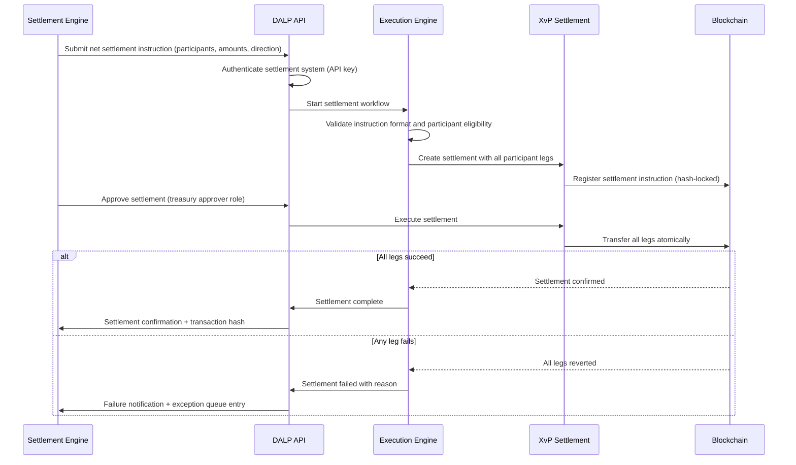

*Figure 4: Settlement Cycle Execution Flow*

### 5.4 Compliance Enforcement Flow

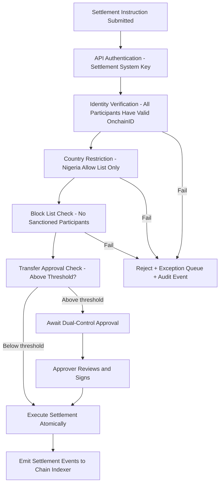

*Figure 5: Settlement Compliance Enforcement Flow*

### 5.5 Participant Onboarding

Participant banks are onboarded through a three-step process:

- Step 1: Interswitch's identity management team registers the participant bank's OnchainID with verified claims (CBN licence number, bank code, settlement account number, AML clearance status)
- Step 2: The participant bank's settlement wallet address is associated with its OnchainID
- Step 3: The participant bank's wallet is granted the appropriate settlement role on the relevant settlement position tokens

Once onboarded, the participant bank can receive and transfer settlement positions. There is no per-settlement-cycle re-verification. Identity claims are reused across all settlement operations until explicitly revoked.

Offboarding follows the reverse: roles are revoked, the wallet address is added to the block list if required, and the participant's identity claims are invalidated. Existing settlement positions settle out to zero before the participant is formally removed.

### 5.6 High-Volume Batch Settlement

For end-of-day multilateral net settlement cycles involving all participant banks simultaneously:

DALP's XvP Settlement contract supports multi-party transactions where N participants exchange positions simultaneously. The settlement instruction specifies all participant legs with amounts and directions. If any participant fails a compliance check (e.g., a bank has been added to the block list since the last settlement cycle), the entire multilateral settlement rejects, and the exception is surfaced in the operations queue for manual resolution.

For partial settlement where some participants must settle while one is blocked, separate bilateral instructions can be submitted, isolating the blocked participant without affecting the others.

Batch operations (up to 100 per API call) support minting initial positions and assigning roles to participant wallets during onboarding events.

---

## 6. Platform Architecture

### 6.1 Layered Architecture Detail

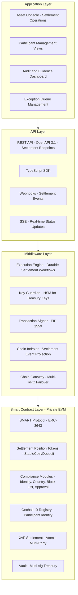

*Figure 6: DALP Four-Layer Architecture for Interswitch Settlement*

### 6.2 Transaction Processing Architecture

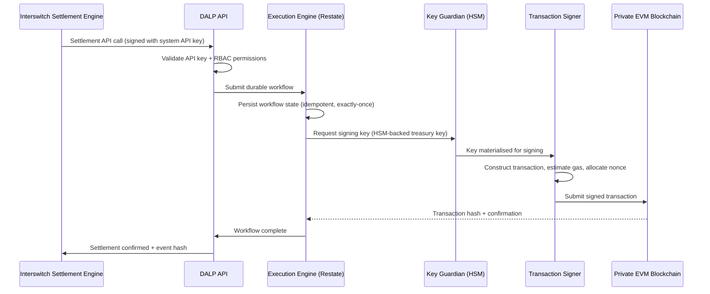

*Figure 7: Transaction Processing - Durable Execution*

### 6.3 Network Configuration

For Interswitch's closed-loop settlement use case, SettleMint recommends a private Hyperledger Besu network with IBFT 2.0 consensus, operated by Interswitch with validator nodes at multiple data centres for resilience. Key properties:

- Permissioned: only authorised nodes can submit transactions or participate in consensus
- CBN-aware: no public chain exposure, all data stays within Nigeria's regulated infrastructure perimeter
- Fast finality: approximately 2-second block time with instant finality under IBFT 2.0
- High throughput: capable of handling settlement batch cycles at Interswitch's required frequency

---

## 7. Token and Asset Lifecycle

### 7.1 Settlement Position Lifecycle

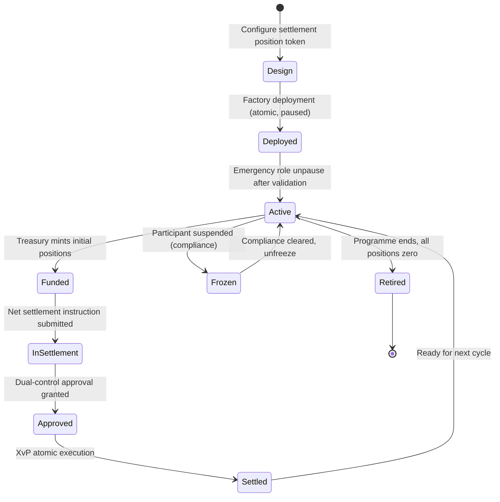

*Figure 8: Settlement Position Token Lifecycle*

### 7.2 Token Issuance Flow

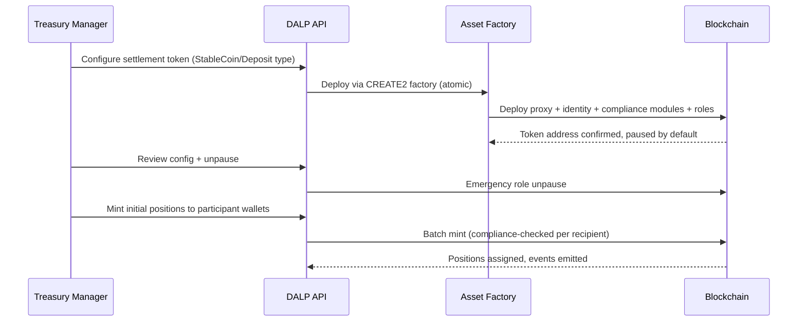

*Figure 9: Settlement Token Issuance Flow*

---

## 8. Compliance and Regulatory Framework

### 8.1 Nigerian Regulatory Context

| Framework | Requirement | DALP Control Mapping |
|---|---|---|
| CBN Framework for Digital Assets (2023) | Permissioned settlement utility, not public crypto | Country allow list + identity registry enforcement |
| CBN Payment System Regulations | Settlement finality, participant obligations, audit | XvP atomic finality, on-chain audit trail |
| NDPC Act 2023 | Data localisation, access logging, deletion | Nigeria-region deployment, structured audit logs |
| MLPPA 2022 | AML/CFT, transaction monitoring, suspicious activity | AML engine integration, address block list for sanctions |
| SEC Nigeria Digital Assets Rules (2022) | Applicable where instrument characteristics apply | Configurable compliance per token type |

### 8.2 Ring-Fencing Architecture

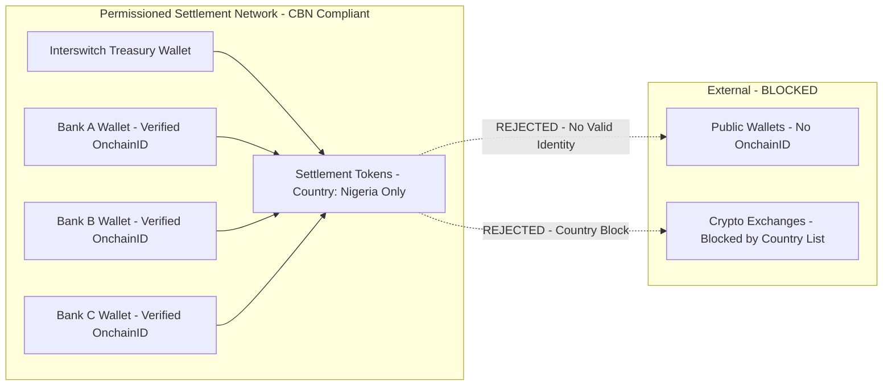

*Figure 10: Settlement Ring-Fencing Architecture*

### 8.3 AML Integration Pattern

Interswitch's AML engine is integrated as a trusted identity claim issuer. When a participant bank passes AML screening, the AML engine publishes a valid claim to the DALP identity registry. When AML status changes (e.g., a bank is flagged), the compliance team uses DALP's address block list API to immediately prevent further settlement with that participant. The block takes effect on the next settlement operation without requiring any on-chain contract modification.

---

## 9. Security Architecture

### 9.1 Security Model

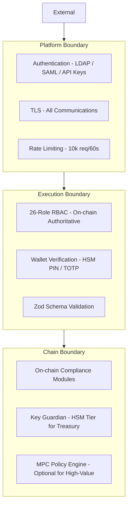

*Figure 11: Security Architecture - Three Trust Boundaries*

### 9.2 Authentication and Access Control

For Interswitch's enterprise environment, DALP supports LDAP/Active Directory integration (via plugin) and SAML 2.0 for corporate SSO. Settlement system integrations use scoped API keys with settlement-specific procedure permissions.

The 26-role RBAC taxonomy is enforced both off-chain (Better Auth) and on-chain (AccessManager contract). The on-chain access manager is authoritative: changes to on-chain roles are reflected immediately in the platform through Chain Indexer event processing.

### 9.3 Key Management

For Interswitch's treasury settlement wallets, SettleMint recommends the HSM key storage tier (FIPS 140-2 Level 3). This ensures treasury signing keys never leave hardware security boundaries. For settlement system integration keys (API-level), cloud KMS (AWS KMS, Azure Key Vault, or GCP KMS) provides appropriate production security.

### 9.4 Audit Trail Architecture

Every settlement operation generates two audit record types:

- On-chain events (immutable): Every XvP settlement execution, compliance decision, participant role change, and freeze operation recorded permanently on the blockchain
- Application audit logs (structured JSON): Every API call, authentication event, authorisation decision, and configuration change with full context

These records are available through the Chain Indexer API for direct query, exportable in structured formats for CBN regulatory submission, and forwardable to Interswitch's SIEM via structured log streaming.

### 9.5 Security Responsibility Matrix

| Control | SettleMint | Interswitch |
|---|---|---|
| Platform security patching | Quarterly + critical | Applying updates on schedule |
| Smart contract security | SMART Protocol maintenance | Configuration governance |
| Key management (HSM) | Key Guardian service | HSM hardware procurement and management |
| Network security | Kubernetes policies, ingress | Private network, VPN connectivity |
| Data residency | Configurable deployment regions | Nigeria data localisation policy |
| AML/sanctions enforcement | Block list enforcement on-chain | AML screening engine operation |
| Participant access provisioning | Role framework | User provisioning and recertification |

---

## 10. Integration Architecture

### 10.1 Integration Overview

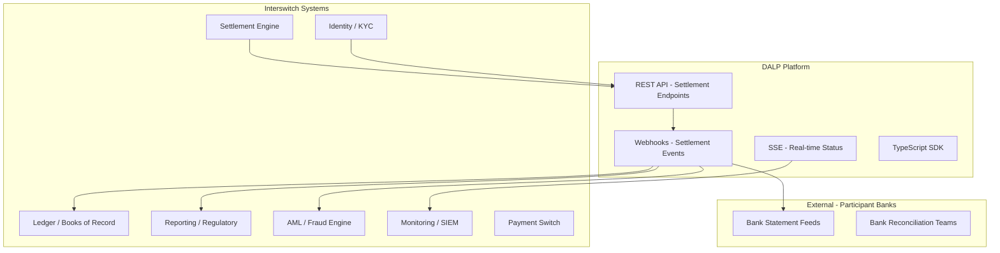

*Figure 12: Interswitch Integration Architecture*

### 10.2 Settlement Engine Integration

The settlement engine is the primary system calling DALP API. Integration pattern:

- Synchronous REST API call to create and execute settlement instructions
- Settlement engine provides: participant wallet addresses, amounts, directions, reference IDs
- DALP returns: transaction hash, block number, settlement state
- Webhook delivery to settlement engine on settlement confirmation (with deterministic event payload)
- Idempotency enforced: same settlement reference submitted twice produces the same result without duplicate settlement

### 10.3 Reconciliation Feed

The Chain Indexer API provides a reconciliation feed accessible to Interswitch's ledger and reporting systems. Each settlement event record contains: transaction hash, block number, block timestamp, settlement instruction ID, participant wallet addresses, token addresses, amounts, compliance evaluation results, and settlement state (pending / approved / executed / failed / expired).

These records are stable identifiers that Interswitch's reconciliation team uses to match on-chain settlement records against participant bank statements and internal books.

---

## 11. Deployment Architecture

### 11.1 Recommended Deployment

SettleMint recommends private cloud deployment on AWS (Nigeria data residency via the EU West / Africa region strategy) or on-premises at Interswitch-managed data centres. Given Interswitch's existing data centre footprint, on-premises deployment may be preferred for regulatory compliance and operational control.

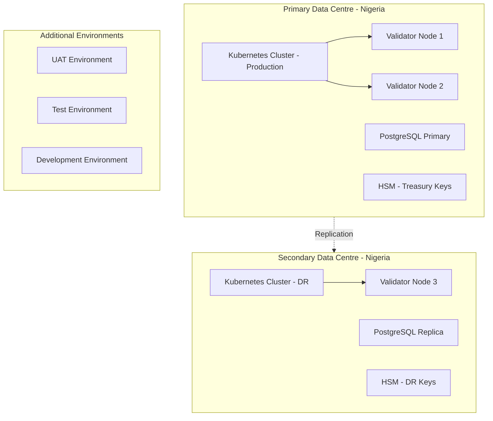

*Figure 13: Deployment Architecture - On-Premises with DR*

### 11.2 Environment Segregation

| Environment | Purpose | Data | Network |
|---|---|---|---|
| Development | Platform and integration development | Synthetic | Isolated |
| Test | Automated testing and integration testing | Synthetic | Isolated |
| UAT | User acceptance, settlement workflow testing | Masked production-like | Isolated |
| DR | Disaster recovery replica | Replicated from production | Separate cluster |
| Production | Live settlement operations | Real | Dedicated |

### 11.3 HA and DR Parameters

| Scenario | RTO | RPO |
|---|---|---|
| Single server failure (on-prem HA) | 5-20 minutes | Seconds to 1 minute |
| Primary DC failure (hot-warm DR) | 30-180 minutes | 5-60 minutes |

---

## 12. Data Management and Governance

### 12.1 Data Architecture

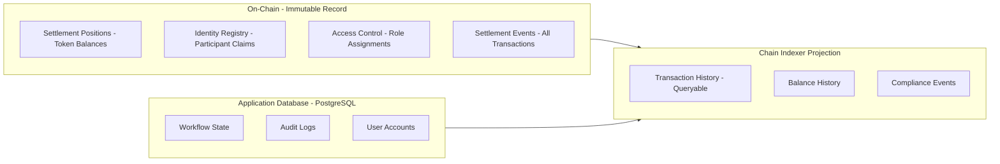

*Figure 14: Data Architecture and Record Hierarchy*

### 12.2 Data Residency

All data is deployed within Nigeria-approved infrastructure under the NDPC Act 2023. PostgreSQL databases and object storage are configured in Nigerian or approved data centre regions. On-chain data (blockchain) is stored on validators within Interswitch-managed data centres in Nigeria. No data crosses to international infrastructure without explicit configuration change and Interswitch approval.

---

## 13. Operational Model and Governance

### 13.1 Role Structure

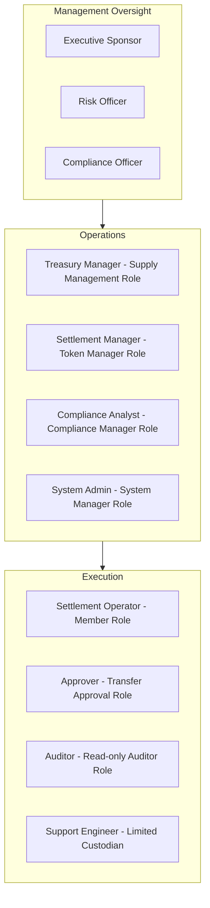

*Figure 15: Operational Role Hierarchy*

### 13.2 Governance Routines

**Daily:** Settlement cycle exception review. All on-chain settlements matched against settlement engine records. Block list review for new CBN/OFAC sanctions additions.

**Weekly:** Entitlement review. All active role assignments verified against HR records. Settlement failure pattern analysis. Threshold monitoring for large settlement instructions.

**Monthly:** Full entitlement recertification. Compliance module configuration review against current CBN guidance. Incident trend analysis. Management reporting package from Chain Indexer API exports.

---

## 14. Implementation Plan

### 14.1 Delivery Timeline

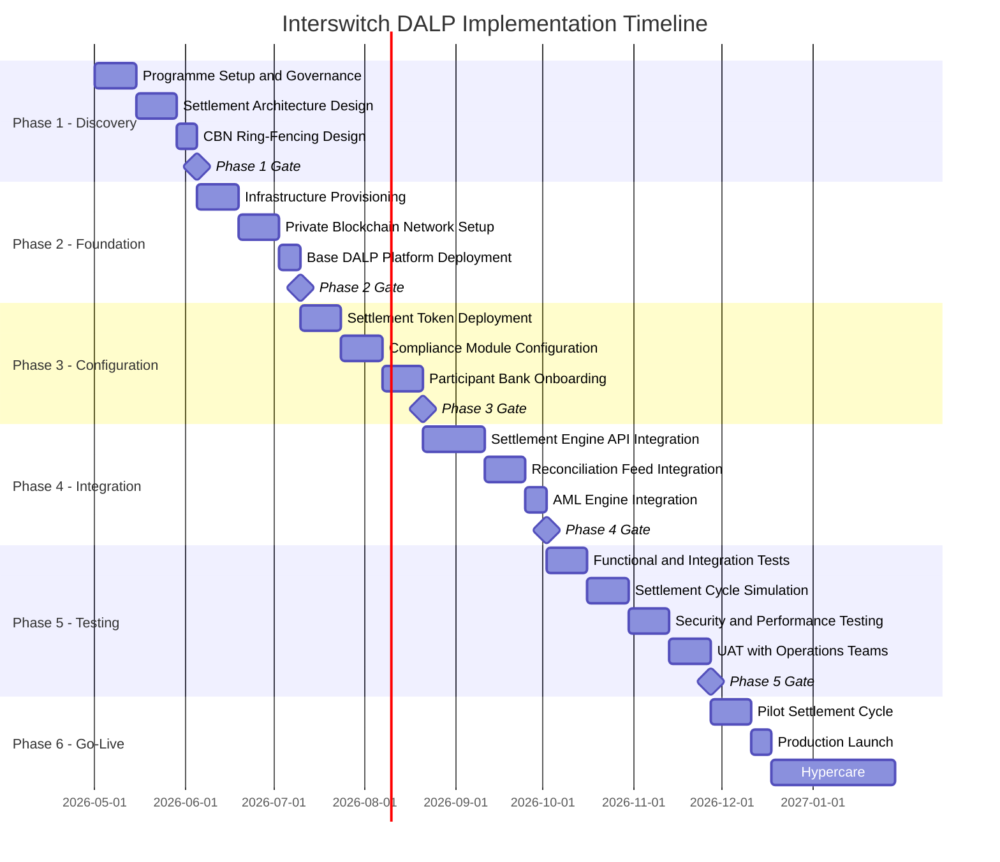

*Figure 16: Implementation Timeline (Indicative)*

### 14.2 Phase Descriptions

**Phase 1 - Discovery (5 weeks):** Programme mobilisation, settlement architecture workshops, CBN ring-fencing design, participant bank inventory, integration system landscape review, environment and infrastructure planning.

**Phase 2 - Foundation (5 weeks):** On-premises infrastructure provisioning, private Hyperledger Besu network setup with validator nodes, base DALP platform deployment and health validation, HSM setup for treasury keys.

**Phase 3 - Configuration (6 weeks):** Settlement position token deployment (one token type per settlement category), compliance module configuration (identity verification, Nigeria country allow list, block list, transfer approval thresholds), initial participant bank onboarding.

**Phase 4 - Integration (6 weeks):** Settlement engine API integration (synchronous REST, webhook event delivery), reconciliation feed integration with Interswitch's ledger system, AML engine integration for block list updates, SIEM and monitoring integration.

**Phase 5 - Testing (8 weeks):** Functional testing of settlement cycle flows, full multilateral settlement simulation with all participant bank types, non-functional performance testing at production settlement volumes, security testing including CBN ring-fencing validation, UAT with Interswitch treasury and operations teams.

**Phase 6 - Go-Live and Hypercare (8 weeks):** Pilot settlement cycle with subset of participant banks, full production launch, hypercare support, phased expansion to all participant banks, operational handover and runbook training.

### 14.3 Resource Model

| Role | SettleMint | Interswitch |
|---|---|---|
| Programme Manager | Named PM | Sponsor + PM |
| Settlement Architect | Senior architect | Architecture lead |
| Integration Engineer | 2 engineers | 2 engineers |
| CBN Compliance Specialist | Compliance architect | Compliance lead |
| Infrastructure Engineer | Infrastructure architect | 2 infra engineers (on-prem) |

---

## 15. Support and SLA

### 15.1 Support Recommendation

For a production payment infrastructure settlement platform, SettleMint recommends Premium support (24/7/365 coverage). Settlement failures in a live environment require immediate response regardless of time zone.

| Feature | Standard | Premium |
|---|---|---|
| Annual cost | $45,000 | $85,000 |
| Coverage | Business hours | 24/7/365 |
| P1 response | 4 hours | 1 hour |
| P2 response | 8 hours | 4 hours |
| Named support lead | No | Yes |

### 15.2 Severity Matrix

| Severity | Definition | P1 Response | Resolution Target |
|---|---|---|---|
| P1 - Critical | Settlement cycle failure, production outage | 1 hour | 4 hours |
| P2 - High | Significant degradation, settlement delayed | 4 hours | 24 hours |
| P3 - Medium | Non-critical, workaround available | 8 hours | 72 hours |
| P4 - Low | Enhancement, documentation | Next business day | Roadmap |

---

## 16. References and Experience

SettleMint's relevant references for Interswitch's procurement include payment infrastructure tokenization projects (permissioned settlement networks, multi-party net settlement), multi-bank settlement platforms, and regulated financial infrastructure deployments in African jurisdictions with CBN-equivalent supervisory frameworks. Reference details and contact information are available to shortlisted bidders under NDA.

---

## 17. Third-Party Dependencies

| Component | Provider | Type | Substitution |
|---|---|---|---|
| Blockchain network | Hyperledger Besu (open source) | Infrastructure | Any EVM-compatible network |
| Execution engine | Restate (open source) | Workflow orchestration | Self-hosted; no substitute |
| Database | PostgreSQL | Database | Self-managed or cloud-managed |
| HSM | Thales / AWS CloudHSM / equivalent | Key management | Alternative FIPS-certified HSM |
| Object storage | On-premises or S3-compatible | Storage | MinIO or equivalent |

---

## Appendix A: Requirement Response Matrix

| Req ID | Summary | Status | DALP Capability |
|---|---|---|---|
| REQ-01 | Environment segregation | Full | 5 segregated environments |
| REQ-02 | API-first interfaces | Full | OpenAPI 3.1, SDK, webhooks, SSE |
| REQ-03 | RBAC, maker-checker, audit | Full | 26-role RBAC, transfer approval, on-chain audit |
| REQ-04 | Lifecycle controls | Full | Per-token compliance, settlement states |
| REQ-05 | Dependency disclosure | Full | Section 17 |
| REQ-06 | Resilience and DR | Full | Multi-AZ or dual-DC, tested DR |
| REQ-07 | Implementation plan | Full | 6-phase programme, Section 14 |
| REQ-08 | Audit evidence | Full | On-chain events, queryable API |
| REQ-14 | High throughput and onboarding | Full | Batch operations, identity reuse |
| REQ-15 | Tokenized/fiat reconciliation | Partial | On-chain side provided; fiat side via integration |

---

## Appendix B: Regulatory Mapping

| Regulation | DALP Control |
|---|---|
| CBN Digital Assets Framework | Permissioned network enforcement via country allow list + identity registry |
| CBN Payment System Regulations | Settlement finality via XvP atomic execution; audit trail for supervisory requests |
| NDPC Act 2023 | Nigeria-region data residency; access logging; retention controls |
| MLPPA 2022 | AML integration hooks; address block list for sanctions; suspicious activity event stream |
| SEC Nigeria Digital Assets Rules | Configurable per token type based on instrument characterisation |

---

## Appendix C: Security and Resilience Evidence

### C.1 Certifications

ISO 27001 (maintained annually) and SOC 2 Type II (independently audited). Certificates available to shortlisted bidders under NDA.

### C.2 Evidence Available Under NDA

- Platform architecture security review documentation
- Key management architecture including HSM integration design
- Penetration test summary and remediation evidence
- DR test reports and restoration time measurements
- Incident response process documentation

### C.3 Platform Security Controls

| Control | Implementation |
|---|---|
| API rate limiting | 10,000 requests per 60-second window per API key |
| Wallet verification | Step-up authentication (HSM PIN / TOTP) required for all settlement transactions |
| Input validation | Zod schema enforcement on all API endpoints |
| Session security | HTTP-only, Secure, SameSite cookies; 7-day expiry |
| Production safety | Default development credentials rejected at startup |

---

*This document is classified SettleMint Confidential. Distribution is restricted to authorised Interswitch procurement personnel.*
