# Technical Proposal: Tokenized SME Lending and Servicing Infrastructure

**Prepared for:** JUMO (South Africa / Pan-Africa)
**Prepared by:** SettleMint NV
**Date:** March 2026
**Version:** v1.0
**Reference:** JUMO-RFP-TOKENIZED-SME-LENDING-202603
**Classification:** SettleMint Confidential

---

## Table of Contents

- Executive Summary
- About SettleMint
- About DALP
- Understanding of Requirements
- Proposed Solution and Functional Capabilities
- Platform Architecture
- Token and Asset Lifecycle
- Compliance and Regulatory Framework
- Security Architecture
- Integration Architecture
- Deployment Architecture
- Data Management and Governance
- Operational Model and Governance
- Implementation Plan
- Support and SLA
- References and Experience
- Appendix A: Requirement Response Matrix
- Appendix B: Regulatory Mapping
- Appendix C: Security and Resilience Evidence

---

## 1. Executive Summary

### 1.1 Context and Strategic Drivers

JUMO operates at the intersection of digital lending, embedded finance, and multi-partner distribution. The company originates and services SME credit products through a network of bank and telecom partners across South Africa, Kenya, Ghana, Tanzania, Uganda, and Zambia, using data-driven credit decisioning that draws on transaction history, behavioural signals, and partner-provided data. JUMO's funding model involves multiple funders and banking partners whose capital flows through JUMO's lending operations to SME borrowers.

This structure creates a specific set of infrastructure pressures that tokenized lending addresses directly. Multiple funders participating in the same lending pool need verifiable, tamper-evident records of their participation entitlements, income allocations, and repayment receipts. Banking partners need auditable confirmation that capital deployed through JUMO's platform is tracked with full data lineage. Regulators in multiple African jurisdictions require evidence of responsible lending practices, data governance, and transparent servicing records.

Tokenized SME lending infrastructure does not change the credit product or the borrower relationship. It places a programmable, auditable record layer underneath the funding structures, participation economics, and servicing events that currently rely on off-chain contractual agreements and manual reconciliation. The result is that funding-pool participation, income waterfall distribution, and servicing event records become machine-readable, verifiable, and auditable from a single source.

### 1.2 Why This Programme Is Hard

JUMO's lending operations span multiple countries with distinct regulatory environments, multiple partner types with distinct data access rights, and multiple funding structures with distinct economics. Three challenges make tokenized lending infrastructure particularly demanding in this context.

First, data privacy and borrower protection. Borrower-level loan data in JUMO's model is highly sensitive personal and financial data governed by POPIA (South Africa), the Data Protection Act 2019 (Kenya), NDPC obligations in Ghana and Nigeria, and equivalent frameworks in other markets. The tokenized layer must represent funding participation interests without exposing individual borrower data to funders, validators, or anyone without explicit data access rights. Information minimisation is an architectural requirement, not a feature.

Second, multi-party funding governance. JUMO's funding pools involve multiple funders with different participation sizes, priorities, and reporting requirements. The tokenized layer must support pool-level and loan-level segregation, configurable waterfall logic for income allocation, and investor-specific reporting views without creating bespoke integrations for each funder relationship.

Third, servicing event complexity. SME lending produces a complex stream of servicing events: disbursements, scheduled repayments, partial repayments, delinquency notifications, restructures, write-offs, and recoveries. Each of these events must update pool positions, trigger income allocation calculations, and feed into investor reports without corrupting the audit trail established at origination.

### 1.3 Proposed Response

SettleMint proposes DALP as the tokenized lending infrastructure platform for JUMO's SME lending and servicing operations. The architecture uses DALP's Bond and Deposit contract types to model loan pool participation interests, with configurable compliance modules controlling funder eligibility and data access, and the Yield and XvP Settlement addons managing income distribution and atomic settlement mechanics.

Key capabilities for JUMO's use case:

The Bond contract type models tokenized loan pool participation certificates, representing a funder's economic interest in a defined lending pool. Maturity and redemption logic handles pool closure and principal return. Fixed treasury yield handles scheduled income distributions to funders. Historical balance snapshots support income allocation calculations based on participation share at each accrual period.

The Deposit contract type models funding capital deployed to JUMO's lending operations, representing the capital at risk in active loan pools.

Compliance modules provide per-pool funder eligibility controls: investor count limits ensure no pool exceeds regulatory investor concentration thresholds, identity verification ensures all funders have verified KYC/AML status, and transfer approval controls the secondary transfer of participation interests when permitted.

The Chain Indexer provides pool-level and loan-level event aggregation accessible through the API for investor reporting, regulatory evidence, and servicing event reconstruction.

### 1.4 Why SettleMint and DALP

SettleMint's platform has been deployed for structured lending tokenization, fund participation management, and multi-party capital market infrastructure across regulated environments. The company understands that a data-driven lending platform like JUMO is not evaluating a generic token issuance tool; it is evaluating whether a platform can handle the lifecycle complexity of structured lending products with the auditability, data governance, and operational discipline that regulated lending demands.

---

## 2. About SettleMint

SettleMint NV, founded 2017, holds ISO 27001 and SOC 2 Type II certifications. The company's production track record includes structured lending tokenization, fund participation platforms, and multi-party settlement infrastructure across regulated jurisdictions in Africa, Europe, the Middle East, and Asia. SettleMint does not provide bespoke development; DALP is a platform and all capabilities described in this proposal are production-ready.

---

## 3. About DALP

### 3.1 Platform Overview

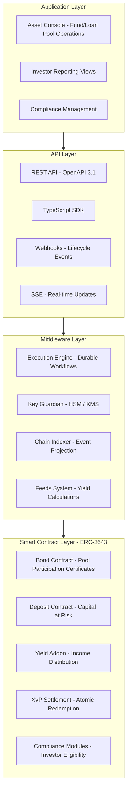

*Figure 1: DALP Platform Architecture for JUMO SME Lending*

### 3.2 Lending-Specific Capabilities

**Bond contract (pool participation certificates):** Models JUMO's funder participation interests as tokenized certificates. Maturity redemption handles principal return at pool closure. Fixed treasury yield handles scheduled income distribution. Historical balance snapshots enable pro-rata income calculation per accrual period.

**Yield addon:** Automates distribution of lending income to participation certificate holders. Supports flexible schedules (monthly, quarterly, event-triggered), pro-rata calculation against historical balance snapshots, and distribution in stablecoins or other payment tokens.

**XvP Settlement:** Provides atomic settlement for redemption events where participation certificates are returned and capital is repaid simultaneously, with no partial settlement state.

**Compliance modules for lending:** Investor count limits (prevent pool from exceeding regulatory investor concentration thresholds), identity verification (all funders must have verified KYC/AML status), transfer approval (control secondary transfers of participation interests), time lock (enforce minimum holding periods if required by regulatory characterisation).

---

## 4. Understanding of Requirements

### 4.1 JUMO's Operating Context

JUMO is a data-driven lending infrastructure provider. The company does not directly hold banking licences in most markets; it partners with licensed banks and telecoms to originate and distribute credit products to SMEs. The funding model involves institutional funders (banks, development finance institutions, impact funds) whose capital is deployed through JUMO's platform.

Tokenized lending infrastructure addresses three specific operational pain points:

First, funder reporting and audit. Institutional funders require verifiable, tamper-evident records of their capital deployment, income earned, and position status at any point in time. Currently this requires JUMO to produce off-chain reports from multiple data sources. Tokenized participation records provide a single, on-chain source of truth.

Second, pool governance and waterfall enforcement. Complex multi-funder pools have waterfall economics (senior funders paid first, mezzanine second, etc.) that currently require manual calculation and reconciliation. Smart contract logic can automate waterfall distribution with full audit trail.

Third, multi-jurisdiction compliance evidence. FSCA in South Africa, CBK in Kenya, and equivalent regulators in other markets require evidence of lending product governance, investor eligibility checks, and responsible lending practice. On-chain records provide this evidence automatically.

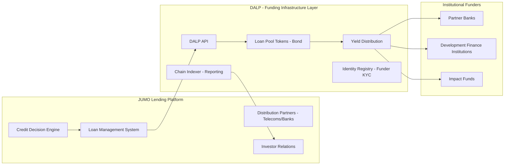

*Figure 2: JUMO Solution Architecture Positioning*

### 4.2 Requirement Coverage

| Requirement | Coverage | Notes |
|---|---|---|
| REQ-01: Environment segregation | Full | 5 environments |
| REQ-02: API-first | Full | OpenAPI 3.1, SDK, webhooks |
| REQ-03: RBAC, maker-checker, audit | Full | 26-role RBAC, transfer approval |
| REQ-04: Lifecycle controls | Full | Bond lifecycle, servicing events |
| REQ-05: Dependencies | Full | Section 17 |
| REQ-06: Resilience and DR | Full | Multi-AZ HA, DR |
| REQ-07: Implementation plan | Full | 6-phase, Section 14 |
| REQ-08: Audit evidence | Full | On-chain events, Chain Indexer |
| REQ-14: High throughput and onboarding | Full | Batch operations |
| REQ-15: Tokenized/fiat reconciliation | Partial | On-chain side provided; fiat matching via integration |

### 4.3 Key Challenges for JUMO

**Challenge 1: Information minimisation across funders.** Funders must receive income reports and position statements without accessing individual borrower data.

*DALP response:* Pool-level participation tokens represent aggregate pool interests, not individual loans. Funders see pool-level balances and income distributions. Loan-level data remains in JUMO's loan management system. The API access controls ensure funder API keys only return pool-level data relevant to that funder's holdings.

**Challenge 2: Waterfall income distribution.** Multi-tier funder structures require income allocation in priority order (senior first, then mezzanine, then equity).

*DALP response:* Separate participation token types are deployed for each tier (senior participation bonds, mezzanine participation bonds). The Yield addon distributes income to each tier's token holders independently. Treasury management outside DALP determines the amount allocated to each tier; DALP executes the distribution atomically once the amounts are determined.

**Challenge 3: Servicing event lifecycle (restructures, write-offs, recoveries).** SME lending produces complex servicing events that affect pool balances and funder positions.

*DALP response:* DALP's supply management operations (mint, burn, freeze) provide the on-chain mechanics for servicing events. A restructured loan that changes a pool's expected cashflow profile triggers a supply management action (burn existing pool tokens, issue new pool tokens with updated parameters). Write-offs trigger burns. Recoveries trigger mints. All operations emit on-chain events with operator identity and approval records.

**Challenge 4: Multi-jurisdiction compliance.** JUMO operates in South Africa (POPIA, FSCA), Kenya (Data Protection Act, CBK), Ghana (NDPC), Tanzania, Uganda, Zambia.

*DALP response:* Per-pool compliance module configuration allows each pool to carry its own jurisdiction-specific rule set. A South Africa pool carries POPIA-aligned data residency and investor eligibility controls. A Kenya pool carries CBK-aligned requirements. Pools are segregated; compliance modules in one pool do not affect another.

---

## 5. Proposed Solution and Functional Capabilities

### 5.1 Loan Pool Token Architecture

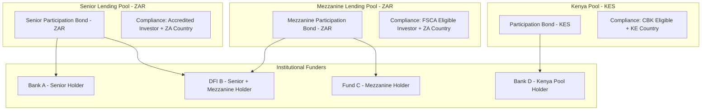

*Figure 3: Loan Pool Token Architecture - Per-Pool Segregation*

### 5.2 Participation Token Issuance Flow

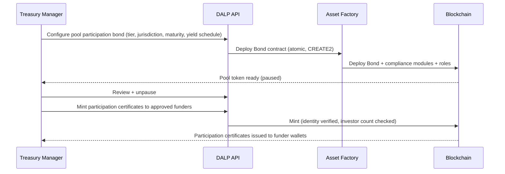

*Figure 4: Participation Token Issuance*

### 5.3 Yield Distribution Flow

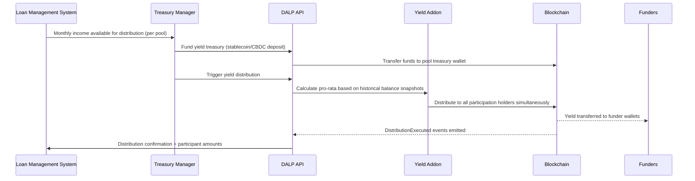

*Figure 5: Yield Distribution Flow*

### 5.4 Compliance Enforcement Flow

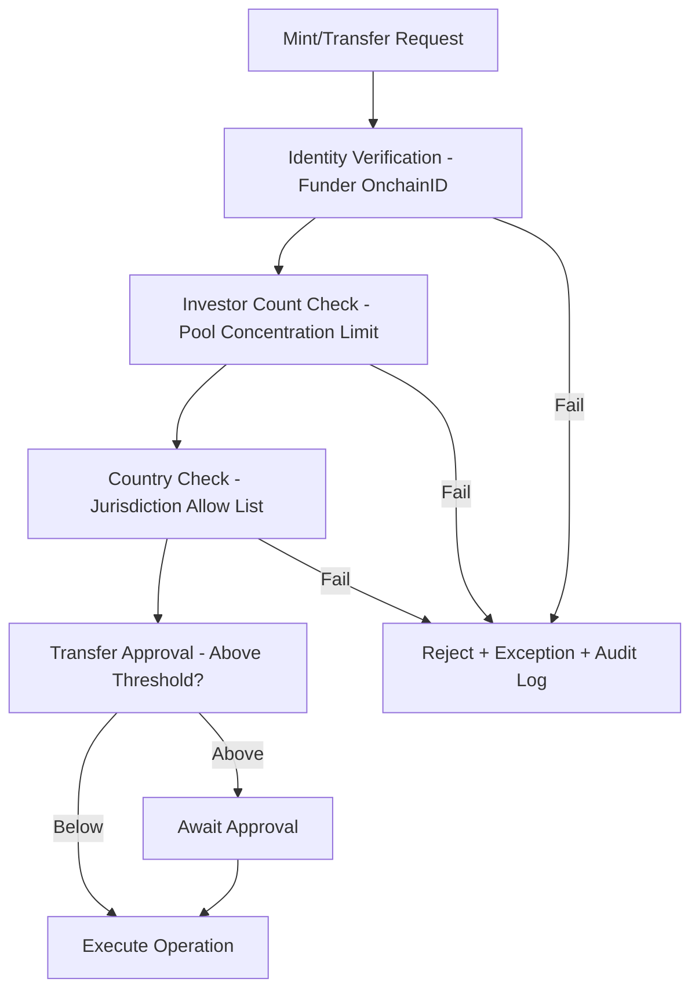

*Figure 6: Compliance Enforcement for Lending Pool Operations*

### 5.5 Servicing Event Handling

JUMO's loan portfolio produces lifecycle events that affect pool economics:

**Disbursement:** New loans disbursed increase pool utilisation. DALP records the pool state update through a supply management mint operation on the corresponding pool token.

**Repayment:** Scheduled and early repayments reduce pool utilisation. DALP records through supply management operations.

**Delinquency:** Delinquent loans trigger partial freeze of pool token supply pending resolution. The Custodian role applies a partial freeze representing the delinquent amount.

**Restructure:** A restructured loan changes pool parameters (maturity extension, interest rate change). DALP handles through a governance role operation updating pool token configuration.

**Write-off:** A written-off loan reduces pool principal. DALP executes a burn operation removing the written-off amount from pool token supply.

**Recovery:** A recovery on a previously written-off amount triggers a mint operation restoring recovered value to pool supply.

All servicing operations require maker-checker authorisation: the initiating operator submits the request, a separate approver with appropriate role confirms. Both identities are logged on-chain.

### 5.6 Functional Fit Summary

| Requirement | DALP Coverage | Notes |
|---|---|---|
| Pool-level participation certificates | Full | Bond contract with configurable parameters |
| Pool-level income distribution | Full | Yield addon with historical balance pro-rata |
| Waterfall logic (multi-tier) | Full | Separate token type per tier + Yield addon per tier |
| Funder eligibility controls | Full | Compliance modules: identity, count, country, approval |
| Servicing events (restructure, write-off, recovery) | Full | Mint, burn, freeze, governance operations |
| Loan-level data privacy | Full | Pool tokens do not carry borrower-level data |
| Multi-jurisdiction compliance | Full | Per-pool compliance module configuration |
| Investor reporting API | Full | Chain Indexer API with funder-scoped queries |

---

## 6. Platform Architecture

### 6.1 Four-Layer Architecture

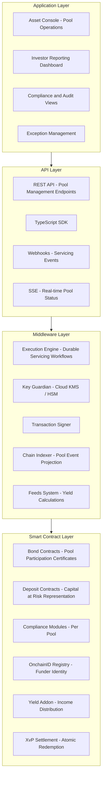

*Figure 7: DALP Architecture for JUMO Lending Infrastructure*

### 6.2 Data Architecture

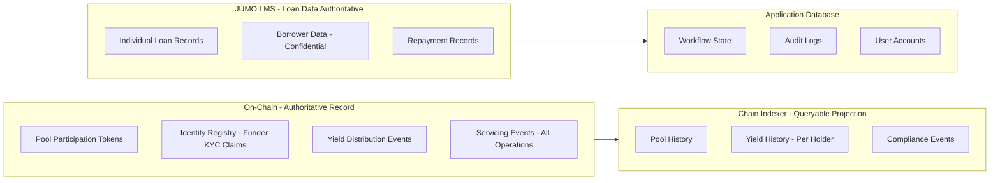

*Figure 8: Data Architecture - Pool vs Loan Data Separation*

### 6.3 Network Configuration

For JUMO's multi-jurisdiction use case, SettleMint recommends a private EVM network (Hyperledger Besu) deployed on cloud infrastructure with data residency aligned to POPIA (South Africa) requirements. Pools for different jurisdictions can operate on the same network with logical segregation through compliance module configuration, or on separate network instances for maximum regulatory isolation.

---

## 7. Token and Asset Lifecycle

### 7.1 Pool Participation Lifecycle

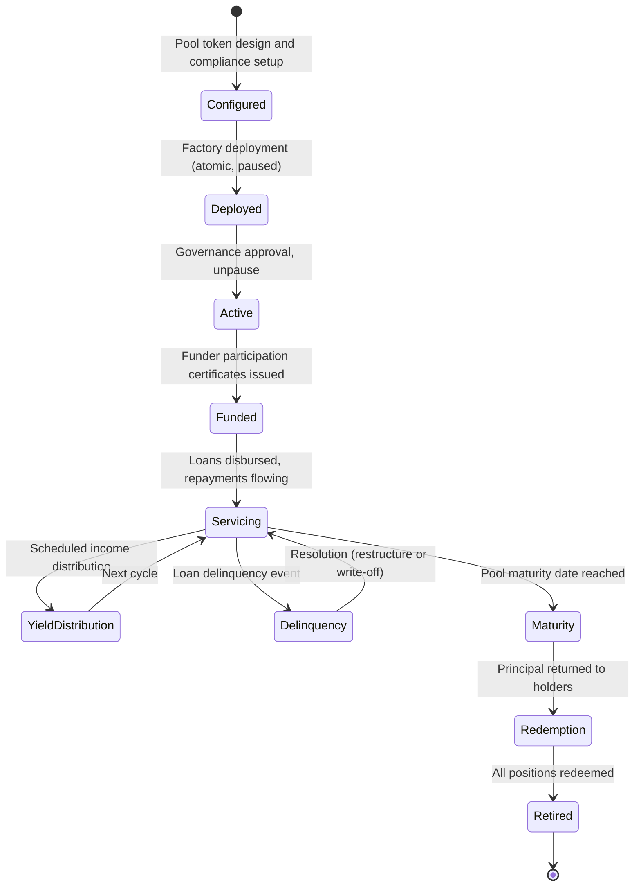

*Figure 9: Pool Participation Token Lifecycle*

---

## 8. Compliance and Regulatory Framework

### 8.1 Multi-Jurisdiction Regulatory Mapping

| Jurisdiction | Framework | Platform Control |
|---|---|---|
| South Africa | FSCA FAIS Act, POPIA 2021, FICA | Per-pool investor eligibility, SA-region data residency, AML claim enforcement |
| South Africa | SARB guidance on digital assets | Permissioned network, no public chain exposure |
| Kenya | CBK regulations, Data Protection Act 2019 | Kenya-specific pool compliance modules, data residency |
| Ghana | NDPC, Bank of Ghana fintech rules | Ghana country allow list, data localisation |
| Tanzania, Uganda, Zambia | Country-specific fintech regulations | Configurable per-pool country modules |
| All jurisdictions | National Credit Act (SA), consumer protection | Responsible lending data controls, information minimisation |

### 8.2 Information Minimisation Architecture

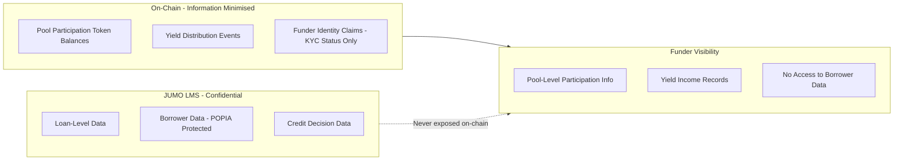

*Figure 10: Information Minimisation - Funder Data Access Boundaries*

### 8.3 POPIA Compliance Controls

South Africa's Protection of Personal Information Act 2021 requires explicit controls on processing of personal information. DALP's architecture addresses this:

- Borrower personal data remains exclusively in JUMO's loan management system, not on-chain
- On-chain funder identity claims contain KYC status attestations, not personal details
- South Africa region deployment ensures personal data does not leave South African infrastructure
- Audit logs with access records satisfy POPIA accountability obligations
- Data subject access and correction requests are handled through JUMO's LMS, not through DALP

---

## 9. Security Architecture

### 9.1 Security Model

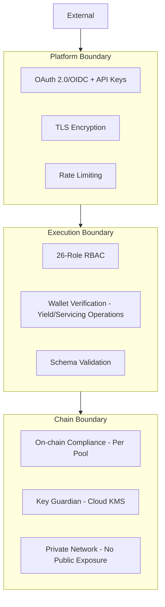

*Figure 11: Security Architecture*

### 9.2 Key Management

For JUMO's cloud-deployed infrastructure, cloud KMS (AWS KMS, Azure Key Vault, or GCP KMS) provides production-grade key security for pool treasury wallets. For highest-value pools (large DFI or bank capital), HSM-backed key management or MPC custody through DFNS or Fireblocks is available.

### 9.3 Audit Trail

Every pool operation, income distribution, servicing event, and role change generates on-chain events accessible through the Chain Indexer API. Application-level audit logs capture every API call, authentication event, and configuration change. Retention is configurable to meet POPIA 7-year minimum and equivalent regulatory requirements in other jurisdictions.

### 9.4 Security Responsibility Matrix

| Control | SettleMint | JUMO |
|---|---|---|
| Platform patches | Quarterly + critical | Apply on schedule |
| Key management | Key Guardian service | Key policy, approver designation |
| Data residency | Configurable regions | SA/Kenya/etc. localisation decisions |
| AML claim publishing | Enforcement on-chain | AML screening and claim publication |
| Borrower data | No access - not held | Full custody and governance |
| Funder access provisioning | Role framework | User provisioning and recertification |

---

## 10. Integration Architecture

### 10.1 Integration Overview

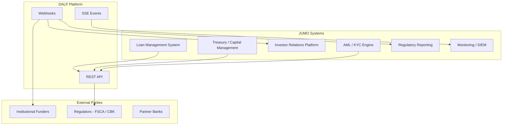

*Figure 12: Integration Architecture*

### 10.2 Loan Management System Integration

The LMS is the primary integration: it submits pool state updates to DALP when servicing events (disbursements, repayments, delinquencies, write-offs, recoveries) change pool economics. The LMS provides loan-pool-level aggregates, not individual loan records. DALP translates these into supply management operations (mint, burn, freeze) on the corresponding pool tokens.

### 10.3 Investor Relations Platform Integration

DALP's Chain Indexer API feeds investor relations with pool-level position, income history, and distribution records. Funder-scoped API keys ensure each funder only receives data relevant to their own participation holdings. The investor relations platform aggregates this with off-chain reporting data to produce investor statements.

---

## 11. Deployment Architecture

### 11.1 Recommended Deployment

SettleMint recommends cloud-managed deployment on AWS or GCP, with South Africa regional deployment (AWS af-south-1 or equivalent) for POPIA compliance. Multi-AZ configuration provides production HA.

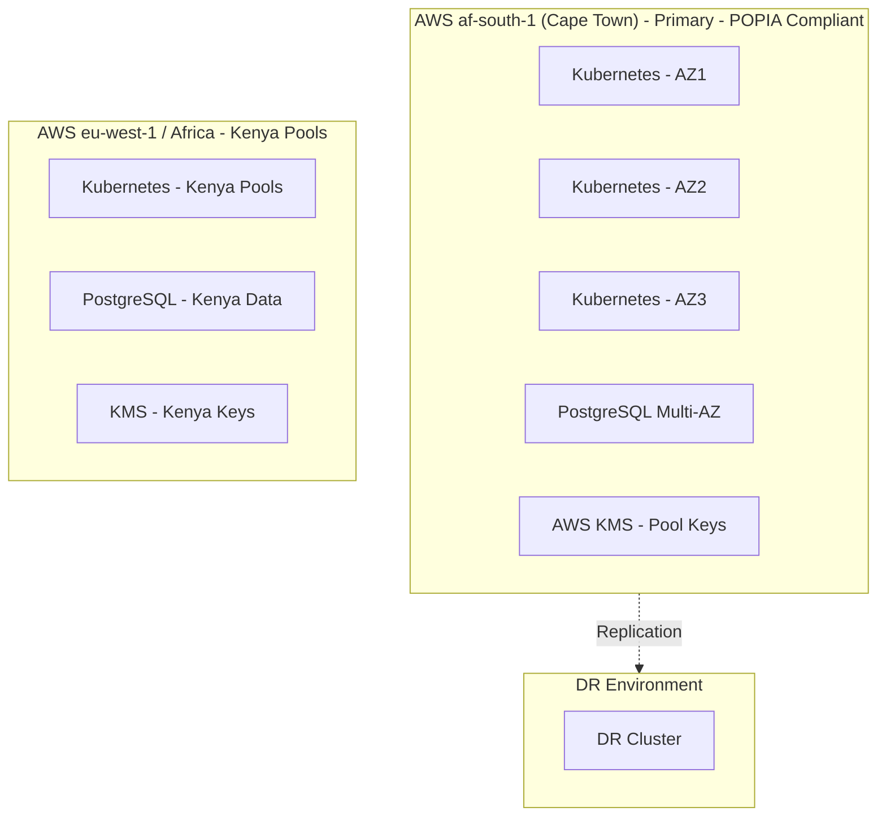

*Figure 13: Deployment Architecture - POPIA-Compliant Multi-Region*

### 11.2 Environment Segregation

5 environments, fully isolated: dev, test, UAT, DR, production. Per-environment credentials, secrets, and blockchain networks. No environment shares state with any other.

### 11.3 HA and DR Parameters

| Scenario | RTO | RPO |
|---|---|---|
| AZ failure (cloud-native HA) | 2-15 minutes | Seconds to 1 minute |
| Regional failure (hot-warm DR) | 30-180 minutes | 5-60 minutes |

---

## 12. Data Management and Governance

### 12.1 Data Residency

POPIA requires that personal information of South African data subjects not be transferred outside South Africa unless specified conditions are met. DALP's deployment in AWS af-south-1 (Cape Town) ensures South African funder identity data and pool event records remain within South Africa. Kenya pool data is deployed in Kenya-region infrastructure. Loan-level borrower data never enters the DALP platform.

### 12.2 Reconciliation Data

For each pool, the Chain Indexer provides: pool token balance history, yield distribution records with per-holder amounts, servicing event history, and compliance decision records. These records are the tokenized side of JUMO's reconciliation. The fiat side (actual cash flows to and from funders and banking partners) is managed through JUMO's treasury system and matched against DALP event records using pool token addresses and transaction hashes as stable identifiers.

---

## 13. Operational Model and Governance

### 13.1 Role Model

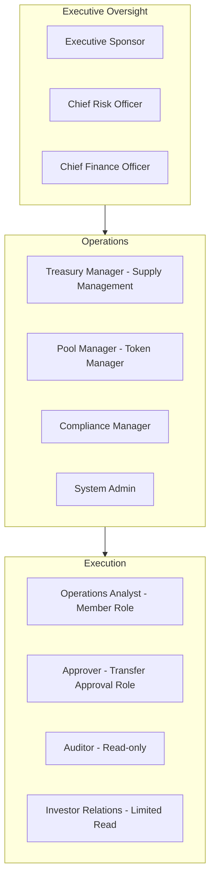

*Figure 14: Operational Role Hierarchy*

### 13.2 Governance Routines

**Daily:** Servicing event review. Exception queue check. Yield distribution status.

**Weekly:** Pool position review across all jurisdictions. Delinquency and freeze review. Funder reporting verification.

**Monthly:** Full entitlement recertification. POPIA and jurisdiction-specific compliance review. Investor statement generation from Chain Indexer exports. Regulatory reporting package assembly.

---

## 14. Implementation Plan

### 14.1 Implementation Timeline

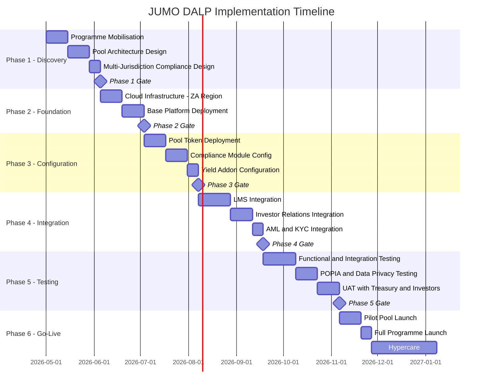

*Figure 15: Implementation Timeline*

### 14.2 Phase Descriptions

**Phase 1 (5 weeks):** Pool architecture workshops, multi-jurisdiction compliance design, POPIA data flow mapping, integration landscape review.

**Phase 2 (4 weeks):** AWS af-south-1 infrastructure provisioning, base platform deployment, cloud KMS setup.

**Phase 3 (5 weeks):** South Africa pool token deployment, compliance module configuration (FSCA investor eligibility, POPIA-aligned controls, SARB guidance), yield addon configuration, Kenya and other market pool setup.

**Phase 4 (6 weeks):** Loan Management System integration (pool state update API), investor relations platform integration (Chain Indexer feed), AML/KYC engine integration (identity claim publication).

**Phase 5 (7 weeks):** Functional testing, POPIA data privacy testing (verify no borrower data on-chain), waterfall distribution testing, multi-jurisdiction compliance validation, UAT.

**Phase 6 (8 weeks):** Pilot pool launch with single funder group, full programme launch, hypercare.

---

## 15. Support and SLA

### 15.1 Support Recommendation

Premium support is recommended for a production lending infrastructure platform given the financial obligations to institutional funders that depend on yield distribution reliability.

| Feature | Standard | Premium |
|---|---|---|
| Annual cost | $45,000 | $85,000 |
| Coverage | Business hours | 24/7/365 |
| P1 response | 4 hours | 1 hour |
| P2 response | 8 hours | 4 hours |

### 15.2 Severity Matrix

| Severity | Definition | Response | Resolution |
|---|---|---|---|
| P1 | Production outage, yield distribution failure | 1 hour | 4 hours |
| P2 | Significant degradation, pool operations blocked | 4 hours | 24 hours |
| P3 | Non-critical, workaround available | 8 hours | 72 hours |
| P4 | Enhancement, documentation | Next business day | Roadmap |

---

## 16. References and Experience

SettleMint's relevant references include structured fund tokenization platforms, multi-party lending infrastructure, and regulated digital asset deployments in African and European jurisdictions with FSCA-equivalent supervisory oversight. Reference details available to shortlisted bidders under NDA.

---

## 17. Third-Party Dependencies

| Component | Provider | Type | Substitution |
|---|---|---|---|
| Blockchain | Hyperledger Besu (open source) | Infrastructure | Any EVM network |
| Cloud | AWS / Azure / GCP | Deployment | Alternative cloud or on-premises |
| Key management | Cloud KMS or HSM | Security | Alternative KMS or HSM |
| Execution engine | Restate (open source) | Workflow | Self-hosted |
| MPC custody | DFNS / Fireblocks (optional) | Key management | Cloud KMS alternative |

---

## Appendix A: Requirement Response Matrix

| Req ID | Summary | Status | DALP Capability |
|---|---|---|---|
| REQ-01 | Environment segregation | Full | 5 isolated environments |
| REQ-02 | API-first | Full | OpenAPI 3.1, SDK, webhooks, SSE |
| REQ-03 | RBAC, maker-checker, audit | Full | 26-role RBAC, approval module, on-chain audit |
| REQ-04 | Lifecycle controls | Full | Bond lifecycle, servicing events, compliance modules |
| REQ-05 | Dependencies | Full | Section 17 |
| REQ-06 | Resilience and DR | Full | Multi-AZ HA, DR |
| REQ-07 | Implementation plan | Full | 6-phase, Section 14 |
| REQ-08 | Audit evidence | Full | On-chain events, Chain Indexer API |
| REQ-14 | Throughput and onboarding | Full | Batch operations, identity reuse |
| REQ-15 | Tokenized/fiat reconciliation | Partial | On-chain side provided; fiat via LMS integration |

---

## Appendix B: Regulatory Mapping

| Regulation | DALP Control |
|---|---|
| FSCA FAIS Act | Investor eligibility compliance module, accredited investor verification |
| POPIA 2021 | Information minimisation (no borrower data on-chain), SA-region deployment |
| FICA | AML claim enforcement, identity verification module |
| CBK regulations (Kenya) | Kenya-specific pool compliance modules, Kenya-region deployment |
| Ghana NDPC | Ghana country allow list, data localisation configuration |
| SARB guidance | Permissioned network, no public chain exposure |

---

## Appendix C: Security and Resilience Evidence

ISO 27001 and SOC 2 Type II certifications. Full evidence available to shortlisted bidders under NDA: architecture review documentation, penetration test summary, DR test reports, incident response process, data privacy impact assessment documentation.

---

*This document is classified SettleMint Confidential. Distribution is restricted to authorised JUMO procurement personnel.*
