# Technical Proposal: Digital Asset Mobile Payment Overlays for Stored-Value Networks

**Prepared for:** M-Pesa Safaricom (Kenya)
**Prepared by:** SettleMint NV
**Date:** March 2026
**Version:** v1.0
**Reference:** M-PESA-SAFARICOM-RFP-DIGITAL-ASSET-MOBILE-PAYMENT-202603
**Classification:** SettleMint Confidential

---

## Table of Contents

- Executive Summary
- About SettleMint
- About DALP
- Understanding of Requirements
- Proposed Solution and Functional Capabilities
- Platform Architecture
- Token and Asset Lifecycle
- Compliance and Regulatory Framework
- Security Architecture
- Integration Architecture
- Deployment Architecture
- Data Management and Governance
- Operational Model and Governance
- Implementation Plan
- Support and SLA
- References and Experience
- Appendix A: Requirement Response Matrix
- Appendix B: Regulatory Mapping
- Appendix C: Security and Resilience Evidence

---

## 1. Executive Summary

### 1.1 Context and Strategic Drivers

M-Pesa is Kenya's dominant mobile money platform, serving over 30 million active users with a product portfolio spanning peer-to-peer transfers, merchant payments, international remittances (M-Pesa Global), bill payments, and Lipa Na M-Pesa merchant ecosystem services. The platform processes tens of millions of transactions per day, operates within Central Bank of Kenya (CBK) supervised rails, and is embedded in Kenya's daily economic life as critical payment infrastructure.

Any digital asset initiative at M-Pesa Safaricom must be measured against this baseline. The correct framing is not "bringing crypto to M-Pesa customers." The correct framing is: how can programmable money mechanics improve the settlement layer, treasury management, cross-border corridor efficiency, and merchant settlement infrastructure that sits underneath the consumer experience which already works at scale?

DALP is positioned as a settlement infrastructure layer, not a consumer-facing product. The consumer experience on M-Pesa remains unchanged. What changes is the settlement and liquidity management layer below it: tokenized settlement positions replace manual correspondent banking entries for cross-border corridors, programmable merchant settlement instruments improve Lipa Na M-Pesa funding cycles, and treasury liquidity management benefits from atomic settlement precision.

The scope of this proposal addresses three specific overlays on M-Pesa's existing stored-value network:

**Overlay 1 - Cross-border corridor settlement:** Tokenized settlement instruments for M-Pesa Global corridors (Kenya-Tanzania, Kenya-DRC, Kenya-Mozambique, Kenya-Egypt, and others) that replace correspondent banking settlement messages with atomic, on-chain settlement events providing CBK with verifiable, tamper-evident corridor settlement records.

**Overlay 2 - Merchant treasury settlement:** Tokenized merchant funding instruments for Lipa Na M-Pesa that represent merchant settlement obligations and enable programmable funding cycles, reducing settlement float requirements and providing audit-grade evidence for merchant dispute resolution.

**Overlay 3 - Internal treasury liquidity:** Tokenized liquidity position management for M-Pesa Safaricom's treasury operations, representing inter-entity funding positions with atomic settlement between M-Pesa Kenya, M-Pesa Tanzania, M-Pesa DRC, and other operating entities.

### 1.2 Why This Programme Requires Care

M-Pesa's scale and national importance create specific constraints that make this programme demanding in ways that a greenfield fintech programme would not face.

First, consumer trust is paramount. Any failure in the settlement layer must not be visible to or impact end consumers. Tokenized settlement instruments must operate in a completely segregated layer from the consumer wallet experience. If the tokenized settlement layer fails, the consumer payment flow must degrade gracefully to existing correspondent banking settlement, not halt.

Second, CBK regulatory confidence. CBK monitors M-Pesa as critical national payment infrastructure. Any tokenized overlay must be characterised clearly (as a settlement utility, not a speculative digital asset), must operate within CBK's supervisory perimeter, and must be able to produce evidence of every settlement operation on demand. CBK must have confidence before any tokenized overlay touches live customer funds.

Third, operational resilience at telecom scale. M-Pesa operates at telecommunications-grade uptime expectations. The tokenized settlement layer must meet the same resilience standards, with clear degraded-mode behavior and zero-impact failover to conventional settlement.

Fourth, phased rollout discipline. The programme must prove each overlay works at contained scale before expanding. M-Pesa cannot run a failed experiment on nationally important infrastructure.

### 1.3 Proposed Response

SettleMint proposes DALP as the settlement control plane for M-Pesa's digital asset overlays. The architecture explicitly maintains segregation between the consumer experience layer (M-Pesa platform, unchanged) and the tokenized settlement layer (DALP, handling inter-entity and cross-corridor net settlement positions).

For each overlay:

**Cross-border corridors:** StableCoin-type instruments representing corridor settlement positions for each M-Pesa Global corridor pair. XvP Settlement provides atomic bilateral settlement between corridor positions. Country-specific compliance modules enforce CBK and partner-country regulatory requirements per corridor.

**Merchant settlement:** Deposit-type instruments representing merchant funding obligations. Programmable settlement timing and configurable trigger conditions (balance threshold, time-based) automate Lipa Na M-Pesa merchant funding cycles with full audit trail.

**Treasury liquidity:** Bond or Deposit instruments representing inter-entity liquidity positions within Safaricom Group. Atomic settlement between Safaricom Kenya, Safaricom Tanzania, and other operating entity treasury wallets provides precision liquidity management with CBK-submittable evidence.

### 1.4 Why SettleMint and DALP

For M-Pesa's programme, the critical selection criteria are not feature breadth. They are: (a) the ability to operate in a completely segregated settlement layer without touching the consumer experience, (b) the ability to satisfy CBK supervisory evidence requests on demand, (c) production-grade resilience at the availability expectations of critical national infrastructure, and (d) a delivery model disciplined enough to earn CBK and Safaricom board approval before going live.

SettleMint's ISO 27001 and SOC 2 Type II certifications, production track record with central banks and national payment infrastructure, and structured phase-gate delivery model directly address all four criteria.

---

## 2. About SettleMint

SettleMint NV, founded 2017, holds ISO 27001 and SOC 2 Type II certifications. The company's track record includes central bank infrastructure (wholesale CBDC pilots, digital currency infrastructure), national payment infrastructure tokenization, and multi-corridor settlement platforms across regulated environments. For a platform of M-Pesa's national significance, SettleMint's central bank and payment infrastructure experience is the directly relevant credential.

---

## 3. About DALP

### 3.1 Platform Architecture

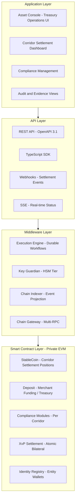

*Figure 1: DALP Platform Architecture for M-Pesa Safaricom*

### 3.2 Key Capabilities for Mobile Payment Overlays

**Settlement segregation:** DALP operates as a separate settlement layer. The consumer-facing M-Pesa system calls DALP APIs to record and settle net positions; individual consumer transactions are not submitted as blockchain operations. This is a critical architectural boundary.

**Atomic bilateral settlement (XvP):** Corridor settlement requires simultaneous debit of one corridor position and credit of another. XvP's atomic mechanics guarantee no partial settlement state.

**Per-corridor compliance:** Each corridor carries its own compliance modules reflecting the specific regulatory requirements of the origin and destination country. Kenya-Tanzania corridor rules differ from Kenya-DRC rules. Configuration changes per-corridor without affecting others.

**Telecom-grade audit:** Every settlement operation is recorded on-chain with tamper-evident events accessible to CBK on demand. The Chain Indexer provides real-time queryable access without requiring raw blockchain queries.

---

## 4. Understanding of Requirements

### 4.1 M-Pesa's Operational Context

M-Pesa processes consumer payments at very high frequency, with each individual transaction handled by Safaricom's existing mobile money platform. The tokenized overlay operates on net settlement positions, not individual transactions. This architectural distinction is fundamental and must be reinforced throughout the implementation.

Consumer experience layer: Safaricom M-Pesa platform (unchanged). Individual transactions, wallet balances, USSD and app interfaces remain exactly as they are today.

Settlement layer (DALP scope): Net corridor settlement positions between M-Pesa operating entities and partner institutions. Merchant funding settlement obligations. Inter-entity treasury positions within Safaricom Group.

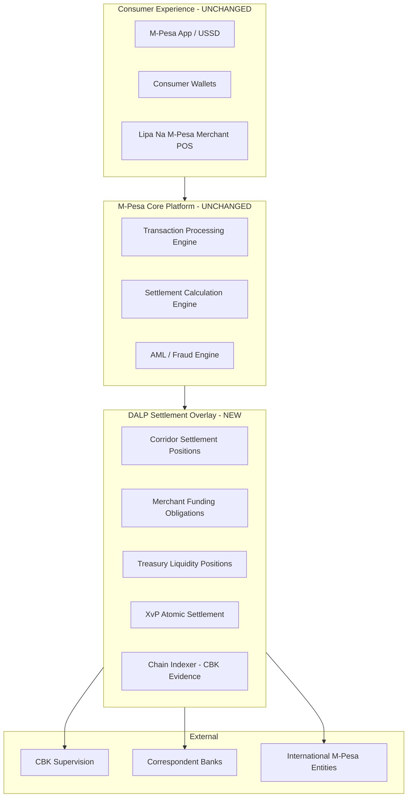

*Figure 2: M-Pesa Architecture Positioning - Overlay Not Replacement*

### 4.2 Requirement Coverage

| Requirement | Coverage | Notes |
|---|---|---|
| REQ-01: Environment segregation | Full | 5 environments |
| REQ-02: API-first | Full | OpenAPI 3.1, SDK, webhooks |
| REQ-03: RBAC, maker-checker, audit | Full | 26-role RBAC, approval module |
| REQ-04: Lifecycle controls | Full | Per-corridor token lifecycle |
| REQ-05: Dependencies | Full | Section 17 |
| REQ-06: Resilience and DR | Full | Multi-AZ HA, degraded-mode support |
| REQ-07: Implementation plan | Full | 6-phase, Section 14 |
| REQ-08: Audit evidence | Full | On-chain events, CBK-ready exports |
| REQ-14: Throughput and onboarding | Full | Batch settlement, entity onboarding |
| REQ-15: Tokenized/fiat reconciliation | Partial | On-chain settlement side; fiat via integration |

### 4.3 Key Challenges

**Challenge 1: Consumer protection segregation.** Ensuring consumer wallet balances are never at risk from settlement layer operations.

*DALP response:* DALP operates exclusively on net settlement positions held by M-Pesa treasury wallets. Consumer wallet data is not in DALP and consumer wallets are not participants in the settlement network. If the DALP settlement layer becomes unavailable, M-Pesa's existing correspondent banking settlement continues as fallback. Consumer payments are not blocked.

**Challenge 2: CBK regulatory confidence.** CBK must be able to inspect and audit the tokenized settlement layer before it touches live settlement flows.

*DALP response:* Phase 1 of implementation includes a CBK read-only access provision: CBK can query the Chain Indexer API for settlement events before the overlay becomes live. The phased rollout (Section 14) is designed with explicit CBK comfort gate before any corridor goes live.

**Challenge 3: Corridor-by-corridor regulatory variation.** Kenya-Tanzania corridors operate under different joint CBK-BoT supervision than Kenya-DRC or Kenya-Egypt corridors.

*DALP response:* Each corridor is a separate token. Each token carries its own compliance modules reflecting the specific regulatory requirements. Adding a new corridor or changing an existing corridor's compliance rules requires only configuration operations on the new or affected token, with no impact on other corridors.

**Challenge 4: Merchant settlement timing.** Lipa Na M-Pesa merchant settlement has specific timing requirements tied to merchant contract terms and CBK merchant fund safeguarding rules.

*DALP response:* The Deposit contract type with time lock and transfer approval compliance modules implements configurable settlement timing. Merchant settlement can be triggered automatically at configured times (e.g., T+1 at 23:00 EAT) or manually by treasury operations. All triggers are logged with the initiator identity.

---

## 5. Proposed Solution and Functional Capabilities

### 5.1 Overlay Architecture

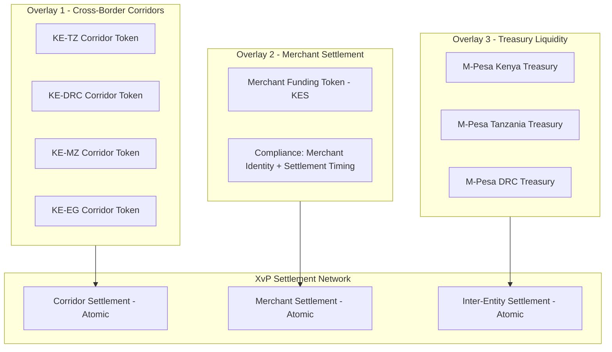

*Figure 3: Three-Overlay Architecture*

### 5.2 Cross-Border Corridor Settlement Flow

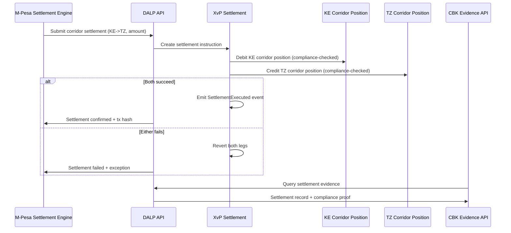

*Figure 4: Cross-Border Corridor Settlement Flow*

### 5.3 Compliance Enforcement Per Corridor

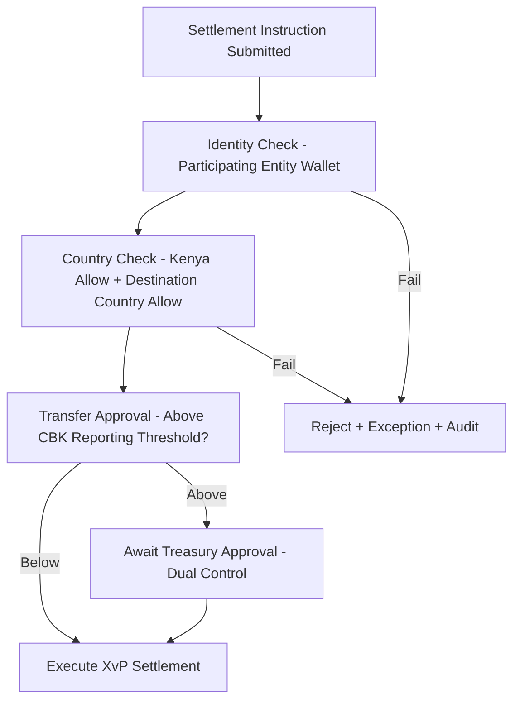

*Figure 5: Compliance Enforcement Flow*

### 5.4 Token Issuance Flow

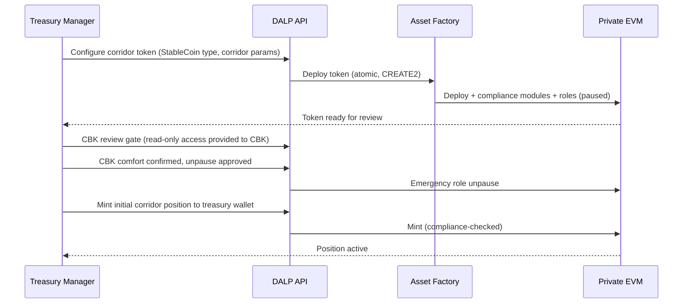

*Figure 6: Corridor Token Deployment and CBK Approval Gate*

### 5.5 Merchant Settlement Flow

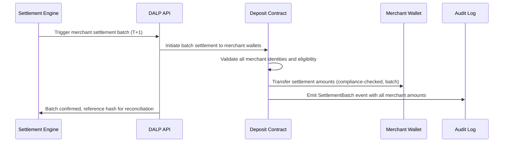

*Figure 7: Merchant Settlement Batch Flow*

### 5.6 Functional Fit Matrix

| Requirement | DALP Capability | Status |
|---|---|---|
| Cross-border corridor settlement | StableCoin + XvP per corridor | Full |
| Merchant treasury settlement | Deposit + batch transfer | Full |
| Treasury liquidity management | Bond/Deposit inter-entity positions | Full |
| CBK evidence production | Chain Indexer API (read-only CBK access) | Full |
| Per-corridor compliance rules | Per-token compliance module config | Full |
| Consumer experience segregation | Settlement layer only, no consumer wallet data | Full |
| Degraded-mode fallback | DALP failure does not block consumer payments | Full |

---

## 6. Platform Architecture

### 6.1 Four-Layer Detail

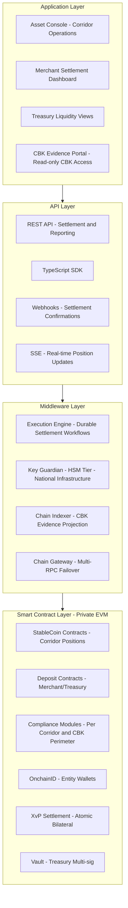

*Figure 8: DALP Four-Layer Architecture for M-Pesa*

### 6.2 Degraded-Mode Architecture

DALP failure must not block M-Pesa consumer payments. The architecture implements this through:

- DALP settlement is additive to, not a replacement for, existing correspondent banking settlement
- M-Pesa's settlement engine detects DALP API unavailability and routes to conventional settlement fallback
- All in-flight DALP workflows complete via durable execution when DALP recovers; no settlement is lost
- Consumer wallet balances are never held in DALP contracts; consumer protection is independent of DALP availability

### 6.3 Network Design

A private Hyperledger Besu network operated by Safaricom within Kenya-based infrastructure, with CBK read-only node access. Validator nodes distributed across Safaricom data centres (minimum 3 validators for IBFT 2.0 Byzantine fault tolerance). DALP connects to this network through the Chain Gateway service.

---

## 7. Token and Asset Lifecycle

### 7.1 Corridor Token Lifecycle

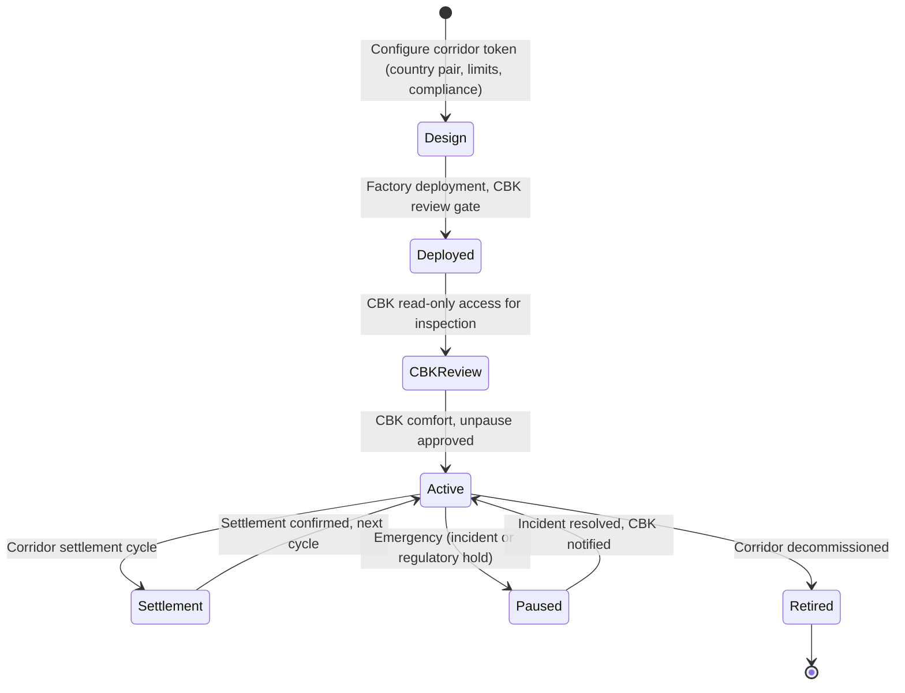

*Figure 9: Corridor Token Lifecycle with CBK Gate*

---

## 8. Compliance and Regulatory Framework

### 8.1 Kenyan Regulatory Context

| Framework | Platform Control |
|---|---|
| CBK National Payments System Act | Settlement position governance, audit trail for CBK inspection, reporting API |
| CBK Guidance on Digital Currency | Permissioned settlement utility characterisation, not public crypto |
| Data Protection Act 2019 | Kenya-region data deployment, access logging, retention controls |
| Proceeds of Crime and Anti-Money Laundering Act | AML identity verification, address block list for sanctioned entities |
| Capital Markets Act | Applicable characterisation if instruments have capital markets features |
| CBK Consumer Protection Framework | Consumer funds never in DALP layer (segregation architecture) |

### 8.2 Cross-Corridor Regulatory Matrix

| Corridor | Origin Regulator | Destination Regulator | Specific Controls |
|---|---|---|---|
| Kenya-Tanzania | CBK | Bank of Tanzania | Joint oversight, country allow lists for both |
| Kenya-DRC | CBK | BCC (Banque Centrale du Congo) | FX controls, country allow list |
| Kenya-Mozambique | CBK | Banco de Mozambique | Corridor-specific limits |
| Kenya-Egypt | CBK | Central Bank of Egypt | EGP/KES pair, country controls |
| Kenya-Ethiopia | CBK | NBE | Strict FX regime, enhanced controls |

### 8.3 CBK Evidence Architecture

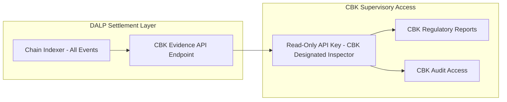

*Figure 10: CBK Evidence Architecture - Read-Only Supervisory Access*

CBK receives a read-only API key scoped to the Chain Indexer API. This key provides access to all settlement events, compliance decision records, and position history. CBK can query by corridor, date range, amount, or entity. The API returns structured JSON suitable for CBK's internal reporting systems. No CBK staff require Asset Console access; evidence is available through API alone.

---

## 9. Security Architecture

### 9.1 Security Model

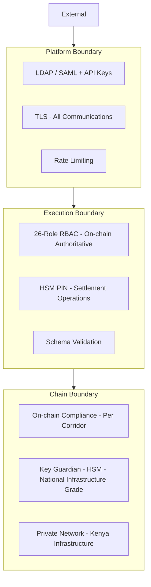

*Figure 11: Security Architecture - HSM Tier for National Infrastructure*

### 9.2 Key Management

For M-Pesa's national infrastructure status, SettleMint recommends HSM-backed key management (FIPS 140-2 Level 3) for all treasury settlement wallets. This ensures signing keys for settlement operations never leave hardware security boundaries within Kenya-based infrastructure. This is the same key management tier used by central banks in SettleMint's prior deployments.

### 9.3 Audit Trail

Every settlement operation, compliance decision, and role change is recorded on-chain in the private Kenyan blockchain network. The Chain Indexer provides queryable access to these records. CBK's read-only API key provides direct, auditor-accessible evidence without requiring SettleMint or Safaricom intermediation.

### 9.4 Security Responsibility Matrix

| Control | SettleMint | Safaricom M-Pesa |
|---|---|---|
| Platform patching | Quarterly + critical | Apply on schedule |
| HSM management | Key Guardian service | HSM hardware, physical security |
| Private network security | Chain Gateway, DALP services | Validator nodes, network infrastructure |
| CBK read-only access | API key scoping | CBK inspector credential management |
| Consumer protection | Settlement layer segregation | Consumer wallet security |
| AML enforcement | Block list enforcement on-chain | AML screening engine |

---

## 10. Integration Architecture

### 10.1 Integration Overview

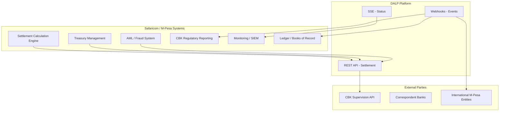

*Figure 12: Integration Architecture*

### 10.2 Settlement Engine Integration

M-Pesa's settlement calculation engine submits net settlement instructions to DALP API after each settlement cycle calculation. The integration is synchronous REST: submit instruction, receive confirmation or failure with exception details. Webhooks provide settlement confirmation events to M-Pesa's ledger system for reconciliation.

### 10.3 Degraded-Mode Integration

The integration design explicitly handles DALP unavailability:

- Settlement engine detects DALP API timeout or error response
- Settlement engine routes to conventional correspondent banking settlement as fallback
- DALP resumes processing when available; in-flight workflows complete via durable execution
- Reconciliation identifies which settlements went through DALP and which through conventional routes
- No consumer payments are delayed due to DALP layer unavailability

---

## 11. Deployment Architecture

### 11.1 Kenya-Based Deployment

All DALP infrastructure is deployed within Kenya-based data centres operated by Safaricom, satisfying Data Protection Act 2019 requirements for Kenyan personal data and CBK's requirement for Kenya-based critical payment infrastructure.

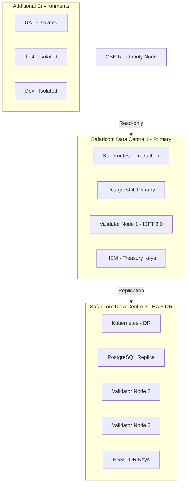

*Figure 13: Kenya-Based Deployment Architecture*

### 11.2 Environment Segregation

5 fully isolated environments: development, test, UAT, DR, production. No environment shares data with any other. Secrets, keys, and blockchain networks are environment-specific.

### 11.3 HA and DR Parameters

| Scenario | RTO | RPO |
|---|---|---|
| Single DC failure (multi-DC HA) | 5-20 minutes | Seconds to 1 minute |
| DALP layer failure (fallback to conventional) | Consumer: zero impact; Settlement: 5-30 minutes | Per durable workflow recovery |

---

## 12. Data Management and Governance

### 12.1 Data Residency

Data Protection Act 2019 (Kenya) requires that personal data of Kenyan data subjects be stored in Kenya or in countries with adequate protection. All DALP data (including entity identity claims, settlement events, and application audit logs) is stored in Safaricom-operated Kenya-based data centres. No data crosses to international infrastructure without explicit Safaricom approval.

### 12.2 Consumer Data Boundary

Consumer personal data is not in the DALP layer. DALP operates on treasury entity wallets (M-Pesa treasury, correspondent banks, international M-Pesa entities). Consumer wallet addresses are never submitted to DALP. This boundary is a structural property of the architecture, not a configuration option.

---

## 13. Operational Model and Governance

### 13.1 Operating Model

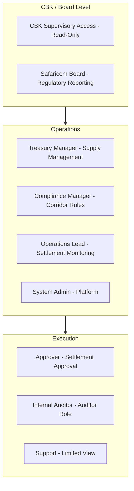

*Figure 14: Operational Role Hierarchy*

### 13.2 Daily Governance

**Per settlement cycle:** Settlement batch submission, confirmation monitoring, exception queue review, CBK reporting queue check.

**Daily:** Exception resolution, reconciliation of DALP settlement records vs ledger system, CBK threshold report generation.

**Weekly:** Entitlement recertification, corridor compliance review, capacity and performance review.

**Monthly:** Full compliance module configuration review, CBK regulatory report submission, incident trend analysis, management reporting.

---

## 14. Implementation Plan

### 14.1 Phased Implementation

The implementation is designed to earn CBK confidence at each gate before proceeding.

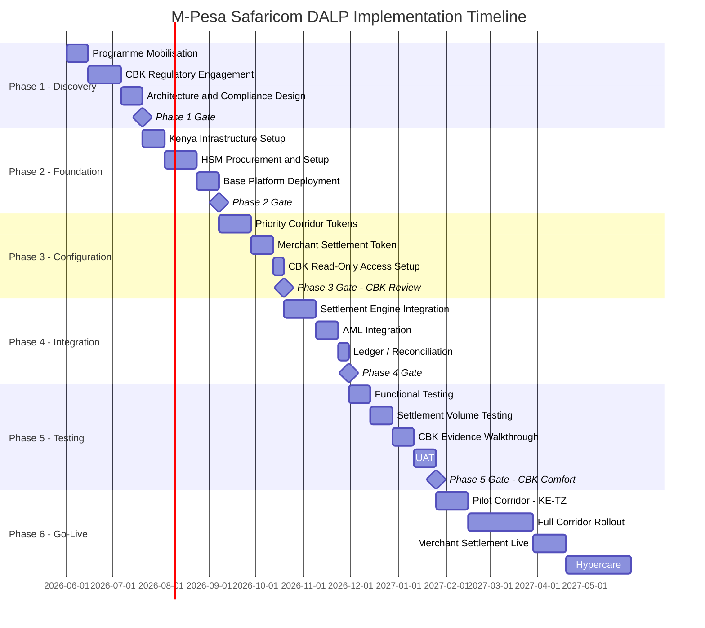

*Figure 15: Implementation Timeline with CBK Gates*

### 14.2 Phase Descriptions

**Phase 1 (7 weeks):** Programme mobilisation, CBK regulatory engagement (initial briefing, proposed structure presentation, supervisory approach discussion), corridor architecture design, Kenya Data Protection Act mapping.

**Phase 2 (7 weeks):** Kenya-based Safaricom data centre infrastructure provisioning, HSM procurement and installation, private Besu network setup with minimum 3 validators, base DALP deployment.

**Phase 3 (6 weeks):** Priority corridor tokens deployed (KE-TZ first, then KE-DRC, KE-MZ), merchant settlement token deployed, CBK read-only access configured and tested. **Phase 3 gate includes CBK technical review of the deployed but inactive settlement layer.**

**Phase 4 (6 weeks):** Settlement engine integration, AML engine integration (block list updates, identity claims), ledger and reconciliation feed integration.

**Phase 5 (8 weeks):** Full functional testing, settlement volume testing (capacity for Safaricom's settlement cycle volumes), CBK evidence walkthrough (CBK team reviews audit trail quality), UAT with treasury and operations teams. **Phase 5 gate includes CBK written comfort before production launch.**

**Phase 6 (20 weeks):** Pilot launch with KE-TZ corridor only, full corridor rollout on two-week cadence, merchant settlement live after corridor rollout confirmed stable, hypercare.

---

## 15. Support and SLA

### 15.1 Support Recommendation

For national payment infrastructure, 24/7 Premium support is required with no exception.

| Feature | Premium |
|---|---|
| Annual cost | $85,000 |
| Coverage | 24/7/365 |
| P1 response | 1 hour |
| P2 response | 4 hours |
| Named support lead | Yes |
| Quarterly CBK evidence pack reviews | Included |

### 15.2 Severity Matrix

| Severity | Definition | Response | Resolution |
|---|---|---|---|
| P1 | Settlement layer failure (consumer fallback activated) | 1 hour | 4 hours |
| P2 | Settlement delayed, compliance workflow blocked | 4 hours | 24 hours |
| P3 | Non-critical, fallback not required | 8 hours | 72 hours |
| P4 | Enhancement, documentation | Next business day | Roadmap |

---

## 16. References and Experience

SettleMint's directly relevant references include: wholesale CBDC infrastructure for central banks, national payment infrastructure tokenization, and multi-corridor settlement platforms. The company's experience with CBK-equivalent regulatory engagement (Bank of England, Swiss National Bank, Central Bank of Bahrain) provides directly applicable evidence of supervisory confidence-building methodology. Reference details available under NDA.

---

## 17. Third-Party Dependencies

| Component | Provider | Type | Substitution |
|---|---|---|---|
| Blockchain | Hyperledger Besu (open source) | Infrastructure | Any EVM network |
| HSM | Thales / Safenet or equivalent | Key management | Alternative FIPS-certified HSM |
| Kubernetes | On-premises in Safaricom DCs | Runtime | Self-managed |
| Execution engine | Restate (open source) | Workflow | Self-hosted |
| Database | Self-managed PostgreSQL | Database | Cloud-managed if preferred |

---

## Appendix A: Requirement Response Matrix

| Req ID | Summary | Status | Capability |
|---|---|---|---|
| REQ-01 | Environment segregation | Full | 5 isolated environments |
| REQ-02 | API-first | Full | OpenAPI 3.1, SDK, webhooks, SSE |
| REQ-03 | RBAC, maker-checker, audit | Full | 26-role RBAC, approval, on-chain audit |
| REQ-04 | Lifecycle controls | Full | Per-corridor token lifecycle |
| REQ-05 | Dependencies | Full | Section 17 |
| REQ-06 | Resilience and DR | Full | Multi-DC HA, degraded-mode for consumer protection |
| REQ-07 | Implementation | Full | 6-phase with CBK gates |
| REQ-08 | Audit evidence | Full | On-chain events, CBK read-only API |
| REQ-14 | Throughput and onboarding | Full | Batch settlement operations |
| REQ-15 | Tokenized/fiat reconciliation | Partial | On-chain side; fiat via settlement engine integration |

---

## Appendix B: Regulatory Mapping

| Regulation | DALP Control |
|---|---|
| CBK National Payments System Act | Settlement finality, audit trail, CBK read-only API evidence |
| CBK Digital Currency Guidance | Permissioned network, payment utility not speculative asset |
| Data Protection Act 2019 | Kenya-based deployment, access logging, retention controls |
| Proceeds of Crime and AMLA | AML identity verification, block list for sanctioned entities |
| CBK Consumer Protection Framework | Consumer segregation: consumer wallet data not in DALP |
| Country-specific corridor regulations | Per-corridor compliance module configuration |

---

## Appendix C: Security and Resilience Evidence

ISO 27001 and SOC 2 Type II certifications. Available to shortlisted bidders under NDA: architecture security review, HSM integration documentation, penetration test summary, DR test reports, incident response process, CBK evidence demonstration pack.

---

*This document is classified SettleMint Confidential. Distribution is restricted to authorised M-Pesa Safaricom procurement personnel.*
