# Technical Proposal: Tokenized Payment Infrastructure For Wallet And Merchant Ecosystems

**Prepared for:** OPay (Nigeria)
**Prepared by:** SettleMint NV
**Date:** March 2026
**Version:** v1.0
**Reference:** OPAY-RFP-TOKENIZED-PAYMENT-INFRASTRUCTURE-202603
**Classification:** Strictly Confidential

---

## Table of Contents

- Executive Summary
- Platform Overview
- Technical Architecture
- Payment Asset Lifecycle
- Compliance and Control Framework
- Settlement and Treasury Controls
- Integration Architecture
- Security Model
- Deployment Architecture
- Implementation Plan
- Support and SLA
- Appendix A: Requirement Response Matrix
- Appendix B: Reference Deployments

---

# Executive Summary

## Context

OPay operates one of Nigeria's highest-volume consumer and merchant payment platforms. The wallet, transfer, and merchant-acquiring infrastructure processes millions of daily transactions across a network of agents, merchants, and banking partners. Settlement between OPay, its merchant network, agent distribution layer, and partner banks relies on batch reconciliation processes that introduce float, timing risk, and manual exception handling. Treasury operations manage liquidity positions across multiple bank relationships and settlement windows, with limited real-time visibility into inter-entity obligations.

This procurement asks whether a tokenized infrastructure layer can improve the settlement, reconciliation, and treasury control mechanics that sit underneath OPay's existing payment operations, without changing the consumer-facing product experience. The answer is yes, but only if the tokenized layer is designed as a permissioned, invisible settlement utility, not as a consumer-facing digital asset product.

## The Challenge

Three structural inefficiencies constrain OPay's current settlement operations.

First, internal treasury settlement between OPay's wallet operations and its banking partners relies on batch file exchange and manual reconciliation. Settlement breaks require human investigation across multiple systems. The reconciliation effort scales linearly with transaction volume, and every additional banking partner multiplies the number of bilateral reconciliation points.

Second, merchant and agent funding settlement operates on periodic cycles with limited intraday visibility. Merchants receive settlement on fixed schedules, and the funding positions between OPay and its merchant-acquiring operations are reconciled after the fact. Disputes require manual reconstruction of transaction chains from wallet records, merchant ledgers, and bank statements.

Third, partner-bank reconciliation for the wallet and transfer infrastructure depends on message-based settlement instructions that can arrive out of order, fail silently, or require manual correction when reference data mismatches occur. The evidence trail for regulatory reporting and audit purposes is distributed across multiple systems with no single authoritative record of settlement state.

## Proposed Response

SettleMint proposes deploying the Digital Asset Lifecycle Platform (DALP) as a permissioned settlement infrastructure layer beneath OPay's existing payment operations. DALP would operate in three phases:

**Phase 1: Internal Treasury Settlement (Weeks 1 to 12).** Deploy tokenized settlement instruments representing inter-entity treasury positions between OPay and its banking partners. Atomic settlement replaces batch file exchange. Every settlement event produces a tamper-evident, on-chain record available for CBN supervisory reporting and internal audit.

**Phase 2: Merchant Settlement Network (Weeks 13 to 24).** Extend the tokenized settlement layer to merchant and agent funding operations. Settlement instruments represent merchant funding obligations with programmable release conditions. Real-time settlement visibility replaces periodic batch reconciliation.

**Phase 3: Partner Bank Connectivity (Weeks 25 to 36).** Connect the tokenized settlement layer to partner-bank reconciliation workflows. Tokenized settlement records serve as the authoritative source for bilateral bank reconciliation, reducing manual matching and exception handling.

## Why SettleMint

SettleMint is a regulated digital asset infrastructure provider headquartered in Belgium, operating across Europe, the Middle East, Africa, and Asia-Pacific. The DALP platform is deployed in production for regulated financial institutions including banks, market infrastructure operators, and sovereign entities. SettleMint holds ISO 27001 and SOC 2 Type II certifications.

Three characteristics make SettleMint specifically suitable for this procurement:

The platform model is critical. DALP is a configurable platform, not a consulting engagement. OPay configures settlement instruments, compliance rules, and integration patterns through the platform's API and administration console. SettleMint does not write custom code for each deployment. This means OPay retains operational independence and can modify settlement configurations as its business evolves.

Compliance is structural, not optional. Every token operation in DALP passes through the ERC-3643 compliance engine before execution. Compliance rules are enforced on-chain, not in application middleware that can be bypassed. This is essential for a payment infrastructure provider operating under CBN oversight.

Settlement is atomic. DALP's Exchange-versus-Payment (XvP) settlement engine executes multi-party settlement in a single atomic transaction. Either all legs settle or none do. This eliminates partial settlement risk and provides the reconciliation certainty that OPay's current batch processes cannot achieve.

## Why DALP Fits This Procurement

This procurement specifically requires a platform that operates as invisible infrastructure beneath existing payment operations. DALP is designed for exactly this pattern. The platform exposes REST APIs and webhook event streams that integrate with existing systems. OPay's consumers and merchants never interact with the blockchain layer. Settlement tokens represent inter-party obligations, not consumer-facing digital assets.

The evaluation criteria weight use-case fit at 24%, API and integration maturity at 18%, and compliance and controls at 18%. DALP's strength is precisely in these areas: configurable settlement instruments for payment use cases, a documented API surface with OpenAPI 3.1 specifications, and on-chain compliance enforcement that produces audit-grade evidence for every operation.

---

# Platform Overview

## DALP as Settlement Infrastructure

DALP is a four-layer digital asset lifecycle platform built on EVM-compatible blockchain networks. For OPay's procurement, the relevant framing is specific: DALP provides the settlement infrastructure layer that sits between OPay's existing payment systems and the banking partners, merchants, and agents that form its settlement network.

The platform is not a retail cryptocurrency product. It does not provide consumer wallets, token trading interfaces, or speculative asset management. In OPay's deployment, the platform would:

- Represent internal treasury settlement positions as permissioned tokens on a private blockchain network
- Enforce compliance rules (maker-checker approvals, settlement limits, counterparty eligibility) on every settlement operation through on-chain compliance modules
- Provide atomic settlement for multi-party transactions between OPay, merchants, and banking partners
- Produce tamper-evident settlement records that serve as the authoritative source for reconciliation and regulatory reporting
- Expose REST APIs and event streams that integrate with OPay's existing payment rails without requiring changes to the consumer-facing product

## Platform, Not Custom Development

DALP's commercial model is platform licensing, not custom development. OPay configures settlement instruments, compliance rules, and operational workflows through the platform's API and Asset Console. The standard implementation methodology has been refined through production deployments with regulated institutions.

This distinction matters for procurement evaluation. A platform model means: predictable implementation timelines, configuration changes do not require code deployments, new settlement instrument types can be added without re-engineering, and the compliance engine is shared across all instruments rather than rebuilt for each one.

## EVM-Only Architecture

DALP operates exclusively on EVM-compatible blockchain networks. This is a deliberate architectural decision. The ERC-3643 compliance standard, the OnchainID identity framework, and the modular smart contract architecture all depend on EVM capabilities. For OPay's deployment, this means the settlement layer runs on a permissioned EVM network (Hyperledger Besu with IBFT 2.0 or QBFT consensus) deployed within OPay's infrastructure or in a dedicated cloud environment with Nigerian data residency.

---

# Technical Architecture

## DALP Four-Layer Stack

DALP is built as a four-layer stack where each layer has a distinct responsibility boundary. Lower layers enforce stricter invariants; upper layers provide flexibility and operational abstraction.

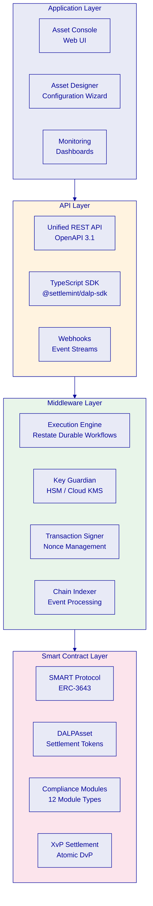

**Application Layer.** The Asset Console provides the operational interface for settlement administrators, compliance officers, and treasury operators. The Asset Designer wizard supports multi-step configuration of settlement instruments. Monitoring dashboards provide real-time visibility into settlement operations, blockchain health, and system metrics.

**API Layer.** The Unified REST API exposes all platform capabilities through OpenAPI 3.1 specifications. The TypeScript SDK provides type-safe programmatic access. Webhook event streams deliver real-time notifications for settlement confirmations, compliance state changes, and operational events. OPay's existing payment systems integrate at this layer.

**Middleware Layer.** The Execution Engine orchestrates settlement workflows through Restate durable workflows with exactly-once semantics. Key Guardian manages cryptographic keys with HSM and cloud KMS integration. The Transaction Signer handles nonce management, gas estimation, and transaction signing. The Chain Indexer processes blockchain events into queryable state projections.

**Smart Contract Layer.** The SMART Protocol (ERC-3643) provides the compliance-enforced token framework. DALPAsset contracts represent configurable settlement instruments. Twelve compliance module types enforce transfer rules. The XvP Settlement addon executes atomic multi-party settlement.

## SMART Protocol and ERC-3643

Every settlement token in DALP is built on the SMART Protocol (SettleMint Adaptable Regulated Token), an implementation of ERC-3643. This standard defines three sub-layers:

**Token.** ERC-20 compatible contracts with compliance hooks. External systems interact through standard interfaces while compliance enforcement happens transparently on every operation.

**Compliance.** A modular orchestration engine that evaluates a configurable set of transfer rules before each transaction. Rules are separate contracts that can be added, removed, or reconfigured at runtime without redeploying the token contract. For OPay's settlement use case, relevant compliance modules include identity verification (all settlement counterparties must have verified on-chain identities), transfer approval (maker-checker enforcement for settlement operations above configurable thresholds), address allow lists (restricting settlement to approved counterparty wallets), and supply limits (enforcing settlement position caps).

**Identity.** On-chain identity management via OnchainID (ERC-734/735). Every settlement counterparty (OPay entities, merchants, banking partners) has a verifiable on-chain identity with claims attesting to eligibility, jurisdiction, and counterparty classification. Identity verification is enforced as a prerequisite for every settlement operation.

## DALPAsset: Configurable Settlement Token

DALPAsset is the recommended contract type for OPay's settlement instruments. It extends the SMART Protocol with the SMARTConfigurable extension, allowing token features and compliance modules to be attached and reconfigured at runtime, after deployment.

For OPay's deployment, DALPAsset tokens would represent:

- **Treasury settlement positions:** Tokens representing inter-entity funding obligations between OPay and banking partners. Each token type maps to a specific banking relationship and settlement currency.
- **Merchant funding instruments:** Tokens representing merchant settlement obligations with programmable release conditions tied to settlement cycle completion.
- **Reconciliation markers:** Tokens that record settlement events as on-chain evidence, providing the authoritative audit trail for bilateral reconciliation.

DALPAsset supports runtime reconfiguration. If OPay needs to add a new compliance rule (for example, a CBN-mandated settlement limit), the rule can be attached to existing settlement tokens without redeploying contracts or migrating balances. This is critical for a payment infrastructure provider operating in an evolving regulatory environment.

## On-Chain Identity and Compliance Enforcement

Every entity participating in OPay's settlement network receives an OnchainID identity contract. This identity holds verifiable claims attesting to the entity's classification, eligibility, and jurisdictional attributes. Claims are issued by trusted claim issuers (SettleMint or OPay-designated verifiers) and can be time-bounded.

The compliance enforcement sequence for every settlement operation:

1. The initiator submits a settlement instruction through the API
2. The middleware validates the instruction and prepares a blockchain transaction
3. The smart contract's compliance engine evaluates all attached modules in sequence
4. Each module checks the relevant identity claims and operational parameters
5. If any module rejects the operation, the entire transaction reverts; no partial settlement occurs
6. If all modules approve, the settlement executes atomically and the event is indexed

This is a fail-closed design. The default state is denial unless every compliance module explicitly approves. No administrative override can bypass on-chain compliance enforcement.

---

# Payment Asset Lifecycle

## Token Issuance Flow

Settlement token creation follows a deterministic factory deployment pattern. The process is atomic: either all steps complete or the entire deployment reverts.

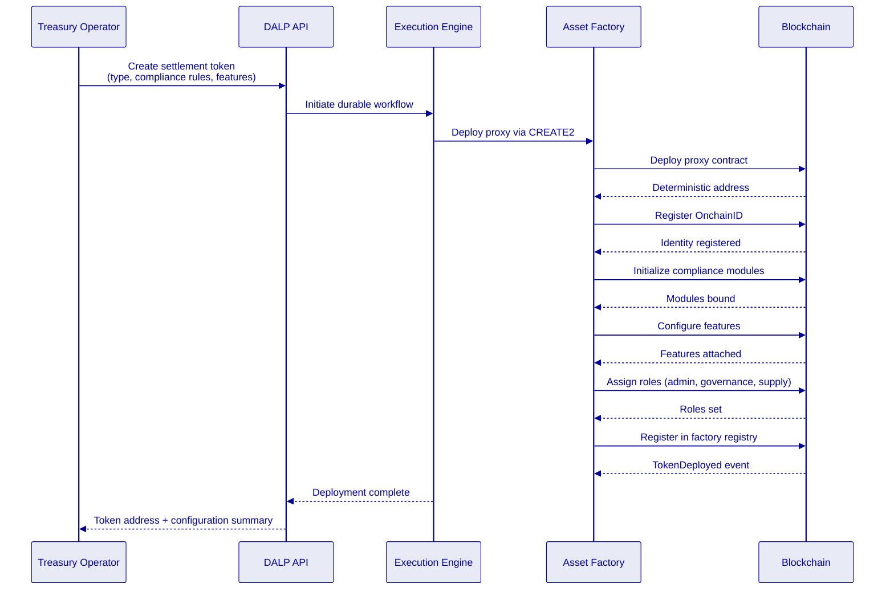

The factory enforces invariants at deployment: identity must be set before compliance, compliance before transfers are enabled, and all required roles must be assigned atomically. CREATE2 deterministic addressing means token addresses are predictable from deployment parameters, enabling pre-configuration of external systems before the token exists on-chain.

## Lifecycle State Machine

Settlement tokens progress through defined lifecycle states. State transitions are governed by role-based access control and compliance module evaluation.

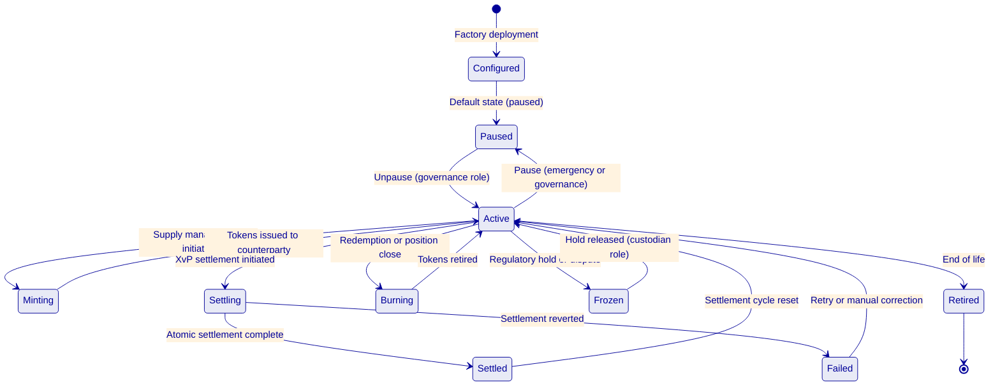

Key lifecycle operations for OPay's settlement use case:

**Minting** represents the creation of new settlement positions. When OPay funds a treasury position with a banking partner, the corresponding settlement tokens are minted to represent the obligation. Minting requires the SUPPLY_MANAGEMENT_ROLE and passes through all compliance modules.

**Settlement** uses the XvP addon for atomic multi-party exchange. A trilateral settlement between OPay, a merchant, and a banking partner executes as a single atomic transaction: either all three legs complete or none do.

**Burning** represents the retirement of settled positions. When a treasury position is closed or a merchant settlement cycle completes, the corresponding tokens are burned, removing the obligation from the on-chain record while preserving the full audit history in the event log.

**Freezing** supports regulatory holds and dispute resolution. The CUSTODIAN_ROLE can freeze specific accounts or positions, preventing any transfer until the hold is released. Freeze and unfreeze events are recorded on-chain for audit purposes.

---

# Compliance and Control Framework

## CBN Payment Oversight Mapping

OPay operates under CBN supervision as a payment service provider. The tokenized settlement layer must align with CBN's regulatory expectations without introducing new regulatory ambiguity. DALP maps to CBN requirements through the following control architecture:

| CBN Requirement Area | DALP Control Mechanism | Evidence Artifact |
|---|---|---|
| Payment system integrity | Atomic settlement (XvP), fail-closed compliance engine | Settlement transaction records, compliance evaluation logs |
| AML/CFT controls | Identity verification modules, transaction monitoring integration points | OnchainID claims, screening results linked to settlement events |
| Operational resilience | Multi-environment deployment, DR with defined RTO/RPO | Recovery test reports, incident response logs |
| Data protection | PII off-chain, settlement hashes on-chain, encryption at rest and transit | Data flow documentation, encryption configuration evidence |
| Supervisory reporting | Event-based reporting extracts, configurable audit log exports | Settlement activity reports, position summaries, exception registers |
| Outsourcing controls | Deployment within Nigeria infrastructure, documented shared responsibility | Infrastructure topology documentation, responsibility matrix |

DALP does not replace OPay's regulatory obligations. OPay remains the regulated entity responsible for CBN compliance. DALP provides the technical controls, evidence artifacts, and operational tooling that support OPay in meeting those obligations.

## NDPC Data Governance

The Nigeria Data Protection Act and NDPC regulations impose specific requirements on how personal data is handled. DALP's architecture addresses these requirements through a clear separation:

**On-chain (blockchain):** Settlement transaction records, compliance evaluation results, counterparty identity claim hashes, and settlement position states. No personally identifiable information (PII) is stored on-chain. Identity claims reference hashed attestations, not raw personal data.

**Off-chain (platform database):** Counterparty details, KYC documentation references, contact information, and operational metadata. This data is stored in DALP's application database within OPay's infrastructure, subject to NDPC data residency, retention, and deletion controls.

This separation means that the blockchain record contains the settlement evidence trail (who settled what, when, under which compliance rules) without exposing personal data. If a data subject exercises deletion rights under NDPC, the off-chain personal data can be deleted while the on-chain settlement records retain their evidentiary value through anonymized references.

Data residency is enforced by deploying DALP infrastructure within Nigeria. The blockchain network, application database, and all supporting services operate within Nigerian data center boundaries.

## AML/CFT Integration Pattern

DALP does not replace OPay's existing AML/CFT screening and transaction monitoring infrastructure. Instead, it integrates with those systems through defined control points:

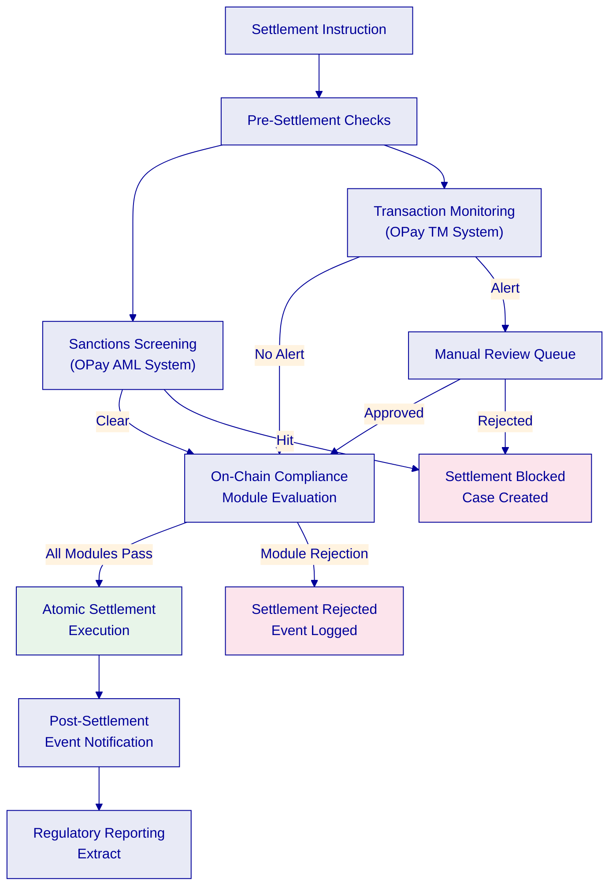

The integration pattern ensures that OPay's existing AML/CFT controls are evaluated before the on-chain compliance engine, creating a layered defense. Sanctions screening and transaction monitoring results can be recorded as claims on the settlement counterparty's OnchainID, providing the on-chain compliance modules with pre-evaluated eligibility data.

## RBAC and Maker-Checker Controls

DALP enforces a dual-layer permission model. Off-chain platform roles control API and console access. On-chain roles govern blockchain operations. Both layers must approve for any settlement operation to execute.

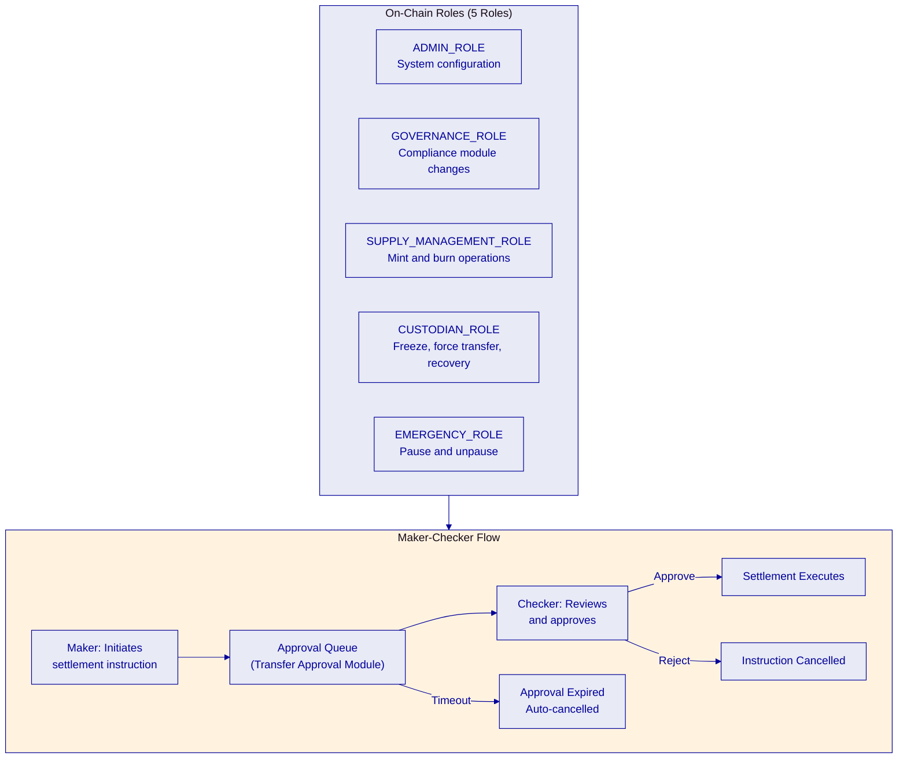

Five on-chain roles enforce separation of duties:

**ADMIN_ROLE** manages system configuration, factory deployment, and role assignments. This role cannot directly execute settlement operations.

**GOVERNANCE_ROLE** controls compliance module configuration, token feature changes, and operational parameter updates. Changes to compliance rules require governance approval, ensuring that no single operator can weaken settlement controls.

**SUPPLY_MANAGEMENT_ROLE** authorizes minting and burning of settlement tokens. This role controls the creation and retirement of settlement positions.

**CUSTODIAN_ROLE** handles forced transfers (for court orders or regulatory directives), account freezing, and identity recovery operations. Every custodian action is recorded on-chain with full audit trail.

**EMERGENCY_ROLE** can pause and unpause token operations. Pause halts all transfers immediately, providing a circuit-breaker for operational incidents.

Maker-checker enforcement uses the Transfer Approval compliance module. Settlement instructions above configurable thresholds require explicit approval from a second authorized operator before execution. Approvals have configurable expiry periods; expired approvals are automatically cancelled.

---

# Settlement and Treasury Controls

## Atomic XvP Settlement

DALP's Exchange-versus-Payment (XvP) settlement engine is the core mechanism for OPay's multi-party settlement operations. XvP executes settlement as a single atomic transaction: either all legs of the settlement complete, or none do. There is no partial settlement risk.

For OPay's trilateral settlement flows (OPay to merchant to bank), XvP provides:

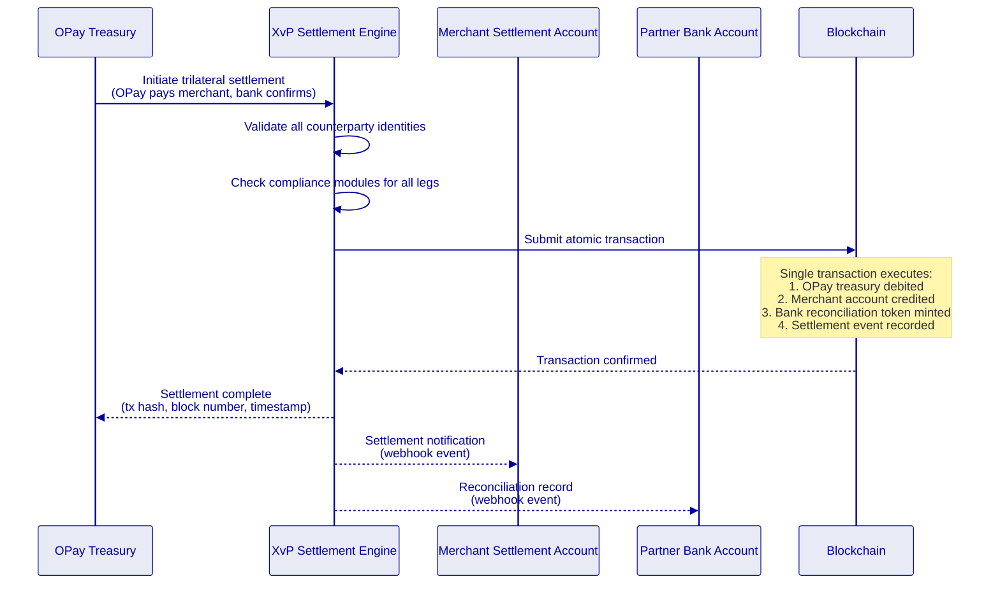

The atomic guarantee eliminates the reconciliation gaps that arise from batch-based settlement. In OPay's current process, if one leg of a settlement fails, the other legs may have already completed, requiring manual correction. With XvP, failure at any point causes the entire transaction to revert, leaving all accounts in their pre-settlement state.

## Settlement Flow

The full settlement flow from instruction to confirmation follows this sequence:

1. **Instruction submission.** The treasury operator or an automated system submits a settlement instruction through the DALP API, specifying counterparties, amounts, settlement token type, and reference data.

2. **Pre-settlement validation.** The middleware validates the instruction format, checks that all counterparties have active OnchainID identities with valid claims, and verifies that the initiator holds the required role.

3. **Compliance evaluation.** The on-chain compliance engine evaluates all attached modules. For settlement operations, this typically includes identity verification, counterparty eligibility, settlement amount limits, and maker-checker approval (if the amount exceeds the auto-approval threshold).

4. **Atomic execution.** The XvP engine submits the settlement as a single blockchain transaction. All legs execute atomically. The transaction includes the settlement amounts, counterparty addresses, and reference data.

5. **Event emission and indexing.** The blockchain emits settlement events. The Chain Indexer processes these events into queryable state, updating position balances, settlement history, and reconciliation records.

6. **Notification dispatch.** Webhook events notify all counterparties of the settlement outcome. Each counterparty receives the settlement details, transaction hash, block number, and timestamp.

## Reconciliation Module

DALP provides the authoritative on-chain record for settlement events. Reconciliation between the tokenized settlement records and OPay's existing fiat books follows a defined pattern:

**Tokenized record (on-chain):** Every settlement event is recorded as a blockchain transaction with immutable timestamp, counterparty addresses, settlement amounts, compliance evaluation results, and reference identifiers that map to OPay's internal transaction IDs.

**Fiat record (OPay books):** OPay's existing ledger and accounting systems maintain the fiat-denominated records of the same settlement events, including bank statements, merchant ledger entries, and treasury position records.

**Reconciliation process:** DALP exports settlement event data through its API and reporting extracts. OPay's reconciliation systems match these records against fiat book entries using shared reference identifiers. Breaks are surfaced through DALP's event stream and can be investigated using the platform's audit log, which provides the complete compliance evaluation chain for every settlement event.

**Break resolution:** When a reconciliation break occurs, the audit trail in DALP provides deterministic evidence: which instruction was submitted, by whom, which compliance rules evaluated, whether maker-checker was invoked, and the exact blockchain state change. This evidence supports rapid root-cause analysis rather than the multi-system investigation required in current batch reconciliation.

## Cut-Off Window Handling

Settlement operations respect configurable cut-off windows:

- **Daily cut-off.** Settlement instructions submitted after the daily cut-off are queued for the next settlement window. The cut-off time is configurable per settlement token type, allowing different schedules for treasury settlement (e.g., 16:00 WAT) and merchant settlement (e.g., end of business day).

- **Failed settlement.** If a settlement instruction fails compliance evaluation, the instruction is rejected with a detailed reason code. The initiator receives a webhook notification with the specific compliance module that blocked the operation and the evaluation parameters.

- **Reversals.** Post-settlement corrections use a reversal mechanism: a new settlement instruction is created that represents the offsetting positions, providing full audit lineage from the original settlement through the correction. DALP does not support "undo" operations on blockchain transactions; instead, corrections are forward-correcting entries with explicit links to the original event.

- **Stale approvals.** Settlement instructions pending maker-checker approval have configurable expiry periods. Expired approvals are automatically cancelled and the initiator is notified. This prevents stale settlement instructions from executing after the settlement context has changed.

---

# Integration Architecture

## Integration Points

DALP integrates with OPay's existing payment infrastructure through well-defined interfaces. The integration architecture positions DALP as a settlement service that OPay's existing systems consume, not as a replacement for those systems.

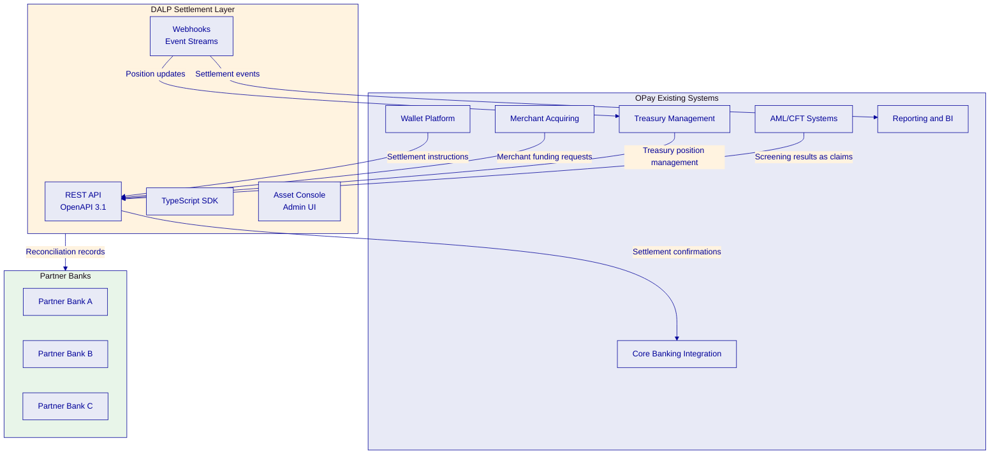

## REST API and Webhook Event Streams

**REST API.** DALP exposes all settlement operations through a Unified REST API with OpenAPI 3.1 specifications. OPay's existing systems integrate by calling documented endpoints for settlement instruction submission, position queries, compliance status checks, and counterparty management. The API supports session-based authentication (for operator access) and API keys (for system-to-system integration) with configurable rate limits (10,000 requests per 60-second window per key).

**Webhooks.** DALP delivers real-time event notifications through configurable webhook endpoints. OPay registers webhook URLs for event categories relevant to its operations: settlement confirmations, compliance state changes, position updates, and operational alerts. Each webhook delivery includes the event payload, a cryptographic signature for verification, and a unique event ID for idempotent processing.

**TypeScript SDK.** For deeper integration, DALP provides a public TypeScript SDK (@settlemint/dalp-sdk) with typed client factories, automatic serialization of blockchain value types, and support for all API namespaces.

## Data Flow

The data flow between OPay's systems and DALP follows a clear pattern:

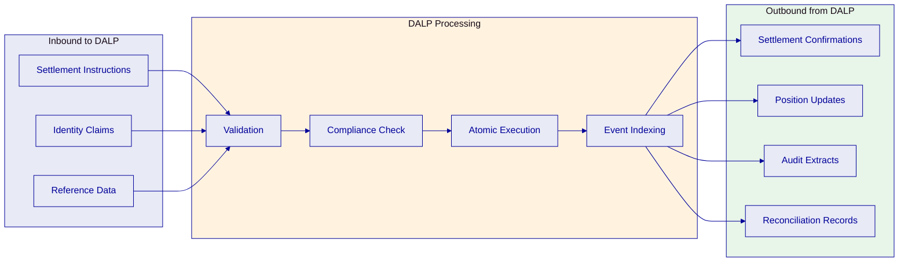

**Inbound data:** Settlement instructions (counterparties, amounts, reference IDs), identity claims (screening results, eligibility attestations), and reference data (counterparty classifications, settlement parameters).

**Processing:** Validation, compliance evaluation, atomic execution, and event indexing. Each stage produces structured logs that contribute to the audit trail.

**Outbound data:** Settlement confirmations (with transaction hashes and timestamps), position updates (current balances and settlement history), audit extracts (compliance evaluation chains), and reconciliation records (matched reference IDs for fiat book comparison).

## Idempotency, Event Ordering, and Replay

**Idempotency.** Every API call accepts a client-supplied idempotency key. If OPay's system retries a settlement instruction due to a network timeout, the duplicate request is detected and the original result is returned without re-executing the operation. This is essential for payment infrastructure where duplicate settlement would create financial exposure.

**Event ordering.** Webhook events include sequence numbers and timestamps. OPay's event consumers can detect gaps in the event sequence and request replays for missing events. The Chain Indexer maintains a complete, ordered record of all blockchain events.

**Replay support.** If OPay's webhook endpoint experiences downtime, DALP queues undelivered events and retries with exponential backoff. OPay can also request a replay of events for a specified time range through the API, enabling recovery from consumer-side failures without data loss.

---

# Security Model

## Security Layers

DALP enforces defense-in-depth across five independent control layers. No single-layer failure grants unauthorized access to settlement operations.

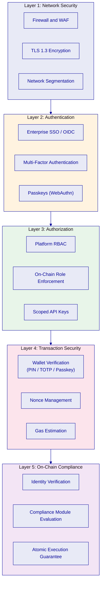

Each layer operates independently. Even if an attacker compromises network access, they must still authenticate, obtain authorization, pass wallet verification, and clear on-chain compliance checks before any settlement operation executes.

## Key Management and HSM

DALP's Key Guardian service manages cryptographic keys used for transaction signing. Key management follows a hierarchical model:

**HSM integration.** For production deployments, Key Guardian integrates with hardware security modules (HSMs) or cloud key management services (AWS KMS, Azure Key Vault, GCP Cloud KMS). Private keys never leave the HSM boundary. Transaction signing requests are sent to the HSM, which returns signed transactions without exposing key material.

**Key rotation.** Key Guardian supports scheduled key rotation without service interruption. New keys are generated and old keys are retained for verification of historical transactions. The rotation schedule is configurable per deployment environment.

**Secrets handling.** Application secrets (database credentials, API keys, service tokens) are managed through integration with enterprise secret management systems (HashiCorp Vault, AWS Secrets Manager, Azure Key Vault). Secrets are injected at runtime and never stored in code, configuration files, or container images.

## Network Segmentation and Audit Logging

**Network segmentation.** The DALP deployment architecture enforces network-level isolation between components. The blockchain network operates in a dedicated network segment accessible only to platform middleware. The API layer is exposed through a reverse proxy with WAF protection. Administrative interfaces are restricted to OPay's internal network. Database servers are not directly accessible from any external network.

**Audit logging.** Every operation produces structured audit log entries including: operator identity, timestamp, operation type, input parameters, compliance evaluation results, blockchain transaction hash (for on-chain operations), and outcome. Logs are immutable once written and are retained according to OPay's data retention policies. DALP supports export of audit logs to OPay's SIEM platform for centralized monitoring and alerting.

## Penetration Testing and SOC 2

SettleMint maintains a continuous security assurance program:

**Penetration testing.** Annual third-party penetration testing covers the full DALP platform including API endpoints, web interfaces, blockchain integration points, and infrastructure. Test results and remediation evidence are available to OPay upon request under NDA.

**SOC 2 Type II.** SettleMint holds SOC 2 Type II certification, confirming that security controls are not just designed but independently audited and continuously maintained over a 12-month observation period. The SOC 2 report covers access controls, change management, incident response, and operational monitoring.

**ISO 27001.** SettleMint's information security management system is certified to ISO 27001, providing the framework for continuous security improvement and risk management.

**Vulnerability management.** The platform follows a defined vulnerability management lifecycle: scanning (automated weekly scans plus ad-hoc scanning for new releases), triage (severity classification within 24 hours), remediation (critical vulnerabilities patched within 72 hours, high within 14 days), and verification (post-remediation confirmation scanning).

---

# Deployment Architecture

## Deployment Options

For OPay's deployment in Nigeria, DALP supports two primary deployment models that satisfy data residency requirements:

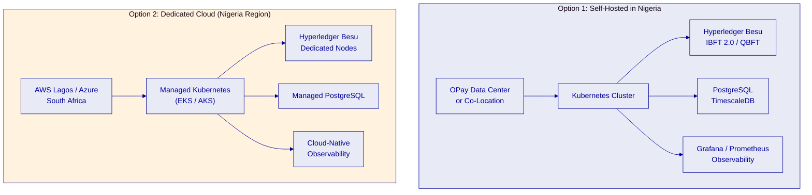

**Option 1: Self-hosted in Nigeria.** DALP is deployed on OPay's own infrastructure or in a co-location facility in Nigeria. OPay manages the infrastructure with SettleMint providing Helm chart deployment artifacts, configuration guidance, and platform-level support. This option provides maximum control over data residency and infrastructure security.

**Option 2: Dedicated cloud with Nigeria data residency.** DALP is deployed on a dedicated cloud environment in the closest available region (AWS Lagos or Azure South Africa) with all data residency controls enforced at the infrastructure level. SettleMint can co-manage the cloud environment under a shared responsibility model.

Both options deliver the same platform capabilities. The choice depends on OPay's infrastructure strategy, existing cloud relationships, and operational preferences.

## Multi-Environment Architecture

DALP supports a multi-environment topology that mirrors standard enterprise development practices:

| Environment | Purpose | Data | Network |
|---|---|---|---|
| Development | Feature development, integration testing | Synthetic | Shared dev Besu network |
| Test | Automated testing, regression | Synthetic | Dedicated test Besu network |
| UAT | User acceptance, business validation | Masked production-like | Dedicated UAT Besu network |
| DR | Disaster recovery, failover testing | Replicated from production | Mirrored production Besu network |
| Production | Live settlement operations | Real | Production Besu network |

Each environment is fully isolated: separate Kubernetes namespaces (or clusters), separate blockchain networks, separate databases, and separate access controls. Configuration promotion between environments follows a defined pipeline with approval gates.

## Recovery Objectives

| Metric | Target | Mechanism |
|---|---|---|
| RTO (Recovery Time Objective) | 4 hours | Automated failover for stateless services; database restore from continuous backup; Besu node resync from snapshot |
| RPO (Recovery Point Objective) | 15 minutes | Continuous database backup (WAL archiving); blockchain state inherently replicated across validator nodes |
| Backup frequency | Continuous (database WAL); hourly (full snapshot) | Automated backup pipeline with integrity verification |
| DR testing | Quarterly | Full failover exercise with documented results and gap remediation |

The blockchain layer provides inherent resilience: settlement records are replicated across all validator nodes. If a single node fails, the remaining validators continue processing. Database recovery uses PostgreSQL's Write-Ahead Log (WAL) archiving for point-in-time recovery.

---

# Implementation Plan

## Timeline

The implementation follows a three-phase approach aligned with OPay's settlement modernization priorities:

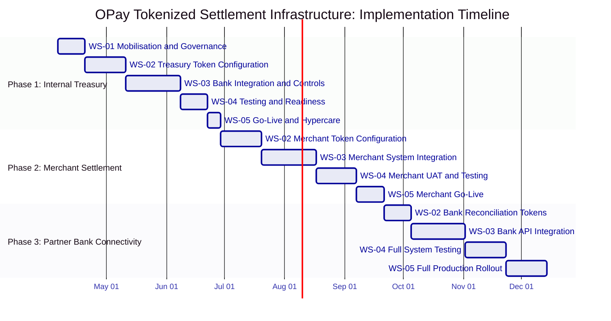

## Phase 1: Internal Treasury Settlement (Weeks 1 to 12)

Phase 1 establishes the foundation by deploying tokenized settlement instruments for OPay's internal treasury operations with banking partners.

**WS-01 Mobilisation and Governance (Weeks 1 to 2).** Programme setup, steering committee formation, design authority establishment, RAID management framework, and decision log protocols. Deliverables include the programme charter, stakeholder RACI matrix, and risk register.

**WS-02 Treasury Token Configuration (Weeks 3 to 5).** Configure DALPAsset settlement tokens for each banking partner relationship. Define compliance modules (identity verification, settlement limits, maker-checker thresholds). Set up role assignments for treasury operators. Deliverables include token configuration specifications and compliance rule documentation.

**WS-03 Bank Integration and Controls (Weeks 6 to 9).** Build API integrations between OPay's treasury management system and DALP. Configure webhook event streams for settlement notifications. Integrate with OPay's AML/CFT screening systems. Deliverables include integration specifications, API test results, and control mapping documentation.

**WS-04 Testing and Readiness (Weeks 10 to 11).** Functional testing, security testing, performance testing under expected settlement volumes, and user acceptance testing with treasury operators. Deliverables include test reports, security assessment results, and go-live readiness checklist.

**WS-05 Go-Live and Hypercare (Week 12).** Production deployment of treasury settlement tokens with intensive post-go-live support. Parallel running with existing settlement processes to validate reconciliation accuracy. Deliverables include production deployment evidence, parallel run results, and operational runbooks.

## Phase 2: Merchant Settlement Network (Weeks 13 to 24)

Phase 2 extends the tokenized settlement layer to merchant and agent funding operations.

**WS-02 Merchant Token Configuration (Weeks 13 to 15).** Configure merchant settlement instruments with programmable funding release conditions. Define merchant-specific compliance rules and settlement cycle parameters.

**WS-03 Merchant System Integration (Weeks 16 to 19).** Integrate DALP with OPay's merchant acquiring platform. Build event-driven settlement notification flows. Configure reconciliation extracts for merchant ledger matching.

**WS-04 Merchant UAT and Testing (Weeks 20 to 22).** Testing with representative merchant cohort. Performance testing under production merchant transaction volumes. Dispute resolution workflow validation.

**WS-05 Merchant Go-Live (Weeks 23 to 24).** Phased rollout starting with a controlled merchant cohort, expanding to full merchant network based on defined readiness criteria.

## Phase 3: Partner Bank Connectivity (Weeks 25 to 36)

Phase 3 connects the tokenized settlement layer to partner-bank reconciliation workflows.

**WS-02 Bank Reconciliation Tokens (Weeks 25 to 26).** Configure reconciliation tokens that represent bilateral settlement records between OPay and partner banks.

**WS-03 Bank API Integration (Weeks 27 to 30).** Build integration with partner bank reconciliation systems. Configure bilateral settlement event sharing. Establish reference data synchronization between DALP and bank settlement systems.

**WS-04 Full System Testing (Weeks 31 to 33).** Full system integration testing across all three phases. End-to-end settlement flow testing from wallet transaction through treasury settlement through merchant funding through bank reconciliation.

**WS-05 Full Production Rollout (Weeks 34 to 36).** Complete production rollout with operational transition to OPay's support team. Knowledge transfer, runbook finalization, and service handoff.

## Workstream Breakdown

| Workstream | Scope | Deliverables |
|---|---|---|
| WS-01: Mobilisation and Governance | Programme setup, steering, design authority, RAID, decision logs | Programme charter, RACI, risk register, governance framework |
| WS-02: Business and Product Configuration | Token design, compliance rules, role assignments, operational parameters | Token specifications, compliance documentation, configuration evidence |
| WS-03: Integration and Controls | API integration, webhook configuration, AML/CFT integration, observability | Integration specifications, test results, control mapping |
| WS-04: Testing and Readiness | Functional, security, performance, UAT, go-live readiness | Test reports, security assessments, readiness checklists |
| WS-05: Operational Transition | Runbooks, support handoff, KPI definition, post-launch governance | Operational documentation, support model, KPI framework |

---

# Support and SLA

## Support Tiers

SettleMint offers three support tiers for OPay's deployment:

| Aspect | Standard | Premium | Enterprise |
|---|---|---|---|
| Coverage hours | Business hours (CET) | Extended (06:00 to 22:00 CET) | 24/7/365 |
| Response time (P1 Critical) | 4 hours | 1 hour | 15 minutes |
| Response time (P2 High) | 8 hours | 4 hours | 1 hour |
| Response time (P3 Medium) | 2 business days | 1 business day | 4 hours |
| Response time (P4 Low) | 5 business days | 3 business days | 1 business day |
| Dedicated account manager | No | Yes | Yes |
| Named support engineers | No | No | Yes (2 named) |
| Quarterly business review | No | Yes | Yes |
| Annual architecture review | No | No | Yes |
| Platform upgrade support | Self-service with docs | Coordinated | White-glove |

For a payment infrastructure deployment of OPay's scale and criticality, SettleMint recommends the Enterprise support tier with 24/7 coverage and 15-minute P1 response times.

## Incident Classification

| Priority | Definition | Example |
|---|---|---|
| P1 Critical | Settlement operations halted; no workaround available | Blockchain network consensus failure; all settlement transactions blocked |
| P2 High | Settlement operations degraded; workaround available | Single counterparty settlement failing; bulk operations delayed |
| P3 Medium | Non-critical function impaired; no immediate business impact | Monitoring dashboard intermittent; report generation delayed |
| P4 Low | Cosmetic issue or enhancement request | UI display issue; documentation correction |

## SLA Commitments

| Metric | Target |
|---|---|
| Platform availability | 99.9% (measured monthly, excluding planned maintenance) |
| Settlement transaction success rate | 99.95% (excluding compliance rejections, which are by design) |
| API response time (p95) | Less than 500ms for read operations; less than 2 seconds for write operations |
| Webhook delivery | 99.9% within 30 seconds of event emission |
| Planned maintenance window | Maximum 4 hours per month, scheduled with 72-hour notice |
| Incident root cause analysis | Delivered within 5 business days for P1/P2 incidents |

---

# Appendix A: Requirement Response Matrix

| Req ID | Requirement | Status | Evidence Reference |
|---|---|---|---|
| REQ-01 | Segregated dev, test, UAT, DR, and production environments | Compliant | Deployment Architecture: Multi-Environment Architecture |
| REQ-02 | API-first interfaces, eventing, version governance | Compliant | Integration Architecture: REST API and Webhook Event Streams |
| REQ-03 | RBAC, segregation of duties, maker-checker, audit logs | Compliant | Compliance and Control Framework: RBAC and Maker-Checker Controls |
| REQ-04 | Configurable lifecycle states, policy controls, limits, reconciliations | Compliant | Payment Asset Lifecycle; Settlement and Treasury Controls |
| REQ-05 | Third-party dependency disclosure | Compliant | Deployment Architecture (Besu, PostgreSQL, Restate, Grafana/Prometheus) |
| REQ-06 | Resilience, recovery, backup, monitoring, incident management | Compliant | Deployment Architecture: Recovery Objectives; Support and SLA |
| REQ-07 | Delivery method, client effort, phased implementation plan | Compliant | Implementation Plan (36-week, three-phase) |
| REQ-08 | Evidence extraction for audit, supervisory review, board reporting | Compliant | Compliance and Control Framework; Security Model: Audit Logging |
| REQ-14 | High-throughput routing, participant onboarding, liquidity monitoring | Compliant | Settlement and Treasury Controls; Payment Asset Lifecycle |
| REQ-15 | Reconciliation between tokenized and fiat settlement legs | Compliant | Settlement and Treasury Controls: Reconciliation Module |
| REQ-18 | Configuration governance, observability, phased environment promotion | Compliant | Deployment Architecture: Multi-Environment; Security Model |
| REQ-19 | Participant supervision, policy analytics | Compliant | Compliance and Control Framework; RBAC and Maker-Checker |
| RC-01 | Regulatory mapping to jurisdictional requirements | Compliant | Compliance and Control Framework: CBN Payment Oversight Mapping |
| RC-02 | AML/CFT and sanctions screening integration | Compliant | Compliance and Control Framework: AML/CFT Integration Pattern |
| RC-03 | Data governance (residency, retention, deletion, encryption) | Compliant | Compliance and Control Framework: NDPC Data Governance |
| RC-04 | Operational resilience (recovery, DR, incident management) | Compliant | Deployment Architecture: Recovery Objectives; Support and SLA |
| RC-05 | Outsourcing and subcontractor disclosure | Compliant | Deployment Architecture: self-hosted or dedicated cloud options |
| RC-06 | Assurance and audit support artifacts | Compliant | Security Model: Penetration Testing and SOC 2 |

---

# Appendix B: Reference Deployments

SettleMint has production deployments across regulated financial institutions in Europe, the Middle East, and Africa. Due to client confidentiality agreements, the following summaries are anonymized:

**Deployment 1: Gulf Region Sovereign Entity.** Tokenized bond issuance and lifecycle management platform for a sovereign wealth entity. Permissioned Hyperledger Besu network with multi-custody integration (Fireblocks and DFNS). Production since 2025. Supports multiple asset classes with on-chain compliance enforcement across three jurisdictions.

**Deployment 2: European Tier-1 Bank.** Digital bond issuance platform operating under MiCA and national securities regulations. Self-hosted deployment with enterprise SSO integration. Processes corporate bond lifecycle from issuance through coupon distribution through redemption with automated compliance module evaluation.

**Deployment 3: African Market Infrastructure Provider.** Tokenized settlement infrastructure for a market infrastructure operator. Private cloud deployment with data residency controls in the host country. Integration with existing clearing and settlement systems through REST API and event-driven architecture.

**Deployment 4: Middle East Banking Group.** Multi-entity digital asset platform supporting Sharia-compliant investment products. Multi-network deployment (permissioned for regulated assets, public for pilot programmes). Enterprise support tier with 24/7 coverage and dedicated named engineers.

These deployments demonstrate DALP's production readiness for regulated settlement infrastructure at institutional scale. SettleMint can arrange reference calls with selected clients upon request, subject to those clients' consent.
