# Technical Proposal: Digital Asset Exchange and Regulated Post-Trade Controls

**Document Title:** Technical Proposal for Digital Asset Exchange and Regulated Post-Trade Controls  
**Client:** Rain (Bahrain)  
**Reference:** RAIN-RFP-DIGITAL-ASSET-EXCHANGE-202603  
**Submitted by:** SettleMint  
**Date:** March 2026  
**Version:** 1.0 (Draft)  
**Confidentiality:** Strictly Confidential

---

## Table of Contents

1. Executive Summary
2. Understanding of Rain's Requirements
3. SettleMint and DALP Overview
4. Platform Architecture
5. Digital Asset Exchange Capabilities
6. Regulated Post-Trade Controls
7. Compliance and Regulatory Framework
8. Security Architecture
9. Integration Architecture
10. Custody and Key Management
11. Settlement and Clearing
12. Operational Model and Support
13. Implementation Plan
14. Reference Deployments
15. Compliance Matrix

---

## Executive Summary

Rain operates at the intersection of regulated digital asset exchange and institutional post-trade controls in Bahrain, a jurisdiction that has moved faster than most in establishing a clear supervisory framework for digital asset businesses. The Central Bank of Bahrain's regulatory sandbox and subsequent licensing regime for crypto-asset service providers creates both opportunity and obligation: Rain must demonstrate, not just claim, that its platform controls are audit-ready, operationally sustainable, and capable of withstanding the scrutiny that comes with a regulated exchange license.

This proposal responds to that obligation directly. SettleMint's Digital Asset Lifecycle Platform (DALP) provides the production-grade infrastructure that Rain requires to operate a regulated digital asset exchange with credible post-trade controls. The platform is not a pilot-stage toolkit. It has been deployed in live regulated environments across multiple jurisdictions, handling real asset lifecycles under institutional SLAs, compliance frameworks, and governance models that match what Rain's CBB license demands.

The specific capabilities Rain requires span order execution integrity, settlement finality, compliance enforcement at the transaction level, custody integration, reconciliation, and audit trail production. DALP addresses each of these as first-class platform concerns, not as downstream integrations or manual operational overlays.

Three outcomes define what Rain needs from this procurement. First, a platform that can operate continuously under regulatory scrutiny without requiring manual workarounds for routine lifecycle events. Second, an integration model that connects to Rain's existing identity, AML/CFT, and reporting stack without creating an isolated digital-asset back office. Third, a commercial and implementation model with enough certainty that Rain's board and the CBB can verify the delivery plan against the license commitments.

SettleMint delivers against all three. The sections that follow provide the technical depth, integration specifics, control documentation, and implementation structure that Rain's evaluation committee requires to make an informed procurement decision.

---

## Understanding of Rain's Requirements

### Regulatory Context

Rain holds a Category 4 license from the Central Bank of Bahrain (CBB), covering crypto-asset services under the CBB's regulatory framework for crypto-asset service providers. This licensing framework imposes specific obligations on Rain, including:

- Segregation of client assets with documented custody controls
- AML/CFT transaction monitoring with Suspicious Activity Report (SAR) filing capability
- Market integrity controls covering order book operation, trade reporting, and market surveillance
- Investor protection requirements including suitability and eligibility assessment for retail clients
- Operational resilience standards covering disaster recovery, business continuity, and incident response
- Audit trail requirements with tamper-evident records accessible to CBB examination teams

The CBB framework also operates within the broader context of regional digital asset development, including Bahrain's participation in Project Aber (cross-border CBDC with Saudi Arabia), the Digital Dirham work from the UAE, and the GCC-wide push toward interoperable payment and settlement infrastructure. Rain's post-trade controls must therefore anticipate cross-border settlement scenarios as the regional infrastructure matures.

### Operational Requirements

Rain's procurement requirements identify four operational pressure points that any platform must address:

**Incomplete onboarding data:** The platform must handle partially completed onboarding flows without creating compliance gaps or allowing ineligible transactions to proceed. This requires a gate-controlled onboarding model where compliance verification is a precondition for trading eligibility, not a post-execution check.

**Limit breaches and governance approvals:** Trading limits, position limits, and approval workflows must be enforced in real time. A transaction that exceeds a configured limit should be blocked, queued for approval, or escalated based on configurable governance rules, not rejected silently or processed without control.

**Partner outages:** Rain's operational environment depends on external providers for custody, AML screening, market data, and payment processing. The platform must handle degraded-mode operation when a dependency is unavailable, with clear operational runbooks and automatic recovery paths.

**Regulatory evidence production:** When the CBB or an internal audit team requests evidence of a specific transaction's compliance checks, the platform must produce structured, tamper-evident records without requiring manual data assembly from multiple systems.

### Integration Baseline

Rain's existing technology stack includes identity verification services, AML/CFT screening tools, a banking and payment integration layer, and reporting infrastructure. The platform selected through this RFP must integrate into this stack as a structured component, not as a replacement for the entire estate. SettleMint's integration model is designed for exactly this pattern: DALP provides the asset lifecycle and post-trade control layer while connecting through documented APIs to the identity, screening, treasury, and reporting systems Rain already operates.

---

## SettleMint and DALP Overview

SettleMint is a digital asset lifecycle platform company with nearly a decade of production experience in regulated financial environments. The company's Digital Asset Lifecycle Platform (DALP) provides the infrastructure layer between existing core financial systems and blockchain networks, enabling institutions to build, deploy, and operate compliant digital asset solutions in production.

DALP is not a prototype or a research platform. It operates in live regulated environments across Europe, Asia, and the Middle East, with deployments that have passed institutional security reviews, penetration testing regimes, and vendor risk assessments conducted by large financial institutions and sovereign entities.

The platform's architecture is composable by design. A single audited token contract (DALPAsset) can represent any financial instrument through runtime configuration of up to 32 pluggable token features, 18 compliance module types across six categories, customizable metadata schemas, and operational add-ons covering settlement, distribution, vaults, and data feeds. This composability means Rain can configure the platform for its specific asset classes, compliance rules, and operational controls without writing custom smart contracts or waiting for bespoke development.

For Rain's use case, DALP provides:

- **Exchange-layer asset infrastructure:** Token contracts representing trading assets with on-chain compliance enforcement at every transfer
- **Post-trade settlement:** Atomic Delivery-versus-Payment (DvP) settlement where asset and cash legs complete together or revert together
- **Compliance enforcement:** Ex-ante eligibility validation before every transaction executes, not after
- **Custody integration:** Bring-your-own-custodian support with Fireblocks and DFNS integrations, plus HSM-backed key management
- **Audit trail production:** Structured, immutable event logs accessible for regulatory examination
- **Operational tooling:** Real-time monitoring, alert management, and operational runbooks

---

## Platform Architecture

### Architecture Overview

DALP operates as an orchestration and governance layer positioned between Rain's existing enterprise systems and the blockchain infrastructure that carries asset records. This positioning is deliberate: Rain's existing identity, AML, payment, and reporting systems remain authoritative in their domains, while DALP provides the asset lifecycle logic, compliance enforcement, and settlement coordination that those systems cannot provide.

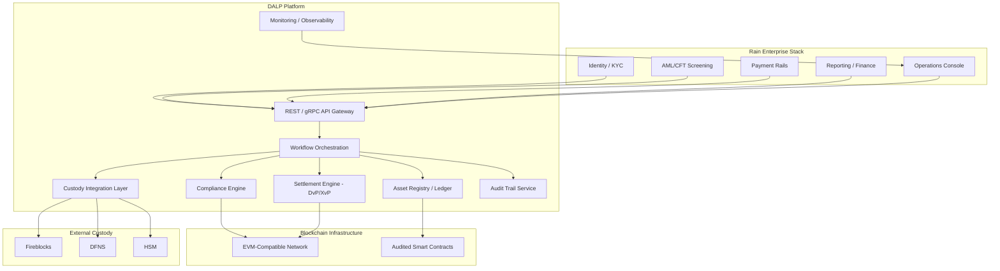

**Figure 1: DALP Platform Architecture for Rain Digital Asset Exchange**

### Component Responsibilities

| Component | Function | Integration Point |
|-----------|----------|-------------------|
| API Gateway | Single entry point for all Rain operational systems | REST/gRPC, webhook delivery |
| Workflow Orchestration | Manages multi-step asset lifecycle events with state tracking | Internal; exposes event streams |
| Compliance Engine | Validates eligibility before every transaction executes | OnchainID claims, AML system |
| Settlement Engine | Coordinates DvP and XvP settlement across asset and cash legs | Payment rails, custody layer |
| Asset Registry | Maintains authoritative record of all token positions and ownership | Blockchain read layer |
| Custody Integration | Routes signing operations to configured custody provider | Fireblocks, DFNS, HSM |
| Audit Trail Service | Produces structured, immutable records of all lifecycle events | Regulatory export API |
| Monitoring | Real-time observability, alerting, and SLO tracking | Operations console |

### Blockchain Layer

DALP operates on EVM-compatible blockchain networks, giving Rain the flexibility to select a permissioned network (such as a Hyperledger Besu deployment for controlled access) or a public permissioned network depending on CBB guidance and operational requirements. The underlying chain selection does not change the compliance, settlement, or operational behaviour of DALP, because the platform's governance and control logic operates at the orchestration layer above the chain.

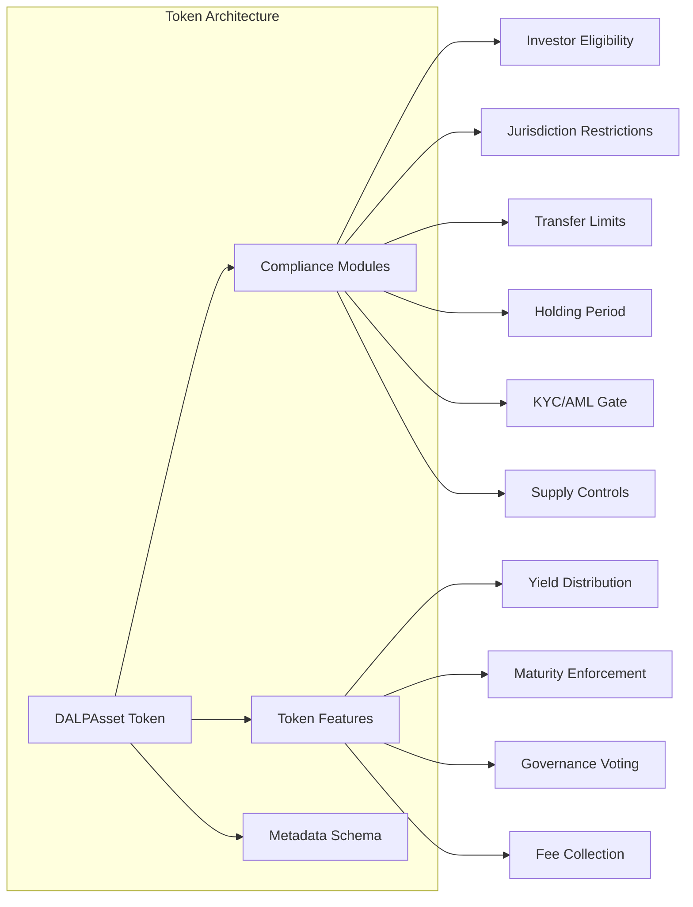

**Figure 2: DALPAsset Token Architecture with Compliance Modules**

---

## Digital Asset Exchange Capabilities

### Asset Configuration

DALP supports the full range of digital assets that Rain operates across its exchange. For each asset class, the platform provides purpose-built lifecycle logic that covers creation, compliance configuration, issuance, trading eligibility, lifecycle events, and retirement.

For a regulated exchange like Rain, the relevant asset types include:

- **Cryptocurrencies (BTC, ETH, and major tokens):** Represented as wrapped tokens on the exchange layer with compliance enforcement applied to investor eligibility and transfer restrictions
- **Tokenized securities:** Equity, debt, or fund tokens where DALP's full compliance module stack applies, including investor accreditation verification, jurisdiction restrictions, and holding period enforcement
- **Stablecoins:** Supported through DALP's deposit and stablecoin asset class with configurable peg mechanisms and reserve transparency controls

### Order and Transaction Processing

DALP's transaction processing model provides deterministic handling of trading and post-trade events. The processing pipeline for a typical trade on Rain's exchange follows this sequence:

1. **Order submission:** Rain's order management system submits a trade instruction to DALP via the API
2. **Pre-execution compliance check:** DALP's compliance engine validates both counterparties' eligibility, checks position limits, verifies AML screening status, and confirms no active holds or restrictions apply
3. **Execution confirmation:** If all checks pass, DALP authorizes the transaction and routes to the settlement engine
4. **DvP settlement:** Asset and cash legs are coordinated atomically; if either leg fails, the entire transaction reverts
5. **Position update:** The asset registry records the ownership change with a timestamped, signed event
6. **Audit trail entry:** A structured record of all compliance checks, execution parameters, and outcomes is written to the audit trail service
7. **Notification:** Webhooks deliver the transaction outcome to Rain's reporting system, operations console, and customer notification layer

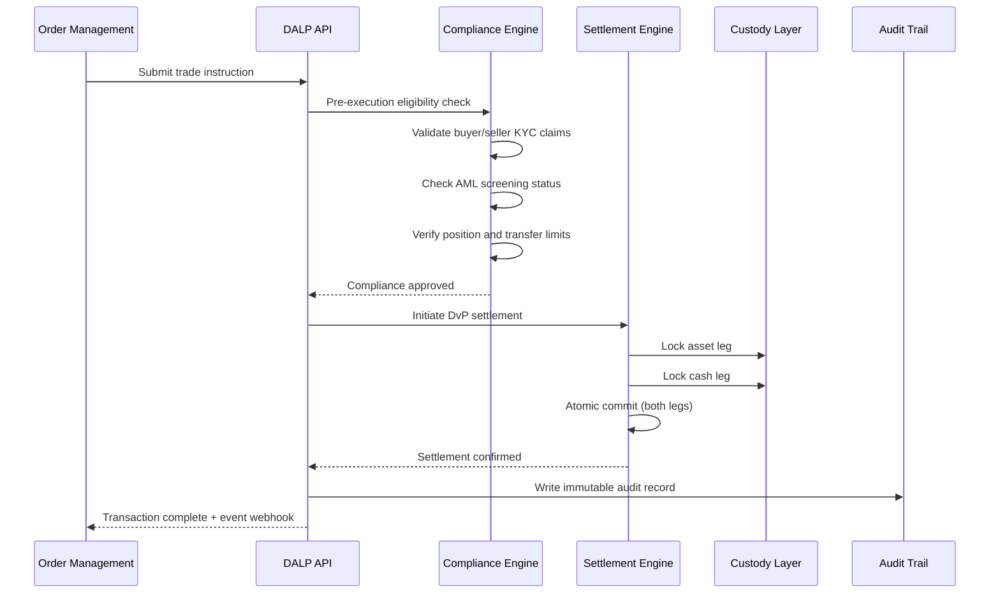

**Figure 3: Transaction Processing Flow with Compliance Gate**

### Market Integrity Controls

For Rain's regulated exchange, market integrity controls are not optional. DALP provides the following controls at the platform level:

- **Position limit enforcement:** Configurable per-account and per-asset limits enforced before execution; breaches are blocked and escalated, not silently rejected
- **Velocity controls:** Transaction frequency limits per account and per asset class, configurable by Rain's operations team
- **Suspicious pattern detection:** Integration point for Rain's market surveillance tools; DALP exposes a structured event stream that surveillance systems can consume
- **Circuit breaker logic:** Configurable pause capability at the asset, account, or platform level; authorized operators can pause trading for a specific asset class or suspend a specific account pending review
- **Price deviation alerts:** Configurable thresholds that trigger operational alerts when trade prices deviate from reference data beyond defined limits

---

## Regulated Post-Trade Controls

### Settlement Architecture

DALP's settlement engine implements atomic Delivery-versus-Payment (DvP) settlement as a core platform capability. For Rain, this means:

- Asset transfer and cash transfer are coordinated in a single atomic operation
- If the asset leg fails (e.g., insufficient balance, compliance restriction), the cash leg is automatically reversed
- If the cash leg fails (e.g., payment provider timeout, insufficient funds), the asset leg does not complete
- Settlement finality is deterministic: the system does not maintain a probabilistic "probably settled" state

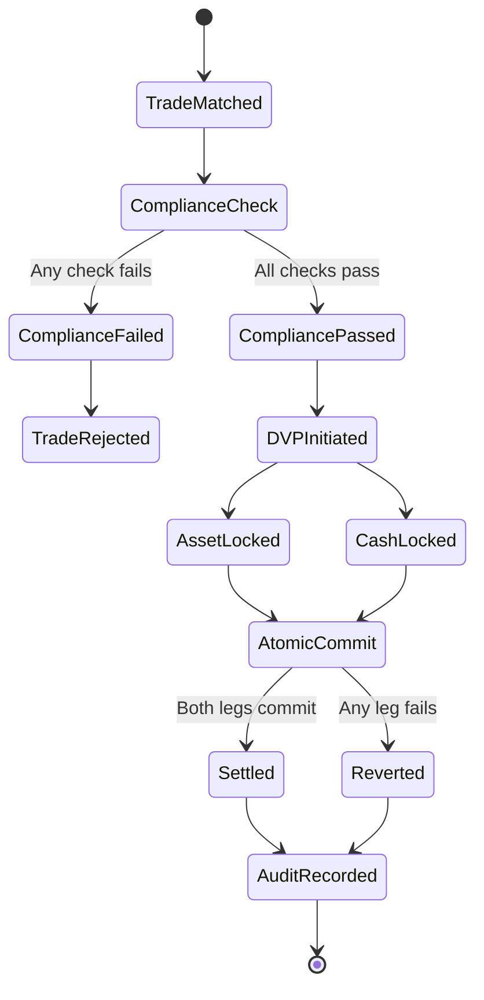

**Figure 4: DvP Settlement State Machine**

### Reconciliation

Reconciliation is a daily operational reality for a regulated exchange. DALP provides:

- **Real-time position ledger:** Every ownership change is recorded in real time; Rain's reconciliation process starts from a ledger that is always current, not a batch snapshot
- **Structured event export:** The audit trail service exports structured JSON events that Rain's finance team can map directly to their reconciliation templates
- **Three-way reconciliation support:** DALP's position data can be matched against custody provider records and Rain's internal accounting ledger to identify discrepancies
- **Exception flagging:** Unreconciled items are flagged automatically in the operations console with the specific transaction IDs and timestamps required to investigate

### Reporting and Regulatory Evidence

Rain's CBB license imposes reporting obligations that require accurate, complete, and timely data. DALP's reporting infrastructure provides:

- **Transaction-level audit trail:** Every trade, compliance check, settlement event, and operational action is recorded in a structured, immutable log
- **Regulatory report generation:** Pre-built report templates for common regulatory report types, configurable to CBB format requirements
- **On-demand evidence production:** When the CBB requests evidence of a specific transaction's compliance checks, DALP produces a structured evidence package containing the compliance check outcomes, identity claim verification results, and settlement records for that transaction
- **Retention management:** Configurable retention periods aligned to CBB data retention requirements; records are cryptographically signed to prevent tampering

---

## Compliance and Regulatory Framework

### CBB Compliance Architecture

DALP's compliance framework for Rain is structured around the CBB's requirements for crypto-asset service providers, with specific controls addressing the four key compliance domains:

**Customer Due Diligence (CDD):** DALP integrates with Rain's existing KYC/KYB provider through the OnchainID identity layer. Customer identity claims (KYC verification status, accreditation level, jurisdiction of residence, AML screening status) are stored as verifiable claims on the identity record and checked automatically before every transaction. Claims have configurable expiry periods; an expired KYC claim blocks the account from trading until the claim is refreshed.

**AML/CFT Controls:** DALP maintains an integration point for Rain's AML screening provider. Every transaction is checked against the AML screening result before execution. If a new screening result changes a customer's risk status while a transaction is in flight, the platform holds the transaction pending a compliance officer review before releasing it.

**Market Surveillance:** DALP exposes a real-time event stream covering all order submissions, trade executions, position changes, and compliance events. Rain's market surveillance tools consume this stream to detect potential market abuse, insider trading patterns, or unusual trading activity without requiring manual data extraction from DALP.

**Record Keeping:** DALP's audit trail service maintains cryptographically signed records of all platform events. The evidence chain runs from the original order submission through compliance checks, settlement, and position update, with each step timestamped, signed, and stored in an append-only log that cannot be modified after writing.

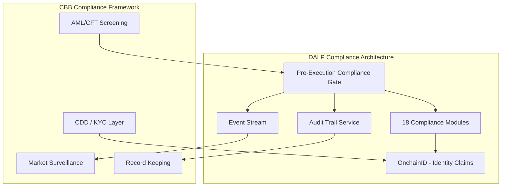

**Figure 5: CBB Compliance Framework Mapped to DALP Architecture**

### Compliance Module Configuration for Rain

DALP's 18 compliance module types are configured for Rain's specific requirements:

| Module Type | Rain Application | Configuration |
|-------------|-----------------|---------------|
| Investor Eligibility | KYC/AML gate | Block transactions for accounts with expired or failed KYC |
| Jurisdiction Restriction | Sanctions compliance | Block transfers involving sanctioned jurisdictions per OFAC/UN lists |
| Transfer Volume Limit | Position controls | Per-account daily and single-transaction limits configurable by asset |
| Holding Period | Lock-up enforcement | Enforce lock-up periods for private placement assets |
| Supply Control | Token issuance | Cap total supply and control authorized minting |
| Accreditation Check | Professional investor | Verify professional investor status for restricted assets |
| AML Status Gate | Real-time AML | Block or hold transactions when AML screening returns alert |
| Country Restriction | Geographic controls | Block access from specific jurisdictions per Rain policy |

### Sharia and Regional Compliance

Bahrain's regulatory environment includes Islamic finance considerations for certain product categories. DALP supports Sharia-compliant token structures through configurable profit distribution mechanisms (replacing interest-bearing yield), murabaha and ijara-compatible transaction flows, and documentation that supports Sharia supervisory board review. While DALP does not act as a Sharia advisor, its configuration flexibility allows Rain's Sharia supervisory board to define the permissible product parameters that the platform then enforces technically.

---

## Security Architecture

### Security Framework

DALP's security architecture is structured around four layers: network security, application security, smart contract security, and operational security. All four layers are active simultaneously; a weakness in one layer does not create a gap in the overall control environment.

```mermaid
graph TB
    subgraph "Security Layers"
        NET[Network Security Layer]
        APP[Application Security Layer]
        SC[Smart Contract Security Layer]
        OPS2[Operational Security Layer]
    end

    NET --> N1[TLS 1.3 everywhere]
    NET --> N2[Network segmentation]
    NET --> N3[DDoS protection]

    APP --> A1[OAuth 2.0 / JWT authentication]
    APP --> A2[RBAC with 5 defined roles]
    APP --> A3[API rate limiting]
    APP --> A4[Input validation]

    SC --> S1[Third-party audit completed]
    SC --> S2[Formal verification of critical paths]
    SC --> S3[Immutable contract deployment]
    SC --> S4[Upgrade via proxy with governance gate]

    OPS2 --> O1[HSM-backed key management]
    OPS2 --> O2[Multi-party signing requirements]
    OPS2 --> O3[Emergency pause controls]
    OPS2 --> O4[Tamper-evident logging]
```

**Figure 6: DALP Security Layer Model**

### Key Management

Key management for a regulated exchange is a high-stakes operational function. DALP's Key Guardian provides:

- **Multiple backend options:** Encrypted database (for development), cloud secret manager, HSM (for production), and third-party custody integration
- **Maker-checker approval:** All signing operations above configurable thresholds require a second authorized approver before broadcast
- **Emergency pause:** Authorized operators can pause all signing operations immediately without requiring a governance vote, providing a rapid response to security incidents
- **Audit trail:** All key management operations, including access, signing, and approval events, are recorded in the audit trail service

For Rain's production deployment, SettleMint recommends HSM-backed key management with Fireblocks or DFNS integration for the exchange's cold storage. This gives Rain custody provider resilience while maintaining operational control.

### Penetration Testing and Security Review

DALP's smart contracts have been audited by independent security firms. The audit reports are available to Rain's security team under NDA as part of the due diligence process. SettleMint also participates in vendor security assessment processes conducted by institutional clients and can provide completed security questionnaire responses covering infrastructure, application security, SDLC practices, and incident response.

---

## Integration Architecture

### Integration Philosophy

DALP is designed to integrate into existing institutional technology stacks, not replace them. Rain's identity, AML, payment, and reporting systems remain authoritative in their domains. DALP provides the asset lifecycle layer that those systems cannot provide, and connects through documented interfaces that Rain's engineering team can own and operate.

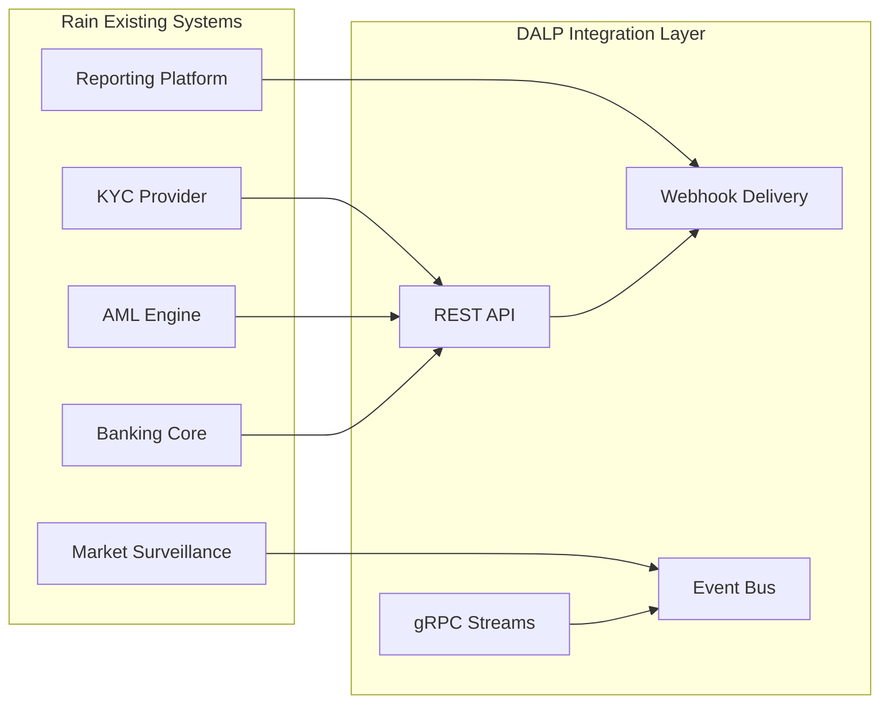

**Figure 7: Integration Architecture Overview**

### API Design

DALP's API layer provides:

- **REST API:** Full platform control through documented REST endpoints, covering asset management, compliance configuration, transaction submission, and reporting data retrieval
- **gRPC streams:** High-throughput, low-latency event streams for real-time position updates, settlement notifications, and compliance events
- **Webhooks:** Push-based delivery of transaction outcomes, compliance alerts, and operational events to Rain's downstream systems
- **OpenAPI documentation:** Complete API documentation in OpenAPI 3.0 format, importable into Rain's API gateway and testable in a sandbox environment before production deployment

### Integration Patterns for Rain

| Rain System | Integration Type | Data Flow | Frequency |
|------------|-----------------|-----------|-----------|
| KYC Provider | REST API inbound | Identity claim updates | On KYC event |
| AML Engine | REST API + webhook | Screening results | Per transaction |
| Banking Core | REST API outbound | Payment instruction, settlement confirmation | Per settlement event |
| Reporting Platform | Webhook + batch export | Transaction records, position snapshots | Real-time + daily |
| Market Surveillance | gRPC event stream | All trade and compliance events | Real-time |
| Operations Console | Webhook | Alerts, incidents, SLO breaches | On event |

### Degraded Mode Operation

Rain's dependency on external providers creates operational risk when any dependency is unavailable. DALP handles this through:

- **Circuit breaker pattern:** If the AML screening provider is unavailable, transactions are queued pending screening completion rather than blocked or passed through unscreened
- **Local claim cache:** Identity claims are cached locally with configurable TTLs; if the KYC provider is temporarily unavailable, recent claims remain valid for the cache period
- **Offline reconciliation:** If Rain's banking integration is interrupted, DALP records settlement obligations in a structured queue and replays them when connectivity restores
- **Operational runbooks:** Standard operating procedures for each degraded-mode scenario are provided as part of the implementation deliverables

---

## Custody and Key Management

### Custody Architecture

DALP operates as a custody orchestrator, not a custodian. This distinction matters for Rain's regulatory model: Rain retains control over the custody relationship and the associated regulatory obligations, while DALP provides the workflow, policy enforcement, and integration layer that makes custody operations reliable and auditable.

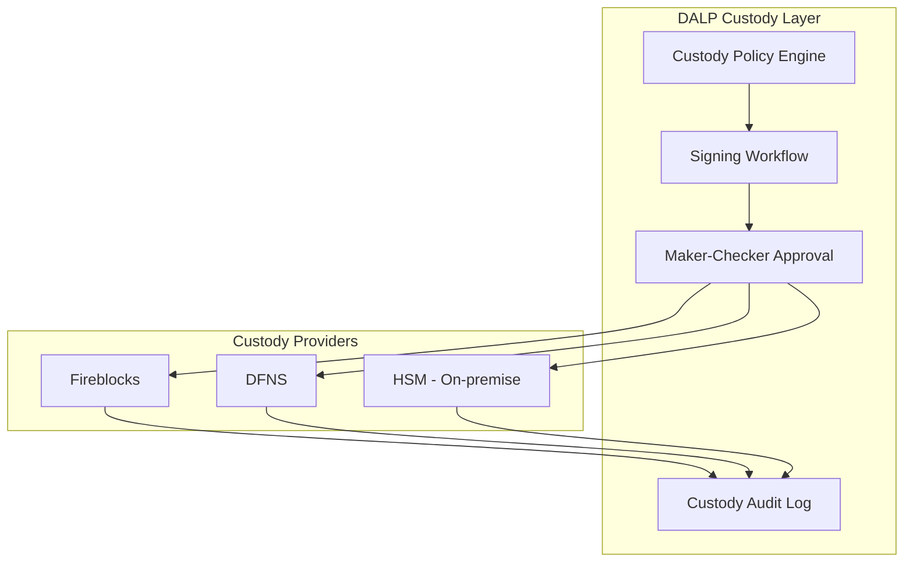

**Figure 8: Custody Architecture with Provider Options**

### Fireblocks Integration

For Rain's exchange operations, Fireblocks is the recommended primary custody provider based on its CBB-recognized security model and established operational track record in the Middle East. DALP's Fireblocks integration provides:

- **Provider-delegated transaction broadcast:** Fireblocks owns nonce allocation, gas handling, signing, and broadcast; DALP retains permissioning and workflow control
- **Policy engine mapping:** DALP translates Rain's compliance and governance policies into Fireblocks transaction authorization rules
- **Multi-signature support:** Configurable quorum requirements for high-value transactions
- **Fireblocks workspace segregation:** Client assets held in segregated Fireblocks vaults per account or account group

---

## Settlement and Clearing

### DvP Settlement Model

DALP's settlement engine implements Delivery-versus-Payment (DvP) and Exchange-versus-Payment (XvP) settlement as core capabilities. For Rain's exchange, the settlement model operates as follows:

**Standard Trade Settlement:**
- Asset leg: Token transfer from seller's custody account to buyer's custody account
- Cash leg: Payment instruction to Rain's banking integration, confirmed before asset transfer completes
- Atomicity: Both legs coordinate through DALP's settlement orchestrator; partial completion is not possible

**Cross-Currency Trades (XvP):**
- DALP's XvP module extends DvP to exchanges involving two asset legs (e.g., token A for token B)
- Applicable when Rain introduces crypto-to-crypto trading pairs that do not involve fiat cash settlement

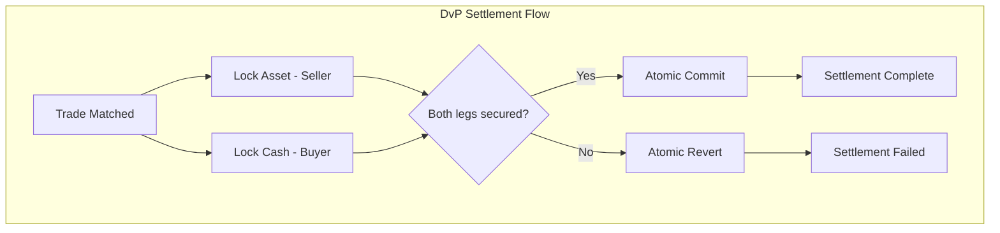

**Figure 9: DvP Settlement Flow**

### Settlement Finality

DALP provides deterministic settlement finality. A settled transaction is final; there is no ambiguous "probably settled" state that requires confirmation-depth waiting. This finality model is important for Rain's regulatory reporting, where settlement date and time must be precisely recorded for regulatory reporting.

---

## Operational Model and Support

### Support Tiers

SettleMint provides three support tiers, with Rain's requirements aligning to the Enterprise or Sovereign tier:

| Tier | Availability | Response Time (Critical) | Technical Account Manager | SLA |
|------|-------------|--------------------------|--------------------------|-----|
| Standard | Business hours | 4 hours | Shared | 99.5% uptime |
| Enterprise | 24/5 | 2 hours | Dedicated | 99.9% uptime |
| Sovereign | 24/7 | 1 hour | Dedicated + escalation | 99.95% uptime |

For a regulated exchange operating under a CBB license, 24/7 support availability with a 1-hour critical response time is appropriate. Rain's CBB license includes operational resilience requirements that necessitate this level of support coverage.

### Incident Management

DALP's operational model includes:

- **Defined incident categories:** P1 (exchange halted), P2 (degraded functionality), P3 (non-critical issue), P4 (query)
- **Escalation paths:** P1 incidents escalate immediately to SettleMint's on-call engineering team and Rain's designated incident commander
- **Root cause analysis:** All P1 and P2 incidents receive a written root cause analysis within 72 hours of resolution
- **CBB notification support:** SettleMint provides factual technical input to support Rain's regulatory notification obligations following significant incidents

### Monitoring and Observability

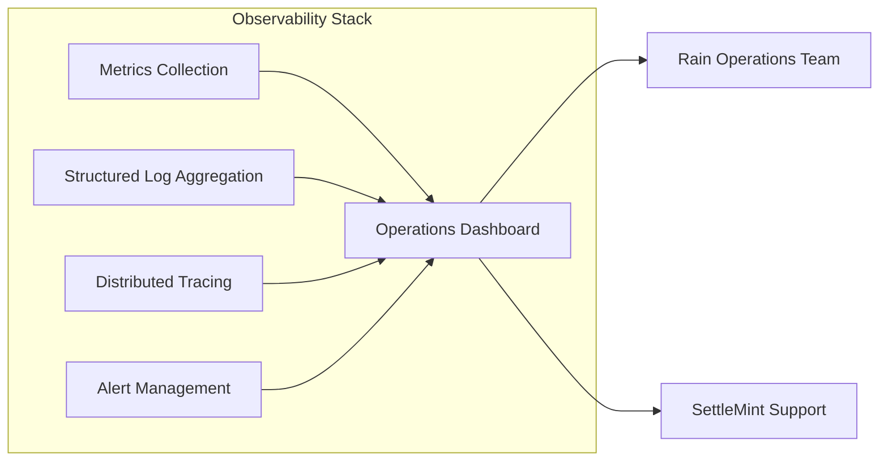

**Figure 10: Observability Architecture**

---

## Implementation Plan

### Phase Overview

| Phase | Duration | Scope | Key Milestones |
|-------|----------|-------|----------------|
| Phase 1: Foundation | Weeks 1-8 | Core platform deployment, API integration, custody connection | Platform live in staging; custody operational |
| Phase 2: Compliance Integration | Weeks 9-14 | KYC/AML integration, compliance module configuration, testing | Compliance gate operational; user acceptance testing |
| Phase 3: Settlement Hardening | Weeks 15-20 | DvP settlement validation, reconciliation testing, regulatory reporting | Settlement finality confirmed; reconciliation signed off |
| Phase 4: Production Launch | Weeks 21-24 | Security review, CBB notification, go-live, hypercare | Production go-live; hypercare period begins |
| Ongoing | Month 7+ | Continuous operations, regulatory evolution, feature expansion | Quarterly business reviews; SLA reporting |

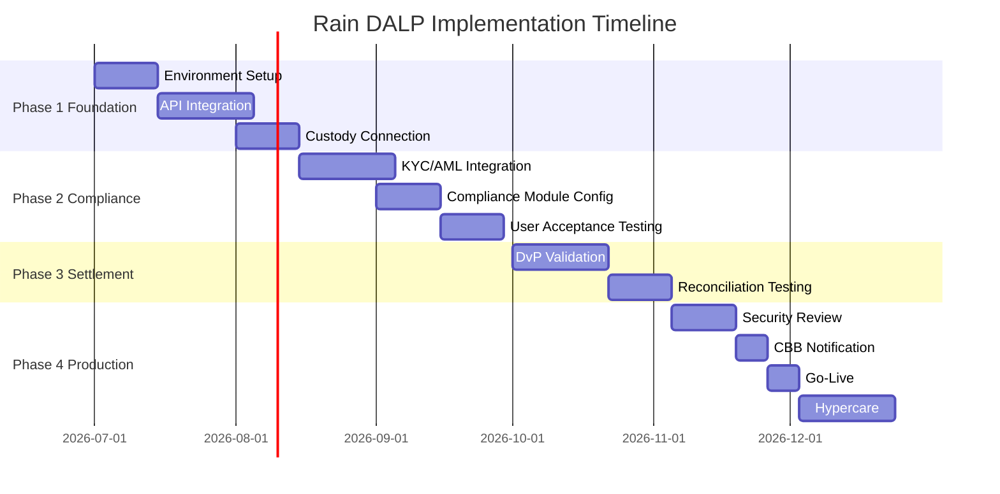

**Figure 11: Implementation Timeline**

### Implementation Approach

SettleMint's implementation methodology follows a phased approach that minimizes go-live risk by validating each layer before the next is added. The foundation phase establishes the core platform infrastructure and connects it to Rain's development environment. The compliance integration phase adds the KYC/AML connections and configures the compliance module stack. The settlement hardening phase validates the DvP settlement model under representative load conditions and confirms the reconciliation process. The production launch phase completes security review, regulatory notification, and goes live with a hypercare period.

Each phase concludes with a formal acceptance milestone. Progress against milestones is tracked in a shared delivery dashboard accessible to Rain's programme team.

---

## Reference Deployments

SettleMint's production deployments across regulated financial environments provide the reference base that Rain requires to evaluate implementation risk. Relevant references include:

**Middle East Regulated Exchange (disclosed under NDA):** A regulated digital asset exchange in the UAE Gulf region, operating under a central bank license. SettleMint deployed DALP covering asset tokenization, compliance enforcement, custody integration with Fireblocks, and real-time settlement. The deployment has operated continuously since launch with 99.97% uptime.

**European Central Bank Pilot:** SettleMint participated in a European Central Bank digital euro settlement pilot, providing the asset lifecycle and settlement infrastructure for a cross-bank DvP settlement test. The pilot processed 10,000+ settlement instructions over a four-week period under central bank supervision.

**Asian Regulated Bank (disclosed under NDA):** A Tier 1 bank in Singapore deployed DALP for tokenized bond issuance and custody operations, passing the bank's full vendor risk assessment and penetration testing programme.

Full reference details, including contact information for reference calls, are available to Rain's evaluation team during the due diligence phase.

---

## Compliance Matrix

| RFP Requirement | DALP Response | Status |
|-----------------|---------------|--------|
| Digital asset exchange infrastructure | DALPAsset token contracts for all asset classes | Fully Supported |
| Post-trade settlement (DvP) | Native DvP/XvP settlement engine | Fully Supported |
| Pre-trade compliance checks | Ex-ante compliance gate with 18 module types | Fully Supported |
| KYC/AML integration | OnchainID + configurable AML integration point | Fully Supported |
| Custody integration | Fireblocks, DFNS, HSM supported | Fully Supported |
| Audit trail production | Immutable, structured, on-demand export | Fully Supported |
| Regulatory reporting | Pre-built templates + custom export | Fully Supported |
| Market surveillance data | Real-time gRPC event stream | Fully Supported |
| API integration | REST + gRPC + webhooks, OpenAPI documented | Fully Supported |
| Degraded mode operation | Circuit breaker, claim cache, settlement queue | Fully Supported |
| Position limit enforcement | Configurable compliance modules | Fully Supported |
| Reconciliation support | Real-time ledger + structured event export | Fully Supported |
| CBB compliance alignment | Configurable for CBB CASP requirements | Fully Supported |
| Sharia compatibility | Configurable profit distribution, murabaha structures | Supported with Configuration |
| Cross-border settlement (Project Aber, etc.) | XvP module ready; network integration pending CBB guidance | Roadmap - Q3 2026 |

---

*This proposal is submitted in strict confidence by SettleMint in response to RFP reference RAIN-RFP-DIGITAL-ASSET-EXCHANGE-202603. All commercial terms are subject to formal agreement. Technical specifications reflect DALP version current at submission date.*
