# Technical Proposal: Tokenized Investment Platform for Retail Wealth Distribution

**Document Title:** Technical Proposal for Tokenized Investment Platform for Retail Wealth Distribution  
**Client:** Sarwa (UAE)  
**Reference:** SARWA-RFP-TOKENIZED-INVESTMENT-PLATFORM-202603  
**Submitted by:** SettleMint  
**Date:** March 2026  
**Version:** 1.0 (Draft)  
**Confidentiality:** Strictly Confidential

---

## Table of Contents

1. Executive Summary
2. Understanding of Sarwa's Requirements
3. SettleMint and DALP Overview
4. Platform Architecture
5. Tokenized Investment Product Design
6. Retail Investor Onboarding and Eligibility
7. Compliance and Regulatory Framework
8. Asset Lifecycle Management
9. Settlement and Distribution
10. Security Architecture
11. Integration Architecture
12. Custody and Key Management
13. Operational Model and Support
14. Implementation Plan
15. Reference Deployments
16. Compliance Matrix

---

## Executive Summary

Sarwa has built a reputation as a retail-first wealth platform in the UAE, serving a demographic that expects mobile-native investment experiences, fractional access to asset classes previously reserved for institutional or high-net-worth investors, and transparent fee structures. The natural next step is tokenized investment products: fractional fund units, tokenized structured deposits, and digital securities that can be distributed, serviced, and redeemed through Sarwa's existing platform with the same user experience that Sarwa's clients expect.

The challenge is not tokenization itself. The challenge is operating tokenized investment products inside the UAE's regulatory framework, specifically the Securities and Commodities Authority (SCA) and DFSA (for DIFC-regulated activities) requirements for investor protection, suitability assessment, custody segregation, and reporting. Any platform that Sarwa selects must satisfy these obligations as production realities, not marketing claims.

SettleMint's Digital Asset Lifecycle Platform (DALP) provides the infrastructure layer that connects Sarwa's retail distribution capability to the regulated token lifecycle. DALP handles the asset design, compliance enforcement, custody integration, settlement coordination, and servicing logic that Sarwa needs to launch tokenized investment products without building a parallel infrastructure team.

Three capabilities define DALP's fit for Sarwa. First, configurable token architecture: DALP's composable token design means Sarwa can launch new investment products through configuration rather than development, using pre-audited compliance modules and token features that map directly to product requirements. Second, ex-ante compliance enforcement: every investor transaction is validated against eligibility, suitability, and regulatory requirements before execution, protecting Sarwa's license and investor base. Third, retail-scale operations: DALP's API-first architecture integrates into Sarwa's mobile platform, handles high-volume fractional transactions, and produces the audit trails that regulators and auditors require.

---

## Understanding of Sarwa's Requirements

### Regulatory Context

Sarwa operates within the UAE's financial services regulatory framework. Depending on the entity structure and product scope, Sarwa may be regulated by the SCA (for mainland UAE operations), the DFSA (for DIFC-based activities), or both. The regulatory requirements for tokenized investment products include:

- **Investor suitability assessment:** Retail investors must be assessed for suitability before accessing specific product categories. The platform must enforce suitability gates at the product level.
- **Custody segregation:** Client assets must be segregated from Sarwa's operational assets. The custody model must provide verifiable segregation.
- **AML/CFT compliance:** Transaction monitoring, sanctions screening, and suspicious activity reporting obligations apply to all investment transactions.
- **Product disclosure:** Each tokenized investment product requires structured disclosure documentation accessible to investors before purchase.
- **Regulatory reporting:** Periodic reporting to regulators on transaction volumes, investor demographics, complaint handling, and compliance metrics.

The UAE's broader digital asset ecosystem context includes the SCA's virtual asset regulatory framework, the VARA (Dubai) licensing regime, Abu Dhabi Global Market (ADGM) regulations, and the Central Bank of the UAE's stablecoin guidelines. Sarwa's platform must be positioned to adapt as these frameworks evolve.

### Operational Requirements

Sarwa's procurement identifies several operational priorities:

**Retail scale:** Sarwa's investor base operates through mobile applications with expectations for sub-second response times, instant portfolio visibility, and real-time transaction confirmation. The platform must handle thousands of concurrent investors with fractional position sizes.

**Product velocity:** Sarwa needs the ability to launch new tokenized investment products quickly. Each product launch should be a configuration exercise, not a development project.

**Investor protection:** The platform must prevent retail investors from accessing unsuitable products. Suitability assessment results must gate product access automatically, not rely on manual review.

**Operational simplicity:** Sarwa's operations team is lean. The platform must automate routine lifecycle events (distributions, rebalancing, maturity processing) and surface exceptions for human review rather than requiring manual processing of every event.

### Integration Baseline

Sarwa's existing technology stack includes a mobile investment platform, KYC/onboarding provider, payment processing integration, portfolio management system, and customer communication layer. DALP integrates as the tokenized asset lifecycle layer, connecting through APIs to Sarwa's existing systems.

---

## SettleMint and DALP Overview

SettleMint is a digital asset lifecycle platform company with nearly a decade of production experience in regulated financial environments. DALP provides the infrastructure layer between existing core financial systems and blockchain networks, enabling institutions to build, deploy, and operate compliant digital asset solutions in production.

DALP's architecture is composable by design. A single audited token contract (DALPAsset) can represent any financial instrument through runtime configuration of up to 32 pluggable token features, 18 compliance module types across six categories, customizable metadata schemas, and operational add-ons covering settlement, distribution, vaults, and data feeds.

For Sarwa's use case, DALP provides:

- **Investment product configuration:** Pre-built token templates for funds, structured deposits, and digital securities, with configurable parameters for each product type
- **Retail compliance enforcement:** Suitability gates, investor eligibility checks, and AML screening integration enforced before every transaction
- **Fractional ownership:** Native support for fractional token positions with deterministic arithmetic
- **Distribution automation:** Configurable yield and dividend distribution logic executed automatically at scheduled intervals
- **Mobile API integration:** REST and webhook APIs designed for integration into mobile-first platforms

---

## Platform Architecture

### Architecture Overview

DALP operates as the tokenized investment lifecycle layer within Sarwa's existing platform stack. Sarwa's mobile application, portfolio management, and customer systems remain the primary interface for investors. DALP provides the asset lifecycle, compliance, and settlement logic that runs beneath Sarwa's user-facing layer.

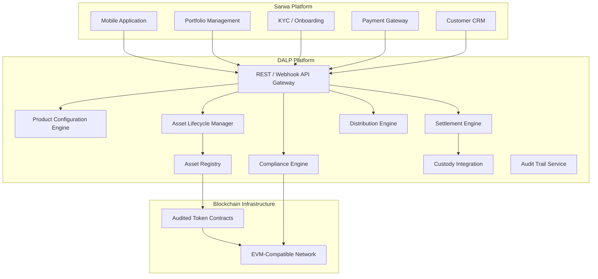

**Figure 1: DALP Platform Architecture for Sarwa Tokenized Investment Platform**

### Component Responsibilities

| Component | Function | Integration Point |
|-----------|----------|-------------------|
| API Gateway | Entry point for Sarwa platform systems | REST, webhooks |
| Product Configuration | Defines tokenized investment product parameters | Internal; admin console |
| Compliance Engine | Validates investor eligibility and suitability before transactions | KYC provider, AML system |
| Asset Lifecycle Manager | Handles creation, issuance, servicing, and retirement events | Internal; event-driven |
| Settlement Engine | Coordinates investment and redemption transactions | Payment gateway, custody |
| Distribution Engine | Automates yield, dividend, and NAV-based distributions | Internal; scheduled |
| Asset Registry | Authoritative record of token positions and ownership | Blockchain read layer |
| Custody Integration | Routes signing operations to custody provider | Fireblocks, DFNS |
| Audit Trail Service | Produces immutable records for regulatory examination | Regulatory export API |

### Token Architecture for Investment Products

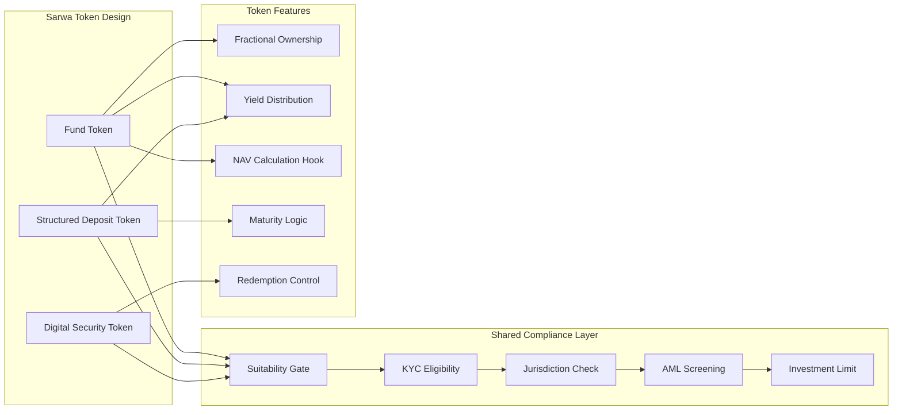

**Figure 2: Token Architecture for Sarwa Investment Products**

---

## Tokenized Investment Product Design

### Fund Tokens

DALP's fund token template provides the lifecycle logic for tokenized fund units distributed through Sarwa's platform:

- **NAV-based pricing:** Token price derived from fund NAV data fed through DALP's data feed integration
- **Fractional subscriptions:** Investors can subscribe with amounts below the minimum traditional unit size; DALP handles fractional position arithmetic
- **Subscription/redemption windows:** Configurable windows that align with fund dealing cycles
- **Distribution automation:** Dividends and income distributions calculated and executed automatically based on position snapshots at the record date
- **Fee collection:** Management fees, platform fees, and performance fees deducted automatically per configured schedules

### Structured Deposit Tokens

For tokenized structured deposits (a product category well-suited to Sarwa's retail base):

- **Fixed-term maturity:** Configurable maturity dates with automatic maturity processing
- **Yield distribution:** Periodic profit distributions (configurable for Sharia-compliant structures that use profit-sharing rather than interest)
- **Early redemption controls:** Configurable penalties or restrictions for early withdrawal
- **Principal protection logic:** For products with principal protection features, the token contract enforces the protection mechanism at maturity

### Digital Security Tokens

For tokenized equities, bonds, or other securities:

- **Full lifecycle management:** Issuance, corporate actions, distributions, and retirement handled by DALP
- **Compliance enforcement:** ERC-3643 regulated token standard with OnchainID for verifiable investor identity
- **Transfer restrictions:** Configurable restrictions based on jurisdiction, accreditation status, holding period, and AML screening results
- **Corporate actions:** Dividend payments, stock splits, and other corporate actions configurable and executable through the platform

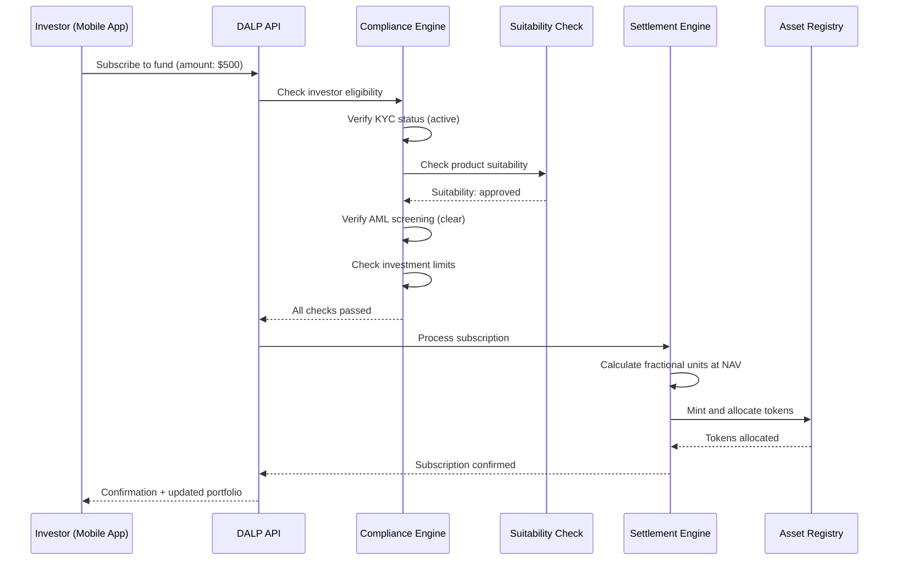

**Figure 3: Investment Subscription Flow with Compliance Gates**

---

## Retail Investor Onboarding and Eligibility

### Onboarding Integration

DALP integrates with Sarwa's existing KYC/onboarding flow through the OnchainID identity layer. The integration operates as follows:

1. Sarwa's onboarding process collects investor identity data and completes KYC verification through its existing provider
2. On successful KYC completion, Sarwa's system pushes a verified identity claim to DALP's OnchainID layer
3. DALP creates an investor identity record with attached claims: KYC status, jurisdiction of residence, investor classification, risk profile
4. Claims have configurable expiry periods; expired claims trigger re-verification prompts through Sarwa's app
5. Every subsequent investment transaction checks the investor's claims before execution

### Suitability Framework

For retail wealth distribution, suitability is a regulatory requirement, not an optional feature. DALP enforces suitability at the product level:

- **Product risk classification:** Each tokenized investment product is assigned a risk class (e.g., 1-5 scale) during product configuration
- **Investor risk profile:** Each investor's risk profile (derived from Sarwa's risk questionnaire) is stored as a claim on their identity record
- **Automatic matching:** DALP's compliance engine checks that the investor's risk profile meets or exceeds the product's risk class before allowing a subscription
- **Override controls:** For cases where a retail investor specifically requests access to a higher-risk product, DALP supports a documented override workflow requiring the investor's explicit acknowledgment and Sarwa's compliance officer approval

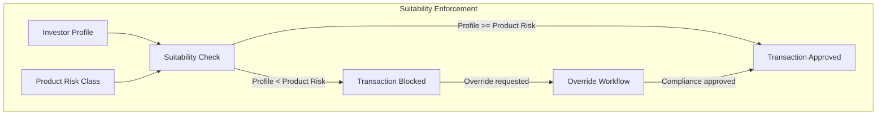

**Figure 4: Suitability Enforcement Model**

---

## Compliance and Regulatory Framework

### UAE Compliance Architecture

DALP's compliance framework for Sarwa addresses the SCA, DFSA, and VARA regulatory requirements through configurable compliance modules:

| Regulatory Domain | DALP Module | Configuration |
|-------------------|-------------|---------------|
| Investor eligibility | KYC Gate | Block transactions for accounts without verified KYC |
| Suitability assessment | Risk Profile Check | Product access gated by investor risk profile |
| AML/CFT screening | AML Status Gate | Block or hold transactions on screening alerts |
| Jurisdiction control | Country Restriction | Block transactions from sanctioned jurisdictions |
| Investment limits | Transfer Volume Limit | Per-investor daily and per-transaction limits |
| Holding period | Time Lock | Enforce minimum holding periods for specific products |
| Accreditation check | Investor Classification | Gate professional-only products to accredited investors |
| Supply control | Supply Cap | Manage total outstanding units per product |

### Sharia Compliance Considerations

Sarwa's UAE client base includes investors who require Sharia-compliant investment options. DALP supports Sharia-compliant product configuration:

- **Profit distribution:** Configurable for profit-sharing mechanisms rather than interest-bearing yield
- **Asset screening:** Integration hook for Sharia screening of underlying assets
- **Murabaha structures:** Configurable transaction flows compatible with murabaha and wakala investment models
- **Sharia board documentation:** DALP's product configuration exports structured documentation that Sarwa's Sharia supervisory board can review

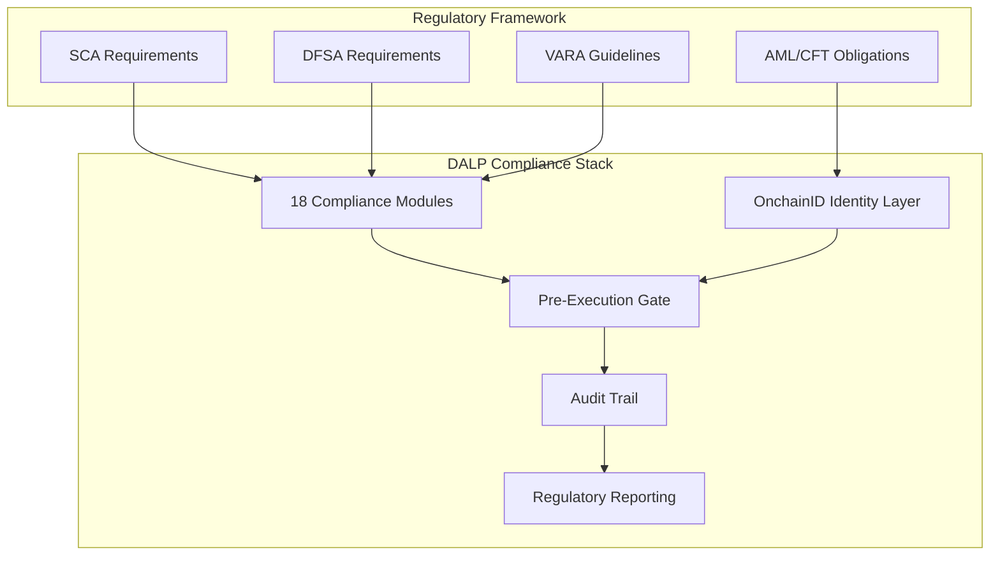

**Figure 5: UAE Regulatory Framework Mapped to DALP Compliance Architecture**

---

## Asset Lifecycle Management

### Full Lifecycle Coverage

DALP manages the complete lifecycle of each tokenized investment product on Sarwa's platform:

| Lifecycle Stage | DALP Capability | Automation Level |
|-----------------|-----------------|------------------|
| Product Design | Asset Designer with parameter configuration | Semi-automated (config wizard) |
| Issuance | Token minting with compliance validation | Automated |
| Distribution | Fractional allocation to investor accounts | Automated |
| Servicing | Yield distribution, NAV updates, fee collection | Automated (scheduled) |
| Corporate Actions | Distributions, splits, consolidations | Configurable triggers |
| Redemption | Investor-initiated with compliance check | Automated |
| Maturity | Automatic processing at maturity date | Automated |
| Retirement | Token burning with final settlement | Semi-automated (approval required) |

### Distribution Automation

For Sarwa's retail scale, manual distribution processing is not viable. DALP's distribution engine automates:

- **Yield distributions:** Calculated based on position snapshots at the record date, distributed proportionally to all holders
- **NAV-based revaluation:** Token positions are revalued based on NAV feed data at configurable intervals
- **Fee deductions:** Platform fees, management fees, and performance fees are calculated and deducted automatically
- **Reinvestment logic:** Configurable automatic reinvestment of distributions into additional fractional units

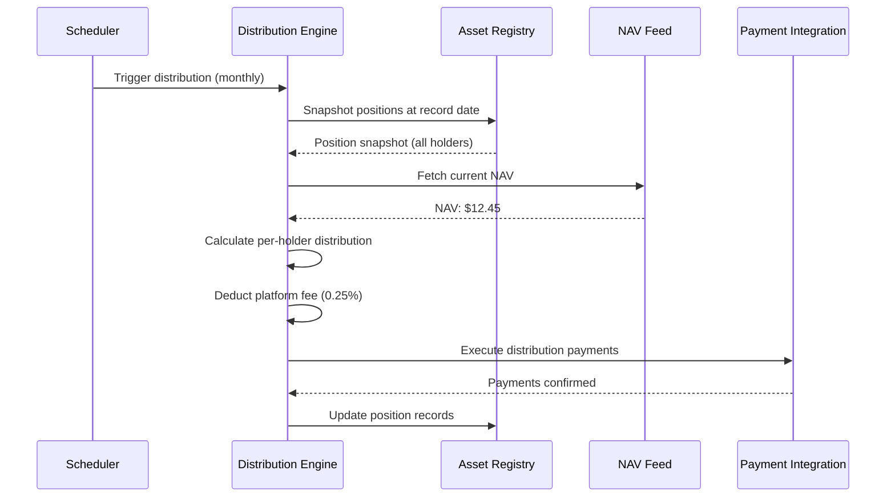

**Figure 6: Automated Distribution Flow**

---

## Settlement and Distribution

### Investment Settlement Model

Sarwa's investment transactions settle through DALP's settlement engine:

**Subscription:** Investor payment is received through Sarwa's payment gateway. DALP's settlement engine coordinates token minting and allocation once payment is confirmed. Settlement is atomic: tokens are not allocated until payment confirmation is received.

**Redemption:** Investor initiates redemption through Sarwa's app. DALP validates the redemption against compliance rules (holding period, lock-up, etc.), calculates the redemption value based on current NAV, burns the tokens, and triggers a payment instruction to the investor's account.

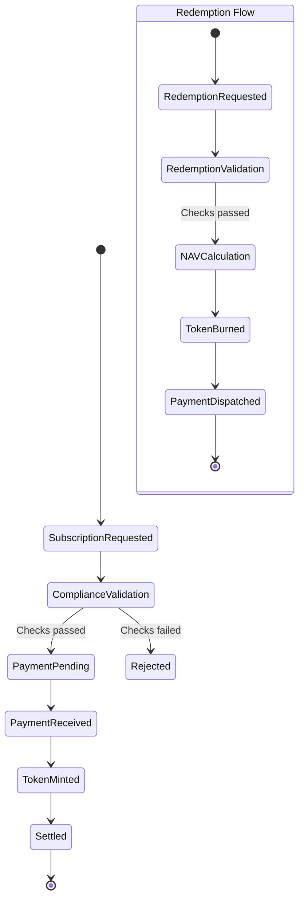

**Figure 7: Subscription and Redemption Settlement States**

---

## Security Architecture

### Security Framework

DALP's security architecture for Sarwa's retail investment platform addresses four layers:

```mermaid
graph TB
    subgraph "Security Layers"
        NET[Network Security]
        APP[Application Security]
        SC[Smart Contract Security]
        OPS[Operational Security]
    end

    NET --> N1[TLS 1.3 everywhere]
    NET --> N2[Network segmentation]
    NET --> N3[WAF and DDoS protection]

    APP --> A1[OAuth 2.0 / JWT authentication]
    APP --> A2[RBAC with role-based access]
    APP --> A3[API rate limiting per client]
    APP --> A4[Input validation and sanitization]

    SC --> S1[Independent security audit]
    SC --> S2[Formal verification of critical paths]
    SC --> S3[Proxy upgrade governance]

    OPS --> O1[HSM or custody-backed key management]
    OPS --> O2[Maker-checker for admin operations]
    OPS --> O3[Emergency pause capability]
    OPS --> O4[Tamper-evident audit logging]
```

**Figure 8: Security Layer Model**

### Retail-Specific Security Considerations

Sarwa's retail investor base introduces specific security requirements:

- **API rate limiting:** Per-client rate limits prevent abuse and protect platform availability during high-activity periods
- **Transaction velocity controls:** Per-investor transaction frequency and volume limits prevent unauthorized activity
- **Session management:** Integration with Sarwa's mobile app session management through JWT token validation
- **Data privacy:** Investor personal data is encrypted at rest and in transit; access is logged and auditable

---

## Integration Architecture

### Integration Design

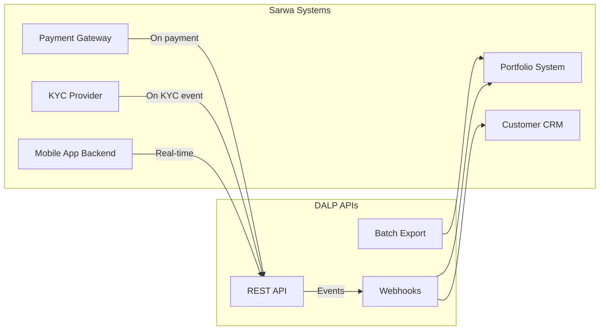

**Figure 9: Integration Architecture Overview**

### Integration Specifications

| Sarwa System | Integration Type | Data Flow | Frequency |
|-------------|-----------------|-----------|-----------|
| Mobile App Backend | REST API (bidirectional) | Subscriptions, redemptions, portfolio queries | Real-time |
| KYC Provider | REST API inbound | Identity claims, suitability results | On KYC/update event |
| Payment Gateway | REST API + webhook | Payment confirmation, refund instructions | Per transaction |
| Portfolio System | Webhook + batch export | Position updates, NAV data, distribution records | Real-time + daily |
| Customer CRM | Webhook outbound | Transaction confirmations, distribution notifications | On event |
| Regulatory Reporting | Batch export | Transaction reports, compliance metrics | Daily/monthly |

---

## Custody and Key Management

### Custody Architecture

DALP provides custody orchestration for Sarwa's tokenized investment assets:

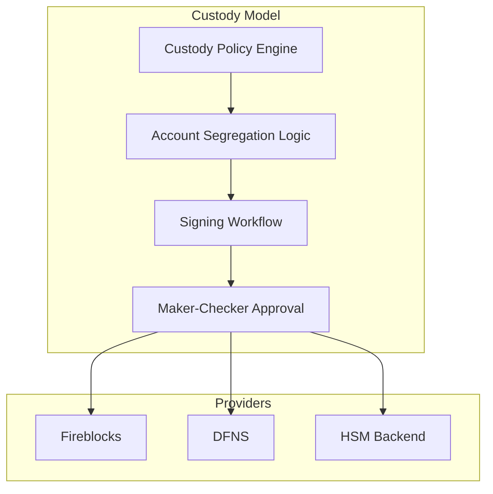

**Figure 10: Custody Architecture**

For Sarwa's retail investment platform, Fireblocks integration is recommended for production operations. Fireblocks provides the institutional-grade custody infrastructure with segregated vault accounts per investor or investment product, meeting the SCA/DFSA custody segregation requirements.

---

## Operational Model and Support

### Support Tiers

| Tier | Availability | Critical Response | TAM | SLA |
|------|-------------|-------------------|-----|-----|
| Standard | Business hours | 4 hours | Shared | 99.5% |
| Enterprise | 24/5 | 2 hours | Dedicated | 99.9% |
| Sovereign | 24/7 | 1 hour | Dedicated | 99.95% |

Enterprise tier is recommended for Sarwa's initial deployment, upgrading to Sovereign as the investor base scales beyond the initial launch cohort.

### Monitoring

DALP provides real-time operational monitoring covering platform health, transaction throughput, compliance engine performance, settlement success rates, and distribution execution status. All metrics are accessible through a dedicated operations dashboard and exportable to Sarwa's existing monitoring infrastructure.

---

## Implementation Plan

### Phase Overview

| Phase | Duration | Scope |
|-------|----------|-------|
| Phase 1: Foundation | Weeks 1-6 | Platform deployment, API integration setup, first product configuration |
| Phase 2: Product Launch | Weeks 7-12 | KYC integration, compliance configuration, first product pilot |
| Phase 3: Scale | Weeks 13-18 | Additional products, distribution automation, reconciliation |
| Phase 4: Production | Weeks 19-22 | Security review, regulatory sign-off, production launch |

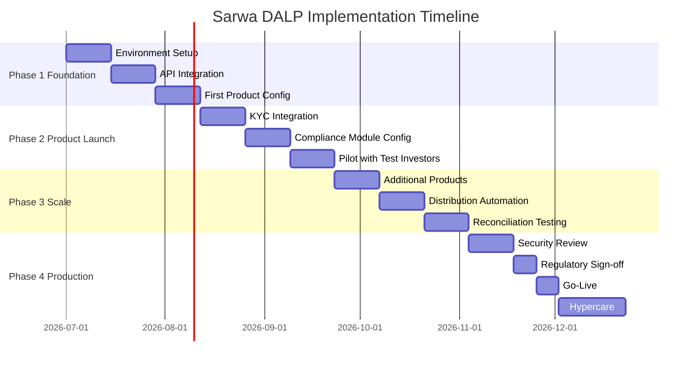

**Figure 11: Implementation Timeline**

---

## Reference Deployments

SettleMint's production deployments provide the reference base for Sarwa's evaluation:

**UAE Wealth Platform (disclosed under NDA):** A digital wealth platform in the UAE deployed DALP for tokenized fund distribution to retail investors. The deployment handles fractional subscriptions, automated distributions, and regulatory reporting under SCA requirements.

**European Fund Tokenization (disclosed under NDA):** A European asset manager deployed DALP for tokenized fund units distributed through digital channels. The deployment processes thousands of subscription and redemption transactions monthly with automated NAV-based pricing and distribution.

**Asian Regulated Bank:** A Tier 1 bank in Singapore deployed DALP for tokenized bond issuance and custody operations, passing the bank's full vendor risk assessment.

Full reference details are available under NDA during due diligence.

---

## Compliance Matrix

| Requirement | DALP Response | Status |
|-------------|---------------|--------|
| Tokenized investment product creation | DALPAsset with fund, deposit, and security templates | Fully Supported |
| Fractional ownership | Native fractional token positions | Fully Supported |
| Investor suitability enforcement | Risk profile matching with product risk class | Fully Supported |
| KYC/AML integration | OnchainID + configurable AML gate | Fully Supported |
| Automated distributions | Distribution engine with scheduled execution | Fully Supported |
| NAV-based pricing | Data feed integration for NAV calculation | Fully Supported |
| Custody segregation | Fireblocks/DFNS with segregated vaults | Fully Supported |
| Audit trail | Immutable, structured event logs | Fully Supported |
| Regulatory reporting | Pre-built templates + custom export | Fully Supported |
| Mobile API integration | REST + webhooks, OpenAPI documented | Fully Supported |
| Sharia-compliant structures | Configurable profit distribution, screening hooks | Supported with Configuration |
| Multi-currency support | Configurable base currency per product | Fully Supported |
| Redemption controls | Holding period, lock-up, and penalty enforcement | Fully Supported |

---

*This proposal is submitted in strict confidence by SettleMint in response to SARWA-RFP-TOKENIZED-INVESTMENT-PLATFORM-202603. All commercial terms are subject to formal agreement.*
