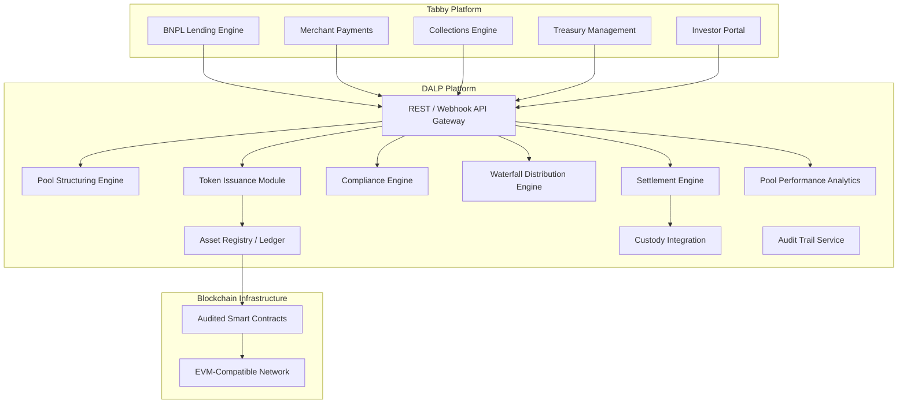
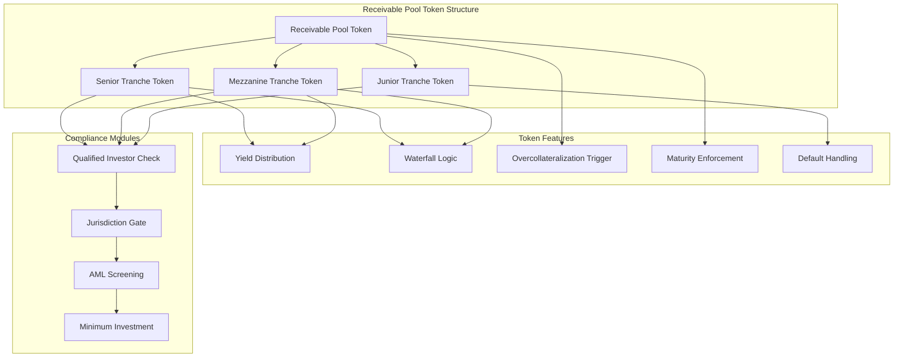
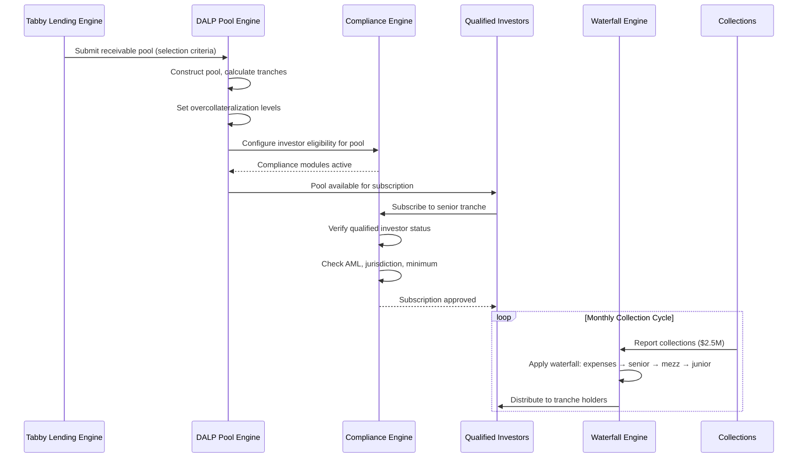
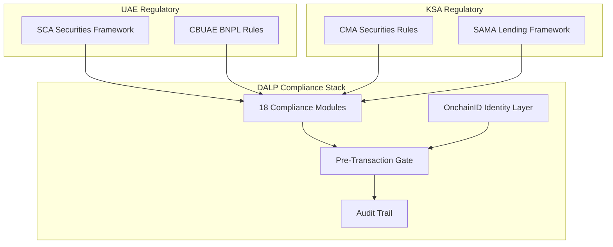
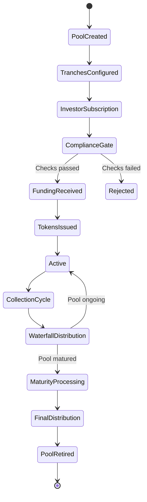
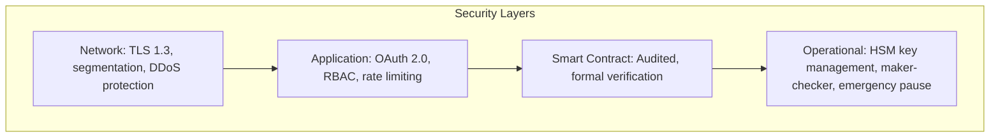
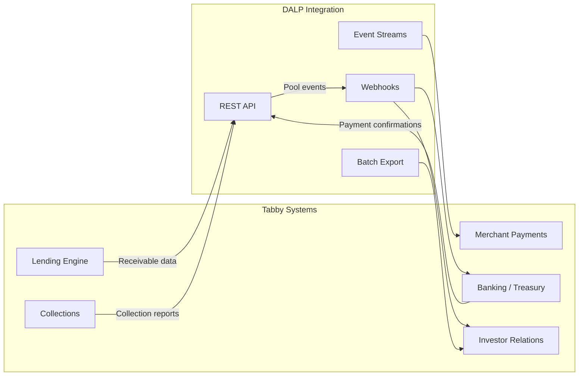
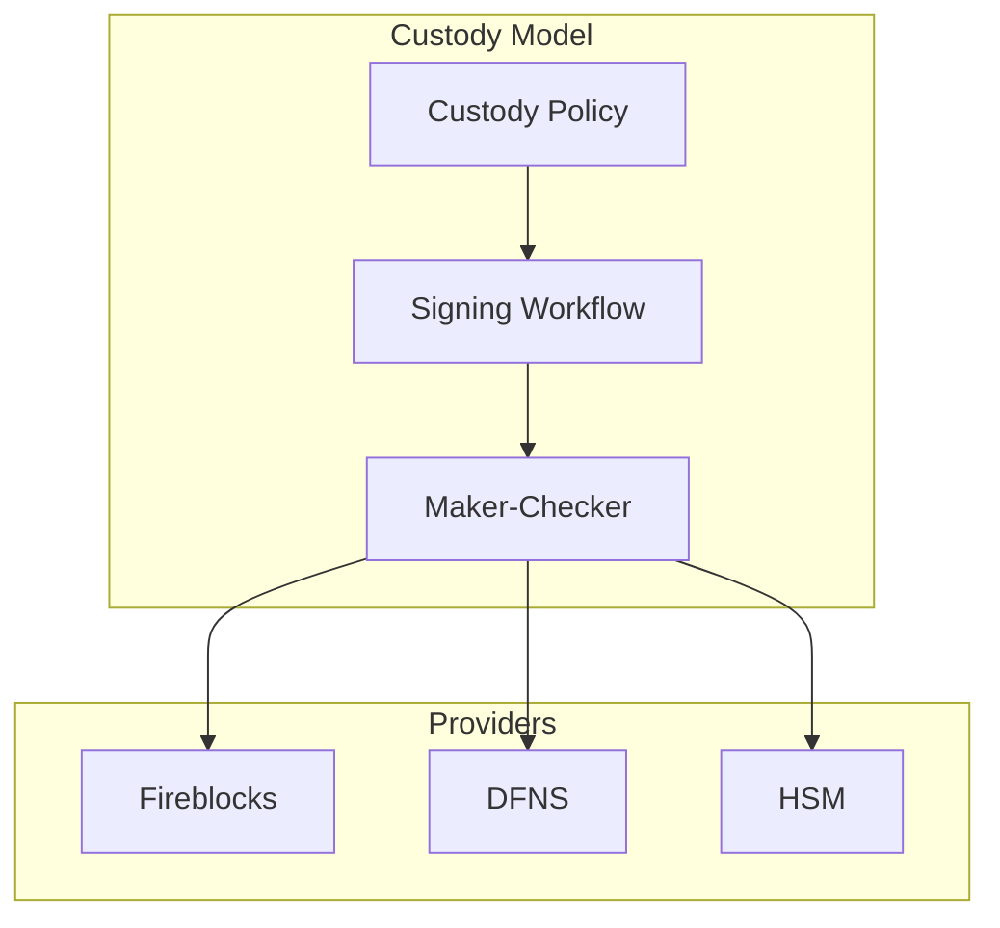
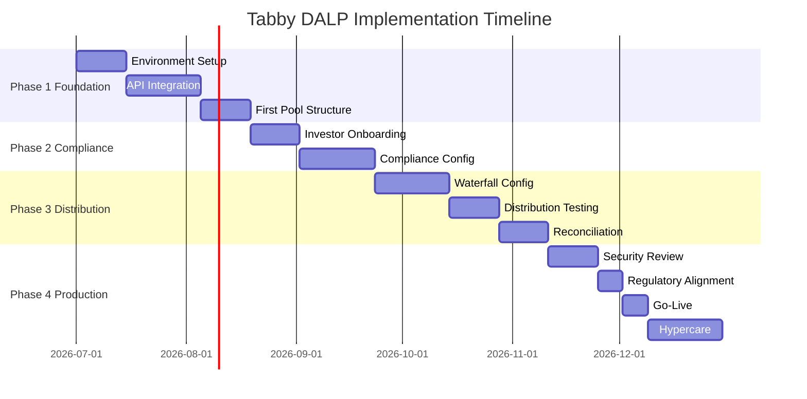

# Technical Proposal: Tokenized BNPL Funding and Receivables Infrastructure

**Document Title:** Technical Proposal for Tokenized BNPL Funding and Receivables Infrastructure  
**Client:** Tabby (UAE/KSA)  
**Reference:** TABBY-RFP-TOKENIZED-BNPL-INFRASTRUCTURE-202603  
**Submitted by:** SettleMint  
**Date:** March 2026  
**Version:** 1.0 (Draft)  
**Confidentiality:** Strictly Confidential

---

## Table of Contents

1. Executive Summary
2. Understanding of Tabby's Requirements
3. SettleMint and DALP Overview
4. Platform Architecture
5. Tokenized Receivables Design
6. BNPL Funding Lifecycle
7. Compliance and Regulatory Framework
8. Settlement and Treasury Integration
9. Security Architecture
10. Integration Architecture
11. Custody and Key Management
12. Investor and Funder Portal
13. Operational Model and Support
14. Implementation Plan
15. Reference Deployments
16. Compliance Matrix

---

## Executive Summary

Tabby has established itself as one of the leading buy-now-pay-later (BNPL) providers in the UAE and KSA, serving millions of consumers and thousands of merchants. Growth at this scale creates a fundamental financing challenge: the receivables portfolio grows faster than traditional funding lines can scale. Bank warehouse facilities require lengthy approval cycles, carry restrictive covenants, and limit the investor base to a handful of institutional lenders.

Tokenized receivables solve this by converting Tabby's BNPL receivable pools into structured, tradeable digital securities that can be distributed to a broader set of institutional and qualified investors. Each token represents a fractional interest in a defined receivable pool, with payment flows, default handling, and waterfall distribution logic encoded in the token's lifecycle rules. The result is faster access to capital, more diversified funding sources, and a transparent asset structure that investors and regulators can verify independently.

SettleMint's DALP platform provides the infrastructure to tokenize, distribute, and service Tabby's BNPL receivable pools. DALP handles the receivable pool structuring, token issuance, compliance enforcement for qualified investors, payment waterfall distribution, and the audit trail that Tabby's regulators and funding partners require. The platform is not a conceptual framework; it operates in production at regulated institutions handling real asset lifecycles.

Three capabilities make DALP the right fit. First, configurable receivable structures: DALP's composable token architecture models the economics of BNPL receivable pools, including senior/subordinated tranches, overcollateralization triggers, and waterfall payment logic. Second, investor compliance: every funder is validated against eligibility requirements before gaining access to receivable tokens, protecting Tabby's regulatory standing. Third, payment distribution automation: DALP's distribution engine processes merchant payment collections and allocates cash flows to token holders according to the configured waterfall, automatically and with full audit trail.

---

## Understanding of Tabby's Requirements

### Regulatory Context

Tabby operates across two jurisdictions with distinct regulatory requirements:

**UAE (SCA, CBUAE):** The Central Bank of UAE's BNPL regulatory framework establishes licensing requirements, consumer protection obligations, and capital adequacy expectations. Tokenization of BNPL receivables falls within the SCA's virtual asset and securities regulatory perimeter, requiring compliance with investor eligibility, disclosure, and reporting requirements.

**KSA (SAMA, CMA):** The Saudi Central Bank (SAMA) regulates payment and lending activities, while the Capital Markets Authority (CMA) oversees securities issuance. Tokenized receivables that function as securities require CMA authorization or exemption. SAMA's fintech sandbox and regulatory framework for lending companies sets the operational boundaries.

The platform must support both jurisdictions simultaneously, applying jurisdiction-specific compliance rules to investor eligibility, disclosure requirements, and reporting obligations.

### Operational Requirements

**Receivable pool management:** Tabby generates millions of individual BNPL transactions monthly. The platform must support the aggregation of individual receivables into defined pools with configurable selection criteria (merchant category, geography, vintage, risk grade).

**Tranche structuring:** Institutional funders typically require structured tranches (senior, mezzanine, junior) with defined payment priorities and credit enhancement mechanisms. The platform must model these structures within the token architecture.

**Payment waterfall:** As consumers make BNPL payments, the cash flow must be allocated to token holders according to a configured waterfall: expenses first, then senior tranche interest and principal, then subordinated tranches. Default collections follow a separate waterfall.

**Real-time portfolio transparency:** Funders require real-time visibility into pool performance metrics: delinquency rates, default rates, collection rates, and overcollateralization ratios. The platform must provide this data through APIs and dashboards.

### Integration Baseline

Tabby's technology stack includes a consumer lending platform, merchant payment processing, banking integrations for collections, investor reporting systems, and treasury management. DALP integrates as the tokenized receivable lifecycle layer.

---

## SettleMint and DALP Overview

SettleMint is a digital asset lifecycle platform company with nearly a decade of production experience in regulated financial environments. DALP provides the infrastructure layer between existing core financial systems and blockchain networks, enabling institutions to build, deploy, and operate compliant digital asset solutions in production.

DALP's composable token architecture supports the representation of structured receivable pools. A single DALPAsset token can be configured with up to 32 pluggable token features covering payment distribution, tranche waterfall logic, overcollateralization triggers, maturity enforcement, and yield distribution. The 18 compliance module types provide investor eligibility enforcement that Tabby's regulatory obligations require.

---

## Platform Architecture

**Figure 1: DALP Platform Architecture for Tabby BNPL Receivable Tokenization**

### Token Architecture for BNPL Receivables

**Figure 2: Receivable Pool Token Structure with Tranche Design**

---

## Tokenized Receivables Design

### Pool Construction

DALP's pool structuring engine aggregates individual BNPL receivables into defined pools based on configurable selection criteria:

| Criterion | Description | Configuration |
|-----------|-------------|---------------|
| Merchant category | Filter by merchant type or individual merchant | Inclusion/exclusion list |
| Geography | UAE-only, KSA-only, or combined | Jurisdiction tag |
| Vintage | Receivable origination date range | Date range filter |
| Risk grade | Internal credit scoring bracket | Score range |
| Minimum pool size | Minimum aggregate receivable value | Configurable threshold |
| Overcollateralization | Required excess receivable value over token issuance | Percentage trigger |

### Tranche Structure

Each receivable pool can be structured into multiple tranches, each represented by a separate token class with distinct economic terms:

**Senior tranche:** First priority on cash flows; lowest yield; highest credit protection from subordination
**Mezzanine tranche:** Second priority; moderate yield; partial subordination protection
**Junior/equity tranche:** Residual cash flows after senior and mezzanine; highest yield; first-loss position

The tranche structure is configured at pool creation and enforced by DALP's waterfall distribution engine throughout the pool's lifecycle.

---

## BNPL Funding Lifecycle

**Figure 3: BNPL Funding Lifecycle Flow**

### Collection and Distribution Cycle

DALP's distribution engine automates the monthly (or configurable) distribution cycle:

1. **Collection reporting:** Tabby's collections engine reports aggregate collections for each active pool
2. **Waterfall application:** DALP applies the configured waterfall: servicing expenses first, then senior interest and principal, then mezzanine, then junior
3. **Default allocation:** Defaulted receivables are written down against the junior tranche first, then mezzanine if junior is exhausted
4. **Distribution execution:** Cash allocations are distributed to tranche token holders proportionally to their holdings
5. **Performance reporting:** Updated pool metrics (collection rate, delinquency, default rate, overcollateralization ratio) are published to the investor portal

---

## Compliance and Regulatory Framework

### Dual-Jurisdiction Compliance

**Figure 4: Dual-Jurisdiction Compliance Framework**

### Investor Eligibility

Tokenized BNPL receivables are structured products. Both UAE (SCA) and KSA (CMA) regulations restrict distribution to qualified or institutional investors. DALP enforces this through:

- **Qualified Investor Check:** Every subscription is gated by verification of the investor's qualified/institutional status
- **Minimum Investment:** Configurable per-tranche minimum investment thresholds
- **Jurisdiction Gate:** Investors are validated against permitted jurisdictions; sanctioned jurisdictions are blocked
- **AML Screening:** Real-time screening before every transaction
- **Investment Limits:** Per-investor concentration limits to prevent excessive exposure to a single pool

---

## Settlement and Treasury Integration

### Settlement Model

**Figure 5: Pool Lifecycle State Machine**

### Treasury Integration

DALP integrates with Tabby's treasury management system to coordinate funding flows:

- **Subscription receipts:** Investor payments are confirmed through Tabby's banking integration before tokens are issued
- **Collection flows:** Daily or weekly collection data from Tabby's lending engine feeds the waterfall engine
- **Distribution payments:** Cash distributions to investors are routed through Tabby's payment infrastructure
- **Reconciliation:** Three-way reconciliation between DALP's position ledger, Tabby's treasury records, and the custody provider

---

## Security Architecture

**Figure 6: Security Architecture Layers**

DALP's security architecture addresses the specific risk profile of a receivable tokenization platform:

- **Data sensitivity:** BNPL receivable data includes consumer information requiring GDPR-equivalent protection. DALP encrypts data at rest and in transit.
- **Key management:** HSM-backed key management with Fireblocks or DFNS integration for token operations
- **Access control:** Role-based access with separate permissions for pool management, investor operations, treasury, and audit
- **Smart contract security:** All token contracts are independently audited. Critical payment and distribution logic is formally verified.

---

## Integration Architecture

**Figure 7: Integration Architecture**

### Integration Map

| Tabby System | Integration Type | Data Flow | Frequency |
|-------------|-----------------|-----------|-----------|
| Lending Engine | REST API inbound | Receivable data for pool construction | On pool creation |
| Collections Engine | REST API inbound | Collection reports per pool | Daily/weekly |
| Banking/Treasury | REST API bidirectional | Payment confirmations, distribution instructions | Per event |
| Investor Portal | Webhook + batch | Pool performance, distribution records | Real-time + monthly |
| Merchant Payments | Event stream | Settlement confirmations | Real-time |
| Regulatory Reporting | Batch export | Transaction and compliance reports | Monthly |

---

## Custody and Key Management

**Figure 8: Custody Architecture**

Fireblocks is recommended for Tabby's production deployment, with HSM backup for disaster recovery. Token operations (minting, distribution, burning) are routed through the custody policy engine with maker-checker approval for operations above configurable thresholds.

---

## Investor and Funder Portal

DALP provides API endpoints and webhook events that Tabby's investor portal consumes to present:

- **Pool catalog:** Available receivable pools with performance metrics and tranche terms
- **Subscription workflow:** Compliance-gated subscription with real-time eligibility verification
- **Portfolio dashboard:** Investor's tranche positions, accrued income, and upcoming distribution dates
- **Performance analytics:** Pool-level metrics including collection rates, delinquency, default rates, and overcollateralization ratios
- **Document access:** Offering memoranda, pool reports, and audit certificates

---

## Operational Model and Support

### Support Tiers

| Tier | Availability | Critical Response | TAM | SLA |
|------|-------------|-------------------|-----|-----|
| Enterprise | 24/5 | 2 hours | Dedicated | 99.9% |
| Sovereign | 24/7 | 1 hour | Dedicated | 99.95% |

Enterprise tier is recommended for Tabby.

### Monitoring

Real-time monitoring covers platform health, pool performance, distribution execution status, settlement success rates, and compliance engine performance. Operational alerts are delivered through webhooks to Tabby's operations team.

---

## Implementation Plan

| Phase | Duration | Scope |
|-------|----------|-------|
| Phase 1: Foundation | Weeks 1-8 | Platform deployment, API integration, first pool structure |
| Phase 2: Compliance | Weeks 9-14 | Investor onboarding integration, compliance configuration |
| Phase 3: Distribution | Weeks 15-20 | Waterfall engine configuration, distribution testing, reconciliation |
| Phase 4: Production | Weeks 21-26 | Security review, regulatory alignment, go-live, hypercare |

**Figure 9: Implementation Timeline**

---

## Reference Deployments

**Middle East Structured Finance (NDA):** A regulated financial institution in the UAE deployed DALP for tokenized structured products with multi-tranche investor distribution, automated waterfall payments, and regulatory reporting.

**European Asset Originator (NDA):** An asset originator in Europe deployed DALP for tokenized receivable-backed securities with institutional investor distribution and automated servicing.

**Asian Regulated Bank:** Tier 1 bank in Singapore deployed DALP for tokenized bond issuance and lifecycle management under MAS requirements.

---

## Compliance Matrix

| Requirement | DALP Response | Status |
|-------------|---------------|--------|
| Receivable pool tokenization | DALPAsset with configurable pool and tranche structure | Fully Supported |
| Multi-tranche support | Senior/mezzanine/junior with distinct economic terms | Fully Supported |
| Waterfall distribution | Configurable priority waterfall engine | Fully Supported |
| Investor eligibility | Qualified investor check via OnchainID | Fully Supported |
| AML/CFT screening | Real-time AML gate per transaction | Fully Supported |
| Dual jurisdiction (UAE/KSA) | Configurable per-jurisdiction compliance modules | Fully Supported |
| Custody integration | Fireblocks, DFNS, HSM | Fully Supported |
| Pool performance analytics | Real-time metrics via API | Fully Supported |
| Audit trail | Immutable, structured event logs | Fully Supported |
| Payment waterfall automation | Scheduled waterfall with default handling | Fully Supported |
| Overcollateralization triggers | Configurable threshold monitoring | Fully Supported |
| Regulatory reporting | Export templates for SCA/CMA | Fully Supported |

---

*This proposal is submitted in strict confidence by SettleMint in response to TABBY-RFP-TOKENIZED-BNPL-INFRASTRUCTURE-202603.*
