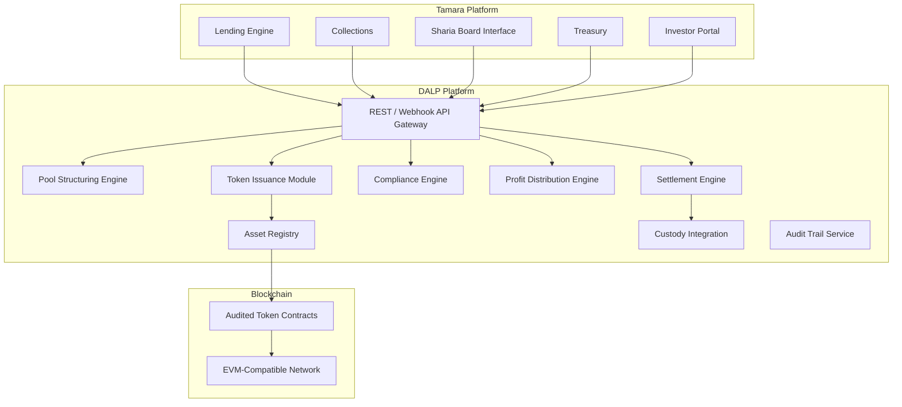
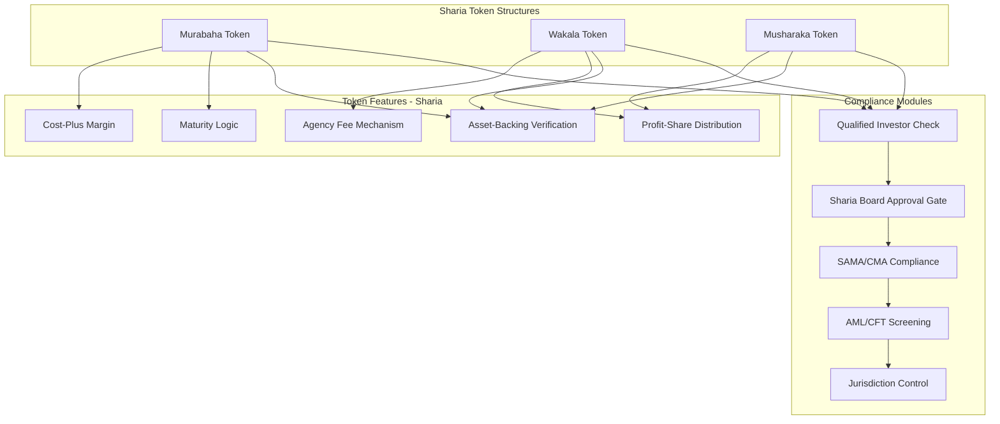
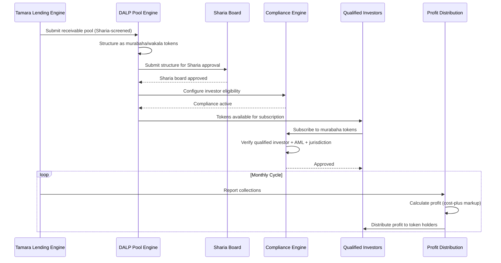
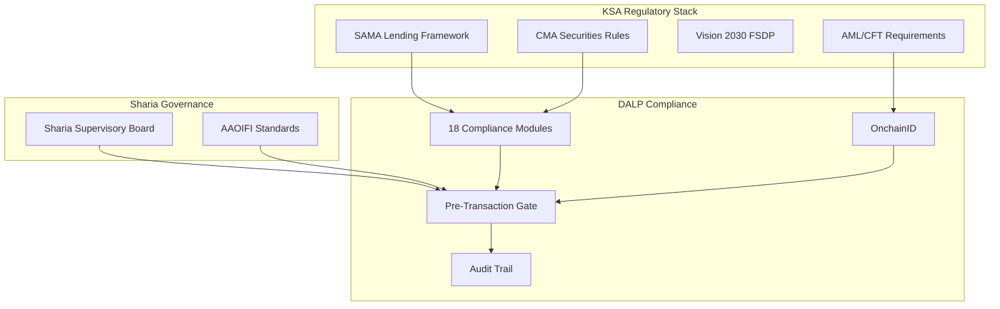
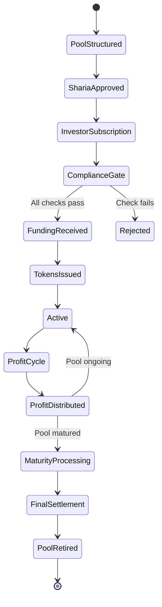
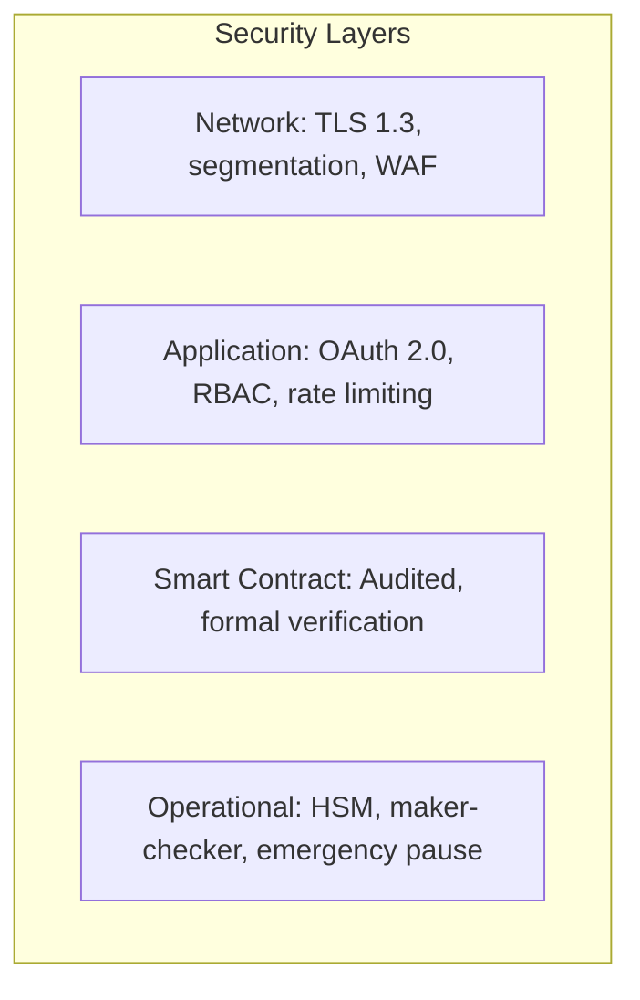
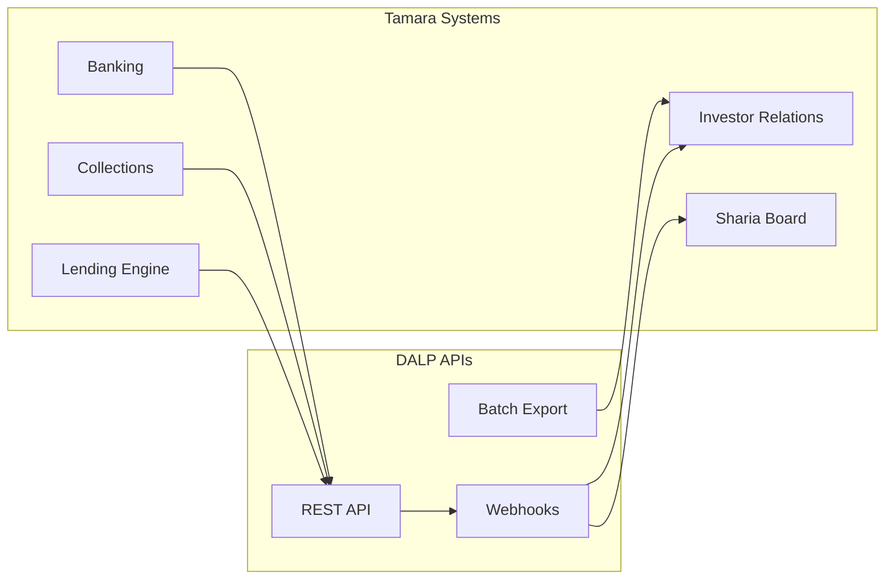
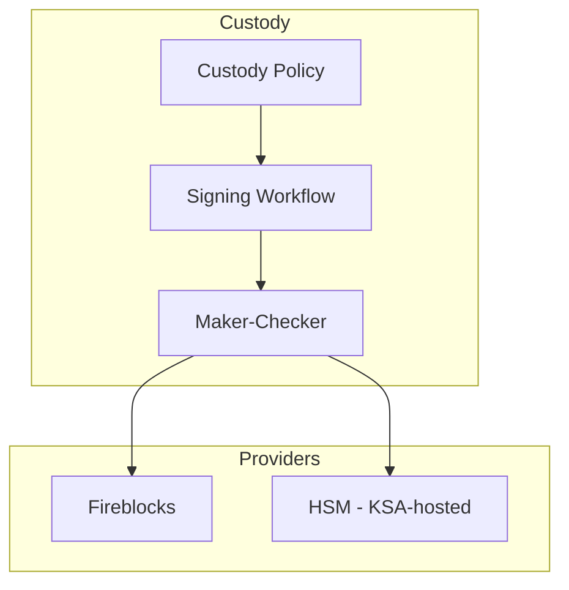
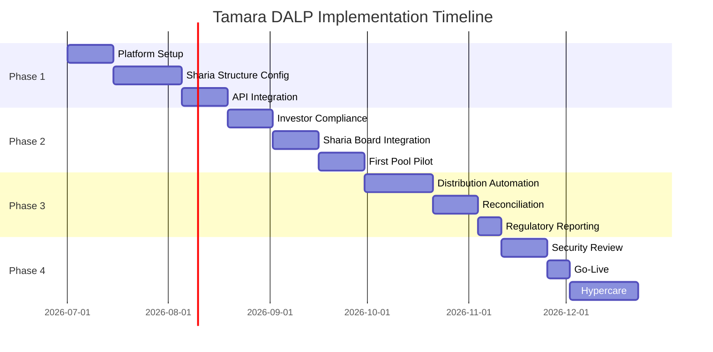

# Technical Proposal: Sharia-Compliant Tokenized Lending and Funding Rails

**Document Title:** Technical Proposal for Sharia-Compliant Tokenized Lending and Funding Rails  
**Client:** Tamara (KSA)  
**Reference:** TAMARA-RFP-SHARIA-TOKENIZED-LENDING-202603  
**Submitted by:** SettleMint  
**Date:** March 2026  
**Version:** 1.0 (Draft)  
**Confidentiality:** Strictly Confidential

---

## Table of Contents

1. Executive Summary
2. Understanding of Tamara's Requirements
3. SettleMint and DALP Overview
4. Platform Architecture
5. Sharia-Compliant Token Design
6. Lending and Funding Lifecycle
7. Compliance and Regulatory Framework
8. Settlement and Payment Integration
9. Security Architecture
10. Integration Architecture
11. Custody and Key Management
12. Investor Portal and Reporting
13. Operational Model and Support
14. Implementation Plan
15. Reference Deployments
16. Compliance Matrix

---

## Executive Summary

Tamara has established a leading position in the KSA buy-now-pay-later market, operating within the Kingdom's regulatory framework and the expectations of a predominantly Muslim consumer base that requires Sharia-compliant financial products. As Tamara's lending portfolio grows, the need for diversified, Sharia-compliant funding sources grows with it. Traditional bank financing, while reliable, limits the investor base and the speed at which Tamara can deploy capital.

Tokenized Sharia-compliant lending instruments provide a structured path to broader funding. By representing Tamara's receivable pools as tokenized murabaha or wakala instruments, Tamara can distribute these instruments to qualified institutional and Islamic finance investors through a compliant, transparent, and automated platform. Each token represents a fractional interest in a defined Sharia-compliant receivable pool, with profit distribution, maturity, and Sharia supervisory requirements encoded in the token's lifecycle logic.

SettleMint's DALP platform provides the infrastructure for this. DALP's configurable token architecture supports Sharia-compliant structures natively: profit-sharing mechanisms replace interest-bearing yield, murabaha and wakala transaction flows are modeled as configurable token features, and compliance modules enforce both SAMA/CMA regulatory requirements and Sharia supervisory board policies.

Three capabilities define the fit. First, native Sharia compliance: DALP's token features model profit-sharing, cost-plus, and agency-based structures that align with established Islamic finance principles. Second, SAMA/CMA regulatory alignment: compliance modules enforce investor eligibility, AML/CFT screening, and reporting requirements for both regulators. Third, automated profit distribution: the distribution engine processes collections and allocates profit to token holders according to configured Sharia-compliant distribution logic.

---

## Understanding of Tamara's Requirements

### Regulatory Context

Tamara operates under SAMA's regulatory framework for lending companies and fintech entities in KSA. The Capital Markets Authority (CMA) oversees securities-related activities. Tokenized lending instruments that function as securities fall within CMA's purview, requiring:

- CMA authorization or sandbox exemption for token issuance
- Qualified investor restrictions for structured product distribution
- AML/CFT compliance under SAMA's framework
- Reporting obligations to both SAMA and CMA
- Sharia supervisory board approval for Sharia-compliant product structures

The broader KSA regulatory context includes Saudi Vision 2030's financial sector development programme, the Financial Sector Development Programme (FSDP), SAMA's sandbox framework, and the growing regulatory clarity around digital asset and tokenization activities in the Kingdom.

### Sharia Compliance Requirements

Tamara's Sharia supervisory board requires that all financial products and processes comply with established Islamic finance principles:

- **Prohibition of riba (interest):** No interest-bearing instruments. All returns must be structured as profit-sharing, cost-plus (murabaha), or agency fee (wakala)
- **Prohibition of gharar (excessive uncertainty):** Contracts must be clear, defined, and transparent
- **Asset-backing requirement:** Instruments must be backed by identifiable underlying assets
- **Sharia board review:** Product structures require approval from Tamara's Sharia supervisory board before launch
- **Ongoing monitoring:** Sharia compliance must be maintained throughout the product lifecycle, not just at origination

### Operational Requirements

- **Receivable pool management:** Aggregation of individual consumer lending transactions into Sharia-compliant pools
- **Murabaha/wakala structuring:** Token structures that model cost-plus or agency-based returns
- **Profit distribution:** Automated profit calculation and distribution to token holders on configured schedules
- **Real-time portfolio transparency:** Pool performance metrics accessible to investors and the Sharia board

---

## SettleMint and DALP Overview

DALP is SettleMint's Digital Asset Lifecycle Platform for designing, launching, and operating tokenized assets across financial instruments. The platform's composable token architecture supports Sharia-compliant structures through configurable token features that model profit-sharing, cost-plus, and agency-based economics without relying on interest-bearing yield mechanisms.

DALP's 18 compliance module types provide the regulatory enforcement layer that SAMA, CMA, and Tamara's Sharia supervisory board require. Identity verification through OnchainID supports investor eligibility enforcement, and the audit trail service produces structured evidence for regulatory examination and Sharia board review.

---

## Platform Architecture

**Figure 1: DALP Platform Architecture for Tamara Sharia-Compliant Tokenized Lending**

### Sharia-Compliant Token Architecture

**Figure 2: Sharia-Compliant Token Architecture with Compliance Layers**

---

## Sharia-Compliant Token Design

### Murabaha Tokens

For cost-plus financing structures:

- **Cost basis:** Token represents a share of the cost of goods or receivables purchased by Tamara
- **Markup (profit margin):** A pre-agreed markup is added to the cost basis, representing the investor's return
- **Payment schedule:** Profit payments are distributed at defined intervals based on collection performance
- **Asset-backing:** Each murabaha token is backed by identified underlying receivables
- **No interest:** The return is structured as a markup on the purchase price, not interest on a loan

### Wakala Tokens

For agency-based investment structures:

- **Agency relationship:** The investor (principal) appoints Tamara (agent) to invest in identified receivable pools
- **Agency fee:** Tamara receives a pre-agreed agency fee for managing the pool
- **Profit distribution:** Returns above the agency fee and costs are distributed to the investor
- **Risk allocation:** Investment risk sits with the investor (principal); operational risk is managed by Tamara (agent)
- **Transparency:** Pool performance, collection rates, and profit calculations are visible to the investor in real time

### Musharaka Tokens

For partnership-based structures:

- **Joint ownership:** Token represents a share of joint ownership in the receivable pool
- **Profit/loss sharing:** Profits are shared according to pre-agreed ratios; losses are shared proportionally to capital contribution
- **Diminishing musharaka:** Configurable buyback mechanism where Tamara gradually repurchases the investor's share

---

## Lending and Funding Lifecycle

**Figure 3: Sharia-Compliant Funding Lifecycle**

---

## Compliance and Regulatory Framework

### SAMA and CMA Compliance

**Figure 4: SAMA/CMA + Sharia Compliance Framework**

### Compliance Module Configuration

| Module | Application | Configuration |
|--------|-------------|---------------|
| Qualified Investor | CMA requirement | Gate subscriptions to qualified/institutional investors |
| AML Status Gate | SAMA AML | Block transactions on screening alerts |
| Jurisdiction Control | Sanctions | Block sanctioned jurisdictions |
| Sharia Board Approval | Sharia governance | Require board approval before token activation |
| Investment Limit | Concentration | Per-investor and per-pool limits |
| Holding Period | Lock-up | Configurable minimum holding periods |
| Supply Control | Issuance | Cap total token supply per pool |
| Asset Backing Verification | Sharia requirement | Verify receivable backing before issuance |

---

## Settlement and Payment Integration

**Figure 5: Sharia-Compliant Pool Lifecycle States**

---

## Security Architecture

**Figure 6: Security Architecture**

Key security considerations for Tamara:

- **Data sovereignty:** KSA data residency requirements addressed through on-premises or Saudi-hosted cloud deployment
- **Key management:** HSM-backed with Fireblocks or DFNS integration
- **Access control:** Role-based with Sharia board read access to product configurations and audit trails
- **Smart contract audit:** Independent third-party audit of all token contracts

---

## Integration Architecture

**Figure 7: Integration Architecture**

---

## Custody and Key Management

**Figure 8: Custody Architecture**

HSM-backed custody with KSA data residency is recommended for Tamara's production deployment to address SAMA data sovereignty requirements.

---

## Investor Portal and Reporting

DALP provides API endpoints for Tamara's investor portal:

- **Sharia-compliant product catalog:** Available pools with Sharia board approval status and structure details
- **Subscription:** Compliance-gated subscription with real-time verification
- **Performance dashboard:** Profit distribution history, pool performance, and upcoming distributions
- **Sharia board reports:** Structured reports for ongoing Sharia compliance monitoring
- **Regulatory reports:** SAMA and CMA reporting templates

---

## Operational Model and Support

| Tier | Availability | Critical Response | TAM | SLA |
|------|-------------|-------------------|-----|-----|
| Enterprise | 24/5 | 2 hours | Dedicated | 99.9% |
| Sovereign | 24/7 | 1 hour | Dedicated | 99.95% |

Enterprise tier is recommended.

---

## Implementation Plan

| Phase | Duration | Scope |
|-------|----------|-------|
| Phase 1 | Weeks 1-8 | Platform deployment, Sharia structure configuration, API integration |
| Phase 2 | Weeks 9-14 | Investor compliance, Sharia board integration, first pool pilot |
| Phase 3 | Weeks 15-20 | Profit distribution automation, reconciliation, regulatory reporting |
| Phase 4 | Weeks 21-24 | Security review, SAMA/CMA alignment, go-live, hypercare |

**Figure 9: Implementation Timeline**

---

## Reference Deployments

**Middle East Islamic Finance Platform (NDA):** A regulated Islamic finance institution deployed DALP for Sharia-compliant tokenized instruments with profit-sharing distribution and Sharia board oversight integration.

**GCC Sovereign Programme (NDA):** A sovereign entity in the GCC deployed DALP for national-scale tokenization including Sharia-compliant product structures under central bank supervision.

**Asian Regulated Bank:** Tier 1 bank deployed DALP for tokenized bond lifecycle management under strict regulatory oversight.

---

## Compliance Matrix

| Requirement | DALP Response | Status |
|-------------|---------------|--------|
| Sharia-compliant token structures | Murabaha, wakala, musharaka configurable tokens | Fully Supported |
| Profit distribution (non-interest) | Configurable profit-sharing, cost-plus distribution | Fully Supported |
| Sharia board approval workflow | Pre-activation approval gate | Fully Supported |
| SAMA/CMA regulatory compliance | 18 configurable compliance modules | Fully Supported |
| Qualified investor enforcement | OnchainID with investor classification | Fully Supported |
| AML/CFT screening | Real-time screening gate | Fully Supported |
| Receivable pool structuring | Configurable pool construction engine | Fully Supported |
| Data sovereignty (KSA) | On-premises or KSA-hosted cloud deployment | Fully Supported |
| Custody integration | Fireblocks, DFNS, HSM (KSA-hosted) | Fully Supported |
| Audit trail | Immutable, structured, Sharia board accessible | Fully Supported |
| Regulatory reporting | SAMA/CMA export templates | Fully Supported |
| AAOIFI standards alignment | Configurable for AAOIFI Sharia standards | Supported with Configuration |

---

*This proposal is submitted in strict confidence by SettleMint in response to TAMARA-RFP-SHARIA-TOKENIZED-LENDING-202603.*
