# Diagram Catalog

## Purpose
This catalog maps common diagram needs to the best rendering tool for the SettleMint bid-manager. Use it during diagram selection before writing any visual.

All diagram colors must follow the canonical brand palette in `setup/brand-colors.md`. The examples below use colors from that palette.

## Tool Selection Summary

| Best Tool | Use It For | Avoid It For |
|---|---|---|
| Mermaid | Fast proposal visuals, flowcharts, Gantt, ER, lightweight decision trees, simple overviews | Deep UML structure, dense deployment views, large class/object models |
| PlantUML | UML families, deployment, component, class, package, object, richer technical layouts | Tiny throwaway visuals where Mermaid is faster and sufficient |

## Catalog Entries

### 1. Flowchart

- **Best tool:** Mermaid
- **Primary use case:** Simple process flows, proposal narratives, quick decision visuals
- **Recommended dimensions:** 160mm × 220mm
- **Preferred orientation:** Portrait
- **Max nodes/items before splitting:** 12-15
- **Target aspect ratio:** 3:4
- **Minimal branded example:**

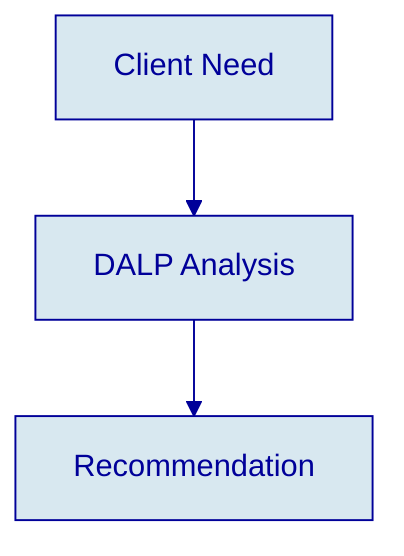

### 2. Sequence

- **Best tool:** PlantUML
- **Primary use case:** Actor/system interactions with precise messaging
- **Recommended dimensions:** 160mm × 220mm
- **Preferred orientation:** Portrait
- **Max nodes/items before splitting:** 5-9 participants
- **Target aspect ratio:** 3:4
- **Minimal branded example:**

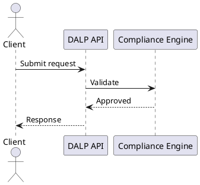

### 3. Component

- **Best tool:** PlantUML
- **Primary use case:** Logical service architecture and module boundaries
- **Recommended dimensions:** 180mm × 140mm
- **Preferred orientation:** Landscape
- **Max nodes/items before splitting:** 10-14
- **Target aspect ratio:** 16:10
- **Minimal branded example:**

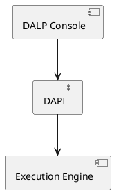

### 4. Deployment

- **Best tool:** PlantUML
- **Primary use case:** Runtime topology, environments, nodes, databases
- **Recommended dimensions:** 180mm × 140mm
- **Preferred orientation:** Landscape
- **Max nodes/items before splitting:** 8-12
- **Target aspect ratio:** 16:10
- **Minimal branded example:**

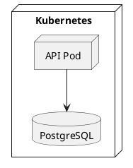

### 5. Class

- **Best tool:** PlantUML
- **Primary use case:** Domain models, inheritance, core entities
- **Recommended dimensions:** 160mm × 220mm
- **Preferred orientation:** Portrait
- **Max nodes/items before splitting:** 6-10 classes
- **Target aspect ratio:** 4:5
- **Minimal branded example:**

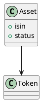

### 6. Activity

- **Best tool:** PlantUML
- **Primary use case:** Operational workflows with branches and states
- **Recommended dimensions:** 160mm × 220mm
- **Preferred orientation:** Portrait
- **Max nodes/items before splitting:** 10-16
- **Target aspect ratio:** 3:4
- **Minimal branded example:**

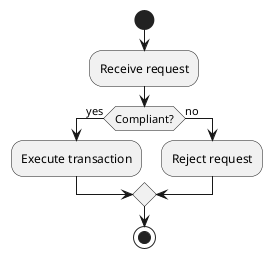

### 7. State

- **Best tool:** PlantUML
- **Primary use case:** Lifecycle states and controlled transitions
- **Recommended dimensions:** 160mm × 220mm
- **Preferred orientation:** Portrait
- **Max nodes/items before splitting:** 10-14
- **Target aspect ratio:** 3:4
- **Minimal branded example:**

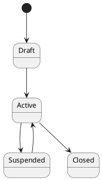

### 8. Use Case

- **Best tool:** PlantUML
- **Primary use case:** Business actors and system capabilities
- **Recommended dimensions:** 170mm × 170mm
- **Preferred orientation:** Square
- **Max nodes/items before splitting:** 8-14
- **Target aspect ratio:** 1:1
- **Minimal branded example:**

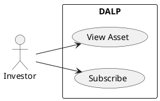

### 9. ER Diagram

- **Best tool:** Mermaid
- **Primary use case:** Entity relationships for data views and schema overviews
- **Recommended dimensions:** 180mm × 140mm
- **Preferred orientation:** Landscape
- **Max nodes/items before splitting:** 8-12
- **Target aspect ratio:** 16:10
- **Minimal branded example:**

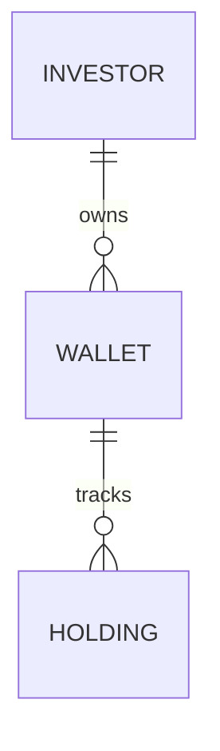

### 10. Gantt

- **Best tool:** Mermaid
- **Primary use case:** Implementation plans, milestones, phase timing
- **Recommended dimensions:** 180mm × 140mm
- **Preferred orientation:** Landscape
- **Max nodes/items before splitting:** 10-18 tasks
- **Target aspect ratio:** 16:10
- **Minimal branded example:**

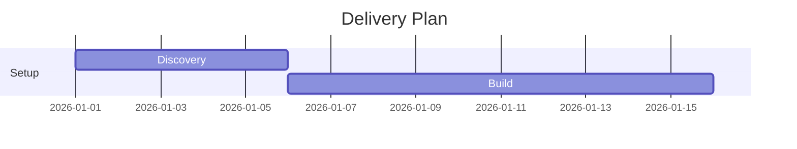

### 11. Mind Map

- **Best tool:** Mermaid
- **Primary use case:** Capability grouping, brainstorms, content clustering
- **Recommended dimensions:** 170mm × 170mm
- **Preferred orientation:** Square
- **Max nodes/items before splitting:** 15-25
- **Target aspect ratio:** 1:1
- **Minimal branded example:**

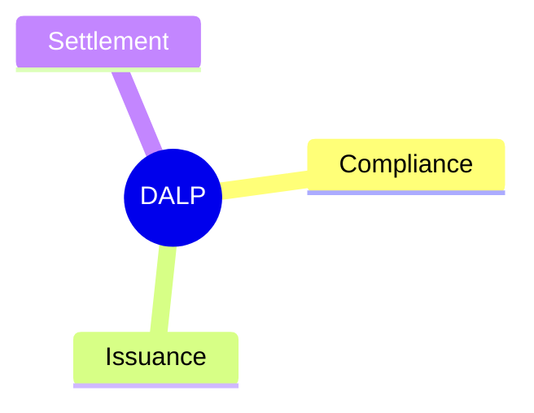

### 12. Pie Chart

- **Best tool:** Mermaid
- **Primary use case:** Simple distribution visuals for proposals
- **Recommended dimensions:** 150mm × 150mm
- **Preferred orientation:** Square
- **Max nodes/items before splitting:** 5-7 slices
- **Target aspect ratio:** 1:1
- **Minimal branded example:**

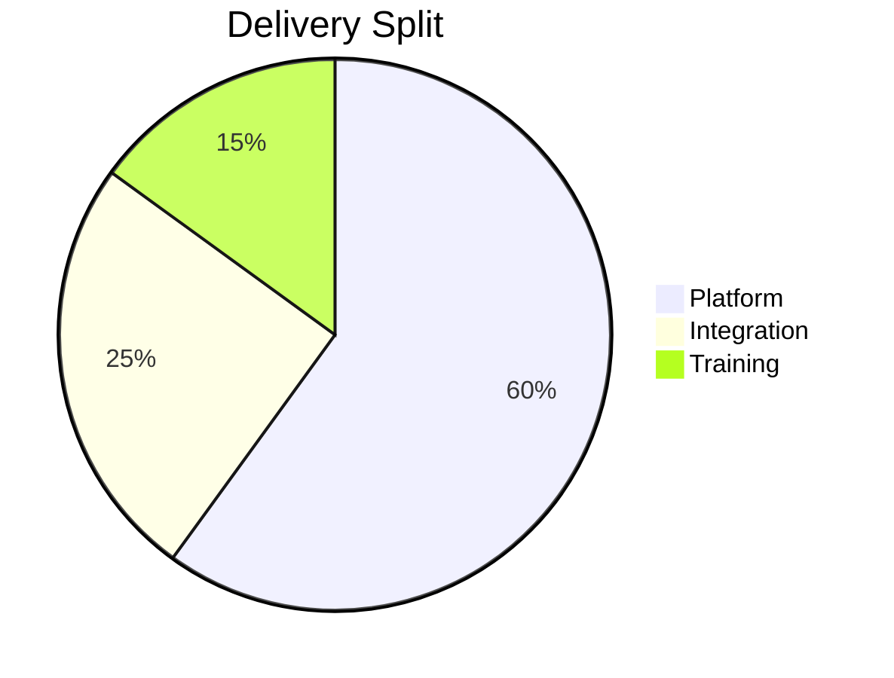

### 13. C4 Context

- **Best tool:** PlantUML
- **Primary use case:** System context with users and neighboring systems
- **Recommended dimensions:** 180mm × 140mm
- **Preferred orientation:** Landscape
- **Max nodes/items before splitting:** 8-12
- **Target aspect ratio:** 16:10
- **Minimal branded example:**

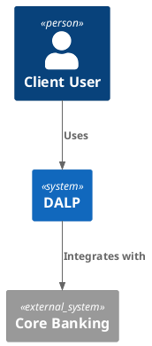

### 14. C4 Container

- **Best tool:** PlantUML
- **Primary use case:** Container-level architecture
- **Recommended dimensions:** 180mm × 140mm
- **Preferred orientation:** Landscape
- **Max nodes/items before splitting:** 8-12
- **Target aspect ratio:** 16:10
- **Minimal branded example:**

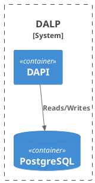

### 15. C4 Component

- **Best tool:** PlantUML
- **Primary use case:** Component internals inside one container
- **Recommended dimensions:** 180mm × 140mm
- **Preferred orientation:** Landscape
- **Max nodes/items before splitting:** 8-14
- **Target aspect ratio:** 16:10
- **Minimal branded example:**

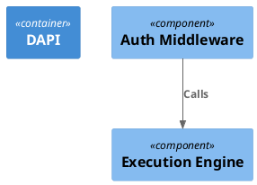

### 16. Org Chart

- **Best tool:** Mermaid
- **Primary use case:** Team structures, governance, ownership
- **Recommended dimensions:** 160mm × 220mm
- **Preferred orientation:** Portrait
- **Max nodes/items before splitting:** 10-16
- **Target aspect ratio:** 3:4
- **Minimal branded example:**

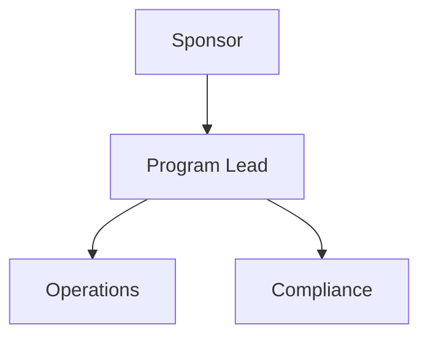

### 17. Package

- **Best tool:** PlantUML
- **Primary use case:** Grouped modules, bounded contexts, namespaces
- **Recommended dimensions:** 180mm × 140mm
- **Preferred orientation:** Landscape
- **Max nodes/items before splitting:** 8-12
- **Target aspect ratio:** 16:10
- **Minimal branded example:**

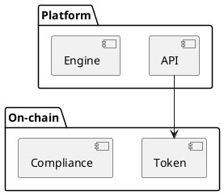

### 18. Object

- **Best tool:** PlantUML
- **Primary use case:** Instance snapshots and concrete runtime examples
- **Recommended dimensions:** 160mm × 200mm
- **Preferred orientation:** Portrait
- **Max nodes/items before splitting:** 6-10
- **Target aspect ratio:** 4:5
- **Minimal branded example:**

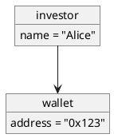

### 19. Timing

- **Best tool:** PlantUML
- **Primary use case:** State transitions over time and signal timing
- **Recommended dimensions:** 180mm × 120mm
- **Preferred orientation:** Landscape
- **Max nodes/items before splitting:** 5-8 tracks
- **Target aspect ratio:** 16:9
- **Minimal branded example:**

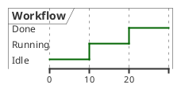

### 20. Communication

- **Best tool:** PlantUML
- **Primary use case:** Message-centric collaboration alternative to sequence
- **Recommended dimensions:** 170mm × 140mm
- **Preferred orientation:** Landscape
- **Max nodes/items before splitting:** 6-10
- **Target aspect ratio:** 4:3
- **Minimal branded example:**

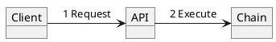

### 21. Network Topology

- **Best tool:** PlantUML
- **Primary use case:** Zones, links, gateways, runtime infrastructure
- **Recommended dimensions:** 180mm × 140mm
- **Preferred orientation:** Landscape
- **Max nodes/items before splitting:** 8-14
- **Target aspect ratio:** 16:10
- **Minimal branded example:**

```plantuml
@startuml
cloud Internet
node WAF
node API
database DB
Internet --> WAF
WAF --> API
API --> DB
@enduml
```

### 22. BPMN-style flow

- **Best tool:** Mermaid
- **Primary use case:** Lightweight business process diagrams
- **Recommended dimensions:** 160mm × 220mm
- **Preferred orientation:** Portrait
- **Max nodes/items before splitting:** 12-16
- **Target aspect ratio:** 3:4
- **Minimal branded example:**

```mermaid
flowchart TB
    A([Start]) --> B["Review"]
    B --> C{"Approve?"}
    C -->|Yes| D([Done])
    C -->|No| E["Rework"]
```

### 23. Journey Map

- **Best tool:** Mermaid
- **Primary use case:** Phase-based client or user journey visuals
- **Recommended dimensions:** 180mm × 140mm
- **Preferred orientation:** Landscape
- **Max nodes/items before splitting:** 5-7 stages
- **Target aspect ratio:** 16:10
- **Minimal branded example:**

```mermaid
journey
    title Client Journey
    section Delivery
      Kickoff: 5: Client
      Go-live: 4: Client, SettleMint
```

### 24. Git Graph

- **Best tool:** Mermaid
- **Primary use case:** Release branches or upgrade path narratives
- **Recommended dimensions:** 180mm × 120mm
- **Preferred orientation:** Landscape
- **Max nodes/items before splitting:** 10-20 commits
- **Target aspect ratio:** 16:9
- **Minimal branded example:**

```mermaid
gitGraph
   commit id: "v1"
   branch release
   commit id: "v2"
```

### 25. Quadrant / Matrix

- **Best tool:** Mermaid
- **Primary use case:** Positioning, prioritization, capability scoring
- **Recommended dimensions:** 170mm × 170mm
- **Preferred orientation:** Square
- **Max nodes/items before splitting:** 4-9 items
- **Target aspect ratio:** 1:1
- **Minimal branded example:**

```mermaid
quadrantChart
    title Capability Priorities
    x-axis Low Effort --> High Effort
    y-axis Low Impact --> High Impact
    quadrant-1 Invest
    "DALP API": [0.7, 0.8]
```

### 26. Requirement Trace

- **Best tool:** PlantUML
- **Primary use case:** Traceability between requirement, control, outcome
- **Recommended dimensions:** 180mm × 140mm
- **Preferred orientation:** Landscape
- **Max nodes/items before splitting:** 8-12
- **Target aspect ratio:** 16:10
- **Minimal branded example:**

```plantuml
@startuml
artifact "Requirement" as R
artifact "Control" as C
artifact "Evidence" as E
R --> C
C --> E
@enduml
```

### 27. Swimlane Activity

- **Best tool:** PlantUML
- **Primary use case:** Responsibility-separated workflows
- **Recommended dimensions:** 180mm × 150mm
- **Preferred orientation:** Landscape
- **Max nodes/items before splitting:** 10-16
- **Target aspect ratio:** 16:10
- **Minimal branded example:**

```plantuml
@startuml
|Client|
start
:Submit request;
|DALP|
:Validate;
|Operations|
:Approve;
stop
@enduml
```

### 28. Decision Tree

- **Best tool:** Mermaid
- **Primary use case:** Simple branching logic and eligibility checks
- **Recommended dimensions:** 160mm × 220mm
- **Preferred orientation:** Portrait
- **Max nodes/items before splitting:** 10-14
- **Target aspect ratio:** 3:4
- **Minimal branded example:**

```mermaid
flowchart TB
    A["Request"] --> B{"Eligible?"}
    B -->|Yes| C["Approve"]
    B -->|No| D["Reject"]
```

### 29. RACI Map

- **Best tool:** Mermaid
- **Primary use case:** Responsibility assignment by workstream
- **Recommended dimensions:** 180mm × 140mm
- **Preferred orientation:** Landscape
- **Max nodes/items before splitting:** 6-10 rows
- **Target aspect ratio:** 16:10
- **Minimal branded example:**

```mermaid
flowchart LR
    A["Compliance"] --> B["Client"]
    A --> C["SettleMint"]
```

### 30. Data Pipeline

- **Best tool:** PlantUML
- **Primary use case:** Ingest-transform-publish technical flows
- **Recommended dimensions:** 180mm × 140mm
- **Preferred orientation:** Landscape
- **Max nodes/items before splitting:** 8-12
- **Target aspect ratio:** 16:10
- **Minimal branded example:**

```plantuml
@startuml
rectangle "Source" as S
rectangle "Processor" as P
rectangle "View" as V
S --> P --> V
@enduml
```

### 31. Security Boundary

- **Best tool:** PlantUML
- **Primary use case:** Trust zones, gateways, protected domains
- **Recommended dimensions:** 180mm × 140mm
- **Preferred orientation:** Landscape
- **Max nodes/items before splitting:** 8-12
- **Target aspect ratio:** 16:10
- **Minimal branded example:**

```plantuml
@startuml
frame "External" {
  cloud Internet
}
frame "Trusted" {
  node API
  database DB
}
Internet --> API
API --> DB
@enduml
```

### 32. Capability Map

- **Best tool:** Mermaid
- **Primary use case:** Platform capability clusters and themes
- **Recommended dimensions:** 170mm × 170mm
- **Preferred orientation:** Square
- **Max nodes/items before splitting:** 12-20
- **Target aspect ratio:** 1:1
- **Minimal branded example:**

```mermaid
flowchart TB
    A["DALP"] --> B["Issuance"]
    A --> C["Compliance"]
    A --> D["Settlement"]
```

### 33. Reference Architecture

- **Best tool:** PlantUML
- **Primary use case:** Standard reusable technical blueprint
- **Recommended dimensions:** 180mm × 140mm
- **Preferred orientation:** Landscape
- **Max nodes/items before splitting:** 10-14
- **Target aspect ratio:** 16:10
- **Minimal branded example:**

```plantuml
@startuml
package "Client Zone" {
  [Users]
}
package "DALP Zone" {
  [DAPI]
  [Engine]
}
[Users] --> [DAPI]
[DAPI] --> [Engine]
@enduml
```

### 34. Service Dependency

- **Best tool:** PlantUML
- **Primary use case:** Upstream/downstream dependency mapping
- **Recommended dimensions:** 180mm × 140mm
- **Preferred orientation:** Landscape
- **Max nodes/items before splitting:** 8-14
- **Target aspect ratio:** 16:10
- **Minimal branded example:**

```plantuml
@startuml
component API
component Indexer
component Chain
API --> Indexer
Indexer --> Chain
@enduml
```

### 35. Interface Contract

- **Best tool:** PlantUML
- **Primary use case:** API or integration contract views
- **Recommended dimensions:** 170mm × 140mm
- **Preferred orientation:** Landscape
- **Max nodes/items before splitting:** 6-10
- **Target aspect ratio:** 4:3
- **Minimal branded example:**

```plantuml
@startuml
interface "KYC Provider API" as KYC
component "DALP Connector" as CONN
CONN ..> KYC
@enduml
```
