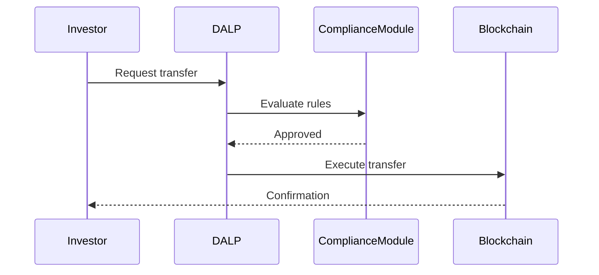

# Mandatory Diagram Manifest

> **Directive (Gyan, 2026-04-03):** Every technical proposal MUST include mermaid diagram code blocks in the markdown output. The DOCX conversion script (`scripts/markdown_to_docx.py`) renders mermaid to PNG automatically. Do NOT replace mermaid blocks with text placeholders or descriptions. A proposal without the minimum mermaid block count is INCOMPLETE and must not proceed to DOCX conversion.

---

## Minimum Diagram Counts by Variant

| Variant | Minimum Mermaid Blocks | Target Range |
|---------|----------------------|--------------|
| **Full** (TITAN) | 30 | 30-40 |
| **Medium** (FALCON) | 20 | 20-28 |
| **Compact** (SENTINEL) | 10 | 10-14 |

A proposal that falls below the minimum count MUST be revised before DOCX conversion.

---

## Mandatory Diagrams for Technical-Full Proposals

Every full technical proposal MUST include at least these 15 core mermaid diagrams plus 15 additional bid-specific mermaid diagrams, for a minimum total of 30. Each maps to a specific section and diagram type.

| # | Diagram Name | Type | Required In Section | Skeleton Reference |
|---|---|---|---|---|
| 1 | Platform Architecture Overview | Layered block diagram (4 layers: on-chain, execution, API, presentation) | About DALP > Platform Overview | `platform-architecture-layers.mmd` |
| 2 | Composable Token Architecture | Block/component diagram (3 layers: DALPAsset + Features + Compliance) | Proposed Solution > Issuance and Asset Configuration | `smart-contract-architecture.mmd` |
| 3 | Asset Lifecycle State Machine | State diagram (issuance, active, paused, frozen, redeemed) | About DALP > Core Lifecycle Pillars | `token-lifecycle-states.mmd` |
| 4 | Compliance Evaluation Flow | Flowchart (transfer request, module checks, pass/fail) | Proposed Solution > Compliance Enforcement | `compliance-transfer-flow.mmd` |
| 5 | Token Feature Execution Pipeline | Flowchart (hooks, rewrite, execute, post-hooks) | Proposed Solution > Issuance and Asset Configuration | N/A (custom) |
| 6 | Security Architecture | Layered diagram (defense-in-depth layers) | Security > Security Model Overview | `security-layers.mmd` |
| 7 | Integration Architecture | Block/flow diagram (DALP to core banking, custody, KYC, payments) | Proposed Solution > Integration and Interoperability | `integration-architecture.mmd` |
| 8 | Deployment Architecture | Block diagram (Kubernetes/cloud topology) | Deployment > Recommended Deployment Model | `deployment-topology-saas.mmd` or `deployment-topology-onprem.mmd` |
| 9 | Implementation Timeline | Gantt chart (6 phases with milestones) | Project Implementation > Phase Plan | `implementation-timeline.mmd` |
| 10 | RBAC / Access Control Model | Flowchart or block diagram (roles, permissions, verification gates) | Security > Authentication and Access Control | `identity-access-model.mmd` |
| 11 | Custody and Key Management Flow | Flowchart (Key Guardian tiers, signing flow, maker-checker) | Security > Key Management and Custody Integration | N/A (custom) |
| 12 | Disaster Recovery Architecture | Block diagram (zones, failover, backup/restore) | Deployment > Availability, Resilience, and DR Approach | N/A (custom) |
| 13 | Observability Stack | Block/layered diagram (metrics, logs, traces, dashboards, alerting) | Technical Architecture > Operational Architecture | N/A (custom) |
| 14 | Data Flow / Privacy Architecture | Flowchart (chain state, app state, indexed state, audit evidence) | Technical Architecture > Data Architecture | `data-flow-asset-creation.mmd` |
| 15 | Regulatory Compliance Framework | Block/matrix diagram (jurisdiction mapping, regulatory templates) | About SettleMint > Regulatory Readiness | N/A (custom) |

---

## Mandatory Diagrams for Technical-Medium Proposals

Medium proposals MUST include at least 20 mermaid diagrams in total. The following 10 are the core set and must be included first (choose based on bid relevance):

| # | Diagram Name | Type | Required In Section |
|---|---|---|---|
| 1 | Platform Architecture Overview | Layered block diagram | About DALP > Platform Overview |
| 2 | Asset Lifecycle State Machine | State diagram | About DALP > Lifecycle Pillars |
| 3 | Compliance Evaluation Flow | Flowchart | Proposed Solution > Compliance |
| 4 | Security Architecture | Layered diagram | Security > Security Overview |
| 5 | Integration Architecture | Block/flow diagram | Proposed Solution > Integration |
| 6 | Deployment Architecture | Block diagram | Deployment > Recommended Model |
| 7 | Implementation Timeline | Gantt chart | Implementation > Phase Table |
| 8 | RBAC / Access Control Model | Flowchart | Security > Access Control |
| 9 | Solution Architecture | Block diagram | Executive Summary > Proposed Response |
| 10 | Data Flow Architecture | Flowchart | Technical Architecture > Core Layers |

---

## Mandatory Diagrams for Technical-Compact Proposals

Compact proposals MUST include at least 10 mermaid diagrams in total. The following 5 are the core set and must be included first:

| # | Diagram Name | Type | Required In Section |
|---|---|---|---|
| 1 | Platform Architecture Overview | Layered block diagram | About DALP |
| 2 | Solution Architecture | Block diagram | Executive Summary |
| 3 | Compliance Evaluation Flow | Flowchart | Solution Overview > Core Capability Response |
| 4 | Deployment Architecture | Block diagram | Architecture Overview |
| 5 | Implementation Timeline | Gantt chart | Implementation Timeline |

---

## Mandatory Sequence Diagrams

> **Directive (Gyan, 2026-04-03):** Every proposal MUST include Mermaid sequence diagrams (using the `sequenceDiagram` keyword). Flowcharts, block diagrams, and state diagrams do NOT count toward this requirement.

### Minimum Sequence Diagram Counts

| Variant | Minimum Sequence Diagrams |
|---------|--------------------------|
| **Full** (TITAN) | 8 |
| **Medium** (FALCON) | 6 |
| **Compact** (SENTINEL) | 4 |

### Recommended Sequence Diagram Topics

Select from the following based on bid relevance. Full proposals must include at least 8:

| # | Diagram Name | Shows | Priority |
|---|---|---|---|
| 1 | **Token Transfer with Compliance** | Transfer request, compliance module evaluation, approval/rejection, settlement | High |
| 2 | **Asset Issuance Workflow** | Issuer configures, compliance review, minting, distribution | High |
| 3 | **DvP/XvP Settlement Flow** | Buyer locks payment, seller locks asset, atomic swap, settlement confirmation | High |
| 4 | **KYC/Identity Verification Flow** | User submits claims, verification provider checks, eligibility update, access grant | Medium |
| 5 | **Maker-Checker Approval Flow** | Operator initiates, approver reviews, multi-sig execution | Medium |

All sequence diagrams MUST use the `sequenceDiagram` keyword as the first line inside the mermaid code block. Example:

````markdown

````

The validation script (`scripts/validate_proposal.py`) enforces the minimum sequence diagram count. A proposal below the minimum will FAIL validation and must not proceed to DOCX conversion.

---

## Diagram Design Rules

All mermaid diagrams MUST follow `setup/mermaid-diagram-standards.md`:

- Use the SettleMint brand color palette from `setup/brand-colors.md`
- Maximum 15 nodes per diagram (split if needed)
- Portrait/top-down orientation unless the flow is inherently horizontal
- Every diagram must have contextual text before it (no orphaned diagrams)
- No decorative diagrams: every diagram must communicate information that prose alone cannot

---

## Validation

Run `scripts/validate_proposal.py` after markdown generation to verify:
- Mermaid block count meets the minimum for the variant
- All mandatory sections contain diagram blocks
- No mermaid blocks were replaced with text descriptions

If validation fails, revise the markdown before proceeding to DOCX conversion.
