# PlantUML Diagram Standards

## Purpose
This document defines the mandatory standard for PlantUML diagrams used by the bid-manager. Use it when Mermaid is not the best fit: component, deployment, class, object, package, use case, richer activity, or technical infrastructure diagrams.

PlantUML is the **preferred tool** when the structure is more UML-like than flow-like.

---

## Core Rules

### Brand Rules

See `setup/brand-colors.md` for the canonical brand color palette, WCAG contrast pairs, and diagram fill pairings.

- Font family: **Figtree**
- Canvas background: `#FFFFFF`
- Primary heading/text blue: `#000099`
- Rounded corners: **15**
- Use pastel fills with dark text and matching dark borders (see `brand-colors.md` → Diagram Fill Pairings)
- Prefer flat fills over gradients
- Do not use default black-on-white UML boxes unless explicitly needed for a plain technical export

### Layout Rules
- Design for **A4 page insertion** in Word proposals
- Target safe content width: **160mm**
- Target safe content height: **230mm**
- Prefer **portrait-first thinking** unless the diagram is structurally horizontal
- Split diagrams instead of cramming more than ~16 primary nodes into one canvas
- Group related nodes into packages, frames, or rectangles to reduce clutter

### Placement Rules
- Diagrams should be inserted centered in the document
- Keep text readable at normal page width without zooming
- Avoid long labels; use short node labels and explain details in surrounding prose
- Avoid line crossings when possible; if crossings are unavoidable, reorganize groups before rendering

---

## When to Use PlantUML

Use PlantUML for:
- Component diagrams
- Deployment diagrams
- Use case diagrams
- Class diagrams
- Object diagrams
- Package diagrams
- Rich activity diagrams
- State diagrams where UML notation is helpful
- Network/infrastructure topologies
- Sequence diagrams that need stronger layout control

Stay with Mermaid for:
- Simple flowcharts
- Lightweight process visuals
- Gantt charts
- Pie charts
- Quick mind maps
- Short embedded proposal visuals where speed matters more than UML expressiveness

---

## Local Rendering Commands

Use the local PlantUML jar and render both SVG and high-resolution PNG.

### SVG

```bash
java -jar /Users/quark/tools/plantuml.jar -tsvg input.puml -o output/
```

### PNG at 300 DPI

```bash
java -jar /Users/quark/tools/plantuml.jar -tpng -Sdpi=300 input.puml -o output/
```

### Recommended Validation Pass

```bash
java -jar /Users/quark/tools/plantuml.jar -checkonly input.puml
```

### Environment Override
If a different PlantUML jar is needed, set:

```bash
export PLANTUML_JAR=/custom/path/plantuml.jar
```

---

## A4 Sizing Rules

### Target Render Behaviour
- Default export formats: **SVG + PNG**
- PNG resolution: **300 DPI**
- Keep node labels short enough to avoid boxes wider than ~55mm unless the diagram is inherently wide
- Prefer vertical stacks over wide chains
- Use packages or frames to compress visual complexity

### Practical Limits

| Diagram Type | Preferred Orientation | Recommended Max Primary Nodes | Target Aspect Ratio |
|---|---|---:|---|
| Component | Landscape or square | 10-14 | 4:3 to 16:10 |
| Deployment | Landscape | 8-12 | 16:10 |
| Use case | Portrait or square | 8-14 | 4:3 |
| Class | Portrait | 6-10 classes | 4:5 to 3:4 |
| Activity | Portrait | 10-16 | 3:4 |
| Package | Landscape or square | 8-12 | 4:3 |
| Network topology | Landscape | 8-14 | 16:10 |
| Sequence | Portrait when possible | 5-9 participants | tall |

### Resize Decision
If the rendered image looks too dense for a 6.0-inch insertion width in Word:
1. shorten labels
2. reduce node count
3. split into two diagrams
4. only then consider changing orientation

---

## Brand Skin Parameters

Use the following block at the top of every PlantUML diagram unless the rendering script auto-injects it.

```plantuml
skinparam BackgroundColor #FFFFFF
skinparam DefaultFontName Figtree
skinparam DefaultFontColor #000099
skinparam HyperlinkColor #0000FF
skinparam Shadowing false
skinparam RoundCorner 15
skinparam Padding 10
skinparam ArrowColor #000099
skinparam ArrowThickness 1.5
skinparam LineColor #000099
skinparam NoteBackgroundColor #F5F0B0
skinparam NoteBorderColor #BCA820
skinparam NoteFontColor #102848
skinparam PackageBorderColor #000099
skinparam PackageFontColor #000099
skinparam PackageBackgroundColor #D8E8F0
skinparam RectangleBackgroundColor #D8E8F0
skinparam RectangleBorderColor #000099
skinparam RectangleFontColor #000099
skinparam CardBackgroundColor #C0E0F0
skinparam CardBorderColor #284878
skinparam CardFontColor #284878
skinparam NodeBackgroundColor #C0F0C0
skinparam NodeBorderColor #187848
skinparam NodeFontColor #187848
skinparam ComponentBackgroundColor #C8A8E8
skinparam ComponentBorderColor #482068
skinparam ComponentFontColor #482068
skinparam InterfaceBackgroundColor #F2B8A0
skinparam InterfaceBorderColor #C05030
skinparam InterfaceFontColor #C05030
skinparam ArtifactBackgroundColor #B8D8E0
skinparam ArtifactBorderColor #1E4868
skinparam ArtifactFontColor #1E4868
skinparam CloudBackgroundColor #C0E0F0
skinparam CloudBorderColor #284878
skinparam CloudFontColor #284878
skinparam DatabaseBackgroundColor #B0C0D8
skinparam DatabaseBorderColor #183060
skinparam DatabaseFontColor #183060
skinparam QueueBackgroundColor #F5F0B0
skinparam QueueBorderColor #BCA820
skinparam QueueFontColor #102848
skinparam UsecaseBackgroundColor #F2B8A0
skinparam UsecaseBorderColor #C05030
skinparam UsecaseFontColor #C05030
skinparam ClassBackgroundColor #D8E8F0
skinparam ClassBorderColor #000099
skinparam ClassFontColor #000099
skinparam ClassAttributeFontColor #000000
skinparam ClassStereotypeFontColor #506878
skinparam ObjectBackgroundColor #C0F0C0
skinparam ObjectBorderColor #187848
skinparam ObjectFontColor #187848
skinparam ActivityBackgroundColor #D8E8F0
skinparam ActivityBorderColor #000099
skinparam ActivityFontColor #000099
skinparam ActivityDiamondBackgroundColor #F5F0B0
skinparam ActivityDiamondBorderColor #BCA820
skinparam ActivityDiamondFontColor #102848
skinparam SequenceLifeLineBorderColor #506878
skinparam SequenceLifeLineBackgroundColor #F2F2F2
skinparam SequenceParticipantBackgroundColor #D8E8F0
skinparam SequenceParticipantBorderColor #000099
skinparam SequenceParticipantFontColor #000099
skinparam SequenceActorBackgroundColor #F2B8A0
skinparam SequenceActorBorderColor #C05030
skinparam SequenceActorFontColor #C05030
skinparam SequenceArrowColor #000099
skinparam SequenceGroupBorderColor #284878
skinparam SequenceGroupBackgroundColor #C0E0F0
skinparam SequenceGroupHeaderFontColor #284878
skinparam SequenceBoxBorderColor #506878
skinparam SequenceBoxBackgroundColor #F2F2F2
skinparam PartitionBackgroundColor #C0E0F0
skinparam PartitionBorderColor #284878
skinparam PartitionFontColor #284878
skinparam LegendBackgroundColor #F2F2F2
skinparam LegendBorderColor #8898A8
skinparam LegendFontColor #000000
skinparam TitleFontName Figtree
skinparam TitleFontColor #000099
skinparam TitleFontSize 18
skinparam TitleBorderThickness 0
skinparam CaptionFontName Figtree
skinparam CaptionFontColor #506878
```

---

## Copy-Paste Starter Template

Use this for new diagrams.

```plantuml
@startuml
skinparam BackgroundColor #FFFFFF
skinparam DefaultFontName Figtree
skinparam DefaultFontColor #000099
skinparam HyperlinkColor #0000FF
skinparam Shadowing false
skinparam RoundCorner 15
skinparam Padding 10
skinparam ArrowColor #000099
skinparam ArrowThickness 1.5
skinparam LineColor #000099
skinparam NoteBackgroundColor #F5F0B0
skinparam NoteBorderColor #BCA820
skinparam NoteFontColor #102848
skinparam PackageBorderColor #000099
skinparam PackageFontColor #000099
skinparam PackageBackgroundColor #D8E8F0
skinparam RectangleBackgroundColor #D8E8F0
skinparam RectangleBorderColor #000099
skinparam RectangleFontColor #000099
skinparam CardBackgroundColor #C0E0F0
skinparam CardBorderColor #284878
skinparam CardFontColor #284878
skinparam NodeBackgroundColor #C0F0C0
skinparam NodeBorderColor #187848
skinparam NodeFontColor #187848
skinparam ComponentBackgroundColor #C8A8E8
skinparam ComponentBorderColor #482068
skinparam ComponentFontColor #482068
skinparam InterfaceBackgroundColor #F2B8A0
skinparam InterfaceBorderColor #C05030
skinparam InterfaceFontColor #C05030
skinparam ArtifactBackgroundColor #B8D8E0
skinparam ArtifactBorderColor #1E4868
skinparam ArtifactFontColor #1E4868
skinparam CloudBackgroundColor #C0E0F0
skinparam CloudBorderColor #284878
skinparam CloudFontColor #284878
skinparam DatabaseBackgroundColor #B0C0D8
skinparam DatabaseBorderColor #183060
skinparam DatabaseFontColor #183060
skinparam QueueBackgroundColor #F5F0B0
skinparam QueueBorderColor #BCA820
skinparam QueueFontColor #102848
skinparam UsecaseBackgroundColor #F2B8A0
skinparam UsecaseBorderColor #C05030
skinparam UsecaseFontColor #C05030
skinparam ClassBackgroundColor #D8E8F0
skinparam ClassBorderColor #000099
skinparam ClassFontColor #000099
skinparam ClassAttributeFontColor #000000
skinparam ClassStereotypeFontColor #506878
skinparam ObjectBackgroundColor #C0F0C0
skinparam ObjectBorderColor #187848
skinparam ObjectFontColor #187848
skinparam ActivityBackgroundColor #D8E8F0
skinparam ActivityBorderColor #000099
skinparam ActivityFontColor #000099
skinparam ActivityDiamondBackgroundColor #F5F0B0
skinparam ActivityDiamondBorderColor #BCA820
skinparam ActivityDiamondFontColor #102848
skinparam SequenceLifeLineBorderColor #506878
skinparam SequenceLifeLineBackgroundColor #F2F2F2
skinparam SequenceParticipantBackgroundColor #D8E8F0
skinparam SequenceParticipantBorderColor #000099
skinparam SequenceParticipantFontColor #000099
skinparam SequenceActorBackgroundColor #F2B8A0
skinparam SequenceActorBorderColor #C05030
skinparam SequenceActorFontColor #C05030
skinparam SequenceArrowColor #000099
skinparam SequenceGroupBorderColor #284878
skinparam SequenceGroupBackgroundColor #C0E0F0
skinparam SequenceGroupHeaderFontColor #284878
skinparam SequenceBoxBorderColor #506878
skinparam SequenceBoxBackgroundColor #F2F2F2
skinparam PartitionBackgroundColor #C0E0F0
skinparam PartitionBorderColor #284878
skinparam PartitionFontColor #284878
skinparam LegendBackgroundColor #F2F2F2
skinparam LegendBorderColor #8898A8
skinparam LegendFontColor #000000
skinparam TitleFontName Figtree
skinparam TitleFontColor #000099
skinparam TitleFontSize 18
skinparam TitleBorderThickness 0
skinparam CaptionFontName Figtree
skinparam CaptionFontColor #506878

title Example Diagram

rectangle "DALP Platform" as DALP
component "REST API" as API
cloud "External System" as EXT

EXT --> API
API --> DALP
@enduml
```



---

## Diagram Composition Guidance

### Component Diagrams
- Use components for logical services
- Use interfaces sparingly and only when contracts matter
- Keep primary components to 6-10 for a proposal visual

### Deployment Diagrams
- Model runtime nodes, databases, load balancers, containers, and clouds
- Group infrastructure by environment, zone, or trust boundary
- Use artifacts for deployables and databases for stateful services

### Class Diagrams
- Use only when structure genuinely matters
- Avoid more than 8 classes per proposal page
- Hide empty members if they do not add value

### Activity Diagrams
- Prefer top-to-bottom layout
- Keep each decision branch short
- Use notes rather than bloated activity labels

### Use Case Diagrams
- Keep actors outside the system boundary
- Use a single system boundary per diagram when possible
- Do not overload with include/extend relations unless necessary

---

## Quality Checklist

Before approving a PlantUML diagram:
- [ ] Uses Figtree font
- [ ] Uses the approved color palette
- [ ] Uses `RoundCorner 15`
- [ ] Fits within A4 insertion constraints
- [ ] Labels are concise and readable
- [ ] Connectors are understandable without guesswork
- [ ] No default unstyled black UML artifacts remain unless intentional
- [ ] Diagram communicates something the surrounding text would struggle to show alone
