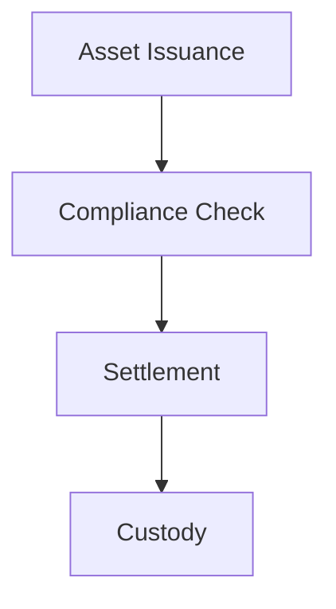

# Word-Compatible Markdown Formatting

## Purpose

All bid output documents must use markdown that converts cleanly to Microsoft Word via pandoc or similar tools. These rules ensure consistent, professional formatting in the final delivered document.

## Headings: The Most Important Rule

**Do NOT number headings manually.** Word auto-generates section numbers from the heading hierarchy (Heading 1, Heading 2, Heading 3). If you write `## 1. Executive Summary`, Word will render it as "1. 1. Executive Summary" because it adds its own numbering. Write `## Executive Summary` instead.

Use ATX-style headings only: `#`, `##`, `###`

- `#` (H1) maps to Word "Heading 1". Use for major document sections. **Maximum 20 H1s per document.**
- `##` (H2) maps to Word "Heading 2". Use for subsections within an H1. **Maximum 10 H2s per H1 section.**
- `###` (H3) maps to Word "Heading 3". Use sparingly for sub-subsections.

Do NOT use setext-style (underline) headings. Do NOT skip heading levels (e.g., going from `#` directly to `###`).

**Think of it as building a Word document**: Your H1s are your chapter titles. Your H2s are the major topics within each chapter. Your H3s are the details within each topic. Word's Table of Contents generator will pick these up automatically.

## Text Formatting

- **Bold**: Use `**text**` for emphasis. Do NOT use `__text__`.
- *Italic*: Use `*text*` for secondary emphasis or figure captions.
- Do NOT use HTML tags (`<b>`, `<i>`, `<u>`, `<br>`, etc.)
- Do NOT use MDX components, JSX, or any templating syntax
- No frontmatter (YAML `---` blocks) in output documents
- No em dashes or en dashes anywhere. Use commas, semicolons, or restructure.

## Lists

- **Bullet lists** for unordered items, feature sets, and requirements
- **Numbered lists** only for sequential steps or ranked items where order truly matters
- Indent nested lists with 4 spaces (not tabs)
- Ensure blank lines before and after list blocks for proper rendering
- Do not mix numbered and bullet items at the same list level

## Tables

Use pipe-delimited tables (pandoc-compatible):

```
| Header 1 | Header 2 | Header 3 |
| --- | --- | --- |
| Cell 1 | Cell 2 | Cell 3 |
```

- Always include the header separator row
- Keep table content concise; long paragraphs in cells render poorly in Word
- **Keep tables small**: Maximum 6 to 8 rows in a single table. For longer data sets, split into multiple smaller tables with descriptive headings between them.
- For compliance matrices, break into category-level tables rather than one giant table

## Diagrams

Mermaid diagram code blocks are allowed and encouraged for architecture and workflow illustrations:

````

````

Keep diagrams simple and focused. One concept per diagram. Use descriptive node labels that make sense without surrounding context. These will be rendered as images during Word conversion.

## Page Breaks

Use a horizontal rule (`---`) on its own line between major sections as a page break hint. Pandoc converts `---` to a page break in Word output.

## Block Quotes

Use `>` for callouts or important notes:

```
> **Note**: This capability requires enterprise deployment configuration.
```

These render as indented blocks in Word and serve as visual emphasis.

## Images and Figures

- Reference images using standard markdown: ``
- Place figure captions as italic text on the line immediately below: `*Figure: System Architecture Overview*`
- Use descriptive alt text for accessibility
- PNG or JPEG format for Word compatibility

## Cross-References

- Use markdown links for internal document references: `[Section Name](#section-name)`
- Do NOT use wiki-style links (`[[page]]`)

## Code and Technical Content

- Avoid source code blocks in bid documents (IP risk and formatting issues in Word)
- For technical specifications, use tables instead of code blocks
- Inline code with backticks is acceptable for short technical terms like `ERC-3643` or `DvP`
- Mermaid diagram blocks are the exception to the "no code blocks" rule

## Document Structure Example

```
# Proposal for Digital Asset Platform

---

## Executive Summary

Content...

### Understanding Your Objectives

Content...

### Our Proposed Solution

Content...

---

## Solution Overview

Content...

### Asset Lifecycle Management

Content...

### Compliance Architecture

Content...
```

Note: No numbers in headings. Word handles numbering automatically.

## CSV as Mother Format for Tabular Data

For compliance matrices, pricing tables, and other structured data:

1. **Primary storage**: CSV file with clean, parseable data
2. **Presentation**: Markdown table generated from the CSV
3. **Derivatives**: Word/Excel tables imported from CSV

Benefits:
- Data remains machine-readable
- Easy to update and version control
- Can regenerate formatted tables automatically
- Requirements traceability stays accurate

## Mother Format Workflow

```
Edit Source (.md/.csv)
       ↓
Review and Approve Source
       ↓
Generate Derivatives (.docx/.xlsx)
       ↓
Submit to Client
       ↓
If Changes Needed: Edit Source, Regenerate
```

**Never edit derivatives directly.** Always return to the markdown or CSV source, make changes, and regenerate.

## DOCX Conversion

Use the canonical converter, not pandoc:

```bash
python3 scripts/markdown_to_docx.py output/proposal.md [output/proposal.docx]
```

The converter uses `templates/MASTER_TEMPLATE_LOCKED.docx` as the base template and handles Figtree font, SettleMint heading styles, Mermaid diagram rendering, TOC insertion, and cover page population. See `scripts/README.md` for full usage.
