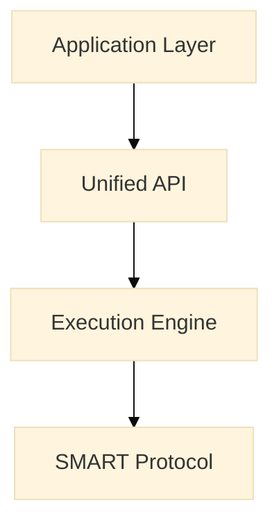
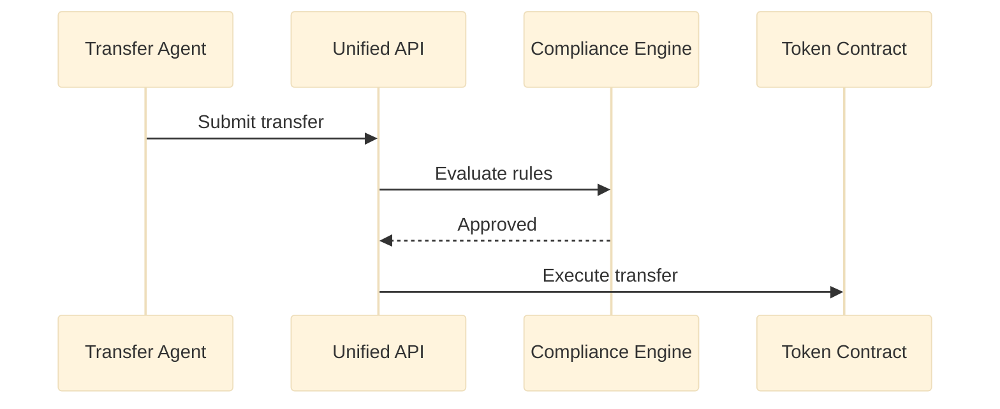
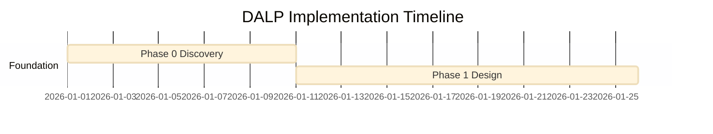
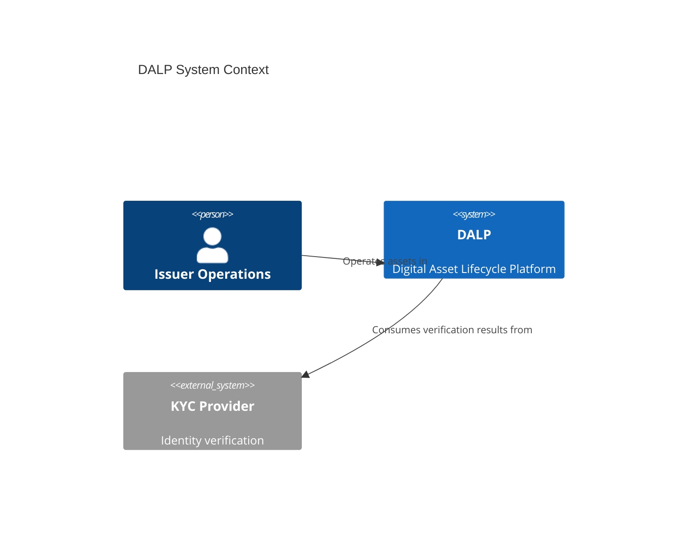
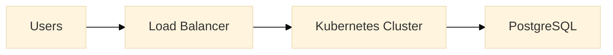
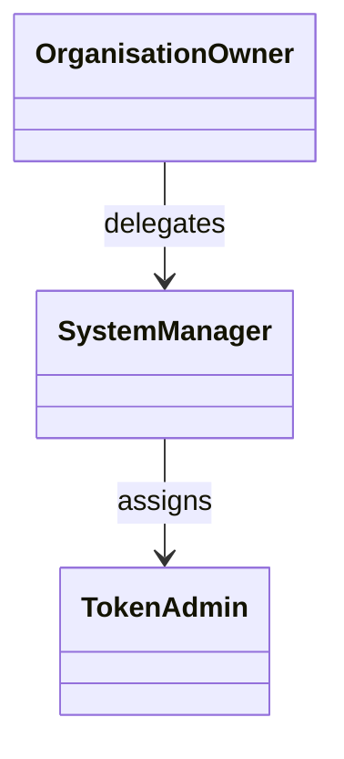
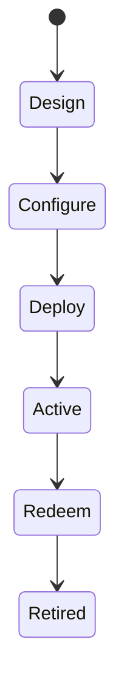
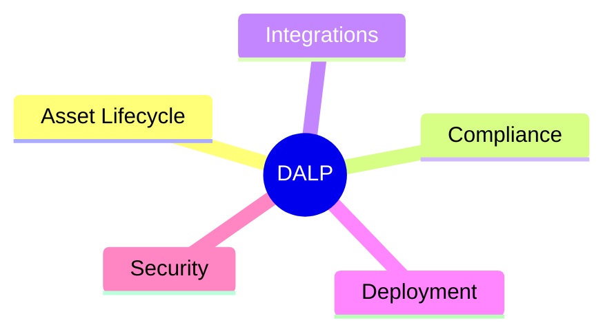

# Diagram Types for DALP Proposals

Use the simplest diagram type that explains the point clearly. If a flowchart works, do not force a C4 diagram. If state matters, do not fake it with boxes and arrows.

---

## 1. `flowchart TB` / `flowchart LR`

### Use when
- showing layered architecture
- showing data flow or process flow
- showing DALP components and how they connect
- showing asset creation or integration paths

### Do not use when
- order and timing between actors matters more than structure
- lifecycle states need explicit transition semantics
- you need schedule and duration

### Styling notes
- default choice for proposal diagrams
- use `TB` for layered stacks and phase flows
- use `LR` for ecosystem or deployment views
- apply full `classDef` palette from `STYLE-GUIDE.md`

### Example skeleton

---

## 2. `sequenceDiagram`

### Use when
- transfer approval logic matters
- API calls and middleware handoffs matter
- compliance modules evaluate in a clear sequence
- you need approve / reject branches

### Do not use when
- you are explaining static architecture
- the audience needs a system map, not timing
- there are too many actors for one readable lane layout

### Styling notes
- keep to 5-8 participants
- use `rect` groupings sparingly if needed
- use `Note over` for compliance or governance explanation
- keep message labels short and action-oriented

### Example skeleton

---

## 3. `gantt`

### Use when
- showing implementation phases
- showing mobilization to go-live sequence
- showing milestones, dependencies, and timeline structure

### Do not use when
- you need resourcing detail by named individual
- the schedule is too uncertain to show phase dates
- you need architecture, not timing

### Styling notes
- use phases 0-5 or equivalent delivery stages
- one line per workstream or milestone group
- do not overload with every micro-task

### Example skeleton

---

## 4. `C4Context` / `C4Container`

### Use when
- you need a formal system context view
- you need to position DALP against client actors and external systems
- the proposal audience expects architecture notation discipline

### Do not use when
- the diagram is simple enough as a normal flowchart
- the renderer does not support the Mermaid C4 syntax in the target toolchain
- proposal production speed matters more than notation purity

### Styling notes
- use only if the markdown → DOCX pipeline supports Mermaid C4 reliably
- otherwise, replicate the same concept in a standard flowchart
- keep actor names plain and business-readable

### Example skeleton

---

## 5. `graph`

### Use when
- showing network topology
- showing hosting zones, subnets, clusters, and service boundaries
- showing deployment relationships rather than business process

### Do not use when
- the diagram is really just a process flow
- timing, phases, or approvals matter more than topology

### Styling notes
- often interchangeable with `flowchart`
- use `graph LR` for left-to-right infrastructure diagrams
- keep infrastructure grouping clear: edge, runtime, data, chain access

### Example skeleton

---

## 6. `classDiagram`

### Use when
- showing roles and permission inheritance
- showing logical models such as tenant → system → asset role scope
- showing how IAM concepts relate

### Do not use when
- you are showing runtime architecture
- you need a state machine or process flow

### Styling notes
- keep methods and attributes minimal
- focus on relationships and grouping
- use for conceptual clarity, not UML ceremony

### Example skeleton

---

## 7. `stateDiagram-v2`

### Use when
- showing asset lifecycle progression
- showing operational exception states like pause or freeze
- showing post-maturity retirement logic

### Do not use when
- you need infrastructure or integration mapping
- you need call-by-call sequencing

### Styling notes
- keep one dominant happy path
- attach exception states explicitly
- use notes only where they add domain meaning

### Example skeleton

---

## 8. `mindmap`

### Use when
- showing DALP capability families
- showing business value or feature map summaries
- giving executives a quick orientation before deeper technical sections

### Do not use when
- precision matters
- flows, interfaces, or controls must be unambiguous
- the output needs technical implementation meaning

### Styling notes
- use sparingly in proposals
- best near executive summary or solution overview
- do not use as a substitute for architecture diagrams

### Example skeleton

---

## Recommended defaults for DALP proposals

| Need | Best type |
|---|---|
| 4-layer stack | `flowchart TB` |
| Client solution map | `flowchart LR` |
| Transfer compliance logic | `sequenceDiagram` |
| Asset lifecycle | `stateDiagram-v2` |
| Delivery plan | `gantt` |
| IAM / RBAC model | `classDiagram` or `flowchart TB` |
| SaaS or on-prem deployment | `graph LR` or `flowchart LR` |
| Capability summary | `mindmap` |

If the output pipeline struggles with a more exotic Mermaid type, fall back to `flowchart` unless the semantics would be lost.

## About SettleMint

### About SettleMint (300-400 words, 2-3 paragraphs)

- Write about: company founding (2016), mission, regulated-market focus, team composition, global delivery footprint, and institutional readiness.
- Include: 1 table (`Metric | Value`) with 6-8 approved company facts such as founding year, headquarters, operating regions, certifications, production track record, and target buyer segments.
- Include: a short subsection or bullet group covering leadership/team, offices or regional coverage, and certifications/audits where relevant to the bid.
- Tone: credible, factual, low-hype, procurement-safe.
- Reference: `bid-manager/content/01-company-profile/main.md`, `bid-manager/templates/company-profile.md`.
- Do not: invent headcount, revenue, investor details, office locations, or certification scope beyond approved sources.

## About DALP

### About DALP (350-500 words, 3-4 paragraphs or equivalent table-led structure)

- Write about: DALP as the Digital Asset Lifecycle Platform, its lifecycle coverage, key capabilities, deployment flexibility, and operational differentiators.
- Include: 1 capability matrix or layered table covering lifecycle pillars, integration surfaces, and differentiators most relevant to the bid.
- Cover explicitly: platform overview, supported operating scope, core capabilities, and why DALP is different from fragmented point-solution stacks.
- Tone: platform-led, precise, evaluator-friendly.
- Reference: existing DALP sources already listed in the skeleton, plus `bid-manager/content/01-company-profile/main.md` for narrative consistency where useful.
- Do not: drift into feature-spam, roadmap claims, or generic blockchain education.

## Customer References

### Customer References (700-1100 words total; 3-4 case studies)

- Write about: 3-4 references most relevant to the buyer's geography, asset class, regulatory setting, or operating model.
- Include: 1 summary table covering all approved references (`Client | Geography | Use Case | Deployment Scale | Outcome / Relevance`).
- For expanded examples, use a repeatable structure: context, challenge, DALP solution pattern, deployment scale, measurable outcomes, and transferability to this bid.
- Prefer: 3 expanded references in full variants, 2 in medium variants, compact table-only treatment in compact variants unless the skeleton explicitly requires more.
- Tone: evidence-backed, specific, non-promotional.
- Reference: `bid-manager/content/07-references/main.md`, `bid-manager/templates/case-studies.md`.
- Do not: add unapproved customer names, inferred metrics, or NDA-sensitive detail.

## Project Implementation & Delivery

### Project Implementation & Delivery (900-1400 words depending on variant)

- Write about: delivery methodology, implementation phases, indicative timeline, governance, RACI, milestones, gates, client dependencies, and delivery risks.
- Include: 1 phase table or Gantt-style timeline with phases, objectives, outputs, dependencies, and acceptance gates.
- Include: 1 compact RACI or role matrix showing SettleMint, client, and partner roles if relevant.
- Cover explicitly: methodology, phase objectives, milestone logic, hypercare/transition, and the decisions needed to stay on schedule.
- Tone: disciplined, realistic, execution-focused.
- Reference: `bid-manager/content/06-implementation/main.md`, `bid-manager/templates/implementation-plan.md`.
- Do not: present sample timelines as contractual commitments or hide client responsibilities.

## Deployment

### Deployment (500-900 words depending on variant)

- Write about: recommended deployment model, deployment alternatives considered, cloud/on-prem/hybrid options, infrastructure requirements, environment model, resilience, and data residency implications.
- Include: 1 comparison table covering Managed SaaS, private/dedicated cloud, on-premises, and hybrid where relevant.
- Include: 1 logical topology or environment summary showing how DALP fits the buyer's hosting model.
- Cover explicitly: infrastructure prerequisites (Kubernetes/OpenShift, PostgreSQL, Redis, object storage, ingress/network), DR/backup approach, and hosting responsibility.
- Tone: infrastructure-literate, non-speculative, requirements-driven.
- Reference: `bid-manager/content/04-deployment/main.md`.
- Do not: imply platform capability changes by deployment model or commit to unsupported residency/security claims.

## Support Appendix

### Support Appendix (400-700 words, appendix-style)

- Write about: support tiers, SLA commitments, severity definitions, escalation paths, maintenance/update policy, reporting cadence, and service-credit rules where approved.
- Include: 1 support-tier comparison table and 1 severity/response/resolution table.
- Cover explicitly: named channels, coverage hours, incident escalation path, maintenance windows, and any service credit mechanics approved for proposal use.
- Tone: operational, precise, contract-aware.
- Reference: `bid-manager/content/07-support-sla/main.md`, `bid-manager/templates/sla-framework.md`.
- Do not: change SLA values, uptime targets, or service-credit terms without approval.

