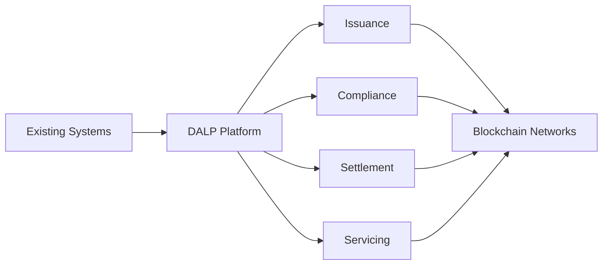

# Executive Summary Template

## Instructions

<!-- CUSTOMIZE: Replace all {placeholder} text with client-specific content. Remove this instructions section before finalizing. -->

This template produces a standalone 3 to 5 page executive summary. It should be comprehensible without reading the full proposal. Apply all setup rules: no numbered headings, no em/en dashes, no AI-tell markers. Write as a senior blockchain solution architect.

---

# Executive Summary

## {Client Name}, {RFP Title / Engagement Description}

**Submitted by:** SettleMint
**Date:** {YYYY-MM-DD}
**Response to:** {RFP Reference Number}

---

## Understanding Your Objectives

<!-- CUSTOMIZE: Paraphrase the client's stated requirements. Show understanding of their specific challenges. Reference industry, regulatory environment, and strategic goals. -->

{Client Name} is {seeking to establish/develop/expand} a digital asset platform to {primary objective: enable tokenization, streamline settlement, improve compliance, etc.}. The initiative responds to {market driver: regulatory evolution, operational efficiency, competitive pressure, etc.} and aims to {strategic outcome}.

The core challenge is not tokenization itself, that technology is increasingly accessible. The real complexity lies in doing it right at production scale: {specific challenge: meeting regulatory requirements, implementing proper governance, supporting the full asset lifecycle, ensuring early pilots scale into real institutional infrastructure, etc.}. This requires a platform that {key requirements: supports full asset lifecycle, enforces compliance at the protocol level, integrates with enterprise infrastructure, etc.}. {Client Name} recognizes that {insight about why point solutions or custom development fall short for institutional-grade implementation}.

The RFP emphasizes {specific themes from RFP: regulatory compliance, operational efficiency, time-to-market, risk reduction, etc.}. These priorities align with SettleMint's experience delivering digital asset infrastructure to regulated institutions.

---

## Our Proposed Solution

<!-- CUSTOMIZE: Present DALP as the answer. Focus on most relevant capabilities for this RFP. -->

SettleMint proposes the Digital Asset Lifecycle Platform (DALP) as the foundation for {Client Name}'s digital asset operations. DALP provides a platform that solves the complexity of doing digital assets right, unifying issuance, compliance, custody orchestration, settlement, and servicing in a single system. Institutions can launch digital assets without building blockchain expertise internally, without lengthy development cycles, and without navigating the complexity of reinventing infrastructure from scratch.

DALP addresses {Client Name}'s core challenge through {specific capability alignment}. The platform's {lifecycle approach / ex-ante compliance / atomic settlement / etc.} ensures {specific benefit for this client}. Rather than requiring institutions to assemble and integrate multiple point solutions, DALP provides a unified registry and control plane that eliminates reconciliation gaps and operational drift.

For {Client Name}, DALP delivers:

- **Full Lifecycle Management**: From issuance through redemption, covering {relevant asset types: bonds, equities, funds, deposits, etc.} with purpose-built lifecycle logic for each
- **Ex-Ante Compliance**: Protocol-level enforcement through ERC-3643 ensures compliance violations are structurally impossible, not merely detectable after the fact
- **Atomic Settlement**: True T+0 finality with Delivery-versus-Payment (DvP) and Exchange-versus-Payment (XvP) eliminates counterparty risk
- **Enterprise Integration**: API-first architecture connects to {relevant systems: core banking, custody, payment rails, risk management}
- **Deployment Flexibility**: {On-prem / cloud / hybrid} deployment matching {Client Name}'s infrastructure strategy

---

## Key Differentiators

<!-- CUSTOMIZE: Select 4 to 6 most relevant differentiators for this client. -->

**Unified Lifecycle Platform, Not Assembled Point Solutions**

DALP covers the complete asset lifecycle in one platform. {Client Name} avoids the integration burden, coordination overhead, and reconciliation gaps that come from assembling separate tools for each lifecycle stage. This reduces operational risk and accelerates time-to-market.

**Compliance Embedded at the Protocol Level**

DALP enforces compliance rules through ERC-3643 before transactions execute. For {Client Name}'s regulatory environment, this means {specific benefit: zero compliance breaches, simplified audits, regulator confidence, etc.}. Compliance officers configure rules through the UI without smart contract coding.

**Production-Proven at Scale**

SettleMint brings years of live production experience with regulated institutions. DALP has operated under institutional SLAs, processing high-volume transactions through security reviews and vendor risk assessments. This is infrastructure proven in real-world conditions, not experimental technology.

**T+0 Settlement with Atomic DvP**

DALP achieves true settlement finality without counterparty risk. Both asset and cash legs complete together or revert together. For {Client Name}, this means {specific benefit: reduced settlement risk, improved capital efficiency, operational simplification, etc.}.

**Enterprise Deployment on Your Terms**

DALP deploys {on-premises / in your cloud tenancy / as managed SaaS} according to {Client Name}'s requirements. Integration with existing identity systems, SIEM platforms, and custody relationships ensures DALP fits into your infrastructure, not the other way around.

**Composable Tokens + Configurable Compliance**

DALP's architecture is composable by design. A single audited token contract represents any financial instrument through runtime configuration, not separate codebases for each instrument type. Up to 32 token features (fees, yield, governance, maturity, conversion, voting) and 12 compliance module types (eligibility, jurisdiction, holding periods, investor limits, collateral) are independently selectable, composable, and reconfigurable post-deployment. For {Client Name}, this means the platform supports not just the initial asset class but the full product roadmap, new instruments and new compliance requirements are configuration changes, not development projects.

**Platform Approach, Not Custom Development**

Tokenization technology is increasingly accessible, but institutional-grade implementation is not. SettleMint delivers proven infrastructure configured to your needs, with compliance and governance embedded directly into the platform, not bespoke software that becomes technical debt. {Client Name} benefits from faster deployment, continuous platform improvements, and predictable costs without funding custom development risk.

---

## Implementation Approach

<!-- CUSTOMIZE: Adjust timeline based on scope and client constraints. -->

SettleMint follows a phased implementation methodology designed to achieve production readiness efficiently while managing risk:

**Phase 1: Discovery and Design (2 to 3 weeks)**
Requirements confirmation, solution architecture, integration planning, and governance framework definition.

**Phase 2: Configuration and Integration (4 to 6 weeks)**
Platform deployment, asset configuration, compliance rule setup, and system integrations. Enterprise integration activities run in parallel.

**Phase 3: Testing and Validation (2 to 3 weeks)**
Functional testing, integration testing, user acceptance testing, and security validation.

**Phase 4: Go-Live and Hypercare (1 to 2 weeks)**
Production deployment, initial transactions, operational handover, and knowledge transfer.

**Timeline Summary**:
- First asset type live: **4 to 8 weeks from contract signature**
- Additional asset types: **2 to 4 weeks each**
- Parallel workstreams accelerate enterprise integration

---

## Expected Outcomes

<!-- CUSTOMIZE: Tailor outcomes to client priorities identified in RFP. -->

With DALP, {Client Name} can expect:

- **Accelerated Time-to-Market**: Move from concept to live digital asset programs in weeks, not months, using pre-built asset templates and configurable compliance frameworks

- **Reduced Operational Risk**: Single source of truth eliminates reconciliation errors. Atomic operations keep ownership, compliance, and custody synchronized across the lifecycle.

- **Regulatory Confidence**: Ex-ante compliance enforcement prevents violations before they occur. Full audit trails embedded in the execution layer simplify regulatory reporting and examination.

- **Settlement Efficiency**: T+0 atomic settlement eliminates counterparty risk and the operational overhead of failed trades, reconciliation breaks, and manual interventions.

- **Strategic Flexibility**: Start with one asset class and jurisdiction, then expand across instruments and markets using the same platform, governance model, and operating framework.

- **Lower Total Cost of Ownership**: Unified platform replaces multiple vendor relationships. Configuration, not customization, means faster deployments and lower ongoing maintenance.

---

## Why SettleMint

<!-- CUSTOMIZE: Add specific reference to relevant project experience if available and approved. -->

SettleMint occupies a unique position in the digital asset infrastructure market. We are one of the few companies globally with a decade-long track record delivering blockchain and tokenization infrastructure at enterprise and national scale across demanding regulatory environments.

Our Digital Asset Lifecycle Platform (DALP) represents the consolidation of years of production experience into a unified platform. Unlike point solutions that address only issuance or trading, and unlike consulting-led approaches that build bespoke code, DALP provides proven infrastructure that institutions can deploy, configure, and operate.

{Optional: Reference specific project experience relevant to this client's sector, geography, or use case if approved for disclosure.}

SettleMint welcomes the opportunity to demonstrate DALP's capabilities through a proof of concept tailored to {Client Name}'s specific requirements. This would allow your team to evaluate the platform's fit with your infrastructure, compliance frameworks, and operational processes before committing to full deployment.

---

## Contact

For questions or clarifications regarding this proposal:

**SettleMint NV**
{Address if appropriate}

Primary Contact: {Name, Title}
Email: {email}
Phone: {phone}

---

*This executive summary provides a high-level overview of SettleMint's proposal. Detailed technical, commercial, and compliance information follows in subsequent sections.*
