# PlantUML Diagram Library: DALP Templates

> Purpose: A library of 20 PlantUML templates for diagram types that benefit more from PlantUML than Mermaid. Each template is tagged `[FIXED]` or `[VARIABLE]` so proposal authors know whether to reuse or customize it.

## Brand Skinparam Reference

Every diagram can rely on the renderer to inject brand skinparams, but the templates below are self-contained so they also work standalone.

```plantuml
skinparam BackgroundColor #FFFFFF
skinparam DefaultFontName Figtree
skinparam DefaultFontColor #000099
skinparam HyperlinkColor #0000FF
skinparam Shadowing false
skinparam RoundCorner 15
skinparam Padding 10
skinparam ArrowColor #000099
skinparam ArrowThickness 1.5
skinparam LineColor #000099
skinparam NoteBackgroundColor #F5F0B0
skinparam NoteBorderColor #BCA820
skinparam NoteFontColor #102848
skinparam PackageBorderColor #000099
skinparam PackageFontColor #000099
skinparam PackageBackgroundColor #D8E8F0
skinparam RectangleBackgroundColor #D8E8F0
skinparam RectangleBorderColor #000099
skinparam RectangleFontColor #000099
skinparam CardBackgroundColor #C0E0F0
skinparam CardBorderColor #284878
skinparam CardFontColor #284878
skinparam NodeBackgroundColor #C0F0C0
skinparam NodeBorderColor #187848
skinparam NodeFontColor #187848
skinparam ComponentBackgroundColor #C8A8E8
skinparam ComponentBorderColor #482068
skinparam ComponentFontColor #482068
skinparam InterfaceBackgroundColor #F2B8A0
skinparam InterfaceBorderColor #C05030
skinparam InterfaceFontColor #C05030
skinparam ArtifactBackgroundColor #B8D8E0
skinparam ArtifactBorderColor #1E4868
skinparam ArtifactFontColor #1E4868
skinparam CloudBackgroundColor #C0E0F0
skinparam CloudBorderColor #284878
skinparam CloudFontColor #284878
skinparam DatabaseBackgroundColor #B0C0D8
skinparam DatabaseBorderColor #183060
skinparam DatabaseFontColor #183060
skinparam QueueBackgroundColor #F5F0B0
skinparam QueueBorderColor #BCA820
skinparam QueueFontColor #102848
skinparam UsecaseBackgroundColor #F2B8A0
skinparam UsecaseBorderColor #C05030
skinparam UsecaseFontColor #C05030
skinparam ClassBackgroundColor #D8E8F0
skinparam ClassBorderColor #000099
skinparam ClassFontColor #000099
skinparam ClassAttributeFontColor #000000
skinparam ClassStereotypeFontColor #506878
skinparam ObjectBackgroundColor #C0F0C0
skinparam ObjectBorderColor #187848
skinparam ObjectFontColor #187848
skinparam ActivityBackgroundColor #D8E8F0
skinparam ActivityBorderColor #000099
skinparam ActivityFontColor #000099
skinparam ActivityDiamondBackgroundColor #F5F0B0
skinparam ActivityDiamondBorderColor #BCA820
skinparam ActivityDiamondFontColor #102848
skinparam SequenceLifeLineBorderColor #506878
skinparam SequenceLifeLineBackgroundColor #F2F2F2
skinparam SequenceParticipantBackgroundColor #D8E8F0
skinparam SequenceParticipantBorderColor #000099
skinparam SequenceParticipantFontColor #000099
skinparam SequenceActorBackgroundColor #F2B8A0
skinparam SequenceActorBorderColor #C05030
skinparam SequenceActorFontColor #C05030
skinparam SequenceArrowColor #000099
skinparam SequenceGroupBorderColor #284878
skinparam SequenceGroupBackgroundColor #C0E0F0
skinparam SequenceGroupHeaderFontColor #284878
skinparam SequenceBoxBorderColor #506878
skinparam SequenceBoxBackgroundColor #F2F2F2
skinparam PartitionBackgroundColor #C0E0F0
skinparam PartitionBorderColor #284878
skinparam PartitionFontColor #284878
skinparam LegendBackgroundColor #F2F2F2
skinparam LegendBorderColor #8898A8
skinparam LegendFontColor #000000
```

## 1. DALP Service Component Map `[FIXED]`
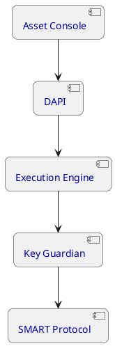

## 2. Client Integration Component View `[VARIABLE]`
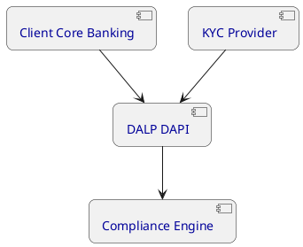

## 3. Platform Deployment Topology `[FIXED]`
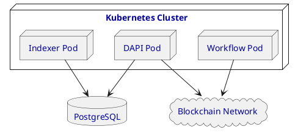

## 4. Multi-Environment Deployment `[VARIABLE]`
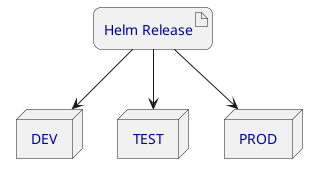

## 5. Activity: Token Issuance Approval `[FIXED]`
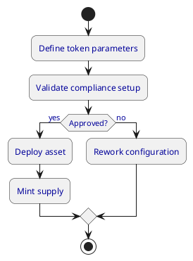

## 6. Activity: KYC Decision Path `[VARIABLE]`
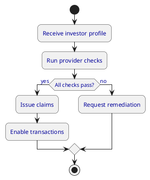

## 7. Use Case: Investor Operations `[FIXED]`
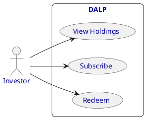

## 8. Use Case: Operations Console `[VARIABLE]`
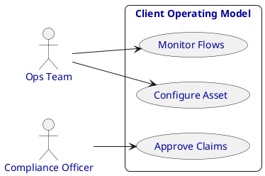

## 9. Class: Core Asset Model `[FIXED]`
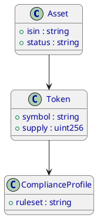

## 10. Class: Integration Model `[VARIABLE]`
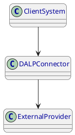

## 11. Object: Example Investor Snapshot `[FIXED]`
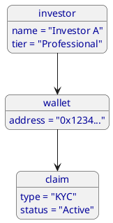

## 12. Object: Settlement Instance `[VARIABLE]`
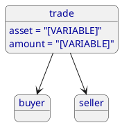

## 13. Package: DALP Domain Map `[FIXED]`
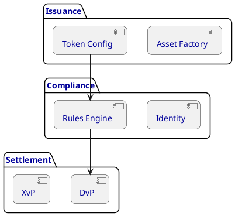

## 14. Package: Client Solution Map `[VARIABLE]`
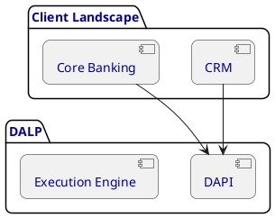

## 15. Network: Secure Access Topology `[FIXED]`
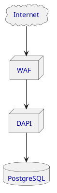

## 16. Network: Client Connectivity Model `[VARIABLE]`
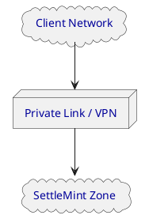

## 17. Component: Custody Integration `[FIXED]`
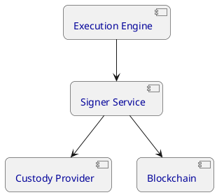

## 18. Deployment: High Availability Layout `[VARIABLE]`
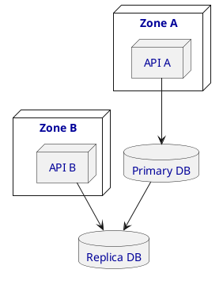

## 19. Activity: Incident Handling `[FIXED]`
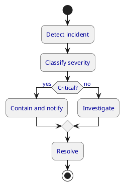

## 20. Use Case: Governance and Controls `[VARIABLE]`
```plantuml
@startuml
skinparam BackgroundColor #FFFFFF
skinparam DefaultFontName Figtree
skinparam DefaultFontColor #000099
skinparam RoundCorner 15
left to right direction
actor "Governance Lead" as GL
actor "Auditor" as AUD
rectangle "Control Framework" {
  usecase "Approve Policy" as C1
  usecase "Review Evidence" as C2
  usecase "Audit Activity" as C3
}
GL --> C1
GL --> C2
AUD --> C3
@enduml
```
