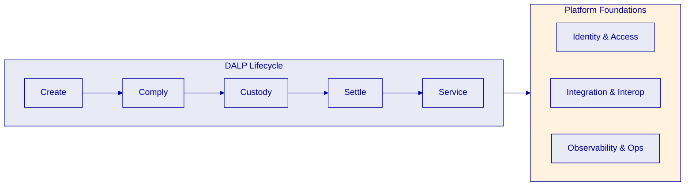
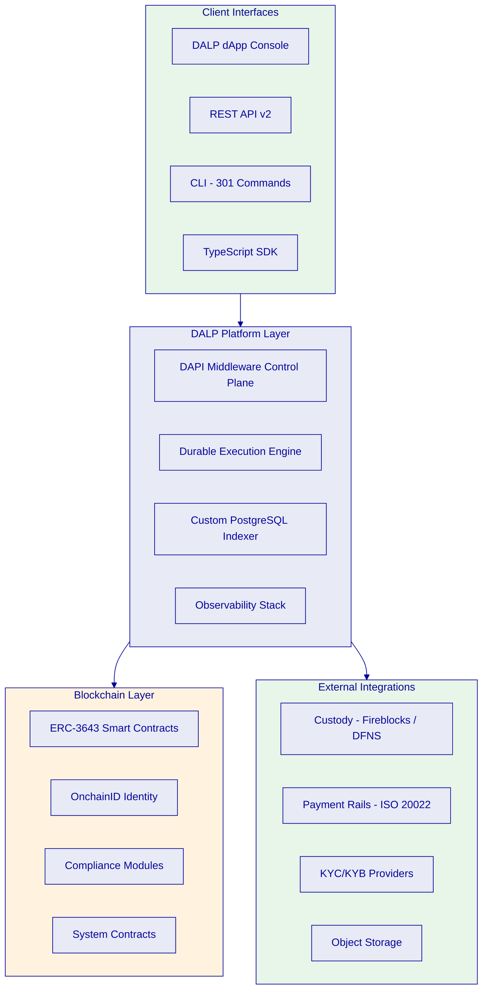
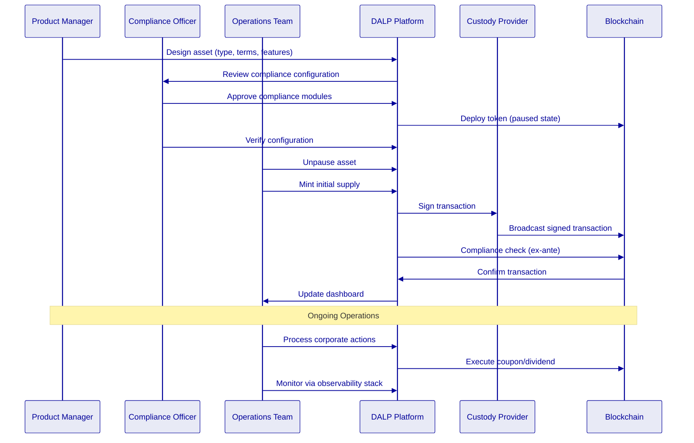
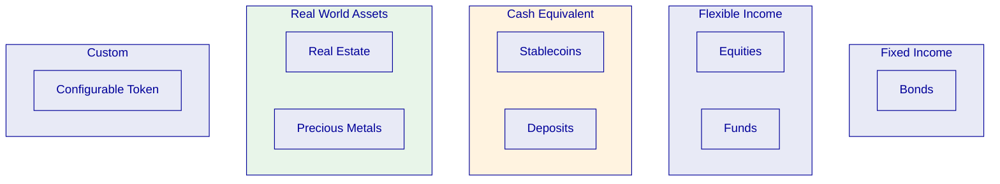
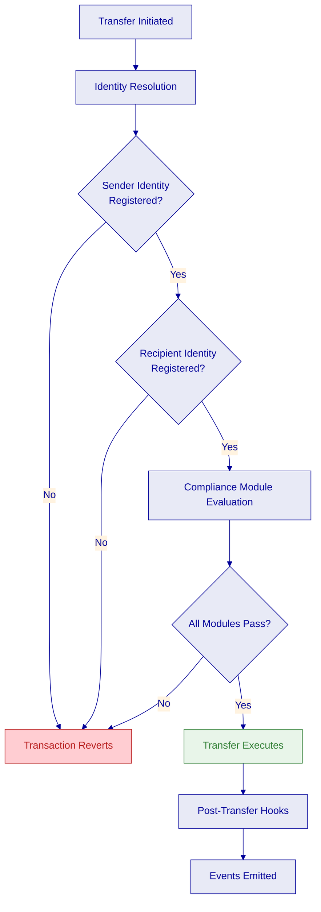
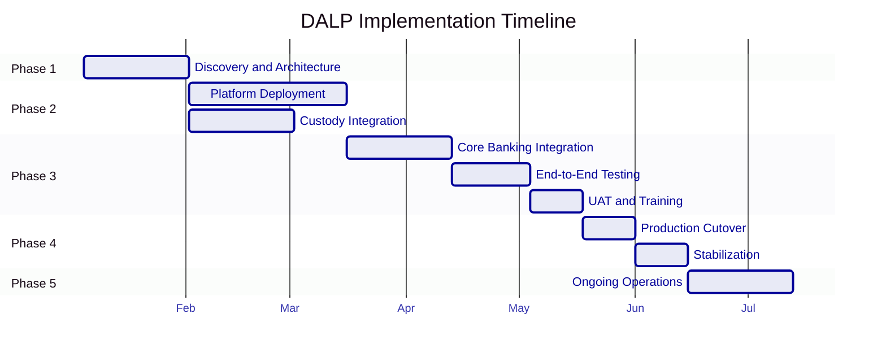

# RFI Response -- SettleMint DALP

**Digital Asset Lifecycle Platform**

---

# Cover Letter

[VARIABLE: per client]

*Instructions: Customize the cover letter for each RFI. Address the specific initiative, reference the client's stated objectives, and highlight the most relevant SettleMint experience. Keep to one page. Use letterhead formatting.*

---

[Date]

[Client Name]
[Client Title]
[Client Organization]
[Client Address]

**Re: Response to Request for Information -- [Initiative Name]**

Dear [Client Name],

SettleMint welcomes the opportunity to respond to [Client Organization]'s Request for Information regarding [initiative description]. We understand that [Client Organization] is seeking [brief restatement of what they want to achieve], and we believe our Digital Asset Lifecycle Platform (DALP) is uniquely positioned to support this initiative.

SettleMint brings nearly a decade of focused experience building blockchain infrastructure for regulated financial institutions and sovereign entities. Our platform currently powers live deployments at regulated banks across Asia and Europe, sovereign-scale programs in the Middle East, and institutional tokenization initiatives spanning bonds, equities, deposits, stablecoins, real estate, funds, and precious metals.

What distinguishes our response is the production maturity of our platform. DALP is not proof-of-concept tooling or a collection of loosely integrated components. It is a unified platform covering the full digital asset lifecycle, from asset design through issuance, compliance enforcement, custody integration, settlement, servicing, and retirement, operated under institutional SLAs with 24/7 uptime requirements for over seven years.

We have structured this response to address each area of your RFI in detail, providing both the technical depth your evaluation team requires and the strategic context your decision-makers need. We look forward to discussing how DALP can support [Client Organization]'s digital asset ambitions.

[VARIABLE: Add 1-2 sentences specific to the client's geography, asset class focus, or regulatory environment.]

Sincerely,

[SettleMint Signatory Name]
[Title]
SettleMint

---

# How to Read This Response

[FIXED]

This response is structured to address the full scope of a typical digital asset platform RFI. The table below maps common RFI evaluation areas to the corresponding sections of this document.

| RFI Evaluation Area | Response Section | Page |
|---|---|---|
| Company background, history, financial stability | Company Overview | -- |
| Platform architecture and technology | Platform Overview -- DALP | -- |
| Prior experience and references | Company and Relevant Experience | -- |
| Partner ecosystem and distribution model | Ecosystem and Distribution | -- |
| Solution design and responsibility allocation | Solution Positioning | -- |
| Operating model and governance | Target Operating Model | -- |
| Token design and asset class support | Tokenization Models | -- |
| Trade processing and integration | Trade and Transaction Processing | -- |
| Operational availability and uptime | Continuous Operation | -- |
| Blockchain and DLT support | Blockchain and Ledger Support | -- |
| Security, key management, data protection | Security and Key Management | -- |
| Identity, KYC/KYB, compliance, regulation | Identity, Compliance, and Regulatory Readiness | -- |
| Wallet and custody infrastructure | Wallet Infrastructure | -- |
| Implementation approach and timeline | Implementation Plan | -- |
| Pricing, licensing, support tiers | Commercial Model | -- |
| Coverage gaps and honest limitations | Coverage and Gaps Statement | -- |

[VARIABLE: Update page numbers after final formatting. Add or remove rows if the client's RFI uses different section headings.]

Where the client's RFI includes questions not covered by the sections above, a supplementary appendix with question-by-question responses can be added. The RFI Response Bank (internal reference) provides pre-written answers for over 60 common RFI questions.

---

# Company Overview

[FIXED]

## Who SettleMint Is

SettleMint is the digital asset lifecycle platform company for regulated financial markets and sovereign use cases. Founded nearly a decade ago and headquartered in Europe, SettleMint has grown from an early enterprise blockchain infrastructure provider into the category-defining platform company enabling financial institutions, market infrastructure providers, and sovereign entities to move real-world value on-chain with compliance, security, and operational reliability.

SettleMint is not a general-purpose blockchain vendor or a cryptocurrency platform. The company focuses exclusively on enabling regulated institutions to design, launch, and operate compliant digital asset programs. This singular focus, sustained over nearly a decade, has produced a depth of expertise and operational maturity that cannot be replicated quickly.

## Our Mission

SettleMint makes regulated digital asset tokenization compliant, secure, and scalable for financial institutions, market infrastructure providers, and governments. Through our Digital Asset Lifecycle Platform (DALP), we enable institutions to design, launch, and operate digital asset solutions across major asset classes and blockchain networks, with the governance, compliance, and reliability required for real-world deployment.

The company exists to solve the complexity of doing digital assets right. Tokenization technology is increasingly accessible, but institutional-grade implementation is not. The real challenge lies in meeting regulatory requirements, implementing proper governance, supporting the full asset lifecycle, and ensuring that early pilots can scale into real institutional infrastructure. As regulatory frameworks mature and expectations shift from innovation theatre to operational reality, most organizations remain stuck in pilot mode: isolated internal experiments, underestimated operational complexity, and architectures that do not scale or withstand regulatory scrutiny. SettleMint's mission is to enable regulated institutions to move from slides to balance sheets.

## Market Position and History

SettleMint is not a new entrant reacting to the latest tokenization wave. The company's evolution reflects the broader maturation of the digital asset market:

**Early enterprise blockchain era.** SettleMint built foundational distributed ledger infrastructure for some of the world's most demanding enterprise environments, spanning financial services, supply chains, telecoms, and government entities.

**Institutional adoption phase.** As financial institutions moved beyond proof-of-concept, SettleMint deepened its focus on the regulatory, governance, and operational requirements that separate pilot projects from production infrastructure. Multi-year continuous production deployments with regulated banks in Asia and Europe established SettleMint's credentials in compliance-heavy environments. Many of these programs began as innovation pilots and matured, using the same stack, into business-critical workflows, long-lived platforms under IT ownership, and reference architectures for broader institutional tokenization programs.

**Digital asset lifecycle era.** Recognizing that the market needed more than issuance tools or custody solutions, SettleMint consolidated years of production experience into DALP, providing end-to-end coverage from asset design through issuance, compliance, custody integration, settlement, servicing, and retirement.

Today, SettleMint operates at the intersection of digital assets and tokenization, institutional and sovereign infrastructure, and banking, capital markets, and government systems. Success in this market is not driven by innovation speed alone, but by the ability to make digital assets safe, compliant, operable, and repeatable at scale for regulated institutions.

## Production-Proven Credentials

SettleMint is one of the few companies globally with a decade-long track record delivering blockchain and tokenization infrastructure at enterprise and national scale, across some of the world's most demanding environments. Where trust, security, compliance, and uptime are non-negotiable, SettleMint removes execution risk and accelerates time to market.

The company's production credentials include:

- **Multi-year live deployments** with regulated banks and sovereign entities, delivering settlement finality, compliance enforcement, and operational availability that regulated environments demand. These are not sandboxes or pilot programs; they are business-critical workflows operating under institutional SLAs.

- **High-volume transactional flows** in payments and settlements, with platforms that have operated under 24/7 uptime requirements and strict resilience and disaster-recovery expectations.

- **Sovereign and national-scale programs** in the Middle East, including national real estate tokenization and sovereign-backed capital markets infrastructure. SettleMint is one of the few platforms powering country-scale tokenization initiatives.

- **Security-validated operations**: Deployments have passed security reviews, penetration testing, and vendor risk assessments typical of large financial institutions.

## Regulatory Readiness

SettleMint's platform is built for regulated environments from day one. Rather than treating compliance as an afterthought or an add-on layer, SettleMint embeds regulatory controls, policy enforcement, and auditability into the core architecture of DALP.

The platform supports compliance frameworks across multiple jurisdictions:

| Jurisdiction | Framework |
|---|---|
| European Union | MiCA (Markets in Crypto-Assets Regulation), GDPR |
| United States | Reg D, Reg S, Reg CF compliance modules |
| Singapore | MAS (Monetary Authority of Singapore) |
| United Kingdom | FCA (Financial Conduct Authority) |
| Japan | FSA (Financial Services Agency) |
| Gulf Cooperation Council | Regional frameworks, Islamic finance compatibility |

Native support for the ERC-3643 (T-REX) regulated token standard, combined with OnchainID for verifiable on-chain investor identities, provides a compliance architecture that enforces eligibility before execution, not after. This ex-ante compliance model, with 18 configurable compliance module types, enables institutions to navigate complex multi-jurisdictional requirements while maintaining the auditability and evidence trail that regulators expect.

## Three Pillars for Success

SettleMint's value to regulated institutions rests on three reinforcing pillars:

**Technology (DALP).** The Digital Asset Lifecycle Platform provides the infrastructure institutions need that need to operate tokenized assets at scale, under regulation. DALP covers the full digital asset lifecycle, from asset design and structuring through primary issuance, compliance enforcement, custody integration, settlement, servicing, corporate actions, and redemption, treated as one continuous lifecycle, not a set of disconnected workflows.

**Track Record.** Multi-year production deployments with regulated banks, sovereign entities, and market infrastructure providers. SettleMint's technology has been validated across real deployments over years in real-world conditions, across multiple regions and regulatory environments. Live deployments span bonds, equities, deposits, stablecoins, real estate, funds, and precious metals.

**Team.** A group with deep, cumulative experience in tokenization and financial infrastructure, combining technical depth, financial domain knowledge, and enterprise delivery expertise. The team has seen the full lifecycle of tokenization programs and built the operational discipline required to run mission-critical financial infrastructure. Over 200 years of combined banking and blockchain experience across the team.

## Company Facts

| Category | Detail |
|---|---|
| Founded | Nearly a decade ago |
| Headquarters | Europe |
| Focus | Digital asset lifecycle management for regulated markets |
| Regions | Europe, MENA, JAPAC |
| Live deployments | 7+ years continuous production at regulated banks |
| Asset classes | Bonds, equities, deposits, stablecoins, real estate, funds, precious metals |
| Platform | DALP (Digital Asset Lifecycle Platform) |
| Investors | Leading European and Middle Eastern investors |

## Client Verticals

SettleMint serves regulated institutions across several primary and secondary market segments:

**Primary Markets:**

- **Banks and Financial Institutions.** Transaction banking, debt capital markets, fund management, and treasury leaders moving from proof-of-concept to regulated production deployments.
- **Sovereign Entities and Regulators.** Technical teams at ministries, regulators, real estate registries, and central banks deploying secure, compliant digital asset infrastructure for national or sector-wide programs.
- **Market Infrastructures and Custodians.** CSDs, exchanges, and custodians expanding their capabilities to support tokenized instruments and new market models.

**Secondary Markets:**

- **Specialty Finance and Leasing.** Heavy machinery and high-value industrial financing, with production reference implementations in asset-heavy or lending businesses.
- **Real Estate.** Real estate developers, asset owners, and REITs exploring tokenized ownership, fractionalization, and new capital formation models.
- **System Integrators and Consulting Firms.** Global and regional SIs that design, build, and operate digital asset solutions on top of SettleMint for their clients.

---

# Platform Overview -- DALP

[FIXED]

## The Complexity of Doing It Right

Running a pilot or minting a token is straightforward. Production deployment that meets regulatory requirements, implements proper governance, supports the full asset lifecycle, and scales into real institutional infrastructure is where most institutions get stuck. DALP exists to solve this gap.

Building digital asset infrastructure from scratch requires assembling and integrating multiple point solutions: issuance tools, custody integrations, compliance engines, settlement protocols, and operational monitoring. This approach creates coordination overhead where every change requires cross-vendor coordination with no single accountable platform, extended timelines of 18 to 24 months of custom development versus weeks with DALP, compliance gaps where compliance is treated as an afterthought rather than embedded from day one, operational risk from having no unified registry, no atomic operations, and no comprehensive observability, and skills dependency where teams must maintain deep blockchain expertise alongside financial domain knowledge.

DALP eliminates these challenges by providing one platform covering the full lifecycle with a unified registry and control plane.

## What DALP Is

DALP is SettleMint's Digital Asset Lifecycle Platform for designing, launching, and operating tokenized assets across financial instruments and real-world assets, including bonds, funds, deposits, stablecoins, real estate, equities, and precious metals. It provides infrastructure that solves these hard problems from day one, so institutions can launch digital assets without building blockchain expertise internally, without lengthy development cycles, and without navigating the complexity of reinventing infrastructure from scratch.

Unlike point solutions that address only issuance, only custody, or only trading, DALP provides a unified platform covering the full digital asset lifecycle, from asset design through issuance, compliance enforcement, custody integration, settlement, servicing, and retirement, treated as one continuous lifecycle under a single governance model, security posture, and operating framework.

DALP sits between existing core financial systems and multiple blockchain networks, providing the governance and orchestration layer that enables institutions to build, deploy, and operate compliant digital asset solutions in production.

## Value Proposition

By consolidating issuance, compliance, custody, settlement, servicing, and reporting into a single integrated system with a unified registry and control plane, DALP delivers measurable business outcomes:

| Outcome | Detail |
|---|---|
| Accelerated Time-to-Market | 60 to 80% reduction in launch timelines through pre-built asset templates, jurisdictional compliance templates, and modern APIs |
| Reduced Operational Risk | Single source of truth eliminates multi-vendor drift and nightly reconciliations; atomic operations keep ownership, compliance, and custody synchronized |
| Regulatory Confidence | Compliance-by-design enforces eligibility before execution; auditable evidence of checks and approvals embedded in the system |
| Scalable Business Models | Expand across instruments, jurisdictions, and networks using the same control plane, rule engine, and operating model |
| Strategic Flexibility | Deploy on-prem, cloud, or managed SaaS; connect to existing custodians and payment rails; operate on public or private chains |

## Five Lifecycle Pillars

DALP is structured around five integrated core-lifecycle modules, each deployable independently or as part of a unified platform.

### Create (Issuance)

Rapid deployment of tokenized assets across seven asset classes, each with purpose-built lifecycle logic. The Asset Designer wizard provides multi-step validation, configurable compliance controls, and term structures per asset class. Deterministic issuance orchestration deploys tokens in a paused-by-default state with explicit unpause control for governance. A Configurable Token type enables institutions to digitize any asset class beyond the seven pre-built templates using a composable, feature-rich architecture with up to 32 pluggable features per token.

### Comply (Compliance)

Ex-ante enforcement ensures every transfer is validated before execution, not reviewed after. The compliance architecture includes 12 compliance module types covering country restrictions, investor accreditation, supply limits, holding periods, collateral backing, and transfer controls. Multi-jurisdictional support models complex requirements across EU MiCA, Singapore MAS, UK FCA, Japan FSA, US Reg D/S/CF, and GCC frameworks. OnchainID provides verifiable, on-chain investor identities with claim-based verification reusable across all assets.

### Custody

Enterprise-grade key management workflows with bring-your-own-custodian integrations. DALP orchestrates custody policy across existing custodian relationships, integrating with Fireblocks and DFNS for institutional-grade key management, signing, approval workflows, and provider-delegated transaction broadcast. DALP does not act as a custodian itself.

### Settle (Settlement)

Atomic Delivery-versus-Payment (DvP) and Exchange-versus-Payment (XvP) settlement. Both asset and cash legs complete together or both revert together, eliminating counterparty risk, reconciliation gaps, and operational drift. Local same-chain and HTLC cross-chain settlement models are supported. ISO 20022 integration supports SWIFT, SEPA, and RTGS connectivity on payment rails.

### Service (Servicing)

Automated lifecycle operations: coupon payments, yield distribution, dividend processing, redemptions, maturity handling, all executed programmatically across every asset type. This is the operational capability most platforms lack entirely, managing the asset from issuance through every event in its lifecycle to retirement.

DALP supports a full range of corporate actions through a combination of token features and operational workflows:

- **Coupon and dividend distribution.** Fixed Treasury Yield calculates pro-rata entitlements based on Historical Balance snapshots at record dates. The pull-based mechanism avoids gas-prohibitive iteration over thousands of holders.
- **Maturity and redemption.** Maturity Redemption blocks all transfers after the configured maturity date and enables atomic redemption of tokens for the denomination asset at face value.
- **Forced transfers.** The custodian role can execute transfers that bypass the compliance engine for court-ordered seizures, estate transfers, regulatory enforcement, and wallet recovery.
- **Freeze and unfreeze.** Individual investor wallets or partial amounts can be frozen, preventing all transfers while maintaining the frozen balance on record. Used for suspicious activity investigation, regulatory hold orders, and dispute resolution.
- **Pause and unpause.** The emergency role provides a circuit breaker that halts all operations on a token for security incident response, vulnerability discovery, or regulatory emergency orders.
- **Token conversion.** For convertible instruments, atomic conversion burns loan tokens and mints equity tokens in a single transaction.

## Supported Asset Classes

DALP provides purpose-built templates with asset-specific lifecycle logic for seven asset classes, plus a configurable token for custom assets:

| Asset Class | Key Capabilities |
|---|---|
| Bonds | Automated coupon schedules, maturity logic, redemption handling |
| Equities | Automated dividend distribution, voting rights, corporate action processing |
| Funds | Automated NAV integration, fractional units, fee structures, subscription/redemption |
| Deposits | Programmable interest, maturity, withdrawal rules |
| Stablecoins | Reserve monitoring, attestation integration, multi-currency support |
| Real Estate | Property title tokenization, fractional ownership, rental income distribution |
| Precious Metals | Asset-backed tokens, provenance tracking, chain-of-custody documentation |
| Configurable Token | Composable architecture with up to 32 pluggable features for novel asset classes |

## Architecture Overview

DALP's architecture is designed for reliability, security, and flexibility.

Key architectural components include:

- **DALP dApp.** Full operational console providing the user interface for asset management, compliance operations, identity administration, and monitoring.
- **DAPI (Durable API Service).** Backend API layer with a two-endpoint architecture: session-authenticated dApp access and API-key-based programmatic access, with hard enforcement of auth-method-to-endpoint affinity.
- **Durable Execution Engine.** Powers all stateful operations with workflow completion guarantees, idempotent retry, and cron patterns. Multi-step workflows survive process restarts and infrastructure failures.
- **Blockchain Layer.** ERC-3643-based smart contracts with DALP-specific extensions including seven asset class contracts, compliance hierarchy, system contracts, and addon factories.
- **Custom PostgreSQL Indexer.** Blockchain event indexer with zero-downtime reindexing, 18+ analytics views, and reorganization detection.
- **Observability Stack.** Pre-built dashboards with three-pillar observability: metrics, structured logs, and distributed traces across the full transaction lifecycle.

## Competitive Differentiation

The digital asset market has plenty of issuance tools and custody solutions. What it lacks, and what DALP uniquely provides, is the operational lifecycle layer that sits between them.

Competitors typically stop at issuance without lifecycle management, focus on custody without compliance or servicing depth, build infrastructure without applications (requiring extensive custom development), or serve a single regulatory regime, limiting geographic reach.

DALP's differentiation is the combination of five capabilities in one platform:
1. **Multi-asset lifecycle automation** across seven asset classes plus configurable tokens
2. **Ex-ante compliance enforcement** with 18 module types and multi-jurisdictional coverage
3. **Atomic settlement** with DvP/XvP guarantees eliminating counterparty risk
4. **Enterprise deployment flexibility** from on-premises to managed SaaS
5. **Multi-jurisdiction coverage** with configurable compliance for EU, US, Singapore, UK, Japan, and GCC frameworks

No competitor currently offers all five together. Most require institutions to assemble separate vendors for each capability, creating coordination overhead, integration risk, and accountability gaps. DALP provides a unified platform with a single governance model, security posture, and operating framework.

## Supported Standards and Protocols

| Category | Standards |
|---|---|
| Token Standards | ERC-20, ERC-721, ERC-1400, ERC-3643 (T-REX), ERC-5805 (voting power), EIP-2612 (permits) |
| Identity | OnchainID, claim-based verification, ERC-734/ERC-735 |
| Account Abstraction | ERC-4337 smart accounts, ERC-7579 modular validation |
| Compliance | 18 module types across eligibility, restrictions, transfer controls, issuance/supply, time-based rules, settlement/collateral |
| Settlement | Atomic DvP/XvP, HTLC cross-chain |
| Payment Rails | ISO 20022 (SWIFT, SEPA, RTGS) integration |
| Regulatory Frameworks | EU MiCA, US Reg D/S/CF, Singapore MAS, UK FCA, Japan FSA, GCC |
| Blockchain Networks | Any EVM-compatible network (public or private) |

## Integration and Interoperability

DALP is designed to operate within existing institutional environments, not replace them. The platform provides multiple integration surfaces for embedding digital asset capabilities into existing banking and financial infrastructure.

**REST API (v2).** Full CRUD and mutation access to every platform capability. API keys with HTTP-method-based scope enforcement ensure that read-only integrations cannot accidentally mutate state. Async transaction support via `Prefer: respond-async` header returns HTTP 202 responses with status polling endpoints, enabling banking middleware to safely queue and track blockchain operations.

**TypeScript SDK.** Typed SDK (@settlemint/dalp-sdk) for TypeScript integrators, providing a contract-bound REST client, blockchain-aware serializers, and a zero-dependency contract error mirror (534 error codes with metadata). The SDK enables core banking teams to integrate DALP operations into existing middleware without deep blockchain expertise.

**CLI.** 301 commands across 26 top-level groups covering system administration, token lifecycle, identity/KYC, compliance, monitoring, and all addon domains. The CLI enables both interactive administration and scriptable automation for operational workflows.

**Event Webhooks.** Configurable event-driven notifications push settlement events, compliance decisions, lifecycle state changes, and security events to downstream systems. All on-chain events are indexed and projected into queryable read models, enabling event-sourced integration patterns.

**Payment Rail Connectivity.** ISO 20022 integration supports SWIFT, SEPA, and RTGS connectivity for bridging on-chain settlement with traditional payment infrastructure. This is critical for DvP workflows where the asset leg settles on-chain while the cash leg settles through traditional payment channels.

**External Token Registration.** DALP supports governed onboarding of tokens from other platforms. This enables institutions to bring externally issued tokens under DALP's compliance and lifecycle management, providing a unified governance layer across tokens regardless of their origin.

**Object Storage.** Multi-provider object storage supports seven provider aliases: AWS S3, GCP Cloud Storage, Azure Blob Storage, S3-compatible, MinIO, RustFS, and local filesystem. A dual-bucket model separates public and private storage with path traversal protection.

## Deployment Flexibility

DALP supports multiple deployment models to meet institutional infrastructure and data residency requirements:

- **On-premises.** Full platform deployment on client-owned Kubernetes infrastructure within the client's data center or preferred cloud region. This model provides maximum data sovereignty and meets the most stringent regulatory requirements for data residency.
- **Cloud.** Deploy in any major cloud provider region (AWS, GCP, Azure). The institution controls the cloud account and data location. Cloud deployments benefit from managed Kubernetes services and reduce infrastructure management overhead.
- **Hybrid.** Split architecture with production on-premises and non-production in cloud, or any combination. This model balances data sovereignty for production workloads with the agility of cloud-based development and testing environments.
- **Managed SaaS.** SettleMint-operated deployment with institutional governance controls. The client retains governance and compliance configuration authority while SettleMint manages infrastructure operations, monitoring, and platform updates.

Helm-based deployment with documented chart configuration ensures reproducible deployments across environments. The Helm charts expose configuration options for resource sizing, network parameters, storage backends, security settings, and observability configuration. All deployment models produce identical platform behavior. The same compliance modules, token features, API surfaces, and operational tooling work identically regardless of whether the platform runs on-premises in a bank's data center or in a managed cloud environment. This means institutions can start with a managed SaaS deployment for rapid evaluation and migrate to on-premises for production without any platform behavior changes.

---

# Company and Relevant Experience

[FIXED]

## Reference Project Summary

SettleMint has delivered digital asset and blockchain infrastructure across 14 institutional and sovereign engagements. The table below provides a summary of all reference projects.

| Client | Use Case | Geography | Status |
|---|---|---|---|
| OCBC Bank | Security token engine; securitization, tokenization, fractionalization of off-chain assets | Asia | Production |
| KBC Securities (Bolero Crowdfunding) | Equity crowdfunding and SME loans; smart contracts for issuance, lifecycle, corporate actions, redemption | Europe | Production |
| KBC Insurance | NFTs as digital product passports for insured assets; valuation and claims processing | Europe | Production |
| Standard Chartered Bank | Digital Virtual Exchange; fractional tokenization of securities for institutional trading | Asia, Africa, Middle East | Production |
| Reserve Bank of India Innovation Hub | Multi-bank letter of credit trade finance; multi-node, multi-cloud blockchain | India | Production |
| Sony Bank (Sony Group, Japan) | Stablecoin issuance and management with integrated digital identity; KYC-enabled Web3 banking | Japan | Phase 1 Complete |
| State Bank of India | CBDC infrastructure; secure, scalable digital currency for financial inclusion | India | Pilot Complete, Production In Progress |
| Islamic Development Bank (Subsidy Distribution) | Sharia-compliant blockchain-based subsidy distribution across 57 member countries | MENA (57 countries) | Production |
| Mizuho Bank | Bond tokenization and trade finance; standard platform capabilities | Japan | PoC Complete, Production Planning |
| Islamic Development Bank (Market Stabilization) | Sharia-compliant market stabilization; algorithms and smart contracts to regulate collateral volatility | MENA | Production |
| Maybank (Project Photon) | FX tokenization and cross-border settlement; XvP model; MYRT token | Malaysia | Production |
| ADI / Finstreet | Tokenized equity on Abu Dhabi mainnet; corporate actions, on-chain voting, custody integration | UAE/GCC | Production |
| Commerzbank | Hybrid on/off-chain ETP issuance and management; near real-time clear and settle | Europe | Production |
| Saudi RER (Real Estate Registry) | Country-scale real estate tokenization; registration, fractionalization, digital marketplace | Saudi Arabia | In Progress |

## Detailed Case Studies

The following three case studies illustrate SettleMint's experience across different asset classes, geographies, and deployment scales.

[VARIABLE: Select the 3 most relevant case studies based on the client's asset class, geography, or use case. The full set is provided below. Reorder and emphasize the ones most aligned with the prospect's needs.]

### Case Study: Saudi Arabia Real Estate Registry (RER)

**Use case:** Country-scale blockchain infrastructure for real estate registration, fractionalization, and digital marketplace. Operated by the Real Estate Registry (RER) under the Real Estate General Authority (REGA), this initiative is central to the Kingdom's digital transformation under Vision 2030.

**Context:** The RER follows a "registry-as-truth" model, where the RER ledger serves as the conclusive record of property rights. The full journey covers listing and due diligence through identity verification, fee payment, escrow, and on-chain transfer to final update of the deed. The solution is guided by international best-practice benchmarks adapted to Saudi institutional context.

**Solution:** SettleMint is the delivery partner for the end-to-end solution: marketplace services, API gateway, blockchain and tokenization layer (powered by DALP), orchestration and integration with RER's core registry, billing, escrow, case worker, and government systems. The platform is exposed through the unified RER API Gateway for PropTechs, banks, and developers.

**Outcome:** First country-scale blockchain infrastructure dedicated to real estate registration, fractionalization, and digital marketplace, creating a single, regulated infrastructure for the Kingdom.

### Case Study: Commerzbank

**Use case:** Hybrid on/off-chain solution for issuing and managing exchange-traded products (ETPs).

**Solution:** Integration with Boerse Stuttgart's listing service and Commerzbank's issuance engine, with trades cleared and settled in near real time.

**Outcome:** Reduced counterparty risk, eliminated listing inefficiencies, and achieved settlement in under 10 seconds. The model identified potential savings of EUR 7 million annually.

### Case Study: Maybank (Project Photon)

**Use case:** FX tokenization and cross-border settlement using an Exchange-versus-Payment (XvP) model.

**Solution:** MYRT token (tokenized Malaysian Ringgit) issued in a controlled environment, fully backed by fiat balances. The solution enables atomic cross-currency swaps with simultaneous settlement of both legs to reduce counterparty and settlement risk. Implemented in alignment with Maybank's digital transformation strategy and Bank Negara Malaysia's Digital Asset Innovation Hub (DAIH).

**Outcome:** Scalable foundation for production deployment and expansion into broader tokenized deposit and cross-border settlement.

### Case Study: OCBC Bank

**Use case:** Security token engine for securitization, tokenization, and fractionalization of off-chain assets. Target segment: HNWIs and HENRYs, with investment products across bonds, SPVs, stocks, and real estate.

**Challenge:** Deliver innovative investment products with a secure end-user interface for tokenization, wallet management, and cash positions, and a backend with order book management and APIs to integrate with off-chain securities and cash systems.

**Solution:** SettleMint implemented a security token engine that enhanced liquidity for illiquid assets and expanded investment opportunities. The solution included a secure end-user interface and an order book management system for smooth transactions.

**Outcome:** OCBC Bank deployed an easy-to-administer and scalable digital asset exchange platform.

### Case Study: Sony Bank (Sony Group, Japan)

**Use case:** Issuance and management of stablecoins with integrated digital identity for regulated use.

**Challenge:** Build secure Web3 banking with KYC-enabled digital identity, fiat on-chain settlement, and compliance with unclear regulations, all within 3 months.

**Solution:** New ERC standard combining digital identity, a stablecoin engine, and asset tokenization, with investor onboarding through privacy-preserving identity verification while hiding technical Web3 complexity.

**Outcome:** Successful Phase 1 implementation, regulator-ready positioning, and a clear roadmap for production launch.

### Case Study: Standard Chartered Bank

**Use case:** Trading efficiency for institutional investors in high-growth regions (Asia, Africa, Middle East).

**Solution:** Blockchain-based Digital Virtual Exchange supporting fractional tokenization of securities (shares, bonds, currencies). Ownership changes recorded instantly and immutably on the blockchain, eliminating the need for custody intermediaries.

**Outcome:** Faster settlement times, greater transparency, and improved liquidity.

### Case Study: KBC Securities (Bolero Crowdfunding)

**Use case:** Equity crowdfunding platform expanded to include SME loans. Backend overhaul using smart contracts to replace manual processes.

**Challenge:** Rapid growth created significant administrative pressure; new regulations increased compliance burdens and threatened the platform's viability.

**Solution:** SettleMint overhauled the backend using smart contracts to automate issuance, lifecycle management, corporate actions, and redemption. The solution integrated digital wallets and a fiat-backed stable token to streamline on-chain transactions.

**Outcome:** Automation reduced operational costs, ensured regulatory compliance, and boosted scalability. Bolero Crowdfunding captured growth efficiently without incurring additional expenses.

---

# Ecosystem and Distribution

[FIXED base, VARIABLE specific context]

## Platform Infrastructure Positioning

SettleMint is a platform company, not a financial services operator or a consulting firm. This positioning is fundamental to understanding how SettleMint fits within the institutional technology landscape.

SettleMint does not trade, custody, or hold assets on behalf of clients. SettleMint does not operate exchanges or trading venues. This eliminates the structural conflicts of interest present in companies that both provide infrastructure and compete with their clients for transaction flow or custody fees.

The platform model means institutions get a technology partner whose incentives are aligned with making their digital asset programs successful, not one that competes for the same revenue.

## What SettleMint Provides vs. What Clients Build

SettleMint provides the platform infrastructure. Clients and their implementation partners build their specific digital asset solutions on top of this infrastructure.

**SettleMint provides:**
- DALP platform with all lifecycle modules (issuance, compliance, custody integration, settlement, servicing)
- Pre-built asset class templates and configurable token architecture
- Compliance module library with jurisdictional templates
- Identity infrastructure (OnchainID, claim management, trusted issuer registry)
- API, SDK, and CLI for programmatic access
- Observability and operations tooling
- Platform updates, security patches, and smart contract upgrades
- Support (Standard, Premium, or Enterprise tier)

**Clients build (or clients' implementation partners build):**
- Client-facing applications and user interfaces
- Custom integration with core banking and treasury systems
- Custom integration with payment rails
- Business process workflows specific to their operating model
- Client onboarding and investor relationship management
- Regulatory filings and legal documentation

## Partner Ecosystem

SettleMint has built a partner ecosystem to scale implementations and support local requirements across Europe, MENA, and Asia-Pacific:

- **Global Consultancies.** Trusted by leading consulting firms that design and implement digital asset programs for their clients.
- **Regional System Integrators.** Partnerships with regional SIs providing local market knowledge, regulatory expertise, and implementation capacity.
- **Infrastructure Providers.** Deep integrations with institutional custody platforms (Fireblocks, DFNS), payment rails (ISO 20022 for SWIFT, SEPA, RTGS), and cloud infrastructure providers.
- **Strategic Investors.** Backed by leading investors in Europe and the Middle East, with board-level financial services expertise.

[VARIABLE: Name specific partners relevant to the RFI geography or industry. Remove or add partner categories as appropriate for the specific client.]

The result is that institutions engaging with SettleMint are not just getting a platform. They are working with a team and ecosystem that has seen the full lifecycle of tokenization programs, from idea to production, and can anticipate the technical, operational, and regulatory challenges that arise at scale.

## Distribution Capabilities

DALP provides multiple distribution mechanisms for primary issuance beyond standard minting:

**Token Sale / Primary Offering.** A configurable sale contract supporting two-phase flow (optional presale to public sale), multi-currency ERC-20 payment acceptance, per-investor purchase limits, optional vesting, and soft-cap/hard-cap mechanics with refund safety. The token sale has a full API and UI stack with a five-tab operational console: overview, purchases, currencies, whitelist, and vesting. This enables institutions to run structured primary offerings with built-in investor limits, multi-currency acceptance, and vesting schedules, all under the same compliance enforcement as direct issuance.

**Airdrop Distribution.** Merkle tree-based token distribution with three variants: push airdrop (admin-initiated distribution to recipients), time-bound airdrop (windowed self-claim with start/end time enforcement), and vesting airdrop (two-phase initialize-then-claim with pluggable vesting strategies). All airdrop variants share Merkle proof verification, pluggable claim tracking, and 7-day timelocked withdrawal safety for operational security.

**Data Feed Integration.** Tokens can be connected to external data feeds for pricing, NAV calculation, and collateral valuation. Price feeds from oracles or authorized feed providers can be published to the platform and consumed by compliance modules (e.g., Token Supply Limit with base-price conversion for EUR/USD-denominated caps). Fund tokens can receive NAV updates that drive AUM fee calculations. Stablecoin tokens can verify collateral ratios against external proof-of-reserve feeds.

---

# Solution Positioning

[VARIABLE: responsibility split per client]

*Instructions: Customize the responsibility split for each RFI based on the client's internal capabilities, preferred implementation partners, and the scope of the initiative. The three-column framework below should be adapted for each engagement.*

## Responsibility Framework

The table below defines the responsibility allocation between SettleMint, SettleMint's integration capabilities, and the client's own systems and processes. This framework is indicative and will be refined during the Discovery and Architecture phase.

| SettleMint Provides | SettleMint Integrates | Client Provides |
|---|---|---|
| DALP platform (all lifecycle modules) | Core banking system connectivity | Core banking system and APIs |
| Seven asset class templates + configurable token | Custody provider integration (Fireblocks, DFNS) | Selected custody provider agreement |
| 12 compliance module types | Payment rail connectivity (ISO 20022) | Payment infrastructure (SWIFT, SEPA, RTGS) |
| OnchainID identity infrastructure | KYC/KYB provider integration | KYC/KYB provider agreement and data |
| REST API, SDK, CLI | External token registration | Client-facing applications and UIs |
| Observability stack | Data feed and price feed integration | Market data subscriptions |
| Platform support (selected tier) | Event webhook configuration | Downstream system event handlers |
| Smart contract upgrades and patches | Object storage provider integration | Infrastructure (Kubernetes, PostgreSQL, storage) |

[VARIABLE: Adjust rows based on the specific client's needs. Add rows for specific integrations mentioned in the RFI. Remove rows that are not relevant.]

## Solution Architecture

[VARIABLE: Include a solution architecture diagram specific to the client's environment. The diagram should show how DALP connects to the client's existing systems.]

The solution architecture will be finalized during the Discovery and Architecture phase, taking into account:

- The client's existing technology landscape and integration constraints
- Regulatory requirements specific to the client's jurisdiction and asset classes
- Deployment model preference (on-premises, cloud, hybrid)
- Custody provider selection and integration requirements
- Payment rail connectivity requirements
- Performance and scalability requirements

## What SettleMint Does Not Do

Clarity about boundaries is as important as clarity about capabilities:

- SettleMint does not provide consulting or custom software development. We provide a platform.
- SettleMint does not act as a custodian. We integrate with institutional custody providers.
- SettleMint does not perform KYC/KYB checks. We integrate with identity verification providers and manage on-chain identity state.
- SettleMint does not provide legal or regulatory advice. We provide compliance tooling that encodes and enforces the rules your counsel approves.
- SettleMint does not operate exchanges or trading venues. We provide the settlement and lifecycle infrastructure.

---

# Target Operating Model

[VARIABLE: per client workflow]

*Instructions: Customize the operating model for each client based on their organizational structure, governance requirements, and operational workflows. The framework below provides the template.*

## Lifecycle Workflow

The target operating model defines how the client's teams interact with DALP across the asset lifecycle. The diagram below illustrates a typical institutional workflow.

[VARIABLE: Modify the sequence diagram to reflect the client's specific organizational roles and approval workflows. Add or remove participants as needed.]

## Governance Model

DALP enforces governance through role-based access control (RBAC) with five defined roles, enforced both on-chain and off-chain:

| Role | Responsibility | Typical Client Owner |
|---|---|---|
| Default Admin | Role management; grant and revoke other roles | IT Security / Platform Admin |
| Governance | Configuration: compliance modules, token features, identity contracts | Compliance / Product |
| Supply Management | Minting, burning, batch operations | Operations / Treasury |
| Custodian | Freeze, forced transfer, wallet recovery | Operations / Risk |
| Emergency | Pause/unpause operations | Risk / CISO |

[VARIABLE: Map the DALP roles to the client's specific organizational structure and job titles.]

The role model enforces separation of duties at the smart contract level. The role authorized to configure compliance policies is distinct from the role authorized to issue tokens, which is distinct from the role authorized to freeze accounts or pause operations.

## Day-2 Operations

Once the platform is live, the operating model covers:

- **Asset lifecycle management.** Issuance, transfers, corporate actions, and redemption through the DALP dApp console or API.
- **Compliance monitoring.** Ongoing review of compliance module evaluations, claim expirations, and trusted issuer status.
- **Identity management.** Investor onboarding, KYC profile review, claim issuance and revocation.
- **Operational monitoring.** Pre-built dashboards for transaction monitoring, error rates, chain health, and latency.
- **Incident response.** Emergency pause capability, dead-letter transaction rescue, identity recovery workflows.
- **Platform updates.** Managed upgrades through the selected support tier (Standard, Premium, or Enterprise).
- **Distribution management.** Token sale administration with two-phase flow (optional presale to public sale), multi-currency ERC-20 payment acceptance, per-investor purchase limits, optional vesting, and soft-cap/hard-cap mechanics. Airdrop distribution via Merkle tree-based mechanisms with push, time-bound, and vesting variants.
- **Data feed management.** Price feed publication for NAV calculation, collateral valuation, and compliance module integration. External data feeds are submitted with EIP-712 signing for data integrity.

## Per-Asset Role-Based Access Control

Every token contract in DALP uses seven per-asset roles. Roles are scoped per asset: holding a governance role on Token A grants no power over Token B. This ensures that a multi-asset deployment maintains strict segregation between different asset programs.

| Role | Scope | Key Actions |
|---|---|---|
| Default Admin | Role management | Grant and revoke all other per-asset roles; no operational powers |
| Governance | Configuration | Set identity contracts, compliance modules, token features, metadata |
| Supply Management | Token supply | Mint, burn, batch operations, set supply cap |
| Custodian | Asset protection | Freeze addresses or partial amounts, forced transfers, wallet recovery |
| Emergency | Incident response | Pause and unpause operations, recover stuck ERC-20 tokens |
| Sale Admin | Token sale (addon) | Manage token sale configuration and lifecycle |
| Funds Manager | Sale funds (addon) | Withdraw funds from token sales |

The role model enforces hard separation-of-duties invariants at the smart contract level:

- Admin grants roles but has no operational powers; cannot mint, burn, freeze, pause, or configure.
- Supply Management cannot freeze; Custodian cannot mint. The entity issuing tokens is never the entity that can freeze or recover them.
- Emergency is limited to pause and recovery; cannot mint, configure compliance, or execute forced transfers.
- Governance configures policy; Supply Management executes issuance. The entity setting compliance rules does not control token supply.
- Sale Admin configures sales; Funds Manager withdraws proceeds. Separating sale lifecycle management from fund withdrawal prevents a single operator from both launching a sale and extracting its funds.

For production deployments, multi-signature or timelock governance is recommended to prevent unilateral configuration changes.

---

# Tokenization Models

[FIXED]

## Two Approaches to Tokenization

DALP supports two fundamental tokenization models, each suited to different use cases and institutional requirements.

### Digital Twin Model

The digital twin model creates on-chain representations of assets that continue to exist in traditional systems. The token is a digital mirror of an off-chain asset, maintaining a synchronized relationship between the on-chain record and the source system of record.

This model is typical for:
- Equities listed on traditional exchanges where the register of members remains off-chain
- Real estate where property title registries remain the legal source of truth
- Commodities where physical custody and provenance tracking span on-chain and off-chain systems
- Bonds issued under traditional frameworks where the paying agent manages lifecycle events off-chain

In this model, DALP provides the on-chain lifecycle management while integrating with existing systems that maintain the authoritative off-chain record.

### Native Issuance Model

The native issuance model creates assets that exist primarily on-chain. The blockchain record is the authoritative source of truth for ownership, and lifecycle events are executed directly on-chain.

This model is typical for:
- Digitally native bonds where the on-chain record is the register
- Stablecoins where issuance, transfer, and reserve management are on-chain
- Tokenized deposits where the on-chain record replaces traditional deposit tracking
- New financial instruments designed from inception for blockchain infrastructure

In this model, DALP provides the complete lifecycle infrastructure, from issuance through servicing to retirement.

## Seven Asset Classes

DALP provides purpose-built templates for seven asset classes. Each template includes asset-specific lifecycle logic, pre-configured compliance module sets, and relevant token features.

**Bonds.** Fixed-income securities with automated coupon schedules, maturity logic, and redemption handling. Token features include Fixed Treasury Yield for coupon payments, Maturity Redemption for end-of-life processing, and Historical Balances for record-date snapshots. Compliance modules typically include capped supply limits and jurisdiction-specific investor eligibility.

**Equities.** Share tokenization with automated dividend distribution, governance voting power (ERC-5805 compatible), and corporate action processing. Historical Balances enable point-in-time shareholder records for governance and corporate actions.

**Funds.** Investment fund units with AUM-based management fees (inflationary model where fee tokens are minted to the fee recipient), NAV integration, and fractional unit support. Voting power enables investor governance over fund strategy.

**Deposits.** Programmable deposit tokens with configurable interest, maturity, and withdrawal rules. Intentionally minimal feature set, serving as a general-purpose tokenized cash equivalent that can be extended with additional features as needed.

**Stablecoins.** Fully compliant issuance with collateral backing enforcement via the Collateral Compliance Module. Reserve monitoring validates that minting cannot exceed on-chain proof of reserves. Supports multi-currency operations and regulatory reporting.

**Real Estate.** Property title tokenization with fractional ownership structures. Deploys with a fixed supply cap representing property valuation, with premint of the full supply and burn disabled to preserve real estate unit integrity.

**Precious Metals.** Asset-backed tokens following a pooled custody model where supply grows as vault deposits increase. No supply cap, because the token supply reflects actual vault holdings. Each token unit represents a claim on a specific weight of metal in custody.

## Configurable Token Architecture

Beyond the seven pre-built asset classes, DALP's Configurable Token enables institutions to deploy custom asset types without writing new smart contract code. The DALPAsset contract provides a unified, upgradeable token built on the ERC-3643 standard, with runtime-configurable extensions through the ISMARTFeature interface.

At the core of DALP's token system is DALPAsset, a unified, upgradeable token contract that integrates identity verification, compliance enforcement, access control, and configurable token economics into a single coherent architecture. DALPAsset extends the ERC-3643 standard with the SMARTConfigurable extension, which allows any combination of token features to be attached and reconfigured at runtime, after the token is deployed. This eliminates the need to commit to a specialized contract type at deployment time. A DALPAsset token can evolve: start as a simple bearer instrument, then have fee features added, governance enabled, or maturity redemption configured, all without redeploying.

DALPAsset contracts are deployed through the Asset Factory, a controlled deployment pipeline that ensures every token created on the platform inherits the correct security model, compliance hooks, and access control structure. The factory is a security boundary, not merely a convenience wrapper, preventing misconfigured or unauthorized token deployments. The deployment workflow is durable and idempotent: if any step fails, the deployment can resume from the last successful step without creating orphaned contracts or inconsistent state.

### Available Token Features

| Feature | Category | Description |
|---|---|---|
| AUM Fee | Fees | Time-based management fee; inflationary model minting to fee recipient |
| Transaction Fee | Fees | Per-transaction fee deducted from transfer amount |
| Transaction Fee Accounting | Fees | Tracks fees per transaction for off-chain reconciliation without on-chain collection |
| External Transaction Fee | Fees | Fixed fee in a separate ERC-20 token per operation |
| Voting Power (ERC-5805) | Governance | Delegated governance voting with historical tracking |
| Historical Balances | Governance | Point-in-time balance and total supply queries via checkpoints |
| Permit (EIP-2612) | Utility | Gasless approvals via off-chain signatures |
| Maturity Redemption | Lifecycle | Bond maturity lifecycle with atomic redemption for denomination asset |
| Fixed Treasury Yield | Lifecycle | Fixed-rate yield distribution with pull-based claims |
| Conversion | Lifecycle | Cooperative two-contract design for convertible instruments |

Features integrate through six lifecycle hooks: pre-operation gates, post-mint processing, post-burn processing, post-transfer processing, post-redemption processing, and initialization when a feature is first attached. Features with rewriting support can modify the transfer amount in-flight, for example deducting a fee before the amount reaches the recipient. Features execute in the order configured by the caller, making ordering an explicit design decision.

Features are attached at runtime, not compiled in, meaning configuration changes do not require new deployments. Fee rates can be adjusted, compliance modules can be added or removed, and governance parameters can be updated through the platform's API or UI, gated by the Governance role.

### Configuration vs. Custom Development

The traditional approach to security token engineering requires requirements gathering (2 to 4 weeks), custom smart contract development (4 to 8 weeks), security audit (4 to 12 weeks), deployment and testing (2 to 4 weeks), and ongoing maintenance where every change triggers a new development-audit-deploy cycle. Total timeline: 3 to 7 months per instrument type, at $200K to $500K per audit.

DALP replaces this with configuration: select a preset or start from DALPAsset (minutes), configure token features (hours), configure compliance modules (hours), deploy through the Asset Factory (minutes), and manage ongoing changes at runtime. Total timeline: hours to days per instrument type.

This is not "low-code" or "drag-and-drop." It is a structured selection of pre-audited, formally verified smart contract modules that compose into a coherent financial instrument. Every token feature and compliance module has been independently audited. Composing audited modules does not require re-auditing the composition. The Asset Factory ensures that every token deployed through DALP has identical security properties: there is no variance between deployments.

### Example Custom Configurations

**Convertible Bond.** Features: Maturity Redemption + Fixed Treasury Yield + Conversion (loan-side) + Historical Balances. Compliance: MiCA template + Investor Count limit. Behavior: Pays coupon until maturity, with conversion option to equity token at configured ratio. If converted before maturity, loan tokens are burned and equity tokens minted atomically.

**Revenue-Sharing Token.** Features: Transaction Fee + Transaction Fee Accounting + Historical Balances + Voting Power. Compliance: Reg D 506(c) template (accredited investors only). Behavior: Every transfer generates a fee to the treasury; holders have governance rights over fee distribution.

**Over-Collateralized Deposit Token.** Features: Historical Balances + Permit. Compliance: Collateral Compliance Module (150% ratio) + Identity Verification (KYC + AML expression) + Country Allow List. Behavior: Every mint requires 150% collateral backing verified via on-chain claims. Permits enable institutional custody workflows.

---

# Trade and Transaction Processing

[FIXED base, VARIABLE integration specifics]

## Transaction Processing Architecture

DALP implements a durable 11-state async transaction pipeline for all blockchain mutations:

**RECEIVED** to **QUEUED** to **PREPARING** to **PENDING_APPROVAL** to **SIGNING** to **BROADCASTING** to **CONFIRMING** to **COMPLETED** (or **FAILED**, **DEAD_LETTER**, **CANCELLED**)

Key characteristics of this pipeline:

- **Idempotency.** Composite unique index on sender address, chain ID, and idempotency key prevents duplicate submissions. Banking systems can safely retry operations without duplicate transaction risk.
- **Durable execution.** All stateful operations run through the durable execution engine, which guarantees workflow completion through infrastructure failures and process restarts.
- **State validation.** Explicit valid-transitions map with terminal state checks, covering standard, native-broadcast, and approval-required processing paths.
- **Detailed error classification.** 20 sub-statuses provide precise failure diagnostics: REVERTED, INSUFFICIENT_BALANCE, NONCE_CONFLICT, SIGNING_FAILED, BLOCKED_BY_POLICY, APPROVAL_EXPIRED, and more.
- **Revert decoding.** Solidity errors are decoded into human-readable messages with sub-status classification, enabling operational forensics on any failed transaction.
- **Dead-letter rescue.** Operators can requeue dead-lettered transactions for retry.

## API Surface

DALP provides multiple programmatic interfaces for trade and transaction processing:

- **REST API (v2).** Full CRUD and mutation access to all platform capabilities. API keys with HTTP-method-based scope enforcement. Async transaction support via `Prefer: respond-async` header with HTTP 202 responses and status polling.
- **TypeScript SDK.** Typed SDK with contract-bound REST client, blockchain-aware serializers, and zero-dependency contract error mirror (534 error codes with metadata).
- **CLI.** 301 commands across 26 top-level groups covering system administration, token lifecycle, identity/KYC, compliance, monitoring, and all addon domains.
- **Event Webhooks.** Configurable event-driven notifications for downstream system integration: settlement events, compliance decisions, lifecycle state changes.

## Integration Patterns

[VARIABLE: Customize integration specifics based on the client's existing systems and requirements.]

DALP integrates with core banking systems, payment rails, and downstream systems through several patterns:

- **Synchronous API.** Direct REST API calls for operations requiring immediate confirmation.
- **Asynchronous pipeline.** HTTP 202 responses with status polling for operations that require blockchain confirmation. Idempotent operations enable safe retry from banking middleware.
- **Event-driven.** Webhook notifications for real-time integration with downstream systems. All on-chain events are indexed and projected into queryable read models.
- **SDK embedding.** TypeScript SDK for embedding DALP operations into existing banking middleware and integration layers.

**What is native vs. what requires adapters:**

DALP natively provides asset lifecycle management, compliance enforcement, identity management, settlement coordination, and observability. Integration with specific core banking systems, payment rail endpoints, and CRM/investor management systems requires deployment-specific adapter configuration defined during the Discovery and Architecture phase.

## Settlement Capabilities

DALP provides atomic settlement through two models:

**Local (same-chain) DvP/XvP.** Both legs of the transaction (asset delivery and payment) execute on the same blockchain in a single atomic transaction. Either both legs complete successfully or both revert, eliminating counterparty risk entirely. The settlement contract validates compliance on all legs before execution, ensuring that a multi-party settlement cannot partially complete and leave one counterparty exposed.

**HTLC (cross-chain) settlement.** For scenarios where the asset and payment legs reside on different blockchain networks, DALP supports Hash Time-Locked Contract settlement. This provides atomic guarantees across chains: either both parties receive their respective assets within the time window, or the transaction expires and both parties can reclaim their original assets.

Settlement closure is deterministic: every settlement resolves to one of three auditable end-states (executed, cancelled, or expired-withdrawn). Closure-readiness checks validate that all preconditions are met before attempting finalization.

ISO 20022 integration connects on-chain settlement to traditional payment rails. This means DALP can coordinate the on-chain asset leg with SWIFT, SEPA, or RTGS payment instructions for the fiat leg, bridging the on-chain and off-chain settlement worlds.

## Error Handling and Diagnostics

DALP ships 534 structured error codes with metadata including severity, audience, retryability, suggested action, and i18n translations in four locales. Every compliance failure, transaction error, and operational issue returns a specific, decoded error code that operational teams can act on. This structured error model transforms operational support from "something broke" to "this specific rule prevented this specific action for this documented reason."

---

# Continuous Operation

[FIXED]

## Operational Availability

DALP's architecture supports 24/7 continuous operation for blockchain-layer components while recognizing that certain business processes operate within defined hours.

| Component | Availability | Notes |
|---|---|---|
| Blockchain network | 24/7 | On-chain state is always available |
| DALP API and dApp | 24/7 | Platform services designed for continuous availability |
| Transaction pipeline | 24/7 | Async pipeline processes transactions continuously |
| Indexer | 24/7 | Continuous event processing with zero-downtime reindexing |
| Observability stack | 24/7 | Continuous monitoring and alerting |
| Support (Standard) | Business hours (8:00 to 18:00 CET) | Email and portal |
| Support (Premium) | Extended (6:00 to 22:00 CET) | Dedicated channel, emergency weekend coverage |
| Support (Enterprise) | 24/7 | Dedicated on-call SRE, managed upgrades |

## Resilience and Recovery

DALP's architecture provides multiple layers of resilience:

- **Durable execution.** All stateful operations guarantee workflow completion through infrastructure failures and process restarts. Multi-phase workflows persist state at each phase transition.
- **Blockchain as source of truth.** On-chain state is inherently replicated across the blockchain network. DALP's indexer can rebuild its entire read model from on-chain events through reindexing.
- **Zero-downtime reindexing.** Rotating deployment schemas with pass-through views ensure read availability during indexer reconstruction.
- **Kubernetes-native.** Helm-based deployment provides standard infrastructure resilience: pod auto-restart, node failover, and rolling updates.

## Monitoring and Alerting

DALP ships operational tooling for institutional environments that gives operations teams full visibility into platform health, transaction flow, and compliance activity.

**Pre-built dashboards.** Four primary dashboard views ship out of the box: operations overview (system health, throughput, error rates), transaction monitoring (pipeline state distribution, latency percentiles, failure analysis), compliance activity (module evaluations, claim issuance, identity operations), and security events (authentication failures, role changes, forced operations). These dashboards require no custom configuration and are available immediately after deployment.

**Three-pillar observability.** DALP implements the three pillars of modern observability: metrics for quantitative system health (VictoriaMetrics), structured logs for event-level forensics, and distributed traces for request-level path analysis. Distributed tracing spans the full transaction lifecycle from API entry through queue processing, signing, broadcast, and confirmation, including external custody provider calls (Fireblocks, DFNS). This means operations teams can trace a single transaction from the moment it enters the API to the moment it is confirmed on-chain, identifying exactly where delays or failures occur.

**Blockchain health monitoring.** The observability stack includes dedicated blockchain infrastructure monitoring with health collection, timeline aggregation, summary cards, and live server-sent event (SSE) snapshot streaming. Threshold-based classification with three-sample hysteresis prevents flapping health signals, giving operators stable, trustworthy health indicators.

**Automated alerting.** Configurable alert rules with branded notification templates deliver actionable context when thresholds are breached. Alerts include firing/resolved state tracking, so operators know both when a problem starts and when it clears. Integration with institutional notification channels (Slack, Teams, email, PagerDuty) routes alerts to the right teams.

**Transaction observability.** The async transaction pipeline exposes state transitions for every in-flight operation. Operators can view pipeline state distribution, identify bottlenecks, and rescue dead-lettered transactions. The 11-state lifecycle with 20 sub-statuses provides precise diagnostics for any transaction in any state.

---

# Blockchain and Ledger Support

[FIXED]

## EVM-First Strategy

DALP supports any EVM-compatible blockchain network. This is a deliberate architectural decision: deep capability coverage on a proven, widely adopted virtual machine rather than shallow multi-protocol support that spreads engineering effort thin.

The EVM ecosystem provides:
- The largest developer ecosystem and tooling infrastructure in blockchain
- Audited smart contract standards (ERC-20, ERC-3643, ERC-4337)
- Broad institutional adoption across both public and permissioned deployments
- Multiple proven client implementations

## Supported Network Types

DALP operates on three categories of EVM networks:

**Public networks.** Ethereum mainnet, Polygon, Avalanche, and other public EVM chains. Suitable for use cases requiring public verifiability, broad interoperability, and decentralized settlement.

**Permissioned/private networks.** Private EVM networks deployed and managed via DALP's infrastructure tooling. Suitable for institutional use cases requiring controlled participation, regulatory compliance with data residency requirements, and governance over validator sets.

**Multi-network.** Simultaneous operation across public and private networks within a single DALP deployment. Enables hybrid architectures where different asset classes or jurisdictions operate on different networks while sharing a unified governance and compliance layer.

## Network Feature Coverage

| Capability | Public EVM | Private EVM | Notes |
|---|---|---|---|
| Token issuance and lifecycle | Full | Full | All asset classes supported |
| Compliance enforcement (ERC-3643) | Full | Full | All 18 module types |
| Identity management (OnchainID) | Full | Full | Claim-based verification |
| Atomic DvP/XvP settlement | Full | Full | Same-chain settlement |
| Cross-chain settlement (HTLC) | Supported | Supported | Between any two EVM networks |
| Transaction monitoring | Full | Full | Health collection, timeline aggregation |
| Smart contract upgrades (UUPS) | Full | Full | Directory-managed upgrades |
| Provider-delegated broadcast | Full | Full | Via Fireblocks or DFNS |

## Honest Limitations: Non-EVM Networks

DALP does not support non-EVM blockchain networks (e.g., Hyperledger Fabric, Corda, Solana, Cosmos). This is a deliberate scope decision:

- ERC-3643 and OnchainID are Ethereum-native standards. Porting them to non-EVM environments would require rebuilding the compliance and identity infrastructure from scratch.
- DALP's smart contract architecture, including the compliance module system, token feature hooks, and system contracts, is built on Solidity and the EVM execution model.
- Attempting to support every blockchain would dilute the depth of capability that makes DALP reliable for regulated environments.

For institutions requiring non-EVM support, DALP can operate as the compliance and lifecycle layer on EVM networks while interfacing with non-EVM systems through integration adapters at the application layer. This approach is scoped during the Discovery and Architecture phase.

## Multi-Chain Operations

DALP supports simultaneous operation across multiple blockchain networks within a single deployment. This enables architectures where different asset classes, jurisdictions, or client segments operate on different networks while sharing a unified governance and compliance layer. The platform abstracts chain-specific details (gas estimation, nonce management, transaction confirmation) while maintaining identical token architecture, compliance rules, and access control across chains.

The multi-chain model is particularly relevant for institutions that need public chain verifiability for certain asset classes while maintaining private chain control for others. A bank might operate deposit tokens on a private network (for data privacy and regulatory compliance) while issuing bond tokens on a public network (for broader secondary market access), all managed through a single DALP deployment.

## Smart Contract Upgrade Path

DALP uses the UUPS (Universal Upgradeable Proxy Standard) pattern for smart contract upgrades. This provides the ability to upgrade contract implementations without changing contract addresses or disrupting existing integrations:

- **Implementation upgrades.** The underlying DALPAsset implementation can be upgraded to add new capabilities, fix bugs, or optimize gas usage. Updating the implementation address in the directory upgrades all tokens simultaneously.
- **Feature upgrades.** Individual token features can be upgraded independently of the token contract.
- **Compliance module upgrades.** Compliance modules can be replaced or upgraded without touching the token contract.
- **Governance controls.** All upgrades require appropriate role authorization.

This upgrade path means institutions are never locked into a specific contract version. As DALP evolves, deployed tokens gain access to new capabilities without redeployment or migration.

---

# Security and Key Management

[FIXED]

## Authentication Architecture

DALP implements a hardened two-endpoint authentication model:

**Session-authenticated endpoint (`/api/rpc`).** The dApp frontend connects through this endpoint using session/cookie authentication. API keys are explicitly blocked on this endpoint, creating a hard security boundary that prevents programmatic key-based access from reaching the interactive session surface.

**API-key-authenticated endpoint (`/api/v2`).** Programmatic access uses this endpoint with API keys scoped by HTTP method: read-only for GET/HEAD/OPTIONS, read-write for POST/PUT/PATCH/DELETE. This prevents API key escalation across endpoints.

**CLI authentication.** Browser-based device login with API-key issuance and secure credential persistence using the operating system's native credential store (macOS Keychain on Apple systems, permission-checked configuration files elsewhere).

## Authorization and Access Control

DALP implements role-based access control (RBAC) with five defined roles enforced both on-chain and off-chain:

- **On-chain enforcement.** Access Manager contracts manage role grants and revocations on the blockchain, providing immutable role assignment evidence.
- **Off-chain enforcement.** Route-level permission middleware checks user roles before handler execution. Each API route declares required permissions explicitly.
- **Organization-scoped access.** Users can belong to multiple organizations with different roles in each. Active-organization persistence is membership-gated.
- **On-chain/off-chain synchronization.** Organization role sync middleware reconciles on-chain access-control state into organization membership roles on every authenticated request.

## Key Management

DALP provides key management through Key Guardian with multiple storage backends:

| Backend | Use Case |
|---|---|
| Encrypted database storage | Development and small deployments |
| HashiCorp Vault | Production environments |
| GCP Secret Manager | Google Cloud-native deployments |
| AWS Secrets Manager | AWS-native deployments |

For institutional custody, DALP integrates with Fireblocks and DFNS (see Wallet Infrastructure section).

## Data Protection

**Data in transit:**
- All API communications encrypted via TLS
- Blockchain node communication uses standard Ethereum JSON-RPC over HTTPS
- Inter-service communication within the Kubernetes cluster follows standard service mesh security practices

**Data at rest:**
- Secrets management supports multiple provider backends with a consistent security interface
- Object storage supports seven provider aliases (AWS S3, GCP Cloud Storage, Azure Blob Storage, S3-compatible, MinIO, RustFS, local filesystem) with dual-bucket model (public and private)
- Production safety checks reject default development signing keys in production environments

## Security Controls

- **Path traversal protection** in object storage with cross-drive guards
- **Input validation** via schema-based validation across all API endpoints
- **Timing-safe HMAC verification** for presigned URL validation
- **Production safety guards** preventing deployment of development-only credentials
- **Wallet verification** with multi-factor gates (PIN, TOTP, backup codes) for privileged transaction signing

## Certifications

SettleMint holds ISO 27001 and SOC 2 Type II certifications. The company's deployments have passed security reviews, penetration testing, and vendor risk assessments typical of large financial institutions. These assessments are conducted as part of institutional onboarding processes.

## Data Residency

DALP supports flexible deployment models aligned with data residency requirements:

- **On-premises deployment** within the client's data center or preferred cloud region
- **Cloud deployment** in any major cloud provider region, where the institution controls the cloud account and data location
- **Hybrid deployment** with production on-premises and non-production in cloud

Network data remains on the selected blockchain network(s). Off-chain data (user profiles, KYC data, configuration) resides in the PostgreSQL database within the client's chosen deployment environment.

For European institutions subject to GDPR, the platform's deployment flexibility ensures that personal data never leaves the EU, or whichever jurisdiction the institution operates in. Object storage for documents and attachments uses a dual-bucket model (public and private) with path traversal protection, and supports seven provider aliases to match the institution's existing storage infrastructure.

## Async Transaction Pipeline Security

The transaction pipeline implements multiple security controls relevant to institutional environments:

- **Composite unique index** on sender address, chain ID, and idempotency key prevents duplicate transaction submission. Banking systems can safely retry operations with identical idempotency keys without risk of double execution.
- **Optimistic-lock state transitions** prevent concurrent modification of transaction state.
- **Terminal state enforcement** prevents transitions out of completed, failed, or cancelled states.
- **Dead-letter audit trail** records every state transition for transactions that enter the dead-letter queue, enabling forensic analysis of failure paths.
- **Revert decoding** transforms opaque Solidity revert bytes into human-readable error messages with structured metadata, enabling operational teams to understand exactly why a transaction failed without deep blockchain expertise.

---

# Identity, Compliance, and Regulatory Readiness

[FIXED]

## OnchainID: Verifiable On-Chain Identity

Every participant in a DALP-managed token system has an OnchainID: a smart contract deployed on-chain that stores verifiable claims about the holder's identity. OnchainID is not a self-sovereign identity wallet in the consumer-Web3 sense. It is a platform-managed identity contract that serves as the trust anchor for compliance decisions.

An OnchainID contract stores:
- **Claims.** Signed attestations about the identity holder (e.g., KYC verified, AML cleared, accredited investor, professional investor)
- **Claim Topics.** Numeric identifiers that categorize claims
- **Management Keys.** Cryptographic keys authorized to manage the identity contract
- **Claim Issuers.** References to the trusted entities that signed each claim

The core design property is that claims are issued by trusted third parties, not self-asserted. A wallet holder cannot declare themselves accredited or KYC verified. A registered trusted issuer must attest to that fact by writing a signed claim to the holder's OnchainID contract. This trust model maps directly to how financial services work: eligibility is determined by regulated intermediaries, not by the participant.

## Identity Registry and KYC Lifecycle

The Identity Registry maps wallet addresses to OnchainID contracts. Before any token transfer can execute, the compliance engine resolves both sender and recipient through this registry. If either party does not have a registered identity, the transaction fails immediately.

The KYC lifecycle in DALP supports multi-version KYC profiles with an explicit review workflow:

- **Approve.** The submission is accepted with a verified content hash that becomes the claim value for the KYC topic.
- **Reject.** The submission is declined with a documented reason (minimum 10 characters).
- **Request Update.** The submission requires additional information, creating an action request with required fields and optional due dates.

Claims are checked at execution time, not only at onboarding. If a claim expires, gets revoked, or the issuer is no longer trusted, future transfers fail even if historical transfers succeeded. This continuous compliance model is exactly what regulated institutions need.

## Trusted Issuer Hierarchy

DALP implements a three-tier trusted issuer resolution model:

| Level | Scope | Example |
|---|---|---|
| Subject-scoped | Issuer trusted for a specific identity | A specialized compliance provider for a specific investor's jurisdiction |
| System-scoped | Issuer trusted by a tenant or system deployment | The institution's primary KYC/AML provider |
| Global | Issuer trusted platform-wide | The identity factory contract |

Resolution follows a "most specific wins" model: subject-scoped overrides system-scoped, which overrides global. This hierarchy allows institutions to maintain a general trust framework while accommodating specific exceptions.

## Compliance Architecture

DALP enforces compliance ex-ante: every transfer is validated against eligibility rules, identity claims, and jurisdictional constraints before execution, not checked after the fact. This prevents non-compliant transfers from creating immutable on-chain evidence of violations.

### Compliance Enforcement Flow

### Two-Layer Policy Model

DALP's compliance operates through a deliberate two-layer enforcement model:

**Layer 1: DALP On-Chain Compliance.** The on-chain compliance layer where DALP's modules execute, enforcing transfer rules via ERC-3643 hooks. This layer enforces identity eligibility, jurisdictional restrictions, transfer policies, temporal controls, and issuance controls.

**Layer 2: Custodian Policy Enforcement.** Rules enforced by custodians for assets held in external custody. These are controls that operate outside DALP's on-chain scope but remain part of the overall compliance posture, including custodian-specific KYC/AML requirements, segregation of duties, and regulatory reporting obligations.

Neither layer can override the other. Both must be satisfied for a transfer to be operationally complete. This dual enforcement model is what regulators actually expect: layered controls with clear accountability at each level.

### Three-Tier Compliance Interface Hierarchy

DALP's compliance contracts use a three-tier interface hierarchy that separates system-wide, per-token, and standard-compliant concerns:

| Tier | Interface | Scope |
|---|---|---|
| Tier 1 | Global Compliance | System-wide bypass list, global modules, token-compliance binding |
| Tier 2 | Token Compliance | Per-token compliance hooks with dual v1/v2 support |
| Tier 3 | SMART Compliance V2 | ERC-3643 aligned 3-argument hooks for new tokens |

This hierarchy enables incremental migration of individual tokens to the latest compliance standard without requiring a coordinated platform-wide cutover. An institution that deployed a bond token two years ago under v1 can continue operating that token unchanged while deploying new tokens under v2.

## Compliance Module Catalog

DALP supports 12 concrete compliance module types organized into six categories:

| Category | Module | Description |
|---|---|---|
| Eligibility | Identity Verification | Logical expressions (RPN) over identity claims for investor eligibility |
| Eligibility | Identity Allow List | Positive list of specific identities permitted to receive assets |
| Eligibility | Identity Block List | Negative list of specific identities blocked from receiving assets |
| Restrictions | Country Allow List | Only recipients from specified countries may receive assets |
| Restrictions | Country Block List | Recipients from blocked countries may not receive assets |
| Restrictions | Address Block List | Specific wallet addresses blocked regardless of identity status |
| Transfer Controls | Transfer Approval | Explicit pre-authorization required; one-time use, expiry-based |
| Transfer Controls | TimeLock | Holding period enforcement with FIFO batch tracking |
| Issuance and Supply | Token Supply Limit | Minting limits: lifetime, fixed-period, or rolling-period caps |
| Issuance and Supply | Capped Compliance | Simple circulating supply cap |
| Time-Based | Holding Period | Temporal constraints on transfer activity |
| Settlement/Collateral | Collateral Compliance | Reserve proof required before minting can proceed |

Each module is independently configurable per asset. Modules compose through sequential evaluation: a transfer succeeds only if all active modules pass (fail-closed design). Inside individual modules, more complex logic can exist through RPN (Reverse Polish Notation) expression evaluation, enabling arbitrary logical combinations of claims without hardcoding specific regulatory frameworks into the contract.

### Module Composition and Evaluation

DALP composes rules through sequential module orchestration. Every configured module is evaluated in order. A transfer succeeds only if all active modules pass. This creates an AND relationship at the module level. Inside individual modules, more complex logic can exist: Identity Verification can evaluate AND, OR, and NOT across claims; Investor Count can filter who counts through its own expression logic; Transfer Approval and TimeLock can use exemption expressions.

The recommended evaluation ordering places cheap and restrictive checks first: identity existence and basic eligibility, then country restrictions, then identity and address lists, then manual approval and timelock, then investor counts and supply limits, and finally collateral or advanced issuance controls. This fail-fast ordering reduces gas costs for rejected transfers and provides clearer error messages.

DALP does not auto-resolve conflicting rules. A single veto blocks the transfer. If identity verification passes but the country block list fails, the transfer is blocked. If country allow list passes but investor count is exceeded, the transfer is blocked. This is the correct institutional model. Compliance conflicts should fail closed, ensuring the most restrictive interpretation always prevails.

### Post-Transfer State Updates

After a transfer executes, DALP calls module post-hooks within the same transaction to update compliance state. Investor counts increment or decrement, TimeLock records acquisition timestamps and batches, transfer approvals are consumed if one-time use, and rolling windows update accumulated issuance totals. If any post-hook fails, the entire transfer reverts, preserving consistency between balances and compliance-state projections.

### Claim Topic Vocabulary

DALP ships with a broad set of preset verification topics across four domains. Investor verification topics include knowYourCustomer, antiMoneyLaundering, accreditedInvestor, accreditedInvestorVerified, qualifiedInstitutionalInvestor, professionalInvestor, and regulationS. Issuer verification topics include issuerLicensed, issuerJurisdiction, issuerProspectusFiled, issuerProspectusExempt, and issuerReportingCompliant. Asset verification topics include collateral, uniqueIdentifier, assetClassification, basePrice, assetIssuer, and assetLocation. These topics are enforcement inputs: compliance modules evaluate whether an identity has a valid claim, whether the issuer is trusted for that topic, whether the claim has expired, and whether the expression logic is satisfied.

### Auto-Claim Integrity

DALP adds validation at claim issuance time that goes beyond bare ERC-3643 implementations. Boolean investor/compliance topics only accept the literal string "true." KYC claims require a DALP-resolved target identity with an approved profile and verified content hash. Topic names are resolved against the registered topic-scheme list before dispatching issuance. This closes a common institutional risk: a "trusted issuer" pushing arbitrary or malformed claims into the system.

## Regulatory Framework Mapping

| Regulatory Framework | DALP Implementation |
|---|---|
| MiCA (EU) | Identity Verification with KYC+AML expression, Country Allow List for EU states, Token Supply Limit with EUR-denominated caps, Collateral Compliance for stablecoins |
| Reg D 506(c) (US) | Identity Verification with accredited investor claim, Transfer Approval, Investor Count limits |
| Reg D 506(b) (US) | Expression-based logic combining accredited and sophisticated investors, Investor Count limits |
| Reg S (US) | Regulation S claim, Country Block List for US |
| MAS (Singapore) | Identity Verification with KYC+AML or QII expression, Country Allow List, TimeLock for holding periods |
| FCA (UK) | Identity Verification with professional investor claims, jurisdiction restrictions |
| FSA (Japan) | Identity Verification with QII carve-out expression, Country Allow List |

DALP provides compliance tooling, not compliance guarantees. Regulations vary by jurisdiction and evolve over time. The platform enables institutions to encode and enforce their compliance requirements, but legal interpretation remains the institution's responsibility.

## Real-World Compliance Scenario: Regulated Bond Issuance

To illustrate how these components work together in practice, consider a European bank issuing a EUR 100M regulated bond to professional and institutional investors under MiCA and MiFID II frameworks, with a 5-year term, semi-annual coupon, 90-day lock-up for initial investors, maximum 500 holders, and manual transfer approval for OTC secondary market transfers.

**Identity and claim layer configuration:** Investors must hold knowYourCustomer (with content hash verification), antiMoneyLaundering, and either professionalInvestor or qualifiedInstitutionalInvestor claims. The issuer identity holds issuerLicensed, issuerProspectusFiled, and issuerReportingCompliant claims. Trusted issuers are configured at three levels: global (identity factory), system-scoped (primary KYC/AML provider, regulated administrator), and subject-scoped (legal counsel for issuer-specific topics).

**Compliance module configuration (in evaluation order):**
1. Identity Verification: Expression requiring KYC + AML, plus either professional or QII status
2. Country Allow List: EU 27 member state country codes
3. Investor Count: Global limit of 500 holders
4. TimeLock: 90-day hold period with exemption for QII investors
5. Transfer Approval: Required for secondary market transfers, 48-hour approval window, one-time use
6. Token Supply Limit: EUR 100M cap using base-price conversion

**Operational workflow:** Before launch, trusted issuers are registered, investor claims are issued to pre-qualified buyers, issuer-side compliance claims are issued, the token is deployed in paused state, compliance configuration is reviewed and signed off, and the token is unpaused. During issuance, any investor without valid identity claims cannot receive allocation. Any issuance beyond the cap fails on-chain. During secondary trading, the compliance engine checks identity verification, country allow list, investor count, timelock, and transfer approval for every transfer. If any check fails, the transaction reverts with a specific error code.

**Ongoing compliance events:** If an investor's AML claim expires, future transfers fail until re-verified. If the trusted KYC issuer changes, old claims become invalid and re-verification is required. If a country is added to the block list, investors in that country can no longer receive the token. Every compliance decision is recorded on-chain through events, creating a complete, immutable audit trail.

---

# Wallet Infrastructure

[FIXED]

## Bring-Your-Own-Custodian Model

DALP supports a bring-your-own-custodian model. The platform does not act as a custodian itself. Instead, it orchestrates custody policy across existing custodian relationships, integrating with institutional custody providers while retaining admission control and workflow state management.

## Custody Provider Integrations

### Fireblocks Integration

Full integration covering the complete custody workflow: vault creation, address listing, wallet discovery, transaction creation, status tracking, signing, approval flows, and provider-native broadcast delegation. Over 20 instrumented call sites with dedicated distributed tracing spans for operational visibility into every custody provider interaction.

When Fireblocks supports broadcast for the target network, DALP delegates the volatile execution mechanics (nonce allocation, gas estimation, transaction signing, and broadcast) to the provider. This provider-delegated broadcast model means the custody provider owns the transaction execution details while DALP retains deterministic admission control, compliance enforcement, and workflow state management. The result is a clean separation of concerns: DALP decides what should happen (based on compliance rules and governance controls), and the custody provider decides how to execute it on-chain.

### DFNS Integration

Full integration covering wallet CRUD operations, transaction signing, policy management, approval flows with long-lived polling (supporting approval windows of up to approximately 24 hours), and provider-native broadcast with programmatic approval resolution. Dedicated distributed tracing spans provide operational visibility into every DFNS interaction.

Like Fireblocks, DFNS integration supports provider-delegated broadcast where the custody provider handles nonce management, gas handling, and transaction submission while DALP retains admission control. The extended polling window for approvals supports institutional workflows where multi-party sign-off may require significant elapsed time.

### Custody Vault Provisioning

DALP implements structured custody vault provisioning with deterministic registration, directory-based implementation resolution, contract-identity binding, and projection bootstrap for vault telemetry. This means every custody vault created through the platform is tracked, monitored, and integrated into the observability stack from the moment of creation.

## Smart Accounts (ERC-4337)

DALP includes foundation-level ERC-4337 smart account infrastructure with CREATE2-stable accounts, ERC-7579 modular validation, and DALP identity integration. This provides the groundwork for account abstraction patterns including gas sponsorship and batched operations.

Current status: Foundation shipped. Full bundler integration and dApp UI for smart account management are on the roadmap.

## Key Guardian

For deployments that do not require external custody providers, DALP's Key Guardian provides encrypted key management with multiple secrets backends:

- Local encrypted storage for development and small deployments
- HashiCorp Vault for production environments
- GCP Secret Manager for Google Cloud-native deployments
- AWS Secrets Manager for AWS-native deployments

## Wallet Verification

Sensitive operations require step-up verification beyond initial authentication:

| Factor | Description |
|---|---|
| PIN Code | User-selected numeric PIN |
| TOTP | Time-based one-time password (authenticator app) |
| Backup Codes | Recovery codes for backup access |

API-key sessions bypass wallet verification, allowing automated workflows to function without interactive verification.

## Identity Recovery

DALP provides a deterministic, operator-governed recovery workflow for wallet loss or compromise:

Creating wallet to deploying identity to recovering identity to revoking sessions to recovering tokens to terminal state.

The recovery flow ensures the new wallet inherits the same identity and claims, active sessions on the compromised wallet are revoked, token balances can be recovered through governed administrative operations, and the entire process is auditable and phase-gated.

---

# Implementation Plan

[VARIABLE: phased per project]

*Instructions: Customize the implementation plan for each engagement based on the client's scope, complexity, and internal readiness. The five-phase framework below provides the standard template.*

## Five-Phase Implementation

### Phase 1: Discovery and Architecture (Weeks 1 to 4)

Use case definition, integration landscape mapping, compliance requirements analysis, network architecture design, deployment model selection, security review, and project planning.

**Deliverables:** Solution architecture document, integration specification, compliance requirements matrix, project plan with milestones.

### Phase 2: Platform Deployment and Configuration (Weeks 5 to 12)

Infrastructure provisioning, DALP deployment via Helm charts, network configuration, custody integration, compliance module configuration, identity and access setup, and observability configuration.

**Deliverables:** Deployed platform in staging environment, configured compliance modules, integrated custody provider, operational runbook.

### Phase 3: Integration and Testing (Weeks 9 to 16)

Core banking integration, payment rail connectivity, identity provider integration, webhook configuration, end-to-end testing, performance testing, security testing, UAT, and operator training.

**Deliverables:** Completed integrations, test results, UAT sign-off, trained operators.

### Phase 4: Go-Live and Stabilization (Weeks 15 to 20)

Production cutover, live monitoring, performance optimization, and handover to BAU support.

**Deliverables:** Production deployment, monitoring dashboards, support handover documentation.

### Phase 5: Ongoing Operations

Platform updates, managed upgrades, business reviews, and continuous improvement through the selected support tier.

## Implementation Timeline

[VARIABLE: Adjust timeline based on the client's deployment complexity, integration scope, and change management processes. Cloud-managed deployments are typically faster than on-premises with HSM integration. Total timeline: 12 to 24 weeks depending on scope.]

## Dependencies and Assumptions

[VARIABLE: Customize for each engagement.]

- Client provides Kubernetes infrastructure (or cloud account) within the first two weeks
- Custody provider agreement and API credentials available by Phase 2
- Core banking API documentation and sandbox environment available by Phase 3
- Compliance requirements signed off by the client's compliance team by end of Phase 1
- Client project team available for weekly status meetings and milestone reviews

## Project Governance

SettleMint recommends the following governance structure:

- **Steering committee.** Quarterly/monthly oversight with executive sponsors from both SettleMint and the client. Responsible for strategic direction, budget oversight, and escalated decision-making.
- **Project management.** Dedicated project manager from SettleMint coordinating with the client's project team. Weekly status reports and milestone tracking.
- **Technical leads.** Named solution architect from SettleMint working with the client's technical leads. Architecture decisions, integration design, and technical issue resolution.
- **Escalation path.** Defined escalation from workstream leads to project management to steering committee. Time-bound escalation targets ensure issues do not linger.

## Risk Management

[VARIABLE: Customize based on the client's risk profile and concerns.]

| Risk Category | Mitigation Approach |
|---|---|
| Integration complexity | Early discovery phase maps all integration points; phased rollout reduces blast radius |
| Regulatory uncertainty | Configurable compliance modules can be adjusted without platform redeployment |
| Technology adoption | Operator and developer training included in Phase 3; CLI and API reduce blockchain expertise requirements |
| Vendor dependency | Open standards (ERC-20, ERC-3643, ISO 20022) ensure interoperability; no proprietary lock-in on token standards |
| Operational continuity | Durable execution engine guarantees workflow completion; blockchain state is inherently resilient |
| Key personnel | SettleMint maintains bench depth across solution architecture, engineering, and delivery |

## Success Criteria

[VARIABLE: Define success criteria in collaboration with the client.]

Typical success criteria for DALP implementations include:

- Platform deployment and operational readiness within agreed timeline
- Successful issuance and lifecycle management of pilot asset(s)
- Compliance module configuration validated by client's compliance team
- End-to-end integration with core banking and custody systems
- Operator proficiency demonstrated through UAT sign-off
- Production SLAs met during stabilization period

---

# Commercial Model

[VARIABLE: indicative]

*Instructions: This section provides the commercial framework. Do not include specific pricing numbers. Adjust the licensing approach and support tier emphasis based on the client's scale and requirements.*

## Licensing Approach

SettleMint licenses DALP as an annual platform subscription. The licensing model is designed for predictability and alignment with institutional procurement:

- **Annual platform license** covering the DALP platform with all lifecycle modules
- **Non-production environments** included (one for Foundation tier, multiple for Enterprise and Sovereign tiers)
- **Platform updates, security patches, and smart contract upgrades** included in all tiers
- **Support** included at the selected tier level

Licensing does not include per-transaction fees or per-asset fees. The platform license covers unlimited transactions and assets within the deployment.

## Support Tiers

| Capability | Standard | Premium | Enterprise |
|---|---|---|---|
| Hours | Business (8:00 to 18:00 CET) | Extended (6:00 to 22:00 CET) | 24/7 |
| Emergency Weekend | Not included | Included | Included |
| Communication Channel | Email, portal | Dedicated Slack/Teams | Dedicated Slack/Teams |
| Dedicated SRE | Not included | Not included | Named SRE resource |
| Upgrade Assistance | Self-managed | Assisted | Managed |
| Business Reviews | Not included | Quarterly | Monthly |
| Custom Runbooks | Not included | Not included | Included |

All tiers include platform updates, security patches, and smart contract upgrades.

## Professional Services

Implementation professional services are typically scoped during the Discovery and Architecture phase and quoted separately from the platform license. Services include:

- Discovery and architecture workshops
- Platform deployment and configuration
- Integration development and testing
- Operator and developer training
- Custom runbook development (Enterprise tier)

[VARIABLE: Add indicative engagement scope and duration based on the client's requirements. Do not include specific pricing.]

---

# Coverage and Gaps Statement

[VARIABLE: per RFI requirements]

*Instructions: This section must be customized for each RFI to honestly assess coverage against the client's specific requirements. Use the framework below and populate each table based on the RFI evaluation criteria.*

## Purpose

This section provides an honest assessment of DALP's coverage against the requirements stated in this RFI. SettleMint believes that transparent communication about capabilities, roadmap items, and limitations builds the trust required for long-term institutional partnerships. Overpromising creates downstream delivery risk, misaligned expectations, and eroded trust. SettleMint's approach is to be direct about what the platform does today, what is on the roadmap, and what falls outside the platform's scope. Clients who engage with SettleMint get a clear-eyed view of what they are buying and what they need to provide themselves or source from partners.

## Available Now

[VARIABLE: Populate based on the client's RFI requirements.]

| Requirement | DALP Capability | Notes |
|---|---|---|
| [Client requirement 1] | [Corresponding DALP capability] | [Additional context] |
| [Client requirement 2] | [Corresponding DALP capability] | [Additional context] |

## On Roadmap

[VARIABLE: Verify current roadmap status before submission.]

| Requirement | Planned Capability | Expected Timeline | Notes |
|---|---|---|---|
| [Client requirement] | [Planned capability] | [Timeline] | [Dependencies or conditions] |

## Cannot Deliver

| Requirement | Reason | Alternative Approach |
|---|---|---|
| Non-EVM blockchain support | DALP is EVM-only by design | Integration adapters at application layer |
| [Other gaps] | [Honest explanation] | [Suggested alternative] |

## External Dependencies

| Requirement | Dependency | Provider | Notes |
|---|---|---|---|
| KYC/KYB verification | External KYC provider | Client's selected provider | DALP integrates with provider; does not perform KYC |
| Fiat payment execution | External payment rails | Client's payment infrastructure | DALP provides settlement coordination; fiat execution is external |
| Custody services | External custody provider | Fireblocks, DFNS, or client's provider | DALP integrates with custodians; does not act as custodian |
| Legal and regulatory advice | External legal counsel | Client's counsel | DALP provides compliance tooling; legal interpretation is external |

## Suggested Partners

[VARIABLE: Recommend specific partners relevant to the client's geography and requirements.]

| Gap Area | Suggested Partner Type | Notes |
|---|---|---|
| System integration | Global consultancy or regional SI | Design, build, and operate solutions on top of DALP |
| KYC/KYB provider | Identity verification provider | Integrate via DALP's claim issuance workflow |
| Legal structuring | Securities law firm | Prospectus preparation, regulatory filings |

## Responsibility Split Summary

| Area | SettleMint | Client | Partner |
|---|---|---|---|
| Platform infrastructure | Provides and supports | Hosts infrastructure | May assist with deployment |
| Compliance configuration | Provides modules and templates | Defines compliance rules | Legal counsel advises |
| Identity management | Provides OnchainID infrastructure | Onboards investors | KYC provider verifies |
| Custody | Integrates with providers | Selects and contracts custody | Custody provider operates |
| Core banking integration | Provides APIs and SDK | Provides APIs and access | SI may build adapter |
| Client-facing applications | Provides platform APIs | Builds applications | SI may develop |

---

*End of RFI Response*

**Document Classification:** [VARIABLE: Confidential / Client-specific classification]

**Version:** 1.0

**Date:** [VARIABLE: Submission date]

**Prepared by:** SettleMint

**Contact:** [VARIABLE: SettleMint contact details]
