# Technical Proposal: SettleMint Digital Asset Lifecycle Platform

---

## Cover Page

[VARIABLE: client name, date, version, confidentiality]

**Title:** Technical Proposal for Digital Asset Lifecycle Platform Implementation

**Prepared for:** [CLIENT NAME]

**Prepared by:** SettleMint NV

**Date:** [DATE]

**Version:** [VERSION, e.g., 1.0]

**Document Classification:** Confidential

**Validity Period:** 90 days from date of issue

---

**Confidentiality Notice**

This document contains proprietary and confidential information belonging to SettleMint NV. It is provided solely for the purpose of evaluating SettleMint's proposed solution for [CLIENT NAME]. No part of this document may be reproduced, distributed, or disclosed to any third party without the prior written consent of SettleMint NV. All intellectual property, technical designs, and commercial terms described herein remain the exclusive property of SettleMint.

**Primary Contact:**

[VARIABLE: Contact name, title, email, phone]

---

## Table of Contents

[AUTO-GENERATED]

*Note: This table of contents is generated automatically from heading styles in the final Word document. Do not manually edit.*

---

## Executive Summary

[VARIABLE: per client. Customize the narrative, value proposition, and client-specific references below. Sections marked with [CUSTOMIZE] require client-specific content. The overall structure and DALP positioning should remain consistent.]

### The Complexity of Doing It Right

Tokenization technology is increasingly accessible. Minting a token or running a pilot is straightforward. But doing it correctly at production scale, with proper governance, compliance enforcement, and lifecycle support, is where most institutions get stuck. The gap between a successful proof-of-concept and a digital asset program that satisfies regulators is not a technology gap. It is an execution gap: meeting regulatory requirements across jurisdictions, implementing proper governance models, supporting the full asset lifecycle from issuance through servicing to retirement, and ensuring that early pilots can scale into real institutional infrastructure.

[CUSTOMIZE: 1-2 paragraphs describing the client's specific context, challenges, and strategic goals. Reference the RFP requirements and demonstrate understanding of the client's position in the market.]

This is the complexity that [CLIENT NAME] faces. As regulatory frameworks mature and market expectations shift from innovation theatre to operational reality, the difference between organizations that succeed and those that remain stuck in pilot mode comes down to one thing: the architecture they build on. Isolated internal experiments, underestimated operational complexity, and point solutions that do not scale or withstand regulatory scrutiny have become the norm. SettleMint's Digital Asset Lifecycle Platform (DALP) exists to break that pattern.

### Why DALP

DALP is not a toolkit for assembling tokenization infrastructure. It is a platform that covers the full digital asset lifecycle under a single governance model, security posture, and operating framework. Unlike point solutions that address only issuance, only custody, or only trading, DALP provides unified coverage from asset design through issuance, compliance enforcement, custody integration, settlement, servicing, and retirement, treated as one continuous lifecycle.

For [CLIENT NAME], this means:

[CUSTOMIZE: 3-5 specific value propositions mapped to client requirements. Examples below.]

- Accelerated time-to-market through pre-built asset templates and jurisdictional compliance templates, reducing launch timelines by 60 to 80 percent compared to custom development approaches
- Ex-ante compliance enforcement that validates every transfer before execution, not after, providing the regulatory confidence that [CLIENT NAME]'s compliance teams and regulators require
- Atomic settlement where asset and cash legs complete together or revert together, eliminating counterparty risk and reconciliation gaps
- A bring-your-own-custodian model that integrates with [CLIENT NAME]'s existing custody relationships rather than forcing a vendor change
- Deployment flexibility across cloud, on-premises, or hybrid models, matching [CLIENT NAME]'s data residency and infrastructure requirements

### Key Differentiators

SettleMint brings three reinforcing advantages to this engagement:

**Proven technology.** DALP covers seven asset classes with purpose-built lifecycle logic, supports 12 compliance module types across six categories, and runs on any EVM-compatible blockchain network. The platform includes 301 CLI commands, a typed TypeScript SDK, 534 structured error codes, and a complete observability stack. This is not a minimum viable product. It is infrastructure validated through years of production deployment.

**Proven track record.** SettleMint has nearly a decade of focused experience building blockchain infrastructure for regulated institutions. Multi-year continuous production deployments with regulated banks in Asia and Europe, sovereign and national-scale programs in the Middle East, and engagements with central banks and market infrastructure providers establish credentials that cannot be replicated quickly. Fourteen reference projects across bonds, equities, deposits, stablecoins, real estate, funds, and precious metals demonstrate operational maturity across asset classes and jurisdictions.

**Institutional expertise.** The SettleMint team combines deep blockchain engineering, financial domain knowledge, and enterprise delivery experience. This is not a team that understands blockchain but needs to learn financial markets, or a financial team experimenting with blockchain. It is a team that has been operating at the intersection of both for nearly a decade.

### Summary of Proposed Solution

[CUSTOMIZE: 2-3 paragraphs summarizing the specific solution architecture proposed for this client. Include asset classes, deployment model, compliance framework, custody integration, and timeline highlights. Reference specific RFP requirements by section number where possible.]

At a solution level, DALP should be understood as the control plane for [CLIENT NAME]'s digital asset program. The platform sits between existing enterprise systems and one or more blockchain networks, providing the identity, compliance, transaction orchestration, custody integration, and lifecycle automation that turn tokenization into an operating model rather than a one-off issuance exercise. This is the difference between a pilot and infrastructure. A pilot proves that tokens can exist. A production platform proves that assets can be issued, transferred, serviced, monitored, reconciled, and audited under live institutional conditions.

For [CLIENT NAME], that control plane approach matters because it avoids the integration tax created by combining separate issuance tools, compliance engines, custody layers, settlement mechanisms, and reporting workflows. DALP consolidates these concerns into one unified platform with one registry model, one security model, one operational interface, and one audit trail. This sharply reduces operational friction, clarifies accountability, and gives [CLIENT NAME] a foundation that can expand from an initial use case into a broader product family without re-architecting the operating model every time a new asset class or jurisdiction is added.

The following sections of this proposal detail SettleMint's company profile and reference projects, the DALP platform architecture, asset lifecycle management capabilities, compliance architecture, and integration framework. Together, they demonstrate that SettleMint and DALP provide [CLIENT NAME] with the technology, experience, and operational maturity to move from strategy to production.

---

## Company Profile

[FIXED]

### About SettleMint

SettleMint is the digital asset lifecycle platform company for regulated financial markets and sovereign use cases. Founded nearly a decade ago, SettleMint has grown from an early enterprise blockchain infrastructure provider into the category-defining platform company enabling financial institutions, market infrastructure providers, and sovereign entities to move real-world value on-chain with compliance, security, and operational reliability.

SettleMint exists to solve the complexity of doing digital assets right. While tokenization technology has become increasingly accessible, institutional-grade implementation has not. Meeting regulatory requirements, implementing proper governance, supporting the full asset lifecycle, and ensuring that early pilots can scale into real institutional infrastructure: this is the complexity that most institutions underestimate, and it is the complexity that SettleMint was built to solve.

### Our Mission

SettleMint makes regulated digital asset tokenization compliant, secure, and scalable for financial institutions, market infrastructure providers, and governments. Through the Digital Asset Lifecycle Platform (DALP), SettleMint enables institutions to design, launch, and operate digital asset solutions across major asset classes and blockchain networks with the governance, compliance, and reliability required for real-world deployment.

### History and Market Position

SettleMint is not a new entrant reacting to the latest tokenization wave. The company has nearly a decade of focused experience building blockchain infrastructure for enterprises and regulated institutions. This sustained investment in technology and institutional relationships has produced a depth of expertise and operational maturity that cannot be replicated quickly.

The company's evolution reflects the broader maturation of the digital asset market. In the early enterprise blockchain era, SettleMint built foundational distributed ledger infrastructure for some of the world's most demanding enterprise environments, spanning financial services, supply chains, telecoms, and government entities. As financial institutions moved beyond proof-of-concept during the institutional adoption phase, SettleMint deepened its focus on the regulatory, governance, and operational requirements that separate pilot projects from production infrastructure. Multi-year continuous production deployments with regulated banks in Asia and Europe established SettleMint's credentials in compliance-heavy environments. Recognizing that the market needed more than issuance tools or custody solutions, SettleMint consolidated years of production experience into DALP, providing end-to-end coverage from asset design through issuance, compliance, custody integration, settlement, servicing, and retirement.

Today, SettleMint operates at the intersection of digital assets and tokenization, institutional and sovereign infrastructure, and banking, capital markets, and government systems. Success in this market is not driven by innovation speed alone, but by the ability to make digital assets safe, compliant, operable, and repeatable at scale for regulated institutions.

### Production Credentials

SettleMint is one of the few companies globally with a decade-long track record delivering blockchain and tokenization infrastructure at enterprise and national scale, across some of the world's most demanding environments. Where trust, security, compliance, and uptime are non-negotiable, SettleMint removes execution risk and accelerates time to market with infrastructure.

The company's production credentials include multi-year live deployments with regulated banks and sovereign entities delivering settlement finality, compliance enforcement, and operational availability under institutional SLAs. These are not sandboxes or pilot programs; they are business-critical workflows operating under 24/7 uptime requirements. High-volume transactional flows in payments and settlements operate under resilience and disaster-recovery expectations typical of regulated financial infrastructure.

Sovereign and national-scale programs in the Middle East include national real estate tokenization and sovereign-backed capital markets infrastructure. SettleMint is one of the few platforms powering country-scale tokenization initiatives. Deployments have gone through security reviews, penetration testing, and vendor risk assessments typical of large financial institutions.

Many SettleMint customer programs began as innovation pilots and matured, using the same technology stack, into business-critical workflows, long-lived platforms under IT ownership, and reference architectures for broader institutional tokenization programs. This experience directly shaped DALP's focus on lifecycle, integration, and operational sustainability.

### The Team

The team behind SettleMint combines deep expertise across blockchain engineering, financial markets, and enterprise delivery. Founded by practitioners who have been working in blockchain and distributed systems since the early enterprise adoption wave, the company brings technical depth in protocol-level blockchain expertise, security architecture, and institutional systems design. Financial domain knowledge spans capital markets structure, custody models, settlement flows, and regulatory compliance across multiple jurisdictions. Enterprise delivery expertise covers governance, change management, and integration with legacy infrastructure in demanding institutional environments.

The core team brings together decades of combined experience in financial services (banks, market infrastructure, fintech), enterprise software and SaaS, and blockchain R&D and protocol-level work. This mix enables SettleMint to speak the language of CIOs and architects (integration, resilience, scalability), COOs and product owners (operational workflows, business cases), and risk, compliance, and legal functions (controls, governance, regulatory fit).

Dedicated solution architects, delivery leads, and customer success teams have implemented tokenization and DLT solutions in multiple jurisdictions and navigated internal processes such as security review, vendor onboarding, and change control with large institutions.

### Regulatory Readiness

SettleMint's platform is built for regulated environments from day one. Rather than treating compliance as an afterthought or an add-on layer, SettleMint embeds regulatory controls, policy enforcement, and auditability into the core architecture of DALP.

The platform supports compliance frameworks across multiple jurisdictions:

| Jurisdiction | Framework |
|---|---|
| European Union | MiCA (Markets in Crypto-Assets Regulation), GDPR |
| United States | Reg D, Reg S, Reg CF compliance modules |
| Singapore | MAS (Monetary Authority of Singapore) framework |
| United Kingdom | FCA (Financial Conduct Authority) requirements |
| Japan | FSA (Financial Services Agency) compliance |
| Gulf Cooperation Council | Regional regulatory frameworks including Islamic finance compatibility |

Native support for the ERC-3643 (T-REX) regulated token standard, combined with OnchainID for verifiable on-chain investor identities, provides a compliance architecture that enforces eligibility before execution. This ex-ante compliance model, with 18 configurable compliance module types, enables institutions to navigate complex multi-jurisdictional requirements while maintaining the auditability and evidence trail that regulators expect.

### Global Presence and Partner Ecosystem

SettleMint has built a strong partner ecosystem to scale implementations and support local requirements across Europe, MENA, and Asia-Pacific. The ecosystem combines local regulatory and market knowledge with a consistent global platform.

Global consultancies trust SettleMint as the platform underpinning digital asset programs they design and implement for their clients. Regional system integrators provide local market knowledge, regulatory expertise, and implementation capacity. Deep integrations with institutional custody platforms (Fireblocks, DFNS), payment rails (ISO 20022 for SWIFT, SEPA, RTGS), and cloud infrastructure providers ensure that DALP operates within existing institutional environments. The company is backed by leading investors in Europe and the Middle East, with board-level financial services expertise.

Institutions engaging with SettleMint are not just getting a platform. They are working with a team and ecosystem that has seen the full lifecycle of tokenization programs, from idea to production, and can anticipate the technical, operational, and regulatory challenges that arise at scale.

### Three Pillars for Success

SettleMint's value to regulated institutions rests on three reinforcing pillars.

**Technology.** DALP provides the infrastructure institutions need that need to operate tokenized assets at scale, under regulation. The platform covers the full lifecycle from asset design and structuring through primary issuance, compliance enforcement, custody integration, settlement, servicing, corporate actions, and redemption. Each lifecycle stage is treated as part of one continuous operating model rather than a collection of disconnected workflows.

**Track Record.** Multi-year production deployments with regulated banks, sovereign entities, and market infrastructure providers provide evidence that the platform works in real conditions. This matters because digital asset projects often fail not because the underlying technology is impossible, but because the architecture cannot survive real governance, integration, and regulatory pressure. SettleMint's references show that DALP has already crossed that threshold.

**Team.** SettleMint combines protocol-level technical depth, financial market knowledge, and enterprise delivery discipline. That combination matters because tokenization projects fail at the seams: engineering that does not understand compliance, legal teams that do not understand operational constraints, or innovation teams that cannot transition ownership to IT and operations. SettleMint's operating model is built to close those seams.

### Proof Points

| Category | Evidence |
|---|---|
| Market Validation | Nearly 10 years focused on blockchain infrastructure |
| Production Experience | Multi-year live deployments at regulated banks and sovereign entities |
| Asset Breadth | Bonds, equities, deposits, stablecoins, real estate, funds, precious metals |
| Geographic Reach | Europe, Asia, Middle East, sovereign and commercial deployments |
| Operational Maturity | Security review, compliance enforcement, HA/DR patterns, audit trails |
| Ecosystem Strength | Custody, payment rail, cloud, and SI integration partners |

These proof points matter because institutional buyers are not choosing a slide deck. They are choosing an implementation risk profile. SettleMint's risk profile is shaped by live delivery experience, not by roadmap promises.

### Client Verticals

SettleMint serves regulated institutions across several primary and secondary market segments.

**Primary markets** include banks and financial institutions (transaction banking, debt capital markets, fund management, and treasury leaders moving from proof-of-concept to regulated production deployments), sovereign entities and regulators (technical teams at ministries, regulators, real estate registries, and central banks deploying secure, compliant digital asset infrastructure for national or sector-wide programs), and market infrastructures and custodians (CSDs, exchanges, and custodians expanding their capabilities to support tokenized instruments and new market models).

**Secondary markets** include specialty finance and leasing (heavy machinery and high-value industrial financing companies leveraging production reference implementations), real estate (developers, asset owners, and REITs exploring tokenized ownership, fractionalization, and new capital formation models), and system integrators and consulting firms (global and regional SIs that design, build, and operate digital asset solutions on top of SettleMint for their clients).

### Reference Projects

SettleMint's production track record spans 14 named reference projects across financial services, sovereign infrastructure, and capital markets. The following table summarizes all reference projects. Expanded case studies for the most relevant engagements follow.

| Client | Use Case |
|---|---|
| OCBC Bank | Security token engine for securitization, tokenization, and fractionalization |
| KBC Securities (Bolero Crowdfunding) | Equity crowdfunding and SME loans with smart contract automation |
| KBC Insurance | NFT-based digital product passports for asset valuation |
| Standard Chartered Bank | Digital Virtual Exchange with fractional tokenization |
| Reserve Bank of India Innovation Hub | Multi-bank letter of credit trade finance |
| Sony Bank (Sony Group, Japan) | Stablecoin issuance with integrated digital identity |
| State Bank of India | CBDC infrastructure for digital currency |

| Client | Use Case |
|---|---|
| Islamic Development Bank (Subsidy) | Sharia-compliant subsidy distribution across 57 countries |
| Mizuho Bank | Bond tokenization and trade finance |
| Islamic Development Bank (Market) | Sharia-compliant market stabilization |
| Maybank (Project Photon) | FX tokenization and cross-border XvP settlement |
| ADI Finstreet | Tokenized equity on Abu Dhabi mainnet |
| Commerzbank | Hybrid ETP issuance with Boerse Stuttgart listing |
| Saudi RER (Real Estate Registry) | Country-scale real estate tokenization and marketplace |

### Case Study: Saudi RER (Real Estate Registry)

[FIXED]

The Saudi Arabia Real Estate Registry (RER) engagement represents one of the most ambitious tokenization programs globally: country-scale blockchain infrastructure for real estate registration, fractionalization, and a digital marketplace. Operated by the Real Estate Registry under the Real Estate General Authority (REGA), this program is central to the Kingdom's digital transformation under Vision 2030.

The solution follows a "registry-as-truth" model where the RER ledger serves as the conclusive record of property rights. The full journey spans listing and due diligence, identity verification, fee payment, escrow, on-chain transfer, and final update of the deed. SettleMint serves as the delivery partner for the end-to-end solution, providing marketplace services, API gateway, the blockchain and tokenization layer powered by DALP, and orchestration and integration with RER's core registry, billing, escrow, case worker, and government systems. The platform is exposed through a unified API gateway for PropTechs, banks, and developers.

This is the first country-scale blockchain infrastructure dedicated to real estate registration, fractionalization, and digital marketplace, providing a single regulated infrastructure for the Kingdom.

### Case Study: Commerzbank

[FIXED]

Commerzbank engaged SettleMint to build a hybrid on-chain and off-chain solution for issuing and managing exchange-traded products (ETPs). The solution integrates with Boerse Stuttgart's listing service and Commerzbank's existing issuance engine, enabling trades to be cleared and settled in near real time.

The outcome: reduced counterparty risk, eliminated listing inefficiencies, and settlement in under 10 seconds. The model identified potential savings of 7 million euros annually. This project demonstrates DALP's ability to integrate with existing institutional infrastructure and deliver measurable operational improvements.

### Case Study: Maybank (Project Photon)

[FIXED]

Maybank's Project Photon addresses FX tokenization and cross-border settlement using an Exchange-versus-Payment (XvP) model. The MYRT token, a tokenized Malaysian Ringgit, was issued in a controlled environment, fully backed by fiat balances. The solution enables atomic cross-currency swaps with simultaneous settlement of both legs, reducing counterparty and settlement risk.

Implemented in alignment with Maybank's digital transformation strategy and Bank Negara Malaysia's Digital Asset Innovation Hub (DAIH), Project Photon provides a scalable foundation for production deployment and expansion into broader tokenized deposit and cross-border settlement use cases. This engagement demonstrates DALP's XvP settlement capabilities and its ability to operate within central bank regulatory frameworks.

---

## Understanding of Requirements

[VARIABLE: per RFP. This section must be customized for each proposal to demonstrate understanding of the client's specific needs. The framework below provides a structured approach for mapping requirements to capabilities.]

### Client Context and Strategic Objectives

[CUSTOMIZE: 2-3 paragraphs demonstrating understanding of the client's business context, market position, strategic objectives, and the drivers behind their digital asset initiative. Reference specific RFP language and requirements.]

### Requirement Analysis Framework

The following framework maps [CLIENT NAME]'s stated requirements to DALP's capabilities. Each requirement is categorized by domain and mapped to the relevant platform capability, with an assessment of how DALP addresses the requirement.

[CUSTOMIZE: Replace the example table below with actual client requirements from the RFP.]

| Requirement Domain | Client Requirement | DALP Capability | Coverage |
|---|---|---|---|
| Asset Issuance | [Example: Tokenize fixed-income instruments] | Seven asset class templates including bonds with maturity, coupon, and redemption logic | Full |
| Compliance | [Example: Multi-jurisdictional compliance] | 12 compliance module types with jurisdictional templates | Full |
| Custody | [Example: Integration with existing custodian] | Bring-your-own-custodian with Fireblocks and DFNS integration | Full |
| Settlement | [Example: Atomic DvP settlement] | XvP settlement with atomic execution | Full |
| Deployment | [Example: On-premises deployment] | Helm-based deployment on Kubernetes or OpenShift | Full |
| Integration | [Example: Core banking system integration] | REST API, typed SDK, 301 CLI commands, event streaming | Full |

### Challenges and How DALP Addresses Them

[CUSTOMIZE: Identify 3-5 specific challenges from the RFP and explain how DALP's architecture addresses each one. Use specific technical details from the platform architecture sections that follow.]

### Alignment with Client Objectives

[CUSTOMIZE: Demonstrate how the proposed solution aligns with the client's broader strategic objectives, whether that is regulatory compliance, operational efficiency, market expansion, or competitive positioning. Connect DALP's capabilities to measurable business outcomes.]

### Recommended Requirement Response Structure

[VARIABLE: per RFP. Use and customize the structure below to make this section sharper and more specific.]

For each major requirement category in the client's RFP, SettleMint recommends responding in the following format:

1. **Client objective.** State what the client is actually trying to achieve, not just the technical feature being requested.
2. **Current challenge.** Describe why the current state is insufficient or risky.
3. **DALP response.** Explain the specific DALP capability, module, workflow, or deployment pattern that addresses the challenge.
4. **Operational outcome.** Describe what changes in day-to-day operations once DALP is in place.
5. **Evidence.** Reference a relevant production pattern, standard, or case study.

That structure keeps the proposal grounded in the client's business reality rather than drifting into feature listing. It also helps evaluators map DALP's capabilities to tangible outcomes such as faster issuance, lower operational overhead, improved control evidence, or a clearer path to regulatory approval.

### Suggested Requirement Categories for Customization

[VARIABLE: replace with the client's actual workstreams]

In most regulated digital asset RFPs, requirements can be grouped into the following workstreams:

| Workstream | Typical Questions to Answer |
|---|---|
| Product and Issuance | What assets will be issued, by whom, under what workflow? |
| Identity and Onboarding | How are investors, issuers, and operators identified and verified? |
| Compliance and Controls | What must be checked before assets are issued, transferred, or redeemed? |
| Custody and Key Management | Who signs transactions, under what approval model, with what recovery process? |
| Settlement and Cash Leg | How is DvP or XvP achieved, and what happens when one leg fails? |
| Integration and Reporting | How does the platform connect to ERP, banking, registry, and reporting systems? |
| Infrastructure and Operations | Where does the platform run, who operates it, and how is resilience achieved? |

### Example Mapping Narrative

[VARIABLE: illustrative template. Replace with client-specific wording.]

If the client's objective is to launch a regulated tokenized bond program, the proposal should not stop at saying DALP supports bonds. It should explain that DALP provides bond-specific lifecycle logic including maturity management, coupon distribution, redemption workflows, transfer restrictions, identity-bound eligibility checks, supply controls, and integration with payment and reporting systems. If the client's objective is broader, such as building a reusable tokenization platform for multiple asset classes, the response should emphasize that DALP is not locked to one instrument type. It provides a reusable control plane that can expand from one asset class into others without forcing a redesign of compliance, custody, or integration architecture.

### What Evaluators Usually Care About Most

[VARIABLE: tune to the procurement context]

In regulated procurement processes, evaluators usually care about five things more than they say explicitly in the RFP:

- Whether the vendor has done this before in conditions that look similar to theirs
- Whether compliance is actually enforced by the platform or just documented in process notes
- Whether the operating model will survive handover from innovation teams to production IT and operations
- Whether integration with existing systems is realistic rather than hand-waved
- Whether the platform creates a scalable foundation or just a one-off project

This proposal structure is designed to answer those questions directly.

---

## Platform Architecture

[FIXED]

### Architectural Principles

DALP's architecture follows five foundational principles that reflect the requirements of regulated financial institutions:

**Lifecycle-first design.** Every architectural component serves the full digital asset lifecycle, from issuance through servicing to retirement, not just token creation. The architecture accounts for ongoing operations like compliance monitoring, corporate actions, holder management, and asset maturity from the start.

**Durable execution.** All stateful operations run through a durable execution engine that guarantees workflow completion even through infrastructure failures, process restarts, and network partitions. This is not an optional reliability layer. It is the core execution model. Multi-phase operations like token creation (create, grant permissions, issue claims, unpause) survive restarts and resume from the last persisted state.

**Defense-in-depth.** Security is enforced at every layer independently: authentication, authorization, wallet verification, on-chain compliance, and custody provider policy. Five independent security layers must all pass for a transaction to reach the blockchain. No single control failure grants unauthorized access to digital assets.

**Separation of concerns.** The architecture cleanly separates API routing, business logic, blockchain interaction, data indexing, and observability into independently deployable and scalable components. Each component can be scaled, updated, and monitored independently.

**Provider abstraction.** Infrastructure dependencies (custody, secrets management, object storage, database) are accessed through provider-abstracted interfaces. This prevents vendor lock-in and enables deployment across different cloud providers and on-premises environments without application changes.

### Four-Layer Architecture

DALP is organized into four architectural layers. Each layer has a distinct responsibility, a defined interface boundary, and can be understood and operated independently. The layers compose into a complete digital asset lifecycle platform.

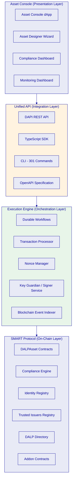

#### Layer 1: SMART Protocol (On-Chain Layer)

The SMART Protocol (SettleMint Asset Regulatory Technology) is the on-chain foundation of DALP. It implements the ERC-3643 (T-REX) regulated token standard and provides the smart contract infrastructure for compliant digital assets.

ERC-3643 was developed specifically for regulated securities markets, not retrofitted from DeFi primitives. That distinction matters because securities regulation requires deterministic enforcement: not probabilistic monitoring, not advisory flags, not post-trade reconciliation. When a transfer violates policy, it must not execute. ERC-3643 was designed from the ground up with this constraint, which is why it has emerged as the dominant standard for institutional tokenization programs globally.

The SMART Protocol is not a proprietary departure from open standards. It is a implementation of ERC-3643 that follows the standard specification while adding features required for institutional deployment: upgradeable compliance modules, multi-jurisdictional regulatory templates, deterministic parameter encoding, and richer claim-expression logic than most vanilla ERC-3643 implementations support.

The on-chain layer consists of several core contract families:

**DALPAsset Contracts** provide a unified, upgradeable token contract that can represent any financial instrument through runtime configuration. Each DALPAsset includes a configurable `assetTypeId` and dynamic feature composition via the SMART Configurable extension system, supporting up to 32 pluggable features per token. Features include yield schedules, collateral management, maturity and redemption, AUM fees, voting power, historical balance snapshots, and more. Features can be added or reordered post-deployment without redeploying the token.

**Compliance Engine** orchestrates modular compliance checks on every transfer, enforcing rules before execution. The engine supports a three-tier compliance interface hierarchy (Global Compliance, Token Compliance, and SMART Compliance V2) that enables incremental migration across protocol versions without breaking deployed assets. The dual v1/v2 hook support means the platform can operate both legacy and current token implementations simultaneously, critical for institutions that deployed tokens under earlier versions and cannot force-migrate without disrupting live markets.

**Identity Registry** maps wallet addresses to verified on-chain identities (OnchainID), enabling identity-aware compliance decisions. Before any token transfer can execute, the compliance engine resolves both sender and recipient through this registry. A single identity can be associated with multiple wallet addresses, maintaining claim continuity across operational wallets.

**Trusted Issuers Registry** governs which entities can issue identity claims and at what scope. The three-tier resolution model (subject-scoped, system-scoped, global) provides the trust root of the entire compliance system. Trust is topic-specific: an issuer trusted for KYC is not automatically trusted for collateral attestations.

**DALP Directory** provides system-level contract discovery and version management. The directory manages proxy resolution for all system contracts, ensuring that platform components always reference the current implementation without manual address tracking.

**Addon Contracts** (Vault, XvP Settlement, Token Sale, Airdrop, Fixed Yield Schedule, Feeds) follow a consistent factory pattern for deployment and governance. Each addon is deployed through its own factory with deterministic CREATE2 address prediction, contract identity binding via OnchainID, and role-gated registration.

All contracts use the UUPS (Universal Upgradeable Proxy Standard) pattern, enabling contract logic upgrades without redeploying tokens. Existing token holders retain their balances and identity bindings through upgrades. Contract upgrades are governance-controlled: only authorized system-level roles can initiate upgrades, and the upgrade transaction follows the same two-layer policy model as all other blockchain operations. The on-chain layer is the authoritative source of truth for ownership, compliance state, and transaction history.

#### Layer 2: Execution Engine (Orchestration Layer)

The Execution Engine provides the durable workflow orchestration that connects the API layer to the blockchain. Every stateful operation, from token creation to identity recovery to settlement execution, flows through this layer. The word "durable" is precise: every workflow step is persisted to storage before execution, meaning that infrastructure failures, process restarts, and network partitions do not lose work or create inconsistent state.

The engine is built around a durable execution framework that provides four core primitives. Virtual objects are keyed by partition (such as address and chain combination) for exclusive locking during submission. Only one transaction can be submitted per address and chain combination at a time, preventing nonce conflicts. Durable workflows support multi-phase operations that survive restarts. A token creation workflow (create, grant permissions, issue claims, unpause) persists its progress at each phase. If the process restarts between phases, the workflow resumes from the last successful step rather than restarting from scratch. Idempotent retry means operations can be safely retried without duplicate execution. Idempotency keys are scoped by operation kind to prevent cross-operation collision. Cron patterns enable scheduled operations (monitoring rollups, health collection, retention cleanup) without external schedulers.

Three retry presets ensure appropriate resilience for different operation types: fast (5 attempts, 10-second maximum) for quick operations, standard (10 attempts, 5-minute maximum) for most workflows, and long-running (20 attempts, 30-minute maximum) for operations involving external system coordination.

**Transaction Processor**

The Transaction Processor is a core component of this layer, implemented as a virtual-object service keyed by `{fromAddress}.{chainId}`. It manages an 11-state transaction lifecycle with 20 sub-statuses for granular failure classification:

| Lifecycle State | Description |
|---|---|
| Received | Transaction request accepted |
| Queued | Awaiting processing slot |
| Preparing | Contract validation and parameter encoding |
| Pending Approval | Awaiting custody provider approval (DFNS/Fireblocks) |
| Signing | MPC signing in progress |
| Broadcasting | Transaction submitted to blockchain network |
| Confirming | Awaiting block confirmation |
| Completed | Transaction confirmed on-chain |

Terminal failure states include Failed (with sub-statuses like REVERTED, INSUFFICIENT_BALANCE, NONCE_CONFLICT, SIGNING_FAILED, BLOCKED_BY_POLICY), Dead Letter (exhausted retry budget, available for operator rescue), and Cancelled (operator-initiated cancellation via replacement-by-fee).

The processor provides partition-level exclusive locking during submission, contract validation and ERC-8021 attribution appending, runtime branching between provider-native broadcast and local nonce-managed broadcast, and a shared confirmation watcher. The shared confirmation watcher is a single virtual object per chain that batch-polls receipts for up to 250 active transactions per tick at one-second intervals. This replaces per-transaction RPC polling loops, reducing RPC load by orders of magnitude for high-volume deployments.

**Nonce Manager**

The Nonce Manager serializes nonce allocation per address and chain combination through a durable virtual-object service. Cold state initializes from the on-chain `getTransactionCount` with the pending block tag. Atomic consume-and-broadcast sequences ensure that nonce allocation and transaction submission happen in a single logical operation for local signer flows.

Self-healing logic handles nonce conflicts automatically: when the system detects a "nonce too low" failure, it re-reads the on-chain nonce, advances to the maximum of the current value plus one or the on-chain nonce, and retries up to three times without operator intervention. For situations requiring manual intervention, operator repair surfaces provide synchronization with on-chain state, nonce reset, forced nonce assignment, and force history retrieval.

Provider-native broadcast paths (DFNS, Fireblocks) intentionally bypass the Nonce Manager entirely. External custody providers manage their own nonces, and DALP does not interfere with their nonce coordination.

**Key Guardian and Signer Service**

The Key Guardian manages cryptographic key material with strict security, routing signing requests to the appropriate custody backend based on key metadata. Keys never leave secure boundaries in plaintext. The service supports a graduated security model: encrypted database storage for development and low-value assets, cloud secret managers for standard production deployments, hardware security modules (FIPS 140-2 Level 3) for regulated financial services, and third-party custody providers (DFNS, Fireblocks) for the highest security requirements.

The unified signer abstraction normalizes wallet creation, signing, approvals, and optional provider-native broadcast across all backends through a common interface. Provider initialization is serialized through a shared initialization promise to prevent concurrent bootstrap races. Provider health is a first-class concern with dedicated health check endpoints. Switching between DFNS and Fireblocks requires only configuration changes in the Helm values; no workflow modifications, no code changes, no API contract differences for consuming applications.

**Blockchain Event Indexer**

The Blockchain Event Indexer transforms raw blockchain event logs into domain-specific data models that serve application needs with millisecond-latency responses. Blockchain storage optimizes for consensus verification, not application queries. Historical data queries can take seconds or fail entirely for complex aggregations. The indexer bridges this gap.

The indexer bootstraps through genesis directory discovery: it queries the on-chain DALP Directory for registered factories, then discovers all deployed contracts through factory event logs. Token factory registration names are validated against a trusted map to prevent discovery of non-DALP contracts. No manual contract address configuration is required.

Events are processed across eight or more domains: token creation and transfer, identity, compliance, addon operations (feeds, token sale, XvP, fixed yield, vault), and token extensions (bonds, funds, capped, pausable). The indexer constructs domain models for asset balances, investor portfolios, transaction history, compliance status, and distribution records.

Zero-downtime reindexing uses schema isolation: new indexer versions build fresh data in a rotating schema (for example, switching between `idxr_d1` and `idxr_d2`) alongside the running version. The old schema continues serving reads while the new schema builds. When the new schema is complete, pass-through views in the public schema switch atomically. A one-hour grace period for draining old deployments ensures in-flight queries complete without error. View recreation on every startup self-repairs views that may have been dropped by database migrations.

#### Layer 3: Unified API (Integration Layer)

The Unified API is the single programmatic surface through which all platform operations are accessed. It is not a thin wrapper around smart contracts; it is a full middleware stack that transforms authenticated HTTP requests into tenant-scoped, permission-aware, execution-ready operations.

The API exposes two endpoints with distinct authentication models. The RPC endpoint (`/api/rpc`) accepts only session and cookie authentication for the browser-based Asset Console. The REST endpoint (`/api/v2`) accepts API keys with HTTP-method-based scope enforcement, serving the SDK, CLI, CI pipelines, and backend integrations. This separation is a hardened security boundary: API keys cannot authenticate on the RPC endpoint, and browser sessions should use the RPC endpoint.

The REST API delivers an OpenAPI 3.1 specification generated directly from procedure definitions, ensuring documentation stays synchronized with implementation. Interactive exploration is available through Swagger UI, enabling integration engineers to authenticate, construct requests, and execute procedures directly from the documentation interface. The specification can be imported into Postman, Insomnia, Redoc, or any OpenAPI-compatible tooling, enabling standard enterprise API governance workflows.

The TypeScript SDK (`@settlemint/dalp-sdk`) provides full type safety with contract-bound types generated from the live API route tree. It ships as a public npm package with DALP-specific serializers for arbitrary-precision decimals, blockchain integers, and dates. The SDK enables multi-language SDK generation through the OpenAPI specification for Python, Go, C#, Java, and other languages.

The CLI provides 301 command registrations across 26 top-level command groups covering core operations (token lifecycle, system administration, user management), identity and compliance (identity registration, KYC review, claim operations), addons (settlement, token sale, fixed yield, vault, airdrop, feeds), platform administration (settings, organization management, monitoring), and infrastructure (authentication, configuration). All commands use validated schemas and bind directly to the SDK client methods.

Every API request passes through a layered middleware chain that progressively enriches request context: session resolution, authentication enforcement, organization role synchronization (reconciling on-chain access-control state into platform membership roles at request time), system context hydration (resolving tenant system address, validating bootstrap readiness, deriving user permissions from on-chain roles), token context hydration for token operations, wallet verification for sensitive mutations, and transaction queue negotiation for execution mode and speed.

#### Layer 4: Asset Console (Presentation Layer)

The Asset Console is a full decentralized application providing the operational interface for asset management, compliance operations, identity administration, and system monitoring. It is not merely a portal or dashboard; it implements sophisticated client-side logic including effective-status derivation, arbitrary-precision arithmetic for financial calculations (avoiding floating-point errors in token amounts), multi-step asset creation wizards with validation, and global search with role-aware visibility.

The Asset Console provides five-tab operational consoles for complex addons such as token sales and settlements, an Asset Designer wizard with multi-step validation and asset-class-based configuration, a compliance dashboard for module configuration and monitoring, identity management interfaces for KYC review and claim administration, and internationalization support with four locales (en-US, de-DE, ar-SA, ja-JP) including right-to-left layout.

The Asset Console communicates exclusively through the Unified API layer. No direct blockchain access occurs from the presentation layer.

### Supported Blockchain Networks

DALP operates on any blockchain that implements the Ethereum JSON-RPC specification. No application changes are required when switching networks. Configuration handles consensus differences, gas models, and confirmation requirements.

**Public Layer 1 Networks:**

| Network | Gas Model | Block Time | Notes |
|---|---|---|---|
| Ethereum | EIP-1559 | ~12 seconds | Primary target, full feature support |
| Polygon PoS | EIP-1559 variant | ~2 seconds | Lower gas costs, faster finality |
| Avalanche C-Chain | EIP-1559 | ~2 seconds | Sub-second finality |
| BNB Smart Chain | Legacy gas pricing | ~3 seconds | Higher throughput |
| XDC Network | Enterprise-grade | Variable | Hybrid blockchain |
| Gnosis Chain | EIP-1559 | ~5 seconds | Community-owned |

**Layer 2 Rollup Networks:**

| Network | Type | Settlement Layer |
|---|---|---|
| Arbitrum One | Optimistic rollup | Ethereum L1 |
| Optimism | Optimistic rollup | Ethereum L1 |
| Base | Optimistic rollup | Ethereum L1 |
| zkSync Era | ZK rollup | Ethereum L1 |
| Polygon zkEVM | ZK rollup | Ethereum L1 |
| Linea | ZK rollup | Ethereum L1 |

**Private and Consortium Networks:**

| Client | Use Case |
|---|---|
| Hyperledger Besu | Enterprise features with IBFT 2.0/QBFT consensus, permissioning |
| Go-Ethereum (Geth) | Reference implementation, private PoA or PoS |
| Nethermind | .NET-based client with enterprise plugins |
| Erigon | Archive-optimized for analytics |

DALP typically deploys on Hyperledger Besu-based permissioned networks with IBFT 2.0 or QBFT consensus for institutional environments. Production deployments typically run four validators and two RPC nodes. Besu provides deterministic block times and instant finality, which simplifies compliance-critical operations where transaction certainty is required.

**Specialized and Application-Specific Chains:**

| Network | Description |
|---|---|
| ADI Chain | UAE-based chain for institutional finance and regulated stablecoins |
| Worldchain | World ID verified chain |
| Custom SettleMint networks | Managed private networks with genesis-allocated DALP contracts |

**Multi-Chain Architecture**

DALP supports simultaneous operation across multiple chains with clear isolation guarantees. Identity isolation means each chain has its own identity registry; an investor's OnchainID is chain-specific. Compliance isolation means compliance module configurations are per-chain, per-token. The indexer maintains one virtual object per chain ID, discovering and processing events independently on each network. Custody providers (Fireblocks, DFNS) support multi-chain asset wallets through the same vault or wallet. Network switching requires only environment-variable changes; no code modifications are needed.

Network-specific configuration parameters include block confirmation count (1 for private networks to 12 or more for Ethereum mainnet), gas price strategy (legacy, EIP-1559, or custom), RPC batch limits (varies by provider), and chain ID for multi-chain identity registry resolution.

**Honest limitations regarding non-EVM networks:** DALP's smart contract architecture is built on the Ethereum Virtual Machine. Non-EVM chains (Solana, Cosmos/IBC, Polkadot parachains) are not currently supported. The platform abstracts blockchain-specific details within the EVM ecosystem, but extending to non-EVM architectures would require significant protocol-level adaptation. SettleMint's strategic view is that the EVM ecosystem provides sufficient breadth for institutional tokenization use cases, with L2 rollups addressing throughput and cost concerns without leaving the EVM compatibility boundary.

**Chain Gateway**

The Chain Gateway manages all outbound blockchain connectivity, providing load balancing across multiple RPC endpoints, automatic failover, and optimized request routing. Production blockchain deployments require more than single-node connectivity. Node maintenance, network partitions, and capacity limits demand multi-node architectures with intelligent routing.

Load balancing strategies include round-robin for homogeneous node pools, latency-based selection for geographically distributed deployments, health-weighted routing that prefers healthy nodes, and operation-aware routing that directs writes to primary nodes and reads to replicas. Health monitoring tracks block height (nodes behind chain head are marked degraded), response latency (slow nodes receive reduced traffic), error rates (high error rates trigger temporary removal from pool), and connectivity (periodic probes verify connectivity independent of traffic).

Failover completes in seconds without application awareness: the health checker detects failure, the load balancer removes the node from the active pool, in-flight requests redirect to healthy nodes, and recovery probes continue until the node returns to health.

### API Architecture

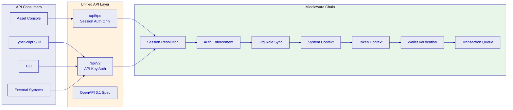

The REST API is organized into procedure namespaces covering every DALP domain:

| Namespace | Capabilities |
|---|---|
| `token` | Asset lifecycle: create, mint, burn, transfer, freeze, pause |
| `system` | Platform infrastructure: roles, identity, trusted issuers, compliance |
| `user` | User management: profile, statistics, growth metrics |
| `account` | Wallet operations: identity resolution, claim queries |
| `addons` | Optional features: token sale, fixed yield, XvP, vault, airdrop |
| `monitoring` | Operational health: API health, blockchain health, logs, streaming |

The API supports three execution modes for mutations, negotiated through RFC 7240 `Prefer` headers: synchronous (blocks until transaction confirms on-chain), asynchronous (returns HTTP 202 with a status URL for polling), and hybrid (server decides based on expected execution time). All mutations flow through the async transaction request pipeline, providing idempotency (enforced via `Idempotency-Key` headers), durability (survives process restarts), and auditability (full state-transition history).

The error model is structured and audit-grade. DALP ships 534 auto-generated error codes from Solidity ABI definitions, each carrying a 4-byte selector, severity level, audience targeting (user, operator, or internal), retryability flag, and internationalized translations across four locales. Blockchain revert reasons surface as structured DALP contract errors rather than opaque revert blobs. This transforms compliance operations from "something broke" to "this specific rule prevented this specific action for this documented reason."

Rate limiting is configured at 10,000 requests per 60-second window per API key, with differentiated limits available for high-volume integration consumers.

**API Consumption Patterns**

Different consumers interact with the API in different ways, and DALP is designed to support each pattern cleanly rather than forcing one integration style on everyone.

The browser-based Asset Console uses session-authenticated RPC calls because the user is already inside an authenticated session and expects interactive latency. Backend systems, CI pipelines, and integration services use the REST API with API keys because they need explicit machine credentials, repeatability, and predictable request semantics. The SDK wraps that REST surface with strong typing and DALP-specific serializers, reducing integration errors for TypeScript teams. The CLI uses the same underlying API and is therefore not a separate product surface; it is another way to access the same platform capabilities in operational and automation contexts.

This consistency matters because institutions often begin with interactive usage during the early design phase, shift to API-driven automation during implementation, and later adopt scripted operations for production support. DALP supports that progression without changing the underlying contract.

**CLI as an Operational Surface**

The 301-command CLI is not just a developer convenience. It is part of the operational model. Institutions can script identity registration, role assignment, asset creation, compliance module configuration, feed management, monitoring queries, and settlement operations through typed commands that map directly to platform capabilities. That gives operations and DevOps teams a repeatable, auditable way to perform platform tasks without building custom wrappers around raw HTTP calls.

The CLI also matters during incident response. When a team needs to inspect transaction state, query health timelines, review logs, or intervene in a workflow, the CLI provides a direct path that fits existing operational habits. In enterprise environments, a usable command surface often determines whether a platform becomes operable by production teams or remains dependent on the original implementation team.

**SDK and Generated Clients**

The first-party TypeScript SDK is the recommended path for application teams building directly against DALP. It carries the most mature typing surface, the DALP-specific serialization rules needed for token amounts and timestamps, and the clearest examples of expected request and response shapes. For organizations with polyglot engineering teams, the OpenAPI specification enables generated clients in Python, Go, Java, C#, and other languages. That matters for integration into core banking services, middleware layers, risk engines, and reporting systems that may not be written in TypeScript.

The practical takeaway is that DALP does not force the institution to standardize on one application language or one integration style. It provides a stable contract and enough entry points to fit the institution's existing engineering landscape.

### Data Architecture

DALP's data architecture serves three distinct but interconnected concerns: blockchain state (the authoritative ledger), application state (platform configuration, user profiles, KYC records, transaction requests), and analytics state (indexed blockchain events transformed into queryable domain models).

**Blockchain Indexing.** The custom PostgreSQL-based blockchain event indexer (Indexer V2) bridges the gap between blockchain data structures and application requirements. Blockchain storage optimizes for consensus verification, not application queries. The indexer processes events across eight or more domains: token creation and transfer, identity, compliance, addon operations (feeds, token sale, XvP, fixed yield, vault), and token extensions (bonds, funds, capped, pausable). It constructs domain models for asset balances, investor portfolios, transaction history, compliance status, and distribution records.

The indexer provides zero-downtime reindexing through schema isolation: new indexer versions build fresh data in a rotating schema alongside the running version, then switch atomically via pass-through views in the public schema. This means indexer upgrades and reindexing happen without read downtime. Reorg detection and rollback capabilities handle chain reorganizations with configurable confirmation depths (1 block for private networks, 12 or more for Ethereum mainnet). Event processing is idempotent, enabling safe recovery from any failure scenario.

**Relational Database.** PostgreSQL 17.x serves as the primary application database, storing transaction requests, identity records, KYC profiles, platform settings, indexer schemas, and audit trails. Three separate databases with dedicated owners provide isolation: blockchain explorer data, subgraph data, and application data. Required extensions include pg_trgm for text search, btree_gist for range indexing, pg_stat_statements for query performance monitoring, and postgres_fdw for cross-database queries.

**Event Sourcing and Audit Trails.** Every compliance-relevant action emits indexed blockchain events that form an immutable audit trail. The unified event log provides a single queryable surface for all on-chain events. Combined with the structured error catalog and the transaction request lifecycle history, this creates a complete chain of evidence from API request through on-chain execution to post-execution state updates. This architecture is essential for regulatory reporting: auditors can trace any asset movement from the initial API request (including the authenticated user, timestamp, and request parameters) through the compliance evaluation (which modules passed, which would have failed if misconfigured) to the on-chain event (block number, transaction hash, gas consumed) to the post-execution state update (updated balances, compliance counters, investor counts).

**Consistency and Reorg Handling.** Chain reorganizations can reverse confirmed transactions. The indexer maintains rollback capability for configurable block depths. Events from recent blocks are marked as provisional based on configurable confirmation depth. Detected reorganizations trigger identification of affected blocks, state rollback to the fork point, reprocessing of the canonical chain, and notification to connected clients. Event processing is idempotent: reprocessing the same events produces identical state, enabling safe recovery from any failure scenario.

**Analytics Infrastructure.** DALP exposes 18 PostgreSQL analytics views across five domains for direct querying by BI tools:

| Domain | Views | Examples |
|---|---|---|
| Identity | 2 | Identity statistics, key type distribution |
| Compliance | 4 | Claims statistics, trusted issuer statistics, module statistics |
| Addons | 4 | Vault activity, airdrop statistics, settlement statistics |
| Cross-cutting | 7 | Transaction counts and history, asset activity, lifecycle tracking |
| Actions | 1 | Unified action event log |

Views support both virtual (real-time query-time execution) and materialized (configurable refresh) modes, and can be accessed via the ORM layer for type-safe queries or raw SQL for BI tools like Looker, Tableau, Power BI, and Metabase.

### Multi-Tenancy

DALP implements multi-tenancy through a combination of on-chain contract isolation and application-level tenant scoping.

**On-chain isolation.** Each tenant deployment has its own DALP Directory, Identity Registry, Trusted Issuers Registry, and Compliance Registry. Tokens deployed through one tenant's system are completely independent of tokens in another tenant's system. Compliance configurations, identity registrations, and role assignments are scoped per system. A user registered in one system is not automatically registered in another.

**Application-level scoping.** The DAPI middleware chain resolves tenant context at request time through the system context hydration step. Every API request is scoped to a specific tenant system, and all operations (queries, mutations, role checks) execute within that scope. The system context is cached per session, system address, and user address combination to prevent redundant queries while maintaining tenant isolation.

**Data segregation.** The blockchain event indexer discovers contracts per tenant system through the DALP Directory. Indexed data is tenant-aware, with queries automatically scoped to the requesting tenant's contracts. PostgreSQL analytics views respect tenant boundaries. No cross-tenant data leakage occurs through the API or analytics layers.

**Configuration independence.** Each tenant can independently configure compliance modules and parameters, trusted issuer hierarchies, asset class templates, role assignments and governance policies, custody provider settings, and observability thresholds and alerting rules. Tenant configuration changes do not affect other tenants. Global compliance settings (such as the system-wide bypass list) are managed at the platform level by platform administrators, not by individual tenants.

**Organizational Operating Model.** In practice, this multi-tenant architecture supports several common institutional deployment patterns. A bank can run one tenant per legal entity, business line, or geography. A sovereign program can separate regulator, operator, and market-participant environments while preserving a common platform standard. A financial group can run development, test, and production as separate tenants with controlled promotion of configuration and workflows between them.

That flexibility matters because real institutions rarely operate as a single flat operating unit. They have subsidiaries, regional entities, product teams, shared service models, and separate control functions. DALP's tenant model gives them enough isolation to preserve accountability without fragmenting the technical foundation.

**Why the Tenant Model Matters.** Multi-tenancy is not just a hosting concern. It is a control concern. If identity registrations, trusted issuers, or compliance settings could bleed across tenants, the entire governance model would collapse. DALP's design keeps those boundaries explicit. Each tenant has its own system contracts, its own configuration posture, and its own operational state. Shared platform services improve efficiency, but governance authority remains scoped.

---

## Asset Lifecycle Management

[FIXED]

### Token Design and Configuration

DALP's token architecture represents a fundamental shift from the traditional approach to security token engineering. Rather than deploying monolithic, purpose-built smart contracts for each financial instrument, requiring specialized Solidity development, security audits, and deployment cycles, DALP implements a configuration-driven model where a single, audited token contract (DALPAsset) can be adapted to represent any financial instrument through runtime configuration.

At the core of DALP's token system is DALPAsset, a unified, upgradeable token contract built on the ERC-3643 (T-REX) standard. DALPAsset is not simply an ERC-20 token with compliance bolted on; it is a purpose-built financial instrument contract that integrates identity verification, compliance enforcement, access control, and configurable token economics into a single coherent architecture.

DALPAsset extends the SMART Protocol with the SMARTConfigurable extension, which allows any combination of token features to be attached and reconfigured at runtime, after the token is deployed. This eliminates the need to commit to a specialized contract type at deployment time. A DALPAsset token can evolve: start as a simple bearer instrument, then have fee features added, governance enabled, or maturity redemption configured, all without redeploying. External systems (wallets, indexers, dashboards) interact via standard ERC-20 and ERC-3643 interfaces, ensuring broad compatibility with existing infrastructure.

**Supported Asset Classes**

DALP supports seven asset types organized into four asset classes, plus a configurable token for custom instruments:

| Asset Class | Asset Types | Key Characteristics |
|---|---|---|
| Fixed Income | Bond | Face value, coupon rate, maturity date, denomination asset |
| Flexible Income | Equity, Fund | Voting rights (equity), management fees (fund), NAV tracking |
| Cash Equivalent | Stablecoin, Deposit | Collateral backing (stablecoin), minimal features (deposit) |
| Real World Asset | Real Estate, Precious Metal | Capped supply (real estate), dynamic supply (precious metal) |

Each asset type has a corresponding factory that validates class-specific parameters and ensures the correct feature and compliance configuration. The factories are not convenience wrappers; they are security boundaries that prevent misconfigured or unauthorized token deployments.

**Bonds.** Tokenized bonds require face value, maturity date, and denomination asset configuration. DALP automates coupon schedules through the Fixed Treasury Yield feature, maturity logic through the Maturity Redemption feature, and secondary market transfer controls through compliance modules. At maturity, transfers are automatically blocked; holders redeem tokens for the denomination asset at face value through an atomic burn-and-transfer mechanism. This covers everything from simple zero-coupon instruments to complex structured products with periodic coupon payments and call/put options.

**Equities.** Tokenized equities support automated dividend distribution through yield features, voting rights through the ERC-5805 Voting Power feature with delegation and historical tracking, and corporate action processing including stock splits and consolidations via controlled mint-and-burn operations. The ADI Finstreet reference project demonstrates production equity tokenization with on-chain voting and institutional custody integration.

**Funds.** Fund tokens support NAV integration through the data feed system, fractional units through configurable decimal places, fee structures through the AUM Fee feature (time-based management fees) and Transaction Fee feature, and subscription and redemption workflows. Management fees use an inflationary model where new tokens are minted to the fee collector address at configured intervals, preserving existing holder proportions while extracting the management fee.

**Stablecoins.** Stablecoin tokens require collateral backing verification through the Collateral Compliance Module, which reads ERC-735 collateral claims from the asset's OnchainID and validates that collateral ratios remain sufficient. Multi-currency support enables fiat-backed stablecoins denominated in any currency, with exchange rate integration for cross-currency valuation. The Sony Bank reference project demonstrates stablecoin issuance with integrated digital identity in a regulatory-ready configuration.

**Deposits.** Tokenized deposits support programmable interest through yield features, maturity rules, and withdrawal constraints. The bridge functionality enables deposits to operate across external networks. Deposits use a minimal feature set compared to other asset types, reflecting the simpler lifecycle of deposit instruments.

**Real Estate.** Property tokenization supports capped supply (each property maps to a fixed number of tokens), fractional ownership through configurable decimal places, rental income distribution through yield features, and property metadata. The Saudi RER reference project demonstrates country-scale real estate tokenization with registry integration.

**Precious Metals.** Asset-backed tokens for precious metals support dynamic supply (adjusted as physical reserves change), provenance tracking through claim-based verification, and chain-of-custody documentation through the identity and claims infrastructure.

**Configurable Token.** Beyond the seven pre-built templates, DALP supports a Configurable Token type that enables institutions to digitize any asset class using the composable, feature-rich architecture. Carbon credits, trade finance instruments, insurance-linked securities, loyalty programs, or any novel instrument can be represented using up to 32 pluggable features, configured and reconfigured at runtime without redeployment.

**Token Features: Runtime-Configurable Extensions**

Token features extend token economics (fees, yield, governance, lifecycle) without requiring contract redeployment. This is the mechanism that allows a single DALPAsset contract to behave like a bond, an equity share, a fund unit, a stablecoin, or a structured product.

Features integrate through six lifecycle hooks: pre-check gates before any operation (canUpdate), post-mint processing (onMinted), post-burn processing (onBurned), post-transfer processing (onTransferred), redemption lifecycle processing (onRedeemed), and one-time initialization when a feature is enabled (onAttached). Features with rewriting capability can modify the transfer amount in-flight, for example deducting a fee before the amount reaches the recipient.

| Feature | Category | Purpose |
|---|---|---|
| AUM Fee | Fees | Time-based management fee, inflationary model (mints new tokens) |
| Transaction Fee | Fees | Per-transaction fee deducted from transfer amount |
| External Transaction Fee | Fees | Fixed fee in a separate ERC-20 token per operation |
| Voting Power (ERC-5805) | Governance | Delegated voting with historical tracking |
| Historical Balances | Snapshots | Point-in-time balance and total supply queries |
| Permit (EIP-2612) | Utility | Gasless approvals via off-chain signatures |
| Maturity Redemption | Lifecycle | Bond maturity with transfer blocking and redemption |
| Fixed Treasury Yield | Lifecycle | Fixed-rate yield distribution with pull-based claiming |

Feature selection is not cosmetic. It defines the economic behavior of the instrument. A fund token with AUM Fee and Historical Balances behaves differently from an equity token with Voting Power and Historical Balances, even if both share the same underlying DALPAsset contract. This is what makes the architecture configuration-driven rather than contract-type driven.

**AUM Fee** models standard investment management fees as an inflationary mechanism. The fee accrues over time and is minted to the designated fee recipient when collected. This mirrors the traditional fund management model while preserving on-chain transparency. Because new supply is minted, analytics features such as Historical Balances and Voting Power should observe the post-fee state.

**Transaction Fee** deducts a percentage from every transfer and redirects it to a treasury address. This is useful for exchange fees, platform revenue, or regulatory levy collection. Because the feature rewrites the amount transferred, downstream features observe the post-fee amount.

**External Transaction Fee** charges a fixed fee in a separate ERC-20 denomination such as USDC or EUROC. This is relevant when the fee currency must differ from the asset currency, a common requirement in institutional operations and service pricing.

**Voting Power** implements ERC-5805-compatible delegated governance with historical checkpoints. Token holders can delegate voting weight and query historical vote balances at any timestamp. This is useful not just for on-chain governance, but also for regulated shareholder voting where the blockchain acts as the record of beneficial ownership and voting entitlement.

**Historical Balances** is the operational backbone for record-date snapshots. Dividends, coupon distributions, voting, investor reporting, and tax support all depend on the ability to ask a simple question: who held what at a specific time? Historical Balances answers that question directly on-chain through checkpoints.

**Permit** removes the need for a separate approval transaction before a transfer. In institutional custody flows, this reduces operational friction because a client can sign an approval off-chain while the custodian or operator submits the transaction.

**Maturity Redemption** encodes the full fixed-income lifecycle. Before maturity, the token behaves normally. At maturity, transfers are blocked and holders can only redeem for the denomination asset at face value. This makes the maturity event an enforced state transition rather than an operational reminder.

**Fixed Treasury Yield** supports periodic fixed-rate distributions funded by a treasury. Because claims are pull-based, the model scales to large holder populations without requiring the issuer to iterate through every holder in a single gas-heavy transaction.

Features execute in the order configured by the caller, making ordering an explicit design decision. Restriction features should execute first (blocking transfers before fees are collected), fee collection features next, and analytics and governance features last (recording post-fee, post-restriction states). Any combination of features is valid, and features can be added or reordered post-deployment.

A useful way to think about this is that DALP separates three concerns cleanly: compliance modules decide whether an action is allowed, token features decide how the token behaves economically, and addon capabilities provide broader workflows around the token such as settlement, vaulting, sales, or feeds. That separation prevents logic from being scattered across the wrong layer and gives operators a cleaner model to govern over time.

**Token Composability and Compliance Architecture**

The composability of DALP's architecture is what makes "doing it right" achievable at scale. Without composable tokens, every new instrument type requires a new development cycle. Without configurable compliance, every new jurisdiction requires custom smart contract work. DALP solves both problems through a single architectural approach: everything is composable, nothing is hardcoded.

Token features, compliance modules, metadata schemas, and operational add-ons are all independently selectable, per-token configurable, and reconfigurable post-deployment. This means:

- A **convertible bond** combines Maturity Redemption + Fixed Treasury Yield + Conversion (loan-side) + Historical Balances as features, with MiCA-compliant compliance modules, all on the same DALPAsset contract
- A **revenue-sharing token** combines Transaction Fee + Voting Power + Historical Balances with Reg D 506(c) compliance modules, configured in hours, not months
- A **money market fund** combines AUM Fee + Permit + Historical Balances with MAS Singapore compliance (Identity Verification + Country Allow List + Investor Count + TimeLock)

Each configuration uses the same audited contract. Each deploys through the same controlled Asset Factory pipeline. Each inherits the same security model. The difference is only in which features and modules are attached, and that difference is configuration, not code.

The compliance modules are composable in the same way. The 12 module types compose through sequential AND evaluation, with configurable internal logic within individual modules (RPN expressions for eligibility, FIFO batch tracking for holding periods, base-price conversion for currency-denominated supply limits). Modules can be added, removed, or reconfigured after the token is deployed through governed administrative operations. This enables institutions to adapt as regulations evolve, a Country Allow List can be expanded, a holding period can be adjusted, a new compliance module can be added, all without touching the token contract.

Metadata schemas complete the composability picture. Through the instrument template system, institutions define what data each token carries, property specifications for real estate, fund classifications for managed products, ISIN and face value for bonds, with field-level controls for type, mutability, and required status. The metadata model is defined by the institution, not constrained by the platform.

This composable architecture is what differentiates DALP from both rigid-token-type platforms (where each instrument requires a separate contract type) and blank-slate toolkits (where composability exists in theory but requires months of custom development to make production-safe). DALP provides composability that is production-ready: pre-audited modules, deterministic deployment pipelines, type-safe parameter validation, and backward compatibility across protocol versions.

**Smart Contract Architecture**

DALPAsset contracts are deployed through the Asset Factory, a controlled deployment pipeline that ensures every token inherits the correct security model, compliance hooks, and access control structure. The factory deploys UUPS proxy contracts, initializes the compliance engine, binds the token to the Identity Registry, configures features in the specified order, assigns initial roles, and optionally unpauses the token. This workflow is durable and idempotent: if any step fails, the deployment can be resumed from the last successful step without creating orphaned contracts or inconsistent state.

For regulatory scenarios where an auditor or regulator requires proof that certain capabilities are immutably embedded in contract code, DALP maintains seven legacy specialized contract types (DALPBond, DALPEquity, DALPFund, DALPStableCoin, DALPDeposit, DALPRealEstate, DALPPreciousMetal). These contracts have their capabilities compiled in at deployment time and cannot be modified after deployment. They use the same compliance engine, Identity Registry, access control model, and per-asset role system as DALPAsset. The choice between legacy types and DALPAsset is driven by regulatory requirements, not technical limitations.

### Token Issuance and Distribution

Token issuance in DALP follows a controlled pipeline accessible through both the Asset Designer wizard (UI) and the API.

**Issuance Workflow**

The workflow begins with asset class and type selection, where the token manager selects the instrument type and the Asset Designer displays available features and compliance options specific to that type. Asset configuration follows, where core properties are configured through structured forms with live validation: name, symbol, decimals, country code, price currency, base price, cap, and unique identifier (ISIN, CUSIP, or custom). Asset-specific parameters vary by type: bonds require face value and maturity date, funds require fee rates, stablecoins require collateral configuration, and real estate includes property metadata.

Compliance module selection allows the operator to select modules organized by category, with each module's parameters type-specifically validated through a discriminated-union schema. Unknown module types are rejected via hard error rather than permissive fallback. Feature selection and ordering follows the recommended execution order, with the Asset Designer validating feature compatibility and dependency requirements.

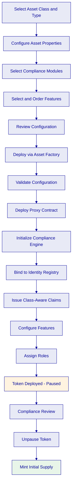

Tokens deploy in a paused state by default. Activation requires verifying compliance configuration with the compliance team, unpausing the asset (requires the Emergency role), adding supply managers and granting roles for minting, and minting initial supply to designated wallets. Minting is subject to all configured compliance rules, even for the initial distribution.

This paused-by-default model is not a minor safety feature. It is a control point. It allows legal, compliance, and operations teams to review the deployed configuration on-chain before any live value is issued. In practice, that means the institution can deploy the contract, validate the identity bindings, confirm the compliance modules, inspect the feature ordering, verify role assignments, and only then activate the asset. For regulated institutions, that final activation step is often where formal sign-off occurs.

**Primary Distribution Patterns**

DALP supports several primary distribution patterns depending on the instrument and market structure.

Direct issuer allocation is the simplest path: the issuer mints tokens directly to eligible wallets after identity verification and compliance approval. This is common in private placements, club deals, and bilateral issuances.

Sale-driven distribution uses the Token Sale addon to coordinate subscription windows, investor whitelists, currency acceptance, caps, vesting, and refund logic. This is more appropriate for wider offerings where investors self-subscribe subject to configured rules.

Custodian-mediated distribution supports operational models where a custodian or transfer agent manages wallet creation, allocation, and post-allocation servicing on behalf of end investors. In this model, DALP still enforces compliance, but the operational motion is handled through delegated workflows.

Bulk allocation flows are available through the API and CLI for scenarios such as employee share plans, structured debt placements, subsidy disbursement, or large investor onboarding batches. These flows retain the same validation and audit characteristics as single allocations.

**Operational Validation During Issuance**

Before issuance completes, institutions typically validate four things beyond the token contract itself: the identity posture of each target investor, the trust posture of the issuers providing the claims, the funding posture of any treasury or collateral account involved in redemption or servicing, and the role posture of the operators who will manage the asset after launch. DALP provides these checks as part of the issuance workflow rather than leaving them as external spreadsheet exercises.

That matters because the biggest operational failures in tokenization rarely come from bad Solidity. They come from mismatched configuration across identity, compliance, treasury funding, and operational permissions. DALP's issuance pipeline is designed to catch those mismatches before assets are live.

**Distribution Mechanisms**

Beyond standard minting, DALP provides multiple distribution mechanisms. The Token Sale (Primary Offering) is a configurable sale contract supporting two-phase flow (optional presale followed by public sale), multi-currency ERC-20 payment acceptance, per-investor purchase limits, optional vesting, and soft-cap/hard-cap mechanics with refund safety. The token sale has a full API and UI stack with a five-tab operational console (overview, purchases, currencies, whitelist, vesting).

Airdrop Distribution uses Merkle tree-based token distribution with three variants: push airdrop (admin-initiated distribution), time-bound airdrop (windowed self-claim with start and end time enforcement), and vesting airdrop (two-phase initialize-then-claim with pluggable vesting strategies). All variants share Merkle proof verification, pluggable claim tracking, and a seven-day timelocked withdrawal safety mechanism.

**Fractional Ownership**

DALP's decimal configuration (0 to 18 decimal places) enables fractional ownership at any granularity. For real estate tokenization, a property valued at 10 million can be divided into any number of fractional units. For fund tokens, 18 decimal places provide sufficient precision for institutional-scale AUM calculations. The decimal configuration is set at deployment and applies to all token operations (transfers, mints, burns, yield calculations).

### Transfer and Secondary Market

Every token transfer in DALP follows a deterministic execution path. This is the most critical sequence in the system.

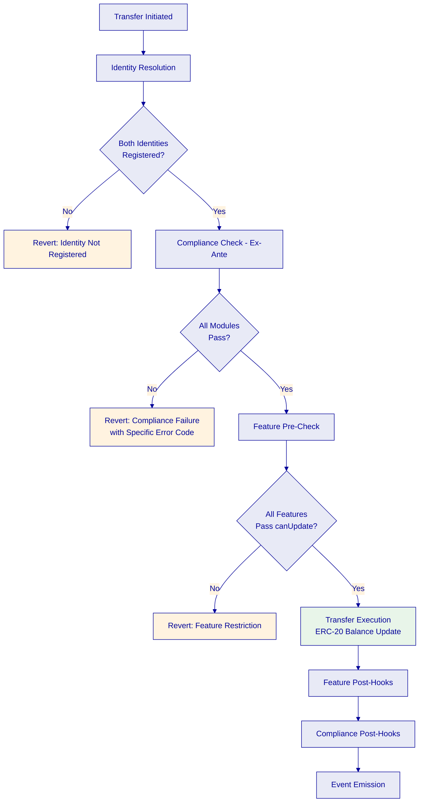

The transfer begins with identity resolution, where the Identity Registry maps both sender and recipient wallets to their OnchainID contracts. If either party does not have a registered identity, the transaction fails immediately with a clear error. This fail-fast behavior prevents wasted gas on downstream module evaluation.

Compliance checks execute before any balance changes. The compliance engine evaluates all configured modules in sequence. A single module veto blocks the transfer. This fail-closed design means the default is denial unless all modules explicitly approve. Modules are evaluated in the configured order, and evaluation stops at the first failure, providing gas efficiency and clear error messages.

Feature pre-checks follow, where each configured feature's `canUpdate()` gate is evaluated. If any feature blocks the operation (for example, Maturity Redemption blocks transfers after the maturity date), the transaction reverts.

If all checks pass, the ERC-20 balance update executes atomically. Feature post-hooks then process in order: fee collection (Transaction Fee deducts its percentage and redirects to treasury), balance checkpoint updates (Historical Balances creates a new checkpoint), voting unit transfers (Voting Power updates delegation records), and FIFO batch recording (TimeLock records acquisition timestamps). Compliance post-hooks update state: investor count increment and decrement, supply tracking accumulation for rolling windows, transfer approval consumption if one-time use, and TimeLock acquisition timestamp recording.

If any post-hook fails, the entire transfer reverts. There is never a partial transfer state.

This transfer path is what makes secondary market operations institutionally credible. A secondary market is not just a place where assets move. It is a place where every transfer has legal, regulatory, operational, and reporting implications. DALP treats every transfer as a governed event rather than a balance update. That means transfer restrictions, investor eligibility, trade approvals, and reporting evidence are all part of one atomic motion.

For markets that still require transfer-agent review, the Transfer Approval module preserves manual control without breaking the on-chain settlement model. For markets where holding periods apply, the TimeLock module preserves batch-level acquisition history without turning operations into manual ledger reconciliation. For markets where fees or levies apply, token features encode those economics into the movement itself. The practical result is that a secondary transfer through DALP is not a workaround layered on top of the instrument. It is a first-class lifecycle event with the same control quality as issuance.

**Settlement**

DALP's XvP (Exchange vs. Payment) settlement capability enables atomic cross-token operations. Delivery vs. Payment (DvP) provides atomic exchange of a security token for a payment token (such as bond tokens for USDC). Both legs complete or both revert. Exchange vs. Payment (XvP) provides generalized multi-party, multi-asset atomic settlement. Multiple parties can exchange multiple token types in a single atomic transaction. All legs of a cross-token settlement are subject to the compliance rules of each token involved. If any compliance check fails on any leg, the entire settlement reverts.

The settlement system supports both local (same-chain) atomic execution and cross-chain settlement using Hash Time-Locked Contract (HTLC) patterns with hashlock verification and cancellation vote logic. Terminal states (executed, cancelled, or expired-withdrawn) are deterministic and auditable.

### Lifecycle Servicing

DALP provides ongoing lifecycle servicing capabilities that most tokenization platforms lack entirely. This is the operational capability of managing the asset from issuance through every event in its lifecycle to retirement.

**Dividend and Coupon Distribution**

Using the Fixed Treasury Yield feature, issuers configure yield schedules with rate, frequency, and denomination asset. The system calculates pro-rata entitlements based on Historical Balance snapshots. Holders (or custodians acting on their behalf) claim distributions through a pull-based mechanism. The pull-based design avoids the gas cost and operational complexity of iterating over potentially thousands of holders. Instead of the issuer executing a single "distribute to all" transaction (which would be prohibitively expensive and potentially exceed block gas limits), each holder claims their individual entitlement. This scales to any number of holders without gas concerns.

The treasury can be the token contract itself (using the asset-as-treasury capability) or an external wallet or vault. The payout mechanism adapts automatically, checking whether the treasury supports the treasury payer interface via ERC-165 and falling back to standard transfer mechanics if not.

**Corporate Actions**

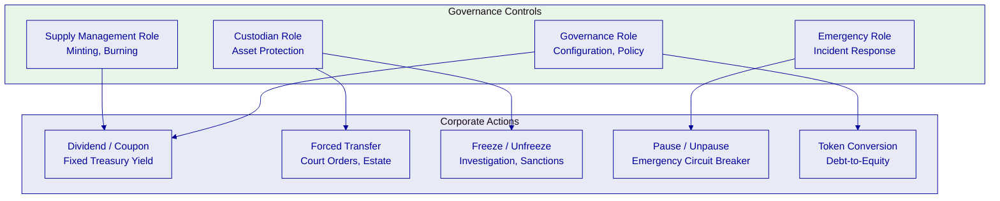

Forced transfers are available to the Custodian role, bypassing the compliance engine. This is the ERC-3643 `forcedTransfer` mechanism, essential for court-ordered asset seizures, estate transfers, regulatory enforcement actions, and wallet recovery for institutional investors. Forced transfers still emit events and update all tracking systems, maintaining the audit trail. However, compliance module pre-checks are skipped entirely. DALP's audit trail records forced transfers distinctly from standard transfers, ensuring that any compliance bypass is visible in the event log.

Freeze and unfreeze operations allow the Custodian role to freeze individual investor wallets or partial amounts, preventing all transfers while maintaining the frozen balance on record. This supports suspicious activity investigation, regulatory hold orders, dispute resolution periods, and sanctions enforcement.

Pause and unpause operations provide a circuit breaker. The Emergency role can pause all operations on a token. No transfers, mints, or burns can execute while paused. This supports security incident response, smart contract vulnerability discovery, regulatory emergency orders, and market disruption events.

Token conversion handles convertible instruments through a cooperative two-contract design. The governance role manages conversion triggers and windows. Holders can optionally convert within defined windows (for example, converting bond tokens to equity tokens at a configured ratio), or the custodian can force mandatory conversion. All conversion operations are atomic: loan tokens are burned and equity tokens are minted in a single transaction.

**NAV Integration**

Fund tokens can receive NAV updates through the data feed system. NAV data drives AUM fee calculations for the AUM Fee feature. External price data from authorized feed providers can be published to the platform and used by compliance modules for supply limit enforcement with base-price conversion.

This matters operationally because many institutions want tokenization without losing their existing valuation and accounting processes. DALP does not force NAV calculation on-chain. It allows off-chain valuation systems to remain authoritative while making their outputs usable inside the token lifecycle. The same principle applies to collateral attestations, FX data, and issuer-signed pricing. DALP acts as the orchestration layer that turns trusted external data into enforceable operational behavior.

**Subscription and Redemption**

For fund-style instruments, subscription follows the standard minting workflow with compliance enforcement. Investors subscribe in fiat or payment tokens, the institution validates eligibility and funding, and minting occurs only after all configured checks pass. Redemption can follow periodic windows, NAV-based pricing rules, or maturity-triggered rules depending on the instrument type.

Redemption at maturity is handled through the Maturity Redemption feature, which blocks all transfers after the maturity date and enables holders to exchange tokens for the denomination asset at the configured face value through an atomic burn-and-transfer mechanism.

Beyond maturity-based redemption, DALP supports early redemption workflows where the issuer defines redemption windows, treasury funding rules, and approval models. In these cases the platform still preserves the same principle: retirement or redemption should be a governed event with audit evidence, not an off-platform spreadsheet exercise followed by a manual token burn.

### Asset Retirement

Asset retirement in DALP follows deterministic paths based on the instrument type.

**Maturity Redemption**

For fixed-income instruments, the Maturity Redemption feature enforces the complete lifecycle. Pre-maturity, the token transfers normally subject to all compliance rules. At maturity, the feature's canUpdate gate blocks all transfers; holders can only redeem. During the redemption window, holders call redeem to exchange tokens for the denomination asset at face value. The mechanism is atomic: the holder's tokens are burned and the denomination asset is transferred from the treasury to the holder in a single transaction. If the treasury has insufficient funds, the redemption reverts. No partial redemptions occur. Post-redemption, burned tokens reduce circulating supply. Burns free up capacity for supply-capped tokens (the cap tracks live circulating supply, not lifetime minted).

**Standard Burn Mechanics**

The Supply Management role can execute burns for tokens that are not subject to maturity redemption. Burns reduce circulating supply and free up capacity under supply caps. All burns emit events and update tracking systems (Historical Balances checkpoints, Voting Power adjustments, investor count decrements if the holder's balance reaches zero).

**Audit Trail Preservation**

Token retirement does not erase history. All historical events (transfers, compliance checks, corporate actions, role changes) remain in the blockchain event log and the indexed data models. The immutable on-chain record provides a permanent audit trail that survives the token's operational lifetime. This is critical for regulatory reporting, tax compliance, and dispute resolution that may occur after an instrument matures or is retired.

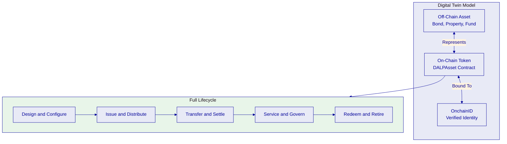

### Per-Asset Role-Based Access Control

Every token contract uses seven roles scoped per asset. Holding a role on Token A grants no power over Token B.

| Role | Scope | Key Actions |
|---|---|---|
| Default Admin | Role management | Grant and revoke all other per-asset roles; no operational powers |
| Governance | Configuration | Set identity contracts, compliance modules, features, metadata |
| Supply Management | Issuance | Mint, burn, batch operations, set supply cap |
| Custodian | Asset protection | Freeze addresses, forced transfers, wallet recovery |
| Emergency | Incident response | Pause and unpause operations, recover stuck tokens |

The role model enforces hard separation-of-duties invariants at the smart contract level. The Admin grants roles but has no operational powers. Supply Management cannot freeze; Custodian cannot mint. Emergency is limited to pause and recovery. Governance configures policy; Supply Management executes issuance. These constraints cannot be bypassed through configuration.

---

## Compliance Architecture

[FIXED]

### The Compliance Imperative

The real challenge in tokenization is not minting a token. It is doing it right at production scale. Compliance is where this complexity is most acute: meeting regulatory requirements across jurisdictions, enforcing governance before execution, and maintaining auditability across the full asset lifecycle.

DALP's compliance architecture addresses this head-on, enforcing regulatory requirements before execution, not after review. Every token transfer, every investor onboarding, and every corporate action passes through a deterministic policy evaluation engine that validates eligibility, identity claims, and jurisdictional constraints at the smart contract layer, atomically. If a transfer would violate any configured rule, it reverts. There is never a state where non-compliant tokens exist in an unauthorized wallet.

This ex-ante enforcement model is the single most important architectural decision in DALP. For regulated securities, ex-post compliance (check after transfer) creates immutable on-chain evidence of violations: a reputational and regulatory liability that no institution should accept. DALP's fail-closed design means the default is denial unless all modules explicitly approve. Auditors, regulators, and compliance officers can rely on a simple invariant: if a token exists in a wallet, every transfer that placed it there passed every compliance check that was active at the time.

### Ex-Ante Compliance Model

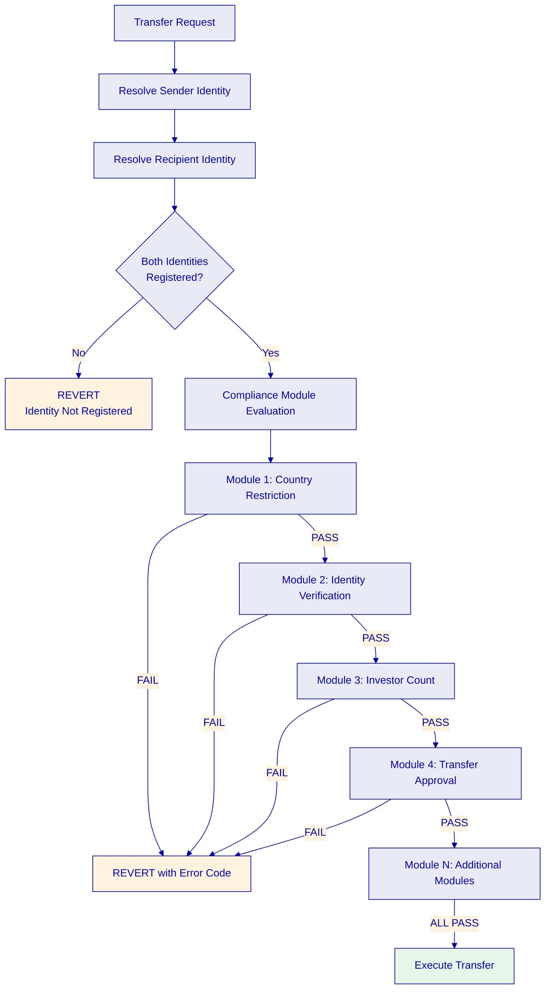

The compliance enforcement model works as follows. Before any transfer, the system resolves both sender and recipient identities through the Identity Registry. If either party lacks a registered identity, the transaction fails immediately. The compliance engine then evaluates all configured modules in sequence. Modules are evaluated in a fail-fast pattern: the first failing module stops all evaluation, conserving gas and providing a specific error code identifying which rule blocked the transfer. Only if all modules pass does the transfer execute. After execution, post-hooks update compliance state (investor counts, supply tracking, approval consumption, timelock records).

This enforcement applies to more than just wallet-to-wallet transfers:

| Operation | Identity Lookup | Compliance Check | Result if Failing |
|---|---|---|---|
| Transfer | Sender + recipient | All configured modules | Transaction reverts |
| Mint | Recipient | All configured modules | Mint reverts |
| Burn / Redemption | Sender | Modules evaluated | Burn or redeem reverts |
| Forced transfer | Bypassed | Compliance skipped | Executes without checks |

Forced transfer exists for reasons like court orders, estate handling, recovery, or regulatory intervention. It is an issuer-only emergency mechanism under ERC-3643, not a convenience feature. DALP's audit trail records forced transfers distinctly from standard transfers.

### Two-Layer Policy Model

DALP's compliance architecture operates through a deliberate two-layer enforcement model that separates on-chain programmable rules from off-chain custodial controls.

**Layer 1: DALP On-Chain Compliance** enforces identity eligibility (does the participant have the required claims?), jurisdictional restrictions (is the transfer permitted for the relevant countries?), transfer policies (is the transfer within amount limits, investor count caps, or supply constraints?), temporal controls (has the holding period elapsed?), and issuance controls (is minting within cap? is collateral sufficient?). All Layer 1 rules execute deterministically at the smart contract level. They are transparent, auditable, and immutable once configured.

**Layer 2: Custodian Policy Enforcement** covers rules enforced by custodians for assets held in external custody: custodian-specific KYC/AML requirements beyond what on-chain claims capture, segregation of duties within custodial operations, regulatory reporting obligations specific to the custodian's jurisdiction, and client money rules and asset segregation requirements.

The two-layer model means DALP does not attempt to absorb every possible compliance obligation into smart contracts. Some rules are inherently off-chain. They depend on human judgment, custodial relationships, or regulatory reporting processes that cannot be meaningfully encoded on-chain. By explicitly acknowledging this boundary, DALP avoids over-promising on-chain enforcement and under-delivering on operational completeness. Neither layer can override the other. Both must be satisfied for a transfer to be operationally complete. This is what regulators actually expect: layered controls with clear accountability at each level.

### Compliance Module Types

DALP supports 12 concrete compliance module types organized into six categories. These modules represent the enforceable rule primitives that institutions configure when setting up a tokenized asset.

**Category 1: Eligibility Modules**

*Identity Verification* is the most expressive compliance module in DALP. It evaluates logical expressions over identity claims to determine investor eligibility. Both sender and recipient must satisfy the configured expression. Claims must exist, be issued by a trusted issuer, and be non-expired. Expressions use Reverse Polish Notation (RPN) for arbitrary logical combinations: `[KYC, AML, AND]` means both KYC and AML are required; `[KYC, ACCREDITED, OR]` means either is sufficient; `[KYC, AML, AND, QII, OR]` means KYC plus AML, or qualified institutional investor status. This avoids baking every legal regime into custom code. Institutions can encode the actual logical eligibility rule they need.

*Identity Allow List* restricts participation to specific named investors (by OnchainID identity, not wallet address). Used for private placements, institutional club deals, and invitation-only offerings.

*Identity Block List* blocks specific identities from receiving the asset. Identity-level blocking follows the investor across wallet changes.

**Category 2: Restriction Modules**

*Country Allow List* permits only recipients from specified countries, resolved from identity data. Country codes are ISO 3166-1 numeric format, resolved from the investor's OnchainID country claim (which is set during identity registration). An empty allow list blocks all transfers (fail-closed behavior), preventing a configuration error from accidentally opening a token to unrestricted global distribution. This module supports EU-only distribution (27 member state codes for MiCA compliance), GCC-specific offerings, single-country restrictions (for example, Singapore-only under MAS), and regional groupings for multi-market offerings.

*Country Block List* blocks recipients from specified countries. An empty block list blocks no countries (allow-all default for negative lists). This is the inverse of the allow list, useful when an offering is broadly available but must exclude specific sanctioned jurisdictions. In practice, most institutions use either an allow list or a block list per token, not both, though the architecture supports both simultaneously.

*Address Block List* blocks specific wallet addresses regardless of identity status. This is the fastest, most granular blocking mechanism: it operates at the wallet level rather than the identity level, making it the right tool for sanctioned wallets (OFAC SDN list or equivalent), compromised wallets where keys may have been exposed, fraud-flagged addresses from transaction monitoring, and technical addresses that should never hold regulated tokens (such as known DeFi protocol addresses).

**Category 3: Transfer Control Modules**

*Transfer Approval* requires explicit pre-authorization before a transfer can execute. Approvals are identity-bound, tuple-specific (sender, recipient, amount), and can be one-time use, expiry-based, or exemption-aware.

*TimeLock* enforces a holding period using FIFO (First In, First Out) batch tracking. Every incoming transfer creates an acquisition batch with amount, timestamp, and unlock timestamp. On transfer, DALP walks the queue oldest-first and checks whether enough unlocked balance exists. FIFO matters because a holder may own a mix of locked and unlocked units acquired at different times.

**Category 4: Issuance and Supply Modules**

*Token Supply Limit* enforces minting limits using three modes. Lifetime cap sets the absolute maximum that can ever be minted, regardless of burns or redemptions. Fixed-period cap limits minting within calendar-aligned periods (monthly, quarterly, annually). Rolling-period cap limits minting within sliding time windows, preventing concentrated issuance bursts. All modes support optional base-price conversion for monetary cap enforcement. This allows institutions to define caps in fiat currency (for example, a 50 million EUR issuance limit) rather than raw token quantities, with the system automatically converting using the latest feed data. This is directly relevant for MiCA compliance, where token issuance limits are defined in monetary terms.

*Capped Compliance Module* enforces a simple circulating supply cap checked on minting: total supply plus mint amount must not exceed maximum supply. Burns reduce the tracked supply, freeing capacity for future minting. This is distinct from the Token Supply Limit: the capped module tracks live circulating supply, while the supply limit can track lifetime cumulative issuance.

**Category 5: Time-Based Rules**

The TimeLock module (described under transfer controls) serves as the primary time-based rule with FIFO batch tracking and exemption expressions. FIFO tracking is essential because a holder may own a mix of locked and unlocked units acquired at different times. On transfer, DALP walks the acquisition queue oldest-first and checks whether enough unlocked balance exists. If the holder acquired 100 tokens on January 1 with a 90-day lock and 50 tokens on March 1 with a 90-day lock, on April 1 the first 100 tokens are unlocked but the second 50 are not. The holder can transfer up to 100 tokens. Exemption expressions allow qualified institutional investors or other privileged identities to bypass holding period restrictions, matching the common regulatory pattern where lock-up periods apply to retail but not institutional investors.

**Category 6: Settlement and Collateral**

*Collateral Compliance Module* requires sufficient collateral proof before minting. It reads ERC-735 collateral claims from the asset's OnchainID identity and validates that the claim exists, that the issuer is trusted, that the claim is not expired, and that the collateral ratio is sufficient relative to the post-mint total supply. The module supports extra trusted issuers beyond the global registry for designated auditors or reserve attestation providers.

This module is critical for stablecoin operations under MiCA, where issuers must maintain and prove sufficient reserves. Rather than building bespoke reserve attestation logic, DALP models reserves as claims: an authorized auditor issues a claim attesting to the reserve level, and the compliance module verifies the claim before permitting minting. If reserves drop (reflected in an updated or expired claim), minting is blocked until reserves are replenished and re-attested.

*Settlement Rules* govern how transfers complete in delivery-versus-payment workflows, cross-chain settlement, and multi-party settlement scenarios. Settlement modules enforce that both legs of a DvP transaction are available before either leg executes, preventing partial settlement where one counterparty delivers without receiving.

### OnchainID and Verifiable Claims

Every participant in a DALP-managed token system has an OnchainID: a smart contract deployed on-chain that stores verifiable claims about the holder's identity. OnchainID is not a self-sovereign identity wallet. It is a platform-managed identity contract that serves as the trust anchor for compliance decisions.

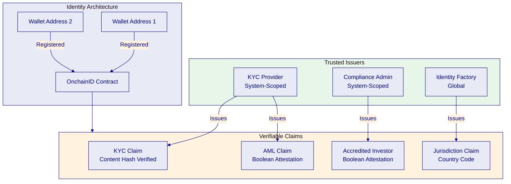

OnchainID is built on ERC-734 for key management and ERC-735 for claim management. Claims are signed attestations about the identity holder (KYC verified, AML cleared, accredited investor, professional investor). The core design property is that claims are issued by trusted third parties, not self-asserted. A wallet holder cannot declare themselves accredited or KYC-verified. A registered trusted issuer must attest to that fact by writing a signed claim to the holder's OnchainID contract.

**Claim Topics**

DALP ships with a broad set of preset verification topics across four domains:

| Domain | Topics | Purpose |
|---|---|---|
| Investor Verification | KYC, AML, Accredited Investor, Professional Investor, QII, Regulation S | Investor eligibility and classification |
| Issuer Verification | Licensed, Jurisdiction, Prospectus Filed, Prospectus Exempt, Reporting Compliant | Issuer regulatory status |
| Asset Verification | Collateral, Unique Identifier, Classification, Base Price, Location | Asset-level attestations |
| General | Contract Identity, Custom | System and organization-defined topics |

**Auto-Claim Integrity Rules**

DALP adds validation at claim issuance time that goes beyond bare ERC-3643 implementations. Boolean investor/compliance topics only accept the literal string "true." The `knowYourCustomer` topic requires a DALP-resolved target identity with an approved KYC profile, and the claim value must exactly match the approved KYC content hash. Topic names are resolved against the registered topic-scheme list before dispatching issuance. This closes a common institutional risk: a trusted issuer pushing arbitrary or malformed claims into the system.

**KYC Profile Lifecycle**

DALP maintains a full KYC profile lifecycle that governs how identity verification data flows from off-chain verification into on-chain claims:

| State | Description | Transitions |
|---|---|---|
| Draft | Initial state, user submitting information | Submit for review |
| Under Review | Submitted for operator review | Approve, reject, or request update |
| Approved | Verified, claims can be issued (content hash recorded) | N/A (terminal for current version) |
| Rejected | Rejected with mandatory reason (minimum 10 characters) | Resubmit as new draft |
| Update Required | Requires user action on specific fields with optional deadline | User updates, resubmit for review |

When issuing a KYC claim, DALP validates that the target identity exists and is resolved, that an approved KYC profile exists with a non-null content hash, and that the submitted claim value exactly matches the approved content hash. This ensures KYC claims cannot be issued against stale or unapproved verification data. The content hash binding creates a deterministic link between off-chain verification evidence and on-chain attestation.

Identity states progress through defined stages: Pending Registration (has an OnchainID contract but is not yet in the Identity Registry; cannot receive assets), Registered (in the registry, awaiting verification; can be referenced but cannot receive compliance-restricted assets), and Verified (has the required claims from trusted issuers; can receive assets based on compliance module evaluation).

**Claims Are Checked at Execution Time**

Claims are checked when the transfer is attempted, not only when the investor is onboarded. This means expired claims fail, revoked claims fail, claims from issuers that lost trust fail, and newly added compliance conditions start applying to future transfers immediately. An investor who was eligible yesterday may not be eligible today. This is exactly what regulated institutions need: continuous compliance, not point-in-time onboarding.

**Identity Recovery**

DALP provides durable, phase-tracked identity recovery workflows for wallet loss or compromise scenarios. Recovery proceeds through defined phases with each transition persisted and auditable. This enables institutions to handle the operational reality that wallet keys can be lost, compromised, or need rotation without forcing investors to re-verify their identity from scratch. The recovery workflow transfers the identity binding from the old wallet to a new wallet while maintaining claim continuity and compliance history.

### Trusted Issuers Hierarchy

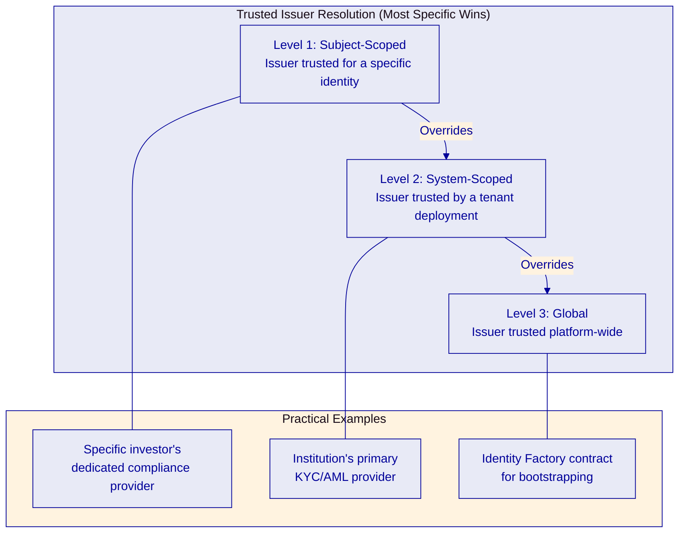

DALP implements a hierarchical trusted issuer resolution model with three levels of specificity. Subject-scoped (Level 1) is the most specific: an issuer trusted for a particular identity context. System-scoped (Level 2) is the mid-level: an issuer trusted by a tenant or system deployment. Global (Level 3) is the broadest: an issuer trusted platform-wide.

Resolution follows a "most specific wins" model: subject-scoped overrides system-scoped, which overrides global. This hierarchy allows institutions to maintain a general trust framework while accommodating specific exceptions. Trust is topic-specific: an issuer trusted for KYC is not automatically trusted for collateral attestations or issuer licensing claims.

If a trusted issuer is removed, existing claims from that issuer are no longer accepted for future compliance evaluation, and transfers relying on those claims can begin failing immediately. There is no grace period. This is the right behavior for a regulated system, but it has operational consequences. Institutions must plan issuer transitions carefully, ensuring replacement issuers are configured and claims re-issued before revoking trust from an outgoing provider.

### Multi-Jurisdictional Support

DALP's value is not that it ships a bespoke module for every country. It is that the same primitives cover recurring regulatory patterns. Most regulatory regimes differ in parameterization and combinations of controls more than in totally unique requirements.

**EU (MiCA/MiFID II)**

| Regulatory Concern | DALP Module Mapping |
|---|---|
| KYC/AML gating | Identity Verification with `[KYC, AML, AND]` expression |
| Professional vs. retail categorization | Claim topics: Professional Investor, QII |
| EU-only distribution | Country Allow List with 27 member state codes |
| Issuance cap monitoring (EUR-denominated) | Token Supply Limit with base-price conversion |
| Reserve/backing for stablecoins | Collateral Compliance Module |
| Transfer agent controls | Transfer Approval with one-time-use approvals |

**UAE (VARA)**

DALP supports UAE regulatory requirements through the same module primitives, with configuration for GCC country codes, Islamic finance compatibility through Sharia-compliant structures, and integration with local custody providers. The ADI Finstreet and Saudi RER reference projects demonstrate production deployment in the Gulf region.

**Singapore (MAS)**

| Regulatory Concern | DALP Module Mapping |
|---|---|
| QII or KYC+AML verification | Identity Verification: `[CONTRACT, KYC, AML, AND, OR]` |
| Singapore-only distribution | Country Allow List with Singapore code |
| Investor count limits | Investor Count with global limit |
| Mandatory holding period | TimeLock with FIFO batch tracking and QII exemption |

**US (Reg D/S)**

| Regulatory Concern | DALP Module Mapping |
|---|---|
| Accredited investors only (506(c)) | Identity Verification: `[ACCREDITED]` |
| Mixed sophistication (506(b)) | Identity Verification: `[ACCREDITED, KYC, AML, AND, OR]` + Investor Count |
| Offshore restrictions (Reg S) | Regulation S claim + country restrictions |
| Holder count caps | Investor Count with global limits |
| Restricted resale/holding periods | TimeLock with FIFO batch tracking |

An institution operating across multiple jurisdictions can use the same module types with different configurations for each. The template model works because regulatory regimes share common patterns in how they restrict, verify, and monitor tokenized assets.

### Regulatory Reporting and Audit

DALP's audit architecture provides multiple layers of evidence for regulatory reporting:

**Immutable on-chain events.** Every compliance-relevant action emits indexed blockchain events: module evaluation results (pass or fail with specific module identification), claim issuance and revocation, trusted issuer configuration changes, bypass list modifications, transfer approval grants and consumptions, and investor count state changes. These events form an immutable, timestamped record that cannot be altered after the fact.

**Structured error catalog.** The 534 auto-generated error codes provide audit-grade failure reporting. Each code carries a machine-readable selector, severity level, audience targeting, retryability flag, and internationalized descriptions. A failed transfer is not just a technical event. It is often a compliance record, a client-support issue, an audit artifact, and sometimes evidence in a regulatory review.

**Compliance dashboards.** The Asset Console provides real-time visibility into module configuration and state, compliance check volumes and outcomes, open action requests for KYC remediation, claim expiration monitoring, and trusted issuer status tracking.

**Report generation.** The 18 PostgreSQL analytics views provide direct SQL access for compliance reporting. Transaction history, asset activity, lifecycle events, and country distribution data can be queried by any BI tool for regulatory submissions. The data supports both periodic regulatory filings and ad-hoc investigative queries.

### Example Compliance Composition for a Regulated Bond Program

To make the architecture concrete, consider a regulated bond issuance for a European bank with the following constraints: EUR-denominated issuance, professional and institutional investors only, EU-only distribution, mandatory KYC and AML screening, transfer-agent approval for secondary OTC transfers, 90-day lock-up for initial allocations, and a maximum holder count.

In DALP, that policy would not be implemented through custom code. It would be composed from existing controls. Identity Verification would enforce KYC plus AML plus either professional-investor or qualified-institutional-investor status. Country Allow List would restrict distribution to EU member states. Investor Count would cap the number of holders. TimeLock would enforce the 90-day hold period with optional exemption for qualified institutional investors. Transfer Approval would preserve manual review for secondary transfers. Token Supply Limit would enforce the total issuance cap in EUR terms. If collateral or reserve backing were relevant, the Collateral Compliance Module would enforce that before minting.

Operationally, that means the legal and compliance teams define the policy once, and the platform enforces it on every relevant action. The issuer does not need to rely on a transfer agent remembering which investors are inside the lock-up period or whether a prospectus exemption still applies. The platform checks those conditions at execution time.

This example matters because it shows the practical advantage of DALP's compliance model. Institutions do not need a new smart contract for every new regulatory structure. They need a reusable control plane where policy can be composed, explained, audited, and operated.

### Why This Matters for Institutional Operations

The deeper point is that DALP turns compliance from a mix of legal interpretation, manual process, and post-trade review into an execution environment where approved policy is actually enforced. It does not replace legal advice or compliance teams. It gives them something more useful: a system where the rules they approve are the rules the platform executes.

For institutions, that changes the operating model in four ways. First, control evidence is generated automatically by the system itself rather than assembled after the fact. Second, operations become more predictable because rule evaluation is deterministic. Third, onboarding and transfer workflows scale because the rules are reusable. Fourth, audit and regulatory reviews become faster because the evidence is already structured.

That is why compliance is DALP's key differentiator. Plenty of tokenization platforms can issue a token. Far fewer can prove, in a way that stands up to institutional scrutiny, why a transfer happened, why another transfer did not, who was allowed to authorize each step, and what evidence exists for each decision.

---

## Integration Architecture

[FIXED]

### API Surface

The Unified API provides programmatic access to every DALP capability through a typed REST interface at `/api/v2`.

**Endpoint Coverage**

The API is organized by procedure namespace:

| Namespace | Capabilities | Example Operations |
|---|---|---|
| `token` | Asset lifecycle | Create, mint, burn, transfer, freeze, pause |
| `system` | Platform infrastructure | Grant roles, register identities, manage trusted issuers |
| `user` | User management | Profile, statistics, growth metrics |
| `addons` | Optional features | Token sale, fixed yield, XvP settlement, vault, airdrop |
| `monitoring` | Operational health | API health, blockchain health, logs, streaming |
| `search` | Global search | Cross-entity search (tokens, contacts, transactions) |

**Error Architecture**

DALP ships 534 auto-generated error codes from Solidity ABI definitions. Each code includes a 4-byte selector for programmatic identification, a DALP code for support and diagnostics, severity classification, audience targeting (investor, operator, or administrator), a retryability flag, suggested remediation action, and internationalized messages across four locales (en-US, de-DE, ar-SA, ja-JP).

Error responses follow a consistent JSON structure across all procedures, including the error code, HTTP status, human-readable message, and optional context data (such as required roles or transaction details). Blockchain revert reasons surface as structured errors rather than opaque revert data, enabling rich error handling in client applications.

**OpenAPI Specification**

The API delivers an OpenAPI 3.1 specification generated directly from procedure definitions. This specification is available at `/openapi.json` and can be imported into Postman, Insomnia, Redoc, or any OpenAPI-compatible tooling. Interactive documentation via Swagger UI is available at `/api`. The specification enables auto-generation of client libraries in any language through standard OpenAPI generators.

**TypeScript SDK**

The first-party SDK (`@settlemint/dalp-sdk`) provides full type safety with contract-bound types from the live API route tree. It includes DALP-specific serializers for arbitrary-precision decimals (handling values like token amounts with 18 decimal places without floating-point artifacts), blockchain integers exceeding JavaScript's safe integer limit, and deterministic date serialization. The SDK publishes three entrypoints: runtime client, type-only imports (zero runtime cost for TypeScript projects that only need types), and plugins for request/response validation and batched requests.

Multi-language SDK generation is supported through the OpenAPI specification for Python, Go, C#/.NET, and Java.

### Real-Time Event Architecture

DALP provides real-time event delivery through multiple channels.

**Server-Sent Events (SSE).** The platform emits real-time events for API metrics (request rates, latency, error rates), blockchain health status changes (with three-sample hysteresis to prevent false alerts from transient issues), and transaction lifecycle state changes. The SSE publisher provides process-local fan-out for connected consumers.

**Blockchain Event Indexing.** The custom PostgreSQL indexer processes all on-chain events with less than five seconds of latency from blockchain event to analytics view availability. Events are processed across eight or more domains covering token operations, identity, compliance, addons, and system contracts. Virtual views provide real-time query-time execution for current data, while materialized views provide configurable refresh for aggregated analytics.

**Transaction Lifecycle Events.** Every mutation flows through the 11-state transaction lifecycle, with each state transition recorded in the transaction request table. The full lifecycle (received through queued, submitted, broadcasting, pending, confirming, to confirmed, failed, cancelled, expired, or replaced) provides complete visibility into every blockchain operation. Transaction status can be polled via the status URL returned in async responses.

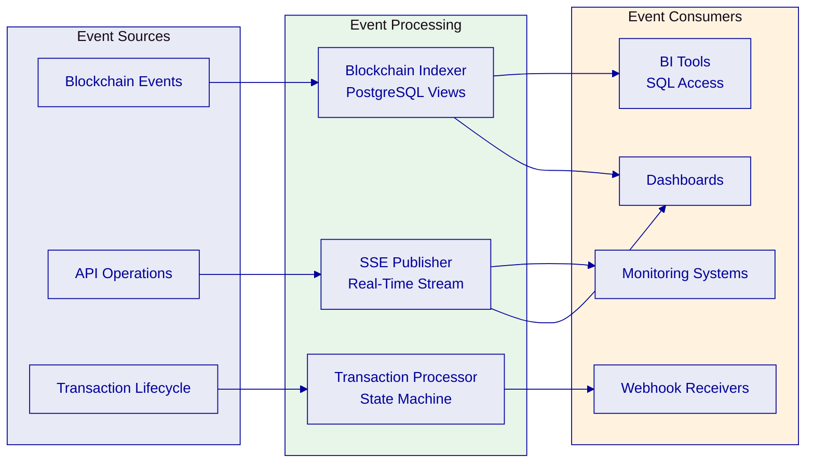

### External System Integration

**Custody Providers**

DALP operates a bring-your-own-custodian model through the Key Guardian signer service. The unified signer interface abstracts over all custody backends. Switching between providers requires only configuration changes.

| Capability | DFNS | Fireblocks |
|---|---|---|
| MPC Type | Threshold MPC (distributed key shards) | MPC-CMP (continuous key refresh) |
| Policy Engine | DFNS Policy Engine (programmatic) | Transaction Authorization Policy (console/co-signer) |
| Approval Resolution | Full API-based resolution through DALP | Console or Co-Signer appliance only |
| Wallet Model | Flat wallet list | Vault account hierarchy |

Both providers use MPC signing so that no single private key ever exists in one place. The fundamental operational difference is that DFNS allows fully programmatic approval workflows through its API, while Fireblocks requires approvals through its own console or mobile app. This distinction has significant operational implications: fully automated workflows (CI/CD pipelines, scheduled operations, algorithmic trading) work well with DFNS because approvals can be resolved programmatically. Fireblocks is better suited for environments where human approval is a compliance requirement, not an operational constraint.

**DFNS Integration Details.** DFNS provides delegated MPC custody where key shards distribute across DFNS infrastructure. Configuration requires the API URL, organization ID, authentication token, credential ID, and an elliptic curve key for API authentication. The DFNS policy engine evaluates transaction rules before MPC signing proceeds: auto-sign rules for low-value transactions, amount thresholds for graduated approval, IP and time restrictions, and multi-party approval requirements. When a policy requires approval, DALP surfaces the pending approval through its API. Operators can review, approve, or reject without leaving the DALP interface. DFNS audit logs synchronize with DALP audit records, providing unified compliance reporting.

**Fireblocks Integration Details.** Fireblocks provides institutional MPC-CMP custody through vault accounts. Key material distributes across Fireblocks infrastructure and the customer's co-signer node, with continuous key refresh eliminating static key shares. Fireblocks organizes keys into vault accounts, each containing one or more asset wallets. DALP supports creating vault accounts, activating asset wallets, and querying vaults across the organization. The Transaction Authorization Policy (TAP) enforces transaction amount thresholds, whitelisted destination addresses, velocity limits, and multi-approver requirements. When a TAP rule blocks a transaction, DALP surfaces the pending approval. Unlike DFNS, Fireblocks does not support programmatic approval resolution through external APIs; approvals must go through the Fireblocks Console or Co-Signer appliance.

**Account Abstraction (ERC-4337).** The Transaction Signer supports ERC-4337 account abstraction for enhanced transaction patterns: user operations submitted through bundler infrastructure rather than direct RPC calls, paymaster integration where gas fees are paid from designated accounts rather than transaction signers, batched execution of multiple operations in single transactions for gas efficiency, and signature aggregation for compatible wallets. For public networks, the canonical EntryPoint v0.9 address is used; for private networks, a local EntryPoint is deployed automatically.

A storage hierarchy provides graduated security levels: encrypted database for development and low-value assets, cloud secret manager for standard production deployments, hardware security module (FIPS 140-2 Level 3) for regulated financial services, and third-party custody (DFNS or Fireblocks) for the highest security requirements.

**KYC/AML Providers**

DALP does not perform identity verification directly. It provides the identity infrastructure that verification results flow into. The integration model works as follows: the external KYC/AML provider (Onfido, Jumio, Sumsub, or similar) verifies the investor off-chain. The verification result is translated into DALP claim topics. A trusted issuer writes signed claims to the investor's OnchainID contract. The Trusted Issuers Registry validates the issuer is authorized for the relevant claim topics. Compliance modules read those claims at every transfer to make eligibility decisions.

DALP maintains a full KYC profile lifecycle with states: draft, under review, approved (content hash recorded), rejected (with mandatory minimum 10-character reason), and update required (with specific fields and optional deadline). Three review outcomes are supported: approve, reject, and request update.

**Payment Rails**

DALP supports integration with institutional payment infrastructure through ISO 20022 message standards for connectivity with SWIFT, SEPA, and RTGS payment networks. Structured message formats for corporate actions, settlement instructions, and asset servicing align with the ISO 20022 standard, enabling tokenized settlement workflows to interface with traditional payment clearing systems.

Exchange rate management provides rates synchronized from external providers with historical rate storage, manual operator overrides for institutional pricing requirements (provider set to "manual"), and multi-currency asset valuation through cross-referenced exchange rates. Full CRUD API access covers rate reading, listing, history, update, deletion, and synchronization with cache invalidation after mutations.

The XvP settlement system bridges tokenized assets and payment instruments through three models. Local settlement provides same-chain atomic execution where both legs complete or revert together in a single transaction. Cross-chain settlement uses Hash Time-Locked Contract (HTLC) patterns for settlements spanning multiple chains, with hashlock verification and cancellation vote logic. Multi-party settlement supports more than two counterparties in a single settlement workflow. Terminal states (executed, cancelled, or expired-withdrawn) are deterministic and auditable, enforced by smart contract guards that prevent state transitions once a settlement reaches a terminal state. A 30-day refund grace period protects investor refund pools during failed sale scenarios, and per-currency refund patterns prevent a blacklisted payment currency from blocking refunds for other currencies.

The Maybank Project Photon reference project demonstrates XvP settlement in production: atomic cross-currency swaps of tokenized Malaysian Ringgit with simultaneous settlement of both legs, reducing counterparty and settlement risk to zero for matched trades.

**Market Data Feeds**

DALP's feeds system provides a unified data feed integration layer through the FeedsDirectory, a central on-chain registry that separates discovery (which feed serves a given subject and topic) from delivery (individual feed contracts). Consumers never hard-code feed addresses; they query the directory for the feed serving their subject and topic, enabling feed replacement without consumer reconfiguration.

Feed registration includes the subject (token address or global subject for economy-wide data), topic (data type the feed provides, such as base price or FX rate), feed contract address, feed kind (scalar or structured bytes), and schema hash (pins the expected data format for consistency).

Supported feed types include issuer-signed scalar feeds where the asset issuer cryptographically signs and publishes price data with configurable history modes (latest-only, bounded, or full), drift allowance, positive-value requirements, and signature verification. Adapter contracts present any DALP feed through the standard aggregator interface (the de facto standard consumed by lending platforms, DeFi protocols, and external analytics tools). The adapter address is permanent and survives feed replacement in the directory, resolving the current feed dynamically on every call.

Feed consumers include compliance modules (for limit checks and valuation requirements; transfers are blocked if the feed is stale or missing), yield and distribution calculations (based on current prices), the Asset Console (for portfolio valuation display), the Execution Engine (for feed data in multi-step workflows), and external protocols consuming via the adapter interface.

Feed registration is a privileged operation. Only the Feeds Manager role at the system level can register, replace, or remove feeds for any subject. Token-level governance role holders can create feeds and adapters for their specific token. Read access is unrestricted. Schema hash pinning ensures consumers always know the expected data format; format changes require explicit feed replacement, preventing silent data format changes that could affect compliance decisions or valuations.

### Migration and Interoperability

**Data Migration Approach**

DALP's migration approach addresses both greenfield deployments (new tokenization programs) and brownfield scenarios (coexistence with existing systems). For greenfield deployments, the Asset Factory pipeline provides deterministic, durable token creation with full compliance and identity infrastructure bootstrapping. For brownfield scenarios, DALP provides external token registration for governed onboarding of tokens from other platforms, API-first integration enabling middleware or ESB connectivity, and data export through PostgreSQL analytics views for ETL pipelines.

**Coexistence with Legacy Systems**

DALP is designed to operate within existing institutional environments, not replace them. The API-first architecture enables point-to-point API calls from ERP and core banking systems, middleware and ESB integration via standard REST endpoints, batch processing through CLI scripting, and SDK-based custom integration applications. Event-driven integration provides blockchain events indexed in real-time, SSE streaming for operational dashboards, transaction lifecycle events for reconciliation systems, and compliance events for regulatory reporting pipelines.

**ERP and Back-Office Integration Patterns**

DALP enables ERP and back-office integration through complementary patterns. API-first integration provides every DALP operation through the REST API, enabling point-to-point API calls from ERP and core banking systems, middleware and ESB integration via standard REST endpoints, batch processing through CLI scripting (301 typed commands), and SDK-based custom integration applications. Data export for reporting provides PostgreSQL analytics views with direct database access for BI tools, enabling standard ETL pipelines without requiring integration through the DALP API. Event-driven integration provides blockchain events indexed in real-time (less than five seconds latency), SSE streaming for operational dashboards, transaction lifecycle events for reconciliation systems, and compliance events for regulatory reporting pipelines.

External token registration enables DALP to register and track tokens from external systems. Registration is tenant-scoped, role-gated, and creates full read-model projections, making external tokens first-class citizens for portfolio and compliance tracking within DALP.

**Observability Integration**

DALP's observability stack integrates with enterprise monitoring infrastructure through OTLP export (distributed traces exported to any OTLP-compatible collector), metrics scrape endpoints for all platform components with opt-in annotation-based service discovery, structured logs compatible with any log aggregation pipeline, BI tool integration through PostgreSQL analytics views, and alert routing through configurable notification templates with escalation paths and silence URLs.

The distributed tracing architecture spans three tracer namespaces: core API service tracing with route handlers and database query instrumentation, custody provider tracing for per-operation span instrumentation across Fireblocks and DFNS API calls, and transaction lifecycle tracing covering submit, sign, broadcast, and confirm phases plus queue bridge spans. This enables end-to-end request tracing from API entry through workflow orchestration to external custody provider calls, critical for diagnosing latency and failures in delegated signing flows where DALP does not own the full execution path.

**Meta-Transactions and Gasless Operations**

The API supports meta-transactions through ERC-2771 integration. Callers can submit signed transaction payloads without holding native tokens for gas. A configured relayer service sponsors transaction costs while the user's signature authorizes the operation. This enables simplified user experience (investors interact with tokens without managing cryptocurrency for fees), sponsored operations (issuers cover transaction costs for their investors), and gasless workflows (automated systems execute transactions without native token management). Meta-transactions work transparently through the API.

**API Gateway Patterns**

The Unified API serves as the gateway for all external system interactions. The OpenAPI specification enables standard enterprise API governance workflows. API keys provide organization-scoped, HTTP-method-enforced authentication for programmatic consumers. The rate limiting configuration (10,000 requests per 60-second window per key) supports high-volume integration scenarios. For clients requiring an API gateway between their systems and DALP, the REST API supports standard gateway patterns including authentication passthrough, rate limiting aggregation, and request/response transformation.

**Security Model for Integrations**

DALP enforces security at every integration layer through a defense-in-depth model. No single control failure grants unauthorized access to digital assets.

| Layer | Control | Enforced By |
|---|---|---|
| Identity | Authentication (session, API key, SSO) | Asset Console, Unified API |
| Access | Role-based and resource-level authorization | API middleware chain |
| Transaction | Wallet verification (PIN, TOTP, backup codes) | API before blockchain writes |
| On-chain | Identity claims and compliance modules | SMART Protocol (ERC-3643) |
| Custody | Provider policy evaluation and MPC signing | Key Guardian, custody providers |

Each layer operates independently. A compromised session token is blocked by wallet verification. A bypassed API authorization check is blocked by on-chain compliance. Custody provider policies provide the final gate before any transaction reaches the blockchain. This two-layer policy model means every transaction passes through both DALP's on-chain compliance (identity, jurisdiction, supply, time) and the custodian's policies (amount thresholds, approver workflows, spend limits, destination allowlists). Both must be satisfied; neither can bypass the other.

**Deployment Flexibility**

| Deployment Model | Description |
|---|---|
| Managed SaaS | SettleMint-hosted, fully managed |
| Dedicated Cloud | Customer's cloud account (AWS, Azure, GCP), SettleMint-managed |
| On-Premises | Helm/Kubernetes deployment in customer data center |
| Hybrid | Combination aligned with data residency requirements |

All deployment models expose the same API surface, ensuring integration code is portable across environments. The platform supports Kubernetes 1.27+ and Red Hat OpenShift 4.14+ with automatic platform detection and configuration. Container images are served through a single registry endpoint, simplifying firewall rules and supporting image mirroring for air-gapped deployments.

This portability is strategically important. Institutions often begin in one deployment model and evolve toward another. A program may start as managed SaaS during the innovation phase to accelerate time-to-value, move into a dedicated cloud model once security and compliance review harden, and ultimately land in a hybrid or on-premises model for production if data residency or operating policy requires it. DALP is designed to support that migration path without forcing an application rewrite.

**Migration Strategy in Practice**

A realistic migration program usually happens in phases. First, DALP is introduced as the new control plane while existing upstream and downstream systems remain authoritative for client data, accounting, and reporting. Second, key workflows such as identity verification, issuance approval, and transaction tracking are integrated and validated in parallel. Third, selected production flows are cut over while legacy systems remain connected for coexistence and reconciliation. Finally, once control evidence and operational confidence are established, DALP becomes the primary operating system for the digital asset lifecycle, with legacy systems connected where they still provide business value.

This phased approach matters because institutions do not replace critical infrastructure in one jump. They layer in new capabilities while preserving continuity, auditability, and fallbacks. DALP's API-first and event-driven design is built for exactly that kind of staged transition.

**Interoperability Principle**

The practical rule is simple: DALP should be the place where digital asset state is governed, while surrounding systems continue to do what they already do well. Core banking systems remain authoritative for customer master data and certain accounting flows. Custody providers remain authoritative for key security policy and MPC signing. KYC providers remain authoritative for identity verification evidence. DALP connects those domains and turns their outputs into live operational controls.

That interoperability model is why the platform scales inside large institutions. It does not ask them to throw away working systems. It asks them to replace manual coordination gaps with programmable, governed workflows.

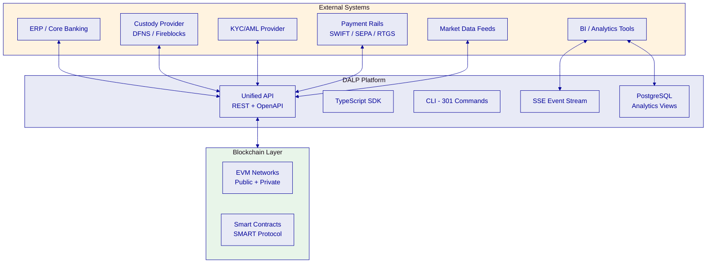

---

*End of Technical Proposal Part 1. Part 2 continues with Security Architecture, Deployment and Infrastructure, High Availability and Disaster Recovery, Performance and Scalability, Monitoring and Observability, Implementation Approach, and Commercial Terms.*
