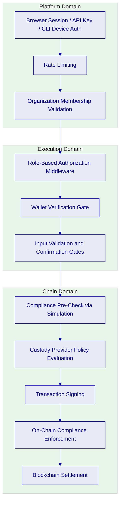
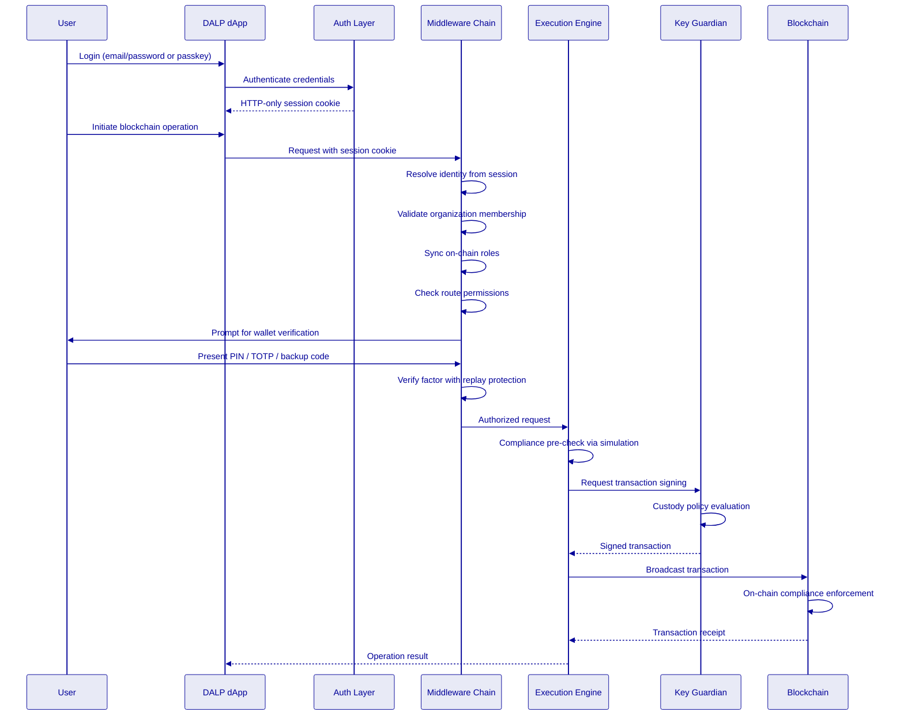
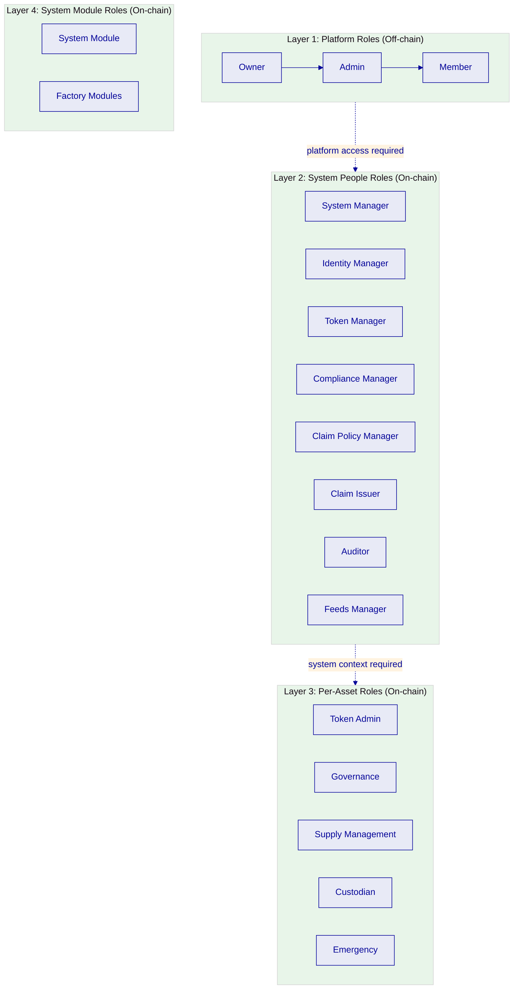
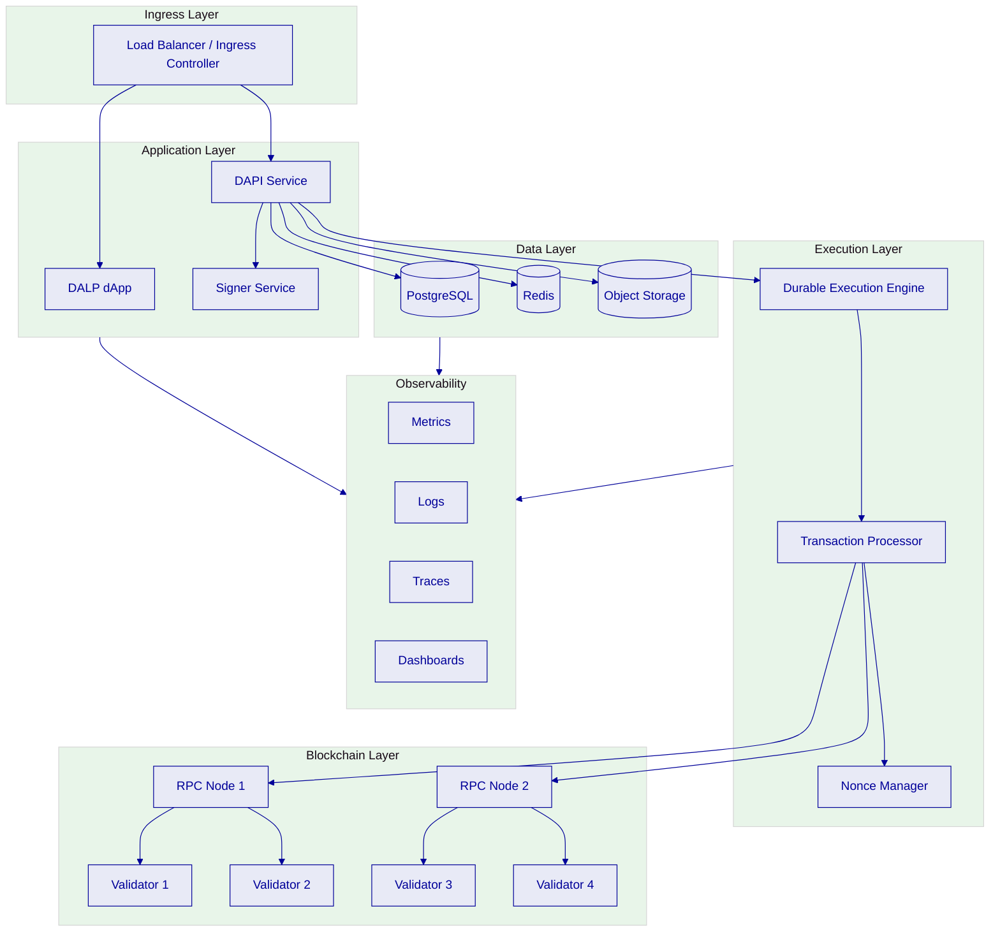
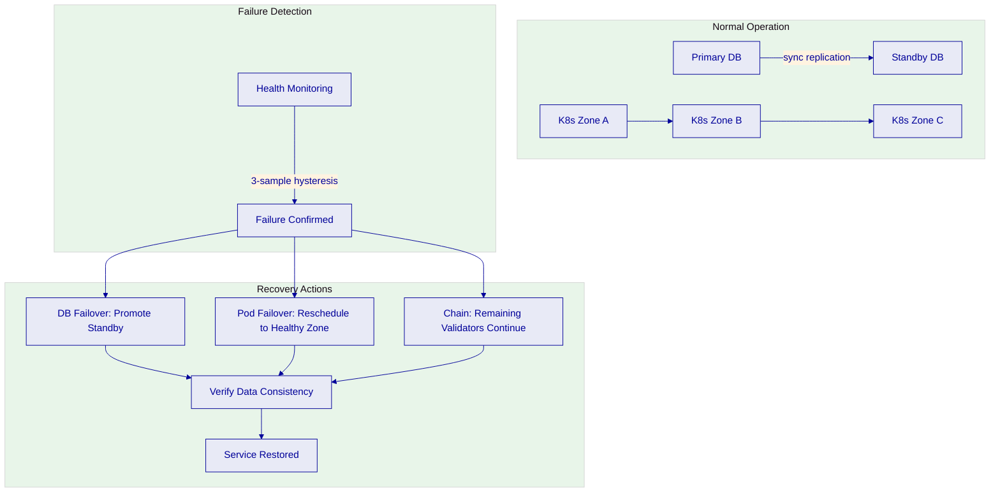
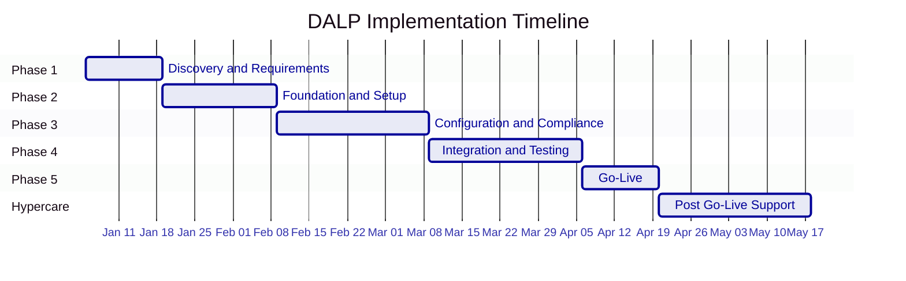
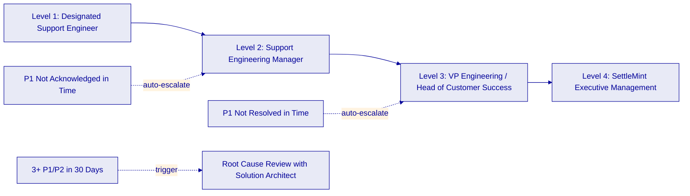

# Technical Proposal: Platform Operations and Deployment

This section covers DALP's security architecture, access control model, deployment options, operational capabilities, implementation methodology, training program, and support framework. Together, these sections describe how the platform protects digital assets, governs access, deploys into institutional environments, and sustains production operations over time.

---

## Security Architecture [FIXED]

### Two-Endpoint Authentication Model

DALP enforces a strict two-endpoint authentication architecture that separates interactive access from programmatic access. This separation is not a convenience feature; it is a fundamental security boundary designed for institutional operations where different access patterns carry different risk profiles and where regulatory requirements often demand distinct controls for human-initiated and machine-initiated operations.

The first endpoint, `/api/rpc`, serves the interactive web application exclusively through session cookies issued by the platform's authentication layer during browser-based login flows. This endpoint powers the DALP console interface and handles all interactive operations. Session cookies are HTTP-only (inaccessible to client-side JavaScript), carry the Secure flag (transmit only over HTTPS), include SameSite protection against cross-site request forgery, and bind to both the user's identity and their active organization context. Sessions expire after seven days with a 24-hour refresh window, and a 10-minute cookie cache reduces database lookups during active use. The authentication layer supports multiple login methods: email/password with mandatory email verification, passkeys via WebAuthn (providing phishing-resistant, hardware-bound authentication using biometrics, device PINs, or security keys), and enterprise SSO integration through configurable identity provider plugins.

The second endpoint, `/api/v2`, serves programmatic integrations through API keys passed via request headers. This endpoint supports SDK consumers, CLI operations, CI/CD pipelines, and backend system integrations. API keys enforce scope based on the HTTP method of each request: read-only keys permit only GET, HEAD, and OPTIONS methods, while read-write keys permit all methods including POST, PUT, PATCH, and DELETE. Each API key carries an `sm_atk_` or `sm_dalp_` prefix followed by a cryptographically random suffix. Keys are stored as hashes in the database; the cleartext value is shown exactly once at creation time and cannot be recovered if lost. A default rate limit of 10,000 requests per 60-second window per key prevents bulk extraction and abuse. API keys inherit permissions from the creating user's role and are scoped to a single organization. If a user belongs to multiple organizations, separate keys must be created for each one, ensuring that programmatic access respects the same tenant boundaries as interactive access.

The critical security property is the hard boundary between these endpoints. API keys are **never** accepted on the RPC endpoint. Any attempt to authenticate to `/api/rpc` with an API key receives an immediate FORBIDDEN response, not a redirect or a helpful error suggesting the correct endpoint. This boundary exists because the RPC endpoint carries session state, CSRF protections, and interactive verification flows that do not apply to API key authentication. Allowing API keys on the RPC surface would bypass these interactive security controls. Conversely, session cookies are not accepted on the v2 endpoint, preventing programmatic integrations from piggybacking on browser sessions.

This separation matters for institutional operations because it enables clean security policy segmentation. Monitoring and reporting systems receive read-only API keys that can only query data through safe HTTP methods. Operational automation receives read-write keys scoped to specific organizational contexts. Interactive users authenticate through browser sessions with full MFA and wallet verification enforcement. Each access pattern has its own security controls appropriate to its risk profile. Security teams can monitor and audit each endpoint independently, applying different logging verbosity, rate limiting, and alerting thresholds based on the risk profile of each access channel.

The DALP SDK has been fully migrated from the proprietary RPC protocol to OpenAPI and the `/api/v2` surface, meaning all SDK operations flow through the documented REST endpoint with standard API key authentication. This migration eliminated the need for SDK consumers to manage session cookies or understand the RPC protocol, simplifying integration and making the SDK compatible with standard HTTP client libraries in any programming language. The SDK includes typed TypeScript bindings with DALP-specific serializers for arbitrary-precision decimals (avoiding floating-point errors in financial calculations), blockchain integers, and dates, along with 534 auto-generated contract error codes providing structured error handling with severity classification and suggested remediation actions.

### Security Domains

DALP's security architecture operates across three distinct trust boundaries, each enforcing independent controls. A request must pass through all three domains before any blockchain operation executes.

**Platform Domain.** The platform domain encompasses everything between the external user and DALP's API surface. This domain controls who can access the platform and through which channels. Authentication is the primary control: session-based login for interactive users (supporting email/password with mandatory email verification, passkeys via WebAuthn for phishing-resistant hardware-bound authentication, and enterprise SSO through configurable identity provider plugins), API key authentication for programmatic access, and browser-based device authentication for CLI sessions. Rate limiting applies at the API key level with a default threshold of 10,000 requests per 60-second window per key. Every authentication event is logged with timestamp, method, source IP, and result, creating an audit trail that captures who accessed the platform, when, and how they authenticated. Failed authentication attempts are tracked for anomaly detection and potential brute-force identification. The platform domain also enforces organization membership validation, ensuring that every request operates within a verified tenant context rather than trusting client-declared organization identifiers. Token-based authentication flows for password reset and email verification include normalized handling of malformed query parameters, preventing exploitation of URL parsing differences across browsers and HTTP clients.

**Execution Domain.** The execution domain sits between the API surface and the blockchain interaction layer. This domain controls what authenticated users can do. Authorization is enforced through a layered middleware chain that composes permissions at request time rather than relying on static permission tables. The chain follows a strict sequence: first, it resolves the caller's identity from their session or API key; second, it validates organization membership for the active tenant; third, it synchronizes on-chain role state into the organization context through the role synchronization middleware (ensuring that role changes made directly on-chain are reflected in the very next API request, with caching scoped to the combination of session ID, system address, and user address); fourth, it hydrates system-level permissions from mapped on-chain roles and the AccessManager contract; and fifth, for token-scoped operations, it derives token-level permissions from on-chain roles, trusted issuer status, and interface support. Each step must succeed for the chain to continue; failure at any step results in denial with a specific error indicating which authorization requirement was not met.

Wallet verification provides an additional gate for sensitive blockchain writes: even an authenticated user with the correct roles must present a second factor (PIN, TOTP, or backup code) before the request proceeds to the blockchain layer. This means a compromised session cookie alone cannot trigger minting, transfers, forced transfers, burns, or other state-changing operations. Each verification factor includes its own replay protection mechanism (TOTP codes are tracked in a dedicated table to prevent reuse within the validity window; backup codes are marked as consumed on use), ensuring that intercepted verification responses cannot be replayed. Input validation through typed schemas on all route contracts prevents malformed data from reaching business logic. Confirmation gates require explicit textual confirmation for destructive operations such as identity recovery (the exact text "RECOVER IDENTITY" must be provided), adding a human-in-the-loop control for irreversible actions.

**Chain Domain.** The chain domain encompasses the blockchain itself and the custody providers that control signing keys. On-chain compliance enforcement through the SMART Protocol evaluates identity claims, country restrictions, investor counts, holding periods, supply caps, and other compliance modules before any transfer executes. This enforcement is pre-checked through simulation using `eth_call` against the protocol's `canTransfer` function (preventing wasted gas on transactions that will fail and providing immediate, actionable feedback with structured error codes from DALP's 534-code error catalog) and re-enforced at actual execution time (providing the authoritative guarantee). If compliance state changes between simulation and broadcast (for example, a claim expires in the interval), the on-chain transaction will revert, ensuring that the pre-check is a convenience optimization while the on-chain enforcement remains the authoritative control.

Custody provider policies add a final independent control layer. DFNS policy engines can enforce per-transaction amount limits, rolling spend limits, IP restrictions, time-of-day restrictions, and multi-party approval requirements, all configurable through the DFNS policy management API. Fireblocks Transaction Authorization Policy (TAP) provides similar controls through its console and Co-Signer appliance, including destination allowlists and multi-approver workflows. Both custody layers must pass for a transaction to reach the blockchain. Neither can bypass the other, and neither can bypass on-chain compliance. This independence is architectural: the DALP platform does not have the technical ability to bypass custody policies, and custody providers do not have the technical ability to bypass on-chain compliance checks. Even in a scenario where every off-chain control is compromised, the on-chain compliance modules will still prevent non-compliant transfers from settling.

### Authentication Flow

The authentication flow differs by access method, but all paths converge at the same authorization middleware chain. The following sequence diagram illustrates the interactive browser authentication flow, which provides the strongest security guarantees.

For CLI authentication, DALP uses a browser-based device authentication flow. The CLI requests a device authorization code from the platform. The user opens a browser URL and approves the device session using their existing authenticated session (with all MFA controls active). The CLI exchanges the approved code for an authentication token, which is then upgraded to a long-lived API key. On macOS, the API key is stored in the system Keychain; on other platforms, it is stored in a local configuration file with appropriate permissions. This approach ensures that CLI authentication benefits from whatever MFA and session controls are configured on the platform, preventing CLI users from bypassing passkey requirements or TOTP enforcement.

### Key Management and Custody Integration

DALP's Key Guardian service manages private key storage and signing orchestration through defense-in-depth with multiple storage backends at escalating security levels.

**Storage Tiers.** Key Guardian supports four storage tiers. The encrypted database tier provides application-level encryption suitable for development and low-value assets. The cloud secret manager tier provides platform-managed encryption for standard production deployments. The hardware security module (HSM) tier provides FIPS 140-2 Level 3 protection for regulated financial services, with signing occurring entirely within the secure enclave so that key material never leaves the hardware boundary. The third-party custody tier delegates key management to institutional MPC custody providers for the highest security requirements.

**Custody Provider Integration.** DALP integrates with two institutional custody providers through Key Guardian's pluggable backend architecture. The provider abstraction means that switching custody providers requires only Helm configuration changes, not application code modifications. Each provider's health is monitored through dedicated health check endpoints, and provider initialization is serialized through a shared initialization promise to prevent concurrent bootstrap races during deployment.

DFNS provides delegated MPC custody with programmatic wallet creation, signing, and full API-based approval resolution. DALP can create wallets, submit signing requests, and resolve pending approvals entirely through the DFNS API, enabling automated workflows where approval policies are evaluated and resolved without manual intervention. DFNS policies support auto-sign rules (transactions matching defined criteria are signed automatically without human approval), per-transaction amount thresholds, rolling spend limits calculated over configurable time windows, IP restrictions limiting signing to specific network ranges, time-of-day restrictions confining transactions to business hours, and multi-party approval requirements where multiple designated approvers must authorize before MPC key shares combine to produce a signature. DALP's distributed tracing instruments every DFNS API call (wallet CRUD operations, signing requests, policy management, approval flows) with per-operation spans, enabling end-to-end latency analysis and failure diagnosis across the custody integration boundary.

Fireblocks provides enterprise MPC-CMP custody with continuous key refresh and vault-based account management. The MPC-CMP protocol distributes key shares across multiple parties with continuous refresh, meaning that key shares change periodically without changing the derived public key or requiring counterparty notification. DALP can list pending Fireblocks approvals and track transaction status, but approval resolution must occur through the Fireblocks Console or API Co-Signer appliance. This design reflects Fireblocks' security model, which intentionally prevents third-party applications from programmatically approving transactions. Fireblocks TAP rules enforce approval workflows (single approver, multi-approver quorum, or tiered approval based on transaction value), destination allowlists (restricting transfers to pre-approved recipient addresses), and spending limits (per-transaction and rolling). Like DFNS, every Fireblocks API interaction is instrumented with distributed tracing spans across 20+ call sites.

**Smart Accounts.** DALP supports ERC-4337 smart accounts, which provide programmable wallet behavior including multi-signature requirements, spending limits, and session keys. When smart accounts are deployed, they automatically receive an associated OnchainID identity contract with a `DALP_WALLET` claim, establishing the link between the smart account and the identity verification system. For permissioned networks, DALP deploys a local EntryPoint contract automatically; for public networks, it uses the canonical v0.9 EntryPoint address.

**Vault Multi-Signature.** For operations requiring multiple approvals, DALP's vault addon provides on-chain multi-signature governance. Vault contracts enforce configurable approval thresholds: a transaction proposed by one authorized party must receive approvals from a defined quorum of other authorized parties before it can execute. The vault tracks proposed transactions, approval counts, and execution status on-chain, providing a tamper-evident approval trail. Vault events (proposal, approval, execution, cancellation) are indexed and surfaced through the DALP console and API.

**Key Lifecycle.** Key Guardian manages the full key lifecycle through four stages. During generation, HSM-backed keys are generated entirely within the hardware enclave, while software keys use cryptographically secure random number generators with immediate encryption before memory clearing. During rotation, active signing keys are replaced while historical keys are maintained for verification; the rotation process coordinates with blockchain address updates and registry notifications. For recovery, enterprise deployments use sharded backups with threshold signature schemes that require multiple custodians to reconstruct key material. During revocation, compromised keys are immediately removed from active use, and smart contract permissions are updated to reject signatures from the revoked key.

### Encryption

DALP enforces encryption for data at rest and data in transit across all deployment models. The encryption architecture follows the principle that sensitive data should be protected at every layer where it persists or moves, with multiple independent encryption boundaries ensuring that a breach at one layer does not expose data protected at another.

**Data at Rest.** All persistent data stores use AES-256 encryption, the industry standard for symmetric encryption in financial services. For managed cloud deployments, storage-level encryption is provided by the cloud provider: AWS RDS uses AES-256 encryption with AWS-managed or customer-managed KMS keys; Azure Database for PostgreSQL uses AES-256 with service-managed keys or customer-managed keys in Azure Key Vault; GCP Cloud SQL uses AES-256 with Google-managed or customer-managed Cloud KMS keys. For on-premises deployments, CloudNativePG operator configurations enforce encrypted storage volumes through the Kubernetes StorageClass, and backup storage uses server-side encryption in the target S3-compatible object store.

Wallet secrets and private keys stored in the DALP database use application-level encryption through Key Guardian's encrypted database backend. This creates a dual-layer encryption model: the database storage is encrypted at the infrastructure level (disk encryption), and the sensitive values within the database are encrypted again at the application level with separate encryption keys managed by Key Guardian. An attacker who gains access to the encrypted database storage (for example, through a storage volume snapshot) still cannot read wallet secrets without also compromising the application-level encryption keys.

Object storage (documents, asset artifacts, backups, WAL archives) uses server-side encryption with provider-managed keys or customer-managed keys depending on the deployment model and the institution's key management policy. The dual-bucket model separates public assets from sensitive data, allowing different encryption and access policies per bucket. Versioned storage with lifecycle policies (30-day cold transition, 90-day non-current version deletion) ensures that encryption protection extends to historical object versions.

**Data in Transit.** All external communications use TLS 1.3, the latest version of the Transport Layer Security protocol, providing forward secrecy and protection against protocol downgrade attacks. HTTPS is mandatory for all external routes; HTTP is allowed only for automatic 301 redirects to HTTPS. Internal service-to-service communication within the Kubernetes cluster uses encrypted channels enforced through NetworkPolicy configuration and service-level TLS where supported. Database connections require SSL/TLS with certificate verification, preventing man-in-the-middle attacks on database traffic. Redis connections require both TLS encryption and AUTH password authentication, protecting the session cache and operational data in transit. The DALP Helm charts enforce these requirements through configuration validation at deployment time, preventing the creation of environments with unencrypted communication channels. Observability data (traces, metrics, logs) exported to collectors uses the OTLP protocol over TLS, with endpoint credential redaction in startup logs preventing accidental exposure of collector authentication tokens.

**Field-Level Encryption.** Beyond storage-level and transport-level encryption, DALP applies field-level encryption to the most sensitive data elements within the database. Wallet private keys (for the local signer backend) are encrypted within the database table, not merely within an encrypted storage volume. API key secrets are stored as one-way cryptographic hashes; the cleartext key is displayed exactly once at creation time and cannot be recovered from the stored hash, even by database administrators. TOTP secrets for time-based one-time passwords are encrypted at the field level. Backup codes for wallet verification are stored with per-code consumption tracking, preventing replay. Session tokens include cryptographic binding to the issuing server and the authenticated identity, preventing token forgery and cross-session injection. This layered approach means that even with full database read access, an attacker cannot extract usable credentials without also compromising the application's encryption key management.

**Certificate Management.** TLS certificates can be managed through three approaches, allowing alignment with the institution's existing public key infrastructure (PKI) practices. ACME integration (compatible with Let's Encrypt and other ACME-compliant certificate authorities) provides automated certificate provisioning and renewal without manual intervention. Provided secrets allow organizations that manage their own certificate lifecycle through internal PKI to supply certificates directly through Kubernetes secrets. Cert-manager integration provides Kubernetes-native certificate management with support for multiple issuers, automatic renewal, and certificate rotation. For private deployments using internal DNS, certificates from internal certificate authorities are supported through the provided secrets approach. All approaches support certificate rotation without service interruption when configured with appropriate certificate reload intervals.

### Audit Trails

DALP produces audit evidence across multiple layers, creating a multi-source audit trail that supports regulatory examination, internal compliance review, and post-incident forensics.

**Immutable Event Log.** All mutations in DALP pass through role-gated middleware, and this middleware generates audit events for every authorization decision. Granted access is logged with the caller's identity, the required role, the matched role, and the target resource. Denied access is logged with the caller's identity, the required role, the missing role, and the denial reason. Escalation events are logged when wallet verification is required, recording the verification outcome. Because all mutations flow through this middleware (there are no routes that bypass role checks), the middleware audit trail provides complete coverage of every write operation attempted against the platform.

**Transaction Lifecycle.** Every blockchain write operation creates a durable transaction request record that tracks the operation through an 11-state lifecycle: RECEIVED, QUEUED, PREPARING, PENDING_APPROVAL, SIGNING, BROADCASTING, CONFIRMING, COMPLETED, FAILED, DEAD_LETTER, and CANCELLED. Each state transition is timestamped and attributed. Twenty sub-statuses provide granular failure classification (REVERTED, INSUFFICIENT_BALANCE, NONCE_CONFLICT, SIGNING_FAILED, BLOCKED_BY_POLICY, and others). This lifecycle record persists independently of the blockchain, providing evidence of operational intent even for transactions that never reached the chain.

**On-Chain Evidence.** The chain indexer captures blockchain events that constitute governance evidence: token creation and supply changes, identity registration and claims issuance, role grants and revocations, forced transfers and freezes, settlement execution and expiry, feed registration and value updates, and vault approval and execution events. Because DALP treats the chain as the authoritative source for roles and compliance, these on-chain events are not just technical artifacts; they are the canonical governance record.

**SIEM Integration.** DALP's audit data can be forwarded to enterprise Security Information and Event Management (SIEM) platforms through its event streaming infrastructure. Structured logs flow through the centralized logging pipeline (log aggregation with structured formatting including service name, correlation identifiers, severity level, and contextual metadata) and can be routed to external log aggregation systems through standard log forwarding protocols. The platform's analytics views (18+ PostgreSQL views across five domains: identity, compliance, addons, cross-cutting, and pricing) provide direct SQL access for BI tools and compliance reporting platforms, enabling security operations teams to run custom queries and build monitoring dashboards using their preferred tooling. This integration model means that DALP audit data can participate in the institution's existing security monitoring, correlation, and alerting workflows rather than requiring a separate audit review process.

The four compliance analytics views deserve particular attention for security monitoring: claims statistics aggregate claim issuance and revocation activity by topic, issuer, and status, highlighting unusual patterns; trusted issuer statistics track issuance volume and coverage per issuer, flagging issuers that suddenly increase or decrease activity; topic scheme coverage shows which verification topics are configured across which assets, identifying gaps in coverage; and module statistics track module type distribution and configuration patterns, alerting on unexpected changes. These views provide the data foundation for compliance monitoring rules in the institution's SIEM platform.

**Regulatory Audit Support.** The combination of middleware authorization logs, transaction lifecycle records (with the full 11-state lifecycle and 20 sub-statuses providing granular failure classification), on-chain events, custody provider audit trails (DFNS logs synchronize with DALP; Fireblocks provides its own audit surface), and authentication/verification logs creates evidence that supports regulatory audit requirements across multiple frameworks. Auditors can trace a specific operation from the initial API request through authorization decisions, wallet verification, compliance evaluation (including which compliance modules were evaluated and their individual pass/fail results), custody approval (including which policy rules were evaluated), blockchain settlement, and post-settlement indexing.

The `auditor` role in DALP's RBAC model provides view-only access to permissions, identities, audit logs, and system state, enabling audit personnel to review evidence without conflating oversight with operational control. This role is deliberately separated from operational roles: an auditor cannot modify compliance configurations, issue claims, or initiate transactions. This separation satisfies the common regulatory requirement that audit functions must be independent of the operations they audit. The auditor role can access the compliance analytics views, transaction history, identity records, role assignments, and system configuration without the ability to alter any of these records.

For institutions subject to specific regulatory frameworks, DALP's audit trail supports evidence requirements for MiCA (Markets in Crypto-Assets Regulation), MAS (Monetary Authority of Singapore) guidelines, FCA (Financial Conduct Authority) regulations, and other jurisdictional requirements. The key property is completeness: because all mutations flow through role-gated middleware, and all blockchain operations pass through the transaction processor with lifecycle tracking, there are no operational paths that bypass audit capture. This completeness guarantee is architectural, not policy-based, meaning it cannot be circumvented by configuration changes or administrative overrides.

### Penetration Testing and Security Assessment

SettleMint maintains a continuous security assessment program for DALP, combining automated scanning with periodic expert-led penetration testing. The objective is not merely to produce annual evidence for procurement questionnaires. It is to create a feedback loop that catches security regressions early, validates architectural assumptions, and keeps both the web application and blockchain layers under active scrutiny.

**Methodology.** Penetration tests follow industry-standard methodologies, including the OWASP Testing Guide for web application security and the OWASP Smart Contract Security Verification Standard for blockchain components. Tests cover the full attack surface: API endpoints (both RPC and v2), authentication and session management, authorization bypass attempts, input validation and injection vectors, smart contract security issues such as reentrancy, access control drift, unexpected upgrade behavior, and arithmetic edge cases, custody integration security, and infrastructure configuration. Tests are conducted by independent third-party security firms with blockchain and financial services expertise because institutional deployments require reviewers who understand both conventional application security and the specific failure modes of programmable asset systems.

Assessment scope is tailored to DALP's architecture. On the application side, testers evaluate session fixation, session theft resilience, CSRF handling, passkey flows, API key misuse, organization boundary bypass attempts, and privilege escalation through route misconfiguration. On the blockchain side, testers focus on role assignment correctness, upgrade authorization, claim validation pathways, feed manipulation resistance, compliance bypass attempts, and the behavior of addon modules under adversarial conditions. On the infrastructure side, tests examine ingress configuration, certificate handling, secret exposure risk, pod security posture, and backup access controls.

**Frequency.** Full penetration tests are conducted annually at minimum, with additional assessments triggered by major platform releases, significant architectural changes, or customer-specific compliance requirements. Automated vulnerability scanning runs continuously as part of the CI/CD pipeline, with dependency scanning catching known CVEs in platform dependencies and static analysis identifying common implementation mistakes earlier in the delivery cycle. This layered frequency model is important because a yearly penetration test alone is too slow to catch regressions introduced by active product development.

**Remediation SLAs.** Critical findings, severity that could lead to unauthorized fund movement, data breach, or compliance bypass, receive remediation within 72 hours. High-severity findings receive remediation within two weeks. Medium-severity findings are addressed in the next scheduled release cycle. Low-severity findings are triaged and either bundled into routine hardening work or documented with compensating controls where immediate remediation is not proportionate. All findings and their remediation status are tracked and available for customer review upon request. Where an issue cannot be remediated immediately, SettleMint documents the residual risk and any temporary control put in place to reduce exposure until a permanent fix is released.

**Evidence and Verification.** Security findings are not closed on declaration alone. Fixes are verified through retesting, code review, and where relevant, updated automated tests to prevent regression. This matters because many security issues in workflow-driven systems reappear when only the immediate symptom is fixed and not the underlying authorization or state-model weakness that allowed it.

**Responsible Disclosure.** SettleMint maintains a responsible disclosure program for security researchers. Reported vulnerabilities are triaged within 24 hours, and reporters receive acknowledgment and status updates throughout the remediation process. Responsible disclosure is handled carefully in a platform like DALP because premature disclosure of a credible signing, compliance, or role-bypass issue would create unnecessary operational risk for live deployments. The disclosure process therefore prioritizes rapid triage, customer communication where needed, and controlled release of remediation information once exposure is reduced.

---

## Access Control [FIXED]

### Role-Based Access Control Model

DALP implements access control through a dual-layer permission model that combines off-chain platform roles with on-chain blockchain roles. This is not a generic "admin, editor, viewer" scheme. It is a formal role taxonomy with 26 distinct roles across four layers, designed for regulated institutions that need precise separation of operational duties.

Every blockchain write operation requires both layers to pass. The caller must be authenticated and belong to the active organization. The caller must hold the relevant off-chain platform permission to reach the API route. The caller must hold the appropriate on-chain role on the target system or token contract. If the action is sensitive, the caller must pass wallet verification or custody approval. Missing either the off-chain or on-chain requirement results in denial.

A defining architectural choice is that the on-chain AccessManager contract is the authoritative source for role assignments. Role assignments are made directly on-chain. Role events (RoleGranted, RoleRevoked) are emitted and indexed by the chain indexer. The UI and API query this indexed on-chain state rather than maintaining a separate permissions database. When a role is revoked on-chain, the UI hides or disables corresponding operations without any manual synchronization. This means DALP does not treat the blockchain as only an execution target; for authorization, the chain is the authority layer.

**Role Categories.** The following table summarizes the role categories that govern DALP operations:

| Role Category | Scope | Representative Roles | Responsibilities |
|---|---|---|---|
| **Platform Administration** | Off-chain (organization) | Owner, Admin, Member | Organization configuration, user management, invitation handling, membership governance |
| **System Operations** | On-chain (system-wide) | System Manager, Identity Manager, Token Manager | System bootstrap and upgrades, identity registration and recovery, token deployment |
| **Compliance and Claims** | On-chain (system-wide) | Compliance Manager, Claim Policy Manager, Claim Issuer, Auditor | Compliance module configuration, trusted issuer management, claims issuance, audit oversight |
| **Asset Operations** | On-chain (per-token) | Governance, Supply Management, Custodian, Emergency | Token configuration, minting/burning, freeze/forced transfer, pause/unpause |
| **Data Operations** | On-chain (system-wide) | Feeds Manager | Feed registration, replacement, and removal in the FeedsDirectory |
| **System Modules** | On-chain (contract-level) | System Module, Factory Modules, Registry Modules | Contract-to-contract authority for factory operations, registry management, compliance allowlists |

**Permission Inheritance and Composition.** Permissions in DALP are composed at request time, not stored in a static lookup table. When a user makes an authenticated request, the middleware chain resolves their identity from the session or API key, validates organization membership, synchronizes on-chain role state into the organization context through the organization role synchronization middleware, hydrates system-level permissions from mapped roles, and (for token-scoped operations) derives token-level actions from on-chain roles, trusted issuer status, and interface support. The composition result is cached by the combination of session ID, system address, and user address, with the cache invalidated when on-chain role events are indexed. This request-time composition means that permission changes take effect immediately after on-chain role transactions are indexed, with no manual synchronization or administrative action required.

The role synchronization middleware is particularly important because it bridges the gap between on-chain authority (where roles are the source of truth) and off-chain platform permissions (where role state must be available for route-level authorization). Rather than maintaining a separate permissions database that could drift from on-chain state, DALP reconciles the two at request time. If a system administrator revokes a user's governance role directly on the blockchain, the next API request from that user will reflect the revocation automatically. This eliminates a common failure mode in blockchain platforms where off-chain and on-chain permission states diverge.

**Interface-Aware Authorization.** DALP evaluates permissions not only against the user but also against the asset interface. Each DALP asset is a configurable token with a set of enabled features and extensions (up to 32 pluggable features per token). If a route requires a token interface or extension that the asset does not implement, DALP rejects the request with TOKEN_INTERFACE_NOT_SUPPORTED even if the caller holds a privileged role. For example, a governance role holder on a stablecoin token cannot invoke a maturity redemption operation that only applies to bond tokens with the maturity feature enabled. This prevents operators from invoking incompatible actions on the wrong token class, an important safeguard in multi-asset platforms where bonds, equity tokens, fund tokens, stablecoins, deposits, and other instrument types do not all support identical operations. The two-stage permission middleware enforces both role requirements and token interface requirements before handlers execute, ensuring that authorization checks are not bypassed by routes that only check one dimension.

**Route-Level Guards.** Every API route declares its required permissions as part of the route definition through typed route contracts. When a request arrives, middleware intercepts it and checks the caller's resolved roles against the declared requirements. Authorization is centralized in middleware and enforced uniformly across all 301+ registered routes. Adding a new route requires declaring its permission surface; the middleware handles enforcement. This pattern means authorization logic is not scattered across individual handler functions, reducing the risk of access control gaps where a developer forgets to add an authorization check. The centralized model also simplifies security audits: the complete permission surface of the platform can be reviewed by examining route definitions rather than tracing through handler implementations.

For routes requiring wallet verification, the middleware chain extends with an additional step: after confirming that the caller has the required role and the target token supports the required interface, the middleware prompts for wallet verification (PIN, TOTP, or backup code) before forwarding the request to the handler. The verification response includes per-factor replay protection, and API key sessions bypass wallet verification entirely (programmatic access is governed by API key scope instead, since unattended automation cannot provide interactive verification factors).

### Maker-Checker Controls and Dual Approval

Regulated digital asset operations frequently require separation between the party that initiates an action and the party that approves it. DALP supports maker-checker controls through multiple mechanisms.

**Vault Multi-Signature.** The vault addon provides on-chain multi-signature governance. When a vault contract is deployed, it is configured with a set of authorized signers and an approval threshold (for example, 3-of-5). Transactions proposed by one authorized party must receive approvals from a defined quorum before execution. The vault tracks proposed transactions, approval counts, approver identities, and execution status on-chain. Vault events (proposal, approval, execution, cancellation, expiry withdrawal) are indexed and surfaced through the DALP console and API, providing a transparent audit trail of every governance decision.

Operations that typically require maker-checker controls include large-value minting and burning (where the economic impact of an error can be significant), forced transfers and wallet recovery (which bypass normal compliance checks and should require elevated governance approval), compliance module configuration changes (which affect the regulatory posture of the entire asset), trusted issuer registry modifications (which affect the validity of all claims from that issuer), system upgrades via UUPS proxy patterns (which change the underlying smart contract logic), and key rotation (which affects signing authority). The specific operations subject to dual approval are configurable per deployment, allowing institutions to align approval requirements with their internal governance policies and the value at risk for each operation type.

The vault provides operational flexibility through its event lifecycle. A proposed transaction can be approved by quorum members, executed after reaching threshold, cancelled if governance requirements change, or allowed to expire after a configurable timeout. Expired transactions can have their locked funds withdrawn through the `withdrawExpired` operation. All vault lifecycle events (proposal, approval, execution, cancellation, expiry withdrawal) are indexed by the chain indexer and surfaced through the DALP console's five-tab vault operational view, giving compliance officers and operations teams a unified dashboard for tracking governance decisions.

**Custody-Layer Approval.** Custody providers add another independent approval layer that operates at the cryptographic signing level rather than the application level. DFNS can enforce multi-party approval workflows where a signing request requires approval from multiple designated approvers before the MPC key shares combine to produce a signature. DALP surfaces pending DFNS approvals and can resolve them programmatically through the API, enabling automated approval workflows where policies are evaluated and resolved without requiring manual intervention in the DFNS management console. This programmatic resolution capability distinguishes DFNS integration from other custody providers and enables sophisticated automation patterns.

Fireblocks enforces TAP rules that may require approvals through the Fireblocks Console or API Co-Signer appliance before a transaction signs. DALP can query pending Fireblocks approvals and track transaction status, but the actual approval action must occur through Fireblocks' own interfaces, reflecting Fireblocks' security model that intentionally prevents third-party applications from programmatically approving transactions. These custody-layer approvals operate independently of DALP's on-chain vault governance, meaning that a high-value transaction may require approval at three independent levels: the vault multi-sig (application-level governance), the custody provider policy (cryptographic signing authorization), and the on-chain compliance modules (regulatory enforcement). Each level must pass, and no level can bypass another.

**Role-Based Separation.** DALP's per-asset role model provides structural separation of duties that maps directly to institutional governance requirements. Five defined roles per asset (admin, governance, supply management, custodian, and emergency) each carry specific operational scope with no inheritance between them. The person who manages supply (minting and burning) does not automatically have custody authority (freeze, forced transfer, recovery). The person who can pause the system in an emergency does not automatically have access to governance operations or sale fund withdrawal. The auditor role (at the system level) provides view-only access to permissions, identities, audit logs, and system state without conflating oversight with operational control.

This role partitioning is enforced on-chain through the AccessManager contract, not through application-level configuration that could be bypassed by a compromised administrator. Per-asset roles are independent: authority on one asset does not grant authority on another. A supply manager for Bond Token A has no special privileges on Bond Token B, even if both tokens are deployed on the same DALP system by the same organization. This independence enables fine-grained delegation where different business units or product teams manage their own assets without cross-contamination of privileges.

### Multi-Tenancy and Tenant Isolation

DALP's fundamental tenant boundary is the **organization**, implemented through the platform's organization system.

**Organization as Tenant.** An organization is the administrative container for users and memberships, invitations, the active system context, platform settings, asset classes and templates, external token registries, and organization-level audit surfaces. DALP supports both single-tenant mode (all users in one organization, creation blocked after the first exists) and multi-tenant mode (separate organizations with isolated membership, roles, assets, compliance records, and audit trails).

**Data Segregation.** Cross-tenant operations are not possible. Isolation is enforced at several levels: organization membership checks apply to every authenticated request; all database queries scope to organizationId with no code path that returns data across organization boundaries without explicit administrative override; tenant-scoped system resolution operates through active organization context; API keys inherit permissions and organization scope from the creator; registry scoping hard-filters external token discovery to the tenant's registry; and settings scoping filters custom asset classes and operator-managed records by organizationId. The organizationId scoping pattern is embedded in query construction throughout the data access layer, meaning that even internal service-to-service calls respect tenant boundaries.

**Membership-Gated Context Switching.** DALP does not trust the client to set arbitrary organization context. When a user requests a switch to a different organization, the platform verifies membership before writing the new active organization to session state. If membership verification fails, the switch is rejected and the user remains in their current context. On subsequent session restoration, the stored organization is revalidated; if membership has been revoked, the user falls back to their first available organization. This prevents client-side context spoofing even if a client application is compromised to send arbitrary organization identifiers.

**Configuration Independence.** Each organization maintains independent compliance module configurations, trusted issuer registrations, custom asset class definitions, identity registries, and operational settings. Changes to compliance rules in one organization do not affect other organizations. Each tenant can configure its own asset types with distinct lifecycle rules, deploy its own compliance modules with jurisdiction-specific parameters, register its own trusted issuers for claims verification, and maintain its own identity registry with separate investor records. API keys created in one organization cannot access resources in another organization, even if the creating user has membership in both.

This independence allows a single DALP deployment to serve multiple institutional clients, each with their own regulatory requirements and operational policies, without cross-contamination risk. For institutions that operate multiple business units or product lines, multi-tenancy enables clean separation between, for example, a bond issuance program and a fund tokenization program, each with their own compliance configurations, role assignments, and audit trails, while sharing the same underlying infrastructure for operational efficiency.

The multi-tenancy model also supports the common institutional pattern where a platform operator (such as a central securities depository or exchange) provides tokenization infrastructure to multiple issuers. Each issuer receives their own organizational tenant with full configuration independence, while the platform operator maintains administrative oversight across all tenants through the platform administration layer.

---

## Deployment Architecture [FIXED base, VARIABLE specific model]

### Deployment Models

DALP supports three primary deployment models, each delivering identical platform capabilities while meeting different institutional requirements around data sovereignty, operational control, and infrastructure management. The choice of deployment model is driven by the institution's regulatory constraints, existing infrastructure investments, security posture, and operational preferences.

#### Managed SaaS

SettleMint operates and manages the full DALP platform on dedicated cloud infrastructure. The client accesses DALP through standard APIs, the DALP dApp (web console), SDK, and CLI without managing underlying infrastructure. Each client operates in a dedicated, isolated tenant environment; this is not multi-tenant shared infrastructure. The client's DALP instance runs in its own Kubernetes namespace with isolated database instances, dedicated Redis cache, and separate object storage buckets.

SettleMint handles all infrastructure provisioning, monitoring, patching, upgrades, backup verification, capacity management, and incident response. This includes managed observability with pre-built dashboards for operations, transactions, compliance, and security monitoring; proactive alerting with automated notification of critical thresholds; continuous platform updates deployed through staged rollouts with coordinated change windows; and backup verification with regular DR drill execution. The client focuses entirely on business operations: asset issuance, compliance configuration, investor management, and corporate actions.

Data residency is configurable by region (EU, MENA, APAC, and other regions where the underlying cloud provider operates) and agreed during the implementation discovery phase. The region selection determines where all platform data resides, including the application database, blockchain state, indexed data, object storage, backups, and observability data. Automated scaling handles transaction volume and user growth without client intervention, with SettleMint monitoring resource utilization and adjusting capacity proactively.

This model provides the fastest path to production (typically weeks from kickoff to operational readiness) and the lowest ongoing operational overhead (minimal client effort beyond business operations). It is suited for institutions seeking rapid deployment, organizations without dedicated blockchain infrastructure teams, and initial production deployments where minimizing operational complexity is a priority. Client-side prerequisites are limited to standard HTTPS connectivity from client applications and systems, API integration points defined for connected systems, and a designated technical contact for integration coordination.

#### Dedicated Cloud

DALP is deployed within the client's own cloud environment (AWS, Azure, or GCP) using Helm charts that automatically configure for the target platform. The client provisions and operates the cloud infrastructure, with SettleMint providing deployment artifacts, configuration guidance, and ongoing platform support. This model gives institutions full control over their cloud infrastructure while benefiting from DALP's deployment automation.

The Helm charts detect the cloud platform automatically and configure accordingly. On AWS, DALP deploys on EKS with IRSA (IAM Roles for Service Accounts) for secure, keyless service authentication. RDS PostgreSQL with Multi-AZ provides database high availability. ElastiCache for Redis with Multi-AZ replication provides cache redundancy. S3 provides object storage with 99.999999999% durability. On Azure, DALP deploys on AKS with Workload Identity. Azure Database for PostgreSQL Flexible Server with zone-redundant HA provides database services. Azure Cache for Redis with zone redundancy provides caching. Blob Storage with ZRS or GRS replication provides object storage. On GCP, DALP deploys on GKE with Workload Identity. Cloud SQL for PostgreSQL with Regional HA provides database services. Memorystore Standard tier provides caching. Cloud Storage with multi-regional replication provides object storage. Cloud-native identity patterns (IRSA, Workload Identity) are preferred over static credentials because they eliminate the need to manage, rotate, and secure long-lived service account keys. Static credential fallback is available where cloud-native identity is not supported.

The client's operations team manages infrastructure scaling, monitoring, patching, and backup verification, with SettleMint providing platform-level support for DALP-specific issues, upgrade guidance, and configuration best practices. This model requires a Kubernetes operations team (minimum 0.25 FTE as part of broader platform responsibilities) and approximately 8 to 16 hours of monthly operational effort. Required skills include Kubernetes or OpenShift administration (intermediate level), Helm chart management (basic), cloud provider managed service administration, PostgreSQL operations (basic), and monitoring stack familiarity.

Monthly operational activities include weekly backup verification (approximately 30 minutes), monthly Helm chart updates with staging validation (1 to 2 hours), quarterly DR drills with measured recovery times (4 to 8 hours), monthly security patching (2 to 4 hours), and quarterly capacity review (2 to 4 hours).

#### On-Premises

DALP runs the complete stack inside the client's data centre, providing maximum control over hardware, network, storage, and compute. This model is required by institutions with strict data sovereignty mandates, air-gap requirements, or regulatory constraints that preclude cloud deployment.

On-premises deployments use the CloudNativePG operator for PostgreSQL (version 17.x) with scheduled backups, connection pooling, and zone-aware failover. In-cluster Redis (version 8.x) provides caching. RustFS or MinIO provides S3-compatible object storage. The full observability stack (metrics collection, log aggregation, distributed tracing, dashboards) deploys in-cluster. Velero provides Kubernetes resource backups. Container images are mirrored from SettleMint's Harbor registry into the client's private registry for air-gapped environments.

This model requires the highest operational effort (0.5 FTE minimum, 16 to 32 hours monthly) but provides complete data sovereignty and infrastructure control. It is suited for sovereign entities, government programs, and financial institutions with data-centre-only security policies.

### Deployment Model Comparison

| Dimension | Managed SaaS | Dedicated Cloud | On-Premises |
|---|---|---|---|
| **Infrastructure Management** | SettleMint | Client (with SettleMint guidance) | Client |
| **Data Residency** | Configurable by region | Full client control | Full client control |
| **Time to Production** | Fastest (weeks) | Moderate (weeks to months) | Longest (months) |
| **Operational Effort** | Minimal | 8 to 16 hours/month | 16 to 32 hours/month |
| **Minimum Team Requirement** | None (SettleMint-managed) | 0.25 FTE platform engineer | 0.5 FTE platform engineer |
| **Air-Gap Capability** | No | Partial | Yes |
| **Infrastructure Control** | SettleMint-managed | Client-controlled cloud | Client-controlled hardware |

### Infrastructure Requirements

All deployment models share common infrastructure requirements, with the specific provisioning approach varying by model. The requirements below reflect the baseline platform topology, not the upper bound of scale. Actual sizing should be validated during implementation against the client's expected transaction volume, number of asset classes, investor population, retention requirements, and integration profile.

| Component | Requirement | Purpose |
|---|---|---|
| **Kubernetes** | v1.27+ (standard) or OpenShift 4.14+ | Container orchestration |
| **PostgreSQL** | v17.x with pg_trgm, btree_gist, pg_stat_statements extensions | Application data, indexer schemas, audit trails |
| **Redis** | v8.x, cluster mode disabled, TLS required | Caching and session management |
| **Object Storage** | S3-compatible with dual-bucket model | Document storage, backups |
| **Compute (minimum)** | 4 vCPU / 16 GB RAM per node, 3 nodes | Baseline platform operation |
| **Compute (recommended)** | 8 vCPU / 32 GB RAM per node, 6+ nodes | Production workloads |
| **Availability Zones** | 3+ zones | High availability |

Three separate PostgreSQL databases with dedicated owners are required: one for the blockchain explorer, one for the subgraph indexer (with UTF8/C collation), and one for the application data including transaction requests, identity records, KYC profiles, settings, indexer schemas, and audit trails. Separating these databases isolates workloads and simplifies maintenance. Explorer workloads can be noisy and query-heavy. Indexer workloads are write-intensive with periodic view refreshes and reindex operations. Application workloads mix operational reads and writes, session handling, and audit persistence. Isolating them prevents one subsystem from starving another of connections, IOPS, or query planner resources.

For Redis, cluster mode remains disabled because DALP requires database index support rather than shard-based distribution. This is an intentional architectural choice, not an omission. DALP uses Redis for caching, session acceleration, and certain ephemeral operational paths, but it does not treat Redis as a durable source of truth. Persistence is still recommended through append-only files or snapshots so that cache warm-up after failure does not create an avoidable performance dip during recovery.

Object storage follows a dual-bucket model with separate handling for public and private content. Public assets may include non-sensitive documents exposed through controlled presigned URLs. Private content includes KYC artifacts, restricted documents, and backup data that require tighter IAM and lifecycle policies. In managed cloud models, this typically maps to provider-native buckets with server-side encryption and lifecycle transitions. In on-premises deployments, this maps to S3-compatible platforms such as RustFS or MinIO with equivalent encryption and retention controls.

The Helm charts automatically detect whether the deployment target is standard Kubernetes or OpenShift and configure accordingly. On Kubernetes, Traefik-based ingress with IngressRoute CRDs provides routing. On OpenShift, the native OpenShift Router with Routes is used, Traefik is disabled, and all containers run as non-root with no privilege escalation, compatible with the restricted-v2 Security Context Constraint. This automatic platform adaptation matters for enterprise deployments because it removes the need to maintain separate chart variants for each platform, reducing configuration drift and upgrade risk.

From a network perspective, DALP requires outbound connectivity to the SettleMint image registry, connectivity to the managed PostgreSQL and Redis endpoints, and blockchain node connectivity whether to public EVM networks or internal permissioned nodes. Service meshes are not supported because sidecar-based traffic interception can interfere with the durable execution engine's connection model and internal routing patterns. NetworkPolicy is supported and recommended, allowing institutions to constrain pod-to-pod communication to only the explicitly required paths.

### Data Residency and Sovereignty

DALP supports geographic deployment in any region where the chosen cloud provider operates, or in any data centre for on-premises deployments. Data residency configuration is agreed during implementation discovery and enforced through infrastructure provisioning. All platform data, application database, blockchain state, indexed data, object storage, backups, logs, and observability data, resides within the chosen geographic boundary unless the client explicitly chooses a cross-region disaster recovery pattern.

For many institutions, data residency is not a single requirement but a combination of legal, regulatory, operational, and reputational constraints. DALP's deployment model supports this by aligning data location decisions with each data class. Application data and KYC artifacts can remain in-region. Backups can be retained in-region only or duplicated to a secondary region where regulations permit. Observability data can follow the same boundary as production data rather than being exported to a third-party monitoring service in another jurisdiction. In dedicated cloud and on-premises models, this gives the institution direct control over the entire data path.

For institutions operating across multiple jurisdictions, DALP supports multiple deployment patterns. A regional split pattern deploys separate DALP instances in different regions with independent data residency, enabling compliance with jurisdiction-specific sovereignty requirements and separate operational governance where needed. A primary-with-DR pattern maintains the production environment in one region with disaster recovery infrastructure in a second region, providing geographic redundancy while maintaining primary data residency. A component-level hybrid pattern keeps especially sensitive services, such as HSM-backed key management or identity evidence stores, in a sovereign environment while running less sensitive application services in cloud infrastructure. These patterns are selected during solution design based on the client's legal constraints and continuity objectives.

Sovereignty controls also apply at the identity and claims layer. Since DALP's compliance engine depends on OnchainID identities and claim issuance, the question is not only where the application database resides, but also where KYC evidence, claim issuance logs, and trusted issuer interactions are processed and stored. DALP's architecture allows these flows to stay within the chosen jurisdictional perimeter, which is particularly important for public-sector and regulated financial deployments where investor identity evidence may be subject to stricter residency rules than general application telemetry.

---

## High Availability and Disaster Recovery [FIXED]

### Architecture Approach

DALP's high availability design distributes platform components across multiple availability zones within a region. Production deployments require nodes in a minimum of three availability zones. Topology spread constraints use standard Kubernetes zone labels to ensure pod distribution, and pod disruption budgets assume cross-zone scheduling so that at least one replica of each critical service runs in each zone. Single-zone deployments are not supported for production workloads.

The HA strategy prefers cloud-native managed services over self-hosted operators where possible. Managed PostgreSQL provides synchronous replication with automatic failover (2 to 15 minutes RTO). Managed Redis provides zone-redundant replication. S3-compatible object storage provides 99.999999999% durability. This approach reduces the operational burden on the institution's platform team and provides infrastructure-level HA guarantees backed by the cloud provider's SLA.

Blockchain infrastructure has inherent HA characteristics that complement the application-layer design. Every blockchain node maintains a complete copy of the ledger, so losing the application database does not mean losing on-chain data; it can be re-derived by re-indexing from the blockchain. Permissioned networks with IBFT 2.0 or QBFT consensus tolerate f = (n-1)/3 Byzantine failures. A four-validator production setup tolerates one validator failure; a seven-validator setup tolerates two. Additional RPC nodes provide read scalability and redundancy with automatic load balancer routing to healthy nodes.

### Recovery Targets

| Metric | Definition | Target |
|---|---|---|
| **RTO** | Maximum acceptable downtime | Less than 4 hours |
| **RPO** | Maximum acceptable data loss | Less than 1 hour |
| **RTT** | Realistic measured end-to-end recovery time | 30 minutes to 8 hours |

RTT accounts for the time needed to verify that the recovered system is functioning correctly, including database consistency checks, blockchain sync verification, and smoke testing. Planning should account for RTT exceeding RTO.

The recommended cloud-native deployment scenario achieves tighter targets: 2 to 15 minutes RTO and seconds to 1 minute RPO through managed service failover and continuous WAL archiving. Organizations requiring geographic redundancy can deploy hot-warm configurations (30 to 180 minutes RTO, 5 to 60 minutes RPO) or hot-hot active-active configurations (1 to 10 minutes RTO) at higher operational cost.

### Failover Mechanisms

**Database Failover.** Managed PostgreSQL services provide automatic failover with synchronous replication. When the primary instance fails, the standby is promoted automatically. For self-hosted deployments, CloudNativePG manages failover with zone-aware pod scheduling. Point-in-time recovery is enabled with seven-day retention, allowing recovery to any moment within the retention window.

**Application Failover.** Kubernetes reschedules failed pods to healthy nodes in other availability zones. The durable execution engine persists workflow state, so in-progress operations resume from their last persisted checkpoint after pod rescheduling. Dead-letter handling captures transactions that exhaust retry budgets, with operator-accessible rescue paths for recovery.

**Blockchain Failover.** Consensus continues as long as the Byzantine fault tolerance threshold is met. The remaining validators continue producing blocks. Failed validator nodes can rejoin the network after recovery and synchronize from peers. RPC node failures are handled by load balancer health checks routing traffic to surviving nodes.

### Backup Strategy

DALP supports multiple backup mechanisms that operate in parallel to provide defense-in-depth for data protection. The backup model assumes that not all data classes have the same recovery characteristics. Blockchain data is reproducible from peer nodes and event replay. Application state, user sessions, KYC workflow state, transaction request history, audit metadata, configuration, and object storage content are not all equally reproducible and therefore require different backup frequencies and retention policies.

**PostgreSQL Backups.** Point-in-time recovery with continuous WAL archiving provides the finest granularity. Managed services provide this automatically with configurable retention, seven days minimum recommended and often extended depending on the client's regulatory retention requirements. Self-hosted deployments use CloudNativePG scheduled backups with WAL archiving to S3-compatible storage. This allows restoration to an exact point in time before an incident such as operator error, application misconfiguration, or data corruption. The application database is the most critical backup target because it contains transaction request records, KYC review state, settings, session bindings, indexer schema metadata, and audit trails that cannot be fully reconstructed from the chain alone.

**Kubernetes Resource Backups.** Velero provides scheduled backups of Kubernetes resources, including configuration, Custom Resource Definitions, and persistent volume snapshots where the underlying storage supports them. These backups capture the platform configuration state, enabling recovery of the deployment configuration independently of application data. In practice, this means that a recovered DALP environment can restore not only its data but also its routing, certificate references, secrets references, scaling rules, monitoring configuration, and scheduled jobs. This shortens recovery time materially because operators are not forced to rebuild the cluster state by hand under incident pressure.

**Object Storage.** Versioned storage with lifecycle policies provides protection against accidental deletion and object corruption. A typical retention policy transitions objects to cold storage after 30 days and deletes non-current versions after 90 days. For regulated deployments, longer retention windows can be applied to identity evidence, signed reports, or distribution records according to the institution's retention policy. Because DALP may store both public and private objects, each bucket can have different retention, encryption, and access control settings. This is important because public issuance documents and private KYC artifacts rarely share the same retention or access profile.

**Blockchain Node Data.** Validator and RPC node data stores are usually recoverable from peer synchronization, but snapshotting them remains valuable because it reduces mean recovery time after infrastructure loss. In permissioned networks with deterministic finality, restoring a recent snapshot can save hours of resync time. In public network scenarios, the organization may choose lighter retention for node data because the authoritative state can be re-derived from public peers, but even there, recent snapshots improve operational continuity.

**Backup Frequency and Validation.** Backups are only useful if they can be restored. DALP's recommended operating model therefore pairs backup schedules with validation schedules. Database backups should be validated weekly through restore testing in a non-production environment. Kubernetes configuration backups should be validated during quarterly DR drills. Object storage recovery should be validated through selective object restore tests, not only by inspecting bucket version history. This validation cadence is part of the operational runbook and should be treated as a standing control, not an optional best practice.

**Backup Storage Sizing.** The storage calculation follows the formula: base storage multiplied by retention multiplier (59) multiplied by compression ratio (0.4) multiplied by headroom factor (1.2). For a production deployment with four Besu validators at 10 Gi each (40 Gi base), this yields approximately 1,756 Gi of backup storage. This formula provides a planning baseline. Actual storage requirements must also account for WAL growth, object storage versioning, database growth due to audit retention, and any regulatory requirement to retain historical reports or distribution evidence longer than the operational default.

### Business Continuity

SettleMint maintains operational runbooks for all major failure scenarios. Runbooks follow a structured format: trigger conditions, diagnostic steps, remediation procedures, verification checks, and escalation criteria. Each runbook is specific to a failure mode: database primary failure, Redis unavailability, blockchain node desynchronization, custody provider API outage, certificate expiration, storage capacity exhaustion, and application pod crash loops. Runbooks are tested during quarterly DR drills that simulate component failures and measure actual recovery times against RTO/RPO targets. Drill results are documented and shared with the client during business reviews, including identified gaps and improvement actions.

Incidents are classified by severity using the four-level model (P1 through P4) described in the Support and SLA section. P1 incidents (production down, compliance enforcement failure, or settlement failure affecting live transactions) trigger immediate response with war-room escalation for Enterprise support tier clients. Post-mortem reports for P1 and P2 incidents are produced within five business days of resolution and include a detailed timeline, root cause analysis, remediation actions taken, and preventive measures to avoid recurrence. These post-mortem reports are shared with the client and reviewed in the next business review cycle.

DALP's architecture includes several self-healing capabilities that reduce the frequency and impact of incidents requiring manual intervention. The nonce tracker detects "nonce too low" failures from the blockchain node, automatically re-reads the on-chain nonce, advances its internal counter, and retries the transaction (up to three times) without operator intervention. The durable execution engine persists workflow state at each step, so workflows in progress survive process restarts and resume from the last persisted checkpoint rather than failing and requiring manual replay. Dead-letter handling captures transactions that exhaust retry budgets and routes them to a dead-letter state with operator-accessible rescue paths rather than silently dropping them. The indexer's pass-through views are recreated on every startup, self-repairing views that may have been dropped by database migrations.

The indexer's zero-downtime reindexing capability is particularly important for business continuity. The rotating schema architecture (alternating between schema designations such as `idxr_d1` and `idxr_d2`) builds new indexer data in an isolated schema alongside the running version, then switches atomically through pass-through view recreation in the public schema. This means indexer upgrades and re-indexing after recovery do not require read downtime, allowing the platform to resume serving queries as soon as the application layer recovers, even before re-indexing completes. The one-hour grace period for draining old indexer deployments ensures that in-flight queries complete without error during the transition.

For blockchain-specific continuity, on-chain data is inherently replicated across all blockchain nodes. If the application database is lost completely, on-chain state can be reconstructed by re-indexing from the blockchain. This re-derivation takes time (proportional to the number of blocks and events that need re-processing) but means that no on-chain data is permanently lost due to an application-layer failure. The indexer's genesis directory discovery mechanism re-discovers all deployed contracts automatically by querying the on-chain DALP Directory, eliminating the need for manual contract address configuration during recovery.

---

## Performance and Scalability [FIXED]

### Transaction Throughput

DALP's transaction processing model is built around a durable execution engine that provides partition-level locking at the wallet address and chain combination level. This design allows parallel processing across different wallet addresses while maintaining strict serialization for the same address, preventing nonce conflicts while maximizing throughput. In practical terms, DALP does not force all platform transactions through a single global queue. It serializes only where serialization is required, which is per sender address and chain. That keeps correctness high without sacrificing concurrency unnecessarily.

Transaction throughput depends on several factors: the blockchain network's block time and gas limit, the complexity of compliance checks required per transaction, the custody provider's signing latency, the number of distinct wallet addresses submitting transactions concurrently, and the extent to which workflows involve additional on-chain modules such as vault approvals, feeds, or settlement addons. For permissioned networks with Hyperledger Besu, deterministic block times and instant finality simplify the throughput model because there is less uncertainty from public mempools, variable gas bidding, or probabilistic finality. In those environments, throughput is often constrained more by signing and compliance evaluation than by raw chain confirmation time.

For public chains, throughput characteristics are shaped more heavily by gas market conditions, network congestion, and confirmation depth requirements. DALP abstracts those differences operationally, but it does not pretend they do not exist. A transfer that settles quickly on a private permissioned chain may require longer confirmation handling on a public chain because the desired certainty threshold is different. This is why DALP separates transaction preparation, signing, broadcasting, and confirming into explicit lifecycle states rather than flattening them into a single opaque "submitted" status.

The shared confirmation watcher batches receipt polling for up to 250 active transactions per tick, at 1-second intervals, replacing per-transaction RPC loops with a single shared poller per chain. This architectural choice reduces RPC node load, smooths network usage, and improves throughput at scale. It also improves operability because the platform can reason about the population of in-flight transactions per chain instead of leaving each transaction to manage its own confirmation polling loop.

A second throughput consideration is compliance complexity. DALP supports composable compliance where multiple modules can be attached to the same token and all must pass before execution. A simple transfer with only identity verification evaluates faster than a transfer that also requires investor count checks, time locks, country rules, and collateral verification. This is not a defect. It is a natural consequence of richer compliance semantics. During implementation, throughput testing should therefore reflect the real compliance stack expected in production rather than assuming a minimally configured token.

[TO VERIFY: Specific throughput benchmarks under representative production workloads have not been independently validated for this document.]

### API Latency

API operations divide into two categories with different latency profiles. Read operations (querying asset state, compliance status, identity records, feed values) resolve against the PostgreSQL database and indexer views, providing sub-second response times for standard queries. Write operations (minting, transferring, configuring compliance modules) are inherently slower because they involve wallet verification, compliance simulation, custody signing, and blockchain settlement.

DALP supports three execution modes for write operations, negotiated through the RFC 7240 Prefer header. Synchronous mode waits for transaction completion and returns the result. Asynchronous mode returns HTTP 202 immediately with a status URL for polling. Hybrid mode attempts synchronous completion for a specified number of seconds before falling back to asynchronous. This flexibility allows integrators to choose the latency profile appropriate for their use case: interactive operations benefit from synchronous completion, while batch processing benefits from asynchronous fire-and-forget with status polling.

The indexer provides event-to-analytics-view latency of less than five seconds from blockchain event to query availability, dependent on block time and indexer processing. Virtual views execute at query time for real-time consistency; materialized views provide configurable refresh for computationally expensive aggregations. [TO VERIFY: End-to-end API latency percentiles (p50, p95, p99) under representative concurrent load have not been independently benchmarked for this document.]

### Concurrent User Support

DALP's application layer (the DAPI service) scales horizontally through Kubernetes pod autoscaling based on CPU and memory metrics. Multiple DAPI replicas operate behind the load balancer, with session affinity not required because session state is stored in PostgreSQL and Redis rather than in-process memory.

The PostgreSQL connection pool is sized with a minimum of 300 connections. Redis provides session caching with a 10-minute TTL to reduce database lookups during active sessions. API key rate limiting defaults to 10,000 requests per 60-second window per key, with the rate limit configurable per deployment.

The dApp frontend is stateless and scales horizontally behind the load balancer without coordination. The durable execution engine partitions work by wallet address and chain combination, scaling processing capacity as the number of distinct active addresses grows. [TO VERIFY: Maximum concurrent user counts and session limits under load testing have not been independently validated for this document.]

### Horizontal Scaling

DALP components scale independently based on their resource profiles and bottleneck characteristics.

| Component | Scaling Approach | Scaling Dimension |
|---|---|---|
| **DAPI** | Horizontal pod autoscaling | CPU/memory metrics, request throughput |
| **dApp** | Horizontal replication | Stateless; scales behind load balancer |
| **Durable Execution Engine** | Partition-based | Wallet address and chain combinations |
| **Indexer** | Database-backed | Scales with database performance and connection pool |
| **Blockchain RPC Nodes** | Additional node deployment | Read throughput and redundancy |
| **Blockchain Validators** | Fixed by consensus | Determined by network governance |

### Load Testing and Benchmarking

SettleMint maintains a load testing framework for DALP that exercises the platform's key operational paths under realistic conditions. Test scenarios cover API authentication and authorization (verifying that the middleware chain performs under concurrent load), token transfers with full compliance evaluation (testing the end-to-end path from API request through compliance simulation, wallet verification, custody signing, and blockchain settlement), batch minting operations (testing throughput when multiple tokens are minted in sequence or parallel across different wallet addresses), concurrent user sessions (testing session management, cookie caching, and rate limiting under high user counts), and indexer query performance under sustained write load (testing that analytics views remain responsive while the indexer processes a high volume of blockchain events).

Load tests run against staging environments that mirror production topology, including the same number of Kubernetes nodes, the same database configuration, and the same blockchain network setup. This ensures that load test results are representative of production behavior rather than reflecting differences in infrastructure sizing or configuration.

The benchmark framework measures five key dimensions:

| Benchmark Dimension | What It Measures | Why It Matters |
|---|---|---|
| **Transaction throughput** | Transactions per second across varying wallet address counts | Determines how many concurrent operations the platform can process |
| **API response latency** | p50, p95, p99 response times under concurrent load | Ensures interactive and programmatic operations meet user experience expectations |
| **Indexer processing lag** | Time from block production to analytics view availability | Determines how quickly on-chain events become queryable through the API and console |
| **Database query performance** | Query execution time under concurrent read/write workload | Ensures that reporting and compliance queries remain responsive during peak activity |
| **Resource utilization** | CPU, memory, storage, and network consumption under sustained load | Identifies scaling thresholds and capacity planning requirements |

Results are compared against baseline thresholds to detect performance regressions before deployment. If a new DALP release introduces a performance regression exceeding defined thresholds, the release is held for investigation and optimization before promotion to production.

Performance testing is conducted as part of the implementation Testing and User Acceptance phase (Phase 4), with results validated against agreed SLA targets. During this phase, the load testing framework is configured with the client's specific asset types, compliance modules, and integration patterns to ensure that benchmarks reflect the client's actual workload profile. Ongoing performance monitoring through the observability stack (API metrics rollups, transaction processing dashboards, database performance dashboards) detects regressions in production and alerts operations teams when performance metrics cross defined thresholds.

[TO VERIFY: Specific throughput benchmarks, latency percentiles, and maximum concurrent user counts under representative production workloads are deployment-specific and should be validated during the implementation Testing phase for each deployment.]

---

## Monitoring and Observability [FIXED]

### Real-Time Dashboards and Metrics

DALP implements full-stack observability through a three-pillar approach covering metrics, logs, and distributed traces. These can be deployed as in-cluster services or connected to managed observability providers.

**Metric Collection.** Time-series metrics are collected from all platform components through annotation-based service discovery. Opt-in scraping (filtered by prometheus.io/scrape annotation) prevents metric collection sprawl. Collected metrics include API request rates, response latencies, and error rates; transaction processing throughput and queue depths; blockchain node health, block production, and sync status; database connection utilization and query performance; custody provider API latency and error rates; and resource utilization (CPU, memory, storage) across all workloads.

**Pre-Built Dashboards.** DALP ships dashboard configurations covering six operational domains:

| Dashboard | Focus |
|---|---|
| **Node Utilization Overview** | Kubernetes node health and resource usage across availability zones |
| **Blockchain Infrastructure Health** | Chain connectivity, block production, sync status, validator health |
| **Operations Overview** | Platform-wide operational metrics, system status, error trends |
| **Transaction Monitoring** | Transaction throughput, lifecycle state distribution, latency breakdown |
| **Compliance Activity** | Compliance check volumes, outcomes, module evaluation trends |
| **Security Events** | Authentication attempts, authorization decisions, verification events |

Dashboards are conditionally deployed based on the observability configuration, with alerts delivered through branded notification templates to Slack (or equivalent channels) when configured.

### Centralized Logging and Distributed Tracing

**Structured Logging.** Application logs are collected centrally with structured formatting that includes service name, correlation identifiers (request ID, transaction ID, session ID), severity level, timestamp, and contextual metadata (operation type, target resource, caller identity). This structured format enables filtering and correlation across services: an operations team can filter all log entries related to a specific transaction ID and see the complete processing history across the DAPI, execution engine, signer service, and transaction processor. Log retention is configurable per deployment, with automated cleanup of data beyond the configured retention window (managed by the monitoring service's retention management workflows). Logs integrate with the institution's existing log aggregation infrastructure through standard log forwarding protocols, enabling centralized log analysis across DALP and the institution's other systems.

For on-premises and self-hosted deployments, the log aggregation stack deploys in-cluster as part of the observability Helm chart, providing immediate log search and analysis capability without external dependencies. For managed SaaS deployments, SettleMint operates the logging infrastructure and provides log access through dashboards and direct query interfaces. Log data can also be forwarded to the institution's own SIEM platform for integration with enterprise-wide security monitoring and correlation rules.

**Distributed Tracing.** DALP implements distributed tracing across four tracer namespaces, each providing different visibility into the platform's request processing:

The **core DAPI tracer** (`dalp.dapi`) instruments three auto-instrumented surfaces: API route handlers (capturing the full middleware chain execution), PostgreSQL queries (capturing database interaction latency and query patterns), and parent-based sampling propagation (ensuring that child spans inherit the sampling decision from their parent, providing complete traces on sampled requests). The **DFNS integration tracer** (`dalp.integrations.dfns`) provides per-operation span instrumentation across wallet CRUD operations, signing requests, policy management, and approval flows. The **Fireblocks integration tracer** (`dalp.integrations.fireblocks`) provides similar per-operation instrumentation across vault creation, wallet discovery, signing, and approval flow monitoring, covering 20+ individual call sites. The **transaction processor tracer** (`services.transaction-processor`) instruments the transaction lifecycle with spans for submission (`tx.submit`), signing (`tx.sign`), broadcasting (`tx.broadcast`), and confirmation (`tx.confirm`), plus queue bridge spans for persistence, dispatch, and synchronous wait operations.

Parent-based sampling with configurable ratio (default 10% in production, configurable through Helm values) ensures complete trace capture on sampled requests while managing trace storage costs. The export pipeline sends traces via OTLP to the observability collector, with endpoint credential redaction in startup logs preventing accidental exposure of authentication tokens. A "none" exporter mode creates the SDK with empty span processors for testing environments where network export is not needed.

This four-tracer architecture enables end-to-end request tracing from API entry through workflow orchestration to external custody provider calls, providing visibility into latency contributions at each stage. This is particularly critical for diagnosing issues in delegated signing flows where DALP does not own the full execution path: if a Fireblocks signing request is slow, the trace shows exactly where time is spent (DALP preparation, network transit, Fireblocks processing) rather than attributing all latency to a single opaque "signing" step.

### CLI Operations for Day-2 Management

The DALP CLI provides 301 commands across 26 top-level groups, serving as the primary surface for operational runbooks and day-2 management. This matters in institutional settings because repeatable CLI-driven procedures are easier to version, review, automate, and audit than point-and-click console operations. The CLI is not a thin wrapper around a small subset of API calls. It exposes the practical operational surface needed to bootstrap, configure, monitor, and repair a live DALP deployment.

**Health and Monitoring.** Commands for API health checks, blockchain health monitoring (node connectivity, block production, sync status), streaming endpoints for real-time event feeds (transaction status changes, identity events, compliance outcomes, feed updates), and timeline queries with typed date coercion for historical analysis. These commands support both human diagnosis and automated monitoring jobs. For example, an operations team can run periodic health checks from its own automation platform and compare results with the platform's internal monitoring to validate that external and internal views of health align.

**System Administration.** Commands for system bootstrap and resume, access manager operations, module management, settings configuration, and organization administration. These commands enable scripted, version-controlled operational procedures. A bootstrap runbook can be committed to source control, peer reviewed, and executed through the CLI in a controlled release pipeline. This is materially safer than relying on manual console steps for critical tasks such as deploying system contracts or enabling compliance modules.

**Transaction Management.** Commands for transaction status queries, dead-letter inspection and rescue, nonce synchronization and repair (`syncWithOnchain`, `resetNonce`, `forceSetNonce`), and transaction cancellation through replacement-by-fee. These are important day-2 capabilities because real production systems encounter partial failures, race conditions, and external provider delays. The CLI gives operators precise tools to understand and correct those states without needing direct database access or ad hoc scripts.

**Identity and Compliance.** Commands for identity registration and recovery, KYC review workflows, claim issuance and revocation, trusted issuer management, compliance module configuration, and topic scheme administration. This means compliance and onboarding operations are not confined to the web interface. Institutions that prefer scriptable, batch-oriented administration can manage trusted issuer registries, identity workflows, and claim operations through controlled CLI procedures.

All CLI commands use typed argument validation through schema definitions, catching invalid inputs at the CLI layer before any API call is made. Error messages are specific and actionable, including the expected format and allowed values. The CLI's comprehensive coverage makes it suitable for inclusion in automated operational workflows, CI/CD pipelines, and scripted runbooks that benefit from the repeatability and auditability that CLI-driven procedures provide. In practice, many institutions choose a mixed model: the web console for investigative and supervisory tasks, and the CLI for repeatable controlled operations.

### Alerting and SLA Monitoring

**Alert Rules.** DALP includes structured alerting rules with both summary (short one-liner) and description (detailed context) annotations. Alert delivery uses branded notification templates showing alert name, severity count, namespace, pod, and container labels, summary, description, and a silence URL for acknowledged alerts. Critical alerts include blockchain node unreachable, database replication lag exceeding threshold, transaction queue depth exceeding capacity, custody provider API errors, disk capacity approaching exhaustion, and certificate expiration approaching. The alert rule set is intended to provide signal rather than noise, with threshold tuning and hysteresis reducing transient false positives.

The blockchain health monitor uses a three-sample hysteresis model before declaring a state transition. This is an important design choice. Blockchain infrastructure often experiences short-lived RPC hiccups or peer synchronization variance that should not page an operations team immediately. Requiring three consecutive failing samples before changing health state avoids alert storms while still detecting meaningful degradation quickly. Health events are also published over server-sent events, enabling real-time dashboards without polling overhead.

**SLA Monitoring.** Uptime is measured through synthetic monitoring against DALP's core services, DAPI, dApp, signer service, and indexer, from multiple geographic locations. This external measurement matters because internal service liveness is not the same as user-visible availability. A service can be healthy from inside the cluster while unreachable from client networks due to DNS, certificate, or ingress issues. Hourly API metrics rollups aggregate performance data through idempotent database operations, processing current and previous hour buckets for trend analysis. Monthly uptime reports are generated as part of the business review cycle and aligned with the support tier commitments described later in this document.

**Analytics Views.** Eighteen-plus PostgreSQL analytics views provide direct SQL access for BI tools across five domains: identity (identity stats, key type distribution), compliance (claims stats, trusted issuer stats, topic scheme coverage, module stats), addons (vault activity, airdrop stats, settlement stats, yield schedule stats), cross-cutting (transaction count/history, asset activity hourly/daily, lifecycle, country distribution), and pricing (system or portfolio value, token-factory breakdowns with fiat projections). These views support both virtual (real-time) and materialized (configurable refresh) modes. This is not just useful for reporting. It also means operations and compliance teams can answer questions quickly without requesting engineering help, for example: how many investors have claims expiring in the next 30 days, which trusted issuer accounts are most active, which assets saw the most compliance rejects this week, or which vault proposals remain unexecuted past their normal approval window.

---

## Implementation Methodology [VARIABLE]

### Phase Overview

SettleMint follows a structured, phase-gated implementation methodology refined through production deployments with regulated banks, market infrastructure providers, and sovereign entities. The standard implementation spans approximately 19 weeks from kickoff to the end of hypercare, organized into five delivery phases plus a post-go-live support period. Each phase concludes with a formal gate review involving key stakeholders from both SettleMint and the client organization. Progression to the next phase requires sign-off on defined deliverables and acceptance criteria.

### Phase 1: Discovery and Requirements (2 Weeks)

**Objective.** Establish a validated understanding of the client's business objectives, technical landscape, regulatory environment, and operational requirements, producing an architecture design and implementation roadmap that guides all subsequent phases.

**Activities.** Structured stakeholder interviews with business sponsors, technology leadership, compliance/risk officers, operations teams, and end users capture requirements across functional, regulatory, operational, and technical dimensions. A current-state assessment reviews the existing systems landscape including core banking, custody arrangements, compliance tooling, identity management, and reporting infrastructure, identifying integration touchpoints and data flows. Regulatory and compliance mapping documents applicable frameworks (MiCA, MAS, FCA, JFSA, or regional equivalents), jurisdictional constraints, investor eligibility rules, and reporting obligations, mapping requirements to DALP's 12 compliance module types. Asset class and lifecycle scoping defines target asset classes, lifecycle events (issuance, transfers, corporate actions, redemptions), and business rules for each. Architecture design produces a target document covering deployment topology, network selection, custody integration model, identity provider integration, and external system connectivity.

**Deliverables.** Business Requirements Document with validated functional and non-functional requirements; Regulatory and Compliance Matrix mapping requirements to DALP modules; Target Architecture Document covering deployment topology, network design, integration architecture, and security model; Implementation Roadmap with milestones, dependencies, and resource requirements; RACI Matrix for all implementation activities.

**Gate Review.** Client sign-off on requirements, architecture, and implementation plan before proceeding to foundation work.

### Phase 2: Foundation and Setup (3 Weeks)

**Objective.** Provision the DALP environment, configure the blockchain network, establish the identity and access framework, and prepare the integration layer, delivering a functional platform ready for detailed configuration and integration work.

**Activities.** Environment provisioning deploys DALP infrastructure according to the target architecture, including the DALP dApp, DAPI service, indexer, signer service, and observability stack, across development, staging, and production environments. Network configuration sets up the target blockchain network(s), whether public EVM networks or permissioned Hyperledger Besu chains, with node connectivity, gas management, and network monitoring. Identity and access framework configuration establishes OnchainID-based identity verification, Identity Registry setup, and RBAC configuration across DALP's role categories. Key management setup configures Key Guardian with the appropriate storage backend and custody provider integration (DFNS or Fireblocks).

**Deliverables.** Provisioned development, staging, and production environments; Network Configuration Document; Identity and Access Design with RBAC model and verification workflows; Environment Validation Report confirming infrastructure health, connectivity, and baseline performance.

**Gate Review.** Environment validation confirms all infrastructure components are operational before proceeding to configuration.

### Phase 3: Configuration and Compliance (4 Weeks)

**Objective.** Configure asset types, compliance modules, data feeds, and operational workflows to match the client's specific business and regulatory requirements.

**Activities.** Token and asset configuration defines target asset classes using DALP's asset templates (bonds, equity, funds, deposits, stablecoins, real estate, precious metals, or configurable tokens), with parameters, business rules, lifecycle events, and corporate action logic per asset type. Compliance module setup configures controls from DALP's 18 module types, including identity verification expressions (using RPN notation for complex regulatory configurations), country restrictions, investor count limits, holding period enforcement, supply caps, transfer windows, and collateral backing verification. Claims and trusted issuer configuration establishes the claim topic scheme, registers trusted issuers at appropriate tiers (global, system, or subject-scoped), and configures auto-claim validation rules. Feed configuration sets up price feeds, NAV feeds, exchange rate synchronization, and the FeedsDirectory with appropriate feed types and history modes.

**Deliverables.** Asset Configuration Documentation covering token parameters, business rules, and lifecycle logic per asset type; Compliance Module Configuration mapped to jurisdictions and investor categories; Claims and Feed Configuration Documentation; Integration Design Document with API specifications, data mappings, and webhook definitions.

**Gate Review.** Configuration review confirms all asset types, compliance modules, and data feeds are correctly configured and tested in the staging environment.

### Phase 4: Integration and Testing (4 Weeks)

**Objective.** Connect DALP to the client's existing systems and validate the complete deployment against functional, security, performance, and compliance requirements before production go-live.

**Activities.** API integration implements connections using DALP's v2 REST API, with organization-scoped API keys, rate limiting configuration, structured error handling using DALP's 534-error-code system, and retry logic with configurable presets (fast, standard, and long-running). Custody connector setup completes integration with the client's custody provider through DALP's provider abstraction, including signing policy configuration, approval workflow testing, and transaction lifecycle validation end-to-end from DALP through the custody provider to blockchain settlement. Core banking and payment rail integration connects to relevant systems for account reconciliation, position management, and settlement. Where applicable, ISO 20022 message format support enables integration with SWIFT, SEPA, and RTGS payment infrastructure for cash-leg settlement.

Functional testing systematically validates all configured asset types, lifecycle events (issuance, transfer, corporate actions, redemption, maturity), compliance rules (including edge cases where compliance should block and where it should allow), custody workflows (signing, approval, rejection), and settlement logic (DvP and XvP flows including approval, execution, cancellation, and expiry scenarios). Test scenarios cover both standard operations and exception cases, with specific attention to boundary conditions in compliance modules (investors at exact count limits, transfers at exact value thresholds, claims approaching expiry).

Security testing covers penetration testing of the API surface (both RPC and v2 endpoints), authentication bypass attempts, authorization escalation testing, input validation and injection vectors, smart contract security review, custody integration security, and infrastructure configuration review. The security assessment is conducted in alignment with the client's security review process and vendor risk assessment requirements.

Performance testing validates transaction throughput under the client's expected workload profile, API response latency against agreed SLA targets, and system behavior under peak conditions including concurrent user sessions, burst transaction volumes, and sustained high-throughput periods. User acceptance testing conducts structured sessions with designated client users across business, operations, compliance, and technology teams, using business-scenario test scripts derived from the client's actual operational workflows.

**Deliverables.** Integrated System Landscape with all connectors operational; End-to-End Workflow Documentation with system interactions, data flows, and exception handling; Functional Test Report with pass/fail status and defect log; Security Assessment Report with findings and remediation actions; Performance Test Report with benchmark results and capacity recommendations; UAT Sign-Off from designated client stakeholders; Go-Live Readiness Assessment covering all technical, operational, and organizational criteria.

**Gate Review.** Formal UAT sign-off and go-live readiness assessment confirm the deployment meets all acceptance criteria. Outstanding defects are classified by severity, and the go-live decision accounts for any remaining items with agreed remediation timelines.

### Phase 5: Go-Live (2 Weeks)

**Objective.** Execute a controlled production deployment with minimal risk, ensuring operational readiness and immediate support coverage.

**Activities.** Production deployment executes the deployment runbook, including infrastructure validation, platform deployment, configuration migration from staging, and final verification checks. Data migration transfers required reference data, investor registries, or asset configurations from staging to production with data integrity validation. Go-live validation executes a smoke-test suite in production to confirm platform health, integration connectivity, compliance enforcement, and observability. The SettleMint go-live support team provides dedicated coverage during the deployment window with real-time monitoring of platform health, transaction processing, and integration status.

**Deliverables.** Production Deployment Confirmation with smoke-test results; Migration Validation Report; Incident Response Procedures with escalation paths and rollback procedures.

### Hypercare Period (4 Weeks)

**Objective.** Provide intensive post-go-live support, optimize platform performance based on production data, and complete knowledge transfer to the client's operational teams.

**Activities.** Dedicated monitoring covers platform health, transaction volumes, compliance enforcement, integration stability, and system performance during the initial production period, with proactive identification and resolution of emerging issues. Performance optimization analyzes production metrics to identify tuning opportunities across query performance, indexing efficiency, caching, and resource utilization. Knowledge transfer completion delivers structured sessions covering platform administration, monitoring, troubleshooting, compliance module management, and operational workflows across all three training tracks. Operational readiness validation confirms the client's teams can independently manage day-to-day operations. Managed transition from hypercare to the client's contracted support tier hands over context and establishes ongoing support procedures.

**Deliverables.** Hypercare Summary Report with incident log, performance metrics, and optimization actions; Complete Documentation Package; Knowledge Transfer Completion Certificate; Support Transition Plan.

### Resource Requirements

Successful DALP implementation requires active participation from both SettleMint and the client. The delivery model is collaborative by design. SettleMint brings platform expertise, delivery patterns, and technical implementation capability. The client brings business rules, regulatory context, infrastructure access, and decision-making authority. The most common cause of delivery delay in regulated platforms is not technical difficulty but decision latency, especially around compliance rules, custody policies, and integration ownership. For that reason, resource planning should prioritize timely stakeholder availability as much as technical staffing.

| Role | Phase 1 | Phase 2 | Phase 3 | Phase 4 | Phase 5 | Hypercare |
|---|---|---|---|---|---|---|
| **SettleMint Delivery Lead** | Full | Full | Full | Full | Full | Partial |
| **SettleMint Solution Architect** | Full | Full | Partial | Partial | On-call | On-call |
| **SettleMint Platform Engineer(s)** | Partial | Full | Full | Full | Full | Partial |
| **SettleMint QA/Test Lead** | None | None | Partial | Full | Partial | None |
| **Client Project Manager** | Full | Full | Full | Full | Full | Full |
| **Client Technical Lead** | Full | Full | Full | Full | On-call | Partial |
| **Client DevOps/Infrastructure** | None | Full | Partial | Partial | Full | Partial |
| **Client Compliance/Risk** | Full | Partial | Full | Full | None | Partial |

The **SettleMint Delivery Lead** owns execution against the plan, risk tracking, phase gates, and cross-team coordination. The **SettleMint Solution Architect** owns target-state architecture, design decisions, and alignment between requirements and platform configuration. **Platform Engineers** own environment provisioning, deployment automation, observability setup, and integration of custody and infrastructure services. The **QA/Test Lead** owns structured test planning, execution oversight, defect triage, and evidence collection for go-live readiness.

On the client side, the **Project Manager** is central to governance and decision flow. The **Technical Lead** provides architectural alignment with the client's broader systems landscape and validates integration and security decisions. **DevOps and Infrastructure** personnel are essential for dedicated cloud and on-premises models because environment readiness, DNS, certificates, firewall rules, and identity platform integration frequently sit outside the direct control of the DALP delivery team. **Compliance and Risk** participants are particularly important during discovery, configuration, and testing because regulatory rules, claim topics, and transfer restrictions cannot be guessed or deferred without risking rework later in the project.

Each phase closes with a formal gate review. The purpose of the gate is not bureaucratic delay. It is to ensure that major design and operational assumptions are explicitly validated before the project moves into the next costlier stage. Discovery gate checks requirement clarity and ownership. Foundation gate checks environment readiness. Configuration gate checks that compliance and identity models are acceptable. Integration gate checks that connected systems and workflows behave as expected. Go-live gate checks that production readiness evidence exists, including smoke test results, monitoring coverage, incident procedures, and rollback options.

A change-control process should remain active throughout implementation. Scope changes are expected in regulated programs, especially when external providers or legal teams discover additional requirements. The important point is not to pretend scope is static. It is to make change visible, assess its impact on timeline and risk, and absorb it through a governed process rather than through silent schedule erosion.
---

## Training and Knowledge Transfer [FIXED]

### Training Program Structure

SettleMint delivers a structured training program as part of every DALP implementation, organized around three role-based tracks. Training begins during the implementation phases (configuration, integration, and testing) as client team members shadow SettleMint engineers, and is formally completed during the hypercare period. The goal is operational independence: by the end of hypercare, the client's teams should be able to manage day-to-day operations, handle common scenarios, troubleshoot issues, and know when and how to escalate to SettleMint support.

### Administrator Training

**Audience.** Platform administrators, DevOps engineers, infrastructure leads, and compliance officers responsible for managing and governing the DALP deployment.

**Duration.** Three to four days of instructor-led training plus self-paced reference materials.

**Coverage.** Platform architecture and component overview (DAPI, indexer, signer service, observability stack); environment management including provisioning, health checks, and scaling; user and access management across DALP's role categories with user provisioning, role assignment workflows, and access audit procedures; compliance module administration covering configuration of DALP's 18 module types, jurisdictional template management, and compliance rule testing; identity management including OnchainID administration, Identity Registry management, claim issuance and revocation workflows, and KYC provider integration; key management and custody administration covering Key Guardian backends, maker-checker configuration, multi-signature quorum policies, emergency pause procedures, and key rotation; monitoring and observability covering dashboard navigation, alert configuration, metric queries, log analysis, and trace investigation; backup and recovery procedures including DR runbook execution and failover testing; and platform update processes including staging validation, rollback procedures, and release note interpretation.

### Developer Training

**Audience.** Software engineers, integration developers, and technical architects responsible for building integrations, extending DALP functionality, and maintaining connected systems.

**Duration.** Four to five days of instructor-led training plus self-paced labs and documentation.

**Coverage.** DALP API deep dive covering the v2 REST API, authentication patterns, rate limiting, error handling with DALP's 534-error-code system, and retry strategies; integration patterns for core banking, custody providers (DFNS, Fireblocks), identity providers, payment rails, and reference data feeds; event-driven architecture covering webhook configuration, event types and payload schemas, webhook security, and building event-driven workflows; smart contract interaction including DALP asset contract architecture, ERC-3643 token standard, compliance module interaction, and transaction construction via the DAPI; indexer queries covering the indexed data model, query patterns for transaction history, asset state, compliance events, and investor data; custom workflow development extending DALP workflows with custom corporate action logic and automated lifecycle triggers; testing and validation strategies for API testing, integration testing, staging environment usage, and performance testing; and security practices for secure API usage, credential management, and audit logging for custom integrations.

### End-User Training

**Audience.** Business users, operations staff, compliance officers, and relationship managers who interact with DALP through the dApp interface for day-to-day asset operations.

**Duration.** Two days of instructor-led training plus self-paced reference guides.

**Coverage.** Platform navigation covering dApp interface orientation, dashboard overview, and user profile settings; asset operations including issuance workflows, transfer initiation and approval, batch operations, and lifecycle event management (corporate actions, redemptions, maturity processing); compliance workflows covering investor onboarding and verification, compliance check interpretation, managing exceptions, and viewing compliance audit history; settlement operations including DvP and XvP workflows, status monitoring, exception handling, and confirmation reporting; custody operations covering transaction signing workflows (maker-checker), custody status monitoring, and freeze/recovery procedures; reporting and audit covering operational dashboards, transaction reporting, compliance reporting, audit trail navigation, and export capabilities; and common scenarios and troubleshooting including handling rejected transfers, resolving compliance blocks, managing investor eligibility updates, and escalation procedures.

### Knowledge Transfer Methodology

Knowledge transfer is integrated into the implementation lifecycle, not delivered as a standalone event at the end. This matters because operational confidence is built through repetition in context, not through a single compressed handover workshop. During Phase 2 (Foundation), administrators shadow SettleMint engineers during environment setup, observing how infrastructure decisions map to platform behavior and how health validation is performed. During Phase 3 (Configuration), developers participate in compliance module setup and integration design sessions so they understand not only the final configuration, but why specific module combinations, claim topics, and feed models were chosen. During Phase 4 (Integration and Testing), all tracks participate in UAT, with administrators learning monitoring and triage through test execution and developers validating integration behavior under realistic scenarios. During hypercare, formal training delivery follows a structured sequence: Week 1 covers administrator topics, Week 2 covers developer topics, Week 3 covers end-user topics, and Week 4 conducts cross-track review, scenario-based exercises, and the operational readiness assessment.

The knowledge transfer approach combines four methods. First, instructor-led sessions provide the conceptual model. Second, guided labs on the client's own staging environment create muscle memory on the actual deployment. Third, shadowing during implementation gives the client team visibility into how SettleMint engineers diagnose issues and apply decisions. Fourth, documentation and recorded sessions create persistent reference material for later onboarding. This layered method is more effective than relying on documentation alone because many critical operational skills, especially triage, escalation, and configuration validation, are learned best through live examples.

The operational readiness assessment at the conclusion of knowledge transfer verifies that each role can independently execute their core responsibilities, evaluates scenario-based proficiency covering standard operations, common exceptions, and escalation procedures, identifies any remaining gaps with a remediation plan, and requires formal sign-off by designated client stakeholders. Typical scenarios include reviewing a blocked transfer and identifying which compliance module failed, tracing a delayed transaction through the lifecycle states, rotating an API key for an integration without service interruption, reviewing an expiring claim population from analytics views, and confirming that alerts route correctly to the client's operational channels.

A useful sign that knowledge transfer has succeeded is when the client team starts asking second-order questions rather than first-order usage questions. The shift from "how do I issue a claim" to "how should we structure trusted issuers for two jurisdictions" or from "where do I view transaction status" to "which queue patterns should we monitor for early warning" indicates that the team is moving from tool adoption to operational ownership. The training plan is designed to create that shift before hypercare ends.

### Self-Service Resources and Ongoing Education

Beyond the initial training program, SettleMint provides ongoing resources so the client's capability does not decay after go-live. The DALP Documentation Portal offers continuously updated platform documentation, release notes, migration guides, and operational references accessible to all authorized users. Release training accompanies major platform releases with materials covering new features, changed behaviors, and updated procedures. A searchable knowledge base maintained by SettleMint's support team provides common questions, troubleshooting guides, and best practices updated from real support interactions. Refresher training is available on request for new team members or when expanding to new asset classes or modules. Office hours, available on Premium and Enterprise support tiers, provide periodic open sessions with SettleMint engineers for questions, design guidance, and ad-hoc knowledge sharing.

For long-term operational maturity, clients are encouraged to build an internal enablement loop. That means identifying internal champions for administration, development, and business operations; maintaining client-specific runbooks alongside SettleMint documentation; and updating those runbooks after incidents, upgrades, or process changes. DALP supports this approach well because its operational surface is explicit and scriptable. API operations are documented. CLI procedures are typed and repeatable. Analytics views expose the data needed for operational reviews. This makes it realistic for institutions to build durable internal expertise rather than remaining dependent on vendor intervention for routine operations.

All training is customized to the client's specific deployment, including their configured asset classes, compliance modules, integration landscape, and operational workflows. Generic platform training is supplemented with client-specific scenario walkthroughs, role-specific emphasis based on the client's team structure, industry-specific regulatory context, and integration-specific modules for the client's connected systems. Where clients require formal evidence of training completion, SettleMint can provide attendance records, session agendas, and completion confirmations as part of the implementation documentation package.

---

## Support and Service Level Agreement [FIXED]

### Support Tiers

SettleMint provides three support tiers, each designed for a different operational profile. Tier selection aligns with the criticality of the deployment, transaction volumes, and the client's internal support capabilities. All support interactions are logged, tracked, and auditable, consistent with the governance expectations of regulated environments.

**Standard Support (8x5).** Designed for initial production deployments and environments where the client maintains internal operational capability and requires SettleMint as a second-line escalation resource. Coverage operates during business hours (09:00 to 18:00 CET, Monday through Friday, excluding public holidays). Support channels include email and the support portal. Up to three named support contacts are authorized. Platform health monitoring with alerting on critical thresholds is included. Platform updates follow a quarterly release cycle with release notes and migration guides. Quarterly business reviews provide performance and trend analysis.

**Premium Support (12x7).** Designed for business-critical deployments requiring faster response times, extended coverage, and a closer working relationship with SettleMint's engineering team. Coverage extends to 07:00 to 22:00 CET, Monday through Friday, with on-call availability for P1 incidents on weekends. Support channels add a dedicated Slack channel and phone escalation. Up to eight named contacts are authorized. A designated support engineer with familiarity of the client's specific deployment is assigned. Enhanced monitoring includes proactive alerting and anomaly detection. Monthly release cycles include early access to release candidates. Monthly business reviews include technical deep-dives.

**Enterprise Support (24x7).** Designed for mission-critical, high-volume deployments where any downtime or compliance disruption carries material regulatory or financial impact. Coverage operates 24/7/365. All support channels are available including video escalation. Unlimited named contacts are supported. A dedicated support team with deep familiarity of the client's deployment, integrations, and workflows is assigned. A named Customer Success Manager provides ongoing relationship management. Quarterly architecture reviews with a Solution Architect offer optimization recommendations. Continuous delivery with staged rollouts includes preview environments and client approval gates before production deployment. Bi-weekly operational reviews complement the support relationship.

Enterprise Support is intended for institutions that treat DALP as market infrastructure rather than as an experimental platform. In that operating model, the support function must understand not only the software but also the client's settlement windows, onboarding volumes, change calendar, and regulatory reporting cadence. The value of Enterprise Support is therefore not only shorter response times. It is higher context. A support team that already knows the deployment's custody model, approval paths, compliance modules, and external dependencies can triage faster and recommend safer workarounds under pressure than a generic helpdesk escalation path.

### Severity Levels and Response Times

The severity model is designed around business impact, not only technical symptoms. In a regulated digital asset environment, a "small" technical issue can have outsized operational significance if it affects compliance enforcement, settlement finality, or investor onboarding. Severity is therefore assessed by combining the technical condition with the operational and regulatory consequences.

| Severity | Classification | Description | Standard Response | Premium Response | Enterprise Response |
|---|---|---|---|---|---|
| **P1: Critical** | Production down | Complete unavailability, data loss, compliance enforcement failure, or settlement failure affecting live transactions | 4 hours | 1 hour | 15 minutes |
| **P2: High** | Major impact | Significant degradation of core functionality affecting multiple users, no acceptable workaround | 8 hours | 4 hours | 1 hour |
| **P3: Medium** | Workaround available | Issue affecting a subset of users or non-critical workflows, reasonable workaround exists | 2 business days | 1 business day | 4 hours |
| **P4: Low** | Minor | No material impact on operations, compliance, or user experience | 5 business days | 3 business days | 1 business day |

A few examples clarify how classification works in practice. If the dApp is unavailable but all API-based operations continue and a known operational workaround exists, the incident may classify as P2 rather than P1 depending on the deployment's operating model. If identity verification is functioning technically but new claim issuance is blocked in a way that prevents investor onboarding during a live issuance window, the issue may classify higher than a generic workflow defect because the business impact is immediate. If a reporting dashboard is delayed but underlying transactions and compliance enforcement remain correct, the issue typically remains P3 unless the delayed report is itself a regulatory deadline blocker.

Resolution targets represent the time to restore service or provide a viable workaround. Permanent root-cause fixes may follow under a separate remediation timeline communicated as part of the incident post-mortem.

| Severity | Standard Resolution | Premium Resolution | Enterprise Resolution |
|---|---|---|---|
| **P1: Critical** | 8 hours | 4 hours | 2 hours |
| **P2: High** | 24 hours | 8 hours | 4 hours |
| **P3: Medium** | 5 business days | 3 business days | 2 business days |
| **P4: Low** | 10 business days | 5 business days | 3 business days |

For P1 and P2 incidents, the objective is service restoration first, then root-cause elimination. This distinction matters. In production, the correct first move is often to restore availability or provide a compliant workaround, not to hold the environment in a degraded state while engineering pursues a fully elegant fix. DALP's architecture supports this approach because many failure modes have bounded operational workarounds, for example switching to async processing for a degraded synchronous path, failing over to standby infrastructure, or routing approvals through a fallback operational procedure while the primary integration is restored.
### Service Credits

Uptime is measured monthly through synthetic monitoring against DALP's core services from multiple geographic locations. Planned maintenance windows are excluded from calculations when communicated within the required notice period.

| Tier | Uptime Target | Maximum Monthly Downtime |
|---|---|---|
| **Standard** | 99.9% | Approximately 43 minutes |
| **Premium** | 99.95% | Approximately 22 minutes |
| **Enterprise** | 99.99% | Approximately 4.3 minutes |

When SettleMint fails to meet the contracted uptime SLA in a given month, service credits apply to the following month's invoice:

| Uptime Achieved | Service Credit |
|---|---|
| Below target but at or above 99.0% | 10% of monthly support fees |
| Below 99.0% but at or above 98.0% | 25% of monthly support fees |
| Below 98.0% | 50% of monthly support fees |

Service credits are the client's sole and exclusive remedy for SLA breaches and are capped at 50% of monthly support fees. Credits must be requested within 30 days of the relevant reporting period.

### Escalation Path

Automatic escalation triggers ensure that unresolved incidents receive appropriate management attention. P1 incidents not acknowledged within the response target escalate automatically to the Support Engineering Manager. P1 incidents not resolved within the resolution target escalate to VP Engineering with client notification. P2 incidents exceeding twice the resolution target escalate to the Support Engineering Manager. Recurring P1/P2 incidents (three or more in 30 days) trigger a formal root cause review with a Solution Architect and client briefing.

Clients may initiate escalation at any time through the defined path. Escalation contact details are provided in the client's support onboarding package and maintained in the support portal.

### Maintenance and Update Policy

Scheduled maintenance occurs during the standard window, Saturdays 02:00 to 06:00 CET, or a client-agreed alternative. Standard maintenance requires a minimum of five business days' notice; major upgrades require ten business days. Emergency maintenance for critical security patches or compliance-impacting fixes may be executed outside standard windows with maximum practical advance notice. In managed environments, SettleMint coordinates the full maintenance process. In dedicated cloud and on-premises models, SettleMint coordinates platform changes with the client's infrastructure and change-management teams so that platform and infrastructure timelines remain aligned.

Security patches are applied on an accelerated timeline regardless of release cadence. Critical security patches may be applied as emergency maintenance. Compliance module updates are coordinated with the client's compliance team and include regulatory impact assessment. Feature releases are delivered per the tier's release cadence with documentation, migration guides, and changelog. Infrastructure updates are coordinated with the client's DevOps team where the client manages deployment infrastructure.

Update execution follows a staged model designed to reduce production risk. Changes are validated first in lower environments, then in staging, and finally in production under controlled rollout conditions. For Enterprise-tier deployments, preview environments and client approval gates can be included before production release. This is especially relevant for upgrades that affect compliance behavior, custody integrations, or reporting models. The platform's zero-downtime reindexing design reduces read-side disruption during indexer changes, and rolling deployment hardening allows mixed-version periods during controlled rollouts without immediate failure due to missing columns or already-existing indexes.

The operational question institutions usually ask is not whether updates are possible, but how safely they can be absorbed without destabilizing a regulated environment. DALP's answer is that the update process is engineered around explicit change surfaces: application release, indexer release, smart contract upgrade where applicable, and infrastructure maintenance. Each surface has its own validation steps, rollback considerations, and evidence expectations. This makes change management legible to operations, security, and compliance teams rather than forcing them to treat the platform as a black box.

In dedicated and on-premises models, SettleMint strongly recommends a maintenance calendar aligned with the client's internal CAB or change-approval process. This creates a predictable rhythm for patching, capacity review, and release adoption. It also reduces the chance that security fixes or compliance updates are deferred indefinitely because there is no agreed operational window for absorbing them.
---

## Appendices [MIXED]

### Appendix A: Glossary of Terms

| Term | Definition |
|---|---|
| **AccessManager** | On-chain smart contract that serves as the authoritative source for role assignments across the DALP platform |
| **AES-256** | Advanced Encryption Standard with 256-bit key length, used for data-at-rest encryption across all DALP storage layers |
| **API Key** | Machine-to-machine authentication credential scoped to a single organization with read-only or read-write permissions |
| **Claim** | On-chain attestation stored on a participant's OnchainID contract, structured with topic, issuer, data, signature, and optional expiry |
| **Claim Topic** | Numeric identifier representing the type of attestation (KYC, AML, ACCREDITED, CONTRACT, JURISDICTION) |
| **CloudNativePG** | Kubernetes operator for PostgreSQL used in on-premises DALP deployments for database management and HA |
| **DAPI** | Durable API Service, the backend API layer providing dual-endpoint architecture for session and API key authentication |
| **DALP** | Digital Asset Lifecycle Platform, SettleMint's infrastructure for tokenized asset issuance, servicing, and retirement |
| **DFNS** | Institutional MPC custody provider integrated with DALP through Key Guardian, supporting programmatic wallet creation and approval resolution |
| **Durable Execution** | Execution model where workflow state is persisted at each step, surviving infrastructure failures and process restarts |
| **ERC-3643** | Token standard (also known as T-REX) for compliant security tokens with built-in identity and compliance verification |
| **ERC-4337** | Account abstraction standard enabling smart accounts with programmable wallet behavior |
| **EIP-712** | Typed structured data signing standard used for feed value submissions with human-readable signing payloads |
| **FeedsDirectory** | On-chain registry that separates feed discovery from delivery, mapping (subject, topic) pairs to feed contract addresses |
| **Fireblocks** | Enterprise MPC custody provider integrated with DALP, using vault-based account management and TAP policy enforcement |
| **Helm Chart** | Kubernetes deployment package used to install and configure all DALP platform components |
| **HSM** | Hardware Security Module providing FIPS 140-2 Level 3 key protection for regulated financial services |
| **Hypercare** | Four-week intensive support period following production go-live, covering monitoring, optimization, and knowledge transfer |
| **Identity Registry** | On-chain registry binding participant wallet addresses to their OnchainID identity contracts |
| **Key Guardian** | DALP service responsible for private key storage and signing orchestration across multiple storage backends |
| **MPC** | Multi-Party Computation, a cryptographic technique used by custody providers to distribute key management across multiple parties |
| **OnchainID** | On-chain identity protocol based on ERC-734/ERC-735, providing self-sovereign identity anchoring with verifiable claims |
| **RBAC** | Role-Based Access Control, DALP's authorization model with 26 roles across four layers |
| **RPN** | Reverse Polish Notation, the expression system used by DALP's compliance modules for logical claim verification |
| **RTO/RPO** | Recovery Time Objective and Recovery Point Objective, defining maximum acceptable downtime and data loss |
| **SMART Protocol** | On-chain compliance framework implementing identity verification, transfer restrictions, and regulatory enforcement |
| **Trusted Issuers Registry** | Three-tier registry (subject, system, global) determining which entities can issue verifiable claims |
| **Vault** | On-chain multi-signature governance addon providing configurable approval thresholds for privileged operations |
| **Wallet Verification** | Step-up authentication requiring a second factor (PIN, TOTP, or backup code) before sensitive blockchain writes |

### Appendix B: Certifications and Compliance Standards

SettleMint maintains the following certifications relevant to DALP deployments:

**ISO 27001:2022.** SettleMint holds ISO 27001 certification for its information security management system. This certification covers the processes, policies, and controls governing DALP development, deployment, and operational management. The certification scope includes access control, cryptographic key management, incident response, business continuity, supplier management, and security monitoring. Annual surveillance audits and triennial recertification audits verify ongoing compliance.

**SOC 2 Type II.** SettleMint maintains SOC 2 Type II attestation covering the Trust Service Criteria for security, availability, and confidentiality. The Type II report evaluates the operating effectiveness of controls over a defined period, typically 12 months, providing assurance that security controls are not only designed appropriately but are operating effectively in practice. The report is available to clients and prospects under NDA.

These certifications complement DALP's technical security controls by providing independent third-party validation of SettleMint's organizational security practices. For institutions subject to regulatory examination, the combination of ISO 27001 certification and SOC 2 Type II attestation provides evidence of security governance that supports vendor risk assessment and due diligence processes.

It is important to frame these certifications correctly. They validate SettleMint's information security management and operational control environment. They do not replace the client's own regulatory responsibilities, internal controls, or legal analysis. In practice, they reduce the burden of initial supplier due diligence because they provide independent evidence that access control, incident response, continuity planning, and control monitoring are managed under audited frameworks. This is particularly useful for institutions that must complete formal vendor onboarding and third-party risk review before approving a platform for production use.

For many regulated buyers, the practical value of these certifications lies in acceleration. Legal, procurement, security, and risk teams can review audited evidence rather than relying only on vendor claims. Combined with DALP's technical controls, auditable architecture, and explicit operational model, these certifications support a more efficient path through vendor assessment, especially when paired with architecture documentation, penetration test summaries, and deployment-specific control descriptions.

### Appendix C: API Reference Summary

| Endpoint Category | Authentication | Key Operations |
|---|---|---|
| **System** | Session or API key | Bootstrap, settings, access manager queries, module management, health checks |
| **Tokens** | Session or API key | Create, mint, burn, transfer, pause, freeze, metadata, compliance module configuration |
| **Identity** | Session or API key | Register identity, recover identity, list identities, batch registration |
| **Claims** | Session or API key | Issue claim, revoke claim, list claims by identity or topic |
| **KYC** | Session or API key | Submit profile, review (approve/reject/request update), fulfill action request |
| **Compliance** | Session or API key | Configure modules, set verification expressions, manage country lists, investor counts |
| **Feeds** | Session or API key | Register feed, create issuer-signed feed, submit values, read values, manage adapters |
| **Trusted Issuers** | Session or API key | Register/remove at global, system, or subject scope; query trusted status |
| **Organizations** | Session only | Create, list, switch active, manage members and invitations |
| **API Keys** | Session only | Create, list, revoke API keys with scope and organization binding |
| **Vault** | Session or API key | Propose transaction, approve, execute, cancel, withdraw expired |
| **Settlement (XvP)** | Session or API key | Create settlement, approve legs, execute, cancel, withdraw expired |
| **Token Sale** | Session or API key | Configure sale, manage phases, process purchases, withdraw funds |
| **Monitoring** | Session or API key | API health, blockchain health, streaming endpoints, timeline queries |

The API surface is designed to support both interactive and programmatic operations with explicit differences in authentication mode and execution semantics. Session-authenticated browser users operate primarily through the interactive console and session cookie pathway. Programmatic consumers, SDKs, CLI tools, integration services, and automation pipelines, operate through the v2 REST endpoint with organization-scoped API keys. This matters because it gives institutions a clean operating model for segregating human and machine access, simplifying both policy design and audit review.

All write operations on the v2 REST endpoint support asynchronous execution through the RFC 7240 Prefer header, returning HTTP 202 with a status URL for polling when async mode is requested. This is valuable in enterprise integrations because long-running blockchain operations do not need to hold HTTP connections open. Integrations can submit requests, persist the returned status URL, and reconcile completion later. A hybrid mode allows the platform to wait synchronously for a bounded period before falling back to asynchronous behavior, which is useful for user-facing workflows where short operations should feel immediate but longer ones should degrade gracefully.

The SDK provides typed TypeScript bindings with DALP-specific serializers for arbitrary-precision decimals, blockchain integers, and dates. The 534 auto-generated contract error codes provide structured error handling with severity classification, suggested actions, and internationalized messages across four locales. For integration teams, this reduces the need to decode raw revert messages or write custom error parsing logic. For operations teams, it means failures surface with actionable, human-readable diagnostics rather than opaque blockchain errors.

In practice, the API, SDK, and CLI form a coherent operational triangle. The API is the contract. The SDK accelerates integration development. The CLI gives administrators a controlled execution surface for operational tasks. This alignment matters in production because it prevents different teams from using different, inconsistent access paths to accomplish the same work.

That consistency also improves supportability. When an issue occurs, SettleMint and the client can reason about one shared operational model rather than reconciling divergent behaviors across separate integration stacks. The result is faster triage, clearer documentation, lower long-term operational friction, and a cleaner audit trail across teams, tools, environments, release cycles, and incident-response workflows, operational playbooks, post-mortem reviews, and periodic control attestations over time continuously.