# UML Diagram Library: DALP Master Templates

> **Purpose**: A library of 40 Mermaid diagrams covering all major DALP capabilities and workflows. Each diagram is tagged `[FIXED]` (stays the same in every proposal) or `[VARIABLE]` (needs customization per client). Use the theme init block on every diagram for consistent branding.

---

## Theme Reference

Every diagram in this library uses the following theme init:

```
%%{init: {'theme': 'base', 'themeVariables': { 'primaryColor': '#E8EAF6', 'primaryTextColor': '#000099', 'primaryBorderColor': '#000099', 'lineColor': '#000099', 'secondaryColor': '#FFF3E0', 'tertiaryColor': '#E8F5E9', 'background': '#FFFFFF' }}}%%
```

---

# Platform Architecture

---

## Diagram 1: DALP Four-Layer Architecture `[FIXED]`

Use when introducing the overall platform stack. Shows the four layers from user-facing console down to on-chain protocol.

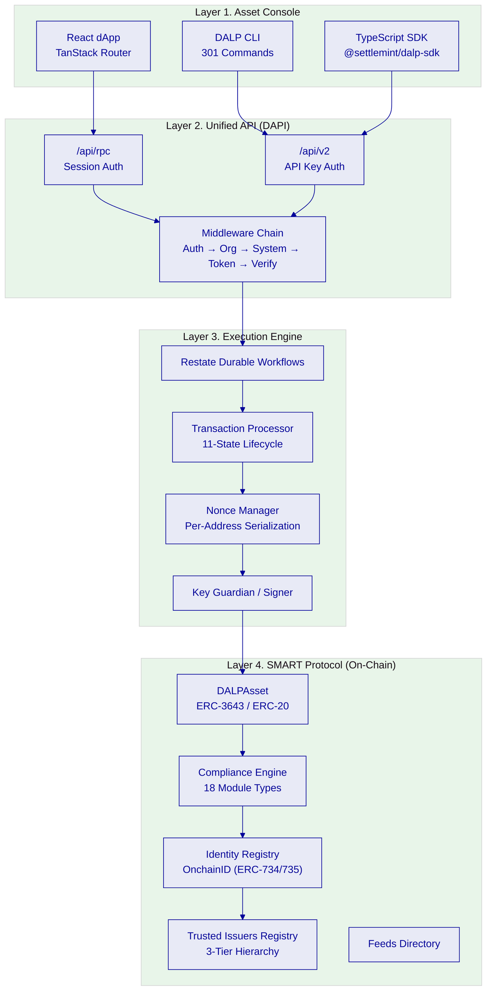

---

## Diagram 2: Deployment Models Comparison `[VARIABLE]`

Use when presenting infrastructure options. Highlight the client's selected model.

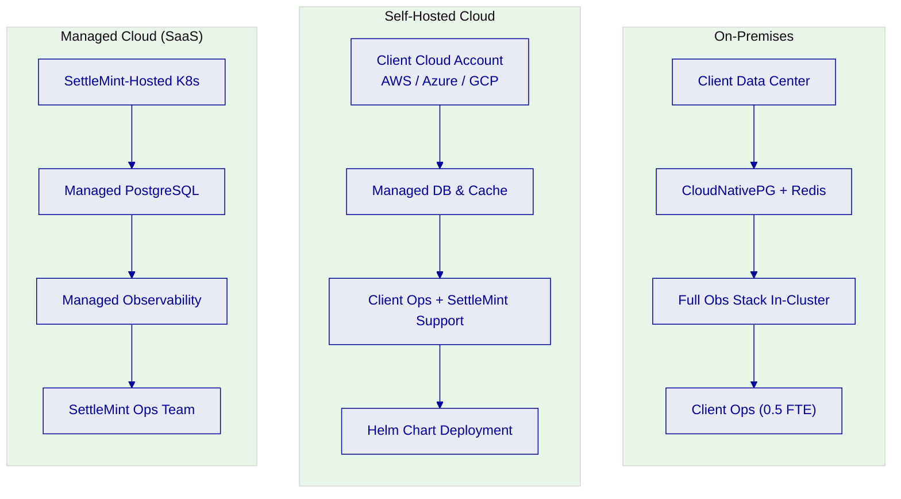

---

## Diagram 3: API Architecture `[FIXED]`

Use when detailing DAPI capabilities: REST, typed SDK, CLI, and real-time event streaming.

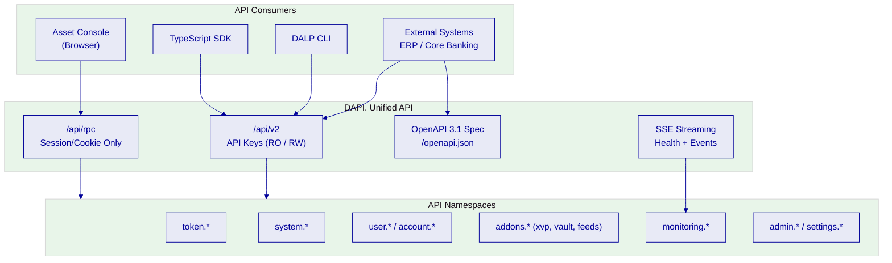

---

## Diagram 4: Multi-Tenancy Architecture `[FIXED]`

Use when discussing organization isolation and tenant scoping.

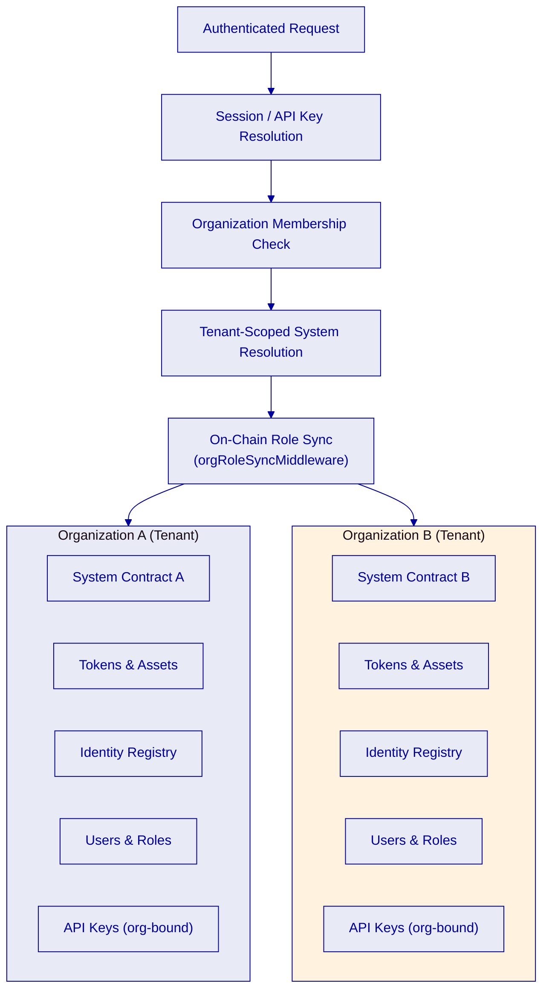

---

## Diagram 5: System Integration Points `[VARIABLE]`

Use when mapping how external systems connect to DALP. Customize integration endpoints per client.

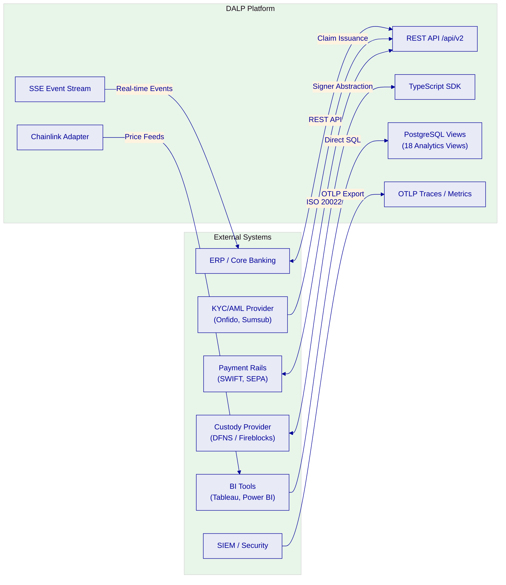

---

## Diagram 6: Data Flow Architecture `[FIXED]`

Use when explaining the end-to-end path from user action to blockchain and back.

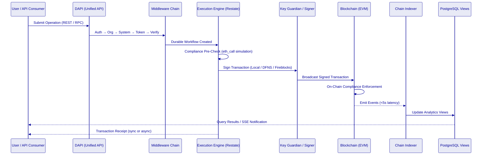

---

## Diagram 7: High Availability / Disaster Recovery Architecture `[VARIABLE]`

Use when presenting HA/DR strategy. Customize scenario and targets per client.

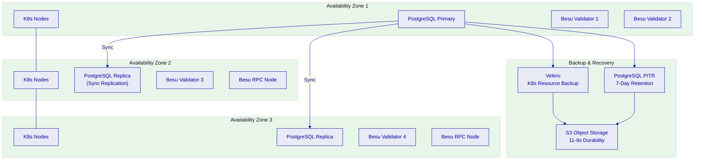

---

## Diagram 8: Monitoring and Observability Stack `[FIXED]`

Use when detailing Day-2 operational visibility. Shows the three-pillar observability model.

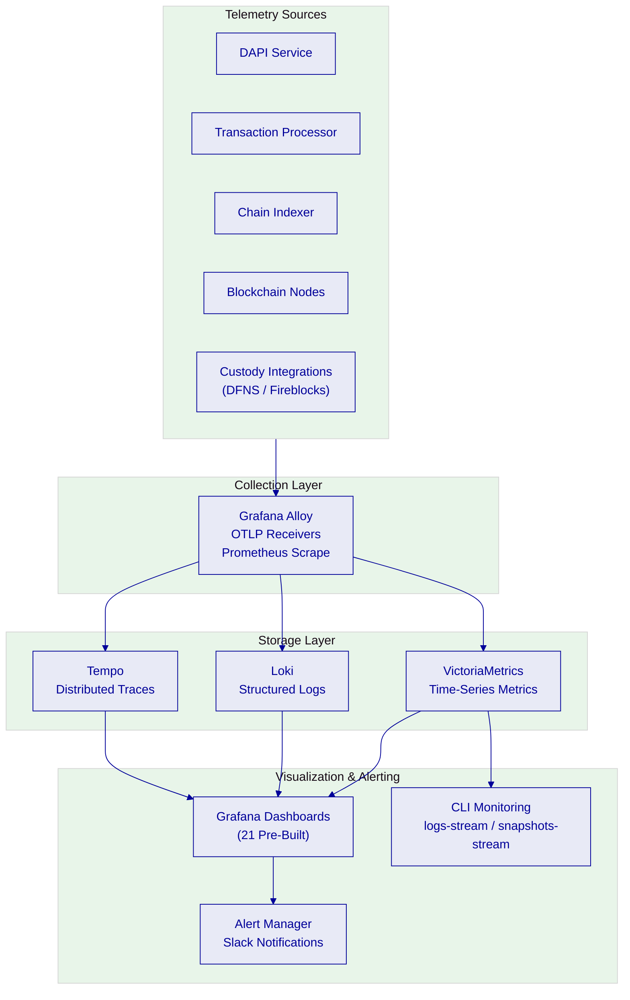

---

# Token Lifecycle

---

## Diagram 9: Token Creation Flow `[FIXED]`

Use when explaining how new tokens are created, from design through the Asset Factory to on-chain deployment.

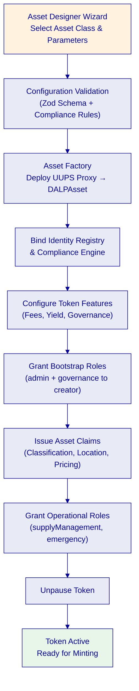

---

## Diagram 10: Token Issuance and Distribution Flow `[FIXED]`

Use when describing how tokens are minted and distributed to investors.

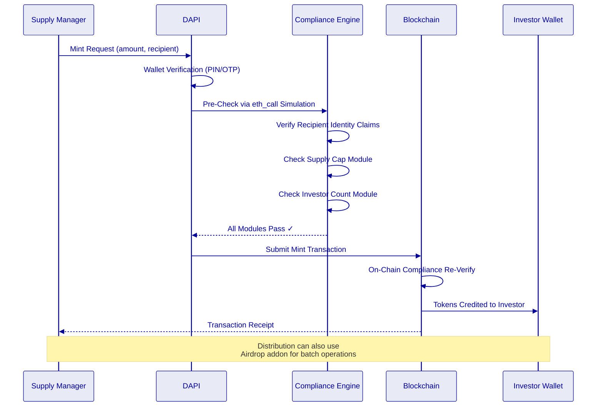

---

## Diagram 11: Complete Token Lifecycle `[FIXED]`

Use for high-level lifecycle overview showing all major token states.

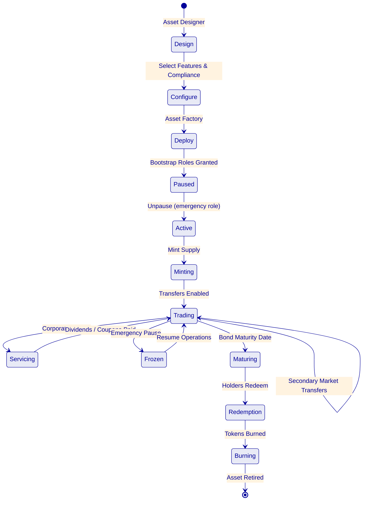

---

## Diagram 12: Corporate Actions Flow `[FIXED]`

Use when explaining automated servicing: dividends, yield distributions, and bond maturity.

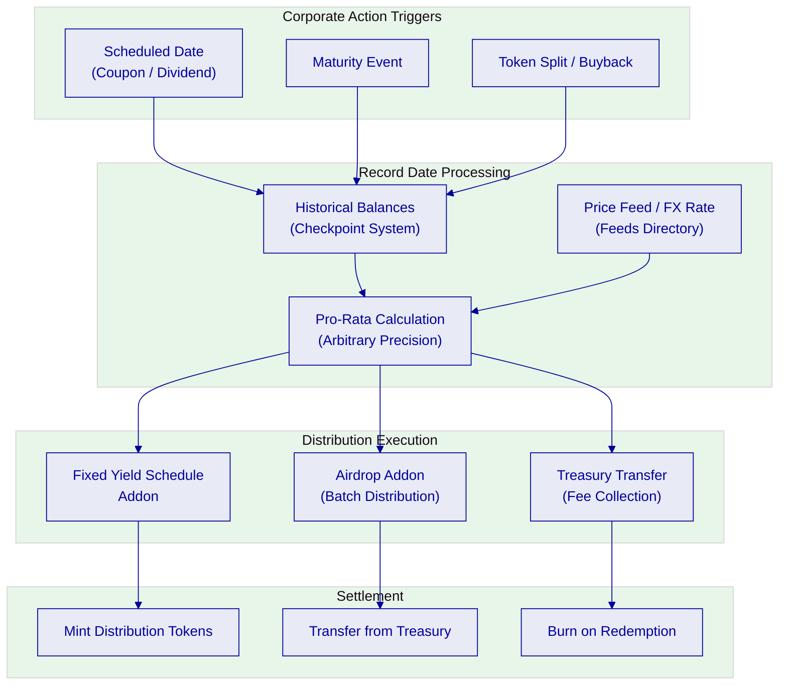

---

## Diagram 13: Digital Twin Model `[FIXED]`

Use when explaining the relationship between real-world assets and their on-chain token representation.

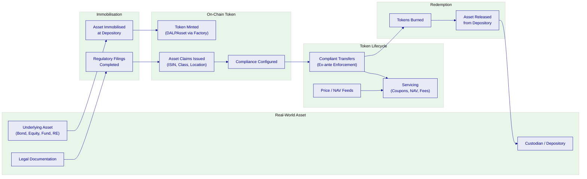

---

## Diagram 14: Multi-Asset Class Token Comparison `[FIXED]`

Use when showing how different asset classes map to the same DALPAsset with different configurations.

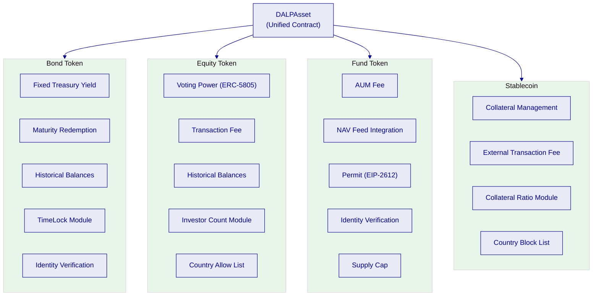

---

# Compliance & Identity

---

## Diagram 15: Ex-Ante Compliance Enforcement Flow `[FIXED]`

Use when explaining how compliance is enforced before transfer execution, the core value proposition.

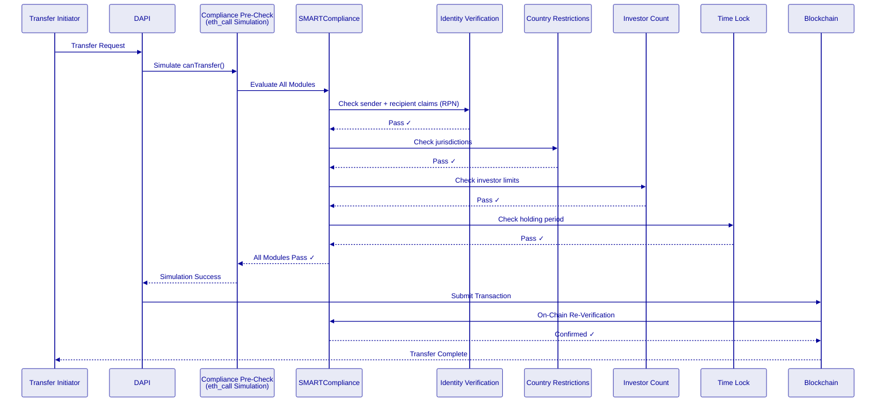

---

## Diagram 16: Identity Architecture `[FIXED]`

Use when explaining OnchainID, claims, and the verification trust chain.

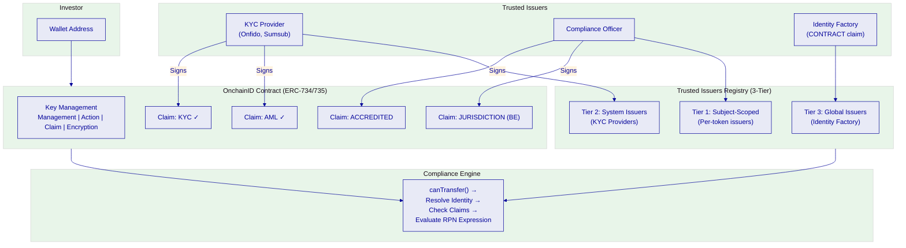

---

## Diagram 17: KYC/KYB Integration Flow `[VARIABLE]`

Use when detailing the end-to-end KYC process. Customize provider name per client.

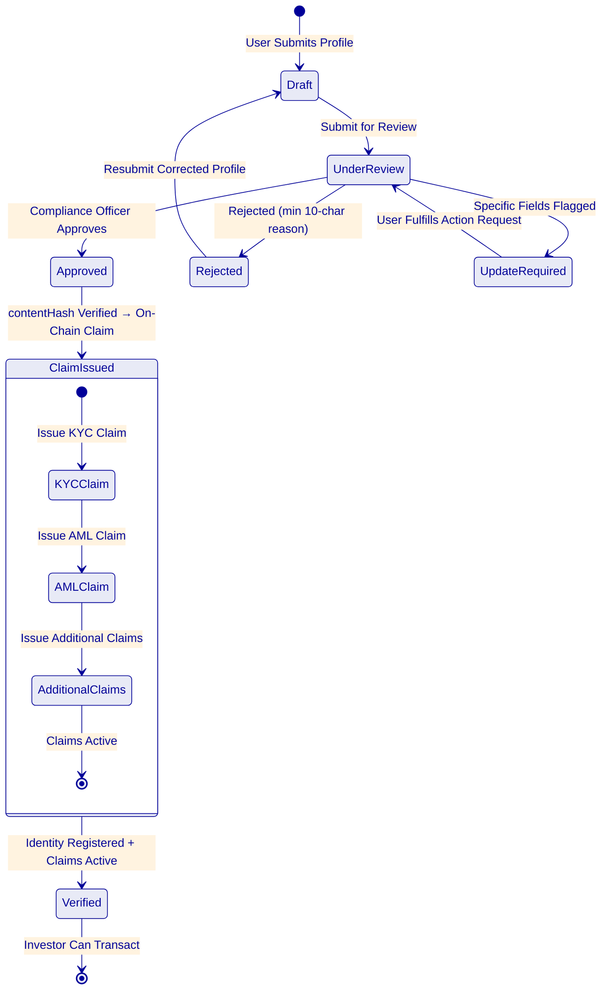

---

## Diagram 18: Multi-Jurisdictional Compliance Decision Tree `[VARIABLE]`

Use when showing how different regulatory regimes map to compliance module configurations.

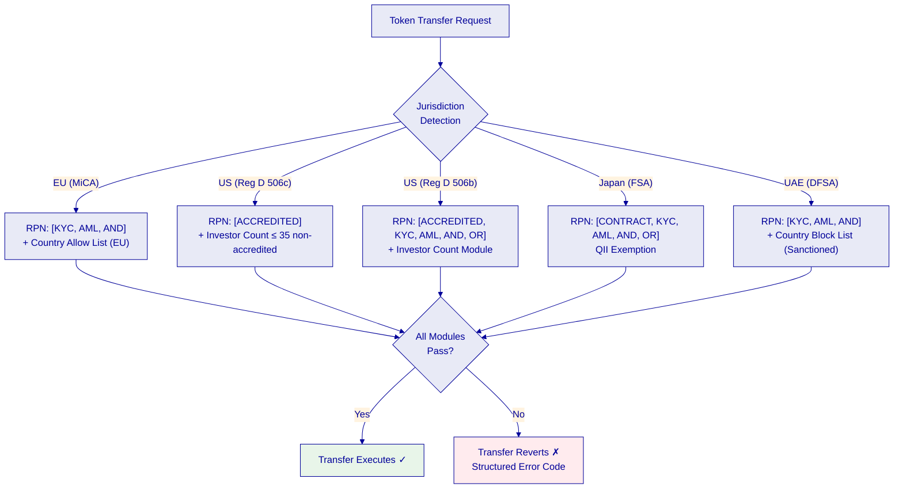

---

## Diagram 19: Trusted Issuer Hierarchy `[FIXED]`

Use when explaining the three-tier trust model for claim issuers.

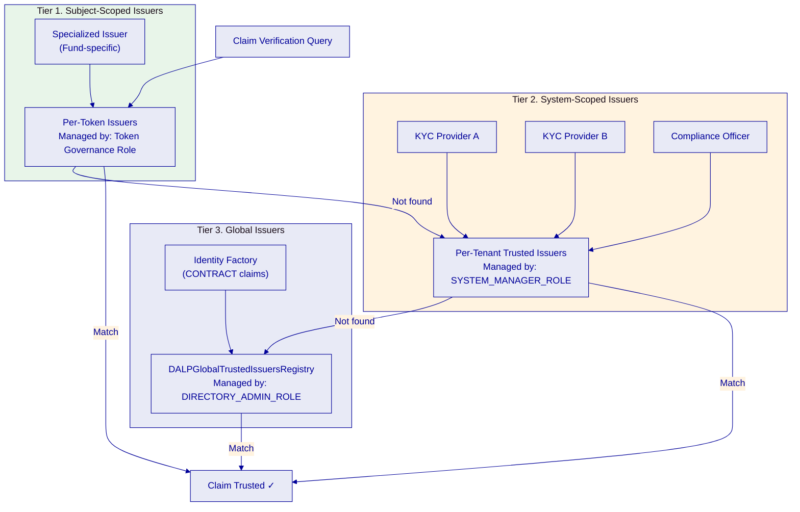

---

## Diagram 20: Compliance Module Activation Flow `[VARIABLE]`

Use when explaining how compliance modules are configured per token. Customize module selection per client.

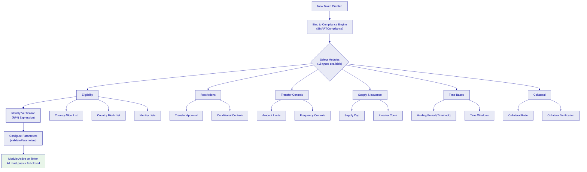

---

# Settlement & Custody

---

## Diagram 21: Atomic DvP Settlement Flow `[FIXED]`

Use when explaining delivery-versus-payment settlement, simultaneous asset and cash legs.

```mermaid
%%{init: {'theme': 'base', 'themeVariables': { 'primaryColor': '#E8EAF6', 'primaryTextColor': '#000099', 'primaryBorderColor': '#000099', 'lineColor': '#000099', 'secondaryColor': '#FFF3E0', 'tertiaryColor': '#E8F5E9', 'background': '#FFFFFF' }}}%%
sequenceDiagram
    participant S as Seller
    participant XVP as XvP Settlement Contract
    participant ASSET as Asset Token
    participant CASH as Cash Token (Stablecoin)
    participant B as Buyer

    S->>XVP: Create Settlement (asset + cash legs)
    B->>XVP: Approve Cash Token Allowance
    S->>XVP: Approve Asset Token Allowance
    Note over XVP: Both parties have approved

    XVP->>XVP: Validate All Legs
    XVP->>ASSET: Transfer Asset: Seller → Buyer
    XVP->>CASH: Transfer Cash: Buyer → Seller
    Note over XVP: Atomic: Both succeed or both revert

    alt All Transfers Succeed
        XVP-->>S: Settlement Executed ✓
        XVP-->>B: Settlement Executed ✓
    else Any Transfer Fails
        XVP-->>S: Entire Settlement Reverts ✗
        XVP-->>B: Entire Settlement Reverts ✗
    end
```

---

## Diagram 22: XvP Multi-Party Settlement Flow `[FIXED]`

Use when explaining multi-party (exchange-versus-payment) settlements with more than two counterparties.

```mermaid
%%{init: {'theme': 'base', 'themeVariables': { 'primaryColor': '#E8EAF6', 'primaryTextColor': '#000099', 'primaryBorderColor': '#000099', 'lineColor': '#000099', 'secondaryColor': '#FFF3E0', 'tertiaryColor': '#E8F5E9', 'background': '#FFFFFF' }}}%%
flowchart TB
    subgraph Create["Settlement Creation"]
        INIT["Settlement Admin<br/>Creates XvP Settlement"]
        LEGS["Define Multiple Legs<br/>(Asset A→B, Cash B→C, Asset C→A)"]
    end

    subgraph Approve["Approval Phase"]
        P1["Party A Approves<br/>Asset Token Allowance"]
        P2["Party B Approves<br/>Cash Token Allowance"]
        P3["Party C Approves<br/>Asset Token Allowance"]
    end

    subgraph Execute["Execution"]
        VAL["Validate All Legs<br/>(Compliance on each)"]
        EXEC["Atomic Execution<br/>All legs or none"]
    end

    subgraph Terminal["Terminal States"]
        DONE["Executed ✓"]
        CANC["Cancelled<br/>(Vote-based)"]
        EXP["Expired →<br/>Withdrawn"]
    end

    INIT --> LEGS
    LEGS --> P1 & P2 & P3
    P1 & P2 & P3 --> VAL
    VAL --> EXEC
    EXEC --> DONE
    LEGS -->|"Timeout"| EXP
    LEGS -->|"Cancellation Vote"| CANC

    style DONE fill:#E8F5E9,stroke:#000099
    style CANC fill:#FFEBEE,stroke:#000099
    style EXP fill:#FFF3E0,stroke:#000099
```

---

## Diagram 23: Custody Integration Architecture `[VARIABLE]`

Use when presenting custody options. Highlight the client's selected custody provider.

```mermaid
%%{init: {'theme': 'base', 'themeVariables': { 'primaryColor': '#E8EAF6', 'primaryTextColor': '#000099', 'primaryBorderColor': '#000099', 'lineColor': '#000099', 'secondaryColor': '#FFF3E0', 'tertiaryColor': '#E8F5E9', 'background': '#FFFFFF' }}}%%
flowchart TB
    subgraph DALP["DALP Platform"]
        TP3["Transaction Processor"]
        SIG2["Signer Service<br/>(ExternalSigner Interface)"]
        KG2["Key Guardian"]
    end

    subgraph Providers["Custody Providers"]
        subgraph DFNS["DFNS"]
            D_MPC["Threshold MPC<br/>(Distributed Key Shards)"]
            D_POL["DFNS Policy Engine<br/>(Programmatic Approval)"]
            D_AUDIT["Synchronized Audit Logs"]
        end

        subgraph FB["Fireblocks"]
            F_MPC["MPC-CMP<br/>(Continuous Key Refresh)"]
            F_TAP["TAP Rules<br/>(Console/Co-Signer)"]
            F_VAULT["Vault Account Hierarchy"]
        end

        subgraph LOCAL["Local Signer"]
            L_ENC["Encrypted DB Storage"]
            L_NONCE["Nonce Manager<br/>(Self-Healing)"]
            L_KG["Key Guardian Storage"]
        end
    end

    TP3 --> SIG2
    SIG2 -->|"Config-Driven"| D_MPC
    SIG2 -->|"Config-Driven"| F_MPC
    SIG2 -->|"Config-Driven"| L_ENC
    D_POL --> D_MPC
    F_TAP --> F_MPC
    L_NONCE --> L_ENC
```

---

## Diagram 24: Wallet Infrastructure Architecture `[FIXED]`

Use when explaining how DALP manages wallets across custody models and smart accounts.

```mermaid
%%{init: {'theme': 'base', 'themeVariables': { 'primaryColor': '#E8EAF6', 'primaryTextColor': '#000099', 'primaryBorderColor': '#000099', 'lineColor': '#000099', 'secondaryColor': '#FFF3E0', 'tertiaryColor': '#E8F5E9', 'background': '#FFFFFF' }}}%%
flowchart TB
    subgraph WalletTypes["Wallet Types"]
        EOA["Externally Owned Account<br/>(Standard Wallets)"]
        SA["Smart Account (ERC-4337)<br/>Paymaster + Bundler"]
        VAULT2["Custody Vault<br/>(CREATE2 Deterministic)"]
    end

    subgraph Identity2["Identity Binding"]
        OID["OnchainID Contract<br/>(Auto-deployed)"]
        DALPW["DALP_WALLET Claim<br/>(Smart Accounts)"]
    end

    subgraph Storage["Key Storage Tiers"]
        T1["Encrypted Database"]
        T2["Cloud Secret Manager"]
        T3["HSM (FIPS 140-2 L3)"]
        T4["MPC Custody<br/>(DFNS / Fireblocks)"]
    end

    subgraph Operations["Wallet Operations"]
        CREATE["Create Wallet"]
        SIGN["Sign Transaction"]
        RECOVER["Identity Recovery"]
        FREEZE["Freeze / Unfreeze"]
    end

    EOA --> OID
    SA --> OID
    SA --> DALPW
    VAULT2 --> OID

    EOA --> T1 & T2 & T3 & T4
    SA --> T1 & T2
    VAULT2 --> T4

    OID --> Operations
```

---

## Diagram 25: Settlement Finality Comparison `[VARIABLE]`

Use when comparing settlement timelines. Customize based on client's chosen network.

```mermaid
%%{init: {'theme': 'base', 'themeVariables': { 'primaryColor': '#E8EAF6', 'primaryTextColor': '#000099', 'primaryBorderColor': '#000099', 'lineColor': '#000099', 'secondaryColor': '#FFF3E0', 'tertiaryColor': '#E8F5E9', 'background': '#FFFFFF' }}}%%
gantt
    title Settlement Finality Comparison
    dateFormat HH:mm
    axisFormat %H:%M

    section Traditional (T+2)
    Trade Execution           :t2a, 00:00, 1m
    Clearing & Matching       :t2b, after t2a, 480m
    Settlement Instruction    :t2c, after t2b, 480m
    Cash & Asset Movement     :t2d, after t2c, 480m
    Final Settlement          :milestone, after t2d, 0m

    section DALP T+0 (Private Chain)
    Trade + Compliance Check  :t0a, 00:00, 1m
    Atomic DvP Execution      :t0b, after t0a, 1m
    On-Chain Finality         :milestone, after t0b, 0m

    section DALP T+0 (Public L2)
    Trade + Compliance Check  :t0c, 00:00, 1m
    Atomic DvP Execution      :t0d, after t0c, 2m
    L2 Confirmation           :t0e, after t0d, 5m
    L1 Settlement Proof       :t0f, after t0e, 60m
```

---

## Diagram 26: Key Management Architecture `[FIXED]`

Use when explaining the separation of signing domains and key lifecycle.

```mermaid
%%{init: {'theme': 'base', 'themeVariables': { 'primaryColor': '#E8EAF6', 'primaryTextColor': '#000099', 'primaryBorderColor': '#000099', 'lineColor': '#000099', 'secondaryColor': '#FFF3E0', 'tertiaryColor': '#E8F5E9', 'background': '#FFFFFF' }}}%%
flowchart TB
    subgraph Domains["Signing Domains"]
        D_SYS["System Operations<br/>(Bootstrap, Upgrades)"]
        D_TOKEN["Token Operations<br/>(Mint, Burn, Transfer)"]
        D_FEED["Feed Submissions<br/>(EIP-712 Signed)"]
        D_CUSTODY["Custody Operations<br/>(Vault, Recovery)"]
    end

    subgraph KeyGuard["Key Guardian"]
        ROUTE["Storage Router"]
        GEN["Key Generation<br/>(CSRNG / HSM)"]
        ROT["Key Rotation<br/>(Historical Preserved)"]
        REV["Key Revocation<br/>(Immediate Effect)"]
        RECOV["Key Recovery<br/>(Threshold Shards)"]
    end

    subgraph Backends["Storage Backends"]
        BE1["Encrypted DB"]
        BE2["Cloud Secrets"]
        BE3["HSM<br/>FIPS 140-2 L3"]
        BE4["MPC Custody"]
    end

    subgraph Audit["Audit Trail"]
        LOG["Every Operation Logged<br/>Key ID + Requester + Correlation"]
    end

    Domains --> ROUTE
    ROUTE --> GEN & ROT & REV & RECOV
    ROUTE --> BE1 & BE2 & BE3 & BE4
    ROUTE --> LOG
```

---

# Access Control & Security

---

## Diagram 27: RBAC Role Hierarchy `[FIXED]`

Use when presenting the 26-role model organized by function.

```mermaid
%%{init: {'theme': 'base', 'themeVariables': { 'primaryColor': '#E8EAF6', 'primaryTextColor': '#000099', 'primaryBorderColor': '#000099', 'lineColor': '#000099', 'secondaryColor': '#FFF3E0', 'tertiaryColor': '#E8F5E9', 'background': '#FFFFFF' }}}%%
flowchart TB
    subgraph L1_Platform["Layer 1. Platform Roles (Off-Chain)"]
        P_OWN["owner"]
        P_ADM["admin"]
        P_MEM["member"]
    end

    subgraph L2_System["Layer 2. System People Roles (On-Chain)"]
        S_SYS["systemManager"]
        S_ID["identityManager"]
        S_TOK["tokenManager"]
        S_COMP["complianceManager"]
        S_CLAIM["claimPolicyManager"]
        S_ORG["organisationIdentityManager"]
        S_ISS["claimIssuer"]
        S_AUD["auditor"]
        S_FEED["feedsManager"]
    end

    subgraph L3_Asset["Layer 3. Per-Asset Roles (On-Chain)"]
        A_ADM["admin (DEFAULT_ADMIN)"]
        A_GOV["governance"]
        A_SUP["supplyManagement"]
        A_CUS["custodian"]
        A_EMG["emergency"]
        A_SALE["saleAdmin"]
        A_FUND["fundsManager"]
    end

    subgraph L4_Module["Layer 4. System Module Roles (On-Chain)"]
        M_SYS["systemModule"]
        M_IDR["identityRegistryModule"]
        M_TFR["tokenFactoryRegistryModule"]
        M_TFM["tokenFactoryModule"]
        M_AFR["addonFactoryRegistryModule"]
        M_AFM["addonFactoryModule"]
        M_TIM["trustedIssuersMetaRegistryModule"]
    end

    L1_Platform ~~~ L2_System ~~~ L3_Asset ~~~ L4_Module

    style L1_Platform fill:#E8EAF6,stroke:#000099
    style L2_System fill:#FFF3E0,stroke:#000099
    style L3_Asset fill:#E8F5E9,stroke:#000099
    style L4_Module fill:#E8EAF6,stroke:#000099
```

---

## Diagram 28: Authentication Flow `[FIXED]`

Use when explaining DALP's two-endpoint authentication model.

```mermaid
%%{init: {'theme': 'base', 'themeVariables': { 'primaryColor': '#E8EAF6', 'primaryTextColor': '#000099', 'primaryBorderColor': '#000099', 'lineColor': '#000099', 'secondaryColor': '#FFF3E0', 'tertiaryColor': '#E8F5E9', 'background': '#FFFFFF' }}}%%
flowchart TB
    USER["Incoming Request"] --> TYPE{"Auth Method?"}

    TYPE -->|"Browser Session"| RPC2["/api/rpc Endpoint"]
    TYPE -->|"API Key"| V22["/api/v2 Endpoint"]
    TYPE -->|"CLI Device Flow"| DEVICE["Device Code Flow"]

    RPC2 --> SESS["Session Cookie Resolution<br/>(HTTP-only, Secure, SameSite)"]
    V22 --> APIKEY["API Key Resolution<br/>(sm_dalp_ prefix, hashed storage)"]
    DEVICE --> BROWSER2["Browser Approval"]
    BROWSER2 --> APIKEY

    SESS --> ORGCHECK["Organization Membership<br/>Validation"]
    APIKEY --> SCOPECHECK["Scope Enforcement<br/>(RO: GET/HEAD/OPTIONS only)"]
    SCOPECHECK --> ORGCHECK

    ORGCHECK --> ROLSYNC["On-Chain Role Sync<br/>(orgRoleSyncMiddleware)"]
    ROLSYNC --> SYSCTX["System Context Hydration"]
    SYSCTX --> READY["Request Authorized ✓"]

    TYPE -->|"API Key on /rpc"| BLOCK["FORBIDDEN ✗<br/>Hard Security Boundary"]

    style BLOCK fill:#FFEBEE,stroke:#000099
    style READY fill:#E8F5E9,stroke:#000099
```

---

## Diagram 29: Transaction Signing Flow `[FIXED]`

Use when explaining the complete path from request to blockchain broadcast.

```mermaid
%%{init: {'theme': 'base', 'themeVariables': { 'primaryColor': '#E8EAF6', 'primaryTextColor': '#000099', 'primaryBorderColor': '#000099', 'lineColor': '#000099', 'secondaryColor': '#FFF3E0', 'tertiaryColor': '#E8F5E9', 'background': '#FFFFFF' }}}%%
sequenceDiagram
    participant U as Operator
    participant API as DAPI Middleware
    participant WV as Wallet Verification
    participant EE as Execution Engine (Restate)
    participant SIG as Signer Service
    participant CUST as Custody Provider
    participant BC as Blockchain

    U->>API: Transaction Request
    API->>API: Auth + Org + System + Token Context
    API->>WV: Step-Up Verification Required?
    WV->>U: Request PIN / OTP / Secret Code
    U->>WV: Provide Verification Factor
    WV->>WV: Validate + Replay Protection
    WV-->>API: Verification Passed ✓
    API->>EE: Create Durable Workflow
    EE->>EE: Compliance Pre-Check (eth_call)
    EE->>SIG: Request Signature
    SIG->>CUST: MPC Signing (DFNS/Fireblocks)
    CUST->>CUST: Policy Evaluation (TAP / DFNS Rules)
    CUST-->>SIG: Signed Transaction
    SIG->>BC: Broadcast Transaction
    BC->>BC: On-Chain Compliance Verify
    BC-->>EE: Transaction Receipt
    EE-->>U: Confirmed ✓
```

---

## Diagram 30: Maker-Checker Approval Workflow `[FIXED]`

Use when explaining dual-control patterns for sensitive operations.

```mermaid
%%{init: {'theme': 'base', 'themeVariables': { 'primaryColor': '#E8EAF6', 'primaryTextColor': '#000099', 'primaryBorderColor': '#000099', 'lineColor': '#000099', 'secondaryColor': '#FFF3E0', 'tertiaryColor': '#E8F5E9', 'background': '#FFFFFF' }}}%%
flowchart TB
    subgraph Maker["Maker (Initiator)"]
        REQ["Submit Operation Request"]
        WALLET_V["Wallet Verification<br/>(PIN / OTP)"]
    end

    subgraph DALP_Layer["DALP Platform Layer"]
        RBAC["RBAC Check<br/>(On-Chain Role)"]
        QUEUE["Transaction Queue<br/>(Durable Workflow)"]
    end

    subgraph Checker["Checker (Approver)"]
        subgraph DFNS_Approval["DFNS Policy Engine"]
            D_REVIEW["Review Pending<br/>(API Accessible)"]
            D_APPROVE["Approve / Reject"]
        end
        subgraph FB_Approval["Fireblocks TAP"]
            F_REVIEW["Review in Console<br/>or Co-Signer App"]
            F_APPROVE["Approve / Reject"]
        end
    end

    subgraph Result["Execution"]
        SIGN3["Transaction Signed"]
        BROADCAST["Broadcast to Chain"]
        CONFIRM["On-Chain Confirmation"]
    end

    REQ --> WALLET_V --> RBAC --> QUEUE
    QUEUE --> D_REVIEW --> D_APPROVE --> SIGN3
    QUEUE --> F_REVIEW --> F_APPROVE --> SIGN3
    SIGN3 --> BROADCAST --> CONFIRM

    style CONFIRM fill:#E8F5E9,stroke:#000099
```

---

## Diagram 31: Security Domain Separation Architecture `[FIXED]`

Use when explaining the five independent security layers (defense-in-depth).

```mermaid
%%{init: {'theme': 'base', 'themeVariables': { 'primaryColor': '#E8EAF6', 'primaryTextColor': '#000099', 'primaryBorderColor': '#000099', 'lineColor': '#000099', 'secondaryColor': '#FFF3E0', 'tertiaryColor': '#E8F5E9', 'background': '#FFFFFF' }}}%%
flowchart TB
    REQUEST["Transaction Request"] --> L1S["Layer 1: Identity<br/>Session / API Key / SSO"]
    L1S -->|"Authenticated"| L2S["Layer 2: Access Control<br/>26 RBAC Roles + Org Scope"]
    L2S -->|"Authorized"| L3S["Layer 3: Wallet Verification<br/>PIN / TOTP / Secret Codes"]
    L3S -->|"Verified"| L4S["Layer 4: On-Chain Compliance<br/>18 Compliance Modules<br/>ERC-3643 Enforcement"]
    L4S -->|"Compliant"| L5S["Layer 5: Custody Policy<br/>DFNS Policy Engine<br/>Fireblocks TAP"]
    L5S -->|"Approved"| EXEC2["Transaction Executed ✓"]

    L1S -->|"Failed"| DENY["Access Denied ✗"]
    L2S -->|"Failed"| DENY
    L3S -->|"Failed"| DENY
    L4S -->|"Failed"| DENY
    L5S -->|"Failed"| DENY

    style EXEC2 fill:#E8F5E9,stroke:#000099
    style DENY fill:#FFEBEE,stroke:#000099
```

---

# Operations & Implementation

---

## Diagram 32: Day-2 Operations Overview `[FIXED]`

Use when presenting ongoing operational responsibilities and tooling.

```mermaid
%%{init: {'theme': 'base', 'themeVariables': { 'primaryColor': '#E8EAF6', 'primaryTextColor': '#000099', 'primaryBorderColor': '#000099', 'lineColor': '#000099', 'secondaryColor': '#FFF3E0', 'tertiaryColor': '#E8F5E9', 'background': '#FFFFFF' }}}%%
flowchart TB
    subgraph Monitor["Monitoring"]
        DASH["Grafana Dashboards<br/>(21 Pre-Built)"]
        ALERTS["Slack Alert Notifications<br/>(DALP-Branded Templates)"]
        HEALTH["Blockchain Health<br/>(3-Sample Hysteresis)"]
        APIM["API Metrics Rollup<br/>(Hourly Cron)"]
    end

    subgraph Operations["Operational Tools"]
        CLI2["DALP CLI<br/>(301 Commands)"]
        STREAM["Streaming Endpoints<br/>(logs-stream, snapshots-stream)"]
        ADMIN["Admin Console<br/>(Role Management, Settings)"]
    end

    subgraph Maintenance["Maintenance"]
        HELM["Helm Chart Updates<br/>(Monthly)"]
        BACKUP2["Backup Verification<br/>(Weekly)"]
        DR["DR Drills<br/>(Quarterly)"]
        PATCH["Security Patching<br/>(Monthly)"]
    end

    subgraph Self_Heal["Self-Healing"]
        NONCE_R["Nonce Recovery<br/>(Auto Re-Read)"]
        WORKFLOW_R["Workflow Recovery<br/>(Restate Durable)"]
        DEAD_L["Dead-Letter Rescue"]
        VIEW_R["View Recreation<br/>(On Startup)"]
    end

    Monitor --> Operations
    Operations --> Maintenance
    Maintenance --> Self_Heal
```

---

## Diagram 33: Implementation Phases `[VARIABLE]`

Use when presenting the implementation timeline. Customize durations and milestones per client.

```mermaid
%%{init: {'theme': 'base', 'themeVariables': { 'primaryColor': '#E8EAF6', 'primaryTextColor': '#000099', 'primaryBorderColor': '#000099', 'lineColor': '#000099', 'secondaryColor': '#FFF3E0', 'tertiaryColor': '#E8F5E9', 'background': '#FFFFFF' }}}%%
gantt
    title DALP Implementation Phases
    dateFormat YYYY-MM-DD
    axisFormat %b %Y

    section Phase 1: Discovery & Design
    Requirements Workshop            :p1a, 2025-01-06, 10d
    Architecture Design              :p1b, after p1a, 10d
    Compliance Mapping               :p1c, after p1a, 10d
    Gate Review 1                    :milestone, after p1c, 0d

    section Phase 2: Infrastructure
    Environment Provisioning (K8s)   :p2a, after p1c, 10d
    Database & Storage Setup         :p2b, after p2a, 5d
    Network Configuration            :p2c, after p2a, 5d
    Helm Chart Deployment            :p2d, after p2b, 5d
    Gate Review 2                    :milestone, after p2d, 0d

    section Phase 3: Platform Configuration
    System Bootstrap                 :p3a, after p2d, 5d
    Identity Registry Setup          :p3b, after p3a, 5d
    Compliance Module Config         :p3c, after p3b, 10d
    Custody Integration              :p3d, after p3a, 15d
    Gate Review 3                    :milestone, after p3d, 0d

    section Phase 4: Asset Deployment
    Token Configuration & Testing    :p4a, after p3d, 10d
    KYC Integration Testing          :p4b, after p3d, 10d
    Settlement Testing               :p4c, after p4a, 5d
    UAT                              :p4d, after p4c, 10d
    Gate Review 4                    :milestone, after p4d, 0d

    section Phase 5: Go-Live & Handover
    Production Deployment            :p5a, after p4d, 5d
    Ops Handover & Training          :p5b, after p5a, 5d
    Hypercare Period                 :p5c, after p5b, 20d
    Gate Review 5                    :milestone, after p5c, 0d
```

---

## Diagram 34: Incident Response Workflow `[FIXED]`

Use when presenting operational incident handling procedures.

```mermaid
%%{init: {'theme': 'base', 'themeVariables': { 'primaryColor': '#E8EAF6', 'primaryTextColor': '#000099', 'primaryBorderColor': '#000099', 'lineColor': '#000099', 'secondaryColor': '#FFF3E0', 'tertiaryColor': '#E8F5E9', 'background': '#FFFFFF' }}}%%
flowchart TB
    DETECT["Incident Detected<br/>(Alert / Monitoring / User Report)"] --> TRIAGE{"Severity<br/>Classification"}

    TRIAGE -->|"Critical<br/>Service Down"| P1["P1: Immediate Response"]
    TRIAGE -->|"High<br/>Degraded Service"| P2["P2: 1-Hour Response"]
    TRIAGE -->|"Medium<br/>Partial Impact"| P3["P3: 4-Hour Response"]
    TRIAGE -->|"Low<br/>No User Impact"| P4["P4: Next Business Day"]

    P1 --> CONTAIN["Containment"]
    P2 --> CONTAIN
    P3 --> INVESTIGATE["Investigation"]
    P4 --> INVESTIGATE

    CONTAIN --> EMERGENCY["Emergency Controls<br/>Token Pause / Freeze"]
    CONTAIN --> ISOLATE["System Isolation<br/>(If Required)"]

    EMERGENCY --> INVESTIGATE
    ISOLATE --> INVESTIGATE

    INVESTIGATE --> DIAG["Diagnosis<br/>Grafana Traces + Logs"]
    DIAG --> RESOLVE["Resolution<br/>CLI / API / Helm Rollback"]
    RESOLVE --> VERIFY["Verification<br/>Health Checks + Smoke Tests"]
    VERIFY --> POST["Post-Incident Review<br/>Root Cause + Remediation"]

    style P1 fill:#FFEBEE,stroke:#000099
    style P2 fill:#FFF3E0,stroke:#000099
```

---

## Diagram 35: Upgrade and Migration Process `[FIXED]`

Use when explaining how platform upgrades work with zero downtime.

```mermaid
%%{init: {'theme': 'base', 'themeVariables': { 'primaryColor': '#E8EAF6', 'primaryTextColor': '#000099', 'primaryBorderColor': '#000099', 'lineColor': '#000099', 'secondaryColor': '#FFF3E0', 'tertiaryColor': '#E8F5E9', 'background': '#FFFFFF' }}}%%
flowchart TB
    subgraph Preparation["Preparation"]
        RELEASE["New Release Available"]
        REVIEW["Review Changelog<br/>& Breaking Changes"]
        BACKUP3["Pre-Upgrade Backup<br/>(Velero + PITR Snapshot)"]
    end

    subgraph AppUpgrade["Application Upgrade"]
        HELM2["Helm Chart Upgrade"]
        ROLL["Rolling Pod Deployment<br/>(Zero Downtime)"]
        MIGRATE["Database Migrations<br/>(Drizzle ORM)"]
    end

    subgraph IndexerUpgrade["Indexer Upgrade"]
        NEW_SCHEMA["Build New Schema<br/>(idxr_d1 → idxr_d2)"]
        OLD_SERVES["Old Schema Serves Reads"]
        SWITCH["Atomic View Switch<br/>(Pass-Through Views)"]
        DRAIN["Drain Old Deployment<br/>(1-Hour Grace)"]
    end

    subgraph ContractUpgrade["Smart Contract Upgrade"]
        UUPS["UUPS Proxy Pattern"]
        DIR["Directory-Managed Resolution"]
        COMPAT["Backward Compatibility<br/>(Dual v1/v2 Support)"]
    end

    subgraph Verify2["Verification"]
        SMOKE["Smoke Tests"]
        HEALTH2["Health Checks<br/>(API + Blockchain)"]
        ROLLBACK["Rollback Plan Ready"]
    end

    RELEASE --> REVIEW --> BACKUP3
    BACKUP3 --> HELM2 --> ROLL --> MIGRATE
    MIGRATE --> NEW_SCHEMA --> OLD_SERVES --> SWITCH --> DRAIN
    HELM2 --> UUPS --> DIR --> COMPAT
    DRAIN --> SMOKE --> HEALTH2 --> ROLLBACK
```

---

## Diagram 36: Support Tier Escalation Path `[VARIABLE]`

Use when presenting the support model. Customize SLAs and contacts per client.

```mermaid
%%{init: {'theme': 'base', 'themeVariables': { 'primaryColor': '#E8EAF6', 'primaryTextColor': '#000099', 'primaryBorderColor': '#000099', 'lineColor': '#000099', 'secondaryColor': '#FFF3E0', 'tertiaryColor': '#E8F5E9', 'background': '#FFFFFF' }}}%%
flowchart TB
    ISSUE["Issue Reported"] --> T1["Tier 1: Client Operations<br/>CLI Diagnostics / Runbooks<br/>Dashboard Checks"]

    T1 -->|"Resolved"| CLOSED["Issue Closed ✓"]
    T1 -->|"Escalate"| T2["Tier 2: SettleMint Support<br/>Configuration Assistance<br/>Log Analysis"]

    T2 -->|"Resolved"| CLOSED
    T2 -->|"Escalate"| T3["Tier 3: SettleMint Engineering<br/>Platform Debugging<br/>Hotfix Development"]

    T3 -->|"Resolved"| CLOSED
    T3 -->|"Critical"| T4["Tier 4: Emergency Response<br/>Core Team Engagement<br/>Incident Management"]

    T4 --> CLOSED

    subgraph SLA["Response SLAs"]
        SLA1["P1 Critical: 1 hour"]
        SLA2["P2 High: 4 hours"]
        SLA3["P3 Medium: 1 business day"]
        SLA4["P4 Low: 3 business days"]
    end

    style CLOSED fill:#E8F5E9,stroke:#000099
```

---

# Business & Commercial

---

## Diagram 37: SettleMint Market Positioning `[FIXED]`

Use when positioning SettleMint against the market landscape.

```mermaid
%%{init: {'theme': 'base', 'themeVariables': { 'primaryColor': '#E8EAF6', 'primaryTextColor': '#000099', 'primaryBorderColor': '#000099', 'lineColor': '#000099', 'secondaryColor': '#FFF3E0', 'tertiaryColor': '#E8F5E9', 'background': '#FFFFFF' }}}%%
flowchart TB
    subgraph Market["Market Landscape"]
        DIY["DIY / Open Source<br/>High effort, full control<br/>Months to production"]
        CONSULT["Consulting Firms<br/>Custom builds<br/>No reusable platform"]
        POINT["Point Solutions<br/>Single capability<br/>Integration burden"]
        SETTLEMINT["SettleMint DALP<br/>Full lifecycle platform<br/>Configuration-driven"]
    end

    subgraph Differentiators["DALP Differentiators"]
        D1["Configuration over Code<br/>(No Solidity Required)"]
        D2["Ex-Ante Compliance<br/>(ERC-3643 / SMART Protocol)"]
        D3["Full Lifecycle<br/>(Issue → Service → Retire)"]
        D4["Bring Your Own<br/>(Custody, Chain, KYC)"]
        D5["Operational Tooling<br/>(HA, Monitoring, CLI)"]
        D6["Multi-Asset, Multi-Jurisdiction<br/>(Single Platform)"]
    end

    SETTLEMINT --> D1 & D2 & D3 & D4 & D5 & D6

    style SETTLEMINT fill:#E8EAF6,stroke:#000099
    style DIY fill:#FFF3E0,stroke:#000099
    style CONSULT fill:#FFF3E0,stroke:#000099
    style POINT fill:#FFF3E0,stroke:#000099
```

---

## Diagram 38: Operating Model Overview `[VARIABLE]`

Use when presenting roles and responsibilities. Customize per client's organizational structure.

```mermaid
%%{init: {'theme': 'base', 'themeVariables': { 'primaryColor': '#E8EAF6', 'primaryTextColor': '#000099', 'primaryBorderColor': '#000099', 'lineColor': '#000099', 'secondaryColor': '#FFF3E0', 'tertiaryColor': '#E8F5E9', 'background': '#FFFFFF' }}}%%
flowchart TB
    subgraph SM["SettleMint Responsibilities"]
        SM1["Platform Development<br/>& Releases"]
        SM2["Managed Infrastructure<br/>(SaaS Model)"]
        SM3["Tier 2-3 Support"]
        SM4["Security Patches<br/>& Updates"]
        SM5["Onboarding &<br/>Implementation Support"]
    end

    subgraph Client["Client Responsibilities"]
        C1["Business Operations<br/>& Asset Management"]
        C2["Compliance Configuration<br/>& KYC Oversight"]
        C3["User & Role Management"]
        C4["Tier 1 Operations<br/>(CLI / Dashboard)"]
        C5["Regulatory Reporting"]
    end

    subgraph Third["Third-Party Providers"]
        T1["Custody Provider<br/>(DFNS / Fireblocks)"]
        T2["KYC/AML Provider"]
        T3["Cloud Infrastructure<br/>(AWS / Azure / GCP)"]
        T4["Legal & Regulatory<br/>Advisors"]
    end

    SM --> Client
    Third --> Client
    T1 <--> SM
    T3 <--> SM

    style SM fill:#E8EAF6,stroke:#000099
    style Client fill:#FFF3E0,stroke:#000099
    style Third fill:#E8F5E9,stroke:#000099
```

---

## Diagram 39: Licensing Model Structure `[VARIABLE]`

Use when presenting commercial structure. Customize tiers and pricing per client.

```mermaid
%%{init: {'theme': 'base', 'themeVariables': { 'primaryColor': '#E8EAF6', 'primaryTextColor': '#000099', 'primaryBorderColor': '#000099', 'lineColor': '#000099', 'secondaryColor': '#FFF3E0', 'tertiaryColor': '#E8F5E9', 'background': '#FFFFFF' }}}%%
flowchart TB
    subgraph Platform["Platform License"]
        PL["DALP Platform License<br/>(Annual Subscription)"]
    end

    subgraph Components["License Components"]
        CORE["Core Platform<br/>Asset Console + API + CLI"]
        COMPLIANCE["Compliance Framework<br/>18 Module Types"]
        IDENTITY["Identity Infrastructure<br/>OnchainID + Claims"]
        SETTLEMENT["Settlement Engine<br/>DvP / XvP"]
        FEEDS["Data Feeds<br/>Price, NAV, FX"]
    end

    subgraph Services["Professional Services"]
        IMPL["Implementation<br/>(5-Phase Deployment)"]
        TRAIN["Training &<br/>Knowledge Transfer"]
        CUSTOM["Custom Integration<br/>Support"]
    end

    subgraph Ongoing["Ongoing"]
        SUPPORT["Support SLA<br/>(Tiered Response)"]
        MANAGED["Managed Ops<br/>(SaaS Only)"]
        UPDATES["Platform Updates<br/>& New Features"]
    end

    PL --> Components
    PL --> Services
    PL --> Ongoing

    style PL fill:#E8EAF6,stroke:#000099
```

---

## Diagram 40: Client Onboarding Journey `[VARIABLE]`

Use when showing the end-to-end client journey from contract signing to production.

```mermaid
%%{init: {'theme': 'base', 'themeVariables': { 'primaryColor': '#E8EAF6', 'primaryTextColor': '#000099', 'primaryBorderColor': '#000099', 'lineColor': '#000099', 'secondaryColor': '#FFF3E0', 'tertiaryColor': '#E8F5E9', 'background': '#FFFFFF' }}}%%
flowchart LR
    A2["Contract<br/>Signed"] --> B2["Kickoff<br/>Workshop"]
    B2 --> C2["Requirements<br/>& Architecture"]
    C2 --> D2["Environment<br/>Provisioning"]
    D2 --> E2["Platform<br/>Configuration"]
    E2 --> F2["Integration<br/>& Testing"]
    F2 --> G2["UAT &<br/>Training"]
    G2 --> H2["Go-Live"]
    H2 --> I2["Hypercare<br/>(30 Days)"]
    I2 --> J2["Steady State<br/>Operations"]

    subgraph Deliverables["Key Deliverables"]
        DEL1["Architecture Doc"]
        DEL2["Running Environment"]
        DEL3["Configured System"]
        DEL4["Test Reports"]
        DEL5["Ops Runbooks"]
        DEL6["Trained Team"]
    end

    C2 --> DEL1
    D2 --> DEL2
    E2 --> DEL3
    F2 --> DEL4
    G2 --> DEL5
    G2 --> DEL6

    style A2 fill:#FFF3E0,stroke:#000099
    style H2 fill:#E8F5E9,stroke:#000099
    style J2 fill:#E8EAF6,stroke:#000099
```

---

# Appendix: Diagram Index

| # | Title | Category | Type | Tag |
|---|-------|----------|------|-----|
| 1 | DALP Four-Layer Architecture | Platform Architecture | flowchart | FIXED |
| 2 | Deployment Models Comparison | Platform Architecture | flowchart | VARIABLE |
| 3 | API Architecture | Platform Architecture | flowchart | FIXED |
| 4 | Multi-Tenancy Architecture | Platform Architecture | flowchart | FIXED |
| 5 | System Integration Points | Platform Architecture | flowchart | VARIABLE |
| 6 | Data Flow Architecture | Platform Architecture | sequence | FIXED |
| 7 | High Availability / Disaster Recovery | Platform Architecture | flowchart | VARIABLE |
| 8 | Monitoring and Observability Stack | Platform Architecture | flowchart | FIXED |
| 9 | Token Creation Flow | Token Lifecycle | flowchart | FIXED |
| 10 | Token Issuance and Distribution Flow | Token Lifecycle | sequence | FIXED |
| 11 | Complete Token Lifecycle | Token Lifecycle | stateDiagram | FIXED |
| 12 | Corporate Actions Flow | Token Lifecycle | flowchart | FIXED |
| 13 | Digital Twin Model | Token Lifecycle | flowchart | FIXED |
| 14 | Multi-Asset Class Token Comparison | Token Lifecycle | flowchart | FIXED |
| 15 | Ex-Ante Compliance Enforcement Flow | Compliance & Identity | sequence | FIXED |
| 16 | Identity Architecture | Compliance & Identity | flowchart | FIXED |
| 17 | KYC/KYB Integration Flow | Compliance & Identity | stateDiagram | VARIABLE |
| 18 | Multi-Jurisdictional Compliance Decision Tree | Compliance & Identity | flowchart | VARIABLE |
| 19 | Trusted Issuer Hierarchy | Compliance & Identity | flowchart | FIXED |
| 20 | Compliance Module Activation Flow | Compliance & Identity | flowchart | VARIABLE |
| 21 | Atomic DvP Settlement Flow | Settlement & Custody | sequence | FIXED |
| 22 | XvP Multi-Party Settlement Flow | Settlement & Custody | flowchart | FIXED |
| 23 | Custody Integration Architecture | Settlement & Custody | flowchart | VARIABLE |
| 24 | Wallet Infrastructure Architecture | Settlement & Custody | flowchart | FIXED |
| 25 | Settlement Finality Comparison | Settlement & Custody | gantt | VARIABLE |
| 26 | Key Management Architecture | Settlement & Custody | flowchart | FIXED |
| 27 | RBAC Role Hierarchy | Access Control & Security | flowchart | FIXED |
| 28 | Authentication Flow | Access Control & Security | flowchart | FIXED |
| 29 | Transaction Signing Flow | Access Control & Security | sequence | FIXED |
| 30 | Maker-Checker Approval Workflow | Access Control & Security | flowchart | FIXED |
| 31 | Security Domain Separation Architecture | Access Control & Security | flowchart | FIXED |
| 32 | Day-2 Operations Overview | Operations & Implementation | flowchart | FIXED |
| 33 | Implementation Phases | Operations & Implementation | gantt | VARIABLE |
| 34 | Incident Response Workflow | Operations & Implementation | flowchart | FIXED |
| 35 | Upgrade and Migration Process | Operations & Implementation | flowchart | FIXED |
| 36 | Support Tier Escalation Path | Operations & Implementation | flowchart | VARIABLE |
| 37 | SettleMint Market Positioning | Business & Commercial | flowchart | FIXED |
| 38 | Operating Model Overview | Business & Commercial | flowchart | VARIABLE |
| 39 | Licensing Model Structure | Business & Commercial | flowchart | VARIABLE |
| 40 | Client Onboarding Journey | Business & Commercial | flowchart | VARIABLE |
