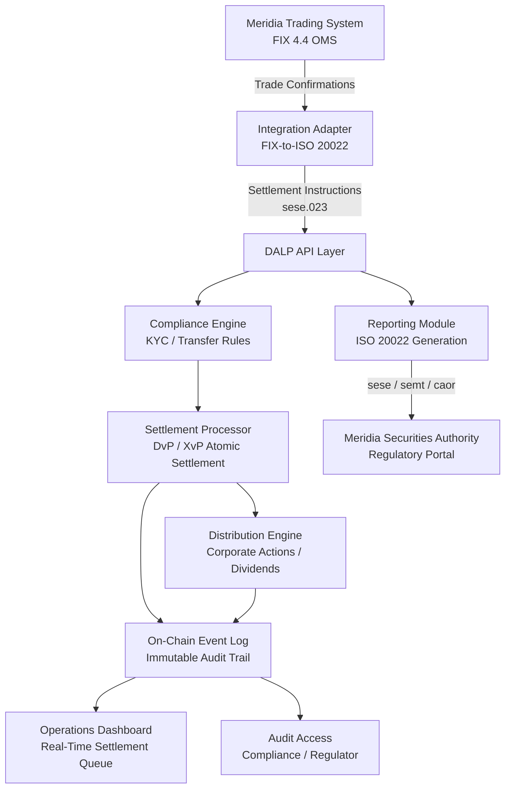

# DALP Response to MSX Post-Trade Modernization RFI

**To:** Meridian Stock Exchange (MSX) Operations Modernization Program
**Reference:** MSX-OPS-2026-014
**From:** SettleMint
**Date:** March 18, 2026
**Contact:** enterprise@settlemint.com

---

## Executive Summary

Meridian Stock Exchange faces a genuine transformation decision. Replacing a seventeen-year-old batch settlement infrastructure is not a technology refresh; it is a risk architecture change that directly affects participant capital, regulatory standing, and the exchange's competitive position among regional peers. The T+2 cycle is not merely slow; it is a mechanism that keeps capital locked and counterparty risk alive long after trades are economically complete. Moving to atomic settlement changes that relationship permanently.

SettleMint's Digital Asset Lifecycle Platform (DALP) is a production-grade, configurable platform designed specifically for institutions that need to move securities and cash atomically, manage complex corporate actions at scale, and meet regulatory obligations without building bespoke infrastructure. DALP does not ask MSX to choose between institutional familiarity and technical modernity. The platform integrates with existing order management infrastructure through industry-standard messaging protocols, generates ISO 20022 regulatory reports from on-chain event data, and provides a migration architecture that moves existing dematerialized holdings progressively without market disruption.

The sections below respond to each question in the RFI with technical specificity. Where capabilities are configurable rather than fixed, we describe the configuration surface. Where a requirement touches an integration boundary, we describe the architecture and what each party is responsible for. MSX should expect answers that are direct rather than promotional.

---

## Settlement Architecture

**Q1: Describe how your platform achieves atomic (T+0) settlement.**

DALP implements atomic Delivery-versus-Payment (DvP) settlement at the smart contract level. The mechanism is as follows: when a settlement instruction arrives on-platform, a single on-chain transaction locks both the securities position (seller side) and the cash obligation (buyer side) before executing either transfer. If both legs resolve successfully, both transfers commit in the same block. If either leg fails, the entire transaction reverts and both parties retain their original positions. There is no intermediate state in which one party has delivered and the other has not.

This is not a software approximation of atomicity; it is a property of the underlying blockchain's transaction model. The platform's XvP (Exchange-versus-Payment) extension generalizes this to multi-party settlement, supporting tripartite and multilateral instructions where all legs must succeed or none do. For MSX, this means that counterparty risk evaporates at the point of settlement confirmation rather than accumulating across a two-day window. Participant capital buffers that exist today to absorb T+2 exposure can be released, improving liquidity across the market.

Failed settlement is handled through a configurable retry and exception management workflow. Instructions that fail due to insufficient position or cash are queued for resolution with configurable timeout windows. Operations staff can view pending failures through the monitoring dashboard and initiate manual intervention or cancellation. Every failure event, retry attempt, and resolution is recorded in the immutable audit trail.

---

## Order Management Integration

**Q2: How does your platform receive trade confirmations from an external order matching engine?**

DALP is an API-first platform, and integration with external order management systems is a first-class use case. The platform exposes a typed API surface over HTTPS that accepts settlement instructions in structured format. For environments operating ISO 20022 message flows, the platform processes sese.023 (securities settlement instruction) and sese.024 (securities settlement instruction status advice) messages, which maps directly to MSX's reporting obligations and should align with the message formats already produced by the Meridia Trading System.

The integration model for MTS works as follows. When MTS confirms a trade (execution report status "Filled"), the matching engine generates a settlement instruction. A thin integration adapter translates the FIX 4.4 ExecutionReport into a DALP settlement instruction, either as a direct API call or through an ISO 20022 message bridge depending on MSX's preferred architecture. DALP does not require the existing MTS to be replaced or modified; the adapter layer is external to both systems and handles the translation. DALP acknowledges receipt, validates the instruction against current positions and compliance rules, and either accepts it to the settlement queue or rejects it with a structured error code explaining the reason.

Trade lifecycle events are handled through status callbacks. Cancellations and amendments generate corresponding events on-platform. If a cancellation arrives after the settlement instruction has been submitted but before execution, the platform holds processing and requires explicit reconciliation. MSX operations staff see these events in real time through the streaming event dashboard. The audit trail records every state transition for each instruction.

The integration architecture keeps MTS unchanged and adds the adapter layer as the only new component outside DALP. This matters for a market infrastructure project where the order management system cannot be taken offline during migration.

---

## Corporate Actions

**Q3: Describe your platform's capability to process corporate actions.**

Corporate action processing sits at the core of DALP's equity lifecycle design. Each of the four actions MSX identified operates differently, and DALP handles them through distinct but architecturally consistent mechanisms.

**Cash dividend distributions** are automated through DALP's distribution and claims system. On the record date, the platform takes a snapshot of all holder positions at the close of the settlement day. Entitlement calculations run against that snapshot to generate individual distribution amounts based on per-share dividend and holding size. Distributions are queued and executed as a batch payment, with each holder receiving their entitlement in a single transaction. The process from record date snapshot to distribution completion requires no manual calculation; the platform handles the arithmetic and the payment execution. Dividend events are logged in the audit trail with the record date snapshot hash, so entitlement calculations are verifiable against the on-chain state.

**Stock splits** are processed through DALP's token supply management functions, which platform administrators initiate. When a 2-for-1 split instruction is entered, the platform calculates the new position for every current holder proportionally, mints the additional tokens, and delivers them to each holder account in a single operation. The token's on-chain parameters are updated to reflect the new total supply and per-share nominal value. The operation is atomic; the split applies uniformly across all holders simultaneously rather than processing them sequentially, which prevents any transient state where some holders have split tokens and others do not.

**Rights issue subscription management** involves two phases that DALP handles separately. In the entitlement phase, the platform distributes non-tradeable rights tokens to current holders based on their position at the record date, proportional to the rights ratio. Each rights token represents the option to subscribe to one new share at the subscription price. In the subscription phase, holders with rights tokens can exercise them during the subscription window by tendering the rights token plus the subscription payment. DALP enforces the subscription window through time-based compliance rules, automatically rejecting exercise attempts after the deadline. Unexercised rights lapse at expiry, and the platform handles the lapse automatically without operator intervention. The proportion of rights exercised is tracked in real time, allowing MSX to monitor take-up during the subscription period.

**Bonus share distributions** follow the same entitlement snapshot and distribution mechanism as cash dividends, but deliver newly minted shares rather than cash. Proportional entitlement is calculated from the record date snapshot, fractional entitlements are handled according to MSX's configured rounding policy (round down, accumulate for later distribution, or pay fractional cash equivalent), and new shares are minted and delivered atomically.

All four corporate action types are automated in the sense that, once the action parameters are entered and approved by an authorized operator, the platform executes without further manual steps. The approval step is intentional; MSX will likely want a maker-checker control for corporate action initiation. The platform's role-based access control supports this directly.

---

## Participant Onboarding and Access Control

**Q4: Describe the participant onboarding process and access control mechanisms.**

DALP implements identity verification and role-based access control as platform-native capabilities, not bolt-on integrations.

Participant onboarding begins with identity verification. For institutional participants such as brokers and custodians, the platform integrates with identity and KYC providers to collect and verify documentation: legal entity registration, authorized signatory identification, and regulatory licensing status. Verification status is recorded on-chain as attestation claims attached to the participant's identity, which means compliance checks at every subsequent action can verify current status without re-querying the original KYC provider. When a participant's regulatory status changes (license revoked, sanctions list match), their attestations are updated and the platform automatically restricts their access accordingly.

Access control within DALP uses a five-role model. Platform administrators manage system configuration and participant registry. Issuer administrators manage their own listed instruments and initiate corporate actions. Operations staff handle settlement exceptions and monitor queue status. Compliance officers have read-only access to audit trails, settlement records, and position reports. Participants (brokers and custodians) have access only to their own positions, settlement instructions, and account data.

Permissions are enforced at every API endpoint and every on-chain action. A broker account cannot initiate a corporate action; an operations staff member cannot modify participant identity records. These are not configurable soft controls; they are enforced at the smart contract level, which means they cannot be bypassed by any operator regardless of system access level. This distinction matters for MSX's regulatory standing, as the MSA can be shown audit evidence that separation of duties is architecturally enforced rather than procedurally monitored.

As participant relationships change, operators can modify role assignments through the platform's administrative interface. Every permission change is logged in the audit trail with the authorizing operator's identity, timestamp, and the specific change made. Terminating a participant's access immediately revokes all active sessions and blocks all future actions; there is no grace period or partial access state.

---

## Regulatory Reporting

**Q5: Describe your platform's regulatory reporting capabilities.**

DALP generates ISO 20022 regulatory reports from the on-chain event stream as a native capability. Because every settlement event, corporate action, and position change is recorded on-chain with full provenance, the data required for regulatory reporting is always complete, timestamped, and tamper-evident. The platform does not depend on reconciling data from multiple systems to produce reports; the authoritative record is the on-chain state.

For a post-trade context, the platform produces settlement reporting aligned with sese.023/sese.024 (settlement instruction and status), semt.002 (statement of holdings), and semt.003 (statement of transactions) message formats. Corporate action reporting covers caor.001 through caor.009 series messages for notification, instruction, and confirmation events. These cover the standard reporting obligations a CSD carries toward regulators and market participants.

Reporting accuracy is maintained by the platform's event-sourcing architecture. The report generation function reads directly from the on-chain event log, which is immutable. There is no separate reporting database that can drift from the transaction record. A regulatory examiner asking for the settlement record for a specific instruction on a specific date receives a report generated from the same data that governed the settlement itself. The traceability chain is complete from trade confirmation through to final settlement, with every intermediate state recorded.

MSX should note that DALP generates the reporting data and formats it in standard message structure; submission to the Meridia Securities Authority through whatever filing channel the MSA operates is handled by MSX's reporting team using the generated files. DALP does not maintain direct connectivity to regulatory filing portals, as those vary by jurisdiction and are typically managed by the reporting institution.

---

## Migration Strategy

**Q6: How would you approach migration of 412 existing instruments and their holdings?**

The migration architecture for an exchange CSD replacement is the most consequential decision in the project, and DALP's approach is designed around one principle: the market cannot be disrupted during migration.

The recommended path is a phased parallel operation model. In Phase 1, DALP is deployed and configured alongside the existing CSD without replacing it. All 412 instruments are registered on-platform during this phase, and their holding records are imported from the legacy system. The import process creates a validated snapshot of every instrument's issued supply and its allocation across participant accounts, verified against the legacy system's records at a fixed point-in-time. Any discrepancy between the two systems is resolved before any live trading uses DALP for settlement.

In Phase 2, selected instrument groups migrate to DALP settlement while the legacy system continues handling the remaining instruments. The migration order is based on risk profile: the first instruments to migrate are new listings with no historical corporate action complexity, followed by high-liquidity instruments that benefit most from T+0 settlement. During this phase, any settlement instruction for a migrated instrument goes to DALP; instructions for non-migrated instruments continue through the legacy CSD. The dual-system period is finite and governed by a published migration calendar shared with all market participants.

In Phase 3, the full book migrates and the legacy CSD transitions to read-only archive status. Market participants access historical settlement records from the legacy system through a read interface maintained for the audit retention period required by MSA regulations.

The risk model for this approach has two primary controls. First, the migration snapshot comparison ensures that every token issued on DALP corresponds exactly to a dematerialized holding in the legacy system. No tokens can exist on DALP without a verified legacy counterpart. Second, the phased instrument migration means that a problem with DALP settlement for any single instrument group does not affect the rest of the market.

MSX should plan for a migration team including representatives from MSX operations, the legacy CSD operator (if separate), and SettleMint implementation staff. Migration timelines depend heavily on the quality and completeness of data exports from the legacy CSD. SettleMint can provide a data specification for the import format during the engagement scoping phase.

---

## High Availability and Disaster Recovery

**Q7: Describe the availability architecture and disaster recovery model.**

DALP's availability architecture is built on the understanding that market infrastructure cannot fail during trading hours without regulatory and reputational consequences that go beyond the immediate technical event.

The platform achieves high availability through a multi-node deployment architecture where the blockchain network and application layer both operate across geographically separated nodes. For a national CSD deployment, the standard configuration places nodes in at least three independent data centers within the jurisdiction. No single node failure causes service interruption; the network continues operating as long as a quorum of validator nodes remains online. The application tier runs in active-active configuration, with load balancing across instances and automatic failover if any instance becomes unavailable.

**Recovery Time Objective** for DALP deployments in standard three-node configuration is under 30 minutes for a full primary site loss. The RTO is governed primarily by the time to promote a secondary application instance to primary and verify settlement queue integrity, not by data recovery. No settlement data is lost during failover because the blockchain state is replicated across all nodes continuously.

**Recovery Point Objective** depends on the nature of the failure. For application-layer failures (API server, database), RPO is effectively zero because the authoritative settlement record is on-chain and not in any single application database. For a catastrophic multi-node failure (scenario where the network must be rebuilt from snapshot), RPO is governed by snapshot frequency, configurable down to five-minute intervals. Standard deployments target RPO of five minutes.

Disaster recovery procedures are documented and tested on a scheduled basis. SettleMint provides runbooks for each failure scenario category, and MSX operations staff are trained on recovery procedures during deployment. The monitoring dashboard provides real-time health status for all network nodes, application instances, and settlement queue depth, allowing operations staff to identify degradation before it becomes an outage.

---

## Security and Audit Trail

**Q8: Describe the audit trail and security model.**

Every action on DALP is recorded in the on-chain event log. This is not a secondary audit database that captures selected events; it is the primary record of the platform. Settlement events, corporate action initiations and completions, access events, permission changes, compliance check results, and failed attempts are all captured. Because the audit trail is on-chain, it is immutable: records cannot be deleted, amended, or backdated by any party, including SettleMint and including MSX system administrators.

Each audit record contains the cryptographic identity of the acting party, the timestamp of the action, the specific action taken, the before and after state of the affected assets, and the transaction hash linking it to the blockchain record. This structure means that a compliance officer or external auditor can trace any settlement event back to its originating trade confirmation and forward to its final settlement state without any gaps.

Access to audit records is role-governed. Compliance officers and regulatory staff have read-only access to the full audit trail. Operations staff can access records for settlement queue management but cannot modify or delete them. External auditors can be granted temporary read-only access for examination periods without any standing access to the platform. Every audit record access event is itself logged.

The security model at the network level uses permissioned architecture: only identified, authorized nodes can participate in the validator network. Participant access to the API surface requires authenticated sessions with session management controls, rate limiting, and brute-force protection. All data in transit is encrypted via TLS 1.3; all stored data is encrypted at rest. Key management for signing operations follows a hardware security module (HSM) architecture for production deployments, with key rotation procedures and split-custody controls for the highest-privilege operations.

For MSX's purposes, the MSA can be given dedicated read access to the audit trail and position reports without requiring their staff to interact with the platform's operational interfaces. This supports real-time supervisory access while maintaining operational separation.

---

## Architecture Overview

*Figure: MSX Post-Trade Platform Architecture — key integration points and data flows*

---

## About SettleMint and DALP

SettleMint is a regulated blockchain infrastructure company headquartered in Belgium, operating across Europe, the Middle East, and Asia. DALP is SettleMint's Digital Asset Lifecycle Platform, purpose-built for institutional asset tokenization and post-trade workflows. The platform is in production across multiple deployment contexts spanning tokenized equities, bonds, fund units, and stablecoins.

DALP is not a blockchain protocol; it is an institutional application layer deployed on permissioned distributed ledger networks. MSX would deploy DALP as a private, nationally hosted infrastructure under full operational control, with SettleMint providing software licensing, deployment support, and ongoing platform maintenance. The underlying network nodes would operate within Meridia's jurisdictional boundaries, satisfying data residency requirements.

SettleMint welcomes the opportunity to present a live demonstration of the DALP settlement workflow and corporate action processing to MSX's technical evaluation team. Reference implementations in comparable national market infrastructure contexts are available under NDA.

---

*Prepared by SettleMint — Digital Asset Lifecycle Platform*
*Contact: enterprise@settlemint.com*
