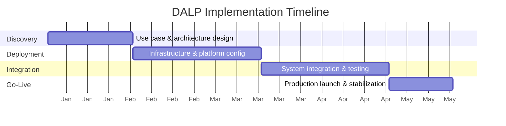
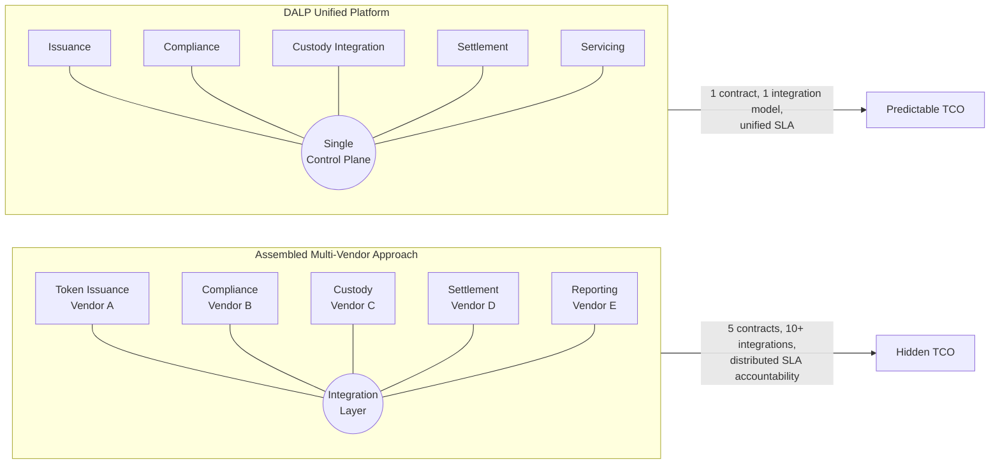

# Section 7: Commercial Proposal — Loop 2 Refresh

## Changes Applied in Loop 2

Based on Loop 1 review, addressing: Visual Communication, Writing Quality, Technical Credibility, IP protection, and Competitive Differentiation.

---

## 1. Refreshed Executive Summary (with forward-looking hook)

Regulated institutions entering digital asset markets face a commercial paradox: the technology components are increasingly available, but assembling them into a production-ready operating model requires integrating multiple vendors, negotiating separate SLAs, and accepting the reconciliation overhead that comes with disconnected systems. The total cost of that assembled approach is often invisible until the program is in production and operational complexity has compounded.

DALP's commercial model is designed to resolve this paradox. SettleMint licenses the Digital Asset Lifecycle Platform as a single platform subscription, not a per-transaction toll or a per-asset fee schedule. Institutions can scale issuance volume, add asset classes, onboard investors, and increase transaction throughput without incurring incremental licensing costs for each operation. This pricing philosophy reflects a fundamental design principle: platform adoption should accelerate usage, not constrain it.

The commercial framework described in this section covers platform licensing, implementation services, support tiers, and a structured ROI methodology that helps institutions compare the true cost of a unified platform against the assembled alternative. All pricing figures are marked **[CLIENT-SPECIFIC]** and are tailored through a scoping workshop that maps deployment requirements, integration scope, and regulatory context to a concrete commercial proposal.

---

## 2. Refreshed Section 7.1.2 — What the License Includes (Prose Rewrite)

A DALP platform license provides access to the complete platform without capability-level restrictions. All five core lifecycle pillars are included from day one: Issuance, Compliance, Custody integration, Settlement, and Servicing, together with the three platform foundations that make them operationally viable in regulated environments (Identity & Access Management, Integration & Interoperability, and Observability & Operations).

Every asset class the platform supports is available within every license tier. Institutions deploying their first bond program can later extend into deposits, funds, equities, stablecoins, real estate, or precious metals without license amendments. The same applies to compliance modules: all 18 module types, from country restrictions and investor accreditation to holding periods, transfer limits, and collateral backing, are included in every license rather than sold as add-ons.

The full programmatic surface is also included. The REST API (v2), typed TypeScript SDK, CLI, subgraph-based GraphQL access, and event webhook system are all available without separate API licensing. Addon capabilities including vault management, XvP/DvP settlement coordination, token sales and primary offerings, airdrop distribution, fixed yield schedules, and data feeds are part of the platform license.

Platform updates, security patches, and new capabilities released during the license term are included. The observability stack ships pre-configured with dashboards covering operations, transaction monitoring, compliance activity, and security events.

---

## 3. Implementation Timeline Diagram (NEW — Visual Communication)

**Phases and dependencies**: Discovery defines the architecture before infrastructure is provisioned. Deployment configures the platform to the architecture spec. Integration connects DALP to existing institutional systems and validates end-to-end workflows. Go-Live launches production with stabilization support. Total timeline ranges from 12 to 24 weeks depending on deployment complexity, integration scope, and institutional governance processes.

---

## 4. TCO Comparison Model Diagram (NEW — Visual Communication)

**The commercial argument in one picture**: The assembled approach requires separate procurement, integration, and SLA management for each vendor. DALP collapses these into a single platform with one contract, one integration model, and unified operational accountability. For most institutions, the hidden cost of the assembled approach (cross-vendor incident resolution, duplicate integration work, inconsistent audit trails) exceeds the visible licensing delta.

---

## 5. Section 7.6.1 — ROI Claims with Methodology Qualifier

#### Operational Efficiency Gains

The following efficiency estimates are derived from SettleMint's production deployment experience across regulated bank and market infrastructure engagements. Actual outcomes vary based on the institution's current operational baseline, process maturity, and scope of DALP adoption.

| Value Driver | Estimated Impact | How DALP Delivers | Basis |
|---|---|---|---|
| Settlement time reduction | 60–80% reduction (T+0/T+1 vs T+2/T+3) | Atomic DvP/XvP settlement eliminates counterparty risk and reconciliation cycles | Production deployments achieving T+0 for on-chain legs |
| Manual compliance review reduction | 40–60% reduction | Ex-ante compliance enforcement via 18 module types automates eligibility checks before execution | Based on operational comparison between manual review workflows and automated enforcement |
| Corporate action automation | 60–80% cost reduction | Programmatic coupon payments, yield distribution, dividend processing, and maturity handling | Operational comparison: manual Excel-based distribution vs. smart contract automation |
| Reconciliation elimination | Near-complete for on-chain operations | Unified on-chain registry provides single source of truth | Architectural property of single-registry design; no nightly batch reconciliation required |

**Note**: Revenue enablement and risk reduction benefits are harder to quantify in advance and depend heavily on the institution's existing operating model and growth trajectory. SettleMint recommends baselining current-state costs using the ROI measurement categories in Section 7.6.3 before developing projections.

---

## 6. Section 7.5–7.6 Bridge (NEW — Document Flow)

### Connecting Cost to Value

Understanding the cost structure of a DALP engagement is necessary but not sufficient for a sound commercial decision. The more important question is what those costs buy relative to the alternative. The ROI framework in the following section provides a structured methodology for comparing DALP's total cost of ownership against the cost of assembling and operating the equivalent capabilities from separate vendors and internal build efforts.

---
