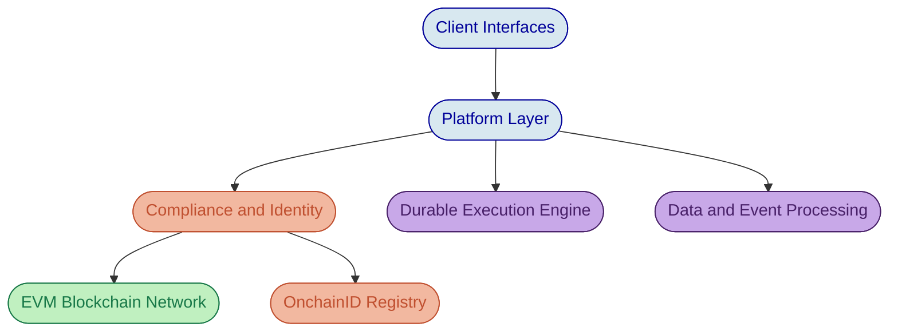

# Response to Request for Information

## Fractional Ownership of Commercial Real Estate Assets via Digital Token Infrastructure

**Prepared for:** Brickstone Digital Assets LLC
**RFI Reference:** BDA-RFI-2026-007
**Prepared by:** SettleMint NV
**Date:** 20 March 2026

---

# Cover Letter

Dear Ms. Al-Rashid,

SettleMint welcomes the opportunity to respond to Brickstone Digital Assets' Request for Information regarding a fractional ownership platform for commercial real estate assets across the UAE.

The challenge Brickstone faces is one we have addressed in production for regulated institutions across the Middle East, Europe, and Asia Pacific: turning the theoretical promise of tokenized real estate into an operational platform that satisfies regulators, protects investors, and scales with portfolio growth. DALP, the Digital Asset Lifecycle Platform, provides the infrastructure to tokenize commercial properties as fractional SPV-backed instruments, enforce VARA and RERA compliance at the smart contract level, automate rental yield distribution, and manage investor onboarding with tiered KYC, all within a single configurable platform.

SettleMint has delivered tokenization infrastructure for sovereign entities, central banks, and financial institutions operating in the GCC region. Our platform supports real estate as a native asset class with property-specific metadata, compliance modules tailored to UAE regulatory requirements, and a proven deployment model for data-residency-sensitive environments.

We look forward to discussing how DALP can underpin Brickstone's fractional ownership platform and supporting the next phase of evaluation.

Respectfully,

[Signatory Placeholder]
SettleMint NV

---

# About DALP

The Digital Asset Lifecycle Platform (DALP) is SettleMint's production-grade infrastructure for designing, launching, and operating tokenized financial instruments. DALP covers five lifecycle pillars, from asset creation through compliance enforcement, custody orchestration, settlement, and ongoing servicing, within a single integrated platform.

Unlike point-solution tokenization tools that handle issuance and leave everything else to custom development, DALP manages the complete lifecycle of a digital asset. Compliance rules are enforced before every transfer at the smart contract layer. Corporate actions such as rental yield distribution execute automatically according to configured schedules. Investor identity is verified through on-chain credentials that travel with the token, not maintained in a separate system that can fall out of sync.

DALP supports seven native asset classes: bonds, equities, funds, stablecoins, deposits, real estate, and precious metals. Each asset class includes purpose-built configuration workflows, metadata schemas, and compliance module presets. The real estate asset class is specifically designed for property-backed fractional ownership, with fields for GPS coordinates, property classification, building specifications, and valuation feeds.

The platform is built exclusively on EVM-compatible blockchain networks and implements the ERC-3643 (T-REX) standard for regulated security tokens. Every token deployed through DALP inherits identity verification, compliance enforcement, and access control as architectural properties, not optional add-ons.

| Lifecycle Pillar | What It Covers |
| --- | --- |
| Create | Asset design, token configuration, metadata schema, deployment |
| Comply | Identity verification, compliance modules, regulatory templates |
| Custody | Key management, wallet verification, custody provider integration |
| Settle | Atomic DvP/XvP settlement, cross-party exchange coordination |
| Service | Distributions, corporate actions, lifecycle events, reporting |

*Figure 1: DALP Administration Dashboard providing real-time portfolio oversight, pending action alerts, and blockchain activity monitoring.*

---

# Company Overview

SettleMint NV was founded in 2016 with a single focus: making institutional-grade tokenization operationally achievable for regulated organizations. The company builds and maintains DALP, serving banks, capital market infrastructure providers, sovereign entities, and real estate platforms across Europe, the Middle East, and Asia Pacific.

| Metric | Value |
| --- | --- |
| Founded | 2016 |
| Headquarters | Leuven, Belgium |
| Operating Regions | Europe, Middle East, Asia Pacific |
| Certifications | ISO 27001, SOC 2 Type II |
| Platform Focus | Regulated digital asset lifecycle management |
| Target Segments | Banks, CSDs, sovereign entities, real estate platforms, fund managers |

SettleMint is not a consulting firm, a custodian, or a blockchain network operator. The company provides platform software that clients configure and operate themselves, supported by implementation services and tiered support agreements. This positioning eliminates structural conflicts of interest: SettleMint does not compete with its clients for investor relationships, custody mandates, or exchange volume.

The team includes engineers with deep experience in smart contract security, financial services regulation, and enterprise deployment. SettleMint holds ISO 27001 certification for information security management and SOC 2 Type II certification confirming that security controls are independently audited and continuously maintained.

---

# Platform Overview

## The Complexity of Doing It Right

Tokenizing a commercial property and minting fractional tokens is technically straightforward. Doing it in a way that satisfies VARA licensing requirements, enforces RERA foreign ownership restrictions, automates compliant yield distribution to thousands of investors, and provides a complete audit trail for regulatory examination is a different challenge entirely.

Most institutions discover this complexity after committing to a build-or-assemble strategy. The gaps between issuance, compliance, distribution, and reporting are where projects stall, budgets overrun, and regulatory deadlines slip. DALP exists to close those gaps with a single platform that treats the entire lifecycle as a configuration and operations problem, not a custom development project.

## Architecture

DALP is organized in four layers that separate concerns while maintaining a unified control plane:

The **client interface layer** provides a web-based console for operators and investors, along with typed REST APIs, SDKs, and a CLI for programmatic integration. The console includes the Asset Designer wizard for no-code token configuration, compliance module management, identity verification workflows, and operational dashboards.

The **platform layer** handles business logic, durable workflow execution, data persistence, and event processing. All blockchain write operations pass through a durable execution engine that guarantees idempotency and atomic state management. If any step in a multi-step workflow fails, the system resumes from the last successful checkpoint rather than leaving orphaned state.

The **compliance and identity layer** implements ERC-3643 through the SMART Protocol, with modular compliance modules, an identity registry backed by OnchainID, and a trusted issuer hierarchy. Compliance rules evaluate before every transfer and revert the transaction atomically if any rule is violated.

The **blockchain layer** supports any EVM-compatible network, including public chains (Ethereum, Polygon), private permissioned networks (Hyperledger Besu, Quorum), and hybrid configurations. The platform deploys and manages smart contracts, processes on-chain events through a blockchain indexer, and maintains real-time state synchronization.

*Figure 2: DALP four-layer architecture, from client interfaces through platform logic, compliance enforcement, and blockchain execution.*

## Deployment Flexibility

DALP supports three deployment models, each delivering identical platform functionality:

| Model | Description | Data Residency |
| --- | --- | --- |
| Dedicated Cloud | SettleMint-managed infrastructure in client-selected cloud region | Cloud provider region (AWS, Azure, GCP) |
| On-Premises | Client-operated infrastructure within their own data centers | Client-controlled |
| Hybrid | Platform components distributed across cloud and on-premises | Mixed, per component |

For UAE-based deployments, DALP can operate entirely within UAE-hosted infrastructure, satisfying data residency requirements for investor records and transaction data. The blockchain network nodes, platform services, and data stores all run within the selected deployment boundary.

---

# Section A: Platform and Company Overview

**A.1** SettleMint NV, founded in 2016 and headquartered in Leuven, Belgium, operates across Europe, the Middle East, and Asia Pacific. The company holds ISO 27001 and SOC 2 Type II certifications. SettleMint focuses exclusively on regulated digital asset lifecycle management, serving banks, capital market infrastructure providers, and sovereign entities.

**A.2** DALP's architecture is described in the Platform Overview above. The platform supports dedicated cloud, on-premises, and hybrid deployment models, with identical functionality across all three.

**A.3** DALP natively supports seven asset classes: bonds, equities, funds, stablecoins, deposits, real estate, and precious metals. Real estate tokenization is handled through a purpose-built asset class preset that includes property-specific metadata schemas (GPS coordinates, property classification, building area, construction details), compliance module presets for jurisdictional restrictions, and valuation feed integration for NAV tracking.

---

# Section B: Token Design and Issuance

## B.4: Fractional Ownership Representation

Each commercial property is represented as a separate DALPAsset token, with the token contract deployed through DALP's Asset Factory. Fractional units represent proportional ownership in the SPV that holds the underlying property. The token standard is ERC-3643 (T-REX), which extends ERC-20 with mandatory identity verification, compliance enforcement, and transfer restriction capabilities.

Fractional precision is configurable at deployment. For Brickstone's retail offering at AED 5,000 minimum, the token can be denominated so that each unit represents a defined fraction of the SPV. Sub-unit precision down to multiple decimal places supports secondary market trading at granular price points. The total token supply maps directly to the property valuation, with each token carrying a proportional claim on rental yields and eventual sale proceeds.

Because each property sits in a dedicated SPV, each property deploys as a separate token with its own compliance configuration, investor registry, and distribution schedule. This separation ensures that compliance events affecting one property (such as a change in foreign ownership rules for a specific zone) do not cascade to the other two.

## B.5: Asset Creation Workflow

The Asset Designer guides issuers through a step-by-step wizard that captures the full instrument specification:

1. **Asset class selection**: Choose "Real Estate" from the supported asset classes
2. **Basic parameters**: Token name, symbol, and jurisdiction assignment (UAE)
3. **Property metadata**: GPS coordinates, property classification (commercial office, retail, logistics), building specifications, RERA registration number, SPV details
4. **Pricing and valuation**: Maximum token supply, denomination asset for settlement, initial NAV per unit
5. **Compliance modules**: Select and configure transfer restriction rules (country allow list, investor count limits, identity verification requirements)
6. **Permissions**: Assign roles (administrator, governance, supply management, compliance officer, custodian)
7. **Review and deploy**: Validate configuration and deploy through the Asset Factory

The entire workflow executes through a durable pipeline. If any deployment step fails, the process resumes from the last successful checkpoint. Newly deployed tokens start in a paused state, giving the compliance team time to verify the configuration before the first mint operation.

*Figure 3: DALP Asset Designer, the entry point for configuring any tokenized instrument through a guided wizard.*

*Figure 4: Real estate metadata configuration step, capturing property-specific details bound to the token from creation.*

## B.6: Property Metadata

DALP's real estate asset class preset includes a customizable metadata schema. Standard fields include GPS coordinates (latitude and longitude), property classification, building area, construction year, and title deed references. Additional fields can be added per instrument template, allowing Brickstone to capture RERA registration numbers, SPV identifiers, and zone-specific regulatory classifications.

Metadata fields support configurable mutability controls. Fields like GPS coordinates and title deed references are set as immutable at deployment, ensuring the token's property binding cannot be altered after issuance. Operational fields like property management company or maintenance reserve percentage can be configured as mutable, allowing updates through governed administrative operations.

*Figure 5: Customizable metadata schema for real estate instruments, with field-level mutability controls and jurisdiction-specific configuration.*

---

# Section C: Investor Onboarding and Compliance

## C.7: Investor Onboarding

DALP's onboarding process binds every investor to a verified on-chain identity through the OnchainID protocol. Before any investor can receive tokens, their wallet must be associated with an OnchainID contract containing verified claims from trusted issuers. The onboarding workflow proceeds as follows:

The investor registers on the platform, providing identity information and supporting documents. A compliance officer or automated verification provider reviews the submission and issues identity claims to the investor's OnchainID contract. These claims attest to specific facts: KYC completion, AML screening clearance, investor accreditation status, country of tax residency, and any additional claims required by the compliance module configuration.

Claims are issued by trusted issuers, entities that the platform administrator has authorized to make specific types of attestations. This prevents self-asserted identity. An investor cannot declare themselves accredited; a trusted issuer must verify and attest to that status on-chain.

The platform supports document collection as part of the onboarding workflow: proof of identity, proof of address, source of funds documentation for qualified investors, and any additional documents required by UAE Central Bank guidelines.

*Figure 6: On-chain identity record with verified claims from trusted issuers, forming the compliance foundation for every investor.*

## C.8: Tiered Investor Categories

DALP's compliance module system directly supports tiered investor categories. For Brickstone's two-tier model, the configuration would include:

**UAE resident retail investors** (minimum AED 5,000): Identity verification requires KYC claims covering Emirates ID verification, proof of UAE residency, and AML screening. The compliance module uses a boolean expression to evaluate required claim topics: KYC AND AML AND UAE_RESIDENCY.

**International qualified investors** (minimum AED 100,000): Enhanced due diligence adds additional claim requirements: KYC AND AML AND ACCREDITED_INVESTOR AND SOURCE_OF_FUNDS. The accredited investor and source-of-funds claims require separate verification from a trusted issuer authorized for qualified investor attestation.

These tiers are configured through DALP's compliance expression builder, which uses Reverse Polish Notation (RPN) to compose arbitrary boolean expressions over claim topics. The same token can enforce different claim requirements for different investor classes without deploying separate contracts or maintaining off-chain exception logic.

Transfer restrictions enforce the minimum investment thresholds. A transfer that would result in the buyer holding fewer tokens than the minimum investment amount is rejected by the compliance module at the smart contract level.

For Brickstone's operations, this means investor eligibility is enforced automatically at every touchpoint. Your compliance team configures the rules once; the platform enforces them on every transfer, mint, and distribution without manual review of individual transactions. This shifts compliance from a labour-intensive, per-transaction review process to a policy-driven, automated enforcement model.

*Figure 7: Compliance expression builder, configuring investor eligibility rules through composable boolean logic without custom code.*

## C.9: RERA Compliance and Foreign Ownership

DALP enforces jurisdictional transfer restrictions through the Country Allow List and Country Block List compliance modules. For RERA compliance, the configuration can restrict which nationalities are permitted to hold tokens for properties in zones with foreign ownership limitations.

The country restriction module evaluates the investor's country of tax residency (attested through an OnchainID claim from a trusted issuer) against the configured allow or block list. If the investor's jurisdiction is not permitted for that specific property token, the transfer reverts. This enforcement happens at the smart contract layer, meaning it cannot be bypassed through direct blockchain interaction or API-level workarounds.

For zone-specific restrictions, each property token is configured independently. The Dubai Marina office tower might permit broader international ownership, while a property in a restricted zone would have a narrower country allow list. Because each property is a separate token with its own compliance configuration, zone-level rules apply without affecting other properties in the portfolio.

*Figure 8: Country allow list configuration, enforcing RERA-compliant geographic ownership restrictions per property token.*

## C.10: AML/CFT Compliance

DALP's compliance architecture provides the enforcement layer for AML/CFT requirements, though it is important to distinguish what the platform handles natively and where external systems are required.

**Available now through DALP:** Every transfer is subject to identity verification before execution. Investors without verified KYC and AML claims cannot receive tokens. The Address Block List compliance module can enforce sanctions screening by blocking transfers to or from specific wallet addresses (OFAC SDN lists, UAE sanctions lists). The platform maintains a complete, immutable audit trail of every mint, burn, and transfer event, providing the evidential basis for regulatory examination.

**Requires integration:** Ongoing transaction monitoring for suspicious activity patterns, automated suspicious transaction reporting (STR) to the UAE Financial Intelligence Unit, and real-time sanctions screening against dynamic lists are functions that require integration with specialized AML/CFT monitoring providers. DALP's typed REST API and webhook event system support integration with these external monitoring services. The platform provides the transactional data and event feeds; the pattern detection and regulatory filing are handled by the compliance monitoring provider.

This boundary is deliberate. AML/CFT monitoring is a specialized domain with rapidly evolving regulatory requirements. Rather than building a monitoring engine that would constantly lag behind regulatory changes, DALP provides the data infrastructure and enforcement surface that monitoring providers connect to.

For Brickstone, this means your compliance team can demonstrate to VARA that every token transfer was verified against investor identity and compliance rules before execution, and that a complete audit trail exists for every transaction on the platform. The integration with a UAE-licensed AML monitoring provider adds the ongoing surveillance layer that completes the regulatory picture.

---

# Section D: Rental Yield Distribution

## D.11: Automated Distribution

DALP's distribution system handles rental yield payments to all token holders. The process works through the platform's claims and distribution infrastructure:

The property manager calculates the net distributable amount (gross rental income minus management fees, maintenance reserves, and applicable deductions). This calculated amount is submitted to DALP as a distribution event. The platform then executes the distribution, calculating each token holder's pro-rata entitlement based on their token balance at the distribution snapshot date, and delivering the payment through the configured denomination asset (a tokenized stablecoin or deposit token representing AED).

Distributions execute atomically: either all holders receive their entitlement or the distribution reverts. The platform records the complete distribution event, including the snapshot block, per-holder amounts, and settlement confirmations, in the immutable audit trail.

For quarterly distributions, the property manager can configure recurring distribution schedules. The platform handles the snapshot, calculation, and execution for each period.

*Figure 9: Event history for a real estate asset showing distribution records, minting operations, and lifecycle events.*

## D.12: Fee Deductions

**Requires configuration and external calculation:** DALP's distribution system executes distributions based on the net amount provided. The gross-to-net calculation (deducting the 8% property management fee, 5% maintenance reserve, and applicable VAT) is performed outside the platform by the property manager or fund administrator. DALP does not include a native tax calculation engine.

The platform can record the deduction breakdown as metadata attached to each distribution event, providing transparency for investor statements. But the actual fee and tax calculations are the responsibility of the property management and accounting functions, not the tokenization platform. This separation reflects institutional practice: tax computation depends on investor-specific factors (tax residency, treaty eligibility) that belong in the accounting domain, not the asset lifecycle platform.

## D.13: Investor Statements

DALP provides the data foundation for investor statements through its API and reporting infrastructure. The platform records holdings per investor (token balance at any point in time), distribution history (every yield payment received), and current NAV per unit.

Generating formatted quarterly and annual investor statements (PDF reports with holdings summaries, yield received, capital gains calculations, and current NAV) requires integration with a reporting or fund administration system. DALP exposes all the underlying data through its typed REST API; the report formatting and distribution is handled by the statement generation service.

---

# Section E: Secondary Market and Transfer Controls

## E.14: Secondary Market Mechanism

DALP supports compliant peer-to-peer transfers where the compliance engine re-verifies buyer eligibility before every transfer. A token holder can transfer tokens to any verified investor whose OnchainID satisfies the token's compliance module requirements. The transfer is atomic: compliance check, identity verification, and settlement all execute in a single transaction.

**An important distinction:** DALP is not a trading venue and does not include a native order book, matching engine, or marketplace listing system. The "browse and purchase available listings" experience described in the RFI requires an external exchange or OTC platform integrated with DALP. The platform handles the token-side of every trade (compliance verification, transfer execution, settlement) while the price discovery, order matching, and listing interface reside in the external trading venue.

This boundary is typical for institutional tokenization platforms. Building and operating a trading venue involves separate regulatory licensing (MTF authorization under VARA/ADGM rules), market surveillance obligations, and operational requirements that are distinct from asset lifecycle management. DALP integrates with trading venues through its API surface, providing the compliance and settlement layer while the venue handles market-making.

## E.15: Transfer Restrictions

DALP's compliance module catalog includes several modules directly applicable to Brickstone's transfer control requirements:

**Minimum holding requirements:** Configurable through transfer validation logic that rejects transactions resulting in the buyer holding below the minimum threshold or the seller retaining a sub-minimum position.

**Maximum holder counts:** The Investor Count module caps the number of unique token holders, both globally and per country. This module tracks holder counts in real-time and rejects transfers that would exceed configured limits.

**Time-based restrictions:** The TimeLock module enforces minimum holding periods with FIFO batch tracking, preventing tokens from being transferred before the lock period expires.

**Pre-emption rights (right of first refusal):** DALP's Transfer Approval module supports workflows where transfers require explicit approval before execution. A pre-emption rights workflow can be configured where existing holders are notified of a pending transfer, and the transfer only executes after the approval window closes. The approval can be time-limited (e.g., 30-day exercise window) with automatic expiry.

## E.16: Compliance Re-verification

Every secondary market transfer passes through the full compliance module evaluation. The buyer's OnchainID is checked against all configured requirements: KYC status, AML clearance, investor category, country of residency, and any additional claim topics. If the buyer's identity does not satisfy the compliance expression, the transfer reverts atomically.

This re-verification is not an application-layer check that can be bypassed. It is enforced at the smart contract level, meaning that even direct blockchain transactions (outside the DALP console) are subject to the same compliance rules. Compliance travels with the token, not just the platform.

---

# Section F: Valuation and Data Feeds

## F.17: Property Valuation Integration

DALP includes a data feeds module that can consume external data sources, including property valuation feeds. The integration works through the platform's API surface: external valuation providers submit updated NAV data through authenticated API calls, and the platform records the valuation update as an on-chain or off-chain data point linked to the relevant asset.

For Brickstone's quarterly mark-to-market requirement, the valuation provider's system would push updated NAV figures to DALP on the configured schedule. The platform applies the updated NAV to the relevant property token, making it visible to all stakeholders through the console and API.

*Figure 10: Data feed configuration for a real estate asset, connecting external valuation sources to the on-chain asset record.*

## F.18: Valuation Discrepancy Resolution

**Requires custom workflow:** DALP's data feeds module can consume valuation data from multiple independent sources. However, automated multi-source comparison with discrepancy flagging when valuations diverge by more than 10% is not a shipped feature. The platform can record valuations from three independent firms and expose them through its API; the reconciliation logic (comparing sources, detecting divergence, triggering alerts) is custom workflow territory that would be implemented in the integration layer connecting DALP to the valuation providers.

---

# Section G: Governance

## G.19 and G.20: Token Holder Voting

DALP implements the ERC-5805 standard for governance voting power through a token feature. This provides the smart contract infrastructure for vote delegation, historical balance tracking at specific timestamps, and EIP-712 signed voting. Token balances become voting units, and the feature maintains vote checkpoints that are synchronized through SMART feature hooks on transfer, mint, burn, and redemption operations.

**An honest capability statement:** The voting power infrastructure exists at the smart contract level, meaning the cryptographic primitives for delegating votes, tracking balances at specific blocks, and verifying vote signatures are all shipped. However, DALP does not include a production-ready governance application with proposal creation, quorum tracking (e.g., 66.67% of outstanding tokens), vote tallying with approval thresholds, and a governance dashboard for token holders. These governance workflow components would need to be built as an application layer on top of the voting power smart contract infrastructure.

For Brickstone's governance requirements (voting on property disposition, major capex, and property manager changes), the smart contract foundation is in place. The application layer for creating proposals, collecting votes, enforcing quorum, and executing outcomes would be an implementation project that uses DALP's voting power infrastructure as its base.

---

# Section H: Exit and Liquidation

## H.21: Property Sale and Token Retirement

DALP handles the token-side of property exit and liquidation through its burn and distribution capabilities. When a property is sold, the workflow proceeds:

1. The property manager submits the net sale proceeds as a distribution event
2. DALP calculates each holder's pro-rata entitlement based on their token balance
3. The distribution executes, delivering the settlement asset (tokenized AED) to each holder's wallet
4. After distribution is confirmed, the supply manager initiates a token burn operation, retiring all outstanding tokens
5. The burn is recorded in the immutable audit trail, providing a complete chain of custody from issuance through retirement

This lifecycle closure is a native platform capability. The entire process, from distribution through burn, executes through DALP's standard operations without custom development.

For Brickstone's investors, this means a clean, auditable exit: every dirham of sale proceeds is distributed proportionally, every token is retired, and the complete chain of custody from property acquisition through fractional ownership to final liquidation is preserved in the immutable record.

---

# Section I: Technology and Integration

## I.22: Emirates ID Integration

**Requires integration:** DALP integrates with identity verification providers through its API layer, but does not include a pre-built connector to the UAE national identity system (ICP/Emirates ID). Integration with Emirates ID verification would be achieved through a local eKYC provider that connects to the ICP system and issues identity claims to DALP's OnchainID infrastructure. Several UAE-based eKYC providers offer this capability, and the integration pattern (provider verifies identity, issues claims to OnchainID) is a standard DALP deployment pattern.

## I.23: APIs and Integration Surfaces

DALP exposes a comprehensive integration surface:

| Interface | Description |
| --- | --- |
| Typed REST API | Full platform coverage with typed request/response schemas, supporting all asset, identity, compliance, and administration operations |
| SDKs | Client libraries for programmatic integration with type safety |
| CLI | Command-line interface for scripting and automation |
| Webhooks | Event-driven notifications for state changes (transfers, distributions, compliance events) |
| Server-Sent Events | Real-time streaming of blockchain activity and platform events |

All APIs authenticate through scoped API keys with per-key permission controls. Rate limiting is enforced at 10,000 requests per 60-second window per key.

## I.24: Monitoring and Observability

DALP provides native monitoring across three dimensions:

**Blockchain health:** Real-time monitoring of network status, block production, node connectivity, and transaction throughput. Operators can verify that the underlying blockchain infrastructure is performing within expected parameters.

**API health:** Request-level monitoring including response times, error rates, and throughput metrics. Operators can identify performance degradation or integration issues before they affect investor-facing operations.

**Platform operations:** Activity logging for every platform action, providing a searchable audit trail of administrative operations, compliance decisions, and system events.

*Figure 11: Blockchain monitoring dashboard showing real-time network health, block processing, and node status.*

---

# Section J: Security and Resilience

## J.25: Key Management and Custody

DALP operates on a Bring-Your-Own-Custodian (BYOC) model. The platform orchestrates custody workflows while external providers handle actual key storage and signing. This separation ensures that SettleMint is never in a position to access or control client digital assets.

The platform's Key Guardian component manages the relationship between users and their wallet keys. Multiple secret storage backends are supported, and the selection depends on the deployment environment and security requirements. For institutional deployments, integration with enterprise custody providers (supporting HSM-backed key storage, multi-signature approval workflows, and policy-based transaction controls) is available.

Wallet verification provides step-up authentication for all blockchain write operations. Even with a valid platform session, no on-chain transaction executes without the user proving control of their wallet through a separate verification factor (PIN, TOTP, backup codes, or passkey).

## J.26: Availability and Disaster Recovery

DALP's resilience architecture is built on several structural properties:

The blockchain itself serves as the authoritative source of truth for all asset ownership and compliance state. If the platform application layer fails and recovers, the blockchain state is unaffected. The platform re-synchronizes with the blockchain on recovery, and the blockchain indexer performs zero-downtime reindexing to rebuild application-level state from on-chain data.

The durable execution engine ensures that multi-step operations (token deployment, batch distributions, compliance updates) are idempotent and resumable. If a workflow is interrupted, it continues from the last successful checkpoint rather than duplicating or losing operations.

For deployment-specific availability targets, the platform supports containerized deployment with health-check-driven failover. Specific RPO and RTO commitments depend on the chosen deployment model and infrastructure configuration.

## J.27: Audit Trail

DALP maintains a complete audit trail across two layers:

**On-chain:** Every token mint, burn, transfer, compliance module change, and role assignment is recorded as an immutable blockchain event. These records are permanent, tamper-evident, and independently verifiable by any party with access to the blockchain network.

**Platform-level:** Every administrative action, identity verification decision, API access, and configuration change is logged with timestamp, actor identity, and action details. This layer provides the operational audit trail that regulators typically require for examination purposes.

The combination provides the evidential basis for VARA, RERA, and UAE Central Bank regulatory reviews. Audit data is accessible through the platform console and API for authorized personnel.

---

# Target Operating Model

## Governance Roles

DALP enforces a role-based access control model that maps directly to institutional governance requirements. For Brickstone's real estate tokenization platform, the recommended role structure ensures clear separation of duties:

| DALP Role | Brickstone Assignment | Responsibilities |
| --- | --- | --- |
| Platform Administrator | CTO / Head of Technology | Platform configuration, user management, system settings |
| Governance | Board / Investment Committee | Compliance module changes, role assignments, emergency operations |
| Supply Management | Head of Operations | Token minting (new property launches), token burning (property exits) |
| Compliance Officer | Head of Compliance | Investor onboarding approvals, identity verification oversight, compliance module configuration |
| Custodian | Appointed Custody Provider | Key management, transaction signing |
| Emergency | CTO + Head of Compliance (dual control) | Platform pause/unpause in crisis scenarios |

This role structure ensures that no single individual can both configure compliance rules and approve investor onboarding, mint tokens and modify transfer restrictions, or change governance settings and execute distributions. The separation of duties is enforced at the smart contract level, not merely at the application tier.

## Day-to-Day Operations

Once the three property tokens are live, Brickstone's operational rhythm will centre on five recurring activities:

**Investor management:** Processing new investor applications, reviewing and approving KYC documentation, managing claim renewals for existing investors whose verification periods expire. The compliance officer handles this through the DALP console, with the platform automatically notifying investors of pending actions.

**Distribution management:** Each quarter, the property manager submits net distributable amounts for each property. DALP executes the distribution automatically, and the operations team verifies settlement through the activity log and investor balance confirmations.

**Compliance monitoring:** Reviewing the compliance dashboard for any blocked transfers, expired investor claims, or approaching investor count limits. Monitoring external AML provider alerts for suspicious activity requiring investigation.

**Property lifecycle events:** Processing valuation updates from appraisal firms, updating property metadata when tenant changes occur, and managing any zone-level regulatory changes that require compliance module reconfiguration.

**Reporting and audit:** Generating data exports for quarterly investor statements, preparing audit evidence packages for VARA examinations, and maintaining the compliance documentation trail.

---

# Blockchain and Ledger Support

## EVM-Native Architecture

DALP is built exclusively for EVM-compatible blockchain networks. This is a deliberate architectural decision, not a temporary limitation. The EVM ecosystem provides the largest developer community, the most mature tooling, the widest institutional adoption, and the most rigorously audited smart contract standards (ERC-3643, ERC-20, ERC-5805) in the blockchain industry.

For Brickstone's deployment, DALP supports both public EVM networks (Ethereum, Polygon) and private permissioned networks (Hyperledger Besu, Quorum). A permissioned network is typically recommended for real estate tokenization programs because it provides:

- Full control over validator nodes and network governance
- Transaction privacy (only authorized participants see transaction details)
- Predictable transaction costs (no gas price volatility)
- Data residency compliance (nodes hosted in UAE infrastructure)

| Network Type | Examples | Data Residency | Transaction Privacy |
| --- | --- | --- | --- |
| Public EVM | Ethereum, Polygon | Distributed globally | Pseudonymous but visible |
| Private Permissioned | Hyperledger Besu, Quorum | Operator-controlled | Full privacy within network |
| Hybrid | Public chain with private subnets | Configurable per component | Mixed model |

## Honest Limitations

DALP does not support non-EVM blockchain networks such as Solana, Cardano, Polkadot, Cosmos, Stellar, or Tezos. If Brickstone's technology roadmap requires interaction with non-EVM chains in the future, this would need to be addressed through bridge infrastructure or adapter layers external to DALP.

Within the EVM ecosystem, DALP supports multi-network operations: deploying tokens on one network while maintaining operational infrastructure on another, or running parallel asset programs across different EVM chains. This flexibility ensures that network selection does not constrain the platform's long-term utility.

---

# Coverage Summary

| Requirement Area | Status | Implication for Brickstone |
| --- | --- | --- |
| Real estate token design and issuance | Available Now | Each of the three properties configurable and deployable within days, not months |
| Fractional ownership with SPV structure | Available Now | AED 5,000 retail minimum achievable with configurable token precision per property |
| Tiered investor onboarding (retail/qualified) | Available Now | UAE retail and international qualified investor rules enforced automatically per transfer |
| RERA compliance and foreign ownership | Available Now | Zone-specific ownership restrictions enforced at smart contract level; cannot be bypassed |
| AML/CFT enforcement layer | Available Now | Every transfer verified against investor identity before execution; full audit trail for VARA |
| AML/CFT monitoring and STR filing | Requires Integration | Partner with a UAE-licensed AML monitoring provider for ongoing surveillance and STR filing |
| Quarterly rental yield distribution | Available Now | Automated pro-rata distribution to all holders with atomic settlement and snapshot-based calculation |
| Fee/tax calculation before distribution | Requires Integration | Property manager calculates net distributable amount; DALP executes the distribution |
| Investor statement generation | Requires Integration | All data available via API; connect to reporting/fund admin for formatted investor statements |
| Secondary market compliance layer | Available Now | Buyer eligibility re-verified on every secondary transfer; compliance travels with the token |
| Order book and marketplace listing | Requires Integration | Integrate with a VARA-licensed exchange for price discovery and listing; DALP handles settlement |
| Property valuation feed integration | Available Now | Quarterly NAV updates from appraisal firms consumed through data feeds module |
| Multi-source valuation discrepancy flagging | Requires Integration | Build reconciliation logic in integration layer to compare three independent valuations |
| Token holder governance voting | Partial | Voting power infrastructure in smart contracts; governance application (proposals, quorum) requires build |
| Property exit and token retirement | Available Now | Clean lifecycle closure: distribute sale proceeds, burn tokens, complete audit trail |
| Emirates ID integration | Requires Integration | Connect through a local eKYC provider that interfaces with ICP/Emirates ID system |
| API, SDK, CLI, webhooks | Available Now | Full programmatic access for property management, accounting, and CRM integration |
| Monitoring and observability | Available Now | Real-time blockchain health, API performance, and operational audit dashboards |
| Key management and custody | Available Now | Enterprise custody integration with step-up verification for every blockchain transaction |
| Audit trail and regulatory reporting | Available Now | Immutable on-chain and platform-level records for VARA, RERA, and Central Bank examinations |

---

# Implementation Approach

A typical real estate tokenization deployment on DALP follows five phases:

| Phase | Duration | Key Activities |
| --- | --- | --- |
| Discovery and Architecture | 2 to 3 weeks | Requirements mapping, compliance module design, integration architecture, deployment environment selection |
| Platform Deployment | 2 to 3 weeks | Infrastructure provisioning, DALP deployment, blockchain network configuration, initial security hardening |
| Configuration and Integration | 3 to 4 weeks | Real estate token configuration, compliance module setup, eKYC provider integration, data feed connectivity, API integration with property management systems |
| Testing and Validation | 2 to 3 weeks | Compliance rule testing, distribution workflow validation, security penetration testing, UAT with pilot investors |
| Go-Live and Stabilization | 2 weeks | Production deployment, first property token launch, monitoring verification, hypercare support |

Total indicative timeline: 11 to 15 weeks for the first property token, with subsequent properties deployable in 2 to 3 weeks each using the established configuration templates.

---

# About SettleMint

| Metric | Value |
| --- | --- |
| Founded | 2016 |
| Headquarters | Leuven, Belgium |
| Operating Regions | Europe, Middle East, Asia Pacific |
| Certifications | ISO 27001, SOC 2 Type II |
| Platform | DALP (Digital Asset Lifecycle Platform) |
| Asset Classes | Bonds, Equities, Funds, Stablecoins, Deposits, Real Estate, Precious Metals |
| Token Standard | ERC-3643 (T-REX) with SMART Protocol |
| Deployment Models | Dedicated Cloud, On-Premises, Hybrid |

---

**Document Classification:** Confidential
**Version:** 1.0
**Submission Date:** 20 March 2026
**Contact:** SettleMint NV, info@settlemint.com
