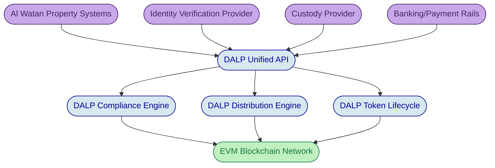

# RFI Response: Real Estate Portfolio Tokenization Platform

# Response to Al Watan Sovereign Wealth Fund

**RFI Reference:** AW-RFI-2026-017

---

## Cover Letter

20 March 2026

Procurement Office
Al Watan Sovereign Wealth Fund
ADGM, Al Maryah Island
Abu Dhabi, United Arab Emirates

Dear Members of the Evaluation Committee,

SettleMint welcomes the opportunity to respond to Al Watan Sovereign Wealth Fund's Request for Information regarding the tokenization of its commercial real estate portfolio across the UAE, the United Kingdom, and Luxembourg.

Al Watan's programme represents precisely the kind of institutional-grade initiative that DALP was built for: multi-jurisdictional compliance across ADGM, FCA, and CSSF regulatory frameworks; SPV-based fractional ownership with automated rental yield distribution; secondary market transfers governed by asset-specific rules including RERA foreign ownership restrictions; and full lifecycle management from initial tokenization through eventual property disposition. These are not theoretical capabilities for SettleMint. DALP is currently powering the Saudi Real Estate Registry's country-scale tokenization programme, and our platform has operated in regulated production environments with banks and sovereign entities for over seven years.

This response details how DALP addresses each of Al Watan's functional requirements, identifies where the platform delivers natively and where integration with specialist providers is required, and proposes an implementation approach calibrated to the programme's scope and regulatory complexity. We have been direct about capability boundaries throughout, because we believe that honest positioning builds the trust required for a programme of this scale and scrutiny.

We look forward to discussing how SettleMint can support Al Watan's digital asset ambitions.

Respectfully,

[Signatory Placeholder]
SettleMint NV

---

## About DALP

DALP is SettleMint's Digital Asset Lifecycle Platform, purpose-built for designing, launching, and operating tokenized assets in regulated financial markets. The platform addresses a challenge that most institutions discover only after committing to tokenization: minting a token is straightforward, but operating a compliant, auditable, and scalable digital asset programme in production is genuinely difficult. DALP exists to close that gap.

The platform is structured around five integrated lifecycle pillars that together cover every stage of a digital asset's existence:

| Pillar | Function |
| --- | --- |
| **Create** | Asset design and issuance across seven asset classes, including real estate, through a configuration-driven model |
| **Comply** | Ex-ante compliance enforcement with 18 module types covering eligibility, restrictions, transfer controls, and jurisdictional rules |
| **Custody** | Key management orchestration with bring-your-own-custodian integrations (Fireblocks, DFNS) |
| **Settle** | Atomic Delivery-versus-Payment (DvP) and Exchange-versus-Payment (XvP) settlement |
| **Service** | Automated lifecycle operations: distributions, corporate actions, redemptions, and retirement |

DALP supports seven purpose-built asset classes (bonds, equities, funds, deposits, stablecoins, real estate, and precious metals) plus a configurable token type for novel instruments. Each asset class includes lifecycle logic specific to its domain. The real estate asset class, directly relevant to Al Watan's programme, provides property-to-token mapping, fractional ownership structures, rental income distribution automation, and compliance modules tailored to property ownership regulations.

What distinguishes DALP from fragmented point solutions is this unified lifecycle coverage. Competing approaches typically require institutions to assemble separate vendors for issuance, compliance, custody, settlement, and servicing, creating coordination overhead, accountability gaps, and reconciliation risk. DALP consolidates these into a single platform with one registry, one compliance engine, one audit trail, and one governance model, deployed on any EVM-compatible blockchain network.

*Figure 1: DALP Dashboard providing a consolidated view of all tokenized assets, their compliance status, and key portfolio metrics.*

---

## Company Overview

### Who We Are, Mission, and Positioning

SettleMint is the digital asset lifecycle platform company for regulated financial markets and sovereign use cases. Founded nearly a decade ago, SettleMint has evolved from an early enterprise blockchain infrastructure provider into the category-defining platform enabling financial institutions, market infrastructure providers, and sovereign entities to move real-world value on-chain with compliance, security, and operational reliability.

The company exists to solve the complexity of doing digital assets right. As regulatory frameworks mature and expectations shift from innovation pilots to operational reality, most organizations remain constrained by isolated experiments, underestimated operational complexity, and architectures that do not withstand regulatory scrutiny. SettleMint's mission is to enable regulated institutions to move from slides to balance sheets, absorbing infrastructure complexity so they can focus on their business.

SettleMint serves institutions across the capital markets value chain, including banks and financial institutions in transaction banking and capital markets, sovereign entities and regulators deploying national-scale infrastructure, market infrastructure providers expanding to support tokenized instruments, and real estate developers and asset owners exploring fractional ownership. The company operates with deep domain expertise in financial services, blockchain engineering, and enterprise delivery, backed by leading European and Middle Eastern investors.

### Production Credentials and Regulatory Readiness

SettleMint's credibility rests on production deployments, not marketing claims. The company has maintained multi-year live deployments with regulated banks and sovereign entities, delivering settlement finality, compliance enforcement, and operational availability under institutional SLAs. These are business-critical workflows, not sandboxes.

| Credential | Evidence |
| --- | --- |
| Production track record | 7+ years of continuous production deployments at regulated banks |
| Sovereign programmes | Active national-scale programmes in the Middle East, including Saudi RER |
| Security validation | Deployments have passed security reviews, penetration testing, and vendor risk assessments at major financial institutions |
| Regulatory frameworks | Native compliance support for EU MiCA, US Reg D/S, Singapore MAS, UK FCA, Japan FSA, and GCC frameworks |
| Asset class coverage | Live deployments spanning bonds, equities, deposits, stablecoins, real estate, funds, and precious metals |

For Al Watan's programme, SettleMint's direct experience with the Saudi Real Estate Registry's country-scale tokenization initiative is directly relevant. That programme operates under similar regulatory and governance constraints, including registry-as-truth requirements, government system integration, and the institutional scrutiny that sovereign-backed infrastructure demands.

### Company Facts

| Metric | Value |
| --- | --- |
| Founded | 2016 |
| Headquarters | Leuven, Belgium (EU) |
| Operating regions | Europe, Middle East, Asia-Pacific |
| Focus | Regulated financial markets and sovereign infrastructure |
| Platform | DALP (Digital Asset Lifecycle Platform) |
| Target segments | Banks, CSDs, sovereign entities, real estate, funds |
| Certifications | ISO 27001 and SOC 2 Type II certification support |
| Team expertise | 200+ years combined banking and blockchain experience |

---

## Platform Overview

### Platform Value Proposition

The tokenization of real estate portfolios presents a specific variant of the broader institutional challenge: the technology for fractional ownership exists, but the operational infrastructure for compliant, multi-jurisdictional, lifecycle-managed real estate tokens does not come pre-built. Al Watan's programme requires simultaneous compliance across UAE RERA/ADGM, UK FCA, and Luxembourg CSSF regulations; automated quarterly distributions across three currencies; investor onboarding with tiered eligibility; and governance mechanisms for material property decisions. Assembling these capabilities from separate vendors creates coordination risk and accountability gaps that grow with every additional jurisdiction and property.

DALP addresses this by providing a single platform where every aspect of the tokenized real estate lifecycle is managed under one governance model, one compliance engine, and one audit trail. The platform outcome is not faster token minting; it is the operational confidence that every transfer is compliant before execution, every distribution reaches the correct holders in the correct amounts, and every action is auditable by both internal governance committees and external regulators.

| Outcome | How DALP Delivers |
| --- | --- |
| Accelerated time-to-market | Pre-built real estate asset class with configurable compliance templates; weeks vs. months of custom development |
| Reduced operational risk | Single registry eliminates multi-vendor drift; atomic operations keep ownership, compliance, and custody synchronised |
| Regulatory confidence | Ex-ante compliance enforcement validates every transfer before execution; full audit trail for ADGM, FCA, and CSSF examination |
| Scalable programme | Expand from 9 properties to the full 42-property portfolio using the same compliance engine, distribution system, and operating model |
| Strategic flexibility | Deploy on-premises, in cloud, or managed SaaS; connect to existing custodians and payment rails without lock-in |

### Lifecycle Pillars and Asset Classes

DALP's five lifecycle pillars operate as an integrated system, not as independent modules bolted together after the fact.

**Issuance** provides rapid deployment of tokenized assets through a configuration-driven model. A single audited token contract (DALPAsset) represents any financial instrument through runtime configuration of up to 32 pluggable token features and 18 compliance module types. For Al Watan's real estate programme, each SPV would be represented as a separate real estate token with property-specific parameters: denomination, fractional precision, holder limits, and jurisdictional compliance rules configured at issuance time.

**Compliance** enforces regulatory requirements before execution, not after review. Every transfer passes through the compliance engine, which evaluates investor identity, jurisdictional eligibility, holder limits, and transfer restrictions at the smart contract layer. If a transfer would violate any configured rule, it reverts atomically. For a programme spanning UAE RERA, UK FCA, and Luxembourg CSSF, this ex-ante model is not optional; it is the only architecture that provides auditable evidence of compliant execution.

**Custody** orchestrates key management across institutional custody providers. DALP does not act as a custodian; it integrates with existing custody relationships through Fireblocks and DFNS integrations, maintaining maker-checker approval workflows and role-based access controls while delegating signing and transaction broadcast to the chosen custody provider.

**Settlement** delivers atomic Delivery-versus-Payment (DvP) where asset and cash legs complete together or revert together, eliminating counterparty risk and reconciliation gaps. For secondary market transfers of Al Watan's tokens, this ensures that ownership transfers and payment settlement occur as a single indivisible operation.

**Servicing** automates the lifecycle operations that most platforms lack entirely: rental yield distribution, corporate action processing, and eventual token retirement when properties are disposed. This pillar is critical for Al Watan's programme, where quarterly distributions across 9 properties, 3 currencies, and potentially thousands of holders must execute correctly and auditably every cycle.

*Figure 2: DALP real estate asset detail view showing property-level data, compliance status, and token holder information for a live institutional deployment.*

### Architecture, Differentiation, and Deployment

DALP's architecture is designed for reliability, security, and flexibility under regulation. The platform operates as a four-layer stack: the Asset Console (web interface and investor portal), a Unified API layer providing typed REST endpoints across every platform capability, a durable execution engine ensuring multi-step workflows survive process restarts and infrastructure failures, and the SMART Protocol layer implementing ERC-3643 regulated token standards on EVM-compatible networks.

The Unified API exposes comprehensive endpoints covering token lifecycle, compliance management, identity operations, settlement coordination, monitoring, and administration. Integration engineers access these through REST APIs, a typed SDK, a CLI with 301 commands, and event webhooks, enabling programmatic access to every platform capability. This API-first design is essential for Al Watan's integration requirements with existing property management systems and fund administration platforms.

| Standards/Protocol | Purpose |
| --- | --- |
| ERC-3643 (T-REX) | Regulated token standard with identity-bound compliance |
| OnchainID | Verifiable on-chain investor identity with claim-based verification |
| ERC-5805 | Voting power for governance (smart contract level) |
| ISO 20022 | Payment rail connectivity (SWIFT, SEPA, RTGS) |
| EVM-compatible | Any public or private Ethereum-compatible network |

DALP deploys across three models: managed SaaS (fastest time-to-production, SettleMint-operated infrastructure), private cloud (client-managed or co-managed dedicated environment), and on-premises (full client control, air-gap capable). For a programme with data residency implications across three jurisdictions, the deployment architecture would be designed during the Discovery phase to address ADGM, FCA, and CSSF requirements.

| Deployment Model | Infrastructure | Data Residency | Time-to-Deploy |
| --- | --- | --- | --- |
| Managed SaaS | SettleMint-managed | Configurable by region | Fastest |
| Private Cloud | Client-managed or co-managed | Full control | Moderate |
| On-Premises | Client-managed | Full control | Longest |
| Hybrid | Component-level split | Component-level control | Moderate |

---

## Solution Positioning

### Responsibility Framework

A programme of Al Watan's scope requires clarity about what SettleMint provides, what DALP integrates with, and what remains the Fund's responsibility. The following framework defines these boundaries explicitly.

| Domain | SettleMint Provides | Integrates With | Al Watan Provides |
| --- | --- | --- | --- |
| Asset tokenization | Token design, issuance, lifecycle management | SPV legal structure | SPV establishment, legal opinions |
| Compliance enforcement | On-chain compliance engine, 18 module types | KYC/AML identity verification providers | Regulatory legal analysis, policy decisions |
| Custody | Key management orchestration, custody integration | Fireblocks, DFNS, or chosen custodian | Custody provider selection and agreement |
| Distribution | Distribution scheduling, calculation engine, claim fulfilment | Banking/payment rails | Net distribution amounts (post-tax), banking relationships |
| Investor onboarding | On-chain identity registry, credential management | eKYC provider (e.g., Onfido, Jumio) | Investor eligibility policy, verification thresholds |
| Property management data | Data feed ingestion API | Fund's property management systems | Property data (occupancy, valuations, rental income) |
| Governance voting | Voting power smart contract infrastructure | Governance workflow application | Governance policy (quorum, thresholds, decision types) |
| Regulatory reporting | Audit trails, transaction data, event logs | Reporting tools and filing systems | Report formatting, regulatory filing, legal review |
| Deployment | Platform deployment, monitoring, support | Cloud/on-prem infrastructure | Infrastructure provisioning (for non-SaaS models) |

### Solution Architecture and Boundaries

For Al Watan's programme, DALP sits between the Fund's existing institutional systems and the blockchain network, providing the governance and orchestration layer that enables compliant operation of tokenized real estate assets.

Each of the nine properties would be represented as an independent real estate token deployed through DALP's Asset Designer, with SPV-specific parameters, compliance modules configured per jurisdiction, and distribution schedules aligned with the Fund's quarterly cycle. The platform's Unified API connects to Al Watan's property management systems for occupancy and valuation data, to the chosen identity verification provider for investor onboarding, and to banking infrastructure for distribution payments.

*Figure 3: High-level architecture showing DALP as the orchestration layer between Al Watan's existing systems and the blockchain network.*

**What SettleMint does not do.** DALP does not act as a custodian, a trading venue, a tax calculation engine, or a legal advisor. The platform does not generate jurisdiction-specific regulatory filing documents (it provides the underlying data). DALP does not manage physical property operations, tenant relationships, or property dispositions. These responsibilities remain with the Fund's existing teams and service providers, with DALP providing the data, audit trails, and operational interfaces they need.

---

## Asset Structuring and Issuance (FR-1)

### Property-to-Token Mapping and SPV Representation

DALP's real estate asset class is purpose-built for the structural pattern Al Watan describes: each property held in a dedicated SPV, with tokens representing fractional ownership interests in that SPV. The platform maintains a clear three-tier mapping from the physical property to the legal vehicle to the on-chain representation.

Each of the nine properties would be deployed as an independent real estate token through DALP's Asset Designer. The token carries metadata that links it to the underlying SPV, including property reference identifiers, jurisdiction classification, and asset-class-specific parameters. This metadata is recorded on-chain as part of the token's configuration, providing an immutable reference between the digital representation and the legal structure it represents.

The Asset Designer provides a step-by-step configuration workflow covering asset identification, instrument details, compliance module selection, and permission assignment. For Al Watan's programme, the configuration for each property would include the denomination currency (AED for UAE properties, GBP for UK properties, EUR for Luxembourg properties), minimum investment thresholds (USD 500,000 for institutional investors, USD 50,000 for qualified retail in UAE), fractional unit precision, and maximum holder limits per jurisdiction.

*Figure 4: DALP Asset Designer showing compliance module selection during asset configuration, where jurisdiction-specific rules are composed from pre-audited modules.*

### Configurable Token Parameters

DALP's token architecture uses a configuration-driven model rather than requiring custom smart contract development for each property. The core DALPAsset contract supports up to 32 pluggable token features that define the instrument's economic behaviour, combined with 18 compliance module types that govern transfer eligibility. For real estate tokens, relevant features include:

| Parameter | Configuration |
| --- | --- |
| Denomination currency | Configurable per token (AED, GBP, EUR) |
| Minimum investment | Set through compliance modules (different thresholds per investor tier) |
| Maximum holder limits | Configurable globally and per jurisdiction through the Investor Count module |
| Fractional precision | Sub-unit precision configurable at token creation |
| Transfer restrictions | Lock-up periods, ROFR, and pre-emption rights through compliance modules |
| Distribution features | Fixed treasury yield and AUM fee features for rental income |

These parameters are set during issuance and can be modified post-deployment through governed administrative operations requiring the GOVERNANCE_ROLE. This is architecturally important because real estate programmes evolve: a property that initially accepts only institutional investors may later open to qualified retail, or a distribution schedule may shift from quarterly to monthly.

### Issuance Workflow and Audit Trail

The issuance workflow follows a governed, multi-step process. The Asset Designer validates all inputs against enterprise-safe handling rules. The platform deploys the token through the Asset Factory, which ensures every token inherits the correct security model, compliance hooks, and access control structure. Tokens deploy in a paused state by default, requiring explicit governance approval to activate. Role-based permissions are bootstrapped during deployment, with the governance role assigned to the designated authority.

Every step in the issuance process generates an auditable record: asset configuration decisions, compliance module selections, deployment confirmation, and role assignments. This audit trail is accessible to Al Watan's governance committee and, where required, to regulatory supervisors in each jurisdiction.

---

## Multi-Jurisdictional Compliance (FR-2)

### Compliance Architecture

DALP's compliance architecture is built on the ERC-3643 (T-REX) regulated token standard, which mandates that every token holder must have a verified on-chain identity, all transfers must pass through a modular compliance check before execution, and identity claims must originate from pre-approved trusted issuers. This is not a proprietary mechanism; ERC-3643 is the dominant open standard for institutional tokenization.

The critical architectural choice in DALP's implementation is ex-ante enforcement. Every transfer is validated at the smart contract layer before it executes. If the transfer would violate any configured compliance rule, it reverts atomically. There is never a state where non-compliant tokens exist in an unauthorized wallet. For a programme spanning three regulatory jurisdictions, this is not a convenience feature; it is the foundation for providing auditable evidence that every transfer was compliant at the point of execution.

DALP implements 18 compliance module types organized across six categories:

| Category | Module Types | Relevance to Al Watan |
| --- | --- | --- |
| Eligibility | Identity Verification, Identity Allow/Block List | KYC/KYB verification, accredited investor checks |
| Restrictions | Country Allow/Block List, Address Block List | UAE RERA foreign ownership, sanctions screening |
| Transfer controls | Transfer Approval, TimeLock | Lock-up enforcement, ROFR, GP consent workflows |
| Issuance/supply | Token Supply Limit, Capped, Investor Count | Maximum holders per property/jurisdiction |
| Time-based rules | TimeLock (with FIFO batch tracking) | Holding period enforcement |
| Settlement/collateral | Collateral module | Property valuation backing verification |

These modules compose through sequential AND evaluation: every active module must pass for a transfer to succeed. A single module veto blocks the transfer. This fail-closed design is the correct model for regulated securities.

### Simultaneous Multi-Jurisdictional Compliance

For Al Watan's programme, each property token would be configured with jurisdiction-specific compliance modules reflecting the regulatory requirements of its domicile:

**UAE properties (Al Reem Tower, Dubai Marina Plaza, Jebel Ali Logistics Hub):** Country Allow List configured for permitted nationalities under RERA rules, with additional restrictions based on property location within designated investment zones. Identity Verification module requiring KYC claims with accredited investor attestation for institutional investors and qualified retail verification for UAE-resident investors meeting the USD 50,000 minimum. Investor Count module enforcing any holder limits.

**UK properties (Canary Wharf Exchange, Manchester Distribution Centre, Birmingham Retail Quarter):** Compliance modules configured for FCA requirements, including investor categorisation (professional client or eligible counterparty). Identity Verification requiring MiFID II-aligned investor categorisation claims. Country Allow List reflecting any UK-specific distribution restrictions post-Brexit.

**Luxembourg properties (Kirchberg Office Park, Cloche d'Or Logistics, Gasperich Data Centre):** Modules configured for CSSF requirements and MiFID II compliance for EU distribution. Identity Verification with qualified investor claims per Luxembourg's securitisation law. Country Allow List supporting EU-wide distribution under the MiFID II passport.

The key architectural advantage is that each property token carries its own compliance module configuration independently. Regulatory requirements for UAE properties do not affect UK property tokens. When RERA rules change, only the UAE property compliance modules need updating. This independence is managed through governed administrative operations requiring the GOVERNANCE_ROLE, executed without token redeployment or operational disruption.

*Figure 5: DALP compliance module configuration showing country allowlist settings, used to enforce jurisdictional transfer restrictions such as UAE RERA foreign ownership rules.*

### Post-Deployment Compliance Updates

Compliance modules can be added, removed, or reconfigured after deployment through governed administrative operations. This is architecturally critical for a multi-year real estate programme because regulations evolve (MiCA implementation timelines, RERA rule amendments), business requirements change (expanding to new investor categories or jurisdictions), and compliance postures compound as the programme grows.

Module parameter changes, such as updating a country allowlist or adjusting an investor count limit, take effect immediately upon governance approval. Adding an entirely new module type to an existing token is an administrative operation, not a development project. The platform's three-tier compliance interface hierarchy ensures backward compatibility across protocol versions, so tokens deployed at programme launch coexist with tokens deployed years later.

---

## Investor Onboarding and Identity (FR-3)

### Onboarding Process

DALP implements investor identity through OnchainID, an open protocol for decentralized identity that provides verifiable, on-chain investor profiles with claim-based verification. Each investor receives an OnchainID identity contract that stores verified claims from trusted issuers: KYC status, accreditation level, jurisdictional eligibility, and any additional attributes required by the programme.

The onboarding process follows a structured workflow. The investor registers through the DALP platform or an integrated investor portal. The platform triggers identity verification through the configured eKYC provider (such as Onfido, Jumio, or a local provider for UAE Emirates ID verification). Upon successful verification, the trusted issuer records the appropriate claims on the investor's OnchainID. The compliance engine then recognises the investor as eligible for the assets their claims permit.

DALP does not have a pre-built connector to the UAE national identity system (ICP/Emirates ID). Integration with Emirates ID verification would be accomplished through a local eKYC provider that supports ICA/ICP verification, connected to DALP through the platform's identity integration API. This is a standard integration pattern, not custom development, but it does depend on selecting a verification provider with UAE national ID capabilities.

### Tiered Investor Categories

The Identity Verification compliance module supports configurable claim expressions using boolean logic (AND, OR, NOT) to define eligibility rules. For Al Watan's two investor tiers:

**Institutional investors (minimum USD 500,000):** The claim expression would require KYC verification AND accredited investor attestation AND (for MiFID II jurisdictions) professional client categorisation. These claims are evaluated by the compliance engine before any token transfer is permitted.

**Qualified retail investors (minimum USD 50,000, UAE only):** A separate claim expression requiring KYC verification AND UAE residency attestation AND qualified retail investor classification. The Country Allow List module on UAE property tokens would be configured to permit transfers only to investors with UAE residency claims, while the investor tier classification determines the applicable minimum investment threshold.

### Cross-Asset Identity Reuse

OnchainID identities are portable across all assets in the programme. An investor verified once has their claims available for every property token governed by the same trusted issuers. When an institutional investor verified for the UAE properties subsequently invests in a UK property token, their identity credentials do not need re-verification; the UK token's compliance engine evaluates their existing claims against the UK-specific eligibility rules. This reuse eliminates redundant verification, reduces onboarding friction for repeat investors, and maintains a consistent identity registry across the entire programme.

*Figure 6: DALP on-chain identity record showing verified investor credentials and claim status, reusable across all assets in the programme.*

---

## Income Distribution (FR-4)

### Distribution Mechanism

DALP provides automated distribution capabilities through its servicing pillar, which includes fixed treasury yield and AUM fee features with configurable schedules. For Al Watan's quarterly rental income distributions, the platform would execute distributions based on token holder balances at a specified record date, delivering pro-rata entitlements to all eligible holders.

The distribution workflow operates as follows. At the designated record date, DALP snapshots the token holder registry for each property. The distribution amount (provided by Al Watan's fund administration team as the net distributable figure after management fees, maintenance reserves, and withholding taxes) is allocated pro-rata across all holders. Claim fulfilment workflows then process each payment, with the platform tracking payment status and providing a complete audit trail of every distribution event.

**Capability boundary:** DALP executes distributions based on pre-calculated net amounts. The platform does not natively include a tax calculation engine. The computation of gross-to-net distributable amounts, including management fee deductions (8% per the Fund's structure), maintenance reserve allocations (5%), applicable VAT, and withholding tax calculations per investor jurisdiction, must be performed by Al Watan's fund administration function or tax advisor. DALP receives the net distribution amount and handles the execution, allocation, and record-keeping.

### Distribution Schedule Configuration

Distribution schedules are configurable per token. For Al Watan's quarterly cycle, each property token would be configured with quarterly distribution dates aligned with the Fund's reporting calendar. The platform supports configuration of ex-distribution dates (after which new buyers do not participate in the upcoming distribution) and record dates (the snapshot point for determining eligible holders and balances).

### Multi-Currency Distributions

Each property token is denominated in its local currency (AED, GBP, or EUR), and distributions are processed in the same denomination currency. DALP includes exchange rate functionality for multi-currency environments, supporting rate synchronisation from external sources.

**Capability boundary:** Foreign exchange conversion for cross-currency distributions (for example, paying a GBP distribution to an investor who holds an AED-denominated bank account) is outside the platform's scope. FX conversion would be handled by Al Watan's banking relationships or payment processing infrastructure. DALP provides the distribution instruction with the denominated amount; the cash settlement mechanism handles any necessary conversion.

---

## Secondary Market and Transfers (FR-5)

### Transfer Approach

DALP supports secondary market transfers where compliance is enforced on every transaction. When a token holder initiates a transfer, the compliance engine evaluates the buyer's identity claims, jurisdictional eligibility, and asset-specific rules (holder limits, lock-up periods, pre-emption rights) before the transfer executes. Transfers that pass all compliance checks settle atomically; transfers that violate any rule revert.

**Capability boundary on marketplace functionality:** DALP is not a trading venue and does not include a native order book, matching engine, or marketplace listing system. Secondary transfers are peer-to-peer with compliance enforcement: a seller and buyer agree on terms, and DALP executes the transfer with full compliance verification. The "browse and purchase" marketplace experience described in the RFI, where token holders list their positions and buyers browse available listings, requires an external exchange, OTC platform, or bulletin board integrated with DALP through its API. DALP provides the compliance-enforced settlement layer that any external trading venue relies on; it does not provide the price discovery and order matching functionality itself.

For Al Watan's programme, the recommended architecture would integrate DALP with a licensed secondary market platform (several operate under ADGM, FCA, and CSSF licences) where listing, price discovery, and order matching occur, while DALP handles compliance verification and atomic settlement of matched trades.

### Compliance Re-Verification on Transfer

Every secondary market transfer triggers a full compliance evaluation. The compliance engine checks the buyer's OnchainID for valid identity claims against the asset's compliance modules: country eligibility, investor accreditation status, and any additional claim requirements. The Investor Count module verifies that the transfer would not exceed holder limits. TimeLock modules enforce any minimum holding periods on the seller's position. If the asset is configured with Transfer Approval, a designated transfer agent must approve the transaction before it settles.

This re-verification is atomic and on-chain. It cannot be bypassed by any party, including the platform operator. The audit trail records the compliance evaluation result for every transfer, providing evidence for regulatory examination that each secondary market transaction was compliant at the point of execution.

### Transfer Restrictions

DALP enforces transfer restrictions through composable compliance modules:

**Lock-up periods:** The TimeLock module enforces configurable holding periods with FIFO batch tracking, meaning each acquisition has its own lock-up clock. An investor who acquires tokens at different times cannot use later-acquired tokens to circumvent lock-up restrictions on earlier purchases.

**Right of first refusal (ROFR):** The Transfer Approval module provides a governance-controlled approval gate where existing holders or the Fund can exercise pre-emption rights before a transfer completes. The approval has a configurable expiry window and one-time-use enforcement.

**Minimum holding requirements:** Compliance modules can enforce minimum balance thresholds, preventing transfers that would result in holdings below the minimum investment threshold.

---

## Governance (FR-6)

### Voting Capabilities

DALP implements the ERC-5805 standard for governance voting power at the smart contract level. Token balances function as voting units, with historical tracking through vote checkpoints and timestamp-based clock mode for temporal governance queries. The platform supports ERC20Votes-compatible delegation, allowing token holders to delegate their voting power to representatives.

**Capability boundary on governance workflow:** DALP provides the voting power infrastructure at the smart contract layer, but does not ship a complete governance product with proposal creation, quorum tracking, vote tallying user interface, notification workflows, or decision execution automation. The contract-level infrastructure exists (delegation, checkpoint tracking, vote weight calculation), but the full governance workflow that Al Watan requires, including proposal submission, communication to holders, quorum monitoring, supermajority calculation, and result publication, requires an application layer built on top of DALP's voting power contracts and APIs.

For Al Watan's programme, the recommended approach is to integrate a governance application with DALP's voting power API. This application would manage proposal lifecycle (creation, notification, voting window), calculate quorum and approval thresholds per decision type (property dispositions, major capex, property manager changes), and record results. DALP provides the on-chain vote weight data and delegation mechanics; the governance application provides the workflow, communication, and decision logic.

### Quorum and Approval Configuration

The underlying smart contract infrastructure supports configurable parameters for governance, but the enforcement of specific quorum requirements (such as a 66.67% quorum with 75% supermajority for property dispositions) and differentiated thresholds per decision type would be implemented in the governance application layer rather than enforced natively by DALP's smart contracts. This architectural separation is intentional: governance rules for sovereign wealth fund real estate decisions are highly programme-specific and typically require legal review before codification.

---

## Reporting and Audit (FR-7)

### Reporting Capabilities

DALP provides comprehensive data for reporting through multiple channels. The platform generates structured audit trails of every event in the asset lifecycle: issuance, transfers, compliance evaluations, distributions, identity changes, and administrative actions. These records are accessible through the Unified API, the platform's web interface, and pre-built monitoring dashboards.

For Al Watan's governance committee, the platform provides per-asset reporting covering holder registries, transaction histories, distribution records, and compliance status. The API surface enables integration with Al Watan's existing reporting tools to generate the consolidated portfolio views described in the RFI, including cross-property performance metrics, NAV movements, and investor registry status.

**Capability boundary on regulatory filing:** DALP provides the underlying data for regulatory reporting but does not generate jurisdiction-specific regulatory filing documents. The audit trails, transaction records, and compliance evaluation logs provide the raw data that ADGM, FCA, and CSSF regulators require; the formatting of this data into specific filing templates (such as FCA transaction reports or CSSF regulatory filings) is performed by Al Watan's compliance function or reporting tools using data extracted from DALP's API.

### Audit Trail Architecture

The audit trail is designed for both internal governance review and external regulatory examination. Every platform action generates a structured event record containing the action type, actor identity, timestamp, affected assets, compliance evaluation results, and before/after state. These records are immutable once written and are retained according to the configured retention policy.

The platform provides three-pillar observability: metrics for operational health monitoring, centralized log aggregation for event analysis, and distributed tracing for tracking operations across the full stack. For regulatory examination, DALP can provide dedicated read-only access to audit data, enabling supervisors to review the platform's operational record without requiring production system access.

*Figure 7: DALP activity log showing the structured audit trail of platform operations, accessible for governance review and regulatory examination.*

---

## Integration (FR-8)

### API Surface and Integration Capabilities

DALP is designed to operate within existing institutional environments, not replace them. The platform provides a comprehensive API surface through its Unified API, which exposes typed REST endpoints covering every platform capability: token lifecycle, compliance management, identity operations, settlement coordination, distribution processing, and monitoring.

Integration engineers access the platform through multiple channels:

| Channel | Use Case |
| --- | --- |
| REST API | Programmatic access from backend systems, fund administration platforms, property management systems |
| Typed SDK | TypeScript integrators building custom applications or automations |
| CLI (301 commands) | System administration, operational workflows, scripted automation |
| Event webhooks | Real-time event notification to external systems for distribution events, compliance changes, transfers |
| Server-Sent Events (SSE) | Live streaming of blockchain health, transaction status, and operational metrics |

For Al Watan's programme, the primary integration points would be: property management system connectivity for occupancy and valuation data (via REST API data feed ingestion), fund administration platform integration for NAV reconciliation and distribution amount calculation, banking infrastructure connectivity for distribution payment processing, and identity verification provider integration for investor onboarding.

### Data Feeds and External Pricing

DALP's data feeds module supports ingestion of external data through its API. Property valuation updates, occupancy rates, and rental income data from Al Watan's property management systems would be fed into DALP through scheduled or event-driven API calls, maintaining per-property records visible in the platform's reporting views.

**Capability boundary on valuation reconciliation:** DALP can consume external data feeds, but automated multi-source valuation comparison with discrepancy flagging (such as comparing valuations from three independent property appraisers and alerting when they diverge by more than 10%) is not a shipped feature. The platform ingests and stores valuation data; the reconciliation logic comparing multiple independent valuers requires custom workflow configuration or integration with the Fund's existing valuation governance process.

*Figure 8: DALP data feed configuration for a real estate asset, showing how external property data sources are connected to the platform.*

### Deployment and Data Residency

The deployment architecture for a three-jurisdiction programme would be designed during the Discovery phase to address data residency requirements. DALP supports deployment in specific cloud regions, and the architecture can be configured to ensure that investor data and transaction records for each jurisdiction reside in the appropriate geography.

For a programme with ADGM, FCA, and CSSF regulatory obligations, the likely architecture involves either a single deployment in a jurisdiction acceptable to all three regulators (with contractual data processing agreements) or a multi-region deployment with jurisdiction-specific data partitioning. The appropriate model depends on Al Watan's legal analysis of data residency obligations, which would be determined collaboratively during the Discovery phase.

---

## Security and Key Management (FR-9)

### Security Architecture

DALP implements a defense-in-depth security model across multiple layers. Authentication operates through a two-endpoint model: session-authenticated access for the web interface and API-key-authenticated access for programmatic integrations, with hard enforcement preventing credential type mixing across endpoints.

Authorisation is enforced through role-based access control (RBAC) with five defined roles, governing every action from token issuance to transfer approval. Tenant isolation ensures that each organisation's data and operations are logically separated, even in shared infrastructure environments.

All data is encrypted in transit using TLS and at rest using platform-standard encryption. The platform has been validated through security reviews, penetration testing, and vendor risk assessments at major financial institutions.

### Key Management and Custody Integration

DALP's Key Guardian provides multiple storage backends for cryptographic key management:

| Backend | Use Case |
| --- | --- |
| Encrypted database | Development and lower environments |
| Cloud secret manager | Cloud-native deployments with provider-managed key storage |
| Hardware Security Module (HSM) | Highest security requirements, FIPS 140-2 compliance |
| Fireblocks | Institutional custody with provider-delegated transaction signing |
| DFNS | Institutional custody with MPC-based key management |

For Al Watan's programme, the recommended configuration would use institutional custody (Fireblocks or DFNS) where the custody provider owns signing, nonce allocation, gas handling, and broadcast while DALP retains workflow control, compliance enforcement, and audit trail management. Maker-checker approval workflows provide configurable multi-signature quorum for sensitive operations, and emergency pause capability enables immediate halting of all token operations if required.

### Disaster Recovery

DALP's disaster recovery capabilities depend on the chosen deployment model. For managed SaaS, SettleMint provides recovery objectives aligned with institutional expectations. For private cloud and on-premises deployments, recovery capabilities are determined by the infrastructure provisioned by the client.

Standard recovery objectives for managed deployments target RPO under 5 minutes and RTO under 30 minutes, with exact commitments defined in the service agreement based on the chosen support tier and deployment configuration.

---

## References

### Reference Summary

| Client | Geography | Use Case | Relevance to Al Watan |
| --- | --- | --- | --- |
| Saudi RER | Saudi Arabia | Country-scale real estate tokenization | Direct: real estate, sovereign, GCC, DALP-powered |
| OCBC Bank | Singapore | Security token engine, fractionalization | Asset fractionalization, institutional investors |
| Standard Chartered | Asia/Africa/ME | Digital Virtual Exchange, fractional tokenization | Institutional trading, multi-region |
| KBC Securities | Belgium/EU | Equity crowdfunding, smart contracts | Lifecycle automation, EU regulatory |
| Sony Bank | Japan | Stablecoin issuance with digital identity | Identity integration, regulated banking |
| State Bank of India | India | CBDC infrastructure | Sovereign-scale, financial inclusion |
| IsDB | 57 countries | Sharia-compliant distribution | Islamic finance compatibility, distribution |
| Mizuho Bank | Japan | Bond tokenization | Standard platform capability, institutional |
| Maybank | Malaysia | FX tokenization, XvP settlement | Cross-border settlement, atomic operations |
| ADI Finstreet | UAE/GCC | Tokenized equity on Abu Dhabi mainnet | UAE jurisdiction, custody integration |
| Commerzbank | Germany/EU | Hybrid on/off-chain ETP | Settlement efficiency, European regulation |
| KBC Insurance | Belgium/EU | NFT asset passports | Asset documentation, valuation |
| RBI Innovation Hub | India | Multi-bank trade finance | Multi-party infrastructure |
| IsDB (stabilization) | Multi-country | Sharia-compliant market stabilization | Islamic finance, volatility management |

### Expanded Reference: Saudi Real Estate Registry (RER)

**Context:** The Saudi Real Estate Registry, operating under the Real Estate General Authority (REGA), is building the Kingdom's first country-scale blockchain infrastructure for real estate registration, fractionalization, and a digital marketplace. This programme is central to Saudi Arabia's digital transformation under Vision 2030 and represents one of the most ambitious sovereign real estate tokenization initiatives globally.

**Challenge:** Create a "registry-as-truth" model where the blockchain ledger serves as the conclusive record of property rights. The full journey from listing and due diligence through identity verification, fee payment, escrow, and on-chain transfer to final deed update must be supported. The system must integrate with RER's core registry, billing, escrow, case worker, and government systems while being exposed through a unified API gateway for PropTechs, banks, and developers.

**Solution:** SettleMint is the delivery partner for the end-to-end solution, providing marketplace services, API gateway, and the blockchain and tokenization layer powered by DALP. The platform handles the orchestration and integration with RER's existing institutional systems.

**Relevance to Al Watan:** This is the most directly relevant reference for the Fund's programme. It demonstrates SettleMint's ability to deliver sovereign-scale real estate tokenization in a GCC regulatory environment, integrate with government and institutional systems, and operate infrastructure under the scrutiny that sovereign-backed programmes demand. The architectural patterns, compliance configurations, and integration approaches from the RER programme directly inform how DALP would be deployed for Al Watan's multi-jurisdictional portfolio.

### Expanded Reference: OCBC Bank

**Context:** OCBC Bank, one of Southeast Asia's largest financial institutions, engaged SettleMint to build a security token engine for securitization, tokenization, and fractionalization of off-chain assets. The target segment included high-net-worth individuals and high-earners-not-rich-yet investors, with investment products spanning bonds, SPVs, stocks, and real estate.

**Solution:** SettleMint implemented a security token engine that enhanced liquidity for illiquid assets and expanded investment opportunities. The solution included a secure end-user interface, order book management, wallet infrastructure, and cash position tracking with APIs to integrate with off-chain securities and cash systems.

**Relevance to Al Watan:** The OCBC engagement demonstrates fractionalization of illiquid assets (including real estate within SPV structures) for institutional and qualified investors, with full integration into existing banking infrastructure. The investor onboarding, wallet management, and cash position tracking patterns are directly applicable to Al Watan's programme.

---

## Implementation

### Timeline and Phases

SettleMint follows a structured, phase-gated implementation methodology refined through years of production deployments with regulated institutions. For Al Watan's nine-property, three-jurisdiction programme, the estimated implementation timeline spans 19 to 24 weeks from kickoff to production go-live, followed by a 4-week hypercare period. This range reflects the additional complexity of multi-jurisdictional compliance configuration and the number of external system integrations.

| Phase | Duration | Objectives | Key Outputs |
| --- | --- | --- | --- |
| Discovery and Requirements | Weeks 1 to 4 | Stakeholder interviews, regulatory mapping, architecture design, risk assessment | BRD, compliance matrix, target architecture, implementation roadmap |
| Configuration and Setup | Weeks 5 to 9 | Environment provisioning, asset configuration (9 properties), compliance module setup, identity framework | Functional platform with all 9 property tokens configured |
| Integration and Testing | Weeks 10 to 16 | API integration with property management, fund admin, and banking systems; UAT; compliance scenario testing | Integrated environment passing all test scenarios |
| Go-Live and Stabilization | Weeks 17 to 20 | Phased go-live (starting with 1 to 2 properties), performance validation, regulatory readiness confirmation | Production environment with live assets |
| Hypercare | Weeks 21 to 24 | Dedicated support, issue resolution, operational handover, lessons learned | Stable production operation, knowledge transfer complete |

Each phase concludes with a formal gate review. Progression requires sign-off on defined deliverables and acceptance criteria from both SettleMint and Al Watan stakeholders.

### Dependencies and Governance

The implementation timeline depends on several client-side inputs that directly affect the critical path:

| Dependency | Impact if Delayed |
| --- | --- |
| SPV legal structure finalized for all 9 properties | Cannot configure property tokens without confirmed legal parameters |
| Regulatory legal opinions per jurisdiction (ADGM, FCA, CSSF) | Cannot finalize compliance module configuration |
| Identity verification provider selected and contracted | Cannot implement investor onboarding workflow |
| Custody provider selected and contracted | Cannot configure key management and transaction signing |
| Property management system API documentation | Cannot build integration during Phase 3 |
| Fund administration net distribution amounts process defined | Cannot configure distribution workflow |

Governance would follow a standard RACI structure with a dedicated project sponsor from Al Watan, fortnightly steering committee meetings, and weekly technical coordination sessions between SettleMint's delivery team and Al Watan's technology and compliance functions.

---

## Commercial Model

### Licensing and Support

DALP is licensed as an annual platform subscription covering the full lifecycle functionality: asset design, issuance, compliance, custody integration, settlement, servicing, and operational monitoring. The subscription model is structured around the deployment model (managed SaaS, private cloud, or on-premises), the number of asset classes in active use, and the support tier.

Support is delivered through three tiers designed for different operational profiles:

| Attribute | Standard | Premium | Enterprise |
| --- | --- | --- | --- |
| Coverage | Business hours CET | Extended hours, P1 weekend on-call | 24/7, 15-minute P1 response |
| Channels | Email, portal | Email, portal, dedicated Slack, phone | All channels, direct engineering |
| Uptime SLA | 99.9% | 99.95% | 99.99% |
| Named contacts | Up to 3 | Up to 8 | Unlimited |
| Account management | Quarterly review | Monthly review | Dedicated CSM, weekly review |
| Updates | Quarterly | Monthly with early access | Continuous with preview |

For a programme of Al Watan's scale and criticality, Enterprise support would be the recommended tier, providing 24/7 coverage, dedicated engineering support, and the 99.99% uptime SLA appropriate for sovereign wealth fund infrastructure.

### Professional Services

Implementation services are scoped separately from the platform subscription based on the Discovery phase findings. For Al Watan's programme, professional services would cover architecture design, compliance module configuration, system integration, testing, go-live support, and knowledge transfer. The scope is discovery-dependent and would be formally proposed following Phase 1 completion.

---

## Coverage and Gaps

### Coverage Summary

| Requirement Area | Coverage | Notes |
| --- | --- | --- |
| SPV-based fractional tokenization | 🟢 Native | Real estate asset class with per-property token deployment |
| Multi-jurisdictional compliance (ADGM, FCA, CSSF) | 🟢 Native | 18 compliance module types; configurable per token per jurisdiction |
| Investor onboarding with tiered eligibility | 🟢 Native | OnchainID with claim-based verification and configurable expressions |
| Quarterly rental yield distribution | 🟢 Native | Distribution features with configurable schedules and claim fulfilment |
| Secondary market transfers with compliance | 🟢 Native | Every transfer compliance-verified; lock-up, ROFR, holder limits enforced |
| Audit trail and reporting data | 🟢 Native | Full lifecycle audit trail accessible via API and dashboards |
| API integration surface | 🟢 Native | REST API, typed SDK, CLI, webhooks, SSE |
| Security and key management | 🟢 Native | Defense-in-depth; Key Guardian with HSM, Fireblocks, DFNS backends |
| Marketplace/order book for secondary trading | 🔴 Gap | DALP is not a trading venue; requires integration with licensed exchange |
| Governance voting workflow (proposals, quorum, tallying) | 🟡 Partial | Smart contract voting power exists; governance application layer required |
| Tax/VAT calculation on distributions | 🔴 Gap | Tax calculation outside platform scope; DALP executes pre-calculated net amounts |
| Jurisdiction-specific regulatory filing documents | 🔴 Gap | DALP provides data; report formatting and filing is external |
| Multi-source property valuation reconciliation | 🟡 Partial | Data feed ingestion supported; automated discrepancy flagging requires custom workflow |
| Emirates ID direct integration | 🟡 Partial | Via local eKYC provider, not native; standard integration pattern |
| FX conversion for cross-currency distributions | 🔴 Gap | Distribution in denomination currency; FX conversion via banking rails |

### Gaps, Roadmap, and Dependencies

The gaps identified above are architectural boundaries, not deficiencies. DALP is a lifecycle platform, not a vertically integrated financial services stack. Each gap has a clear resolution path:

**Secondary market platform:** Integrate with a licensed exchange operating under ADGM, FCA, or CSSF regulation. DALP provides compliance-enforced settlement via API; the exchange provides price discovery and order matching. Several established providers serve this market segment.

**Governance application:** Build or procure a governance workflow layer that uses DALP's ERC-5805 voting power API for vote weight calculation and delegation, while implementing proposal management, notification, quorum monitoring, and result publication at the application layer. This is scoped as professional services during implementation.

**Tax and distribution calculation:** Al Watan's fund administration function or tax advisor calculates net distributable amounts. DALP receives and executes these amounts. This is the standard operating model for institutional real estate funds; the platform providing distribution execution should not also be providing tax advice.

**Regulatory filing:** DALP provides data exports and audit trail access via API. Al Watan's compliance function or regulatory reporting tool formats this data for jurisdiction-specific filings. This separation preserves regulatory accountability where it belongs: with the regulated entity, not the technology platform.

---

## Back Matter

| Field | Value |
| --- | --- |
| Document classification | Confidential |
| Version | 1.0 |
| Date | 20 March 2026 |
| Prepared by | SettleMint NV |
| RFI reference | AW-RFI-2026-017 |
| Contact | [Contact placeholder] |
| Valid until | 20 June 2026 |
