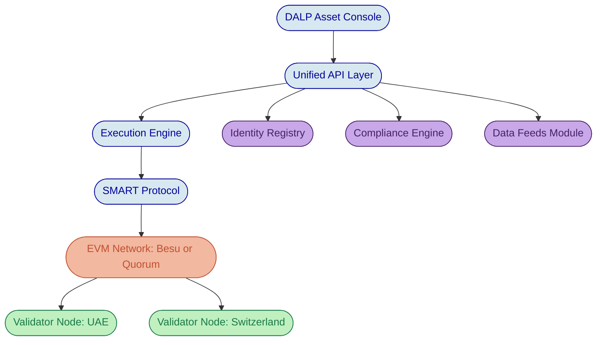

# Response to Request for Information: Tokenized Gold Platform

## AurelionVault Commodities Trading DMCC and SwissSecure Bullion AG

## RFI Reference: AV-RFI-2026-003

---

# Executive Summary

Gold-backed digital tokens represent one of the most promising applications of asset tokenization, yet the practical challenges of building a production-grade platform are routinely underestimated. Minting a token that references gold is straightforward. The real difficulty lies in maintaining verifiable linkage between digital tokens and physical metal in secure vaults, enforcing multi-jurisdictional compliance across DMCC and FINMA frameworks simultaneously, bridging digital lifecycle operations with physical custody logistics, and providing the operational confidence that institutional investors and regulators demand before committing capital. This is the complexity of doing tokenization right at institutional scale.

SettleMint's Digital Asset Lifecycle Platform (DALP) is purpose-built to address this complexity. DALP provides a configurable, compliance-first infrastructure for issuing, managing, and servicing gold-backed digital tokens across the full asset lifecycle, from token creation through physical redemption. The platform enforces compliance at the smart contract level before every transfer executes, maintains collateral verification linkage between token supply and physical reserves, and integrates with external pricing sources for real-time NAV representation.

This response details how DALP addresses each area of the RFI, with particular attention to the allocated and unallocated gold structures, dual-jurisdiction compliance enforcement, collateral verification, physical redemption workflows, and vault management integration. Where capabilities require integration with external systems or operational processes outside the platform's scope, this response states those boundaries directly.

DALP's precious metals asset class, combined with its composable compliance framework and multi-jurisdiction identity verification, positions it as a strong fit for the AurelionVault and SwissSecure joint venture. The platform enables initial gold token issuance within four to eight weeks of project kickoff, with the compliance and operational infrastructure required for institutional participation from day one.

*Figure 1: DALP Dashboard showing a global asset distribution view, providing operations teams with real-time visibility across vaulting jurisdictions and investor geography.*

---

# Section 1: Platform Capabilities

## 1.1 Gold-Backed Token Issuance

DALP supports gold-backed digital tokens through its Precious Metal asset class, which is purpose-built for commodity-backed instruments where each token represents a claim on physical metal held in custody. The platform maintains the relationship between physical gold inventory and token supply through its collateral verification module, a compliance-level control that prevents token minting when verified physical holdings are insufficient to back the requested supply increase.

The issuance workflow begins in DALP's Asset Designer, where operators configure the token parameters: metal type (gold, silver, platinum), unit of account (troy ounces), denomination granularity (down to fractional ounces for retail accessibility), and compliance rules governing who may hold tokens and under what conditions. The Asset Designer presents these configuration options through a guided workflow that does not require blockchain development expertise. Compliance officers and operations teams select from pre-audited modules covering investor eligibility, jurisdictional restrictions, collateral requirements, and transfer controls.

Once configured, the token is deployed through DALP's Asset Factory, which ensures every token inherits the correct security model, compliance hooks, and access control structure. The factory deploys the token as a UUPS proxy contract on the EVM-compatible network, initializes the compliance engine, binds the token to the platform's Identity Registry, and assigns initial operational roles.

Minting (creating new tokens) is a controlled operation restricted to authorized roles. Before any mint executes, the platform's compliance engine evaluates the collateral module: the mint proceeds only if the collateral ratio is satisfied, meaning verified gold holdings equal or exceed the value of tokens that would be in circulation after minting. This enforcement occurs at the smart contract level, not in application logic, so it cannot be bypassed through direct blockchain interaction.

*Figure 2: DALP Asset Designer, compliance module selection step. Operators choose collateral verification, country restrictions, investor eligibility, and transfer controls during token configuration.*

## 1.2 Allocated and Unallocated Gold Structures

DALP supports the representation of gold-backed tokens with collateral tracking at the asset level through its collateral verification module. The platform records the aggregate collateral backing for the token (total verified gold ounces in custody) and enforces that total token supply does not exceed the verified physical inventory, measured in basis points against the collateral ratio.

It is important to be precise about the boundary between what DALP provides natively and what the allocated/unallocated distinction requires.

**What DALP provides natively:** The platform tracks collateral at the token-asset level. The collateral module verifies that total minted supply is backed by attested physical reserves. This is sufficient for an unallocated gold model, where token holders have a proportional claim on pooled vault inventory and the critical control is aggregate supply versus aggregate reserves.

**What requires additional design:** The distinction between allocated gold (where specific bars, identified by serial number and assay certificate, are assigned to individual token holders) and unallocated gold (pooled claims) is a data model distinction that goes beyond DALP's native collateral tracking. Mapping individual bar serial numbers to specific holder positions, enabling conversion from unallocated to allocated upon reaching minimum bar weight thresholds, and maintaining that assignment through secondary market transfers requires custom metadata structures and operational workflows. DALP's configurable metadata schema can store bar-level data (serial numbers, assay references, LBMA Good Delivery status) at the token level, and the platform's API supports building custom allocation logic. However, the bar-to-holder mapping with automatic conversion triggers is not a shipped out-of-the-box feature.

For the joint venture's purposes, we recommend a phased approach: launch with the unallocated model using DALP's native collateral verification, then build the allocated mapping layer as a second phase using the platform's metadata and API capabilities.

## 1.3 Collateral Verification

DALP's collateral verification module is the enforcement mechanism that ensures token supply never exceeds verified physical gold holdings. The module operates at the smart contract level and is evaluated before every minting operation.

The collateral module is configured with two key parameters: the collateral ratio (expressed in basis points, where 10,000 basis points equals 100%) and the claim topic that identifies valid collateral attestations. For a gold-backed token with full backing, the ratio is set to 10,000, meaning every outstanding token must be matched by one unit of verified collateral.

Collateral attestation follows DALP's claims-based verification model. A trusted issuer, typically the vault operator or an independent auditor, issues a signed claim attesting to the quantity of physical gold held. This claim is recorded on-chain and is verifiable by any participant. The collateral module checks this claim during mint operations: if the attested gold quantity multiplied by the ratio would be exceeded by the post-mint token supply, the transaction reverts.

For ongoing verification, the platform supports periodic attestation workflows where the trusted issuer updates the collateral claim to reflect current vault inventory. This attestation can be triggered on a scheduled basis (daily, weekly, or as vault inventory changes) and the results are visible to all platform participants.

**Boundary note:** DALP provides the on-chain enforcement and attestation infrastructure. The actual physical audit of vault contents, bar counting, and weight verification is performed by the vault operator or independent auditor. DALP records and enforces the result of that verification, not the physical inspection itself. Integration between the vault management system and DALP's attestation API requires a synchronization layer, which is an integration project rather than a configuration step.

## 1.4 Precious Metals Pricing Integration

DALP's data feeds module supports integration with external pricing sources for precious metals. The platform can consume price data from multiple providers, including LBMA Gold Price feeds, Comex settlement prices, and market data services such as Reuters.

Price feeds are configured per token and can accept data through two pathways: push-based (where an external service writes price updates through the DALP API) and oracle-based (where on-chain price feeds are consumed by the platform). The feeds module records each price update with a timestamp, enabling NAV calculations for the gold-backed token.

**Staleness detection:** DALP's feeds module tracks the timestamp of the most recent price update. Operators configure staleness thresholds (for example, a 15-minute window during market hours), and the platform generates alerts when the most recent price update exceeds the threshold. This detection capability is available through the platform's monitoring and alerting infrastructure.

**Boundary note on circuit breakers:** The RFI asks about automated circuit breakers that pause trading when price feeds diverge by more than a defined percentage. DALP does not include a native circuit breaker mechanism that automatically halts transfers based on price feed divergence logic. The platform can detect price staleness and alert operations teams, but the automated response of pausing all token operations based on multi-source price comparison would require custom orchestration logic built on top of DALP's API. The platform provides the data infrastructure and compliance control surface; the automated response policy sits in the operational workflow layer.

## 1.5 Physical Redemption Workflows

Physical redemption of gold is a multi-step process that spans the digital platform and the physical logistics chain. DALP handles the token-side of redemption and provides the compliance and audit infrastructure; physical logistics coordination sits outside the platform's scope.

**What DALP manages:**

The redemption workflow begins when a token holder submits a redemption request through the platform. DALP verifies the holder's eligibility: sufficient token balance, valid identity claims, no transfer restrictions blocking the redemption, and compliance with any minimum redemption thresholds (for example, 1 kg gold minimum for physical delivery). If all checks pass, the platform places a hold on the tokens pending operational confirmation. Once the physical delivery is confirmed by the vault operator (through an API callback or manual confirmation in the platform), DALP burns the tokens, permanently removing them from circulation and reducing the total supply. The burn operation is recorded in the immutable audit trail, creating a verifiable link between the digital token retirement and the physical delivery event.

**What falls outside DALP's scope:**

Logistics coordination (selecting a shipping provider, arranging insured transport), insurance confirmation for the shipment, customs documentation for cross-border deliveries, and physical delivery tracking are not platform functions. These operational processes are managed by the vault operator and logistics partners. DALP provides the compliance checkpoint, token hold, and burn mechanism; the physical fulfillment chain is orchestrated by the joint venture's operations team, with DALP recording the outcome for audit purposes.

*Figure 3: DALP Precious Metal detail view, showing token supply, collateral status, and lifecycle operations for a gold-backed instrument.*

---

# Section 2: Compliance and Regulatory

## 2.1 Dual-Jurisdiction Compliance Enforcement

DALP's composable compliance architecture is designed for multi-jurisdictional enforcement. The platform supports twelve compliance module types organized across six categories, and these modules compose through sequential evaluation: every active module must pass for a transfer to succeed. A single module veto blocks the transfer.

For the AurelionVault and SwissSecure joint venture, the compliance configuration would include:

**Country allow list:** Configured to permit investors from the UAE, Switzerland, and approved GCC jurisdictions. The module evaluates the investor's jurisdiction claim (attested through the identity verification process) against the allowed list before every transfer.

**Identity verification with jurisdiction-specific rules:** DALP supports configurable boolean expressions over claim topics, enabling different eligibility rules for different investor categories. For UAE-based investors, the expression can require DMCC-compliant KYC and AML claims. For Swiss-based investors, the expression can require FINMA-compliant verification claims. These expressions use Reverse Polish Notation (RPN) logic, supporting AND, OR, and NOT combinations without custom code.

**Investor count limits:** If regulatory frameworks impose maximum holder counts (as some securities frameworks do), per-country sub-limits can be configured alongside global caps.

**Transfer restrictions:** Time-lock modules enforce minimum holding periods where required by regulation. Transfer approval modules can require manual authorization for transfers above certain thresholds.

The critical architectural point is that these modules enforce at the smart contract layer. A transfer that fails any compliance check reverts before execution. There is never a window where tokens exist in a non-compliant state.

**Deployment topology for data residency:** The RFI asks about data residency across UAE and Switzerland. DALP supports deployment in specific cloud regions or on-premises environments. Maintaining split data residency (UAE investor data in UAE infrastructure, Swiss investor data in Swiss infrastructure) within a single token deployment requires a multi-deployment architecture decision. This is a deployment topology design choice made during implementation, not a simple configuration toggle. The joint venture would need either separate DALP deployments per jurisdiction with bridge mechanisms, or a single deployment in a jurisdiction acceptable to both regulators, with data handling agreements covering the cross-border aspects.

## 2.2 Investor Eligibility Verification

DALP implements on-chain identity verification through OnchainID, a decentralized identity protocol based on the ERC-734/ERC-735 standards. Every investor on the platform is represented by an on-chain identity contract that stores verifiable claims attested by trusted issuers.

For the joint venture's tiered investor categories:

**Institutional investors (enhanced due diligence):** The identity verification workflow requires a full set of claim attestations: KYC completion, AML clearance, accredited or institutional investor status, source of funds verification, and institutional due diligence documentation. These claims are issued by trusted verification providers registered in DALP's Trusted Issuers Registry. Only investors whose identity contracts carry the full set of required claims can receive and hold tokens.

**Qualified retail investors (simplified KYC):** A different claim expression is configured, requiring standard KYC and AML claims but not the enhanced institutional due diligence. The compliance module distinguishes between investor tiers based on which claims are present, enforcing the appropriate eligibility rules automatically.

Claims include expiration timestamps, enabling automatic enforcement of re-verification requirements. An expired KYC claim blocks transfers until the investor completes re-verification, with no manual exception process unless specifically configured.

*Figure 4: On-chain identity record in DALP, showing verified claims attached to an investor identity. Each claim is traceable to the trusted issuer that created it.*

## 2.3 AML/CFT Capabilities

DALP provides the infrastructure for AML/CFT compliance through several integrated capabilities:

**Transfer-path enforcement:** Every token transfer passes through the compliance engine before execution. The compliance modules evaluate sender and recipient identity claims, jurisdictional eligibility, and any configured transfer restrictions. This ex-ante enforcement model means non-compliant transfers are blocked, not flagged after the fact.

**Address block list:** DALP supports explicit wallet address blocking, enabling integration with sanctions screening outputs. When a sanctions screening service identifies a flagged address, the address block list module prevents that address from sending or receiving tokens. Updates to the block list take effect immediately for all subsequent transfer attempts.

**Audit trail:** Every platform action, including identity verification events, claim issuance and revocation, transfer attempts (both successful and rejected), minting and burning operations, and compliance module updates, is recorded in an immutable audit trail. This trail provides the evidential basis for regulatory examinations and suspicious activity investigations.

**Integration boundary:** DALP provides the enforcement and recording infrastructure, but ongoing transaction monitoring (pattern analysis, behavioral scoring) and suspicious transaction report (STR) generation are typically handled by specialized AML/CFT monitoring solutions. DALP integrates with these systems through its API, providing the transaction data they need for monitoring and receiving screening results for enforcement. Pre-built connectors to specific AML monitoring vendors are not shipped; this is an integration project.

## 2.4 Proof-of-Reserve and Audit Support

DALP supports proof-of-reserve attestation through its collateral verification infrastructure and claims-based attestation model.

The attestation workflow operates as follows: a third-party auditor verifies the physical gold holdings at each vault location. The auditor (registered as a trusted issuer in DALP) issues a signed collateral claim recording the verified gold quantity, the audit date, the vault location, and any qualifications. This claim is recorded on-chain and is visible to all token holders through the platform's transparency features.

Attestation results can be published at configurable intervals (quarterly, monthly, or on-demand). Each attestation creates a verifiable, timestamped record that token holders and regulators can independently verify. The collateral module continuously enforces that token supply does not exceed the most recently attested reserve quantity.

For regulatory access, DALP supports dedicated read-only access configurations. Regulators or supervisory bodies can be granted platform access scoped to audit trail viewing, collateral attestation verification, and compliance module inspection, without the ability to execute operational actions.

---

# Section 3: Operations and Integration

## 3.1 Vault Management System Integration

Integration between DALP and the joint venture's vault management systems is achieved through DALP's API layer. The platform exposes typed REST APIs for all operational functions, including collateral attestation updates, mint and burn operations, and metadata management.

For inventory reconciliation, the integration pattern works as follows: the vault management system (whether a custom ERP or specialized vault software) reports inventory changes to DALP through the attestation API. DALP records the updated collateral position and enforces it in subsequent mint operations. This can be automated on a scheduled basis (daily reconciliation) or triggered by inventory events (new bars received, bars allocated for delivery).

**Automation versus manual processes:** The API integration can automate the data flow from vault systems to DALP, but the degree of automation depends on the vault management system's capabilities. If the vault system can produce machine-readable inventory reports, the reconciliation can be fully automated. If the vault operator relies on manual counting or paper-based records, a human step translates physical audit results into API calls.

**Boundary note:** DALP does not include pre-built connectors to specific vault management systems or ERPs. Every vault system integration is a custom integration project using DALP's documented APIs. The API surface is well-documented and designed for external system integration, but plug-and-play connectivity with specific vault software does not exist as a shipped feature.

## 3.2 Secondary Market Transfers

DALP supports peer-to-peer token transfers with compliance enforcement at the smart contract layer. When a token holder initiates a transfer, the compliance engine evaluates twelve potential dimensions before execution: the recipient's identity claims (KYC status, jurisdiction, investor category), any active transfer restrictions (time-locks, approval requirements), country eligibility against the configured allow list, and investor count limits. Every active module must pass; a single veto blocks the transfer and reverts the transaction.

This architecture provides secondary market liquidity within a governance framework that most gold platforms struggle to achieve. Traditional commodity token platforms either enforce compliance in application logic (which can be bypassed through direct blockchain interaction) or impose blanket transfer restrictions that eliminate liquidity. DALP's on-chain enforcement model allows free movement between verified participants while maintaining the regulatory controls that institutional investors require.

**Boundary note on order matching:** DALP is not a trading venue and does not include a native order book, matching engine, or marketplace listing system. The platform enables compliant token transfers, but the price discovery and trade matching function (where a seller lists tokens at a price and a buyer discovers and accepts the listing) requires an external exchange, OTC platform, or marketplace integrated with DALP. The platform ensures compliance on every transfer; the trading venue provides the market mechanism.

## 3.3 NAV Calculation and Reporting

DALP's data feeds module supports NAV representation for gold-backed tokens. Price feeds from external providers are recorded on the platform with timestamps, and the per-token NAV can be derived from the current gold price multiplied by the unit backing ratio.

The platform provides reporting capabilities through its API and investor-facing views, showing current token value based on the most recent price feed, historical price data, and collateral attestation status. Investors can view their holdings valued at current market prices.

**Boundary note:** Complex NAV calculations that involve multiple cost components (storage fees, insurance premiums, management fees) are outside the platform's native calculation engine. DALP can consume a pre-calculated NAV from an external administrator or pricing service and display it to investors, but the multi-component NAV calculation itself is performed in the fund administrator's or operator's systems.

## 3.4 Multi-Currency Settlement

DALP supports multi-currency environments through its stablecoin and deposit asset classes. Token purchases and redemptions can be settled using platform-native stablecoins (representing fiat currencies such as AED, CHF, USD, or EUR) through the XvP (Exchange versus Payment) settlement mechanism. The XvP extension coordinates atomic exchanges where the gold token and the payment token transfer simultaneously or both revert, achieving delivery-versus-payment settlement finality without intermediary risk.

For fiat currency settlement through banking rails, DALP integrates with external payment systems through its API. The platform records the payment confirmation and releases the corresponding tokens. This integration depends on the payment infrastructure available in each jurisdiction.

---

# Section 4: Technical Architecture

## 4.1 Blockchain Infrastructure

DALP is purpose-built for EVM-compatible blockchain networks. The platform supports deployment on Ethereum mainnet, Polygon, Hyperledger Besu, Quorum, and other EVM-compatible networks. For the joint venture, a permissioned network (such as Hyperledger Besu or Quorum) provides the combination of institutional-grade permissioning, high transaction throughput, and confidentiality controls appropriate for regulated commodity tokenization.

The permissioned network can be configured with consensus mechanisms appropriate for the use case: IBFT 2.0 (Istanbul Byzantine Fault Tolerant) for immediate finality, or QBFT for improved performance. Validator nodes can be operated by the joint venture participants and, optionally, by designated regulators for supervisory transparency.

Network topology is configured during deployment. For the dual-jurisdiction setup, nodes can be hosted in data centers in both the UAE and Switzerland, providing geographic distribution and resilience.

*Figure 5: High-level DALP architecture for the gold tokenization platform, showing the four platform layers and dual-jurisdiction network topology.*

## 4.2 Availability and Disaster Recovery

DALP is designed for high-availability deployment with the following specifications:

**Availability target:** 99.9% uptime for platform services. The underlying blockchain network availability depends on the number and distribution of validator nodes; a network with four or more validators across two geographic regions provides resilience against individual node failures.

**Disaster recovery:** The platform supports configurable backup and recovery strategies. Application-layer data is backed up continuously to secondary storage, with recovery point objectives (RPO) and recovery time objectives (RTO) determined by the infrastructure deployment choices. Blockchain data is inherently replicated across all network nodes, providing built-in redundancy for the on-chain ledger.

**Failover:** Multiple application instances can be deployed behind load balancers for automatic failover. The blockchain network's consensus mechanism provides inherent fault tolerance: with IBFT 2.0, the network continues operating as long as two-thirds of validators are available.

## 4.3 API Capabilities

DALP is API-first by design. The platform exposes typed REST APIs for all operational functions, including token lifecycle management (mint, burn, transfer), compliance module configuration and querying, identity management and claim operations, data feed ingestion, reporting and audit trail queries, and settlement operations.

The API surface supports integration with the joint venture's existing trading and risk management systems. All API endpoints are authenticated, rate-limited, and audited. SDKs and API documentation are provided for integration development.

*Figure 6: DALP API key management, providing secure, scoped API access for integration with external trading and risk management systems.*

## 4.4 Data Residency

DALP supports deployment in specific cloud regions or on-premises data centers, enabling compliance with data residency requirements. For the UAE and Switzerland dual-jurisdiction setup, the deployment topology is determined during the implementation phase.

Options include a single deployment in one jurisdiction with appropriate data processing agreements covering cross-border data flows, or separate deployments per jurisdiction with synchronization mechanisms. The choice depends on the specific regulatory requirements of DMCC and FINMA regarding where investor data and transaction records must reside. DALP's architecture supports both models; the selection is an implementation design decision made in consultation with the joint venture's regulatory counsel.

---

# Section 5: Implementation

## 5.1 Implementation Timeline

DALP's configuration-driven approach enables rapid deployment compared to custom-built alternatives. A representative timeline for the gold tokenization platform:

| Phase | Duration | Key Activities |
| --- | --- | --- |
| Discovery and design | 2 weeks | Requirements finalization, compliance rule design, network architecture, vault integration mapping |
| Platform deployment | 1 to 2 weeks | Network setup, DALP installation, environment configuration, identity provider integration |
| Token configuration | 1 week | Gold token design, compliance module selection and configuration, collateral module setup, role assignment |
| Integration development | 2 to 3 weeks | Vault management system API integration, price feed connectivity, KYC provider integration |
| Testing and validation | 2 weeks | End-to-end testing, compliance scenario testing, load testing, security validation |
| Pilot launch | 1 week | Controlled launch with initial institutional participants, monitoring, operational readiness confirmation |

**Total estimated timeline: 9 to 12 weeks from project kickoff to pilot launch.** The four-to-eight-week core platform deployment is extended by the vault management integration and multi-jurisdiction compliance configuration, which are specific to this use case.

## 5.2 Support and Maintenance

SettleMint provides ongoing platform support structured around operational continuity. This includes software updates and security patches delivered through managed upgrade cycles, platform monitoring with proactive incident detection and response, technical support with severity-based SLA response times (critical issues within one hour, standard issues within four business hours), and compliance module updates when regulatory frameworks change. Enterprise clients receive dedicated support channels and a named technical account manager who understands the deployment context and can expedite resolution for production-critical issues.

## 5.3 Pricing Model

SettleMint's pricing follows a platform licensing model. Specific pricing is provided during commercial discussions following the RFI evaluation phase. The licensing model typically includes a platform license fee (annual or multi-year), implementation services for initial deployment and integration, and ongoing support and maintenance fees. Transaction-based pricing components may be applicable depending on the deployment model and expected volumes.

---

# Why DALP for Gold Tokenization

The institutional challenge with gold tokenization, as with all serious asset tokenization, is not the technology of representing gold as a token. Many platforms can mint a gold-backed token. Far fewer can maintain verifiable collateral linkage that auditors trust, enforce DMCC and FINMA compliance simultaneously without custom code, manage the operational bridge between digital tokens and physical metal across two vault jurisdictions, and provide the audit trail that satisfies both regulators and institutional risk committees.

DALP addresses this by treating compliance, collateral verification, and lifecycle management as first-class platform capabilities rather than integration afterthoughts. The composable compliance framework adapts to the specific regulatory requirements of DMCC and FINMA without custom development. The collateral module enforces reserve backing at the smart contract level. The identity infrastructure supports tiered investor categories across jurisdictions. And the API-first architecture enables integration with vault management systems, pricing sources, and settlement infrastructure.

Where capabilities require external integration or operational processes outside the platform's scope, this response has stated those boundaries explicitly. That transparency reflects SettleMint's approach: precise about what the platform delivers natively, clear about where integration work is required, and honest about the implementation decisions that the joint venture's team will need to make.

*Figure 7: DALP Compliance Policy Expression Builder, enabling compliance officers to define multi-jurisdictional eligibility rules through visual configuration without custom smart contract code.*
