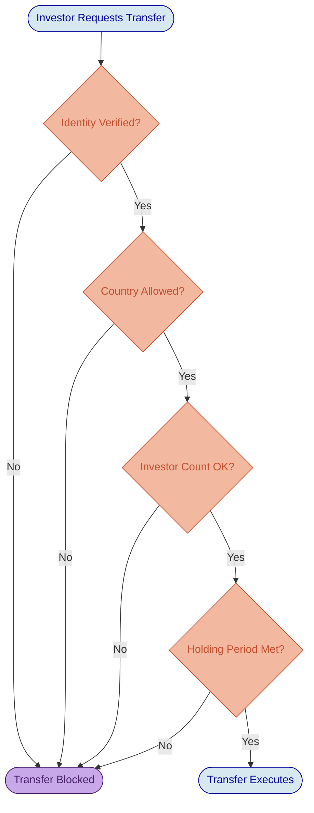
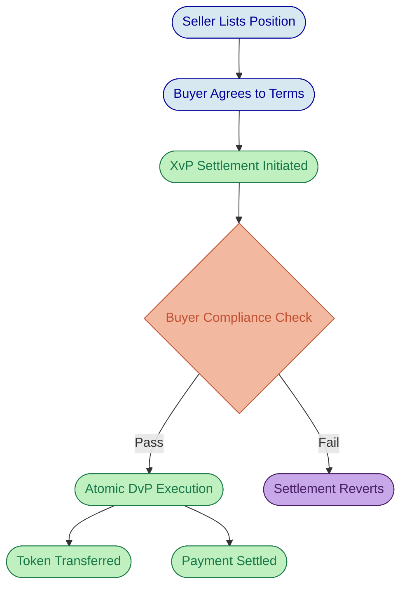

# Real Estate Tokenization on DALP

# Property Tokenization: From Fractional Ownership to Institutional-Grade Operations

Real estate has always been one of the most compelling candidates for tokenization. The asset class combines high value with chronic illiquidity, creating a natural tension: investors want exposure to property returns, but the capital requirements and transfer friction of traditional ownership structures exclude most participants. Tokenization resolves that tension by representing property interests as digital tokens on a blockchain, enabling fractional ownership, automated income distribution, and compliant secondary transfers.

What tokenization does not solve is the operational complexity that follows. Running a tokenized real estate program at institutional scale requires identity verification for every investor, compliance enforcement across multiple jurisdictions, automated distribution calculations for thousands of holders, governance infrastructure for property decisions, and an audit trail that satisfies regulators and auditors alike. Most teams discover this complexity only after committing to build it themselves. DALP exists to solve it, so institutions can focus on property strategy rather than reinventing tokenization infrastructure.

This deep-dive examines how DALP handles real estate tokenization across every critical dimension: property-to-token mapping, SPV structuring, rental yield distribution, compliance enforcement, valuation integration, secondary market mechanics, and regulatory alignment across multiple jurisdictions.

---

## Property-to-Token Mapping and SPV Structure

The foundational design decision in any real estate tokenization program is how the physical asset maps to digital tokens. DALP supports a model where each property is held within a dedicated Special Purpose Vehicle (SPV), and the SPV's equity interests are represented as tokens on the platform. This structure preserves the legal isolation that institutional investors and regulators expect: liabilities associated with one property do not flow to holders of another, and the token represents a genuine economic interest rather than a derivative or synthetic claim.

DALP's RealEstate asset preset deploys a unified, upgradeable token contract built on the ERC-3643 standard, with a fixed supply cap enforced by the CappedComplianceModule. The total token supply represents the full property valuation, and each token corresponds to a proportional ownership share. A USD 25 million office building, for example, might be tokenized as 250,000 tokens at USD 100 each, giving investors granular entry points while maintaining a clear link between token supply and property value.

The platform's premint mechanism is particularly relevant for real estate. When a RealEstate token is deployed, the factory mints the entire supply to a designated recipient and then pauses the contract. The cap locks to the preminted amount, ensuring that the circulating supply remains fixed unless governance explicitly raises it through a controlled administrative operation requiring the governance role. This design prevents accidental dilution, gives property sponsors confidence that token economics mirror the legal ownership structure, and provides regulators with a verifiable constraint on issuance.

Property metadata, including location identifiers, district codes, and area references, is captured during the asset creation process through the Asset Designer. DALP issues an on-chain location claim (using the ERC-735 claim standard via OnchainID) against the token's identity, making property-level information queryable by dashboards, registries, and investors. Supporting documents such as purchase agreements, operating agreements, building inspections, and insurance policies are hashed and linked to the token metadata, creating a permanent, tamper-evident record of the property's documentation history.

The practical implication for institutions is significant. Instead of months of custom smart contract development, security audits, and deployment cycles, a property sponsor configures the token through the Asset Designer wizard and deploys in hours. The resulting contract inherits the same ERC-3643 compliance engine, access control model, and lifecycle infrastructure that DALP provides across all asset classes. No other approach delivers this combination of speed, standardization, and regulatory alignment for property tokenization.

*Figure 1: DALP real estate asset detail view, displaying property valuation, token supply, and investor metrics for an institutional commercial property.*

---

## Fractional Ownership and Investor Access

Fractional ownership transforms real estate from an exclusive asset class into an accessible one. DALP enables investors to purchase as few as 10 tokens, reducing the minimum investment from millions to thousands of dollars. The platform enforces maximum ownership percentages through compliance modules, maintaining the distributed ownership structure that securities regulations and property governance frameworks typically require.

The real value of fractional ownership is not just lower entry points. It is the operational infrastructure that makes small-position management viable at scale. When a property has 5,000 token holders instead of 5 limited partners, every operational process must scale accordingly: income distributions, compliance monitoring, governance participation, and investor communications all need to work without manual intervention per holder. DALP's automated lifecycle management handles this scaling challenge natively, turning what would be a back-office nightmare under traditional structures into a configured, repeatable process.

Investor eligibility is enforced at the smart contract level through DALP's ERC-3643 compliance engine. Every prospective token holder must have a verified on-chain identity (OnchainID) with claims attested by trusted issuers. The platform supports tiered investor categories through configurable claim expressions using Reverse Polish Notation (RPN). A US offering under Regulation D might require `[KYC, AML, AND, ACCREDITED, AND]`, meaning the investor must hold valid KYC, AML, and accredited investor claims simultaneously. A European offering under MiFID II might substitute qualified investor requirements with a different claim topic configuration. These rules evaluate before every transfer, not after. A non-compliant transfer simply does not execute, and there is never a state where tokens reside in an unauthorized wallet.

This ex-ante enforcement model is what separates DALP from platforms that perform compliance checks in application logic before submitting transactions. Application-level compliance can be bypassed by anyone with direct blockchain access, a fundamental architectural weakness for regulated real estate securities. DALP's on-chain enforcement is the rules, not a suggestion layer on top of them.

*Figure 2: DALP compliance evaluation sequence for real estate token transfers. Every module must approve before execution proceeds; a single veto blocks the transfer atomically.*

---

## Rental Yield Distribution

Rental income distribution is where real estate tokenization either delivers on its promise or collapses under operational weight. Traditional property funds process distributions through manual spreadsheet calculations, bank wire instructions, and reconciliation cycles that consume days of back-office effort for each payment period. DALP replaces this with an automated distribution mechanism that reduces weeks of operational work to a configured, repeatable process.

The distribution workflow follows a clear separation of responsibilities. Monthly rental income from tenants flows into the property sponsor's treasury. After deducting property management fees, maintenance reserves, and applicable taxes, the net distributable amount is calculated off-platform. DALP does not include a native tax calculation engine; the tax and fee arithmetic is the sponsor's responsibility or that of their fund administrator. This is not a gap in the platform. It reflects the correct separation of concerns between tokenization infrastructure and property accounting, where specialized systems handle jurisdiction-specific tax rules and the platform handles entitlement calculation and execution.

Once the net distributable amount is determined, the sponsor configures the distribution through DALP. The platform calculates each token holder's entitlement based on their proportional ownership at the relevant record date. Historical balance snapshots, provided by the Historical Balances token feature, capture the exact ownership distribution at any point in time, ensuring accuracy even when transfers occurred close to the record date.

Token holders claim their distributions through the platform's pull-based mechanism. Rather than pushing payments to thousands of wallets simultaneously, which creates gas cost spikes and potential delivery failures, DALP records entitlements and allows holders to claim when ready. This model is operationally cleaner and aligns with how traditional dividend processes work: entitlements are calculated and recorded, then investors collect through their preferred channel. For a property with 5,000 token holders receiving monthly distributions, this means the sponsor executes one distribution configuration rather than 5,000 individual wire transfers.

*Figure 3: Event history for a real estate token, displaying distribution events, minting operations, and compliance updates in chronological order.*

---

## Valuation and NAV Updates

Property valuation drives token pricing, investor reporting, and regulatory compliance. DALP supports valuation updates through its administrative portal, where authorized operators update the property's appraised value based on external appraisals. When a new valuation is recorded, the implied per-token value adjusts accordingly, and investors see the updated figure through their portfolio dashboard in real time.

The platform's data feed infrastructure can consume external pricing or valuation data through API integration. For real estate programs that engage independent appraisal firms, DALP can receive valuation updates programmatically rather than through manual entry. Automated multi-source valuation comparison with discrepancy flagging (for instance, reconciling valuations from three independent appraisers and alerting when they diverge beyond a threshold) is not a shipped feature. The platform consumes the valuation that the sponsor provides; reconciliation logic between competing appraisals is an operational decision outside the tokenization layer.

Annual or quarterly appraisal cycles are the norm for institutional real estate. DALP supports whatever frequency the sponsor configures, from monthly mark-to-market updates for listed property funds to annual appraisals for private holdings. The continuous visibility this provides is a meaningful improvement over traditional structures, where investors wait 90 days for a PDF report to understand how their property investment is performing. On DALP, that information is always current.

---

## Compliance Architecture for Real Estate

Real estate tokenization operates at the intersection of two regulatory domains: securities law and property law. A token representing fractional property ownership is almost certainly a security, which means it falls under the regulatory jurisdiction of securities authorities. The underlying property is simultaneously subject to real estate regulations that vary dramatically by jurisdiction. DALP's compliance framework addresses both dimensions through its modular, composable compliance engine, which provides 12 compliance module types that can be combined, configured per token, and updated after deployment without contract redeployment.

### Securities Compliance

For a typical real estate tokenization, the following modules form the compliance backbone:

**Identity Verification** ensures every investor has a verified OnchainID with claims attested by trusted KYC/AML providers. The module supports configurable claim expressions using Reverse Polish Notation, enabling complex eligibility logic that encodes different regulatory requirements without custom smart contract development. A Regulation D offering in the United States, a MiFID II offering in Europe, and a VARA-regulated offering in the UAE each require different claim combinations, and all three can be configured through the same module with different parameters.

**Country Allow List and Block List** modules enforce jurisdictional restrictions at the transfer level. Every transfer validates the recipient's country claim against the configured list. A property tokenized under UAE regulations might allow investors from GCC countries and select European jurisdictions while blocking all OFAC-sanctioned countries, and these restrictions are enforced on-chain, not in application logic.

**Investor Count** caps unique holders, critical for private placement exemptions. US Regulation D offerings under Rule 506(b) limit non-accredited investor participation, and the module enforces these limits at the smart contract level with support for per-country sub-limits (for instance, a maximum of 500 investors globally and 100 per country).

**Time Lock** enforces minimum holding periods with FIFO batch tracking. Real estate investments commonly require 12-month or longer lock-up periods before secondary transfers are permitted. The module tracks acquisition dates per batch and releases tokens for transfer only after the configured holding period expires, preventing early exits that would violate securities exemptions.

**Transfer Approval** adds a maker-checker gate for transfers that require explicit operational approval, such as large block transfers or transfers to new investor categories.

### Property Law Compliance

Property-specific regulations, such as RERA requirements in the UAE, foreign ownership zone restrictions, and FIRPTA withholding for non-US investors transacting in US property, require a layered approach. DALP's compliance modules handle the securities-layer enforcement natively. Property-law requirements that go beyond the module catalog, such as calculating FIRPTA withholding amounts or verifying compliance with specific RERA provisions on land use restrictions, require integration with external legal compliance systems or custom module development using the platform's ISMARTCompliance extension interface.

The platform's jurisdiction-aware compliance templates offer pre-configured module combinations for common regulatory frameworks. For a multi-jurisdictional portfolio, operators configure different compliance templates per token, ensuring that each property's regulatory context is accurately reflected in the on-chain enforcement rules. When regulations change (and they do), compliance modules can be updated through governed administrative operations requiring the governance role, without redeploying the token contract.

*Figure 4: Investor verification status for a real estate token, showing KYC/AML compliance states and identity claim attestations from trusted issuers.*

*Figure 5: Compliance module selection during real estate token creation. Operators choose from 12 module types, each independently configurable for the property's regulatory requirements.*

---

## Secondary Market Transfers and Settlement

Liquidity is perhaps the single most transformative benefit that tokenization brings to real estate. Traditional property investments are notoriously illiquid: selling a position typically requires selling the entire property, a process that takes months and involves significant transaction costs. Tokenized real estate enables position-level transfers between qualified investors, creating liquidity at the investor level without requiring property disposition.

DALP supports peer-to-peer secondary transfers with full compliance enforcement. When one investor transfers tokens to another, the compliance engine evaluates the recipient's identity, jurisdiction, accreditation status, holding period constraints, and every other configured rule before the transfer executes. If the recipient does not meet all requirements, the transfer reverts atomically. This ensures that secondary market activity cannot erode the compliance posture established during primary distribution, a guarantee that no off-chain compliance approach can match.

DALP is not a trading venue. It does not include an order book, a matching engine, or a marketplace interface where investors browse available listings and place orders. Creating a marketplace experience with price discovery and order matching requires integration with an external exchange or over-the-counter trading platform that connects to DALP through its typed REST API. DALP serves as the settlement and compliance backbone for that marketplace, ensuring every trade that executes meets all configured rules. The platform handles the hard part (compliance validation and atomic settlement); the trading venue handles the commercial part (price discovery and order matching).

The XvP (Exchange versus Payment) settlement addon extends secondary market capability by enabling atomic Delivery-versus-Payment transactions. When a buyer and seller agree on terms, the XvP mechanism ensures that the token leg and the payment leg execute simultaneously or both revert. This eliminates counterparty risk and provides the settlement finality that institutional participants require. For real estate tokens specifically, where individual positions can represent significant value, atomic settlement removes the trust assumptions that manual settlement processes require.

*Figure 6: Atomic Delivery-versus-Payment settlement for real estate token secondary trades. The XvP mechanism ensures simultaneous execution of both legs or full reversion, eliminating counterparty risk.*

---

## Governance and Property Decisions

Real estate investments require ongoing governance: decisions about property disposition, major capital expenditure, property manager changes, and special assessments all affect token holder returns. DALP provides governance infrastructure through the Voting Power token feature (implementing the ERC-5805 standard), which gives token holders voting rights proportional to their holdings.

The platform supports proposal creation and token-weighted voting at the smart contract level. Historical balance snapshots establish the record date for each vote, preventing manipulation through last-minute token acquisition. Delegation is supported through the ERC-20 Votes standard, allowing investors to designate proxy voters when they choose not to participate directly. This mirrors the governance structures that institutional investors are familiar with from traditional REIT and fund structures, but with transparent, on-chain vote recording that eliminates the ambiguity of email-based or phone-based governance processes.

DALP's governance infrastructure provides the on-chain mechanics: proposal registration, vote recording, delegation tracking, and result calculation. Property-specific governance workflows, such as templates for repair proposals, capital improvement approvals, or special assessment notices, are not shipped as a built-in product feature. Sponsors who want purpose-built governance interfaces can develop custom front-end applications that interact with the underlying voting contracts, or integrate third-party governance tools. The on-chain infrastructure handles the hard engineering; the property-specific experience layer is an implementation choice that varies by program.

---

## Regulatory Frameworks: Multi-Jurisdictional Alignment

A real estate tokenization program spanning multiple jurisdictions must navigate overlapping and sometimes conflicting regulatory requirements. DALP's compliance architecture handles this through jurisdiction-specific compliance template configuration that can be applied independently to each property token.

### UAE (RERA, VARA, and ADGM)

The UAE has emerged as one of the most active jurisdictions for real estate tokenization. RERA governs property transactions in Dubai, VARA regulates virtual asset service providers, and ADGM provides a common-law regulatory framework in Abu Dhabi. DALP's compliance modules encode RERA requirements such as foreign ownership restrictions for specific zones, minimum holding requirements, and transfer notification obligations. The Country Allow List module restricts investor access by jurisdiction, and the Identity Verification module ensures that all investors meet KYC/AML standards mandated by UAE regulators. The platform's instrument templates include a Qatar/GCC real estate configuration with jurisdiction-specific metadata fields (city, district code, area ID), demonstrating the level of localization that institutional real estate programs require.

### European Union (MiFID II and MiCA)

Under European regulations, tokenized real estate interests qualifying as securities fall under MiFID II for secondary market conduct and under MiCA for crypto-asset-specific provisions. DALP's regulatory templates include pre-configured module combinations for EU compliance, covering qualified investor verification, jurisdictional restrictions, and reporting data requirements. The Token Supply Limit module supports MiCA's issuance cap provisions, encoding limits in currency terms through base-price conversion, so a EUR 8 million cap under MiCA is enforced as an on-chain constraint rather than an operational guideline.

### United States (Regulation D and Regulation S)

US real estate tokenization typically proceeds under Regulation D (domestic private placement) or Regulation S (offshore offering). DALP encodes these exemptions through compliance module configuration: Reg D offerings use the Investor Count module (configurable to the specific exemption limit), the Identity Verification module (with accredited investor claim requirements), and the Time Lock module (for the one-year holding period under Rule 144). Regulation S offerings configure the Country Block List to exclude US investors and impose additional transfer restrictions during the distribution compliance period. FIRPTA withholding for foreign investors requires integration with an external tax compliance system; DALP provides the transaction data and investor jurisdiction information, but the withholding calculation and remittance sit outside platform scope.

---

## Implementation and Deployment

Deploying a real estate token on DALP follows a structured process that mirrors institutional property transaction workflows. The typical timeline from configuration to first token transfer is four to eight weeks, most of which is consumed by legal structuring and investor verification rather than platform setup.

The property sponsor establishes the legal ownership structure (LLC, statutory trust, or equivalent vehicle) and defines token economics: total supply, price per token, minimum and maximum holdings, and distribution schedule. The compliance template is selected based on the target regulatory framework, and investor verification requirements are configured with the chosen KYC/AML provider.

DALP's Asset Designer guides the configuration process through a step-by-step wizard. Operators select the RealEstate asset type, configure property metadata (including location claims for dashboard and registry searchability), set the supply cap, choose from the 12 available compliance modules, define role-based permissions across seven per-asset roles, and review the full configuration before deployment. The factory deploys the smart contract, mints the full supply to the sponsor's designated wallet, and pauses the contract until the sponsor is ready to begin distribution.

Primary distribution proceeds through direct transfers to verified investors or through the Token Sale addon for structured offerings. In either case, the compliance engine validates every recipient before tokens move. Once primary distribution is complete, ongoing operations settle into a repeatable rhythm: rental distributions on the configured schedule, valuation updates at appraisal intervals, governance votes as property decisions arise, and secondary transfer facilitation through the compliance engine.

Every operation is recorded in an immutable on-chain audit trail, accessible to regulators, auditors, and supervisory authorities. For institutions accustomed to assembling audit evidence from multiple disconnected systems, this single-source-of-truth model represents a meaningful operational improvement.

*Figure 7: Token minting interface for a real estate asset, showing the supply management workflow with compliance validation before execution.*

---

## Capability Summary

Precision about capability boundaries builds trust with institutional evaluators. The following table distinguishes between native platform capability and areas requiring external integration.

| Capability | DALP Coverage | Integration Required |
| --- | --- | --- |
| Token creation and supply management | Native, through RealEstate preset with CappedComplianceModule | None |
| Compliance enforcement (KYC, jurisdiction, investor limits, holding periods) | Native, 12 configurable compliance modules with on-chain enforcement | KYC provider integration for identity claim issuance |
| Rental yield distribution | Native entitlement calculation and pull-based claim execution | Gross-to-net calculation (fees, taxes, reserves) performed off-platform |
| Property valuation updates | Native, through admin portal or API data feed | Appraisal data sourced from external valuers |
| Secondary transfers with compliance | Native peer-to-peer transfers with full compliance validation | Trading venue (order book, matching engine) requires external platform |
| Atomic DvP settlement | Native through XvP addon, T+0 finality | Cash leg settlement depends on payment rail integration |
| Governance voting | Native smart contract infrastructure (ERC-5805), delegation, historical snapshots | Property-specific governance UI and proposal templates require custom development |
| Investor portal and reporting | Native dashboard with real-time holdings, performance, and event history | Property management system integration for operational data |
| Audit trail | Native, immutable on-chain record of every mint, transfer, distribution, and compliance event | None |
| Tax withholding and calculations | Not included (intentional separation of concerns) | External tax compliance system required |
| Document management | Native metadata hashing and on-chain linkage | Document storage and retrieval via external document management system |

This separation is intentional and architecturally correct. DALP provides the tokenization, compliance, and lifecycle infrastructure. Property accounting, tax computation, and trading venue functionality belong in specialized systems that integrate with DALP through its typed REST API and webhook infrastructure. The result is a system where each component does what it does best, connected through well-defined interfaces rather than compromised by trying to do everything in a single platform.
