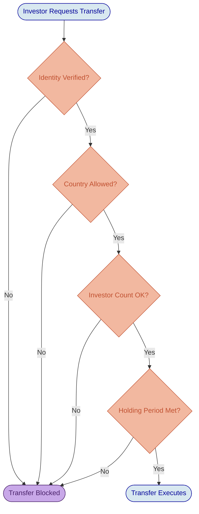
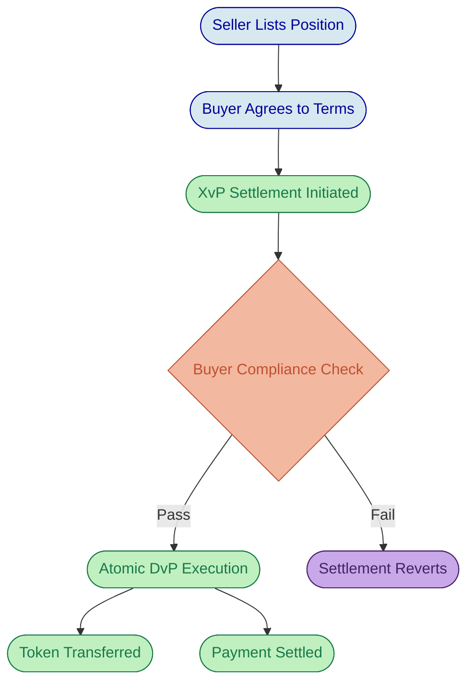

# Real Estate Tokenization on DALP

# Property Tokenization: From Fractional Ownership to Institutional-Grade Operations

Real estate has always been one of the most compelling candidates for tokenization. The asset class combines high value with chronic illiquidity, creating a natural tension: investors want exposure to property returns, but the capital requirements and transfer friction of traditional ownership structures exclude most participants. Tokenization resolves that tension by representing property interests as digital tokens on a blockchain, enabling fractional ownership, automated income distribution, and compliant secondary transfers. What tokenization does not solve, however, is the regulatory complexity, lifecycle management burden, and governance overhead that come with operating a real estate investment program at institutional scale. That is where DALP provides its value.

This deep-dive examines how DALP handles real estate tokenization across every critical dimension: property-to-token mapping, SPV structuring, rental yield distribution, compliance enforcement, valuation integration, secondary market mechanics, and regulatory alignment across multiple jurisdictions.

---

## Property-to-Token Mapping and SPV Structure

The foundational design decision in any real estate tokenization program is how the physical asset maps to digital tokens. DALP supports a model where each property is held within a dedicated Special Purpose Vehicle, and the SPV's equity interests are represented as tokens on the platform. This structure preserves the legal isolation that institutional investors and regulators expect: liabilities associated with one property do not flow to holders of another, and the token represents a genuine economic interest rather than a derivative or synthetic claim.

DALP's RealEstate asset preset deploys a DALPAsset contract with a fixed supply cap enforced by the CappedComplianceModule. The total token supply represents the full property valuation, and each token corresponds to a proportional ownership share. For example, a USD 25 million office building might be tokenized as 250,000 tokens at USD 100 each, giving investors granular entry points while maintaining a clear link between token supply and property value.

The platform's premint mechanism is particularly relevant for real estate. When a RealEstate token is deployed, the factory mints the entire supply to a designated recipient and then pauses the contract. The cap locks to the preminted amount, ensuring that the circulating supply remains fixed unless governance explicitly raises it through a controlled administrative operation. This design prevents accidental dilution and gives property sponsors confidence that token economics mirror the legal ownership structure.

Property metadata, including location identifiers, district codes, and area references, is captured during the asset creation process through the Asset Designer. DALP issues an on-chain location claim against the token's identity, making property-level information queryable by dashboards, registries, and investors. Supporting documents such as purchase agreements, operating agreements, building inspections, and insurance policies are hashed and linked to the token metadata, creating a permanent, tamper-evident record of the property's documentation history.

*Figure 1: DALP real estate asset detail view, displaying property valuation, token supply, and investor metrics for an institutional commercial property.*

---

## Fractional Ownership and Investor Access

Fractional ownership is the mechanism that transforms real estate from an exclusive asset class into an accessible one. DALP enables investors to purchase as few as 10 tokens, reducing the minimum investment from millions to thousands of dollars. The platform enforces maximum ownership percentages through compliance modules, maintaining the distributed ownership structure that securities regulations and property governance frameworks typically require.

The real value of fractional ownership, though, is not just lower entry points. It is the operational infrastructure that makes small-position management viable at scale. When a property has 5,000 token holders instead of 5 limited partners, every operational process must scale accordingly: income distributions, compliance monitoring, governance participation, and investor communications all need to work without manual intervention for each holder. DALP's automated lifecycle management handles this scaling challenge natively.

Investor eligibility is enforced at the smart contract level through DALP's ERC-3643 compliance engine. Every prospective token holder must have a verified on-chain identity (OnchainID) with claims attested by trusted issuers. The platform supports tiered investor categories: accredited investors may face fewer restrictions, while retail participants can be subject to additional compliance checks, investment caps, or holding period requirements. These rules evaluate before every transfer, not after. A non-compliant transfer simply does not execute, and there is never a state where tokens reside in an unauthorized wallet.

*Figure 2: DALP compliance evaluation sequence for real estate token transfers. Every module must approve before execution proceeds; a single veto blocks the transfer atomically.*

---

## Rental Yield Distribution

Rental income distribution is where real estate tokenization either delivers on its promise or collapses under operational weight. Traditional property funds process distributions through manual spreadsheet calculations, bank wire instructions, and reconciliation cycles that consume days of back-office effort. DALP replaces this with an automated distribution mechanism built on the platform's yield and claims infrastructure.

The distribution workflow operates as follows. Monthly rental income from tenants flows into the property sponsor's treasury. After deducting property management fees, maintenance reserves, and applicable taxes, the net distributable amount is calculated off-platform (DALP does not include a native tax calculation engine; the tax and fee arithmetic is the sponsor's responsibility or that of their fund administrator). The sponsor then configures the distribution through DALP, and the platform calculates each token holder's entitlement based on their proportional ownership at the relevant record date. Historical balance snapshots, provided by the Historical Balances token feature, ensure that the record date captures the exact ownership distribution, even if transfers occurred in the interim.

Token holders claim their distributions through the platform's pull-based mechanism. Rather than pushing payments to thousands of wallets simultaneously, which creates gas cost spikes and potential delivery failures, DALP records entitlements and allows holders to claim when ready. This model is operationally cleaner and aligns with how traditional dividend and distribution processes work: entitlements are calculated and recorded, then investors collect through their preferred channel.

It is worth being precise about what DALP handles natively and where integration is required. The platform calculates entitlements based on token holdings and executes distribution claims. The gross-to-net calculation, including management fee deductions, maintenance reserve allocations, VAT, and withholding tax, is performed outside the platform. Sponsors typically use their property management system or fund administrator for this arithmetic, then feed the net distributable amount into DALP. This is not a gap in the platform; it reflects the correct separation of concerns between a tokenization infrastructure and a property accounting system.

*Figure 3: Event history for a real estate token, displaying distribution events, minting operations, and compliance updates in chronological order.*

---

## Valuation and NAV Updates

Property valuation drives token pricing, investor reporting, and regulatory compliance. DALP supports valuation updates through its administrative portal, where authorized operators update the property's appraised value based on external appraisals. When a new valuation is recorded, the implied per-token value adjusts accordingly, and investors see the updated figure through their portfolio dashboard without requesting separate reports.

The platform's data feed infrastructure can consume external pricing or valuation data through API integration. For real estate programs that engage independent appraisal firms, DALP can receive valuation updates programmatically rather than through manual entry. However, automated multi-source valuation comparison with discrepancy flagging, for example reconciling valuations from three independent appraisers, is not a shipped feature. The platform consumes the valuation that the sponsor provides; the reconciliation logic between competing appraisals is an operational decision that sits outside the tokenization layer.

Annual or quarterly appraisal cycles are the norm for institutional real estate. DALP supports whatever frequency the sponsor configures, from monthly mark-to-market updates for listed property funds to annual appraisals for private holdings. The key architectural point is that valuation data flows into the platform through a well-defined interface, the platform records and distributes that information, and investors access it in real time through their portal. The days of waiting for quarterly PDF reports to understand property performance are replaced by continuous visibility.

---

## Compliance Architecture for Real Estate

Real estate tokenization operates at the intersection of two regulatory domains: securities law and property law. A token representing fractional property ownership is almost certainly a security, which means it falls under the regulatory jurisdiction of securities authorities. At the same time, the underlying property is subject to real estate regulations that vary dramatically by jurisdiction. DALP's compliance framework addresses both dimensions through its modular, composable compliance engine.

### Securities Compliance

DALP's 12 compliance module types provide the building blocks for securities regulation compliance. For a typical real estate tokenization:

The **Identity Verification** module ensures every investor has a verified OnchainID with claims attested by trusted KYC/AML providers. The platform supports configurable claim expressions using Reverse Polish Notation, enabling complex eligibility logic. A US offering under Regulation D might require `[KYC, AML, AND, ACCREDITED, AND]`, while a European offering under MiFID II might require `[KYC, AML, AND, QUALIFIED_INVESTOR, AND]`.

The **Country Allow List** and **Country Block List** modules enforce jurisdictional restrictions. A property tokenized under UAE regulations with RERA compliance might allow investors from GCC countries and select European jurisdictions while blocking sanctioned countries.

The **Investor Count** module caps the number of unique holders, critical for private placement exemptions. US Regulation D offerings, for instance, limit participation to specific investor counts, and this module enforces those limits at the smart contract level.

The **Time Lock** module enforces minimum holding periods with FIFO batch tracking. Real estate investments commonly require 12-month or longer lock-up periods before secondary transfers are permitted. The module tracks acquisition dates per batch and releases tokens for transfer only after the configured holding period expires.

### Property Law Compliance

Property-specific regulations, such as RERA requirements in the UAE, foreign ownership restrictions, and FIRPTA withholding for non-US investors transacting in US property, require a layered approach. DALP's compliance modules handle the securities-layer enforcement natively. Property-law-specific requirements that go beyond what the compliance modules can encode, such as calculating FIRPTA withholding amounts or verifying compliance with specific RERA provisions, may require integration with external legal compliance systems or custom module development.

The platform's jurisdiction-aware compliance templates offer pre-configured rule sets for common regulatory frameworks. For a multi-jurisdictional portfolio spanning UAE, ADGM, and European markets, operators can configure different compliance templates per token or per jurisdiction, ensuring that each property's regulatory context is accurately reflected in the on-chain enforcement rules.

*Figure 4: Investor verification status for a real estate token, showing KYC/AML compliance states and identity claim attestations from trusted issuers.*

*Figure 5: Compliance module selection during real estate token creation. Operators choose from 12 module types, each independently configurable for the specific property's regulatory requirements.*

---

## Secondary Market Transfers

Liquidity is perhaps the single most transformative benefit that tokenization brings to real estate. Traditional property investments are notoriously illiquid; selling a position typically requires selling the entire property, a process that takes months and involves significant transaction costs. Tokenized real estate enables position-level transfers between qualified investors, creating liquidity without requiring property disposition.

DALP supports peer-to-peer secondary transfers with full compliance enforcement. When one investor transfers tokens to another, the compliance engine evaluates the recipient's identity, jurisdiction, accreditation status, and any other configured rules before the transfer executes. If the recipient does not meet all requirements, the transfer reverts. This ensures that secondary market activity cannot erode the compliance posture established during primary distribution.

It is important to be precise about what DALP provides and what it does not in the secondary market context. DALP enables compliant peer-to-peer transfers: one verified investor can send tokens to another verified investor, and the compliance engine validates the transaction. DALP is not a trading venue. It does not include an order book, a matching engine, or a marketplace interface where investors browse available listings and place orders. Creating a marketplace experience, with price discovery, bid/ask spreads, and order matching, requires integration with an external exchange or over-the-counter trading platform that connects to DALP through its API layer. DALP serves as the settlement and compliance backbone for that marketplace, ensuring every trade that executes meets all configured rules, but the trading venue functionality sits outside the platform's scope.

The XvP (Exchange versus Payment) settlement addon extends secondary market capability by enabling atomic Delivery-versus-Payment transactions. When a buyer and seller agree on terms, the XvP mechanism ensures that the token transfer and the payment leg execute simultaneously or both revert. This eliminates counterparty risk in secondary trades and provides the settlement finality that institutional participants require.

*Figure 6: Atomic Delivery-versus-Payment settlement for real estate token secondary trades. The XvP mechanism ensures simultaneous execution of both legs or full reversion.*

---

## Governance and Property Decisions

Real estate investments require ongoing governance: decisions about property disposition, major capital expenditure, property manager changes, and special assessments all affect token holder returns. DALP provides governance infrastructure through the Voting Power token feature (ERC-5805), which gives token holders voting rights proportional to their holdings.

The platform supports proposal creation and token-weighted voting at the smart contract level. Historical balance snapshots establish the record date for each vote, preventing manipulation through last-minute token acquisition. Delegation is supported through the ERC20Votes standard, allowing investors to designate proxy voters if they choose not to participate directly.

DALP's governance infrastructure provides the on-chain mechanics: proposal registration, vote recording, delegation tracking, and result calculation. Property-specific governance workflows, such as templates for repair proposals, capital improvement approvals, or special assessment notices, are not shipped as a built-in product feature. Sponsors who want purpose-built governance interfaces for property management decisions can develop custom front-end applications that interact with the underlying voting contracts, or they can integrate third-party governance tools. The on-chain infrastructure is ready; the property-specific user experience layer is an implementation choice.

---

## Regulatory Frameworks: Multi-Jurisdictional Alignment

A real estate tokenization program that spans multiple jurisdictions must navigate overlapping and sometimes conflicting regulatory requirements. DALP's compliance architecture handles this through jurisdiction-specific compliance template configuration.

### UAE (RERA and VARA/ADGM)

The UAE has emerged as one of the most active jurisdictions for real estate tokenization. The Real Estate Regulatory Authority (RERA) governs property transactions in Dubai, while the Abu Dhabi Global Market (ADGM) and the Dubai Virtual Assets Regulatory Authority (VARA) regulate the digital asset layer. DALP's compliance modules can encode RERA requirements such as foreign ownership restrictions for specific zones, minimum holding requirements, and transfer notification obligations. The Country Allow List module restricts investor access by jurisdiction, and the Identity Verification module ensures that all investors meet the KYC/AML standards that VARA and ADGM mandate.

### European Union (MiFID II and MiCA)

Under European regulations, tokenized real estate interests that qualify as securities fall under MiFID II for secondary market conduct and, for crypto-asset-specific provisions, under MiCA. DALP's regulatory templates include pre-configured module combinations for EU compliance, covering qualified investor verification, jurisdictional restrictions, and reporting data requirements. The Token Supply Limit module supports MiCA's issuance cap provisions, encoding limits in currency terms through base-price conversion.

### United States (Regulation D and Regulation S)

US real estate tokenization typically proceeds under Regulation D (domestic private placement) or Regulation S (offshore offering). DALP encodes these exemptions through compliance module configuration: Reg D offerings use the Investor Count module (capped at 99 or 2,000 depending on the exemption), the Identity Verification module (with accredited investor claim requirements), and the Time Lock module (for the one-year holding period under Rule 144). FIRPTA withholding for foreign investors requires custom integration with a tax compliance system; DALP does not include a native tax calculation engine.

---

## Implementation and Deployment

Deploying a real estate token on DALP follows a structured process that mirrors institutional property transaction workflows.

The property sponsor establishes the legal ownership structure, typically a Limited Liability Company or statutory trust that holds the property. Token economics are defined: total supply, price per token, minimum and maximum holdings, and distribution schedule. The compliance template is selected based on the target regulatory framework, and investor verification requirements are configured.

DALP's Asset Designer guides the configuration process through a step-by-step wizard. Operators select the RealEstate asset type, configure property metadata, set the supply cap, choose compliance modules, define permissions, and review the configuration before deployment. The factory deploys the smart contract, mints the full supply to the sponsor's designated wallet, and pauses the contract until the sponsor is ready to begin distribution.

Primary distribution can proceed through direct transfers to verified investors or through a Token Sale addon for structured offerings. In either case, the compliance engine validates every recipient before tokens move. Once the primary distribution is complete, ongoing operations include rental distributions, valuation updates, governance votes, and secondary transfer facilitation.

*Figure 7: Token minting interface for a real estate asset, showing the supply management workflow with compliance validation before execution.*

---

## What DALP Provides and Where Integration Is Required

Precision about capability boundaries builds trust with institutional evaluators. The following table distinguishes between native platform capability, configuration-driven functionality, and areas requiring external integration.

| Capability | DALP Coverage | Integration Required |
| --- | --- | --- |
| Token creation and supply management | Native, through RealEstate preset and CappedComplianceModule | None |
| Compliance enforcement (KYC, jurisdiction, investor limits) | Native, 12 configurable compliance modules | KYC provider integration for identity verification |
| Rental yield distribution | Native entitlement calculation and claim execution | Gross-to-net calculation (fees, taxes) performed off-platform |
| Property valuation updates | Native, through admin portal or API | Appraisal data sourced from external valuers |
| Secondary transfers with compliance | Native peer-to-peer transfers with full compliance checks | Trading venue (order book, matching) requires external platform |
| Atomic DvP settlement | Native through XvP addon | Cash leg settlement depends on payment rail integration |
| Governance voting | Native smart contract infrastructure (ERC-5805) | Property-specific governance UI requires custom development |
| Investor portal and reporting | Native dashboard with real-time holdings and performance | Property management system integration for operational data |
| Audit trail | Native, immutable on-chain record of all operations | None |
| Tax withholding and calculations | Not included | External tax compliance system required |

This separation of concerns is intentional. DALP provides the tokenization, compliance, and lifecycle infrastructure. Property accounting, tax computation, and trading venue functionality belong in specialized systems that integrate with DALP through its typed REST API and webhook infrastructure.
