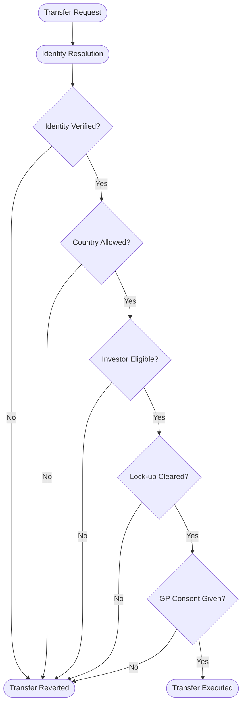
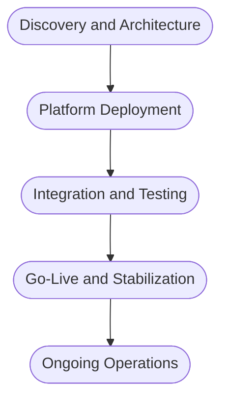

# RFI Response: Digital Platform for Tokenized Limited Partner Interests

## Meridian Capital Partners

**Prepared by:** SettleMint NV  
**Date:** March 2026  
**Reference:** MCP-RFI-2026-003  
**Classification:** Confidential

---

## Cover Letter

Meridian Capital Partners  
Digital Infrastructure Program Office  
Luxembourg

Dear Program Office,

SettleMint welcomes the opportunity to respond to Meridian Capital Partners' Request for Information regarding a digital platform for tokenized LP interests in the Meridian Technology Growth Fund IV. The intersection of AIFMD-authorized fund management with digital asset infrastructure is precisely the operating environment for which the Digital Asset Lifecycle Platform (DALP) was designed.

DALP is a production-grade platform for regulated digital asset programs. It provides the full lifecycle infrastructure that fund managers require: from token design and investor onboarding through compliant transfers, distribution processing, and ongoing servicing. The platform operates in production at regulated financial institutions across Europe, the Middle East, and Asia-Pacific, handling asset classes including bonds, equities, funds, deposits, and real estate.

For Meridian's specific requirements, DALP's fund asset class provides native support for subscription-based instruments with configurable compliance modules that enforce investor eligibility across multiple jurisdictions simultaneously. The platform's identity verification architecture, built on the ERC-3643 standard and OnchainID protocol, enables Meridian to configure EU qualified investor requirements alongside Singapore accredited investor criteria without custom smart contract development.

We have structured this response to address each section of your RFI directly, with honest disclosure of capability boundaries where DALP's native scope ends and integration or external systems are required. We believe this transparency strengthens rather than weakens our position, as it gives Meridian a clear picture of implementation scope and partner requirements from the outset.

We look forward to discussing how DALP can support Fund IV's digital infrastructure requirements.

Respectfully,

[Signatory Placeholder]  
SettleMint NV

---

## About DALP

The Digital Asset Lifecycle Platform (DALP) is SettleMint's production infrastructure for regulated digital asset programs. The platform addresses a fundamental market reality: tokenization technology is increasingly accessible, but doing it right at institutional scale, with proper governance, compliance enforcement, key management, settlement logic, and auditability, is where most programs stall.

DALP organizes its capabilities around five lifecycle pillars that cover the complete operational journey of a digital asset:

| Pillar | Function | Relevance to Fund IV |
| --- | --- | --- |
| Create | Asset design, token configuration, factory deployment | LP unit token design with fund-specific parameters |
| Comply | Identity verification, compliance modules, regulatory enforcement | Dual-jurisdiction investor eligibility (EU/Singapore) |
| Custody | Key management integration, wallet infrastructure | Institutional-grade custody for LP wallets |
| Settle | Atomic DvP/XvP settlement, transfer pipeline | Secondary transfer settlement with compliance enforcement |
| Service | Corporate actions, distributions, lifecycle events | Capital call tracking, distribution processing, NAV reporting |

The platform supports seven asset classes (bonds, equities, funds, stablecoins, deposits, real estate, and precious metals) through a single audited token contract (DALPAsset) that adapts to any financial instrument through runtime configuration. For Meridian's use case, the Fund asset class provides the subscription and redemption mechanics, investor registry management, and distribution infrastructure required for tokenized LP interests.

DALP deploys on EVM-compatible blockchain networks, both public and permissioned, and supports cloud-managed, on-premises, and hybrid deployment models. The platform is API-first, with a typed REST API, SDK, CLI, event webhooks, and integration surfaces designed for enterprise system connectivity.

*Figure 1: DALP dashboard providing real-time portfolio overview across digital asset programs*

---

## Section 1: Fund Unit Representation

### 1.1 LP Interest Tokenization

DALP represents LP interests as configurable fund tokens deployed through the platform's Asset Factory. Each fund token is a DALPAsset contract built on the ERC-3643 (T-REX) standard, which means every token operation, from minting to transfer to redemption, passes through the platform's compliance enforcement layer before execution.

For Fund IV, the token configuration addresses Meridian's denomination and precision requirements directly. The fund asset class supports configurable minimum subscription thresholds, which Meridian would set at EUR 100,000 per the fund terms. Fractional unit precision is supported down to the level of the underlying token's decimal configuration (typically 18 decimals for EVM tokens, though operational precision can be constrained through the platform's configuration to match fund accounting requirements such as 0.01 unit precision).

The token design process uses DALP's Asset Designer, a configuration-driven interface where fund parameters, compliance modules, and token features are selected from pre-audited catalogs rather than coded from scratch. This approach compresses the token deployment timeline from months of custom smart contract development to a matter of days, while maintaining the same security guarantees because every module in the catalog has been audited as part of the platform's security review process.

Token parameters that are relevant to Fund IV include the denomination currency (EUR), minimum transferable units, supply management controls (who can mint new units during subscriptions), and the compliance module set that enforces investor eligibility. These parameters are set at deployment and can be reconfigured post-deployment through governed administrative operations without redeploying the token contract.

*Figure 2: Asset Designer interface for selecting and configuring compliance modules during fund token setup*

### 1.2 Capital Commitment Tracking

DALP tracks the lifecycle of fund investments through its token supply management and distribution infrastructure. Capital commitments are represented through the relationship between an LP's token holdings (funded commitments) and the platform's metadata and claims system, which can record total commitment amounts per investor.

The platform's approach to commitment tracking works as follows: when an LP subscribes to Fund IV and makes an initial capital commitment, the platform records the investor's identity and commitment details through the identity and claims infrastructure. As capital calls are funded, new fund tokens are minted to the LP's wallet in proportion to their funded amount. The difference between total commitment (recorded as identity metadata or through an external fund administration integration) and tokens held (representing funded capital) provides the unfunded obligation figure.

It is important to be precise about what is native and what requires integration here. DALP natively manages the token-side of this relationship: minting tokens when capital is funded, tracking token balances per investor, and maintaining the identity registry that links wallets to verified investor profiles. The capital commitment ledger itself, tracking total commitments, drawdown schedules, and unfunded balances as a unified accounting record, is typically maintained in the fund administrator's systems (in Meridian's case, Apex Group). DALP's API surface enables synchronization between these systems, with the on-chain token balance serving as the authoritative record of funded participation and the fund administrator maintaining the broader commitment accounting.

### 1.3 Multiple Share Classes

DALP supports multiple share classes within a single fund structure by deploying separate token contracts for each class, all managed under the same organizational context within the platform. Each share class can have its own compliance module configuration, fee structure (through the Fee token features), and distribution parameters.

For a growth equity fund like Fund IV, this capability could support differentiated LP classes: for example, a founding LP class with reduced management fees, a standard institutional LP class, and potentially a co-investment vehicle class. Each class operates as its own token with its own compliance rules, but all share the same underlying identity registry, meaning an investor verified once can participate across multiple classes without re-verification.

---

## Section 2: Compliance and Investor Eligibility

### 2.1 Dual-Jurisdiction Compliance

DALP's compliance architecture enforces investor eligibility at the smart contract level through configurable compliance modules that evaluate every transfer before execution. For Meridian's dual-jurisdiction requirement, the platform composes multiple compliance modules to create a regulatory posture that satisfies both EU and Singapore frameworks simultaneously.

The configuration for Fund IV would use three key compliance modules working in concert:

**Identity Verification Module.** This module requires that every LP has a verified on-chain identity (OnchainID) with specific claims attested by trusted issuers. The module's verification expression is configurable using Reverse Polish Notation (RPN) boolean logic, allowing Meridian to define expressions such as: `[KYC, AML, AND, QUALIFIED_INVESTOR, AND]` for EU investors, or `[KYC, AML, AND, ACCREDITED_INVESTOR, AND]` for Singapore investors. The platform's claim topic scheme distinguishes between these investor categories, and the expression evaluator supports OR logic across jurisdiction-specific paths.

**Country Allow List Module.** This module restricts token holding to investors verified in approved jurisdictions. Meridian would configure the allow list to include EU member states and Singapore, with the module blocking any transfer to investors whose jurisdiction claims fall outside this set. The module uses ISO 3166-1 country codes and evaluates the investor's jurisdiction claim at the time of each transfer, not just at onboarding.

**Investor Count Module.** If Meridian needs to enforce maximum holder limits per jurisdiction, this module caps the number of unique investors globally or per country. The module supports sub-limits, allowing Meridian to set different investor count ceilings for EU and Singapore participation.

These modules compose through sequential AND evaluation: every active module must pass for a transfer to succeed. A single module veto blocks the transfer. This fail-closed design means the default is denial unless all modules explicitly approve, which is the correct model for a regulated fund.

*Figure 3: Compliance module evaluation sequence for Fund IV LP interest transfers*

### 2.2 Identity Verification Model

DALP implements on-chain identity verification through OnchainID, a protocol based on the ERC-734/ERC-735 standards. Every LP in Fund IV would be represented by a dedicated on-chain identity contract that stores verifiable claims about their eligibility status.

The identity lifecycle for Fund IV investors follows a structured progression. When a new LP is onboarded, DALP deploys an OnchainID identity contract through the Identity Factory. The LP's identity is registered in the Identity Registry, establishing the binding between their wallet address and their on-chain identity. Trusted issuers (which could be Meridian's KYC provider, an external verification service, or the platform's auto-claim system based on completed KYC reviews) then attach verifiable claims to the identity: KYC completion, AML clearance, accredited or qualified investor status, and jurisdictional eligibility.

Claims include expiration timestamps, enabling automatic enforcement of re-verification requirements. If an LP's KYC claim expires, all transfers involving that LP are blocked until the claim is renewed. There is no grandfather exception for stale verification. This protects Meridian from the operational risk of outdated investor credentials.

For ongoing management, DALP supports claim revocation (when an investor's status changes), claim renewal (when re-verification is completed), and identity recovery (when wallet access is lost, through a governed multi-step workflow that migrates the identity and token balances to a new wallet).

The document collection process that Meridian requires, including proof of accreditation, tax residency certificates, and W-8BEN/W-9 forms, happens through Meridian's existing KYC and investor onboarding workflows. DALP consumes the resulting verification outcomes as on-chain claims. The platform does not perform KYC directly; it enforces the results of KYC as transfer preconditions.

*Figure 4: Identity verification compliance module configuration showing claim requirement expressions*

### 2.3 Transfer Restriction Enforcement

DALP provides native compliance modules that directly address Fund IV's three transfer restriction requirements:

**Lock-up Period Enforcement.** The TimeLock compliance module enforces minimum holding periods with FIFO batch tracking. For Fund IV's 3-year lock-up from subscription date, the module records the timestamp when tokens are minted to each LP and blocks transfers until the configured holding period has elapsed. The FIFO mechanism tracks individual batches when an LP receives tokens across multiple capital calls, each batch starting its own lock-up clock. This is materially more precise than a simple "3 years from fund launch" rule, as it respects the actual subscription timing of each capital contribution.

**GP Consent for Secondary Transfers.** The Transfer Approval compliance module requires explicit pre-approval before any secondary transfer can execute. The module supports configurable parameters including approval expiry windows (so a GP approval does not remain valid indefinitely) and one-time-use flags (so each approved transfer consumes its approval). In practice, when an LP wants to transfer their interest, they initiate a transfer request; the GP reviews the request through the platform's API or UI; if approved, the approval is recorded on-chain; and the LP can then execute the transfer within the approval window. If the approval expires or is not granted, the transfer cannot execute.

**Right of First Refusal (ROFR).** DALP's native compliance modules do not include a purpose-built ROFR mechanism with configurable exercise windows. The platform can enforce the transfer restriction component (blocking unauthorized transfers) through the Transfer Approval module, but the ROFR business process, notifying existing LPs, managing the 30-day exercise window, handling multiple ROFR claims, and determining priority, requires workflow orchestration that sits outside the on-chain compliance layer. This workflow would typically be managed through Meridian's fund administration processes, with the platform enforcing the outcome: the GP grants transfer approval only after the ROFR period has elapsed or existing LPs have declined to exercise their rights. DALP enforces the gate; the ROFR process logic is Meridian's to define and operate.

---

## Section 3: Capital Calls and Distribution

### 3.1 Capital Call Workflows

DALP supports the operational mechanics of capital calls through its minting and notification infrastructure. When the GP issues a drawdown notice for Fund IV, the workflow integrates the platform's token operations with Meridian's existing fund administration processes.

The capital call process in a DALP-enabled fund operates through the following sequence: the GP determines the drawdown amount and allocation per LP (typically calculated within the fund administrator's systems). The platform's API enables programmatic minting of new fund tokens to each LP's wallet in proportion to their capital contribution once payment is confirmed. Batch minting supports up to 100 recipients per API call, with full compliance verification on each recipient before tokens are issued.

What DALP provides natively is the token-side execution: compliance-checked minting, batch operations, identity verification of each LP before tokens are issued, and an immutable on-chain record of every capital contribution event. The platform's event webhook system can trigger notifications to LPs when tokens are minted to their wallets, providing confirmation of their funded commitment.

What sits outside DALP's native scope is the capital call calculation logic itself (determining how much each LP owes based on their commitment and the fund's needs), the generation of formal drawdown notice documents, and the management of payment collection timelines. These functions reside in Meridian's fund administration infrastructure at Apex Group. DALP serves as the execution and record layer, not the fund accounting engine.

### 3.2 Distribution Processing

DALP handles distribution execution through two complementary mechanisms: the Fixed Treasury Yield token feature for regular periodic distributions, and the Yield Schedule system addon for more flexible distribution configurations.

**Distribution Execution.** DALP's distribution system handles the recording of entitlements and the execution of claims. The Yield Schedule addon automates the distribution of returns to token holders with snapshot-based balance capture (recording each LP's pro-rata share at the distribution date), flexible scheduling (one-time, recurring, or custom), and the option to distribute in the same token or a different payment token (such as a EUR stablecoin). Distribution calculations use Historical Balance snapshots to determine each holder's proportional share, ensuring that LPs who transferred their interests between distribution dates receive only their pro-rata entitlement.

**Distribution Waterfall Calculation.** This is an area where precision about capability boundaries is essential. DALP's distribution system handles entitlement recording and claim fulfillment: once the distribution amounts per LP are determined, the platform can execute those distributions atomically with full audit trails. However, the waterfall calculation itself, computing return of capital, applying the 8% preferred return hurdle, calculating the 80/20 GP/LP carry split above the hurdle, and managing the catch-up provision, is complex fund-specific logic that varies significantly across fund structures. DALP does not include a native waterfall calculation engine.

The practical architecture for Fund IV would position DALP as the distribution execution layer: Apex Group (or Meridian's internal systems) calculates the waterfall and determines each LP's distribution entitlement, then submits those amounts to DALP for on-chain execution and record-keeping. This separation is deliberate. Waterfall calculations involve fund accounting nuances (clawback provisions, escrow holdbacks, tax withholding, partnership allocation rules) that belong in the fund administration domain rather than in the token infrastructure layer.

### 3.3 NAV Reporting and Reconciliation

DALP provides the data infrastructure and integration surfaces for NAV reporting, though the NAV calculation itself is performed by the fund administrator.

The platform's data feed infrastructure can consume external NAV values and publish them as on-chain records with full audit trails. The Feeds module accepts price and valuation data from external sources, records them with timestamp and source attribution, and makes them queryable through the API and the platform's analytics views (18+ SQL-accessible analytics views). This means the current NAV per unit, as calculated by Apex Group, can be recorded on-chain through DALP and presented to investors through the platform's portal.

For reconciliation with Apex Group, DALP's API surface supports both push and pull integration patterns. The fund administrator can push NAV updates to DALP through the API (setting per-unit valuations at each reporting period), and DALP can expose current token balances, holder registries, and transaction histories for Apex Group's reconciliation workflows. The typed REST API and webhook event system enable automated synchronization on a weekly basis as Meridian requires.

DALP does not generate AIFMD Annex IV reports or MAS Form 1/1A filings. The platform provides the underlying data, including complete investor registries, transaction histories, and asset valuations, through its API and reporting views. However, the formatting and submission of jurisdiction-specific regulatory filings is outside platform scope. These reports would be generated by Meridian's fund administrator or regulatory reporting service provider, drawing on DALP's data exports as one input source among several.

---

## Section 4: Secondary Transfers

### 4.1 Compliant Secondary Transfers

Every secondary transfer of Fund IV LP interests on DALP passes through the same compliance enforcement pipeline that governs primary issuance. Before any token balance changes occur, the platform resolves both the seller's and buyer's on-chain identities, evaluates all configured compliance modules in sequence, and either executes or reverts the transfer atomically.

For a secondary transfer, this means the buyer must have a registered OnchainID with verified claims satisfying Fund IV's investor eligibility requirements (KYC, AML, qualified/accredited investor status, and jurisdictional eligibility). If the buyer's claims are missing, expired, or insufficient, the transfer reverts. There is no manual override path for standard transfers; the compliance enforcement is deterministic and on-chain.

This compliance re-verification happens automatically on every transfer. Meridian does not need to implement separate buyer screening for secondary transfers because the compliance modules perform this screening as a precondition of the transfer itself. The same modules that enforce eligibility at subscription time enforce eligibility on every subsequent transfer.

### 4.2 GP Consent Workflows

The Transfer Approval compliance module provides the GP consent mechanism for secondary transfers. The workflow operates in three steps:

First, the selling LP or their advisor signals intent to transfer (this can happen through the platform's API or through Meridian's existing communication channels). Second, the GP reviews the transfer request. The GP can consider factors beyond what the on-chain compliance modules check, including strategic considerations, existing LP relationships, and ROFR obligations. Third, if the GP approves, they record the approval through DALP's Transfer Approval module, specifying the sender, recipient, amount, and an expiry window. The approval is recorded on-chain. The transfer can then execute within the approval window.

If the GP does not approve, no on-chain approval is recorded, and the transfer cannot execute. The Transfer Approval module supports configurable expiry (ensuring stale approvals do not create unintended transfer windows) and one-time-use flags (ensuring each approval covers exactly one transfer).

### 4.3 Marketplace Functionality

DALP is not a trading venue and does not include a native order book, matching engine, or marketplace listing system. Secondary transfers of LP interests are supported as compliant peer-to-peer transactions with full compliance enforcement, but the "browse and purchase" marketplace experience that facilitates price discovery and counterparty matching is outside the platform's scope.

For Fund IV, secondary LP interest transactions would follow the pattern typical of private fund interests: the selling LP identifies a buyer (potentially through a secondary market broker or Meridian's LP network), Meridian approves the transfer after ROFR processes complete, and the transfer executes through DALP with full compliance enforcement. If Meridian later wants to integrate with an external secondary market platform or OTC venue, DALP's API supports programmatic transfer initiation, meaning external platforms can route settlement through DALP's compliance-enforced transfer functions.

---

## Section 5: Integration and Reporting

### 5.1 API and System Integration

DALP is API-first, providing multiple integration surfaces designed for enterprise system connectivity:

| Interface | Description | Integration Use Case for Fund IV |
| --- | --- | --- |
| Typed REST API | Full platform operations with type-safe request/response schemas | Primary integration surface for Apex Group data exchange |
| SDK | Type-safe client libraries | Embedded integration in Meridian's internal systems |
| CLI | 301 commands across 26 command groups | Operational scripting and automation |
| Event Webhooks | Real-time event notifications for on-chain and platform events | Triggering downstream workflows in Salesforce/eFront on LP actions |
| Feeds Module | External data ingestion with on-chain recording | NAV feed from Apex Group, pricing data updates |

For Meridian's specific integration requirements, it is important to state capability boundaries clearly:

**Apex Group Integration.** DALP provides the API surfaces for data exchange with Apex Group: investor registry exports, transaction histories, token balance snapshots, and distribution records are all available through the REST API. However, a pre-built connector specifically for Apex Group's fund administration platform does not exist as a shipped product feature. Integration would be implemented as an API-to-API project during deployment, mapping DALP's data structures to Apex Group's ingestion formats. This is a standard integration effort, not a platform limitation.

**Salesforce Integration.** DALP's event webhook system and REST API enable data flow to Salesforce: investor onboarding events, capital call confirmations, distribution notifications, and LP status changes can trigger Salesforce updates through webhook-to-middleware integration patterns. A native Salesforce connector is not shipped with the platform. The integration would use standard Salesforce API patterns (REST or platform events) fed by DALP webhooks, which is a well-understood integration pattern.

**eFront Integration.** The same API-based integration approach applies to eFront. DALP can export portfolio-level data (assets under management, token balances, transaction histories, distribution records) through its API, and eFront can consume this data through its import interfaces. Pre-built connectivity to eFront does not exist as a product feature.

### 5.2 Investor Portal

DALP provides a web-based investor portal that gives LPs visibility into their fund participation. The portal interface includes:

**Commitment and Holdings View.** LPs can see their current token balance (representing funded commitment), transaction history (capital call contributions reflected as token receipts), and identity status (claim validity, expiration dates).

**Distribution History.** The portal displays all distributions received, including amounts, dates, and distribution reference details. Distribution records are linked to on-chain transactions, providing an auditable trail from distribution calculation to LP receipt.

**NAV Display.** If NAV data is published through DALP's Feeds module, the portal can display current and historical NAV per unit, giving LPs visibility into their position valuation.

The portal is responsive and accessible through standard web browsers. It authenticates LPs through the platform's identity management layer, supporting enterprise identity federation (OIDC, SAML) for institutional investors.

*Figure 5: Investor-facing dashboard showing portfolio holdings and transaction activity*

### 5.3 Regulatory Reporting

DALP provides comprehensive data exports that serve as inputs to regulatory reporting, but does not generate jurisdiction-specific regulatory filing documents.

For AIFMD Annex IV reporting, DALP can supply: complete investor registries with jurisdiction and eligibility details, full transaction histories, asset valuation records, and distribution records. These data points cover many of the quantitative fields required in Annex IV reporting. However, the report formatting, field mapping to AIFMD-specific templates, and submission to regulators is outside platform scope. Meridian's fund administrator or a dedicated regulatory reporting service provider would consume DALP's data exports and produce the required filings.

The same applies to MAS Form 1/1A requirements. DALP provides the underlying data through its API and analytics views, but the report generation and filing process is external to the platform. This boundary reflects a deliberate design choice: regulatory filing formats and requirements change frequently across jurisdictions, and maintaining template compliance for dozens of regulatory bodies is a specialized function better served by dedicated regulatory reporting tools than by a digital asset platform.

---

## Section 6: Security and Data Residency

### 6.1 Data Protection

DALP implements defense-in-depth security across authentication, authorization, and data protection:

**Authentication.** The platform uses a two-endpoint authentication model: the web application authenticates through session-based flows with multi-factor authentication support (TOTP, FIDO2/WebAuthn passkeys), while programmatic access uses API keys scoped to specific organizations and permissions. Enterprise identity federation through OIDC and SAML enables Meridian's LPs to authenticate using their existing institutional credentials.

**Authorization.** Access control operates at two levels. Platform-level roles control organizational access and administrative functions. Asset-level roles (seven per asset: admin, governance, supply management, custodian, emergency, compliance, and operations) enforce separation of duties at the smart contract level. This means different teams within Meridian can have precisely scoped permissions: the GP team manages fund governance, the operations team handles distributions, and compliance officers manage investor eligibility, each with enforced boundaries.

**Encryption.** Data in transit is protected through TLS encryption. Data at rest uses encryption provided by the deployment infrastructure (cloud provider encryption, database-level encryption, or customer-managed encryption keys depending on deployment model). The platform's object storage model encrypts uploaded documents (investor documentation, fund materials) with per-tenant isolation.

### 6.2 Data Residency

Meridian's requirement for split data residency, keeping EU investor data in EU infrastructure and Singapore investor data in Singapore infrastructure, is architecturally achievable but requires careful deployment topology decisions.

DALP supports deployment in specific cloud regions, and can be deployed across multiple regions to satisfy data residency requirements. However, maintaining split data residency within a single fund's infrastructure is not a simple configuration toggle. It requires a multi-deployment architecture where separate DALP instances (or a topology with region-specific data stores) are provisioned for each residency zone.

The practical approach for Fund IV would involve either: (a) deploying separate DALP environments for EU and Singapore operations, with cross-environment coordination for fund-level reporting; or (b) deploying in a single region that satisfies the strictest data residency requirement, with appropriate data processing agreements for the other jurisdiction. The right approach depends on regulatory interpretation, data volume, and operational complexity trade-offs that would be resolved during the discovery phase of implementation.

This is an architectural decision, not a platform limitation. DALP's Kubernetes-native deployment model supports multi-region and multi-cluster deployments. The engineering effort is in the orchestration layer that keeps two deployments operationally coherent for a single fund, which is implementation work rather than platform development.

### 6.3 Security Certifications

SettleMint holds ISO 27001 and SOC 2 Type II certifications. These certifications cover the platform's security management system, operational controls, and data handling practices.

For GDPR compliance, DALP provides the technical controls required by data protection regulation: access controls, audit trails, data encryption, and the ability to manage data subject rights (access, rectification, erasure where applicable to off-chain data). SettleMint operates as a data processor under GDPR when handling investor personal data, with appropriate data processing agreements in place.

---

## Section 7: Deployment and Implementation

### 7.1 Deployment Options

DALP supports three deployment models, each providing identical platform capabilities:

| Model | Description | Relevance to Fund IV |
| --- | --- | --- |
| Cloud-Managed | SettleMint-operated infrastructure in major cloud regions | Fastest deployment, lowest operational overhead |
| On-Premises | Helm-based Kubernetes deployment in Meridian's infrastructure | Maximum control, data residency certainty |
| Hybrid | Platform components split across managed and client infrastructure | Balances operational efficiency with data sovereignty |

For Fund IV, the deployment model choice depends primarily on Meridian's data residency requirements and IT governance preferences. Cloud-managed deployment provides the fastest path to production (typically 4 to 8 weeks for initial deployment). On-premises deployment requires Meridian to provision Kubernetes infrastructure but gives full control over data location and network topology.

All deployment models support the same blockchain network options: public EVM networks (Ethereum, Polygon), private/permissioned EVM networks (Hyperledger Besu, Quorum), or multi-network configurations. For a regulated fund like Fund IV, a permissioned network operated by Meridian or a consortium of fund service providers is the typical choice.

### 7.2 Implementation Approach

SettleMint follows a structured, phase-gated implementation methodology:

**Phase 1: Discovery and Architecture (2 to 3 weeks).** Joint workshops to finalize fund token design, compliance module configuration, integration architecture with Apex Group/Salesforce/eFront, and deployment topology decisions (including data residency approach). Deliverables: solution design document, integration architecture, compliance module specification.

**Phase 2: Platform Deployment and Configuration (2 to 3 weeks).** Infrastructure provisioning, DALP deployment, Fund IV token configuration through the Asset Designer, compliance module activation, and identity registry setup. Deliverables: deployed platform, configured fund token, compliance modules operational.

**Phase 3: Integration and Testing (3 to 4 weeks).** API integration with Apex Group, Salesforce, and eFront. End-to-end testing of capital call workflows, distribution processing, secondary transfer flows, and investor onboarding. User acceptance testing with Meridian's operations team. Deliverables: integrated platform, test evidence, UAT sign-off.

**Phase 4: Go-Live and Stabilization (2 weeks).** Production cutover, initial LP onboarding, first capital call execution, monitoring and support during stabilization period. Deliverables: production-ready platform, operational runbook.

**Phase 5: Ongoing Operations.** Continuous platform operation, support, and evolution. Quarterly business reviews, platform updates, and configuration adjustments as fund operations mature.

Indicative total timeline: 9 to 12 weeks from project kickoff to production readiness, depending on integration complexity and Meridian's infrastructure readiness.

*Figure 6: Phase-gated implementation approach for Fund IV digital infrastructure*

### 7.3 Commercial Model

SettleMint licenses DALP as an annual platform subscription. The licensing model is designed for institutional economics:

**No per-transaction fees.** Meridian is not charged per mint, transfer, distribution, or compliance check. Capital calls, distributions, and secondary transfers execute without incremental licensing costs, which removes the perverse incentive to minimize platform usage.

**No per-investor fees.** LP onboarding and investor growth are business outcomes, not cost drivers. The licensing model does not impose per-user costs for end investors.

**What the license includes:** All five lifecycle pillars, all seven asset classes, all compliance module types, the full API surface, addon capabilities (yield schedules, token sales, data feeds), the observability stack, and platform updates during the license term.

**Support tiers.** SettleMint offers Standard, Premium, and Enterprise support packages with escalating coverage hours, response time commitments, and dedicated support resources. For a fund deployment of Fund IV's scale, Premium or Enterprise support would be recommended.

**Professional services.** Implementation services (discovery, deployment, integration, training) are scoped separately from the platform license and quoted based on the specific integration and customization requirements identified during the discovery phase.

---

## Coverage Summary

| Requirement Area | Coverage | Notes |
| --- | --- | --- |
| LP interest tokenization | Native | Fund asset class with configurable parameters |
| Capital commitment tracking | Partial | Token balances native; commitment ledger requires fund admin integration |
| Dual-jurisdiction compliance | Native | Composable compliance modules for EU and Singapore requirements |
| Identity verification and KYC | Native | OnchainID with claim-based verification and expiry enforcement |
| Lock-up period enforcement | Native | TimeLock module with FIFO batch tracking |
| GP consent for transfers | Native | Transfer Approval module with configurable expiry |
| ROFR mechanism | Partial | Transfer blocking native; ROFR notification/exercise workflow is external |
| Capital call execution | Native | Batch minting with compliance verification |
| Distribution waterfall calculation | Gap | DALP executes distributions; waterfall math is external (Apex Group) |
| Distribution execution | Native | Yield Schedule addon with snapshot-based pro-rata calculations |
| NAV reporting | Partial | Data feeds and display native; NAV calculation is external |
| Apex Group integration | Integration project | API surfaces available; no pre-built connector |
| Salesforce integration | Integration project | Webhook and API surfaces available; no native connector |
| eFront integration | Integration project | API export surfaces available; no native connector |
| Investor portal | Native | Web-based portal with holdings, history, and NAV display |
| AIFMD Annex IV reporting | Data available | Data exports through API; report generation is external |
| MAS Form 1/1A reporting | Data available | Data exports through API; report generation is external |
| Data residency (split EU/SG) | Architectural | Multi-deployment topology required; not a simple toggle |
| Security certifications | Native | ISO 27001 and SOC 2 Type II held |
| Secondary marketplace | Gap | Not a trading venue; peer-to-peer compliant transfers supported |

---

## Back Matter

**Document Classification:** Confidential  
**Version:** 1.0  
**Prepared by:** SettleMint NV  
**Date:** March 2026  
**Contact:** [Contact Placeholder]
