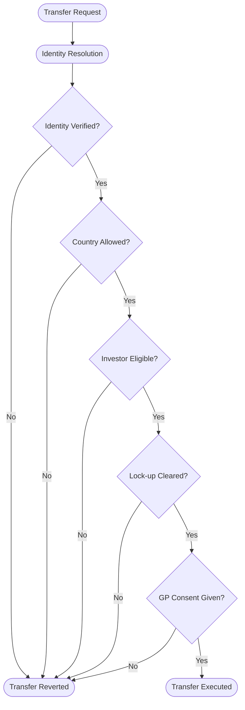
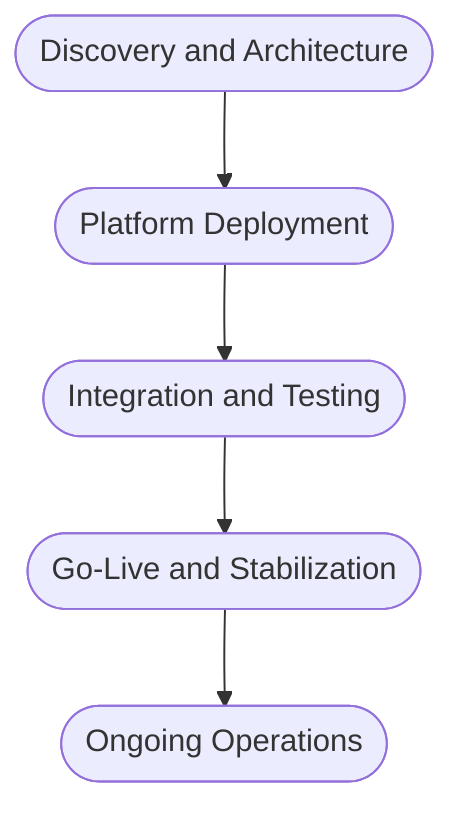

# RFI Response: Digital Platform for Tokenized Limited Partner Interests

## Meridian Capital Partners

**Prepared by:** SettleMint NV  
**Date:** March 2026  
**Reference:** MCP-RFI-2026-003  
**Classification:** Confidential

---

## Cover Letter

Meridian Capital Partners  
Digital Infrastructure Program Office  
Luxembourg

Dear Program Office,

SettleMint welcomes the opportunity to respond to Meridian Capital Partners' Request for Information regarding a digital platform for tokenized LP interests in the Meridian Technology Growth Fund IV. The intersection of AIFMD-authorized fund management with digital asset infrastructure is precisely the operating environment for which the Digital Asset Lifecycle Platform (DALP) was designed.

DALP is a production-grade platform for regulated digital asset programs. It provides the full lifecycle infrastructure that fund managers require: from token design and investor onboarding through compliant transfers, distribution processing, and ongoing servicing. The platform operates in production at regulated financial institutions across Europe, the Middle East, and Asia-Pacific, handling asset classes including bonds, equities, funds, deposits, and real estate.

For Meridian's specific requirements, DALP's fund asset class provides native support for subscription-based instruments with configurable compliance modules that enforce investor eligibility across multiple jurisdictions simultaneously. The platform's identity verification architecture, built on the ERC-3643 standard and OnchainID protocol, enables Meridian to configure EU qualified investor requirements alongside Singapore accredited investor criteria without custom smart contract development.

We have structured this response to address each section of your RFI directly, with honest disclosure of capability boundaries where DALP's native scope ends and integration or external systems are required. We believe this transparency strengthens rather than weakens our position, as it gives Meridian a clear picture of implementation scope and partner requirements from the outset.

We look forward to discussing how DALP can support Fund IV's digital infrastructure requirements.

Respectfully,

[Signatory Placeholder]  
SettleMint NV

---

## About DALP

Fund IV's digital infrastructure challenge extends well beyond token issuance. It demands compliance enforcement across two regulatory jurisdictions, integration with established fund administration workflows at Apex Group, investor lifecycle management spanning capital calls through distributions and secondary transfers, and institutional-grade security with data residency controls. Many tokenization approaches address one or two of these requirements in isolation. DALP was purpose-built to deliver the full lifecycle as a single platform: asset creation, compliance, custody integration, settlement, and servicing, all within one governed operating environment.

The Digital Asset Lifecycle Platform (DALP) is SettleMint's production infrastructure for regulated digital asset programs. Tokenization technology is increasingly accessible. Doing it right at institutional scale requires proper governance, compliance enforcement, key management, settlement logic, and auditability. That is where most programs stall, and where DALP provides the most value.

DALP organizes its capabilities around five lifecycle pillars that cover the complete operational journey of a digital asset:

| Pillar | Function | Relevance to Fund IV |
| --- | --- | --- |
| Create | Asset design, token configuration, factory deployment | LP unit token design with fund-specific parameters |
| Comply | Identity verification, compliance modules, regulatory enforcement | Dual-jurisdiction investor eligibility (EU/Singapore) |
| Custody | Key management integration, wallet infrastructure | Institutional-grade custody for LP wallets |
| Settle | Atomic DvP/XvP settlement, transfer pipeline | Secondary transfer settlement with compliance enforcement |
| Service | Corporate actions, distributions, lifecycle events | Capital call tracking, distribution processing, NAV reporting |

The platform supports seven asset classes (bonds, equities, funds, stablecoins, deposits, real estate, and precious metals) through a family of audited token contracts built on a common architecture, configured at deployment to match each asset class's specific requirements. For Meridian's use case, the Fund asset class provides the subscription and redemption mechanics, investor registry management, and distribution infrastructure required for tokenized LP interests.

DALP deploys on EVM-compatible blockchain networks, both public and permissioned, and supports cloud-managed, on-premises, and hybrid deployment models. The platform is API-first, with a typed REST API, SDK, CLI, event webhooks, and integration surfaces designed for enterprise system connectivity.

The platform operates in production at regulated financial institutions managing tokenized fund interests, bonds, and equity instruments across multiple jurisdictions. Multi-year live deployments with tier-1 and tier-2 financial institutions have validated the platform's lifecycle management, compliance enforcement, and operational resilience under institutional SLAs. Specific deployment references are available under NDA upon request.

*Figure 1: DALP dashboard providing real-time portfolio overview across digital asset programs*

---

## Section 1: Fund Unit Representation

### 1.1 LP Interest Tokenization

DALP represents LP interests as configurable fund tokens deployed through the platform's Asset Factory. Each fund token is built on the ERC-3643 (T-REX) standard, which means every token operation, from minting to transfer to redemption, passes through the platform's compliance enforcement layer before execution.

For Fund IV, the token configuration addresses Meridian's denomination and precision requirements directly. The fund asset class supports configurable minimum subscription thresholds, which Meridian would set at EUR 100,000 per the fund terms. Fractional unit precision is supported down to the level of the underlying token's decimal configuration. While EVM tokens support up to 18 decimal places, operational precision can be constrained through the platform's configuration to match fund accounting requirements such as 0.01 unit precision.

The token design process uses DALP's Asset Designer, a configuration-driven interface where fund parameters, compliance modules, and token features are selected from pre-audited catalogs rather than coded from scratch. This approach compresses the token deployment timeline from months of custom smart contract development to a matter of days, while maintaining the same security guarantees because every module in the catalog has been audited as part of the platform's security review process.

Token parameters relevant to Fund IV include the denomination currency (EUR), minimum transferable units, supply management controls (who can mint new units during subscriptions), and the compliance module set that enforces investor eligibility. These parameters are set at deployment and can be reconfigured post-deployment through governed administrative operations without redeploying the token contract.

*Figure 2: Asset Designer interface for selecting and configuring compliance modules during fund token setup*

### 1.2 Capital Commitment Tracking

DALP tracks the lifecycle of fund investments through its token supply management and distribution infrastructure. Capital commitments are represented through the relationship between an LP's token holdings (funded commitments) and the platform's metadata and claims system, which can record total commitment amounts per investor.

When an LP subscribes to Fund IV and makes an initial capital commitment, the platform records the investor's identity and commitment details through the identity and claims infrastructure. As capital calls are funded, new fund tokens are minted to the LP's wallet in proportion to their funded amount. The difference between total commitment (recorded as identity metadata or through an external fund administration integration) and tokens held (representing funded capital) provides the unfunded obligation figure.

Precision about what is native and what requires integration matters here. The platform natively manages the token-side of this relationship: minting tokens when capital is funded, tracking token balances per investor, and maintaining the identity registry that links wallets to verified investor profiles. The capital commitment ledger itself, tracking total commitments, drawdown schedules, and unfunded balances as a unified accounting record, is typically maintained in the fund administrator's systems. For Meridian, Apex Group would maintain the broader commitment accounting, with DALP's API surface enabling synchronization between systems. The on-chain token balance serves as the authoritative record of funded participation.

### 1.3 Multiple Share Classes

DALP supports multiple share classes within a single fund structure by deploying separate token contracts for each class, all managed under the same organizational context within the platform. Each share class can have its own compliance module configuration, fee structure (through the Fee token features), and distribution parameters.

For a growth equity fund like Fund IV, this capability could support differentiated LP classes: a founding LP class with reduced management fees, a standard institutional LP class, and potentially a co-investment vehicle class. Each class operates as its own token with its own compliance rules, but all share the same underlying identity registry, meaning an investor verified once can participate across multiple classes without re-verification.

---

## Section 2: Compliance and Investor Eligibility

### 2.1 Dual-Jurisdiction Compliance

DALP's compliance architecture enforces investor eligibility at the smart contract level through configurable compliance modules that evaluate every transfer before execution. For Meridian's dual-jurisdiction requirement, the platform composes multiple compliance modules to create a regulatory posture that satisfies both EU and Singapore frameworks simultaneously.

The first layer of compliance enforcement is identity verification. Every LP must hold a verified on-chain identity (OnchainID) with specific claims attested by trusted issuers. The verification expression supports configurable boolean logic, allowing Meridian to define composite eligibility rules: requiring KYC clearance AND AML verification AND qualified investor status for EU investors, or KYC AND AML AND accredited investor status for Singapore investors, with OR logic available to accommodate jurisdiction-specific alternative paths. The expression evaluator operates at the smart contract level, meaning eligibility is enforced deterministically on every transfer, not checked advisory at the application layer.

Building on this identity foundation, geographic restrictions ensure that only investors from approved jurisdictions can hold Fund IV tokens. The Country Allow List module restricts participation to investors verified in EU member states and Singapore, blocking any transfer to investors whose jurisdiction claims fall outside this set. The module uses ISO 3166-1 country codes and evaluates the investor's jurisdiction claim at the time of each transfer, not just at onboarding. If Meridian later expands to additional jurisdictions, the allow list can be updated through a governed administrative operation without redeploying the token.

Finally, where Meridian needs to cap participation, the Investor Count module limits the number of unique investors globally or per country. The module supports sub-limits, meaning Meridian could set different investor count ceilings for EU and Singapore participation if regulatory or commercial considerations require it.

These modules compose through sequential AND evaluation: every active module must pass for a transfer to succeed. A single module veto blocks the transfer. This fail-closed design means the default is denial unless all modules explicitly approve, which is the correct model for a regulated fund.

*Figure 3: Compliance module evaluation sequence for Fund IV LP interest transfers*

### 2.2 Identity Verification Model

DALP implements on-chain identity verification through OnchainID, a protocol based on the ERC-734/ERC-735 standards. Every LP in Fund IV would be represented by a dedicated on-chain identity contract that stores verifiable claims about their eligibility status.

The identity lifecycle for Fund IV investors follows a structured progression. When a new LP is onboarded, the platform deploys an identity contract through the Identity Factory and registers it in the Identity Registry, establishing the binding between the LP's wallet address and their on-chain identity. Trusted issuers (which could be Meridian's KYC provider, an external verification service, or the platform's auto-claim system based on completed KYC reviews) then attach verifiable claims to the identity: KYC completion, AML clearance, accredited or qualified investor status, and jurisdictional eligibility.

Claims include expiration timestamps, enabling automatic enforcement of re-verification requirements. If an LP's KYC claim expires, all transfers involving that LP are blocked until the claim is renewed. There is no grandfather exception for stale verification. This protects Meridian from the operational risk of outdated investor credentials.

For ongoing management, the platform supports claim revocation (when an investor's status changes), claim renewal (when re-verification is completed), and identity recovery (when wallet access is lost, through a governed multi-step workflow that migrates the identity and token balances to a new wallet).

The document collection process that Meridian requires, including proof of accreditation, tax residency certificates, and W-8BEN/W-9 forms, happens through Meridian's existing KYC and investor onboarding workflows. The platform consumes the resulting verification outcomes as on-chain claims. It does not perform KYC directly; it enforces the results of KYC as transfer preconditions.

*Figure 4: Identity verification compliance module configuration showing claim requirement expressions*

### 2.3 Transfer Restriction Enforcement

DALP provides native compliance modules that directly address Fund IV's three transfer restriction requirements.

The TimeLock compliance module enforces Fund IV's 3-year lock-up period with FIFO batch tracking. When tokens are minted to an LP (during a capital call, for instance), the module records the minting timestamp and blocks transfers until the configured holding period has elapsed. The FIFO mechanism is particularly relevant for Fund IV: when an LP receives tokens across multiple capital calls, each batch starts its own lock-up clock independently. This is materially more precise than a simple "3 years from fund launch" rule, as it respects the actual subscription timing of each capital contribution. An LP who participated in three separate capital calls will see each batch unlock according to its own minting date.

For secondary transfer governance, the Transfer Approval compliance module requires explicit GP pre-approval before any secondary transfer can execute. The module supports configurable parameters including approval expiry windows (ensuring a GP approval does not remain valid indefinitely) and one-time-use flags (ensuring each approved transfer consumes its approval). The workflow is straightforward: the selling LP signals intent, the GP reviews the request considering strategic factors and existing LP relationships, and if approved, records the approval on-chain with a sender, recipient, amount, and expiry window. The transfer can then execute within that window. If no approval is recorded, the transfer cannot proceed.

The right of first refusal (ROFR) requirement sits at the boundary between on-chain enforcement and off-chain workflow. The platform can enforce the transfer restriction component through the Transfer Approval module, blocking all secondary transfers until the GP explicitly approves. The ROFR business process itself, however, involves notifying existing LPs of a proposed transfer, managing the 30-day exercise window, handling multiple ROFR claims, and determining priority. These are workflow orchestration tasks that depend on fund-specific legal provisions and LP communication channels. The platform enforces the gate: no transfer executes without GP approval. The ROFR process that precedes that approval decision is Meridian's to define and operate through its fund administration workflows. This separation is deliberate. ROFR procedures vary across fund structures, and encoding a single ROFR model in the smart contract layer would constrain rather than serve Meridian's governance flexibility.

---

## Section 3: Capital Calls and Distribution

### 3.1 Capital Call Workflows

DALP supports the operational mechanics of capital calls through its minting and notification infrastructure. When the GP issues a drawdown notice for Fund IV, the workflow integrates the platform's token operations with Meridian's existing fund administration processes.

The capital call process in a DALP-enabled fund operates through the following sequence. The GP determines the drawdown amount and allocation per LP, typically calculated within the fund administrator's systems. The platform's API enables programmatic minting of new fund tokens to each LP's wallet in proportion to their capital contribution once payment is confirmed. Batch minting supports up to 100 recipients per API call, with full compliance verification on each recipient before tokens are issued.

The platform provides the token-side execution natively: compliance-checked minting, batch operations, identity verification of each LP before tokens are issued, and an immutable on-chain record of every capital contribution event. The event webhook system can trigger notifications to LPs when tokens are minted to their wallets, providing confirmation of their funded commitment.

Capital call calculation logic, formal drawdown notice document generation, and payment collection timeline management reside in Meridian's fund administration infrastructure at Apex Group. Drawdown notice documents are generated by the fund administrator using commitment data from their systems, supplemented by DALP's on-chain capital contribution records available through the API. The platform's event webhook system can trigger notice generation workflows when the GP initiates a capital call event, connecting the on-chain execution to the administrative document flow. DALP serves as the execution and record layer, not the fund accounting engine.

### 3.2 Distribution Processing

DALP handles distribution execution through two complementary mechanisms that together cover Fund IV's periodic distribution requirements.

The platform's distribution system records entitlements and executes claims with full audit trails. The Yield Schedule addon automates the distribution of returns to token holders with snapshot-based balance capture, recording each LP's pro-rata share at the distribution date. Schedules are flexible: one-time, recurring, or custom, with the option to distribute in the same token or a different payment token (such as a EUR stablecoin). Distribution calculations use Historical Balance snapshots to determine each holder's proportional share, ensuring that LPs who transferred their interests between distribution dates receive only their pro-rata entitlement.

For regular periodic distributions (management fee rebates, interim income distributions), the Fixed Treasury Yield token feature provides a pull-based system where the issuer funds a treasury and token holders claim accrued yield at configured intervals. This pull-based approach avoids the gas cost issues of pushing payments to hundreds of wallets simultaneously.

The distribution waterfall calculation requires a clear statement about architecture. DALP does not include a native waterfall calculation engine, by design. Waterfall calculations involve fund-specific accounting nuances: clawback provisions, escrow holdbacks, tax withholding, partnership allocation rules, and the interaction between preferred return hurdles, carried interest splits, and catch-up provisions. These belong in the fund administration domain where Apex Group maintains the accounting models. The practical architecture for Fund IV positions DALP as the distribution execution layer: Apex Group calculates the waterfall and determines each LP's distribution entitlement, then submits those amounts to the platform for on-chain execution and record-keeping. This separation ensures that neither system overreaches its domain expertise. Apex Group handles the accounting complexity; DALP handles the atomic, auditable, compliance-checked execution.

### 3.3 NAV Reporting and Reconciliation

The platform provides the data infrastructure and integration surfaces for NAV reporting, while the NAV calculation itself is performed by the fund administrator.

DALP's data feed infrastructure can consume external NAV values and publish them as on-chain records with full audit trails. The Feeds module accepts price and valuation data from external sources, records them with timestamp and source attribution, and makes them queryable through the API and the platform's SQL-accessible analytics views. The current NAV per unit, as calculated by Apex Group, can be recorded on-chain through the platform and presented to investors through the portal.

For reconciliation with Apex Group, the API surface supports both push and pull integration patterns. The fund administrator can push NAV updates through the API at each reporting period, and the platform exposes current token balances, holder registries, and transaction histories for Apex Group's reconciliation workflows. The typed REST API and webhook event system enable automated synchronization on a weekly basis as Meridian requires.

Regulatory reporting represents a deliberate boundary in the platform's scope. The platform provides complete investor registries, transaction histories, and asset valuations through its API and reporting views, covering many of the quantitative fields required in AIFMD Annex IV and MAS Form 1/1A reporting. Report formatting, field mapping to jurisdiction-specific templates, and submission to regulators is handled by Meridian's fund administrator or a dedicated regulatory reporting service provider. Regulatory filing formats and requirements change frequently across jurisdictions, and maintaining template compliance for dozens of regulatory bodies is a specialized function better served by dedicated regulatory reporting tools than by a digital asset platform.

---

## Section 4: Secondary Transfers

### 4.1 Compliant Secondary Transfers

Every secondary transfer of Fund IV LP interests passes through the same compliance enforcement pipeline that governs primary issuance. Before any token balance changes occur, the platform resolves both the seller's and buyer's on-chain identities, evaluates all configured compliance modules in sequence, and either executes or reverts the transfer atomically.

For a secondary transfer, this means the buyer must hold a registered identity with verified claims satisfying Fund IV's investor eligibility requirements: KYC, AML, qualified or accredited investor status, and jurisdictional eligibility. If the buyer's claims are missing, expired, or insufficient, the transfer reverts. There is no manual override path for standard transfers; the compliance enforcement is deterministic and on-chain.

This compliance re-verification happens automatically on every transfer. Meridian does not need to implement separate buyer screening for secondary transfers because the compliance modules perform this screening as a precondition of the transfer itself. The same modules that enforce eligibility at subscription time enforce eligibility on every subsequent transfer.

### 4.2 GP Consent Workflows

The Transfer Approval compliance module provides the GP consent mechanism for secondary transfers. The workflow operates in three steps.

First, the selling LP or their advisor signals intent to transfer. This can happen through the platform's API or through Meridian's existing communication channels. Second, the GP reviews the transfer request. The GP can consider factors beyond what the on-chain compliance modules check, including strategic considerations, existing LP relationships, and ROFR obligations. Third, if the GP approves, they record the approval through the platform's Transfer Approval module, specifying the sender, recipient, amount, and an expiry window. The approval is recorded on-chain. The transfer can then execute within that window.

If the GP does not approve, no on-chain approval is recorded, and the transfer cannot execute. The module supports configurable expiry (ensuring stale approvals do not create unintended transfer windows) and one-time-use flags (ensuring each approval covers exactly one transfer).

### 4.3 Marketplace Functionality

The platform does not operate as a trading venue and does not include a native order book, matching engine, or marketplace listing system. This is an architectural choice, not a capability gap. Private fund LP interests trade through relationship-driven processes, not exchange-style order matching. The negotiation, due diligence, and pricing of an LP interest transfer involves qualitative assessment that a matching engine cannot meaningfully automate.

Secondary transfers of LP interests are supported as compliant peer-to-peer transactions with full compliance enforcement. For Fund IV, secondary transactions would follow the pattern typical of private fund interests: the selling LP identifies a buyer through a secondary market broker or Meridian's LP network, Meridian approves the transfer after ROFR processes complete, and the transfer executes through the platform with full compliance enforcement. If Meridian later integrates with an external secondary market platform or OTC venue, the API supports programmatic transfer initiation, meaning external platforms can route settlement through the platform's compliance-enforced transfer functions without bypassing any eligibility or transfer restriction rules.

---

## Section 5: Integration and Reporting

### 5.1 API and System Integration

DALP is API-first, providing multiple integration surfaces designed for enterprise system connectivity:

| Interface | Description | Integration Use Case for Fund IV |
| --- | --- | --- |
| Typed REST API | Full platform operations with type-safe request/response schemas | Primary integration surface for Apex Group data exchange |
| SDK | Type-safe client libraries | Embedded integration in Meridian's internal systems |
| CLI | 301 commands across 26 command groups | Operational scripting and automation |
| Event Webhooks | Real-time event notifications for on-chain and platform events | Triggering downstream workflows in Salesforce/eFront on LP actions |
| Feeds Module | External data ingestion with on-chain recording | NAV feed from Apex Group, pricing data updates |

For Meridian's specific integration requirements, capability boundaries should be stated clearly. The platform provides the API surfaces for data exchange with Apex Group: investor registry exports, transaction histories, token balance snapshots, and distribution records are all available through the REST API. A pre-built connector specifically for Apex Group's fund administration platform does not exist as a shipped product feature. Integration would be implemented as an API-to-API project during deployment, mapping the platform's data structures to Apex Group's ingestion formats. This is a standard integration effort, not a platform limitation.

The same integration architecture applies to Salesforce and eFront. The event webhook system and REST API enable data flow to both systems: investor onboarding events, capital call confirmations, distribution notifications, and LP status changes can trigger updates through webhook-to-middleware integration patterns. Native connectors for Salesforce or eFront are not shipped with the platform. The integration would use each system's standard API patterns, which is well-understood territory for enterprise integration teams. During the discovery phase, SettleMint would work with Meridian's integration architects to define the data mapping, event triggers, and synchronization cadence for each system.

### 5.2 Investor Portal

The platform provides a web-based investor portal that gives LPs visibility into their fund participation. LPs can view their current token balance (representing funded commitment), transaction history (capital call contributions reflected as token receipts), and identity status including claim validity and expiration dates.

Distribution records appear in the portal with amounts, dates, and distribution reference details. Each record links to the underlying on-chain transaction, providing an auditable trail from distribution calculation to LP receipt. If NAV data is published through the Feeds module, the portal displays current and historical NAV per unit, giving LPs visibility into their position valuation.

The portal is responsive and accessible through standard web browsers. It authenticates LPs through the platform's identity management layer, supporting enterprise identity federation (OIDC, SAML) for institutional investors. This means Meridian's LPs can authenticate using their existing institutional credentials rather than managing separate platform-specific accounts.

*Figure 5: Investor-facing dashboard showing portfolio holdings and transaction activity*

### 5.3 Regulatory Reporting

The platform provides structured data exports that serve as inputs to regulatory reporting. For AIFMD Annex IV reporting, available data includes complete investor registries with jurisdiction and eligibility details, full transaction histories, asset valuation records, and distribution records. These data points cover many of the quantitative fields required in Annex IV reporting. For MAS Form 1/1A requirements, the same API surfaces and analytics views provide the underlying data.

Report formatting, field mapping to jurisdiction-specific templates, and submission to regulators is handled by Meridian's fund administrator or a dedicated regulatory reporting service provider. This boundary reflects a deliberate design choice: regulatory filing formats and requirements change frequently across jurisdictions, and maintaining template compliance for dozens of regulatory bodies is a specialized function better served by dedicated regulatory reporting tools than by a digital asset platform.

---

## Section 6: Security and Data Residency

### 6.1 Data Protection

DALP implements defense-in-depth security across authentication, authorization, and data protection.

The platform uses a two-endpoint authentication model. The web application authenticates through session-based flows with multi-factor authentication support (TOTP, FIDO2/WebAuthn passkeys). Programmatic access uses API keys scoped to specific organizations and permissions. Enterprise identity federation through OIDC and SAML enables Meridian's LPs to authenticate using their existing institutional credentials.

Access control operates at two levels. Platform-level roles control organizational access and administrative functions. Asset-level roles (seven per asset: admin, governance, supply management, custodian, emergency, compliance, and operations) enforce separation of duties at the smart contract level. Different teams within Meridian can have precisely scoped permissions: the GP team manages fund governance, the operations team handles distributions, and compliance officers manage investor eligibility, each with enforced boundaries that cannot be overridden at the application layer.

Data in transit is protected through TLS encryption. Data at rest uses encryption provided by the deployment infrastructure, whether cloud provider encryption, database-level encryption, or customer-managed encryption keys depending on the deployment model. Uploaded documents (investor documentation, fund materials) are encrypted with per-tenant isolation in the platform's object storage model.

### 6.2 Data Residency

Meridian's requirement for split data residency is architecturally achievable but requires careful deployment topology decisions during the discovery phase.

The platform supports deployment in specific cloud regions and can be deployed across multiple regions to satisfy data residency requirements. Maintaining split data residency within a single fund's infrastructure (EU investor data in EU, Singapore investor data in Singapore) is not a simple configuration toggle. It requires a multi-deployment architecture where separate platform instances, or a topology with region-specific data stores, are provisioned for each residency zone.

The practical approach for Fund IV would involve either: deploying separate environments for EU and Singapore operations with cross-environment coordination for fund-level reporting; or deploying in a single region that satisfies the strictest data residency requirement with appropriate data processing agreements for the other jurisdiction. The right approach depends on regulatory interpretation, data volume, and operational complexity trade-offs that would be resolved during the discovery phase.

This is an architectural decision, not a platform limitation. The Kubernetes-native deployment model supports multi-region and multi-cluster deployments. The engineering effort is in the orchestration layer that keeps two deployments operationally coherent for a single fund, which is implementation work rather than platform development.

### 6.3 Security Certifications

SettleMint holds ISO 27001 and SOC 2 Type II certifications. These certifications cover the platform's security management system, operational controls, and data handling practices.

For GDPR compliance, the platform provides the technical controls required by data protection regulation: access controls, audit trails, data encryption, and the ability to manage data subject rights (access, rectification, erasure where applicable to off-chain data). SettleMint operates as a data processor under GDPR when handling investor personal data, with appropriate data processing agreements in place.

---

## Section 7: Deployment and Implementation

### 7.1 Deployment Options

DALP supports three deployment models, each providing identical platform capabilities:

| Model | Description | Relevance to Fund IV |
| --- | --- | --- |
| Cloud-Managed | SettleMint-operated infrastructure in major cloud regions | Fastest deployment, lowest operational overhead |
| On-Premises | Helm-based Kubernetes deployment in Meridian's infrastructure | Maximum control, data residency certainty |
| Hybrid | Platform components split across managed and client infrastructure | Balances operational efficiency with data sovereignty |

For Fund IV, the deployment model choice depends primarily on Meridian's data residency requirements and IT governance preferences. Cloud-managed deployment provides the fastest path to production, typically 4 to 8 weeks for initial deployment. On-premises deployment requires Meridian to provision Kubernetes infrastructure but gives full control over data location and network topology.

All deployment models support the same blockchain network options: public EVM networks (Ethereum, Polygon), private or permissioned EVM networks (Hyperledger Besu, Quorum), or multi-network configurations. For a regulated fund like Fund IV, a permissioned network operated by Meridian or a consortium of fund service providers is the typical choice.

### 7.2 Implementation Approach

SettleMint follows a structured, phase-gated implementation methodology with clear gate criteria at each stage transition.

The first phase covers discovery and architecture over 2 to 3 weeks: joint workshops to finalize fund token design, compliance module configuration, integration architecture with Apex Group, Salesforce, and eFront, and deployment topology decisions including the data residency approach. Deliverables include a solution design document, integration architecture, and compliance module specification.

Platform deployment and configuration follows over 2 to 3 weeks: infrastructure provisioning, platform deployment, Fund IV token configuration through the Asset Designer, compliance module activation, and identity registry setup. The gate criterion for this phase is a deployed, configured fund token with compliance modules operational and validated against Meridian's eligibility rules.

Integration and testing runs 3 to 4 weeks: API integration with Apex Group, Salesforce, and eFront; end-to-end testing of capital call workflows, distribution processing, secondary transfer flows, and investor onboarding; user acceptance testing with Meridian's operations team. Deliverables include the integrated platform, test evidence, and UAT sign-off.

Go-live and stabilization takes approximately 2 weeks: production cutover, initial LP onboarding, first capital call execution, monitoring and support during the stabilization period. Deliverables are the production-ready platform and operational runbook.

Ongoing operations continue post-launch with continuous platform operation, support, and evolution, including quarterly business reviews, platform updates, and configuration adjustments as fund operations mature.

Indicative total timeline: 9 to 12 weeks from project kickoff to production readiness, depending on integration complexity and Meridian's infrastructure readiness.

*Figure 6: Phase-gated implementation approach for Fund IV digital infrastructure*

### 7.3 Commercial Model

SettleMint licenses DALP as an annual platform subscription. The licensing model is designed for institutional economics.

Meridian is not charged per mint, transfer, distribution, or compliance check. Capital calls, distributions, and secondary transfers execute without incremental licensing costs, which removes the perverse incentive to minimize platform usage. LP onboarding and investor growth are business outcomes, not cost drivers; the licensing model does not impose per-user costs for end investors.

The license includes all five lifecycle pillars, all seven asset classes, all compliance module types, the full API surface, addon capabilities (yield schedules, token sales, data feeds), the observability stack, and platform updates during the license term.

SettleMint offers Standard, Premium, and Enterprise support packages with escalating coverage hours, response time commitments, and dedicated support resources. For a fund deployment of Fund IV's scale, Premium or Enterprise support would be recommended. Implementation services (discovery, deployment, integration, training) are scoped separately from the platform license and quoted based on the specific requirements identified during the discovery phase.

---

## Coverage Summary

| Requirement Area | Coverage | Notes |
| --- | --- | --- |
| LP interest tokenization | Native | Fund asset class with configurable parameters |
| Capital commitment tracking | Partial | Token balances native; commitment ledger requires fund admin integration |
| Dual-jurisdiction compliance | Native | Composable compliance modules for EU and Singapore requirements |
| Identity verification and KYC | Native | OnchainID with claim-based verification and expiry enforcement |
| Lock-up period enforcement | Native | TimeLock module with FIFO batch tracking |
| GP consent for transfers | Native | Transfer Approval module with configurable expiry |
| ROFR mechanism | Partial | Transfer blocking native; ROFR notification/exercise workflow is external |
| Capital call execution | Native | Batch minting with compliance verification |
| Distribution waterfall calculation | Integration | Apex Group calculates; DALP executes distributions atomically |
| Distribution execution | Native | Yield Schedule addon with snapshot-based pro-rata calculations |
| NAV reporting | Partial | Data feeds and display native; NAV calculation is external |
| Apex Group integration | Integration project | API surfaces available; standard API-to-API implementation |
| Salesforce integration | Integration project | Webhook and API surfaces available; standard integration patterns |
| eFront integration | Integration project | API export surfaces available; standard integration patterns |
| Investor portal | Native | Web-based portal with holdings, history, and NAV display |
| AIFMD Annex IV reporting | Data available | Data exports through API; report generation via regulatory reporting tools |
| MAS Form 1/1A reporting | Data available | Data exports through API; report generation via regulatory reporting tools |
| Data residency (split EU/SG) | Architectural | Multi-deployment topology; resolved during discovery phase |
| Security certifications | Native | ISO 27001 and SOC 2 Type II held |
| Secondary marketplace | External | Platform enforces compliance on transfers; marketplace is external venue |

---

## Recommended Next Steps

DALP provides native coverage for the majority of Fund IV's digital infrastructure requirements, with clear integration paths for fund administration, distribution waterfall processing, and regulatory reporting. The areas requiring integration effort are standard enterprise integration projects, not platform development.

We recommend the following next steps to advance Meridian's evaluation:

A 2-hour discovery workshop would allow SettleMint and Meridian's infrastructure team to map the Apex Group integration requirements, data residency architecture options, and compliance module configuration in detail. This workshop can be scheduled at Meridian's convenience and conducted remotely or on-site.

A technical demonstration of the fund asset class would give Meridian's team hands-on visibility into the Asset Designer, compliance module configuration, distribution processing, and investor portal. The demonstration can be tailored to Fund IV's specific parameters (EUR denomination, dual-jurisdiction compliance, lock-up enforcement).

SettleMint is prepared to provide a detailed solution design document and integration architecture proposal following the discovery workshop, scoped to Fund IV's requirements and Meridian's existing technology landscape.

---

## Back Matter

**Document Classification:** Confidential  
**Version:** 2.0  
**Prepared by:** SettleMint NV  
**Date:** March 2026  
**Contact:** [Contact Placeholder]
