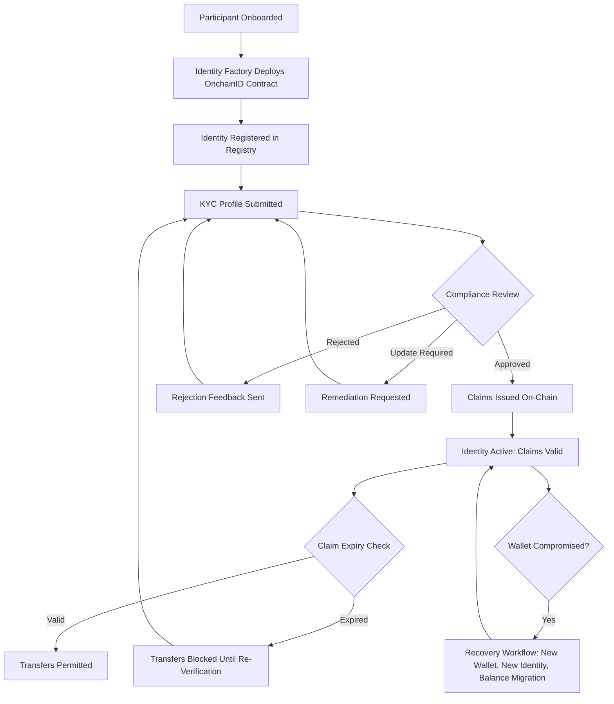

# Section 5: Verification, Claims, and Data Feeds — Loop 2 Refresh

## Refreshed Executive Summary

Regulated institutions face a fundamental trust problem when moving financial assets to digital infrastructure: how do you ensure that every participant is who they claim to be, that every transfer complies with applicable regulations, and that the market data driving valuation and distribution decisions is reliable and auditable?

DALP's verification and data feed architecture addresses this challenge through three integrated capabilities that operate at the protocol level rather than the application layer. On-chain identity verification through OnchainID anchors every participant's credentials as cryptographically signed claims on an immutable ledger. A configurable compliance engine with 18 module types evaluates those credentials against regulatory rules before any transaction executes, blocking non-compliant transfers at the smart contract level. A purpose-built data feed infrastructure delivers price, NAV, and corporate action data through signed on-chain channels with full audit trails and Chainlink-compatible adapters for external consumption.

These capabilities converge into a verification ecosystem where an investor verified for one asset does not need to re-verify for another, compliance rules for MiCA coexist alongside Reg D on the same platform without code changes, and a price feed consumed by a compliance module uses the same trust infrastructure as the feed consumed by an external DeFi protocol. Compliance officers configure requirements through a single operational surface. Auditors trace every decision back to specific claims and feed values through standard SQL queries across 18+ analytics views. Operations teams monitor compliance posture in real time rather than discovering violations during periodic reviews.

---

## Refreshed 5.1.1: The Identity Model

Every participant in a regulated securities ecosystem must be identifiable, verifiable, and auditable. DALP addresses this requirement through OnchainID, an identity protocol based on the ERC-734/ERC-735 standards that provides a structurally different approach to identity management compared to centralized application databases.

Each participant, whether an individual investor, an institutional entity, or a smart contract, is represented by a dedicated on-chain identity contract. This contract serves as a persistent, tamper-evident identity anchor that cannot be silently modified by a database administrator or compromised through a single application-layer breach. The identity contract is the canonical record of who a participant is and what has been verified about them.

Identity attributes such as KYC completion, accreditation status, jurisdictional eligibility, and AML clearance are represented as cryptographically signed claims attached to the identity contract. Each claim is traceable to the trusted issuer that created it, establishing a verifiable chain of trust that auditors can follow from the claim consumer back to the original verification provider. This traceability is inherent in the data model, not a reporting feature added after the fact.

Consider a sovereign wealth fund onboarding institutional investors across three jurisdictions. In a traditional platform, each jurisdiction's KYC provider operates in isolation: the fund administrator manages separate databases, reconciles verification status manually, and hopes the application-layer enforcement rules stay consistent across regions. In DALP, each investor's identity contract holds verifiable claims from jurisdiction-specific trusted issuers, the compliance engine evaluates those claims against the fund's configured regulatory expression, and the enforcement happens at the protocol level, identically for every transfer regardless of jurisdiction. An investor verified in one jurisdiction does not need to repeat the process for another fund on the same platform, provided the claim topics and issuer trust chain remain valid.

Claims include optional expiration timestamps that the compliance engine respects without exception. When a KYC claim expires, the system blocks transfers regardless of previous compliance history. There is no grandfather exception for stale verification, which means re-verification deadlines are architecturally enforced rather than dependent on operational discipline.

---

## Refreshed 5.1.2: Identity Lifecycle (V2 Auth Model)

The identity lifecycle in DALP follows a structured progression from creation through ongoing verification, with recent architectural improvements that simplify deployment while maintaining security guarantees.

**Identity Creation**: When a participant is onboarded, DALP deploys an OnchainID identity contract through the Identity Factory. The V2 factory implementation delegates authorization to the platform directory's administrative role rather than maintaining a local admin role. This architectural simplification reduces the number of privileged transactions during system setup while maintaining the same security invariants: only authorized platform administrators can create identity contracts. For smart accounts (ERC-4337), identity creation is atomic with account deployment, and the factory automatically issues a claim identifying the identity as a platform-managed smart account.

**Identity Registration**: The created identity is bound to the participant's wallet address through the Identity Registry. DALP supports two registration models: self-service registration for participants who hold their own wallet management keys, and admin-initiated batch registration for onboarding workflows where individual blockchain transactions from each participant would create unacceptable friction.

**Claim Issuance**: Trusted issuers attach verifiable claims to identities through two pathways. Auto-claims are issued programmatically based on KYC review outcomes, with server-side validation ensuring that claim values match approved profile data (the content hash creates a deterministic binding between the off-chain review and the on-chain attestation). Manual claims are issued by trusted issuers through the API or operational console. Both pathways enforce the same validation and queue semantics.

**Identity Recovery**: DALP provides a durable, phase-tracked recovery workflow for lost or compromised wallet access. The process proceeds through deterministic phases: creating a new wallet, deploying a replacement identity, executing on-chain recovery, revoking existing sessions and credentials, and migrating token balances. Each phase is persisted through the durable execution engine, surviving infrastructure failures. The workflow includes preflight recoverability checks, a confirmation gate for irreversible actions, parallelized pre-checks, and per-token balance migration with logging for partial failures.

*Figure: Identity lifecycle from onboarding through claim issuance, expiry enforcement, and recovery*

---

## Refreshed 5.3: Trusted Issuers Registry

### Three-Tier Trust Architecture

Managing trust in a multi-tenant, multi-asset environment requires more than a simple list of authorized identity providers. Different assets may require different verification providers, different tenants may have different compliance requirements, and platform-wide policies must apply consistently without requiring each tenant to independently configure them.

DALP addresses this through a three-tier Trusted Issuers Registry with deterministic cascading resolution:

**Subject-Scoped Issuers** provide the most precise control: a specific KYC provider authorized to issue claims only for a particular institutional fund, not for the entire platform. This granularity is essential for structured products where different tranches may require different verification standards, or for multi-jurisdiction programmes where local KYC providers should only attest to investors in their regulatory domain.

**System-Scoped Issuers** apply across all identities within a specific organization (tenant). When a system is bootstrapped, default trusted issuers are registered at this level, providing a baseline verification infrastructure for all assets within that organization.

**Global Issuers** apply platform-wide across all tenants. The Global Trusted Issuers Registry, introduced in the V2 meta-registry implementation, consolidates issuers that must apply universally. The most important example is the Identity Factory itself, which issues classification claims when deploying contract identities. Previously, each system had to independently register the Identity Factory during bootstrap; the global registry eliminates this duplication and ensures consistent trust infrastructure.

The resolution order is deterministic: subject-scoped issuers take precedence over system-scoped, which take precedence over global. The V2 meta-registry validates the global registry address through ERC-165 interface checks during both initialization and runtime updates, preventing misconfiguration. The global registry requires a platform-level administrative role (`DIRECTORY_ADMIN_ROLE`) that is architecturally separate from per-system management roles, preventing a tenant administrator from accidentally registering a trusted issuer whose claims would be accepted across other tenants.

This three-tier model eliminates a trade-off that most digital asset platforms force on their operators. A flat trusted issuer list means either every provider can issue claims for every asset (too permissive for complex institutional programmes) or each asset must independently configure its trusted providers (operationally expensive and error-prone when the same provider serves multiple assets). Some platforms attempt to solve this with application-layer configuration that sits outside the on-chain enforcement model, creating a gap between what the configuration says and what the smart contract enforces. DALP's tiered registry operates entirely on-chain, which means the trust hierarchy is enforced at the same protocol level as the compliance checks that consume it.

---

## Refreshed 5.4.4: Compliance Module Library

### 18 Configurable Compliance Module Types

DALP provides 18 configurable compliance module types, each addressing a specific regulatory requirement and operating independently at the smart contract level. These modules compose: multiple modules can be attached to a single token, and every module must pass for a transfer to execute.

**Identity and eligibility verification** forms the foundation of most compliance configurations. The SMARTIdentityVerification module evaluates logical expressions over identity claims using a Reverse Polish Notation (RPN) system that supports arbitrary AND, OR, and NOT combinations. A compliance officer can configure rules such as "accredited investors OR (KYC verified AND AML cleared AND jurisdiction approved)" as a single expression, without writing code. Country-based allow and block lists restrict transfers based on participants' jurisdictional claims. Identity-level allow and block lists provide address-specific control for court-ordered freezes or individual-level restrictions.

**Transfer control mechanisms** govern how and when assets move between participants. The transfer approval module requires pre-approval before transfers execute, with configurable exemption expressions that allow institutional investors with verified credentials to trade freely while retail investors require manual approval. Time-lock enforcement imposes minimum holding periods with identity-based exemptions, so qualified institutional investors can be exempt from lock-up periods that apply to retail participants. Transfer amount limits and transaction frequency controls provide rate-limiting at the individual transfer and participant level.

**Supply and participant governance** ensures that token operations respect regulatory caps and structural requirements. Supply cap enforcement prevents issuance beyond a configured maximum. Investor count limits cap the number of holders with topic-based counting that enables configurations such as limiting non-accredited investors to 35 (Reg D) while imposing no cap on accredited investor count. The topic filter determines which investors are counted toward the limit, not which are blocked.

**Settlement and collateral controls** address asset backing integrity. Collateral ratio requirements enforce minimum backing ratios, and collateral backing verification confirms adequate collateral before operations proceed. These modules reference the platform's data feed infrastructure for current valuations, creating a direct link between market data and compliance enforcement.

The power lies in composition. A European bond might combine identity verification with a MiCA-compliant expression, a country block list excluding sanctioned jurisdictions, an investor count module capping non-institutional investors, and a time-lock with exemptions for qualified institutional investors. All four modules evaluate independently during every transfer. Adding or removing modules does not require redeploying the token, which means compliance configurations evolve with regulatory requirements without disrupting existing asset holders.

---

## Refreshed 5.4.5: Compliance Pre-Check via Simulation

Before any transaction reaches the blockchain, DALP performs a compliance pre-check through simulation. The execution engine builds the transaction payload, then simulates it against the compliance engine's `canTransfer` function. This simulation evaluates all attached compliance modules: identity claims, transfer restrictions, supply limits, time-based rules, and collateral requirements.

If simulation fails, the failure surfaces immediately with a structured error code from DALP's catalog of 534 auto-generated error codes, each carrying metadata including human-readable messages, severity classification, and suggested corrective actions. The operator knows precisely which compliance module failed, why, and what action to take, rather than receiving an opaque transaction revert.

If simulation succeeds, the transaction proceeds to custody signing. The on-chain compliance engine also enforces during actual execution, which means compliance state changes between simulation and broadcast (such as a claim expiring in the interval) will still cause the transaction to revert. The pre-check prevents wasted gas and provides immediate feedback; the on-chain enforcement is the authoritative control.

This dual enforcement model (simulate before, enforce during) provides both operational convenience and regulatory assurance. Operations teams get immediate feedback on why a transfer would fail. Regulators get the guarantee that compliance is enforced at the protocol level regardless of what happens at the application layer.

---

## Refreshed 5.5.1: FeedsDirectory

### Centralized Discovery, Decentralized Delivery

DALP's data feed system is built around the FeedsDirectory, a central registry that separates discovery (which feed serves a given data request) from delivery (the individual feed contracts). This indirection allows feeds to be replaced, upgraded, or rotated without disrupting consumers.

Each feed registration captures the subject (token address for asset-specific feeds, or zero address for global data such as FX rates), the data topic, the feed contract address, the feed kind, and a schema hash that pins the expected data format.

The directory enforces strict validation during registration. Every feed must reference a topic registered in the platform's Topic Scheme Registry; unregistered topics are rejected. For scalar feeds, the schema hash must match the canonical format, with automatic normalization that handles both parenthesized and non-parenthesized input signatures. The directory validates that the feed contract implements the required interface through an ERC-165 check, preventing registration of contracts that cannot serve data.

Feed replacement follows even stricter rules: the replacement must match the original in kind, schema hash, and decimal precision. This prevents silent format changes that could break downstream consumers or introduce calculation errors in compliance modules that depend on feed data. If a feed format genuinely needs to change, the existing feed must be explicitly removed and a new feed registered, making the change visible and auditable.

Global feeds can only be managed by the system-level Feeds Manager role, not by individual token governance roles. This prevents asset-level operators from affecting economy-wide data such as FX rates or benchmark interest rates. Read access is unrestricted, enabling any on-chain or off-chain consumer to query feed data.

---

## Bridge to Section 6

The verification and data feed infrastructure described in this section operates on top of DALP's technical architecture: the durable execution engine that guarantees workflow completion for multi-step compliance operations, the indexer that transforms on-chain verification events into queryable analytics views, the security layers that protect the claim issuance and feed submission pathways, and the deployment infrastructure that ensures this trust layer is available with institutional-grade reliability. Section 6 presents that technical architecture in detail.
