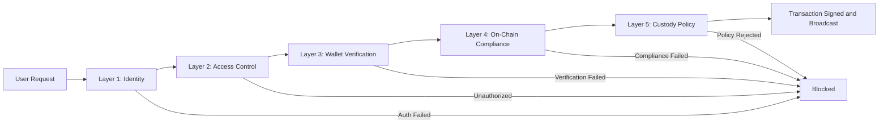

# Section 6: Technical Proposal — Loop 2 Refresh

## Refreshed Executive Summary

Institutional adoption of digital asset infrastructure depends on a straightforward question: can the technology meet the same operational standards that traditional financial systems have spent decades establishing? High availability measured in four nines. Security controls that satisfy five independent audit layers. Deployment models that respect data sovereignty. Upgrade paths that do not require taking the platform offline, redeploying existing assets, or disrupting holders' balances.

DALP's architecture is designed around these requirements. The platform runs on Kubernetes (standard distributions and Red Hat OpenShift), supports cloud, on-premises, and hybrid deployment models, and integrates with institutional infrastructure including HSM-backed key management, enterprise observability stacks, and existing identity providers. A 534-code structured error catalog provides immediate, actionable feedback for every failed operation. Distributed tracing instruments every step from API entry through custody provider signing, enabling operations teams to diagnose issues across trust boundaries they do not control.

This section presents the technical architecture in sufficient detail for a technical evaluation committee to assess the platform's fitness for institutional deployment, and in sufficient clarity for business and compliance stakeholders to understand why each architectural choice matters for their operational and regulatory requirements.

---

## Refreshed 6.1.1: Architectural Principles

DALP's architecture follows five foundational principles, each with concrete implementation consequences:

**Lifecycle-first design** means every architectural component serves the full digital asset lifecycle, not just token creation. The platform's data model, workflow engine, and compliance infrastructure account for ongoing operations: coupon payments, corporate actions, holder management, and asset maturity from day one. Platforms designed primarily for token issuance typically discover these operational requirements only when their first asset reaches a coupon date or maturity event. DALP's architecture avoids this pattern because the same execution engine that processes initial token creation also processes the 50,000-holder coupon distribution three years later.

**Durable execution** is the core reliability mechanism. All stateful operations run through a durable execution engine that guarantees workflow completion through infrastructure failures, process restarts, and network partitions. A bond coupon payment processing 50,000 distributions will complete all 50,000 even if the platform restarts mid-execution, resuming from the exact distribution where it was interrupted. This is the execution model for every multi-step operation, not an optional reliability layer.

**Defense-in-depth** enforces security at five independent layers: authentication, authorization, wallet verification, on-chain compliance, and custody provider policy. The independence matters. A compromised session token is blocked by wallet verification. A bypassed API authorization check is blocked by on-chain compliance. Even if all off-chain controls fail, custody provider policies provide the final gate before any transaction reaches the blockchain. No single control failure grants unauthorized access.

**Separation of concerns** cleanly divides API routing, business logic, blockchain interaction, data indexing, and observability into independently deployable components. When transaction processing needs more capacity, it scales without affecting the API layer. When the indexer requires an upgrade, it rebuilds data in an isolated schema and switches atomically without API downtime.

**Provider abstraction** prevents vendor lock-in. Database, cache, object storage, secrets management, and custody are accessed through abstracted interfaces with seven storage provider aliases, three custody backends, and three cloud-native identity patterns (AWS IRSA, Azure Workload Identity, GCP Workload Identity). The same DALP deployment runs on AWS, Azure, GCP, or on-premises with configuration changes only.

---

## Refreshed 6.4.1: Defense-in-Depth Security

DALP enforces security at every platform layer, with each layer operating independently. This five-layer model means the security posture does not depend on any single control working correctly.

*Figure: Five-layer security model. Each layer independently blocks unauthorized transactions. No single layer failure grants access.*

**Identity (Layer 1)** resolves the caller through browser sessions, API keys, or CLI device flows. An architectural decision that distinguishes DALP from most platforms: API keys are explicitly blocked on the browser-facing endpoint, and browser sessions are blocked on the programmatic endpoint. This endpoint affinity prevents credential type confusion attacks where, for example, a stolen API key is replayed through the browser session endpoint to bypass scope restrictions.

**Access Control (Layer 2)** enforces role-based authorization through a middleware chain that reconciles on-chain access control state into platform authorization at request time. Role changes made on the blockchain are reflected in the next API request without synchronization delays. Per-asset roles are independent: authority on one asset does not grant authority on another.

**Wallet Verification (Layer 3)** provides step-up authentication for blockchain write operations. Before any transaction is signed, the user provides a secondary factor (PIN, TOTP, or backup codes), each with per-use replay protection. This layer exists because a compromised browser session should not be sufficient to move assets.

**On-Chain Compliance (Layer 4)** evaluates identity claims and compliance modules at the smart contract level, during both simulation and actual execution. This enforcement is protocol-level: it cannot be bypassed by application-layer modifications, API manipulation, or database changes.

**Custody Policy (Layer 5)** applies the custody provider's own policy engine as the final external gate. For MPC custody deployments, this includes programmatic policy evaluation with amount thresholds, multi-party approval requirements, IP restrictions, and time-based controls. These policies operate entirely outside DALP, providing a hard boundary that even a fully compromised platform deployment cannot bypass.

The key property is independence. Most competing platforms implement two or three security controls but treat them as layers in a single stack where bypassing an upper layer exposes everything below. In DALP, each layer evaluates independently. The effective security posture is the product of five layers' reliability, not the reliability of the weakest one. A central bank evaluating digital settlement infrastructure needs this level of assurance, because the alternative is trusting that a single application-layer access control system will never be misconfigured, compromised, or circumvented.

---

## Refreshed 6.5: HA/DR Architecture

### Institutional-Grade Availability

Digital asset infrastructure has a characteristic that traditional application platforms do not: the blockchain ledger is inherently replicated. Every validator node maintains a complete copy of on-chain state. This means the HA/DR conversation for DALP focuses on application-layer availability (API, database, operational continuity) rather than asset data itself, which is protected by the distributed ledger's own replication.

If the application database is lost entirely, on-chain data (asset balances, compliance state, identity claims) can be re-derived by re-indexing from the blockchain. The indexer's zero-downtime reindexing architecture makes this practical: a new indexer version builds a fresh dataset in an isolated schema alongside the running version, then switches atomically via pass-through views.

| Scenario | RTO | RPO | Monthly Effort | Best For |
|----------|-----|-----|---------------|----------|
| Cloud-native (recommended) | 2 to 15 min | Seconds to 1 min | 8 to 16 hours | Most deployments |
| Hot-warm | 30 to 180 min | 5 to 60 min | 25 to 40 hours | Geographic redundancy |
| Hot-hot (consortium) | 1 to 10 min | Seconds to minutes | 40 to 60 hours | Multi-region active-active |

**Cloud-native deployment** uses managed services across three or more availability zones. Managed PostgreSQL with synchronous replication handles automatic failover. Object storage provides eleven nines of durability. Setup requires 2 to 3 days with one platform engineer. Ongoing effort is achievable with 0.25 FTE.

**Hot-warm deployment** provides geographic redundancy with manual or automated switchover. The secondary region maintains near-real-time data replication. For institutions where a sub-15-minute recovery target is critical (for example, a central securities depository processing daily settlement batches), this model ensures that a regional outage does not cascade into missed settlement deadlines.

Blockchain-specific HA properties reinforce the application-layer model. Permissioned networks with IBFT 2.0/QBFT consensus tolerate f = (n-1)/3 Byzantine failures: a four-validator setup tolerates one failure, seven validators tolerate two. Additional RPC nodes provide read scalability and redundancy. The indexer's rotating schema architecture means upgrades and re-indexing happen without read downtime.

---

## Refreshed 6.7: Monitoring and Observability

### Operational Visibility From Day One

Operating a digital asset platform requires visibility into both traditional application health (API availability, error rates, resource utilization) and blockchain-specific operational state (block production, consensus health, transaction confirmation, compliance enforcement patterns). DALP provides this visibility out of the box through three observability pillars: time-series metrics (VictoriaMetrics), structured logs (Loki), and distributed traces (Tempo).

The distributed tracing architecture deserves specific attention because it addresses a challenge unique to delegated custody deployments. When a transaction involves MPC signing through an external custody provider, the execution path crosses trust boundaries that DALP does not control. The platform instruments these external calls with dedicated tracer namespaces, covering 20+ call sites for each supported custody provider. Operations teams can diagnose whether latency or failures originate in the platform, the custody provider, or the blockchain network, without needing to correlate logs across separate systems.

Pre-built Grafana dashboards cover six operational domains: node utilization, blockchain infrastructure health, operations overview, transaction monitoring, compliance activity, and security events. These dashboards provide immediate visibility from deployment day without custom development.

For compliance and regulatory reporting, the indexer maintains 18+ PostgreSQL analytics views across five domains: identity, compliance, addons, cross-cutting operations, and pricing. These views are accessible through standard SQL, which means any enterprise BI tool (Looker, Tableau, Power BI) connects directly to the analytics layer. Compliance officers query transfer patterns, claim coverage gaps, trusted issuer activity, and module enforcement statistics through the same tools their organization already uses.

Blockchain health monitoring implements three-sample hysteresis for status changes, preventing false alerts from transient network blips. Structured alert delivery uses branded notification templates with severity, affected components, description, and one-click silence URLs.

---

## Smart Contract Upgrade Path

DALP smart contracts use UUPS (Universal Upgradeable Proxy Standard) proxy patterns managed through the on-chain directory. This enables contract logic upgrades without redeploying tokens: existing holders retain their balances and identity bindings. Compliance modules can be updated to address new regulatory requirements without disrupting existing operations. New features are added through the configurable extension system (up to 32 pluggable features per token).

The upgrade path is governance-controlled. Only authorized system-level roles can initiate contract upgrades, and the upgrade transaction follows the same five-layer security model as all other blockchain operations. This means a smart contract upgrade receives the same scrutiny and approval workflow as a token transfer, preventing unauthorized code changes from reaching production.
