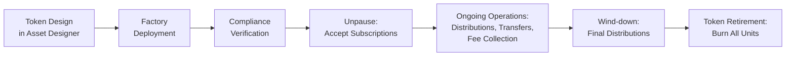

# Fund Units: DALP's Full Coverage for Tokenized Investment Funds

---

## Introduction

Tokenizing fund units is straightforward in theory: represent LP interests or fund shares as digital tokens and let investors trade them. In practice, the operational complexity overwhelms most tokenization platforms. Subscriptions must price against audited NAV. Redemptions must respect notice periods, gate provisions, and lock-up constraints simultaneously. Distributions must reach thousands of holders at the correct pro-rata amount, net of fees, on schedule. Transfer restrictions must enforce GP consent, right of first refusal, and qualified purchaser requirements at the protocol level, not merely in application logic that a direct blockchain transaction can bypass.

DALP treats fund units as first-class financial instruments within its configuration-driven architecture. The Fund asset type provides the structural foundation, while composable token features, compliance modules, and system addons address the operational demands that separate institutional fund management from basic token transfers. This section examines every aspect of DALP's fund unit coverage, drawing clear boundaries between what the platform handles natively and what remains with the fund administrator or general partner.

---

## NAV Integration and Pricing

### Why NAV Matters at the Protocol Level

Net Asset Value drives every material operation in a fund's lifecycle. Subscriptions price against it, redemptions settle at it, performance reporting derives from it, and regulatory filings reference it. A digital fund platform that treats NAV as an informational display rather than an operational primitive cannot support institutional workflows.

DALP approaches NAV integration through its data feeds infrastructure and yield schedule system. These two mechanisms allow fund operators to consume external NAV data, publish it on-chain with cryptographic signatures and full audit trails, and use those values to drive distribution calculations and investor reporting.

### Data Feed Architecture

DALP's data feed system provides signed, on-chain price and NAV channels. Fund administrators publish NAV updates at the frequency their fund structure requires: daily for open-ended funds, weekly for private equity vehicles, or on-demand for event-driven valuations triggered by material portfolio changes.

Each feed entry is recorded on-chain with publisher attribution, creating an immutable history of every NAV value. When a regulator asks what NAV was used for a specific redemption six months ago, the answer is cryptographically verifiable rather than dependent on a database backup. Feed staleness detection flags operations that depend on outdated NAV, preventing subscriptions or distributions from executing silently against stale values.

### Where NAV Calculation Lives

DALP does not calculate NAV internally, and this boundary is intentional. Fund NAV calculation involves portfolio valuation, accrued income computation, expense allocation, and accounting reconciliation. These calculations belong to the fund administrator.

The integration model works through DALP's API: the fund administrator exports NAV data from their calculation engine, and the fund operator publishes that value to the on-chain feed system. DALP provides the transport, signing, storage, and consumption infrastructure. Pre-built connectors to specific fund administration platforms are not shipped; each integration is configured through the API based on the administrator's data export format.

This separation prevents a parallel calculation engine from diverging from the administrator's authoritative figures. DALP enforces the downstream consequences of NAV without introducing accounting risk.

---

## Subscription and Redemption Mechanics

### Subscription Workflows

Fund unit subscriptions follow DALP's token issuance pipeline, adapted for fund-specific requirements. The workflow progresses through identity verification, compliance evaluation, and minting in a deterministic, fail-closed sequence.

The compliance engine evaluates each subscriber against all configured modules before any units are minted. For a typical fund deployment, this means verifying the investor's on-chain identity claims (KYC completion, accreditation status, jurisdictional eligibility), checking against investor count limits, and confirming that the subscription does not breach configured supply caps. A fund restricted to qualified purchasers under Regulation D requires an accreditation claim from a trusted issuer; without it, the minting transaction reverts.

**Token Sale Infrastructure.** DALP's token sale addon provides the structured primary offering mechanism. The sale contract supports minimum subscription amounts, per-investor purchase limits, multi-currency payment acceptance through approved payment tokens, and soft/hard cap mechanics with automatic refund safety. An optional presale phase allows anchor investors to subscribe before the general window opens. A five-tab operational console gives fund operators real-time visibility into subscription progress, investor participation, and cap utilization.

**Capital Commitment Tracking.** For capital commitment structures in private equity and venture funds, DALP records committed amounts through the token sale mechanism and tracks funded versus unfunded portions. Capital calls are processed as sequential minting events against each investor's commitment. The platform maintains the relationship between commitment and funded capital, providing the operational data that capital call notices and investor statements require.

### Redemption Processing

Redemption is the inverse of subscription: an investor surrenders fund units in exchange for the underlying value. DALP handles the token-side mechanics through its burn infrastructure, permanently removing units from circulation and decreasing total supply.

For open-ended funds with regular redemption windows, the fund operator processes redemption requests at NAV, verifies the investor holds sufficient unfrozen units, executes the burn, and distributes proceeds through the payment token. The compliance engine validates that the redemption does not violate configured restrictions, such as minimum holding periods enforced through the TimeLock compliance module.

**Notice Periods.** The Transfer Approval compliance module requires explicit operational approval before a burn executes. An investor's redemption request triggers the approval workflow, and the fund operator grants approval only after the notice period has elapsed and NAV has been determined. Configurable expiry windows on approvals prevent stale redemption requests from executing at outdated NAV values.

**Gate Provisions.** Gate logic, which limits total redemptions processable in a single period, is managed at the operational layer. The fund operator determines whether a gate threshold has been reached and queues excess requests for the next processing window. DALP provides the burn mechanics and balance tracking; the gate calculation and queue prioritization sit with the fund administrator's operational processes. This is an area where the platform provides the enforcement primitives but not the workflow orchestration.

### Batch Processing

Both subscriptions and redemptions support batch operations: up to 100 investors per API call, with compliance checks applied individually to each investor. If any single investor fails a compliance check, the entire batch is rejected, maintaining the fail-closed guarantee. For fund events involving thousands of investors, operators process sequential batches through the API.

---

## Distribution and Dividend Mechanics

### Two Distribution Models

Fund distributions are operationally demanding: calculating each investor's entitlement, deducting fees and expenses, scheduling the payment, and executing it across potentially thousands of holders. DALP addresses this through two complementary mechanisms.

**Yield Schedule Addon.** This system automates distribution of returns to token holders. It captures a snapshot of balances at a defined record date, calculates pro-rata entitlements based on proportional ownership, and executes distribution in a designated payment token. Three cadence models are available: one-time distributions for event-driven payouts like capital returns, recurring distributions on fixed intervals for regular income payments, and custom schedules for funds with irregular distribution timing. Distributions can be denominated in the fund's own token (reinvestment) or a separate payment token such as a stablecoin (cash distribution).

**Fixed Treasury Yield Feature.** For funds with a defined yield rate, this token feature provides a pull-based claiming mechanism. The issuer funds a treasury, and holders claim accrued yield at configured intervals. Historical Balance snapshots determine each holder's proportional share at each accrual period. The pull-based model avoids the gas cost challenges of iterating over thousands of holders by shifting the claiming action to investors, while ensuring unclaimed yield remains available.

### Waterfall Calculations: An Honest Boundary

Distribution waterfalls involving preferred return hurdles, general partner carried interest, catch-up provisions, and clawback calculations are fund-specific accounting logic that sits outside DALP's native scope. The fund administrator or a dedicated waterfall calculation engine determines the net distribution per investor, and DALP executes the resulting payments.

This boundary exists deliberately. Waterfall calculations involve legal interpretation of partnership agreements, accounting judgments about realized versus unrealized gains, and multi-period tracking of preferred return accruals. DALP provides the execution and immutable audit layer; the calculation layer remains with the professionals who own that domain.

### Fee Collection

Three fee mechanisms serve fund operations through DALP's token feature system:

| Fee Type | Mechanism | Typical Use |
| --- | --- | --- |
| AUM Fee | Calculates and collects management fees based on configured rate against NAV or total supply at regular intervals | Fund management fees |
| Transaction Fee | Collects a configured percentage on every secondary transfer | Transfer charges on LP interest trades |
| External Transaction Fee | Routes fees to a separate address from the token issuer | Third-party fee collection (placement agents, distributors) |

Fee features execute through the token's hook system. Collection is atomic with the underlying operation: if a transfer completes, the fee is collected; if the transfer reverts, no fee is charged.

---

## Transfer Restrictions and Secondary Market Controls

### Lock-up Period Enforcement

Private fund structures routinely impose lock-up periods. DALP enforces these through the TimeLock compliance module, which tracks holding periods at the individual investor level using FIFO batch accounting.

When an investor receives fund units, the module records the acquisition timestamp. Subsequent transfer attempts check whether the oldest held units have cleared the configured lock-up duration. Transfers attempted before the lock-up expires revert at the smart contract level. No application-layer workaround can bypass this on-chain restriction. Exemption expressions allow qualified investor classes to be excluded from lock-up requirements under specific regulatory frameworks.

### Qualified Purchaser Verification

Identity verification compliance modules require every fund unit holder to possess specific claims from trusted issuers. The RPN expression engine allows complex eligibility rules without custom code: a fund might require KYC completion AND accredited investor status, or KYC AND either accredited investor OR qualified institutional buyer status. These expressions are configured at deployment and can be updated through governed administrative operations without redeploying the token contract.

### GP Consent and Right of First Refusal

The Transfer Approval compliance module blocks secondary transfers pending explicit approval. When an investor initiates a transfer, the compliance engine halts execution until the fund operator (acting as GP delegate) grants approval through the API or UI. Approvals carry configurable expiry windows and one-time-use flags, ensuring that each approved transfer executes exactly once and stale approvals cannot be exploited.

The ROFR notification and exercise process, informing existing investors of the proposed transfer and collecting their responses within the contractual exercise window, is an operational workflow outside DALP's native features. DALP provides the enforcement gate and the audit trail; the communication workflow operates through the fund's existing investor relations processes.

### Investor Count Limits

DALP's Investor Count compliance module enforces holder caps at the smart contract level. Both global limits and per-country sub-limits are supported. Every transfer that would bring the holder count above the configured threshold is rejected before execution. For funds maintaining Regulation D exemptions, this ensures the holder count never inadvertently breaches the regulatory threshold.

---

## Fund Administrator Integration

### Bidirectional Data Model

Fund administration involves NAV calculation, investor registry maintenance, regulatory filing preparation, capital call management, and distribution computation. DALP's architecture respects this division of labor through a bidirectional integration model.

DALP provides the on-chain source of truth for token ownership, transaction history, and compliance events. The fund administrator provides the authoritative NAV, accounting data, and regulatory filing content. The two systems synchronize through DALP's API, with each maintaining authority over its respective domain.

**Outbound data (DALP to administrator):** Current holder registry with balances, full transaction history (mints, burns, transfers, distributions), compliance module evaluation results, identity claim status, and fee collection records. Over 18 specialized analytics views provide structured data through standard database connectivity.

**Inbound data (administrator to DALP):** NAV updates through the feed system, distribution amounts through the yield schedule, compliance parameter updates, and investor status changes.

### Reporting Capabilities

For investor statements, DALP provides the underlying data: holdings at any point in time through Historical Balance snapshots, distribution history, transaction records, and current NAV. Statement formatting and delivery remain the fund administrator's responsibility.

Regulatory filing data, including investor registers, transaction reports, and compliance attestations, is accessible through analytics views. DALP does not generate jurisdiction-specific filing documents such as AIFMD Annex IV reports or SEC Form D amendments, but it supplies the structured data those filings require.

### Connectivity

DALP provides RESTful API endpoints and webhook notifications for event-driven integration. Server-sent events (SSE) streaming delivers real-time transaction and lifecycle events, valuable during high-activity periods such as subscription closings, distribution dates, or capital call deadlines. Pre-built connectors to specific platforms are not shipped; integrations are built through the API.

---

## Fund Lifecycle: Configuration to Liquidation

*Figure 1: Fund unit lifecycle from configuration through retirement*

**Configuration.** The operator selects the Fund asset type in the Asset Designer, configures token features (AUM fees, historical balances, yield capabilities, voting power), binds compliance modules (identity verification, country restrictions, investor count limits, lock-ups, transfer approval), and sets parameters (supply cap, denomination currency, fee rates). The Fund asset type deploys through the Asset Factory with fund-specific validation rules, starting in a paused state.

**Active Operations.** The Supply Management role processes subscriptions and redemptions. The Governance role manages compliance parameter updates as the fund's regulatory footprint evolves. The Custodian role handles exceptions: freezing assets under investigation, executing forced transfers for regulatory compliance, and managing wallet recovery. Distribution events follow a structured workflow through the yield schedule system.

**Liquidation.** When the fund reaches its termination date, DALP supports orderly retirement. The operator processes final distributions, then burns remaining units. The pause mechanism freezes all operations during wind-down, preventing unauthorized transfers while final distributions are processed. For funds using Maturity Redemption, the process is automated: after the maturity date, transfers block and holders redeem at face value through an atomic burn-and-pay mechanism.

---

## Capability Summary

| Aspect | DALP Native | Requires Integration | Requires Custom Development |
| --- | --- | --- | --- |
| NAV consumption and on-chain publication | Yes | NAV calculation (fund admin) | |
| Subscription with compliance checks | Yes | | |
| Capital commitment tracking | Yes | Capital call notice delivery | |
| Redemption with lock-up enforcement | Yes | Gate queue management | |
| Pro-rata distribution execution | Yes | Waterfall calculations | |
| AUM and transaction fee collection | Yes | | |
| Lock-up period enforcement (FIFO) | Yes | | |
| Qualified investor verification | Yes | | |
| GP consent / transfer approval | Yes | ROFR notification workflow | |
| Investor count limits | Yes | | |
| Historical balance snapshots | Yes | | |
| Investor registry and audit trail | Yes | Statement formatting | |
| Regulatory filing data | Yes | Filing document generation | |
| Fund administrator API integration | Yes | Per-administrator connector | |
| Governance voting | Voting power (ERC-5805) at contract level | | Proposal system, quorum tracking, vote tallying UI |

---

## Capability Boundaries: What DALP Owns and What It Does Not

Institutional fund managers evaluating DALP should expect a platform that handles the on-chain compliance, lifecycle, and settlement mechanics of tokenized fund units with production-grade reliability. DALP owns identity verification, transfer restriction enforcement, distribution execution, fee collection, and the immutable audit trail that regulated operations demand.

What DALP does not own, and does not pretend to own, is the financial calculation layer: NAV computation, waterfall arithmetic, and regulatory filing formatting. These domains belong to fund administrators and compliance teams, and DALP integrates with them rather than replacing them. This division produces a cleaner architecture, fewer points of accounting divergence, and a system where each component operates within its domain of expertise.

For institutions that need a tokenization platform to serve as the compliance-enforced, auditable infrastructure layer beneath their existing fund operations, DALP provides that layer without requiring the institution to abandon their fund administrator, retool their reporting, or accept a parallel accounting system.
