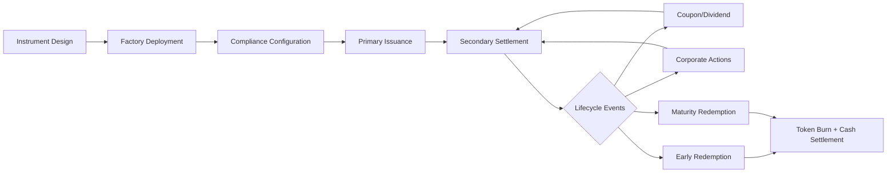
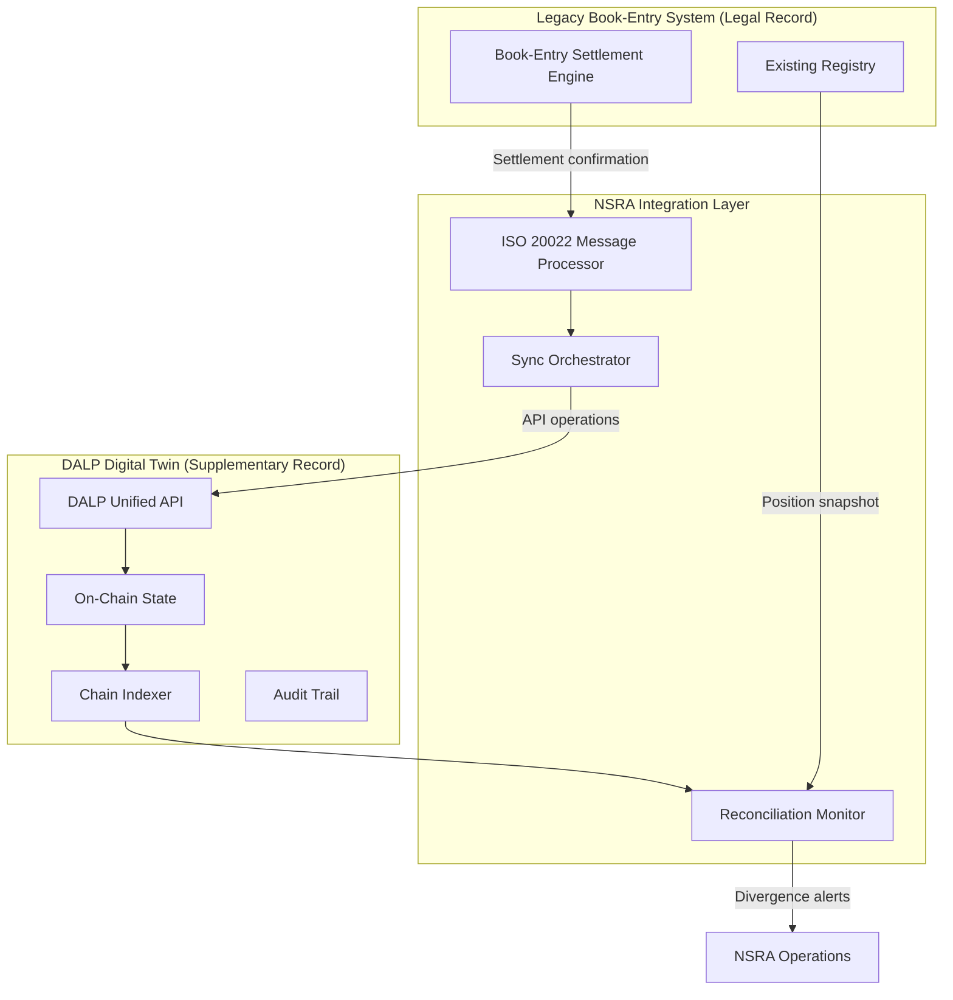
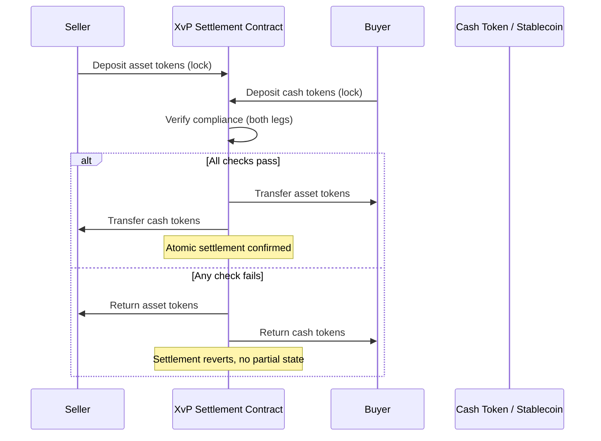
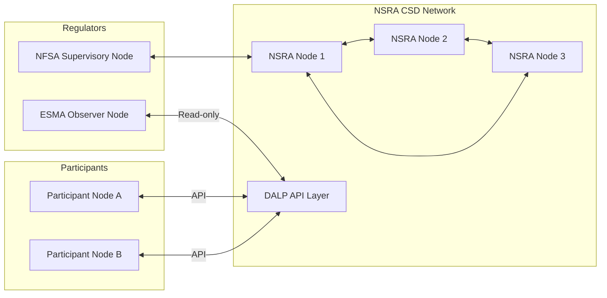
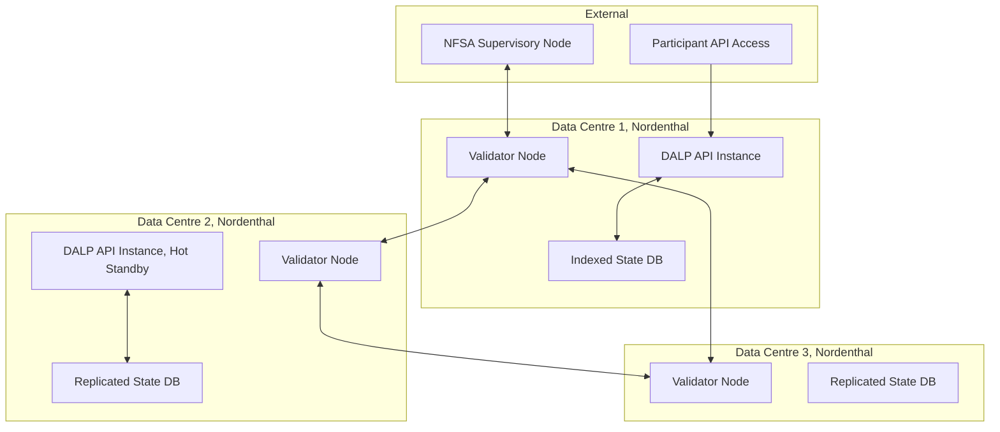

# SettleMint DALP Response to NSRA-RFI-2026-047

**Central Securities Depository Digital Twin Platform**

Submitted by: SettleMint NV
Response Date: 27 March 2026
Reference: NSRA-RFI-2026-047

---

## Executive Summary

The Nordenthal Securities Registry Authority has set itself a demanding modernisation challenge: introduce distributed ledger infrastructure to a live, regulated, high-volume CSD without disrupting settlement continuity, regulatory standing, or participant operations. This response sets out how DALP addresses each dimension of that challenge.

DALP is a production-ready digital asset lifecycle platform built on ERC-3643 compliant smart contracts. It operates on any EVM-compatible network, supports permissioned deployment on infrastructure entirely within NSRA's administrative control, and provides an API surface deep enough to build real-time synchronisation workflows against external systems. The platform covers the full instrument lifecycle for bonds, equities, and money market instruments; enforces compliance and eligibility rules at the smart contract layer; and provides atomic Delivery-versus-Payment settlement through its XvP addon.

DALP is designed to complement existing infrastructure, not replace it. The API-first architecture makes integration with NSRA's current book-entry system, SWIFT connectivity layer, and TARGET2 connection a design conversation rather than a fundamental constraint. Second, some elements of the RFI, specifically the Dutch auction mechanism for primary issuance and FIX protocol connectivity for primary dealer integration, fall outside DALP's current native capability. These gaps are described honestly, with the architectural pathway to address them through integration. Third, the governance model for a shared CSD ledger requires careful design: DALP provides the technical control surfaces, but the policy decisions about who holds upgrade authority and how dual-record ambiguity is resolved are institutional decisions that DALP supports rather than prescribes.

---

## Section 1: Instrument Coverage

### Full Lifecycle Support Across Security Classes

DALP supports all four instrument categories in scope for DIMP: government bonds, corporate bonds, listed equities, and money market instruments. The representation approach is identical across types: each instrument is a DALPAsset contract deployed through the platform's factory system, with compliance modules, token features, and lifecycle logic configured to match the instrument's regulatory and economic characteristics.

Bond instruments, whether government or corporate, are configured with the maturity redemption feature, which records the maturity date on-chain and triggers the redemption workflow at the scheduled time. Fixed coupon bonds use the fixed treasury yield addon for scheduled coupon distribution. Floating coupon bonds connect to DALP's price feed system, which consumes authorised external reference rate feeds and calculates coupon amounts accordingly. Zero coupon bonds are issued at a discount and redeemed at par on maturity, with no periodic distribution events. Callable bonds require additional configuration at the feature level: the maturity and redemption feature supports early redemption triggers, though the specific governance workflow for a call notice, a 60-day notice period and consent window, requires a managed operational workflow rather than an entirely autonomous on-chain trigger.

Inflation-linked bonds are a capability boundary that warrants direct acknowledgement. DALP supports data feed integration, and coupon calculations can reference external price data. However, CPI-indexed coupon adjustment, where the coupon amount changes dynamically based on published inflation indices, is not an out-of-the-box bond feature. Implementing it requires a custom feed integration and calculation step that produces the coupon distribution amount as input to the platform's distribution system. DALP provides the execution infrastructure; the indexation calculation is an integration design decision.

Corporate bond complexity, including convertible instruments and puttable structures, is addressed through the feature composition system. Convertible bonds require the conversion feature, which supports token-to-token conversion at a configurable rate. Puttable structures require a redemption request workflow, which the transfer approval module can be configured to support.

Listed equities are represented as DALPAsset tokens with dividend distribution configured through the airdrop addon. Stock splits and reverse splits are handled through administrative mint and burn operations combined with a supply adjustment workflow. Rights issues create new tokens at a subscription price for eligible holders, which DALP supports through the token sale addon. Redeemable preference shares combine the maturity redemption feature with dividend configuration.

Money market instruments present a distinct characteristic: many are created and extinguished in overnight or short-dated auction cycles, making them high-velocity instruments that require efficient issuance and redemption operations. DALP's factory deployment is designed for this pattern: instruments can be deployed, issued, settled, and redeemed within a single operational day. The CREATE2 deterministic deployment model provides predictable contract addresses, which simplifies integration with downstream settlement and accounting systems that need to track instrument identifiers. The platform's API supports batch operations, enabling NSRA's operations team to process multiple short-dated issuances and redemptions within the same operational workflow.

The table below summarises feature configuration for each instrument type:

| Instrument Type | Key Features Configured | Distribution Method | Redemption Model |
|----------------|------------------------|--------------------|--------------------|
| Government bond, fixed coupon | Maturity, fixed yield | Scheduled coupon | Maturity or call |
| Government bond, floating coupon | Maturity, price feed integration | Calculated coupon | Maturity |
| Government bond, inflation-linked | Maturity, external feed (custom calc) | Feed-derived coupon | Maturity |
| Corporate bond, callable | Maturity, early redemption | Scheduled coupon | Maturity or call |
| Corporate bond, convertible | Maturity, conversion | Scheduled coupon | Conversion or maturity |
| Listed equity, ordinary share | Dividend, voting power | Dividend distribution | None or share buyback |
| Listed equity, preference share | Dividend, timelock | Priority dividend | None or redemption |
| Money market instrument | Maturity, short-dated | None | Par redemption |


*Figure 0a: DALP Asset Designer showing compliance module selection for bond tokenisation, demonstrating the configuration-driven approach to instrument setup*

### Instrument Lifecycle Management

DALP manages the full lifecycle of each instrument from issuance through final redemption. Issuance begins through the platform's token factory, which deploys the instrument contract, configures compliance modules and token features, and makes the token available for distribution. Primary distribution can be handled through the token sale addon (fixed-price or presale-tiered offering) or through direct mint-to-custodian operations for instruments distributed through existing allocation systems.

Corporate action processing relies on the combination of the distribution system and administrative token operations. Dividend payments are queued through the airdrop addon and distributed pro-rata to eligible holders at the configured payment date. Stock splits multiply the supply proportionally and adjust individual holdings through a coordinated administrative workflow. Rights issues mint new tokens at a subscription price and make them available to eligible holders within the rights window, after which unsubscribed rights expire.

Maturity and final redemption retire the token supply on-chain: the platform burns the outstanding token balance, records the redemption event in the audit trail, and the associated cash payment is processed through the settlement system. For instruments with a mandatory redemption date, this workflow is configurable to execute automatically at the scheduled time.



*Figure 1: DALP instrument lifecycle from issuance through redemption*

---

## Section 2: Hybrid Record Architecture

### The Synchronisation Design Principle

The central architectural challenge in a digital twin deployment is maintaining coherence between two authoritative systems: the existing book-entry record, which holds legal title throughout Phase 1 and Phase 2, and the on-chain record, which must reflect the same reality at all times. DALP does not ship a pre-built CSD synchronisation layer, but the platform's API architecture provides every technical primitive needed to build one.

The synchronisation pattern NSRA describes, where the book-entry system remains the legal record and the on-chain state mirrors it in near real time, maps naturally to an event-driven integration architecture. The book-entry system emits settlement instructions and position updates through its existing ISO 20022 messaging layer. An integration service (which sits outside the DALP platform itself, within NSRA's integration infrastructure) consumes these messages, translates them into DALP API operations, and applies the corresponding state changes on-chain. DALP then records the operation with an immutable audit trail entry, and the integration service can verify the resulting on-chain state against the expected position before confirming settlement.



*Figure 2: Hybrid record synchronisation architecture, showing NSRA's integration layer bridging legacy and on-chain systems*

### Reconciliation Mechanisms

DALP provides the building blocks for reconciliation rather than a pre-built reconciliation product. The platform's chain indexer maintains a queryable view of all on-chain token balances, transfers, and lifecycle events. NSRA's reconciliation process compares this indexed state against position snapshots from the book-entry system, using the DALP API to query current holdings at any point in time.

For divergence detection, the integration layer subscribes to DALP's server-sent event (SSE) stream, which delivers real-time notification of every state-changing operation on the platform. When a settlement instruction completes in the book-entry system, the integration service applies the corresponding DALP operation and verifies that the resulting on-chain position matches the expected outcome. Any mismatch triggers an alert to NSRA's operations team before the discrepancy can compound across subsequent settlement cycles.

The reconciliation logic, specifically the rules for how long a mismatch may persist before escalation, what constitutes acceptable latency between book-entry settlement and on-chain reflection, and how conflict resolution is handled during connectivity failures, is policy-level design that NSRA defines. DALP enforces the technical operations; the reconciliation policy lives in the integration layer configuration.

### Migration from Supplementary to Authoritative Record

When NSRA and NFSA execute the regulatory amendment that designates the on-chain record as the authoritative legal register, the technical changes within DALP are minimal. The platform has always treated the on-chain state as definitive from a smart contract perspective; the token balances in DALP's contracts are the single source of truth for the platform's operations. What changes at the legal-record transition is the governance relationship between DALP and the legacy system: the legacy system becomes the mirror, the on-chain record becomes the source.

The migration sequence would involve a freeze window during which both systems confirm identical state, the formal designation of on-chain records as authoritative by regulatory order, and the reconfiguration of the integration layer to push state changes from DALP to the legacy system rather than the reverse. DALP requires no internal changes to support this transition, because its architecture has always been designed around on-chain state primacy.

### Exception Handling During Dual-Record Operation

Connectivity failures and settlement stress scenarios require a defensive operating model. During periods where the integration layer cannot synchronise book-entry changes to the on-chain record, DALP continues operating normally within its own settlement workflow, but the dual-record coherence guarantee is suspended. NSRA's operating procedures should define the acceptable period for unsynchronised operation, the state at which processing is paused to restore coherence, and the reconciliation workflow for catching up deferred updates.

DALP supports this through its transaction status API, which allows the integration service to query the disposition of every submitted operation, confirm which on-chain operations completed, and identify the point at which synchronisation broke. The audit trail provides an immutable record of the divergence period, which supports post-incident regulatory reporting.

---

## Section 3: Participant Connectivity

### ISO 20022 Support

DALP does not natively speak ISO 20022 as a wire protocol, but the integration architecture accommodates ISO 20022 messaging as the primary participant connectivity standard. The standard approach in DALP deployments serving institutional markets is to build an ISO 20022 translation layer that sits between participant messaging infrastructure and the DALP API. This layer receives incoming settlement instructions in the appropriate MX message format (sese.023 for settlement instructions, caev messages for corporate action notifications), translates them into DALP API operations, and returns confirmations in the appropriate response message format.

This pattern is not a limitation unique to DALP. Most digital asset platforms with ISO 20022 support implement it through a translation layer rather than native wire protocol support, because ISO 20022 is a business messaging standard designed for bank communication, not a smart contract execution protocol. The translation layer is where the institutional logic lives: how to map ISIN codes to on-chain token addresses, how to handle settlement netting, and how to generate account statements from indexed on-chain state.

DALP's REST API is the surface that the translation layer calls. Every settlement instruction results in one or more API operations: identity verification, compliance check, token transfer, and audit trail recording. The API returns structured responses with transaction hashes, confirmation status, and error codes that the translation layer can map back to ISO 20022 message responses. The participant-facing benefit of this architecture is continuity: CSD participants using existing SWIFT and ISO 20022 messaging infrastructure require no changes to their messaging workflows during the transition to the DIMP digital twin, because the translation layer presents the same ISO 20022 interface they already use.

### SWIFT Connectivity

SWIFT connectivity follows the same pattern: an integration service translates SWIFT MX messages into DALP API operations. For bond settlement specifically, ISO 20022 sese messages trigger the DvP settlement workflow, with the cash leg coordinated through a stablecoin or external payment rail integration. DALP does not maintain a SWIFT connection directly, but NSRA's existing SWIFT infrastructure, combined with an appropriate middleware layer, provides the participant connectivity model that the CSD operates today.

### FIX Protocol

FIX protocol connectivity for primary dealer integration represents a genuine gap in DALP's native capability. DALP does not speak FIX. Bridging between primary dealer trading systems using FIX and the DALP settlement layer requires a middleware service that translates FIX execution reports and trade confirmations into DALP settlement API calls. This is technically achievable, but it requires an integration design project rather than a configuration step. NSRA should factor this into the technical specification phase.

### REST and API Connectivity

Direct API connectivity for participants who want to integrate their systems programmatically is a first-class capability in DALP. The platform exposes a comprehensive REST API at `/api/v2` covering all operations: settlement submission, position queries, corporate action notifications, and account statement generation. The API uses HTTP API keys with configurable scopes, supports read-only keys for participants who need position visibility without settlement authority, and delivers an OpenAPI 3.1 specification that integration engineers can use to auto-generate client libraries.

For participant onboarding, DALP provides an identity and access model where each participant institution receives an on-chain identity via the OnchainID system, with verified institutional claims that authorise settlement operations within their permitted instrument and volume scope. Role assignment is governed by NSRA's designated administrative staff, and every role change is recorded in the audit trail.

```mermaid
flowchart LR
    subgraph Participants
        BROKER[Broker/Dealer]
        CUST[Custodian]
        CLEAR[Clearing House]
    end
    subgraph Connectivity
        SWIFT_GW[SWIFT/ISO 20022 Gateway]
        FIX_GW[FIX Bridge Middleware]
        API_KEY[REST API, API Key Auth]
    end
    subgraph DALP
        API[Unified API]
        ID[Identity Registry]
        COMP[Compliance Engine]
        SETTLE[XvP Settlement]
    end

    BROKER -- FIX -- FIX_GW
    CUST -- ISO 20022 -- SWIFT_GW
    CLEAR -- REST API -- API_KEY
    SWIFT_GW --> API
    FIX_GW --> API
    API_KEY --> API
    API --> ID
    API --> COMP
    API --> SETTLE
```

*Figure 3: Participant connectivity architecture, showing three integration pathways into DALP*

### Legacy and Modern Connectivity Coexistence

During the transition period, DALP supports the concurrent operation of legacy SWIFT connectivity and modern API-based connectivity through the same underlying platform. Different participants can use different connectivity methods based on their readiness: participants with established SWIFT infrastructure continue using the ISO 20022 translation layer, while technically advanced participants can adopt direct API integration. Both paths produce the same on-chain settlement outcome. NSRA's operations team sees a unified view of settlement activity regardless of which connectivity method each participant used.

---

## Section 4: Governance and Legal Architecture

### CSD Governance Model

DALP implements a seven-role access control model at the per-asset level, managed through an access manager contract at the system level. For a CSD deployment, the appropriate mapping is as follows: NSRA holds the GOVERNANCE_ROLE and ADMIN_ROLE, which authorise contract upgrades, compliance module changes, and participant access management. Licensed CSD participants receive settlement-scoped roles that authorise them to submit transfer instructions within their permitted scope but not to modify platform configuration. Regulatory supervisors receive read-only roles that provide full visibility into instrument state, participant positions, and transaction history without operational authority.

The governance model is not merely an access control configuration. It is an on-chain expression of NSRA's regulatory mandate. Because governance operations require the GOVERNANCE_ROLE, no participant or external party can modify instrument configuration, change compliance rules, or grant themselves elevated access without NSRA's explicit authorisation. Every governance operation is recorded on-chain with a timestamp and the authorised role that executed it.

Multi-signature governance is strongly recommended for production CSD deployment. Critical operations, particularly compliance module changes, contract upgrades, and role assignments, should require approval from multiple authorised signatories within NSRA. The platform supports this through external multi-sig integration at the governance role level.

### NSRA as Sole Authoritative Operator

DALP's access control architecture is designed to support exactly this model: NSRA as the sole authoritative operator of the CSD infrastructure, with participants having narrowly scoped settlement and reporting access. The platform's on-chain permission model ensures that even NSRA's infrastructure vendor cannot take administrative actions on the CSD's smart contracts without the keys assigned to NSRA's governance roles.

### Dual-Record Regulatory Framework Support

The regulatory dual-record framework, where on-chain records must not be treated as legally authoritative by participants during Phase 1 and Phase 2, is enforced at the governance and participant communication layer rather than within the platform itself. DALP cannot add a "this record is supplementary" enforcement mechanism that would prevent a participant from treating on-chain data as authoritative in their internal systems. That designation is a legal and contractual matter.

What DALP can provide is a clear operational boundary: participants access the platform through NSRA-defined roles with NSRA-defined scope. The terms under which participants operate, including the legal status of the on-chain record, are conditions of NSRA's participant access agreements, not platform configuration. DALP supports this by making the role assignments and access conditions fully auditable.

### On-Chain Corporate Action Governance

For corporate actions requiring bondholder consent, such as consent solicitations for bond restructuring, DALP includes the ERC-5805 voting power feature, which provides the on-chain infrastructure for recording voting weight against token balances. This is an honest boundary to describe carefully.

The voting power feature records balance-weighted votes and maintains historical balance checkpoints, which provides the data layer for quorum calculation and vote tallying. What DALP does not ship as a production-ready product feature is the full governance workflow: a proposal creation interface, a quorum enforcement mechanism that prevents outcome finalisation until quorum is reached, an on-chain record of the formal resolution, and a communication workflow for distributing vote results to relevant parties. These workflow components exist at the application layer, and implementing them for a CSD consent solicitation use case requires application development on top of DALP's contract infrastructure.

DALP provides the cryptographic vote recording substrate through ERC-5805, but the full bondholder consent solicitation system requires integration with a governance workflow layer that NSRA would commission as part of the DIMP technical build.

---

## Section 5: Settlement Architecture

### Atomic DvP Settlement

DALP's XvP (Exchange-versus-Payment) addon provides atomic Delivery-versus-Payment settlement. In an atomic DvP transaction, the asset leg and the cash leg execute simultaneously: either both complete or both revert. There is no state where an asset transfer has settled but the cash payment has not, eliminating the settlement risk that drives the counterparty risk in traditional T+2 settlement cycles.

The XvP addon supports multi-leg settlement, enabling simultaneous exchange of multiple assets and cash positions within a single atomic transaction. This is architecturally relevant for CSD settlement where a single netting cycle may involve multiple paired transfers across multiple participants.



*Figure 4: Atomic DvP settlement flow through the XvP addon*


*Figure 4a: DALP XvP Settlement interface showing an active settlement transaction, with asset and cash legs displayed alongside compliance status*

### T+0 Settlement

T+0 settlement is achievable for instruments where the cash leg is represented on the same network as the asset. When the cash leg is a stablecoin or CBDC deployed on the same EVM network as the DALP instruments, settlement finality is achieved within the network's block time, typically seconds rather than days. This is not a DALP capability constraint; it is a function of how the cash leg is implemented.

For instruments where the cash leg is settled through TARGET2 or another external payment system, T+0 settlement requires the external payment system to confirm in real time before the asset transfer executes, or alternatively, a pre-funded cash token model where participants maintain a balance of on-chain cash representation backed by central bank money. The design of the cash leg is a critical architectural decision for NSRA's DIMP programme that sits outside the scope of the DALP platform itself.

### Settlement Failure and Retry Logic

DALP's transaction architecture distinguishes between settlement instructions that fail compliance and those that fail for technical reasons. A settlement instruction that fails compliance, for example because the buyer's identity claims are expired or the transfer would exceed an investor limit, returns a structured error code with the specific rule violation. The instruction does not enter a pending retry state; the underlying compliance condition must be resolved before resubmission.

Technical failures, including network congestion that prevents transaction confirmation within an acceptable window, are surfaced through the transaction status API. NSRA's integration layer can monitor pending transactions and implement retry logic at the integration layer. DALP does not implement automatic retry for failed blockchain transactions, because blind retry in a settlement context risks duplicate settlement if the original transaction confirms after a delayed period.

Partial fills are not supported at the atomic settlement layer. An XvP instruction either settles fully or reverts in its entirety. Partial settlement requires the instruction to be decomposed into separate atomic transactions before submission.

### TARGET2 Integration

TARGET2 integration for EUR cash settlement follows the same integration pattern described for ISO 20022 connectivity. DALP does not connect to TARGET2 directly. The integration approach involves a payment bridge that receives TARGET2 settlement confirmations, then triggers the corresponding on-chain asset transfer through the DALP API. This bridge must handle the sequencing and timing constraints of TARGET2's settlement windows, as well as the error handling for cases where TARGET2 confirms the cash payment but the on-chain asset transfer fails.

---

## Section 6: Compliance, Regulatory Access, and Audit

### Supervisory Access Architecture

DALP supports real-time supervisory access through two channels. The first is the API, where regulators holding read-only keys can query current positions across all instruments and participants, retrieve transaction history for specific accounts or instruments, and export structured data for off-chain analysis. The second is the chain indexer's SSE stream, which delivers real-time notifications of every state-changing operation as it occurs on-chain.

For formal supervisory access with a dedicated regulatory node, DALP is deployed on EVM networks where NSRA controls the node infrastructure. A regulatory node participating in the network would independently receive and validate every block, giving NFSA and ESMA direct, platform-independent access to the on-chain state without routing through NSRA's application layer. This is a network topology design decision: NSRA operates the permissioned network, and NSRA grants NFSA a node that participates in validation without holding platform administration keys.



*Figure 5: Network topology with NSRA-operated nodes and regulatory access points*

### Audit Trail Capabilities

Every state-changing operation on the DALP platform generates an immutable audit trail entry recorded on-chain. The entry captures the operation type, the wallet addresses involved, the token amounts, the compliance module decisions, the timestamp of block inclusion, and the transaction hash that provides cryptographic proof of the event. Audit records cannot be deleted or modified because they are embedded in the blockchain state.

The audit trail covers all instrument events: token mint (issuance), transfer (settlement), burn (redemption), compliance rule changes, role assignments, and governance operations. For a CSD context, this means NSRA can reconstruct the complete ownership history of any instrument across any time period, which supports the regulatory examination requirements described in the RFI.

DALP's audit trail data is available through both the API and through direct chain queries. The retention period for on-chain data is indefinite, because the blockchain state is permanent. Off-chain indexed data, maintained by the chain indexer, is retained in accordance with NSRA's data governance policy.

### CSDR Reporting Support

DALP provides the underlying data that CSDR-mandated reports require: settlement instructions, settlement outcomes, fails records, and participant position data. The platform does not generate CSDR Annex reports in the prescribed regulatory format. Report generation from DALP's structured data output requires an integration with NSRA's regulatory reporting workflow, which formats the indexed data into the required CSDR submission format.

This is an accurate representation of where DALP's responsibility ends and NSRA's reporting infrastructure begins. DALP owns the data; NSRA's reporting system owns the formatted output. This model allows NSRA to maintain control over the reporting workflow, change the output format as regulatory requirements evolve, and integrate DALP data alongside other data sources in a unified reporting pipeline.

---

## Section 7: Technical Infrastructure

### Network Sovereignty and Deployment Architecture

DALP is network-agnostic within the EVM ecosystem. For a CSD deployment, NSRA would operate a permissioned EVM network, either a private network running a client such as Besu or Polygon Edge, or a dedicated subnet, with nodes located entirely within Nordenthal's national data centres. This gives NSRA full network sovereignty: NSRA controls who participates in block validation, what software version runs on the network, and under what conditions the network can be upgraded.

SettleMint provides the DALP application stack; the underlying network is operated by NSRA. This separation is important from a regulatory perspective: NSRA's CSD licence conditions apply to NSRA's infrastructure, not to a third-party operator's network.



*Figure 6: Three-data-centre deployment architecture with full NSRA network sovereignty*

### Throughput and Latency

DALP's throughput is primarily bounded by the underlying network's block production rate, not by the application layer. For a dedicated permissioned network with optimised block times, institutional-grade throughput of thousands of transactions per second is achievable. However, quoting a specific TPS figure requires knowing the network configuration: block time, block gas limit, transaction complexity, and node hardware specifications all contribute. SettleMint works with clients during the technical specification phase to define a network configuration that meets the stated throughput requirement, which for NSRA's 650,000 peak daily instructions translates to roughly 15 transactions per second sustained over a trading day, well within the capabilities of any modern permissioned EVM network.

Settlement finality, the point at which a transaction is irreversible, is a function of the network's consensus mechanism. For permissioned networks using IBFT or QBFT consensus, finality is deterministic: a transaction that appears in a confirmed block is final with no probability of reversion. This is a critical advantage over probabilistic finality chains for regulated settlement infrastructure.

### Disaster Recovery

DALP's disaster recovery architecture follows standard enterprise distributed system principles. The platform state lives on-chain, distributed across multiple validator nodes. As long as the network can form a validator quorum with the remaining nodes, operations continue. Node failure does not cause data loss.

For the application layer (DALP API and indexer), disaster recovery depends on the deployment architecture. In a three-data-centre configuration, the API layer can be deployed with hot-standby instances in each data centre. Failover to a standby instance is a load-balancer operation requiring no manual intervention. RPO and RTO targets are architecture-dependent: with a fully replicated database and automated failover, RPO under one minute and RTO under five minutes are achievable. Meeting the specific targets NSRA states in operational requirements requires validation against the specific deployment architecture during the technical specification phase.

---

## Section 8: SettleMint Credentials

SettleMint has operated the DALP platform in production for regulated financial institutions for over seven years. The deployments span capital markets infrastructure, sovereign securities programmes, and custody integration projects across Europe, the Gulf Cooperation Council, and Southeast Asia. The pattern of these deployments is directly relevant to NSRA's evaluation: they are not innovation pilots that were quietly retired, but live, business-critical systems operating under institutional SLAs with continuous transaction volumes.

In regulated capital markets, SettleMint has supported institutions managing bond, equity, and structured instrument programmes at scale, operating under MiCA, MiFID II, and equivalent APAC regulatory frameworks. Deployments in these contexts have required the same capabilities NSRA is evaluating: identity-verified participant onboarding, ex-ante compliance enforcement on all settlement operations, atomic settlement with full audit trail, and integration with existing ISO 20022 messaging infrastructure. One regulated bank deployment in Southeast Asia has operated continuously for more than four years, processing instrument issuance, settlement, and servicing across multiple asset classes on a daily basis.

In sovereign and infrastructure use cases, SettleMint has contributed to national-scale programmes in the Middle East, where platforms manage real estate tokenisation and capital markets infrastructure under direct regulatory oversight from financial market authorities. These programmes have undergone regulatory examination, vendor risk assessment, and penetration testing comparable to the scrutiny NSRA's DIMP programme will face from NFSA.

SettleMint's engineering team includes architects with direct prior experience in CSD modernisation programmes, post-trade infrastructure design, and the technical engagement with national and supranational regulators that capital market infrastructure projects require. The team has worked with institutions at the specification stage of similar projects to define data models, reconciliation approaches, and regulatory reporting architectures before a single line of DALP configuration was written. SettleMint is prepared to offer a similar structured engagement to NSRA during the DIMP technical specification phase.

Formal client references are available under a mutual confidentiality agreement, which SettleMint will provide through the formal tender process. SettleMint can additionally arrange a technical demonstration of the DALP platform, including bond lifecycle configuration, XvP settlement execution, and supervisory access, for NSRA's evaluation team at a mutually convenient time.


*Figure 7: DALP Monitoring dashboard showing real-time blockchain health metrics, demonstrating the production-grade observability available to CSD operations teams*

---

## Summary: Capability Assessment for NSRA-DIMP

| Requirement Area | DALP Capability | Notes |
|-----------------|----------------|-------|
| Government bonds, full lifecycle | Native | Fixed, floating, zero coupon; maturity, coupon, early redemption |
| Corporate bonds, callable, convertible, puttable | Native with configuration | Convertible requires conversion feature |
| Equities, dividends, corporate actions | Native | Stock splits, rights issues via administrative workflow |
| Money market instruments, short-dated | Native | Efficient issuance and redemption cycles |
| Inflation-linked bond CPI indexation | Integration-dependent | Feed integration plus external calculation; DALP executes distribution |
| Hybrid synchronisation, supplementary record | API-based integration | NSRA integration layer required; full API surface provided |
| ISO 20022 participant connectivity | Translation layer | Integration middleware required; not native wire protocol |
| SWIFT MX message connectivity | Translation layer | Consistent with ISO 20022 approach |
| FIX protocol for primary dealers | Not native | Middleware bridge required; genuine gap, integration project needed |
| Direct REST API for participants | Native | Full OpenAPI 3.1, scoped API keys |
| Atomic DvP settlement | Native | XvP addon, multi-leg support |
| T+0 settlement | Architecture-dependent | Native when cash leg is on-chain; requires cash leg design decision |
| TARGET2 integration | Integration-dependent | Payment bridge design required |
| Regulatory supervisory access (API) | Native | Read-only API key scope, full position and transaction visibility |
| Supervisory node participation | Network topology | Permissioned network with NFSA node is supported architecture |
| Audit trail, immutable, complete | Native | On-chain, all events, permanent retention |
| CSDR report generation | Data provided, format external | DALP provides data; reporting tool formats output |
| Bondholder consent solicitation, full workflow | Partial | ERC-5805 vote recording is native; full governance workflow requires application build |
| Permissioned network, national data centres | Native | Full NSRA network sovereignty |
| NSRA as sole authoritative operator | Native | Role-based access control, all governance authority assigned to NSRA |
| Dutch auction for primary issuance | Not native | External auction platform integration required |

---

*This response is submitted in confidence and intended solely for the use of NSRA procurement in developing the DIMP technical specification. SettleMint welcomes follow-up dialogue on any aspect of this response.*
