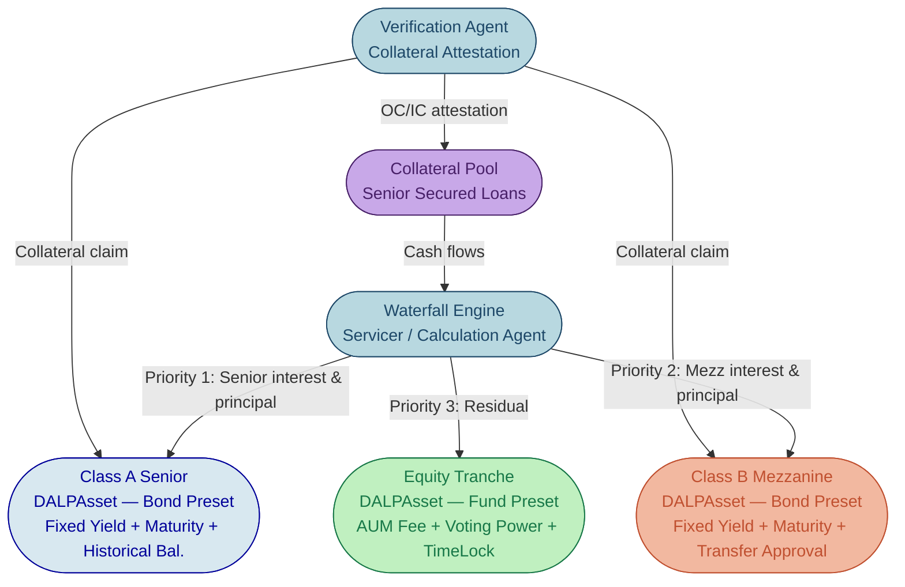
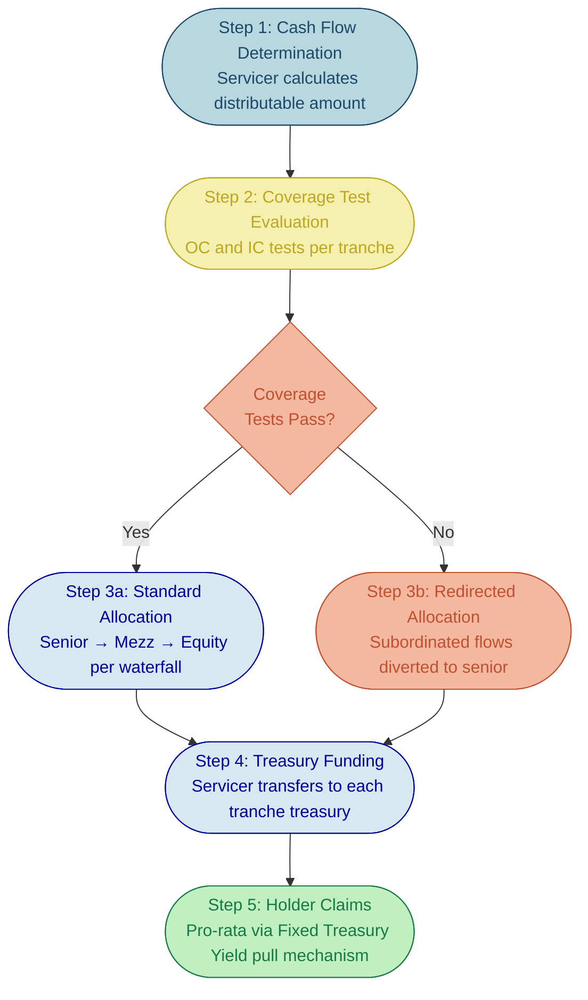
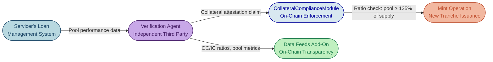

# Structured Products on DALP

# Asset Class Deep-Dive: Structured Products

A single securitization involves more moving parts than most tokenization platforms were designed to handle: multiple tranches with distinct investor eligibility rules, payment waterfalls that must execute in strict sequential priority, collateral pools requiring continuous monitoring, and trigger mechanisms that can redirect cash flows or accelerate maturity based on portfolio performance. Most platforms force institutions to choose between rigid pre-built token types that cannot model this complexity, or months of custom Solidity development that produces single-use contracts requiring dedicated security audits at EUR 200K-500K per engagement. DALP eliminates this trade-off. Each tranche deploys as an independently configured DALPAsset in hours, not months, with its own compliance posture, distribution mechanics, and lifecycle controls, all from pre-audited modules that compose without custom code.

---

## Multi-Tranche Token Architecture

### Tranche Representation

In a traditional securitization, the capital structure divides into tranches with different seniority levels, each carrying distinct risk and return characteristics. DALP represents each tranche as an independent DALPAsset token contract, deployed through the Asset Factory with tranche-specific configuration. This design is deliberate: treating tranches as separate tokens rather than partitions within a single contract provides the isolation that structured finance demands, and it maps directly to how rating agencies, trustees, and regulators expect to see the capital structure documented.

A typical three-tranche structure, illustrated in the architecture diagram below, includes a senior tranche (rated AAA/AA, lowest yield, first claim on cash flows), a mezzanine tranche (rated BBB/BB, moderate yield, subordinated to senior), and an equity tranche (unrated, highest yield, absorbs first losses). Each deploys as its own DALPAsset with configuration tailored to its position in the capital structure.

*Figure 1: Multi-tranche token architecture showing independent DALPAsset contracts per tranche with payment priority flow from the collateral pool through the servicer's waterfall engine.*

| Tranche | DALPAsset Configuration | Token Features | Compliance Modules |
|---------|------------------------|--------------|-------------------|
| Senior (Class A) | Bond preset, capped supply matching senior allocation | Fixed Treasury Yield, Maturity Redemption, Historical Balances | Identity Verification (KYC+AML), Country Allow List, Investor Count, Capped, Collateral |
| Mezzanine (Class B) | Bond preset, smaller cap, higher yield rate | Fixed Treasury Yield, Maturity Redemption, Historical Balances | Identity Verification (KYC+AML+Professional), Country Allow List, Transfer Approval, Capped |
| Equity (Class C) | Fund preset with AUM Fee | AUM Fee, Historical Balances, Voting Power | Identity Verification (Accredited), Identity Allow List, TimeLock (24-month lock-up), Capped |

This separation delivers three critical operational benefits. First, each tranche carries its own compliance posture: a senior tranche available to institutional investors across the EU operates under different transfer restrictions than an equity tranche limited to accredited investors with a two-year lock-up. For compliance officers managing the deal's regulatory obligations, this means tranche-level compliance configuration and reporting without cross-contamination between investor populations. Second, each tranche has independent supply management, ensuring that the senior tranche cap cannot be affected by mezzanine or equity issuance. Third, each tranche maintains its own audit trail, investor registry, and corporate action history, giving trustees and regulators the tranche-level visibility they require during periodic reviews and examinations.

What makes this approach different from competitors that offer "multi-tranche support" is the composability. Most platforms that claim structured product capability require pre-built tranche contracts with fixed compliance logic. When a deal requires a mezzanine tranche with both a TimeLock and Transfer Approval (as many CLO mezzanine tranches do), those platforms either cannot configure it or require custom contract development. DALP's composable architecture means any combination of the 12 compliance module types and available token features can be attached to any tranche, and the configuration can be adjusted during the deal's life without redeployment. That is the difference between a platform built for the operational reality of structured products and one that can tokenize a single bond and call it "structured product support."

### Inter-Tranche Relationships

The relationship between tranches is where structured products become genuinely complex. In a cash flow waterfall, senior tranches receive payment first, mezzanine tranches receive payment only after senior obligations are met, and equity tranches absorb residual cash flows or losses. DALP does not ship a native "waterfall engine" that automatically orchestrates multi-tranche payment priority. This is an honest capability boundary, and it is the right architectural decision.

Waterfall priority logic is inherently deal-specific. A CLO waterfall differs materially from an RMBS waterfall, which differs from a trade receivables securitization. The coverage tests, reinvestment criteria, and trigger conditions are negotiated in each deal's offering documents. Embedding this logic in a platform product would produce either an inflexible system that covers only one deal type, or a configuration surface so complex that it becomes its own development project.

What DALP provides is the infrastructure to execute waterfall distributions once payment amounts are determined:

**Fixed Yield Schedules per tranche.** Each tranche's Fixed Treasury Yield feature is configured with its own yield rate, payment interval, and treasury address. The senior tranche might pay 4.5% annually on a quarterly basis from a dedicated senior treasury, while the mezzanine pays 7.0% from a separate treasury.

**Treasury coordination.** The waterfall calculation itself, determining how much flows to each tranche's treasury based on collateral pool performance, is an off-chain computation performed by the servicer or calculation agent. DALP provides the execution layer: once allocations are determined, amounts are funded into each tranche's treasury, and holders claim their pro-rata entitlements through the pull-based distribution mechanism.

**Historical Balances for record dates.** Each tranche's Historical Balances feature provides the point-in-time ownership snapshots needed to calculate individual holder entitlements. Because the feature creates checkpoints on every transfer, mint, and burn, the record-date balance is always deterministic and auditable, giving trustees confidence that distributions are mathematically correct.

This architecture means operations teams get tranche-level token mechanics, compliance enforcement, and distribution execution from the platform, while deal-level computation remains with the specialized servicer systems where domain expertise resides.

---

## Waterfall Distribution Mechanics

Building on the tranche architecture above, the actual distribution process follows a five-step workflow that separates deal-level computation from platform-level execution.

### Payment Priority Execution

*Figure 2: Waterfall distribution workflow showing the separation between off-chain calculation (Steps 1-3) and on-chain execution (Steps 4-5).*

**Step 1: Collateral pool cash flow determination.** The servicer calculates total available distributable amount from the collateral pool's cash inflows (principal and interest payments, recovery proceeds, prepayment receipts) minus operating expenses (trustee fees, servicer fees, legal costs).

**Step 2: Coverage test evaluation.** Before distributions proceed, the servicer evaluates overcollateralization (OC) and interest coverage (IC) tests. These tests compare the collateral pool's current value or income against the outstanding liabilities of each tranche. Results are published to DALP's Data Feed add-on, creating an immutable on-chain record.

**Step 3: Tranche-level allocation.** Based on the waterfall rules and coverage test results, the servicer determines the exact amount due to each tranche's treasury. If a coverage test fails (for example, the senior OC ratio falls below 120%), mezzanine interest payments may be diverted to accelerate senior principal repayment.

**Step 4: Treasury funding.** The servicer funds each tranche's treasury with the allocated amount using DALP's standard ERC-20 transfer mechanisms. The treasury can be the DALPAsset contract itself (using the asset-as-treasury capability) or a separate vault contract.

**Step 5: Holder claims.** Individual tranche holders claim their pro-rata distribution through the Fixed Treasury Yield feature's pull-based mechanism. The yield calculation uses Historical Balance snapshots from the relevant record date, ensuring each holder's proportional entitlement is mathematically precise and independently verifiable.

For operations teams managing quarterly distribution cycles, this workflow reduces the manual coordination burden. The servicer performs the waterfall calculation in their existing systems, funds the treasuries through standard platform operations, and DALP handles the individual holder-level distribution with full compliance enforcement and audit trails. No spreadsheet reconciliation across thousands of holders, no manual transfer instructions, no post-distribution balance verification.

### Overcollateralization and Interest Coverage Tests

OC and IC tests are the structural safeguards that protect senior tranches from losses. While the calculations themselves happen off-chain, the results drive on-chain actions and create the transparency that institutional investors demand.

**OC Test.** Compares the aggregate principal balance of the collateral pool to the outstanding principal of the relevant tranche and all tranches senior to it. A senior OC test of 120% means the pool must be worth at least 120% of the senior tranche's outstanding principal.

**IC Test.** Compares the collateral pool's interest income to the interest obligations of the relevant tranche and all senior tranches. An IC test of 1.5x means the pool must generate at least 1.5 times the interest due.

DALP's Data Feeds add-on receives these results from the servicer's systems, publishing the current OC and IC ratios on-chain. This creates an auditable time-series record that rating agencies can reference during surveillance reviews, trustees can access for their periodic reports, and investors can query through the platform API. The on-chain record eliminates the "which version of the report is correct" ambiguity that plagues PDF-based reporting in traditional securitizations.

### Trigger Events and Deal Lifecycle Changes

Structured products include trigger mechanisms that alter the payment waterfall when conditions deteriorate. DALP handles trigger events through its native platform capabilities without requiring custom development:

**Delinquency and cumulative loss triggers.** If the percentage of delinquent assets or cumulative realized losses exceeds predefined thresholds, the deal may enter early amortization. The Governance role can add TimeLock modules or modify Transfer Approval requirements on subordinated tranches to restrict trading during the amortization period, all without redeploying the tranche tokens.

**Emergency circuit-breaking.** If a severe trigger fires (originator default, servicer replacement), the Emergency role can pause individual tranche tokens, halting all transfers until the trustee determines the appropriate course of action. This is native to every DALPAsset.

**Rating downgrade response.** If rating actions require compliance changes (for example, tightening investor eligibility after a downgrade), the Governance role can reconfigure compliance modules, adding stricter Identity Verification expressions or reducing Investor Count limits.

**Trigger status publication.** All trigger statuses, thresholds, and activation events are published through Data Feeds, providing the on-chain transparency layer that institutional investors increasingly require. Every trigger activation and the resulting compliance adjustment is recorded in the immutable audit trail.

The ability to reconfigure compliance modules and token features at runtime, without contract redeployment, is what distinguishes DALP's approach from platforms that compile compliance logic into the tranche contract at issuance. When a coverage test fails in year three of a seven-year CLO, the platform must be able to adjust. With compiled contracts, that adjustment requires a new contract deployment, a new audit, and a token migration. With DALP, it requires a governed administrative operation that takes effect immediately.

---

## Collateral Management

The collateral pool is the foundation on which every structured product rests, and effective collateral management determines whether the deal maintains its credit quality through to maturity.

### Collateral Pool Attestation

*Figure 3: Collateral attestation flow showing how pool performance data flows from the servicer through independent verification to on-chain enforcement and transparency.*

The individual collateral assets (mortgages, auto loans, trade receivables, corporate loans) remain in the servicer's loan management system. DALP does not manage individual collateral assets, and this is the correct boundary. What DALP provides is the ability to track the aggregate collateral position and enforce collateral adequacy through the CollateralComplianceModule.

**Proof-of-reserve for issuance.** Before additional tranche tokens can be minted (during a revolving period or tap issuance), the CollateralComplianceModule verifies that a valid collateral attestation claim exists on the asset's OnchainID identity. The claim, issued by a trusted verification agent, attests to the current pool balance and its ratio to outstanding tranche liabilities. If the ratio is insufficient, the mint reverts on-chain.

**Configurable collateral ratio.** The module's ratio parameter (in basis points) defines the minimum overcollateralization required. A ratio of 12,500 bps (125%) means the attestation must show pool value at least 125% of the post-mint total supply. This prevents over-issuance regardless of any off-chain error in the servicer's calculations.

**Trusted auditor designation.** The CollateralComplianceModule supports extra trusted issuers beyond the global registry, allowing institutions to designate specific verification agents and audit firms for collateral attestation. Only claims from these designated issuers are accepted for compliance evaluation.

### Substitution and Eligibility

In revolving securitizations and managed CLOs, the collateral manager substitutes assets subject to eligibility criteria: minimum credit rating, maximum single-obligor concentration (typically 2-3% of pool), geographic diversification limits, industry concentration limits (commonly 8-15% per sector), and maximum weighted average life constraints.

DALP does not enforce substitution eligibility at the smart contract level. These rules involve complex, deal-specific criteria referencing external data (credit ratings, obligor identities, industry classifications) that require servicer judgment. What DALP provides:

**Post-substitution attestation.** After each substitution, the verification agent publishes an updated collateral attestation claim reflecting the new pool composition. This updated claim feeds into the CollateralComplianceModule for future issuance checks and into the Data Feed for transparency.

**Concentration monitoring publication.** The servicer calculates concentration metrics (single-obligor exposure, industry breakdown, geographic distribution, credit quality migration) in their systems and publishes results through DALP's Data Feed add-on. This creates on-chain visibility into the pool's compliance with eligibility criteria without attempting to enforce those criteria on-chain.

**Immutable audit trail of collateral changes.** Every attestation update is recorded on-chain through claim lifecycle events. The complete history from initial pool closing through each substitution is available as a tamper-proof record for trustees, rating agencies, and regulators.

For risk managers overseeing the collateral pool, the value is not that DALP replaces their analytics tools, but that the platform provides a verified, tamper-proof transparency layer that sits alongside their existing infrastructure. When a rating agency asks "what was the pool composition on this date?" the on-chain attestation record provides a definitive answer.

---

## Risk Parameter Monitoring

Continuous monitoring of pool performance metrics is essential for structured products to maintain their credit quality and meet ongoing regulatory obligations. DALP's Data Feed add-on serves as the publication and transparency layer for these metrics.

### Loan-to-Value (LTV) Monitoring

For structured products backed by real assets (RMBS, CMBS), LTV ratios are a critical risk indicator. Rising LTVs signal deteriorating collateral quality and may trigger coverage test failures. DALP receives periodic LTV reports from the servicer or property valuation provider and publishes aggregate pool LTV metrics on-chain.

The practical value for investors is access to verified pool performance metrics through the platform API, eliminating reliance on monthly PDF reports or servicer portals. For secondary market pricing, prospective buyers can assess current pool quality directly from on-chain data.

### Delinquency Tracking

Delinquency data (30-day, 60-day, 90-day+ buckets, cumulative defaults, recovery rates) follows the same publication pattern: calculated by the servicer, published through Data Feeds, recorded immutably on-chain. The time-series of pool performance supports rating agency surveillance, trustee reporting, and investor portfolio monitoring.

### Prepayment Monitoring

Prepayment behavior directly affects tranche cash flows and investor returns. High prepayment rates shorten the weighted average life of senior tranches, potentially accelerating their paydown ahead of schedule. Low prepayment rates extend duration, increasing reinvestment risk for all tranches.

DALP does not perform prepayment modeling or CPR/SMM/PSA speed calculations. Prepayment analytics are the domain of specialized quantitative tools. What DALP provides is the ability to publish actual prepayment metrics through the Data Feed, giving investors verified, on-chain data points to calibrate their own models. This matters because prepayment data in traditional securitizations is typically available only through servicer reports with varying timeliness and format standards. On-chain publication standardizes access and creates a verifiable record.

### Stress Test Result Publication

Stress tests evaluate deal performance under adverse scenarios (rising defaults, falling recovery rates, interest rate shifts). The results, conducted by the calculation agent or risk management function, may trigger deal actions that DALP executes:

**Equity tranche write-down.** If stress testing or actual losses indicate that the equity tranche should be partially written down, the Supply Management role can burn the appropriate amount of equity tranche tokens, reducing the outstanding principal with full audit trail.

**Early amortization.** If a stress test triggers early amortization, the Governance role can add compliance modules that restrict new issuance and redirect cash flows, using DALP's runtime reconfigurability.

**Transfer restriction adjustment.** The Governance role can tighten compliance requirements on affected tranches (adding Transfer Approval requirements, reducing investor count limits) to reflect the changed risk profile.

---

## Configuration Example: EUR 500M CLO

A fund manager structures a EUR 500M CLO backed by a portfolio of senior secured European corporate loans, with a four-year reinvestment period and seven-year legal maturity.

### Capital Structure

| Tranche | Size | Rating | Spread | Token Features | Compliance Modules |
|---------|------|--------|--------|---------------|-------------------|
| Class A (Senior) | EUR 320M | AAA | E+130bps | Fixed Treasury Yield, Maturity Redemption, Historical Balances | Identity Verification (KYC+AML), Country Allow List (EU+UK+CH), Investor Count (200), Capped (320K units), Collateral (125% OC) |
| Class B (Mezz) | EUR 80M | BBB | E+350bps | Fixed Treasury Yield, Maturity Redemption, Historical Balances | Identity Verification (KYC+AML+Professional), Country Allow List, Transfer Approval (48h expiry), Capped (80K units) |
| Class C (Jr Mezz) | EUR 50M | BB | E+550bps | Fixed Treasury Yield, Maturity Redemption, Historical Balances | Identity Verification (KYC+AML+Professional), Transfer Approval, TimeLock (12-month), Capped (50K units) |
| Equity | EUR 50M | NR | Residual | AUM Fee (200bps), Historical Balances, Voting Power | Identity Verification (KYC+AML+Accredited), Identity Allow List, TimeLock (24-month NC), Investor Count (25) |

### Compliance Configuration Detail

**Class A (Senior):** Identity Verification expression `[KYC, AML, AND]` ensures all holders have completed KYC and AML screening. Country Allow List restricts to EU 27 member states plus UK and Switzerland. Investor Count limits to 200 unique holders. CollateralComplianceModule requires 125% OC ratio (12,500 bps) from the designated verification agent before any minting.

**Equity:** Identity Verification expression `[KYC, AML, AND, ACCREDITED, AND]` requires accredited investor status on top of KYC/AML. Identity Allow List restricts to named institutional investors approved by the collateral manager. TimeLock enforces a 24-month non-call period with FIFO batch tracking. Voting Power provides governance rights over reinvestment period decisions (extension, wind-down).

### Quarterly Distribution Cycle

1. Servicer calculates waterfall: collateral pool income minus expenses, allocated per tranche priority
2. OC/IC test results published via Data Feed add-on (on-chain record)
3. Servicer funds each tranche treasury via standard ERC-20 transfers
4. Coverage test pass: holders claim distributions through Fixed Treasury Yield pull mechanism
5. Coverage test fail: Governance role adjusts allocation, potentially adding Transfer Approval to subordinated tranches or diverting subordinated cash flows to senior principal reduction

### Reinvestment Period Operations

During the four-year reinvestment period, the collateral manager actively manages the portfolio:
- Substitutes assets subject to eligibility criteria (managed in servicer's systems)
- Verification agent publishes updated collateral attestation after each substitution
- CollateralComplianceModule enforces minimum 125% OC before any new minting during revolving period
- Pool composition metrics published through Data Feeds for investor transparency

### Maturity and Wind-Down

At legal maturity (Year 7), Maturity Redemption feature blocks all tranche token transfers. Holders redeem at par (senior, mezzanine) or at residual value (equity). Redemption is atomic: tranche tokens are burned and denomination asset is transferred from the treasury in a single transaction. If the treasury has insufficient funds, the redemption reverts, preventing partial redemptions.

---

## Capability Boundary: Native vs. Integration

Structured products demand clarity about what the platform handles and what requires external systems. This transparency builds trust during due diligence.

| Capability | DALP Native | Integration Required |
|-----------|-------------|---------------------|
| Tranche token issuance and lifecycle | Yes | — |
| Tranche-specific compliance and transfer restrictions | Yes, independent modules per tranche | — |
| Investor eligibility (KYC, accreditation, jurisdiction) | Yes, via Identity Verification and claims | KYC/AML provider for initial verification |
| Per-tranche yield distribution | Yes, Fixed Treasury Yield + Historical Balances | — |
| Waterfall priority calculation | No | Servicer/calculation agent |
| OC/IC coverage test calculation | No | Servicer/calculation agent |
| Coverage test result publication | Yes, via Data Feeds | Feed from servicer |
| Collateral attestation enforcement | Yes, CollateralComplianceModule | Verification agent provides claims |
| Individual collateral asset management | No | Servicer's loan management system |
| Substitution eligibility enforcement | No | Collateral manager's systems |
| Concentration limit enforcement | No (monitoring only via Data Feeds) | Servicer's portfolio analytics |
| Trigger event execution | Yes: Pause, compliance reconfiguration, token burn | Servicer monitors and initiates |
| Tranche write-down | Yes, via burn operations | Calculation agent determines amount |
| Early amortization mode | Yes, via compliance module reconfiguration | Servicer triggers mode change |
| Investor reporting | Yes, via API and read model | Report formatting to deal templates |
| Rating agency data | Yes, structured on-chain data and API exports | Agency-specific format requirements |
| Secondary market transfer compliance | Yes, all configured modules enforced | — |
| Audit trail for trustees and regulators | Yes, complete on-chain event history | — |

This boundary is the honest answer to "can DALP run a structured product?" The platform handles tranche-level token mechanics, compliance enforcement, distribution execution, and the transparency layer. The deal-level computation (waterfall math, coverage tests, collateral analytics, prepayment modeling) belongs with servicer and calculation agent systems that feed results into DALP's infrastructure. This separation is architecturally correct because deal logic changes with every transaction, while the token infrastructure remains stable.

---

## Why DALP Is the Right Platform for Structured Products

Structured products have historically been among the most difficult asset classes to bring on-chain because they demand more than simple tokenization. They require multi-contract coordination, complex payment priority, continuous collateral monitoring, and the ability to modify deal terms during the life of the transaction.

Three characteristics of DALP's architecture address these demands directly:

**Composable configuration replaces custom engineering.** Where competitors require months of Solidity development and dedicated security audits for each structured deal, DALP's composable architecture means every tranche configures from pre-audited token features and compliance modules. A CLO mezzanine tranche with Transfer Approval, TimeLock, Identity Verification, and Capped compliance can be configured and deployed in a single session, not a multi-month development project. That is the difference between a platform built for operational reality and one that can tokenize a vanilla bond and call it "structured product support."

**Runtime reconfigurability handles deal lifecycle events.** Coverage test failures, trigger activations, rating downgrades, and reinvestment period transitions all require compliance and feature adjustments on live tranche tokens. DALP's runtime reconfigurability means the Governance role can add or modify compliance modules without redeploying the tranche contract. Platforms that compile compliance logic at issuance cannot adapt to these events without a new contract deployment, a new audit, and a disruptive token migration.

**Honest capability boundaries build institutional trust.** DALP does not pretend to be a waterfall calculation engine, a collateral analytics system, or a prepayment modeling tool. It provides the token infrastructure, compliance enforcement, and transparency layer that institutional structured products require, with clear integration points for servicer and calculation agent systems. This honesty is a competitive advantage during due diligence, because institutional investors and rating agencies will probe claimed capabilities, and discovering that a vendor overstated their structured product support destroys credibility faster than an honest boundary acknowledged upfront.

The result is a deployment model where each tranche is configured and launched in days rather than months, compliance rules adapt to the deal's lifecycle without contract redeployment, and the entire structure maintains the transparency and auditability that regulators, rating agencies, and institutional investors require. For institutions evaluating platforms for their securitization programs, this is the difference between a demo that shows tokens and a production infrastructure that can support the operational complexity of a real deal.
