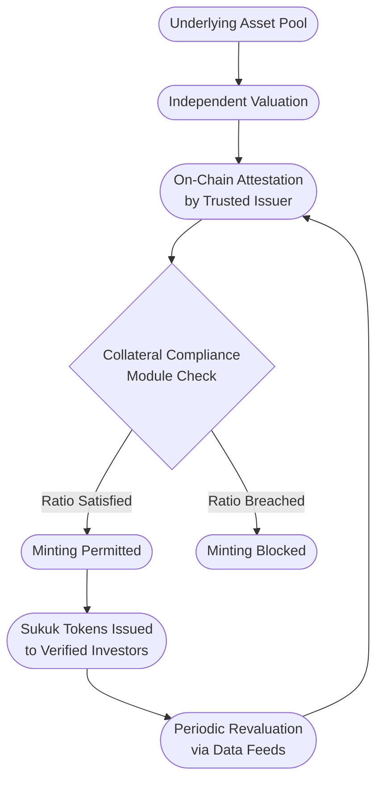
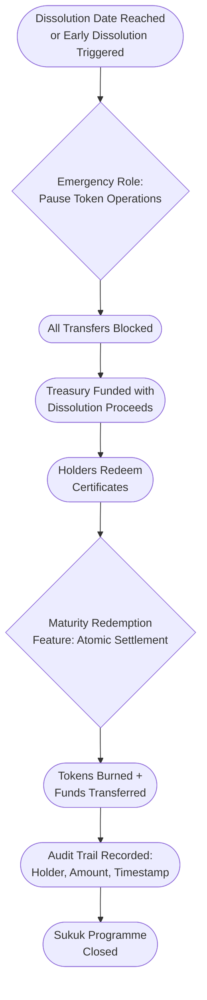
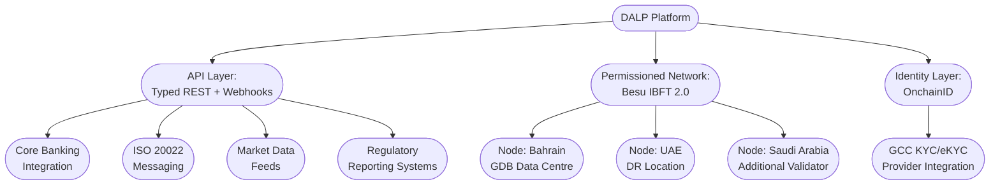

# Response to RFI GDB-DIG-2026-017

# Digital Sukuk Issuance and Lifecycle Management Platform

---

## Executive Summary

Gulf Development Bank's ambition to bring its sukuk programme onto a digital platform reflects a broader institutional recognition: Sharia-compliant capital markets instruments demand more from technology infrastructure than their conventional counterparts, not less. The requirement to preserve economic substance, maintain asset-backing integrity, enforce profit-sharing mechanics, and obtain Sharia board governance at every lifecycle stage creates a compliance and operational burden that manual processes and legacy systems struggle to carry at scale.

SettleMint's Digital Asset Lifecycle Platform (DALP) addresses this challenge through a configuration-driven architecture where sukuk instruments are structured, issued, serviced, and dissolved through a single audited platform, with compliance enforced at the smart contract level before every transaction executes. DALP does not treat Islamic finance as a relabelled conventional bond workflow. The platform's composable token architecture allows institutions to configure the specific economic behaviours that each sukuk structure demands: periodic rental distributions for ijara, cost-plus payment schedules for murabaha, and agency-based return mechanics for wakala, all backed by on-chain asset verification through the collateral compliance module.

Three capabilities make DALP particularly suited to GDB's programme. First, the platform's twelve compliance module types compose into any regulatory posture, enabling GDB to enforce AAOIFI-aligned investor eligibility, GCC jurisdictional restrictions, and CBB reporting requirements through configuration rather than custom development. Second, DALP's token feature system supports the profit distribution mechanics that sukuk structures require, including scheduled yield payments through the Fixed Yield Schedule add-on and snapshot-based pro-rata calculations that respect holding periods. Third, the platform's governance and approval workflow architecture provides the control surfaces needed for Sharia board oversight, ensuring that no issuance or structural modification proceeds without recorded authorization.

This response details how DALP supports each aspect of GDB's requirements across sukuk structuring, Sharia governance, profit distribution, regulatory compliance, technology architecture, and implementation planning.

---

## Section 1: Sukuk Structure Support

### Ijara Sukuk: Lease-Based Structures

DALP supports ijara sukuk through the bond asset class configured with features and compliance modules tailored to lease-based economics. The underlying lease asset is represented through DALP's customizable metadata schema, where each sukuk token carries immutable fields identifying the leased property or asset, its appraised value, lease commencement and expiry dates, and the rental payment schedule. This metadata is defined at the instrument template level by GDB's operations team and locked at issuance, ensuring that every token maintains a verifiable link to the underlying real asset throughout the instrument's life.

Periodic rental payments are managed through DALP's Fixed Yield Schedule add-on, which automates the distribution of returns to sukuk holders based on snapshot-based balance capture. The schedule supports both fixed rental rates and configurable distribution frequencies (monthly, quarterly, semi-annual) aligned to the underlying lease terms. For floating-rate ijara structures, the rental amount for each distribution period can be updated through the platform's data feed infrastructure, which consumes external benchmark rates from market data providers. The distribution calculation is pro-rata based on each holder's balance at the snapshot date, ensuring equitable allocation across all certificate holders.

The purchase undertaking mechanism that governs ijara dissolution is handled through DALP's maturity redemption feature. At the scheduled dissolution date, or upon an early dissolution trigger, the feature enables atomic redemption where sukuk certificates are burned and the exercise price (representing the lessor's purchase undertaking) is transferred to holders from the designated treasury. The distinction between the purchase undertaking price and the face value of conventional bonds is maintained in the platform's data model through metadata fields that capture the specific economic terms of the Sharia-compliant structure.

*Figure 1: DALP's Asset Designer enables configuration of sukuk-specific parameters including asset class, compliance modules, and distribution schedules without custom development.*

### Murabaha Sukuk: Cost-Plus Financing

Murabaha sukuk are configured in DALP using the bond asset class with metadata fields that capture the cost-plus financing structure: the original acquisition cost of the underlying commodity or asset, the agreed markup (profit margin), and the deferred payment schedule. These fields are set at issuance and recorded on-chain as immutable metadata, providing a transparent and auditable record of the murabaha contract terms.

The deferred payment schedule is managed through the Fixed Yield Schedule add-on configured with a payment profile that reflects the agreed instalment amounts. Unlike conventional coupon payments where the yield represents interest on principal, the murabaha payment schedule distributes the pre-agreed markup over the financing period. The platform's data model accommodates this distinction: the distribution label, calculation basis, and underlying economic classification are configurable per instrument template, ensuring that the platform's terminology and data architecture reflect murabaha economics rather than borrowing conventional interest-based language.

DALP's collateral compliance module provides the mechanism for asset-backing verification in murabaha structures. The module can be configured to require that the total token supply does not exceed the value of the underlying commodity pool, using on-chain attestation from trusted issuers (such as independent valuers) to verify that the collateral ratio is maintained. This addresses the AAOIFI requirement that murabaha sukuk must be backed by identifiable assets throughout the instrument's life.

### Wakala Sukuk: Agency-Based Structures

Wakala sukuk present the most complex distribution mechanics among GDB's planned structures, and DALP addresses this through a combination of platform capabilities and honest acknowledgment of where custom configuration is required.

The wakala agreement itself is represented through DALP's metadata schema, with fields capturing the wakeel's authority boundaries, the expected profit rate, the incentive fee formula, and the investment mandate parameters. These are recorded as part of the instrument template and immutably linked to each sukuk token.

For the distribution mechanics, DALP's Fixed Yield Schedule add-on handles the expected profit rate distribution to sukuk holders. The platform natively supports scheduled, pro-rata distributions from a designated treasury. However, the full wakala waterfall calculation, specifically the comparison of actual portfolio returns against the expected rate, the calculation of the wakeel's incentive fee when returns exceed expectations, and loss allocation when returns fall below the expected rate, involves fund-specific logic that goes beyond what the platform computes automatically. DALP serves as the distribution execution layer: once the waterfall amounts are determined (whether by GDB's fund administrator or an integrated calculation engine), the platform executes the distributions with full compliance enforcement and audit trail. The waterfall calculation itself is an integration point where GDB's existing financial systems or fund administrator would feed the computed amounts into DALP for execution.

This is a deliberate architectural boundary. Waterfall calculations for agency-based structures involve institution-specific formulas, performance benchmarks, and fee structures that vary across programmes. Embedding a generic waterfall engine in the platform would either be too rigid to accommodate GDB's specific terms or too flexible to provide meaningful guardrails. The correct approach is for DALP to provide the distribution execution, audit, and compliance infrastructure while the calculation logic resides where institutional expertise already exists.

### Asset-Backing Verification and Sharia Substance

DALP's collateral compliance module provides the foundation for ensuring that digital sukuk maintain the economic substance required by Sharia principles. The module enforces a configurable collateral ratio (expressed in basis points) that must be satisfied before any new sukuk tokens can be minted. Collateral verification relies on on-chain attestation from trusted issuers: independent valuers, auditors, or Sharia-approved custodians issue signed claims attesting to the value of the underlying asset pool. If the total outstanding sukuk supply would exceed the attested asset value at the configured ratio, the minting operation reverts at the smart contract level. There is never a state where sukuk tokens exist without verified asset backing.

For asset identification and tracking, each sukuk issuance carries metadata fields linking to specific underlying assets. For ijara sukuk, this includes the leased property identifier, valuation date, and appraiser identity. For murabaha, the commodity inventory reference, purchase cost, and storage location. These metadata fields can be configured as immutable (locked at creation) or restricted-mutable (updatable by authorized roles, such as when a property revaluation occurs), with every modification recorded in the platform's audit trail.

The platform's data feed infrastructure enables periodic revaluation of underlying assets by consuming external price feeds or valuation updates. When coupled with the collateral compliance module, this creates a continuous monitoring mechanism where the asset-backing ratio is verified not only at issuance but throughout the sukuk lifecycle, with alerts triggered if the ratio approaches the configured threshold.

It is important to note that DALP enforces the quantitative backing constraint (sukuk supply versus asset value) and provides the data infrastructure for tracking underlying assets. The qualitative Sharia assessment of whether a particular asset meets the requirements for Sharia-compliant backing (genuine economic activity, permissible asset class, appropriate risk-sharing structure) remains the domain of GDB's Sharia Supervisory Board. The platform provides the governance workflow tools to ensure that this assessment is obtained and recorded before issuance proceeds.

*Figure 2: Asset-backing verification flow ensuring that sukuk token supply never exceeds the attested value of the underlying asset pool.*

### Risk-Sharing and Prohibition of Guaranteed Returns

DALP's data model and terminology architecture are configurable to reflect Sharia-compliant economics. The platform does not hardcode the concept of "interest" or "coupon" at the data level. Distribution schedules, yield calculations, and payment labels are all configurable per instrument template, enabling GDB to establish terminology that reflects profit-sharing distributions rather than interest payments. The Fixed Yield Schedule add-on distributes amounts from a treasury; whether those amounts represent rental income, cost-plus markup, or agency returns is determined by the instrument's configuration and the calculation methodology feeding the treasury.

For the distinction between expected profit rates and guaranteed returns, the platform's architecture supports variable distributions where the actual amount paid can differ from period to period. When configured with external data feeds providing actual asset performance data, the distribution amounts can reflect realized returns rather than a fixed rate. This approach preserves the risk-sharing characteristic that Sharia scholars require: sukuk holders receive distributions based on asset performance, not contractually guaranteed interest payments.

---

## Section 2: Sharia Governance and Compliance

### Sharia Board Approval Workflows

DALP's governance architecture provides the control surfaces needed for integrating Sharia board oversight into the sukuk lifecycle. The platform enforces role-based access control with separation of duties at the smart contract level, and this role model can be configured to include Sharia governance as a distinct approval gate.

Specifically, the platform's transfer approval compliance module and governance role structure enable a workflow where sukuk issuance and structural modifications require explicit authorization. The governance role holder (which can be assigned to a Sharia board representative or a designated compliance officer acting on the board's behalf) must approve key operations before they execute. New issuances, modifications to compliance parameters, changes to distribution schedules, and token feature reconfigurations can all be gated behind governance approval.

Sharia board resolutions are recorded through DALP's audit trail, which captures every administrative action with timestamps, actor identity, and operation details. For formal resolution recording, the platform's document management and metadata capabilities allow resolutions to be attached to the relevant token's on-chain record as verifiable references.

However, DALP does not include a purpose-built Sharia board resolution management system with fatwa tracking, scholar voting, or deliberation workflow. The platform provides the governance control points (approval gates, role-based authorization, audit trails) and the enforcement mechanism (no issuance without governance approval). The deliberation process, resolution formatting, and scholar coordination remain in GDB's existing Sharia governance framework. DALP ensures that the output of that process, the approval decision, is recorded and enforced on-chain.

### AAOIFI Standards Accommodation

DALP accommodates AAOIFI standards through its configurable architecture rather than through a pre-built AAOIFI compliance module. The relevant standards map to platform capabilities as follows:

| AAOIFI Standard | DALP Accommodation |
|---|---|
| FAS 17 (Investments) | Configurable metadata schemas capture investment classification, measurement basis, and fair value fields per AAOIFI categorization. Instrument templates ensure consistent data capture across all sukuk issuances. |
| FAS 33 (Investment in Sukuk) | The platform's data model supports the classification of sukuk as held-at-amortized-cost, fair-value-through-equity, or fair-value-through-income by carrying the classification as metadata. Actual accounting treatment is determined by GDB's financial systems consuming this data. |
| SS 17 (Investment Sukuk) | The composable token architecture enables structuring each sukuk type (ijara, murabaha, wakala) with the specific economic features mandated by SS 17, including asset-backing, risk-sharing mechanics, and dissolution terms. Collateral compliance enforcement ensures ongoing asset-backing integrity. |
| SS 59 (Sale of Debt) | The platform's compliance module system can enforce transfer restrictions on murabaha sukuk to prevent secondary trading at a discount to face value, addressing the prohibition of bay' al-dayn. See Section 2.4 below for details. |

The platform provides the data infrastructure, compliance enforcement, and governance controls that enable AAOIFI compliance. It does not generate AAOIFI-formatted financial statements or perform AAOIFI accounting calculations internally. GDB's financial and accounting systems consume DALP's data exports and audit trail to produce the required reports and calculations.

### CBB Rule Book Compliance

DALP's compliance framework maps to the Central Bank of Bahrain Rule Book Volume 6 requirements through the following capabilities:

**Investor categorization:** DALP's identity verification system, built on the OnchainID protocol, supports the tiered investor classification that CBB regulations require. Identity claims from trusted issuers attest to an investor's classification (qualified institutional buyer, professional investor, retail investor), and compliance modules enforce category-specific rules, including minimum investment thresholds, at the smart contract level.

**Disclosure requirements:** The platform's metadata system and document management capabilities support the attachment of prospectus documents, offering circulars, and periodic disclosures to each sukuk token's on-chain record. While DALP does not auto-generate CBB-formatted disclosure documents, it provides the data and audit trail that disclosure documents draw upon, and it can enforce that required disclosures have been recorded before investor onboarding proceeds.

**Reporting obligations:** DALP provides typed REST APIs and data exports covering all on-chain activity: issuances, transfers, distributions, compliance events, and audit logs. These data feeds integrate with GDB's reporting infrastructure to produce CBB-compliant periodic reports. The platform captures the underlying data; report formatting and filing is handled by GDB's existing regulatory reporting systems.

### Prohibition of Bay' al-Dayn (Debt Trading at Discount)

The prohibition on trading debt-based instruments at a discount to face value, specifically relevant to murabaha sukuk, can be addressed through DALP's compliance module system. Two approaches are available:

**Transfer approval module:** The transfer approval compliance module can be activated for murabaha sukuk, requiring that every secondary market transfer receives explicit approval from a designated compliance officer or the Sharia governance role holder before execution. This approval gate allows GDB to verify that any proposed transfer meets Sharia requirements, including verifying that the transfer price does not constitute a discount that would violate the bay' al-dayn prohibition.

**Transfer restriction through configuration:** For a stricter approach, the compliance module system can enforce restrictions on murabaha sukuk transfers, either through a time-based lock preventing secondary trading entirely during certain periods, or through investor eligibility restrictions that limit the pool of eligible secondary buyers.

The platform enforces whatever restriction is configured at the smart contract level: non-compliant transfers revert before execution. The specific Sharia ruling on which transfer scenarios constitute prohibited debt trading, and which are permissible, is a determination for GDB's Sharia Supervisory Board. DALP enforces the board's decision through configurable compliance rules.

*Figure 3: DALP's compliance policy template library enables institutions to define reusable compliance configurations aligned to specific regulatory and governance frameworks.*

---

## Section 3: Profit Distribution and Financial Mechanics

### Periodic Profit Distribution

DALP's profit distribution infrastructure operates through the Fixed Yield Schedule add-on, which manages the end-to-end distribution lifecycle for sukuk holders. The distribution process follows a structured sequence: the system captures a balance snapshot at a configured record date, calculates each holder's pro-rata entitlement based on their holding at that snapshot, and executes distributions from a designated treasury account.

The platform's data model and terminology are configurable at the instrument template level. Distribution labels, calculation references, and reporting categories can be set to reflect profit-sharing terminology ("rental income distribution," "murabaha profit instalment," "wakala return payment") rather than conventional interest-based language. This ensures that platform-generated reports, investor statements, and audit records use terminology consistent with AAOIFI standards and Sharia board expectations.

For the distinction between fixed expected profit rates and variable returns, the platform supports both models:

**Fixed expected rates:** The Fixed Yield Schedule is configured with a predetermined distribution amount or rate per period. The treasury is pre-funded to cover scheduled distributions. This approach is appropriate for ijara sukuk with fixed rental rates and murabaha sukuk with pre-agreed profit margins.

**Variable returns:** When the actual return depends on underlying asset performance, the distribution amount for each period is determined externally (by GDB's fund administrator or treasury management system) and fed into DALP's distribution mechanism. The platform executes the calculated amount with the same compliance enforcement and audit trail as fixed distributions. This approach is essential for wakala sukuk where actual portfolio returns determine holder payments.

Holding-period-based calculations are supported through the Historical Balances token feature, which maintains point-in-time balance records for every holder. When combined with the yield schedule, this enables pro-rata calculations that account for when investors acquired their positions relative to the distribution record date.

### Wakala Distribution Waterfall

As noted in Section 1, the wakala distribution waterfall involves multi-step calculations that are specific to each programme's terms: computing actual portfolio returns, determining whether returns exceed or fall below the expected profit rate, calculating the wakeel's incentive fee, and allocating shortfalls.

DALP's role in this waterfall is execution and compliance:

The platform receives the computed distribution amounts (expected profit payment to holders, incentive fee to wakeel, or loss allocation adjustments) from GDB's treasury management system or fund administrator through DALP's typed REST API. Once the amounts are determined, DALP executes the distributions with full compliance checks on each recipient, maintains the complete audit trail, and handles the on-chain settlement. The platform ensures that distributions reach only verified, eligible holders, that regulatory reporting data is captured for every payment, and that the entire process is auditable.

The actual waterfall arithmetic, specifically the portfolio return computation, benchmark comparison, incentive fee formula, and loss allocation mechanics, is not performed by DALP. This calculation requires access to the underlying investment portfolio's performance data, management accounting records, and programme-specific fee structures that reside in GDB's financial systems. The correct integration pattern is for the fund administrator to compute the waterfall outputs and push them to DALP for execution.

### Dissolution and Early Dissolution

DALP handles sukuk dissolution through the Maturity Redemption token feature, which manages the final lifecycle stage of the instrument:

**Scheduled maturity:** At the configured dissolution date, the maturity redemption feature blocks all further transfers of the sukuk token. Holders can then redeem their certificates by burning tokens in exchange for the dissolution amount from the designated treasury. The redemption is atomic: tokens burn and funds transfer in a single transaction. If the treasury has insufficient funds, the redemption reverts, preventing partial payments that could create inequitable outcomes among holders.

**Early dissolution:** DALP supports early dissolution through the platform's governance and operational controls. The Emergency role can pause all token operations, halting trading and distributions. The Governance role can then authorize a modified dissolution workflow. While the platform does not include a pre-built "early dissolution trigger" module that automatically activates on specific events (total loss of underlying asset, regulatory event), the pause and governance mechanisms provide the control surfaces needed to manage early dissolution with appropriate human oversight.

**Exercise price for ijara sukuk:** The exercise price (purchase undertaking amount) is configured in the token's metadata and the maturity redemption feature's denomination parameters. For ijara structures where the exercise price differs from the original face value (for example, a declining purchase undertaking schedule), the exercise price can be updated through the restricted-mutable metadata system by authorized governance role holders before the dissolution date.

**Residual value distribution:** Pro-rata distribution of residual value following asset liquidation is handled through the same yield schedule mechanism used for periodic distributions. The final distribution amount is determined externally based on the actual liquidation proceeds and distributed through DALP with the standard compliance and audit infrastructure.

*Figure 3: Sukuk dissolution workflow showing the atomic redemption process that ensures equitable treatment of all certificate holders.*

---

## Section 4: Regulatory Compliance and Investor Management

### Investor Onboarding and Identity Verification

DALP's identity verification system is built on the OnchainID protocol, which provides decentralized, claim-based identity management at the smart contract level. Every investor who participates in GDB's sukuk programme must have a verified on-chain identity before they can receive or transfer sukuk tokens. This is not an optional application-layer check; it is enforced at the protocol level.

The onboarding process follows a structured sequence:

An identity contract is deployed for each investor through DALP's Identity Factory, creating a persistent on-chain identity anchor. Trusted issuers (KYC providers, identity verification services, or GDB's own compliance team acting in an issuer capacity) attach signed claims to the identity, attesting to specific attributes: KYC completion status, AML clearance, investor classification (qualified institutional, professional, retail), jurisdiction of residence, and any GCC-specific regulatory categorizations. These claims include expiration timestamps, enabling automatic enforcement of re-verification requirements.

For GCC regulatory requirements specifically, DALP's identity claim system supports the categorization structures required by each jurisdiction:

**CBB (Bahrain):** Investor classification claims aligned to CBB Rule Book categorizations (licensed institutions, associated persons, accredited investors, other investors) with corresponding minimum investment thresholds enforced through compliance modules.

**SCA (UAE):** Claims supporting SCA's qualified investor and professional investor definitions, including net asset thresholds and investment experience criteria.

**CMA (Saudi Arabia):** Claims aligned to CMA's categorization of qualified clients, institutional clients, and retail clients, with jurisdictional eligibility checks.

The platform does not include pre-built connectors to specific GCC identity verification providers or government identity systems. Integration with GCC-specific eKYC providers (such as Bahrain's eKey, the UAE's UAEPASS, or Saudi Arabia's Absher) is supported through DALP's API-first architecture: the external identity provider performs the verification, and the resulting attestation is published as an on-chain claim through DALP's trusted issuer system. This integration is a configuration and connectivity exercise, not a platform development project.

### Multi-Jurisdictional Compliance Enforcement

DALP's compliance module system enables simultaneous enforcement of investor eligibility rules across all GCC jurisdictions where GDB's sukuk programme operates. The key mechanism is the composable compliance architecture, where multiple compliance modules evaluate in sequence for every transaction:

**Identity verification module:** Configured with a claim expression requiring verified KYC, AML clearance, and investor classification claims from at least one GCC-recognized trusted issuer. The expression uses RPN (Reverse Polish Notation) to define complex eligibility logic, such as: "KYC AND AML AND (QII OR PROFESSIONAL_INVESTOR)" for jurisdictions that distinguish between qualified and professional investor categories.

**Country allow list module:** Configured to permit investors from GCC member states (or specific subsets) while restricting access from non-eligible jurisdictions. Country restrictions enforce at the wallet level based on the jurisdiction claim attached to the investor's on-chain identity.

**Investor count module:** Configured with per-country sub-limits where regulatory requirements cap the number of investors from specific jurisdictions.

**Token supply limit module:** Configured with issuance caps that may be jurisdiction-specific or programme-wide, including currency-denominated limits where applicable.

These modules compose through sequential AND evaluation: every module must approve a transaction for it to proceed. A single module veto blocks the transfer and reverts the transaction with a specific reason code. This fail-closed architecture ensures that compliance is enforced deterministically, not probabilistically.

*Figure 4: On-chain identity records showing verified claims from trusted issuers, enabling compliance modules to make identity-based eligibility decisions at the smart contract level.*

### AML/CFT Compliance

DALP's AML/CFT capabilities operate at two levels:

**On-chain enforcement:** The address block list compliance module enables real-time blocking of wallets associated with sanctioned entities or addresses flagged through screening processes. When a wallet is added to the block list, all transfers involving that address are prevented at the smart contract level. The identity block list provides the same capability at the identity level, blocking all wallets associated with a flagged individual or entity. Both lists are updatable through governed administrative operations.

**Transaction monitoring data:** DALP's complete audit trail captures every on-chain transaction with sender, recipient, amount, timestamp, and compliance evaluation results. This data is available through typed REST APIs and can be consumed by GDB's existing transaction monitoring systems for pattern analysis, suspicious activity detection, and regulatory reporting aligned to FATF recommendations and MENAFATF criteria.

The platform does not include a built-in transaction monitoring engine that performs pattern analysis or generates suspicious transaction reports. It provides the complete, immutable transaction dataset that monitoring systems require and the on-chain enforcement mechanisms to act on monitoring outcomes (freezing wallets, blocking transfers). The analytical and reporting layer integrates with GDB's existing AML compliance infrastructure.

### Regulatory Reporting

DALP provides the data foundation for CBB-compliant regulatory reporting through its comprehensive API surface:

All on-chain activity (issuances, transfers, distributions, redemptions, compliance events, freeze/unfreeze actions, role changes) is accessible through typed REST APIs with filtering, pagination, and date-range capabilities. The platform maintains 18+ analytics views optimized for reporting queries covering holder registries, transaction histories, compliance audit trails, and distribution records.

DALP does not generate CBB-formatted regulatory filing documents. The platform provides the underlying data in structured formats (JSON, CSV) that GDB's regulatory reporting systems consume to produce the required periodic disclosures, material event notifications, and register maintenance reports. This approach respects the boundary between data infrastructure (DALP's responsibility) and jurisdiction-specific report formatting (GDB's existing regulatory compliance systems).

---

## Section 5: Technology Architecture and Deployment

### Blockchain Infrastructure

DALP operates exclusively on EVM-compatible blockchain networks. The platform is purpose-built for the Ethereum Virtual Machine ecosystem, supporting a range of permissioned and public networks:

**Supported networks:** Ethereum mainnet, Polygon, Avalanche C-Chain, Hyperledger Besu, and other EVM-compatible networks. For GDB's use case, a permissioned network (such as Hyperledger Besu configured with IBFT 2.0 or QBFT consensus) would be the recommended architecture, providing the transaction privacy, governance control, and performance characteristics that a sovereign sukuk programme requires.

**Consensus and finality:** On a permissioned Besu network with IBFT 2.0 consensus, transaction finality is immediate (single-block finality). Once a block is committed, it cannot be reverted. This provides the settlement finality guarantees that regulated financial instruments demand.

**Throughput:** Transaction throughput depends on the network configuration (block time, gas limit, validator count) rather than being a fixed DALP parameter. On a well-configured permissioned Besu network, throughput of several hundred transactions per second is achievable, scaling with network topology decisions made during deployment planning.

### Deployment Model and Data Residency

DALP supports multiple deployment models to accommodate GDB's data residency requirements:

**Dedicated cloud deployment:** The platform can be deployed on major cloud providers with data centre presence in Bahrain (AWS Bahrain region) or the broader GCC, ensuring that all data resides within GCC jurisdiction. GDB maintains control over the deployment environment, encryption keys, and access policies.

**On-premises deployment:** For maximum sovereignty, DALP can be deployed entirely within GDB's own data centre infrastructure. The platform's containerized architecture runs on standard infrastructure without requiring specialized hardware.

**Hybrid model:** Permissioned network nodes can be distributed across multiple GCC locations (Bahrain, UAE, Saudi Arabia) with GDB maintaining validator control, while the application layer runs in GDB's primary data centre. This topology provides geographic resilience while maintaining data residency within the GCC.

All deployment models support the operation of blockchain nodes within Bahrain's jurisdiction, satisfying CBB's data residency requirements. Network topology decisions (validator placement, node count, geographic distribution) are made during the implementation planning phase based on GDB's specific resilience and governance requirements.

### Integration Capabilities

DALP provides API-first integration with existing financial infrastructure:

**Core banking systems:** Typed REST APIs with comprehensive coverage of all platform operations enable integration with GDB's core banking system. Webhook notifications provide real-time event feeds for downstream system synchronization.

**SWIFT and ISO 20022:** DALP's architecture supports ISO 20022 messaging for interoperability with payment and settlement systems. Integration with SWIFT infrastructure follows standard ISO 20022 message formatting through the API layer.

**Existing CSD/registry systems:** The platform can operate alongside existing registry systems during a transition period. DALP's APIs provide the data feeds needed for reconciliation between the digital platform and legacy registry systems.

**Market data providers:** The platform's data feed infrastructure consumes external price feeds and benchmark rates through configurable feed adapters. This supports rental rate benchmarks for ijara sukuk, commodity pricing for murabaha structures, and portfolio performance data for wakala calculations.

Pre-built connectors to specific third-party systems (particular core banking platforms, specific market data vendors) are not shipped with the platform. Integration follows a standard API-based approach where connectivity is established during implementation. DALP provides the API endpoints, data formats, and webhook infrastructure; the integration layer adapts to GDB's specific technology landscape.

### Security Architecture

DALP's security architecture enforces defence in depth across four layers:

**Access control:** Role-based access control with seven per-asset roles enforces separation of duties at the smart contract level. Platform-level access is managed through integration with enterprise identity providers via OpenID Connect (OIDC) and SAML. Multi-factor authentication is supported through FIDO2/WebAuthn passkeys.

**Key management:** The platform integrates with hardware security modules (HSMs) compliant with FIPS 140-2 for cryptographic key protection. Institutional-grade key management ensures that private keys never exist in plaintext outside the HSM boundary.

**Audit trail:** Every platform action, both on-chain transactions and administrative operations, is recorded in an immutable audit trail with actor identity, timestamp, operation details, and outcome. Audit data is queryable through the API and exportable for external compliance and forensic analysis tools.

**Network security:** Permissioned network deployment ensures that only authorized nodes participate in consensus and transaction validation. Transport-layer encryption (TLS) protects all API communications. Network segmentation isolates platform components following the principle of least privilege.

### Disaster Recovery and Business Continuity

DALP's disaster recovery provisions reflect the platform's architecture as a blockchain-backed system with durable application state:

**Blockchain resilience:** On a permissioned network with geographically distributed validators, the blockchain layer inherits the fault tolerance of the consensus mechanism. With IBFT 2.0, the network tolerates up to one-third of validators being unavailable without affecting transaction processing.

**Application layer:** The platform's application components are containerized and support active-passive or active-active deployment topologies. Durable workflow execution through the platform's workflow engine ensures that in-progress operations (minting, distribution, settlement) survive infrastructure failures and resume from the last successful step.

**RPO and RTO targets:** With a properly configured deployment, the platform supports RPO (Recovery Point Objective) under 5 minutes for application state and zero data loss for on-chain transactions (blockchain data is replicated across all validator nodes). RTO (Recovery Time Objective) targets of under 30 minutes are achievable with automated failover configurations, depending on the deployment topology selected during implementation planning.

*Figure 5: Deployment architecture showing permissioned network topology with GCC-based nodes and API integration points for GDB's existing infrastructure.*

---

## Section 6: Implementation and Support

### Implementation Timeline

The initial ijara sukuk issuance can be achieved within a 10 to 14 week implementation timeline from contract signing. The phased approach reflects the governance-intensive nature of Islamic finance programmes:

**Weeks 1 to 3: Foundation**
Platform deployment in GDB's selected infrastructure environment. Permissioned network setup with initial validator nodes in Bahrain. Core identity and compliance framework configuration. Integration of GDB's authentication provider (OIDC/SAML).

**Weeks 4 to 6: Sukuk Configuration**
Instrument template design for ijara sukuk in collaboration with GDB's Sharia Supervisory Board. Compliance module configuration (investor eligibility, jurisdictional restrictions, collateral requirements). Metadata schema definition for lease asset tracking. Yield schedule configuration for periodic rental distributions.

**Weeks 7 to 9: Integration and Testing**
API integration with GDB's core banking system, fund administrator, and regulatory reporting infrastructure. End-to-end testing of the complete sukuk lifecycle: investor onboarding, issuance, distribution, and simulated dissolution. User acceptance testing with GDB's operations, compliance, and treasury teams.

**Weeks 10 to 12: Governance and Go-Live Preparation**
Sharia board review and approval of the digital sukuk structure. Regulatory engagement with CBB for approval of the digital issuance. Operational readiness assessment and staff training. Security audit and penetration testing of the deployed environment.

**Weeks 13 to 14: First Issuance**
Initial ijara sukuk issuance under controlled conditions. Monitoring and operational support during the first distribution cycle.

Subsequent sukuk structures (murabaha and wakala) benefit from the foundation established during the initial deployment. The incremental effort for additional sukuk types is estimated at 4 to 6 weeks per structure, primarily focused on instrument template configuration, specific compliance rule tuning, and integration adjustments for the different distribution mechanics.

### Islamic Finance Experience

SettleMint has deployed DALP for regulated financial instrument tokenization across multiple jurisdictions, including programmes in the GCC region. The platform's asset class coverage, including bonds, equities, funds, real estate, precious metals, and deposits, demonstrates the configurability required for diverse instrument structures.

For Islamic finance specifically, DALP's architecture was designed to accommodate the configurable nature of Sharia-compliant instruments. The platform's composable token features, configurable compliance modules, and customizable metadata schemas enable structuring instruments according to Sharia principles without requiring custom smart contract development. Specific reference details for relevant implementations can be provided under NDA upon request.

### Ongoing Support Model

SettleMint provides ongoing support through a structured service model:

**Platform support:** Dedicated support with defined SLA terms covering response times for critical, high, medium, and low severity issues. 24/7 availability for critical production issues.

**Updates and upgrades:** Regular platform releases with new features, security patches, and compliance framework updates. Upgrades are managed through the UUPS proxy architecture, enabling smart contract upgrades without redeploying tokens or migrating data.

**Dedicated account management:** A named account team providing strategic guidance, programme expansion support, and coordination with SettleMint's product and engineering teams for GDB-specific requirements.

**Training:** Comprehensive training programmes for GDB's operations, compliance, and technology teams covering platform administration, asset lifecycle management, compliance configuration, and API integration development.

---

## Appendix A: Capability Boundary Summary

The following table summarizes where DALP provides native platform capability, where capabilities require configuration, and where external system integration is needed.

| Requirement | DALP Native | Configuration | Integration Required |
|---|---|---|---|
| Sukuk token issuance and lifecycle | Yes | Asset class, features, compliance modules | None |
| Asset-backing verification | Yes (collateral module) | Ratio, trusted issuers | External valuers for attestation |
| Periodic profit distribution | Yes (yield schedule) | Frequency, amounts, treasury | Fund admin for wakala waterfall |
| Sharia board approval gates | Yes (governance roles, approval module) | Role assignment, approval workflow | Sharia deliberation process |
| Multi-jurisdiction compliance | Yes (composable modules) | Country lists, eligibility expressions | GCC eKYC providers |
| AML/CFT enforcement | Yes (block lists, audit trail) | Sanctions lists, monitoring rules | Transaction monitoring system |
| CBB regulatory reporting | Data provision via API | Report data queries | Report formatting and filing |
| Core banking integration | API-first design | Endpoint configuration | Middleware or direct API calls |
| AAOIFI accounting compliance | Data and audit trail | Metadata schema for classifications | Accounting and reporting system |
| Bay' al-dayn prevention | Yes (transfer approval module) | Approval workflow configuration | Sharia board ruling |
