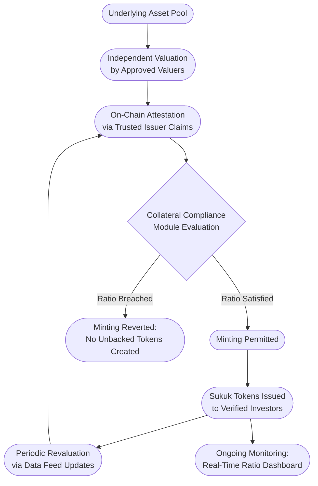
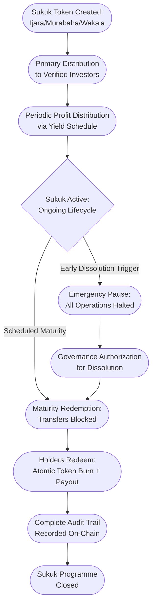
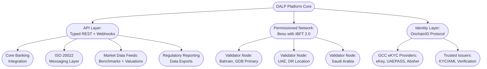

# Response to RFI GDB-DIG-2026-017

# Digital Sukuk Issuance and Lifecycle Management Platform

---

## Executive Summary

Issuing a digital token is straightforward. Issuing a Sharia-compliant sukuk programme that satisfies AAOIFI standards, enforces asset-backing integrity throughout the instrument lifecycle, respects the distinction between profit-sharing and interest, and accommodates Sharia board governance at every structural decision point: that is where the genuine complexity lies. Gulf Development Bank's planned programme, spanning ijara, murabaha, and wakala structures across multiple GCC jurisdictions, requires a platform that treats Islamic finance as a first-class instrument design problem, not a cosmetic relabelling of conventional bond mechanics.

SettleMint's Digital Asset Lifecycle Platform (DALP) is built on the ERC-3643 (T-REX) standard, the open Ethereum standard for regulated security tokens, and addresses this complexity through three architectural properties that matter for GDB's programme.

First, composable instrument design. DALP's single audited token contract (DALPAsset) can be configured to represent any financial instrument through runtime configuration. For GDB, this means structuring ijara sukuk with lease-asset metadata and rental distribution schedules, murabaha sukuk with cost-plus payment profiles and commodity-backing verification, and wakala sukuk with agency-based return mechanics, all from the same platform with the same compliance guarantees, without custom smart contract development for each structure.

Second, ex-ante compliance enforcement. Every transaction, whether a token transfer, a minting operation, or a distribution, passes through DALP's compliance module system before execution. If a transfer would violate any configured rule (investor eligibility, jurisdictional restriction, asset-backing ratio, holding period), the transaction reverts atomically. There is never a state where non-compliant sukuk tokens exist in an unauthorized wallet. This enforcement happens at the smart contract level using twelve composable compliance module types, not at an application layer that can be bypassed.

Third, institutional governance architecture. DALP's role-based access control, governance approval gates, and immutable audit trail provide the control surfaces that Sharia board oversight, CBB regulatory compliance, and multi-jurisdictional investor management require. Governance decisions are recorded on-chain and enforced through smart contract permissions, creating the auditable decision chain that regulators and Sharia scholars expect.

This response addresses each area of GDB's RFI in the order presented, with explicit identification of where DALP provides native capability, where configuration is required, and where external system integration is needed.

---

## Section 1: Sukuk Structure Support

### Ijara Sukuk: Lease-Based Structures

DALP represents ijara sukuk through the bond asset class configured with features, compliance modules, and metadata tailored to lease-based economics. The approach preserves the economic substance of the ijara structure rather than forcing it into a conventional bond mould.

The underlying lease asset is represented through DALP's customizable metadata schema. Each ijara sukuk token carries immutable fields identifying the leased property or asset, its appraised value, the lease commencement and expiry dates, the lessor and lessee identities, and the rental payment schedule. These metadata fields are defined by GDB's operations team at the instrument template level and locked at issuance, ensuring that every token maintains a verifiable, auditable link to the underlying real asset. The metadata schema also supports restricted-mutable fields (updatable only by governance-authorized roles) for values that may change during the instrument life, such as property revaluation amounts, with every modification recorded in the audit trail.

Periodic rental payments are managed through DALP's Fixed Yield Schedule add-on, which automates the distribution of returns to sukuk holders. The mechanism works as follows: the system captures a balance snapshot at a configured record date, calculates each holder's pro-rata entitlement based on their holding at that snapshot, and executes distributions from a designated treasury account. Distribution schedules support monthly, quarterly, and semi-annual frequencies aligned to the underlying lease terms.

For the distinction between fixed-rate and floating-rate rental structures, DALP accommodates both models. Fixed-rate ijara sukuk use a predetermined distribution amount per period, configured in the yield schedule and pre-funded in the treasury. Floating-rate structures consume updated rental amounts through DALP's data feed infrastructure, which integrates with external benchmark rate providers. The updated rate feeds into the distribution calculation for each period, enabling rental payments that track market benchmarks while maintaining the same compliance enforcement and audit trail.

The purchase undertaking that governs ijara dissolution is handled through DALP's maturity redemption feature. At the scheduled dissolution date, the feature blocks all further transfers. Holders redeem certificates by burning tokens in exchange for the exercise price from the designated treasury, in an atomic transaction where tokens burn and funds transfer simultaneously. For declining-schedule purchase undertakings where the exercise price changes over the lease term, the exercise price is maintained in restricted-mutable metadata and updated by governance-authorized roles according to the predetermined schedule.

*Figure 1: DALP's Asset Designer enables configuration of sukuk-specific parameters, compliance modules, and distribution schedules, translating Sharia board-approved structures into enforceable digital instruments without custom development.*

### Murabaha Sukuk: Cost-Plus Financing

Murabaha sukuk are configured in DALP using the bond asset class with metadata fields that capture the cost-plus financing structure. The instrument template defines the original acquisition cost of the underlying commodity or asset, the agreed markup (profit margin), and the deferred payment schedule as structured metadata. These fields are set at issuance and recorded on-chain, providing a transparent and auditable record of the murabaha contract terms that Sharia auditors can verify independently.

The deferred payment schedule is managed through the Fixed Yield Schedule add-on, configured with a payment profile that distributes the pre-agreed markup over the financing period. The platform's data model accommodates the distinction between murabaha profit payments and conventional interest: distribution labels, calculation references, and reporting categories are all configurable at the instrument template level. GDB can establish terminology ("murabaha profit instalment," "cost-plus distribution") that appears consistently across platform-generated reports, investor statements, and audit records.

DALP's collateral compliance module provides the mechanism for verifying that murabaha sukuk remain backed by identifiable assets. The module is configured with a collateral ratio (expressed in basis points) and a collateral claim topic. Trusted issuers, such as independent commodity inspectors or warehouse operators, issue signed on-chain attestations verifying the value of the underlying commodity pool. If minting new sukuk tokens would cause the total supply to exceed the attested asset value at the configured ratio, the transaction reverts. This enforcement happens at the smart contract level: there is no operational path to create unbacked murabaha tokens.

### Wakala Sukuk: Agency-Based Structures

Wakala sukuk present the most complex distribution mechanics among GDB's planned structures, and DALP addresses them through a deliberate combination of platform capability and integration with GDB's fund management infrastructure.

The wakala agreement is represented through DALP's metadata schema, with fields capturing the wakeel's authority boundaries, the expected profit rate, the incentive fee formula, and the investment mandate parameters. These terms are recorded as part of the instrument template and linked to each sukuk token on-chain.

For the expected profit rate distribution to sukuk holders, DALP's Fixed Yield Schedule handles the execution: scheduled, pro-rata distributions from a designated treasury with full compliance enforcement and audit trail. The platform natively supports the mechanics of moving value from a treasury to verified holders according to a schedule.

The full wakala waterfall calculation, however, sits at the boundary of platform capability and institutional business logic. Specifically, the comparison of actual portfolio returns against the expected rate, the calculation of the wakeel's incentive fee when returns exceed expectations, and loss allocation when returns fall below the expected rate require access to portfolio performance data, management accounting records, and programme-specific fee structures that reside in GDB's financial systems. DALP does not perform this waterfall arithmetic internally because embedding a generic waterfall engine would either be too rigid for GDB's specific terms or too flexible to provide meaningful guardrails.

The correct architecture positions DALP as the distribution execution and compliance layer. GDB's fund administrator or treasury management system computes the waterfall outputs (holder distribution amounts, wakeel incentive fee, loss allocation adjustments) and pushes them to DALP through its typed REST API. DALP then executes each distribution with the same identity verification, jurisdictional compliance, and audit trail enforcement as any other platform operation. This separation ensures that the financial calculation expertise stays where it belongs (with GDB's fund management infrastructure) while the compliance enforcement, settlement execution, and audit trail stay on-chain.

### Asset-Backing Verification and Sharia Substance

Ensuring that every sukuk token maintains verifiable backing by a real asset is both a Sharia requirement and an operational challenge that most digital platforms underestimate. DALP's collateral compliance module addresses the quantitative dimension of this challenge through a mechanism that enforces backing ratios at the smart contract level.

The module works as follows: trusted issuers (independent valuers, auditors, or Sharia-approved custodians) issue signed on-chain claims attesting to the value of the underlying asset pool. The compliance module is configured with a minimum collateral ratio. Before any new sukuk tokens are minted, the module verifies that the resulting total supply will not exceed the attested asset value at the required ratio. If the ratio would be breached, the minting transaction reverts. This is ex-ante enforcement: the check happens before the tokens exist, not after.

For ongoing monitoring, DALP's data feed infrastructure enables periodic revaluation of underlying assets by consuming external valuation updates. When the collateral compliance module receives an updated attestation showing a lower asset value, the effective minting capacity adjusts immediately. Operations teams can monitor the real-time ratio through the platform's dashboard and configure alerts when the ratio approaches the threshold.

Asset identification and tracking use DALP's metadata system. Each sukuk issuance carries metadata fields linking to specific underlying assets: property identifiers and lease terms for ijara, commodity inventory references for murabaha, and investment portfolio identifiers for wakala. These fields provide the audit trail connecting digital tokens to physical or economic assets.

The qualitative Sharia assessment of whether a particular asset meets Sharia-compliance requirements (genuine economic activity, permissible asset class, appropriate risk-sharing) remains the domain of GDB's Sharia Supervisory Board. DALP provides the governance workflow to ensure that this assessment is obtained and recorded before issuance proceeds, and the enforcement mechanism to prevent issuance without governance approval. The platform does not make Sharia determinations; it ensures that the board's determinations are captured and enforced.

*Figure 2: Asset-backing verification ensuring that sukuk token supply never exceeds the attested value of the underlying asset pool, with continuous monitoring through the instrument lifecycle.*

### Risk-Sharing and Prohibition of Guaranteed Returns

DALP's data model and terminology are configurable to reflect Sharia-compliant economics at every layer. Distribution schedules, yield calculations, and payment classifications are all defined at the instrument template level. GDB establishes the terminology ("rental income distribution," "murabaha profit instalment," "wakala expected return") that appears consistently across all platform outputs: investor statements, audit reports, regulatory data exports, and API responses. The platform does not impose conventional interest-based language or data structures.

For the critical distinction between expected profit rates and guaranteed returns, DALP's architecture supports variable distributions where actual amounts can differ period to period based on asset performance. When the yield schedule consumes amounts from external data feeds or fund administrator calculations, distributions reflect realized returns rather than a contractually fixed rate. For wakala sukuk where the actual portfolio return determines the distribution, the holder receives a performance-linked payment, not a predetermined interest coupon. For ijara sukuk where the rental amount adjusts with market benchmarks, the distribution tracks real rental value rather than a synthetic yield.

This variability is architecturally native to the platform, not a workaround. DALP's distribution mechanism executes whatever amount is configured or fed for each period, with no assumption that distributions are fixed. The Sharia compliance of the resulting structure, specifically the determination that the risk-sharing is genuine and the returns are not disguised interest, is a judgment for GDB's Sharia Supervisory Board based on the programme structure. DALP provides the instrument design flexibility, the distribution execution, and the audit trail that demonstrates the structure operates as designed.

---

## Section 2: Sharia Governance and Compliance

### Sharia Board Approval Workflows

GDB's Sharia Supervisory Board requires the ability to approve structural elements before issuance and to maintain oversight throughout the sukuk lifecycle. DALP provides governance control surfaces at two levels that together create an enforceable approval chain.

At the token level, DALP's five operational roles (admin, custodian, emergency, governance, supply management) enforce separation of duties at the smart contract level. The governance role can be assigned to a Sharia board representative or a designated compliance officer who acts on the board's behalf. Operations that require governance authorization, including new issuances, modifications to compliance parameters, changes to distribution schedules, and token feature reconfigurations, cannot proceed without explicit approval from the governance role holder. This is smart contract enforcement: the platform does not offer an administrative bypass for governance-gated operations.

At the compliance level, the transfer approval module can be activated to require explicit authorization for specific transaction types. Combined with the governance role, this creates a two-gate approval structure where both operational authorization and compliance approval must be obtained before the transaction executes.

Sharia board resolutions are recorded through DALP's immutable audit trail. Every governance approval action is captured with the actor's verified identity, the timestamp, the specific operation approved, and the resulting state change. For formal resolution documentation, the platform's metadata system supports attaching resolution references to the relevant token record, creating a verifiable link between the Sharia board's decision and the on-chain enforcement.

DALP does not include a purpose-built Sharia board deliberation system with fatwa tracking, scholar voting, or deliberation workflow management. The platform provides the governance enforcement points and the audit infrastructure. The deliberation process, resolution formatting, and scholar coordination remain in GDB's existing Sharia governance framework. What DALP guarantees is that the output of that process, the approval or denial, is recorded on-chain and enforced through smart contract permissions.

### AAOIFI Standards Accommodation

DALP's configurable architecture maps to AAOIFI standards through specific platform mechanisms rather than a single pre-built compliance module:

| AAOIFI Standard | Platform Mechanism | What DALP Provides | What Remains External |
|---|---|---|---|
| FAS 17 (Investments) | Metadata schemas, instrument templates | Configurable fields for investment classification, measurement basis, and fair value per AAOIFI categorization. Every issuance captures consistent structured data. | Accounting treatment calculations and financial statement generation. |
| FAS 33 (Investment in Sukuk) | Metadata classification fields | Classification tags (amortized cost, fair-value-through-equity, fair-value-through-income) carried as token metadata, exported via API. | Impairment testing, amortization calculations, and journal entry generation. |
| SS 17 (Investment Sukuk) | Composable token features, collateral compliance module, metadata schemas | Asset-backing enforcement, configurable distribution mechanics matching ijara/murabaha/wakala economics, governance approval gates. The token architecture ensures each sukuk type is structured according to its specific requirements. | Sharia board's qualitative assessment that the digital structure preserves the required economic substance. |
| SS 59 (Sale of Debt) | Transfer approval module, compliance module configuration | Enforcement of transfer restrictions on debt-based (murabaha) sukuk to prevent secondary trading scenarios that would constitute prohibited bay' al-dayn. | Sharia board's determination of which transfer scenarios are permissible. |

This mapping reflects a deliberate boundary: DALP provides the data infrastructure, compliance enforcement, and governance controls that enable AAOIFI-aligned operations. It does not perform accounting calculations, generate AAOIFI-formatted financial statements, or make Sharia rulings. Those functions remain with GDB's accounting systems and Sharia Supervisory Board respectively.

### CBB Rule Book Compliance

DALP's compliance framework maps to Central Bank of Bahrain Rule Book Volume 6 requirements through three integrated capabilities:

**Investor categorization.** The platform's identity verification system, built on the OnchainID protocol, supports tiered investor classification. Trusted issuers attach signed claims to each investor's on-chain identity attesting to their regulatory categorization (licensed institution, associated person, accredited investor, other investor per CBB definitions). Compliance modules then enforce category-specific rules, including minimum investment thresholds and eligibility restrictions, at the smart contract level. The claim expression system uses RPN (Reverse Polish Notation) notation to encode complex eligibility logic: for example, requiring "KYC AND AML AND (LICENSED_INSTITUTION OR ACCREDITED_INVESTOR)" for a specific sukuk issuance.

**Disclosure management.** DALP's metadata and document management capabilities support attaching prospectus documents, offering circulars, and periodic disclosures to each sukuk token's on-chain record. Compliance rules can gate investor onboarding behind prospectus delivery confirmation, ensuring that disclosure requirements are met before investors can participate.

**Reporting data.** DALP's typed REST APIs provide comprehensive access to all on-chain activity: issuances, transfers, distributions, compliance events, and audit logs with filtering, pagination, and date-range capabilities. The platform maintains analytics views optimized for reporting queries. Report formatting and CBB filing are handled by GDB's regulatory reporting systems, consuming DALP's structured data outputs.

### Prohibition of Bay' al-Dayn

The prohibition on trading debt-based instruments at a discount, specifically relevant to GDB's murabaha sukuk, can be enforced through DALP's compliance module system at two levels of strictness:

**Approval-gated transfers.** The transfer approval compliance module requires that every secondary market transfer of murabaha sukuk receives explicit authorization before execution. The designated compliance officer or Sharia governance role holder reviews each proposed transfer, verifying that the transfer terms do not constitute prohibited bay' al-dayn. Non-approved transfers revert at the smart contract level.

**Restrictive transfer controls.** For a stricter approach, the time lock module can prevent any secondary trading during specified periods, or the country and identity compliance modules can restrict the pool of eligible secondary buyers to specific institutional categories. These restrictions compose with the transfer approval module: even among eligible buyers, each transfer can still require explicit approval.

The platform enforces whatever restriction GDB's Sharia Supervisory Board determines is appropriate. The specific ruling on which transfer scenarios constitute prohibited debt trading is the board's determination. DALP translates that ruling into enforceable smart contract constraints.

*Figure 3: Compliance policy template library showing reusable configurations that can be tailored to AAOIFI standards, CBB Rule Book requirements, and Sharia board directives.*

---

## Section 3: Profit Distribution and Financial Mechanics

### Periodic Profit Distribution

DALP's profit distribution infrastructure ensures that every sukuk holder receives their correct entitlement on schedule, with full compliance enforcement and a complete audit trail. The mechanism centres on the Fixed Yield Schedule add-on, which manages the distribution lifecycle from snapshot through settlement.

The distribution process operates in three stages. First, the system captures a balance snapshot at a configured record date, recording every holder's position at a precise point in time using the Historical Balances token feature. Second, the system calculates each holder's pro-rata entitlement based on their snapshot balance relative to total outstanding supply. Third, distributions execute from a designated treasury, with each payment passing through the full compliance pipeline (identity verification, jurisdictional checks) before settlement.

Three distinctions matter for GDB's sukuk programme:

**Terminology and data model.** DALP's distribution labels, calculation references, and reporting classifications are configured per instrument template. GDB defines the terminology ("rental income distribution" for ijara, "murabaha profit instalment" for murabaha, "wakala expected return" for wakala) and that terminology flows through every platform output: investor-facing statements, audit trails, API responses, and regulatory data exports. The platform never imposes interest-based language.

**Fixed versus variable amounts.** Fixed expected profit rates (ijara with predetermined rental, murabaha with agreed markup) use a predetermined distribution amount pre-funded in the treasury. Variable returns (wakala performance-linked payments, floating-rate ijara) receive period-specific amounts from GDB's fund administrator or treasury system through the API. Both models use the same distribution infrastructure and compliance enforcement.

**Holding-period sensitivity.** The Historical Balances feature maintains point-in-time records for every holder, enabling pro-rata calculations that account for when investors acquired their positions. An investor who purchased certificates midway through a distribution period receives a proportional entitlement based on their holding duration, not the full period amount.

### Wakala Distribution Waterfall

The wakala waterfall requires multi-step calculations specific to GDB's programme terms. DALP's role is execution and compliance, not arithmetic:

GDB's fund administrator or treasury management system computes the waterfall outputs: actual portfolio return, expected profit rate payment to sukuk holders, incentive fee for the wakeel (when actual returns exceed expectations), and loss allocation (when actual returns fall below the expected rate). These computed amounts are pushed to DALP through the typed REST API. DALP then executes each distribution with the same identity verification, jurisdictional compliance, and audit enforcement as any other platform operation.

This separation is architecturally deliberate. Waterfall calculations for agency-based structures involve institution-specific formulas, performance benchmarks, and fee structures that vary across programmes. Embedding a generic engine would compromise either flexibility or accuracy. GDB retains full control over the financial calculation methodology while DALP ensures that the resulting distributions are compliant, auditable, and correctly settled.

### Dissolution and Early Dissolution

DALP manages sukuk dissolution through a combination of the maturity redemption feature and the platform's governance controls:

**Scheduled maturity.** At the configured dissolution date, the maturity redemption feature blocks all further transfers. Holders redeem certificates by burning tokens in exchange for the dissolution amount from the designated treasury. Redemption is atomic: tokens burn and funds transfer in a single transaction. If the treasury has insufficient funds, the transaction reverts entirely, preventing partial payments that could create inequitable outcomes among holders. For ijara sukuk, the dissolution amount corresponds to the purchase undertaking price; for murabaha, the final instalment payment; for wakala, the return of invested capital plus any final profit distribution.

**Early dissolution.** The Emergency role can pause all token operations immediately, halting transfers, distributions, and redemptions. The Governance role then authorizes the modified dissolution workflow. Early dissolution triggers (total loss of underlying asset, regulatory intervention, Sharia board determination of non-compliance) require human judgment and governance authorization rather than automated trigger logic. The platform provides the control surfaces to halt operations rapidly and the governance gates to authorize the dissolution procedure.

**Exercise price calculation.** For ijara sukuk with a declining purchase undertaking, the exercise price is maintained in restricted-mutable metadata and updated by governance-authorized roles according to the predetermined amortization schedule. The maturity redemption feature references this value when calculating the dissolution payout.

**Residual value distribution.** When an underlying asset is liquidated, the pro-rata distribution of residual value uses the same yield schedule mechanism as periodic distributions. The fund administrator calculates the distribution amount based on actual liquidation proceeds, and DALP executes the final distribution with full compliance enforcement.

*Figure 4: Sukuk lifecycle from issuance through periodic distributions to dissolution, showing the governance gates and atomic redemption mechanics.*

---

## Section 4: Regulatory Compliance and Investor Management

### Investor Onboarding and Identity Verification

Every investor in GDB's sukuk programme will have a verified on-chain identity before they can hold or transfer sukuk tokens. This is not an optional application-layer check; it is enforced at the smart contract level through DALP's implementation of the OnchainID protocol.

The onboarding sequence proceeds as follows: an identity contract is deployed for each investor through DALP's Identity Factory, creating a persistent on-chain identity anchor. Trusted issuers (KYC providers, identity verification services, or GDB's compliance team acting in an issuer capacity) attach signed claims attesting to specific attributes: KYC completion, AML clearance, investor classification, jurisdiction of residence, and any GCC-specific regulatory categorizations. Claims include expiration timestamps, enabling automatic re-verification enforcement; an expired KYC claim blocks all transfers until renewed.

For GCC regulatory categorization specifically:

**CBB (Bahrain):** Investor classification claims map to CBB Rule Book categorizations. Compliance modules enforce category-specific minimum investment thresholds at the smart contract level.

**SCA (UAE):** Claims support SCA's qualified and professional investor definitions, including net asset thresholds and experience criteria.

**CMA (Saudi Arabia):** Claims align to CMA client categorization with jurisdictional eligibility verification.

Once verified, an investor's identity and claims are reusable across all of GDB's sukuk issuances. An investor verified for the initial ijara programme does not need to re-verify for subsequent murabaha or wakala issuances, provided their claims remain valid and match the eligibility expression configured for each instrument. This cross-asset reusability eliminates redundant KYC processes as GDB scales its programme.

Integration with GCC-specific identity systems (Bahrain eKey, UAE UAEPASS, Saudi Absher) is supported through DALP's API-first architecture. The external identity provider performs verification, and the resulting attestation is published as an on-chain claim through the platform's trusted issuer system. Pre-built connectors to specific national identity systems are not shipped with the platform; connectivity is established during implementation through standard API integration.

### Multi-Jurisdictional Compliance Enforcement

DALP's twelve compliance module types compose into the multi-jurisdictional posture that GDB's programme requires. Multiple modules evaluate in sequence for every transaction, and a single module veto blocks the transfer:

**Identity verification module:** Configured with a claim expression using RPN notation. For GDB's programme, the expression might require: KYC AND AML AND INVESTOR_CLASSIFICATION, where the investor classification claim must attest to a category eligible under the relevant jurisdiction's rules.

**Country allow list module:** Restricts participation to investors from GCC member states and any additional approved jurisdictions. Country restrictions enforce based on the jurisdiction claim in each investor's on-chain identity.

**Investor count module:** Caps the number of unique holders per jurisdiction where regulatory requirements impose investor limits.

**Token supply limit module:** Enforces programme-wide issuance caps, including currency-denominated limits where jurisdictional regulations specify them.

**Collateral compliance module:** Ensures that sukuk token supply never exceeds the attested value of underlying assets, as detailed in Section 1.

These modules compose through sequential AND evaluation with fail-closed logic. The platform's default is denial unless every active module explicitly approves. No transaction bypasses compliance unless explicitly authorized through the global compliance bypass by a system-level administrator, and every bypass is recorded in the audit trail.

*Figure 5: On-chain identity record showing verified claims from trusted issuers. Compliance modules reference these claims to make identity-based eligibility decisions at the smart contract level for every transaction.*

### AML/CFT Compliance

DALP's AML/CFT capabilities operate at two complementary levels:

**On-chain enforcement.** The address block list compliance module enables real-time blocking of sanctioned wallet addresses. The identity block list blocks all wallets associated with a flagged individual or entity at the identity level. Both lists are updatable through governed administrative operations and take effect immediately for all subsequent transactions. When sanctions screening identifies a new entity, adding them to the block list prevents all further transactions across every sukuk on the platform.

**Transaction data for monitoring.** DALP's immutable audit trail captures every on-chain transaction with sender identity, recipient identity, amount, timestamp, asset identifier, and compliance evaluation results. This data is available through typed REST APIs and can be consumed in real time by GDB's transaction monitoring systems for pattern analysis, suspicious activity detection, and reporting aligned to FATF recommendations and MENAFATF mutual evaluation criteria.

The platform does not include a built-in transaction monitoring engine for pattern analysis or suspicious transaction report generation. DALP provides the complete, immutable transaction dataset and the on-chain enforcement mechanisms. Analytical monitoring and STR generation integrate with GDB's existing AML compliance infrastructure.

### Regulatory Reporting

DALP provides the data infrastructure for CBB-compliant regulatory reporting through comprehensive API access to all platform activity. The typed REST APIs cover issuances, transfers, distributions, redemptions, compliance events, freeze and unfreeze actions, role changes, and governance approvals, all with filtering, pagination, and date-range capabilities.

The platform's analytics layer provides optimized views for common reporting queries: holder registries, transaction histories, compliance audit trails, distribution records, and investor classification summaries. Data exports in structured formats (JSON, CSV) feed GDB's regulatory reporting systems for production of CBB-formatted periodic disclosures, material event notifications, and register maintenance reports.

Report formatting, filing logistics, and CBB submission workflows remain with GDB's regulatory compliance team and systems. DALP ensures that the underlying data is complete, immutable, and accessible.

---

## Section 5: Technology Architecture and Deployment

### Blockchain Infrastructure

DALP operates exclusively on EVM-compatible blockchain networks, purpose-built for the Ethereum Virtual Machine ecosystem. For GDB's sovereign sukuk programme, the recommended architecture is a permissioned network using Hyperledger Besu with IBFT 2.0 or QBFT consensus, providing the governance control, transaction privacy, and performance characteristics that a regulated Islamic finance programme demands.

**Consensus and finality.** On a permissioned Besu network with IBFT 2.0 consensus, transaction finality is immediate: once a block is committed, it cannot be reverted. This single-block finality provides the settlement certainty that regulated financial instruments require. There is no probabilistic finality or reorganization risk.

**Throughput.** Transaction throughput depends on network configuration parameters (block time, gas limit, validator count) that are tuned during deployment planning. On a well-configured permissioned Besu network, throughput of several hundred transactions per second is achievable, sufficient for GDB's programme scale. DALP controls the application-layer efficiency; the raw transaction capacity is a property of the network configuration.

**Network architecture.** GDB operates the permissioned network with validator nodes under its control. Additional read-only nodes can be provisioned for participants, regulators, or auditors who need transaction visibility without validation authority.

### Deployment Model and Data Residency

DALP supports three deployment models, all compatible with GCC data residency requirements:

**Dedicated cloud deployment** in a data centre with GCC presence (such as the AWS Bahrain region) ensures all data remains within GCC jurisdiction. GDB controls the deployment environment, encryption keys, and access policies.

**On-premises deployment** within GDB's own data centre infrastructure provides maximum sovereignty. DALP's containerized architecture runs on standard compute infrastructure without specialized hardware dependencies.

**Hybrid model** with permissioned network nodes distributed across multiple GCC locations (Bahrain, UAE, Saudi Arabia) and the application layer in GDB's primary data centre. This topology provides geographic resilience while maintaining data residency within the GCC.

All models support operating blockchain nodes within Bahrain's jurisdiction, satisfying CBB data residency requirements. Network topology decisions are finalized during implementation planning based on GDB's specific resilience and governance requirements.

### Integration Capabilities

DALP's API-first architecture provides integration points for GDB's existing financial infrastructure:

| Integration Area | DALP Capability | Integration Approach |
|---|---|---|
| Core banking systems | Typed REST APIs covering all platform operations; webhook event notifications | Standard API integration during implementation |
| SWIFT/ISO 20022 | ISO 20022 message format support through the API layer | Message formatting integration for payment and settlement reconciliation |
| Existing CSD/registry | Complete holder registry and transaction data via API | Reconciliation feeds during transition from legacy registry |
| Market data providers | Data feed infrastructure consuming external price and benchmark rates | Feed adapter configuration for rental benchmarks, commodity pricing, portfolio performance |

Pre-built connectors to specific third-party systems are not shipped with the platform. Integration follows a standard API-based approach established during implementation. DALP provides the endpoints, data formats, and webhook infrastructure; the connectivity layer adapts to GDB's technology landscape.

### Security Architecture

DALP enforces defence in depth across four independent layers, each auditable separately:

**Access control.** Role-based access control with seven per-asset roles enforces separation of duties at the smart contract level. Platform-level authentication integrates with enterprise identity providers via OpenID Connect (OIDC) and SAML. Multi-factor authentication supports FIDO2/WebAuthn passkeys.

**Key management.** Integration with hardware security modules (HSMs) compliant with FIPS 140-2 ensures that cryptographic keys never exist in plaintext outside the HSM boundary.

**Audit trail.** Every platform action, on-chain transactions and administrative operations alike, is recorded immutably with actor identity, timestamp, operation details, and outcome. Audit data is queryable through the API and exportable for external compliance and forensic tools.

**Network isolation.** Permissioned network deployment ensures only authorized nodes participate in consensus. Transport-layer encryption (TLS) protects all communications. Network segmentation isolates platform components following the principle of least privilege.

### Disaster Recovery and Business Continuity

DALP's disaster recovery provisions reflect the inherent resilience of blockchain-backed infrastructure combined with application-layer durability:

**Blockchain layer.** On a permissioned network with geographically distributed validators, the network tolerates up to one-third of validators being unavailable without affecting transaction processing (IBFT 2.0 Byzantine fault tolerance). Blockchain data is replicated across all validator nodes, providing inherent redundancy.

**Application layer.** DALP's containerized components support active-passive or active-active deployment. The platform's durable workflow engine ensures that in-progress operations (minting, distributions, settlements) survive infrastructure failures and resume from the last successful step without duplicate execution.

**Recovery targets.** With a properly configured deployment: RPO under 5 minutes for application state, zero data loss for on-chain transactions. RTO under 30 minutes is achievable with automated failover, depending on deployment topology. These targets are finalized during implementation planning based on the specific infrastructure configuration.

*Figure 6: Platform architecture showing the permissioned network topology with GCC-based validator nodes, API integration surface, and identity verification layer.*

---

## Section 6: Implementation and Support

### Implementation Timeline

The initial ijara sukuk issuance is achievable within a 10 to 14 week implementation timeline from contract signing. The phased approach accounts for the governance-intensive nature of Islamic finance programmes, where Sharia board review and CBB regulatory engagement run in parallel with technical deployment:

**Phase 1: Foundation (Weeks 1 to 3).** Platform deployment in GDB's selected infrastructure. Permissioned network setup with initial validator nodes in Bahrain. Identity and compliance framework configuration. Enterprise authentication integration (OIDC/SAML).

**Phase 2: Sukuk Configuration (Weeks 4 to 6).** Instrument template design for ijara sukuk, in collaboration with GDB's Sharia Supervisory Board. Compliance module configuration for investor eligibility, jurisdictional restrictions, and collateral requirements. Metadata schema definition for lease asset tracking. Yield schedule configuration for periodic rental distributions.

**Phase 3: Integration and Testing (Weeks 7 to 9).** API integration with GDB's core banking, fund administration, and regulatory reporting systems. End-to-end lifecycle testing: investor onboarding, sukuk issuance, rental distribution, and simulated dissolution. User acceptance testing with GDB's operations, compliance, and treasury teams.

**Phase 4: Governance and Go-Live (Weeks 10 to 12).** Sharia board review and formal approval of the digital sukuk structure. Regulatory engagement with CBB. Operational readiness assessment and staff training. Security audit of the deployed environment.

**Phase 5: First Issuance (Weeks 13 to 14).** Initial ijara sukuk issuance. Monitoring and operational support through the first distribution cycle.

Subsequent sukuk structures (murabaha and wakala) leverage the foundation established during the initial deployment. Incremental effort for additional sukuk types is estimated at 4 to 6 weeks per structure, primarily focused on instrument template configuration, compliance tuning, and integration adjustments for different distribution mechanics.

### Islamic Finance Platform Experience

SettleMint has deployed DALP for regulated financial instrument tokenization across multiple jurisdictions, including programmes in the GCC region. The platform's asset class coverage spans bonds, equities, funds, real estate, precious metals, deposits, and stablecoins, demonstrating the configurability that diverse instrument structures require.

DALP's architecture was designed from the outset to accommodate instruments where compliance, governance, and economic structure are inseparable from the technology platform. Islamic finance sukuk are a natural fit for this architecture because they demand exactly the kind of configurable compliance enforcement, governance-gated lifecycle management, and auditable asset-backing verification that DALP provides as core capabilities. Specific reference details for relevant deployments can be provided under NDA upon request.

### Ongoing Support Model

SettleMint provides structured ongoing support:

**Platform support.** Defined SLA terms with response time commitments across severity levels. 24/7 availability for critical production issues affecting GDB's sukuk operations.

**Updates and upgrades.** Regular platform releases delivering new features, security patches, and compliance framework updates. Smart contract upgrades managed through the UUPS proxy architecture, enabling improvements without redeploying tokens or migrating holder data.

**Dedicated account management.** A named account team providing strategic guidance, programme expansion support, and coordination with product and engineering teams for GDB-specific requirements.

**Training.** Comprehensive programmes covering platform administration, sukuk lifecycle management, compliance configuration, and API integration for GDB's operations, compliance, technology, and Sharia governance teams.

---

## Appendix A: Capability Boundary Summary

| Requirement | DALP Capability | Configuration Needed | External Integration |
|---|---|---|---|
| Sukuk token issuance and lifecycle | Native: bond asset class, maturity redemption, yield schedule | Asset type, features, compliance modules, metadata schema | None for standard lifecycle |
| Ijara rental distribution | Native: Fixed Yield Schedule add-on | Distribution frequency, fixed or variable rates | External benchmark feeds for floating-rate |
| Murabaha payment schedule | Native: Fixed Yield Schedule configured for instalment profile | Payment amounts, schedule, markup allocation | None |
| Wakala distribution execution | Native: distribution infrastructure | Treasury funding, recipient lists | Fund administrator for waterfall calculation |
| Asset-backing verification | Native: collateral compliance module | Ratio, trusted issuer configuration | External valuers for on-chain attestation |
| Sharia board governance gates | Native: governance roles, transfer approval | Role assignment, approval workflow | Sharia deliberation and resolution process |
| Multi-GCC compliance enforcement | Native: composable compliance modules | Country lists, eligibility expressions, investor limits | GCC eKYC provider integration |
| Bay' al-dayn prevention | Native: transfer approval module | Approval workflow, restriction configuration | Sharia board ruling on permissible scenarios |
| AML/CFT enforcement | Native: block lists, audit trail | Sanctions lists, monitoring integration | Transaction monitoring and STR system |
| CBB regulatory reporting | Data provision: complete API access | Report query configuration | Report formatting and CBB filing |
| AAOIFI standard compliance | Data and governance infrastructure | Metadata schemas, classification fields | Accounting calculations and financial reporting |
| Core banking integration | API-first: typed REST + webhooks | Endpoint configuration | Middleware or direct API connectivity |
| ISO 20022 messaging | Message format support via API | Message mapping | Payment system connectivity |
| Permissioned network in Bahrain | Native: Besu deployment | Node configuration, validator setup | Data centre infrastructure |
