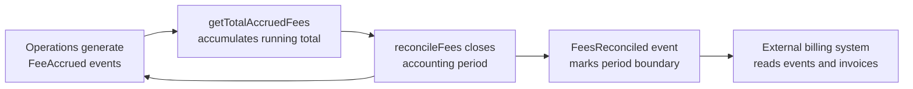

# Content Refresh: Section 1 (Configurable Tokens) — Loop 2 Final

## Changes Applied from Loop 1 Review

1. Integrated improvements as content-ready drop-in replacements
2. Strengthened client-centric framing for fee exemptions
3. Added explicit three-model transition pattern across fee features
4. Tightened long sentences (max 35 words)
5. Added reconciliation flow diagram for Transaction Fee Accounting
6. Strengthened competitive differentiation

---

## Drop-In Replacement: Feature Table in "Composable by Design" Section

Replace the existing Fees & Charges row in the feature table:

| Feature Category | Available Features | What They Control |
|-----------------|-------------------|-------------------|
| **Fees & Charges** | AUM Fee, Transaction Fee, External Transaction Fee, Transaction Fee Accounting | Three fee architectures: net-deduction with per-operation rates, inflationary time-based management fees, cross-currency fixed fees, and accounting-only tracking with exemptions and reconciliation cycles |

---

## Drop-In Replacement: Transaction Fee (Section 2.2)

**Transaction Fee**

A per-operation fee feature that deducts a configurable percentage from every mint, burn, or transfer. Each operation type has its own independent fee rate, giving issuers precise control over the economics of primary issuance, position exits, and secondary trading.

| Parameter | Description |
|-----------|-------------|
| `mintFeeBps` | Fee rate in basis points applied to mint operations (e.g., 100 = 1%) |
| `burnFeeBps` | Fee rate in basis points applied to burn operations |
| `transferFeeBps` | Fee rate in basis points applied to transfer operations |
| `feeRecipient` | Treasury address receiving deducted fees |

This per-operation granularity is uncommon among tokenization platforms, which typically offer a single flat fee rate. DALP's three-rate model lets institutions design fee structures that align with their business logic. A fund platform might charge zero on minting to encourage participation while collecting 2.5% on secondary transfers as its revenue model. An exchange operator might differentiate between creation fees, redemption fees, and trading fees. Each rate is independently configurable through `setFeeRates()`, requiring the `GOVERNANCE_ROLE`.

*Rate immutability*: Calling `freezeFeeRates()` permanently locks all three rates. Once frozen, `isFrozen()` returns true and no rate changes are possible. This matters for instruments where fee certainty is contractually required: investors in a tokenized bond fund need assurance that trading fees will not increase after they have committed capital.

*Technical detail*: This feature supports `supportsRewriting = true`, meaning it modifies the actual transfer amount in-flight. If a user sends 1,000 tokens with a 2.5% transfer fee (250 bps), the recipient receives 975 tokens and 25 tokens go to the fee treasury. Features configured after Transaction Fee in the ordering see the post-fee amount.

*Use cases*: Platform revenue collection with operation-specific pricing, liquidity pool contributions, regulatory levy enforcement, differentiated fee schedules for primary issuance vs secondary trading.

---

## Drop-In Replacement: Transaction Fee Accounting (Section 2.2)

**Transaction Fee Accounting**

DALP offers three fee architectures: net-deduction (Transaction Fee), inflationary (AUM Fee), and cross-currency (External Transaction Fee). Transaction Fee Accounting adds a fourth model: accounting-only tracking that creates an on-chain fee ledger without moving tokens. This serves institutions that calculate fees off-chain but need an immutable, auditable record of what was owed.

Like Transaction Fee, it supports three independent rate configurations (mint, burn, transfer) and per-operation identification. Every qualifying operation emits a `FeeAccrued` event carrying the fee type (MINT, BURN, TRANSFER, or REDEEM), the operation amount, the applicable rate, and the calculated fee amount. External indexing systems can categorize fees by operation type for precise financial reporting.

**Fee exemptions.** Fund operators, exchange platforms, and custodians routinely perform treasury-to-treasury rebalances, system operations, and internal transfers that should not generate fee records. The governance role can mark specific accounts as fee-exempt via `setFeeExemption(account, exempt)`, preventing those accounts from generating `FeeAccrued` events. This keeps the fee ledger accurate for investor-facing reporting. Without exemptions, every internal operational transfer would pollute the fee record, creating reconciliation overhead for finance teams. Exemption status is queryable through `isFeeExempt(account)`.

**Reconciliation cycle.** Fee accounting follows a period-based lifecycle:

Accrued fees accumulate as a running total queryable via `getTotalAccruedFees()`. At accounting period boundaries, the governance role calls `reconcileFees()`, which resets the running total and emits a `FeesReconciled` event with the reconciled amount and period-end timestamp. This creates a clean on-chain marker for each accounting period. The reconciliation is an accounting operation, not a token transfer. It closes the tracking period so external systems can finalize billing or regulatory filings.

**Rate immutability.** As with all fee features, `freezeFeeRates()` permanently locks the configured rates.

*Use cases*: Regulatory fee transparency without on-chain collection, off-chain billing systems that invoice based on on-chain activity, compliance audit trails where fee calculations must be documented, and platforms with periodic off-chain settlement.

---

## Drop-In Replacement: AUM Fee — Addition to Existing Content

Add after the existing AUM Fee `feeRecipient` parameter table:

*Rate immutability*: The governance role can call `freezeFeeRate()` to permanently lock the AUM fee rate. Once frozen, the rate cannot be modified. For fund structures where the management fee is contractually fixed at launch, this provides investors with on-chain assurance that the rate will not change unilaterally.

---

## Drop-In Replacement: External Transaction Fee — Addition to Existing Content

Add after the existing External Transaction Fee `feeRecipient` parameter table:

*Rate immutability*: Calling `freezeFees()` permanently locks all fee parameters: the fee amounts, the fee token address, and the fee recipient. `isFrozen()` confirms immutability status. This is important for instruments where fee terms are embedded in the offering documentation and must not change after issuance.

---

## Drop-In Replacement: Feature Ordering Table (Section 2.3)

No change needed. The existing ordering table accurately reflects the codebase.

---

## Integration Note: "Composable by Design" Narrative

Add after the current "What This Composability Means in Practice" section:

**Fee architecture flexibility.** DALP's four fee models (inflationary AUM, net-deduction per-operation, cross-currency fixed, and accounting-only tracking) mean institutions do not need to choose between on-chain fee enforcement and off-chain billing. A fund token can collect management fees through the AUM Fee model (inflationary, time-based) while tracking trading fees through Transaction Fee Accounting (non-deductive, auditable). A secondary market platform can charge trading fees through the Transaction Fee model (per-operation, net-deduction) while collecting settlement fees in USDC through the External Transaction Fee model. All four models are pre-audited, independently configurable, and freezable for contractual certainty. Every fee feature supports permanent rate immutability through its respective freeze function, ensuring that fee terms agreed at issuance cannot be changed unilaterally.
