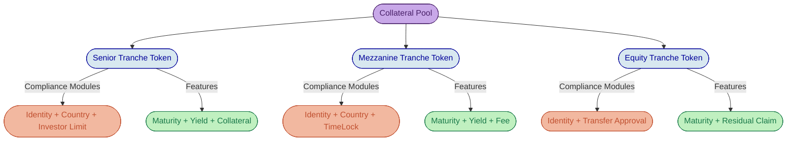
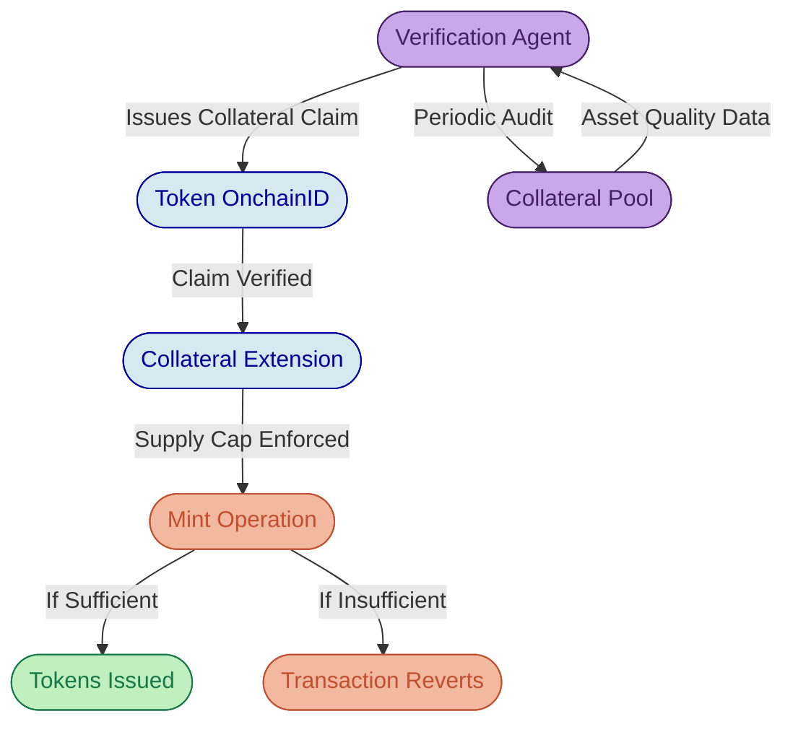

# Structured Products on DALP: Platform Capability Deep-Dive

---

## Multi-Tranche Token Architecture

DALP treats each tranche in a structured product as an independent, fully governed DALPAsset token, giving issuers the ability to assign distinct compliance rules, feature configurations, and access controls to senior, mezzanine, and equity layers without deploying custom contracts. This architecture resolves the central engineering tension in structured finance tokenization: the need for differentiated risk treatment across tranches combined with unified lifecycle management across the deal.

Each tranche is deployed as its own ERC-3643 compliant token through the Asset Factory. This means each tranche inherits the full DALP compliance stack independently: its own Identity Registry binding, its own compliance module configuration, and its own set of configurable token features. A senior tranche might enforce accredited investor verification and restrict transfers to a specific list of institutional counterparties, while a mezzanine tranche applies country restrictions and investor count limits appropriate for a broader qualified investor base. The equity tranche, typically retained by the originator, can be configured with transfer restrictions that enforce regulatory holding periods through the TimeLock compliance module.

The Asset Designer provides the configuration surface for each tranche token. Operators define the tranche's denomination, compliance module stack, and feature set through a guided workflow rather than through custom smart contract development. This configuration-driven approach reduces the time from structuring decision to on-chain deployment from months to hours. Because each tranche is a separate DALPAsset, the inter-tranche relationship is maintained at the application layer through DALP's Unified API, which coordinates lifecycle events across the tranche family.

*Figure 1: The Asset Designer's compliance module selection step, where operators configure tranche-specific rules such as investor eligibility, country restrictions, and transfer controls without writing smart contract code.*

DALP does not enforce a proprietary "structured product" token type. Instead, the composable architecture lets each tranche be configured from the same DALPAsset foundation with feature combinations appropriate to its role. A senior tranche might attach the Maturity Redemption feature with a fixed face value, the Fixed Treasury Yield feature for coupon payments, and the Collateral extension for reserve verification. A mezzanine tranche might share the maturity and yield features but add a Transaction Fee feature to capture spread. This modularity means new structured product types do not require new contract development; they require new configuration patterns.

*Figure 2: Multi-tranche architecture where each tranche is an independent DALPAsset with its own compliance stack and feature configuration, all linked to a shared collateral pool.*

The institutional consequence of this design is that structured product issuers do not face a technology constraint when varying deal structures across programs. A CLO, a mortgage-backed security, and a receivables securitization each require different tranche configurations, but all draw from the same catalog of pre-audited compliance modules and token features. The platform absorbs the structural variation; the issuer focuses on the deal economics.

---

## Waterfall Distribution Mechanics

DALP's distribution infrastructure separates two concerns that are often conflated: the payment execution mechanics and the waterfall priority logic. The platform handles the first natively; the second is implemented through orchestrated workflows that respect each deal's unique payment hierarchy.

The Fixed Treasury Yield feature, attachable to each tranche token, defines the coupon or interest schedule, denomination asset, face value per token unit, and the treasury address from which payments are drawn. When a distribution date arrives, the platform calculates entitlements based on historical token balances at the record date, using the Historical Balances feature's checkpoint mechanism to determine each holder's precise position at the relevant timestamp. This means entitlements are calculated on verified on-chain ownership records, not on external register snapshots that may have diverged.

The waterfall sequencing itself, the priority logic that determines which tranche receives payment first and what coverage tests must pass before subordinate tranches are paid, sits at the orchestration layer rather than inside the token contracts. This is an important architectural distinction. DALP's token features handle the mechanics of distribution: calculating per-holder entitlements, executing payments from treasury, recording claims, and burning redeemed tokens. The waterfall calculation engine, the logic that says "pay senior first, then test coverage ratios, then allocate to mezzanine," is institutional-specific business logic that varies by deal structure. DALP provides the execution infrastructure; the waterfall priority sequencing is implemented through the Unified API's workflow orchestration, where each step triggers the next tranche's distribution only after the prior tranche is fully satisfied.

This separation reflects a deliberate engineering choice. Encoding waterfall logic directly into smart contracts creates rigidity: every new deal structure would require new contract code, new audits, and new deployment cycles. By separating the distribution mechanics (on-chain, per-tranche) from the waterfall sequencing (orchestration layer), DALP supports any waterfall shape without custom contract work. A standard sequential waterfall, a pro-rata waterfall with overcollateralization triggers, or a hybrid structure with reserve accounts can all be implemented through configuration of the orchestration workflow.

For distribution execution, the XvP (Exchange versus Payment) Settlement engine coordinates multi-party atomic transfers. When a waterfall step distributes coupon payments to senior tranche holders, the XvP engine ensures that cash flows from the treasury to all eligible holders atomically. If any single transfer within the batch fails its compliance check, the entire settlement reverts, preventing partial distributions that would create reconciliation discrepancies. The V3 net settlement capability handles scenarios where multiple cash flows between multiple parties must settle simultaneously, which is common when a single payment date triggers distributions across several tranches.

*Figure 3: The XvP Settlement interface where operators coordinate multi-party atomic transfers, ensuring that waterfall distributions either complete fully across all holders or revert entirely.*

The net effect for structured product issuers is that distribution operations run on verified on-chain balances, execute atomically, and leave an immutable audit trail. No reconciliation is needed between the payment agent, the transfer agent, and the registry because all three functions operate on the same on-chain state.

---

## Collateral Management and Verification

DALP's Collateral extension and Collateral Compliance Module enforce on-chain proof-of-reserve requirements at the contract layer, ensuring that no tranche token can be minted beyond verified collateral backing. This enforcement is not advisory; it is an atomic smart contract constraint that reverts any mint operation that would breach the collateral threshold.

The Collateral extension ties each token's minting capability to verified collateral claims on the token's own OnchainID identity. Before any new tokens can be minted, the extension checks whether the identity holds a valid collateral claim from a trusted issuer. This claim contains two data points: the collateral amount (the maximum supply that current reserves support) and an expiry timestamp (after which the attestation must be renewed). If the post-mint total supply would exceed the collateral amount, the mint operation reverts. No tokens enter circulation without verified backing.

The Collateral Compliance Module extends this verification through a configurable collateral ratio expressed in basis points. A ratio of 10,000 basis points represents 100% collateralization; 15,000 represents 150% overcollateralization. The module uses ceiling division when calculating required collateral, ensuring that rounding never results in under-enforcement. This ratio is configurable per token, so senior tranches can require higher collateral coverage than mezzanine tranches, reflecting their different risk profiles within the same deal structure.

Collateral attestations follow the ERC-735 claims framework. A trusted third-party auditor, such as a fund administrator or independent verification agent, issues a collateral claim to the token's OnchainID identity. The platform supports multiple trusted issuers per token, enabling redundancy: if one auditor's attestation expires, a second auditor's valid claim maintains continuity. The system selects the highest valid collateral amount across all valid claims, ensuring the most favorable attestation is applied.

For structured products, this architecture maps directly to established operational practices. The verification agent or trustee performs periodic audits of the underlying collateral pool (loan portfolio, receivables, mortgages) and publishes the results as an on-chain claim. Investors can verify the current collateral status at any time through the platform's API, which returns the verified amount, the issuing auditor's address, and the attestation's expiry date. This transparency gives every tranche holder direct, verifiable access to collateral status rather than relying on periodic trustee reports.

*Figure 4: Collateral verification flow where external verification agents issue on-chain attestations that gate token minting, ensuring no tranche can exceed its verified collateral backing.*

DALP does not provide the off-chain collateral pool management system. The platform does not track individual loans within a mortgage pool, calculate delinquency rates across receivables, or monitor prepayment speeds. Those functions belong to the servicer or fund administrator. DALP's role is to receive the aggregated collateral attestation from those systems and enforce it on-chain through the API integration layer. This division is architecturally correct: the platform owns enforcement, the servicer owns analytics, and neither substitutes for the other.

---

## Risk Parameter Monitoring

DALP's data feeds module and compliance architecture provide the infrastructure for consuming external risk metrics and enforcing operational responses when those metrics breach configured thresholds, though the risk calculations themselves are performed by external servicers and analytics providers.

The Issuer-Signed Scalar feed pattern allows trusted data providers to publish signed risk metrics on-chain, where they can be consumed by application-layer orchestration workflows. A trusted servicer or analytics provider can publish updated LTV ratios, delinquency percentages, or coverage test results as signed scalar values. These feeds include staleness detection: the platform flags when a critical risk feed has not been updated within a defined window, alerting operators to potential data gaps.

It is important to state the enforcement boundary accurately. DALP's compliance modules are configured with static parameters at the administrative level; they do not dynamically reconfigure themselves based on incoming data feeds. When risk metrics breach a threshold, the operational response requires an authorized administrator or an orchestration workflow to update compliance module parameters accordingly. For example, activating a transfer restriction on the equity tranche when an overcollateralization test fails requires a governed administrative action, not an automatic trigger. The platform provides the enforcement mechanism (compliance module update) and the data infrastructure (feeds), but the conditional logic connecting them operates at the orchestration layer, where institutional-specific business rules determine the appropriate response.

For trigger events such as acceleration clauses or early amortization, the Maturity Redemption feature provides the on-chain mechanism. When a trigger condition is met (verified by the servicer and communicated through the governance process), an authorized operator can invoke early maturity on the affected tranches. The feature supports both standard maturity (at the scheduled date) and early maturity (before the scheduled date, requiring emergency role authorization). Upon maturity, secondary transfers are blocked for the affected token, and holders can redeem their tokens against the treasury at the configured face value.

*Figure 5: DALP's monitoring infrastructure provides real-time visibility into platform health, transaction volumes, and settlement activity across all deployed tranches.*

Every state change in DALP is recorded as an on-chain event: mints, burns, transfers, compliance module updates, collateral attestation changes, distribution executions, and maturity triggers. These events are indexed and accessible through the Unified API, providing the data foundation for investor statements, trustee reports, and regulatory filings. For structured products, where regulatory examinations and investor disputes require a complete chain of evidence, this immutable audit trail replaces the fragile reconciliation processes that legacy securitization infrastructure depends on.

The combination of on-chain enforcement, external data feed consumption, and governed administrative workflows means DALP supports the full range of risk monitoring responses that structured products require, while keeping each layer's responsibility clearly defined. The platform enforces; the servicer calculates; the administrator authorizes.

---

## Implementation Approach for Structured Products

Deploying a structured product on DALP follows five phases that separate platform configuration from the legal and operational work that typically dominates the timeline.

**Phase 1: Structure Definition.** Deal terms are mapped into DALP configuration parameters. Each tranche is defined as a token configuration specifying denomination, compliance modules, features, and access control roles. Collateral attestation requirements are established, including which trusted issuers will provide claims and at what frequency.

**Phase 2: Tranche Deployment.** The Asset Factory deploys each tranche token with the correct security model, compliance hooks, and feature attachments. The factory is not a convenience wrapper; it is a security boundary that prevents misconfigured deployments. Features are attached in the specified order, and initial roles (governance, operations, compliance officer) are assigned per tranche.

**Phase 3: Collateral Linking.** The verification agent's claim issuer contract is registered as a trusted issuer for the collateral proof topic on each tranche's identity. Initial collateral attestations are published, enabling the first mint operations to proceed.

**Phase 4: Distribution Configuration.** Yield schedules and treasury addresses are configured for each tranche. The orchestration workflow defines the waterfall sequence, specifying which tranche distributions execute first and what coverage tests must pass before subordinate tranches receive payment.

**Phase 5: Operational Readiness.** Investors are onboarded through the Identity Registry with appropriate claim verification for each tranche's eligibility requirements. Secondary market compliance configuration is finalized, and integration with external systems (servicer feeds, fund administrator reporting, trustee workflows) is established through the API surface.

*Figure 6: Instrument details configuration in the Asset Designer, where operators define denomination, face value, and financial parameters for each tranche of a structured product.*

A standard two-tranche securitization with fixed-rate coupons and quarterly distributions can reach operational readiness within six to eight weeks, with the majority of that time devoted to legal documentation and investor onboarding rather than platform configuration. More complex structures with multiple tranche layers, dynamic risk triggers, and multi-jurisdictional compliance requirements may extend to ten to twelve weeks. In both cases, the platform configuration represents a fraction of the total timeline because the token architecture, compliance modules, and distribution features are pre-built and audited.

Because DALP enforces compliance at the smart contract layer through its ERC-3643 implementation, every tranche transfer is validated against configured rules before execution. This eliminates the reconciliation gaps that characterize structured products on legacy infrastructure, where transfer agent records, custodian positions, and compliance logs can diverge. On DALP, the blockchain is the single source of truth for ownership, compliance status, and distribution entitlements, and that single source of truth is what makes multi-tranche structures operationally manageable rather than operationally fragile.
