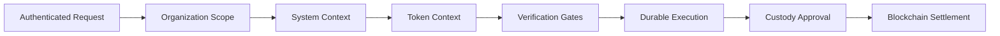
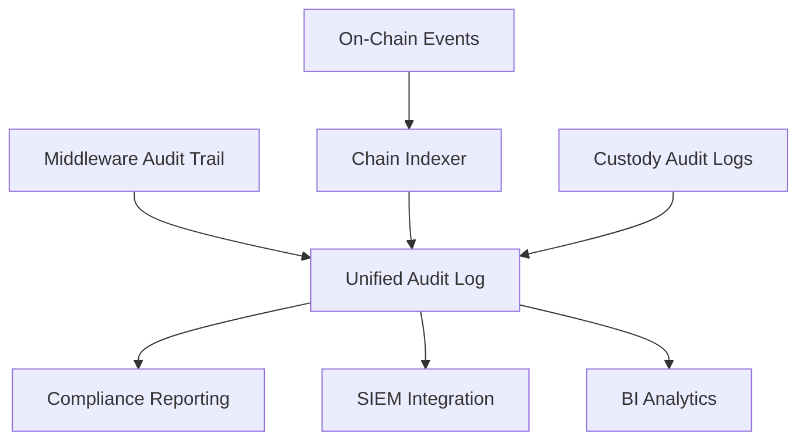

# Access Control and Permissions

## Executive Summary

Regulated digital-asset operations are full of actions that should not be performed by the wrong person, in the wrong tenant, with the wrong wallet, or without the right approval evidence. DALP's access-control model is built for that reality. The platform combines organization-scoped tenancy, chain-authoritative role assignment, off-chain membership governance, step-up verification for sensitive actions, durable audit trails, custody-layer policy enforcement, and a 301-command CLI administration surface into a single operating model.

At a practical level, DALP addresses eight institutional governance questions:

1. **Who is this actor?** Sessions, API keys, passkeys, invitation-based onboarding, and wallet-linked identity.
2. **Which tenant do they belong to?** Organization-scoped membership with tenant-scoped system resolution.
3. **What are they allowed to do?** Off-chain platform roles, on-chain system roles, and per-token roles enforced at every API route.
4. **What extra verification is needed for sensitive actions?** Wallet verification factors (PIN, TOTP, backup codes) with replay protection.
5. **How are signing keys protected?** Key Guardian with escalating storage tiers from encrypted database through HSM to MPC custody.
6. **How are duties separated?** 26 roles across four layers, maker-checker flows, and custody approval rules.
7. **How are organizations isolated?** Tenant-scoped data access, membership-gated context switching, and organization-bound API keys.
8. **Can we prove what happened later?** Event-sourced verification lifecycle, durable transaction history, on-chain events, and custody audit trails.

The architecture treats authorization as a runtime context-composition pipeline: authenticated request, then organization scope, then system context, then token context, then verification gates, then durable execution, then custody approval, then blockchain settlement. Each stage adds constraints. Missing any stage results in denial. This pipeline design is what distinguishes DALP from platforms that treat access control as a simple role lookup.

---

## Authorization Architecture

### Dual-Layer Permission Model

Most tokenization platforms implement authorization as a single layer: either an application-level role check or an on-chain permission check. DALP enforces both. Off-chain platform roles control API access, console features, and organization administration. On-chain roles in Solidity contracts govern blockchain operations, identity management, and token lifecycle actions. Every blockchain write requires both layers to pass.

This dual requirement matters because each layer catches failures the other cannot. An off-chain role check alone cannot prevent a user whose on-chain role was revoked from executing a stale API session. An on-chain check alone cannot enforce organization boundaries or API-key scoping. Together, they provide defense-in-depth at the authorization level.

The on-chain `AccessManager` contract is the authoritative source for role assignments. Role events are emitted on-chain, indexed by the chain indexer, and reflected in the UI and API. If a role is revoked on-chain, the UI hides corresponding operations and the API denies requests without any manual synchronization.

### Route-Level Access Guards

Permissions are enforced at the route level through dedicated middleware that executes before business logic. Every API route declares its required permissions as part of the route definition. Middleware resolves the caller's identity, validates organization membership, queries on-chain role assignments, and compares resolved roles against declared permissions. Missing roles produce an immediate rejection.

Route-level guards also enforce interface-aware constraints. If a route requires a token interface or extension that the asset does not implement, the request is rejected regardless of the caller's privilege level. This prevents operators from invoking incompatible actions on the wrong token class: a bond-specific operation cannot be executed against a fund token, even by an administrator.

### Request-Time Permission Projection

Authorization is composed progressively at request time through seven stages: session and identity resolution, organization membership validation (against actual membership, not client-declared context), on-chain role synchronization, system context hydration, token context resolution (metadata, interfaces, mapped roles, trusted-issuer requirements), permission enforcement, and wallet verification for sensitive writes. After all API-level stages pass, custody provider policies may impose additional approval gates.

This composition means DALP authorization depends on who you are, which tenant you are acting in, which system you are targeting, which token interfaces are present, which on-chain roles authorize the action, and whether you satisfy the required verification factors. It is materially different from a flat role-table lookup.

*Figure 1: Authorization context-composition pipeline. Each stage adds constraints, and any stage failure results in denial. No single layer bypass grants access.*

---

## Full RBAC Model: 26 Roles Across 4 Layers

DALP defines 26 distinct roles across four layers, each with explicit scope boundaries. This is not a generic admin/editor/viewer scheme. It is a formal role taxonomy that separates concerns between platform membership, system operations, per-asset administration, and automated module authority.

### The Five Core Operational Roles

Five roles form the operational backbone of most deployments. The **admin** (platform, off-chain) provides full administrative access, role assignment, and organization configuration. The **systemManager** (on-chain) handles system bootstrap, upgrades, and factory/addon/module registration. The **tokenManager** (on-chain) deploys and configures tokens. The **complianceManager** (on-chain) registers compliance modules and configures both global and per-token compliance settings. The **identityManager** (on-chain) registers and recovers identities and manages user onboarding to the blockchain layer.

Role provisioning in production environments is managed through the Security Governance Team: the organizational function responsible for reviewing requests, approving assignments, conducting periodic access reviews, and revoking roles when personnel changes occur. DALP provides the technical enforcement; the governance team provides the human oversight.

### Role Taxonomy

| Layer | Scope | Count | Purpose |
| --- | --- | --- | --- |
| 1. Platform | Off-chain (Better Auth) | 3 | Organization membership, console access, invitation handling |
| 2. System People | On-chain | 9 | System lifecycle, identity, compliance, claims, feeds, audit |
| 3. Per-Asset | On-chain, per token | 7 | Asset-level governance, supply, custody, emergency, sales |
| 4. System Modules | On-chain, contract-to-contract | 7 | Automated authority for system operations between contracts |

**Layer 1 (Platform)** governs off-chain surfaces: organizations, invitations, admin pages, and membership. These roles are necessary but not sufficient for blockchain writes. The owner has full control; the admin manages users and configuration; the member operates within assigned permissions.

**Layer 2 (System People)** defines the nine on-chain roles that human operators hold for system-wide governance. Beyond the five core roles, the claimPolicyManager manages trusted issuers and claim topics, the organisationIdentityManager handles organization-level claims, the claimIssuer creates and attaches claims to identity contracts, the auditor has view-only access to all system state and audit logs, and the feedsManager administers the data feeds directory. This separation means the person who registers identities cannot modify compliance rules, and the person who issues claims cannot change trusted issuer registrations.

**Layer 3 (Per-Asset)** scopes authority to individual token contracts. The admin grants and revokes other per-asset roles. The governance role configures compliance modules, features, and metadata for that specific asset. Supply management controls minting, burning, and supply caps. The custodian handles freeze/unfreeze, forced transfers, and wallet recovery. Emergency controls pause/unpause. Sale administration and fund management are separated so the person configuring a token sale cannot withdraw the proceeds. This per-asset scoping means a user authorized to manage issuance for a sovereign bond has no automatic authority over a real estate token on the same deployment.

**Layer 4 (System Modules)** assigns roles to smart contract addresses rather than people, formalizing contract-to-contract authority under explicit role control. This prevents the common vulnerability where system contracts operate with unchecked privilege.

### Bootstrap Role Invariants

Newly created assets are not role-less. The creator automatically receives admin and governance roles, establishing a controlled starting point from which additional roles must be explicitly granted before operations like minting or unpausing can proceed. This workflow-enforced pattern prevents accidental creation of unmanageable assets.

---

## Multi-Tenancy and Organization Isolation

### Organization as the Tenant Boundary

For institutions deploying a shared tokenization platform across business units, subsidiaries, or client segments, tenant isolation is a regulatory prerequisite. DALP's fundamental tenant boundary is the organization: the administrative container for users, memberships, invitations, system context, settings, asset classes, and audit surfaces. The platform supports both single-tenant and multi-tenant modes.

Cross-tenant operations are not possible. Isolation is enforced through organization membership checks on every request, query-level scoping where all database queries filter by organization ID, organization-bound API keys, registry scoping for external tokens, settings scoping for asset classes, and isolation in both relational and indexed data views. The organization ID scoping pattern is embedded in query construction throughout the data access layer, meaning even internal service-to-service calls respect tenant boundaries.

### Membership-Gated Context Switching

DALP does not trust the client to set arbitrary organization context. When a user switches organizations, the platform verifies active membership before updating session state. If membership has been revoked since the last session, the user falls back to their first available organization. This prevents client-side context spoofing through server-side enforcement, a control that matters when administrative consoles serve multiple organizational tenants.

### Invitation and Onboarding

The invitation model preserves tenant boundaries through its entire lifecycle. Configurable re-invitation behavior automatically cancels previous pending invitations. Membership limits per organization are enforced, supporting licensing models with contractual capacity caps. On acceptance, DALP executes a deterministic onboarding sequence: state transition, organization data refresh, active organization setting, and on-chain identity registration.

---

## Authentication Architecture

### Better Auth Foundation

DALP uses Better Auth for identity and session management. Active methods include email/password, passkeys (WebAuthn), and API keys. Enterprise SSO patterns (LDAP, OIDC, SAML) are available through the plugin architecture and can be configured for deployments integrating with Okta, Auth0, or Azure AD. It is important to note that these enterprise SSO options require configuration work beyond a simple toggle; they are architecturally supported but not enabled by default.

### Two-Endpoint Model

The strict two-endpoint authentication model prevents authentication-method crossover. Sessions authenticate on the RPC endpoint; API keys authenticate on the v2 REST endpoint. Neither is accepted on the other's surface. API keys enforce HTTP-method-based scoping: read-only keys for monitoring and reporting; read-write keys for operational automation.

### Session and API Key Properties

Browser sessions use HTTP-only cookies with secure transport, SameSite protection, 7-day expiry, 24-hour refresh window, and organization binding. API keys are stored hashed (cleartext shown once at creation), rate-limited at 10,000 requests per 60-second window, and immediately revocable with no grace period.

### CLI Authentication

The CLI uses a browser-based device-code flow, ensuring CLI users benefit from whatever MFA and session controls the platform enforces. The resulting API key is stored in the operating system's secure credential store (macOS Keychain on Darwin, permission-protected configuration file elsewhere).

---

## Wallet Verification, MFA, and Step-Up Security

Session authentication proves identity. Wallet verification proves intent and control for blockchain write operations. This separation means a compromised session cookie alone cannot trigger minting, transfers, or other state-changing actions.

Three active verification methods are supported: **PINCODE** (6-digit PIN, fastest but weaker against shoulder-surfing), **TOTP/OTP** (time-based one-time password per RFC 6238, stronger but requires an authenticator device), and **SECRET_CODES** (single-use recovery codes). When a sensitive operation requires step-up authentication, any configured factor is accepted.

Replay protection operates on all factors. OTP codes are tracked and rejected if reused within their validity window. Secret codes are permanently consumed on use. PINs are protected by progressive lockout. Replay protection is enforced uniformly at the middleware layer.

**Passkey-based wallet verification** is architecturally supported at the schema and authentication layer, but the runtime wallet-verification middleware currently hard-rejects passkey challenges. Passkeys work for login; passkey-based step-up verification for sensitive write operations is not yet a fully active runtime factor. This distinction matters for institutions planning authentication strategy.

API key sessions intentionally bypass interactive verification. API keys are scoped, rate-limited credentials designed for automation where interactive second factors would be impractical.

---

## Key Management and Key Guardian

Key Guardian manages cryptographic key material through defense-in-depth with four escalating storage tiers: encrypted database, cloud secret manager, HSM (FIPS 140-2 Level 3), and third-party MPC custody. Application code interacts with a signer abstraction, never with raw key material.

Key lifecycle stages cover generation (HSM keys generate within hardware; software keys use cryptographically secure random sources with immediate encryption), rotation (active keys replaced while historical keys maintained for verification), recovery (sharded backups with threshold schemes in enterprise deployments), and revocation (immediate removal with smart contract permission updates).

Every blockchain write is gated by the wallet verification layer before reaching Key Guardian. The signing flow requires identity authentication, role and scope validation, verification factor presentation, and only then cryptographic signing and blockchain submission.

---

## Audit Trails and Operational Evidence

### Event-Sourced Verification Lifecycle

The verification lifecycle uses a state machine (Disabled, Enabled, Locked, Compromised) with audit events at every transition. Each event records timestamp, actor, previous and new state, reason, and correlation ID. The state machine was designed with auditability as a structural property, not retrofitted after implementation.

### Complete Mutation Coverage

All mutations pass through role-gated middleware, generating audit events for every authorization decision: granted access (with matched role), denied access (with missing role and reason), and escalation events (verification outcomes). Because there are no bypass routes, the middleware audit trail covers every write operation attempted against the platform.

### On-Chain and Custody Evidence

The chain indexer provides governance evidence: token creation and supply changes, identity registration and claims, role grants and revocations, forced transfers and freezes, settlement events, feed operations, and vault approvals. With timestamp-enriched indexing, all events carry both block-height and calendar-time references, simplifying integration with compliance reporting systems.

DFNS audit logs synchronize with DALP records. Fireblocks exposes its own policy and approval history. Together with DALP's middleware and on-chain evidence, institutions get a unified audit trail spanning the entire authorization decision path.

*Figure 2: Audit evidence flows from three independent sources (middleware, on-chain events, custody providers) into a unified audit surface, supporting compliance reporting, SIEM integration, and analytics.*

---

## Segregation of Duties and Maker-Checker Controls

DALP's role design partitions key operational functions so that no single person needs to hold all powers. Identity operations, token deployment, compliance configuration, claims issuance, and feed management are separate system-level responsibilities. At the token level, governance, supply management, custody, and emergency controls are independent roles. Sale administration is separated from fund withdrawal. The auditor role provides oversight without operational authority.

Dual-layer authorization reinforces this separation: a user may be a platform admin but lack on-chain supply management authority, and an on-chain role alone cannot bypass platform authentication. Custody providers add a third control plane where DFNS and Fireblocks impose their own approval policies.

**Transfer approval revocation** is now available to any authorized party, not only the original approver. Consumed one-time-use approvals are guarded against revocation, preventing audit trail confusion. This supports institutional workflows requiring supervisory override to cancel pending transfer authorizations.

The platform is honest about what it is not: DALP does not provide continuous machine-generated SoD conflict detection, built-in certification cycles by job function, or a complete enterprise IAM governance suite. It provides strong operational SoD boundaries and maker-checker integration points within its scope; broader access governance remains part of institutional IAM processes.

---

## Compliance V2 and Per-Token Compliance

The Compliance V2 architecture introduces per-token compliance engines alongside system-level compliance. Each token can have its own compliance configuration with dedicated module instances, while inheriting system-level defaults for modules not explicitly overridden.

This architecture matters for institutions managing multiple asset classes on a single DALP deployment. A sovereign bond may require different compliance rules than a real estate token or a fund unit. With per-token compliance, each asset's rules are configured independently while sharing module implementations. The V2 module interface simplifies hook implementation, and a compatibility adapter wraps legacy V1 modules, ensuring existing deployments continue operating without modification.

The module registry detects V1 and V2 versions automatically. The three-tier module lifecycle (add, remove, uninstall) provides auditable state transitions for compliance governance.

---

## Permission Granularity

Permissions apply at multiple resource scopes: organization, system, token, addon, feed, asset-class definition, external-token registry, and identity record. Routes enforce action-specific authority with verified splits between read and write operations.

DALP's granularity operates at the resource, action, and interface level. Interface-aware middleware blocks unsupported operations. Route contracts expose only allowed actions in context. The UI derives feature visibility from indexed on-chain role state, meaning that role changes are reflected in the user interface without manual propagation.

---

## Institutional Summary

DALP's access-control posture gives institutions layered authentication with hard endpoint separation, real organization-scoped tenancy enforced at request time, 26 clearly partitioned on-chain roles as the authoritative source for blockchain authority, route-level middleware enforcement before any business logic executes, wallet verification separating login from transaction intent with replay protection on every factor, event-sourced verification lifecycle with complete audit coverage, Key Guardian with defense-in-depth across four storage tiers, custody integrations as a second control plane, and meaningful segregation of duties with honest acknowledgment of scope boundaries. The platform makes the risky parts of digital-asset operations governable, tenant-scoped, role-bound, and provable, which is exactly what regulated institutions need before they will commit to production deployment.
