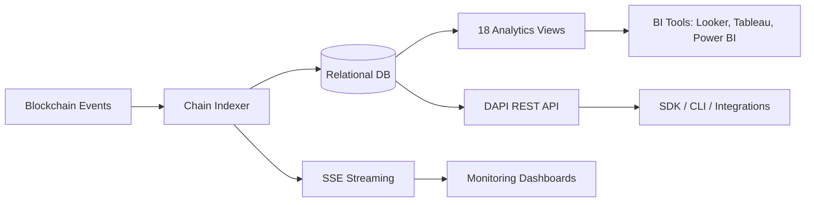
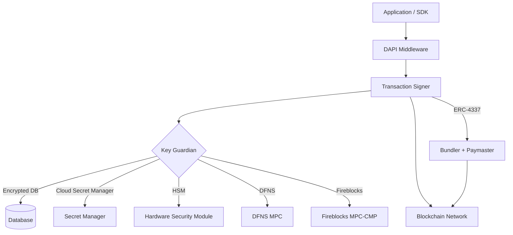

# Integration Architecture

## Executive Summary

One of the most underestimated aspects of doing tokenization right is integration: connecting digital asset infrastructure to existing core systems, custody relationships, payment rails, and operational workflows without demanding that institutions abandon what already works. DALP is designed to operate within existing institutional environments, not replace them. The platform provides a typed, versioned API surface with OpenAPI 3.1 documentation, native TypeScript SDKs with contract-bound type safety, a 301-command CLI that serves as both an operational tool and a scriptable automation surface, blockchain event indexing with sub-5-second latency through a single native indexer pipeline, and server-sent event streaming for real-time operational monitoring. Payment rail connectivity supports ISO 20022 message standards. Bring-your-own-custodian integrations with DFNS and Fireblocks, and bring-your-own-chain flexibility across any EVM-compatible network, mean institutions adopt DALP without disrupting established vendor relationships or rewriting existing integration code.

What distinguishes this integration architecture from point solutions assembled around individual capabilities is that every operation, from token issuance to settlement to compliance enforcement, flows through a single typed API contract with consistent authentication, error handling, and audit behavior. Institutions do not need to learn multiple APIs, manage separate credentials, or reconcile data across disconnected services.

This section covers the full integration surface: how external systems connect to DALP, how DALP connects to external infrastructure, and the architectural patterns that make these integrations reliable and auditable.

---

## DAPI: The Durable API Service

### What DAPI Is

For institutions evaluating how a tokenization platform fits into their existing technology landscape, the API layer is the primary integration surface. DAPI (Durable API Service) is DALP's unified API layer, the single programmatic surface through which all platform operations are accessed. It is not a thin wrapper around smart contracts. It is a full middleware stack that transforms authenticated HTTP requests into tenant-scoped, permission-aware, execution-ready operations.

DAPI is built on oRPC, a type-safe RPC framework that provides automatic OpenAPI documentation, schema validation, custom serializers for blockchain-specific types (BigInt, BigDecimal, Timestamp), and streaming support for long-running operations. The API follows RESTful conventions with POST for mutations, GET for queries, and standardized error codes.

DAPI serves two distinct endpoints with different authentication models:

| Endpoint | Authentication | Consumer | Scope Enforcement |
| --- | --- | --- | --- |
| `/api/rpc` | Session/cookie only | DALP dApp frontend (browser) | Session-bound |
| `/api/v2` | API keys (HTTP-method-scoped) | SDK, CLI, backend integrations, CI pipelines | GET/HEAD/OPTIONS for read-only keys; all methods for read-write keys |

This two-endpoint design is a hardened security boundary: API keys cannot authenticate on the RPC endpoint, and session cookies cannot authenticate on the v2 endpoint. The separation exists because oRPC uses POST for all procedure calls, making HTTP method unreliable for scope enforcement on the RPC endpoint. The REST endpoint maps HTTP methods correctly, enabling proper read-only vs. read-write scope enforcement. Most tokenization platforms use a single API surface that blurs the line between interactive and programmatic access. DALP's explicit separation prevents an entire class of authentication-crossover vulnerabilities.

### REST API Coverage

DAPI exposes a comprehensive REST API at `/api/v2` covering every DALP domain, organized by procedure namespace. The coverage spans token lifecycle operations (create, mint, burn, transfer, freeze, pause), platform infrastructure (role grants, identity registration, trusted issuer management), user management, wallet operations, transaction tracking, scheduled tasks, optional features (token sale, fixed yield, XvP settlement, custody vaults), address book management, multi-currency exchange rates, global search, platform configuration, external asset registration, organization administration, identity recovery workflows, operational health monitoring, and authentication endpoints.

This breadth matters because it means every operation an institution performs through the web console is also available programmatically. There is no "UI-only" functionality that forces manual workarounds in automated workflows.

### OpenAPI Specification and Interactive Documentation

The API delivers OpenAPI 3.1 specifications generated directly from procedure definitions, ensuring documentation stays synchronized with implementation. The specification is available at `/openapi.json` and can be imported into Postman, Insomnia, Redoc, or any OpenAPI-compatible tooling. This enables standard enterprise API governance workflows: API consumers can auto-generate client libraries in any language, and API changes are detectable through specification diffing.

### Type Safety and Error Handling

Every endpoint has a typed schema where request parameters, response shapes, and error types are defined at the contract level. Unknown fields, missing parameters, and type mismatches are caught at the schema layer before business logic executes. This means integration engineers discover contract violations during development, not in production.

The error catalog includes 534 auto-generated error codes from Solidity ABIs, each with 4-byte selectors, severity levels, audience targeting, retryability flags, and translations across four locales. Blockchain revert reasons surface as structured contract errors rather than opaque revert data. When a compliance module blocks a transfer, the error response tells the integration exactly which module rejected the transaction and why, rather than returning a generic blockchain error.

### Transaction Queue and Durable Execution

DAPI v2 mutations support three execution modes, negotiated through RFC 7240 `Prefer` headers: synchronous (blocks until on-chain confirmation), asynchronous (returns HTTP 202 with status URL), and hybrid (server decides based on expected execution time).

All blockchain mutations flow through an 11-state transaction lifecycle managed by durable workflows: created, queued, submitted, broadcasting, pending, confirming, confirmed, failed, cancelled, expired, or replaced. Every mutation is idempotent (enforced via `Idempotency-Key` headers), durable (survives process restarts), and auditable (full state-transition history with time-indexed access). This durability guarantee is critical for institutional operations where a dropped transaction can create reconciliation problems. Unlike simpler API designs where a network timeout leaves the caller guessing whether the operation executed, DALP's durable pipeline ensures that every submitted operation reaches a deterministic terminal state.

### Chunked Batch Operations

For large-scale operations such as batch transfers to thousands of recipients (dividend distributions, airdrop campaigns, or mass onboarding), DALP supports a chunked batch orchestration model. When a transfer request exceeds the batch limit, the platform automatically splits the operation into child transaction requests, each processed through the standard transaction execution workflow. A parent-child orchestration workflow tracks progress, updating the parent state as children complete or fail. If any chunk fails, remaining children are cancelled, and the parent reflects the failure with references to the specific failed chunk. This architecture ensures that operations of any size are durable, resumable, and auditable at the individual chunk level, which matters when a dividend distribution to 50,000 bondholders must either complete fully or provide a clear report of what succeeded and what needs remediation.

### Middleware Chain

Every request passes through a progressive context-enrichment pipeline: session resolution, authentication enforcement, organization role synchronization, system context hydration, token context resolution (for token operations), wallet verification (for sensitive mutations), and transaction queue negotiation. This is not a flat authentication check. Read operations require only a valid session. Write operations require both platform permission and the appropriate on-chain role. Neither alone is sufficient. This dual requirement, enforced in a single middleware chain, is what prevents the category of access-control bugs where application-layer permissions and blockchain-layer permissions diverge.

### Rate Limiting and Retry Guidance

API keys are rate-limited at 10,000 requests per 60-second window per key, with per-key configuration enabling differentiated limits for high-volume consumers. The API provides structured retry guidance: validation and authorization errors should not be retried; rate-limited responses should be retried after delay; server errors should be retried with exponential backoff; and confirmation timeouts require checking transaction status before retrying, because blockchain transactions are not automatically idempotent at the network level.

---

## TypeScript SDK

The transition from API documentation to SDK integration is where most platforms lose developer productivity. DALP ships a public TypeScript SDK (`@settlemint/dalp-sdk`) that eliminates the gap between API specification and working code.

The SDK uses ESM-only module format, targets Node.js 20+, and communicates over the `/api/v2` surface. Type safety is contract-bound: types are generated from the DALP API contract, so SDK types are always in sync with the running API. The SDK includes DALP-specific serializers for arbitrary-precision decimals, native BigInt values, and timestamps, ensuring that precision-critical values survive wire transport without silent truncation.

Three npm entrypoints serve different patterns: the runtime client for standard usage, type-only imports for zero-runtime-cost TypeScript checking, and a plugins entrypoint for request/response validation and batch linking.

While the TypeScript SDK is the first-party client, DALP's OpenAPI specification enables SDK generation in Python, Go, C#/.NET, Java, and any other language supported by standard OpenAPI tooling. The TypeScript SDK's serialization helpers serve as reference implementations for generated clients.

The SDK integrates with CLI credentials: developers authenticate through the CLI's browser-based flow, and the resulting API keys are reusable in SDK-based applications without separate credential management.

---

## CLI

The CLI extends the same API surface into operational workflows. With 301 command registrations across 26 top-level groups, it covers core operations, identity and compliance, addons, platform administration, and infrastructure. All commands enforce typed argument validation through Zod schemas, catching invalid inputs before any API call executes.

The CLI authenticates through a browser-based device-code flow, bringing interactive security guarantees (including any configured MFA) to command-line environments. After approval, the session upgrades to a long-lived API key stored securely on the operating system.

For operational teams, the CLI's value is in scriptability: CI/CD pipeline integration for token deployment, automated compliance module setup, batch user creation, and scripted lifecycle operations can all be versioned in source control and executed through controlled deployment pipelines. Monitoring commands provide real-time streaming endpoints for transaction status, identity events, compliance outcomes, and feed updates, enabling operators to build dashboards and alerting systems without a browser.

---

## Blockchain Event Indexing and Data Pipeline

Blockchain storage optimizes for consensus verification, not application queries. The gap between raw blockchain data and the query patterns that institutions need (portfolio views, compliance status, transaction history, settlement tracking) requires an indexing layer. DALP's native chain indexer fills this role.

### Architecture and Migration

The indexer is built on a relational database with an ORM layer and durable virtual objects, processing events across 8+ domains. A unified event log records all processed events, and genesis directory discovery bootstraps the system by querying the on-chain DALP Directory for registered factories.

As of the current release, the native chain indexer is the sole indexing path. All API routes that previously relied on external graph-based indexing have been migrated: XvP settlement, fixed-yield schedules, token sales, system routes, search, account lookups, and external-token endpoints now run against the native indexer. This consolidation eliminates an external runtime dependency, reduces infrastructure complexity, and places all data access under a single, internally controlled pipeline. For institutions evaluating operational risk, a platform that controls its own data indexing rather than depending on an external graph protocol service presents a simpler operational profile.

### Consistency and Reliability

Chain reorganizations can reverse confirmed transactions. The indexer maintains rollback capability for configurable block depths, with idempotent event processing that enables safe recovery from any failure scenario. Zero-downtime reindexing uses schema isolation, allowing new indexer versions to build fresh data alongside the running version and switch atomically.

Event freshness targets sub-5-second latency from blockchain event to API availability. In addition to block-height references, the indexer records timestamp columns alongside all block-reference columns, enabling time-based queries and audit trail reporting without block-to-timestamp lookups. This simplifies integration with BI tools and compliance reporting systems that operate on calendar time.

### Analytics and Streaming

Eighteen analytics views across five domains (identity, compliance, addons, cross-cutting metrics, actions) support direct SQL access for enterprise analytics platforms. Server-sent events provide real-time streams for API metrics, blockchain health (with hysteresis-based state transitions to prevent alert flapping), and transaction lifecycle changes.

*Figure 1: Data flows from blockchain events through the native chain indexer to all consumption surfaces, including analytics views for BI tools, the DAPI REST API for programmatic access, and SSE streaming for real-time monitoring.*

---

## Blockchain Network Connectivity

### Chain Gateway Architecture

The Chain Gateway manages all outbound blockchain connectivity, load-balancing across multiple RPC endpoints with automatic failover. Load balancing strategies include round robin, latency-based routing, health-weighted routing, and operation-aware routing (writes to primary, reads to replicas). Health monitoring tracks block height, response latency, error rates, and connection status. Failover completes in seconds without application awareness.

Performance optimization includes connection pooling, request batching, response caching for immutable data (with reorganization-triggered invalidation), and retry routing to alternate nodes.

### Supported Networks

DALP operates on any blockchain implementing the Ethereum JSON-RPC specification. No application changes are required when switching networks; configuration handles consensus differences, gas models, and confirmation requirements.

| Category | Networks |
| --- | --- |
| Layer 1 Mainnets | Ethereum, Polygon PoS, Avalanche C-Chain, BNB Smart Chain, XDC Network, Gnosis Chain |
| Layer 2 Rollups | Arbitrum One, Optimism, Base, zkSync Era, Polygon zkEVM, Linea, Scroll |
| Specialized | ADI Chain (UAE institutional finance), Immutable zkEVM, Worldchain |
| Private/Consortium | Hyperledger Besu (IBFT 2.0/QBFT), Go-Ethereum, Nethermind, Erigon, SettleMint managed networks |

This network breadth matters because institutional programs often need to start on a private permissioned network for pilot phases and migrate to public or specialized networks for production. DALP's network-agnostic design means the asset logic, compliance rules, and integration code remain unchanged across that migration.

### Multi-Chain Architecture

DALP supports simultaneous operation across multiple chains with per-chain identity registries, compliance configurations, and indexer instances. Custody providers support multi-chain wallets. Network switching requires only configuration changes.

---

## Custody Integration

### Bring-Your-Own-Custodian Model

DALP is not a custodian. It orchestrates custody policy across existing custodian relationships through a provider-abstracted signer service. This design reflects an institutional reality: regulated entities already have custody relationships and policies. A tokenization platform that demands its own custody model creates friction; one that works with existing custody infrastructure accelerates adoption.

The Key Guardian service manages cryptographic key material through a storage hierarchy: encrypted database for development, cloud secret manager for standard production, HSM (FIPS 140-2 Level 3) for regulated financial services, and third-party MPC custody (DFNS or Fireblocks) for the highest security requirements. Keys never leave secure boundaries in plaintext.

### Provider Comparison

| Capability | DFNS | Fireblocks |
| --- | --- | --- |
| MPC type | Threshold MPC (distributed key shards) | MPC-CMP (continuous key refresh) |
| Policy engine | DFNS Policy Engine | Transaction Authorization Policy (TAP) |
| Programmatic approval via DALP | Full API resolution | Console / Co-Signer only |
| Wallet model | Flat wallet list | Vault account hierarchy |

Both providers use MPC signing so that no single private key ever exists in one place. The operational difference is that DFNS allows fully programmatic approval workflows through its API, while Fireblocks requires approvals through its own console or mobile app. For institutions building fully automated operational workflows, this distinction affects custody provider selection.

### Unified Signer Abstraction

The unified signer interface abstracts over all custody backends. Switching between DFNS and Fireblocks requires only configuration changes: no workflow modifications, no code changes, no API contract differences. This means institutions can evaluate custody providers independently of their DALP deployment and switch providers without re-engineering integration code.

### Transaction Processing and Nonce Management

The transaction processor provides partition-level exclusive locking during submission and broadcast, with durable nonce management that self-heals from nonce conflicts. Gas management supports configurable strategies (fast, standard, economy) with stuck-transaction resolution workflows.

### Account Abstraction (ERC-4337)

The transaction signer supports ERC-4337 account abstraction with user operations submitted through bundler infrastructure, paymaster integration for gas fee sponsorship, batched execution, and typed paymaster routing that selects between zero-gas and paymaster-funded execution paths. This enables institutional deployments where investors interact with tokens without managing cryptocurrency for gas fees.

*Figure 2: Transaction signing flows from applications through DAPI middleware and the transaction signer to Key Guardian, which routes to the appropriate custody backend. ERC-4337 account abstraction provides an alternative path through bundler infrastructure for gasless operations.*

---

## KYC/AML Integration

DALP does not perform identity verification directly. It provides the on-chain identity infrastructure that makes KYC/AML verification results enforceable at the protocol level. Institutions choose their own verification providers; DALP ensures that verified status is checked at every transfer.

The integration flow: an external provider verifies the investor off-chain; results are translated into claim topics; a trusted issuer writes signed claims to the investor's OnchainID contract (ERC-734/735); the trusted issuers registry validates issuer authorization; compliance modules read claims at every transfer; and expired claims are rejected through fail-closed enforcement.

### Chain-of-Trust Identity Architecture

The identity registry implements a chain-of-trust architecture for trusted issuers, topic schemes, and identity verification. Rather than relying on a flat registry, the system resolves trust hierarchically: token-level registries check first, then system-level, then global. The maximum chain depth is three levels, providing per-token granularity while maintaining global defaults.

This architecture supports institutional requirements where different asset classes need different trusted issuers. A bond token can require different accredited-investor verifiers than a fund token, each with independent configuration that inherits system and global defaults. Per-token registries are deployed via dedicated factories, enabling asset-specific configurations without modifying system-wide settings.

### Compliance V2 Engine

The compliance engine operates at two levels: system-level compliance for global rules and per-token compliance for asset-specific requirements. Available modules include country restrictions, identity verification (with logical AND/OR claim expressions), supply limits, investor count tracking, transfer approval workflows with authority-based revocation, and holding period enforcement. The V2 module architecture supports a three-tier lifecycle (add, remove, uninstall) with a compatibility adapter for legacy modules.

---

## Payment Rails and Settlement

DALP supports integration with institutional payment infrastructure through ISO 20022 message standards for connectivity with SWIFT, SEPA, and RTGS networks. The platform provides exchange rate management with external provider synchronization, historical storage, and manual operator overrides.

The XvP (Exchange versus Payment) settlement system provides atomic settlement: same-chain transactions where both legs complete or revert together, cross-chain settlement using hash time-locked contract patterns, and multi-party settlements with more than two counterparties. Terminal states are deterministic and auditable, with refund protection through a 30-day grace period. Token sale refunds use a per-currency pull pattern, ensuring a blacklisted stablecoin cannot block other investors' refunds.

It is important to note that DALP's ISO 20022 support is at the integration architecture level: the platform provides structured message formats and API surfaces that connect to payment infrastructure, but native generation of specific ISO 20022 message types (such as pain.001 or pacs.008) is an integration configuration, not an out-of-the-box feature. Institutions requiring specific message type coverage should plan for integration work with their payment infrastructure.

---

## Oracle, Data Feed, and Secrets Integration

The FeedsDirectory provides a unified data feed layer that separates discovery from delivery. Supported feed types include issuer-signed scalar feeds and Chainlink aggregator adapters for DeFi protocol compatibility. Feed operations support async queue semantics with identity checks and durable signing.

Secrets management uses a provider-abstracted architecture with encrypted database (default), enterprise HSM integration, and environment variable backends. Wallet secrets are consolidated into a single management point rather than distributed across services.

---

## ERP, Back-Office, and Observability

DALP enables enterprise integration through complementary patterns: API-first integration for point-to-point calls, middleware, and SDK-based applications; data export through 18 analytics views for BI tools; event-driven integration with sub-5-second latency for reconciliation and reporting; and external token registration for tracking assets from other systems.

All deployment models (managed SaaS, dedicated cloud, on-premises, hybrid) expose the same API surface, ensuring integration code portability.

The observability stack ships 21 pre-built dashboards, time-series metrics, structured logs with secret filtering, distributed tracing with OpenTelemetry, and OTLP receivers for external ingestion. DALP-specific telemetry covers transaction-phase traces, indexer health metrics, and privacy-controlled data redaction. Indexer health monitoring tracks the native chain indexer directly, providing operational visibility into indexing lag, processing time, and chain synchronization status.

---

## Meta-Transactions and Gasless Operations

The API supports meta-transactions through ERC-2771 integration, enabling signed transaction payloads without native token holdings. With typed paymaster routing, the platform selects between zero-gas execution and paymaster-funded execution based on deployment configuration. This enables simplified investor experiences, issuer-sponsored operations, and fully gasless automated workflows.

---

## Integration Security Model

The defense-in-depth model ensures no single control failure grants unauthorized access. Five independent layers operate in sequence: identity (authentication), access (role-based authorization), transaction (wallet verification), on-chain (compliance modules via SMART Protocol/ERC-3643), and custody (provider policy evaluation and MPC signing). Each layer operates independently.

Every transaction passes through two independent policy layers. The on-chain layer enforces identity claims, country restrictions, supply caps, holding periods, and investor counts. The custodian layer enforces amount thresholds, multi-party approvals, spend limits, and destination allowlists. Both must pass in sequence; Layer 1 failure prevents Layer 2 from being reached.

Because DALP controls the full middleware chain from API authentication through on-chain compliance to custody approval, institutions get a single audit trail that spans the entire authorization decision, not fragmented logs across disconnected services.
