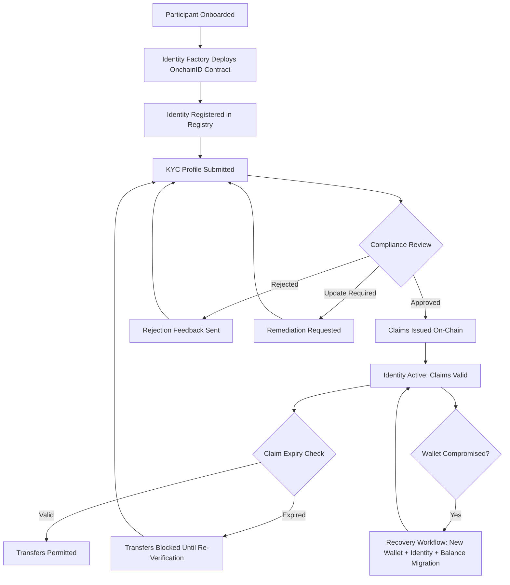

# Section 5: Verification, Claims, and Data Feeds — Loop 1 Refresh

## Executive Summary

Every regulated token transfer requires a chain of trust: the sender and recipient must be verified, the transfer must satisfy all applicable compliance rules, and the market data driving valuations must be auditable and tamper-evident. If any link in that chain fails or is bypassed, the institution faces regulatory exposure it cannot remediate after the fact.

DALP addresses this challenge at the protocol level rather than the application layer, ensuring that compliance enforcement cannot be circumvented by modifying business logic or API configurations. The verification architecture rests on three integrated capabilities. On-chain identity verification through OnchainID anchors every participant's credentials as cryptographically signed claims on an immutable ledger, following the ERC-734/ERC-735 standards. A configurable compliance engine evaluates those credentials against regulatory rules before any transaction executes, using 18 module types that compliance officers configure without modifying smart contract code. A purpose-built data feed infrastructure delivers price, NAV, and corporate action data through signed on-chain channels with full audit trails, exposing those feeds through Chainlink-compatible adapters for external consumption.

These three capabilities converge into a verification ecosystem where identity, compliance, and market data share the same trust infrastructure. An investor verified for one asset does not need to re-verify for another. Compliance rules for MiCA coexist alongside Regulation D on the same platform instance without code changes. A price feed consumed by a compliance module uses the same cryptographic signing and trust model as the feed consumed by an external DeFi protocol.

The practical result for operations teams is a single compliance configuration surface. Compliance officers define regulatory requirements through configurable expressions, not through engineering tickets. Auditors trace every compliance decision back to specific identity claims and feed values through standard SQL queries across 18+ analytics views. Operations teams monitor compliance posture in real time through streaming dashboards rather than discovering violations during periodic reviews. When verification or feed data is unavailable, the platform defaults to blocking transfers rather than permitting them, ensuring that operational issues surface as visible, auditable blocked transactions rather than as silent compliance violations.

---

## 5.1 Identity Verification with OnchainID

### The Identity Model

Regulated financial operations depend on a fundamental assurance: that every participant in a transaction is who they claim to be, and that their credentials have been attested by a trusted authority. Traditional approaches store identity attributes in centralized databases where records can be silently modified, where verification status is visible only to the platform operator, and where redundant KYC processes multiply for every new asset a participant touches.

DALP implements on-chain identity verification through OnchainID, an identity protocol based on the ERC-734 (key management) and ERC-735 (claim management) standards. Every participant in the ecosystem, whether an individual investor, an institutional entity, or a smart contract, is represented by a dedicated on-chain identity contract. This contract is the canonical record of who a participant is and what has been attested about them.

The identity model provides five properties that traditional identity systems struggle to deliver simultaneously. First, each participant's identity is anchored in a self-sovereign contract deployed on-chain, providing a persistent, tamper-evident identity record rather than a row in a centralized database. Second, identity attributes such as KYC status, accreditation, jurisdiction, and AML clearance are represented as cryptographically signed claims attached to the identity contract, making verification checkable by any on-chain participant rather than only by the platform operator. Third, every claim traces back to the trusted issuer that created it, establishing a verifiable chain of trust from claim consumer to original verification provider. Fourth, once an investor's identity is verified and claims issued, those credentials are reusable across all assets on the platform, eliminating redundant KYC for multi-asset programmes. An investor verified for Bond A does not re-verify for Bond B. Fifth, claims include optional expiration timestamps that enforce automatic re-verification requirements; an expired KYC claim blocks transfers even if the claim topic matches the compliance expression, with no grandfather exception for stale verification.

Consider a sovereign wealth fund onboarding institutional investors across three jurisdictions. In a traditional platform, each jurisdiction's KYC provider operates in isolation: separate databases, manual reconciliation of verification status, and application-layer enforcement rules that may drift between regions. In DALP, each investor's identity contract holds verifiable claims from jurisdiction-specific trusted issuers. The compliance engine evaluates those claims against the fund's configured regulatory expression, and enforcement happens at the protocol level, identically for every transfer regardless of jurisdiction. The compliance officer configures the rules once; the protocol enforces them everywhere.

### Identity Lifecycle

The identity lifecycle follows a structured progression from creation through active use, expiry, and recovery.

**Identity creation** begins when a participant is onboarded. DALP deploys an OnchainID identity contract through the Identity Factory. The V2 factory implementation delegates authorization to the platform directory's administrative role rather than maintaining a local admin role, reducing the number of privileged transactions during system setup while maintaining the same security invariants. For smart accounts (ERC-4337), identity creation is atomic with account deployment, including automatic issuance of a claim that identifies the identity as a DALP-managed smart account.

**Identity registration** establishes the binding between the participant's wallet address and their on-chain identity contract in the Identity Registry. DALP supports two registration models: self-service registration, where the user holds the wallet's management key and registers through `registerPendingIdentity` with MANAGEMENT_KEY authority; and admin-initiated registration, where platform administrators register identities on behalf of invited users through `batchRegisterPendingIdentity`, enabling bulk onboarding without requiring each user to perform blockchain transactions during the invitation acceptance flow.

**Claim issuance** attaches verifiable claims to the identity through trusted issuers. Each claim addresses a single verification dimension: KYC completion, AML clearance, accreditation status, or jurisdictional eligibility. Claims flow through two pathways: auto-claims issued programmatically based on KYC review outcomes, and manual claims issued by trusted issuers through the API or dApp interface. Both pathways are subject to the same validation and queue semantics, routed through the shared claim issue service for durability and audit trail integrity.

**Identity recovery** provides a durable, phase-tracked workflow for cases where wallet access is lost or compromised. The recovery orchestration proceeds through deterministic phases: creating a new wallet, deploying a replacement identity, executing on-chain recovery through the Identity Registry, revoking existing sessions and credentials, and identifying tokens requiring manual recovery. This workflow is protected by system-level permissions and executes as a durable workflow that survives infrastructure failures.

The recovery workflow includes preflight recoverability checks (blocking reasons, current identity status, non-zero token balances), confirmation-gated destructive execution requiring the text `RECOVER IDENTITY`, parallelized pre-checks for identity existence and token balance, atomic local security reconciliation (session deletion, two-factor cleanup, passkey removal, wallet flag rewrite), best-effort per-token balance migration with logging for partial failures, and explicit phase persistence from `creating-wallet` through `completed` or `failed`.

*Figure 1: Identity lifecycle from onboarding through claim issuance, expiry enforcement, and recovery. Each phase is tracked as an explicit workflow state.*

### Contract Identity Integration

DALP extends identity beyond human participants to include contract-level identity. When factory contracts, vault contracts, or smart accounts are deployed, they automatically receive an associated OnchainID contract. This pattern ensures that every DALP-managed contract has a verifiable identity anchor, that claim-based authorization applies to contracts as well as wallets, and that the Trusted Issuers Registry can authorize factory contracts as claim issuers based on their on-chain identity. The `IContractWithIdentity` interface standardizes this pattern, and the centralized claim authorization library prevents ad hoc claim issuance logic from scattering across different contract codepaths.

### Identity as the Foundation of Compliance

Identity is not a standalone feature in DALP. It is the foundation of the compliance pipeline. Every compliance decision traces back to identity verification: a participant's identity contract holds their verifiable claims, the compliance engine evaluates those claims against the token's configured verification expression, and if claims are insufficient, expired, or issued by an untrusted issuer, the transfer is blocked at the protocol level. This enforcement happens on-chain, meaning it cannot be bypassed by application-layer modifications.

This creates an ex-ante compliance model where transfers that would violate rules are prevented before they execute, not detected and remediated after the fact. The compliance pre-check via simulation provides immediate feedback, while on-chain enforcement during actual execution provides the authoritative guarantee. Because identity verification and compliance enforcement operate at the same protocol layer, there is no gap between what the system checks and what the blockchain enforces.

---

## 5.2 The Claim Topics System

### How Claims Work

Claims are the atomic unit of verification in DALP. Each claim is an on-chain attestation stored on a participant's OnchainID contract, carrying five properties: a numeric topic identifier representing the type of attestation (KYC, AML, ACCREDITED), the address of the trusted issuer who created it, a data payload that may include a content hash for KYC verification, a cryptographic signature from the issuer, and an optional expiration timestamp after which the claim is no longer valid.

The topic is the key organizing concept. DALP uses a Topic Scheme Registry to manage the vocabulary of recognized claim topics. Standard topics include KYC (identity verification completed), AML (anti-money laundering screening passed), ACCREDITED (investor meets accredited criteria under Reg D or equivalent), CONTRACT (identity represents a legal entity rather than a natural person), JURISDICTION (investor resident in a qualifying jurisdiction), and dalpWallet (identity is a DALP smart account, auto-issued by the Identity Factory).

Custom claim topics can be defined by the compliance team and registered in the Topic Scheme Registry, extending the verification vocabulary for institution-specific or jurisdiction-specific requirements. An institution operating under Swiss FINMA regulations could define a custom QUALIFIED_INVESTOR topic reflecting Swiss classification requirements that differ from US accreditation standards.

### Auto-Claim Validation

DALP enforces server-side validation for auto-issued claims, creating a trust boundary at the DAPI layer that constrains even trusted issuers to valid claim values. For boolean investor and compliance topics such as ACCREDITED or AML, the platform accepts only the literal string value "true", rejecting any other value. This eliminates an entire class of data integrity issues where a KYC provider might accidentally issue an AML claim with free-text instead of a boolean attestation.

For KYC claims, the claim value must exactly match the `contentHash` from the participant's approved KYC profile. This deterministic binding ensures that KYC claims cannot be issued without a corresponding approved review. The contentHash is computed from the approved profile version, so updating a participant's KYC data produces a new hash and the old claim value no longer matches.

This validation is critically important because without it, a trusted issuer API key compromise could lead to arbitrary claim injection. With auto-claim validation, even a compromised issuer credential can only issue claims that match the platform's validated state.

### Claim Issuance During Asset Creation

When a new asset is created, the issuance workflow automatically issues class-specific claims: classification claims (asset type, category, regulatory classification), location claims (country of issuance, applicable jurisdictions), pricing claims (base denomination, pricing parameters), and identifier claims (ISIN, CUSIP, or other security identifiers where applicable). Every claim routes through the shared claim issue service, ensuring that integrity rules are enforced as part of issuance semantics. If any claim in the batch fails, the entire issuance terminates. There is no partial claim state.

The workflow tracks claim issuance as an explicit phase: `creating` → `granting-permissions` → `issuing-claims` → `unpausing` → `completed`. Claim issuance is a first-class workflow step with its own status tracking, error handling, and audit trail.

### Claim Revocation

Claims are not permanent. DALP provides explicit claim revocation through operations routed through the transaction queue for durability and auditability. Revocation is a privileged operation requiring the appropriate token role and wallet verification.

Revocation addresses several operational scenarios: an investor's KYC status rescinded after compliance review, an accreditation that expires or is downgraded, a trusted issuer that discovers they issued a claim in error, or regulatory changes requiring re-verification of existing claims. When a claim is revoked, any transfers that depend on that claim topic are blocked on the next compliance check. The enforcement is immediate: there is no grace period for revoked claims.

---

## 5.3 Trusted Issuers Registry

### Three-Tier Architecture

The question of who can attest to what is fundamental to any claim-based identity system. A flat trust model, where every issuer can issue claims for every asset, is too permissive for complex institutional programmes. An isolated model, where each asset independently configures its trusted providers, is operationally expensive and error-prone. Most platforms force operators to choose between these extremes, often attempting to bridge the gap with application-layer configuration that sits outside the on-chain enforcement model.

DALP resolves this through a three-tier Trusted Issuers Registry that operates entirely on-chain, meaning the trust hierarchy is enforced at the same protocol level as the compliance checks that consume it.

**Tier 1, subject-scoped issuers**, are authorized to issue claims for a specific identity or token. This provides the most granular control: a specific KYC provider might be trusted only for a particular institutional fund, not for the entire platform. **Tier 2, system-scoped issuers**, are authorized across all identities within a specific DALP system (tenant). When a system is bootstrapped, default trusted issuers are registered at this level, typically KYC providers authorized to issue identity claims for all participants in that organization. **Tier 3, global issuers**, apply platform-wide across all systems. The Global Trusted Issuers Registry was introduced to consolidate issuers that must apply universally, most notably the Identity Factory, which issues CONTRACT claims when deploying contract identities. This global registry eliminates per-system duplication and ensures consistent trust infrastructure across all tenants.

The meta-registry resolves trusted issuer queries through cascading lookup: subject-scoped → system-scoped → global, with the most specific match winning. Institution-specific issuers take precedence over platform defaults while maintaining a consistent baseline.

### Access Control

The governance model reflects the tier structure:

| Action | Required Role | Scope |
|--------|--------------|-------|
| Register global trusted issuer | DIRECTORY_ADMIN_ROLE | Platform-wide |
| Register system trusted issuer | SYSTEM_MANAGER_ROLE | Per-system (tenant) |
| Register subject-scoped issuer | Token governance role | Per-token |
| Query trusted issuer status | Any caller | Unrestricted read access |

The Global Trusted Issuers Registry intentionally requires DIRECTORY_ADMIN_ROLE rather than per-system roles, reflecting its platform-wide scope. This governance model prevents a common failure mode in multi-tenant environments: a tenant administrator accidentally or intentionally registering a trusted issuer whose claims would be accepted across other tenants.

### Operational Implications

The registry has runtime implications that compliance officers must understand. If a trusted issuer is removed after claims were issued, existing claims from that issuer are no longer accepted during compliance verification. This is by design: removing trust in an issuer provides a hard revocation mechanism. If a KYC provider is found to have issued fraudulent claims, removing them from the registry immediately blocks all transfers that depend on their claims. New issuers can be added at any tier without affecting existing claims from other issuers. Claims with expiration timestamps fail verification even if the issuer remains trusted, enforcing periodic re-verification.

DALP's system statistics router exposes trusted issuer and claims coverage metrics as part of operational reporting: how many participants have active claims for each topic, which trusted issuers have issued claims and how many, coverage gaps where participants lack required claims, and claim expiry projections showing how many claims will expire in the coming period. These metrics are built on the indexer's four compliance analytics views (claims statistics, trusted issuer statistics, topic scheme coverage, and module statistics), providing real-time compliance posture visibility without manual data extraction.

---

## 5.4 Verification Workflows and Compliance Enforcement

### The Identity Verification Module

The SMARTIdentityVerification module is DALP's most expressive compliance mechanism. Rather than simple allow/block lists, it evaluates logical expressions over identity claims using a Reverse Polish Notation (RPN) expression system. This approach was chosen over traditional infix expressions because it eliminates ambiguity without requiring parentheses; the expression evaluates as a stack machine, making both on-chain evaluation and off-chain validation straightforward and deterministic.

The system supports four node types: TOPIC (pushes true if the identity holds a valid, non-expired claim for that topic), AND (logical conjunction of two values), OR (logical disjunction), and NOT (logical inverse). This enables sophisticated regulatory configurations:

| Regulation | Expression | Meaning |
|-----------|-----------|---------|
| MiCA EU Standard | [KYC, AML, AND] | Both KYC and AML claims required |
| Reg D 506(b) | [ACCREDITED, KYC, AML, AND, OR] | Accredited investors OR (KYC AND AML) |
| Reg D 506(c) | [ACCREDITED] | Only accredited investors (strict) |
| Japan FSA QII | [CONTRACT, KYC, AML, AND, OR] | Qualified Institutional Investors or (KYC AND AML) |
| Sanctions screening | [KYC, SANCTIONED, NOT, AND] | KYC required AND must not be sanctioned |

Several invariants govern this module. Both sender and recipient must hold valid claims matching the configured expression, preventing compliant investors from transferring to non-compliant counterparties. Claims are checked for expiry at evaluation time. Malformed expressions are rejected at configuration time through `validateParameters` and never reach production enforcement. An empty expression means all transfers pass verification. Trusted issuers are configured through the registry tiers, not per-token.

### Exemption Expressions

The same RPN expression system powers exemption logic across other compliance modules. The TimeLock module uses exemption expressions to allow qualified investors to skip holding periods while retail investors must wait the full duration. The TransferApproval module uses them to let institutional investors with verified credentials trade freely while retail investors require manual pre-approval. The InvestorCount module uses a topicFilter expression to determine which investors count toward limits, enabling Reg D compliance where non-accredited investors are capped at 35 but accredited investors have no limit.

### KYC Review and Compliance Workflow

DALP implements a complete KYC review workflow with deterministic remediation. Participants submit profiles with identity documentation; compliance officers review and produce one of three outcomes. Approval locks the profile version and enables claim issuance with a contentHash that creates an auditable, deterministic link between the off-chain review and the on-chain attestation. Rejection requires a mandatory reason (minimum 10 characters) and returns feedback to the participant. Update requests identify specific fields requiring correction, creating structured remediation with required fields and optional deadlines rather than free-text exchanges. The system cross-checks across all pending action requests: hasPendingUpdate clears only when no open requests remain across any of the user's KYC versions.

KYC update requests integrate with DALP's unified action queue alongside on-chain executable tasks (bond maturity, XvP settlements), giving operators a single view of actionable items across the platform with temporal constraints and executor authorization.

### 18 Compliance Module Types

DALP provides 18 configurable compliance module types organized across six categories:

**Eligibility modules** determine who can participate: identity verification (RPN expression-based), country allow lists, country block lists, and identity lists (explicit whitelist/blacklist).

**Restriction modules** control how transfers proceed: transfer approval (pre-authorization with exemptions) and conditional transfer controls.

**Transfer control modules** limit transfer parameters: transfer amount limits per transaction and transaction frequency controls per investor.

**Issuance and supply modules** govern token economics: supply cap enforcement and investor count limits with topic-based counting.

**Time-based modules** enforce temporal rules: holding period enforcement with identity-based exemptions and time-windowed transfer restrictions.

**Settlement and collateral modules** protect asset backing: collateral ratio requirements and collateral backing verification.

Each module operates independently but composes: multiple modules attach to a single token, and all must pass for a transfer to execute. A European bond might combine SMARTIdentityVerification with [KYC, AML, AND] for MiCA compliance, a country block list excluding sanctioned jurisdictions, an investor count module with topic filter to cap non-institutional investors, and a holding period with exemption for qualified institutional investors. All four modules are evaluated independently, and a transfer succeeds only when all four pass.

### Compliance Pre-Check via Simulation

Before any transaction reaches the blockchain, DALP performs a compliance pre-check through simulation. The Execution Engine builds the transaction payload, simulates via `eth_call` against the SMART Protocol's `canTransfer`, and evaluates all attached modules. If the simulation reverts, the failure surfaces immediately with a structured error code from DALP's 534-code error catalog, providing human-readable messages and suggested actions rather than opaque Solidity revert data. If simulation succeeds, the transaction proceeds to custody signing.

On-chain compliance is also enforced at actual execution time. The pre-check prevents wasted gas, but the on-chain enforcement is the authoritative control. If compliance state changes between simulation and broadcast (for example, a claim expires in the interval), the on-chain transaction reverts. This dual enforcement model provides both operational efficiency and absolute compliance guarantees.

---

## 5.5 Data Feeds Architecture

### The FeedsDirectory

DALP's data feed system is built around a central registry called the FeedsDirectory. The directory separates discovery (which feed serves a given data request) from delivery (the individual feed contracts), creating an indirection layer that allows feeds to be replaced, upgraded, or rotated without disrupting consumers.

Each feed registration captures five fields: the subject (token address for asset-specific feeds or address zero for global data), the topic (data type such as base price or FX rate), the feed contract address, the feed kind (scalar or bytes), and a schema hash that pins the expected data format. The (subject, topic) pair serves as the primary key. The API computes the on-chain topicId (a bytes32 keccak256 hash) from human-readable topic names internally, so integrators work with names like "NAV" or "basePrice" rather than raw identifiers.

### Feed Types

DALP supports two distinct feed types, each serving a different role in the data architecture.

The **issuer-signed scalar feed** is a factory-deployed capability where authorized parties cryptographically sign and publish data on-chain. Each instance is created through the IssuerSignedScalarFeedFactory addon, following the same factory pattern used for other DALP addons. Data is stored as fixed-point integers with configurable decimals and a positive-value requirement enforced at the contract level. Three history modes address different operational requirements: LATEST_ONLY stores only the most recent value for real-time pricing, BOUNDED maintains a fixed-size ring buffer for sliding-window analysis or regulatory reporting windows, and FULL preserves all historical values permanently for complete audit trails. Updates are authorized via EIP-712 typed data signatures from trusted issuers, with invalid signatures rejected on-chain. A configurable drift allowance flags outlier values, allowing consumers to apply their own risk tolerance.

The **Chainlink aggregator adapter** is a wrapper contract that presents any DALP feed through the AggregatorV3Interface, the de facto standard consumed by DeFi protocols, lending platforms, and external analytics tools. The adapter exists because external integrations require stable addresses. If the underlying feed is replaced (new provider, upgraded contract), the adapter address remains the same. The adapter resolves the current feed from the FeedsDirectory on every call, so consumers never need to update their integration endpoints. Any system that already consumes Chainlink feeds can consume DALP feeds through these adapters without integration changes.

### Feed Trust Model

The trust model separates unrestricted read access from role-gated write access. Feed registration, replacement, and removal require the Feeds Manager role at the system level. Feed and adapter creation for a specific token requires the GOVERNANCE role on that token. Feed value submission requires EIP-712 authorization from trusted signers. Reading feed data is unrestricted for any contract or off-chain caller.

Global feeds using address zero as the subject can only be managed by the Feeds Manager, not by individual token governance roles. This prevents asset-level operators from affecting economy-wide data such as FX rates or benchmark interest rates.

### Feed Failure Modes

The feed system includes explicit handling for operational failures. Stale feeds (no updates) return last-known values, and compliance modules may block transfers. Removed feeds return zero addresses from the directory. Invalid signatures are rejected on-chain. Drift exceedances flag values as outliers. Missing adapter targets cause adapter calls to revert. Schema hash mismatches require explicit feed replacement.

---

## 5.6 Price Feeds, NAV Feeds, and Corporate Action Data

Price feed infrastructure supports token price reporting (submitted through issuer-signed feeds with EIP-712 verification), exchange rate synchronization from external providers (persisted in both historical and latest database tables), and manual operator overrides for cases where automated feeds lag or produce incorrect values. Exchange rates are exposed through shared route families supporting read, list, history, update, delete, and sync operations.

NAV feeds for fund tokens use the same infrastructure. LATEST_ONLY suits open-ended funds with continuous redemption. BOUNDED serves regulatory reporting requiring sliding windows of recent snapshots. FULL preserves complete NAV history for audit and compliance. NAV data flows through the indexer, which maintains feed-based price projections with fiat value views, enabling portfolio valuation in the investor's preferred currency.

Corporate action feeds integrate with automated lifecycle operations: coupon payment calculations reference feed data for denomination asset pricing, maturity redemption features use treasury and denomination configuration, yield distribution addons calculate based on rate and denomination data, and collateral ratio modules reference price feeds to verify backing at current market values.

---

## 5.7 Oracle Patterns and Feed Lifecycle

DALP's primary oracle pattern is the issuer-signed feed. An authorized data provider prepares the value off-chain, signs it using EIP-712 typed data, submits to the feed contract through DALP's feed submit endpoint, and the contract verifies the signature against the authorized issuer list before storing the value. For external consumption, Chainlink aggregator adapters wrap internal feeds in the standard AggregatorV3Interface with stable addresses that survive feed changes.

The platform supports hybrid deployments where some feeds are DALP-managed (for proprietary NAV data and internal pricing) and others are externally sourced (for public market data). Both types register in the same FeedsDirectory for uniform discovery and consumption.

The complete feed lifecycle follows a defined progression: deploy the feed factory addon, create a feed instance or register an external feed, optionally deploy a Chainlink-compatible adapter, submit signed value updates (ongoing), read latest or historical values, replace the underlying feed contract while preserving the directory entry, and remove the feed when no longer needed. Each step is exposed through the DALP API with role-based access controls, wallet verification for write operations, and comprehensive audit logging. The API supports both synchronous and asynchronous processing patterns.

---

## 5.8 Verification and Feed Integration Points

The verification system and the feeds system converge in several operational scenarios. Collateral verification modules query feed data to determine current collateral values; the feed provides the price and the compliance module enforces the ratio. Transfer amount limits expressed in fiat currency require converting token amounts using feed data. Both verification events and feed value submissions are indexed by DALP's indexer and exposed through PostgreSQL analytics views, enabling compliance officers to correlate transfer failures with the feed values active at the time.

When verification or feed data is unavailable, DALP defaults to blocking rather than permitting. Missing claims block transfers. Stale feeds can trigger compliance module failures. This fail-safe behavior ensures that operational issues surface as blocked transactions (visible, auditable, remediable) rather than as compliance violations that remain invisible until audit time. Because compliance rules live in the compliance module layer rather than inside the smart contract code, compliance officers can update jurisdiction-specific requirements without requiring a contract redeployment or engineering involvement.
