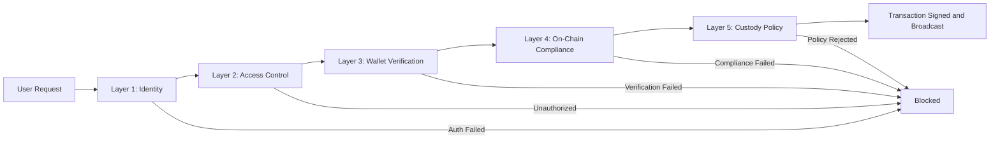

# Section 6: Technical Proposal — Loop 1 Refresh

## Executive Summary

Institutional adoption of digital asset infrastructure turns on a direct question: can the platform meet the operational standards that traditional financial systems have spent decades establishing? Availability measured in four nines. Security controls that satisfy five independent audit layers. Deployment models that respect data sovereignty. Upgrade paths that do not require taking the platform offline, redeploying existing assets, or disrupting holders' balances.

DALP is built to answer that question with verifiable evidence rather than marketing assurance. The platform runs on Kubernetes (standard distributions and Red Hat OpenShift), supports cloud, on-premises, and hybrid deployment models, and integrates with institutional infrastructure including HSM-backed key management, enterprise observability stacks, and existing identity providers. A 534-code structured error catalog provides immediate, actionable feedback for every failed operation, with each code carrying audience classification, severity, retryability, and suggested remediation. Distributed tracing instruments every step from API entry through custody provider signing, enabling operations teams to diagnose issues across trust boundaries they do not control.

This section presents the technical architecture in sufficient detail for a technical evaluation committee to assess the platform's fitness for institutional deployment, and in sufficient clarity for business and compliance stakeholders to understand why each architectural choice matters for their operational and regulatory requirements.

---

## 6.1 Platform Architecture Overview

### Architectural Principles

Five foundational principles shape every architectural decision in DALP.

**Lifecycle-first design** means every component serves the full digital asset lifecycle from issuance through servicing to retirement, not just token creation. The architecture accounts for ongoing operations: compliance monitoring, corporate actions, holder management, and asset maturity are first-class concerns from the start.

**Durable execution** means all stateful operations run through the Execution Engine, a durable workflow runtime that guarantees completion even through infrastructure failures, process restarts, and network partitions. This is the core execution model, not an optional reliability layer. Every multi-step operation (token creation, identity recovery, settlement execution) persists its phase state so that failures produce resume points, not lost work.

**Defense-in-depth** means security is enforced at five independent layers: authentication, authorization, wallet verification, on-chain compliance, and custody provider policy. Each layer operates independently, so compromising one layer does not grant access to blockchain operations.

**Separation of concerns** means the architecture cleanly separates API routing, business logic, blockchain interaction, data indexing, and observability into independently deployable and scalable components.

**Provider abstraction** means infrastructure dependencies (custody, secrets, object storage, database) are accessed through abstracted interfaces that prevent vendor lock-in and enable deployment across different cloud providers and on-premises environments without application changes.

### Core Components

The DALP platform consists of seven major components, each independently deployable and scalable.

**The dApp (Frontend)** is a full decentralized application built with React and TanStack Router, providing the operational console for asset management, compliance operations, identity administration, and system monitoring. The dApp implements sophisticated client-side logic including effective-status derivation (compensating for indexer lag), arbitrary-precision arithmetic for financial calculations using the dnum library (avoiding floating-point errors in token amounts), five-tab operational consoles for complex addons, Asset Designer with multi-step validation, global search with role-aware token visibility, and i18n support across 4 locales including right-to-left layout.

**The DAPI (Durable API Service)** is the backend API layer with a dual-endpoint architecture that creates a hardened security boundary. The `/api/rpc` endpoint accepts only session/cookie authentication for the dApp frontend, with API keys explicitly blocked (FORBIDDEN response). The `/api/v2` REST endpoint accepts API keys with HTTP-method-based scope enforcement. This two-endpoint model means the RPC endpoint serves only browser sessions while the REST endpoint is the sole interface for programmatic consumers.

The DAPI implements a layered middleware chain: session resolution, authentication enforcement, organization role synchronization (reconciling on-chain access-control state into organization membership at request time), system context hydration (resolving tenant system address, validating bootstrap readiness, deriving user permissions from on-chain roles), token context hydration for token operations, wallet verification (PIN, TOTP, backup codes) with per-factor replay protection, and transaction queue negotiation for sync/async execution.

**The Execution Engine (Restate)** is the durable execution runtime powering all stateful operations. It provides virtual objects keyed by partition for exclusive locking during submission (preventing nonce conflicts), durable workflows that survive restarts with persisted phase status, idempotent retry with operation-scoped idempotency keys, and cron patterns for scheduled operations. Three retry presets (fast: 5 attempts/10s max; standard: 10 attempts/5min max; longRunning: 20 attempts/30min max) are applied per step through configuration.

**The Blockchain Layer** comprises smart contracts based on the ERC-3643 (T-REX) standard with DALP-specific extensions. DALPAsset contracts provide a unified asset contract with configurable assetTypeId and dynamic feature composition via the SMART Configurable extension system (up to 32 pluggable features per token). The three-tier compliance interface hierarchy (Global → Token → SMART V2) supports 18 compliance module types. OnchainID identity contracts handle claim-based verification. System contracts (Directory, Identity Registry, Trusted Issuers Registry, Compliance Registry, Feeds Directory) form the on-chain governance infrastructure. Addon contracts (Vault, XvP Settlement, Token Sale, Airdrop, Fixed Yield Schedule, Feeds) follow a consistent factory pattern.

**The Indexer** is a custom PostgreSQL-based blockchain event indexer (V2) that processes all on-chain events and provides 18+ analytics views across five domains (identity, compliance, addons, cross-cutting, actions). It supports zero-downtime reindexing through schema isolation: new versions build data in a rotating schema alongside the running version, then switch atomically via pass-through views. The indexer includes reorg detection, bootstraps by discovering contracts through the on-chain DALP Directory without manual configuration, and uses registration-driven schema management where table DDL is generated from live definitions rather than cloned.

**The Signer Service** provides provider-agnostic wallet and signing abstraction supporting local signing (DALP-managed keys with encrypted database storage and Restate-backed nonce tracking), DFNS integration (programmatic MPC wallet creation with full API-based approval resolution), and Fireblocks integration (enterprise MPC-CMP custody with continuous key refresh). The provider abstraction normalizes wallet creation, signing, and approval across all backends through a common interface.

**The Transaction Processor** is a Restate virtual-object service keyed by address and chain that manages an 11-state transaction lifecycle (RECEIVED through COMPLETED, FAILED, DEAD_LETTER, or CANCELLED) with 20 sub-statuses for granular failure classification. A shared Confirmation Watcher batch-polls receipts for up to 250 active transactions per tick, replacing per-transaction RPC loops.

---

## 6.2 Deployment Models

DALP supports three deployment models, each meeting different institutional requirements.

### Managed Cloud (SaaS)

SettleMint operates the infrastructure on behalf of the client: fully managed Kubernetes cluster with multi-AZ distribution, managed PostgreSQL, Redis, and object storage, managed observability, and SettleMint-managed upgrades, patching, and monitoring. This model minimizes operational overhead and is recommended for organizations that want to focus on business operations rather than infrastructure management.

### Self-Hosted Cloud

The client provisions and operates infrastructure on their preferred cloud provider. DALP provides Helm charts that automatically configure for AWS (EKS with RDS, ElastiCache, S3), Azure (AKS with Flexible Server, Azure Cache, Blob Storage), and GCP (GKE with Cloud SQL, Memorystore, Cloud Storage). Cloud-native identity patterns are used for service authentication: IRSA for AWS, Workload Identity for Azure and GCP, with static credential fallback where cloud-native identity is not available. Typical ongoing effort is 8 to 16 hours per month.

### On-Premises

For organizations with strict data residency, regulatory, or security requirements. DALP runs the complete stack inside the customer's data center using CloudNativePG for PostgreSQL (version 17.x) with scheduled backups and zone-aware failover, in-cluster Redis (version 8.x), RustFS for S3-compatible object storage, full observability stack (Grafana, VictoriaMetrics, Loki, Tempo, Alloy), and Velero for Kubernetes resource backups. DALP's filesystem object storage provider with HMAC-signed presigned URLs enables development and testing without S3-compatible storage dependencies.

### Kubernetes and OpenShift

The Helm charts automatically detect the platform and configure accordingly. Standard Kubernetes uses Traefik-based ingress with IngressRoute CRDs. OpenShift uses native Routes with Traefik disabled, compatible with restricted-v2 Security Context Constraint, all containers running as non-root. Minimum requirements: Kubernetes 1.27+ (recommended 1.29+) or OpenShift 4.14+ (recommended 4.16+), 3 nodes minimum (6+ recommended), 4 vCPU / 16 GB RAM minimum per node (8 vCPU / 32 GB recommended).

---

## 6.3 Network Architecture

DALP operates on any EVM-compatible blockchain network, both public and permissioned. The platform abstracts blockchain complexity so business teams operate on asset and workflow concepts, not protocols.

Permissioned networks typically use Hyperledger Besu with IBFT 2.0 or QBFT consensus, providing deterministic block times and instant finality that simplifies compliance-critical operations. Production deployments typically run 4 validators and 2 RPC nodes. Public networks connect via RPC endpoints (Ethereum, Polygon, Arbitrum, and others). Multi-network support allows simultaneous operation across multiple chains, with the indexer maintaining per-network directory addresses and the nonce manager partitioning state by address and chain.

The indexer bootstraps network discovery by querying the on-chain DALP Directory for registered factories, then discovers all deployed contracts through factory event logs. TokenFactoryRegistered name validation against a trusted map prevents discovery of non-DALP contracts. All infrastructure requires outbound access to harbor.settlemint.com (port 443) for container images, HTTPS only for external routes, and NetworkPolicy support for pod-to-pod security. Service mesh is not supported because DALP uses Traefik for ingress and relies on direct pod-to-pod communication that service mesh sidecars can interfere with.

---

## 6.4 Security Architecture

### Defense-in-Depth Model

Five independent security layers protect every transaction. A user request passes through identity (authentication), access control (authorization), wallet verification (step-up factor proof), on-chain compliance (SMART Protocol module evaluation), and custody policy (provider-level enforcement). Each layer independently blocks unauthorized operations. A compromised session is caught by wallet verification. A bypassed API authorization is caught by on-chain compliance. Even if all off-chain controls fail, custody provider policies provide the final gate.

*Figure 1: Five-layer security model. Each layer independently blocks unauthorized transactions, providing defense-in-depth that survives any single control failure.*

### Authentication Architecture

Browser sessions use Better Auth with email/password (mandatory email verification), passkey support (WebAuthn), enterprise SSO, and configurable session lifetime. API keys are organization-scoped with explicit scope enforcement: read-only keys restricted to GET/HEAD/OPTIONS, read-write keys with full access. API keys are blocked on the RPC endpoint by design. CLI authentication uses a browser-based device login flow that upgrades into a long-lived API key, with credentials stored in macOS Keychain on Darwin and permission-checked config files elsewhere.

### Role-Based Access Control

DALP implements RBAC at two levels. System roles control platform-wide and per-system authority for asset creation, identity management, compliance configuration, and platform administration. Per-asset roles (admin, custodian, emergency, governance, supplyManagement) provide independent operational scope per asset. On-chain role assignments flow into platform authorization through the organization role sync middleware, which reconciles on-chain access-control state at authentication time.

The permission model is granular: system-level permissions govern platform administration, token-level permissions derive from on-chain roles and trusted-issuer status, and two-stage permission middleware enforces both role requirements and token interface requirements before handlers execute. This interface-aware authorization prevents operations on tokens that lack the required capabilities, even if the operator holds the right role.

### Encryption and Key Management

Secrets management uses a provider abstraction supporting encrypted database storage (default), Conjur HSM/vault for enterprise deployments, and environment variables for configuration secrets. Key Guardian protects private keys through defense-in-depth with four storage tiers: encrypted database (development), cloud secret manager (standard production), HSM (regulated financial services), and third-party MPC custody (highest security). Key lifecycle includes generation (HSM-backed keys generated within hardware; software keys use CSRNG with immediate encryption), rotation (active key replacement with historical key retention), recovery (sharded backups with threshold signature schemes), and revocation (immediate removal with smart contract permission updates).

### Two-Layer Transaction Policy

Every blockchain transaction passes through two independent policy layers. On-chain compliance (SMART Protocol) controls identity claims, country restrictions, supply caps, investor counts, time locks, and volume modules, configured by the issuer through the DALP API. Custodian policies (DFNS policy engine or Fireblocks TAP) control per-transaction amount limits, rolling spend limits, approver workflows, IP/time restrictions, and destination allowlists, configured by the operations team. Both must pass; neither can bypass the other.

---

## 6.5 High Availability and Disaster Recovery

### Recovery Metrics and Scenarios

DALP's HA/DR approach prioritizes cloud-native managed services, automatic backup and restore, predefined RTO/RPO targets, and quarterly DR drills.

| Scenario | RTO | RPO | Monthly Effort | Use Case |
|----------|-----|-----|---------------|----------|
| Cloud-native (recommended) | 2 to 15 minutes | Seconds to 1 minute | 8 to 16 hours | Most deployments |
| Hot-warm | 30 to 180 minutes | 5 to 60 minutes | 25 to 40 hours | Geographic redundancy |
| Hot-cold | 8 to 72 hours | 4 to 24 hours | 10 to 20 hours | Cost optimization |
| Hot-hot (consortium) | 1 to 10 minutes | Seconds to minutes | 40 to 60 hours | Multi-region active-active |

The recommended cloud-native scenario uses a single-region, multi-AZ deployment with managed services. Setup time is 2 to 3 days with 1 platform engineer. Minimum 0.25 FTE ongoing. Production deployments require nodes distributed across a minimum of three availability zones.

### Blockchain-Specific Considerations

On-chain data is inherently replicated across every blockchain node; losing the application database does not mean losing on-chain data, which can be re-derived by re-indexing. The indexer's zero-downtime reindexing architecture means upgrades happen without read downtime. Permissioned networks with IBFT 2.0/QBFT consensus tolerate f = (n-1)/3 Byzantine failures. Additional RPC nodes provide read scalability.

### Backup Strategies

PostgreSQL PITR with 7-day retention for managed services or CloudNativePG scheduled backups for self-hosted deployments. Velero for Kubernetes resource backups. Versioned object storage with lifecycle policies. WAL archiving for self-hosted PostgreSQL.

---

## 6.6 Performance and Scalability

Transaction processing locks at the address-and-chain level, allowing parallel processing across different addresses while maintaining strict serialization for the same address. Async queue semantics support sync (wait for completion), async (return HTTP 202 with status URL), and hybrid (attempt sync for N seconds, fall back to async) execution modes. Provider-native broadcast for DFNS and Fireblocks reduces latency by eliminating local nonce management. A shared Confirmation Watcher batches receipt polling for up to 250 active transactions per chain tick.

The indexer provides sub-5-second event latency from blockchain event to analytics view availability, with virtual views for real-time data and materialized views for expensive aggregations. Zero-downtime reindexing and reorg handling maintain data consistency.

DALP components scale independently: DAPI scales horizontally behind a load balancer, the indexer scales with database performance, Restate scales through partition-based addressing, additional RPC nodes provide read scalability, and the stateless dApp scales freely.

---

## 6.7 Monitoring and Observability

### Three-Pillar Observability

Metrics (VictoriaMetrics), logs (Loki), and traces (Tempo) provide complete platform visibility. These can be deployed in-cluster or connected to managed providers.

### Distributed Tracing

Four tracer namespaces instrument the platform: dalp.dapi for core API tracing (oRPC handlers, PostgreSQL queries, sampling propagation), dalp.integrations.fireblocks for Fireblocks API calls (20+ instrumented call sites), dalp.integrations.dfns for DFNS API calls, and services.transaction-processor for transaction lifecycle spans. Production deployments use ParentBasedSampler with configurable ratio (default 10%).

This three-tracer architecture enables end-to-end request tracing from API entry through workflow orchestration to external custody calls, which is critical for diagnosing latency and failures in delegated signing flows where DALP does not own the full execution path.

### Monitoring Automation

Blockchain health monitoring uses cron-based polling with 3-sample hysteresis to prevent false alerts from transient issues. SSE publishing provides real-time health events for dashboards. Hourly API metrics rollup provides performance tracking. Retention management automates cleanup beyond configured windows. Pre-built Grafana dashboards cover node utilization, blockchain health, operations, transactions, compliance activity, and security events.

### Analytics Views

18+ PostgreSQL analytics views provide direct SQL access for BI tools across five domains: identity (2 views), compliance (4 views covering claims, trusted issuers, topic schemes, and module statistics), addons (3+ views), cross-cutting (7 views covering transactions, asset activity, lifecycle, and country distribution), and actions (1 unified event log). Pricing views support system and portfolio value with fiat projections.

---

## 6.8 DevOps and Deployment

DALP is packaged as Helm charts covering component sizing, database and cache configuration, object storage, observability endpoints, TLS certificates, network configuration, blockchain nodes, custody providers, and telemetry. All container images are served through harbor.settlemint.com, simplifying firewall rules and enabling image mirroring for air-gapped deployments.

The upgrade model prioritizes production safety: zero-downtime reindexing (rotating schema build and atomic view switch), schema registration decoupling (preventing Drizzle migration interference), UUPS proxy patterns for smart contract upgrades without token redeployment, rolling deployment hardening for version coexistence, CI freshness checks to catch drift between contracts and error catalog, and draining deployment cleanup with 1-hour grace periods.

### Error Handling

534 auto-generated error codes extracted from Solidity ABI definitions, each carrying metadata: 4-byte selector, audience classification (user/operator/internal), severity, retryable flag, message, and suggested action. Exposed through the SDK, dApp React hooks with i18n translations, and OpenAPI extensions per operation. The revert decoder handles Error(string), Panic(uint256), and custom ABI errors with 51 mapped Panic codes.

### CLI Operations

301 command registrations across 26 top-level groups covering system administration, token lifecycle, identity and KYC, compliance, monitoring, addons, and settings. All commands use typed schemas bound directly to the SDK with consistent validation.

### SDK Integration

The DALP SDK provides a typed TypeScript integration surface with contract-bound REST client, DALP-specific serializers for arbitrary-precision decimals, bigint, and Date types, and 534 auto-generated error codes. Published as a public npm package with runtime, type-only, and plugin-only subpaths.

---

## 6.9 Operational Sustainability

### Effort by Deployment Model

| Activity | Managed Cloud | Self-Hosted Cloud | On-Premises |
|----------|--------------|------------------|-------------|
| Infrastructure | SettleMint | Client (0.25 FTE) | Client (0.5 FTE) |
| Database operations | SettleMint | Managed service | Client (CloudNativePG) |
| Backup verification | SettleMint | Weekly (30 min) | Weekly (30 min) |
| Helm updates | SettleMint | Monthly (1 to 2 hours) | Monthly (1 to 2 hours) |
| DR drill | SettleMint | Quarterly (4 to 8 hours) | Quarterly (4 to 8 hours) |
| Security patching | SettleMint | Monthly (2 to 4 hours) | Monthly (2 to 4 hours) |
| Total monthly | Minimal | 8 to 16 hours | 16 to 32 hours |

### Self-Healing Capabilities

The platform includes several self-healing behaviors: nonce recovery detects "nonce too low" failures and re-reads on-chain state (up to 3 retries), durable workflows survive process restarts and resume from persisted state, dead-letter rescue routes exhausted transactions for operator intervention, indexer views self-repair on startup, and provider initialization serialization prevents concurrent bootstrap races.

---

## 6.10 Integration Architecture

DALP provides multiple integration pathways. The REST API (v2) is the primary programmatic interface with organization-scoped keys and async support. The SDK provides typed TypeScript bindings. The CLI offers 301 commands with streaming monitoring access. Chainlink adapters present DALP feeds through the standard AggregatorV3Interface. SSE provides real-time event streaming.

Custody integration supports DFNS (full API-based provisioning and approval), Fireblocks (enterprise MPC-CMP with console/co-signer resolution), and local signing (encrypted database with nonce management). The provider abstraction allows migration between custody providers without application changes.

Identity provider integration connects external KYC providers through the Trusted Issuers Registry, with auto-claim validation ensuring deterministic binding between off-chain verification and on-chain attestation.

Observability integration supports OTLP trace export, Prometheus-compatible metrics, structured log aggregation, SQL-accessible analytics views for BI tools, and Grafana-managed alerting with structured Slack notifications.

Smart contracts use UUPS proxy patterns managed through the DALP Directory, enabling logic upgrades, compliance module updates, and feature additions through the SMART Configurable system (up to 32 features per token) without disrupting existing asset holders.
