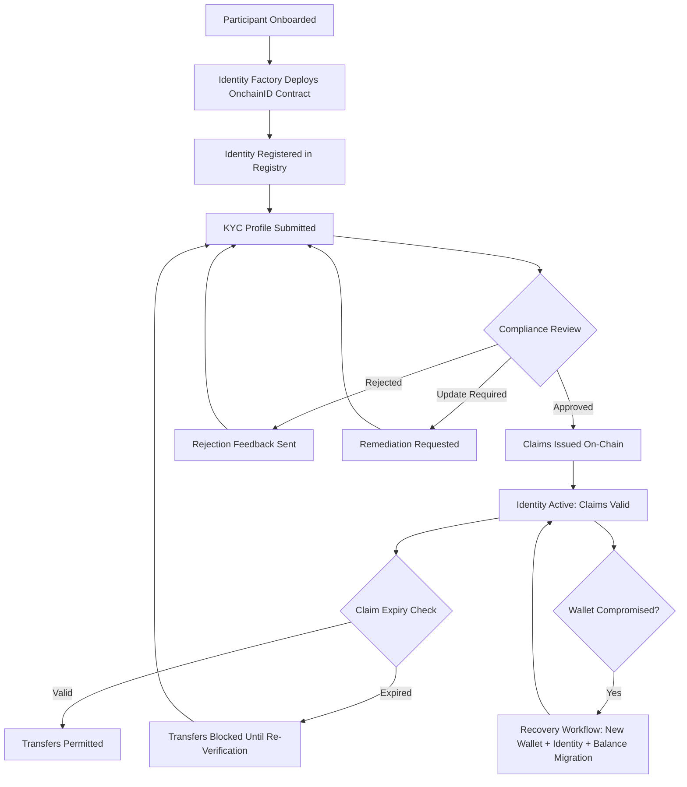
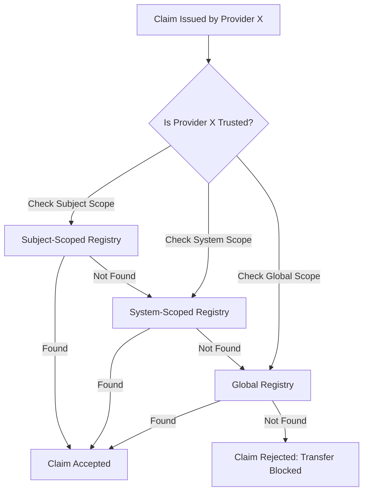
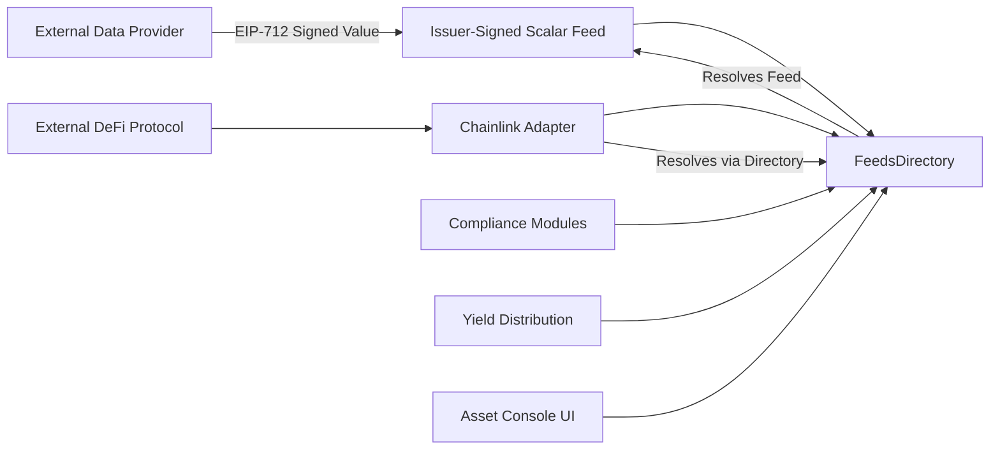

# Section 5: Verification, Claims, and Data Feeds — Loop 2 Refresh

## Executive Summary

Every regulated token transfer requires a chain of trust: the sender and recipient must be verified, the transfer must satisfy all applicable compliance rules, and the market data driving valuations must be auditable and tamper-evident. If any link in that chain fails or is bypassed, the institution faces regulatory exposure it cannot remediate after the fact.

DALP addresses this challenge at the protocol level rather than the application layer. Three integrated capabilities converge into a single verification ecosystem. On-chain identity verification through OnchainID anchors every participant's credentials as cryptographically signed claims following ERC-734/ERC-735 standards. A configurable compliance engine with 18 module types evaluates those credentials against regulatory rules before any transaction executes, using logical expressions that compliance officers configure without modifying smart contract code. A purpose-built data feed infrastructure delivers price, NAV, and corporate action data through cryptographically signed on-chain channels, exposing those feeds through Chainlink-compatible adapters for external consumption.

For operations teams, this means a single compliance configuration surface rather than scattered rule enforcement across multiple systems. For auditors, it means traceable decisions across 18+ SQL-accessible analytics views. For compliance officers, it means real-time posture monitoring through streaming dashboards rather than periodic review cycles. When verification or feed data is unavailable, the platform defaults to blocking rather than permitting, ensuring that operational issues surface as visible, auditable blocked transactions rather than as silent compliance violations discovered at audit time.

---

## 5.1 Identity Verification with OnchainID

### The Identity Model

Regulated financial operations depend on a fundamental assurance: that every participant in a transaction is who they claim to be, and that their credentials have been attested by a trusted authority. Traditional approaches store identity attributes in centralized databases where records can be silently modified, where verification status is visible only to the platform operator, and where redundant KYC processes multiply for every new asset a participant touches.

DALP implements on-chain identity verification through OnchainID, an identity protocol based on the ERC-734 (key management) and ERC-735 (claim management) standards. Every participant, whether an individual investor, an institutional entity, or a smart contract, is represented by a dedicated on-chain identity contract. This contract is the canonical record of who a participant is and what has been attested about them.

The identity model provides five properties that traditional identity systems struggle to deliver simultaneously. Each participant's identity is anchored in a self-sovereign contract deployed on-chain, providing a persistent, tamper-evident identity record rather than a database row. Identity attributes such as KYC status, accreditation, jurisdiction, and AML clearance are represented as cryptographically signed claims, making verification checkable by any on-chain participant rather than only by the platform operator. Every claim traces back to the trusted issuer that created it, establishing a verifiable chain of trust from claim consumer to original verification provider. Credentials are reusable across all assets on the platform: an investor verified for Bond A does not re-verify for Bond B, eliminating redundant KYC for multi-asset programmes. Claims include optional expiration timestamps that enforce automatic re-verification; an expired KYC claim blocks transfers even if the claim topic matches, with no grandfather exception for stale verification.

Consider a sovereign wealth fund onboarding institutional investors across three jurisdictions. In a traditional platform, each jurisdiction's KYC provider operates in isolation: separate databases, manual reconciliation, and application-layer enforcement rules that may drift between regions. With DALP, each investor's identity contract holds verifiable claims from jurisdiction-specific trusted issuers. The compliance engine evaluates those claims against the fund's configured regulatory expression, and enforcement happens at the protocol level, identically for every transfer regardless of jurisdiction. The compliance officer configures the rules once; the protocol enforces them everywhere. This is not an incremental improvement over centralized identity management. It is a structural change in where trust is anchored and who can verify it.

### Identity Lifecycle

The identity lifecycle follows a structured progression from creation through active use, expiry, and recovery. Each phase is tracked as an explicit workflow state, providing operations teams with clear visibility into where any participant stands in the verification process.

**Identity creation** begins when a participant is onboarded. The Identity Factory deploys an OnchainID contract using a V2 implementation that delegates authorization to the platform directory's administrative role, reducing privileged transactions during setup while maintaining the same security invariants. For smart accounts (ERC-4337), identity creation is atomic with account deployment, including automatic issuance of a claim identifying the identity as a DALP-managed smart account.

**Identity registration** establishes the binding between the participant's wallet address and their identity contract in the Identity Registry. Two registration models accommodate different onboarding scenarios: self-service registration for users who hold their wallet's management key, and admin-initiated batch registration that enables bulk onboarding without requiring each user to perform blockchain transactions during invitation acceptance.

**Claim issuance** attaches verifiable claims to the identity through trusted issuers. Each claim addresses a single verification dimension: KYC completion, AML clearance, accreditation status, or jurisdictional eligibility. Auto-claims flow programmatically from KYC review outcomes; manual claims are issued through the API or dApp interface. Both pathways share the same validation and queue semantics, ensuring consistent integrity enforcement regardless of the issuance channel.

**Identity recovery** handles lost or compromised wallet access through a durable, phase-tracked workflow. The orchestration proceeds through deterministic phases: new wallet creation, replacement identity deployment, on-chain recovery through the Identity Registry, session and credential revocation, and token balance migration. This workflow includes preflight recoverability checks, confirmation-gated destructive execution (requiring the text `RECOVER IDENTITY`), parallelized pre-checks, atomic security reconciliation, and best-effort per-token balance migration with logging for partial failures. The explicit phase persistence (from `creating-wallet` through `completed` or `failed`) ensures that operations teams can track recovery progress and understand exactly where a failure occurred.

*Figure 1: Identity lifecycle from onboarding through claim issuance, expiry enforcement, and recovery. Each phase is tracked as an explicit workflow state, providing complete operational visibility.*

### Contract Identity Integration

DALP extends identity beyond human participants to include contract-level identity. When factory contracts, vault contracts, or smart accounts are deployed, they automatically receive an associated OnchainID contract. This means claim-based authorization applies uniformly to contracts and wallets, the Trusted Issuers Registry can authorize factory contracts as claim issuers, and the centralized claim authorization library prevents ad hoc issuance logic from scattering across different contract codepaths. The `IContractWithIdentity` interface standardizes this pattern across the platform.

### Identity as the Foundation of Compliance

The preceding sections described identity verification as a standalone capability. In practice, it serves as the foundation of every compliance decision on the platform. A participant's identity contract holds their verifiable claims. The compliance engine evaluates those claims against the token's configured verification expression. If claims are insufficient, expired, or issued by an untrusted issuer, the transfer is blocked at the protocol level.

This creates an ex-ante compliance model: transfers that would violate rules are prevented before they execute, not detected and remediated after the fact. The compliance pre-check via simulation provides immediate feedback, while on-chain enforcement during actual execution provides the authoritative guarantee. Most digital asset platforms enforce compliance at the application layer, where a configuration change, an API bypass, or a database modification can silently alter the enforcement behavior. Because DALP enforces compliance on-chain, the enforcement is the same code that processes the transaction itself. There is no gap between what the system checks and what the blockchain enforces.

---

## 5.2 The Claim Topics System

### How Claims Work

Building on the identity foundation described above, claims are the atomic unit of verification. Each claim is an on-chain attestation stored on a participant's OnchainID contract, carrying five properties: a numeric topic identifier (KYC, AML, ACCREDITED), the trusted issuer's address, a data payload (which may include a content hash for KYC verification), a cryptographic signature, and an optional expiration timestamp.

The topic is the key organizing concept. Standard topics include KYC (identity verification completed), AML (screening passed), ACCREDITED (investor meets accredited criteria), CONTRACT (legal entity rather than natural person), JURISDICTION (resident in a qualifying jurisdiction), and dalpWallet (DALP smart account, auto-issued by the Identity Factory). Custom claim topics can be registered for institution-specific requirements. An institution operating under Swiss FINMA regulations could define a QUALIFIED_INVESTOR topic reflecting Swiss classification requirements that differ from US accreditation standards.

### Auto-Claim Validation

Claim issuance carries risk. If trusted issuer credentials are compromised, arbitrary claims could be injected. DALP mitigates this through server-side validation at the DAPI layer. For boolean topics (ACCREDITED, AML), only the literal value "true" is accepted. For KYC claims, the value must exactly match the contentHash from the participant's approved KYC profile. This deterministic binding ensures claims cannot be issued without a corresponding approved review. Updating KYC data produces a new hash, invalidating the old claim value.

Without this validation, a compromised issuer credential could lead to arbitrary claim injection. With it, even compromised credentials can only issue claims matching the platform's validated state. This is a meaningful security boundary that most claim-based identity systems lack.

### Claim Issuance During Asset Creation

When a new asset is created, the workflow automatically issues class-specific claims: classification (asset type, category, regulatory classification), location (country, jurisdictions), pricing (denomination, parameters), and identifiers (ISIN, CUSIP where applicable). Every claim routes through the shared claim issue service with transactional integrity. If any claim in the batch fails, the entire issuance terminates. The workflow tracks this as an explicit phase: `creating` → `granting-permissions` → `issuing-claims` → `unpausing` → `completed`.

### Claim Revocation

Claims are not permanent. Revocation is a privileged operation that handles several scenarios: rescinded KYC status, expired or downgraded accreditation, erroneous claim issuance, or regulatory changes requiring re-verification. When a claim is revoked, dependent transfers are blocked on the next compliance check. The enforcement is immediate: there is no grace period. This instant enforcement means that a compliance officer who discovers a problem can act on it with the confidence that the platform will enforce the change before any further transfers complete.

---

## 5.3 Trusted Issuers Registry

### Three-Tier Architecture

With the claim system established, the next question is governance: who can attest to what? Most platforms force a choice between two unsatisfying extremes. A flat trust model, where every issuer can issue claims for every asset, is too permissive for complex institutional programmes. An isolated model, where each asset independently configures its providers, is operationally expensive and error-prone when the same provider serves multiple assets.

DALP resolves this through a three-tier architecture that operates entirely on-chain, enforced at the same protocol level as the compliance checks that consume it.

**Tier 1 (subject-scoped)** authorizes issuers for a specific identity or token. A particular KYC provider might be trusted only for a specific institutional fund. **Tier 2 (system-scoped)** authorizes issuers across all identities within a DALP system (tenant), typically the default KYC providers registered during bootstrap. **Tier 3 (global)** applies platform-wide, consolidating issuers that must be universal, notably the Identity Factory that issues CONTRACT claims for all contract identities. The meta-registry resolves queries through cascading lookup (subject → system → global), with the most specific match winning.

This three-tier model eliminates a trade-off that most digital asset platforms force on their operators. The trust hierarchy is not application-layer configuration that can drift from enforcement reality. It is on-chain state, evaluated by the same compliance engine that processes transfers.

### Access Control and Governance

| Action | Required Role | Scope |
|--------|--------------|-------|
| Register global trusted issuer | DIRECTORY_ADMIN_ROLE | Platform-wide |
| Register system trusted issuer | SYSTEM_MANAGER_ROLE | Per-system (tenant) |
| Register subject-scoped issuer | Token governance role | Per-token |
| Query trusted issuer status | Any caller | Unrestricted |

The elevated privilege requirement for global trust changes is enforced architecturally, not by convention. A tenant administrator cannot accidentally register an issuer whose claims would propagate across other tenants. This governance model addresses a multi-tenant security risk that application-layer trust management cannot reliably prevent.

### Operational Implications

Removing a trusted issuer invalidates all their existing claims. This is by design: if a KYC provider is found to have issued fraudulent claims, removing them immediately blocks all dependent transfers. New issuers can be added without affecting existing claims from other issuers. Claim expiry enforces re-verification even when the issuer remains trusted.

*Figure 2: Trusted issuer resolution cascades from most specific (subject) to broadest (global). A claim from an unrecognized issuer blocks the transfer at the protocol level.*

DALP's statistics router exposes coverage metrics: claims per topic, issuance volume per issuer, coverage gaps, and expiry projections. These are built on four compliance analytics views, providing compliance officers with real-time posture visibility through standard SQL without manual data extraction.

---

## 5.4 Verification Workflows and Compliance Enforcement

### The Identity Verification Module

The compliance modules described here consume the identity and claim infrastructure established in the preceding sections. The SMARTIdentityVerification module is the most expressive mechanism: rather than simple allow/block lists, it evaluates logical expressions over identity claims using Reverse Polish Notation (RPN). This stack-machine approach eliminates ambiguity without requiring parentheses, making both on-chain evaluation and off-chain validation deterministic.

Four node types compose the expressions: TOPIC (pushes true if the identity holds a valid, non-expired claim), AND, OR, and NOT. This enables configurations matching specific regulatory frameworks:

| Regulation | Expression | Meaning |
|-----------|-----------|---------|
| MiCA EU Standard | [KYC, AML, AND] | Both KYC and AML required |
| Reg D 506(b) | [ACCREDITED, KYC, AML, AND, OR] | Accredited OR (KYC AND AML) |
| Reg D 506(c) | [ACCREDITED] | Only accredited investors |
| Japan FSA QII | [CONTRACT, KYC, AML, AND, OR] | QII or (KYC AND AML) |
| Sanctions screening | [KYC, SANCTIONED, NOT, AND] | KYC required, must not be sanctioned |

Both sender and recipient must satisfy the expression. Claims are checked for expiry at evaluation time. Malformed expressions are rejected at configuration time through parameter validation. This means your compliance team defines regulatory requirements as logical expressions, not as code changes, and the protocol enforces those expressions identically for every transfer.

### Exemption Expressions

The same RPN system powers exemptions across other compliance modules. TimeLock exemptions allow qualified investors to skip holding periods. TransferApproval exemptions let institutional investors trade freely while retail investors require pre-approval. InvestorCount topic filters determine which investors count toward caps, enabling Reg D compliance where non-accredited investors are limited to 35 but accredited investors have no cap. This reuse of the expression system across modules means compliance officers learn one configuration paradigm and apply it everywhere.

### KYC Review and Compliance Workflow

The KYC workflow follows a deterministic path. Participants submit profiles; compliance officers approve (locking the profile version and enabling claim issuance with a content hash binding), reject (with mandatory reasons), or request updates (identifying specific fields with optional deadlines). The system cross-checks across all pending action requests, clearing pending status only when no open requests remain. KYC update requests appear in DALP's unified action queue alongside on-chain tasks like bond maturity and XvP settlements, giving your operations team a single view of every actionable item across the platform.

### 18 Compliance Module Types

DALP provides 18 configurable modules across six categories: eligibility (identity verification, country allow/block lists, identity lists), restriction (transfer approval, conditional controls), transfer control (amount limits, frequency controls), issuance and supply (supply cap, investor count limits), time-based (holding periods, windowed restrictions), and settlement/collateral (ratio requirements, backing verification).

Each module operates independently but composes. A European bond might combine identity verification with [KYC, AML, AND] for MiCA, a country block list for sanctioned jurisdictions, investor count with topic filter for non-institutional caps, and a holding period with exemption for qualified investors. All four evaluate independently; a transfer succeeds only when all pass. This composability is the reason compliance officers can build complex multi-jurisdictional configurations without engineering involvement: they are combining pre-built, audited modules, not writing custom rules.

### Compliance Pre-Check via Simulation

Before any transaction reaches the blockchain, the Execution Engine simulates it against the SMART Protocol's `canTransfer`. All attached modules are evaluated. Failures surface immediately with structured error codes from the 534-code catalog, providing human-readable messages and suggested actions. If simulation passes, the transaction proceeds to custody signing. On-chain compliance re-verifies at execution time. If compliance state changes between simulation and broadcast (a claim expires, an issuer is removed), the on-chain transaction reverts.

This dual enforcement provides both operational efficiency (no wasted gas on doomed transactions) and absolute compliance guarantees (the blockchain enforces regardless of what the application layer believes). No platform-layer configuration change can cause a non-compliant transfer to succeed.

---

## 5.5 Data Feeds Architecture

The compliance and identity infrastructure described above operates on identity claims. Market data, valuations, and pricing require a parallel trust infrastructure for data feeds. This section describes how DALP provides that infrastructure through the same on-chain trust model used for identity.

### The FeedsDirectory

The FeedsDirectory separates discovery (which feed serves a given data request) from delivery (individual feed contracts). Each registration captures: subject (token address or address zero for global data), topic (base price, FX rate, NAV), feed contract address, feed kind (scalar or bytes), and schema hash (pinning the expected data format). The (subject, topic) pair is the primary key. The API translates human-readable topic names into on-chain identifiers, so integrators work with "NAV" and "basePrice" rather than raw bytes32 hashes.

### Feed Types

The **issuer-signed scalar feed** is a factory-deployed capability where authorized parties sign and publish data on-chain using EIP-712 typed data signatures. Data is stored as fixed-point integers with configurable decimals and enforced positive values. Three history modes serve different needs: LATEST_ONLY for real-time pricing, BOUNDED (fixed-size ring buffer) for sliding-window analysis, and FULL for complete audit trails. A configurable drift allowance flags outlier values; for example, a 5% drift allowance flags a price submission that moves more than 5% from the previous value, allowing consumers to assess risk before acting on it.

The **Chainlink aggregator adapter** wraps any DALP feed in the AggregatorV3Interface standard. External integrations get a stable address that survives underlying feed changes. The adapter resolves the current feed from the FeedsDirectory on every call. Any system already consuming Chainlink feeds can consume DALP feeds without code changes. This interoperability matters because it means your institution's existing DeFi integrations, portfolio trackers, and analytics tools connect to DALP pricing data through the interface they already support.

*Figure 3: Data feed architecture. The FeedsDirectory provides a single discovery layer. Consumers access feeds directly or through Chainlink-compatible adapters for external interoperability.*

### Feed Trust Model

Read access is unrestricted. Write access is role-gated: feed registration requires the Feeds Manager role at the system level, feed creation for a token requires the GOVERNANCE role, and value submission requires EIP-712 authorization. Global feeds (address zero) can only be managed by the Feeds Manager, preventing asset-level operators from affecting economy-wide data like FX rates or benchmark rates.

### Feed Failure Handling

| Failure | System Behavior |
|---------|----------------|
| Feed stale (no updates) | Last-known value served; compliance modules may block |
| Feed removed | Discovery returns zero address; consumers must handle |
| Invalid signature | Update rejected on-chain |
| Drift exceeded | Value flagged as outlier |
| Adapter target missing | Adapter call reverts |
| Schema hash mismatch | Feed replacement required |

---

## 5.6 Price Feeds, NAV Feeds, and Corporate Action Data

The feed infrastructure supports multiple data categories, each flowing through the same trust and audit model.

**Price feeds** serve token price reporting (issuer-signed with EIP-712 verification), exchange rate synchronization from external providers (persisted in historical and latest database tables), and manual operator overrides for corrections. Exchange rates support read, list, history, update, delete, and sync operations.

**NAV feeds** for fund tokens use the same infrastructure. LATEST_ONLY suits open-ended funds with continuous redemption. BOUNDED serves regulatory reporting windows. FULL preserves complete history for audit. NAV data flows through the indexer to produce fiat value projections, enabling your portfolio reporting team to see valuations in any preferred currency without separate valuation infrastructure.

**Corporate action feeds** integrate with automated lifecycle operations: coupon calculations reference denomination pricing, maturity features use treasury valuations, yield distributions calculate from rate data, and collateral modules verify backing at current market values. This integration means lifecycle events (coupon payments, maturity redemptions) execute against current, signed, auditable market data rather than manual inputs.

---

## 5.7 Oracle Patterns and Feed Lifecycle

DALP supports hybrid deployments where institution-managed feeds (for proprietary NAV data and internal pricing) coexist with external feeds (for public market data). Both register in the same FeedsDirectory for uniform discovery and consumption. An institution might use DALP-managed feeds for proprietary valuations alongside external Chainlink feeds for major FX rates, all discoverable through a single registry.

The complete feed lifecycle progresses through defined stages: deploy the feed factory addon, create a feed instance, optionally deploy a Chainlink adapter, submit signed updates (ongoing), read values, replace the underlying contract while preserving the directory entry, and remove when no longer needed. Each step is API-accessible with role-based controls, wallet verification for writes, and audit logging. Both synchronous and asynchronous processing are supported.

---

## 5.8 Verification and Feed Integration Points

The verification system and the feeds system, described separately in the preceding sections, converge in several operational scenarios that demonstrate why they share the same trust infrastructure.

**Collateral verification** modules query feed data to determine current collateral values. The feed provides the price; the compliance module enforces the ratio. **Valuation-dependent compliance** converts token amounts to fiat values using feed data for transfer amount limits. **Audit convergence** means both verification events and feed submissions are indexed and exposed through the same PostgreSQL analytics views, enabling compliance officers to correlate transfer failures with the market data active at the time.

When verification or feed data is unavailable, the platform defaults to blocking. Missing claims block transfers. Stale feeds trigger compliance failures. This fail-safe behavior is an architectural commitment, not a configuration option: operational issues surface as blocked transactions rather than as silent compliance violations.

The practical implication for institutional deployments is a platform where identity, compliance, and market data share one trust model, one configuration surface, and one audit trail. Because compliance rules live in the module layer rather than inside smart contract code, your compliance officers can update jurisdiction-specific requirements without engineering involvement, contract redeployment, or downtime. That separation between business rules and execution code is the structural advantage that keeps compliance operations sustainable as regulatory requirements evolve.
