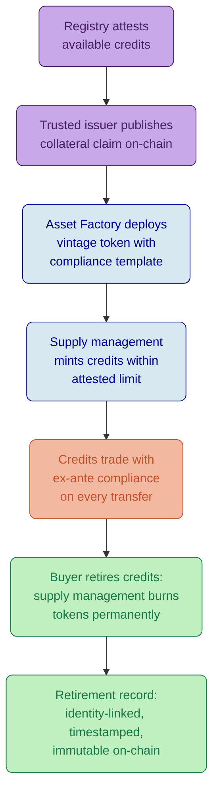

# Carbon Credits and ESG Assets on DALP

## Platform Capabilities for Voluntary Carbon Markets and Sustainability Instruments

---

## Executive Summary

DALP provides the compliance, identity, and lifecycle infrastructure that transforms registry-verified carbon credits into tradeable, retirable, and fully auditable digital instruments. The platform does not replace existing carbon registries. It provides the operational layer between registry attestation and market execution, applying the same ex-ante compliance enforcement, identity verification, and immutable audit trail capabilities that DALP delivers for regulated financial securities.

Voluntary carbon markets are growing rapidly, yet the operational infrastructure connecting registries to market participants remains fragmented. Credits change hands through manual processes, retirement claims lack immutable evidence, and vintage exposure is difficult to monitor at portfolio scale. For institutional buyers building defensible offset portfolios to meet net-zero commitments, this operational gap creates real risk: credits that cannot be traced to verified projects, retirements that cannot be independently audited, and double-counting exposure that undermines the credibility of the entire offset strategy.

DALP addresses these challenges through its configuration-driven tokenization architecture. Each carbon credit is represented as a regulated digital asset with built-in compliance modules that enforce eligibility before every transfer, identity verification that links every participant to a verified entity, and lifecycle tracking that records every issuance, transfer, and retirement immutably on-chain. The platform's 12 compliance module types, seven per-asset roles, and configurable metadata schema provide institutional-grade governance for carbon credit programs without requiring custom smart contract development. New credit vintages or project types deploy through the Asset Factory in minutes, not months.

This document examines how DALP's existing capabilities apply to four critical aspects of carbon credit and ESG asset management: retirement mechanics, registry integration, vintage tracking, and verification claims.

---

## Retirement Mechanics

DALP's token lifecycle provides two native, audited mechanisms that map directly to the two operational states carbon credits require: permanent retirement through burn, and temporary reserve through freeze.

### Permanent Retirement

When a buyer retires credits against their emissions, the supply management role executes a burn operation on the holder's token balance. This is not a soft delete or a status flag; the tokens are permanently removed from the circulating supply at the smart contract level. The burn event is recorded immutably on-chain with the retiring entity's verified identity (resolved through the Identity Registry), the quantity retired, and the timestamp. That combination of identity-linked, timestamped, immutable retirement evidence is exactly what auditors and voluntary carbon market standards require when verifying offset claims.

The Historical Balances feature preserves a complete record of the credit's ownership chain from issuance to retirement. Any auditor can reconstruct who held the credit, when transfers occurred, which compliance modules approved each transfer, and who ultimately retired it. This provenance chain is not an add-on reporting feature; it is a core architectural property of every DALP-managed token.

Because burn reduces the circulating supply tracked by `totalSupply()`, the dashboard's supply metrics directly reflect the program's retirement progress. Total minted minus total burned equals active credits, visible in real time, without reconciliation against external systems.

### Temporary Holding and Buffer Pools

The custodian role can freeze specific token quantities in a holder's wallet, preventing transfer while preserving the balance on record. This serves the reserve or buffer pool use case where credits are earmarked for future retirement but have not yet been permanently extinguished. When the holder confirms retirement, the custodian unfreezes and the supply management role burns. When the hold is released for trading, the custodian unfreezes and the credits re-enter circulation.

This two-state model (freeze for reserve, burn for retirement) maps cleanly to how institutional carbon programs operate: credits are acquired, held in inventory, allocated to specific offset commitments, and retired when the offset is confirmed. Each state transition is governed by role-based access control with separation of duties between the custodian (who manages holds) and the supply management role (who executes retirements).

### Double-Counting Prevention

Each token unit represents exactly one credit. Once burned, that unit cannot be re-minted or re-transferred. The Identity Registry ensures every retirement is linked to a verified entity, preventing anonymous retirement claims that could obscure double-counting across counterparties.

Cross-platform double-counting (the same project's credits tokenized on multiple platforms) is an ecosystem-level challenge rather than a single-platform feature. DALP's CollateralComplianceModule can enforce that tokenized supply does not exceed a registry-attested issuance amount, but this enforcement depends on accurate attestation data from the registry or a trusted auditor. The platform enforces the constraint; the trusted issuer provides the data. This honest separation of responsibility is the correct architecture for a layer that sits alongside registries rather than replacing them.

### Retirement Certificate Generation

DALP does not natively generate PDF retirement certificates or interface with registry-specific certificate workflows. The platform provides all the underlying data: burn transaction hash, retiring entity's verified identity, quantity, timestamp, project metadata, and vintage. An external certificate generation service consumes this data through DALP's API to produce certificates in whatever format the registry or buyer requires. This is an integration point that DALP's typed REST API and event-driven architecture are designed to support.

Because DALP separates the retirement record (immutable, on-chain, identity-linked) from the certificate format (variable, off-chain, registry-specific), institutions can generate certificates that satisfy multiple reporting frameworks from a single source of truth.

*Figure 1: DALP Dashboard with real-time supply tracking. For carbon credit programs, the circulating supply metric shows active (unretired) credits, while the burned supply counter tracks cumulative retirements, providing program managers with at-a-glance offset delivery progress.*

---

## Registry Integration

DALP's integration architecture for carbon registries combines two mechanisms: the CollateralComplianceModule for supply integrity enforcement, and the trusted issuer claims system for project and verification attestations. Together, they ensure that tokenized credits maintain provenance from registry to retirement.

### Supply Integrity via Collateral Compliance

The CollateralComplianceModule enforces that total tokenized supply never exceeds the quantity attested by a trusted third party. For carbon credits, this operates as follows:

A trusted issuer (the registry's appointed auditor, or the registry itself if it provides machine-readable attestations) publishes a collateral claim against the issuer's OnchainID contract, attesting to the number of verified credits available for tokenization. The CollateralComplianceModule validates this claim at every mint operation. If minting the requested quantity would cause total supply to exceed the attested amount, the transaction reverts atomically. When credits are retired at the registry level, the trusted issuer updates the attestation to reflect the reduced available pool.

The collateral ratio is configurable in basis points. Setting it to 10,000 bps (100%) enforces one-to-one backing: one tokenized credit for every registry-attested credit. Setting it higher (e.g., 12,000 bps, 120%) creates an over-collateralization buffer that accounts for attestation latency between registry updates and on-chain state.

This model provides strong supply integrity at the platform level. The honest boundary: attestation updates are manual or semi-automated, depending on the registry's API capabilities and the trusted issuer's operational workflow. DALP enforces the constraint on-chain; the registry data enters through the trusted issuer channel.

### Project Attestations via Claims

DALP's OnchainID claims system records project-level data as on-chain attestations published by trusted issuers. For carbon credits, relevant claim topics include:

| Claim Topic | Purpose | Trusted Issuer |
|-------------|---------|----------------|
| Project ID | Links credit to a specific registered project | Registry operator |
| Methodology | Quantification methodology applied | Verification body |
| Verification Status | Current verification outcome and date | Verification body |
| SDG Alignment | Sustainable Development Goals addressed | Project validator |
| Additionality | Confirmation of additionality criteria | Verification body |
| Crediting Period | Start and end dates of the crediting period | Registry operator |

Compliance modules reference these claims when evaluating transfer eligibility. A buyer's compliance policy can require, for example, that only credits with a valid verification claim from an approved body within the last 24 months are eligible for acquisition. The Identity Verification module's RPN expression logic evaluates these requirements before every transfer, on-chain, without manual intervention.

### What Registry Integration Requires

DALP does not provide pre-built API connectors to Verra, Gold Standard, or other specific registries. The platform's API surface supports integration with any system that can publish claims or attestation data, but the connector logic, registry API authentication, and data mapping are integration work. For carbon credit RFPs, the correct positioning is DALP as the operational and compliance layer, with registry connectivity as a defined integration project using DALP's trusted issuer infrastructure and typed REST APIs.

This boundary reflects a deliberate architectural choice. Registries differ in their data formats, API availability, and operational models. A pre-built connector that works for Verra's API would not work for Gold Standard's, and both may change independently. DALP provides the integration surface (trusted issuer claims, API endpoints, event streams) that adapts to any registry's data model rather than coupling to a specific one.

*Figure 2: DALP compliance policy templates showing module configuration. For carbon credit programs, these templates define which verification claims are required from which trusted issuers, what transfer restrictions apply by vintage or project type, and how supply limits align with registry attestations.*

---

## Vintage Tracking

DALP's Asset Factory and configurable metadata schema enable vintage management at the granularity that institutional carbon programs require, with new vintage tokens deployable in minutes using the same compliance template and shared Identity Registry.

### Why Vintage Matters

Vintage refers to the year in which the emission reduction or removal occurred. It is a primary pricing factor: recent vintage credits command premium pricing because they represent more current climate action, while older vintages trade at a discount or face buyer resistance. Institutional buyers with formal offset policies often specify vintage windows ("credits must be vintage 2023 or later"), and ESG reporting frameworks increasingly require vintage disclosure alongside retirement volume.

### Vintage-Specific Tokens: The Recommended Approach

For institutional programs, deploying each vintage as a separate DALPAsset provides the cleanest operational model:

**Segregated compliance.** Each vintage token carries its own compliance module configuration. Older vintages might face stricter transfer restrictions, higher minimum holding periods via the TimeLock module, or additional buyer eligibility requirements reflecting the market's discounting of aged credits. These rules are enforced at the smart contract level, not through operational policy that can be circumvented.

**Independent supply tracking.** Each vintage has its own circulating supply, minted total, and burned (retired) total. Program managers see retirement progress per vintage without cross-vintage aggregation obscuring the data.

**Rapid deployment.** The Asset Factory deploys new vintage tokens through a durable, idempotent workflow that validates configuration, deploys the proxy contract, initializes compliance modules, binds the Identity Registry, and assigns roles. This takes minutes per vintage, not weeks. Because the shared Identity Registry means investors verified once can trade across all vintage tokens without re-verification, adding a new vintage year does not create onboarding friction.

**Distinct pricing.** Because each vintage is a separate token, pricing data feeds can reflect vintage-specific market rates. A 2025 vintage trading at $18/credit and a 2023 vintage at $12/credit are tracked independently.

### Vintage Metadata Configuration

Each vintage token carries immutable metadata fields that lock provenance at issuance:

| Metadata Field | Type | Mutability | Purpose |
|----------------|------|------------|---------|
| Vintage Year | Number | Immutable | Year of emission reduction |
| Serial Number Range | String | Immutable | Registry-assigned serial numbers for the batch |
| Crediting Period Start | String | Immutable | Start date of the crediting period |
| Crediting Period End | String | Immutable | End date of the crediting period |
| Registry Batch ID | String | Immutable | Registry internal batch identifier |
| Project ID | String | Immutable | Registry project identifier |
| Methodology | String | Immutable | Applied quantification methodology |

Immutability on these fields ensures vintage data cannot be altered after credit issuance, preserving the provenance chain that auditors and buyers rely on.

### Multi-Vintage Portfolio View

DALP's portfolio management layer provides cross-token visibility. An investor holding credits across multiple vintages sees their aggregate position alongside per-vintage breakdowns. The platform's activity tracking records all transfers, retirements, and compliance events across vintage tokens with time-series aggregation, enabling reporting that spans the entire carbon credit portfolio.

Because all vintage tokens share the same Identity Registry and compliance infrastructure, the operational overhead of managing multiple vintages is configuration, not engineering. This is the practical advantage of a platform that treats "deploy a new instrument" as a configuration operation rather than a development project.

---

## Verification Claims and ESG Attestations

DALP's OnchainID claims architecture and trusted issuer system provide the on-chain framework for recording, validating, and enforcing verification attestations across the full lifecycle of a carbon credit program.

### Trusted Issuer Model for Verification Bodies

Each accredited verification body (SCS Global Services, RINA, Bureau Veritas, or any body accredited under the relevant registry standard) is registered as a trusted issuer in DALP's Trusted Issuers Registry. When a verification body completes an assessment and approves a project's emission reductions, it publishes a verification claim against the credit token's OnchainID, attesting to the verification outcome, date, scope, and methodology compliance.

The compliance module system then references this claim in transfer eligibility decisions. If the compliance template requires a valid verification claim from an approved issuer, credits without that claim cannot be transferred. The enforcement is automatic, on-chain, and ex-ante: the buyer does not need to check verification status manually, and the seller cannot transfer unverified credits regardless of the buyer's willingness to accept them.

### Claim Expiry for Periodic Re-Verification

Claims in DALP carry configurable expiry dates. For carbon credits requiring periodic re-verification (REDD+ projects with five-year crediting periods, or any project with ongoing monitoring requirements), the claim expiry is set to the next verification due date. When the claim expires, the compliance module blocks all transfers until a new verification claim is published by the trusted issuer.

This creates an automatic compliance gate: credits cannot circulate beyond their verified period without fresh attestation. The mechanism requires no manual intervention, no calendar reminders, and no reliance on participants' good faith. The smart contract simply does not permit the transfer of credits with expired verification claims.

### SDG Alignment and Additionality Claims

Beyond core verification, institutional ESG buyers increasingly require evidence of co-benefits (SDG alignment) and additionality (proof that the emission reduction would not have occurred without the project). DALP records these as additional claim topics, published by the relevant trusted issuer:

**SDG alignment claims** attest to which Sustainable Development Goals the project addresses (SDG 13 Climate Action, SDG 15 Life on Land, SDG 7 Affordable and Clean Energy, etc.). A buyer's compliance policy can require specific SDG claims before allowing credit acquisition.

**Additionality claims** attest that the project meets the additionality criteria of the applicable methodology. While additionality assessment is inherently a judgment call by the verification body, recording the attestation on-chain creates an immutable record that the assessment was conducted and what the outcome was.

The buyer can compose these requirements using the Identity Verification module's RPN expression logic. For example, `[VERIFICATION, SDG13, AND, ADDITIONALITY, AND]` requires all three attestations before a transfer is permitted.

*Figure 3: Carbon credit lifecycle on DALP, from registry attestation through tokenized issuance, compliant trading, and permanent retirement. Each stage is governed by DALP's compliance modules and identity verification, with the final retirement creating an immutable, identity-linked record.*

*Figure 4: DALP Trusted Issuers Registry showing configured verification authorities. For carbon credit programs, each accredited verification body and registry operator is registered here, enabling the compliance system to validate that credits carry attestations from recognized and approved authorities before any transfer is permitted.*

*Figure 5: Verification topics in DALP, showing configurable claim types. Carbon credit programs define topics for project verification status, SDG alignment, additionality, vintage attestation, and registry linkage, each published by designated trusted issuers.*

---

## Configuration Example: Voluntary Carbon Credit Program

A sustainability-focused asset manager launches a tokenized REDD+ forest conservation credit program verified under Verra VCS, with distribution to institutional ESG investors across OECD markets.

| Configuration | Value |
|---------------|-------|
| Asset Type | Equity (flexible supply, no maturity) |
| Name | "Amazon REDD+ VCS 2025" |
| Symbol | "ARCC25" |
| Decimals | 0 (whole credits, no fractions) |
| Country Code | 076 (Brazil, project jurisdiction) |
| Price Currency | USD |
| Base Price | 15.00 |
| **Token Features** | |
| Historical Balances | Ownership snapshots for audit, reporting, and provenance reconstruction |
| Permit | Gasless approvals for institutional custody workflows |
| **Compliance Modules** | |
| Identity Verification | `[KYC, AML, AND, VERIFICATION, AND]` (verified buyer plus valid credit verification claim) |
| Country Allow List | OECD member state codes plus Singapore (702) |
| Investor Count | 200 global limit |
| Collateral Compliance | 10,000 bps (100%), registry attestation required before minting |

**Retirement workflow.** When a buyer retires credits, the supply management role burns the corresponding tokens. The burn event, combined with the holder's verified identity, creates the on-chain retirement record. An external certificate service queries DALP's API for this data to generate formal retirement documentation.

**Vintage management.** Each vintage deploys as a separate token (ARCC24, ARCC25, ARCC26) through the Asset Factory, sharing the same compliance template and Identity Registry. Investors verified once trade across all vintages. New vintage deployment takes minutes.

**Ongoing verification.** Verification claims carry expiry dates aligned with the project's re-verification schedule. When claims expire, transfers are blocked until the verification body publishes a fresh attestation. This prevents trading of credits whose verification status has lapsed.

---

## Green Bonds and Sustainability-Linked Instruments

DALP's Bond asset type and configurable metadata schema extend the same governance architecture to green bonds and sustainability-linked instruments, using proven bond mechanics for the financial structure and trusted issuer claims for the sustainability overlay.

### Green Bond Mechanics

The Bond asset type with Fixed Treasury Yield and Maturity Redemption features handles the financial structure: coupon payments, maturity redemption, transfer compliance, and investor eligibility. The configurable metadata schema captures green bond framework references, use-of-proceeds categories (renewable energy, energy efficiency, sustainable transport), and external review status as immutable fields linked to the instrument from issuance.

Actual use-of-proceeds tracking (verifying that proceeds were deployed to specific green projects) is an operational accounting function outside on-chain enforcement scope. DALP records the instrument's green classification and the issuer's sustainability attestations; external assurance providers (whose attestations are recorded as trusted issuer claims) verify the physical-world proceeds allocation. The platform provides the data infrastructure; the verification responsibility sits with the established ESG assurance ecosystem.

### Sustainability-Linked Bond Step-Up Mechanics

Sustainability-linked bonds (SLBs) with coupon step-up provisions triggered by sustainability performance target (SPT) misses are supported through DALP's governed payout schedule. The governance role updates yield parameters when an SPT miss is confirmed by the designated external assessor, executing the coupon adjustment on-chain. The SPT assessment is an off-chain event; the coupon consequence is enforced on-chain through the same governance workflow that manages any bond servicing parameter change.

This pattern works because DALP separates the financial execution layer (on-chain, auditable, role-governed) from the sustainability assessment layer (off-chain, expert-driven, attestation-based). The trusted issuer claims system bridges the two: the external assessor publishes a claim attesting to the SPT outcome, and the governance role uses that attestation as the basis for the coupon adjustment.

*Figure 6: DALP Asset Designer showing bond creation workflow. Green bonds and SLBs are configured using the Bond asset type, with sustainability metadata and external review attestations added through the configurable metadata schema and trusted issuer claims.*

---

## Honest Capability Boundaries

### Registry-of-Record Synchronization

DALP does not provide real-time, bidirectional synchronization with external registries. The platform consumes attestation data published by trusted issuers who have access to registry data, but the synchronization frequency, data mapping, and reconciliation logic are integration concerns. For programs requiring near-real-time registry synchronization, the integration architecture needs a middleware layer or registry-operated trusted issuer service.

### Carbon Methodology Validation

DALP records methodology references as metadata and verification attestations as claims but has no internal logic to assess whether a methodology was correctly applied. Methodology validation is the verification body's responsibility, recorded through the trusted issuer claims system.

### Offset Accounting and GHG Integration

DALP tracks credit issuance, ownership, transfer, and retirement but does not calculate emissions, attribute credits to specific scopes, or generate GHG inventory reports. Integration with carbon accounting platforms uses DALP's API to export retirement data for incorporation into broader greenhouse gas accounting workflows.

### Physical Project Monitoring

IoT sensor data from project sites (forest canopy monitoring, methane capture rates, renewable energy generation) is outside DALP's scope. The platform's data feeds module can consume aggregated data published by authorized sources, but direct IoT device interfacing is not a platform function.

### Secondary Market Order Book

DALP is not a trading venue and does not include a native order book or matching engine. Secondary transfers are peer-to-peer with compliance enforcement on every transfer. A marketplace or exchange experience for carbon credits requires an external trading platform integrated with DALP for settlement and compliance.

---

## Monitoring and Reporting

DALP's monitoring infrastructure provides the operational visibility that institutional carbon credit programs require across three dimensions.

**Supply-level tracking.** Real-time circulating supply, total minted, and total burned (retired) across all credit tokens. For carbon programs, burned supply directly represents cumulative retirements, providing program-level offset delivery metrics without manual reconciliation.

**Transaction-level audit trail.** Every issuance, transfer, and retirement event is recorded with the identity of the parties involved, the timestamp, the transaction hash, and the compliance modules that evaluated the operation. This audit trail satisfies voluntary carbon market evidentiary standards and supports external audit processes.

**Identity-linked reporting.** Because every participant has a verified on-chain identity, reporting aggregates by entity, jurisdiction, investor type, or project. Program managers produce reports showing total retirements by country, credits held by investor category, or vintage distribution across the portfolio.

*Figure 7: DALP blockchain monitoring dashboard. For carbon credit programs, monitoring provides real-time visibility into credit issuance rates, transfer volumes, and retirement activity across all vintage tokens in the network.*

---

## Summary

DALP delivers institutional-grade governance for tokenized carbon credits and ESG assets through the same configuration-driven architecture that serves regulated financial securities. The platform's 12 compliance module types enforce eligibility rules before every transfer. The seven per-asset roles provide separation of duties across issuance, custody, governance, and emergency operations. The trusted issuer claims system creates an on-chain record of registry attestations, project verifications, and SDG co-benefit assessments. The Asset Factory deploys new credit vintages in minutes with shared compliance templates and a unified Identity Registry.

The honest boundaries are equally clear. DALP is not a carbon registry, not a GHG accounting system, not a project monitoring tool, and not a trading venue. It operates at the layer between registry attestation and market execution, providing the compliance, settlement, and audit infrastructure that institutional carbon programs need to be defensible. Registry connectivity, certificate generation, and carbon accounting are integration opportunities that DALP's API surface and trusted issuer architecture are purpose-built to support.

For institutions evaluating tokenization platforms for carbon credit programs, the differentiating question is whether the platform enforces compliance before execution, links every participant to a verified identity, and provides an immutable lifecycle record from issuance through retirement. DALP does all three, using pre-audited modules that compose without custom smart contract development, governed by role-based access control that mirrors institutional separation-of-duties requirements.
