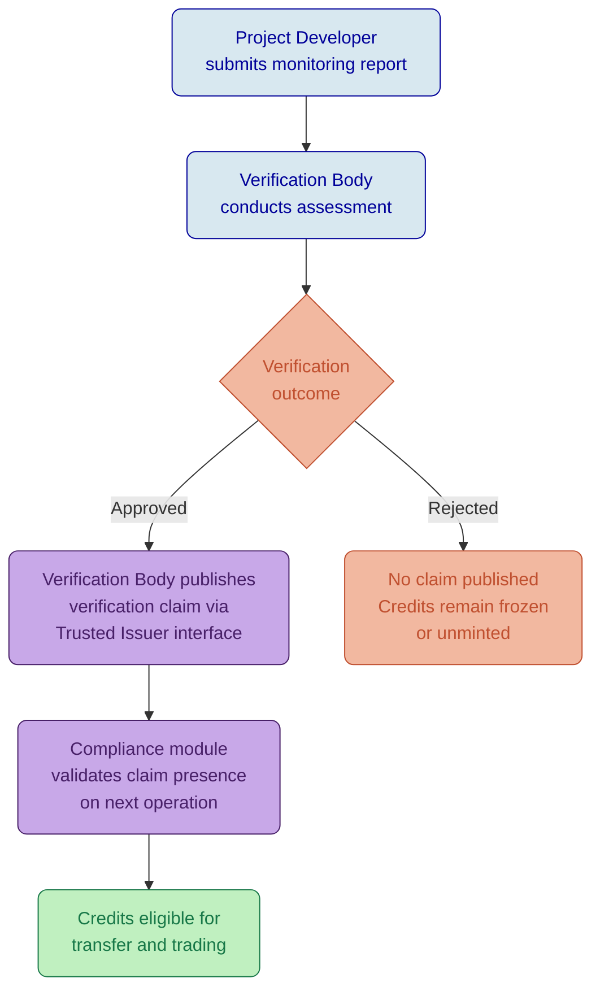

# Carbon Credits and ESG Assets on DALP

## Platform Capabilities for Voluntary Carbon Markets and Sustainability Instruments

---

## Executive Summary

Voluntary carbon markets are growing rapidly, but the infrastructure underpinning them remains fragmented, opaque, and vulnerable to double-counting. Registries like Verra (VCS) and Gold Standard maintain authoritative records of credit issuance and retirement, yet the operational layers between these registries and market participants rely on manual reconciliation, email-based transfers, and limited audit visibility. For institutional buyers seeking to meet net-zero commitments with defensible offset portfolios, this gap between registry integrity and operational execution creates real risk: credits that cannot be traced back to verified projects, retirement claims that lack immutable evidence, and vintage exposure that is difficult to monitor at portfolio scale.

DALP addresses these challenges by providing a configuration-driven tokenization platform where each carbon credit or ESG instrument is represented as a regulated digital asset with built-in compliance, identity verification, and lifecycle management. The platform does not replace existing registries. It sits alongside them, providing an operational and settlement layer where credits can be issued, transferred, retired, and tracked with the same governance rigour that institutional investors expect from traditional financial instruments.

This document examines how DALP's existing token architecture, compliance modules, and operational capabilities apply to carbon credits and ESG assets, covering retirement mechanics, registry integration patterns, vintage tracking, verification claims, and the specific honest boundaries of what is native platform capability versus what requires integration or customization.

---

## Retirement Mechanics

### The Core Challenge

Retirement is the defining lifecycle event for a carbon credit. Unlike financial securities where the lifecycle may include maturity or redemption, a carbon credit's terminal state is permanent retirement: the credit is taken out of circulation to represent an offset claim against a specific quantity of emissions. The integrity of the entire voluntary carbon market depends on retirement being irreversible, auditable, and impossible to double-count.

Two distinct operational models exist in practice. Permanent retirement burns the token, removing it from the circulating supply with finality. Temporary holding, by contrast, preserves the token in a custodial or escrow state while the holder evaluates the credit, negotiates a forward sale, or awaits verification of an associated project milestone. Both states must be distinguishable on-chain, because a credit that has been retired cannot re-enter the market, while a credit that is merely held in reserve must remain transferable under the right conditions.

### How DALP Addresses Retirement

DALP's token lifecycle provides native mechanisms for both retirement models through existing, audited features.

**Permanent retirement through burn.** The supply management role executes a burn operation on the holder's token balance, permanently removing the credit from circulation. Because every burn event is recorded immutably on-chain with a timestamp, the retiring entity's identity (resolved through the Identity Registry), and the quantity retired, the burn record serves as the primary evidence of retirement. The on-chain event log provides exactly the kind of immutable, timestamped, identity-linked evidence that auditors and regulators require when verifying offset claims. Circulating supply decreases by the retired amount, and the Historical Balances feature preserves a complete record of the credit's ownership history up to the point of retirement.

**Temporary holding through freeze.** The custodian role can freeze a specific quantity of tokens in a holder's wallet, preventing transfer while preserving the balance on record. This serves the "reserve" or "buffer pool" use case where credits are set aside for future retirement but have not yet been permanently extinguished. When the holder is ready to retire, the custodian unfreezes and the supply management role burns. When the hold is released for trading, the custodian simply unfreezes.

**Retirement certificate generation.** DALP does not natively generate PDF retirement certificates or interface with registry-specific certificate workflows. The platform provides the underlying data for certificate generation: the burn transaction hash, the retiring entity's verified identity, the quantity retired, the timestamp, and any metadata associated with the credit (project ID, vintage, methodology). An external certificate generation service can consume this data through DALP's API to produce certificates in whatever format the registry or buyer requires. This is an integration point, not a platform feature.

*Figure 1: DALP Dashboard displaying portfolio overview with real-time supply tracking. For carbon credit programs, the circulating supply metric directly reflects the number of active (unretired) credits in the system, while burn events reduce this figure as credits are retired.*

### Double-Counting Prevention

The combination of on-chain token uniqueness and ex-ante compliance enforcement provides strong double-counting protection at the platform level. Each token unit represents exactly one credit. Once burned, that unit cannot be re-minted or re-transferred. The Identity Registry ensures that every retirement is linked to a verified entity, preventing anonymous retirement claims that could obscure double-counting across counterparties.

However, double-counting prevention across platforms and registries is an ecosystem-level challenge, not a single-platform feature. If the same project's credits are tokenized on two different platforms without registry coordination, both platforms could independently track "valid" credits that collectively exceed the registry's issued quantity. DALP's collateral compliance module can enforce that tokenized supply does not exceed a registry-attested issuance amount (see Registry Integration below), but the enforcement depends on accurate and timely attestation data from the registry or a trusted auditor.

---

## Registry Integration

### Connecting to Verra, Gold Standard, and Other Registries

Carbon credit registries (Verra/VCS, Gold Standard, American Carbon Registry, Climate Action Reserve) are the authoritative source of truth for credit issuance, project validation, and retirement status. Any tokenization platform that operates independently of these registries risks creating credits that lack provenance or, worse, enabling credits to circulate after they have been retired in the registry.

DALP integrates with registries through two complementary mechanisms: the collateral compliance module for supply integrity, and the trusted issuer/claims system for project and verification attestations.

### Supply Integrity via Collateral Compliance

The CollateralComplianceModule can be configured to enforce that the total tokenized supply of a specific credit type does not exceed the quantity attested by a trusted third party. In the carbon credit context, this works as follows:

1. A trusted issuer (the registry's appointed auditor, or the registry itself if it provides on-chain attestations) publishes a collateral claim against the issuer's OnchainID contract, attesting to the number of verified credits available for tokenization.
2. The CollateralComplianceModule checks this claim before every mint operation. If minting the requested quantity would cause total supply to exceed the attested amount, the transaction reverts.
3. When credits are retired (burned) at the registry level, the trusted issuer updates the attestation downward to reflect the reduced available pool.

This model does not provide real-time, automated synchronization with registry databases. The attestation is manual or semi-automated, depending on the registry's API capabilities and the trusted issuer's operational workflow. The honest boundary is clear: DALP enforces the constraint; the trusted issuer provides the data. The platform cannot verify against the registry's internal records independently.

### Project and Verification Attestations via Claims

DALP's OnchainID and trusted issuer system provides the infrastructure for recording project-level verification data on-chain. For carbon credits, relevant claim topics include:

| Claim Topic | Purpose | Example Value |
|-------------|---------|---------------|
| Project ID | Links the credit to a specific registered project | "VCS-1234" |
| Methodology | The quantification methodology applied | "VM0007 (REDD+ MF)" |
| Verification Body | The third-party verifier that validated the project | "SCS Global Services" |
| Verification Date | When the most recent verification occurred | "2025-11-15" |
| SDG Alignment | Sustainable Development Goals the project addresses | "SDG 13, SDG 15" |
| Additionality Status | Whether the project demonstrates additionality | "Verified" |

These claims are published by trusted issuers (verification bodies, registry operators, or authorized auditors) against the token's identity. Compliance modules can then reference these claims when evaluating transfer eligibility. For example, a buyer's compliance policy might require that only credits with a valid verification claim from an approved verification body within the last 24 months are eligible for acquisition.

*Figure 2: DALP compliance policy templates showing configurable modules. For carbon credit programs, compliance templates define which verification claims are required, which registries are accepted as trusted issuers, and what transfer restrictions apply based on credit vintage or project type.*

### What Registry Integration Is Not

DALP does not provide pre-built API connectors to Verra, Gold Standard, or other specific registries. The platform's API surface supports integration with any system that can publish claims or attestation data, but the connector logic, authentication with registry APIs, and data mapping are integration work, not configuration. Proposal responses for carbon credit RFPs should position DALP as the operational and compliance layer, with registry integration as a defined integration project using DALP's API and trusted issuer infrastructure.

---

## Vintage Tracking

### Why Vintage Matters

In carbon markets, "vintage" refers to the year in which the emission reduction or removal occurred. Vintage is a critical pricing factor: recent vintage credits typically command premium pricing because they represent more current climate action, while older vintages may trade at a discount or face buyer resistance. Institutional buyers with formal offset policies often specify vintage windows (e.g., "credits must be vintage 2022 or later") to ensure their offset portfolio reflects recent climate impact.

### How DALP Tracks Vintage

DALP's configurable metadata schema provides the mechanism for vintage tracking at the token level. When defining a carbon credit instrument template, the issuer configures vintage-related metadata fields:

| Metadata Field | Type | Mutability | Purpose |
|----------------|------|------------|---------|
| Vintage Year | Number | Immutable | The year the emission reduction occurred |
| Serial Number Range | String | Immutable | Registry-assigned serial numbers for the batch |
| Project Vintage Start | String | Immutable | Start date of the crediting period |
| Project Vintage End | String | Immutable | End date of the crediting period |
| Registry Batch ID | String | Immutable | The registry's internal batch identifier |

Setting these fields as immutable ensures that vintage data cannot be altered after credit issuance, preserving the integrity of the provenance chain.

### Vintage-Based Pricing and Segregation

Two approaches exist for managing vintage-differentiated credits on DALP:

**Approach 1: Separate token per vintage.** Each vintage year is represented as a distinct DALPAsset deployment. A "Project Alpha VCS 2024" token and a "Project Alpha VCS 2023" token are separate instruments with separate compliance configurations, supply tracking, and pricing. This approach provides the cleanest segregation and allows different compliance rules per vintage (e.g., older vintages might face stricter transfer restrictions or buyer eligibility requirements). The Asset Factory enables rapid deployment of vintage-specific tokens, taking minutes per vintage rather than weeks.

**Approach 2: Single token with vintage metadata.** All vintages from a project are represented in a single token, with vintage recorded as metadata. This approach is simpler operationally but limits the ability to apply vintage-specific compliance rules or pricing at the smart contract level. Vintage-based pricing differentiation would need to be handled at the application layer rather than enforced on-chain.

For institutional carbon credit programs, Approach 1 is generally preferable because it preserves the ability to apply distinct compliance postures, pricing, and retirement tracking per vintage, which is how registries themselves track credits.

### Vintage in Compliance Decisions

When vintage-specific tokens are deployed, the compliance module system can enforce vintage-related transfer restrictions. For example, a TimeLock module could enforce a minimum holding period that varies by vintage age, or a Transfer Approval module could require additional governance approval for transfers of credits older than a specified vintage threshold. The Identity Verification module's RPN expression can reference vintage-related claims if the trusted issuer publishes vintage attestations as identity claims.

---

## Verification Claims and ESG Attestations

### The Verification Challenge

Carbon credits derive their value from verified emission reductions. Without credible verification, a credit is merely an assertion. The verification chain from project developer to buyer involves multiple attestation layers: project validation (confirming the methodology and baseline), periodic verification (confirming that reductions actually occurred), and ongoing monitoring (confirming continued project performance). Each layer involves distinct actors (validation/verification bodies, registry standards committees, project developers) and produces distinct evidence.

### DALP's Claims Architecture for Verification

DALP's OnchainID and claims system provides a natural framework for recording verification attestations. Each carbon credit token is linked to an OnchainID contract, and trusted issuers publish claims against this identity representing specific verification events.

**Trusted issuer model for verification bodies.** Each verification body (e.g., SCS Global Services, RINA, Bureau Veritas) is registered as a trusted issuer in the platform's Trusted Issuers Registry. When they complete a verification, they publish a claim attesting to the verification outcome, date, and scope. The compliance module system can then require that a valid verification claim from an approved issuer exists before any mint or transfer operation is permitted.

*Figure 3: DALP Trusted Issuers Registry showing configured verification authorities. For carbon credit programs, each accredited verification body is registered as a trusted issuer, enabling the compliance system to validate that credits carry attestations from recognized authorities.*

**Claim expiry for ongoing verification.** Claims in DALP can carry expiry dates. For carbon credits requiring periodic re-verification (e.g., REDD+ projects with five-year crediting periods), the claim expiry can be set to the next verification due date. When the claim expires, the compliance module will block transfers until a new verification claim is published. This creates an automatic compliance gate that ensures credits cannot circulate beyond their verified period without fresh attestation.

**SDG alignment and additionality.** Beyond core verification, ESG-focused buyers increasingly require evidence of co-benefits (SDG alignment) and additionality (proof that the emission reduction would not have occurred without the project). These are recorded as additional claim topics. A buyer's compliance policy can require specific SDG claims (e.g., SDG 13 Climate Action, SDG 15 Life on Land) before allowing acquisition.

### Verification Data Flow

The typical verification data flow for tokenized carbon credits on DALP follows this pattern:

*Figure 4: Verification data flow for tokenized carbon credits. Verification bodies publish attestation claims through DALP's trusted issuer interface, and the compliance module system validates these claims before permitting credit transfers.*

---

## Configuration Example: Voluntary Carbon Credit Program

A sustainability-focused asset manager launches a tokenized voluntary carbon credit program covering REDD+ forest conservation credits verified under the Verra VCS standard, with distribution to institutional ESG investors.

| Configuration | Value |
|---------------|-------|
| Asset Type | Equity (used for its flexible supply model) |
| Name | "Amazon REDD+ Carbon Credits VCS 2025" |
| Symbol | "ARCC25" |
| Decimals | 0 (whole credits) |
| Country Code | 076 (Brazil, project location) |
| Price Currency | USD |
| Base Price | 15.00 |
| **Token Features** | |
| Historical Balances | Point-in-time ownership snapshots for audit and reporting |
| Permit | Gasless approvals for institutional custody workflows |
| **Compliance Modules** | |
| Identity Verification | RPN expression: `[KYC, AML, AND]` |
| Country Allow List | OECD member states and Singapore |
| Investor Count | Global limit: 200 |
| Collateral Compliance | 10,000 bps (100%), registry attestation required before minting |

**Retirement workflow.** When a buyer retires credits against their emissions, the supply management role burns the corresponding tokens. The burn event, combined with the holder's verified identity from the Identity Registry, creates an on-chain retirement record. An external retirement certificate service can query this data via DALP's API to generate formal retirement documentation for the buyer's sustainability reporting.

**Vintage management.** Each vintage year is deployed as a separate token (ARCC24, ARCC25, ARCC26), enabling vintage-specific compliance and pricing. The Asset Factory allows new vintage tokens to be deployed in minutes with the same compliance template.

---

## Green Bonds and Sustainability-Linked Instruments

### Use-of-Proceeds Tracking

Green bonds and sustainability-linked bonds require credible tracking of how proceeds are deployed. DALP's approach to this requirement is honest about the boundary between platform capability and operational workflow.

**What DALP provides natively.** The Bond asset type with Fixed Treasury Yield and Maturity Redemption features handles the financial mechanics of the green bond instrument: coupon payments, maturity redemption, transfer compliance, and investor eligibility. The token's configurable metadata schema captures green bond framework references, use-of-proceeds categories (renewable energy, energy efficiency, sustainable transport), and external review status. These metadata fields create a permanent, immutable link between the digital instrument and its sustainability credentials.

**What requires external integration.** Actual use-of-proceeds tracking (verifying that EUR 50M of bond proceeds was deployed to a specific solar installation or green building project) is an operational accounting function, not an on-chain enforcement feature. DALP records the instrument's green classification and the issuer's sustainability attestations, but it does not independently verify that physical-world proceeds allocation matches the green bond framework. This verification relies on external assurance providers (e.g., Sustainalytics, ISS ESG) whose attestations can be recorded as claims through DALP's trusted issuer system.

**Sustainability-linked bond step-up mechanics.** Sustainability-linked bonds (SLBs) often include coupon step-up provisions where the coupon rate increases if the issuer misses a sustainability performance target (SPT). DALP's governed payout schedule allows the governance role to update the yield parameters, enabling the coupon adjustment when an SPT miss is confirmed. The SPT assessment itself is an off-chain event, but the coupon adjustment is executed on-chain through the governance workflow.

*Figure 5: DALP Asset Designer showing bond creation workflow. Green bonds and sustainability-linked bonds are configured using the standard Bond asset type, with sustainability-specific metadata fields added through the configurable metadata schema.*

---

## Honest Capability Boundaries

This section addresses specific carbon credit and ESG requirements that fall outside DALP's native capability or sit at the boundary between supported and unsupported.

### Registry-of-Record Synchronization

DALP does not provide real-time, bidirectional synchronization with external registries (Verra, Gold Standard, ACR). The platform can consume attestation data published by trusted issuers who have access to registry data, but the synchronization frequency, data mapping, and reconciliation logic are integration concerns. For programs where registry and on-chain records must remain synchronized in near-real-time, the integration architecture requires a middleware layer or registry-operated trusted issuer service.

### Retirement Certificate Generation

DALP provides the underlying retirement data (who retired, how much, when, which project and vintage) but does not generate formatted retirement certificates. Certificate generation is an external service that consumes DALP's event and API data. The platform provides all the data inputs; the formatting and distribution of certificates is outside its scope.

### Carbon Methodology Validation

DALP does not evaluate or validate carbon quantification methodologies (VM0007, AMS-III.D, etc.). The platform records methodology references as metadata and verification attestations as claims, but it has no internal logic to assess whether a methodology was correctly applied. This is the verification body's responsibility, recorded through the trusted issuer claims system.

### Offset Accounting and Scope 1/2/3 Integration

DALP does not include a greenhouse gas accounting module. The platform tracks credit issuance, ownership, transfer, and retirement, but it does not calculate emissions, attribute credits to specific scopes, or generate GHG inventory reports. Integration with carbon accounting platforms (Persefoni, Watershed, Salesforce Net Zero Cloud) would use DALP's API to export retirement data for incorporation into broader GHG accounting workflows.

### Physical Project Monitoring

IoT sensor data from project sites (forest canopy monitoring, methane capture rates, renewable energy generation) is outside DALP's scope. The platform's data feeds module can consume external data published by authorized sources, but DALP does not interface directly with IoT devices or project monitoring systems.

---

## Monitoring and Reporting

DALP's monitoring infrastructure provides the operational visibility that carbon credit program managers need.

**Portfolio-level supply tracking.** The dashboard displays real-time circulating supply, total minted, and total burned (retired) across all credit tokens. For carbon credit programs, the burned supply metric directly represents the program's total retirements, providing an at-a-glance view of offset delivery.

**Transaction audit trail.** Every issuance, transfer, and retirement event is recorded with full provenance: the identity of the parties involved, the timestamp, the transaction hash, and the compliance modules that evaluated and approved the operation. This audit trail satisfies the evidentiary requirements of voluntary carbon market standards and supports external audit processes.

**Identity-linked reporting.** Because every participant in a DALP-managed carbon credit program has a verified on-chain identity, reporting can be aggregated by entity, jurisdiction, investor type, or project. This enables the program manager to produce reports showing, for example, total retirements by country, or credits held by investor category.

*Figure 6: DALP blockchain monitoring dashboard showing network health and transaction activity. For carbon credit programs, monitoring provides real-time visibility into credit issuance rates, transfer volumes, and retirement activity across the network.*

---

## Summary

DALP's configuration-driven architecture provides a credible foundation for tokenized carbon credit and ESG asset programs. The platform's strengths in this domain are the same strengths it brings to any regulated asset class: configurable compliance that enforces rules before execution, identity-verified participants with auditable claims from trusted issuers, immutable lifecycle tracking from issuance through retirement, and the ability to deploy new credit vintages or project types in hours rather than months.

The honest boundaries are equally clear. DALP is an operational and compliance platform for tokenized assets, not a carbon registry, not a GHG accounting system, and not a project monitoring tool. It excels at the layer between registry attestation and market participant, providing the governance, settlement, and audit infrastructure that institutional carbon credit programs require. Registry integration, certificate generation, and carbon accounting are integration opportunities that DALP's API surface and trusted issuer system are designed to support, but they are not shipped features.

For institutions evaluating tokenization platforms for carbon credit programs, the relevant question is not whether the platform replaces their registry or accounting systems. It is whether the platform provides the compliance, identity, and lifecycle infrastructure that turns a registry entry into a tradeable, retirable, auditable digital instrument. That is what DALP delivers.
