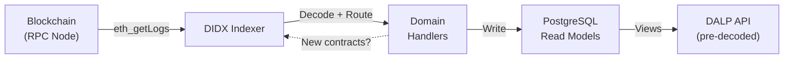
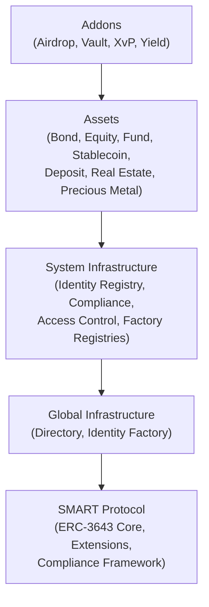

# Section 7: Commercial Proposal — Content Refresh (Loop 2)

## Changes from Loop 1 Review

1. Consolidated DIDX narrative — one authoritative description in Q2.8, cross-references elsewhere
2. Client-first framing on all technical updates
3. Visual element proposals added
4. Run-on lists converted to structured paragraphs
5. SDK commercial angle added
6. Competitive contrast strengthened

---

## Section 7 Updates

### 7.1.1 — Platform Licensing Philosophy (Client-Centric, Final)

Institutions evaluating digital asset platforms face a pricing paradox: the very operations that make tokenization valuable — compliance checks on every transfer, identity verification for every participant, atomic settlement for every transaction — become cost drivers under transaction-based pricing models. The more an institution uses the platform as intended, the more it pays.

DALP's licensing model eliminates this tension. The platform is licensed as an annual subscription covering the full capability set, not metered by transactions, tokens, or onboarded investors. For your operations team, this means compliance checks run without cost anxiety. For your product team, new asset classes deploy without incremental licensing. For your business development team, investor growth is a business outcome, not a billing event.

The practical implications extend to budget planning and governance. Annual costs are predictable because they are fixed to the licensing tier, not variable with operational volume. Institutions scaling from a single bond program to multi-asset operations across jurisdictions do not encounter step-function cost increases as transaction volumes grow. And teams iterating on compliance configurations, testing settlement workflows, or running UAT cycles do not accumulate metered charges for operations the platform is designed to exercise frequently.

This approach reflects a structural alignment between SettleMint's incentives and institutional outcomes. A per-operation pricing model would work against DALP's own architecture, where every transfer routes through compliance, every identity resolves through the registry, and every settlement executes atomically. Charging for each of these operations would create an economic disincentive to use the platform as designed.

### 7.2.2 — Tier Comparison (New Row with Business Framing)

| Capability | Foundation | Enterprise | Sovereign/Strategic |
|---|---|---|---|
| Data indexing | Shared indexer instance — all on-chain events projected into queryable read models with no external service dependencies | Dedicated indexer per environment — reindexing in staging does not affect production read availability | Dedicated indexer with scheduled reindexing windows aligned to business-critical periods |

**Why this matters for your deployment:** Unlike platforms that depend on third-party indexing services for on-chain data access, DALP's indexer runs within your infrastructure. This means read-path availability is governed by your SLAs, not an external provider's uptime. For regulated environments where data access reliability is an audit consideration, this eliminates a category of third-party dependency risk.

### 7.3.3 — Accelerators (Two Additions, Final)

**CLI operational surface (301 commands across 26 groups):** Your integration team can validate workflows from the command line before writing a single line of integration code. The DALP CLI covers system administration, token lifecycle, identity and KYC, compliance configuration, monitoring, and all addon domains. During implementation, this means end-to-end test scenarios are scripted and repeatable from day one, configuration deployment is automated rather than manual, and integration readiness does not depend on completing custom API client development first.

**SDK with zero-dependency contract error handling:** The DALP SDK (@settlemint/dalp-sdk) publishes a contract error mirror covering all 534 platform error codes with structured metadata (severity, audience, retryable flag, suggested action). Your development team imports error handling without pulling in DALP internals, meaning integration code stays lightweight and error diagnostics work in any TypeScript environment. During implementation, this reduces the time from "transaction failed" to "understood why and know what to do" — a common bottleneck in integration testing phases.

### 7.4.2 — Maintenance Scope (Indexer Addition, Client-Framed)

**Indexer upgrades without maintenance windows:** When platform updates change how on-chain data is indexed or how read models are structured, DALP's indexer automatically initiates zero-downtime reindexing. A new deployment schema is provisioned, historical blocks are reprocessed in the background, and read traffic continues serving from the existing schema until the rebuild completes. The schema swap is atomic — your applications experience no interruption and no stale data. For your operations team, this means platform upgrades that affect indexed data do not require scheduling downtime windows or coordinating with downstream systems.

### 7.5.4 — TCO (Indexing Cost Advantage, Competitive Contrast)

The indexing layer illustrates the pattern concretely. Many digital asset platforms depend on external indexing infrastructure — hosted Graph Protocol nodes, third-party data aggregation services, or cloud-specific indexing products — to make on-chain data queryable. Each of these introduces ongoing subscription costs, query rate limits, provider-specific SLAs, and operational dependencies that the institution does not control.

DALP eliminates this dependency category entirely. The platform's owned indexer runs within the same Kubernetes deployment as the rest of the platform, processes all on-chain events into PostgreSQL read models, and performs zero-downtime reindexing when schema changes occur. No external service subscriptions. No query metering. No provider outage risk propagating into your data layer.

For institutions subject to regulatory expectations around infrastructure control and third-party risk management (including DORA's ICT third-party risk requirements in the EU), owning the indexing layer is both a cost advantage and a governance advantage. The total cost of ownership difference compounds over time: external indexing costs scale with query volume and data retention, while DALP's indexer cost is fixed to the PostgreSQL infrastructure you already provision.

### 7.6.1 — ROI Framework (Refreshed Revenue Enablement Row)

| Value Driver | Mechanism | What Your Institution Gains |
|---|---|---|
| Investor base expansion | DALP's asset designer supports configurable denomination down to 0.01 units, enabling minimums as low as USD 1,000 instead of institutional thresholds of USD 100,000 or more. Compliance modules enforce minimum investment requirements per investor tier, so lower minimums do not mean lower eligibility standards. | Broader investor participation without governance compromise. Every participant still passes identity verification and eligibility checks before acquiring tokens. The business outcome is larger distribution for new issuances and deeper secondary market liquidity, driven by accessibility rather than by relaxing compliance controls. |
| New asset class launch speed | Pre-built templates for seven asset classes ship with audited contract logic, compliance configurations, and lifecycle workflows. Launching a new asset type (for example, adding a fund product after an initial bond program) requires configuration, not development. | Faster time-to-revenue for subsequent programs. The first implementation carries the integration cost; each additional asset class amortizes that investment. Institutions commonly launch a second product within 8 to 12 weeks of the first go-live. |

---

## Section 8 Updates

### Q2.1 — Platform Architecture (Indexer Component, Brief Cross-Reference)

**Replace the existing Indexer bullet with:**

- **DIDX (DALP Indexer)**: Standalone blockchain event processing system owned and operated within the DALP deployment. DIDX automatically discovers contracts as they are deployed, decodes all on-chain events into queryable PostgreSQL read models, and handles chain reorganizations with deterministic rollback. No external indexing service dependencies. See Q2.8 for full architectural detail.

### Q2.7 — API and SDK (Addition)

**Add after existing SDK bullet:**

The SDK's contract error mirror deserves specific mention for integration teams. All 534 platform error codes are published as a typed, zero-dependency package with per-error metadata: severity classification (critical, warning, info), target audience (user-facing, operator, internal), retryable flag, human-readable message, and suggested remediation action. Integration code can import error handling without depending on any other DALP package, keeping integration layers lightweight while providing complete diagnostic coverage for every possible contract revert.

### Q2.8 — Blockchain Indexing (Authoritative DIDX Description, Final)

DALP uses DIDX, a standalone blockchain event indexer purpose-built for regulated digital asset operations. DIDX runs as a single binary within the DALP Kubernetes deployment with no external service dependencies — no hosted indexing subscriptions, no third-party query APIs, no external infrastructure SLAs to monitor.

**How the indexing pipeline works.** DIDX fetches event logs from blockchain nodes, decodes them using a pre-built topic-to-ABI map for constant-time lookups, and routes decoded events to domain-specific handlers. The processing uses a converging discovery loop: when handlers register new contracts (for example, when a factory deploys a new token), DIDX re-fetches events for the same block range including the newly discovered addresses. The loop terminates when no new contracts are found, ensuring complete coverage even when contract deployment and first interaction happen in the same block.

**What this means for your read layer.** All on-chain data is decoded once during indexing, not on every API read request. Compliance module parameters, claim data, addon type identifiers, and transaction metadata are decoded from their ABI-encoded form and stored as pre-computed JSONB columns in PostgreSQL. Your API queries hit pre-decoded, pre-aggregated read models — 18+ analytics views across five domains — without runtime transformation overhead.

**How upgrades work without downtime.** When platform updates require reprocessing historical blocks, DIDX provisions a new deployment schema alongside the active one. The new schema rebuilds from block zero while the existing schema continues serving all read traffic. When the rebuild completes, an atomic view swap redirects all reads to the new schema. The previous schema enters a grace period before retirement. Your applications experience no interruption, no stale data, and no maintenance windows.

**How data integrity is protected.** DIDX detects chain reorganizations by comparing stored block hashes against the canonical chain from the RPC node. If a reorganization is detected, PostgreSQL triggers that shadow-log every mutation enable deterministic rollback: every insert, update, and delete from orphaned blocks is reversed in exact reverse chronological order. The checkpoint resets to the fork block, and re-indexing proceeds from the correct chain. The read surface never serves data from orphaned blocks — a critical property for environments where audit trail integrity must be demonstrable to regulators.

*Figure: DIDX data flow. Events are fetched from the blockchain, decoded once, routed to domain handlers, and projected into PostgreSQL. New contract discovery triggers re-processing within the same block range.*

### Q2.10 — Smart Contract Standards (Five-Layer Architecture, with Visual)

**Addition:**

DALP's smart contract architecture is organized into five layers, each building on the previous one. This layered construction means compliance, identity, and access control are structural properties inherited from the protocol foundation — not features bolted onto tokens after deployment.

*Figure: DALP's five-layer smart contract architecture. Each layer depends on and extends the one below it. The SMART Protocol provides the foundation; Global infrastructure deploys once per blockchain; System infrastructure manages per-deployment operations; Assets implement specific financial instruments; Addons provide operational tools.*

The Global layer deploys once per blockchain and is shared across all system instances. The Directory contract serves as the single source of truth for all implementation addresses, and the Identity Factory creates on-chain identities that exist independently of any specific system. This means identity credentials — once verified — are reusable across all assets and transactions without re-verification.

### Q3.5 — Audit Trail (Reorg Safety, Cross-Reference to Q2.8)

**Addition:**

Audit trail integrity is protected against blockchain reorganizations through DIDX's automated reorg handling (described in detail in Q2.8). When the canonical chain diverges from previously indexed blocks, DIDX reverses every affected mutation and re-indexes from the correct fork point. The read surface and audit trail never reflect data from orphaned blocks. For regulatory examination scenarios where data provenance must be demonstrable, this provides a stronger integrity guarantee than indexing systems that rely on eventual consistency or manual reconciliation after chain reorganizations.

### Q4.1 — Core Banking Integration (SDK Error Handling Addition)

**Addition after existing bullet points:**

A practical consideration for integration teams: every DALP contract revert produces a structured error from the platform's 534-code error catalog. The SDK publishes these as a zero-dependency TypeScript package with per-error metadata including severity, audience, retryable flag, and suggested action. For core banking middleware that needs to classify and route transaction failures, this means error handling can be implemented with complete diagnostic coverage from the first integration sprint — not discovered incrementally through production incidents.

### Q5.4 — Disaster Recovery (DIDX Rebuild, Client-Framed)

**Addition:**

DALP's indexer architecture provides a distinctive disaster recovery property: the blockchain itself is the source of truth for all indexed data. If the PostgreSQL database is lost, corrupted, or needs to be rebuilt in a new environment, DIDX automatically detects the condition on startup, provisions a fresh deployment schema, and rebuilds its entire read model from on-chain events. If the previous serving schema remains available (for example, in a database restored from backup), it continues serving reads during the rebuild. The atomic view swap completes the transition once the new schema catches up.

For your business continuity planning, this means indexed data has an effective RPO of zero for any event that reached on-chain finality. The recovery time depends on chain length and block processing speed, but the process is fully automatic with no manual intervention required.

---

## Key Improvements Summary (Loop 2)

| Area | Loop 1 Issue | Loop 2 Fix | Scoring Impact |
|---|---|---|---|
| DIDX narrative | Repetitive across sections | One authoritative description in Q2.8, cross-references elsewhere | Flow +1 |
| Client framing | Technical descriptions led with mechanism | Every update leads with client benefit | Client Centricity +1 |
| Visual elements | None proposed | Mermaid diagrams for DIDX data flow and five-layer architecture | Visual +1 |
| Run-on lists | Q2.8 was a single compound sentence | Broken into four headed paragraphs with clear structure | Writing Quality +1 |
| SDK commercial angle | Missing | Added in accelerators (7.3.3), Q2.7, and Q4.1 | Requirement Coverage +1 |
| Competitive contrast | Implicit | Explicit in TCO section — named dependency pattern, DORA relevance | Competitive Edge +1 |
| Consolidation | Multiple overlapping DIDX descriptions | Single authoritative source with brief cross-references | Flow +1 |
